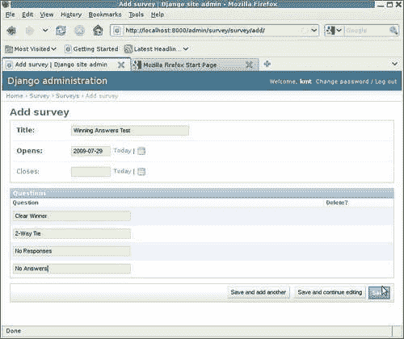
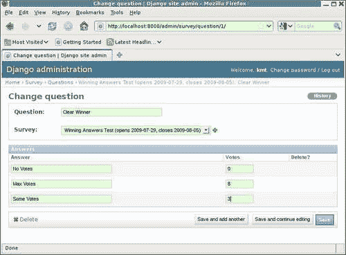
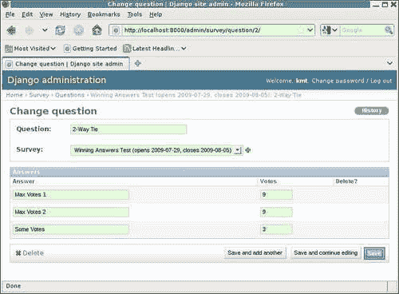
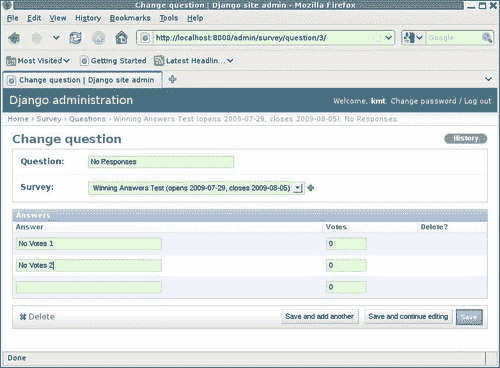

# 第三章：测试 1, 2, 3：基本单元测试

在上一章中，我们开始通过为`Survey`模型编写一些 doctests 来学习测试 Django 应用程序。在这个过程中，我们体验了 doctests 的一些优点和缺点。在讨论一些缺点时，提到了单元测试作为避免一些 doctest 陷阱的替代测试方法。在本章中，我们将开始详细学习单元测试。具体来说，我们将：

+   将`Survey`的 doctests 重新实现为单元测试

+   评估等效的单元测试版本在实现的便利性和对上一章讨论的 doctest 注意事项的敏感性方面与 doctests 相比如何

+   在扩展现有测试以覆盖其他功能时，开始学习单元测试的一些附加功能

# `Survey`保存覆盖方法的单元测试

回想在上一章中，我们最终实现了对`Survey`保存覆盖功能的四个单独测试：

+   对添加的功能进行直接测试，验证如果在创建`Survey`时未指定`closes`，则自动设置为`opens`之后的一周

+   验证如果在创建时明确指定了`closes`，则不会执行此自动设置操作的测试

+   验证只有在初始创建时其值缺失时，才会自动设置`closes`的测试

+   验证`save`覆盖功能在创建时既未指定`opens`也未指定`closes`的错误情况下不会引入意外异常的测试

要将这些实现为单元测试而不是 doctests，请在`suvery/tests.py`文件中创建一个`TestCase`，替换示例`SimpleTest`。在新的`TestCase`类中，将每个单独的测试定义为该`TestCase`中的单独测试方法，如下所示：

```py
import datetime
from django.test import TestCase 
from django.db import IntegrityError 
from survey.models import Survey 

class SurveySaveTest(TestCase): 
    t = "New Year's Resolutions" 
    sd = datetime.date(2009, 12, 28) 

    def testClosesAutoset(self): 
        s = Survey.objects.create(title=self.t, opens=self.sd) 
        self.assertEqual(s.closes, datetime.date(2010, 1, 4))

    def testClosesHonored(self):
        s = Survey.objects.create(title=self.t, opens=self.sd, closes=self.sd) 
        self.assertEqual(s.closes, self.sd) 

    def testClosesReset(self): 
        s = Survey.objects.create(title=self.t, opens=self.sd) 
        s.closes = None 
        self.assertRaises(IntegrityError, s.save) 

    def testTitleOnly(self): 
        self.assertRaises(IntegrityError, Survey.objects.create, title=self.t) 
```

这比 doctest 版本更难实现，不是吗？无法直接从 shell 会话中剪切和粘贴，需要添加大量代码开销——在 shell 会话中没有出现的代码。我们仍然可以从 shell 会话中剪切和粘贴作为起点，但是我们必须在粘贴后编辑代码，以将粘贴的代码转换为适当的单元测试。虽然不难，但可能会很乏味。

大部分额外工作包括选择各个测试方法的名称，对剪切和粘贴的代码进行微小编辑以正确引用类变量，如`t`和`sd`，以及创建适当的测试断言来验证预期结果。其中第一个需要最多的脑力（选择好的名称可能很难），第二个是微不足道的，第三个是相当机械的。例如，在我们的 shell 会话中：

```py
>>> s.closes 
datetime.date(2010, 1, 4) 
>>> 

```

在单元测试中，我们有一个`assertEqual`：

```py
self.assertEqual(s.closes, datetime.date(2010, 1, 4))
```

预期的异常类似，但使用`assertRaises`。例如，在 shell 会话中，我们有：

```py
>>> s = Survey.objects.create(title=t) 
Traceback (most recent call last): 
 [ traceback details snipped ]
IntegrityError: survey_survey.opens may not be NULL 
>>> 

```

在单元测试中，这是：

```py
self.assertRaises(IntegrityError, Survey.objects.create, title=self.t)
```

请注意，我们实际上没有在我们的单元测试代码中调用`create`例程，而是将其留给`assertRaises`内的代码。传递给`assertRaises`的第一个参数是预期的异常，后跟可预期引发异常的可调用对象，后跟在调用它时需要传递给可调用对象的任何参数。

## 单元测试版本的优点

从这项额外工作中我们得到了什么？当以最高详细级别运行时，我们从测试运行器中获得了更多反馈。对于 doctest 版本，`manage.py test survey -v2`的输出只是：

```py
Doctest: survey.models.Survey.save ... ok 
```

在单元测试中，我们为每个测试方法报告单独的结果：

```py
testClosesAutoset (survey.tests.SurveySaveTest) ... ok 
testClosesHonored (survey.tests.SurveySaveTest) ... ok 
testClosesReset (survey.tests.SurveySaveTest) ... ok 
testTitleOnly (survey.tests.SurveySaveTest) ... ok 

```

如果我们再付出一点努力，并为我们的测试方法提供单行文档字符串，我们甚至可以从测试运行器中获得更详细的结果。例如，如果我们这样添加文档字符串：

```py
class SurveySaveTest(TestCase): 
    """Tests for the Survey save override method""" 
    t = "New Year's Resolutions" 
    sd = datetime.date(2009, 12, 28) 

    def testClosesAutoset(self): 
        """Verify closes is autoset correctly""" 
        s = Survey.objects.create(title=self.t, opens=self.sd) 
        self.assertEqual(s.closes, datetime.date(2010, 1, 4)) 

    def testClosesHonored(self): 
        """Verify closes is honored if specified""" 
        s = Survey.objects.create(title=self.t, opens=self.sd, closes=self.sd) 
        self.assertEqual(s.closes, self.sd)

    def testClosesReset(self): 
        """Verify closes is only autoset during initial create""" 
        s = Survey.objects.create(title=self.t, opens=self.sd) 
        s.closes = None 
        self.assertRaises(IntegrityError, s.save) 

    def testTitleOnly(self): 
        """Verify correct exception is raised in error case""" 
        self.assertRaises(IntegrityError, Survey.objects.create, title=self.t) 
```

然后，此测试的测试运行器输出将是：

```py
Verify closes is autoset correctly ... ok 
Verify closes is honored if specified ... ok 
Verify closes is only autoset during initial create ... ok 
Verify correct exception is raised in error case ... ok 

```

这种额外的描述性细节在所有测试通过时可能并不那么重要，但当测试失败时，它可能非常有助于作为测试试图实现的线索。

例如，假设我们已经破坏了`save`覆盖方法，忽略了向`opens`添加七天，因此如果未指定`closes`，它将自动设置为与`opens`相同的值。使用测试的 doctest 版本，失败将被报告为：

```py
====================================================================== 
FAIL: Doctest: survey.models.Survey.save 
---------------------------------------------------------------------- 
Traceback (most recent call last): 
 File "/usr/lib/python2.5/site-packages/django/test/_doctest.py", line 2180, in runTest 
 raise self.failureException(self.format_failure(new.getvalue())) 
AssertionError: Failed doctest test for survey.models.Survey.save 
 File "/dj_projects/marketr/survey/models.py", line 10, in save 

---------------------------------------------------------------------- 
File "/dj_projects/marketr/survey/models.py", line 19, in survey.models.Survey.save 
Failed example: 
 s.closes 
Expected: 
 datetime.date(2010, 1, 4) 
Got: 
 datetime.date(2009, 12, 28) 

```

这并没有提供有关出了什么问题的详细信息，您真的必须阅读完整的测试代码才能看到正在测试什么。与单元测试报告的相同失败更具描述性，因为`FAIL`标题包括测试文档字符串，因此我们立即知道问题与`closes`的自动设置有关：

```py
====================================================================== 
FAIL: Verify closes is autoset correctly 
---------------------------------------------------------------------- 
Traceback (most recent call last): 
 File "/dj_projects/marketr/survey/tests.py", line 20, in testClosesAutoset 
 self.assertEqual(s.closes, datetime.date(2010, 1, 4)) 
AssertionError: datetime.date(2009, 12, 28) != datetime.date(2010, 1, 4) 

```

我们可以进一步迈出一步，通过在调用`assertEqual`时指定自己的错误消息，使错误消息更友好：

```py
    def testClosesAutoset(self):
        """Verify closes is autoset correctly"""
        s = Survey.objects.create(title=self.t, opens=self.sd)
        self.assertEqual(s.closes, datetime.date(2010, 1, 4), 
            "closes not autoset to 7 days after opens, expected %s, ""actually %s" % 
            (datetime.date(2010, 1, 4), s.closes))
```

然后报告的失败将是：

```py
====================================================================== 
FAIL: Verify closes is autoset correctly 
---------------------------------------------------------------------- 
Traceback (most recent call last): 
 File "/dj_projects/marketr/survey/tests.py", line 22, in testClosesAutoset 
 (datetime.date(2010, 1, 4), s.closes)) 
AssertionError: closes not autoset to 7 days after opens, expected 2010-01-04, actually 2009-12-28 

```

在这种情况下，自定义错误消息可能并不比默认消息更有用，因为这里`save`覆盖应该做的事情非常简单。然而，对于更复杂的测试断言，这样的自定义错误消息可能是有价值的，以帮助解释正在测试的内容以及预期结果背后的“为什么”。

单元测试的另一个好处是，它们允许比 doctests 更有选择性地执行测试。在`manage.py test`命令行上，可以通过`TestCase`名称标识要执行的一个或多个单元测试。甚至可以指定只运行`TestCase`中的特定方法。例如：

```py
python manage.py test survey.SurveySaveTest.testClosesAutoset 
```

在这里，我们指示只想在`survey`应用程序中找到的`SurveySaveTest`单元测试中运行`testClosesAutoset`测试方法。在开发测试时，能够仅运行单个方法或单个测试用例是非常方便的时间节省器。

## 单元测试版本的缺点

切换到单元测试是否有所损失？有一点。首先，已经提到的实施便利性：单元测试需要比 doctests 更多的工作来实施。虽然通常不是困难的工作，但可能会很乏味。这也是可能出现错误的工作，导致需要调试测试代码。这种增加的实施负担可能会阻止编写全面的测试。

我们还失去了将测试与代码放在一起的好处。在上一章中提到，这是将一些 doctests 从文档字符串移出并放入`tests.py`中的`__test__`字典的一个负面影响。由于单元测试通常保存在与被测试的代码分开的文件中，因此通常看不到靠近代码的测试，这可能会阻止编写测试。使用单元测试时，除非采用测试驱动开发等方法，否则“视而不见”效应很容易导致编写测试成为事后想法。

最后，我们失去了 doctest 版本的内置文档。这不仅仅是来自文档字符串的自动生成文档的潜力。Doctests 通常比单元测试更易读，其中只是测试开销的多余代码可能会掩盖测试的意图。但请注意，使用单元测试并不意味着您必须放弃 doctests；在应用程序中同时使用这两种测试是完全可以的。每种测试都有其优势，因此对于许多项目来说，最好是在所有测试中使用一种类型，而不是依赖单一类型。

# 重新审视 doctest 的注意事项

在上一章中，我们列出了编写文档测试时需要注意的事项。在讨论这些事项时，有时会提到单元测试作为一个不会遇到相同问题的替代方法。但是单元测试是否真的免疫于这些问题，还是只是使问题更容易避免或解决？在本节中，我们重新审视文档测试的警告，并考虑单元测试对相同或类似问题的敏感程度。

## 环境依赖

讨论的第一个文档测试警告是环境依赖：依赖于实际被测试的代码以外的代码的实现细节。尽管单元测试也可能出现这种依赖，但发生的可能性较小。这是因为这种依赖的非常常见的方式是依赖于对象的打印表示，因为它们在 Python shell 会话中显示。单元测试与 Python shell 相去甚远。在单元测试中需要一些编码工作才能获得对象的打印表示，因此这种形式的环境依赖很少会出现在单元测试中。

第二章中提到的一种常见的环境依赖形式也影响到了单元测试，涉及文件路径名。单元测试和文档测试一样，需要注意跨操作系统的文件路径名约定差异，以防在不同于最初编写测试的操作系统上运行测试时导致虚假的测试失败。因此，尽管单元测试不太容易出现环境依赖问题，但它们并非完全免疫。

## 数据库依赖

数据库依赖是 Django 应用程序特别常见的一种环境依赖形式。在文档测试中，我们看到测试的初始实现依赖于伴随`IntegrityError`的消息的具体内容。为了使文档测试在多个不同的数据库上通过，我们需要修改初始测试以忽略此消息的细节。

我们在单元测试版本中没有这个问题。用于检查预期异常的`assertRaises`已经不考虑异常消息的细节。例如：

```py
self.assertRaises(IntegrityError, s.save)
```

那里没有包含具体的消息，所以我们不需要做任何事情来忽略来自不同数据库实现的消息差异。

此外，单元测试使处理比消息细节更广泛的差异变得更容易。在上一章中指出，对于 MySQL 的某些配置，忽略消息细节不足以使所有测试通过。在这里出现问题的测试是确保`closes`仅在初始模型创建期间自动设置的测试。这个测试的单元测试版本是：

```py
def testClosesReset(self): 
    """Verify closes is only autoset during initial create""" 
    s = Survey.objects.create(title=self.t, opens=self.sd) 
    s.closes = None 
    self.assertRaises(IntegrityError, s.save) 
```

如果在运行在非严格模式下的 MySQL 服务器上运行此测试，则此测试将失败。在此模式下，MySQL 在尝试将行更新为包含在声明为`NOT NULL`的列中包含`NULL`值时不会引发`IntegrityError`。相反，该值将设置为隐式默认值，并发出警告。因此，当我们在配置为在非严格模式下运行的 MySQL 服务器上运行此测试时，我们会看到测试错误：

```py
====================================================================== 
ERROR: Verify closes is only autoset during initial create 
---------------------------------------------------------------------- 
Traceback (most recent call last): 
 File "/dj_projects/marketr/survey/tests.py", line 35, in testClosesReset 
 self.assertRaises(IntegrityError, s.save) 
 File "/usr/lib/python2.5/unittest.py", line 320, in failUnlessRaises 
 callableObj(*args, **kwargs) 
 File "/dj_projects/marketr/survey/models.py", line 38, in save 
 super(Survey, self).save(**kwargs) 
 File "/usr/lib/python2.5/site-packages/django/db/models/base.py", line 410, in save 
 self.save_base(force_insert=force_insert, force_update=force_update) 
 File "/usr/lib/python2.5/site-packages/django/db/models/base.py", line 474, in save_base 
 rows = manager.filter(pk=pk_val)._update(values) 
 File "/usr/lib/python2.5/site-packages/django/db/models/query.py", line 444, in _update 
 return query.execute_sql(None) 
 File "/usr/lib/python2.5/site-packages/django/db/models/sql/subqueries.py", line 120, in execute_sql 
 cursor = super(UpdateQuery, self).execute_sql(result_type) 
 File "/usr/lib/python2.5/site-packages/django/db/models/sql/query.py", line 2369, in execute_sql 
 cursor.execute(sql, params) 
 File "/usr/lib/python2.5/site-packages/django/db/backends/mysql/base.py", line 84, in execute 
 return self.cursor.execute(query, args) 
 File "/var/lib/python-support/python2.5/MySQLdb/cursors.py", line 168, in execute 
 if not self._defer_warnings: self._warning_check() 
 File "/var/lib/python-support/python2.5/MySQLdb/cursors.py", line 82, in _warning_check 
 warn(w[-1], self.Warning, 3) 
 File "/usr/lib/python2.5/warnings.py", line 62, in warn 
 globals) 
 File "/usr/lib/python2.5/warnings.py", line 102, in warn_explicit 
 raise message 
Warning: Column 'closes' cannot be null 

```

在这里，我们看到 MySQL 发出的警告导致引发了一个简单的`Exception`，而不是`IntegrityError`，因此测试报告了一个错误。

这里还有一个额外的问题需要考虑：当 MySQL 发出警告时引发`Exception`的行为取决于 Django 的`DEBUG`设置。只有在`DEBUG`为`True`时（就像先前运行的测试一样），MySQL 警告才会转换为引发的`Exception`。如果我们在`settings.py`中将`DEBUG`设置为`False`，我们会看到另一种形式的测试失败：

```py
====================================================================== 
FAIL: Verify closes is only autoset during initial create 
---------------------------------------------------------------------- 
Traceback (most recent call last): 
 File "/dj_projects/marketr/survey/tests.py", line 35, in testClosesReset 
 self.assertRaises(IntegrityError, s.save) 
AssertionError: IntegrityError not raised 

```

在这种情况下，MySQL 允许保存，由于 Django 没有打开`DEBUG`，因此没有将 MySQL 发出的警告转换为`Exception`，因此保存工作正常进行。

在这一点上，我们可能会认真质疑是否值得在所有这些不同的情况下让这个测试正常运行，考虑到观察到的行为差异很大。也许我们应该要求，如果代码在 MySQL 上运行，服务器必须配置为严格模式。然后测试就会很好，因为以前的失败都会发出服务器配置问题的信号。但是，让我们假设我们确实需要支持在 MySQL 上运行，但我们不能对 MySQL 施加任何特定的配置要求，我们仍然需要验证我们的代码是否对这个测试行为正常。我们该怎么做呢？

请注意，我们试图在这个测试中验证的是，如果在初始创建后将`closes`重置为`None`，我们的代码不会自动将其设置为某个值。起初，似乎只需检查尝试保存时是否出现`IntegrityError`就可以轻松完成这个任务。然而，我们发现了一个数据库配置，我们在那里没有得到`IntegrityError`。此外，根据`DEBUG`设置，即使我们的代码行为正确并在尝试保存期间将`closes`保持为`None`，我们也可能不会报告任何错误。我们能写一个测试来报告正确的结果吗？也就是说，我们的代码在所有这些情况下是否表现正常？

答案是肯定的，只要我们能在我们的测试代码中确定正在使用的数据库，它是如何配置的，以及`DEBUG`设置是什么。然后，我们只需要根据测试运行的环境改变预期的结果。实际上，我们可以通过一些工作测试所有这些事情：

```py
    def testClosesReset(self): 
        """Verify closes is only autoset during initial create""" 
        s = Survey.objects.create(title=self.t, opens=self.sd) 
        s.closes = None 

        strict = True 
        debug = False
        from django.conf import settings 
        if settings.DATABASE_ENGINE == 'mysql': 
            from django.db import connection 
            c = connection.cursor() 
            c.execute('SELECT @@SESSION.sql_mode') 
            mode = c.fetchone()[0] 
            if 'STRICT' not in mode: 
                strict = False; 
                from django.utils import importlib
                debug = importlib.import_module(settings.SETTINGS_MODULE).DEBUG

        if strict: 
            self.assertRaises(IntegrityError, s.save) 
        elif debug: 
            self.assertRaises(Exception, s.save) 
        else: 
            s.save() 
            self.assertEqual(s.closes, None) 
```

测试代码首先假设我们正在运行在严格模式下操作的数据库，并将本地变量`strict`设置为`True`。我们还假设`DEBUG`是`False`并设置一个本地变量来反映这一点。然后，如果正在使用的数据库是 MySQL（通过检查`settings.DATABASE_ENGINE`的值确定），我们需要进行进一步的检查以查看它是如何配置的。查阅 MySQL 文档显示，这样做的方法是`SELECT`会话的`sql_mode`变量。如果返回的值包含字符串`STRICT`，那么 MySQL 正在严格模式下运行，否则不是。我们发出这个查询并使用 Django 支持将原始 SQL 发送到数据库来获取结果。如果我们确定 MySQL 没有配置为运行在严格模式下，我们将更新我们的本地变量`strict`为`False`。

如果我们到达将`strict`设置为`False`的地步，那也是`settings`中的`DEBUG`值变得重要的时候，因为在这种情况下，MySQL 将发出警告而不是为我们在这里测试的情况引发`IntegrityError`。如果`settings`文件中的`DEBUG`是`True`，那么 MySQL 的警告将被 Django 的 MySQL 后端转换为`Exceptions`。这是通过后端使用 Python 的`warnings`模块完成的。当后端加载时，如果`DEBUG`是`True`，那么将发出`warnings.filterwarnings`调用，以强制所有数据库警告转换为`Exceptions`。

不幸的是，在数据库后端加载后，测试代码运行之前的某个时刻，测试运行程序将更改内存设置，以便将`DEBUG`设置为`False`。这样做是为了使测试代码的行为尽可能接近在生产中发生的情况。但是，这意味着我们不能仅仅在测试期间测试`settings.DEBUG`的值，以查看在加载数据库后端时`DEBUG`是否为`True`。相反，我们必须重新加载设置模块并检查新加载版本中的值。我们使用`django.utils.importlib`的`import_module`函数来实现这一点（这是 Python 2.7 的一个函数，已经被回溯使用 Django 1.1）。

最后，我们知道在运行我们的测试代码时要寻找什么。如果我们已经确定我们正在运行严格模式的数据库，我们断言尝试使用`closes`设置为`None`保存我们的模型实例应该引发`IntegrityError`。否则，如果我们在非严格模式下运行，但在设置文件中`DEBUG`为`True`，那么尝试保存应该导致引发`Exception`。否则保存应该成功，并且我们通过确保即使在模型实例保存后`closes`仍然设置为`None`来测试我们代码的正确行为。

所有这些可能看起来是为了一个相当次要的测试而经历的相当大麻烦，但它说明了如何编写单元测试以适应不同环境中预期行为的显着差异。对于 doctest 版本来说，做同样的事情并不那么简单。因此，虽然单元测试显然不能消除在测试中处理数据库依赖的问题，但它们使得编写能够解决这些差异的测试变得更容易。

## 测试相互依赖

上一章遇到的下一个 doctest 警告是测试相互依赖。当在 PostgreSQL 上运行 doctests 时，在故意触发数据库错误的第一个测试之后遇到了一个错误，因为该错误导致数据库连接进入一个状态，它不会接受除终止事务之外的任何进一步命令。解决这个问题的方法是记住在故意触发错误后“清理”，在导致这种错误的任何测试步骤之后包括一个事务回滚。

Django 单元测试不会受到这个问题的影响。Django 测试用例类`django.test.TestCase`确保在调用每个测试方法之前将数据库重置为干净状态。因此，即使`testClosesReset`方法以尝试触发`IntegrityError`的模型保存结束，下一个运行的测试方法也不会看到任何错误，因为在此期间，数据库连接被`django.test.TestCase`代码重置。不仅清理了这种错误情况，任何被测试用例方法添加、删除或修改的数据库行在下一个方法运行之前都会被重置为它们的原始状态。（请注意，在大多数数据库上，测试运行程序可以使用事务回滚调用来非常有效地完成这个任务。）因此，Django 单元测试方法完全与之前运行的测试可能执行的任何数据库更改隔离开来。

## Unicode

上一章讨论的最后一个 doctest 警告涉及在 doctests 中使用 Unicode 文字。由于 Python 中与 Unicode docstrings 和 docstrings 中的 Unicode 文字相关的基础问题，这些被观察到无法正常工作。

单元测试没有这个问题。对`Survey`模型`__unicode__`方法行为的直接单元测试可以工作。

```py
class SurveyUnicodeTest(TestCase): 
    def testUnicode(self): 
        t = u'¿Como está usted?' 
        sd = datetime.date(2009, 12, 28) 
        s = Survey.objects.create(title=t, opens=sd) 
        self.assertEqual(unicode(s), u'¿Como está usted? (opens 2009-12-28, closes 2010-01-04)') 
```

请注意，必须像我们在上一章中为`survey/models.py`做的那样，在`survey/tests.py`的顶部添加编码声明，但不需要对字节字符串文字进行任何手动解码以构造所需的 Unicode 对象，这在 doctest 版本中是必需的。我们只需要像通常一样设置我们的变量，创建`Survey`实例，并断言调用该实例的`unicode`方法的结果是否产生我们期望的字符串。因此，使用单元测试进行非 ASCII 数据的测试比使用 doctests 要简单得多。

# 为单元测试提供数据

除了不受 doctests 一些缺点的影响外，单元测试为 Django 应用程序提供了一些额外的有用功能。其中之一是在测试运行之前加载测试数据到数据库中。有几种不同的方法可以做到这一点；每种方法在以下各节中都有详细讨论。

## 在测试装置中提供数据

为单元测试提供测试数据的第一种方法是从文件中加载它们，称为固定装置。我们将首先通过开发一个可以从预加载的测试数据中受益的示例测试来介绍这种方法，然后展示如何创建一个固定装置文件，最后描述如何确保固定装置文件作为测试的一部分被加载。

### 需要测试数据的示例测试

在深入讨论如何为测试提供预加载数据的细节之前，有一个可以使用这个功能的测试的例子将会有所帮助。到目前为止，我们的简单测试通过在进行时创建它们所需的数据来轻松进行。然而，当我们开始测试更高级的功能时，很快就会遇到情况，测试本身需要为一个良好的测试创建所有需要的数据将变得繁琐。

例如，考虑`Question`模型：

```py
 class Question(models.Model): 
    question = models.CharField(max_length=200) 
    survey = models.ForeignKey(Survey) 

    def __unicode__(self): 
        return u'%s: %s' % (self.survey, self.question) 
```

（请注意，我们已经为这个模型添加了一个`__unicode__`方法。当我们开始使用管理界面创建一些调查应用程序数据时，这将会很方便。）

回想一下，给定`Question`实例的允许答案存储在一个单独的模型`Answer`中，它使用`ForeignKey`与`Question`关联：

```py
class Answer(models.Model): 
    answer = models.CharField(max_length=200) 
    question = models.ForeignKey(Question) 
    votes = models.IntegerField(default=0) 
```

这个`Answer`模型还跟踪了每个答案被选择的次数，在它的`votes`字段中。（我们还没有为这个模型添加`__unicode__`方法，因为根据我们稍后在本章中将如何配置管理界面，它还不是必需的。）

现在，在分析调查结果时，我们想要了解一个给定的`Question`的`Answers`中哪个被选择得最多。也就是说，`Question`模型需要支持的一个功能是返回该`Question`的“获胜答案”。如果我们仔细考虑一下，我们会意识到可能没有一个单一的获胜答案。可能会有多个答案获得相同数量的票数而并列。因此，这个获胜答案的方法应该足够灵活，可以返回多个答案。同样，如果没有人回答这个问题，最好返回没有获胜答案，而不是整套允许的答案，其中没有一个被选择。由于这个方法（让我们称之为`winning_answers`）可能返回零个、一个或多个结果，为了保持一致性，最好总是返回类似列表的东西。

甚至在开始实现这个函数之前，我们就已经对它需要处理的不同情况有了一定的了解，以及在开发函数本身和对其进行测试时需要放置哪种类型的测试数据。这个例程的一个很好的测试将需要至少三个不同的问题，每个问题都有一组答案：

+   一个问题的答案中有一个明显的获胜者，也就是说一个答案的票数比其他所有答案都多，这样`winning_answers`返回一个单一的答案

+   一个问题的答案中有平局，所以`winning_answers`返回多个答案

+   一个问题根本没有得到任何回答，因此`winning_answers`不返回任何答案

此外，我们应该测试一个没有与之关联的答案的`Question`。这显然是一个边缘情况，但我们应该确保`winning_answers`函数在看起来数据还没有完全准备好分析哪个答案最受欢迎时也能正常运行。因此，实际上测试数据中应该有四个问题，其中三个有一组答案，一个没有答案。

### 使用管理应用程序创建测试数据

在一个 shell 会话或者甚至一个程序中创建四个问题，其中三个有几个答案，是相当乏味的，所以让我们使用 Django 管理应用程序来代替。在第一章中，我们包含了`django.contrib.admin`在`INSTALLED_APPS`中，所以它已经加载了。此外，当我们运行`manage.py syncdb`时，为管理所需的表已经创建。然而，我们仍然需要取消注释`urls.py`文件中与管理相关的行。当我们这样做时，`urls.py`应该看起来像这样：

```py
from django.conf.urls.defaults import * 

# Uncomment the next two lines to enable the admin: 
from django.contrib import admin 
admin.autodiscover() 

urlpatterns = patterns('', 
    # Example: 
    # (r'^marketr/', include('marketr.foo.urls')), 

    # Uncomment the admin/doc line below and add # 'django.contrib.admindocs' 
    # to INSTALLED_APPS to enable admin documentation: 
    # (r'^admin/doc/', include('django.contrib.admindocs.urls')), 

    # Uncomment the next line to enable the admin: 
    (r'^admin/', include(admin.site.urls)), 
) 
```

最后，我们需要为我们的调查应用程序模型提供一些管理定义，并将它们注册到管理应用程序中，以便我们可以在管理中编辑我们的模型。因此，我们需要创建一个类似于这样的`survey/admin.py`文件：

```py
from django.contrib import admin 
from survey.models import Survey, Question, Answer 

class QuestionsInline(admin.TabularInline): 
    model = Question 
    extra = 4

class AnswersInline(admin.TabularInline): 
    model = Answer 

class SurveyAdmin(admin.ModelAdmin): 
    inlines = [QuestionsInline] 

class QuestionAdmin(admin.ModelAdmin): 
    inlines = [AnswersInline] 

admin.site.register(Survey, SurveyAdmin) 
admin.site.register(Question, QuestionAdmin) 
```

在这里，我们大部分使用了管理默认值，除了我们定义和指定了一些管理内联类，以便更容易在单个页面上编辑多个内容。我们在这里设置内联的方式允许我们在`Survey`所属的同一页上编辑`Questions`，并在与其相关联的`Answers`的同一页上编辑`Answers`。我们还指定了当它们内联出现时，我们希望有四个额外的空`Questions`。这个值的默认值是三，但我们知道我们想要设置四个问题，我们也可能设置一次性添加所有四个问题。

现在，我们可以通过在命令提示符中运行`python manage.py runserver`来启动开发服务器，并通过在同一台机器上的浏览器中导航到`http://localhost:8000/admin/`来访问管理应用程序。登录为我们在第一章创建的超级用户后，我们将会看到管理主页面。从那里，我们可以点击链接添加一个`Survey`。**添加调查**页面将允许我们创建一个包含四个`Questions`的调查：



在这里，我们为我们的`Question`实例分配了`question`值，这些值不是问题，而是我们将用来测试每个问题的指示。请注意，此页面还反映了对`Survey`模型所做的轻微更改：在`closes`字段规范中添加了`blank=True`。没有这个改变，管理将要求在这里为`closes`指定一个值。有了这个改变，管理应用程序允许字段留空，以便可以使用保存覆盖方法自动分配的值。

一旦我们保存了这份调查，我们可以导航到第一个问题的更改页面，**明确的赢家**，并添加一些答案：



因此，我们设置了**明确的赢家**问题有一个答案（**最大票数**）比其他所有答案都多。同样，我们可以设置**2-Way Tie**问题有两个答案获得相同数量的票数：



最后，我们设置了**无回应**的答案，这样我们就可以测试没有任何答案收到任何投票的情况：



我们不需要进一步处理**无回应**问题，因为这个问题将用于测试问题的答案集为空的情况，就像它刚创建时一样。

## 编写函数本身

现在我们的数据库已经设置了测试数据，我们可以在 shell 中尝试实现`winning_answers`函数的最佳方法。因此，我们可能会得出类似以下的结果：

```py
from django.db.models import Max

class Question(models.Model): 
    question = models.CharField(max_length=200) 
    survey = models.ForeignKey(Survey) 
    def winning_answers(self): 
       rv = [] 
       max_votes = self.answer_set.aggregate(Max('votes')).values()[0] 
       if max_votes and max_votes > 0: 
           rv = self.answer_set.filter(votes=max_votes) 
       return rv 
```

该方法首先通过将本地变量`rv`（返回值）初始化为空列表。然后，它使用聚合`Max`函数来检索与此`Question`实例关联的`Answer`实例集中存在的`votes`的最大值。这一行代码在几个方面做了一些事情，为了得出答案，可能需要更多的解释。要了解它是如何工作的，请在 shell 会话中查看每个部分依次返回的内容：

```py
>>> from survey.models import Question 
>>> q = Question.objects.get(question='Clear Winner') 
>>> from django.db.models import Max 
>>> q.answer_set.aggregate(Max('votes')) 
{'votes__max': 8} 

```

在这里，我们看到将聚合函数`Max`应用于给定`Question`关联的`answer_set`的`votes`字段会返回一个包含单个键值对的字典。我们只对值感兴趣，因此我们使用`.values()`从字典中检索值。

```py
>>> q.answer_set.aggregate(Max('votes')).values() 
[8] 

```

但是，`values()` 返回一个列表，我们想要列表中的单个项目，因此我们通过请求列表中索引为零的项目来检索它：

```py
>>> q.answer_set.aggregate(Max('votes')).values()[0] 
8 

```

接下来，代码测试 `max_votes` 是否存在，以及它是否大于零（至少有一个答案至少被选择了一次）。如果是，`rv` 将被重置为答案集，只包含那些获得最大投票数的答案。

但是，`max_votes` 何时不存在呢，因为它刚刚在上一行中设置了？这可能发生在没有答案链接到问题的边缘情况中。在这种情况下，聚合 `Max` 函数将返回最大投票值的 `None`，而不是零：

```py
>>> q = Question.objects.get(question='No Answers') 
>>> q.answer_set.aggregate(Max('votes')) 
{'votes__max': None} 

```

因此，在这种边缘情况下，`max_votes` 可能被设置为 `None`，所以最好测试一下，避免尝试将 `None` 与 `0` 进行比较。虽然在 Python 2.x 中，这种比较实际上可以工作并返回一个看似合理的答案（`None` 不大于 `0`），但在 Python 3.0 开始，尝试的比较将返回 `TypeError`。现在最好避免这样的比较，以限制在需要将代码移植到 Python 3 下运行时可能出现的问题。

最后，该函数返回 `rv`，此时希望已经设置为正确的值。（是的，这个函数中有一个 bug。偶尔编写能捕捉到 bug 的测试更有趣。）

### 编写使用测试数据的测试

现在我们已经有了 `winning_answers` 的实现，以及用于测试的数据，我们可以开始编写 `winning_answers` 方法的测试。我们可以从 `tests.py` 中添加以下测试开始，测试有一个明显的获胜者的情况：

```py
from survey.models import Question
class QuestionWinningAnswersTest(TestCase): 
    def testClearWinner(self): 
        q = Question.objects.get(question='Clear Winner') 
        wa_qs = q.winning_answers() 
        self.assertEqual(wa_qs.count(), 1) 
        winner = wa_qs[0] 
        self.assertEqual(winner.answer, 'Max Votes') 
```

测试从具有其 `question` 值设置为 `'Clear Winner'` 的 `Question` 中开始。然后，它调用 `winning_answers` 在该 `Question` 实例上，以检索获得最多投票的问题的答案的查询集。由于这个问题应该有一个单一的获胜者，测试断言返回的查询集中有一个元素。然后它通过检索获胜答案本身并验证其答案值是否为 `'Max Votes'` 来进行进一步的检查。如果所有这些都成功，我们可以相当肯定 `winning_answers` 在答案中有一个单一的“获胜者”的情况下返回了正确的结果。

### 从数据库中提取测试数据

那么，我们如何对我们通过管理员应用加载到数据库中的测试数据运行该测试呢？当我们运行测试时，它们不会使用我们的生产数据库，而是创建并使用一个最初为空的测试数据库。这就是 fixture 的用武之地。Fixture 只是包含可以加载到数据库中的数据的文件。

因此，第一项任务是将我们加载到生产数据库中的测试数据提取到一个 fixture 文件中。我们可以使用 `manage.py dumpdata` 命令来做到这一点：

```py
python manage.py dumpdata survey --indent 4 >test_winning_answers.json

```

除了 `dumpdata` 命令本身外，那里指定的各种内容是：

+   `survey`：这将限制转储的数据到调查应用程序。默认情况下，`dumpdata` 将输出所有已安装应用程序的数据，但是获胜答案测试不需要来自调查以外的任何应用程序的数据，因此我们可以将 fixture 文件限制为只包含调查应用程序的数据。

+   `--indent 4`：这使得数据输出更容易阅读和编辑。默认情况下，`dumpdata` 将把数据输出到一行，如果你需要检查或编辑结果，这将很难处理。指定 `indent 4` 使 `dumpdata` 格式化数据为多行，四个空格缩进使结构的层次清晰。 （你可以为缩进值指定任何你喜欢的数字，不一定是 `4`。）

+   `>test_winning_answers.json`：这将命令的输出重定向到一个文件。`dumpdata` 的默认输出格式是 JSON，所以我们使用 `.json` 作为文件扩展名，这样当加载 fixture 时，它的格式将被正确解释。

当`dumpdata`完成时，我们将会有一个`test_winning_answers.json`文件，其中包含我们测试数据的序列化版本。除了将其作为我们测试的一部分加载（下面将介绍），我们还可以对此或任何装置文件做些什么呢？

首先，我们可以使用`manage.py loaddata`命令加载装置。因此，`dumpdata`和`loaddata`一起提供了一种将数据从一个数据库移动到另一个数据库的方法。其次，我们可能有或编写处理序列化数据的程序：有时在包含在平面文件中的数据上执行分析可能比在数据库中执行分析更容易。最后，`manage.py testserver`命令支持将装置（在命令行上指定）加载到测试数据库中，然后运行开发服务器。在您想要尝试使用这些测试数据来实验真实服务器的行为时，这可能会很方便，而不仅仅是限于使用数据编写的测试的结果。

### 在测试运行期间加载测试数据

回到我们手头的任务：当运行测试时，我们如何加载刚刚创建的这个装置？一个简单的方法是将其重命名为`initial_data.json`并将其放在我们调查应用程序目录的`fixtures`子目录中。如果我们这样做并运行测试，我们将看到装置文件被加载，并且我们的测试清晰获胜的情况运行成功：

```py
kmt@lbox:/dj_projects/marketr$ python manage.py test survey 
Creating test database... 
Creating table auth_permission 
Creating table auth_group 
Creating table auth_user 
Creating table auth_message 
Creating table django_content_type 
Creating table django_session 
Creating table django_site 
Creating table django_admin_log 
Creating table survey_survey 
Creating table survey_question 
Creating table survey_answer 
Installing index for auth.Permission model 
Installing index for auth.Message model 
Installing index for admin.LogEntry model 
Installing index for survey.Question model 
Installing index for survey.Answer model 
Installing json fixture 'initial_data' from '/dj_projects/marketr/survey/fixtures'. 
Installed 13 object(s) from 1 fixture(s) 
......... 
---------------------------------------------------------------------- 
Ran 9 tests in 0.079s 

OK 
Destroying test database... 

```

然而，这并不是真正正确的方法来加载特定的装置数据。初始数据装置是用于应用程序中应始终存在的常量应用程序数据，而这些数据并不属于这一类别。相反，它是特定于这个特定测试的，并且只需要为这个测试加载。为了做到这一点，将其放在`survey/fixtures`目录中，使用原始名称`test_winning_answers.json`。然后，更新测试用例代码，通过在测试用例的`fixtures`类属性中包含文件名来指定应该为这个测试加载这个装置：

```py
class QuestionWinningAnswersTest(TestCase): 

    fixtures = ['test_winning_answers.json'] 

    def testClearWinner(self): 
        q = Question.objects.get(question='Clear Winner') 
        wa_qs = q.winning_answers() 
        self.assertEqual(wa_qs.count(), 1) 
        winner = wa_qs[0] 
        self.assertEqual(winner.answer, 'Max Votes') 
```

请注意，`manage.py test`，至少在 Django 1.1 版本中，对于以这种方式指定的测试装置的加载并没有提供与加载初始数据装置相同的反馈。在先前的测试输出中，当装置被加载为初始数据时，会有关于加载初始数据装置和安装了 13 个对象的消息。当装置作为`TestCase`的一部分加载时，就没有这样的消息了。

此外，如果您在`TestCase fixtures`值中犯了错误并指定了错误的文件名，将不会有错误指示。例如，如果您错误地将`test_winning_answers`的结尾`s`省略了，那么唯一的问题指示将是测试用例失败：

```py
kmt@lbox:/dj_projects/marketr$ python manage.py test survey 
Creating test database... 
Creating table auth_permission 
Creating table auth_group 
Creating table auth_user 
Creating table auth_message 
Creating table django_content_type 
Creating table django_session 
Creating table django_site 
Creating table django_admin_log 
Creating table survey_survey 
Creating table survey_question 
Creating table survey_answer 
Installing index for auth.Permission model 
Installing index for auth.Message model 
Installing index for admin.LogEntry model 
Installing index for survey.Question model 
Installing index for survey.Answer model 
E........ 
====================================================================== 
ERROR: testClearWinner (survey.tests.QuestionWinningAnswersTest) 
---------------------------------------------------------------------- 
Traceback (most recent call last): 
 File "/dj_projects/marketr/survey/tests.py", line 67, in testClearWinner 
 q = Question.objects.get(question='Clear Winner') 
 File "/usr/lib/python2.5/site-packages/django/db/models/manager.py", line 120, in get 
 return self.get_query_set().get(*args, **kwargs) 
 File "/usr/lib/python2.5/site-packages/django/db/models/query.py", line 305, in get 
 % self.model._meta.object_name) 
DoesNotExist: Question matching query does not exist. 

---------------------------------------------------------------------- 
Ran 9 tests in 0.066s 

FAILED (errors=1) 
Destroying test database... 

```

可能将来对于这种错误情况提供的诊断可能会得到改进，但与此同时最好记住，像上面的`DoesNotExist`这样的神秘错误很可能是由于没有加载正确的测试装置而不是测试代码或被测试代码中的某些错误。

现在我们已经加载了测试装置并且第一个测试方法正常工作，我们可以为另外三种情况添加测试：其中一种是答案之间存在两种平局的情况，另一种是没有收到问题的回答，还有一种是没有答案与问题相关联的情况。这些测试可以编写得非常类似于测试清晰获胜情况的现有方法：

```py
    def testTwoWayTie(self): 
        q = Question.objects.get(question='2-Way Tie') 
        wa_qs = q.winning_answers() 
        self.assertEqual(wa_qs.count(), 2) 
        for winner in wa_qs: 
            self.assert_(winner.answer.startswith('Max Votes')) 

    def testNoResponses(self): 
        q = Question.objects.get(question='No Responses') 
        wa_qs = q.winning_answers() 
        self.assertEqual(wa_qs.count(), 0) 

    def testNoAnswers(self): 
        q = Question.objects.get(question='No Answers') 
        wa_qs = q.winning_answers() 
        self.assertEqual(wa_qs.count(), 0) 
```

区别在于从数据库中检索到的`Questions`的名称，以及如何测试具体的结果。在`2-Way Tie`的情况下，测试验证`winning_answers`返回两个答案，并且两者的`answer`值都以`'Max Votes'`开头。在没有回应和没有答案的情况下，所有测试只需要验证`winning_answers`返回的查询集中没有项目。

如果我们现在运行测试，我们会发现之前提到的错误，因为我们最后两个测试失败了：

```py
====================================================================== 
ERROR: testNoAnswers (survey.tests.QuestionWinningAnswersTest) 
---------------------------------------------------------------------- 
Traceback (most recent call last): 
 File "/dj_projects/marketr/survey/tests.py", line 88, in testNoAnswers 
 self.assertEqual(wa_qs.count(), 0) 
TypeError: count() takes exactly one argument (0 given) 

====================================================================== 
ERROR: testNoResponses (survey.tests.QuestionWinningAnswersTest) 
---------------------------------------------------------------------- 
Traceback (most recent call last): 
 File "/dj_projects/marketr/survey/tests.py", line 83, in testNoResponses 
 self.assertEqual(wa_qs.count(), 0) 
TypeError: count() takes exactly one argument (0 given) 

```

这里的问题是`winning_answers`在返回时不一致：

```py
def winning_answers(self): 
    rv = [] 
    max_votes = self.answer_set.aggregate(Max('votes')).values()[0] 
    if max_votes and max_votes > 0: 
        rv = self.answer_set.filter(votes=max_votes) 
    return rv 
```

`rv`的返回值在函数的第一行初始化为一个列表，但当它在有答案收到投票的情况下被设置时，它被设置为来自`filter`调用的返回值，它返回一个`QuerySet`，而不是一个列表。测试方法，因为它们在`winning_answers`的返回值上使用没有参数的`count()`，所以期望一个`QuerySet`。

对于`winning_answers`来说，返回列表还是`QuerySet`更合适？可能是`QuerySet`。调用者可能只对集合中答案的计数感兴趣，而不是具体的答案，因此可能不需要从数据库中检索实际的答案。如果`winning_answers`始终返回一个列表，它将不得不强制从数据库中读取答案以将它们放入列表中。因此，始终返回`QuerySet`并让调用者的要求决定最终需要从数据库中读取什么可能更有效。 （考虑到我们期望在这个集合中的项目数量很少，可能在这里几乎没有效率可言，但在设计接口时考虑这些事情仍然是一个好习惯。）

将`winning_answers`修复为始终返回`QuerySet`的一种方法是使用应用于`answer_set`的`none()`方法，它将返回一个空的`QuerySet`：

```py
def winning_answers(self):
    max_votes = self.answer_set.aggregate(Max('votes')).values()[0] 
    if max_votes and max_votes > 0:
        rv = self.answer_set.filter(votes=max_votes)
    else:
        rv = self.answer_set.none()
    return rv
```

进行这一更改后，`QuestionWinningAnswersTest TestCase`将成功运行。

## 在测试设置期间创建数据

虽然测试装置非常方便，但有时并不是适合所有工作的正确工具。具体来说，由于装置文件包含所有模型数据的固定、硬编码值，因此装置有时对于所有测试来说并不够灵活。

举个例子，让我们回到“调查”模型，并考虑一些我们可能希望它支持的方法。请记住，调查既有“开放”日期，也有“关闭”日期，因此在任何时间点，特定的“调查”实例可能被认为是“已完成”，“活跃”或“即将到来”，这取决于当前日期与调查的“开放”和“关闭”日期的关系。有易于访问这些不同类别的调查将是有用的。在 Django 中支持这一点的典型方法是为`Survey`创建一个特殊的模型`Manager`，该`Manager`实现了返回适当过滤的查询集的方法。这样的`Manager`可能如下所示：

```py
import datetime 
from django.db import models 

class SurveyManager(models.Manager): 
    def completed(self): 
        return self.filter(closes__lt=datetime.date.today()) 
    def active(self): 
        return self.filter(opens__lte=datetime.date.today()).\filter(closes__gte=datetime.date.today()) 
    def upcoming(self): 
        return self.filter(opens__gt=datetime.date.today()) 
```

这个管理器实现了三种方法：

+   `completed`：这将返回一个经过筛选的`Survey`的`QuerySet`，只包括那些`closes`值早于今天的调查。这些是关闭对任何更多回应的调查。

+   `active`：这将返回一个经过筛选的`Survey`的`QuerySet`，只包括那些`opens`值早于或等于今天，并且`closes`晚于或等于今天的调查。这些是可以接收回应的调查。

+   `upcoming`：这将返回一个经过筛选的`Survey`的`QuerySet`，只包括那些`opens`值晚于今天的调查。这些是尚未开放回应的调查。

要使这个自定义管理器成为`Survey`模型的默认管理器，将其实例分配给`Survey objects`属性的值：

```py
 class Survey(models.Model):
    title = models.CharField(max_length=60)
    opens = models.DateField()
    closes = models.DateField(blank=True)

    objects = SurveyManager()
```

为什么我们可能会在使用装置数据测试这些方法时遇到困难？问题出在这些方法依赖于今天日期的移动目标。对于测试`completed`来说，这并不是问题，因为我们可以为具有过去`closes`日期的调查设置测试数据，而这些`closes`日期将继续保持在过去，无论我们向前移动多少时间。

然而，`active`和`upcoming`是一个问题，因为最终，即使我们选择将“关闭”（对于`upcoming`，“打开”）日期设定在遥远的未来，今天的日期也会（除非发生普遍灾难）在某个时候赶上那些遥远的未来日期。当发生这种情况时，测试将开始失败。现在，我们可能期望我们的软件不会在那个遥远的时间仍在运行。（或者我们可能只是希望到那时我们不再负责维护它。）但这并不是一个好的方法。最好使用一种不会在测试中产生定时炸弹的技术。

如果我们不想使用一个带有硬编码日期的测试装置文件来测试这些例程，那么有什么替代方法呢？我们可以做的与之前的工作非常相似：在测试用例中动态创建数据。正如前面所述，这可能有点乏味，但请注意我们不必为每个测试方法重新创建数据。单元测试提供了一个钩子方法`setUp`，我们可以使用它来实现任何常见的测试前初始化。测试机制将确保我们的`setUp`例程在每个测试方法之前运行。因此，`setUp`是一个很好的地方，用于放置为我们的测试动态创建类似装置的数据的代码。

在对自定义“调查”管理器进行测试时，我们可能会有一个类似于以下的`setUp`例程：

```py
class SurveyManagerTest(TestCase): 
    def setUp(self): 
        today = datetime.date.today() 
        oneday = datetime.timedelta(1) 
        yesterday = today - oneday 
        tomorrow = today + oneday
        Survey.objects.all().delete()
        Survey.objects.create(title="Yesterday", opens=yesterday, closes=yesterday) 
        Survey.objects.create(title="Today", opens=today, closes=today) 
        Survey.objects.create(title="Tomorrow", opens=tomorrow, closes=tomorrow) 
```

这种方法创建了三个“调查”：一个昨天打开和关闭的，一个今天打开和关闭的，一个明天打开和关闭的。在创建这些之前，它会删除数据库中的所有“调查”对象。因此，`SurveyManagerTest`中的每个测试方法都可以依赖于数据库中确切地有三个“调查”，每个处于三种状态之一。

为什么测试首先删除所有“调查”对象？数据库中应该还没有任何“调查”，对吧？那个调用只是为了以防将来调查应用程序获取包含一个或多个“调查”的初始数据装置。如果存在这样的装置，它将在测试初始化期间加载，并且会破坏这些依赖数据库中确切地有三个“调查”的测试。因此，在这里`setUp`最安全的做法是确保数据库中唯一的“调查”是它创建的。

然后可能会有一个`Survey`管理器`completed`函数的测试：

```py
    def testCompleted(self): 
        self.assertEqual(Survey.objects.completed().count(), 1) 
        completed_survey = Survey.objects.get(title="Yesterday") 
        self.assertEqual(Survey.objects.completed()[0], completed_survey) 

        today = datetime.date.today() 
        completed_survey.closes = today 
        completed_survey.save() 
        self.assertEqual(Survey.objects.completed().count(), 0) 
```

测试首先断言进入时数据库中有一个已完成的“调查”。然后验证`completed`函数返回的一个“调查”实际上是它期望完成的实际调查，即标题设置为“昨天”的调查。然后测试进一步修改了已完成的“调查”，使其“关闭”日期不再使其符合已完成的资格，并将该更改保存到数据库。完成后，测试断言数据库中现在有零个已完成的“调查”。

通过该例程进行测试可以验证测试是否有效，因此，对于活动调查的类似测试可能会被写成：

```py
    def testActive(self):
        self.assertEqual(Survey.objects.active().count(), 1)
        active_survey = Survey.objects.get(title="Today")
        self.assertEqual(Survey.objects.active()[0], active_survey)
        yesterday = datetime.date.today() - datetime.timedelta(1)
        active_survey.opens = active_survey.closes = yesterday
        active_survey.save()
        self.assertEqual(Survey.objects.active().count(), 0)
```

这与“已完成”测试非常相似。它断言进入时有一个活动的“调查”，检索活动的“调查”并验证它是否是预期的活动的“调查”，修改它以使其不再符合活动的资格（使其符合关闭的资格），保存修改，最后验证“活动”然后返回没有活动的“调查”。

类似地，一个关于即将到来的调查的测试可能是：

```py
    def testUpcoming(self):
        self.assertEqual(Survey.objects.upcoming().count(), 1)
        upcoming_survey = Survey.objects.get(title="Tomorrow")
        self.assertEqual(Survey.objects.upcoming()[0], upcoming_survey)
        yesterday = datetime.date.today() - datetime.timedelta(1)
        upcoming_survey.opens = yesterday
        upcoming_survey.save()
        self.assertEqual(Survey.objects.upcoming().count(), 0)
```

但是，所有这些测试不会相互干扰吗？例如，`completed`的测试使“昨天”的调查似乎是活动的，`active`的测试使“今天”的调查似乎是关闭的。似乎无论哪个先运行，都会进行更改，从而干扰其他测试的正确操作。

实际上，这些测试并不会相互干扰，因为在运行每个测试方法之前，数据库会被重置，并且测试用例的 `setUp` 方法会被重新运行。因此 `setUp` 不是每个 `TestCase` 运行一次，而是每个 `TestCase` 中的测试方法运行一次。运行这些测试显示，尽管每个测试都会更新数据库，以一种可能会干扰其他测试的方式，但所有这些测试都通过了，如果其他测试看到了它所做的更改，就会相互干扰：

```py
testActive (survey.tests.SurveyManagerTest) ... ok
testCompleted (survey.tests.SurveyManagerTest) ... ok
testUpcoming (survey.tests.SurveyManagerTest) ... ok
```

`setUp` 有一个伴随方法，叫做 `tearDown`，可以用来在测试方法之后执行任何清理工作。在这种情况下，这并不是必要的，因为 Django 默认的操作会在测试方法执行之间重置数据库，从而撤消测试方法所做的数据库更改。`tearDown` 例程对于清理任何非数据库更改（例如临时文件创建）可能会被测试所做的更改非常有用。

# 总结

我们现在已经掌握了对 Django 应用程序进行单元测试的基础知识。在本章中，我们：

+   将先前编写的 `Survey` 模型的 doctests 转换为单元测试，这使我们能够直接比较每种测试方法的优缺点

+   重新审视了上一章的 doctest 注意事项，并检查了单元测试在多大程度上容易受到相同问题的影响

+   开始学习一些单元测试的附加功能；特别是与加载测试数据相关的功能。

在下一章中，我们将开始研究更多可用于 Django 单元测试的高级功能。
