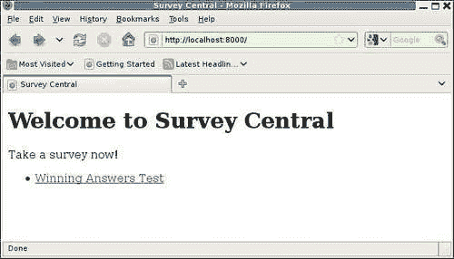
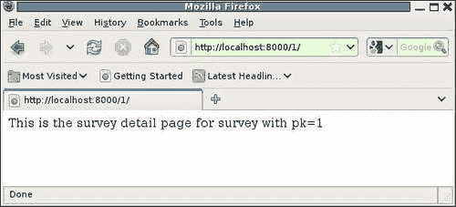
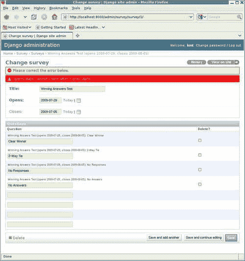

# 第四章：变得更高级：Django 单元测试扩展

在上一章中，我们开始学习如何使用单元测试来测试 Django 应用程序。这包括学习一些 Django 特定的支持，比如如何将测试数据从装置文件加载到数据库中进行特定的测试。到目前为止，我们的测试重点一直是应用程序的组成部分。我们还没有开始编写用于为我们的应用程序提供网页服务的代码，也没有考虑如何测试页面是否被正确地提供并包含正确的内容。Django 的`TestCase`类提供了对这种更广泛的测试有用的支持，这将是本章的重点。在本章中，我们将：

+   首先学习如何使用一个 tests 目录来进行 Django 应用程序的测试，而不是单个的`tests.py`文件。这将使我们能够逻辑地组织测试，而不是将各种不同的测试混合在一个巨大的文件中。

+   为调查应用程序开发一些网页。对于每一个，我们将编写单元测试来验证它们的正确操作，途中学习测试 Django 应用程序的`TestCase`支持的具体细节。

+   尝试在管理应用程序的`Survey`模型中添加自定义验证，并查看如何测试这样的定制。

+   简要讨论一些 Django 测试支持中的方面，在我们的示例测试中没有遇到的。

+   最后，我们将学习在什么条件下可能需要使用替代的单元测试类`TransactionTestCase`。这个类的性能不如`TestCase`，但它支持测试一些使用`TestCase`不可能的数据库事务行为。

# 组织测试

在我们开始编写用于为调查应用程序提供网页服务的代码（和测试）之前，让我们先考虑一下我们到目前为止所拥有的测试。如果我们运行`manage.py test survey -v2`并检查输出的末尾，我们会看到我们已经积累了超过十几个单独的测试：

```py
No fixtures found. 
testClearWinner (survey.tests.QuestionWinningAnswersTest) ... ok 
testNoAnswers (survey.tests.QuestionWinningAnswersTest) ... ok 
testNoResponses (survey.tests.QuestionWinningAnswersTest) ... ok 
testTwoWayTie (survey.tests.QuestionWinningAnswersTest) ... ok 
testActive (survey.tests.SurveyManagerTest) ... ok 
testCompleted (survey.tests.SurveyManagerTest) ... ok 
testUpcoming (survey.tests.SurveyManagerTest) ... ok 
Verify closes is autoset correctly ... ok 
Verify closes is honored if specified ... ok 
Verify closes is only autoset during initial create ... ok 
Verify correct exception is raised in error case ... ok 
testUnicode (survey.tests.SurveyUnicodeTest) ... ok 
Doctest: survey.models.Survey.__unicode__ ... ok 
Doctest: survey.models.Survey.save ... ok 
Doctest: survey.tests.__test__.survey_save ... ok 

---------------------------------------------------------------------- 
Ran 15 tests in 0.810s 

OK 
Destroying test database... 

```

其中两个，即以`survey.models.Survey`开头的标签的两个 doctest，来自`survey/models.py`文件。其余的 13 个测试都在`survey/tests.py`文件中，该文件已经增长到大约 150 行。这些数字并不算大，但是如果考虑到我们几乎刚刚开始编写这个应用程序，很明显，继续简单地添加到`tests.py`将很快导致一个难以管理的测试文件。由于我们即将开始从构建和测试调查模型转移到构建和测试提供网页服务的代码，现在是一个比单个文件更好的测试组织的好时机。

幸运的是，这并不难做到。Django 中没有要求测试都驻留在单个文件中；它们只需要在名为`tests`的 Python 模块中。因此，我们可以在`survey`中创建一个名为`tests`的子目录，并将现有的`tests.py`文件移动到其中。由于这个文件中的测试重点是测试应用程序的模型，让我们也将其重命名为`model_tests.py`。我们还应该删除`marketr/survey`中的`tests.pyc`文件，因为在 Python 代码重组后留下零散的`.pyc`文件通常会引起混乱。最后，我们需要在`tests`目录中创建一个`__init__.py`文件，以便 Python 将其识别为一个模块。

就这些吗？并不完全是。Django 使用`unittest.TestLoader.LoadTestsFromModule`来查找并自动加载`tests`模块中的所有`TestCase`类。然而，我们现在已经将所有的`TestCase`类移动到了名为`model_tests`的 tests 子模块中。为了让`LoadTestsFromModule`找到它们，我们需要使它们在父`tests`模块中可见，我们可以通过在`survey/tests`的`__init__.py`文件中添加对`model_tests`的导入来实现这一点：

```py
from model_tests import *
```

现在我们准备好了吗？几乎。如果我们现在运行`manage.py test survey -v2`，我们会发现输出报告显示运行了 14 个测试，而在重新组织之前的运行中报告显示运行了 15 个测试：

```py
No fixtures found. 
testClearWinner (survey.tests.model_tests.QuestionWinningAnswersTest) ... ok 
testNoAnswers (survey.tests.model_tests.QuestionWinningAnswersTest) ... ok

testNoResponses (survey.tests.model_tests.QuestionWinningAnswersTest) ... ok 
testTwoWayTie (survey.tests.model_tests.QuestionWinningAnswersTest) ... ok

testActive (survey.tests.model_tests.SurveyManagerTest) ... ok 
testCompleted (survey.tests.model_tests.SurveyManagerTest) ... ok 
testUpcoming (survey.tests.model_tests.SurveyManagerTest) ... ok 
Verify closes is autoset correctly ... ok 
Verify closes is honored if specified ... ok 
Verify closes is only autoset during initial create ... ok 
Verify correct exception is raised in error case ... ok 
testUnicode (survey.tests.model_tests.SurveyUnicodeTest) ... ok 
Doctest: survey.models.Survey.__unicode__ ... ok 
Doctest: survey.models.Survey.save ... ok 
---------------------------------------------------------------------- 
Ran 14 tests in 0.760s 

OK 
Destroying test database... 

```

哪个测试丢失了？早期运行的最后一个测试，也就是`tests.py`中的`__test__`字典中的 doctest。因为`__test__`以下划线开头（表示它是一个私有属性），所以它不会被`from model_tests import *`导入。命名所暗示的私有性并不受 Python 强制执行，因此我们也可以向`survey/tests/__init__.py`添加对`__test__`的显式导入：

```py
from model_tests import __test__ 
from model_tests import * 
```

如果我们这样做并再次运行测试，我们会发现我们又回到了 15 个测试。然而，这是一个很差的解决方案，因为它无法扩展到`tests`目录中的多个文件。如果我们向`tests`目录添加另一个文件，比如`view_tests.py`，并简单地复制用于`model_tests.py`的导入，我们将会有：

```py
from model_tests import __test__ 
from model_tests import * 
from view_tests import __test__
from view_tests import *
```

这不会导致任何错误，但也不完全有效。第二次导入`__test__`完全替换了第一次，因此如果我们这样做，`model_tests.py`中包含的 doctests 将会丢失。

很容易想出一种方法，可以扩展到多个文件，也许是通过为在单独的测试文件中定义的 doctests 创建我们自己的命名约定。然后，`__init__.py`中的代码可以通过将定义 doctests 的各个测试文件的字典合并为整个`tests`模块的`__test__`字典来实现。但是，出于我们将要研究的示例的目的，这是不必要复杂的，因为我们将要添加的额外测试都是单元测试，而不是 doctests。

实际上，现在在`model_tests.py`中的 doctests 也已经被重新实现为单元测试，因此它们作为测试是多余的，可以安全地删除。然而，它们确实指出了一个与 doctests 相关的问题，如果您决定在自己的项目中摆脱单文件`tests.py`方法，这个问题就会出现。我们可以通过简单地将`model_tests.py`文件中的`__test__`字典定义移动到`survey/tests/__init__.py`文件中来保留我们已经拥有的 doctests。然后，如果我们决定额外的 doctests（超出`models.py`中的 doctests）会很有用，我们可以简单地在`survey/tests/__init__.py`中添加到这个字典，或者想出一个更复杂的方法，允许将 doctests 以及单元测试拆分到不同的文件中。

请注意，不必将`tests`目录树限制在单个级别。我们可以为模型测试创建一个子目录，为视图创建一个子目录，并将这些测试进一步细分为单独的文件。使用我们在这里开始的方法，所需的只是在各种`__init__.py`文件中包含适当的导入，以便测试用例在`tests`包的顶层可见。将树设置多深以及将单个测试文件设置多小是个人偏好的问题。我们现在将坚持单层。

最后，请注意，您可以通过在应用的`models`和/或`tests`模块中定义一个`suite()`函数来完全控制组成应用测试套件的测试。Django 测试运行程序在这些模块中寻找这样的函数，如果`suite()`存在，就会调用它来创建测试套件。如果提供，`suite()`函数必须返回一个适合作为参数传递给`unittest.TestSuite.addTest`的对象（例如，一个`unittest.TestSuite`）。

# 创建调查应用首页

现在是时候把注意力转向为调查应用程序构建一些网页了。首先要考虑的页面是主页，这将是一般用户进行任何与调查相关操作的起点。最终，我们可能计划让这个页面有许多不同的元素，比如标准的页眉和页脚，也可能有一两个侧边栏用于新闻和反馈。我们计划开发全面的样式表，以赋予应用程序漂亮和一致的外观。但所有这些都不是我们现在想要关注的重点，我们现在想要关注的是主页的主要内容。

主页的主要功能将是提供当前调查状态的快照概览，并在适当的情况下提供链接，以允许用户查看各个调查的详细信息。主页将显示分为三类的调查：

+   首先，将列出当前开放的调查。此列表中的每个调查都将有一个链接，供用户参与调查。

+   其次，将列出最近完成的调查。这些调查也将有一个链接，但这个链接将带来一个页面，允许用户查看调查结果。

+   第三，将列出即将开放的调查。此列表中的调查将没有链接，因为用户还不能参与，也没有结果可见。

为了构建和测试这个主页，我们需要做四件事情：

1.  首先，我们需要定义用于访问主页和任何链接到它的页面的 URL，并在`urls.py`文件中定义这些 URL 应该如何映射到将提供页面的视图代码。

1.  其次，我们需要实现用于提供第 1 步中识别的页面的视图代码。

1.  第三，我们需要定义 Django 模板，用于呈现第 2 步生成的响应。

1.  最后，我们需要为每个页面编写测试。

接下来的章节将依次关注这些步骤中的每一个。

## 定义调查应用程序的 URL

从调查主页的描述来看，我们可能需要定义两个或三个不同的 URL。当然，首先是主页本身，最自然地放置在调查应用程序的 URL 树的根目录下。我们可以通过在`survey`目录中创建`urls.py`文件来定义这一点：

```py
from django.conf.urls.defaults import * 

urlpatterns = patterns('survey.views', 
    url(r'^$', 'home', name='survey_home'), 
) 
```

在这里，我们指定了对空（根）URL 的请求应由`survey.views`模块中的`home`函数处理。此外，我们给这个 URL 命名为`survey_home`，我们可以在其他代码中使用这个名称来引用这个 URL。始终使用命名 URL 是一个好的做法，因为它允许通过简单地更改`urls.py`文件而不需要更改其他代码来更改实际的 URL。

除了主页，还有从主页链接过去的页面需要考虑。首先是从活动调查列表中链接的页面，允许用户参与调查。其次是从最近完成的调查列表中链接的页面，允许用户查看结果。你可能会问，这些是否应该由一个还是两个 URL 来覆盖？

虽然听起来这些可能需要不同的 URL，因为页面将显示非常不同的内容，但从某种意义上说，它们都显示了同一件事情——特定调查的详细信息。只是调查的当前状态将影响其详细页面的显示。因此，我们可以选择将决定显示什么内容的逻辑，基于调查状态，放入处理显示调查详细信息的视图中。然后我们可以用一个 URL 模式来覆盖这两种类型的页面。采用这种方法，`survey/urls.py`文件变成了：

```py
from django.conf.urls.defaults import * 

urlpatterns = patterns('survey.views', 
    url(r'^$', 'home', name='survey_home'), 
    url(r'^(?P<pk>\d+)/$', 'survey_detail', name='survey_detail'), 
) 
```

在这里，我们采取了将调查的主键放入 URL 的方法。任何由一个或多个数字（主键）组成的单个路径组件的 URL 将被映射到`survey.views`模块中的`survey_detail`函数。该函数将接收主键路径组件作为参数`pk`，以及标准的请求参数。最后，这个 URL 被命名为`survey_detail`。

这两个 URL 模式足以定义我们到目前为止考虑的调查应用程序页面。但是，我们仍然需要将它们连接到项目的整体 URL 配置中。为此，请编辑项目的根`urls.py`文件，并为调查 URL 添加一行。然后，`urls.py`中的`urlpatterns`变量将被定义如下：

```py
urlpatterns = patterns('', 
    # Example: 
    # (r'^marketr/', include('marketr.foo.urls')), 

    # Uncomment the admin/doc line below and add # 'django.contrib.admindocs' 
    # to INSTALLED_APPS to enable admin documentation: 
    # (r'^admin/doc/', include('django.contrib.admindocs.urls')), 

    # Uncomment the next line to enable the admin: 
    (r'^admin/', include(admin.site.urls)), 
 (r'', include('survey.urls')), 
) 
```

我们在这里添加的最后一行指定了一个空的 URL 模式`r''`。所有匹配的 URL 将被测试与`survey`模块中包含的`urls.py`文件中找到的模式相匹配。模式`r''`将匹配每个 URL，并且在测试与`survey/urls.py`中的 URL 模式相匹配时，不会删除 URL 的任何部分，因此这实质上是将调查`urls.py`文件挂载到项目的 URL 树的根目录。

## 开发视图以提供页面

现在我们已经定义了我们的 URL 并指定了应该调用的视图函数来提供它们，是时候开始编写这些函数了。或者，也许我们应该从这些页面的模板开始？两者都需要完成，它们彼此之间是相互依赖的。视图返回的数据取决于模板的需求，而模板的编写方式取决于视图提供的数据的命名和结构。因此，很难知道从哪里开始，有时需要在它们之间交替进行。

然而，我们必须从某个地方开始，我们将从视图开始。实际上，每当您在`urls.py`文件中添加对视图的引用时，立即编写至少该视图的最小实现是一个好主意。例如，对于我们刚刚添加到`survey/urls.py`的两个视图，我们可能会立即将以下内容放在`survey/views.py`中：

```py
from django.http import HttpResponse 

def home(request): 
    return HttpResponse("This is the home page.") 

def survey_detail(request, pk): 
    return HttpResponse("This is the survey detail page for survey, " "with pk=%s" % pk) 
```

这些视图只是简单地返回描述页面应该显示的`HttpResponse`。创建这样的占位视图可以确保项目的整体 URL 模式配置保持有效。保持这个配置有效很重要，因为任何尝试执行反向 URL 映射（从名称到实际 URL）都会导致异常，如果在 URL 模式配置的任何部分中存在任何错误（例如引用不存在的函数）。因此，无效的 URL 配置很容易似乎破坏其他完全无辜的代码。

例如，管理应用程序需要使用反向 URL 映射在其页面上生成链接。因此，无效的 URL 模式配置可能导致在用户尝试访问管理页面时引发异常，即使管理代码本身没有错误。这种异常很难调试，因为乍一看似乎问题是由完全与实际错误位置分离的代码引起的。因此，即使您更喜欢在编写视图函数之前编写模板，最好立即为您添加到 URL 模式配置中的任何视图提供至少一个最低限度的实现。

我们可以进一步超越最低限度，至少对于主页视图是这样。如前所述，主页将显示三个不同的调查列表：活动的、最近完成的和即将开放的。模板可能不需要将数据结构化得比简单列表（或`QuerySet`）更复杂，因此主页的视图编写起来很简单：

```py
import datetime 
from django.shortcuts import render_to_response 
from survey.models import Survey 

def home(request): 
    today = datetime.date.today() 
    active = Survey.objects.active() 
    completed = Survey.objects.completed().filter(closes__gte=today-datetime.timedelta(14)) 
    upcoming = Survey.objects.upcoming().filter(opens__lte=today+datetime.timedelta(7))
    return render_to_response('survey/home.html', 
        {'active_surveys': active, 
         'completed_surveys': completed, 
         'upcoming_surveys': upcoming, 
        })
```

这个视图设置了三个变量，它们是包含数据库中`Surveys`适当子集的`QuerySets`。最近完成的集合限于在过去两周内关闭的调查，即将开放的集合限于在下周将要开放的调查。然后，视图调用`render_to_response`快捷方式来渲染`survey/home.html`模板，并传递一个上下文字典，其中包含三个`Survey`子集，分别是`active_surveys`、`completed_surveys`和`upcoming_surveys`上下文变量。

此时，我们可以继续用一些真实的代码替换占位符`survey_detail`视图的实现，或者我们可以开始一些模板。编写第二个视图并不能让我们更接近测试我们已经编写的第一个视图，所以继续进行模板的工作会更好。暂时用于第二个视图的占位内容现在也可以。

## 创建页面模板

要开始编写调查应用程序的模板，首先在`survey`下创建一个`templates`目录，然后在`templates`下创建一个`survey`目录。将模板放在应用程序目录下的`templates`目录下，可以使它们被默认启用的`app_directories`模板加载器自动找到。此外，将模板放在`templates`下的`survey`目录下，可以最大程度地减少与其他应用程序使用的模板的名称冲突的机会。

现在，我们需要创建哪些模板？在主页视图中命名的是`survey/home.html`。我们可以只创建一个文件，并将其作为一个完整的独立 HTTP 文档。但这是不现实的。Django 提供了一个方便的模板继承机制，允许重用常见页面元素并选择性地覆盖已定义的块。至少，我们可能希望使用一个定义了整体文档结构和块组件的通用基础模板，然后将个别页面模板实现为扩展基础模板的子模板。

这是一个最小的`base.html`模板，我们可以用它来开始：

```py
<!DOCTYPE html PUBLIC "-//W3C//DTD XHTML 1.0 Strict//EN" "http://www.w3.org/TR/xhtml1/DTD/xhtml1-strict.dtd">
<html >
<head>
<title>Survey Central</title>
</head>
<body>

</body>
</html>
```

这个文档提供了整体的 HTML 结构标签，并定义了两个块：`title`和`content`。`title`块的默认内容是`Survey Central`，可以被子模板覆盖，或者保持不变。`content`块最初是空的，因此期望子模板始终提供一些内容来填充页面的主体。

有了基础模板，我们可以将`home.html`模板编写为一个扩展`base.html`并为`content`块提供内容的子模板。我们知道`home`视图提供了三个上下文变量（`active_surveys`、`completed_surveys`和`upcoming_surveys`），其中包含应该显示的数据。`home.html`模板的初始实现可能如下所示：

```py
 
 
<h1>Welcome to Survey Central</h1> 

 
<p>Take a survey now!</p> 
<ul> 
 
<li><a href="{{ survey.get_absolute_url }}">{{ survey.title }}</a></li> 
 
</ul> 
 

 
<p>See how your opinions compared to those of others!</p> 
<ul> 
 
<li><a href="{{ survey.get_absolute_url }}">{{ survey.title }}</a></li> 
 
</ul> 
 

 
<p>Come back soon to share your opinion!</p> 
<ul> 
 
<li>{{ survey.title }} opens {{ survey.opens }}</li> 
 
</ul> 
 
 
```

这可能看起来有点吓人，但它很简单。模板首先指定它扩展了`survey/base.html`模板。然后继续定义应该放在`base.html`中定义的`content`块中的内容。第一个元素是一个一级标题`欢迎来到调查中心`。然后，如果`active_surveys`上下文变量不为空，标题后面会跟着一个邀请人们参加调查的段落，然后是活动调查的列表。列表中的每个项目都被指定为一个链接，链接目标值是通过调用 Survey 的`get_absolute_url`方法获得的（我们还没有实现）。每个链接的可见文本都设置为`Survey`的`title`值。

如果有任何`completed_surveys`，则会显示一个几乎相同的段落和列表。最后，`upcoming_surveys`也会以类似的方式处理，只是在它们的情况下不会生成链接。相反，调查标题将与每个调查将开放的日期一起列出。

现在，`get_absolute_url`方法用于生成活动和已完成调查的链接？这是一个标准的模型方法，我们可以实现它来为我们网站上的模型实例提供 URL。除了在我们自己的代码中使用它之外，如果模型实现了它，管理应用程序也会使用它，在模型实例的更改页面上提供一个**在网站上查看**链接。

回想一下，在我们的`urls.py`文件中，我们为调查详情命名了 URL 为`survey_detail`，这个视图需要一个参数`pk`，这是要显示有关`Survey`实例的详细信息的主键。知道了这一点，我们可以在`Survey`模型中实现这个`get_absolute_url`方法：

```py
    def get_absolute_url(self): 
        from django.core.urlresolvers import reverse 
        return reverse('survey_detail', args=(self.pk,)) 
```

这种方法使用了`django.core.urlresolvers`提供的`reverse`函数来构造实际的 URL，该 URL 将映射到具有模型实例的主键值作为参数值的 URL 命名为`survey_detail`。

另外，我们可以使用方便的`models.permalink`装饰器，避免记住`reverse`函数需要从哪里导入：

```py
    @models.permalink
    def get_absolute_url(self):
        return ('survey_detail', (self.pk,))
```

这等同于实现`get_absolute_url`的第一种方式。这种方式只是隐藏了调用`reverse`函数的细节，因为`models.permalink`代码已经完成了这个工作。

现在，我们已经创建了首页视图和它使用的模板，并实现了从这些模板调用的所有模型方法，我们实际上可以测试这个视图。确保开发服务器正在运行（或者使用`manage.py runserver`重新启动），然后从同一台机器上的浏览器中，转到`http://localhost:8000/`。这应该（假设自上一章创建的`Winning Answers Test`距今不到一周）会显示一个页面，列出可以参与的调查：



如果自从创建调查以来已经超过一周，它应该显示在一个段落下，邀请您**查看您的观点与他人的观点相比如何！**。如果已经超过三周，调查就不应该出现在首页上，这种情况下，您可能需要返回管理应用程序并更改其`closes`日期，以便它出现在首页上。

那个**Winning Answers Test**文本是一个链接，可以点击以验证`Survey`的`get_absolute_url`方法是否有效，并且我们设置的 URL 配置是否有效。由于我们仍然只有调查详情视图的占位符视图实现，点击**Winning Answers Test**链接将显示一个页面，看起来像这样：



也许并不是特别令人印象深刻，但它确实验证了我们迄今为止放置的各种部件是否有效。

当然，由于数据库中只有一个调查，我们只验证了视图和模板的一部分。为了进行全面的测试，我们还应该验证所有三个类别中的调查是否正确显示。此外，我们还应该验证数据库中的调查是否不应该出现在首页上，因为它们太旧或太遥远。

我们现在可以通过在管理应用程序中手动添加调查并在进行更改时手动检查首页的内容来完成所有这些工作。然而，我们真正想要学习的是如何编写一个测试来验证我们现在的工作是否正确，并且更重要的是，允许我们在继续开发应用程序时验证它是否保持正确。因此，编写这样的测试是我们接下来要关注的重点。

## 测试调查首页

在考虑如何编写测试本身之前，让我们考虑一下测试所需的数据以及将这些数据放入数据库进行测试的最佳方法。这个测试将与上一章的`SurveyManagerTest`非常相似，因为确定正确的行为将取决于当前日期与测试数据中包含的日期的关系。因此，使用一个 fixture 文件来存储这些数据并不是一个好主意；最好在测试的`setUp`方法中动态添加数据。

因此，我们将首先编写一个`setUp`方法，为测试主页创建一个适当的数据集。由于我们已经开始测试应用的视图，让我们将其放在一个新文件`survey/tests/view_tests.py`中。当我们创建该文件时，我们还需要记得在`survey/tests`的`__init__.py`文件中添加一个`import`行，以便找到其中的测试。

这是我们主页测试的`setUp`方法：

```py
import datetime 
from django.test import TestCase 
from survey.models import Survey 

class SurveyHomeTest(TestCase): 
    def setUp(self): 
        today = datetime.date.today() 
        Survey.objects.all().delete() 
        d = today - datetime.timedelta(15) 
        Survey.objects.create(title="Too Old", opens=d, closes=d) 
        d += datetime.timedelta(1) 
        Survey.objects.create(title="Completed 1", opens=d, closes=d) 
        d = today - datetime.timedelta(1) 
        Survey.objects.create(title="Completed 2", opens=d, closes=d) 
        Survey.objects.create(title="Active 1", opens=d) 
        Survey.objects.create(title="Active 2", opens=today) 
        d = today + datetime.timedelta(1) 
        Survey.objects.create(title="Upcoming 1", opens=d) 
        d += datetime.timedelta(6) 
        Survey.objects.create(title="Upcoming 2", opens=d) 
        d += datetime.timedelta(1) 
        Survey.objects.create(title="Too Far Out", opens=d) 
```

这种方法首先将今天的日期存储在一个本地变量`today`中。然后删除数据库中所有现有的`Surveys`，以防初始数据装置加载了任何可能干扰测试用例中的测试方法正确执行的调查。然后创建八个`Surveys`：三个已完成，两个活跃，三个即将到来的。

已完成调查的截止日期被特别设置，以测试应该出现在主页上的窗口边界。最早的截止日期设置得比过去的时间多一天（15 天），不会出现在主页上。其他两个设置为窗口边缘的极限，应该出现在主页上。即将到来的调查的开放日期也类似地设置，以测试该窗口的极限。一个即将到来的调查开放的时间比未来多一天，不会出现在主页上，而另外两个则在窗口的极限处开放，应该显示为即将到来的调查。最后，有两个活跃的调查，一个是昨天开放的，另一个是今天开放的，每个都有一个默认的截止日期，七天后关闭，所以两者都还在开放中。

现在我们有一个`setUp`例程来创建测试数据，那么我们如何编写一个测试来检查主页的内容呢？Django 提供了一个类`django.test.Client`来帮助这里。这个`Client`类的实例就像一个 Web 浏览器，可以用来请求页面并检查返回的响应。每个`django.test.TestCase`类都会自动分配一个`Client`类的实例，可以使用`self.client`来访问。

要了解如何使用测试`Client`，让我们来看一下调查应用主页测试的开始部分：

```py
    def testHome(self): 
        from django.core.urlresolvers import reverse 
        response = self.client.get(reverse('survey_home')) 
        self.assertEqual(response.status_code, 200) 
```

在`SurveyHomeTest`中定义了一个`testHome`方法。这个方法使用测试的`client`类实例的`get`方法来检索调查主页（再次使用`reverse`来确定正确的 URL，以确保所有 URL 配置信息都被隔离在`urls.py`中）。`get`的返回值是由调用来提供请求页面的视图返回的`django.http.HttpResponse`对象，附带一些额外的信息以便于测试。测试的最后一行通过确保返回的响应的`status_code`属性为`200`（HTTP OK）来验证请求是否成功。

请注意，测试`Client`提供的`get`方法支持不止我们在这里传递的单个 URL 参数。此外，它支持两个关键字参数`data`和`follow`，它们分别默认为空字典和`False`。最后，还可以提供任意数量的`extra`关键字参数。

如果`data`字典不为空，则用于构造请求的查询字符串。例如，考虑这样一个`get`方法：

```py
response = self.client.get('/survey/', data={'pk': 4, 'type': 'results'})
```

为了处理这个请求创建的 URL 将是`/survey/?pk=4&type=results`。

请注意，您还可以在传递给`get`的 URL 路径中包含查询字符串。因此，等效的调用将是：

```py
response = self.client.get('/survey/?pk=4&type=results')
```

如果提供了`data`字典和 URL 路径中的查询字符串，则`data`字典用于处理请求，URL 路径中的查询字符串将被忽略。

`get`的`follow`参数可以设置为`True`，以指示测试客户端跟随响应中的重定向。如果是这样，返回的响应将设置一个`redirect_chain`属性。这个属性将是一个描述重定向链结束之前访问的中间 URL 的列表。列表中的每个元素将是一个元组，包含中间 URL 路径和触发它被检索的状态代码。

最后，任何`extra`关键字参数都可以用于在请求中设置任意的 HTTP 标头值。例如：

```py
response = self.client.get('/', HTTP_USER_AGENT='Tester')
```

这个调用将在请求中将`HTTP_USER_AGENT`标头设置为`Tester`。

针对我们自己的测试，只提供 URL 路径参数，我们现在可以使用`manage.py test survey.SurveyHomeTest`来运行它，并验证到目前为止一切看起来都很好。我们可以检索主页，响应返回成功的状态代码。但是如何测试页面的内容呢？我们希望确保应该出现的各种调查都出现了，并且数据库中不应该出现在页面上的两个调查也没有列出。

返回的实际页面内容存储在响应的`content`属性中。我们可以直接检查这一点，但是 Django `TestCase`类还提供了两种方法来检查响应中是否包含某些文本。这些方法分别命名为`assertContains`和`assertNotContains`。

要使用`assertContains`方法，我们传入`response`和我们要查找的文本。我们还可以选择指定文本应该出现的次数。如果我们指定了`count`，则文本必须在响应中出现相同的次数。如果我们没有指定`count`，`assertContains`只是检查文本是否至少出现一次。最后，我们可以指定响应应该具有的`status_code`。如果我们没有指定这一点，那么`assertContains`将验证状态代码是否为 200。

`assertNotContains`方法与`assertContains`具有相同的参数，但不包括`count`。它验证传递的文本是否不出现在响应内容中。

我们可以使用这两种方法来验证主页是否包含`Completed`、`Active`和`Upcoming`各两个实例，并且不包含`Too Old`或`Too Far Out`。此外，由于这些方法检查状态代码，我们可以从我们自己的测试代码中删除该检查。因此，测试方法变为：

```py
    def testHome(self):
        from django.core.urlresolvers import reverse
        response = self.client.get(reverse('survey_home'))
        self.assertContains(response, "Completed", count=2)
        self.assertContains(response, "Active", count=2)
        self.assertContains(response, "Upcoming", count=2)
        self.assertNotContains(response, "Too Old")
        self.assertNotContains(response, "Too Far Out")
```

如果我们尝试运行这个版本，我们会看到它可以工作。但是，它并不像我们希望的那样具体。换句话说，它没有验证列出的调查是否出现在页面上的正确位置。例如，当前的测试将通过，即使所有列出的调查都出现在段落**现在参与调查！**下面。我们如何验证每个调查是否出现在适当的列表中呢？

一种方法是手动检查`response.content`，找到每个预期字符串的位置，并确保它们按预期顺序出现。但是，这将使测试非常依赖页面的确切布局。将来我们可能决定重新排列列表的呈现方式，这个测试可能会失败，即使每个调查仍然被列在正确的类别中。

我们真正想要做的是验证调查是否包含在传递给模板的适当上下文变量中。实际上我们可以测试这一点，因为`client.get`返回的响应带有用于呈现模板的上下文的注释。因此，我们可以这样检查已完成的调查列表：

```py
        completed = response.context['completed_surveys'] 
        self.assertEqual(len(completed), 2) 
        for survey in completed: 
            self.failUnless(survey.title.startswith("Completed")) 
```

这段代码从响应上下文中检索 `completed_surveys` 上下文变量，验证其中是否有 `2` 个项目，并进一步验证每个项目是否具有以字符串 `Completed` 开头的 `title`。如果我们运行该代码，我们会看到它适用于检查已完成的调查。然后，我们可以将该代码块复制两次，并适当调整，以检查活动和即将开始的调查，或者我们可以变得更加复杂，编写类似于这样的代码：

```py
        context_vars = ['completed_surveys', 'active_surveys', 'upcoming_surveys'] 
        title_starts = ['Completed', 'Active', 'Upcoming'] 
        for context_var, title_start in zip(context_vars, title_starts):
            surveys = response.context[context_var] 
            self.assertEqual(len(surveys), 2) 
            for survey in surveys: 
                self.failUnless(survey.title.startswith(title_start))
```

在这里，我们通过构建一个要检查的事项列表，然后遍历该列表，避免了基本上三次重复相同的代码块，只是有些微的差异。因此，我们只有一个代码块出现一次，但它循环三次，每次都是为了检查我们想要检查的上下文变量之一。这是一种常用的技术，用于避免多次重复几乎相同的代码。

请注意，当在测试中使用这种技术时，最好在断言检查中包含具体的消息。在代码的原始版本中，直接测试已完成的列表，如果出现错误，比如列表中有太多的调查，测试失败将产生一个相当具体的错误报告：

```py
FAIL: testHome (survey.tests.view_tests.SurveyHomeTest) 
---------------------------------------------------------------------- 
Traceback (most recent call last): 
 File "/dj_projects/marketr/survey/tests/view_tests.py", line 29, in testHome 
 self.assertEqual(len(completed), 2) 
AssertionError: 3 != 2 

---------------------------------------------------------------------- 

```

在这里，包含字符串 **completed** 的代码失败，因此清楚哪个列表出了问题。使用代码的更通用版本，这个报告就不那么有帮助了：

```py
FAIL: testHome (survey.tests.view_tests.SurveyHomeTest) 
---------------------------------------------------------------------- 
Traceback (most recent call last): 
 File "/dj_projects/marketr/survey/tests/view_tests.py", line 35, in testHome 
 self.assertEqual(len(surveys), 2) 
AssertionError: 3 != 2 

---------------------------------------------------------------------- 

```

遇到这种失败报告的可怜程序员将无法知道这三个列表中哪一个有太多的项目。然而，通过提供具体的断言错误消息，这一点可以变得清晰。因此，具有描述性错误的完整测试方法的更好版本将是：

```py
    def testHome(self): 
        from django.core.urlresolvers import reverse 
        response = self.client.get(reverse('survey_home')) 
        self.assertNotContains(response, "Too Old") 
        self.assertNotContains(response, "Too Far Out")          
        context_vars = ['completed_surveys', 'active_surveys', 'upcoming_surveys'] 
        title_starts = ['Completed', 'Active', 'Upcoming'] 
        for context_var, title_start in zip(context_vars, title_starts): 
            surveys = response.context[context_var] 
            self.assertEqual(len(surveys), 2, 
                "Expected 2 %s, found %d instead" % 
                (context_var, len(surveys))) 
            for survey in surveys: 
                self.failUnless(survey.title.startswith(title_start), 
                    "%s title %s does not start with %s" % 
                    (context_var, survey.title, title_start)) 
```

现在，如果在通用代码的检查过程中出现故障，错误消息已经具体到足以指出问题所在：

```py
FAIL: testHome (survey.tests.view_tests.SurveyHomeTest) 
---------------------------------------------------------------------- 
Traceback (most recent call last): 
 File "/dj_projects/marketr/survey/tests/view_tests.py", line 36, in testHome 
 (context_var, len(surveys))) 
AssertionError: Expected 2 completed_surveys, found 3 instead 

---------------------------------------------------------------------- 

```

我们现在对我们的调查主页有一个相当完整的测试，或者至少是我们迄今为止实施的部分。是时候把注意力转向调查详细页面了，接下来我们将介绍这部分内容。

# 创建调查详细页面

我们在项目的 URL 配置中添加的第二个 URL 映射是用于调查详细页面的。实现这个视图比主页视图要复杂一些，因为根据请求的调查状态，需要呈现完全不同的数据。如果调查已完成，我们需要显示结果。如果调查正在进行中，我们需要显示一个表单，允许用户参与调查。如果调查即将开始，我们不希望调查可见。

一次性完成所有这些工作，而不在验证的过程中进行测试以确保我们朝着正确的方向前进，那将是在自找麻烦。最好将任务分解成较小的部分，并在进行测试时逐步进行。我们将在接下来的部分中迈出朝着这个方向的第一步。

## 完善调查详细视图

首先要做的是用一个视图替换调查详细页面的简单占位符视图，该视图确定请求的调查状态，并适当地路由请求。例如：

```py
import datetime 
from django.shortcuts import render_to_response, get_object_or_404 
from django.http import Http404 
from survey.models import Survey 
def survey_detail(request, pk): 
    survey = get_object_or_404(Survey, pk=pk) 
    today = datetime.date.today() 
    if survey.closes < today: 
        return display_completed_survey(request, survey) 
    elif survey.opens > today: 
        raise Http404 
    else: 
        return display_active_survey(request, survey) 
```

这个 `survey_detail` 视图使用 `get_object_or_404` 快捷方式从数据库中检索请求的 `Survey`。如果请求的调查不存在，该快捷方式将自动引发 `Http404` 异常，因此以下代码不必考虑这种情况。然后，视图检查返回的 `Survey` 实例上的 `closes` 日期。如果它在今天之前关闭，请求将被发送到名为 `display_completed_survey` 的函数。否则，如果调查尚未开放，将引发 `Http404` 异常。最后，如果这些条件都不成立，调查必须是活动的，因此请求将被路由到名为 `display_active_survey` 的函数。

首先，我们将非常简单地实现这两个新函数。它们不会执行它们的情况所需的任何真正工作，但它们在呈现响应时将使用不同的模板：

```py
def display_completed_survey(request, survey): 
    return render_to_response('survey/completed_survey.html', {'survey': survey}) 

def display_active_survey(request, survey): 
    return render_to_response('survey/active_survey.html', {'survey': survey}) 
```

只需这么多代码，我们就可以继续测试不同州的调查是否被正确路由。不过，首先，我们需要创建视图代码引入的两个新模板。

## 调查详细页面的模板

这两个新模板的名称分别是`survey/completed_survey.html`和`survey/active_survey.html`。将它们创建在`survey/templates`目录下。一开始，它们可以非常简单。例如，`completed_survey.html`可能是：

```py
 
 
<h1>Survey results for {{ survey.title }}</h1> 
 
```

同样地，`active_survey.html`可能是：

```py
 
 
<h1>Survey questions for {{ survey.title }}</h1> 
 
```

每个模板都扩展了`survey/base.html`模板，并为`content`块提供了最少但描述性的内容。在每种情况下，显示的只是一个一级标题，用标题标识调查，以及页面是否显示结果或问题。

## 调查详细页面的基本测试

现在考虑如何测试`survey_detail`中的路由代码是否工作正常。同样，我们需要测试数据，其中至少有一个调查处于三种状态之一。我们在`SurveyHomeTest`的`setUp`方法中创建的测试数据就包含了这些。然而，向主页测试用例添加实际测试调查详细页面视图的方法会很混乱。重复非常相似的`setUp`代码也不太吸引人。

幸运的是，我们不需要做任何一种。我们可以将现有的`setUp`代码移到一个更一般的测试用例中，比如`SurveyTest`，然后基于这个新的`SurveyTest`来构建`SurveyHomeTest`和我们的新的`SurveyDetailTest`。通过这种方式，主页测试和详细页面测试将在数据库中由基本的`SurveyTest setUp`方法创建相同的数据。此外，任何需要类似数据的其他测试也可以继承自`SurveyTest`。

鉴于我们已经有了测试数据，我们可以做些什么来测试我们迄今为止实现的详细视图？即将到来的调查的情况很容易，因为它应该简单地返回一个 HTTP 404（未找到）页面。因此，我们可以从`SurveyDetailTest`中为这种情况创建一个方法开始：

```py
from django.core.urlresolvers import reverse 
class SurveyDetailTest(SurveyTest): 
    def testUpcoming(self): 
        survey = Survey.objects.get(title='Upcoming 1') 
        response = self.client.get(reverse('survey_detail', args=(survey.pk,))) 
        self.assertEqual(response.status_code, 404) 
```

`testUpcoming`方法从数据库中检索一个即将到来的调查，并使用测试`client`请求包含该调查详细信息的页面。再次使用`reverse`来构建适当的详细页面的 URL，将我们请求的调查的主键作为`args`元组中的单个参数传递。通过确保响应的`status_code`为 404 来测试对这个请求的正确处理。如果我们现在运行这个测试，我们会看到：

```py
ERROR: testUpcoming (survey.tests.view_tests.SurveyDetailTest)
----------------------------------------------------------------------
Traceback (most recent call last):
 File "/dj_projects/marketr/survey/tests/view_tests.py", line 45, in testUpcoming
 response = self.client.get(reverse('survey_detail', args=(survey.pk,)))
 File "/usr/lib/python2.5/site-packages/django/test/client.py", line 281, in get
 response = self.request(**r)
 File "/usr/lib/python2.5/site-packages/django/core/handlers/base.py", line 119, in get_response
 return callback(request, **param_dict)
 File "/usr/lib/python2.5/site-packages/django/views/defaults.py", line 13, in page_not_found
 t = loader.get_template(template_name) # You need to create a 404.html template.
 File "/usr/lib/python2.5/site-packages/django/template/loader.py", line 81, in get_template
 source, origin = find_template_source(template_name)
 File "/usr/lib/python2.5/site-packages/django/template/loader.py", line 74, in find_template_source
 raise TemplateDoesNotExist, name
TemplateDoesNotExist: 404.html

```

糟糕。为了使`survey_detail`视图成功引发`Http404`并导致“页面未找到”响应，项目中必须存在一个`404.html`模板。我们还没有创建一个，所以这个测试生成了一个错误。为了解决这个问题，我们可以创建一个简单的`survey/templates/404.html`文件，其中包含：

```py


<h1>Page Not Found</h1>
<p>The requested page was not found on this site.</p>

```

同时，我们还应该创建一个`survey/templates/500.html`文件，以避免在遇到服务器错误的情况下出现类似的无用错误。现在使用的一个简单的`500.html`文件会很像这个`404.html`文件，只是将文本更改为指示问题是服务器错误，而不是页面未找到的情况。

有了`404.html`模板，我们可以尝试再次运行这个测试，这一次，它会通过。

那么如何测试已完成和活动调查的页面呢？我们可以编写测试，检查`response.content`中我们放置在各自模板中的标题文本。然而，随着我们继续开发，该文本可能不会保持不变——在这一点上，它只是占位文本。最好验证正确的模板是否用于呈现每个响应。`TestCase`类有一个用于此目的的方法：`assertTemplateUsed`。因此，我们可以编写这些在长期内可能会继续正常工作的情况的测试，如下所示：

```py
    def testCompleted(self): 
        survey = Survey.objects.get(title='Too Old') 
        response = self.client.get(reverse('survey_detail', args=(survey.pk,))) 
        self.assertTemplateUsed(response, 'survey/completed_survey.html')

    def testActive(self): 
        survey = Survey.objects.get(title='Active 1') 
        response = self.client.get(reverse('survey_detail', args=(survey.pk,))) 
        self.assertTemplateUsed(response, 'survey/active_survey.html') 
```

每个测试方法都从适当的类别中检索调查，并请求该调查的详细页面。到目前为止，对响应的唯一测试是检查是否使用了预期的模板来呈现响应。同样，我们现在可以运行这些测试并验证它们是否通过。

除了`assertTemplateUsed`之外，`TestCase`还提供了一个`assertTemplateNotUsed`方法。它接受与`assertTempalteUsed`相同的参数。正如你所期望的那样，它验证指定的模板未被用于呈现响应。

在这一点上，我们将暂停实施`survey`应用程序页面。下一个单元测试主题是如何测试接受用户输入的页面。我们在调查应用程序中还没有这样的页面，但 Django 管理员应用程序有。因此，在开发测试之前，测试管理员自定义提供了学习如何测试这些页面的更快捷的途径，因为我们需要编写更少的自定义代码。此外，学习如何测试管理员自定义本身也是有用的。

# 自定义管理员添加和更改调查页面

我们已经看到 Django 管理员应用程序提供了一种方便的方式来检查和操作数据库中的数据。在上一章中，我们对管理员进行了一些简单的自定义，以允许在`Surveys`中内联编辑`Questions`和在`Questions`中内联编辑`Answers`。除了这些内联自定义之外，我们没有对管理员默认值进行任何更改。

对管理员进行的另一个很好的改变是确保`Survey opens`和`closes`日期是有效的。显然，对于这个应用程序，拥有一个晚于`closes`的`opens`日期是没有意义的，但管理员无法知道这一点。在这一部分，我们将自定义管理员以强制执行我们的应用程序对`opens`和`closes`之间关系的要求。我们还将为此自定义开发一个测试。

## 开发自定义调查表单

实施此管理员自定义的第一步是为`Survey`实施一个包括自定义验证的表单。例如：

```py
from django import forms
class SurveyForm(forms.ModelForm): 
    class Meta: 
        model = Survey 
    def clean(self): 
        opens = self.cleaned_data.get('opens') 
        closes = self.cleaned_data.get('closes') 
        if opens and closes and opens > closes: 
            raise forms.ValidationError("Opens date cannot come, " "after closes date.") 
        return self.cleaned_data 
```

这是`Survey`模型的标准`ModelForm`。由于我们想要执行的验证涉及表单上的多个字段，最好的地方是在整体表单的`clean`方法中进行。这里的方法从表单的`cleaned_data`字典中检索`opens`和`closes`的值。然后，如果它们都已提供，它会检查`opens`是否晚于`closes`。如果是，就会引发`ValidationError`，否则一切正常，所以从`clean`中返回未修改的现有`cleaned_data`字典。

由于我们将在管理员中使用此表单，并且目前不预期需要在其他地方使用它，我们可以将此表单定义放在现有的`survey/admin.py`文件中。

## 配置管理员使用自定义表单

下一步是告诉管理员使用此表单，而不是默认的`Survey`模型的`ModelForm`。要做到这一点，将`survey/admin.py`中的`SurveyAdmin`定义更改为：

```py
class SurveyAdmin(admin.ModelAdmin):
    form = SurveyForm
    inlines = [QuestionsInline]
```

通过指定`form`属性，我们告诉管理员在添加和编辑`Survey`实例时使用我们的自定义表单。我们可以通过使用管理员编辑我们现有的“获奖答案测试”调查并尝试将其`closes`日期更改为早于`opens`的日期来快速验证这一点。如果我们这样做，我们将看到错误报告如下：



我们能够手动验证我们的自定义是否有效是很好的，但我们真正想要的是自动化测试。下面将介绍这一点。

## 测试管理员自定义

我们如何为这个管理员自定义编写测试？关于测试在管理员页面上按下“保存”按钮的行为，至少有一些不同于我们迄今为止测试的地方。首先，我们需要发出 HTTP POST 方法，而不是 GET，以进行请求。测试`Client`提供了一个`post`方法，用于此目的，类似于`get`。对于`post`，我们需要指定要包含在请求中的表单数据值。我们将这些提供为键/值对的字典，其中键是表单字段的名称。由于我们知道管理员正在使用的`ModelForm`，因此我们知道这里的键值是模型字段的名称。

我们将从编写一个测试开始，用于管理员添加调查页面，因为在这种情况下，我们不需要在数据库中有任何预先存在的数据。让我们在测试目录中创建一个名为`admin_tests.py`的新文件来测试管理员视图。还要记得将`from admin_tests import *`添加到`tests/__init__.py`文件中，以便在运行`tests`时找到这些测试。

首次尝试实现对管理员应用程序使用我们定制的“调查”表单的测试可能如下所示：

```py
import datetime 
from django.test import TestCase 
from django.core.urlresolvers import reverse 

class AdminSurveyTest(TestCase):    
    def testAddSurveyError(self): 
        post_data = { 
            'title': u'Time Traveling', 
            'opens': datetime.date.today(), 
            'closes': datetime.date.today() - datetime.timedelta(1), 
        } 
        response = self.client.post(reverse('admin:survey_survey_add'), post_data) 
        self.assertContains(response, "Opens date cannot come after closes date.") 
```

在这里，我们有一个测试方法`testAddSurveyError`，它使用`Survey ModelForm`的`title`，`opens`和`closes`值创建一个`post_data`字典。我们使用测试`client`将该字典`post`到`survey`应用程序的管理员`Survey`添加页面（使用该管理员视图的文档名称的`reverse`）。我们期望返回的`response`应该包含我们自定义`ModelForm`的错误消息，因为我们指定了一个晚于`closes`日期的`opens`日期。我们使用`assertContains`来检查预期的错误消息是否在响应中找到。

请注意，与`get`一样，我们第一个使用`post`的测试只使用了可以提供给该方法的参数的子集。除了 URL`path`和`data`字典之外，`post`还接受一个`content_type`关键字参数。此参数默认为一个值，导致客户端发送`mutlipart/form-data`。除了`content_type`，`post`还支持相同的`follow`和`extra`关键字参数，具有与`get`相同的默认值和处理行为。

我们对管理员自定义测试的第一次尝试有效吗？不幸的是，不是。如果我们使用`manage.py test survey.AdminSurveyTest`运行它，我们将看到以下失败：

```py
FAIL: testAddSurveyError (survey.tests.admin_tests.AdminSurveyTest) 
---------------------------------------------------------------------- 
Traceback (most recent call last): 
 File "/dj_projects/marketr/survey/tests/admin_tests.py", line 13, in testAddSurveyError 
 self.assertContains(response, "Opens date cannot come after closes date.") 
 File "/usr/lib/python2.5/site-packages/django/test/testcases.py", line 345, in assertContains 
 "Couldn't find '%s' in response" % text) 
AssertionError: Couldn't find 'Opens date cannot come after closes date.' in response 

---------------------------------------------------------------------- 

```

可能出了什么问题？很难说，因为没有看到返回的响应实际包含什么。意识到这一点，我们可能会想要在错误消息中包含响应的文本。然而，响应往往相当长（因为它们通常是完整的网页），通常将它们包含在测试失败输出中通常会增加更多的噪音。因此，通常最好对测试用例进行临时更改以打印响应，以便弄清楚可能发生了什么。

如果我们在这种情况下这样做，我们将看到返回的响应开始（在一些标准的 HTML 样板之后）：

```py
<title>Log in | Django site admin</title> 

```

哦，对了，我们忘了管理员需要登录用户才能访问。我们在测试用例中没有做任何设置和登录用户的操作，因此当测试尝试访问管理员页面时，管理员代码会简单地返回一个登录页面。

因此，我们的测试首先需要创建一个用户，因为测试数据库最初是空的。该用户需要适当的权限来访问管理，并且必须在尝试对管理应用程序执行任何操作之前登录。这种情况适合于测试`setUp`例程：

```py
import datetime
from django.test import TestCase
from django.contrib.auth.models import User
from django.core.urlresolvers import reverse

class AdminSurveyTest(TestCase):
    def setUp(self):
        self.username = 'survey_admin'
        self.pw = 'pwpwpw'
        self.user = User.objects.create_user(self.username, '', self.pw)
        self.user.is_staff= True
        self.user.is_superuser = True
        self.user.save()
        self.assertTrue(self.client.login(username=self.username, password=self.pw),
            "Logging in user %s, pw %s failed." % (self.username, self.pw))
```

在这里，`setUp`例程使用标准`django.contrib.auth User`模型提供的`create_user`方法创建一个名为`survey_admin`的用户。创建用户后，`setUp`将其`is_staff`和`is_superuser`属性设置为`True`，并将用户再次保存到数据库中。这将允许新创建的用户访问管理应用程序中的所有页面。

最后，`setUp`尝试使用测试`Client login`方法登录新用户。如果成功，此方法将返回`True`。在这里，`setUp`断言`login`确实返回`True`。如果没有，断言将提供特定的指示，说明出了什么问题。这应该比如果`login`调用失败后继续测试更有帮助。

`Client login`方法有一个伴随方法`logout`。我们应该在`setUp`中使用`login`后，在`tearDown`方法中使用它：

```py
    def tearDown(self): 
        self.client.logout() 
```

现在我们的测试工作了吗？不，但它确实更进一步了。这次的错误报告是：

```py
ERROR: testAddSurveyError (survey.tests.admin_tests.AdminSurveyTest) 
---------------------------------------------------------------------- 
Traceback (most recent call last): 
 File "/dj_projects/marketr/survey/tests/admin_tests.py", line 26, in testAddSurveyError 
 response = self.client.post(reverse('admin:survey_survey_add'), post_data) 
 File "/usr/lib/python2.5/site-packages/django/test/client.py", line 313, in post 
 response = self.request(**r) 
 File "/usr/lib/python2.5/site-packages/django/core/handlers/base.py", line 92, in get_response 
 response = callback(request, *callback_args, **callback_kwargs) 
 File "/usr/lib/python2.5/site-packages/django/contrib/admin/options.py", line 226, in wrapper 
 return self.admin_site.admin_view(view)(*args, **kwargs) 
 File "/usr/lib/python2.5/site-packages/django/views/decorators/cache.py", line 44, in _wrapped_view_func 
 response = view_func(request, *args, **kwargs) 
 File "/usr/lib/python2.5/site-packages/django/contrib/admin/sites.py", line 186, in inner 
 return view(request, *args, **kwargs) 
 File "/usr/lib/python2.5/site-packages/django/db/transaction.py", line 240, in _commit_on_success 
 res = func(*args, **kw) 
 File "/usr/lib/python2.5/site-packages/django/contrib/admin/options.py", line 731, in add_view 
 prefix=prefix) 
 File "/usr/lib/python2.5/site-packages/django/forms/models.py", line 724, in __init__ 
 queryset=qs) 
 File "/usr/lib/python2.5/site-packages/django/forms/models.py", line 459, in __init__ 
 super(BaseModelFormSet, self).__init__(**defaults) 
 File "/usr/lib/python2.5/site-packages/django/forms/formsets.py", line 44, in __init__ 
 self._construct_forms() 
 File "/usr/lib/python2.5/site-packages/django/forms/formsets.py", line 87, in _construct_forms 
 for i in xrange(self.total_form_count()): 
 File "/usr/lib/python2.5/site-packages/django/forms/models.py", line 734, in total_form_count 
 return super(BaseInlineFormSet, self).total_form_count() 
 File "/usr/lib/python2.5/site-packages/django/forms/formsets.py", line 66, in total_form_count 
 return self.management_form.cleaned_data[TOTAL_FORM_COUNT] 
 File "/usr/lib/python2.5/site-packages/django/forms/formsets.py", line 54, in _management_form 
 raise ValidationError('ManagementForm data is missing or has been tampered with') 
ValidationError: [u'ManagementForm data is missing or has been tampered with'] 

---------------------------------------------------------------------- 

```

起初可能有点困惑，但在 Django 文档中搜索**ManagementForm**很快就会发现，当使用 formsets 时，这是必需的内容。由于作为我们的管理定制的一部分，我们指定`Questions`内联显示在`Survey`页面上，因此`Survey`的管理页面包含了`Questions`的 formset。但是，在我们的`post_data`字典中没有提供所需的`ManagementForm`值。所需的两个值是`question_set`的`TOTAL_FORMS`和`INITIAL_FORMS`。由于我们不想在这里测试内联的管理处理，我们可以在我们的数据字典中将这些值设置为`0`：

```py
    def testAddSurveyError(self): 
        post_data = { 
            'title': u'Time Traveling', 
            'opens': datetime.date.today(), 
            'closes': datetime.date.today() - datetime.timedelta(1), 
            'question_set-TOTAL_FORMS': u'0', 
            'question_set-INITIAL_FORMS': u'0', 
        } 
        response = self.client.post(reverse('admin:survey_survey_add'), post_data) 
        self.assertContains(response, "Opens date cannot come after closes date.") 
```

现在这个测试工作吗？是的，如果我们运行`manage.py test survey.AdminSurveyTest.testAddSurveyError`，我们会看到测试成功运行。

请注意，`TestCase`提供了一个比`assertContains`更具体的断言来检查表单错误的方法，名为`assertFormError`。`assertFormError`的参数是响应、模板上下文中表单的名称、要检查错误的字段的名称（如果错误是非字段错误，则为`None`），以及要检查的错误字符串（或错误字符串列表）。但是，在测试管理页面时无法使用`assertFormError`，因为管理页面不会直接在上下文中提供表单。相反，上下文包含一个包含实际表单的包装对象。因此，我们无法将这个特定的测试更改为使用更具体的`assertFormError`方法。

我们完成了对管理定制的测试吗？几乎。由于在管理中添加和更改操作都使用相同的表单，因此无需测试更改页面。但是，最好添加一个包含有效数据并确保对于该情况没有出现任何问题的测试。

添加一个测试方法很容易，该方法构建一个包含有效数据的数据字典，并将其发布到管理添加视图。但是，响应中应该测试什么？管理代码在成功完成 POST 请求的某些操作后不会返回简单的`200 OK`响应。相反，它会重定向到另一个页面，以便尝试重新加载 POST 请求的页面不会导致再次尝试 POST 相同的数据。在添加对象的情况下，管理将重定向到已添加模型的更改列表页面。`TestCase`提供了一个`assertRedirects`方法来测试这种行为。我们可以这样使用这个方法：

```py
    def testAddSurveyOK(self): 
        post_data = { 
            'title': u'Time Traveling', 
            'opens': datetime.date.today(), 
            'closes': datetime.date.today(), 
            'question_set-TOTAL_FORMS': u'0', 
            'question_set-INITIAL_FORMS': u'0', 
        } 
        response = self.client.post(reverse('admin:survey_survey_add'), post_data) 
        self.assertRedirects(response, reverse('admin:survey_survey_changelist')) 
```

这个`testAddSurveyOK`方法为`Survey`设置了一个有效的数据字典，指定了相同的`opens`和`closes`日期。然后将这些数据发布到管理员添加调查页面，并保存响应。最后，它断言响应应该重定向到`Survey`模型的管理员调查应用程序更改列表页面。`assertRedirects`的两个额外的可选参数是`status_code`和`target_status_code`。它们分别默认为`302`和`200`，所以我们在这里不需要指定它们，因为这些是我们在这种情况下期望的代码。

# 额外的测试支持

本章中我们开发的测试提供了如何使用 Django 的`TestCase`和测试`Client`类提供的测试支持的相当广泛的概述。然而，这些示例既没有涵盖这些类提供的每一个细节，也没有涵盖`Client`返回的注释`response`对象中的附加数据的每一个细节。在本节中，我们简要提到了`TestCase`，`Client`和`response`对象可用的一些附加功能。我们不会开发使用所有这些功能的示例；它们在这里提到，以便如果您遇到对这种类型的支持有需求，您将知道它的存在。Django 文档提供了所有这些主题的详细信息。

## 支持额外的 HTTP 方法

我们的示例测试只需要使用 HTTP GET 和 POST 方法。测试`Client`类还提供了发出 HTTP HEAD、OPTIONS、PUT 和 DELETE 请求的方法。这些方法分别命名为`head`、`options`、`put`和`delete`。每个方法都支持与`get`和`post`相同的`follow`和`extra`参数。此外，`put`支持与`post`相同的`content_type`参数。

## 保持持久状态

测试`Client`维护两个属性，跨请求/响应周期保持持久状态：`cookies`和`session`。`cookies`属性是一个包含已收到的任何 cookie 的 Python `SimpleCookie`对象。`session`属性是一个类似字典的对象，包含会话数据。

## 电子邮件服务

Web 应用程序中的一些视图可能会创建并发送邮件。在测试时，我们不希望实际发送这样的邮件，但能够验证正在测试的代码是否生成并尝试发送邮件是很好的。`TestCase`类通过在运行测试时将标准的 Python `SMTPConnection`类（仅在运行测试时）替换为一个不发送邮件而是将其存储在`django.core.mail.outbox`中的自定义类来支持这一点。因此，测试代码可以检查这个`outbox`的内容，以验证正在测试的代码是否尝试发送预期的邮件。

## 提供特定于测试的 URL 配置

在本章开发的示例中，我们小心地确保测试独立于 URL 配置的具体细节，始终使用命名 URL 并使用`reverse`将这些符号名称映射回 URL 路径值。这是一个很好的技术，但在某些情况下可能不足够。

考虑到您正在开发一个可重用的应用程序，该应用程序的特定安装可能选择部署可选视图。对于测试这样的应用程序，您不能依赖于可选视图实际上包含在项目的 URL 配置中，但您仍希望能够为它们包括测试。为了支持这一点，`TestCase`类允许实例设置一个`urls`属性。如果设置了这个属性，`TestCase`将使用指定模块中包含的 URL 配置，而不是项目的 URL 配置。

## 响应上下文和模板信息

在测试调查主页时，我们使用简单的字典样式访问检查响应`context`属性中的值。例如：

```py
completed = response.context['completed_surveys'] 
```

虽然这样可以工作，但它忽略了在考虑用于呈现响应的上下文时涉及的一些复杂性。回想一下，我们设置了项目，使其具有两级模板层次结构。`base.html`模板由每个单独的页面模板扩展。用于呈现响应的每个模板都有其自己的关联上下文，因此响应的`context`属性不是一个简单的字典，而是用于呈现每个模板的上下文的列表。实际上，它是一种称为`django.test.utils.ContextList`的东西，其中包含许多`django.template.context.Context`对象。

这个`ContextList`对象支持字典样式的访问以简化操作，并在它包含的每个上下文中搜索指定的键。我们在本章的早期示例中使用了这种简单的访问方式。但是，如果您需要更具体地检查要在哪个模板上下文中，响应的`context`属性也支持这一点，因为您还可以通过索引号到`ContextList`中检索与特定模板相关的完整上下文。

此外，测试`Client`返回的响应具有一个`template`属性，该属性是用于呈现响应的模板的列表。我们没有直接使用这个属性，因为我们使用了`TestCase`提供的`assertTemplateUsed`方法。

# 测试事务行为

本章最后要讨论的主题涉及测试事务行为。如果有必要这样做，有一个替代的测试用例类`TransactionTestCase`，应该使用它来代替`TestCase`。

什么是**测试事务行为**的意思？假设您有一个视图，它在单个数据库事务中进行一系列数据库更新。此外，假设您需要测试至少一个更新起初有效，但随后失败，应该导致整个更新集被回滚而不是提交的情况。为了测试这种行为，您可能会尝试在测试代码中验证，当收到响应时，最初有效的更新之一在数据库中是不可见的。要成功运行这种测试代码，您需要使用`TransactionTestCase`而不是`TestCase`。

这是因为`TestCase`在调用测试方法之间使用事务回滚来将数据库重置为干净状态。为了使这种回滚方法在测试方法之间的清理工作，受测试代码不得允许发出任何数据库提交或回滚操作。因此，`TestCase`拦截任何此类调用，并简单地返回而不实际将它们转发到数据库。因此，您的测试代码将无法验证应该被回滚的更新是否已被回滚，因为在`TestCase`下运行时它们将不会被回滚。

`TransactionTestCase`在测试方法之间不使用回滚来重置数据库。相反，它截断并重新创建所有表。这比回滚方法慢得多，但它确实允许测试代码验证从受测试代码执行成功的任何数据库事务行为。

# 总结

我们现在已经讨论完了 Django 的单元测试扩展，以支持测试 Web 应用程序。在本章中，我们：

+   学会了将单元测试组织成单独的文件，而不是将所有内容放入单个 tests.py 文件

+   开始为调查应用程序开发视图，并学会了如何使用 Django 的单元测试扩展来测试这些视图

+   学会了如何通过为我们的模型提供自定义验证来定制管理界面，并学会了如何测试该管理定制

+   简要讨论了 Django 提供的一些单元测试扩展，我们在任何示例测试中都没有遇到

+   学会了在何时需要使用`TransactionTestCase`而不是`TestCase`进行测试

在学习如何测试 Django 应用程序方面，我们已经涵盖了很多内容，但是测试 Web 应用程序还有许多方面我们甚至还没有涉及。其中一些更适合使用 Django 本身以外的工具进行测试。下一章将探讨一些额外的 Web 应用程序测试需求，并展示如何将外部工具集成到 Django 的测试支持中，以满足这些需求。
