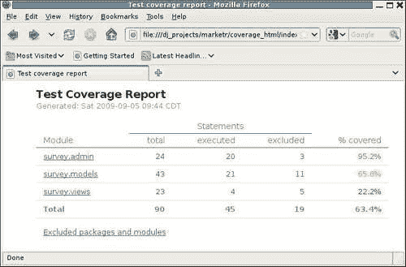
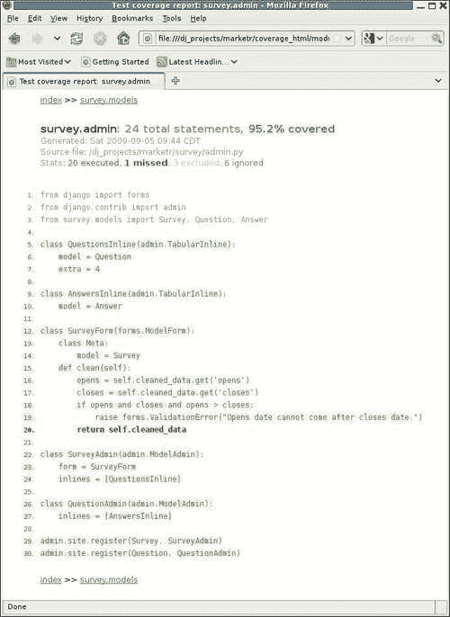

# 第五章：填补空白：集成 Django 和其他测试工具

之前的章节已经讨论了 Django 1.1 提供的内置应用程序测试支持。我们首先学习了如何使用 doctests 来测试应用程序的构建模块，然后介绍了单元测试的基础知识。此外，我们还看到了`django.test.TestCase`和`django.test.Client`提供的函数如何帮助测试 Django 应用程序。通过示例，我们学习了如何使用这些函数来测试应用程序的更完整的部分，例如它提供的页面内容和表单处理行为。

然而，Django 本身并没有提供测试支持所需的一切。毕竟，Django 是一个 Web 应用程序框架，而不是一个测试框架。例如，它不提供任何测试覆盖信息，这对于开发全面的测试套件至关重要，也不提供任何支持测试客户端行为的支持，因为 Django 纯粹是一个服务器端框架。存在其他工具来填补这些空白，但通常希望将这些其他工具与 Django 集成，而不是使用完全不同的工具集来构建完整的应用程序测试套件。

在某些情况下，即使 Django 支持某个功能，也可能更喜欢使用其他工具。例如，如果您已经有了使用 Python 测试框架（如`nose`）的经验，它提供了非常灵活的测试发现机制和强大的测试插件架构，您可能会发现 Django 的测试运行器相当受限制。同样，如果您熟悉`twill` Web 测试工具，您可能会发现与`twill`相比，使用 Django 的测试`Client`来测试表单行为相当麻烦。

在本章中，我们将调查 Django 与其他测试工具的集成。集成有时可以通过使用标准的 Python 单元测试扩展机制来实现，但有时需要更多。本章将涵盖这两种情况。具体来说，我们将：

+   讨论集成涉及的问题，并了解 Django 提供的用于将其他工具集成到其测试结构中的钩子。

+   探讨一个问题：我们的代码有多少被我们的测试执行了？我们将看到如何在不对 Django 测试设置进行任何更改的情况下回答这个问题，并利用之前讨论过的钩子。

+   探索`twill`工具，并了解如何在我们的 Django 应用程序测试中使用它，而不是 Django 测试`Client`。对于这种集成，我们不需要使用任何 Django 钩子进行集成，我们只需要使用 Python 的单元测试钩子进行测试设置和拆卸。

# 集成的问题

为什么 Django 测试与其他工具的集成甚至是一个问题？考虑想要使用`nose`测试框架的情况。它提供了自己的命令`nosetests`，用于在项目树中查找并运行测试。然而，在 Django 项目树中尝试运行`nosetests`而不是`manage.py test`，很快就会发现一个问题：

```py
kmt@lbox:/dj_projects/marketr$ nosetests 
E 
====================================================================== 
ERROR: Failure: ImportError (Settings cannot be imported, because environment variable DJANGO_SETTINGS_MODULE is undefined.) 
---------------------------------------------------------------------- 
Traceback (most recent call last): 
 File "/usr/lib/python2.5/site-packages/nose-0.11.1-py2.5.egg/nose/loader.py", line 379, in loadTestsFromName 
 addr.filename, addr.module) 
 File "/usr/lib/python2.5/site-packages/nose-0.11.1-py2.5.egg/nose/importer.py", line 39, in importFromPath 
 return self.importFromDir(dir_path, fqname) 
 File "/usr/lib/python2.5/site-packages/nose-0.11.1-py2.5.egg/nose/importer.py", line 86, in importFromDir 
 mod = load_module(part_fqname, fh, filename, desc) 
 File "/dj_projects/marketr/survey/tests/__init__.py", line 1, in <module> 
 from model_tests import * 
 File "/dj_projects/marketr/survey/tests/model_tests.py", line 2, in <module> 
 from django.test import TestCase 
 File "/usr/lib/python2.5/site-packages/django/test/__init__.py", line 5, in <module> 
 from django.test.client import Client 
 File "/usr/lib/python2.5/site-packages/django/test/client.py", line 24, in <module> 
 from django.db import transaction, close_connection 
 File "/usr/lib/python2.5/site-packages/django/db/__init__.py", line 10, in <module> 
 if not settings.DATABASE_ENGINE: 
 File "/usr/lib/python2.5/site-packages/django/utils/functional.py", line 269, in __getattr__ 
 self._setup() 
 File "/usr/lib/python2.5/site-packages/django/conf/__init__.py", line 38, in _setup 
 raise ImportError("Settings cannot be imported, because environment variable %s is undefined." % ENVIRONMENT_VARIABLE) 
ImportError: Settings cannot be imported, because environment variable DJANGO_SETTINGS_MODULE is undefined. 

---------------------------------------------------------------------- 
Ran 1 test in 0.007s 

FAILED (errors=1) 

```

问题在于`manage.py test`所做的一些环境设置缺失。具体来说，没有设置环境，以便在调用 Django 代码时找到适当的设置。可以通过在运行`nosetests`之前设置`DJANGO_SETTINGS_MODULE`环境变量来解决这个特定的错误，但`nosetests`不会走得更远，因为还有更多的东西缺失。

下一个遇到的问题将是需要使用数据库的测试。在运行任何测试之前，`manage.py test`调用的支持代码会创建测试数据库。`nosetests`命令对测试数据库的需求一无所知，因此在`nosetests`下运行需要数据库的 Django 测试用例将失败，因为数据库不存在。简单地在运行`nosetests`之前设置环境变量无法解决这个问题。

可以采取两种方法来解决这些集成问题。首先，如果其他工具提供了添加功能的钩子，可以使用它们来执行诸如在运行测试之前设置环境和创建测试数据库等操作。这种方法将 Django 测试集成到其他工具中。或者，可以使用 Django 提供的钩子将其他工具集成到 Django 测试中。

第一种选项超出了本书的范围，因此不会详细讨论。但是，对于`nose`的特定情况，其插件架构当然支持添加必要的功能以使 Django 测试在`nose`下运行。存在可以用于允许 Django 应用程序测试在从`nosetests`调用时成功运行的现有 nose 插件。如果这是您想要采用的方法进行自己的测试，您可能希望在构建自己的`nose`插件之前搜索现有解决方案。

第二个选项是我们将在本节中关注的：Django 提供的允许将其他函数引入到 Django 测试的正常路径中的钩子。这里可以使用两个钩子。首先，Django 允许指定替代测试运行程序。首先将描述指定这一点，测试运行程序的责任以及它必须支持的接口。其次，Django 允许应用程序提供全新的管理命令。因此，可以通过另一个命令来增强`manage.py test`，该命令可能支持不同的选项，并且可以执行将另一个工具集成到测试路径中所需的任何操作。也将讨论如何执行此操作的详细信息。

## 指定替代测试运行程序

Django 使用`TEST_RUNNER`设置来决定调用哪些代码来运行测试。默认情况下，`TEST_RUNNER`的值是`'django.test.simple.run_tests'`。我们可以查看该例程的声明和文档字符串，以了解它必须支持的接口：

```py
def run_tests(test_labels, verbosity=1, interactive=True, extra_tests=[]):  
    """ 
    Run the unit tests for all the test labels in the provided list. 
    Labels must be of the form: 
     - app.TestClass.test_method 
        Run a single specific test method 
     - app.TestClass 
        Run all the test methods in a given class 
     - app 
        Search for doctests and unittests in the named application. 

    When looking for tests, the test runner will look in the models and tests modules for the application. 

    A list of 'extra' tests may also be provided; these tests 
    will be added to the test suite. 

    Returns the number of tests that failed. 
    """ 
```

`test_labels`，`verbosity`和`interactive`参数显然将直接来自`manage.py test`命令行。`extra_tests`参数有点神秘，因为没有受支持的`manage.py test`参数与之对应。实际上，当从`manage.py test`调用时，`extra_tests`将永远不会被指定。这个参数是由 Django 用来运行自己的测试套件的`runtests.py`程序使用的。除非您打算编写一个用于运行 Django 自己的测试的测试运行程序，否则您可能不需要担心`extra_tests`。但是，自定义运行程序应该实现包括`extra_tests`在内的定义行为。

测试运行程序需要做什么？这个问题最容易通过查看现有的`django.test.simple.run_tests`代码并看看它做了什么来回答。简而言之，不逐行进行例程，它：

+   通过调用`django.test.utils.setup_test_environment`设置测试环境。这也是自定义测试运行程序应该调用的一个记录方法。它会执行一些操作，以确保例如测试客户端生成的响应具有上一章中提到的`context`和`templates`属性。

+   将`DEBUG`设置为`False`。

+   构建包含在指定的`test_labels`下发现的所有测试的`unittest.TestSuite`。Django 的简单测试运行程序仅在`models`和`tests`模块中搜索测试。

+   通过调用`connection.creation.create_test_db`创建测试数据库。这是另一个在 Django 测试文档中记录的例程，供替代测试运行程序使用。

+   运行测试。

+   通过调用`connection.creation.destroy_test_db`销毁测试数据库。

+   通过调用`django.test.utils.teardown_test_environment`清理测试环境。

+   返回测试失败和错误的总和。

### 注意

请注意，Django 1.2 添加了对指定替代测试运行器的基于类的方法的支持。虽然 Django 1.2 继续支持先前使用的基于函数的方法，并在此处描述，但将来将弃用使用基于函数的替代测试运行器。基于类的方法简化了对测试运行行为进行小改动的任务。您可以实现一个替代测试运行器类，该类继承自默认类，并简单地覆盖实现所需的任何特定方法以实现所需的替代行为。

因此，编写一个测试运行器是相当简单的。但是，仅仅替换测试运行器，我们受到`manage.py test`命令支持的参数和选项的限制。如果我们的运行器支持一些`manage.py test`不支持的选项，那么没有明显的方法可以将该选项从命令行传递给我们的测试运行器。相反，`manage.py` test 将拒绝它不知道的任何选项。

有一种方法可以绕过这个问题。Django 使用 Python 的`optparse`模块来解析命令行中的选项。在命令行上放置一个裸的`-`或`--`会导致`optparse`停止处理命令行，因此在裸的`-`或`--`之后指定的选项不会被正在解析的常规 Django 代码看到。但它们仍然可以在`sys.argv`中被我们的测试运行器访问，因此它们可以被检索并传递给我们正在集成的任何工具。

这种方法有效，但这些选项的存在将对用户隐藏得很好，因为`test`命令的标准 Django 帮助对它们一无所知。通过使用这种技术，我们扩展了`manage.py test`支持的接口，而没有任何明显的方式来发布我们所做的扩展，作为`test`命令的内置帮助的一部分。

因此，指定自定义测试运行器的一个更好的选择可能是提供一个全新的管理命令。创建一个新命令时，我们可以定义它以接受我们喜欢的任何选项，并在用户请求命令的帮助时提供应该显示的每个新选项的帮助文本。下面将讨论这种方法。

## 创建一个新的管理命令

提供一个新的管理命令很简单。Django 在每个已安装应用程序的目录中的`management.commands`包中查找管理命令。在已安装应用程序的`management.commands`包中找到的任何 Python 模块都可以自动用作`manage.py`的命令指定。

因此，要为我们的调查应用程序创建一个自定义测试命令，比如`survey_test`，我们在调查目录下创建一个`management`子目录，并在`management`下创建一个`commands`目录。我们在这两个目录中都放置`__init__.py`文件，以便 Python 将它们识别为模块。然后，我们将`survey_test`命令的实现放在一个名为`survey_test.py`的文件中。

`survey_test.py`需要包含什么？截至 Django 1.1，有关实现管理命令的文档很少。它只说明文件必须定义一个名为`Command`的类，该类扩展自`django.core.management.base.BaseCommand`。除此之外，它建议查阅一些现有的管理命令，以了解应该做什么。由于我们希望提供一个增强的测试命令，最简单的方法可能是复制`test`命令的实现（在`django/core/management/commands/test.py`中找到）到我们的`survey_test.py`文件中。

查看该文件，我们看到管理命令实现包含两个主要部分。首先，在必要的导入和类声明之后，为类定义了一些属性。这些属性控制诸如它支持什么选项以及用户请求命令时应显示什么帮助之类的事情：

```py
from django.core.management.base import BaseCommand 
from optparse import make_option 
import sys 

class Command(BaseCommand): 
    option_list = BaseCommand.option_list + ( 
        make_option('--noinput', action='store_false', dest='interactive', default=True, 
            help='Tells Django to NOT prompt the user for ''input of any kind.'), 
    ) 
    help = 'Runs the test suite for the specified applications, or '\ 'the entire site if no apps are specified.' 
    args = '[appname ...]' 

    requires_model_validation = False 
```

请注意，虽然`BaseCommand`在官方 Django 1.1 文档中没有记录，但它有一个详尽的文档字符串，因此可以通过查阅源代码或使用 Python shell 的帮助函数来找到这些属性（`option_list`、`help`、`args`、`requires_model_validation`）的确切目的。即使不查看文档字符串，我们也可以看到 Python 的标准`optparse`模块用于构建选项字符串，因此扩展`option_list`以包括其他参数是很简单的。例如，如果我们想要添加一个`--cover`选项来打开测试覆盖数据的生成，我们可以将`option_list`的规范更改为：

```py
     option_list = BaseCommand.option_list + (
        make_option('--noinput', action='store_false',
            dest='interactive', default=True,
            help='Tells Django to NOT prompt the user for '
                'input of any kind.'),
        make_option('--cover', action='store_true',
            dest='coverage', default=False,
            help='Tells Django to generate test coverage data.'),
    ) 
```

在这里，我们添加了对在命令行上指定`--cover`的支持。如果指定了，它将导致`coverage`选项的值为`True`。如果没有指定，这个新选项将默认为`False`。除了添加对该选项的支持，我们还可以为它添加帮助文本。

`Command`实现的声明部分后面是`handle`函数的定义。这是将被调用来实现我们的`survey_test`命令的代码。来自`test`命令的现有代码是：

```py
    def handle(self, *test_labels, **options): 
        from django.conf import settings 
        from django.test.utils import get_runner 

        verbosity = int(options.get('verbosity', 1)) 
        interactive = options.get('interactive', True) 
        test_runner = get_runner(settings) 

        failures = test_runner(test_labels, verbosity=verbosity,  interactive=interactive) 
        if failures: 
            sys.exit(failures) 
```

正如你所看到的，这执行了一个非常简单的选项检索，使用一个实用函数来找到正确的测试运行器来调用，并简单地使用传递的选项调用运行器。当运行器返回时，如果有任何失败，程序将以设置为失败数量的系统退出代码退出。

我们可以用检索新选项的代码替换最后四行，并打印出它是否已被指定：

```py
        coverage = options.get('coverage', False) 
        print 'Here we do our own thing instead of calling the test '\
            'runner.' 
        if coverage: 
            print 'Our new cover option HAS been specified.' 
        else: 
            print 'Our new cover option HAS NOT been specified.' 
```

现在，我们可以尝试运行我们的`survey_test`命令，以验证它是否被找到并且能够接受我们的新选项：

```py
kmt@lbox:/dj_projects/marketr$ python manage.py survey_test --cover 
Here we do our own thing instead of calling the test runner. 
Our new cover option HAS been specified.

```

我们还可以验证，如果我们在命令行上没有传递`--cover`，它默认为`False`：

```py
kmt@lbox:/dj_projects/marketr$ python manage.py survey_test 
Here we do our own thing instead of calling the test runner. 
Our new cover 
option HAS NOT been specified. 

```

最后，我们可以看到我们的选项的帮助包含在新命令的帮助响应中：

```py
kmt@lbox:/dj_projects/marketr$ python manage.py survey_test --help 
Usage: manage.py survey_test [options] [appname ...] 

Runs the test suite for the specified applications, or the entire site if no apps are specified. 

Options: 
 -v VERBOSITY, --verbosity=VERBOSITY 
 Verbosity level; 0=minimal output, 1=normal output, 
 2=all output 
 --settings=SETTINGS   The Python path to a settings module, e.g. 
 "myproject.settings.main". If this isn't provided, the 
 DJANGO_SETTINGS_MODULE environment variable will be used. 
 --pythonpath=PYTHONPATH 
 A directory to add to the Python path, e.g. 
 "/home/djangoprojects/myproject". 
 --traceback           Print traceback on exception 
 --noinput             Tells Django to NOT prompt the user for input of any kind. 
 --cover               Tells Django to generate test coverage data. 
 --version             show program's version number and exit 
 -h, --help            show this help message and exit 

```

请注意，帮助消息中显示的所有其他选项，如果在我们的`option_list`中没有指定，都是从`BaseCommand`继承的。在某些情况下（例如，`settings`和`pythonpath`参数），在调用它们之前，会为我们适当地处理这些参数；在其他情况下（例如`verbosity`），我们期望在我们的实现中遵守选项的文档行为。

添加一个新的管理命令很容易！当然，我们实际上并没有实现运行测试和生成覆盖数据，因为我们还不知道如何做到这一点。有现有的软件包提供了这种支持，我们将在下一节中看到它们如何被用来做到这一点。

现在，我们可能会删除这里创建的`survey/management`树。尝试添加管理命令是一个有用的练习。但实际上，如果我们要提供一个自定义的测试命令来添加诸如记录覆盖数据之类的功能，将这个功能直接绑定到我们的调查应用程序是一个不好的方法。记录覆盖数据的测试命令最好是在一个独立的应用程序中实现。

# 我们测试了多少代码？

在编写测试时，目标是测试一切。虽然我们可以尝试保持警惕并手动确保我们的代码的每一行都有一个测试，但这是一个非常难以实现的目标，除非有一些自动化分析来验证我们的测试执行了哪些代码行。对于 Python 代码，Ned Batchelder 的`coverage`模块是一个优秀的工具，用于确定哪些代码行正在执行。在本节中，我们将看到如何使用`coverage`，首先作为一个独立的实用程序，然后集成到我们的 Django 项目中。

## 使用独立的覆盖

在使用`coverage`之前，必须先安装它，因为它既不包含在 Python 中，也不包含在 Django 1.1 中。如果你使用 Linux，你的发行版包管理器可能有`coverage`可供安装在你的系统上。另外，最新版本的`coverage`始终可以在 Python 软件包索引（PyPI）的网页上找到，[`pypi.python.org/pypi/coverage`](http://pypi.python.org/pypi/coverage)。这里使用的`coverage`版本是 3.2。

安装完成后，我们可以使用`coverage`命令的`run`子命令来运行测试并记录覆盖数据：

```py
kmt@lbox:/dj_projects/marketr$ coverage run manage.py test survey 
Creating test database... 
Creating table auth_permission 
Creating table auth_group 
Creating table auth_user 
Creating table auth_message 
Creating table django_content_type 
Creating table django_session 
Creating table django_site 
Creating table django_admin_log 
Creating table survey_survey 
Creating table survey_question 
Creating table survey_answer 
Installing index for auth.Permission model 
Installing index for auth.Message model 
Installing index for admin.LogEntry model 
Installing index for survey.Question model 
Installing index for survey.Answer model 
..................... 
---------------------------------------------------------------------- 
Ran 21 tests in 11.361s 

OK 
Destroying test database... 

```

如你所见，测试运行器的输出看起来完全正常。覆盖模块不会影响程序的输出；它只是将覆盖数据存储在名为`.coverage`的文件中。

`.coverage`中存储的数据可以使用`coverage`的`report`子命令格式化为报告：

```py
kmt@lbox:/dj_projects/marketr$ coverage report
Name                                                 Stmts   Exec  Cover 
------------------------------------------------------------------------- 
/usr/share/pyshared/mod_python/__init__                   2      2   100% 
/usr/share/pyshared/mod_python/util                     330      1     0% 
/usr/share/pyshared/mx/TextTools/Constants/Sets          42     42   100% 
/usr/share/pyshared/mx/TextTools/Constants/TagTables     12     12   100% 
/usr/share/pyshared/mx/TextTools/Constants/__init__      1      1   100% 
/usr/share/pyshared/mx/TextTools/TextTools              259     47    18% 
/usr/share/pyshared/mx/TextTools/__init__                27     18    66% 
/usr/share/pyshared/mx/TextTools/mxTextTools/__init__    12      9    75% 
/usr/share/pyshared/mx/__init__                          2      2   100% 
/usr/share/pyshared/pysqlite2/__init__                  1      1   100% 
/usr/share/pyshared/pysqlite2/dbapi2               41     26    63% 
/usr/share/python-support/python-simplejson/simplejson/__init__      75     20    26% 
/usr/share/python-support/python-simplejson/simplejson/decoder      208    116    55% 
/usr/share/python-support/python-simplejson/simplejson/encoder      215     40    18% 
/usr/share/python-support/python-simplejson/simplejson/scanner       51     46    90% 
__init__                                                1      1   100% 
manage                                                 9      5    55% 
settings                                                 23     23   100% 
survey/__init__                                             1      1   100% 
survey/admin                                                         24     24   100% 
survey/models                                                        38     37    97% 
survey/tests/__init__                                                 4      4   100% 
survey/tests/admin_tests                                             23     23   100% 
survey/tests/model_tests                                             98     86    87% 
survey/tests/view_tests                                              47     47   100% 
survey/urls                                                           2      2   100% 
survey/views                                                         22     22   100% 
urls                                                                  4      4   100% 
------------------------------------------------------------------------------------- 
TOTAL                                                              1575    663    42% 

```

这比我们实际想要的要多一点。我们只关心我们自己代码的覆盖率，所以首先，对于位于`/usr`目录下的模块报告的内容并不感兴趣。`coverage report`的`--omit`选项可用于省略以特定路径开头的模块。此外，`-m`选项可用于让`coverage`报告未执行（缺失）的行：

```py
kmt@lbox:/dj_projects/marketr$ coverage report --omit /usr -m 
Name                       Stmts   Exec  Cover   Missing 
-------------------------------------------------------- 
__init__                       1      1   100% 
manage                         9      5    55%   5-8 
settings                      23     23   100% 
survey/__init__                1      1   100% 
survey/admin                  24     24   100% 
survey/models                 38     37    97%   66
survey/tests/__init__          4      4   100% 
survey/tests/admin_tests      23     23   100% 
survey/tests/model_tests      98     86    87%   35-42, 47-51 
survey/tests/view_tests       47     47   100% 
survey/urls                    2      2   100% 
survey/views                  23     23   100% 
urls                           4      4   100% 
-------------------------------------------------------- 
TOTAL                        297    280    94% 

```

这样就好多了。毫不奇怪，因为我们已经为讨论的每一部分代码开发了测试，几乎所有内容都显示为已覆盖。还有什么缺失的吗？如果你看一下`manage.py`的 5 到 8 行，它们处理了`settings.py`的`import`引发`ImportError`的情况。由于这部分代码在成功运行时没有被执行，它们在覆盖报告中显示为缺失。

同样，`model_tests`中提到的行（35 到 42，47 到 51）来自于`testClosesReset`方法的替代执行路径，该方法包含从第 34 行开始的代码：

```py
        if settings.DATABASE_ENGINE == 'mysql': 
            from django.db import connection 
            c = connection.cursor() 
            c.execute('SELECT @@SESSION.sql_mode') 
            mode = c.fetchone()[0] 
            if 'STRICT' not in mode: 
                strict = False; 
                from django.utils import importlib 
                debug = importlib.import_module(
                    settings.SETTINGS_MODULE).DEBUG 

        if strict: 
            self.assertRaises(IntegrityError, s.save) 
        elif debug: 
            self.assertRaises(Exception, s.save) 
        else: 
            s.save() 
            self.assertEqual(s.closes, None) 
```

35 到 42 行没有被执行，因为此次运行使用的数据库是 SQLite，而不是 MySQL。然后，在任何单个测试运行中，`if strict/elif debug/else`块中的一个分支将执行，因此其他分支将显示为未覆盖的。在这种情况下，`if strict`分支是被执行的。

最后一个被标记为缺失的行是`survey/models.py`中的第 66 行。这是`Question`模型的`__unicode__`方法实现，我们忽略了为其编写测试。我们可以把这件事放在待办事项清单上。

尽管最后一个是缺失测试的有效指示，但`manage.py`中的缺失行和我们的测试代码中的缺失行并不是我们真正关心的事情，因为它们并没有报告我们应用代码的缺失覆盖。实际上，如果我们很仔细，我们可能会希望确保我们的测试代码在不同的设置下运行了几次，但让我们暂时假设我们只对我们应用代码的覆盖率感兴趣。`coverage`模块支持几种不同的方法来排除报告中的代码。一种可能性是在源代码行上注释`# pgrama no cover`指令，告诉`coverage`将其排除在覆盖率考虑之外。

另外，`coverage`提供了一个 Python API，支持指定应自动排除的代码结构的正则表达式，还支持限制报告中包含的模块。这个 Python API 比命令行提供的功能更强大，比手动使用`# pragma`指令注释源代码更方便。因此，我们可以开始研究如何编写一些`coverage`实用程序脚本，以便轻松生成我们应用代码的测试覆盖率报告。

然而，在开始这项任务之前，我们可能会想知道是否有人已经做过同样的事情，并提供了一个集成`coverage`与 Django 测试支持的即插即用的工具。在网上搜索后发现答案是肯定的——有几篇博客文章讨论了这个主题，至少有一个项目打包为 Django 应用程序。接下来将讨论使用这个包。

## 将覆盖率集成到 Django 项目中

George Song 和 Mikhail Korobov 提供了一个名为`django_coverage`的 Django 应用程序，支持将`coverage`集成到 Django 项目的测试中。与基本的`coverage`包一样，`django_coverage`可以在 PyPI 上找到：[`pypi.python.org/pypi/django-coverage`](http://pypi.python.org/pypi/django-coverage)。这里使用的版本是 1.0.1。

`django_coverage`包提供了将`coverage`与 Django 集成的方法，使用了之前讨论过的两种方法。首先，它提供了一个可以在`settings.py`中指定的测试运行程序：

```py
TEST_RUNNER = 'django_coverage.coverage_runner.run_tests' 
```

使用这个选项，每次运行`manage.py test`时都会生成覆盖信息。

另外，`django_coverage`也可以包含在`INSTALLED_APPS`中。当使用这种方法时，`django_coverage`应用程序提供了一个名为`test_coverage`的新管理命令。`test_coverage`命令可以用来代替`test`来运行测试并生成覆盖信息。由于生成覆盖信息会使测试运行得更慢，我们将使用第二个选项。这样，我们可以选择在对速度要求较高且不关心覆盖率时运行测试。

除了将`django_coverage`列在`INSTALLED_APPS`中之外，无需进行任何设置即可使`django_coverage`与我们的项目一起运行。它带有一个示例`settings.py`文件，显示了它支持的设置，所有设置都有默认选项和注释描述其作用。我们可以通过在我们自己的设置文件中指定我们喜欢的值来覆盖`django_coverage/settings.py`中提供的任何默认设置。

不过，我们将首先使用提供的所有默认设置值。当我们运行`python manage.py test_coverage survey`时，我们将在测试输出的末尾看到覆盖信息：

```py
---------------------------------------------------------------------- 
Ran 21 tests in 10.040s 

OK 
Destroying test database... 
Name            Stmts   Exec  Cover   Missing 
--------------------------------------------- 
survey.admin       21     21   100% 
survey.models      30     30   100% 
survey.views       18     18   100% 
--------------------------------------------- 
TOTAL              69     69   100% 

The following packages or modules were excluded: survey.__init__ survey.tests survey.urls

There were problems with the following packages or modules: survey.templates survey.fixtures 

```

这有点奇怪。回想一下，在上一节中，`coverage`包报告说`survey.models`中的一行代码没有被测试覆盖——`Question`模型的`__unicode__`方法。然而，这个报告显示`survey.models`的覆盖率为 100%。仔细观察这两份报告，我们可以看到列出的模块的语句在`django_coverage`报告中都比在`coverage`报告中低。

这种差异是由`django_coverage`使用的`COVERAGE_CODE_EXCLUDES`设置的默认值造成的。此设置的默认值导致所有`import`行、所有`__unicode__`方法定义和所有`get_absolute_url`方法定义都被排除在考虑范围之外。这些默认排除导致了这两份报告之间的差异。如果我们不喜欢这种默认行为，我们可以提供自己的替代设置，但现在我们将保持原样。

此外，`coverage`列出的一些模块在`django_coverage`报告中完全缺失。这也是默认设置值的结果（在这种情况下是`COVERAGE_MODULE_EXCLUDES`），输出中有一条消息指出由于此设置而被排除的模块。正如你所看到的，`survey`中的`__init__`、`tests`和`urls`模块都被自动排除在覆盖范围之外。

然而，默认情况下不排除`templates`和`fixtures`，这导致了一个问题，因为它们实际上不是 Python 模块，所以不能被导入。为了摆脱关于加载这些问题的消息，我们可以在自己的`settings.py`文件中为`COVERAGE_MODULE_EXCLUDES`指定一个值，并包括这两个。将它们添加到默认列表中，我们有：

```py
COVERAGE_MODULE_EXCLUDES = ['tests$', 'settings$', 'urls$',
                            'common.views.test', '__init__', 'django',
                            'migrations', 'fixtures$', 'templates$']
```

如果我们在进行此更改后再次运行`test_coverage`命令，我们将看到关于加载某些模块存在问题的消息已经消失了。

显示在测试输出中的摘要信息很有用，但更好的是`django_coverage`可以生成的 HTML 报告。要获得这些报告，我们必须为`COVERAGE_REPORT_HTML_OUTPUT_DIR`设置指定一个值，默认值为`None`。因此，我们可以在`/dj_projects/marketr`中创建一个`coverage_html`目录，并在`settings.py`中指定它：

```py
COVERAGE_REPORT_HTML_OUTPUT_DIR = '/dj_projects/marketr/coverage_html'
```

当代码覆盖率达到 100％时，HTML 报告并不特别有趣。因此，为了看到报告的完整用处，让我们只运行单个测试，比如尝试使用`closes`日期早于其`opens`日期的`Survey`的管理员测试：

```py
python manage.py test_coverage survey.AdminSurveyTest.testAddSurveyError

```

这一次，由于我们为 HTML 覆盖率报告指定了一个目录，所以在测试运行结束时，我们看到的不是摘要覆盖率信息，而是：

```py
Ran 1 test in 0.337s

OK
Destroying test database...

HTML reports were output to '/dj_projects/marketr/coverage_html'

```

然后，我们可以使用 Web 浏览器加载放置在`coverage_html`目录中的`index.html`文件。它会看起来像这样：



由于我们只运行了单个测试，我们只对我们的代码进行了部分覆盖。HTML 报告中的**％ covered**值以颜色编码方式反映了每个模块的覆盖情况。绿色是好的，黄色是一般，红色是差的。在这种情况下，由于我们运行了其中一个管理员测试，只有**survey.admin**被标记为绿色，而且它并不是 100％。要查看该模块中遗漏的内容，我们可以点击**survey.admin**链接：



这样的报告提供了一种非常方便的方式来确定我们的应用程序代码中哪些部分被测试覆盖，哪些部分没有被测试覆盖。未执行的行会以红色高亮显示。在这里，我们只运行了通过`SurveyFrom clean`方法的错误路径的测试，所以该方法的成功代码路径以红色显示。此外，`import`行的颜色编码表明它们被排除了。这是由于默认的`COVERAGE_CODE_EXCLUDES`设置。最后，文件中的六行空行被忽略了（带有注释的行也会被忽略）。

使用像`coverage`这样的工具对于确保测试套件正常运行至关重要。未来，Django 可能会提供一些集成的代码覆盖支持。但与此同时，正如我们所看到的，将`coverage`作为项目的附加组件集成并不困难。在`django_coverage`的情况下，它提供了使用之前讨论过的 Django 扩展方式的选项。我们将讨论的下一个集成任务既不需要这两种方式，也只需要标准的 Python 钩子来设置和拆卸单元测试。

# twill 网络浏览和测试工具

`twill`是一个支持与网站进行命令行交互的 Python 包，主要用于测试目的。与`coverage`和`django_coverage`包一样，twill 可以在 PyPI 上找到：[`pypi.python.org/pypi/twill`](http://pypi.python.org/pypi/twill)。虽然`twill`提供了一个用于交互使用的命令行工具，但它提供的命令也可以通过 Python API 使用，这意味着可以在 Django `TestCase`中使用`twill`。当我们这样做时，我们实质上是用替代的`twill`实现替换了 Django 测试`Client`的使用。

### 注意

请注意，目前在 PyPI 上可用的`twill`的最新官方版本（在撰写本文时为 0.9）非常古老。最新的开发版本可在[`darcs.idyll.org/~t/projects/twill-latest.tar.gz`](http://darcs.idyll.org/~t/projects/twill-latest.tar.gz)上找到。截至 2010 年 1 月的最新开发版本的输出如本节所示。此处包含的代码也经过了官方的 0.9 版本测试。使用旧的`twill`代码一切正常，但`twill`的错误输出略显不足，而且在作为 Django `TestCase`的一部分运行时，有些`twill`输出无法被抑制。因此，我建议使用最新的开发版本而不是 0.9 版本。

为什么我们要使用`twill`而不是 Django 测试`Client`？为了理解使用`twill`而不是 Django 测试`Client`的动机，让我们重新审视上一章的管理员定制测试。回想一下，我们为添加和编辑`Survey`对象提供了一个自定义表单。这个表单有一个`clean`方法，对于任何试图保存`opens`日期晚于其`closes`日期的`Survey`都会引发`ValidationError`。确保在应该引发`ValidationError`时引发它的测试如下所示：

```py
    def testAddSurveyError(self): 
        post_data = { 
            'title': u'Time Traveling', 
            'opens': datetime.date.today(), 
            'closes': datetime.date.today() - datetime.timedelta(1), 
            'question_set-TOTAL_FORMS': u'0', 
            'question_set-INITIAL_FORMS': u'0', 
        } 
        response = self.client.post(
            reverse('admin:survey_survey_add'), post_data) 
        self.assertContains(response,"Opens date cannot come after closes date.") 
```

请注意，这个测试向服务器发送了一个包含 POST 数据字典的 POST，而没有发出 GET 请求来获取页面。这最初引起了问题：回想一下，我们最初没有在 POST 字典中包含`question_set-TOTAL_FORMS`和`question_set-INITIAL_FORMS`的值。我们当时专注于测试页面上表单的`Survey`部分，并没有意识到管理员用于显示`Surveys`中的`Questions`的表单集需要这些其他值。当我们发现它们是必需的时，我们有点鲁莽地将它们的值设置为`0`，并希望这对我们想要测试的内容是可以接受的。

一个更好的方法是首先`get`调查添加页面。响应将包括一个带有一组初始值的表单，可以用作`post`回去的字典的基础。在发出`post`请求之前，我们只需更改我们测试所需的值（`title`，`opens`和`closes`）。因此，当我们发出`post`调用时，服务器最初在表单中提供的任何其他表单值都将不变地发送回去。我们不必为测试不打算更改的表单部分编制额外的值。

除了更真实地模拟服务器交互场景之外，这种方法还确保服务器正确响应 GET 请求。在这种特殊情况下，测试 GET 路径并不是必要的，因为我们在管理员中添加的额外验证不会影响其对页面的 GET 响应。但是，对于我们自己的视图中提供响应的表单，我们希望测试对`get`和`post`的响应。

那么为什么我们不以这种方式编写测试呢？测试`Client`支持`get`和`post`；我们当然可以通过检索包含表单的页面来开始。问题在于返回的响应是 HTML，而 Django 测试`Client`没有提供任何实用函数来解析 HTML 表单并将其转换为我们可以轻松操作的内容。Django 没有直接的方法来获取响应，更改表单中的一些值，然后将其`post`回服务器。另一方面，`twill`包可以轻松实现这一点。

在接下来的章节中，我们将使用`twill`重新实现`AdminSurveyTest`。首先，我们将看到如何使用其命令行工具，然后将我们学到的内容转移到 Django `TestCase`中。

## 使用 twill 命令行程序

`twill`包括一个名为`twill-sh`的 shell 脚本，允许进行命令行测试。这是一种方便的方法，可以进行一些初始测试，并找出测试用例代码需要做什么。从 shell 程序中，我们可以使用`go`命令访问页面。一旦我们访问了一个页面，我们可以使用`showforms`命令查看页面上有哪些表单，表单包含哪些字段和初始值。由于我们将使用`twill`重新实现`AdminSurveyTest`，让我们看看为我们的测试服务器访问`Survey`添加页面会产生什么：

```py
kmt@lbox:~$ twill-sh 

 -= Welcome to twill! =- 

current page:  *empty page* 
>> go http://localhost:8000/admin/survey/survey/add/ 
==> at http://localhost:8000/admin/survey/survey/add/ 
current page: http://localhost:8000/admin/survey/survey/add/ 
>> showforms 

Form #1 
## ## __Name__________________ __Type___ __ID________ __Value____________
1     username                 text      id_username 
2     password                 password  id_password 
3     this_is_the_login_form   hidden    (None)       1 
4  1  None                     submit    (None)       Log in 

current page: http://localhost:8000/admin/survey/survey/add/ 
>> 

```

显然，我们实际上没有到达调查添加页面。由于我们没有登录，服务器响应了一个登录页面。我们可以使用`formvalue`命令填写登录表单：

```py
>> formvalue 1 username kmt 
current page: http://localhost:8000/admin/survey/survey/add/ 
>> formvalue 1 password secret
current page: http://localhost:8000/admin/survey/survey/add/ 
>> 

```

`formvalue`的参数首先是表单编号，然后是字段名称，然后是我们要为该字段设置的值。一旦我们在表单中填写了用户名和密码，我们就可以`submit`表单了。

```py
>> submit 
Note: submit is using submit button: name="None", value="Log in" 

current page: http://localhost:8000/admin/survey/survey/add/ 

```

请注意，`submit`命令还可以选择接受要使用的提交按钮的名称。在只有一个（就像这里）或者如果使用表单上的第一个提交按钮是可以接受的情况下，我们可以简单地使用没有参数的`submit`。现在我们已经登录，我们可以再次使用`showforms`来查看我们是否真的检索到了`Survey`添加页面：

```py
>> showforms 

Form #1 
## ## __Name__________________ __Type___ __ID________ __Value____________
1     title                    text      id_title 
2     opens                    text      id_opens 
3     closes                   text      id_closes 
4     question_set-TOTAL_FORMS hidden    id_quest ... 4 
5     question_set-INITIAL ... hidden    id_quest ... 0 
6     question_set-0-id        hidden    id_quest ... 
7     question_set-0-survey    hidden    id_quest ... 
8     question_set-0-question  text      id_quest ... 
9     question_set-1-id        hidden    id_quest ... 
10    question_set-1-survey    hidden    id_quest ... 
11    question_set-1-question  text      id_quest ... 
12    question_set-2-id        hidden    id_quest ... 
13    question_set-2-survey    hidden    id_quest ... 
14    question_set-2-question  text      id_quest ... 
15    question_set-3-id        hidden    id_quest ... 
16    question_set-3-survey    hidden    id_quest ... 
17    question_set-3-question  text      id_quest ... 
18 1  _save                    submit    (None)       Save 
19 2  _addanother              submit    (None)       Save and add another 
20 3  _continue                submit    (None)       Save and continue editing 

current page: http://localhost:8000/admin/survey/survey/add/ 
>> 

```

这更像是一个`Survey`添加页面。确实，我们在第一个测试用例中将`question_set-TOTAL_FORMS`设置为`0`是不现实的，因为服务器实际上提供了一个将其设置为`4`的表单。但它起作用了。这意味着我们不必为这四个内联问题制造值，因此这不是一个致命的缺陷。然而，使用`twill`，我们可以采取更现实的路径，将所有这些值保持不变，只改变我们感兴趣的字段，再次使用`formvalue`命令：

```py
>> formvalue 1 title 'Time Traveling' 
current page: http://localhost:8000/admin/survey/survey/add/ 
>> formvalue 1 opens 2009-08-15 
current page: http://localhost:8000/admin/survey/survey/add/ 
>> formvalue 1 closes 2009-08-01 
current page: http://localhost:8000/admin/survey/survey/add/ 

```

当我们提交该表单时，我们期望服务器会用相同的表单重新显示，并显示来自我们自定义`clean`方法的`ValidationError`消息文本。我们可以使用`find`命令验证返回页面上是否有该文本：

```py
>> submit 
Note: submit is using submit button: name="_save", value="Save" 

current page: http://localhost:8000/admin/survey/survey/add/ 
>> find "Opens date cannot come after closes date." 
current page: http://localhost:8000/admin/survey/survey/add/ 
>>

```

对于`find`的响应可能不会立即明显它是否起作用。让我们看看它对于页面上最有可能不存在的内容会做什么：

```py
>> find "lalalala I don't hear you" 

ERROR: no match to 'lalalala I don't hear you' 

current page: http://localhost:8000/admin/survey/survey/add/ 
>> 

```

好吧，由于`twill`明显在找不到文本时会抱怨，第一个`find`必须已经成功地在页面上找到了预期的验证错误文本。现在，我们可以再次使用`showforms`来查看服务器是否确实发送回我们提交的表单。请注意，初始值是我们提交的值，而不是我们第一次检索页面时的空值。

```py
>> showforms 

Form #1 
## ## __Name__________________ __Type___ __ID________ __Value________________
1     title                    text      id_title     Time Traveling 
2     opens                    text      id_opens     2009-08-15 
3     closes                   text      id_closes    2009-08-01 
4     question_set-TOTAL_FORMS hidden    id_quest ... 4 
5     question_set-INITIAL ... hidden    id_quest ... 0 
6     question_set-0-id        hidden    id_quest ... 
7     question_set-0-survey    hidden    id_quest ... 
8     question_set-0-question  text      id_quest ... 
9     question_set-1-id        hidden    id_quest ... 
10    question_set-1-survey    hidden    id_quest ... 
11    question_set-1-question  text      id_quest ... 
12    question_set-2-id        hidden    id_quest ... 
13    question_set-2-survey    hidden    id_quest ... 
14    question_set-2-question  text      id_quest ... 
15    question_set-3-id        hidden    id_quest ... 
16    question_set-3-survey    hidden    id_quest ... 
17    question_set-3-question  text      id_quest ... 
18 1  _save                    submit    (None)       Save 
19 2  _addanother              submit    (None)     Save and add another 
20 3  _continue                submit    (None)     Save and continue editing 

current page: http://localhost:8000/admin/survey/survey/add/ 
>>

```

在这一点上，我们可以简单地调整一个日期以使表单有效，并尝试再次提交它：

```py
>> formvalue 1 opens 2009-07-15 
current page: http://localhost:8000/admin/survey/survey/add/ 
>> submit 
Note: submit is using submit button: name="_save", value="Save" 

current page: http://localhost:8000/admin/survey/survey/ 
>> 

```

当前页面已更改为调查变更列表页面（URL 路径末尾不再有`add`）。这是一个线索，表明`Survey`添加这次起作用了，因为服务器在成功保存后会重定向到变更列表页面。有一个名为`show`的 twill 命令用于显示页面的 HTML 内容。当你有一个可以滚动回去的显示窗口时，这可能很有用。然而，HTML 页面在纸上复制时并不是很有用，所以这里不显示。

`twill`提供了许多更有用的命令，超出了我们现在所涵盖的范围。这里的讨论旨在简单地展示`twill`提供了什么，并展示如何在 Django 测试用例中使用它。下面将介绍第二个任务。

## 在 TestCase 中使用 twill

我们需要做什么来将我们在`twill-sh`程序中所做的工作转换为`TestCase`？首先，我们需要在测试代码中使用`twill`的 Python API。我们在`twill-sh`中使用的`twill`命令在`twill.commands`模块中可用。此外，`twill`提供了一个浏览器对象（通过`twill.get_browser()`访问），可能更适合从 Python 调用。命令的浏览器对象版本可能返回一个值，例如，而不是在屏幕上打印一些东西。然而，浏览器对象不直接支持`twill.commands`中的所有命令，因此通常使用混合`twill.commands`方法和浏览器方法是常见的。混合使用是可以的，因为`twill.commands`中的代码在从`twill.get_browser()`返回的同一个浏览器实例上运行。

其次，出于测试代码的目的，我们希望指示`twill`直接与我们的 Django 服务器应用程序代码交互，而不是将请求发送到实际服务器。在使用`twill-sh`代码针对我们正在运行的开发服务器进行测试时，这是可以的，但我们不希望服务器在运行以使我们的测试通过。Django 测试`Client`会自动执行这一点，因为它是专门编写用于从测试代码中使用的。

使用`twill`，我们必须调用它的`add_wsgi_intercept`方法，告诉它将特定主机和端口的请求直接路由到 WSGI 应用程序，而不是将请求发送到网络上。Django 提供了一个支持 WSGI 应用程序接口（名为`WSGIHandler`）的类，在`django.core.handlers.wsgi`中。因此，在我们的测试中使用`twill`的设置代码中，我们可以包含类似这样的代码：

```py
from django.core.handlers.wsgi import WSGIHandler 
import twill 
TWILL_TEST_HOST = 'twilltest'   
twill.add_wsgi_intercept(TWILL_TEST_HOST, 80, WSGIHandler) 
```

这告诉`twill`，一个`WSGIHandler`实例应该用于处理任何发送到名为`twilltest`的主机的端口 80 的请求。这里使用的实际主机名和端口不重要；它们只是必须与我们的测试代码尝试访问的主机名和端口匹配。

这将我们带到我们的测试代码中必须考虑的第三件事。我们在 Django 测试`Client`中使用的 URL 没有主机名或端口组件，因为测试`Client`不基于该信息执行任何路由，而是直接将请求发送到我们的应用程序代码。另一方面，`twill`接口确实期望在传递给它的 URL 中包含主机（和可选端口）组件。因此，我们需要构建对于`twill`正确并且将被适当路由的 URL。由于我们通常在测试期间使用 Django 的`reverse`来创建我们的 URL，因此一个实用函数，它接受一个命名的 URL 并返回将其反转为`twill`可以正确处理的形式的结果将会很方便。

```py
def reverse_for_twill(named_url): 
    return 'http://' + TWILL_TEST_HOST + reverse(named_url) 
```

请注意，由于我们在`add_wsgi_intercept`调用中使用了默认的 HTTP 端口，因此我们不需要在 URL 中包含端口号。

关于使用`WSGIHandler`应用程序接口进行测试的一件事是，默认情况下，该接口会抑制在处理请求时引发的任何异常。这是在生产环境中使用的相同接口，例如在 Apache 下运行时使用的`mod_wsgi`模块。在这样的环境中，`WSGIHandler`暴露异常给其调用者是不可接受的，因此它捕获所有异常并将它们转换为服务器错误（HTTP 500）响应。

尽管在生产环境中抑制异常是正确的行为，但在测试中并不是很有用。生成的服务器错误响应而不是异常完全无助于确定问题的根源。因此，这种行为可能会使诊断测试失败变得非常困难，特别是在被测试的代码引发异常的情况下。

为了解决这个问题，Django 有一个设置`DEBUG_PROPAGATE_EXCEPTIONS`，可以设置为`True`，告诉`WSGIHandler`接口允许异常传播。这个设置默认为`False`，在生产环境中永远不应该设置为`True`。然而，我们的`twill`测试设置代码应该将其设置为`True`，这样如果在请求处理过程中引发异常，它将在测试运行时被看到，而不是被通用的服务器错误响应替换。

使用 Django 的`WSGIHandler`接口进行测试时的最后一个问题是保持单个数据库连接用于单个测试发出的多个网页请求。通常，每个请求（获取或提交页面）都使用自己新建立的数据库连接。对于成功请求的处理结束时，数据库连接上的任何打开事务都将被提交，并关闭数据库连接。

然而，正如在第四章的结尾所指出的，`TestCase`代码会阻止由测试代码发出的任何数据库提交实际到达数据库。因此，在测试数据库中将不会看到通常在请求结束时出现的提交，而是只会看到连接关闭。一些数据库，如具有 InnoDB 存储引擎的 PostgreSQL 和 MySQL，将在这种情况下自动回滚打开的事务。这将对需要发出多个请求并且需要让先前请求所做的数据库更新对后续请求可访问的测试造成问题。例如，任何需要登录的测试都会遇到麻烦，因为登录信息存储在`django_session`数据库表中。

一种解决方法是将`TransactionTestCase`用作所有使用`twill`的测试的基类，而不是`TestCase`。使用`TransactionTestCase`，通常在请求处理结束时发生的提交将像往常一样发送到数据库。然而，在每个测试之间将数据库重置为干净状态的过程对于`TransactionTestCase`来说要比`TestCase`慢得多，因此这种方法可能会显著减慢我们的测试速度。

另一种解决方案是阻止在请求处理结束时关闭数据库连接。这样，在测试过程中就不会触发数据库在测试中间回滚任何更新。我们可以在测试的`setUp`方法中将`close_connection`信号处理程序与`request_finished`信号断开连接来实现这一点。这不是一个非常干净的解决方案，但这样做是值得的（这也是测试`Client`用来克服相同问题的方法）。

因此，让我们从为`AdminSurveyTest`编写一个`twill`版本的`setUp`方法开始。前一章中的测试`Client`版本如下：

```py
class AdminSurveyTest(TestCase):
    def setUp(self):
        self.username = 'survey_admin'
        self.pw = 'pwpwpw'
        self.user = User.objects.create_user(self.username, '', " "self.pw)
        self.user.is_staff= True
        self.user.is_superuser = True
        self.user.save()
        self.assertTrue(self.client.login(username=self.username, password=self.pw),
            "Logging in user %s, pw %s failed." % (self.username, self.pw))
```

`twill`版本将需要执行相同的用户创建步骤，但登录步骤会有所不同。我们将用户创建代码提取到一个公共基类（称为`AdminTest`）中，供`AdminSurveyTest`和`twill`版本的`AdminSurveyTwillTest`使用。对于`twill`版本的登录，我们可以填写并提交登录表单，如果在登录之前尝试访问任何管理员页面，将返回该表单。因此，`twill`版本的`setUp`可能如下所示：

```py
from django.db import close_connection
from django.core import signals
from django.core.handlers.wsgi import WSGIHandler 
from django.conf import settings
import twill 

class AdminSurveyTwillTest(AdminTest): 
    def setUp(self): 
        super(AdminSurveyTwillTest, self).setUp() 
        self.old_propagate = settings.DEBUG_PROPAGATE_EXCEPTIONS
        settings.DEBUG_PROPAGATE_EXCEPTIONS = True
        signals.request_finished.disconnect(close_connection)
        twill.add_wsgi_intercept(TWILL_TEST_HOST, 80, WSGIHandler) 
        self.browser = twill.get_browser() 
        self.browser.go(reverse_for_twill('admin:index')) 
        twill.commands.formvalue(1, 'username', self.username) 
        twill.commands.formvalue(1, 'password', self.pw) 
        self.browser.submit() 
        twill.commands.find('Welcome') 
```

这个`setUp`首先调用超类`setUp`来创建管理员用户，然后保存现有的`DEBUG_PROPAGATE_EXCEPTIONS`设置，然后将其设置为`True`。然后，它断开`close_connection`信号处理程序与`request_finished`信号的连接。接下来，它调用`twill.add_wsgi_intercept`来设置`twill`以将对`twilltest`主机的请求路由到 Django 的`WSGIHandler`。为了方便访问，它将`twill`浏览器对象存储在`self.browser`中。然后，它使用先前提到的`reverse_for_twill`实用函数来创建管理员索引页面的适当 URL，并调用浏览器`go`方法来检索该页面。

返回的页面应该有一个包含`用户名`和`密码`字段的表单。这些字段设置为由超类`setUp`创建的用户的值，使用`formvalue`命令，并使用浏览器`submit`方法提交表单。如果登录成功，结果应该是管理员索引页面。该页面上将有字符串`Welcome`，因此这个`setUp`例程的最后一件事是验证页面上是否找到了文本，这样如果登录失败，错误就会在遇到问题的地方而不是后来引发。

当我们编写`setUp`时，我们还应该编写相应的`tearDown`方法来撤消`setUp`的影响：

```py
    def tearDown(self): 
        self.browser.go(reverse_for_twill('admin:logout')) 
        twill.remove_wsgi_intercept(TWILL_TEST_HOST, 80)
        signals.request_finished.connect(close_connection) 
        settings.DEBUG_PROPAGATE_EXCEPTIONS = self.old_propagate 
```

在这里，我们`go`到管理员注销页面以从管理员站点注销，调用`remove_wsgi_intercept`以删除名为`twilltest`的主机的特殊路由，重新连接正常的`close_connection`信号处理程序到`request_finished`信号，最后恢复`DEBUG_PROPAGATE_EXCEPTIONS`的旧值。

然后，一个检查`closes`早于`opens`的错误情况的`twill`版本的测试例程将是：

```py
    def testAddSurveyError(self): 
        self.browser.go(reverse_for_twill('admin:survey_survey_add')) 
        twill.commands.formvalue(1, 'title', 'Time Traveling') 
        twill.commands.formvalue(1, 'opens', str(datetime.date.today())) 
         twill.commands.formvalue(1, 'closes',
            str(datetime.date.today()-datetime.timedelta(1)))
        self.browser.submit()
        twill.commands.url(reverse_for_twill(
            'admin:survey_survey_add'))
        twill.commands.find("Opens date cannot come after closes "
            "date.") 
```

与测试`Client`版本不同，这里我们首先访问管理员`Survey`添加页面。我们期望响应包含一个单独的表单，并为其中的`title`、`opens`和`closes`设置值。我们不关心表单中可能还有什么，所以保持不变。然后我们`submit`表单。

我们期望在错误情况下（鉴于我们将`closes`设置为比`opens`早一天，这应该是错误情况），管理员将重新显示相同的页面，并显示错误消息。我们通过首先使用`twill url`命令来测试当前 URL 是否仍然是`Survey`添加页面的 URL 来测试这一点。然后，我们还使用`twill find`命令来验证页面上是否找到了预期的错误消息。（可能只需要执行其中一个检查，但同时执行两个不会有害。因此，这里包括了两个以示例目的。）

如果我们现在使用`python manage.py test survey.AdminSurveyTwillTest`运行这个测试，我们会看到它可以工作，但即使使用 Python API，`twill`也有点啰嗦。在测试输出的末尾，我们会看到：

```py
Installing index for survey.Answer model 
==> at http://twilltest/admin/ 
Note: submit is using submit button: name="None", value="Log in" 

==> at http://twilltest/admin/survey/survey/add/ 
Note: submit is using submit button: name="_save", value="Save" 

==> at http://twilltest/admin/logout/ 
. 
---------------------------------------------------------------------- 
Ran 1 test in 0.845s 

OK 
Destroying test database... 

```

我们不希望`twill`的输出混乱了我们的测试输出，所以我们希望将这些输出重定向到其他地方。幸运的是，`twill`提供了一个用于此目的的例程，`set_output`。因此，我们可以将以下内容添加到我们的`setUp`方法中：

```py
        twill.set_output(StringIO())
```

在打印输出的任何`twill`命令之前放置这个，并记得在引用`StringIO`之前在导入中包括`from StringIO import StringIO`。我们还应该在我们的`tearDown`例程中通过调用`twill.commands.reset_output()`来撤消这一点。这将恢复`twill`将输出发送到屏幕的默认行为。做出这些更改后，如果我们再次运行测试，我们会看到它通过了，并且`twill`的输出不再存在。

然后，最后要编写的是添加一个`Survey`的测试用例，其中日期不会触发验证错误。它可能看起来像这样：

```py
    def testAddSurveyOK(self): 
        self.browser.go(reverse_for_twill('admin:survey_survey_add')) 
        twill.commands.formvalue(1, 'title', 'Not Time Traveling') 
        twill.commands.formvalue(1, 'opens', str(datetime.date.today())) 
        twill.commands.formvalue(1, 'closes', str(datetime.date.today())) 
        self.browser.submit() 
        twill.commands.url(reverse_for_twill('admin:survey_survey_changelist'))
```

这与之前的测试非常相似，只是我们尝试验证在预期的成功提交时是否重定向到管理员 changelist 页面。如果我们运行这个测试，它会通过，但实际上是不正确的。也就是说，如果管理员重新显示添加页面而不是重定向到 changelist 页面，它将不会失败。因此，如果我们破坏了某些东西并导致应该成功的提交失败，这个测试将无法捕捉到。

要看到这一点，将这个测试用例中的`closes`日期更改为`opens`之前一天。这将触发一个错误，就像`testAddSurveyError`方法中的情况一样。然而，如果我们进行了这个更改运行测试，它仍然会通过。

这是因为`twill url`命令以正则表达式作为其参数。它不是检查传递的参数与实际 URL 的精确匹配，而是实际 URL 是否与传递给`url`命令的正则表达式匹配。我们传递给`url`方法的 changelist URL 是：

`http://twilltest/admin/survey/survey/`

在提交时出现错误时，将重新显示添加页面的 URL 将是：

`http://twilltest/admin/survey/survey/add/`

尝试将添加页面 URL 与 changelist 页面 URL 进行匹配将成功，因为 changelist URL 包含在添加页面 URL 中。因此，`twill url`命令不会像我们希望的那样引发错误。为了解决这个问题，我们必须在传递给`url`的正则表达式中指示，我们要求实际 URL 以我们传递的值结束，通过在我们传递的值上包含一个字符串结束标记：

```py
twill.commands.url(reverse_for_twill('admin:survey_survey_changelist') + '$') 
```

我们还可以在开头包括一个字符串标记，但实际上并不需要修复这个特定问题。如果我们进行这个更改，保留不正确的`closes`日期设置，我们会看到这个测试用例现在确实失败了，当服务器重新显示添加页面时，而不是成功处理提交：

```py
====================================================================== 
ERROR: testAddSurveyOK (survey.tests.admin_tests.AdminSurveyTwillTest) 
---------------------------------------------------------------------- 
Traceback (most recent call last): 
 File "/dj_projects/marketr/survey/tests/admin_tests.py", line 91, in testAddSurveyOK 
 twill.commands.url(reverse_for_twill('admin:survey_survey_changelist') + '$') 
 File "/usr/lib/python2.5/site-packages/twill/commands.py", line 178, in url 
 """ % (current_url, should_be,)) 
TwillAssertionError: current url is 'http://twilltest/admin/survey/survey/add/'; 
does not match 'http://twilltest/admin/survey/survey/$' 

---------------------------------------------------------------------- 
Ran 2 tests in 1.349s 

FAILED (errors=1) 
Destroying test database... 

```

一旦我们验证测试在服务器不按预期响应的情况下失败，我们可以将`closes`日期设置恢复为可接受的保存，并且测试将再次通过。这里的一个教训是在使用`twill`提供的`url`命令时要小心。第二个教训是始终尝试验证测试在适当时报告失败。当专注于编写通过的测试时，我们经常忘记验证测试在应该失败时是否能够正确失败。

我们现在已经有了基于`twill`的工作版本的管理员定制测试。实现这一点并不容易——例如，一些`setUp`代码的需求并不一定立即显而易见。然而，一旦放置，它可以很容易地被需要比我们在这里需要的更复杂的表单操作的测试所重用。表单操作是 Django 测试框架的一个薄弱点，而且不太可能通过在 Django 中添加重复外部工具中已有的函数的函数来解决这个问题。更有可能的是，在将来，Django 将提供更容易与`twill`或类似工具集成。因此，投资学习如何使用类似`twill`的工具可能是一个很好的时间利用。

# 总结

这使我们结束了讨论 Django 应用程序的测试。在本章中，我们重点介绍了如何通过与其他测试工具集成来填补 Django 中测试函数的任何空白。不可能涵盖与每个工具集成的具体细节，但我们学习了可用的一般机制，并详细讨论了一些例子。这为理解如何一般完成任务提供了坚实的基础。

随着 Django 的不断发展，这样的空白可能会变得更少，但是 Django 不太可能能够在测试支持方面提供每个人都想要的一切。在某些情况下，Python 的类继承结构和单元测试扩展机制允许将其他测试工具直接集成到 Django 测试用例中。在其他情况下，这是不够的。因此，Django 提供了用于添加额外功能的钩子是有帮助的。在本章中，我们：

+   学习了 Django 为添加测试功能提供的钩子

+   看到了这些钩子如何被使用的例子，特别是在添加代码覆盖报告的情况下

+   还探讨了一个例子，在这个例子中，使用这些钩子是不必要的——当将`twill`测试工具集成到我们的 Django 测试用例中时

在下一章中，我们将从测试转向调试，并开始学习 Django 提供的哪些设施来帮助调试我们的 Django 应用程序。
