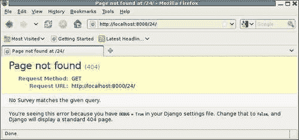
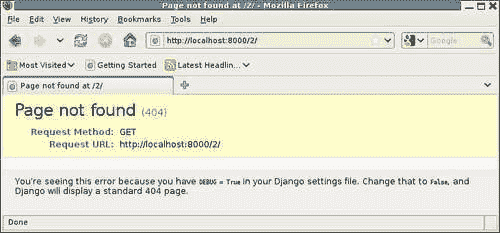
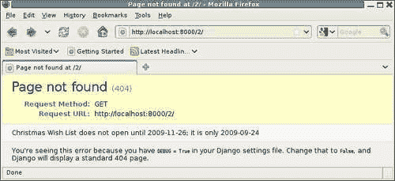
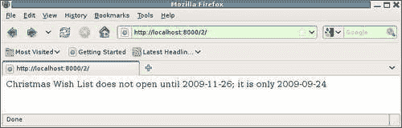
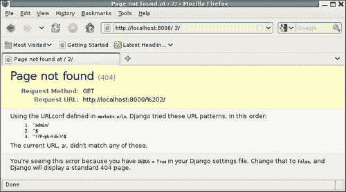

# 第六章：Django 调试概述

世界上最好的测试套件也无法使您免受调试问题的困扰。测试只是报告代码是否正常工作。当代码出现问题时，无论是通过失败的测试还是其他方式发现的，都需要进行调试以弄清楚到底出了什么问题。一个良好的测试套件，定期运行，当然可以帮助调试。从失败的测试中得到的错误消息的具体信息，通过测试通过与测试失败提供的聚合信息，以及引入问题的代码更改的知识，都可以为调试提供重要线索。有时这些线索足以弄清楚出了什么问题以及如何解决，但通常需要进行额外的调试。

本章介绍了 Django 的调试支持。它概述了将在随后章节中更深入讨论的主题。具体来说，本章将：

+   列出控制调试信息收集和呈现的 Django 设置，并简要描述启用调试的影响

+   在严重代码失败的情况下运行调试时的结果

+   描述了启用调试时收集的数据库查询历史记录，并显示如何访问它

+   讨论开发服务器的功能，以帮助调试

+   描述了在生产过程中如何处理错误，当调试关闭时，以及如何确保适当地报告此类错误的信息

# Django 调试设置

Django 有许多设置，用于控制调试信息的收集和呈现。主要设置名为 DEBUG；它广泛地控制服务器是在开发模式（如果 DEBUG 为 True）还是生产模式下运行。

在开发模式下，最终用户预期是站点开发人员。因此，如果在处理请求时出现错误，则在发送到 Web 浏览器的响应中包含有关错误的具体技术信息是有用的。但在生产模式下，当用户预期只是一般站点用户时，这是没有用的。

本节描述了在开发过程中用于调试的三个 Django 设置。在生产过程中使用其他设置来控制应该报告什么错误，以及错误报告应该发送到哪里。这些额外的设置将在处理生产中的问题部分中讨论。

## 调试和 TEMPLATE_DEBUG 设置

DEBUG 是主要的调试设置。将其设置为 True 的最明显影响之一是，当 Django 在处理请求时出现严重代码问题，例如引发异常时，将生成花哨的错误页面响应。如果 TEMPLATE_DEBUG 也为 True，并且引发的异常与模板错误有关，则花哨的错误页面还将包括有关错误发生位置的信息。

这些设置的默认值都是 False，但由 manage.py startproject 创建的 settings.py 文件通过在文件顶部包含以下行来打开它们：

```py
DEBUG = True 
TEMPLATE_DEBUG = DEBUG 
```

请注意，当 DEBUG 为 False 时，将 TEMPLATE_DEBUG 设置为 True 是没有用的。如果不显示由 DEBUG 设置控制的花哨错误页面，则打开 TEMPLATE_DEBUG 时收集的额外信息将永远不会显示。同样，当 DEBUG 为 True 时，将 TEMPLATE_DEBUG 设置为 False 也没有什么用。在这种情况下，对于模板错误，花哨的调试页面将缺少有用的信息。因此，保持这些设置彼此相关是有意义的，如之前所示。

关于花哨的错误页面以及它们何时生成将在下一节中介绍。除了生成这些特殊页面之外，打开 DEBUG 还有其他一些影响。具体来说，当 DEBUG 打开时：

+   将记录发送到数据库的所有查询。记录的详细信息以及如何访问它将在随后的部分中介绍。

+   对于 MySQL 数据库后端，数据库发出的警告将转换为 Python`Exceptions`。这些 MySQL 警告可能表明存在严重问题，但警告（仅导致消息打印到`stderr`）可能会被忽略。由于大多数开发都是在打开`DEBUG`的情况下进行的，因此对 MySQL 警告引发异常可以确保开发人员意识到可能存在的问题。我们在第三章中遇到了这种行为，*测试 1、2、3：基本单元测试*，当我们看到`testClosesReset`单元测试根据`DEBUG`设置和 MySQL 服务器配置的不同而产生不同的结果时。

+   管理应用程序对所有注册模型的配置进行了广泛的验证，并且在发现配置中存在错误时，在首次尝试访问任何管理页面时引发`ImproperlyConfigured`异常。这种广泛的验证相当昂贵，通常不希望在生产服务器启动期间进行，因为管理配置可能自上次启动以来没有更改。但是，在打开`DEBUG`的情况下，可能会发生管理配置的更改，因此进行显式验证并提供有关检测到问题的具体错误消息是有用且值得成本的。

+   最后，在 Django 代码中有几个地方，当`DEBUG`打开时会发生错误，并且生成的响应将包含有关错误原因的特定信息，而当`DEBUG`关闭时，生成的响应将是一个通用错误页面。

## TEMPLATE_STRING_IF_INVALID 设置

在开发过程中进行调试时可能有用的第三个设置是`TEMPLATE_STRING_IF_INVALID`。此设置的默认值为空字符串。此设置用于控制在模板中插入无效引用（例如，在模板上下文中不存在的引用）的位置。将空字符串的默认值设置为结果中没有任何可见的东西代替这些无效引用，这可能使它们难以注意到。将`TEMPLATE_STRING_IF_INVALID`设置为某个值可以使跟踪此类无效引用更容易。

然而，Django 附带的一些代码（特别是管理应用程序）依赖于无效引用的默认行为被替换为空字符串。使用非空的`TEMPLATE_STRING_IF_INVALID`设置运行此类代码可能会产生意外结果，因此此设置仅在您明确尝试跟踪诸如代码中始终确保变量（即使是空变量）在模板上下文中设置的拼写错误模板变量之类的内容时才有用。

# 调试错误页面

使用`DEBUG`，Django 在两种情况下生成漂亮的调试错误页面：

+   当引发`django.http.Http404`异常时

+   当引发任何其他异常并且未被常规视图处理代码处理时

在后一种情况下，调试页面包含大量关于错误、引发错误的请求以及发生错误时的环境的信息。解密此页面并充分利用其呈现的信息将在下一章中介绍。`Http404`异常的调试页面要简单得多，将在此处介绍。

查看`Http404`调试页面的示例，请考虑第四章中的`survey_detail`视图：

```py
def survey_detail(request, pk): 
    survey = get_object_or_404(Survey, pk=pk) 
    today = datetime.date.today() 
    if survey.closes < today: 
        return display_completed_survey(request, survey) 
    elif survey.opens > today: 
        raise Http404 
    else: 
        return display_active_survey(request, survey) 
```

此视图可能引发`Http404`异常的两种情况：当在数据库中找不到请求的调查时，以及当找到但尚未打开时。因此，我们可以通过尝试访问不存在的调查的调查详细信息，比如调查编号 24，来查看调试 404 页面。结果将如下所示：



请注意页面中间有一条消息，描述了页面未找到响应的原因：**没有符合给定查询的调查**。这条消息是由`get_object_or_404`函数自动生成的。相比之下，在找到调查但尚未开放的情况下，裸露的`raise Http404`看起来不会有任何描述性消息。为了确认这一点，添加一个将来有开放日期的调查，并尝试访问其详细页面。结果将类似于以下内容：



这不是一个非常有用的调试页面，因为它缺乏关于搜索内容和为什么无法显示的任何信息。为了使此页面更有用，在引发`Http404`异常时包含一条消息。例如：

```py
        raise Http404("%s does not open until %s; it is only %s" %  
            (survey.title, survey.opens, today)) 
```

然后尝试访问此页面将会更有帮助：



请注意，`Http404`异常附带的错误消息只会显示在调试 404 页面上；它不会出现在标准的 404 页面上。因此，您可以尽量使这些消息描述性，而不必担心它们会向普通用户泄露私人或敏感信息。

还要注意的一点是，只有在引发`Http404`异常时才会生成调试 404 页面。如果您手动构造带有 404 状态代码的`HttpResponse`，它将被返回，而不是调试 404 页面。考虑以下代码：

```py
      return HttpResponse("%s does not open until %s; it is only %s" %
          (survey.title, survey.opens, today), status=404) 
```

如果使用这段代码来替代`raise Http404`变体，那么浏览器将简单地显示传递的消息：



没有显著的**页面未找到**消息和独特的错误页面格式，这个页面甚至不明显是一个错误报告。还要注意，一些浏览器默认会用所谓的“友好”错误页面替换服务器提供的内容，这些页面往往更加缺乏信息。因此，使用`Http404`异常而不是手动构建带有状态码 404 的`HttpResponse`对象既更容易又更有用。

调试 404 页面的最后一个示例非常有用，当 URL 解析失败时会生成。例如，如果我们在 URL 中的调查号之前添加了额外的空格，生成的调试 404 页面将如下所示：



此页面上的消息包括了解析 URL 失败的所有必要信息。它包括当前 URL，用于解析的基本`URLConf`的名称，以及按顺序尝试匹配的所有模式。

如果您进行了大量的 Django 应用程序编程，很可能会在某个时候看到此页面，并且会相信其中列出的模式之一应该匹配给定的 URL。你错了。不要浪费精力试图弄清楚 Django 怎么会出现这样的问题。相反，相信错误消息，并集中精力弄清楚为什么你认为应该匹配的模式实际上并没有匹配。仔细查看模式的每个元素，并将其与当前 URL 中的实际元素进行比较：总会有一些不匹配的地方。

在这种情况下，您可能会认为第三个列出的模式应该与当前 URL 匹配。模式中的第一个元素是主键值的捕获，而实际的 URL 值确实包含可能是主键的数字。然而，捕获是使用模式**\d+**完成的。尝试将其与实际 URL 字符匹配——一个空格后跟着**2**——失败了，因为**\d**只匹配数字字符，而空格字符不是数字字符。总会有类似这样的东西来解释为什么 URL 解析失败。

下一章将包括更多导致调试页面的常见错误示例，并深入了解这些页面上提供的所有信息。现在，我们将离开调试页面的主题，学习在`DEBUG`打开时维护的数据库查询历史的访问。

# 数据库查询历史

当`DEBUG`为`True`时，Django 会保留发送到数据库的所有 SQL 命令的历史记录。这个历史记录保存在名为`queries`的列表中，位于`django.db.connection`模块中。查看此列表中保存的内容最简单的方法是从 shell 会话中检查它。

```py
>>> from django.db import connection 
>>> connection.queries 
[] 
>>> from survey.models import Survey 
>>> Survey.objects.count() 
2 
>>> connection.queries 
[{'time': '0.002', 'sql': u'SELECT COUNT(*) FROM "survey_survey"'}] 
>>> 

```

在这里，我们看到`queries`在 shell 会话开始时最初是空的。然后，我们检索数据库中`Survey`对象的数量，结果为**2**。当我们再次显示`queries`的内容时，我们看到`queries`列表中现在有一个查询。列表中的每个元素都是一个包含两个键的字典：`time`和`sql`。`time`的值是查询执行所需的时间（以秒为单位）。`sql`的值是实际发送到数据库的 SQL 查询。

关于`connection.queries`中包含的 SQL 的一件事：它不包括查询参数的引用。例如，考虑对以`Christmas`开头的`Surveys`进行查询时显示的 SQL：

```py
>>> Survey.objects.filter(title__startswith='Christmas') 
[<Survey: Christmas Wish List (opens 2009-11-26, closes 2009-12-31)>] 
>>> print connection.queries[-1]['sql'] 
SELECT "survey_survey"."id", "survey_survey"."title", "survey_survey"."opens", "survey_survey"."closes" FROM "survey_survey" WHERE "survey_survey"."title" LIKE Christmas% ESCAPE '\'  LIMIT 21 
>>>

```

在显示的 SQL 中，`Christmas％`需要引用才能使 SQL 有效。然而，在存储在`connection.queries`中时，我们看到它没有被引用。原因是 Django 实际上并没有以这种形式将查询传递给数据库后端。相反，Django 传递参数化查询。也就是说，传递的查询字符串包含参数占位符，并且参数值是分开传递的。然后，由数据库后端执行参数替换和适当的引用。

对于放置在`connection.queries`中的调试信息，Django 进行参数替换，但不尝试进行引用，因为这取决于后端。因此，不要担心`connection.queries`中缺少参数引用：这并不意味着参数在实际发送到数据库时没有正确引用。但是，这意味着`connection.queries`中的 SQL 不能直接成功地剪切和粘贴到数据库 shell 程序中。如果要在数据库 shell 中使用`connection.queries`中的 SQL 形式，您需要提供缺失的参数引用。

你可能已经注意到并且可能对前面的 SQL 中包含的`LIMIT 21`感到好奇。所请求的`QuerySet`没有包括限制，那么为什么 SQL 包括了限制呢？这是`QuerySet repr`方法的一个特性，这是 Python shell 调用来显示`Survey.objects.filter`调用返回的值。

`QuerySet`可能有许多元素，如果非常大，则在 Python shell 会话中显示整个集合并不特别有用。因此，`QuerySet repr`最多显示 20 个项目。如果有更多，`repr`将在末尾添加省略号，以指示显示不完整。因此，对`QuerySet`进行`repr`调用的结果的 SQL 将限制结果为 21 个项目，这足以确定是否需要省略号来指示打印的结果是不完整的。

每当您在数据库查询中看到包含`LIMIT 21`，这表明该查询很可能是对`repr`的调用的结果。由于应用程序代码不经常调用`repr`，因此这样的查询很可能是由其他代码（例如 Python shell，或图形调试器变量显示窗口）导致的，这些代码可能会自动显示`QuerySet`变量的值。牢记这一点可以帮助减少在尝试弄清楚为什么某些查询出现在`connection.queries`中时的困惑。

关于`connection.queries`还有一件事要注意：尽管名字是这样，它不仅限于 SQL 查询。所有发送到数据库的 SQL 语句，包括更新和插入，都存储在`connection.queries`中。例如，如果我们从 shell 会话中创建一个新的`Survey`，我们将看到生成的 SQL INSERT 存储在`connection.queries`中。

```py
>>> import datetime
>>> Survey.objects.create(title='Football Favorites',opens=datetime.date.today()) 
<Survey: Football Favorites (opens 2009-09-24, closes 2009-10-01)> 
>>> print connection.queries[-1]['sql'] 
INSERT INTO "survey_survey" ("title", "opens", "closes") VALUES (Football Favorites, 2009-09-24, 2009-10-01) 
>>> 

```

在这里，我们一直在从 shell 会话中访问`connection.queries`。然而，通常在请求处理后查看它的内容可能是有用的。也就是说，我们可能想知道在创建页面期间生成了什么数据库流量。然而，在 Python shell 中重新创建视图函数的调用，然后手动检查`connection.queries`并不特别方便。因此，Django 提供了一个上下文处理器`django.core.contextprocessors.debug`，它提供了方便的访问从模板中存储在`connection.queries`中的数据。在第八章*问题隐藏时：获取更多信息*中，我们将看到如何使用这个上下文处理器将`connection.queries`中的信息包含在我们生成的页面中。

# 开发服务器中的调试支持

我们一直在使用的开发服务器自第三章以来，具有几个特点有助于调试。首先，它提供了一个控制台，允许在开发过程中轻松报告 Django 应用程序代码的情况。开发服务器本身向控制台报告其操作的一般信息。例如，开发服务器的典型输出如下：

```py
kmt@lbox:/dj_projects/marketr$ python manage.py runserver 
Validating models... 
0 errors found 

Django version 1.1, using settings 'marketr.settings' 
Development server is running at http://127.0.0.1:8000/ 
Quit the server with CONTROL-C. 
[25/Sep/2009 07:51:24] "GET / HTTP/1.1" 200 480 
[25/Sep/2009 07:51:27] "GET /survey/1/ HTTP/1.1" 200 280 
[25/Sep/2009 07:51:33] "GET /survey/888/ HTTP/1.1" 404 1704 

```

正如你所看到的，开发服务器首先通过显式验证模型来启动。如果发现任何错误，它们将在服务器启动期间得到突出报告，并且将阻止服务器进入请求处理循环。这有助于确保在开发过程中发现任何错误的模型更改。

服务器然后报告正在运行的 Django 的级别，使用的设置文件，以及它正在侦听的主机地址和端口。其中的第一个在你安装了多个 Django 版本并在它们之间切换时非常有用。例如，如果你在`site-packages`中安装了最新版本，但也有一个当前主干的 SVN 检出，你可以通过开发服务器报告的版本来确认（或不确认）你当前使用的版本是否是你打算使用的版本。

最后的启动消息指出，你可以通过按*Ctrl-C*来终止服务器。然后服务器进入请求处理循环，并将继续报告它处理的每个请求的信息。对于每个请求打印的信息是：

+   请求被处理的日期和时间，用方括号括起来

+   请求本身，其中包括 HTTP 方法（例如 GET 或 POST）、路径和客户端指定的 HTTP 版本，全部用引号括起来

+   返回的 HTTP 状态代码

+   返回响应中的字节数

在前面的示例输出中，我们可以看到服务器已经响应了三个`GET`请求，所有请求都指定了`1.1`的 HTTP 版本。首先是根 URL`/`，导致 HTTP`200`（OK）状态代码和`480`字节的响应。对`/survey/1/`的请求也被成功处理，并产生了`280`字节的响应，但`/survey/888/`导致了`404`的 HTTP 状态和`1704`字节的响应。返回`404`状态是因为数据库中不存在主键为`888`的调查。能够看到开发服务器实际接收到了什么请求，以及返回了什么响应，通常非常有用。

开发服务器处理的一些请求不会显示在控制台上。首先，不会记录对管理员媒体文件（即 CSS、JavaScript 和图像）的请求。如果查看管理员页面的 HTML 源代码，你会看到它在`<head>`部分包含了 CSS 文件的链接。例如：

```py
<head> 
<title>Site administration | Django site admin</title> 
<link rel="stylesheet" type="text/css" href="/media/css/base.css" /> 
<link rel="stylesheet" type="text/css" href="/media/css/dashboard.css" /> 
```

接收此文档的 Web 浏览器将继续从生成原始页面的同一服务器检索`/media/css/base.css`和`/media/css/dashboard.css`。开发服务器将接收并自动提供这些文件，但不会记录这一活动。具体来说，它将提供但不记录以`ADMIN_MEDIA_PREFIX`设置开头的 URL 的请求。（此设置的默认值为`/media/`）。

开发服务器不会记录的第二个请求是对`/favicon.ico`的任何请求。这是许多 Web 浏览器自动请求的文件，以便将图标与书签页面关联，或在地址栏中显示图标。没有必要用这个文件的请求来混淆开发服务器的输出，因此它永远不会被记录。

通常在调试问题时，开发服务器自动记录的非常基本的信息可能不足以弄清楚发生了什么。当发生这种情况时，你可以向应用程序代码添加日志。假设你将添加的日志输出路由到`stdout`或`stderr`，它将与开发服务器的正常输出一起显示在控制台上。

请注意，一些生产部署环境不允许将输出发送到`stdout`。在这种环境中，应用程序代码中错误地留下的调试打印语句可能会导致生产中的服务器故障。为了避免这种情况，始终将调试打印语句路由到`stderr`而不是`stdout`。

还要注意的是，开发服务器进行的请求日志记录发生在请求处理的最后。记录的信息包括响应的大小，因此在此行出现之前，响应已经完全生成。因此，例如在应用程序视图函数中添加的任何日志都会出现在开发服务器记录的单行之前。不要混淆并认为视图函数中的打印是指上面记录的请求服务所做的工作。有关向应用程序代码添加日志的更多详细信息将在第八章中讨论。

开发服务器的第二个功能是在开发和调试代码时非常有用的，它会自动注意到磁盘上的源代码更改并重新启动，以便始终运行当前的代码。当它重新启动时，会再次打印启动消息，你可以从中得知发生了什么。例如，考虑以下输出：

```py
kmt@lbox:/dj_projects/marketr$ python manage.py runserver 
Validating models... 
0 errors found 

Django version 1.1, using settings 'marketr.settings' 
Development server is running at http://127.0.0.1:8000/ 
Quit the server with CONTROL-C. 
[25/Sep/2009 07:51:24] "GET / HTTP/1.1" 200 480 
[25/Sep/2009 07:51:27] "GET /survey/1/ HTTP/1.1" 200 280 
[25/Sep/2009 07:51:33] "GET /survey/888/ HTTP/1.1" 404 1704 
Validating models... 
0 errors found 

Django version 1.1, using settings 'marketr.settings' 
Development server is running at http://127.0.0.1:8000/ 
Quit the server with CONTROL-C. 
[25/Sep/2009 08:20:15] "GET /admin/ HTTP/1.1" 200 7256 

```

在这里进行了一些代码更改，导致开发服务器在处理**GET /survey/888/**和**GET /admin/**请求之间重新启动。

虽然这种自动重新启动行为很方便，但有时也会遇到问题。这种情况最常发生在编辑并保存带有错误的代码时。有时，但并非总是，加载错误的文件会导致开发服务器无法注意到文件的后续更改。因此，即使错误被注意到并修复，修正版本也可能不会自动加载。如果看起来开发服务器没有在应该的时候重新加载，最好手动停止并重新启动它。

开发服务器的这种自动重新加载功能可以通过向`runserver`传递`--noreload`选项来关闭。当单独运行开发服务器时，您可能不经常想要指定这一点，但是如果您在调试器下运行它，您可能需要指定这个选项，以便调试器断点能够被正确识别。这是开发服务器的最后一个使其用于调试的特性：很容易在调试器下运行。关于这一点将在第九章中进行详细介绍，*当你甚至不知道要记录什么时：使用调试器*。

# 处理生产中的问题

在理想的世界中，所有的代码问题都会在开发过程中被发现，并且在代码运行在生产模式时永远不会出错。然而，尽管尽最大努力，这种理想在现实中很少实现。我们必须为代码在生产模式下运行时出现严重问题的情况做好准备，并在发生时安排做一些明智的事情。

做一些明智的事情需要考虑什么？首先，仍然需要向发送引发错误请求的客户端返回一些响应。但是响应应该只是一个一般的错误指示，不包含在`DEBUG`激活时生成的复杂调试错误页面中找到的具体内部细节。在最好的情况下，Django 调试错误页面可能会让一般的网络用户感到困惑，但在最坏的情况下，从中获取的信息可能会被一些恶意用户用来尝试破坏网站。因此，对于引发错误的请求产生的公共响应应该是一个通用的错误页面。

这些错误的具体细节仍然应该提供给网站管理员，以便分析和修复问题。Django 通过将`DEBUG`设置为`False`时遇到的错误详细信息发送到`settings.py`中指定的电子邮件地址列表来实现这一点。电子邮件中包含的信息并不像调试页面上所找到的那样详尽，但通常足以开始重新创建和修复问题。

本节讨论了处理生产过程中遇到的错误所需的步骤。首先，描述了返回通用错误页面所需的操作，然后讨论了指定发送更详细错误信息的设置。

## 创建通用错误页面

与复杂的错误页面一样，通用错误页面有两种类型：一种是报告网站上不存在页面的情况，另一种是报告在处理请求时发生了一些内部服务器错误。Django 为这些错误情况提供了默认处理程序，自动加载和呈现名为`404.html`和`500.html`的模板。依赖于这些错误的默认处理的项目必须提供这些名称的模板以供加载和呈现。`manage.py startproject`不会创建这些文件的默认值。

当呈现`404.html`模板时，它会传递一个`RequestContext`，其中一个名为`request_path`的变量被设置为引发`Http404`异常的 URL 路径的值。然后，`404.html`模板可以使用`request_path`值和上下文处理器设置的其他变量来定制生成的特定响应。

另一方面，`500.html`模板是使用空上下文呈现的。当发生内部服务器错误时，服务器代码出现了严重问题。尝试通过上下文处理器处理`RequestContext`可能会导致另一个异常被引发。为了确保响应能够在没有进一步错误的情况下生成，`500.html`模板是使用空上下文呈现的。这意味着`500.html`模板不能依赖于通常由上下文处理器设置的任何上下文变量。

可以通过为这两种错误情况中的任何一种或两种提供自定义错误处理程序来覆盖默认的错误处理。Django 文档提供了如何执行此操作的详细信息；这里没有涵盖，因为默认处理程序对绝大多数情况都很好。

## 报告生产错误信息

尽管最好避免向一般用户呈现详细的技术错误信息，但完全丢失这些信息也不好。Django 支持在生产中遇到错误时通知站点管理员。与这些通知相关的设置在本节中讨论。第十一章，“当是时候上线：转向生产”，提供了有关转向生产并解决沿途遇到的一些常见问题的更多指导。

### 内部服务器错误通知

当服务器发生错误时，Django 会向`ADMINS`设置中列出的所有电子邮件地址发送一封包含生成错误的请求的详细信息和错误的回溯的电子邮件。`ADMINS`是包含名称和电子邮件地址的元组列表。由`manage.py startproject`设置的值是：

```py
ADMINS = ( 
    # ('Your Name', 'your_email@domain.com'), 
) 
```

注释行显示了您应该使用的格式来向此设置添加值。

没有设置来控制是否应发送服务器错误通知：Django 将始终尝试发送这些通知。但是，如果您真的不希望为内部服务器错误生成电子邮件通知，可以将`ADMINS`设置为空。尽管这不是推荐的做法，因为除非您的用户向您抱怨，否则您将不知道您的网站是否遇到困难。

Django 使用 Python 的 SMTP 支持来发送电子邮件。为了使其工作，Django 必须正确配置以与 SMTP 服务器通信。有几个设置可以控制发送邮件，您可能需要根据您的安装进行自定义：

+   `EMAIL_HOST`是运行 SMTP 服务器的主机的名称。此设置的默认值为`localhost`，因此如果在与 Django 服务器相同的机器上没有运行 SMTP 服务器，则需要将其设置为运行 SMTP 服务器的主机，以便用于发送邮件。

+   `EMAIL_HOST_USER`和`EMAIL_HOST_PASSWORD`可以一起用于对 SMTP 服务器进行身份验证。默认情况下，两者都设置为空字符串。如果其中一个设置为空字符串，那么 Django 将不会尝试对 SMTP 服务器进行身份验证。如果您使用需要身份验证的服务器，则需要将其设置为正在使用的 SMTP 服务器的有效值。

+   `EMAIL_USE_TLS`指定是否使用安全（传输层安全）连接到 SMTP 服务器。默认值为`False`。如果您使用需要安全连接的 SMTP 服务器，则需要将其设置为`True`。

+   `EMAIL_PORT`指定要连接的端口。默认值是默认的 SMTP 端口，25。如果您的 SMTP 服务器在不同的端口上监听（当`EMAIL_USE_TLS`为`True`时很典型），则必须在此处指定。

+   `SERVER_EMAIL`是将用作发送邮件的`From`地址的电子邮件地址。默认值为`root@localhost`。一些电子邮件提供商拒绝接受使用此默认`From`地址的邮件，因此最好将其设置为电子邮件服务器的有效`From`地址。

+   `EMAIL_SUBJECT_PREFIX`是一个字符串，将放在电子邮件的`Subject`开头。默认值为`[Django]`。您可能希望将其自定义为特定于站点的内容，以便支持多个站点的管理员可以从电子邮件主题一瞥中知道哪个站点遇到了错误。

一旦您设置了您认为对于正在使用的 SMTP 服务器正确的所有值，最好验证邮件是否成功发送。为此，将`ADMINS`设置为包括您自己的电子邮件地址。然后将`DEBUG=False`，并执行会导致服务器错误的操作。实现这一点的一种简单方法是将`404.html`模板重命名为其他内容，然后尝试访问服务器指定会引发`Http404`异常的 URL。

例如，尝试访问不存在的调查详细页面或未来的开放日期。这个尝试应该会导致发送一封电子邮件给您。主题将以您服务器的`EMAIL_SUBJECT_PREFIX`开头，并包括生成错误的请求的 URL 路径。电子邮件的文本将包含错误的回溯，然后是导致错误的请求的详细信息。

### 未找到页面通知

页面未找到错误比服务器错误要轻得多。实际上，它们可能根本不表示代码中的错误，因为它们可能是用户在浏览器地址栏中错误输入地址导致的。然而，如果它们是用户尝试跟随链接的结果，您可能想知道这一点。这种情况被称为损坏的链接，通常可以通过请求中的 HTTP `Referer` [sic]标头来区分开第一种情况。Django 支持在检测到用户通过损坏的链接尝试访问不存在的页面时发送电子邮件通知。

与内部服务器错误通知不同，发送损坏的链接通知是可选的。控制 Django 是否发送损坏链接的电子邮件通知的设置是`SEND_BROKEN_LINK_EMAILS`。此设置的默认值为`False`；如果要 Django 生成这些电子邮件，则需要将其设置为`True`。此外，必须启用常见中间件（`django.middleware.common.CommonMiddleware`）才能发送损坏的链接电子邮件。此中间件默认启用。

此设置生成的电子邮件将发送到`MANAGERS`设置中找到的电子邮件地址。因此，您可以将这些通知发送给不同的人员组，而不是服务器错误电子邮件。但是，如果您希望将这些发送给接收服务器错误电子邮件的相同人员组，只需在`settings.py`中的`ADMINS`设置后设置`MANAGERS = ADMINS`。

除了电子邮件收件人之外，所有相同的电子邮件设置都将用于发送损坏的链接电子邮件，就像用于服务器错误电子邮件一样。因此，如果您已经验证了服务器错误电子邮件成功发送，损坏的链接电子邮件也将成功发送。

损坏的链接电子邮件通知只有在合法问题的报告没有被网页爬虫、机器人和恶意人员的活动淹没时才有用。为了确保发送的通知与有效问题相关，还有一些额外的设置可以用来限制报告为损坏链接的 URL 路径。这些是`IGNORABLE_404_STARTS`和`IGNORABLE_404_ENDS`。只有不以`IGNORABLE_404_STARTS`开头且不以`IGNORABLE_404_ENDS`结尾的请求页面才会发送损坏的链接电子邮件。

`IGNORABLE_404_STARTS`的默认值是：

```py
('/cgi-bin/', '/_vti_bin', '/_vti_inf')
```

`IGNORABLE_404_ENDS`的默认值是：

```py
('mail.pl', 'mailform.pl', 'mail.cgi', 'mailform.cgi', 'favicon.ico', '.php')
```

您可以根据需要添加这些内容，以确保为损坏的链接生成的电子邮件报告实际问题。

# 总结

我们现在已经完成了 Django 中的调试支持概述。在本章中，介绍了许多主题，这些主题将在后续章节中得到更深入的介绍。具体来说，我们有：

+   学习了关于 Django 设置的知识，这些设置控制了调试信息的收集和展示

+   看到了当调试打开时，会生成特殊的错误页面，这有助于调试问题的任务。

+   了解了在调试打开时维护的数据库查询历史，并看到如何访问它

+   讨论了开发服务器的几个特性，在调试时非常有帮助

+   描述了在生产环境中如何处理错误，以及与确保有用的调试信息发送到正确人员相关的设置

下一章将继续深入探讨 Django 调试页面的细节。
