# 第八章：当问题隐藏时：获取更多信息

有时代码不会触发显示调试页面，但也不会产生正确的结果。事实上，即使代码似乎在浏览器中显示的可见结果方面工作正常，幕后它可能也在做一些意想不到的事情，这可能会在以后引起麻烦。例如，如果一个页面需要许多（或非常耗时的）SQL 查询，那么在开发过程中它可能看起来运行正常，但在生产环境中很快就会导致服务器超载。

因此，养成检查代码行为的习惯是很好的做法，即使外部结果没有显示任何问题。首先，这种做法可以揭示最好尽早知道的隐藏问题。其次，当问题确实出现时，了解正常的代码路径是非常有价值的。

本章重点介绍了获取有关 Django 应用程序代码正在执行的更多信息的方法。具体来说，在本章中我们将：

+   开发模板代码，用于在页面本身包含有关渲染页面所需的所有 SQL 查询的信息

+   学习如何使用 Django 调试工具栏收集类似信息，以及更多

+   讨论向 Django 应用程序代码添加日志记录的技术

# 跟踪请求的 SQL 查询

对于典型的 Django 应用程序，数据库交互非常重要。确保所做的数据库查询是正确的有助于确保应用程序的结果是正确的。此外，确保为应用程序生成的数据库查询是高效的有助于确保应用程序能够支持所需数量的并发用户。

Django 通过使数据库查询历史可供检查来支持这一领域。第六章，“Django 调试概述”介绍了这一历史，并展示了如何从 Python shell 会话中访问它。这种访问对于查看由于调用特定模型方法而发出的 SQL 非常有用。然而，它对于了解在处理特定请求期间进行了哪些 SQL 查询并不有用。

本节将展示如何在页面本身包含有关生产页面所需的 SQL 查询的信息。我们将修改现有的调查应用程序模板以包含查询信息，并检查一些现有调查应用程序视图的查询历史。虽然我们不知道现有视图存在任何问题，但在验证它们是否发出我们期望的查询时，我们可能会学到一些东西。

## 在模板中访问查询历史的设置

在可以从模板中访问查询历史之前，我们需要确保一些必需的设置被正确配置。为了使 SQL 查询信息在模板中可用，需要三个设置。首先，必须在`TEMPLATE_CONTEXT_PROCESSORS`设置中包含调试上下文处理器`django.core.context_processors.debug`。这个上下文处理器包含在`TEMPLATE_CONTEXT_PROCESSORS`的默认值中。我们没有更改该设置；因此，我们不需要在项目中做任何事情来启用这个上下文处理器。

其次，发送请求的机器的 IP 地址必须列在`INTERNAL_IPS`设置中。这不是我们以前使用过的设置，默认情况下为空，因此我们需要将其添加到设置文件中。在使用与开发服务器运行的相同机器进行测试时，将`INTERNAL_IPS`设置为包括环回地址就足够了：

```py
# Addresses for internal machines that can see potentially sensitive
# information such as the query history for a request.
INTERNAL_IPS = ('127.0.0.1', ) 
```

如果您还从其他机器进行测试，您还需要在此设置中包含它们的 IP 地址。

第三，最后，`DEBUG`必须为`True`，才能在模板中使用 SQL 查询历史。

当满足这三个设置条件时，SQL 查询历史可能可以通过名为`sql_queries`的模板变量在模板中使用。这个变量包含一个字典列表。每个字典包含两个键：`sql`和`time`。`sql`的值是 SQL 查询本身，`time`的值是查询执行所花费的秒数。

请注意，`sql_queries`上下文变量是由调试上下文处理器设置的。只有在使用`RequestContext`来渲染模板时，上下文处理器才会被调用。到目前为止，我们在调查应用程序视图中没有使用`RequestContexts`，因为到目前为止代码还不需要。但是为了从模板中访问查询历史，我们需要开始使用`RequestContexts`。因此，除了修改模板，我们还需要稍微修改视图代码，以便在调查应用程序的生成页面中包含查询历史。

## 主页的 SQL 查询

让我们首先看看为了生成`survey`应用程序主页而发出了哪些查询。回想一下主页视图代码是：

```py
def home(request):
    today = datetime.date.today()
    active = Survey.objects.active()
    completed = Survey.objects.completed().filter(closes__gte=today-
                    datetime.timedelta(14))
    upcoming = Survey.objects.upcoming().filter(
                    opens__lte=today+datetime.timedelta(7))
    return render_to_response('survey/home.html',
        {'active_surveys': active,
        'completed_surveys': completed,
        'upcoming_surveys': upcoming,
        }) 
```

模板中呈现了三个`QuerySets`，所以我们期望看到这个视图生成三个 SQL 查询。为了检查这一点，我们必须首先更改视图以使用`RequestContext`：

```py
from django.template import RequestContext 
def home(request): 
    today = datetime.date.today() 
    active = Survey.objects.active() 
    completed = Survey.objects.completed().filter(closes__gte=today-datetime.timedelta(14)) 
    upcoming = Survey.objects.upcoming().filter(opens__lte=today+datetime.timedelta(7)) 
    return render_to_response('survey/home.html', 
        {'active_surveys': active, 
         'completed_surveys': completed, 
         'upcoming_surveys': upcoming,}, 
        RequestContext(request)) 
```

这里唯一的变化是在文件中添加了`import`后，将`RequestContext(request)`作为`render_to_response`的第三个参数添加进去。当我们做出这个改变时，我们可能也会改变其他视图的`render_to_response`行，以便也使用`RequestContexts`。这样，当我们到达检查每个查询的 SQL 查询的时候，我们不会因为忘记做出这个小改变而被绊倒。

其次，我们需要在我们的`survey/home.html`模板中的某个地方显示来自`sql_queries`的信息。但是在哪里？我们不一定希望这些信息与真实应用程序数据一起显示在浏览器中，因为那可能会让人困惑。将其包含在响应中但不自动显示在浏览器页面上的一种方法是将其放在 HTML 注释中。然后浏览器不会在页面上显示它，但可以通过查看显示页面的 HTML 源代码来看到它。

作为实现这一点的第一次尝试，我们可能会改变`survey/home.html`的顶部，看起来像这样：

```py
 
 
<!-- 
{{ sql_queries|length }} queries 
 
{{ qdict.sql }} ({{ qdict.time }} seconds) 
 
--> 
```

这个模板代码在`survey/home.html`提供的`content`块的开头以 HTML 注释的形式打印出`sql_queries`的内容。首先，通过`length`过滤器过滤列表来记录查询的数量。然后代码遍历`sql_queries`列表中的每个字典，并显示`sql`，然后跟着每个查询所花费的`time`的括号注释。

这个方法效果如何？如果我们尝试通过检索调查主页（确保开发服务器正在运行），并使用浏览器菜单项查看页面的 HTML 源代码，我们可能会看到评论块包含类似以下内容：

```py
<!--
1 queries

SELECT `django_session`.`session_key`, `django_session`.`session_data`, `django_session`.`expire_date` FROM `django_session` WHERE (`django_session`.`session_key` = d538f13c423c2fe1e7f8d8147b0f6887  AND `django_session`.`expire_date` &gt; 2009-10-24 17:24:49 ) (0.001 seconds)

--> 

```

### 注意

请注意，这里显示的查询数量取决于您正在运行的 Django 版本。这个结果来自 Django 1.1.1；Django 的后续版本可能不会显示任何查询。此外，浏览器与网站的交互历史将影响发出的查询。这个结果来自一个曾用于访问管理应用程序的浏览器，最后一次与管理应用程序的交互是退出登录。如果浏览器曾用于访问管理应用程序但用户未注销，则可能会看到其他查询。最后，使用的数据库也会影响发出的具体查询和其确切格式。这个结果来自一个 MySQL 数据库。

这并不是我们预期的。首先，一个小小的烦恼，但是`1 queries`是错误的，应该是`1 query`。也许这不会让你烦恼，特别是在内部或调试信息中，但对我来说会让我烦恼。我会更改显示查询计数的模板代码，以使用正确的复数形式：

```py
 
{{ qcount }} quer{{ qcount|pluralize:"y,ies" }} 
 
```

在这里，由于模板需要多次使用`length`结果，首先通过使用``块将其缓存在`qcount`变量中。然后它被显示，并且它被用作`pluralize`过滤器的变量输入，该过滤器将根据`qcount`值在`quer`的末尾放置正确的字母。现在注释块将显示`0 queries`，`1 query`，`2 queries`等等。

解决了这个小小的烦恼后，我们可以集中精力解决下一个更大的问题，那就是显示的查询不是我们预期的查询。此外，我们预期的三个查询，用于检索已完成、活动和即将进行的调查列表，都不见了。发生了什么？我们将依次处理每一个。

显示的查询正在访问`django_session`表。这个表被`django.contrib.sessions`应用程序使用。尽管调查应用程序不使用这个应用程序，但它在我们的`INSTALLED_APPS`中列出，因为它包含在`settings.py`文件中，`startproject`生成。此外，`sessions`应用程序使用的中间件在`MIDDLEWARE_CLASSES`中列出。

`sessions`应用程序默认将会话标识符存储在名为`sessionid`的 cookie 中，一旦任何应用程序使用会话，它就会立即发送到浏览器。浏览器将在所有请求中返回该 cookie 给同一服务器。如果请求中存在该 cookie，会话中间件将使用它来检索会话数据。这就是我们之前看到的查询：会话中间件正在检索由浏览器发送的会话 cookie 标识的会话数据。

但是调查应用程序不使用 sessions，那么浏览器是如何首先获得会话 cookie 的呢？答案是管理员应用程序使用 sessions，并且此浏览器先前曾用于访问管理员应用程序。那时，`sessionid` cookie 在响应中设置，并且浏览器忠实地在所有后续请求中返回它。因此，似乎很可能这个`django_session`表查询是由于使用管理员应用程序的副作用设置了`sessionid` cookie。

我们能确认吗？如果我们找到并删除浏览器中的 cookie，然后重新加载页面，我们应该会看到这个 SQL 查询不再列出。没有请求中的 cookie，触发对会话数据的访问的任何代码都不会有任何东西可以查找。而且由于调查应用程序不使用 sessions，它的任何响应都不应包含新的会话 cookie，这将导致后续请求包含会话查找。这种推理正确吗？如果我们尝试一下，我们会看到注释块变成：

```py
<!--

0 queries

--> 

```

因此，我们似乎在一定程度上确认了在处理调查应用程序响应期间导致`django_session`表查询的原因。我们没有追踪到哪些确切的代码访问了由 cookie 标识的会话——可能是中间件或上下文处理器，但我们可能不需要知道细节。记住我们的项目中运行的除了我们正在工作的应用程序之外还有其他应用程序，它们可能会导致与我们自己的代码无关的数据库交互就足够了。如果我们观察到的行为看起来可能会对我们的代码造成问题，我们可以进一步调查，但对于这种特殊情况，我们现在将避免使用管理员应用程序，因为我们希望将注意力集中在我们自己的代码生成的查询上。

现在我们了解了列出的查询，那么没有列出的预期查询呢？缺少的查询是由于`QuerySets`的惰性评估属性和列出`sql_queries`内容的`comment`块的确切放置位置的组合。我们将`comment`块放在主页的`content`块顶部，以便在查看页面源时轻松找到 SQL 查询信息。模板在视图创建三个`QuerySets`之后呈现，因此似乎放在顶部的注释应该显示三个`QuerySets`的 SQL 查询。

然而，`QuerySets`是惰性的；仅创建`QuerySet`并不会立即导致与数据库的交互。相反，直到实际访问`QuerySet`结果之前，将 SQL 发送到数据库是延迟的。对于调查主页，直到循环遍历每个`QuerySet`的模板部分被渲染之前，这并不会发生。这些部分都在我们放置`sql_queries`信息的下面，因此相应的 SQL 查询尚未发出。解决此问题的方法是将`comment`块的放置位置移动到`content`块的最底部。

当我们这样做时，我们还应该修复查询显示的另外两个问题。首先，请注意上面显示的查询中显示的是`&gt;`而不是实际发送到数据库的`>`符号。此外，如果使用的数据库是使用直引号而不是反引号进行引用的数据库（例如 PostgreSQL），查询中的所有反引号都将显示为`&quot;`。这是由于 Django 自动转义 HTML 标记字符造成的。这在我们的 HTML 注释中是不必要且难以阅读的，因此我们可以通过将`sql`查询值通过`safe`过滤器发送来抑制它。

其次，查询非常长。为了避免需要向右滚动才能看到整个查询，我们还可以通过`wordwrap`过滤器过滤`sql`值，引入一些换行，使输出更易读。

要进行这些更改，请从`survey/home.html`模板的`content`块顶部删除添加的注释块，而是将此模板的底部更改为：

```py
 
<!-- 
 
{{ qcount }} quer{{ qcount|pluralize:"y,ies" }} 
 
 
{{ qdict.sql|safe|wordwrap:60 }} ({{ qdict.time }} seconds) 
 
--> 
 
```

现在，如果我们再次重新加载调查主页并查看返回页面的源代码，我们将在底部的注释中看到列出的查询：

```py
<!--

3 queries

SELECT `survey_survey`.`id`, `survey_survey`.`title`,
`survey_survey`.`opens`, `survey_survey`.`closes` FROM
`survey_survey` WHERE (`survey_survey`.`opens` <= 2009-10-25
 AND `survey_survey`.`closes` >= 2009-10-25 ) (0.000 seconds)

SELECT `survey_survey`.`id`, `survey_survey`.`title`,
`survey_survey`.`opens`, `survey_survey`.`closes` FROM
`survey_survey` WHERE (`survey_survey`.`closes` < 2009-10-25
 AND `survey_survey`.`closes` >= 2009-10-11 ) (0.000 seconds)

SELECT `survey_survey`.`id`, `survey_survey`.`title`,
`survey_survey`.`opens`, `survey_survey`.`closes` FROM
`survey_survey` WHERE (`survey_survey`.`opens` > 2009-10-25 
AND `survey_survey`.`opens` <= 2009-11-01 ) (0.000 seconds)

--> 

```

这很好，看起来正是我们期望在主页查询中看到的内容。现在我们似乎有一些可以显示查询的工作模板代码，我们将考虑打包这个片段，以便可以轻松地在其他地方重用。

## 打包模板查询显示以便重用

现在我们有了一小块模板代码，可以将其放在任何模板中，以便轻松查看生成页面所需的 SQL 查询。但是，它并不小到可以在需要时轻松重新输入。因此，最好将其打包成一种形式，可以在需要时方便地包含在任何地方。Django 模板``标签使这一点变得很容易。

这个片段应该放在哪里？请注意，这个模板片段是完全通用的，与调查应用程序没有任何关联。虽然将其简单地包含在调查模板中很容易，但将其放在那里将使其在将来的项目中更难以重用。更好的方法是将其放在一个独立的应用程序中。

为这个片段创建一个全新的应用程序可能看起来有点极端。然而，在开发过程中创建一些不真正属于主应用程序的小型实用函数或模板片段是很常见的。因此，在实际项目的开发过程中，可能会有其他类似的东西，它们在逻辑上应该放在主应用程序之外的某个地方。有一个地方可以放它们是很有帮助的。

让我们创建一个新的 Django 应用程序，用来保存一些通用的实用代码，这些代码在调查应用程序中并不合乎逻辑：

```py
kmt@lbox:/dj_projects/marketr$ python manage.py startapp gen_utils 

```

由于它的目的是保存通用实用代码，我们将新应用程序命名为`gen_utils`。它可以作为一个放置任何非调查特定代码的地方，看起来可能在其他地方有重复使用的潜力。请注意，随着时间的推移，如果在这样的应用程序中积累了越来越多的东西，可能会变得明显，其中的一些子集将有用，可以打包成一个独立的、自包含的应用程序，其名称比`gen_utils`更具描述性。但是现在，开始一个地方放置与调查应用程序没有真正关联的实用代码就足够了。

接下来，我们可以在`gen_utils`中创建一个`templates`目录，然后在`templates`下创建一个`gen_utils`目录，并创建一个文件`showqueries.html`来保存模板片段：

```py
<!-- 
 
{{ qcount }} quer{{ qcount|pluralize:"y,ies" }} 
 
 
{{ qdict.sql|safe|wordwrap:60 }} ({{ qdict.time }} seconds) 
--> 
```

我们对之前直接放在`survey/home.html`模板中的代码进行了一个改变，就是将整个 HTML `comment`块放在了``块中。如果`sql_queries`变量没有包含在模板上下文中，那么就没有理由生成注释。

作为代码重用的一部分，检查并确保代码确实可重用，并且不会在给定意外或异常输入时以奇怪的方式失败也是一个好习惯。看看那个片段，有没有什么可能在任意的`sql_queries`输入中引起问题的东西？

答案是肯定的。如果 SQL 查询值包含 HTML 注释结束符，则注释块将被提前终止。这可能导致浏览器将本来应该是注释的内容作为用户显示的页面内容的一部分。为了验证这一点，我们可以尝试在主页视图代码中插入一个包含 HTML 注释结束符的模型`filter`调用，然后查看浏览器显示的内容。

但是 HTML 注释结束符是什么？你可能会猜想是`-->`，但实际上它只是连续的两个破折号。从技术上讲，`<!`和`>`被定义为标记声明的开始和结束，而破折号标记注释的开始和结束。因此，包含连续两个破折号的查询应该触发我们在这里担心的行为。为了测试这一点，将这行代码添加到`home`视图中：

```py
    Survey.objects.filter(title__contains='--').count() 
```

注意不需要对调用的结果做任何处理；添加的代码只需确保包含两个破折号的查询实际上被发送到数据库。通过检索匹配包含两个破折号的模式的结果计数，添加的代码实现了这一点。有了`home`视图中的这一行，Firefox 将显示调查主页如下：

.jpg)

在 SQL 查询值中连续出现的两个破折号导致 Firefox 过早终止了注释块，我们本打算仍然在注释中的数据出现在了浏览器页面上。为了避免这种情况，我们需要确保 SQL 查询值中不会连续出现两个破折号。

快速浏览内置的 Django 过滤器并没有发现可以用来替换两个破折号的字符串的过滤器。`cut`过滤器可以用来移除它们，但仅仅移除它们会使`sql`值具有误导性，因为没有指示这些字符已从字符串中移除。因此，似乎我们需要为此开发一个自定义过滤器。

我们将自定义过滤器放在`gen_utils`应用程序中。过滤器和模板标签必须放在应用程序的`templatetags`模块中，因此我们首先需要创建`templatetags`目录。然后，我们可以将`replace_dashes`过滤器的实现放入`gen_utils/templatetags`目录中的名为`gentags.py`的文件中：

```py
from django import template 

register = template.Library() 

@register.filter 
def replace_dashes(value): 
    return value.replace('--','~~double-dash~~') 
replace_dashes.is_safe = True 
```

这段代码的主要部分是标准的样板`import`，`register`赋值和`@register.filter`装饰，需要注册`replace_dashes`函数，以便它可以作为过滤器使用。函数本身只是用`~~double-dash~~`替换字符串中一对破折号的任何出现。由于没有办法转义破折号，以便它们不被解释为注释的结束，但仍然显示为破折号，我们用描述原内容的字符串替换它们。最后一行将`replace_dashes`过滤器标记为安全，这意味着它不会引入任何需要在输出中转义的 HTML 标记字符。

我们还需要更改`gen_utils/showqueries.html`中的模板片段，以加载和使用此过滤器来显示 SQL 查询的值：

```py
<!-- 
 
{{ qcount }} quer{{ qcount|pluralize:"y,ies" }} 
 
 
 
{{ qdict.sql|safe|replace_dashes|wordwrap:60 }} ({{ qdict.time }} seconds) 
 
--> 
```

这里唯一的变化是添加了``一行，并在应用于`qdict.sql`的过滤器序列中添加了`replace_dashes`。

最后，我们可以从`survey/home.html`模板中删除注释片段。相反，我们将把新的通用片段放在`survey/base.html`模板中，因此变成：

```py
<!DOCTYPE html PUBLIC "-//W3C//DTD XHTML 1.0 Strict//EN" "http://www.w3.org/TR/xhtml1/DTD/xhtml1-strict.dtd"> 
<html > 
<head> 
<title>Survey Central</title> 
</head> 
<body> 

</body> 
 
</html> 
```

在基础模板中放置``将导致每个从基础模板继承的模板自动添加注释块，假设`DEBUG`被打开，请求的 IP 地址被列在`INTERNAL_IPS`中，并且响应被使用`RequestContext`渲染。在将应用程序放入生产环境之前，我们可能想要删除这个功能，但在开发过程中，可以方便地自动访问用于生成任何页面的 SQL 查询。

## 测试重新打包的模板代码

代码的重新打包版本效果如何？如果我们现在尝试重新加载调查主页，我们会发现我们忘记了一些东西。第一次尝试会弹出一个 Django 调试页面：

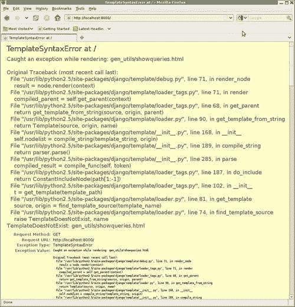

这是上一章提到的特殊调试页面的一个实例。这是由于在渲染过程中引发了异常而导致的`TemplateSyntaxError`。原始异常被捕获并转换为`TemplateSyntaxError`，原始回溯作为异常值的一部分显示出来。通过查看原始回溯，我们可以看到原始异常是`TemplateDoesNotExist`。由于某种原因，模板加载器没有找到`gen_utils/showqueries.html`模板文件。

在这里接收到的调试页面中进一步翻页，我们了解到模板引擎将原始异常包装在`TemplateSyntaxError`中的行为有时会令人恼火。因为最终引发的异常是`TemplateSyntaxError`而不是`TemplateDoesNotExist`，这个调试页面没有模板加载器事后报告，该报告将详细说明尝试了哪些模板加载器，以及它们在搜索`gen_utils/showqueries.html`时尝试加载了哪些文件。因此，由于`TemplateSyntaxError`异常用于包装其他异常的方式，我们丢失了一些有用的调试信息。

如果需要的话，我们可以通过尝试直接从视图中渲染它，而不是将其包含在另一个模板中，来强制生成此模板文件的模板加载器事后报告。因此，通过一点工作，我们可以获得这个特定调试页面中不幸未包含的信息。

但在这种情况下并不需要，因为异常的原因并不特别隐晦：我们没有采取任何措施确保新的`gen_utils`应用程序中的模板能够被找到。我们没有将`gen_utils`包含在`INSTALLED_APPS`中，以便应用程序模板加载程序可以搜索其`templates`目录，也没有将`gen_utils 模板`目录的路径放入`TEMPLATE_DIRS`设置中。我们需要做这些事情中的一件，以便找到新的模板文件。由于`gen_utils`现在也有一个过滤器，并且为了加载该过滤器，`gen_utils`需要被包含在`INSTALLED_APPS`中，我们将通过将`gen_utils`包含在`INSTALLED_APPS`中来修复`TemplateDoesNotExist`异常。

一旦我们做出了这个改变，新的代码工作了吗？并没有。尝试重新加载页面现在会出现不同的调试页面：

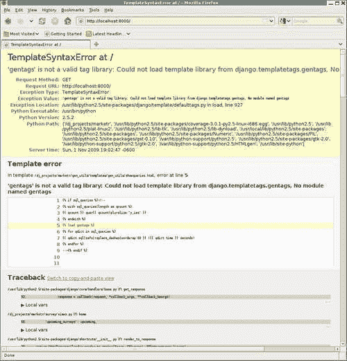

这个有点神秘。显示的模板是`gen_utils/showqueries.html`，所以我们比之前的情况更进一步了。但出于某种原因，尝试``失败了。错误信息显示：

**'gentags'不是有效的标签库：无法从 django.templatetags.gentags 加载模板库，没有名为 gentags 的模块**。

这是一个罕见的情况，你不希望完全相信错误消息似乎在说什么。它似乎在暗示问题是`django.templatetags`中没有`gentags.py`文件。一个自然的下一个想法可能是，需要将自定义模板标签和过滤器库放在 Django 自己的源树中。然而，这将是一个非常奇怪的要求，而且文档明确地与之相矛盾，因为它指出自定义标签和过滤器应该放在应用程序的`templatetags`目录中。我们应该使用除了普通的``标签以外的东西来强制 Django 搜索其自己的`templatetags`目录之外的标签库吗？

不，这种情况下错误只是误导。尽管错误消息中只命名了`django.templatetags`模块，但实际上 Django 代码尝试从`INSTALLED_APPS`中列出的每个应用程序的`templatetags`目录中加载`gentags`。因此问题不在于 Django 为什么未能在`gen_utils/templatetags`目录下查找`gentags`，而是为什么从`genutils.templatetags`加载`gentags`失败？

我们可以尝试回答这个问题，尝试在 Python shell 会话中运行与``相同的 Django 代码：

```py
kmt@lbox:/dj_projects/marketr$ python manage.py shell 
Python 2.5.2 (r252:60911, Oct  5 2008, 19:24:49) 
[GCC 4.3.2] on linux2 
Type "help", "copyright", "credits" or "license" for more information. 
(InteractiveConsole) 
>>> from gen_utils.templatetags import gentags 
Traceback (most recent call last): 
 File "<console>", line 1, in <module> 
ImportError: No module named templatetags 
>>> 

```

果然，尝试从`gen_utils.templatetags`导入`gentags`失败了。Python 声称`templatetags`模块不存在。但这个目录肯定是存在的，`gentags.py`也存在，那么缺少什么呢？答案是在该目录中创建一个`__init__.py`文件，使 Python 将其识别为一个模块。创建该文件并从 shell 重新尝试导入将会显示导入现在可以工作。

然而，尝试在浏览器中简单地重新加载页面会导致相同的调试页面重新显示。这也是开发服务器需要手动停止和重新启动才能接受更改的罕见情况之一。完成这些操作后，我们最终可以重新加载调查首页并看到：

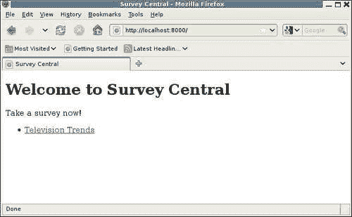

我们回到了页面被提供而没有引发异常的情况，也不再有`sql_queries`的杂散调试信息包含在 HTML 注释中。如果我们进一步查看页面的 HTML 源代码，底部会看到类似以下内容：

```py
<!--

4 queries

SELECT COUNT(*) FROM `survey_survey` WHERE
`survey_survey`.`title` LIKE BINARY %~~double-dash~~%  (0.015 seconds)

SELECT `survey_survey`.`id`, `survey_survey`.`title`,
`survey_survey`.`opens`, `survey_survey`.`closes` FROM
`survey_survey` WHERE (`survey_survey`.`opens` <= 2009-11-01
 AND `survey_survey`.`closes` >= 2009-11-01 ) (0.001 seconds)

SELECT `survey_survey`.`id`, `survey_survey`.`title`,
`survey_survey`.`opens`, `survey_survey`.`closes` FROM
`survey_survey` WHERE (`survey_survey`.`closes` < 2009-11-01
 AND `survey_survey`.`closes` >= 2009-10-18 ) (0.000 seconds)

SELECT `survey_survey`.`id`, `survey_survey`.`title`,
`survey_survey`.`opens`, `survey_survey`.`closes` FROM
`survey_survey` WHERE (`survey_survey`.`opens` > 2009-11-01 
AND `survey_survey`.`opens` <= 2009-11-08 ) (0.000 seconds)

--> 

```

看起来不错。`replace_dashes`过滤器成功地去掉了两个连字符，因此浏览器不再认为注释块在预期之前被终止。现在我们可以继续检查生成其他调查页面所需的 SQL 查询。

## 用于活动调查表单显示页面的 SQL 查询

单击链接到一个活动调查会显示该调查的活动调查页面：

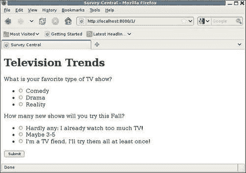

查看此页面的源代码，我们看到需要六个 SQL 查询才能生成它：

```py
<!--

6 queries

SELECT `survey_survey`.`id`, `survey_survey`.`title`,
`survey_survey`.`opens`, `survey_survey`.`closes` FROM
`survey_survey` WHERE `survey_survey`.`id` = 1  (0.000 seconds)

SELECT `survey_question`.`id`, `survey_question`.`question`,
`survey_question`.`survey_id` FROM `survey_question` WHERE
`survey_question`.`survey_id` = 1  (0.000 seconds)

SELECT COUNT(*) FROM `survey_answer` WHERE
`survey_answer`.`question_id` = 1  (0.001 seconds)

SELECT COUNT(*) FROM `survey_answer` WHERE
`survey_answer`.`question_id` = 2  (0.001 seconds)

SELECT `survey_answer`.`id`, `survey_answer`.`answer`,
`survey_answer`.`question_id`, `survey_answer`.`votes` FROM
`survey_answer` WHERE `survey_answer`.`question_id` = 1  (0.024 seconds)

SELECT `survey_answer`.`id`, `survey_answer`.`answer`,
`survey_answer`.`question_id`, `survey_answer`.`votes` FROM
`survey_answer` WHERE `survey_answer`.`question_id` = 2  (0.001 seconds)

-->

```

我们能否将这些查询与用于生成页面的代码进行匹配？是的，在这种情况下，可以相对容易地看到每个查询来自哪里。第一个查询是根据其主键查找调查，并对应于`survey_detail`视图中第一行中的`get_object_or_404`调用：

```py
def survey_detail(request, pk): 
    survey = get_object_or_404(Survey, pk=pk) 
```

由于这是一个活动调查，控制线程随后转到`display_active_survey`函数，其中包含以下代码来构建页面的表单：

```py
    qforms = [] 
    for i, q in enumerate(survey.question_set.all()): 
        if q.answer_set.count() > 1: 
            qforms.append(QuestionVoteForm(q, prefix=i, data=data)) 
```

调用`enumerate(survey.question_set.all())`负责此页面的第二个 SQL 查询，它检索显示的调查的所有问题。`for`循环中的`q.answer_set.count()`解释了第三和第四个 SQL 查询，它们检索了调查中每个问题的答案计数。

然后，最后两个查询检索了调查中每个问题的答案集。我们可能首先认为这些查询是在创建调查中每个问题的`QuestionVoteForm`时发出的。 `QuestionVoteForm`的`__init__`例程包含此行，以初始化问题的答案集：

```py
        self.fields['answer'].queryset = question.answer_set.all() 
```

然而，该行代码并不会导致对数据库的调用。它只是将表单的`answer`字段的`queryset`属性设置为`QuerySet`值。由于`QuerySets`是惰性的，这不会导致数据库访问。这得到了证实，即请求`COUNT(*)`的两个查询是在检索实际答案信息的查询之前发出的。如果创建`QuestionVoteForm`导致检索答案信息，那么最后两个查询将不会是最后的，而是将与`COUNT(*)`查询交错。然后，触发检索答案信息的查询是在`survey/active_survey.html`模板中呈现答案值时。

如果我们专注于优化，此时我们可能会尝试看看是否可以减少此页面所需的查询数量。在两个单独的查询中检索答案的计数，然后检索答案信息本身似乎效率低下，与仅检索答案信息并根据返回的信息推导计数相比。看起来我们可以用四个查询而不是六个查询来生成此页面。

然而，由于我们专注于理解当前行为以帮助调试，我们不会在这里转向优化讨论。即使我们正在开发一个真正的项目，在开发的这个阶段，现在不是进行此类优化的好时机。这里的低效并不糟糕到被称为错误，所以最好只是将其记录为将来可能要查看的可能事项，当可以确定应用程序的整体性能的全貌时。在那时，最昂贵的低效将值得花时间进行改进的。

## 发布调查答案的 SQL 查询

如果我们现在为调查问题选择了一些答案并按下**提交**按钮，我们会收到**感谢**页面的响应：

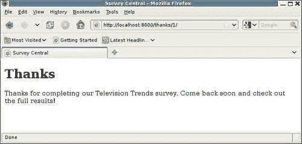

查看此页面的源代码，我们发现了一个单独的 SQL 查询，以检索给定主键的`survey`：

```py
<!--

1 query

SELECT `survey_survey`.`id`, `survey_survey`.`title`,
`survey_survey`.`opens`, `survey_survey`.`closes` FROM
`survey_survey` WHERE `survey_survey`.`id` = 1  (0.001 seconds)

-->

```

与该查询相关的代码行是显而易见的；它是`survey_thanks`视图中的`get_object_or_404`：

```py
def survey_thanks(request, pk): 
    survey = get_object_or_404(Survey, pk=pk) 
    return render_to_response('survey/thanks.html', 
        {'survey': survey }, 
        RequestContext(request)) 
```

但是，当表单数据被提交时，处理表单数据所涉及的所有 SQL 查询呢？在调用`survey_thanks`视图之前很久，必须运行`display_active_survey`以接收提交的表单数据并更新所选答案的数据库。然而，我们在感谢页面显示的查询中没有看到其中任何需要的 SQL 查询。

原因是因为`display_active_survey`函数在表单处理成功并更新数据库时，不直接呈现模板，而是返回一个`HttpResponseRedirect`。Web 浏览器在接收到 HTTP 重定向响应后，会自动获取重定向中标识的位置。

因此，在浏览器上按下“提交”按钮和看到感谢页面出现之间，会发生两个完整的请求/响应周期。感谢页面本身可以显示在其（第二个）请求/响应周期期间执行的 SQL 查询，但不能显示在第一个请求/响应周期中发生的任何查询。

这令人失望。此时，我们已经花了相当多的精力开发了一开始看起来似乎会是一个非常简单的实用程序代码。现在，我们发现它对于应用程序中一些最有趣的视图——实际上更新数据库的视图——不起作用。我们该怎么办？

我们当然不希望放弃查看成功处理提交的数据页面的 SQL 查询。但我们也不希望在这个实用程序代码上花费更多的开发工作。虽然我们在这个过程中学到了一些东西，但我们开始偏离我们的主要应用程序。幸运的是，我们不需要做这两件事。相反，我们可以简单地安装并开始使用一个已经开发好的 Django 应用程序的通用调试工具，即 Django Debug Toolbar。这个工具是下一节的重点。

# Django Debug Toolbar

Rob Hudson 的 Django Debug Toolbar 是 Django 应用程序的非常有用的通用调试工具。与我们在本章早些时候开发的代码一样，它可以让您看到生成页面所需的 SQL 查询。然而，正如我们将看到的，它远不止于此，还提供了更多关于 SQL 查询和请求处理的信息的简便访问。此外，调试工具栏有一种更高级的显示信息的方式，而不仅仅是将其嵌入到 HTML 注释中。最好通过示例来展示其功能，因此我们将立即开始安装工具栏。

## 安装 Django Debug Toolbar

工具栏可以在 Python 软件包索引网站上找到：[`pypi.python.org/pypi/django-debug-toolbar`](http://pypi.python.org/pypi/django-debug-toolbar)。安装后，通过添加几个设置即可在 Django 项目中激活调试工具栏。

首先，必须将调试工具栏中间件`debug_toolbar.middleware.DebugToolbarMiddleware`添加到`MIDDLEWARE_CLASSES`设置中。工具栏的文档指出，它应该放在任何其他编码响应内容的中间件之后，因此最好将其放在中间件序列的最后。

其次，需要将`debug_toolbar`应用程序添加到`INSTALLED_APPS`中。`debug_toolbar`应用程序使用 Django 模板来呈现其信息，因此需要在`INSTALLED_APPS`中列出，以便应用程序模板加载程序找到它的模板。

第三，调试工具栏要求将请求的 IP 地址列在`INTERNAL_IPS`中。由于我们在本章早些时候已经进行了此设置更改，因此现在不需要做任何操作。

最后，只有在`DEBUG`为`True`时才会显示调试工具栏。我们一直在调试模式下运行，所以这里也不需要做任何更改。还要注意调试工具栏允许您自定义调试工具栏显示的条件。因此，可以设置工具栏在请求 IP 地址不在`INTERNAL_IPS`中或调试未打开时显示，但对于我们的目的，默认配置就可以了，所以我们不会做任何更改。

不需要的一件事是应用程序本身使用`RequestContext`以便在工具栏中提供 SQL 查询信息等。调试工具栏作为中间件运行，因此不依赖于应用程序使用`RequestContext`来生成信息。因此，如果我们一开始就使用 Django 调试工具栏，就不需要对调查视图进行更改以在`render_to_response`调用上指定`RequestContext`。

## 调试工具栏外观

一旦调试工具栏添加到中间件和已安装应用程序设置中，我们可以通过简单地访问调查应用程序中的任何页面来看看它的外观。让我们从主页开始。返回的页面现在应该看起来像这样：

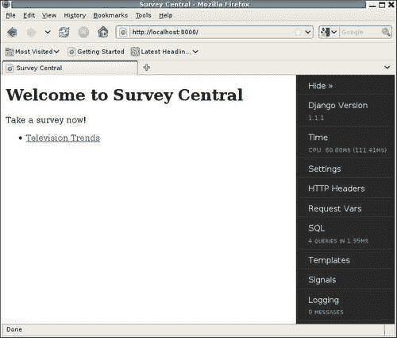

请注意，此截图显示了调试工具栏 0.8.0 版本的外观。早期版本看起来会有很大不同，所以如果您的结果不像这样，您可能使用的是不同于 0.8.0 版本的版本。您拥有的版本很可能比写作时可用的版本更新，可能有其他工具栏面板或功能没有在这里介绍。

如您所见，调试工具栏出现在浏览器窗口的右侧。它由一系列面板组成，可以通过更改工具栏配置单独启用或禁用。这里显示的是默认启用的面板。

在更仔细地查看一些单独面板之前，请注意工具栏顶部包含一个隐藏选项。如果选择**隐藏**，工具栏会缩小到一个类似标签的指示，以显示其存在：

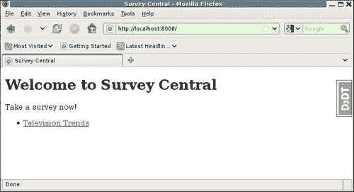

这对于工具栏的扩展版本遮挡页面上的应用程序内容的情况非常有用。单击**DjDT**标签后，工具栏提供的所有信息仍然可以访问；它只是暂时不可见。

大多数面板在单击时会提供详细信息。一些还会在主工具栏显示中提供摘要信息。从调试工具栏版本 0.8.0 开始，列出的第一个面板**Django 版本**只提供摘要信息。单击它不会提供更详细的信息。如您在截图中所见，这里使用的是 Django 1.1.1 版本。

请注意，调试工具栏的当前最新源版本已经为此面板提供了比 0.8.0 版本更多的信息。自 0.8.0 以来，此面板已更名为**版本**，可以单击以提供更多详细信息。这些额外的详细信息包括工具栏本身的版本信息以及为提供版本信息的任何其他已安装的 Django 应用程序的版本信息。

显示摘要信息的另外三个面板是**时间**、**SQL**和**日志**面板。因此，我们可以一眼看出页面的第一次出现使用了 60 毫秒的 CPU 时间（总共用了 111 毫秒的时间），页面需要了四个查询，花费了 1.95 毫秒，请求期间没有记录任何消息。

在接下来的章节中，我们将深入研究每个面板在点击时提供的具体信息。我们将首先从 SQL 面板开始，因为它是最有趣的之一，并且提供了我们在本章前面努力自己获取的相同信息（以及更多信息）。

## SQL 面板

如果我们点击调试工具栏的**SQL**部分，页面将会变成：

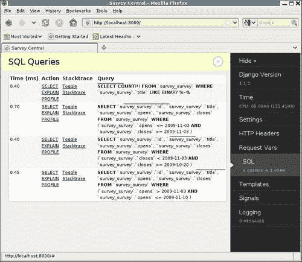

乍一看，这个 SQL 查询页面比我们之前想出的要好得多。查询本身被突出显示，使 SQL 关键字更容易阅读。而且，由于它们不是嵌入在 HTML 注释中，它们的内容不需要以任何方式进行修改——没有必要改变包含双破折号的查询内容，以避免它引起显示问题。（现在可能是一个好时机，在我们忘记为什么添加它之前，删除那个额外的查询。）

还要注意，每个查询所列的时间比 Django 默认查询历史中提供的更具体。调试工具栏用自己的查询记录替换了 Django 的查询记录，并以毫秒为单位提供时间，而不是秒。

显示还包括了每个查询所花费时间的图形表示，以水平条形图的形式出现在每个查询的上方。这种表示使人们很容易看出是否有一个或多个查询比其他查询要昂贵得多。实际上，如果一个查询花费的时间过长，它的条形图将会变成红色。在这种情况下，查询时间没有太大的差异，没有一个特别长，所以所有的条形图长度都差不多，并且呈灰色。

更深入地挖掘，我们在本章前面手动找出的一些信息在这个 SQL 查询显示中只需点击一下就可以得到。具体来说，我们可以得到我们的代码中触发特定 SQL 查询的行号。每个显示的查询都有一个**切换堆栈跟踪**选项，点击后将显示与查询相关联的堆栈跟踪：

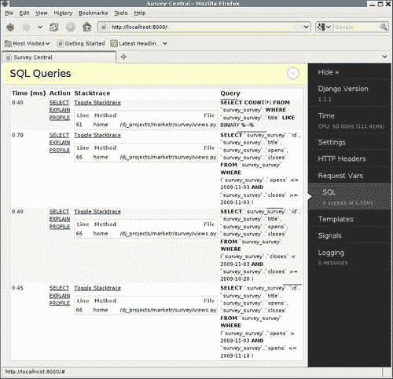

在这里，我们可以看到所有的查询都是由调查`views.py`文件中的`home`方法发起的。请注意，工具栏会过滤掉 Django 本身的堆栈跟踪级别，这就解释了为什么每个查询只显示了一个级别。第一个查询是由**第 61 行**触发的，其中包含了添加的`filter`调用，用于测试如果记录了一个包含两个连字符的查询会发生什么。其余的查询都归因于**第 66 行**，这是`home`视图中`render_to_response`调用的最后一行。正如我们之前发现的那样，这些查询都是在模板渲染期间进行的。（您的行号可能与此处显示的行号不同，这取决于文件中各种函数的放置位置。）

最后，这个 SQL 查询显示提供了一些我们甚至还没有想到要的信息。在**操作**列下面是每个查询的**SELECT**，**EXPLAIN**和**PROFILE**链接。点击**SELECT**链接会显示数据库在实际执行查询时返回的内容。例如：

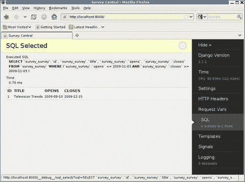

类似地，点击**EXPLAIN**和**PROFILE**会显示数据库在被要求解释或分析所选查询时的报告。确切的显示和结果解释将因数据库而异。（事实上，**PROFILE**选项并不适用于所有数据库——它恰好受到了这里使用的数据库，MySQL 的支持。）解释**EXPLAIN**和**PROFILE**的结果超出了本文所涵盖的范围，但值得知道的是，如果您需要深入了解查询的性能特征，调试工具栏可以轻松实现这一点。

我们现在已经深入了几页 SQL 查询显示。我们如何返回到实际应用程序页面？单击主页显示右上角的圈起来的“>>”将返回到上一个 SQL 查询页面，并且圈起来的“>>”将变成圈起来的“X”。单击任何面板详细信息页面上的圈起来的“X”将关闭详细信息并返回到显示应用程序数据。或者，再次单击工具栏上当前显示面板的面板区域将产生与在显示区域上单击圈起来的符号相同的效果。最后，如果您更喜欢使用键盘而不是鼠标，按下*Esc*将产生与单击圈起来的符号相同的效果。

现在我们已经完全探索了 SQL 面板，让我们简要地看一下调试工具栏提供的其他面板。

## 时间面板

单击“时间”面板会显示有关页面生成期间时间花费的更详细信息：

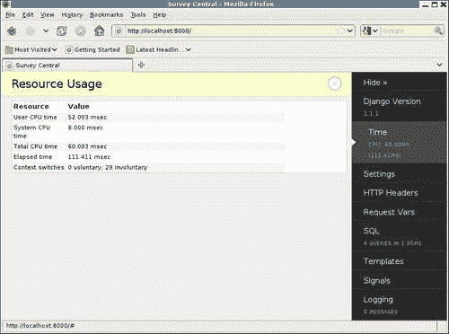

总 CPU 时间分为用户和系统时间，列出了总经过的（挂钟）时间，并显示了自愿和非自愿的上下文切换次数。对于生成时间过长的页面，关于时间花费在哪里的额外细节可以帮助指向原因。

请注意，此面板提供的详细信息来自 Python 的`resource`模块。这是一个特定于 Unix 的 Python 模块，在非 Unix 类型系统上不可用。因此，在 Windows 上，例如，调试工具栏时间面板只会显示摘要信息，没有更多的详细信息可用。

## 设置面板

单击“设置”会显示所有生效设置的可滚动显示。用于创建此显示的代码与用于在 Django 调试页面上显示设置的代码相同，因此这里的显示将与您在调试页面上看到的相同。

## HTTP 头面板

单击“HTTP 头”会显示请求的所有 HTTP 头：

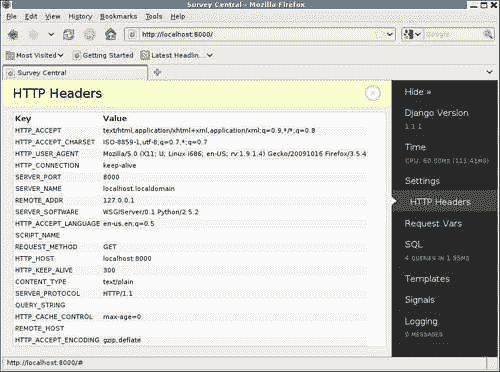

这是调试页面“META”部分中可用信息的子集。如前一章所述，`request.META`字典包含请求的所有 HTTP 头，以及与请求无关的其他信息，因为`request.META`最初是从`os.environ`字典中复制的。调试工具栏选择过滤显示的信息，以包括仅与 HTTP 请求相关的信息，如屏幕截图所示。

## 请求变量面板

单击“请求变量”会显示请求的 cookie、会话变量、GET 变量和 POST 数据。由于调查应用程序主页没有任何信息可显示，因此它的“请求变量”显示并不是很有趣。相反，这里是来自管理员应用程序的一个示例，它确实使用了会话，因此实际上有一些东西可以显示：

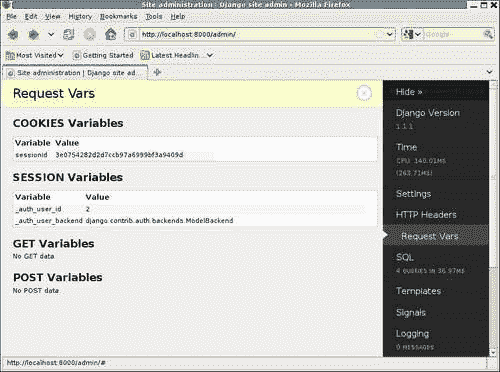

在这里，您可以看到由于管理员应用程序使用了`django.contrib.sessions`应用程序而设置的`sessionid` cookie，并且还可以看到已在会话中设置的各个会话变量。

## 模板面板

单击“模板”会显示有关请求的模板处理的信息。以调查主页为例：

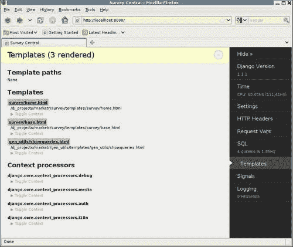

“模板路径”部分列出了`TEMPLATE_DIRS`设置中指定的路径；由于我们没有向该设置添加任何内容，因此它为空。

**模板**部分显示了响应渲染的所有模板。列出了每个模板，显示了应用程序指定的首次渲染的名称。单击此名称将显示实际模板文件内容的显示。在应用程序指定的名称下是模板的完整文件路径。最后，每个模板还有一个**切换上下文**链接，可用于查看每个已呈现模板使用的上下文的详细信息。

**上下文处理器**部分显示了所有安装的上下文处理器。在每个下面都有一个**切换上下文**链接，单击后将显示相关上下文处理器添加到上下文中的上下文变量。

请注意，无论应用程序是否使用`RequestContext`来呈现响应，上下文处理器都会被列出。因此，它们在此页面上列出并不意味着它们设置的变量被添加到此特定响应的上下文中。

## 信号面板

单击**Signals**会显示信号配置的显示：

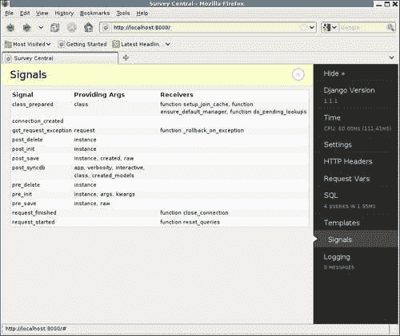

列出了所有定义的 Django 信号。对于每个信号，都显示了提供的参数以及已连接到该信号的接收器。

请注意，此显示不表示当前页面生成过程中实际触发了哪些信号。它只显示信号的配置方式。

## 日志面板

最后，**日志**面板显示了在请求处理过程中通过 Python 的`logging`模块发送的任何消息。由于我们尚未调查在调查应用程序中使用日志记录，并且自 Django 1.1 以来，Django 本身不使用 Python 日志记录模块，因此在此面板上我们没有看到任何内容。

## 调试工具栏处理重定向

现在回想一下我们开始调查调试工具栏的原因：我们发现我们最初用于跟踪页面的 SQL 查询的方法对于返回 HTTP 重定向而不是呈现模板的页面不起作用。调试工具栏如何更好地处理这个问题？要了解这一点，请单击主页上的**Television Trends**链接，为两个问题选择答案，然后单击**提交**。结果将是：

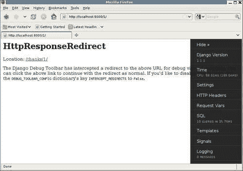

此页面显示了为什么有时需要在工具栏上使用**隐藏**选项的示例，因为工具栏本身遮挡了页面上的部分消息。隐藏工具栏后，可以看到完整的消息是：

**Django 调试工具栏已拦截重定向到上述 URL 以进行调试查看。您可以单击上面的链接以继续进行正常的重定向。如果要禁用此功能，请将 DEBUG_TOOLBAR_CONFIG 字典的键 INTERCEPT_REDIRECTS 设置为 False。**

调试工具栏在这里所做的是拦截重定向请求，并用包含原始重定向指定位置的渲染响应替换它。工具栏本身仍然存在，并可用于调查我们可能希望查看有关生成重定向的请求处理的任何信息。例如，我们可以单击**SQL**部分并查看：

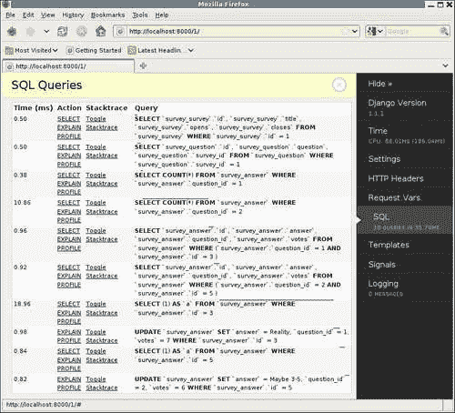

这些是处理传入的表单所需的 SQL 查询。毫不奇怪，前四个与我们首次生成表单时看到的完全相同，因为最初对 GET 和 POST 请求都遵循相同的代码路径。

只有在发出这些查询之后，`display_active_survey`视图才对 GET 和 POST 有不同的代码路径。具体来说，在 POST 的情况下，代码是：

```py
    if request.method == 'POST': 
        chosen_answers = [] 
        for qf in qforms: 
            if not qf.is_valid(): 
                break; 
            chosen_answers.append(qf.cleaned_data['answer']) 
        else: 
            for answer in chosen_answers: 
                answer.votes += 1 
                answer.save() 
           return HttpResponseRedirect(reverse('survey_thanks', args=(survey.pk,))) 
```

此页面上列出的第五和第六个查询正在检索在提交的表单上选择的特定答案实例。与 GET 情况不同，在第五和第六个查询中检索了给定问题的所有答案，这些查询还在 SQL WHERE 子句中指定了答案`id`以及问题`id`。在 POST 情况下，不需要检索问题的所有答案；只需要检索选择的那个答案即可。

切换这些查询的堆栈跟踪显示它们是由代码的`if not qf.is_valid()`行导致的。这是有道理的，因为除了验证输入外，`is_valid`方法还会将发布的数据标准化，然后将其放入表单的`cleaned_data`属性中。对于`ModelChoiceField`，标准化值是所选的模型对象实例，因此验证代码需要从数据库中检索所选对象。

在发现两个提交的表单都有效之后，此代码的`else`部分运行。在这里，每个选择的答案的投票计数都会增加，并且更新的`answer`实例将保存到数据库中。然后，这段代码必须负责之前显示的最后四个查询。可以通过检查这四个查询的堆栈跟踪来确认：所有指向代码的`answer.save()`行。

但是为什么需要四个 SQL 语句，两个 SELECT 和两个 UPDATE，来保存两个答案到数据库中？UPDATE 语句是不言自明的，但是在它们之前的 SELECT 语句有点奇怪。在每种情况下，都从`survey_answer`表中选择常量 1，并使用 WHERE 子句指定与正在保存的`survey`匹配的主键值。这个查询的目的是什么？

Django 代码在这里所做的是尝试确定正在保存的`answer`是否已经存在于数据库中，或者是新的。Django 可以通过从 SELECT 返回任何结果来判断在将模型实例保存到数据库时是否需要使用 UPDATE 或 INSERT。选择常量值比实际检索结果更有效，当唯一需要的信息是结果是否存在时。

您可能认为 Django 代码应该知道，仅基于模型实例的主键值已经设置，该实例反映的数据已经在数据库中。但是，Django 模型可以使用手动分配的主键值，因此分配了主键值并不保证模型已经保存到数据库中。因此，在保存数据之前需要额外的 SELECT 来确定模型的状态。

然而，调查应用程序代码肯定知道在处理调查响应时保存的所有`answer`实例已经保存在数据库中。在保存时，调查代码可以通过在保存调用上指定`force_update`来指示必须通过 UPDATE 而不是 INSERT 保存实例：

```py
                answer.save(force_update=True) 
```

如果我们进行更改并尝试提交另一个调查，我们会发现对于这种情况，处理中已经消除了 SELECT 查询，从而将所需的总查询数量从 10 减少到 8：

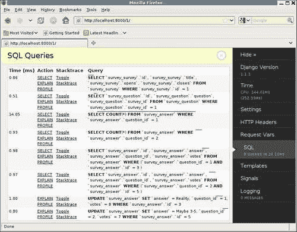

（是的，我意识到之前我说现在不是进行优化的时候，但是我还是进行了一次。这次实在是太容易了。）

我们现在已经介绍了 Django Debug Toolbar 默认显示的所有面板，并看到了它默认处理返回重定向的方式，允许调查导致重定向的处理过程。它是一个非常灵活的工具：它支持添加面板，更改显示的面板，更改工具栏显示的时间，以及配置各种其他选项。讨论所有这些超出了本文的范围。希望所介绍的内容让您对这个工具的强大功能有所了解。如果您有兴趣了解如何配置它的更多细节，可以从其主页链接的 README 开始。

现在我们将离开 Django Debug Toolbar，继续讨论如何通过日志跟踪应用程序代码的内部状态。为此，我们首先要看看没有工具栏时日志是如何显示的，因此此时我们应该在`settings.py`中注释掉工具栏中间件。（请注意，不需要从`INSTALLED_APPS`中删除`debug_toolbar`列表，因为这只是必须为应用程序模板加载器找到中间件指定的模板。）

# 跟踪内部代码状态

有时，即使从像 Django Debug Toolbar 这样的工具中获得的所有信息也不足以弄清楚在处理请求过程中出现错误产生不正确结果的原因。问题可能在应用程序代码的某个地方，但从视觉检查中我们无法弄清楚出了什么问题。为了解决问题，我们需要获取有关应用程序代码内部状态的更多信息。也许我们需要看看应用程序中函数的控制流是什么，或者看看为一些最终导致代码走上错误路径的中间结果计算出了什么值。

我们如何获得这种信息？一种方法是在调试器下运行代码，并逐行执行以查看它在做什么。这种方法将在下一章中详细介绍。这是非常强大的，但可能会耗费时间，在某些情况下并不实用。例如，对于只在生产过程中出现的问题，很难使用。

另一种方法是让代码报告或记录它在做什么。这是本节将要介绍的方法。这种方法并不能提供在调试器下可用的全部信息，但通过选择要记录的内容，它可以提供足够的线索来解决许多问题。它也可以更容易地用于仅在生产过程中出现的问题，而不像在调试器下运行的方法那样。

## 抵制洒播打印的冲动

在开发服务器下运行时，`print`的输出会显示在控制台上，因此很容易访问。因此，当面对一些在开发过程中表现不佳的 Django 应用程序代码时，很容易就会诱惑地在关键点添加临时的`print`语句，试图弄清楚代码内部发生了什么。虽然非常诱人，但通常是一个坏主意。

为什么这是一个坏主意？首先，问题很少会仅凭一个或两个`print`语句就变得明显。起初似乎只要知道代码是否到达这里或那里，一切都会变得清晰。但事实并非如此，我们最终会添加更多的`print`语句，也许打印出变量的值，代码本身和开发服务器控制台都变成了临时调试信息的一团糟。

然后，一旦问题解决了，所有那些`print`语句都需要被移除。我们通常不希望它们在代码或控制台中弄乱输出。移除它们都是一件麻烦事，但是必要的，因为一些生产环境不允许访问`sys.stdout`。因此，从开发调试中留下的`print`可能会在生产过程中导致服务器错误。

然后，当出现相同或类似的问题时，如果以前通过“sprinkle `print`”方法解决了问题，那么几乎所有之前的工作可能需要重新做，以便找出这次出了什么问题。以前的经验可能会给我们一个更好的主意，即在哪里放置`print`语句，但如果在解决第一个问题后已经删除了它们，那么可能需要重新做基本相同的工作，以解决出现的下一个问题变体。这是一种浪费。

这个序列突出了“sprinkle `print`”方法在开发调试中的一些主要问题。首先，开发人员需要在添加`print`的地方立即决定在什么条件下它应该被产生以及输出应该去哪里。可以使用条件语句（如`if settings.DEBUG`）来给添加的`print`语句加上括号，这可能允许添加的调试支持长期保留在代码中，但这很麻烦并且会给代码增加杂乱，因此通常不会这样做。也可以在`print`中指定输出应该被路由到除了默认的`sys.stdout`之外的其他地方，但同样这需要更多的工作，通常也不会这样做。

这些问题导致了“sprinkle `print`”语句的出现，当问题解决后立即被删除，使得代码默认情况下不报告其操作。然后，当下一个问题出现时，开发人员必须重新开始添加调试信息的报告。

更好的方法是在开发过程中使用一些有纪律的日志记录，这样，至少在`DEBUG`被打开时，默认情况下，代码会报告它正在做什么。如果是这样，那么很可能不需要收集额外的调试信息来解决出现的问题。此外，使用日志记录设施允许配置在什么条件下输出消息，以及它们应该去哪里，与实际的日志记录语句分开。

## 开发的简单日志配置

因此，与`print`语句相比，一种更好的调试选择是使用 Python 的`logging`模块。实际的日志调用与`print`一样容易。例如，用于跟踪对`display_active_survey`的调用的`print`可能如下所示：

```py
def display_active_survey(request, survey): 
    print 'display_active_survey called for a %s of survey '\'with pk %s' % (request.method, survey.pk) 
```

这里的`print`报告了已被调用的函数；以及`request.method`和它所传递的调查的主键。在开发服务器控制台上，获取活动调查页面的输出将是：

```py
Django version 1.1.1, using settings 'marketr.settings' 
Development server is running at http://0.0.0.0:8000/ 
Quit the server with CONTROL-C. 
display_active_survey called for a GET of survey with pk 1 
[04/Nov/2009 19:14:10] "GET /1/ HTTP/1.1" 200 2197 

```

只使用 Python 的`logging`的等效调用可能是：

```py
import logging 
def display_active_survey(request, survey): 
    logging.debug('display_active_survey called for a %s of ''survey with pk %s', request.method, survey.pk) 
```

这里使用`logging.debug`调用来指定传递的字符串是调试级别的消息。级别的概念允许调用代码为消息分配重要性的度量，而不实际在当前情况下做出任何关于消息是否应该输出的决定。相反，这个决定是由日志记录设施基于当前设置的日志记录阈值级别做出的。

Python 的`logging`模块提供了一组方便的方法来记录消息，具有默认定义的级别。这些级别依次增加：`debug`、`info`、`warning`、`error`和`critical`。因此，只有在`logging`模块的级别阈值已设置为包括调试级别的消息时，才会输出`logging.debug`消息。

使用`logging.debug`语句代替`print`的唯一问题是，默认情况下，日志模块的级别阈值设置为`warning`。因此，默认情况下只输出`warning`、`error`和`critical`消息。我们需要配置`logging`模块以输出调试级别的语句，以便此消息出现在控制台上。一个简单的方法是在`settings.py`文件中添加对`logging.basicConfig`的调用。我们可以使调用依赖于`DEBUG`是否打开：

```py
import logging
if DEBUG: 
    logging.basicConfig(level=logging.DEBUG)
```

通过将该代码添加到`settings.py`中，并在`display_active_survey`函数中调用`logging.debug`，开发控制台现在将在进入`display_active_survey`函数时显示消息。

```py
Django version 1.1.1, using settings 'marketr.settings' 
Development server is running at http://0.0.0.0:8000/ 
Quit the server with CONTROL-C. 
DEBUG:root:display_active_survey called for a GET of survey with pk 1 
[04/Nov/2009 19:24:14] "GET /1/ HTTP/1.1" 200 2197 

```

请注意，消息上的`DEBUG:root:`前缀是应用于记录消息的默认格式的结果。`DEBUG`表示与消息关联的级别，`root`标识用于记录消息的记录器。由于`logging.debug`调用没有指定任何特定的记录器，因此使用了`root`的默认值。

`logging.basicConfig`的其他参数可用于更改消息的格式，但是在这里我们需要覆盖的 Python 日志的所有功能超出了范围。对于我们的目的，默认格式将很好。

日志配置中可以指定消息的路由。我们在这里没有这样做，因为默认的`sys.stderr`对于开发调试目的已经足够了。

## 决定记录什么

通过从`print`切换到`logging`，我们消除了开发人员添加日志时需要决定在什么条件下产生记录信息以及应该将记录信息放在何处的需要。开发人员只需要确定与消息相关联的重要性级别，然后日志设施本身将决定如何处理记录的信息。那么，接下来应该记录什么呢？

一般来说，在编写代码时很难知道记录哪些信息最有用。作为开发人员，我们可能会猜测一些，但在实际运行代码时，直到我们对代码有了一些经验，才能确定。然而，正如之前提到的，让代码具有一些内置的基本信息报告可能非常有帮助。因此，在最初编写代码时，最好有一些记录的指南要遵循。

这样的一个指南可能是记录所有“重要”函数的进入和退出。输入日志消息应包括任何关键参数的值，退出日志消息应该给出函数返回的一些指示。只有这种类型的输入和退出日志（假设代码合理地分割为可管理的函数），我们将能够清楚地了解代码的控制流。

然而，手动添加条目和退出日志是一件麻烦事。这也会给代码增加混乱。实际上，很少有指南会愉快地遵循记录所有重要函数的进入和退出，除非它比为`display_active_survey`输入先前记录的日志消息更容易。

幸运的是，Python 提供了便利设施，使得我们可以轻松地做到我们在这里寻找的事情。函数可以包装在其他函数中，允许包装函数执行诸如记录输入和输出以及参数和返回信息等操作。此外，Python 装饰器语法允许以最少的额外代码混乱来实现这种包装。在下一节中，我们将为现有的调查应用程序代码开发一些简单的日志包装器。

## 装饰器记录函数的输入和输出

使用通用包装器而不是将输入/输出日志嵌入函数本身的一个缺点是，它使得更难以对记录的参数和返回信息进行精细控制。编写一个记录所有参数或不记录任何参数的通用包装器很容易，但很难或不可能编写一个记录参数的子集的包装器，例如。

为什么不记录所有参数？问题在于 Django 应用程序中一些常用的参数，例如请求对象，具有非常冗长的表示。记录它们的完整值会产生太多的输出。最好从一个不记录任何参数值的通用包装记录器开始，可能还有一个或多个专用包装记录器，用于记录这些参数中的关键信息。

例如，一个用于记录视图函数的进入和退出的专用包装器可能是值得的。视图总是将`HttpRequest`对象作为其第一个参数。虽然记录完整对象并不有用，但记录请求方法既简短又有用。此外，由于视图函数的其他参数来自请求的 URL，它们可能也不会太冗长。

返回值呢？它们应该被记录吗？对于 Django 应用程序来说，通常不会记录，因为它们经常返回`HttpResponse`对象。这些对象通常太大，无法在记录时提供帮助。但是，记录返回值的一些信息，例如它们的类型，通常是有用的。

我们首先提出了两个包装器。第一个将被命名为`log_call`，将记录函数的进入和退出。`log_call`不会记录任何输入参数信息，但它将记录返回结果的类型。第二个包装器将更加专业化，并且将用于包装视图函数。这个将被命名为`log_view`。它将记录请求方法和传递给包装视图的任何额外参数，以及其返回值的类型。

这段代码应该放在哪里？再次强调，它与调查应用程序没有任何关联，因此将其放在`gen_utils`中是有意义的。然后我们将在`gen_utils`中创建一个名为`logutils.py`的文件，该文件可以保存任何通用的日志记录实用程序代码。我们将从先前描述的`log_call`包装器的实现开始：

```py
import logging 

class LoggingDecorator(object): 
    def __init__(self, f): 
        self.f = f 

class log_call(LoggingDecorator): 
    def __call__(self, *args, **kwargs): 
       f = self.f 
       logging.debug("%s called", f.__name__) 
       rv = f(*args, **kwargs) 
       logging.debug("%s returned type %s", f.__name__, type(rv)) 
       return rv 
```

这个实现使用了基于类的编写包装函数的风格。使用这种风格，包装器被定义为一个实现`__init__`和`__call__`方法的类。`__init__`方法在包装器创建时被调用，并且传递了它所包装的函数。`__call__`方法在实际调用包装函数时被调用。`__call__`的实现负责执行包装函数所需的任何操作，调用包装函数，并返回其结果。

在这里，实现分为两个类：基本的`LoggingDecorator`实现`__init__`，然后`log_call`继承自`LoggingDecorator`并实现`__call__`。这种分割的原因是我们可以为多个日志记录包装器共享通用的`__init__`。`__init__`只是保存对稍后在调用`__call__`时使用的包装函数的引用。

然后，`log_call __call__`的实现首先记录一个消息，指出函数已被调用。包装函数的名称可以在其`__name__`属性中找到。然后调用包装函数，并将其返回值保存在`rv`中。然后记录第二个消息，指出被调用函数返回的类型。最后，返回包装函数返回的值。

`log_view`包装器与`log_call`非常相似，只是在记录的细节上有所不同：

```py
class log_view(LoggingDecorator): 
    def __call__(self, *args, **kwargs): 
        f = self.f 
        logging.debug("%s called with method %s, kwargs %s", 
            f.__name__, args[0].method, kwargs) 
        rv = f(*args, **kwargs) 
        logging.debug("%s returned type %s", f.__name__, type(rv)) 
        return rv 
```

在这里，第一个记录的消息包括包装函数的名称，第一个位置参数的`method`属性和传递给包装函数的关键字参数。由于这个包装器是用于包装视图函数的，它假定第一个位置参数是一个`HttpRequest`对象，该对象具有`method`属性。

此外，此代码假定所有其他参数将作为关键字参数传递。我们知道这将是调查应用程序代码的情况，因为所有调查 URL 模式都指定了命名组。如果要支持 URL 模式配置中使用的非命名组，更通用的视图包装器将需要记录`args`（除了第一个参数，即`HttpRequest`对象）。对于调查应用程序，这只会导致记录始终相同的信息，因此在此处已被省略。

## 将装饰器应用于调查代码

现在让我们将这些装饰器添加到调查视图函数中，并看看浏览的一些典型输出是什么样子。添加装饰器很容易。首先，在`views.py`中，在文件顶部附近添加装饰器的导入：

```py
from gen_utils.logutils import log_view, log_call 
```

然后，对于所有实际视图函数，将`@log_view`添加到函数定义之上。（此语法假定正在使用的 Python 版本为 2.4 或更高版本。）例如，对于主页，视图定义如下：

```py
@log_view 
def home(request): 
```

对于`survey_detail`和`survey_thanks`也是一样。对于实用函数`display_active_survey`和`display_completed_survey`，使用`@log_call`。例如：

```py
@log_call 
def display_active_survey(request, survey): 
```

现在当我们在调查网站上浏览时，我们将在控制台上记录有关所调用代码的基本信息的消息。例如，我们可能会看到：

```py
DEBUG:root:home called with method GET, kwargs {} 
DEBUG:root:home returned type <class 'django.http.HttpResponse'> 
[05/Nov/2009 10:46:48] "GET / HTTP/1.1" 200 1184 

```

这显示调用了主页视图，并返回了一个`HttpResponse`。在调查应用程序的日志消息中，我们看到开发服务器的正常打印输出，指出对`/`的`GET`返回了一个带有代码`200`（HTTP OK）和包含`1184`字节的响应。接下来，我们可能会看到：

```py
DEBUG:root:survey_detail called with method GET, kwargs {'pk': u'1'} 
DEBUG:root:display_active_survey called 
DEBUG:root:display_active_survey returned type <class 'django.http.
HttpResponse'> 
DEBUG:root:survey_detail returned type <class 'django.http.HttpResponse'> 
[05/Nov/2009 10:46:49] "GET /1/ HTTP/1.1" 200 2197 

```

这显示了使用`GET`调用`survey_detail`视图，很可能是从先前响应返回的主页上的链接。此外，我们可以看到所请求的特定调查具有主键`1`。下一条日志消息揭示了这必须是一个活动调查，因为调用了`display_active_survey`。它返回了一个`HttpResponse`，与`survey_detail`视图一样，最后的调查日志消息后面又是 Django 自己的打印输出，总结了请求及其结果。

接下来，我们可能会看到：

```py
DEBUG:root:survey_detail called with method POST, kwargs {'pk': u'1'} 
DEBUG:root:display_active_survey called 
DEBUG:root:display_active_survey returned type <class 'django.http.HttpResponse'> 
DEBUG:root:survey_detail returned type <class 'django.http.HttpResponse'> 
[05/Nov/2009 10:46:52] "POST /1/ HTTP/1.1" 200 2466 

```

再次，这看起来像是对先前响应的自然进展：对先前请求检索到的相同调查的`POST`。 `POST`表示用户正在提交调查响应。然而，记录的`HttpResponse`的返回类型表明提交存在问题。（我们知道`HttpResponse`只有在在`display_active_survey`中发现表单无效时才会对`POST`进行响应。）

这可能是我们希望在进入/退出信息之外添加额外日志记录的地方，以跟踪被认为无效的已发布表单的具体原因。在其当前形式中，我们只能知道返回的响应，因为它比原始响应略大（2466 比 2197 字节），很可能包含了一个错误注释，指出需要在表单上修复什么才能使其有效。

接下来，我们可能会看到：

```py
DEBUG:root:survey_detail called with method POST, kwargs {'pk': u'1'} 
DEBUG:root:display_active_survey called 
DEBUG:root:display_active_survey returned type <class 'django.http.HttpResponseRedirect'> 
DEBUG:root:survey_detail returned type <class 'django.http.HttpResponseRedirect'> 
[05/Nov/2009 10:46:56] "POST /1/ HTTP/1.1" 302 0 

```

这开始是对先前请求的重复，对具有主键`1`的调查的`survey_detail`视图的`POST`。然而，这次返回了一个`HttpResponseRedirect`，表明用户必须纠正第一次提交中存在的任何问题。

在此之后，我们可能会看到：

```py
DEBUG:root:survey_thanks called with method GET, kwargs {'pk': u'1'} 
DEBUG:root:survey_thanks returned type <class 'django.http.HttpResponse'> 
[05/Nov/2009 10:46:56] "GET /thanks/1/ HTTP/1.1" 200 544 

```

这显示了浏览器在接收到先前请求返回的重定向时将自动执行的请求。我们看到`survey_thanks`视图记录了与所有先前请求相同的调查的`GET`，并返回了一个`HttpResponse`。

因此，我们可以看到，通过很少的努力，我们可以添加一些基本的日志记录，提供对 Django 应用程序代码控制流的概述。请注意，这里定义的日志装饰器并不完美。例如，它们不支持装饰方法而不是函数，即使不需要日志记录，它们也会带来一些开销，并且由于将函数转换为类而产生一些副作用。

所有这些缺点都可以通过在包装器的开发中进行一些小心处理来克服。然而，这些细节超出了我们在这里可以涵盖的范围。这里介绍的方法具有相对简单的理解优势，足够功能，希望能够展示具有易于使用的内置日志记录机制的控制流以及代码中的一些关键参数的有用性。

## 调试工具栏中的日志记录

回想一下，由于调查应用程序代码中没有日志记录，我们跳过了对调试工具栏的日志面板的任何检查。现在让我们返回调试工具栏，看看添加的日志记录是如何显示的。

首先，让我们添加一个额外的日志消息，以记录导致活动调查的 POST 请求失败的原因。正如在前面的部分中提到的，这可能是有用的信息。因此，在`display_active_survey`函数中，在找到一个无效的表单后添加一个日志调用：

```py
        for qf in qforms: 
            if not qf.is_valid(): 
                logging.debug("form failed validation: %r", qf.errors) 
                break; 
```

（请注意，在使用`logging`之前，还需要添加`import logging`。）有了额外的日志消息，我们应该能够获取有关为什么特定调查提交被视为无效的具体信息。

现在取消`settings.py`中调试工具栏的中间件的注释，重新激活调试工具栏，浏览到一个活动的调查页面，并尝试通过提交不完整的调查来强制生成该日志消息。当返回响应时，单击工具栏的**日志**面板将显示如下页面：

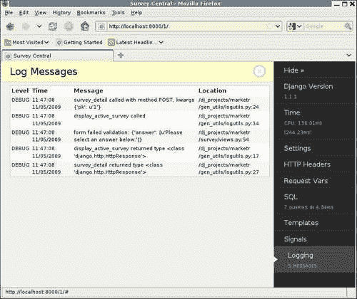

在这个页面上，我们可以看到除了消息本身及其分配的级别之外，工具栏还报告了它们被记录的日期和时间，以及它们在代码中生成的位置。由于大多数这些日志消息来自包装函数，这里的位置信息并不特别有用。然而，新添加的日志消息正确地匹配了它在代码中的位置。事实上，记录的消息清楚地表明表单的问题是缺少一个答案的选择。

# 总结

我们现在已经讨论完了如何获取有关 Django 应用程序代码运行情况的更多信息的技术。在本章中，我们：

+   开发了一些模板实用程序代码，以跟踪在生成页面时进行了哪些 SQL 请求

+   了解到创建可重用的通用实用程序代码可能会比起初看起来需要更多的工作

+   学习了 Django 调试工具栏如何可以用更少的工作量获得与我们自己编写的代码中相同的信息，以及更多的信息。

+   讨论了在代码开发过程中应用通用日志框架的有用性，而不是依赖于临时的“添加`print`”方法来调试问题

通过使用这些工具和技术，我们能够获取关于代码运行情况的大量信息。当代码正常运行时，对代码行为有很好的理解，这样在出现问题时更容易调试。此外，即使在所有外观上看起来代码正常运行时，检查代码确切的运行情况可能会揭示潜在的问题，这些问题在代码从开发转移到生产过程中可能会变成重大问题。

然而，有时候，即使利用这些技术获得的所有信息也不足以解决手头的问题。在这种情况下，下一步可能是在调试器下运行代码。这是下一章的主题。
