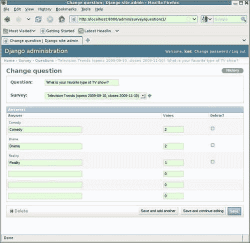
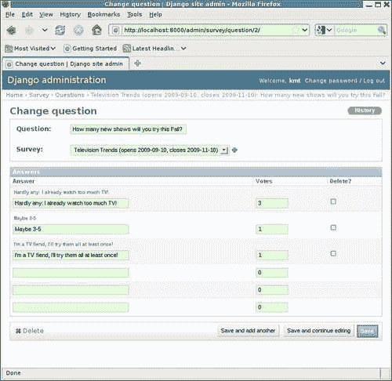
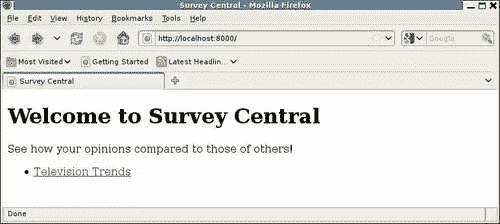
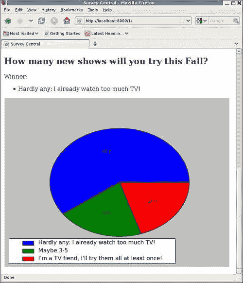
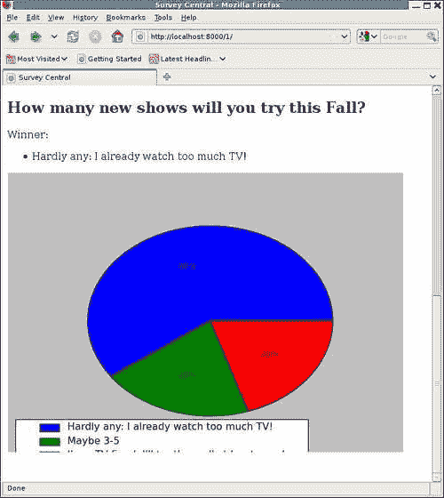

# 第九章：当你甚至不知道要记录什么时：使用调试器

对于开发中遇到的许多问题，调试器是最有效的工具，可以帮助弄清楚发生了什么。调试器可以让您逐步查看代码的确切操作，如果需要的话。它可以让您查看并更改沿途的变量值。有了调试器，甚至可以在对源代码进行更改之前测试潜在的代码修复。

本章重点介绍如何使用调试器来帮助调试 Django 应用程序的开发过程。具体来说，在本章中我们将：

+   继续开发调查应用程序，看看 Python 调试器 pdb 如何帮助弄清楚出现的任何问题

+   学习如何使用调试器来验证受多进程竞争条件影响的代码的正确操作

+   简要讨论使用图形调试器调试 Django 应用程序

# 实施调查结果显示

调查应用程序还有一个主要部分尚未实施：显示已完成调查的结果。这种显示应该采取什么形式？对于调查中每个问题的每个答案收到的投票，仅以文本形式进行计数将很容易编写，但不太能有效地传达结果。结果的图形表示，如饼图，将更有效地传达投票的分布情况。

在本章中，我们将探讨几种不同的方法来实施调查结果视图，其中包括使用饼图来显示投票分布。在此过程中，我们将遇到一些困难，并看到 Python 调试器如何帮助弄清楚出了什么问题。

在开始实施用于显示调查结果的代码之前，让我们设置一些测试数据，以便在进行结果测试时使用。我们可以使用现有的**电视趋势**调查，只需调整其数据以反映我们想要测试的内容。首先，我们需要将其“关闭”日期更改为过去两周，这样它将显示为已完成的调查，而不是活动中的调查。

其次，我们需要设置问题答案的“投票”计数，以确保我们测试任何特殊情况。这个“调查”有两个问题，因此我们可以用它来测试答案中有一个明显的单一赢家和答案平局的情况。

我们可以使用管理应用程序在第一个问题上设置获胜者平局：



在这里，我们已经将**喜剧**和**戏剧**设置为获胜答案的平局。为简单起见，投票总数（5）被保持在较低水平。当扇形应包含总数的五分之一和五分之二时，验证饼图的外观将很容易。

对于第二个问题，我们可以设置数据，以便有一个明显的单一赢家：



对于这个问题，我们的结果显示应该只列出**几乎没有：我已经看太多电视了！**作为唯一的获胜答案。

# 使用 pygooglechart 显示结果

一旦我们决定要创建饼图，下一个问题是：我们该如何做到这一点？图表创建并不内置于 Python 语言中。但是，有几个附加库提供了这个功能。我们将首先尝试使用最简单的替代方案之一，即`pygooglechart`，它是围绕 Google 图表 API 的 Python 包装器。

`pygooglechart`包可以在 Python 包索引网站[`pypi.python.org/pypi/pygooglechart`](http://pypi.python.org/pypi/pygooglechart)上找到。有关基础 Google 图表 API 的信息可以在[`code.google.com/apis/chart/`](http://code.google.com/apis/chart/)上找到。本章中使用的`pygooglechart`版本是 0.2.0。

使用`pygooglechart`的一个原因非常简单，对于 Web 应用程序来说，构建图表的结果只是一个 URL，可以用来获取图表图像。我们不需要从我们的应用程序生成或提供图像文件。相反，所有的工作都可以推迟到 Google 图表 API，并且我们的应用程序只需包含引用由 Google 提供的图像的 HTML `img`标签。

然后让我们从显示调查结果的模板开始。当前的模板`survey/completed_survey.html`的实现只是打印一个标题，指出调查的标题：

```py
 
 
<h1>Survey results for {{ survey.title }}</h1> 
 
```

我们现在想要改变这一点，并添加模板代码，循环遍历调查中的问题，并打印出每个问题的结果。请记住，`Question`模型有一个方法（在第三章中实现，*测试 1, 2, 3：基本单元测试*），该方法返回获胜的答案：

```py
class Question(models.Model): 
    question = models.CharField(max_length=200) 
    survey = models.ForeignKey(Survey) 

    def winning_answers(self): 
        max_votes = self.answer_set.aggregate(Max('votes')).values()[0]
        if max_votes and max_votes > 0: 
            rv = self.answer_set.filter(votes=max_votes) 
        else: 
            rv = self.answer_set.none() 
        return rv 
```

然后，在模板中，我们可以使用这个方法来访问获胜的答案（或者在平局的情况下是答案）。对于`Survey`中的每个`Question`，我们将打印出问题文本，获胜答案的列表，以及显示每个`Answer`的投票结果的饼图。执行此操作的模板代码如下：

```py
 
 
<h1>Survey results for {{ survey.title }}</h1> 
 
 
 
<h2>{{ q.question }}</h2> 
<p>Winner{{ winners|length|pluralize }}:</p> 
<ul> 
 
<li>{{ answer.answer }}</li> 
 
</ul> 
<p></p> 
 
 
 
 
```

在这里，我们添加了一个``块，它循环遍历传递的调查中的问题。对于每个问题，使用`winning_answers`方法检索获胜答案的列表，并将其缓存在`winners`模板变量中。然后，如果`winners`中有任何内容，则显示以下项目：

+   问题文本，作为二级标题。

+   获胜者列表的标题段落，根据`winners`的长度正确使用复数形式。

+   获胜答案的文本列表，格式为无序列表。

+   一个嵌入式图像，将是答案投票的饼图分解。使用需要在`Question`模型上实现的例程检索此图像的 URL：`get_piechart_url`。

请注意，整个项目列表的显示受到``块的保护，以防止尝试为未收到答案的`Question`显示结果的边缘情况。这可能不太可能，但最好永远不要为用户显示可能看起来奇怪的输出，因此在这里的模板级别上，我们在这种情况下简单地避免显示任何内容。

接下来，我们需要为`Question`模型实现`get_piechart_url`方法。在阅读了`pygooglechart` API 之后，初始实现可能是：

```py
    def get_piechart_url(self): 
        from pygooglechart import PieChart3D 
        answer_set = self.answer_set.all() 
        chart = PieChart3D(500, 230) 
        chart.set_data([a.votes for a in answer_set]) 
        chart.set_pie_labels([a.answer for a in answer_set]) 
        return chart.get_url() 
```

此代码检索与`Question`相关联的答案集，并将其缓存在本地变量`answer_set`中。（这是因为在接下来的代码中，该集合被多次迭代，将其缓存在本地变量中可以确保数据只从数据库中获取一次。）然后，调用`pygooglechart` API 创建一个三维饼图`chart`，宽度为 500 像素，高度为 230 像素。然后，为饼图楔设置数据值：这些数据值是集合中每个答案的`votes`计数。接下来，为每个楔设置标签为`answer`值。最后，该方法使用`get_url`方法返回构建图表的 URL。

那效果如何？当我们导航到调查应用程序的主页时，**电视趋势**调查现在应该（因为它的`closes`日期已经设置为已经过去）在指示我们可以看到其结果的标题下列出：



现在点击**电视趋势**链接将显示一个已完成的调查结果页面：


这不太对。虽然获胜答案列表的文本显示正常，但饼图没有出现。相反，浏览器显示了为图像定义的替代文本**饼图**，这意味着在检索指定图像时出现了问题。

查看页面的 HTML 源代码，我们发现包含图像标签的两个段落看起来像这样：

```py
<p></p>
```

不知何故，`get_piechart_url`方法返回了一个空字符串而不是一个值。我们可能首先要在`get_piechart_url`中添加一些日志，以尝试弄清楚原因：

```py
    def get_piechart_url(self): 
        from pygooglechart import PieChart3D 
        import logging 
        logging.debug('get_piechart_url called for pk=%d', self.pk) 
        answer_set = self.answer_set.all() 
        chart = PieChart3D(500, 230) 
        chart.set_data([a.votes for a in answer_set]) 
        chart.set_pie_labels([a.answer for a in answer_set]) 
        logging.debug('get_piechart_url returning: %s', chart.get_url()) 
        return chart.get_url() 
```

我们已经在进入时添加了一个日志记录，记录了`Question`实例的主键，以及在退出之前记录了方法即将返回的内容。然而，重新加载包含日志的页面会在服务器控制台上产生混乱的输出：

```py
DEBUG:root:survey_detail called with method GET, kwargs {'pk': u'1'} 
DEBUG:root:display_completed_survey called 
DEBUG:root:get_piechart_url called for pk=1 
DEBUG:root:get_piechart_url called for pk=2 
DEBUG:root:display_completed_survey returned type <class 'django.http.HttpResponse'> 
DEBUG:root:survey_detail returned type <class 'django.http.HttpResponse'> 
[14/Nov/2009 11:29:08] "GET /1/ HTTP/1.1" 200 2573 

```

我们可以看到`survey_detail`调用了`display_completed_survey`，并且`get_piechart_url`被调用了两次，但是两次都没有显示它返回了什么消息。发生了什么？在两个`logging.debug`调用之间的代码中没有分支，那么一个是如何执行的，另一个被跳过的呢？

我们可以尝试添加更多的日志调用，插入到每行代码之间。然而，虽然这可能会揭示方法在意外离开之前执行了多远，但它不会提供任何关于为什么执行停止继续到下一行的线索。即使对于像这样小的方法，每行代码之后都添加日志也是一种麻烦。对于这样的问题，调试器是弄清楚发生了什么的更有效的方法。

# 使用调试器入门

调试器是一个强大的开发工具，可以让我们在代码运行时查看代码的运行情况。当程序在调试器的控制下运行时，用户可以暂停执行，检查和更改变量的值，灵活地继续执行到下一行或其他明确设置的“断点”，等等。Python 有一个名为 pdb 的内置调试器，它提供了一个用户界面，本质上是一个增强的 Python shell。除了正常的 shell 命令，pdb 还支持各种特定于调试器的命令，其中许多我们将在本章中进行实验，因为我们调试调查结果显示代码。

那么，我们如何使用 pdb 来帮助弄清楚这里发生了什么？我们想进入调试器并逐步执行代码，看看发生了什么。首先要做的任务是进入调试器，可以通过在我们想要调试器控制的地方添加`import pdb; pdb.set_trace()`来完成。`set_trace()`调用在我们的程序中设置了一个显式断点，执行将在调试器控制下暂停，以便我们可以调查当前状态并控制代码的执行方式。因此，我们可以像这样更改`get_piechart_url`方法来在进入时调用调试器：

```py
    def get_piechart_url(self): 
        from pygooglechart import PieChart3D 
        import logging 
        import pdb; pdb.set_trace() 
        logging.debug('get_piechart_url called for pk=%d', self.pk) 
        answer_set = self.answer_set.all() 
        chart = PieChart3D(500, 230) 
        chart.set_data([a.votes for a in answer_set]) 
        chart.set_pie_labels([a.answer for a in answer_set]) 
        logging.debug('get_piechart_url returning: %s', chart.get_url()) 
        return chart.get_url() 
```

现在，当我们重新加载调查结果页面时，浏览器将在尝试加载页面时出现挂起的情况：


当我们切换到包含`runserver`控制台的窗口时，我们看到：

```py
DEBUG:root:survey_detail called with method GET, kwargs {'pk': u'1'} 
DEBUG:root:display_completed_survey called 
> /dj_projects/marketr/survey/models.py(71)get_piechart_url() 
-> logging.debug('get_piechart_url called for pk=%d', self.pk) 
(Pdb) 

```

在这里，我们看到对`survey_detail`视图的另一个调用已经完成，它将请求转发到`display_completed_survey`函数。然后，由于在`get_piechart_url`中放置的`pdb.set_trace()`调用，进入了调试器。进入时，调试器打印出两行标识下一行要执行的代码的位置以及该行的内容。因此，我们可以看到我们正在`survey/models.py`文件的第 71 行，在`get_piechart_url`方法中，即将发出调用以记录方法的日志。在两行指出执行停止的地方之后，调试器打印出其提示符`(Pdb)`，并等待用户输入。

在继续逐步执行代码并查看代码运行时发生了什么之前，让我们先看看我们能了解到关于我们所处的位置和当前状态的信息。Pdb 支持许多命令，并不是所有命令都会在这里介绍，而只会演示最常用的一些。我们将从一些有助于了解代码所在位置、如何到达该位置以及传递给当前函数的参数的命令开始。

## list 命令

例如，如果调试器进入时提供的单行上下文不足够，可以使用`list`命令看到更多周围的代码。这个命令，像大多数 pdb 命令一样，可以缩写为它的首字母。在这里使用它我们看到：

```py
(Pdb
) l
 66
 67         def get_piechart_url(self):
 68             from pygooglechart import PieChart3D
 69             import logging
 70             import pdb; pdb.set_trace()
 71  ->         logging.debug('get_piechart_url called for pk=%d', self.pk)
 72             answer_set = self.answer_set.all()
 73             chart = PieChart3D(500, 230)
 74             chart.set_data([a.votes for a in answer_set])
 75             chart.set_pie_labels([a.answer for a in answer_set])
 76             logging.debug('get_piechart_url returning: %s', 
(Pdb)
 77                chart.get_url())
 78             return chart.get_url()
 79
 80     class Answer(models.Model):
 81         answer = models.CharField(max_length=200)
 82         question = models.ForeignKey(Question)
 83         votes = models.IntegerField(default=0)
 84
 85         def __unicode__(self):
 86             return self.answer
 87
(Pdb)

```

在这里，我们看到`list`命令的响应首先显示了当前执行行上面的五行，然后是当前执行行（由`->`前缀标记），然后是当前行之后的五行。在`(Pdb)`提示符下，然后输入了一个空行，这会导致重复输入的最后一个命令。对于`list`，重复命令会导致显示比之前显示的多 11 行。

可以传递参数给`list`命令，以指定要显示的确切行，例如`l 1,5`将显示当前文件中的前五行。

```py
(Pdb) l 1,5
 1     # -*- encoding: utf-8 -*-
 2
 3     import datetime
 4     from django.db import models
 5     from django.db.models import Max
(Pdb)

```

`list`命令最有用，可以看到当前停止执行的代码周围的行。如果需要更多上下文，我发现在编辑器中打开文件比尝试使用带参数的`list`命令更容易获得文件的更完整的图像。

## where 命令

`w` `here`命令（可以缩写为`w`）打印当前的堆栈跟踪。在这种情况下，关于代码如何到达当前位置并没有特别的神秘之处，但检查细节仍然是有益的。

`get_piechart_url`方法在模板渲染期间被调用，这意味着由于模板节点的递归渲染方式，它将具有很长的堆栈跟踪。起初，响应的长度和打印出的内容密度可能会让人感到不知所措，但通过忽略大部分细节，只关注文件和函数的名称，你可以对整体代码流程有一个很好的了解。例如，在响应的开始，这里的`where`命令是：

```py
(Pdb) w 
 /usr/lib/python2.5/site-packages/django/core/management/commands/runserver.py(60)inner_run() 
-> run(addr, int(port), handler) 
 /usr/lib/python2.5/site-packages/django/core/servers/basehttp.py(698)run() 
-> httpd.serve_forever() 
 /usr/lib/python2.5/SocketServer.py(201)serve_forever() 
-> self.handle_request() 
 /usr/lib/python2.5/SocketServer.py(222)handle_request() 
-> self.process_request(request, client_address) 
 /usr/lib/python2.5/SocketServer.py(241)process_request() 
-> self.finish_request(request, client_address) 
 /usr/lib/python2.5/SocketServer.py(254)finish_request() 
-> self.RequestHandlerClass(request, client_address, self) 
 /usr/lib/python2.5/site-packages/django/core/servers/basehttp.py(560)__init__() 
-> BaseHTTPRequestHandler.__init__(self, *args, **kwargs) 
 /usr/lib/python2.5/SocketServer.py(522)__init__() 
-> self.handle() 
 /usr/lib/python2.5/site-packages/django/core/servers/basehttp.py(605)handle() 
-> handler.run(self.server.get_app()) 
 /usr/lib/python2.5/site-packages/django/core/servers/basehttp.py(279)run() 
-> self.result = application(self.environ, self.start_response) 
 /usr/lib/python2.5/site-packages/django/core/servers/basehttp.py(651)__call__() 
-> return self.application(environ, start_response) 
 /usr/lib/python2.5/site-packages/django/core/handlers/wsgi.py(241)__call__() 
-> response = self.get_response(request) 
 /usr/lib/python2.5/site-packages/django/core/handlers/base.py(92)get_response() 
-> response = callback(request, *callback_args, **callback_kwargs) 

```

我们可能并不完全确定所有这些代码在做什么，但像`serve_forever()`、`handle_request()`、`process_request()`、`finish_request()`和`get_response()`这样的名称，似乎这都是标准服务器请求处理循环的一部分。特别是`get_response()`听起来像是代码接近完成为请求生成响应的真正工作的地方。接下来，我们看到：

```py
 /dj_projects/marketr/gen_utils/logutils.py(21)__call__() 
-> rv = f(*args, **kwargs) 
 /dj_projects/marketr/survey/views.py(30)survey_detail() 
-> return display_completed_survey(request, survey) 
 /dj_projects/marketr/gen_utils/logutils.py(11)__call__() 
-> rv = f(*args, **kwargs) 
 /dj_projects/marketr/survey/views.py(40)display_completed_survey() 
-> RequestContext(request)) 

```

实际上，在`get_response`函数中，在调用`callback()`的地方，代码从 Django 代码（`/usr/lib/python2.5/site-packages/django`中的文件）转换为我们自己的代码`/dj_projects`。然后我们看到我们在跟踪中引入了自己的噪音，使用了日志包装函数——在`logutils.py`中的`__call__`的引用。

这些并没有传达太多信息，只是表明正在记录所做的函数调用。但是忽略噪音，我们仍然可以看到`survey_detail`被调用，然后调用了`display_completed_survey`，它运行到即将返回的地方（在`display_completed_survey`中多行调用`render_to_response`的最后一行是结束）。对`render_to_response`的调用又回到了 Django 代码：

```py
 /usr/lib/python2.5/site-packages/django/shortcuts/__init__.py(20)render_to_response() 
-> return HttpResponse(loader.render_to_string(*args, **kwargs), **httpresponse_kwargs) 
 /usr/lib/python2.5/site-packages/django/template/loader.py(108)render_to_string() 
-> return t.render(context_instance) 
 /usr/lib/python2.5/site-packages/django/template/__init__.py(178)render() 
-> return self.nodelist.render(context) 
 /usr/lib/python2.5/site-packages/django/template/__init__.py(779)render() 
-> bits.append(self.render_node(node, context)) 
 /usr/lib/python2.5/site-packages/django/template/debug.py(71)render_node() 
-> result = node.render(context) 
 /usr/lib/python2.5/site-packages/django/template/loader_tags.py(97)render() 
-> return compiled_parent.render(context) 

```

我们可以从这里以及接下来的`render()`和`render_node()`调用中得到的信息是，Django 代码正在处理模板的渲染。最终，一些略有不同的调用开始出现：

```py
 /usr/lib/python2.5/site-packages/django/template/debug.py(87)render() 
-> output = force_unicode(self.filter_expression.resolve(context)) 
 /usr/lib/python2.5/site-packages/django/template/__init__.py(546)resolve() 
-> obj = self.var.resolve(context) 
 /usr/lib/python2.5/site-packages/django/template/__init__.py(687)resolve() 
-> value = self._resolve_lookup(context) 
 /usr/lib/python2.5/site-packages/django/template/__init__.py(722)_resolve_lookup() 
-> current = current() 
> /dj_projects/marketr/survey/models.py(71)get_piechart_url() 
-> logging.debug('get_piechart_url called for pk=%d', self.pk) 
(Pdb) 

```

在渲染过程中，代码最终到达需要在模板中渲染`{{ q.get_piechart_url }}`值的点。最终，这被路由到了`Question`模型的`get_piechart_url`方法的调用，我们在那里放置了进入调试器的调用，这就是我们现在所处的位置。

## args 命令

`args`命令，缩写为`a`，可用于查看传递给当前执行函数的参数的值：

```py
(Pdb) a 
self = Television Trends (opens 2009-09-10, closes 2009-11-10): What is your favorite type of TV show? 
(Pdb) 

```

## whatis 命令

`whatis`命令显示其参数的类型。例如：

```py
(Pdb) whatis self 
<class 'survey.models.Question'> 
(Pdb) 

```

回想一下，pdb 也像 Python shell 会话一样运行，因此可以通过获取`self`的`type`来获得相同的结果：

```py
(Pdb) type(self) 
<class 'survey.models.Question'> 
(Pdb) 

```

我们还可以查询变量的单个属性，这可能会有所帮助。这里对于`args`命令显示的`self`的值包括了该模型的所有单个属性，但不包括其主键值。我们可以找出它是什么：

```py
(Pdb) self.pk 
1L 
(Pdb) 

```

## print 和 pp 命令

`print`命令，缩写为`p`，打印变量的表示：

```py
(Pdb) p self 
<Question: Television Trends (opens 2009-09-10, closes 2009-11-10): What is your favorite type of TV show?> 
(Pdb)

```

对于大型数据结构，如果`print`的输出跨越了行边界，可能会难以阅读。替代的`pp`命令使用 Python 的`pprint`模块对输出进行漂亮打印。这可能会导致更容易阅读的输出。例如：

```py
(Pdb) p locals() 
{'PieChart3D': <class 'pygooglechart.PieChart3D'>, 'self': <Question: Television Trends (opens 2009-09-10, closes 2009-11-10): What is your favorite type of TV show?>, 'logging': <module 'logging' from '/usr/lib/python2.5/logging/__init__.pyc'>, 'pdb': <module 'pdb' from '/usr/lib/python2.5/pdb.pyc'>} 

```

将`print`输出与`pp`输出进行对比：

```py
(Pdb) pp locals() 
{'PieChart3D': <class 'pygooglechart.PieChart3D'>, 
 'logging': <module 'logging' from '/usr/lib/python2.5/logging/__init__.pyc'>, 
 'pdb': <module 'pdb' from '/usr/lib/python2.5/pdb.pyc'>, 
 'self': <Question: Television Trends (opens 2009-09-10, closes 2009-11-10): What is your favorite type of TV show?>} 
(Pdb) 

```

# 调试 pygooglechart 结果显示

此时我们知道代码处于`get_piechart_url`方法的处理开始阶段，而`self`的当前值表明我们被调用的`Question`实例是询问“你最喜欢的电视节目类型是什么？”这是好事，但我们真正想要了解的是随着执行的继续会发生什么。

## 步骤和下一步命令

我们现在想要指示调试器继续执行，但保持调试器处于活动状态。通常在这里使用两个命令：`step`（缩写为`s`）和`next`（缩写为`n`）。

`step`命令开始执行当前行，并在第一个可用的机会返回到调试器。`next`命令也开始执行当前行，但直到当前函数中的下一行即将执行时才返回到调试器。因此，如果当前行包含函数或方法调用，`step`用于进入该函数并跟踪其执行，而`next`用于执行被调用的函数并在其完成时才返回到调试器。

对于我们现在所处的位置，`next`是我们想要使用的命令，因为我们不特别想要进入日志记录代码并跟踪其执行过程：

```py
(Pdb) n 
DEBUG:root:get_piechart_url called for pk=1 
> /dj_projects/marketr/survey/models.py(72)get_piechart_url() 
-> answer_set = self.answer_set.all() 
(Pdb) 

```

在这里，`next`导致执行`logging.debug`调用，导致记录的消息被打印到控制台。然后调试器再次停止，就在当前函数中的下一行执行之前。输入 nothing 会再次执行`next`命令，导致`answer_set`被赋予`self.answer_set.all()`的值。我们可以使用`print`命令查看结果：

```py
(Pdb) 
> /dj_projects/marketr/survey/models.py(73)get_piechart_url() 
-> chart = PieChart3D(500, 230) 
(Pdb) p answer_set 
[<Answer: Comedy>, <Answer: Drama>, <Answer: Reality>] 
(Pdb) 

```

到目前为止一切看起来都很好，所以我们继续：

```py
(Pdb) n
> /dj_projects/marketr/survey/models.py(74)get_piechart_url() 
-> chart.set_data([a.votes for a in answer_set]) 
(Pdb) 
AttributeError: "'PieChart3D' object has no attribute 'set_data'" 
> /dj_projects/marketr/survey/models.py(74)get_piechart_url() 
-> chart.set_data([a.votes for a in answer_set]) 
(Pdb) 

```

有一个问题：对`chart`上的`set_data`的调用引发了一个属性错误，错误消息指示图表没有这样的属性。我们在实现这个例程时犯了一个错误。虽然`pygooglechart`的许多方法以`set_`开头，但设置图表数据的调用实际上命名为`add_data`。因此，尝试指定图表的数据失败了。但为什么我们没有看到该错误反映为返回的调试页面，而只是从`get_piechart_url`返回了一个空字符串？我们可以通过继续跟踪代码的执行来得到这个问题的答案：

```py
(Pdb) 
--Return-- 
> /dj_projects/marketr/survey/models.py(74)get_piechart_url()->None 
-> chart.set_data([a.votes for a in answer_set]) 

```

这表明`get_piechart_url`方法在引发`AttributeError`时返回`None`。由于我们没有将`get_piechart_url`中的代码包含在`try/except`块中，因此错误正在向上传播调用堆栈。

```py
(Pdb) 
AttributeError: "'PieChart3D' object has no attribute 'set_data'" 
> /usr/lib/python2.5/site-packages/django/template/__init__.py(722)_resolve_lookup() 
-> current = current() 
(Pdb) 
> /usr/lib/python2.5/site-packages/django/template/__init__.py(723)_resolve_lookup() 
-> except TypeError: # arguments *were* required 
(Pdb) 
> /usr/lib/python2.5/site-packages/django/template/__init__.py(727)_resolve_lookup() 
-> except Exception, e: 

```

在这里，我们看到调用`get_piechart_url`的代码被包含在`try/except`块中，并且正在测试`except`子句是否与实际引发的异常匹配。第一个子句`except TypeError`没有匹配`AttributeError`。第二个子句`except Exception`匹配，因为`AttributeError`是从基类`Exception`派生的。因此，代码应该继续运行此`except`子句中的任何代码。记住我们可以使用`list`命令来查看那是什么：

```py
(Pdb) l
722                          current = current()
723                      except TypeError: # arguments *were* required
724                          # GOTCHA: This will also catch any TypeError
725                          # raised in the function itself.
726 
current = settings.TEMPLATE_STRING_IF_INVALID #
 invalid method call
727  ->                  except Exception, e:
728                          if getattr(e, 'silent_variable_failure', False
):
729 
current = settings.TEMPLATE_STRING_IF_INVALID
730                          else:
731                             raise
732                      except (TypeError, AttributeError):

```

这些`except`子句似乎在测试特殊情况，其中引发的异常将被抑制，并且产生的结果将被设置为`settings.TEMPLATE_STRING_IF_INVALID`的值。这暗示了这个异常最终不会在调试页面中反映出来，尽管可能不会立即发生在即将执行的`except`子句中：

```py
(Pdb) n
> /usr/lib/python2.5/site-packages/django/template/__init__.py(728)_resolve_lookup() 
-> if getattr(e, 'silent_variable_failure', False): 
(Pdb) 
> /usr/lib/python2.5/site-packages/django/template/__init__.py(731)_resolve_lookup() 
-> raise 

```

实际上，此时代码正在重新引发异常，只是立即再次被捕获：

```py
(Pdb) n
> /usr/lib/python2.5/site-packages/django/template/__init__.py(732)_resolve_lookup() 
-> except (TypeError, AttributeError): 

```

此时的`list`命令显示了这个`except`子句将要做什么：

```py
(Pdb) l
727                                 except Exception, e:
728                                     if getattr(e, 'silent_variable_failure', False):
729                                         current = settings.TEMPLATE_STRING_IF_INVALID
730                                     else:
731                                         raise
732  ->                 except (TypeError, AttributeError):
733                         try: # list-index lookup
734                             current = current[int(bit)]
735                         except (IndexError, # list index out of range
736                                 ValueError, # invalid literal for int()
737                                 KeyError,   # current is a dict without `int(bit)` key
(Pdb)
738                                 TypeError,  # unsubscriptable object
739                                 ):
740                             raise VariableDoesNotExist("Failed lookup for key [%s] in %r", (bit, current)) # missing attribute
741                     except Exception, e:
742                         if getattr(e, 'silent_variable_failure', False):
743                             current = settings.TEMPLATE_STRING_IF_INVALID
744                         else:
745                             raise
746
747             return current
748
(Pdb)

```

在这里，有必要回想一下在模板渲染期间如何处理`{{ q.get_piechart_url }}`等结构。Django 模板处理尝试使用以下四种方法按顺序解析点号右侧的值：

+   字典查找

+   属性查找

+   方法调用

+   列表索引查找

我们在方法调用尝试的中间进入了调试器，前两个选项失败后。尝试方法调用的代码不区分由于方法不存在而导致的`AttributeError`和由调用方法引发的`AttributeError`，因此下一步将尝试进行列表索引查找。这也将失败：

```py
(Pdb) n
> /usr/lib/python2.5/site-packages/django/template/__init__.py(733)_resolve_lookup() 
-> try: # list-index lookup 
(Pdb) 
> /usr/lib/python2.5/site-packages/django/template/__init__.py(734)_resolve_lookup() 
-> current = current[int(bit)] 
(Pdb) 
ValueError: "invalid literal for int() with base 10: 'get_piechart_url'" 
> /usr/lib/python2.5/site-packages/django/template/__init__.py(734)_resolve_lookup() 
-> current = current[int(bit)] 

```

具体来说，列表索引查找尝试引发了`ValueError`，我们可以从先前的代码中看到，它将被特殊处理并转换为`VariableDoesNotExist`异常。我们可以继续跟踪代码，但在这一点上很明显会发生什么。无效的变量将被转换为`TEMPLATE_STRING_IF_INVALID`设置分配的内容。由于调查项目将此设置设置为默认的空字符串，因此空字符串是`{{ q.get_piechart_url }}`的渲染的最终结果。

## 继续命令

此时，我们知道问题是什么，问题是如何导致模板中出现空字符串而不是调试页面的问题，我们已经准备好去修复代码。我们可以使用`continue`命令，缩写为`c`，告诉调试器退出并让程序执行正常继续。当我们在这里这样做时，我们看到：

```py
(Pdb) c 
> /dj_projects/marketr/survey/models.py(71)get_piechart_url() 
-> logging.debug('get_piechart_url called for pk=%d', self.pk) 
(Pdb)

```

发生了什么？我们又回到了起点。原因是调查中有两个问题，模板循环遍历它们。`get_piechart_url`方法为每个问题调用一次。当我们在弄清楚第一个问题发生了什么后退出调试器时，模板处理继续进行，很快又调用了`get_piechart_url`，再次导致`pdb.set_trace()`调用进入调试器。我们可以通过看到`self`现在指的是调查中的第二个问题来确认这一点：

```py
(Pdb) self 
<Question: Television Trends (opens 2009-09-10, closes 2009-11-10): How many new shows will you try this Fall?> 
(Pdb) 

```

我们可以再次`continue`并继续修复我们的 Python 源文件，但这实际上提供了一个机会来使用一些额外的调试器命令，所以我们将这样做。

## 跳转命令

首先，使用`next`来继续到即将在`chart`上调用错误方法的代码行：

```py
(Pdb) n 
DEBUG:root:get_piechart_url called for pk=2 
> /dj_projects/marketr/survey/models.py(72)get_piechart_url() 
-> answer_set = self.answer_set.all() 
(Pdb) n 
> /dj_projects/marketr/survey/models.py(73)get_piechart_url() 
-> chart = PieChart3D(700, 230) 
(Pdb) n 
> /dj_projects/marketr/survey/models.py(74)get_piechart_url() 
-> chart.set_data([a.votes for a in answer_set]) 
(Pdb) 

```

现在，手动发出应该存在的调用，`chart.add_data`：

```py
(Pdb) chart.add_data([a.votes for a in answer_set]) 
0 
(Pdb) 

```

该调用返回了`0`，这比引发属性错误要好得多。现在我们想要跳过错误的代码行。我们可以看到`set_data`调用在`models.py`的第`74`行；我们想要跳过第`74`行，而是直接到第`75`行。我们可以使用`jump`命令，可以缩写为`j`：

```py
(Pdb) j 75 
> /dj_projects/marketr/survey/models.py(75)get_piechart_url() 
-> chart.set_pie_labels([a.answer for a in answer_set]) 
(Pdb)

```

这似乎已经奏效。我们可以通过`next`继续进行，以确认我们在代码中没有错误地前进：

```py
(Pdb) n 
> /dj_projects/marketr/survey/models.py(75)get_piechart_url() 
-> chart.set_pie_labels([a.answer for a in answer_set]) 
(Pdb) n 
> /dj_projects/marketr/survey/models.py(75)get_piechart_url() 
-> chart.set_pie_labels([a.answer for a in answer_set]) 
(Pdb)

```

除了我们似乎没有在前进，我们似乎卡在一行上。不过我们并没有。请注意，该行包括一个列表推导式：`[a.answer for a in answer_set]`。`next`命令将避免跟踪调用的函数，但对于列表推导式却不会。包含推导式的行将对列表中每个项目的添加看起来被执行一次。这可能会变得乏味，特别是对于长列表。在这种情况下，列表只有三个元素，因为集合中只有三个答案，所以我们可以轻松地按回车键继续。但是，也有一种方法可以解决这个问题，我们可能也会学到。

## 断点命令

`break`命令，可以缩写为`b`，在指定的行上设置断点。由于`next`没有像我们希望的那样快速地将我们超过第 75 行，我们可以在第 76 行设置断点，并使用`continue`一步到位地通过第 75 行的列表推导：

```py
(Pdb) b 76 
Breakpoint 1 at /dj_projects/marketr/survey/models.py:76 
(Pdb) c 
> /dj_projects/marketr/survey/models.py(76)get_piechart_url() 
-> logging.debug('get_piechart_url returning: %s', chart.get_url()) 
(Pdb) 

```

这对于跳过除列表推导之外的其他循环结构，或者在代码中快速前进到不需要逐行跟踪的点时，但您确实想要停在稍后的某个地方并查看事物的状态，这将非常有用。

没有参数发出的`break`命令会打印出当前设置的断点列表，以及它们被触发的次数：

```py
(Pdb) b
Num Type         Disp Enb   Where
1   breakpoint   keep yes   at /dj_projects/marketr/survey/models.py:76
 breakpoint already hit 1 time
(Pdb)

```

请注意，由`pdb.set_trace()`产生的断点在此处不包括在内，此显示仅显示通过`break`命令设置的断点。

`break`命令还支持除简单行号之外的其他参数。您可以指定函数名称或另一个文件中的行。此外，您还可以指定必须满足的断点触发条件。这里没有详细介绍这些更高级的选项。然而，Python 文档提供了完整的细节。

## 清除命令

设置断点后，可能会有一段时间你想要清除它。这可以通过`clear`命令来完成，可以缩写为`cl`（不是`c`，因为那是`continue`）：

```py
(Pdb) cl 1 
Deleted breakpoint 1 
(Pdb) 

```

现在调试器将不再停在`models.py`的第 76 行。在这一点上，我们可能已经看到了各种调试器命令，只需输入`c`让代码继续执行：

```py
(Pdb) c 
DEBUG:root:get_piechart_url returning: http://chart.apis.google.com/chart?cht=p3&chs=700x230&chd=s:9UU&chl=Hardly%20any%3A%20I%20already%20watch%20too%20much%20TV%21|Maybe%203-5|I%27m%20a%20TV%20fiend%2C%20I%27ll%20try%20them%20all%20at%20least%20once%21 
DEBUG:root:display_completed_survey returned type <class 'django.http.HttpResponse'> 
DEBUG:root:survey_detail returned type <class 'django.http.HttpResponse'> 
[14/Nov/2009 18:03:38] "GET /1/ HTTP/1.1" 200 2989 

```

在那里，我们看到代码继续处理，记录了从`get_piechart_url`返回的值，并退出了`display_completed_survey`和`survey_detail`。最终，对于此请求返回了一个`2989`字节的响应。切换回到网页浏览器窗口，我们看到浏览器等待了那么长时间才收到响应。此外，我们手动调用了正确的方法并跳过了错误的方法。浏览器显示它能够成功地检索到第二个问题的饼图：


不幸的是，尽管图表已经生成，但标签太长无法正确显示。为了解决这个问题，我们可以尝试使用图例而不是标签。我们将尝试这样做，并将`set_data`更改为`add_data`。

# 修复 pygooglechart 结果显示

我们似乎已经接近了为结果显示创建饼图的工作实现。我们可以更新`get_piechart_url`方法，使其如下所示：

```py
    def get_piechart_url(self): 
        import pdb; pdb.set_trace() 
        answer_set = self.answer_set.all() 
        chart = PieChart3D(500, 230) 
        chart.add_data([a.votes for a in answer_set]) 
        chart.set_legend([a.answer for a in answer_set]) 
        return chart.get_url() 
```

与上一个版本的更改首先是删除了日志调用（因为它们并不特别有用），还删除了日志的导入。`PieChart3D`的导入已经移动到文件顶部，与其他导入一起。对`chart.set_data`的错误调用已被正确的`chart.add_data`替换。最后，对`chart.set_pie_labels`的调用已被替换为`chart.set_legend`，希望当答案被安排为图例时，它们将能够适合图表而不会溢出边缘。

这样做效果如何？如果我们重新加载浏览器页面，浏览器似乎又卡住了，因为`get_piechart_url`方法仍然有`pdb.set_trace()`调用，这会打断调试器。我们可能已经删除了它以及其他更改，希望相信新版本的代码肯定会起作用，但往往这样的希望都会落空，我们发现自己不得不重新添加调用以弄清楚接下来出了什么问题。在这种情况下，还有一些调试器命令可以尝试，我们接下来会做。

## 上下命令

当我们切换到`runserver`控制台窗口时，我们再次发现代码坐在`get_piechart_url`的开头：

```py
DEBUG:root:survey_detail called with method GET, kwargs {'pk': u'1'} 
DEBUG:root:display_completed_survey called 
> /dj_projects/marketr/survey/models.py(71)get_piechart_url() 
-> answer_set = self.answer_set.all() 
(Pdb) 

```

我们可以继续看看新代码的行为如何，但是有一些调试器命令我们还没有尝试过，所以让我们先做这个。其中一个是`step`命令，之前提到过，但从来没有使用过，因为我们一直使用`next`来逐步执行代码。如果我们在这里尝试`step`几次，我们会看到：

```py
(Pdb) s 
--Call-- 
> /usr/lib/python2.5/site-packages/django/db/models/fields/related.py(319)__get__() 
-> def __get__(self, instance, instance_type=None): 
(Pdb) 
> /usr/lib/python2.5/site-packages/django/db/models/fields/related.py(320)__get__() 
-> if instance is None: 
(Pdb) 
> /usr/lib/python2.5/site-packages/django/db/models/fields/related.py(323)__get__() 
-> return self.create_manager(instance, 
(Pdb) 
> /usr/lib/python2.5/site-packages/django/db/models/fields/related.py(324)__get__() 
-> self.related.model._default_manager.__class__) 
(Pdb) 
--Call-- 
> /usr/lib/python2.5/site-packages/django/db/models/fields/related.py(346)create_manager() 
-> def create_manager(self, instance, superclass): 
(Pdb) 
> /usr/lib/python2.5/site-packages/django/db/models/fields/related.py(350)create_manager() 
-> rel_field = self.related.field 
(Pdb) 

```

在这里，我们单步执行了六次，结果现在嵌套了几个调用级别深入到 Django 代码中。我们是故意这样做的，这通常是了解 Django（或其他支持库）代码工作原理的有用方式。但是在调试时，当我们真正只想单步执行我们自己的代码时，很常见的是错误地开始单步执行支持库代码。然后我们突然发现自己可能深入了几个完全陌生的代码层次，我们想要回到逐步执行我们正在开发的代码。

一种实现这一点的方法是使用`up`命令，可以缩写为`u`。`up`命令将当前堆栈帧上移一个级别：

```py
(Pdb) u 
> /usr/lib/python2.5/site-packages/django/db/models/fields/related.py(324)__get__() 
-> self.related.model._default_manager.__class__) 
(Pdb) u 
> /dj_projects/marketr/survey/models.py(71)get_piechart_url() 
-> answer_set = self.answer_set.all() 
(Pdb) u 
> /usr/lib/python2.5/site-packages/django/template/__init__.py(722)_resolve_lookup() 
-> current = current() 
(Pdb) 

```

在这里，我们上移了三个级别。原始的当前堆栈帧是调用`create_manager`的堆栈帧。第一个`up`命令将当前堆栈帧切换到`__get__`的堆栈帧，下一个切换到`get_piechart_url`，第三个则回到了`get_piechart_url`的调用者`_resolve_lookup`的堆栈帧。切换当前堆栈帧不会执行任何代码，它只是改变了命令的上下文。例如，现在当前堆栈帧为`_resolve_lookup`，我们可以检查存在于该堆栈帧中的变量：

```py

(Pdb) whatis current 
Function get_piechart_url 
(Pdb) 

```

此外，`list`现在将显示与当前堆栈帧相关联的代码：

```py
(Pdb) l
717                         if callable(current):
718 
if getattr(current, 'alters_data', False):
719                                 current = settings.TEMPLATE_STRING_IF_INVALID
720                             else:
721                                 try: # method call (assuming no args required)
722  ->                                 current = current()
723                                 except TypeError: # arguments *were* required
724                                     # GOTCHA: This will also catch any TypeError
725                                     # raised in the function itself.
726                                     current = settings.TEMPLATE_STRING_IF_INVALID # invalid method call
727                                 except Exception, e:
(Pdb)

```

如果我们切换了堆栈帧，并想知道当前堆栈帧相对于当前执行点的位置，`where`命令会显示出来。在这种情况下，`where`命令的输出看起来像这样：

```py

 /usr/lib/python2.5/site-packages/django/template/__init__.py(687)resolve() 
-> value = self._resolve_lookup(context) 
> /usr/lib/python2.5/site-packages/django/template/__init__.py(722)_resolve_lookup() 
-> current = current() 
 /dj_projects/marketr/survey/models.py(71)get_piechart_url() 
-> answer_set = self.answer_set.all() 
 /usr/lib/python2.5/site-packages/django/db/models/fields/related.py(324)__get__() 
-> self.related.model._default_manager.__class__) 
 /usr/lib/python2.5/site-packages/django/db/models/fields/related.py(350)create_manager() 
-> rel_field = self.related.field 
(Pdb) 

```

列出的最后一行始终是当前执行点，而当前堆栈帧由第一列中的`>`表示。在这里，它表示当前堆栈帧是`_resolve_lookup`的堆栈帧。

在这种情况下，我们上移了一个堆栈帧，比我们真正想要的多了一个。要回到我们自己的代码，我们需要下移一个级别。这是通过使用`down`命令（可以缩写为`d`）来完成的：

```py

(Pdb) d 
> /dj_projects/marketr/survey/models.py(71)get_piechart_url() 
-> answer_set = self.answer_set.all() 
(Pdb) 

```

现在，如果我们想要继续从这里运行到下一行，我们可以使用`next`命令：

```py
(Pdb) n 
> /dj_projects/marketr/survey/models.py(72)get_piechart_url() 
-> chart = PieChart3D(500, 230) 
(Pdb) 

```

现在我们回到了熟悉的领域，可以继续调试我们自己的代码。

## 返回命令

第二种实现相同功能的方法是使用`return`命令，可以缩写为`r`。该命令会继续执行，直到当前函数返回，然后再次进入调试器。让我们来看看它的运行情况，让我们步入`PieChart3D`的调用：

```py

(Pdb) s 
--Call-- 
> /var/lib/python-support/python2.5/pygooglechart.py(820)__init__() 
-> def __init__(self, *args, **kwargs): 
(Pdb) 
> /var/lib/python-support/python2.5/pygooglechart.py(821)__init__() 
-> assert(type(self) != PieChart)  # This is an abstract class 
(Pdb) 
> /var/lib/python-support/python2.5/pygooglechart.py(822)__init__() 
-> Chart.__init__(self, *args, **kwargs) 
(Pdb) 

```

我们已经进入了该方法的几个步骤，但只进行了一个调用，因此单个`return`应该让我们回到我们的调查代码：

```py
(Pdb) r 
--Return-- 
> /var/lib/python-support/python2.5/pygooglechart.py(823)__init__()->None 
-> self.pie_labels = [] 
(Pdb) 

```

这种方法显然没有显式的返回行，因此显示的代码行是该方法中的最后一行。输出中的`->None`显示了该方法的返回值。如果我们从这里步进：

```py
(Pdb) s 
> /dj_projects/marketr/survey/models.py(73)get_piechart_url() 
-> chart.add_data([a.votes for a in answer_set]) 
(Pdb) 

```

现在我们回到了创建饼图后的下一行代码。从这里，我们可以使用 return 来查看`get_piechart_url`方法将返回什么：

```py
(Pdb) r 
--Return-- 
> /dj_projects/marketr/survey/models.py(75)get_piechart_url()->'http://chart...Drama|Reality' 
-> return chart.get_url() 
(Pdb) 

```

看起来不错；函数已经完成运行并返回一个值。此外，似乎 pdb 会缩短显示的返回值，如果它们很长，因为显示的值看起来不太对。我们可以用任何一个`print`命令来确认这一点，这些命令显示实际值要长得多：

```py
(Pdb) pp chart.get_url() 
'http://chart.apis.google.com/chart?cht=p3&chs=500x230&chd=s:99f&chdl=Comedy|Drama|Reality' 
(Pdb)

```

目前看来一切都很正常，所以我们可以使用`continue`让程序继续运行，然后当第二个饼图的调试器再次进入时再次使用`continue`：

```py
(Pdb) c 
> /dj_projects/marketr/survey/models.py(71)get_piechart_url() 
-> answer_set = self.answer_set.all() 
(Pdb) c 
DEBUG:root:display_completed_survey returned type <class 'django.http.HttpResponse'> 
DEBUG:root:survey_detail returned type <class 'django.http.HttpResponse'> 
[15/Nov/2009 11:48:07] "GET /1/ HTTP/1.1" 200 3280 

```

这一切看起来都很好。浏览器显示了什么？切换到它的窗口，我们看到以下内容：


这比以前好。从标签切换到图例解决了答案文本溢出图形的问题。然而，饼图本身的大小因答案长度不同而有所不同，这有点令人不安。此外，如果饼图楔形能够用表示每个楔形所代表的总数的百分比进行标记，那就更好了。

在 Google 图表 API 上的更多研究并没有揭示任何控制图例放置的方法，也没有说明如何用信息注释楔形图，比如总百分比。虽然使用起来相当简单和直接，但这个 API 在定制生成的图表方面并没有提供太多功能。因此，我们可能需要调查其他生成图表的替代方法，这将是我们接下来要做的事情。

我们将保留`get_piechart_url`的当前实现，因为在这一点上我们不知道我们是否真的要切换到另一种方法。在继续下一步之前，最好将该函数中的导入`pdb; pdb.set_trace()`删除。该例程现在正在运行，如果我们以后返回使用它，最好是它在没有用户干预的情况下完成运行，而不是进入调试器中断。

# 使用 matplotlib 显示结果

`matplotlib`库提供了另一种从 Python 生成图表的方法。它可以在 Python 软件包索引网站[`pypi.python.org/pypi/matplotlib`](http://pypi.python.org/pypi/matplotlib)上找到。本章中使用的`matplotlib`版本是 0.98.3。

使用`matplotlib`，我们的应用程序不能简单地构造一个 URL 并将生成和提供图像数据的任务交给另一个主机。相反，我们需要编写一个视图来生成和提供图像数据。经过对`matplotlib`API 的一些调查，一个初始实现（在`survey/views.py`中）可能是：

```py
from django.http import HttpResponse 
from survey.models import Question 
from matplotlib.figure import Figure 
from matplotlib.backends.backend_agg import FigureCanvasAgg as \FigureCanvas 

@log_view 
def answer_piechart(request, pk): 
    q = get_object_or_404(Question, pk=pk) 
    answer_set = q.answer_set.all() 
    x = [a.votes for a in answer_set] 
    labels = [a.answer for a in answer_set] 

    fig = Figure() 
    axes = fig.add_subplot(1, 1, 1) 
    patches, texts, autotexts = axes.pie(x, autopct="%.0f%%") 
    legend = fig.legend(patches, labels, 'lower left') 

    canvas = FigureCanvas(fig) 
    response = HttpResponse(content_type='image/png') 
    canvas.print_png(response) 
    return response 
```

这比`pygooglechart`版本要复杂一些。首先，我们需要从`matplotlib`导入两个内容：基本的`Figure`类和一个适合用于渲染图形的后端。在这里，我们选择了`agg`（Anti-Grain Geometry）后端，因为它支持渲染为 PNG 格式。

在`answer_piechart`视图中，前四行很简单。从传递给视图的主键值中检索`Question`实例。该问题的答案集被缓存在本地变量`answer_set`中。然后从答案集创建了两个数据数组：`x`包含每个答案的投票计数值，`labels`包含答案文本值。

接下来，创建了一个基本的`matplotlib Figure`。`matplotlib Figure`支持包含多个子图。对于`Figure`只包含单个图的简单情况，仍然需要调用`add_subplot`来创建子图，并返回一个`Axes`实例，用于在图上绘制。`add_subplot`的参数是子图网格中的行数和列数，然后是要添加到`Figure`的图的编号。这里的参数`1, 1, 1`表示 1 x 1 网格中的单个子图。

然后在返回的子图`axes`上调用`pie`方法生成饼图图。第一个参数`x`是饼图楔形的数据值数组。`autopct`关键字参数用于指定一个格式字符串，用于注释每个饼图楔形的百分比。值`%.0f%%`指定浮点百分比值应该以小数点后零位数字的格式显示，后跟一个百分号。

`pie`方法返回三个数据序列。其中第一个`patches`描述了饼图楔形，需要传递给图例的`legend`方法，以创建一个与楔形相关联的答案值的图例。在这里，我们指定图例应放置在图的左下角。

`pie`返回的另外两个序列描述了文本标签（这里将为空，因为在调用`pie`时未指定`labels`）和楔形图的`autopct`注释。这里的代码不需要使用这些序列做任何事情。

有了图例，图就完成了。使用先前导入的`agg`后端`FigureCanvas`创建了一个`canvas`。创建了一个内容类型为`image/png`的`HttpResponse`，并使用`print_png`方法以 PNG 格式将图像写入响应。最后，`answer_piechart`视图返回此响应。

视图代码完成后，我们需要更新`survey/urls.py`文件，包括一个映射，将请求路由到该视图：

```py
urlpatterns = patterns('survey.views', 
    url(r'^$', 'home', name='survey_home'), 
    url(r'^(?P<pk>\d+)/$', 'survey_detail', name='survey_detail'), 
    url(r'^thanks/(?P<pk>\d+)/$', 'survey_thanks', name='survey_thanks'),
    url(r'^piechart/(?P<pk>\d+)\.png/$', 'answer_piechart', name='survey_answer_piechart'), 
) 
```

在这里，我们添加了最后一个模式。这个模式匹配以`piechart/`开头，后跟一个或多个数字（主键），以`.png`结尾的 URL 路径。这些 URL 被路由到`survey.views.answer_piechart`视图，传递捕获的主键值作为参数。该模式被命名为`survey_answer_piechart`。

切换到使用`matplotlib`而不是`pygooglechart`所需的最后一步是更新`survey/completed_survey.html`模板，以使用这个模式生成 URL。唯一需要的更改是更新包含`img`标签的行：

```py
<p></p> 
```

在这里，我们用引用新添加的模式的`url`模板标签替换了对问题的`get_piechart_url`方法的调用。

这是如何工作的？相当不错。我们没有为图形指定大小，而`matplotlib`的默认大小比我们为`pygooglechart`指定的要大一些，所以我们不能在不滚动的情况下看到整个页面。然而，每个单独的图看起来都很不错。例如，第一个看起来像这样：


第二个看起来像这样：



`matplotlib` API 支持的定制化远远超出了我们在这里使用的范围。图形的大小可以改变，饼图的位置可以改变，楔形图块的颜色和文本的字体属性也可以改变。获胜答案的饼图楔形可以通过从饼图的其余部分爆炸出来来强调。然而，所有这些项目都是装饰性的，超出了我们将在这里涵盖的范围。回到调试的主题，我们将在下一节中将注意力转向删除一些浪费的重复处理，这是由于切换到`matplotlib`而引入的。

# 改进 matplotlib 方法

考虑一下当浏览器请求完成调查的页面时会发生什么。对于调查中的每个问题，返回的完成调查页面都有一个嵌入的图像，当获取时，将触发对`answer_piechart`视图的调用。该视图动态生成图像，计算成本很高。实际上，根据您的硬件，如果您尝试逐步执行该视图，您可能会观察到在跨越一些`matplotlib`调用时出现明显的暂停。

现在考虑当许多不同的用户请求相同的完成调查页面时会发生什么。这将触发对计算成本高昂的`answer_piechart`视图的多次调用。最终，所有用户将得到完全相同的数据，因为在调查关闭之前不会显示结果，因此用于创建饼图的基础投票计数不会发生变化。然而，`answer_piechart`将一遍又一遍地被调用，以重新做相同数量的工作来产生完全相同的结果。这是对服务器容量的浪费。

我们如何消除这种浪费？有（至少）三种可能的方法：

+   引入缓存，并缓存`answer_piechart`视图的结果。

+   设置一些外部进程，在调查关闭时预先计算所有饼图，并将它们保存在磁盘的某个地方。将完成调查响应模板中的`img`标签更改为引用这些静态文件，而不是动态生成图像的视图。

+   当第一次请求完成调查时，动态生成饼图，并将其保存到磁盘上。这与第二种方法本质上是相同的，因为完成调查响应中的`img`标签现在将引用静态文件，但是图表的计算从某个外部进程移动到了 Web 服务器中。

这些方法各有利弊。我们要追求的是最后一种方法，仅仅是因为它提供了学习一些新东西的最大机会。具体来说，在实现这种第三种方法时，我们将看到如何设置开发服务器以提供静态文件，并且我们将看到如何使用 pdb 来确保代码在面对多进程竞争条件时能够正常运行。

## 设置静态文件服务

到目前为止，在调查应用程序的开发中，我们完全集中在提供动态内容上。虽然动态内容当然是 Django 应用程序的重点，但实际上，即使是最动态的应用程序也会有一些需要从文件中提供的数据。在这里，调查应用程序遇到了一个情况，我们希望从磁盘中提供图像文件。大多数应用程序还将具有最好直接从磁盘而不是通过 Django 视图代码提供的 CSS 和可能是 JavaScript 文件。

Django 是用于提供动态内容的框架。虽然它不直接支持从文件中提供数据，但有一些设置可以方便地将一些静态文件合并到项目中。这些是`MEDIA_ROOT`和`MEDIA_URL`。

`MEDIA_ROOT`是文件系统路径，即项目的静态文件所在目录的路径。Django 在内部使用它作为保存上传到包含`FileField`的模型的文件的基本路径。对于调查应用程序，我们将使用它作为保存动态生成的饼图图像文件的基本路径。

该设置的默认值为空字符串，因此我们现在需要将其设置为其他值：

```py
MEDIA_ROOT = '/dj_projects/marketr/site_media/'
```

在这里，我们将`MEDIA_ROOT`设置为指向主`marketr`项目目录下的`site_media`目录（我们必须创建）。

`MEDIA_URL`也默认为空字符串，是用于引用静态文件的基本 URL 路径。Django 在内部使用它来生成`FileField`模型引用的文件的`url`属性。

此外，`django.core.context_processors.media`上下文处理器通过在模板上设置`MEDIA_URL`，使得该设置的值在模板中可用。此上下文处理器默认启用，因此使用`RequestContext`渲染的任何模板都可以访问`MEDIA_URL`。

让我们在`settings.py`中设置`MEDIA_URL`如下：

```py
MEDIA_URL = '/site_media/' 
```

请注意，不应将`'/media/'`用作`MEDIA_URL`的值。这是`ADMIN_MEDIA_PREFIX`的默认设置，它定义了管理界面使用的静态文件的根 URL。尝试将两个不同的静态文件树放置在 URL 层次结构中的相同位置是行不通的，最简单的方法是将`MEDIA_URL`设置为`'/media/'`以外的其他值。

请注意，尽管这些设置是根据在 URL 路径和磁盘文件之间建立映射的术语定义的，但 Django 不会自动根据该映射来提供文件。在 URL 解析期间，Django 不会测试请求的 URL 是否以`MEDIA_URL`开头，如果是，则提供`MEDIA_ROOT`下找到的相应文件。相反，Django 假设指向磁盘上静态文件的 URL 将直接由 Web 服务器提供，而不会通过 Django 代码路由。

然而，到目前为止，在开发过程中，我们除了 Django 自己的开发服务器之外，没有使用任何其他 Web 服务器。如果我们想继续使用开发服务器，我们需要以某种方式让它提供由调查应用程序创建的图像文件。我们该怎么做呢？

Django 确实提供了静态文件服务功能，特别是在开发过程中使用。要使用它，我们需要更新项目的`urls.py`文件，将以`'site_media/'`开头的 URL 请求路由到 Django 的静态文件服务视图。因此，我们需要更改`urls.py`文件以包含：

```py
from django.conf.urls.defaults import * 

# Uncomment the next two lines to enable the admin: 
from django.contrib import admin 
admin.autodiscover() 

from django.conf import settings 

urlpatterns = patterns('', 
    # Example: 
    # (r'^marketr/', include('marketr.foo.urls')), 

    # Uncomment the admin/doc line below and add # 'django.contrib.admindocs' 
    # to INSTALLED_APPS to enable admin documentation: 
    # (r'^admin/doc/', include('django.contrib.admindocs.urls')), 

    # Uncomment the next line to enable the admin: 
    (r'^admin/', include(admin.site.urls)), 
    (r'^site_media/(.*)$', 'django.views.static.serve', 
        {'document_root': settings.MEDIA_ROOT, 'show_indexes': True}), 
    (r'', include('survey.urls')), 
) 
```

与以前版本的第一个变化是从`django.conf`中添加`settings`的`import`。第二个是添加引用以`site_media/`开头的 URL 的模式。这些 URL 被路由到`django.views.static.serve`。两个参数传递给此视图：`document_root`和`show_indexes`。对于`document_root`，指定了`MEDIA_ROOT`设置，这意味着静态服务器将在`MEDIA_ROOT`下查找请求的文件。对于`show_indexes`，指定了`True`，这意味着当请求的 URL 引用目录而不是文件时，静态服务器将返回文件列表。

## 动态生成图像文件

现在，我们已经设置好了从磁盘提供图像文件的一切，我们可以开始进行必要的代码更改。首先，我们应该从`survey/urls.py`文件中删除`piechart`模式，因为它不再需要。

其次，我们可以更新`views.py`中的`display_completed_survey`函数，以包含在返回完成的调查响应之前确保为调查中的每个问题生成了饼图图像文件的代码：

```py
@log_call 
def display_completed_survey(request, survey): 
    for q in survey.question_set.all(): 
        q.check_piechart() 
    return render_to_response('survey/completed_survey.html', {'survey': survey}, 
        RequestContext(request)) 
```

在这里，我们添加了 `for` 循环，循环遍历调查中的所有问题。对于每个问题，它调用问题的一个新方法 `check_piechart`。此例程将负责确保饼图文件存在，如有必要则创建它。

接下来，我们可以继续移动到 `survey/models.py` 文件，并更新 `Question` 模型以包含 `check_piechart` 的实现以及支持新方法所需的其他任何内容。还需要什么？为了从模板引用饼图 URL，如果 `Question` 模型支持返回相对于 `MEDIA_URL` 的饼图文件的路径，那将会很方便。因此，我们需要在 `Question` 模型中添加两个新方法：

```py
from survey import pie_utils
class Question(models.Model): 
    [… other code unchanged ...]

    @property 
    def piechart_path(self): 
        if self.pk and self.survey.closes < datetime.date.today():
            return pie_utils.PIE_PATH + '%d.png' % self.pk 
        else: 
            raise AttributeError 

    def check_piechart(self): 
        pie_utils.make_pie_if_necessary(self.piechart_path, self.answer_set.all())
```

在 `survey/models.py` 中，我们选择不直接包含大量文件检查和创建代码，而是将该工作分解到 `survey/pie_utils.py` 中的一个新的独立模块中。然后，这里实现的两个例程可以保持非常简单。

`piechart_path` 作为只读属性实现，返回饼图的路径。此值可以与 `MEDIA_URL` 设置结合使用以创建 URL 路径，或者与 `MEDIA_ROOT` 设置结合使用以创建文件系统路径。由于从长远来看，我们期望在树中不仅有饼图图像，因此将饼图放在树的根部是不合适的。因此，`pie_utils.PIE_PATH` 值用于在静态文件树中划出一个子树来容纳饼图。

请注意，如果模型实例尚未保存到数据库，或者引用了尚未关闭的调查，此例程将实现引发 `AttributeError`。在这些情况下，饼图文件不应存在，因此任何尝试引用它都应触发错误。

`check_piechart` 方法被实现为将调用转发到 `pie_utils make_pie_if_necessary` 函数。此函数接受两个参数：饼图的路径和问题的答案集。

在我们继续实现 `pie_utils` 模块之前，我们可以对 `survey/completed_survey.html` 模板进行简单更新。包含 `img` 标签的行需要更改为在创建引用饼图图像的 URL 时使用 `Question` 模型的 `piechart_path`：

```py
<p></p> 
```

在这里，`piechart_path` 与 `MEDIA_URL`（在调用 `render_to_response` 时，`display_completed_survey` 指定了 `RequestContext`，因此在模板中可用）结合起来构建图像的完整 URL。

最后，我们需要实现 `survey/pie_utils.py` 代码。此模块必须定义 `PIE_PATH` 的值，并实现 `make_pie_if_necessary` 函数。第一个任务是微不足道的，并且可以通过以下方式完成：

```py
import os
from django.conf import settings 
PIE_PATH = 'piecharts/' 
if not os.path.exists(settings.MEDIA_ROOT + PIE_PATH): 
    os.mkdir(settings.MEDIA_ROOT + PIE_PATH)    
```

此代码定义了 `PIE_PATH` 的值，并确保项目的 `MEDIA_ROOT` 下的结果子目录存在，如有必要则创建它。有了这段代码和先前提到的 `MEDIA_ROOT` 设置，调查应用程序的饼图图像文件将放置在 `/dj_projects/marketr/site-media/piecharts/` 中。

完成 `pie_utils` 模块所需的第二部分，`make_pie_if_necessary` 函数的实现，乍看起来也可能很简单。如果文件已经存在，`make_pie_if_necessary` 就不需要做任何事情，否则它需要创建文件。然而，当考虑到这段代码的部署环境最终将是一个潜在的多进程多线程的 Web 服务器时，情况就变得更加复杂了。这引入了竞争条件的机会，我们将在下面讨论。

## 处理竞争条件

`make_pie_if_necessary` 模块的天真实现可能是：

```py
def make_pie_if_necessary(rel_path, answer_set): 
    fname = settings.MEDIA_ROOT + rel_path 
    if not os.path.exists(fname): 
        create_piechart(fname, answer_set) 
```

在这里，`make_pie_if_necessary`通过将传递的相对路径与设置的`MEDIA_ROOT`值相结合来创建完整的文件路径。然后，如果该文件不存在，它调用`create_piechart`，传递文件名和答案集，以创建饼图文件。这个例程可以这样实现：

```py
from matplotlib.figure import Figure 
from matplotlib.backends.backend_agg import FigureCanvasAgg as \FigureCanvas 

def create_piechart(f, answer_set): 
    x = [a.votes for a in answer_set] 
    labels = [a.answer for a in answer_set] 

    fig = Figure() 
    axes = fig.add_subplot(1, 1, 1) 
    patches, texts, autotexts = axes.pie(x, autopct="%.0f%%") 
    legend = fig.legend(patches, labels, 'lower left') 

    canvas = FigureCanvas(fig) 
    canvas.print_png(f) 
```

这段代码基本上是原始`matplotlib`实现中`answer_piechart`视图的修改，以考虑直接传递的答案集，以及应该写入图像数据的文件。

这个`make_pie_if_necessary`的实现，在开发服务器上测试时，可以正常工作。甚至在轻负载的生产环境中，它看起来也可以正常工作。然而，如果考虑到一个高负载的生产环境，其中一个多进程的 Web 服务器可能会几乎同时收到对同一页面的请求，就会出现潜在的问题。没有什么可以阻止几乎同时调用`make_pie_if_necessary`导致多次几乎同时调用`canvas.print_png`来创建相同的文件。

很明显，这种情况在多处理器机器上可能会发生，因为很容易看到两个同时的请求可能会分派到不同的处理器，并导致相同的代码同时在每个处理器上运行。两个进程都检查文件是否存在，都发现不存在，并都开始创建文件。

即使在单处理器机器上，由于操作系统的抢占式调度，也可能出现相同的情况。一个进程可能会检查文件是否存在，发现不存在，然后开始创建文件。然而，在这段代码真正开始创建文件之前，操作系统的抢占式调度器将其挂起，并让处理第二个几乎同时的请求的进程运行。这个进程在检查时也找不到文件，并开始创建文件的路径。

如果发生这种情况，最终结果会是什么？会很糟糕吗？也许不会。可能一个进程会完成创建和写入文件的工作，然后第二个进程会覆盖第一个进程的结果。可能会有一些重复的工作，但最终结果可能还不错：磁盘上包含饼图 PNG 图像的文件。

然而，有没有保证两个几乎同时的调用的工作会像那样被串行化？没有。`matplotlib` API 没有提供任何这样的保证。没有深入研究实现，很难确定，但似乎写出图像文件的任务可能会被拆分成几个不同的单独的写入调用。这为来自引用相同文件的不同进程的随机交错调用提供了充分的机会，最终导致在磁盘上写出损坏的图像文件。

为了防止这种情况发生，我们需要改变`make_pie_if_necessary`函数，使用原子方法检查文件是否存在，并在必要时创建文件。

```py
import errno
def make_pie_if_necessary(rel_path, answer_set): 
    fname = settings.MEDIA_ROOT + rel_path 
    try: 
        fd = os.open(fname, os.O_WRONLY | os.O_CREAT | os.O_EXCL) 
        try: 
            f = os.fdopen(fd, 'wb') 
            create_piechart(f, answer_set) 
        finally: 
            f.close() 
    except OSError, e: 
        if e.errno == errno.EEXIST: 
            pass 
        else: 
            raise 
```

这段代码使用传递给`os.open`例程的标志的组合来原子性地创建文件。`os.O_WRONLY`指定文件仅用于写入，`os.O_CREAT`指定如果文件不存在则创建文件，`os.O_EXCL`与`os.O_CREAT`结合使用，指定如果文件存在则引发错误。即使多个进程同时发出这个`os.open`调用，底层实现保证只有一个会成功，其他的会引发错误。因此，只有一个进程将继续执行创建饼图的代码。

请注意，在 Windows 上运行时，`os.O_BINARY`也需要包含在传递给`os.open`的标志集中。如果没有这个标志，Python 会将文件数据视为文本，并在遇到换行符时自动插入回车符。这种行为会导致无法显示的损坏的 PNG 图像文件。

这个改变引入的一个问题是，`os.open`返回的文件描述符不能作为 PNG 数据的目标文件传递给`matplotlib`。`matplotlib`库接受文件名或 Python 文件对象，但不支持`os.open`返回的文件描述符。因此，这里的代码使用`os.fdopen`将文件描述符转换为 Python 文件对象，并将返回的文件传递给`create_piechart`例程。

在`os.open`调用引发`OSError`的情况下，将测试异常的`errno`属性是否等于`errno.EEXIST`。这是文件已经存在时将引发的特定错误，不应该作为错误反映出来，而应该被忽略。任何其他错误都会反映给`make_pie_if_necessary`的调用者。

这些更改确保图像文件只会被创建一次，这是好的。然而，还有另一个潜在的问题。考虑一下现在同时进行多个请求会发生什么。只有一个请求会继续创建文件。其他所有请求都会看到文件已经存在，然后简单地发送一个引用它的响应。

但请注意，文件的存在并不能保证图像数据已经被写入其中：首先需要进行相当多的处理来创建图像，然后才会将其写入文件。有没有保证这个处理会在收到和处理文件请求之前完成？没有。根据客户端的速度和图像生成的速度，有可能在图像数据实际写入文件之前，文件的请求已经到达并被处理。

这可能会发生吗？可能不会。如果发生了会有什么影响？可能没有什么可怕的。可能浏览器会显示一个部分图像或者**饼图**的替代文本。用户可能会尝试重新加载页面，看看第二次是否更好，那时图像文件可能会被正确地提供。

考虑到这种情况发生的可能性似乎很小，而且影响也相当小，我们可能选择不修复这个特定的问题。然而，在某些情况下，可能需要确保文件不仅存在，而且还包含数据。调查修复这个潜在问题可能是值得的。一种方法是修改`make_pie_if_necessary`如下：

```py
import fcntl
def make_pie_if_necessary(rel_path, answer_set): 
    fname = settings.MEDIA_ROOT + rel_path 
    try: 
        fd = os.open(fname, os.O_WRONLY | os.O_CREAT | os.O_EXCL) 
        try: 
            f = os.fdopen(fd, 'wb') 
            fcntl.flock(f, fcntl.LOCK_EX) 
            create_piechart(f, answer_set) 
        finally: 
            fcntl.flock(f, fcntl.LOCK_UN) 
            f.close() 
    except OSError, e: 
        if e.errno == errno.EEXIST: 
            wait_for_data(fname) 
        else: 
            raise 
```

这里的第一个改变是在调用`create_piechart`之前，使用`fcntl.flock`在文件上获取独占锁。（注意，`fcntl`是一个仅适用于 Unix 的 Python 模块。因此，这段代码在 Windows 上不起作用。有一些附加包可以在 Windows 上获得文件锁定功能，但具体使用它们的细节超出了本文的范围。）第二，这个文件锁在`create_piechart`返回后关闭文件之前被释放。第三，在发现文件已经存在的情况下，不是立即返回，而是调用一个新的`wait_for_data`函数。`wait_for_data`的实现是：

```py
import time
def wait_for_data(fname): 
    try: 
        fd = os.open(fname, os.O_RDONLY) 
        empty = True 
        while empty: 
            fcntl.flock(fd, fcntl.LOCK_SH) 
            st = os.fstat(fd) 
            if st.st_size > 0: 
                empty = False 
            fcntl.flock(fd, fcntl.LOCK_UN) 
            if empty: 
                time.sleep(.5) 
    finally: 
        if fd: 
            os.close(fd) 
```

这段代码首先打开文件进行读取。然后假设文件为空，并进入一个循环，只要文件保持为空就会继续进行。在循环中，代码获取文件的共享锁，然后调用`os.fstat`来确定文件的大小。如果返回的大小不为零，则将`empty`设置为`False`，这将在此迭代结束时终止循环。在此之前，文件锁被释放，如果文件实际上为空，代码会在继续下一次循环之前睡眠半秒钟。这个睡眠是为了给另一个进程，可能正忙于创建和写入数据，完成工作的时间。在返回之前，文件被关闭（如果它曾经成功打开）。

这一切看起来都很好，在我们尝试在浏览器中测试时似乎运行良好。然而，仅仅通过对这样的代码进行视觉检查，很难确定它是否完全正确。在这里使用调试器人为地创建我们试图防范的竞争条件可能会有所帮助。我们接下来将这样做。

## 使用调试器来强制发生竞争情况

仅仅使用开发服务器是无法强制发生竞争条件的：它是单线程和单进程的。然而，我们可以将开发服务器与`manage.py shell`会话结合使用，通过调试器断点和单步执行，来强制进行任何我们想要测试的多进程交错执行的组合。

例如，我们可以在`make_pie_if_necessary`函数的顶部附近插入一个断点：

```py
def make_pie_if_necessary(rel_path, answer_set): 
    fname = settings.MEDIA_ROOT + rel_path 
    try: 
        import pdb; pdb.set_trace()
        fd = os.open(fname, os.O_WRONLY | os.O_CREAT | os.O_EXCL) 
```

现在，我们需要从磁盘中删除任何已经生成的图像文件，这样当这个函数首次被调用时，它将沿着尝试创建文件的路径进行：

```py
rm /dj_projects/marketr/site_media/piecharts/*

```

接下来，我们确保开发服务器正在运行，并从浏览器中重新加载**电视趋势**调查的结果页面。浏览器将会出现卡住的情况，在开发服务器控制台中我们将看到调试器已进入：

```py
> /dj_projects/marketr/survey/pie_utils.py(13)make_pie_if_necessary() 
-> fd = os.open(fname, os.O_WRONLY | os.O_CREAT | os.O_EXCL) 
(Pdb) 

```

如果我们使用`next`来跳过这个调用，我们将看到：

```py
(Pdb) n 
> /dj_projects/marketr/survey/pie_utils.py(14)make_pie_if_necessary() 
-> try: 
(Pdb) 

```

代码执行到了下一行，所以`os.open`调用是成功的。这个线程现在被冻结在文件已经被创建但尚未写入数据的地方。我们希望验证另一个调用相同函数的进程是否会正确地等待文件数据被写入后再继续。为了测试这一点，我们可以在一个单独的窗口中启动`manage.py shell`，手动检索适当的问题，并调用它的`check_piechart`方法：

```py
kmt@lbox:/dj_projects/marketr$ python manage.py shell 
Python 2.5.2 (r252:60911, Oct  5 2008, 19:24:49) 
[GCC 4.3.2] on linux2 
Type "help", "copyright", "credits" or "license" for more information. 
(InteractiveConsole) 
>>> from survey.models import Question 
>>> q = Question.objects.get(pk=1) 
>>> q.check_piechart() 
> /dj_projects/marketr/survey/pie_utils.py(13)make_pie_if_necessary() 
-> fd = os.open(fname, os.O_WRONLY | os.O_CREAT | os.O_EXCL) 
(Pdb) 

```

`make_pie_if_necessary`中的断点再次在调用打开文件之前停止执行。在这种情况下，当我们使用 next 来跳过调用时，我们应该看到代码走了不同的路径，因为文件已经存在：

```py
(Pdb) n 
OSError: (17, 'File exists', '/dj_projects/marketr/site_media/piecharts/1.png') 
> /dj_projects/marketr/survey/pie_utils.py(13)make_pie_if_necessary() 
-> fd = os.open(fname, os.O_WRONLY | os.O_CREAT | os.O_EXCL) 
(Pdb) n 
> /dj_projects/marketr/survey/pie_utils.py(21)make_pie_if_necessary() 
-> except OSError, e: 
(Pdb) n 
> /dj_projects/marketr/survey/pie_utils.py(22)make_pie_if_necessary() 
-> if e.errno == errno.EEXIST: 
(Pdb) n 
> /dj_projects/marketr/survey/pie_utils.py(23)make_pie_if_necessary() 
-> wait_for_data(fname) 
(Pdb) 

```

看起来不错。通过逐步执行代码，我们看到`os.open`引发了一个`OSError`，其`errno`属性为`errno.EEXIST`，正如预期的那样。然后，shell 线程将继续等待文件有数据。如果我们进入该例程，我们可以看到它是否按我们的预期运行：

```py
(Pdb) s 
--Call-- 
> /dj_projects/marketr/survey/pie_utils.py(43)wait_for_data() 
-> def wait_for_data(fname): 
(Pdb) n 
> /dj_projects/marketr/survey/pie_utils.py(44)wait_for_data() 
-> try: 
(Pdb) n 
> /dj_projects/marketr/survey/pie_utils.py(45)wait_for_data() 
-> fd = os.open(fname, os.O_RDONLY) 
(Pdb) n 
> /dj_projects/marketr/survey/pie_utils.py(46)wait_for_data() 
-> empty = True 
(Pdb) 

```

此时，我们已经在这个例程中进行了初步处理。文件现在已经打开，并且`empty`已经被初始化为`True`。我们准备进入循环的第一次迭代。应该发生什么？由于另一个控制线程仍然被阻塞，甚至在获得文件的独占锁之前，这个线程应该能够获得文件的共享锁，测试文件大小，并最终因为空文件而睡眠半秒钟。通过逐步执行，我们看到确实发生了这种情况：

```py
(Pdb) n 
> /dj_projects/marketr/survey/pie_utils.py(47)wait_for_data() 
-> while empty: 
(Pdb) n 
> /dj_projects/marketr/survey/pie_utils.py(48)wait_for_data() 
-> fcntl.flock(fd, fcntl.LOCK_SH) 
(Pdb) n 
> /dj_projects/marketr/survey/pie_utils.py(49)wait_for_data() 
-> st = os.fstat(fd) 
(Pdb) n 
> /dj_projects/marketr/survey/pie_utils.py(50)wait_for_data() 
-> if st.st_size > 0: 
(Pdb) n 
> /dj_projects/marketr/survey/pie_utils.py(52)wait_for_data() 
-> fcntl.flock(fd, fcntl.LOCK_UN) 
(Pdb) n 
> /dj_projects/marketr/survey/pie_utils.py(53)wait_for_data() 
-> if empty: 
(Pdb) n 
> /dj_projects/marketr/survey/pie_utils.py(54)wait_for_data() 
-> time.sleep(.5) 
(Pdb) n 
> /dj_projects/marketr/survey/pie_utils.py(47)wait_for_data() 
-> while empty: 
(Pdb) 

```

由于文件尚未被另一个线程锁定，`fcntl.flock`立即返回。这段代码发现文件大小为零，继续睡眠半秒钟，现在开始第二次循环的迭代。让我们将它推进到它再次获得文件的共享锁的地方：

```py
> /dj_projects/marketr/survey/pie_utils.py(48)wait_for_data() 
-> fcntl.flock(fd, fcntl.LOCK_SH) 
(Pdb) n 
> /dj_projects/marketr/survey/pie_utils.py(49)wait_for_data() 
-> st = os.fstat(fd) 
(Pdb) 

```

我们现在将让这个线程在这里被冻结，返回到开发服务器线程，并尝试在其中继续前进：

```py
(Pdb) n 
> /dj_projects/marketr/survey/pie_utils.py(15)make_pie_if_necessary() 
-> f = os.fdopen(fd, 'wb') 
(Pdb) n 
> /dj_projects/marketr/survey/pie_utils.py(16)make_pie_if_necessary() 
-> fcntl.flock(f, fcntl.LOCK_EX) 
(Pdb) n 

```

这段代码无法继续很远。它确实将文件描述符转换为 Python 文件对象，但接下来的调用是对文件获取独占锁，而该调用已被阻塞——在最后的`n`命令中没有`(Pdb)`提示，因此执行已在调用内的某个地方停止。这很好，因为调用获取独占锁不应该在其他线程释放锁之前返回。

我们可以切换回到该线程，并将其推进到释放锁的地方：

```py
(Pdb) n 
> /dj_projects/marketr/survey/pie_utils.py(50)wait_for_data() 
-> if st.st_size > 0: 
(Pdb) n 
> /dj_projects/marketr/survey/pie_utils.py(52)wait_for_data() 
-> fcntl.flock(fd, fcntl.LOCK_UN) 
(Pdb) n 
> /dj_projects/marketr/survey/pie_utils.py(53)wait_for_data() 
-> if empty: 
(Pdb) 

```

当我们跳过释放锁的调用时，开发服务器控制台立即返回到`(Pdb)`提示符：

```py
> /dj_projects/marketr/survey/pie_utils.py(17)make_pie_if_necessary() 
-> create_piechart(f, answer_set) 
(Pdb) 

```

这个线程现在对文件有独占锁，如果我们保持它在这一点上被冻结，我们应该看到另一个线程在尝试获取共享锁时会被阻塞：

```py
(Pdb) n 
> /dj_projects/marketr/survey/pie_utils.py(54)wait_for_data() 
-> time.sleep(.5) 
(Pdb) n 
> /dj_projects/marketr/survey/pie_utils.py(47)wait_for_data() 
-> while empty: 
(Pdb) n 
> /dj_projects/marketr/survey/pie_utils.py(48)wait_for_data() 
-> fcntl.flock(fd, fcntl.LOCK_SH) 
(Pdb) n 

```

看起来很好，这个线程已经被阻塞。现在它应该无法获得锁，直到开发服务器线程释放它，此时文件将有数据。让我们推进开发服务器线程：

```py
(Pdb) n 
> /dj_projects/marketr/survey/pie_utils.py(19)make_pie_if_necessary() 
-> fcntl.flock(f, fcntl.LOCK_UN) 
(Pdb) n 
> /dj_projects/marketr/survey/pie_utils.py(20)make_pie_if_necessary() 
-> f.close() 
(Pdb) 

```

在这里，我们跳过了创建饼图的调用，以及解锁文件的调用。在那时，shell 线程停止了阻塞：

```py
> /dj_projects/marketr/survey/pie_utils.py(49)wait_for_data() 
-> st = os.fstat(fd) 
(Pdb) 

```

这个线程现在应该看到文件有数据：

```py
(Pdb) n 
> /dj_projects/marketr/survey/pie_utils.py(50)wait_for_data() 
-> if st.st_size > 0: 
(Pdb) n 
> /dj_projects/marketr/survey/pie_utils.py(51)wait_for_data() 
-> empty = False 
(Pdb) 

```

看起来不错；代码将`empty`设置为`False`，这应该在释放共享锁的任务完成后触发循环的结束：

```py
(Pdb) n 
> /dj_projects/marketr/survey/pie_utils.py(52)wait_for_data() 
-> fcntl.flock(fd, fcntl.LOCK_UN) 
(Pdb) n 
> /dj_projects/marketr/survey/pie_utils.py(53)wait_for_data() 
-> if empty: 
(Pdb) n 
> /dj_projects/marketr/survey/pie_utils.py(47)wait_for_data() 
-> while empty: 
(Pdb) n 
> /dj_projects/marketr/survey/pie_utils.py(56)wait_for_data() 
-> if fd: 
(Pdb) n 
> /dj_projects/marketr/survey/pie_utils.py(57)wait_for_data() 
-> os.close(fd) 
(Pdb) n 
--Return-- 
> /dj_projects/marketr/survey/pie_utils.py(57)wait_for_data()->None 
-> os.close(fd) 
(Pdb) 

```

确实，代码继续退出循环，关闭文件并返回。我们可以输入`c`来继续这里，并获得常规的 shell 提示符。此时我们也可以让开发服务器继续，它将重新进入调试器以处理第二个饼图：

```py
(Pdb) c 
> /dj_projects/marketr/survey/pie_utils.py(13)make_pie_if_necessary() 
-> fd = os.open(fname, os.O_WRONLY | os.O_CREAT | os.O_EXCL) 
(Pdb)

```

我们完成了吗？或者在这一点上我们可能还想测试其他东西吗？一切看起来都很好，但你可能已经注意到在代码中跟踪时的一件事是，等待文件数据的第二个线程在第一个线程实际关闭文件之前被允许继续。这可能是个问题吗？在没有显式调用将数据刷新到磁盘的情况下，可能会在内存中缓冲数据，并且直到文件关闭才会实际写入。根据这需要多长时间，假设文件现在已经准备好供另一个线程读取，那么可能会遇到麻烦，因为实际上并非所有数据都可以供单独的线程读取。

我们可以测试一下这种情况吗？是的，我们可以使用开发服务器的第二个请求来看看是否可能存在问题。在这种情况下，我们在调用创建文件之前让开发服务器被阻塞，然后从 shell 会话中继续检索第二个问题并调用其`check_piechart`方法：

```py
>>> q = Question.objects.get(pk=2) 
>>> q.check_piechart() 
> /dj_projects/marketr/survey/pie_utils.py(13)make_pie_if_necessary() 
-> fd = os.open(fname, os.O_WRONLY | os.O_CREAT | os.O_EXCL) 
(Pdb) n 
> /dj_projects/marketr/survey/pie_utils.py(14)make_pie_if_necessary() 
-> try: 
(Pdb) n 
> /dj_projects/marketr/survey/pie_utils.py(15)make_pie_if_necessary() 
-> f = os.fdopen(fd, 'wb') 
(Pdb) n 
> /dj_projects/marketr/survey/pie_utils.py(16)make_pie_if_necessary() 
-> fcntl.flock(f, fcntl.LOCK_EX) 
(Pdb) n 
> /dj_projects/marketr/survey/pie_utils.py(17)make_pie_if_necessary() 
-> create_piechart(f, answer_set) 
(Pdb) n 
> /dj_projects/marketr/survey/pie_utils.py(19)make_pie_if_necessary() 
-> fcntl.flock(f, fcntl.LOCK_UN) 
(Pdb) n 
> /dj_projects/marketr/survey/pie_utils.py(20)make_pie_if_necessary() 
-> f.close() 
(Pdb) 

```

在这里，我们在 shell 会话中一直进行到锁定文件、创建饼图和解锁文件。我们还没有关闭文件。现在，如果我们在开发服务器中继续，它将看到文件存在并且有数据：

```py
(Pdb) n 
OSError: (17, 'File exists', '/dj_projects/marketr/site_media/piecharts/2.png') 
> /dj_projects/marketr/survey/pie_utils.py(13)make_pie_if_necessary() 
-> fd = os.open(fname, os.O_WRONLY | os.O_CREAT | os.O_EXCL) 
(Pdb) n 
> /dj_projects/marketr/survey/pie_utils.py(21)make_pie_if_necessary() 
-> except OSError, e: 
(Pdb) n 
> /dj_projects/marketr/survey/pie_utils.py(22)make_pie_if_necessary() 
-> if e.errno == errno.EEXIST: 
(Pdb) n 
> /dj_projects/marketr/survey/pie_utils.py(23)make_pie_if_necessary() 
-> wait_for_data(fname) 
(Pdb) n 
--Return-- 
> /dj_projects/marketr/survey/pie_utils.py(23)make_pie_if_necessary()->None 
-> wait_for_data(fname) 
(Pdb) n 
--Return-- 
(Pdb)

```

看起来不错；在这种情况下，代码走了正确的路径。但是如果我们从这里继续，仍然没有给 shell 线程关闭文件的机会，那么浏览器对这个图像文件的后续请求是否会成功呢？我们可以通过在这里输入`c`来测试一下，并检查浏览器对第二个饼图的显示。看起来我们有问题：



要么我们破坏了生成饼图的代码，要么这是为了提供一个尚未完全写入磁盘的图像文件的结果。后者似乎更有可能。我们该如何解决这个问题？我们可以更改`make_pie_if_necessary`函数，在释放独占锁之前将数据刷新到磁盘：

```py
def make_pie_if_necessary(rel_path, answer_set): 
    fname = settings.MEDIA_ROOT + rel_path 
    try: 
        import pdb; pdb.set_trace() 
        fd = os.open(fname, os.O_WRONLY | os.O_CREAT | os.O_EXCL) 
        try: 
            f = os.fdopen(fd, 'wb') 
            fcntl.flock(f, fcntl.LOCK_EX) 
            create_piechart(f, answer_set) 
        finally: 
            f.flush() 
            os.fsync(f.fileno()) 
            fcntl.flock(f, fcntl.LOCK_UN) 
            f.close() 
    except OSError, e: 
       if e.errno == errno.EEXIST: 
            wait_for_data(fname) 
       else: 
            raise 
```

查阅 Python 文档显示，需要对文件进行`flush`和调用`os.fsync`，以确保所有文件数据实际上被写入磁盘，因此我们在解锁文件之前添加了这两个调用。

这样行得通吗？测试它意味着再次删除图像文件，再次强制我们要进行的竞争条件。这里没有包括详细的输出，但确实，如果我们强制一个新的 shell 会话成为创建第二个图像文件的线程，在它关闭文件之前停止它，并让开发服务器线程继续发送完成的调查响应页面，然后提供图像文件，我们会在浏览器中看到完整的第二个图像。因此，添加`flush`和`os.fsync`的调用似乎可以解决问题。

这个练习展示了编写正确处理竞争条件的代码有多么困难。不幸的是，这种竞争条件通常无法在 Web 应用程序中避免，因为它们通常会部署在多线程、多进程的 Web 服务器中。调试器是确保处理这些条件的代码按预期工作的宝贵工具。

# 使用图形调试器的注意事项

在本章中，我们专注于使用 Python 命令行调试器 pdb。图形集成开发环境，如 Eclipse、NetBeans 和 Komodo 也提供了可以用于 Django 应用程序代码的调试器（尽管有些需要安装特定插件来支持 Python 代码的开发）。设置和使用这些环境的细节超出了本文的范围，但下面将包括一些关于在 Django 应用程序中使用图形调试器的一般说明。

首先，使用图形调试器有一些明显的优势。通常，图形调试器会提供单独的窗格，显示当前执行的源代码、程序堆栈跟踪、本地变量和程序输出。这可以让您快速地对程序的状态有一个整体的感觉。在 pdb 中做到这一点往往更难，您必须运行单独的命令来获取相同的信息，并且在它们从屏幕上滚动出去后能够记住结果。

图形调试器的第二个优势是，通常可以通过在调试器中选择代码行并选择菜单项来设置断点。因此，您可以轻松地进行调试，而无需更改源代码以包含显式的断点进入调试器。

图形调试器中断点的一个要求是，在调试器中启动开发服务器的`runserver`命令必须指定`--noreload`选项。没有这个选项，当检测到磁盘上的运行代码已更改时，开发服务器会自动重新加载自身。这种重新加载机制会干扰图形调试器用于触发断点激活调试器的方法，因此在运行服务器时必须通过指定`--noreload`来禁用它。

当然，这样做的一个缺点是，集成开发环境中运行的开发服务器在代码更改后不会自动重新加载。如果你已经习惯了从简单命令行运行时的自动重新加载功能，可能很难记住在进行代码更改后需要手动重新启动服务器。

使用图形调试器时需要注意的另一件事是调试器本身可能会触发意外行为。例如，为了显示本地变量的值，调试器必须询问它们的值。对于`QuerySets`这样的本地变量，这可能意味着调试器会导致数据库交互，而应用程序本身永远不会发起。因此，调试器在尝试显示本地变量的值时，可能会在应用程序本身不会触发的地方触发`QuerySets`的评估。

`QuerySets`只是调试器可能引入意外行为的一个例子。基本上，调试器可能需要在幕后运行大量代码才能完成其工作，而这些幕后工作可能会产生副作用。这些副作用可能会干扰或不干扰调试应用程序代码的任务。如果它们干扰了（通常是在调试器下运行时出现意外结果），与其试图弄清楚调试器幕后到底发生了什么，不如换用不同的调试技术可能更有效。

# 总结

这就是我们讨论开发 Django 应用程序代码时使用调试器的结束。在本章中，我们：

+   使用`pygooglechart`实现了显示调查结果的功能，以创建饼图。当我们在这个过程中遇到一些麻烦时，我们看到了 Python 调试器 pdb 如何帮助我们找出问题出在哪里。我们尝试了许多最有用的 pdb 命令。我们学会了查看正在运行的代码的上下文，检查和更改变量的值，并灵活地控制代码在调试器中的执行过程的命令。

+   使用`matplotlib`库重新实现了显示调查结果的功能。对于这种替代实现，我们最终需要编写容易受到多进程竞争条件影响的代码。在这里，我们看到了 pdb 如何帮助验证这种类型代码的正确行为，因为它允许我们强制出现问题的竞争条件，然后验证代码对这种情况的行为是否正确。

+   最后，讨论了使用图形调试器来开发 Django 应用程序代码的一些利弊。

在下一章中，我们将学习在开发过程中遇到问题时该怎么办，而目前讨论的调试技术似乎都无法解决这些问题。
