# 第十章：当一切都失败时：寻求外部帮助

有时我们遇到的问题似乎不是由我们自己的代码引起的。尽管我们按照最好的理解遵循文档，但我们得到的结果与我们的预期不符。构建在 Django 等开源代码上的好处之一是我们可以深入研究其代码，确切地找出问题出在哪里。然而，这可能不是我们时间的最佳利用方式。

追踪此类问题的更好的第一步通常是查阅社区资源。也许其他人已经遇到了我们面临的问题，并找到了解决方法或解决方法。如果是这样，我们可能可以通过利用他们的经验来节省大量时间，而不是找到自己的解决方案。

本章描述了 Django 社区资源，并说明了如何使用它们。具体来说，在本章中我们将：

+   通过发现 Django 1.1 版本中存在的一个错误的过程，并且导致了一些调查应用代码的问题

+   看看 Django 网站上提供的资源如何用于研究问题

+   根据研究结果讨论解决问题的最佳方法，无论是针对特定问题还是一般问题

+   了解其他获取帮助的途径，以及如何最好地利用它们

# 在 Django 中追踪问题

本书是使用写作时最新的 Django 版本编写的。一开始是 Django 1.1。然后，在写作过程中，发布了 Django 1.1.1，之后的所有内容都使用了 Django 1.1.1。该版本号中的三个 1 是主要、次要和微小的发布号。（缺少微小号，如 Django 1.1，意味着是 0。）Django 1.1.1 由于有明确的微小号，被称为微小发布。微小发布中唯一的更改是错误修复，因此微小发布与上一个版本完全兼容。虽然主要或次要版本号的更改可能涉及一些需要代码调整的不兼容更改，但更新到新的微小发布的唯一区别是减少了错误。因此，始终建议运行您正在使用的主要.次要版本的最新微小发布。

尽管有这样的建议和兼容性保证，有时候不升级到最新的可用版本是很诱人的。升级需要一些（可能很小，但不为零）工作量。此外，还有一个常识公理：如果它没有坏，就不要修理它。如果您实际上没有遇到任何问题，为什么要升级呢？

当 Django 1.1.1 发布时，我正好有这些想法。该发布恰好发生在写作中间第七章，“当车轮脱落时：理解 Django 调试页面”，这是一个充满了包含 Django 代码的跟踪的截图和控制台显示的章节。如果我在写作该章节的中间改变了 Django 代码库，即使只是微小的发布，谁知道早期和晚期章节的跟踪之间可能会引入什么微妙的差异？这样的差异可能会让敏锐的读者感到困惑。

如果我在中间升级，最安全的做法是重新做所有的示例，以确保它们是一致的。这是一个不太吸引人的选择，因为这既需要相当多的工作，又容易出错。因此，当 Django 1.1.1 发布时，我的最初倾向是延迟升级，至少直到下一章节的休息时间。

然而，最终我发现我确实不得不在章节中间升级，因为我遇到了一个 Django 错误，这个错误被 1.1.1 版本修复了。接下来的几节描述了遇到的错误，并展示了如何将其追踪到在 Django 1.1.1 中已经修复的问题。

## 重新审视第七章投票表单

回想一下，在第七章中，我们实现了显示活动调查的代码。这包括一个表单，允许用户为调查中的每个问题选择答案。对表单代码所做的最终更改之一涉及自定义错误格式。`QuestionVoteForm`的最终代码如下：

```py
class QuestionVoteForm(forms.Form): 
    answer = forms.ModelChoiceField(widget=forms.RadioSelect, 
        queryset=None,                            
        empty_label=None,                            
        error_messages={'required': 'Please select an answer below:'})

    def __init__(self, question, *args, **kwargs): 
        super(QuestionVoteForm, self).__init__(*args, **kwargs) 
        self.fields['answer'].queryset = question.answer_set.all() 
        self.fields['answer'].label = question.question 
        self.error_class = PlainErrorList 

from django.forms.util import ErrorList 
class PlainErrorList(ErrorList): 
    def __unicode__(self): 
        return u'%s' % ' '.join([e for e in self]) 
```

在`__init__`期间包含`PlainErrorList`类，并将表单实例的`error_class`属性设置为它，旨在将问题的错误显示从 HTML 无序列表（默认行为）更改为简单字符串。然而，当在 Django 1.1 下运行此代码，并尝试提交两个问题都未回答的调查以强制出现错误时，显示的结果是：

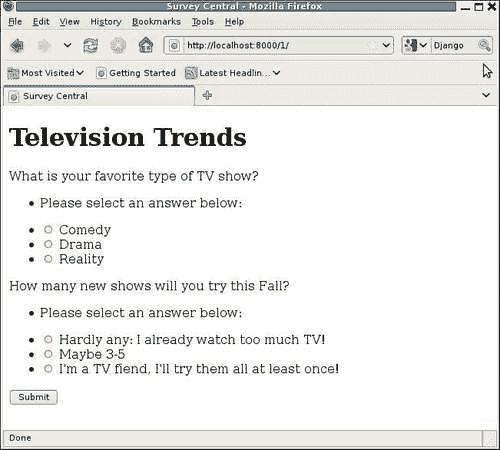

在两个错误消息左侧添加了项目符号表明错误列表仍然被格式化为 HTML 无序列表。这也可以通过检查页面的 HTML 源代码来确认，其中包括每个错误消息的以下片段：

```py
<ul class="errorlist"><li>Please select an answer below:</li></ul> 

```

似乎设置`error_class`属性没有任何效果。我们如何最好地追踪这样的问题？

## 实际上是否运行了正确的代码？

首先，我们需要确保正在运行的代码实际上是我们认为正在运行的代码。在这种情况下，当我遇到问题时，我可以看到开发服务器在添加`PlainErrorList`类和设置`error_class`属性的代码更改后重新启动，因此我非常确定正在运行正确的代码。尽管如此，在`error_class`赋值之前插入`import pdb; pdb.set_trace()`允许我确认代码已经存在并且正在按照我期望的方式运行：

```py
> /dj_projects/marketr/survey/forms.py(14)__init__() 
-> self.error_class = PlainErrorList 
(Pdb) self.error_class 
<class 'django.forms.util.ErrorList'> 
(Pdb) s 
--Return-- 
> /dj_projects/marketr/survey/forms.py(14)__init__()->None 
-> self.error_class = PlainErrorList 
(Pdb) self.error_class 
<class 'survey.forms.PlainErrorList'> 
(Pdb) c 

```

在进入调试器之前，我们可以看到`error_class`的值为`django.forms.util.ErrorList`。通过赋值的步骤显示`__init__`方法即将返回，并再次检查`error_class`属性的值显示确实已将值更改为我们自定义的`PlainErrorList`。这一切看起来都很好。在表单创建代码的最后，`error_class`属性已设置为自定义类。为什么它没有被使用？

## 代码是否符合文档要求？

下一步（在移除添加的断点后）是再次检查文档。尽管似乎不太可能，也许还需要其他内容才能使用自定义错误类？重新检查文档后，似乎并没有。有关自定义错误类的完整文档如下：

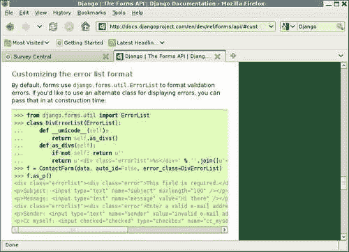

提供的示例所做的事情与`QuestionVoteForm`所做的事情有一些细微差异。首先，提供的示例在表单创建时将错误类作为参数传递，因此它被传递给了表单的超类`__init__`。另一方面，`QuestionVoteForm`在超类`__init__`运行后手动设置`error_class`。

这似乎不太可能是问题的原因，因为在子类`__init__`例程中覆盖值，就像我们在`QuestoinVoteForm`中所做的那样，是一个非常常见的习语。不过，我们可以通过尝试在 Python shell 中演示使用自定义`error_class`设置的方法来检查是否这种细微差异会导致问题，如文档中所示，对于`QuestionVoteForm`：

```py
kmt@lbox:/dj_projects/marketr$ python manage.py shell 
Python 2.5.2 (r252:60911, Oct  5 2008, 19:24:49) 
[GCC 4.3.2] on linux2 
Type "help", "copyright", "credits" or "license" for more information. 
(InteractiveConsole) 
>>> from survey.forms import QuestionVoteForm 
>>> from survey.models import Question 
>>> qvf = QuestionVoteForm(Question.objects.get(pk=1), data={}) 

```

在这里，我们已经创建了一个表单实例`qvf`，用于数据库中主键为`1`的问题。通过传递一个空的`data`字典，我们强制了一个没有`answer`值的表单提交的错误条件。文档显示，使用表单的`as_p`方法来显示这个表单应该显示使用表单的自定义错误类格式化的错误。我们可以检查`QuestionVoteForm`是否发生了这种情况：

```py
>>> qvf.as_p() 
u'Please select an answer below:\n<p><label for="id_answer_0">What is your favorite type of TV show?</label> <ul>\n<li><label for="id_answer_0"><input type="radio" id="id_answer_0" value="1" name="answer" /> Comedy</label></li>\n<li><label for="id_answer_1"><input type="radio" id="id_answer_1" value="2" name="answer" /> Drama</label></li>\n<li><label for="id_answer_2"><input type="radio" id="id_answer_2" value="3" name="answer" /> Reality</label></li>\n</ul></p>' 
>>> 

```

在那里，我们看到`as_p`方法确实使用了自定义错误类：错误消息周围没有 HTML 无序列表。因此，错误类已设置，并且在使用`as_p`等例行程序显示表单时使用。

这导致了文档显示和调查应用程序代码实际执行之间的第二个差异。`survey/active_survey.html`模板不使用`as_p`来显示表单。相反，它分别打印答案字段的标签，答案字段的错误，然后是答案字段本身。

```py
 
 
<h1>{{ survey.title }}</h1> 
<form method="post" action="."> 
<div> 
 
    {{ qform.answer.label }} 
    {{ qform.answer.errors }} 
    {{ qform.answer }} 
 
<button type="submit">Submit</button> 
</div> 
</form> 
 
```

这是否会导致自定义错误类不用于显示？你不会这样认为。尽管文档只显示自定义错误类与`as_p`一起使用，但在那里没有提到自定义错误类只被方便的显示方法如`as_p`使用。这样的限制将非常有限，因为方便的表单显示方法通常不适用于非平凡的表单。

似乎很明显，`error_class`属性的意图是覆盖错误显示，而不管表单以何种方式输出，但似乎并没有起作用。这是我们可能开始强烈怀疑 Django 中的一个错误，而不是应用程序代码中的某个错误或误用的地方。

## 搜索匹配的问题报告

接下来，我们要访问 Django 网站，看看是否有人报告了使用`error_class`的问题。从 Django 项目主页的**Code**链接（页面顶部横跨的链接的最右边）中选择**Code**链接，将显示 Django 代码跟踪器的主页面：

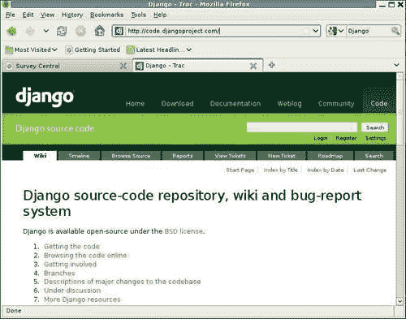

Django 项目使用 Trac，它提供了一个易于使用的基于 Web 的界面来跟踪错误和功能请求。使用 Trac，错误和功能请求是通过票务报告和跟踪的。Django 项目配置 Trac 的方式的具体细节，以及因此各种票务属性值的含义，可以在 Django 贡献文档页面上找到。特别是在这里找到的图表和描述：[`docs.djangoproject.com/en/dev/internals/contributing/#ticket-triage`](http://docs.djangoproject.com/en/dev/internals/contributing/#ticket-triage)对于理解与票务相关的所有信息非常有帮助。

我们现在要做的是搜索 Django 项目票务，查找使用`error_class`的报告问题。一种方法是选择**View Tickets**选项卡并构建适当的搜索。当首次选择**View Tickets**时，默认情况下将显示列出所有未关闭票务的页面。例如：

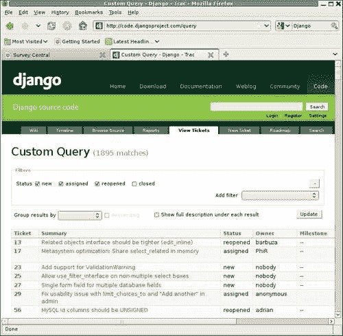

用于生成报告的标准显示在标有**Filters**的框中。在这里，我们看到报告包括所有状态不是**closed**的票务，因为这是唯一未被选中的**Status**选项。为了获得更适合我们正在研究的报告，我们需要修改**Filters**框中的搜索标准。

首先，我们可以取消对票务状态的限制。我们对与`error_class`相关的所有报告感兴趣，而不管票务状态如何。我们可以通过点击包含约束的行的极右侧带有减号的框来删除现有的状态约束。

其次，我们需要为我们想要应用的搜索约束添加一个过滤器。为此，我们从**添加过滤器**下拉框中选择一个合适的选项。这个下拉框包含了我们可以搜索的票务属性的完整列表，比如**报告人**、**所有者**、**状态**和**组件**。这些属性中大多数对我们当前感兴趣的搜索不相关。在列表中最有可能找到我们要找的内容的是**摘要**。

票务摘要是问题的简要描述。我们希望这个摘要包含字符串`error_class`，以便包括我们遇到的问题的任何报告。在**摘要**上添加一个单一过滤器，并规定它包含字符串`error_class`，因此有望找到任何相关的票务。点击**更新**按钮以根据新标准刷新搜索结果，然后显示以下内容：

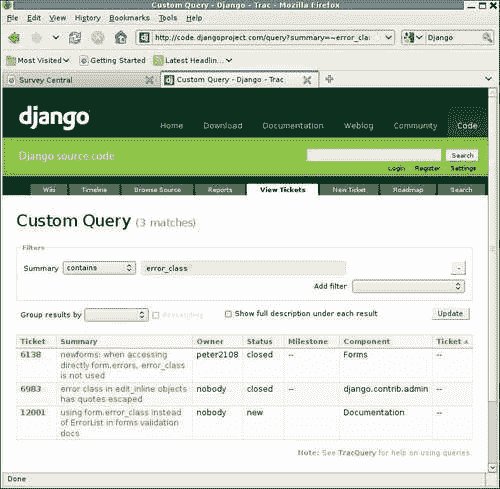

已经开启了三个包含`error_class`（或`error class`）的票务。其中两个已关闭，一个仍然打开（状态为**新**）。根据显示的摘要，这三个中，排在前面的一个听起来可能是我们遇到的与`error_class`有关的问题，而另外两个则似乎不太相关。

点击票号或摘要可以获取列出的问题的更多详细信息，这两者都是查看完整票务详情的链接。查看完整详情将允许我们验证它是否与我们所看到的情况相同，并了解更多有关关闭时间和原因的详细信息。在这种情况下，我们看到以下内容：

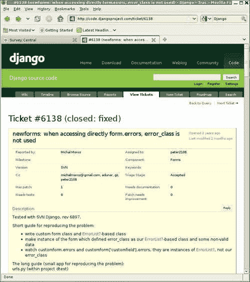

这个票务有一个相当长的历史——从开启到最后一次活动经过了两年。简要重现问题的指南确实让人觉得这可能正是我们遇到的与`error_class`有关的问题。在顶部附近的票号后面列出的**已修复**解决方案听起来令人鼓舞，但不幸的是，这个票务没有关于修复问题的代码更改以及何时进行的详细信息。在滚动到票务历史中添加的各种评论的最后，我们看到最近的几次更新如下：

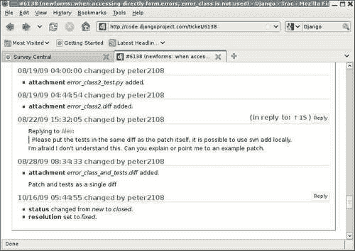

2009 年 8 月，用户**peter2108**有兴趣通过提供补丁来帮助推动票务，包括修复问题的测试（通过阅读完整历史，最初提供的补丁中缺少测试是这个票务长时间开放的原因之一）。然后，在 2009 年 10 月 16 日，**peter2108**以**已修复**的解决方案关闭了票务。

一开始可能并不明显，但这种关闭票务的方式对于需要 Django 代码更改的票务来说并不典型。通常，当代码更改提交到 Django SVN 存储库时，票号会包含在提交消息中，并且相应的票务会自动更新，包括提交消息和更改集的链接。这个自动过程还会以已修复的解决方案关闭票务。这样就非常容易看到确切是哪个代码更改修复了问题，以及代码更改是何时进行的。

有时，自动过程无法正确运行，通常当发生这种情况时，有人会注意到并手动关闭票务，注明哪个代码更新修复了问题。但这也不是这里发生的情况。相反，看起来**peter2108**，他对看到错误修复感兴趣，只是注意到问题在某个时候消失了，并将票务标记为已修复。

我们可以猜测，基于同一个用户在 8 月份对问题进行了关闭，而在 10 月份又将问题关闭为已解决，修复可能是在 8 月 28 日至 10 月 16 日之间的某个时间点进入了代码库。然而，我们想要确定修复确切是何时进行的，这样我们就可以确定我们是否应该已经在我们运行的代码中拥有它，或者更新到最新版本是否会解决问题，或者修复是否仅在直接从 SVN 存储库中拉取的代码版本中可用。

回顾另外两个在摘要中提到`error_class`的票据，它们都无法帮助确定问题`error_class`究竟是何时修复的，因为它们描述的是完全不同的问题。那么，我们如何才能找到我们遇到的问题确切是何时修复的信息呢？对于这种情况，**查看票据**类型的搜索不够广泛，无法为我们提供所需的信息。幸运的是，有一种替代的搜索 Django 跟踪器的方法，我们可以使用它来找到缺失的信息。

## 搜索匹配问题报告的另一种方法

通过单击**搜索**选项卡而不是**查看票据**选项卡，可以找到这种替代搜索方式。这将显示一个带有单个文本输入框和三个复选框的页面，用于控制搜索位置：**票据**、**变更集**和**Wiki**。

此页面提供了一种更广泛和不太有针对性的搜索方式。除了搜索票据数据外，默认情况下还搜索变更集和 Wiki 文章。即使关闭这些选项，仅票据搜索也比**查看票据**下可能的搜索范围更广。此页面的票据搜索涵盖了所有票据评论和更新，这些在**查看票据**下无法搜索。

使用此页面进行搜索的一个好处是它可能会找到**查看票据**搜索无法找到的相关结果。使用此页面进行搜索的一个缺点是，它可能会找到大量无关的结果，具体取决于在文本框中输入了什么搜索词。如果发生这种情况，您可以通过在文本框中输入更多必须匹配的单词来进一步限制显示的结果，这可能有所帮助。然而，在这种情况下，搜索一个像`error_class`这样不常见的字符串不太可能产生大量的结果。

因此，输入`error_class`并单击**搜索**按钮会导致以下结果：

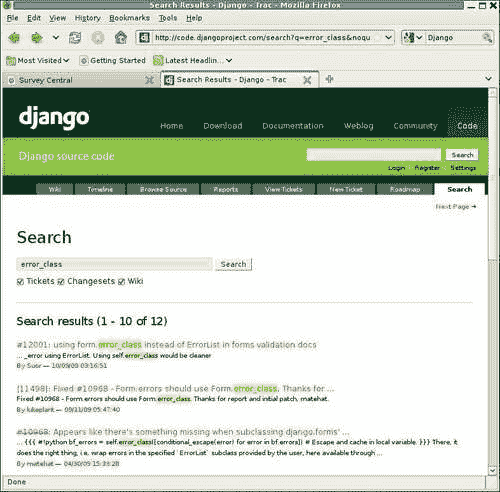

这次搜索产生的结果比**查看票据**搜索更多——12 个而不是 3 个。列出的第一个结果，票据**#12001**，与之前搜索找到的仍然打开的票据相同。先前搜索的其他结果也包含在完整列表中，只是在下面。但首先，我们可以看到一个变更集的结果，**[11498]**，它在提交消息中提到了`error_class`，以及其关联的票据**#10968**。这个票据之前没有出现在我们尝试的原始搜索中，因为虽然它在完整描述中包含对`error_class`的引用，但字符串`error_class`不在票据摘要中。

单击**#10968**票据的详细信息后，显示它是我们遇到的相同问题的重复报告，并且在我们找到的另一个票据**#6138**中报告了该问题。通常，当这样的重复票据被打开时，它们会很快被关闭为重复，并引用描述问题的现有票据。

然而，如果没有人意识到新的票据是重复的，那么重复的票据可能会变成在检入代码库时引用的票据。这显然是在这种情况下发生的。我们可以在这个新票据的最后更新中看到自动生成的评论，当修复提交到 SVN 存储库时添加：

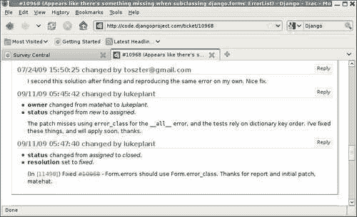

该评论中的变更集编号是变更集的详细描述的链接。单击它，我们会看到以下内容：

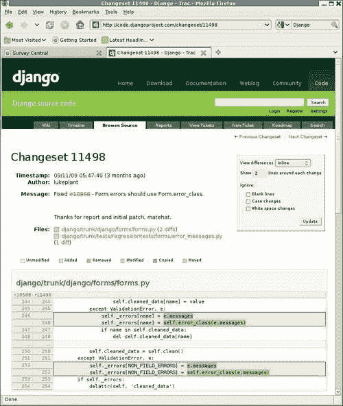

在这里，我们可以看到与此代码更改相关的所有详细信息：更改是何时进行的，由谁进行的，提交消息，更改的文件（或添加或删除的文件），更改的文件中的具体行以及这些更改是什么。对于我们现在正在研究的问题，大部分这些信息都不是我们真正需要了解的，但有时可能会派上用场。对于这个问题，我们想知道的是：哪个发布级别的代码包含了这个修复程序？我们将在下面考虑这个问题。

## 确定包含修复程序的发布版本

对于我们正在查看的特定情况，我们可以简单地根据日期判断，包含修复程序的第一个发布版本应该是 Django 1.1.1。在 Django 项目主页的网志上快速检查显示，Django 1.1 于 2009 年 7 月 29 日发布，Django 1.1.1 于 2009 年 10 月 9 日发布。在这些日期之间进行的所有错误修复应该包含在 1.1.1 版本中，因此 2009 年 9 月 11 日进行的修复应该包含在 Django 1.1.1 中。

有时事情可能不那么清楚。例如，我们可能不确定在发布当天进行的代码更改是否包含在发布中，或者是在发布后发生的。或者，我们可能不确定更改是被分类为错误修复还是新功能。对于这种情况，我们可以检查发布的修订号并将其与我们感兴趣的修订号进行比较。

Django 使用标记发布版本的标准子版本惯例；标记的发布版本可以在`root/django/tags/releases`下找到。我们可以通过首先选择**浏览代码**选项卡，然后依次选择每个路径组件来导航到此路径。以这种方式导航到 1.1.1 发布并在右上角单击**修订日志**会显示以下页面：

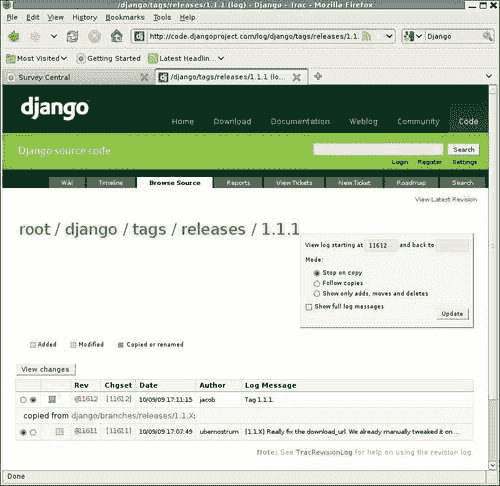

这表明 1.1.1 标记的发布版本是通过复制 1.1.X 发布分支创建的。创建标记的变更集是**[11612]**，高于我们感兴趣的变更集（11498），因此我们期望我们关心的修复程序在 1.1.X 发布中。

但等一下。查看变更集 11498 的详细信息时，更改的文件位于主干（例如`django/trunk/django/forms/forms.py`），而不是 1.1.X 发布分支`django/branches/releases/1.1.X`。如果发布是通过复制 1.1.X 分支创建的，但修复只是在主干上进行的，那么它真的包含在 1.1.1 发布中吗？

答案是肯定的。通过单击此页面上的链接转到 1.1.X 发布分支，为其选择**修订日志**，然后向下滚动到底部，显示 1.1.X 发布分支是作为主干的副本在修订版本 11500 时创建的，比我们感兴趣的修订版本 11498 晚两个修订版本。因此，当最初创建 1.1.X 分支时，它包含了我们正在寻找的修复程序。

您可能会想知道为什么 1.1.X 分支直到 2009 年 9 月 11 日之后才创建，而 1.1 版本在 7 月底就已经发布了。原因是因为一旦创建了发布分支，就必须在两个不同的地方应用错误修复程序：主干和最新的发布分支。这比只在一个地方（主干）应用它们稍微多一些工作。因此，发布分支的创建通常会在发布后的一段时间内延迟一段时间，以便更轻松地进行错误修复。

由于在不存在发布分支的时间内，不能对主干进行与新功能相关的更改，因为发布分支必须仅包含错误修复，而不包含新功能。不过，这通常不是问题，因为在发布后不久，很少进行功能工作。通常每个人都需要一些时间来休息，并首先决定哪些功能可能会进入下一个发布版本。一旦下一个发布版本的一些功能工作接近需要被检入的时候，那么就会创建上一个发布版本的发布分支。从那时起，功能工作被检入主干，而错误修复被检入主干和发布分支。

## 如果修复尚未发布呢？

在这里，我们很幸运地遇到了一个已经修复的问题，并且修复已经在官方发布的版本中可用。在遇到这样的问题时，应该很容易地选择更新到最新的微版本以获得修复。如前所述，始终建议安装正在使用的特定 major.minor 版本的最新微版本。

但是，如果我们想要的修复是在最新可用版本之后的某个时间点进行的呢？那么我们应该怎么办？简单的技术答案是简单地检出包含修复的最新级别的主干或发布分支，并使用该代码。特别是如果使用发布分支，就不必担心采用任何代码不稳定性，因为发布分支中的唯一更改是错误修复。

然而，这种简单的技术答案可能违反了关于仅运行“发布级别”代码的本地政策。如果你在这样的环境中工作，可能需要克服一些额外的障碍，以便使用尚未在官方版本中提供的修复。采取的最佳方法可能会由你所处理的确切政策、你遇到的问题的严重程度以及在你自己的代码中找到解决方法的能力等因素决定。

## 如果修复尚未提交呢？

有时在研究问题时，结果会显示问题已经被报告，但尚未修复。在这种情况下，如何最好地继续可能取决于你对参与和贡献到 Django 的兴趣程度，以及匹配问题报告与修复之间的接近程度。如何参与贡献到 Django 的细节超出了本文的范围，但本节提供了一些基于你的兴趣程度的广泛指导方针。如果你有兴趣贡献，Django 网站提供了如何贡献的详细信息，网址为：[`docs.djangoproject.com/en/dev/internals/contributing/`](http://docs.djangoproject.com/en/dev/internals/contributing/)。

如果你对尚未提交到代码库的代码不感兴趣，除了等待修复被提交之外，可能没有太多事情可做。唯一的例外是对于尚未被充分理解的问题。在这种情况下，你可能能够提供你遇到问题的具体细节，以帮助其他人更好地理解问题并开发修复方案。

如果你愿意尝试未提交的代码，你可能会更快地找到解决你遇到的问题的可行解决方案。在最好的情况下，你可能会发现与你遇到的问题匹配的票据已经附有一个有效的补丁。这是可能的，你所需要做的就是下载它并将其应用到你的 Django 代码副本中以解决问题。

然后，你需要决定是否能够并且愿意部署你的应用程序，使用一个已经应用了一些“自定义”修复的 Django 版本。如果不能，你可能想要帮助将工作补丁检查到代码库中，看看是否有任何遗漏的部分（比如测试）需要在修复被检查之前包含进去，如果有的话，提供这些遗漏的部分。然而，在某些情况下，没有任何遗漏，所需要的只是时间让修复进入代码库。

如果你找到一个有补丁的匹配票据，但它没有解决你所遇到的问题，那么这是有价值的信息，可以发布到票据上。不过，你可能首先要确保你的问题确实与你找到的票据中的问题相同。如果它确实是一个稍微不同的问题，那么为这个稍微不同的问题开一个新的票据可能更合适。

当你怀疑时，你可以随时在你认为匹配的票据中发布关于你所看到的问题以及现有补丁似乎无法解决它的信息。跟踪票据的其他人可能会提供反馈，告诉你你的问题是否相同，现有的补丁是否确实不太对，或者你是否真的在处理一个不同的问题。

在最坏的情况下，你可能会发现一个报告与你所经历的相同问题的票，但没有附加的补丁可供尝试。这对你来说并不是很有帮助，但却为你提供了最多的机会去贡献。如果你有时间并且愿意，你可以深入研究 Django 代码，看看是否能够提出一个补丁，然后将其发布到票据上，以帮助解决问题。

## 如果一个票已经关闭而没有修复呢？

有时在研究问题时，结果会出现一个匹配的报告（或多个报告），但没有进行任何修复而被关闭。在这种情况下可能会使用三种不同的解决方案：无效、worksforme 和 wontfix。如何最好地继续将取决于问题报告的具体情况以及用于关闭匹配问题票据的解决方案。

首先，无效的解决方案是非常广泛的。一个票可能因为很多不同的原因而被关闭为无效，包括：

+   描述的问题根本不是问题，而是报告者代码中的一些错误，或者对某些功能应该如何工作的误解。

+   描述的问题太模糊了。例如，如果一个票只提供了一个错误的回溯，但没有关于如何触发回溯的信息，那么没有人能够帮助跟踪并解决问题，所以它很可能会被关闭为无效。

+   描述的问题确实是一个问题，但根本原因是 Django 之外的一些代码。如果在 Django 代码中无法解决问题，那么票据很可能会被关闭为无效。

在你找到一个被关闭为无效的匹配票据时，你应该阅读票据关闭时所做的评论。在票据因缺乏关于问题的信息而关闭时，如果你可以提供一些需要的缺失数据来解决问题，重新打开票据可能是合适的。否则，如果你不理解关闭的解释，或者不同意关闭的原因，最好在邮件列表中开始讨论（在下一节中讨论），以获得更多关于如何最好地解决你遇到的问题的反馈。

worksforme 解决方案非常直接，它表示关闭工单的人无法重现报告的问题。它和 invalid 一样，可能是在原始问题报告中没有足够的信息来重现问题时使用的。缺少的信息可能是导致问题的代码的具体信息，或者问题发生的环境的具体信息（操作系统，Python 版本，部署细节）。如果您能够重现一个被关闭为 worksforme 的问题，并且能够提供缺失的细节，使其他人能够做同样的事情，那么您应该随时重新打开工单并提供这些信息。

wontfix 解决方案也很直接。通常只有核心贡献者会关闭 wontfix 工单，这表示核心团队已经决定不修复特定的问题（通常是一个功能请求，而不是一个错误）。如果您不同意 wontfix 的决定，或者认为在做出决定时没有考虑到所有适当的信息，那么您不会通过简单地重新打开工单来改变任何人的想法。相反，您需要在 django-developers 邮件列表上提出这个问题，并看看是否能够得到更广泛的开发社区的共识，以便推翻 wontfix 的决定。

# 追踪未报告的问题

有时在研究问题时，找不到匹配的报告。在这种情况下，最好的处理方式可能取决于您对您遇到的问题是否是 Django 中的错误有多确定。如果您非常确定问题出在 Django 中，您可以直接打开一个新的工单来报告它。如果您不太确定，最好先从社区中获得一些反馈。以下部分将描述在哪里提问，提供一些关于提问的好建议，并描述如何打开一个新的工单。

## 在哪里提问

在任何 Django 网站页面上点击**社区**链接会弹出以下内容：

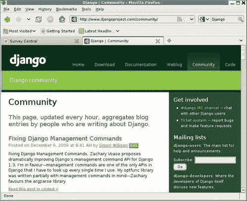

这个页面的左侧提供了链接到博客文章的链接，这些文章是由讨论 Django 的人写的。阅读这些文章是了解使用 Django 的人群的一个好方法，但我们现在感兴趣的是这个页面的右侧。在这里，我们可以看到与 Django 社区其他成员直接互动的方式的链接。

列表中的第一个是**#django IRC 频道**的链接。（**IRC**代表**Internet Relay Chat**。）这个选项提供了一个聊天式界面，可以与其他 Django 用户进行互动交流。这是在您想要快速获得关于您想要询问或讨论的任何内容的反馈时的一个不错的选择。然而，在聊天界面中进行详细的编码讨论可能会有困难。对于这种情况，其中一个邮件列表可能是一个更好的选择。

有两个邮件列表，如下所示：**django-users**和**django-developers**。第一个用于讨论如何使用 Django，第二个用于讨论 Django 本身的开发。如果你遇到了一个问题，你认为，但不确定，是 Django 的问题，django-users 是发布有关该问题的问题的正确地方。Django 核心开发团队的成员会阅读并回答用户列表上的问题，并提供反馈，告知问题是否应该被提出为一个工单或者是否应该被带到开发者列表进行进一步讨论。

这两个邮件列表都托管在 Google 群组中。先前显示的每个组名称实际上都是一个链接，您可以单击该链接直接转到该组的 Google 群组页面。从那里，您可以查看该组中的最近讨论列表，并阅读可能感兴趣的任何主题。Google 群组还提供搜索功能，但不幸的是，该功能并不总是正常工作，因此从该组的页面中搜索可能不会产生有用的结果。

如果您决定要发布到其中一个组，您首先需要加入该组。这有助于减少发布到组的垃圾邮件，因为潜在的垃圾邮件发送者必须首先加入。然而，有很多潜在的垃圾邮件发送者确实加入并尝试向列表发送垃圾邮件。因此，还有一个额外的反垃圾邮件措施：新成员发送的帖子将通过审核。

这种反垃圾邮件措施意味着您发送到这些列表中的第一篇帖子可能需要一些时间才能出现，因为它必须由其中一位志愿者审核批准。通常情况下，这不会花费太长时间，但可能需要多达几个小时。通常情况下，一旦用户收到一个明显合法的第一篇帖子，他们的状态将被更新，以指示他们的帖子不需要经过审核，因此随后的帖子将立即出现在组中。

## 提出问题以获得良好答案的提示

一旦您决定发布问题，下一个任务将是以最有可能产生一些有用答案的方式撰写问题。本节提供了一些建议，说明如何做到这一点。

首先，要具体说明你正在做什么。如果您有一些代码的行为与您的期望不符，请直接包含代码，而不是用散文描述代码的功能。通常，实际使用的代码的详细细节是理解问题的关键，这些细节在代码的散文描述中很容易丢失。

然而，如果代码过长或过宽，无法在电子邮件界面中轻松阅读，因为它会自动换行长行，最好不要在帖子中包含它。理想情况下，在这种情况下，您应该能够将重新创建问题所需的代码剪切到一个可以在电子邮件中轻松阅读的可管理大小，并发布它。

请注意，如果您这样做，最好先验证剪裁版本的代码是否正确（例如没有任何语法错误）并且是否出现您所询问的问题。否则，您可能只会收到回复，报告发布的代码根本不起作用，或者不显示您描述的行为。

如果您无法将必要的代码剪裁到可管理的大小，要么是因为您没有时间，要么是因为剪裁代码会使问题消失，您可以尝试将代码发布在 dpaste.com 之类的地方，并在问题中包含一个链接。但是，最好将需要演示问题的代码保持尽可能短。随着您发布或指向的代码越来越长，邮件列表上的人越来越少，他们会花时间去理解问题并帮助您找到解决方案。

除了具体说明您正在使用的代码外，还要具体说明您正在做什么来触发错误行为。当您访问自己的应用程序 URL 之一时，您是否观察到问题？当您在管理应用程序中执行某些操作时？当您从`manage.py` shell 尝试某些操作时？这对您可能显而易见，但如果您详细说明您正在做什么，它确实有助于他人重现问题。

其次，具体说明发生了什么，以及你期望发生的是什么。"它不起作用"不是具体的。"它死了"也不是，"它给了我一个错误信息"也不是。给出"不起作用"的具体表现。当你期望 Y 时，浏览器页面显示 X？一个声明 XYZ 的错误信息？一个回溯？在最后一种情况下，在问题中包含完整的回溯，因为这为可能试图帮助的人提供了宝贵的调试线索。

第三，如果你在问题中提到你的预期行为是基于文档的，那么请具体说明你所指的是哪个文档。Django 有广泛的文档，包括指南和参考信息。阅读你的问题并搜索你所引用的文档的人可能会轻易地找到一个完全不同的部分，并且很难理解你的意思。如果你提供了问题文档的具体链接，那么误解的可能性就会降低。

你可能已经注意到，所有这些提示中都有一个共同的主题：具体。是的，提供具体信息需要更多的工作。但是一个具体的问题更有可能得到有用的答案，而不是一个不明确和模糊的问题。如果你省略了具体信息，偶尔会有人发布一个指导你解决问题的答案。然而，更有可能的是，一个模糊的问题要么得不到回应，要么得到要求具体信息的回应，要么得到完全误解问题的回应。

## 打开一个新的票证来报告问题

如果你遇到一个看起来是 Django 代码中未报告和未修复的错误，下一步就是为此问题打开一个票证。当你从 Django 首页点击**Code**后选择**New Ticket**选项卡时，这个过程就变得非常直观了。

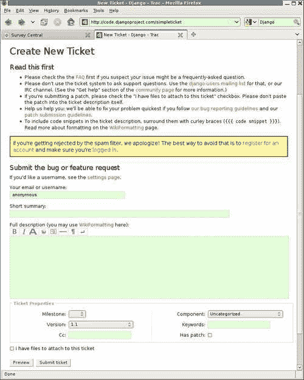

请确保阅读**首先阅读**列表。该列表中的许多信息在本章的早些部分已经涵盖了，但并非全部。特别是，最后一项指出了如何标记提交的代码片段或回溯，以便它们能够正确格式化。该注释包括最常被忽略的一种标记类型，并指向了关于如何特殊格式化文本的完整文档。请注意，你可以通过选择底部的**预览**按钮来检查格式化的效果——在按下**提交**之前尝试预览是一个很好的主意。

请注意，Django Trac 安装确实允许匿名提交和更新票证。然而，它也使用 Akismet 垃圾邮件过滤服务，这项服务有时会拒绝非垃圾邮件的提交。正如大黄框中所指出的，避免这种情况的最简单方法是**注册一个账户**（页面上的文字是一个链接，可以跳转到注册页面）。

在打开一个新的票证时，填写最重要的部分是简短的摘要和完整的描述。在简短的摘要中，尽量包含关键术语，这样新的票证就会在遇到相同问题的人的可能搜索中显示出来。在完整的描述中，之前关于具体性的所有建议都再次适用。如果你在邮件列表的讨论后得出结论认为需要打开一个票证，那么在问题中包含该讨论的链接是有帮助的。然而，在票证描述中也包含关于问题的基本信息也是很好的。

在**票据属性**中的信息中，您可能不需要更改任何默认值，除了**版本**（如果您使用的版本与显示的版本不同）和**有补丁**（如果您将附加修复问题的补丁）。您可以尝试从列表中猜测正确的**组件**并包含一些适当的**关键字**，但这并非必要。

同样，您可以将**里程碑**设置为下一个发布版本，尽管这并不会使有人更有可能尽快解决问题。该字段通常只在发布的最后阶段密切关注，以记录哪些错误绝对必须在发布之前修复。

提交票据后，如果您使用包含电子邮件地址的登录，或在标有**您的电子邮件或用户名**的字段中指定了电子邮件地址，则票据的更新将自动发送到指定的电子邮件地址。因此，如果有人向票据添加评论，您将收到通知。这种情况的一个令人讨厌的例外是由于对代码库的提交而产生的自动生成的更新：这不会生成发送给票据报告者的电子邮件。因此，当票据被关闭为已修复时，您不一定会收到通知，而是必须手动从网站上检查其状态。

# 总结

现在我们讨论了在先前介绍的调试技术都未能成功解决某些问题时该怎么办。在本章中，我们：

+   遇到了一个存在于 Django 1.1 中的错误，导致一些调查应用代码无法按预期行为

+   走过了追踪问题的验证过程，发现问题是由 Django 而不是调查代码引起的

+   看到在 Django 代码跟踪器中搜索揭示了问题是一个已在 Django 1.1.1 中修复的错误，这为问题提供了一个简单的解决方案

+   讨论了当问题被追踪到尚未可用或在官方发布中不可用的修复程序时如何继续的选项

+   描述了存在的各种社区资源，用于询问行为似乎令人困惑，但似乎尚未被报告为错误的问题

+   讨论了撰写问题的提示，以便获得所需的有益回应

+   描述了在 Django 代码中报告问题时打开新票的过程

在下一章中，我们将进入 Django 应用程序开发的最后阶段：转向生产。
