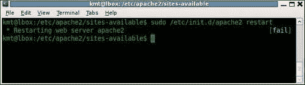
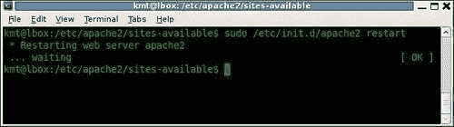
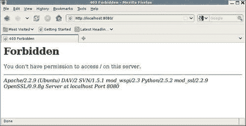
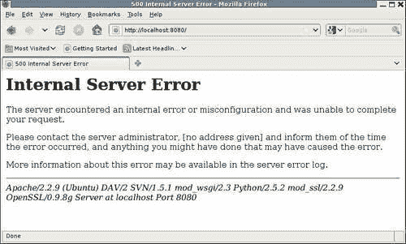
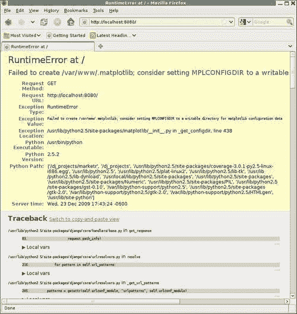
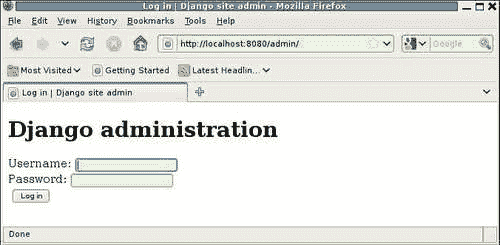
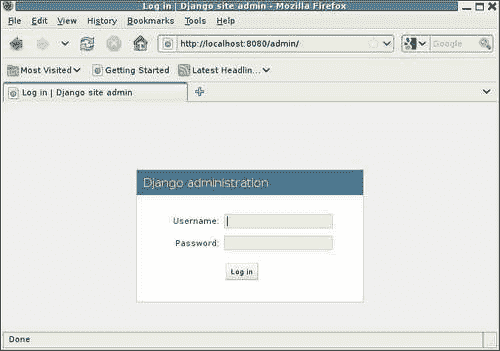
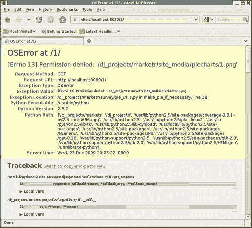
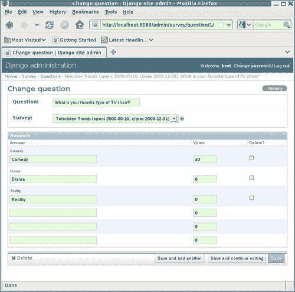
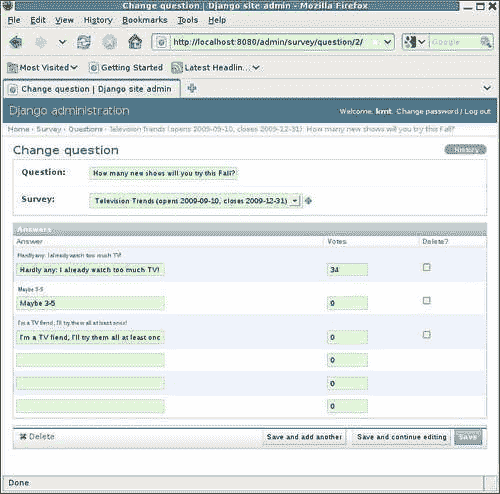

# 第十一章：当是时候上线：转入生产环境

我们将在测试和调试 Django 应用程序的主题上涵盖的最后一个主题是转入生产环境。当应用程序代码全部编写、完全测试和调试完成时，就是设置生产 Web 服务器并使应用程序对真实用户可访问的时候了。由于应用程序在开发过程中已经经过了全面的测试和调试，这应该是直截了当的，对吗？不幸的是，情况并非总是如此。生产 Web 服务器环境与 Django 开发服务器环境之间存在许多差异。这些差异可能在转入生产过程中引发问题。在本章中，我们将看到其中一些差异是什么，它们可能引起什么类型的问题，以及如何克服它们。具体来说，我们将：

+   配置一个带有`mod_wsgi`的 Apache Web 服务器来运行示例`marketr`项目。

+   在开发 Apache 配置过程中遇到了一些问题。针对每个问题，我们将看看如何诊断和解决这些问题。

+   对在 Apache 下运行的应用程序进行功能性压力测试，以确保它在负载下能够正确运行。

+   修复功能性压力测试中暴露的任何代码错误。

+   讨论在开发过程中使用 Apache 和`mod_wsgi`的可能性。

# 开发 Apache/mod_wsgi 配置

通常，转入生产环境将涉及在与开发时使用的不同机器上运行代码。生产服务器可能是专用硬件，也可能是从托管提供商那里获得的资源。无论哪种情况，它通常与开发人员编写代码时使用的机器完全分开。生产服务器需要安装任何先决条件包（例如，对于我们的示例项目，需要安装 Django 和 matplotlib）。此外，应用项目代码的副本通常需要从版本控制系统中提取，并放置在生产服务器上。

为了简化本章，我们将在与开发代码相同的机器上配置生产 Web 服务器。这将使我们能够跳过一些在实际转入生产过程中涉及的复杂性，同时仍然体验到在生产部署过程中可能出现的许多问题。在很大程度上，我们将跳过这样做时遇到的问题并不是特定于 Django 的，而是在将任何类型的应用程序从开发转入生产时需要处理的常见问题。我们将遇到的问题往往更具体于 Django。

将要开发的示例部署环境是使用`mod_wsgi`的 Apache，这是目前推荐的部署 Django 应用程序的环境。**WSGI**代表**Web Server Gateway Interface**。WSGI 是 Python 的标准规范，定义了 Web 服务器（例如 Apache）和用 Python 编写的 Web 应用程序或框架（例如 Django）之间的接口。

基本的 Apache Web 服务器不支持 WSGI。然而，Apache 的模块化结构允许通过插件模块提供此支持。因此，WSGI 的 Web 服务器端支持由 Graham Dumpleton 编写并积极维护的`mod_wsgi`提供。Django 本身确实实现了 WSGI 规范的应用程序端。因此，在`mod_wsgi`和 Django 之间不需要任何额外的适配器模块。

### 注意

在开发`mod_wsgi`之前，Apache 的`mod_python`模块是 Django 推荐的部署环境。尽管`mod_python`仍然可用且仍然被广泛使用，但其最近的发布已经超过三年。当前的源代码需要一个补丁才能与最新的 Apache 2.2.X 版本编译。未来，由于 Apache API 的更改，将需要更广泛的更改，但没有活跃的`mod_python`开发人员来进行这些更改。鉴于`mod_python`开发目前的停滞状态，我认为它现在不适合用于 Django 应用程序的部署。因此，这里不涵盖配置它的具体内容。如果出于某种原因您必须使用`mod_python`，那么在本章中遇到的许多问题也适用于`mod_python`，并且配置`mod_python`的具体内容仍包含在 Django 文档中。

Apache 和`mod_wsgi`都可以在各种不同的平台上轻松获取和安装。这里不会涵盖这些安装的细节。一般来说，使用机器的常规软件包管理服务来安装这些软件包可能是最简单的方法。如果这不可能，可以在网上找到有关下载和安装 Apache 的详细信息，网址为[`httpd.apache.org/`](http://httpd.apache.org/)，同样的信息也可以在[`code.google.com/p/modwsgi/`](http://code.google.com/p/modwsgi/)找到`mod_wsgi`的信息。

本章展示的示例配置的开发机器运行 Ubuntu，这是 Linux 的基于 Debian 的版本。这种 Linux 的配置结构可能与您自己机器上使用的结构不匹配。然而，配置结构并不重要，重要的是配置中包含的 Apache 指令。如果您的机器不遵循 Debian 结构，您可以简单地将这里显示的指令放在主 Apache 配置文件中，通常命名为`httpd.conf`。

在 Apache 下运行 WSGI 客户端应用程序的配置有两个部分，首先是一个 Python WSGI 脚本，它设置环境并标识将处理请求的 WSGI 客户端应用程序。其次是控制`mod_wsgi`操作并将特定 URL 路径的请求指向`mod_wsgi`的 Apache 配置指令。接下来将讨论为 Django `marketr`项目创建这两部分。

## 创建`marketr`项目的 WSGI 脚本。

Django 项目的 WSGI 脚本有三个责任。首先，它必须设置 Python 路径，包括 Django 项目所需但不在常规系统路径上的任何路径。在我们的情况下，`martketr`项目本身的路径将需要添加到 Python 路径中。项目使用的所有其他先决条件代码都已安装，因此它会自动在 Python site-packages 目录下找到。

其次，WSGI 脚本必须在环境中设置`DJANGO_SETTINGS_MODULE`变量，指向适当的设置模块。在我们的情况下，它需要设置为指向`/dj_projects/marketr`中的`settings.py`文件。

第三，WSGI 脚本必须将变量`application`设置为实现 WSGI 接口的可调用实例。对于 Django，这个接口由`django.core.handlers.wsgi.WSGIHandler`提供，因此`marketr`项目的脚本可以简单地将`application`设置为该类的实例。这里没有特定于`marketr`项目的内容——这部分 WSGI 脚本对所有 Django 项目都是相同的。

这个脚本应该放在哪里？将其直接放在`/dj_projects/marketr`中似乎是很自然的，与`settings.py`和`urls.py`文件一起，因为它们都是项目级文件。然而，正如`mod_wsgi`文档中所提到的，这将是一个不好的选择。Apache 需要配置以允许访问包含 WSGI 脚本的目录中的文件。因此，最好将 WSGI 脚本保存在与不应对网站用户可访问的任何代码文件分开的目录中。（特别是包含`settings.py`的目录，绝对不应该配置为对网站客户端可访问，因为它可能包含诸如数据库密码之类的敏感信息。）

因此，我们将在`/dj_projects/marketr`内创建一个名为`apache`的新目录，用于保存在 Apache 下运行项目相关的所有文件。在`apache`目录下，我们将创建一个`wsgi`目录，用于保存`marketr`项目的 WSGI 脚本，我们将其命名为`marketr.wsgi`。根据此脚本的前面提到的三个职责，实现`/dj_projects/marketr/apache/wsgi/marketr.wsgi`脚本的第一步可能是：

```py
import os, sys 

sys.path = ['/dj_projects/marketr', ] + sys.path 
os.environ['DJANGO_SETTINGS_MODULE'] = 'marketr.settings' 

import django.core.handlers.wsgi 
application = django.core.handlers.wsgi.WSGIHandler() 
```

此代码将`marketr`项目目录添加到 Python 系统路径的最前面，将`DJANGO_SETTINGS_MODULE`环境变量设置为`marketr.settings`，并将`application`设置为实现 WSGI 应用程序接口的 Django 提供的可调用实例。当`mod_wsgi`被调用以响应已映射到此脚本的 URL 路径时，它将使用正确设置的环境调用适当的 Django 代码，以便 Django 能够处理请求。因此，下一步是开发 Apache 配置，将请求适当地路由到`mod_wsgi`和此脚本。

## 为 marketr 项目创建 Apache 虚拟主机

为了将 Django 项目与您可能已经使用 Apache 的其他任何内容隔离开来，我们将使用绑定到端口 8080 的 Apache `VirtualHost`来进行 Django 配置。以下指令指示 Apache 监听端口 8080 的请求，并定义一个虚拟主机来处理这些请求：

```py
Listen 8080
<VirtualHost *:8080>
    WSGIScriptAlias / /dj_projects/marketr/apache/wsgi/marketr.wsgi
    WSGIDaemonProcess marketr
    WSGIProcessGroup marketr

    # Possible values include: debug, info, notice, warn, error, crit,
    # alert, emerg.
    LogLevel debug

    ErrorLog /dj_projects/marketr/apache/logs/error.log
    CustomLog /dj_projects/marketr/apache/logs/access.log combined
</VirtualHost>
```

请注意，这绝不是一个完整的 Apache 配置，而是需要添加到现有（或已发货的示例）配置中以支持处理定向到端口 8080 的`marketr`项目请求的内容。在`VirtualHost`容器内有三个指令控制`mod_wsgi`的行为，另外三个指令将影响此虚拟主机的日志处理方式。

第一个指令`WSGIScriptAlias`很简单。它将与其第一个参数匹配的所有请求映射到其第二个参数中指定的 WSGI 脚本，即`/dj_projects/marketr/apache/wsgi/marketr.wsgi`。此指令的效果将是将此虚拟主机的所有请求路由到前面部分定义的`marketr`WSGI 脚本。

接下来的两个指令，`WSGIDaemonProcess`和`WSGIProcessGroup`，指示`mod_wsgi`将此虚拟主机的请求路由到一个独立的进程组，与用于处理请求的正常 Apache 子进程不同。这被称为以守护程序模式运行`mod_wsgi`。相比之下，让`mod_wsgi`使用正常的 Apache 子进程被称为以嵌入模式运行。

通常情况下，以守护程序模式运行更可取（有关详细信息，请参阅`mod_wsgi`文档），但在 Windows 上运行 Apache 时不支持此模式。因此，如果您在 Windows 机器上使用 Apache 服务器，则需要从配置中省略这两个指令。

在所示的指令中，`WSGIDaemonProcess`指令定义了一个名为`marketr`的进程组。这个指令支持几个额外的参数，可以用来控制，例如，组中的进程数量，每个进程中的线程数量，以及进程的用户和组。这里没有指定这些参数，所以`mod_wsgi`将使用其默认值。`WSGIProcessGroup`指令将先前定义的`marketr`组命名为处理这个虚拟主机请求的组。

下一个指令，`LogLevel debug`，将日志设置为最详细的设置。在生产环境中，更典型的设置可能是`warn`，但是当刚开始设置某些东西时，通常有必要让代码记录尽可能多的信息，所以我们将在这里使用`debug`。

最后两个指令，`ErrorLog`和`CustomLog`，为这个虚拟主机定义了错误和访问日志，与主要的 Apache 错误和访问日志不同。这可以方便地将与新项目相关的日志信息与 Apache 可能处理的其他流量隔离开来。在这种情况下，我们已经指示 Apache 将日志放置在`/dj_projects/marketr/apache`目录下的`logs`目录中。

## 激活新的 Apache 配置

上一节的配置指令应该放在哪里？正如前面所述，答案取决于 Apache 在您的机器上的配置细节。对于由单个`httpd.conf`文件组成的 Apache 配置，您可以简单地将指令放在该文件的末尾。尽管这对于更结构化的配置也可能有效，但最好避免混淆并使用提供的结构。因此，本节将描述如何将先前列出的定义集成到基于 Debian 的配置中，因为这是示例项目所使用的机器类型。

对于基于 Debian 的 Apache 配置，`Listen`指令应放置在`/etc/apache2/ports.conf`中。`VirtualHost`指令及其所有内容应放置在`/etc/apache2/sites-available`下的一个文件中。但是，在这个例子中，虚拟主机配置已放置在一个名为`/dj_projects/marketr/apache/conf/marketr`的文件中，以便`/dj_projects`目录可以包含项目的完整配置信息。我们可以通过为其创建一个符号链接，使这个文件也出现在`sites-available`目录中：

```py
kmt@lbox:/etc/apache2/sites-available$ sudo ln -s /dj_projects/marketr/apache/conf/marketr 

```

请注意，一般用户无法在`/etc/apache2/sites-available`下创建或修改文件，因此需要使用`sudo`命令以超级用户的身份执行所请求的命令。这对于所有修改 Apache 配置或控制其操作的命令都是必要的。

一旦包含虚拟主机配置的文件放置在`sites-available`中，就可以使用`a2ensite`命令启用新站点：

```py
kmt@lbox:/etc/apache2/sites-available$ sudo a2ensite marketr 
Enabling site marketr. 
Run '/etc/init.d/apache2 reload' to activate new configuration! 

```

`a2ensite`命令在`/etc/apache2/sites-enabled`目录中为`sites-available`目录中指定的文件创建一个符号链接。还有一个伴随命令`a2dissite`，它通过在`sites-enabled`中删除指定文件的符号链接来禁用站点。（请注意，如果愿意，您也可以手动管理符号链接，而不使用这些命令。）

正如`a2ensite`的输出所示，需要重新加载 Apache 才能使新的站点配置生效。在这种情况下，由于添加了`Listen`指令，需要完全重新启动 Apache。这可以通过运行`/etc/init.d/apache2`命令并指定`restart`作为参数来完成。当我们尝试这样做时，响应如下：



屏幕右侧的 **[fail]** 看起来不太好。显然在重新启动期间出了一些问题，但是是什么呢？答案在于重新启动 Apache 时使用的命令的输出中找不到，它只报告成功或失败。相反，Apache 错误日志包含了失败原因的详细信息。此外，对于与服务器启动相关的失败，主要的 Apache 错误日志可能包含详细信息，而不是特定于站点的错误日志。在这台机器上，主要的 Apache 错误日志文件是`/var/log/apache2/error.log`。查看该文件的末尾，我们找到了以下内容：

```py
(2)No such file or directory: apache2: could not open error log file /dj_projects/marketr/apache/logs/error.log. 
Unable to open logs 

```

问题在于新的虚拟主机配置指定了一个不存在的错误日志文件目录。Apache 不会自动创建指定的目录，因此我们需要手动创建它。这样做并再次尝试重新启动 Apache 会产生更好的结果：



**[ OK ]** 确实看起来比 **[fail]** 好得多；显然这一次 Apache 能够成功启动。我们现在已经到了拥有有效 Apache 配置的地步，但可能还有一些工作要做才能获得一个可用的配置，接下来我们将看到。

## 调试新的 Apache 配置

下一个测试是看 Apache 是否能成功处理发送到新虚拟主机端口的请求。为了做到这一点，让我们尝试从 Web 浏览器中检索项目根（主页）。结果看起来不太好：



现在可能出了什么问题？在这种情况下，主要的 Apache 错误日志对于错误的原因是沉默的。相反，是为`marketr`虚拟站点配置的错误日志提供了问题的指示。检查该文件，我们看到`/dj_projects/marketr/apache/logs/error.log`的完整内容现在是：

```py
[Mon Dec 21 17:59:01 2009] [info] mod_wsgi (pid=18106): Attach interpreter ''. 
[Mon Dec 21 17:59:01 2009] [info] mod_wsgi (pid=18106): Enable monitor thread in process 'marketr'. 
[Mon Dec 21 17:59:01 2009] [debug] mod_wsgi.c(8301): mod_wsgi (pid=18106): Deadlock timeout is 300\. 
[Mon Dec 21 17:59:01 2009] [debug] mod_wsgi.c(8304): mod_wsgi (pid=18106): Inactivity timeout is 0\. 
[Mon Dec 21 17:59:01 2009] [info] mod_wsgi (pid=18106): Enable deadlock thread in process 'marketr'. 
[Mon Dec 21 17:59:01 2009] [debug] mod_wsgi.c(8449): mod_wsgi (pid=18106): Starting 15 threads in daemon process 'marketr'. 
[Mon Dec 21 17:59:01 2009] [debug] mod_wsgi.c(8455): mod_wsgi (pid=18106): Starting thread 1 in daemon process 'marketr'. 
[Mon Dec 21 17:59:01 2009] [debug] mod_wsgi.c(8455): mod_wsgi (pid=18106): Starting thread 2 in daemon process 'marketr'. 

[… identical messages for threads 3 through 13 deleted …]

(pid=18106): Starting thread 14 in daemon process 'marketr'. 
[Mon Dec 21 17:59:01 2009] [debug] mod_wsgi.c(8455): mod_wsgi (pid=18106): Starting thread 15 in daemon process 'marketr'. 
[Mon Dec 21 17:59:45 2009] [error] [client 127.0.0.1] client denied by server configuration: /dj_projects/marketr/apache/wsgi/marketr.wsgi 

```

除了最后一个之外，这些消息都没有指示问题。相反，它们是由`mod_wsgi`记录的信息和调试级别消息，根据虚拟主机配置中`LogLevel debug`的设置。这些消息显示`mod_wsgi`报告了它正在使用的各种值（死锁超时，不活动超时），并显示`mod_wsgi`在守护进程`marketr`中启动了 15 个线程。一切看起来都很好，直到最后一行，这是一个错误级别的消息。

最后一条消息的具体内容并没有比 Web 浏览器显示的光秃秃的 **Forbidden** 更有帮助。消息确实表明`marketr.wsgi`脚本涉及其中，并且请求被 **服务器配置拒绝**。在这种情况下，问题不在于文件不存在，而是服务器已经配置为不允许访问它。

这个特定问题的原因在这台机器上的 Apache 配置的其他地方，这是一个问题，根据您的整体 Apache 配置，您可能会遇到或者不会遇到。问题在于这台机器的 Apache 配置已经设置为拒绝访问除了明确启用访问的所有目录中的文件。从安全的角度来看，这种类型的配置是好的，但它确实使配置变得有点更加费力。在这种情况下，需要的是一个`Directory`块，允许访问包含`marketr.wsgi`脚本的目录中的文件：

```py
    <Directory /dj_projects/marketr/apache/wsgi> 
        Order allow,deny 
        Allow from all 
    </Directory> 
```

Apache 三遍访问控制系统的细节超出了本书的范围；如果您感兴趣，Apache 文档详细描述了这个过程。对于我们的目的，值得注意的是这个`Directory`块允许所有客户端访问`/dj_projets/marketr/apache/wsgi`中的文件，这应该是可以接受的，并足以解决浏览器对`marketr`项目主页最初返回的 **Forbidden**。

`Directory`块应放在`marketr`项目的`VirtualHost`块内。更改配置需要重新启动 Apache，之后我们可以再次尝试访问项目主页。这次我们看到以下内容：



好消息是我们已经解决了**Forbidden**错误。坏消息是我们并没有走得更远。再次返回到浏览器的页面对于调试问题没有什么用，而网站的错误日志记录了问题的详细信息。这次在文件的末尾我们发现：

```py
[Mon Dec 21 18:05:43 2009] [debug] mod_wsgi.c(8455): mod_wsgi (pid=18441): Starting thread 15 in daemon process 'marketr'. 
[Mon Dec 21 18:05:49 2009] [info] mod_wsgi (pid=18441): Create interpreter 'localhost.localdomain:8080|'. 
[Mon Dec 21 18:05:49 2009] [info] [client 127.0.0.1] mod_wsgi (pid=18441, process='marketr', application='localhost.localdomain:8080|'): Loading WSGI script '/dj_projects/marketr/apache/wsgi/marketr.wsgi'. 
[Mon Dec 21 18:05:49 2009] [error] [client 127.0.0.1] mod_wsgi (pid=18441): Exception occurred processing WSGI script '/dj_projects/marketr/apache/wsgi/marketr.wsgi'. 
[Mon Dec 21 18:05:49 2009] [error] [client 127.0.0.1] Traceback (most recent call last): 
[Mon Dec 21 18:05:49 2009] [error] [client 127.0.0.1]   File "/usr/lib/python2.5/site-packages/django/core/handlers/wsgi.py", line 230, in __call__ 
[Mon Dec 21 18:05:49 2009] [error] [client 127.0.0.1]     self.load_middleware() 
[Mon Dec 21 18:05:49 2009] [error] [client 127.0.0.1]   File "/usr/lib/python2.5/site-packages/django/core/handlers/base.py", line 33, in load_middleware 
[Mon Dec 21 18:05:49 2009] [error] [client 127.0.0.1]     for middleware_path in settings.MIDDLEWARE_CLASSES: 
[Mon Dec 21 18:05:49 2009] [error] [client 127.0.0.1]   File "/usr/lib/python2.5/site-packages/django/utils/functional.py", line 269, in __getattr__ 
[Mon Dec 21 18:05:49 2009] [error] [client 127.0.0.1]     self._setup() 
[Mon Dec 21 18:05:49 2009] [error] [client 127.0.0.1]   File "/usr/lib/python2.5/site-packages/django/conf/__init__.py", line 40, in _setup 
[Mon Dec 21 18:05:49 2009] [error] [client 127.0.0.1]     self._wrapped = Settings(settings_module) 
[Mon Dec 21 18:05:49 2009] [error] [client 127.0.0.1]   File "/usr/lib/python2.5/site-packages/django/conf/__init__.py", line 75, in __init__ 
[Mon Dec 21 18:05:49 2009] [error] [client 127.0.0.1]     raise ImportError, "Could not import settings '%s' (Is it on sys.path? Does it have syntax errors?): %s" % (self.SETTINGS_MODULE, e) 
[Mon Dec 21 18:05:49 2009] [error] [client 127.0.0.1] ImportError: Could not import settings 'marketr.settings' (Is it on sys.path? Does it have syntax errors?): No module named marketr.settings 

```

显然，`marketr.wsgi`脚本这次确实被使用了，因为回溯显示 Django 代码已被调用。但是环境设置并不完全正确，因为 Django 无法导入指定的`marketr.settings`设置模块。这是一个常见的错误，几乎总是由两种情况之一引起的：要么 Python 路径没有正确设置，要么 Apache 进程运行的用户没有读取设置文件（以及包含它的目录）的权限。

在这种情况下，快速检查`/dj_projects/marketr`目录及其文件的权限显示它们是可读的：

```py
kmt@lbox:/dj_projects/marketr$ ls -la 
total 56 
drwxr-xr-x 7 kmt kmt 4096 2009-12-21 18:42 . 
drwxr-Sr-x 3 kmt kmt 4096 2009-12-20 09:46 .. 
drwxr-xr-x 5 kmt kmt 4096 2009-12-21 17:58 apache 
drwxr-xr-x 2 kmt kmt 4096 2009-11-22 11:40 coverage_html 
drwxr-xr-x 4 kmt kmt 4096 2009-12-20 09:50 gen_utils 
-rw-r--r-- 1 kmt kmt    0 2009-11-22 11:40 __init__.py 
-rw-r--r-- 1 kmt kmt  130 2009-12-20 09:49 __init__.pyc 
-rwxr-xr-x 1 kmt kmt  546 2009-11-22 11:40 manage.py 
-rwxr--r-- 1 kmt kmt 5800 2009-12-20 09:50 settings.py 
-rw-r--r-- 1 kmt kmt 2675 2009-12-20 09:50 settings.pyc 
drwxr-xr-x 3 kmt kmt 4096 2009-12-20 09:50 site_media 
drwxr-xr-x 5 kmt kmt 4096 2009-12-20 19:42 survey 
-rwxr--r-- 1 kmt kmt  734 2009-11-22 11:40 urls.py 
-rw-r--r-- 1 kmt kmt  619 2009-12-20 09:50 urls.pyc 

```

因此，问题似乎不太可能与 Web 服务器进程访问`settings.py`文件的能力有关。但是，请注意，如果您运行的是使用安全增强内核（SELinux 内核）的 Linux 版本，则`ls -l`显示的权限信息可能会误导。这个内核有一个复杂的文件访问控制结构，需要额外的配置（超出本书的范围）才能允许 Web 服务器进程访问其自己指定区域之外的文件。

不过，在这种情况下，机器并没有运行 SELinux 内核，并且权限信息显示任何进程都可以读取`settings.py`文件。因此，问题很可能在路径设置中。请回忆一下`marketr.wsgi`脚本中的路径和设置规范：

```py
sys.path = ['/dj_projects/marketr', ] + sys.path 
os.environ['DJANGO_SETTINGS_MODULE'] = 'marketr.settings' 
```

这个路径无法导入指定为`marketr.settings`的设置文件，因为路径和模块规范中的`marketr`部分都被重复了。Python 在尝试找到模块并使用路径上的第一个元素时，将尝试找到一个名为`/dj_projects/marketr/marketr/settings.py`的文件。这将失败，因为实际文件是`/dj_projects/marketr/settings.py`。除非`/dj_projects`单独在`sys.path`上，否则 Python 将无法加载`marketr.settings`。

因此，一个解决方法是在路径设置中包含`/dj_projects`。

```py
sys.path = ['/dj_projects/marketr', '/dj_projects', ] + sys.path 
```

不过，需要为一个项目添加两个不同的项目路径似乎有点奇怪。这两个都真的必要吗？第一个是必要的，因为在调查应用程序代码中，例如，我们使用了以下形式的导入：

```py
from survey.models import Survey 
from survey.forms import QuestionVoteForm 
```

由于这些导入中没有包含`marketr`，因此必须在 Python 路径的一个元素中包含它。在运行开发服务器时，`/dj_projects/marketr`目录是当前路径，自动包含在 Python 路径中，因此这些导入有效。在 Apache 下运行时，必须在路径中包含`/dj_projects/marketr`才能使这些导入工作。

或者，我们可以更改`survey`和`gen_utils`应用程序中的所有导入，使用以下形式：

```py
from marketr.survey.models import Survey 
from marketr.survey.forms import QuestionVoteForm 
```

然而，这种方法将这些应用程序紧密地绑定到`marketr`项目，使得在该项目之外重新使用它们变得更加困难。我认为最好的做法是使应用程序独立，不在它们的导入中包含包含项目的名称。

那么`/dj_projects`呢？是否真的需要在路径中包含它？我们是否可以通过将设置模块指定为简单的`settings`而不是`marketr.settings`来消除需要在路径中包含它的需要？是的，这将使我们摆脱特定的错误，但当处理设置文件中的`ROOT_URLCONF`值时，我们很快会遇到另一个类似的错误。`ROOT_URLCONF`也在其规范中包括`marketr`：

```py
ROOT_URLCONF = 'marketr.urls' 
```

我们也可以更改它，并希望这是最后一个问题，但最好的方法可能是在 Web 服务器下运行时简单地包括`/dj_projects`在路径中。

您可能会想知道在开发服务器下运行时如何将`/dj_projects`包含在路径中，因为当前目录的父目录通常不包含在 Python 路径中，就像当前目录一样。答案是，开发服务器的设置代码将项目目录的父目录放在 Python 路径中。对于刚开始学习 Python 的人来说，这可能有所帮助，但长远来看，这往往会引起混乱，因为对于不是刚开始学习 Python 的人来说，这是令人惊讶的行为。

然而，要从这一点继续，我们只需在 Python 路径中包括`/dj_projects`以及`/dj_projects/marketr`，如前所示。请注意，在守护程序模式下运行`mod_wsgi`时，不需要重新加载或重新启动 Apache 即可使其获取 WSGI 脚本的更改。更改 WSGI 脚本本身足以导致`mod_wsgi`自动重新启动其守护进程。因此，我们只需要保存修改后的文件，然后再次尝试访问项目主页。这次我们看到以下内容：



我们再次有好消息和坏消息。我们确实取得了进展，Django 代码运行良好，足以返回调试页面，这是令人鼓舞的，比起不得不在 Apache 错误日志中搜索问题，这更容易处理。不幸的是，我们得到调试页面而不是项目主页意味着在 Web 服务器下运行时环境仍然存在一些问题。

这次异常信息表明`matplotlib`代码需要对其配置数据的目录具有写访问权限。它显然尝试创建一个名为`/var/www/.matplotlib`的目录，但失败了。消息表明，如果设置一个名为`MPLCONFIGDIR`的环境变量指向一个可写目录，我们可能会解决这个问题。我们当然可以在`marketr.wsgi`脚本中设置这个环境变量，就像设置`DJANGO_SETTINGS_MODULE`环境变量一样：

```py
os.environ['DJANGO_SETTINGS_MODULE'] = 'marketr.settings' 
os.environ['MPLCONFIGDIR'] = '/dj_projects/marketr/apache/.matplotlib' 
```

我们还需要创建指定的目录，并使 Web 服务器进程可以对其进行写操作。最简单的方法是将目录的所有者更改为 Web 服务器进程运行的用户，这台机器上的用户是`www-data`：

```py
kmt@lbox:/dj_projects/marketr/apache$ mkdir .matplotlib 
kmt@lbox:/dj_projects/marketr/apache$ sudo chown www-data .matplotlib/

```

或者，虚拟主机配置中的`WSGIDaemonProcess`指令可以更改为指定不同的用户。但是，默认情况下，唯一具有对`/dj_projects`目录下目录的写访问权限的用户是我的用户`kmt`，我宁愿不让 Web 服务器进程以写访问权限运行我的所有文件。因此，更容易的方法是让 Web 服务器继续以`www-data`运行，并明确允许它根据需要访问目录。请注意，如果您使用 SQLite 作为数据库，还需要设置数据库文件的权限，以便 Apache 进程可以读取和写入它。

我们已经解决了最后一个问题吗？保存更改后的`marketr.wsgi`文件并重试项目主页，会出现以下内容：


最后成功，但是有点。主页上没有显示调查，因为已经过了足够长的时间，我们一直在处理的那个已关闭的`survey`现在已经关闭了太长时间，无法列出。因此，在主页上没有太多有趣的东西可看。测试的下一个自然步骤是转到管理员应用程序，并更改调查的`closes`日期，以便它出现在主页上。尝试这样做会显示一些我们尚未设置的配置，接下来将讨论。

## 配置 Apache 以提供静态文件

尝试在 Apache 下访问管理员应用程序，我们得到：



这看起来很像我们的示例项目页面，没有任何自定义样式。但是，与我们的示例项目不同，管理员应用程序确实有它使用的样式表，在运行开发服务器时正确加载。这是由开发服务器中的专用代码完成的。在 Apache 下运行时，我们需要配置它（或其他 Web 服务器）来提供管理员应用程序的静态文件。

我们该如何做呢？所有管理员的静态文件都将使用相同的前缀引用，由`settings.py`中的`ADMIN_MEDIA_PREFIX`指定。此设置的默认值为`/media/`。因此，我们需要指示 Apache 直接从管理员的媒体目录树中提供带有此前缀的文件，而不是将请求路由到`mod_wsgi`和我们的 Django 项目代码。

实现这一目标的 Apache 指令是（请注意，下面的`Alias`和`Directory`行由于页面宽度限制而被拆分，这些指令需要放在 Apache 配置文件中的单行上）：

```py
Alias /media /usr/lib/python2.5/site-packages/django/contrib/admin/media/ 
<Directory /usr/lib/python2.5/site-packages/django/contrib/admin/media> 
    Order allow,deny 
    Allow from all 
</Directory> 
```

第一个指令`Alias`设置了从以`/media`开头的 URL 路径到实际文件的映射，这些文件位于（在此计算机上）`/usr/lib/python2.5/site-packages/django/contrib/admin/media/`下。接下来的`Directory`块指示 Apache 允许所有客户端访问管理员媒体所在的目录中的文件。与`marketr.wsgi`脚本的`Directory`块一样，只有在您的 Apache 配置已经设置为默认拒绝访问所有目录时才需要这样做。

这些指令应该放在`marketr`项目虚拟主机的`VirtualHost`块中。然后需要重新加载 Apache 以识别配置更改。在浏览器中重新加载管理员页面，然后会出现带有正确自定义样式的页面：



请注意，不仅管理员有静态文件。在第九章中，*当你甚至不知道要记录什么时：使用调试器*，我们将一些静态文件的使用添加到了`marketr`项目中。具体来说，由 matplotlib 生成的图像文件以显示调查结果被作为静态文件提供。与管理员媒体文件不同，这些文件不会被开发服务器自动提供，因此我们不得不在`marketr`项目的`urls.py`文件中为它们添加一个条目，指定它们由 Django 静态服务器视图提供：

```py
    (r'^site_media/(.*)$', 'django.views.static.serve', 
        {'document_root': settings.MEDIA_ROOT, 'show_indexes': True}),

```

这个配置仍然可以在 Apache 下提供文件，但是不建议在生产中使用静态服务器。除了是一种非常低效的提供静态文件的方式之外，静态服务器代码还没有经过安全审计。因此，在生产中，这个 URL 模式应该从`urls.py`文件中删除，并且应该配置 Apache（或其他服务器）直接提供这些文件。

让 Apache 提供这些文件的指令是：

```py
    Alias /site_media /dj_projects/marketr/site_media 
    <Directory /dj_projects/marketr/site_media> 
        Order allow,deny 
        Allow from all 
    </Directory> 
```

这些与为管理员媒体文件所需的指令几乎完全相同，只是修改为指定用于站点媒体文件的 URL 路径前缀和这些文件的实际位置。

这就是全部吗？还不是。与管理媒体文件不同，`marketr`项目使用的图像文件实际上是由`marketr`项目代码按需生成的。如果我们删除现有的图像文件并尝试访问已完成调查的详细页面，当 Web 服务器进程尝试创建其中一个图像文件时，我们将会收到错误，如下所示：



为了解决这个问题，Web 服务器代码需要对包含文件的目录具有写访问权限。这可以通过将目录`/dj_projects/marketr/site_media/piecharts`的所有者更改为`www-data`来实现，就像为 matplotlib 配置目录所做的那样。在我们进行了这个更改之后，尝试重新加载调查详细页面会显示 Web 服务器现在能够创建图像文件，如下所示：


我们现在已经在 Apache 下成功运行了项目。接下来，我们将考虑是否存在任何额外的潜在问题，这些问题可能是由于开发和生产 Web 服务器环境之间的差异而导致的。

# 测试多线程行为

在上一节中，我们遇到了在开发服务器和 Apache 下运行时的一些环境差异。其中一些（例如，文件权限和 Python 路径差异）导致了在我们能够使项目在 Apache 下正常运行之前必须克服的问题。我们观察到的一个差异是多线程，但我们还没有遇到与之相关的问题。

当我们在上一节中检查错误日志时，我们可以看到`mod_wsgi`已经启动了一个包含 15 个线程的进程，每个线程都准备处理一个传入的请求。因此，几乎同时到达服务器的多个请求将被分派到不同的线程进行处理，并且它们的执行步骤可能在实时中任意交错。这在开发服务器中永远不会发生，因为开发服务器是严格单线程的，确保每个请求在处理完之前不会启动下一个请求的处理。这也不会发生在前五章中介绍的任何测试工具中，因为它们也都以单线程方式进行测试。

在第九章中，我们已经注意到需要牢记潜在的多线程问题。在那一章中，我们编写了用于显示调查结果的图像文件生成代码。这些图像是在调查关闭后首次收到显示调查请求时按需生成的。生成图像并将其写入磁盘需要一定的时间，很明显，代码需要正确处理这样一种情况：当收到对调查结果的第二个请求时，第一个请求的处理尚未完成。

在那一章中，我们学习了如何在调试器中使用断点来强制多个线程按特定顺序执行。通过这种方式，我们看到了如何测试以确保代码在多线程环境中可能出现的最坏情况下的交错执行场景中的行为是否正常。

但我们不仅需要关注那些需要大量时间的操作，比如生成图像或写文件，还需要关注在多线程环境下的高请求负载下，即使通常很快的请求处理也可能被中断并与同时处理的其他请求的处理交错。在多处理器机器上，甚至不需要中断一个请求：第二个请求可能会在第二个处理器上真正同时运行。

在`marketr`项目中是否有任何代码可能在多线程环境下无法正常工作？可能有。通常，首先要考虑潜在的多线程问题的代码是更新数据的任何代码。对于`survey`应用程序，有一个视图在服务器上更新数据：接收和记录发布的调查结果的视图。

当我们在多线程环境中运行时，我们是否确定调查结果记录代码在运行时能够正常工作，其中可能会同时运行许多副本？由于我们还没有测试过，所以不能确定。但是现在我们已经在多线程环境中运行代码，我们可以尝试测试它并查看结果。

## 使用 siege 生成负载

在多线程环境中测试代码的可用性只是有效测试多线程行为所需的一半。另一半是一些方式来生成服务器处理的许多同时请求。有许多不同的工具可以用于此。我们将在这里使用的是称为`siege`的工具，这是由 Jeffrey Fulmer 编写的一个免费的命令行工具。有关下载和安装`siege`的信息可以在[`www.joedog.org/index/siege-home`](http://www.joedog.org/index/siege-home)找到。

安装后，`siege`非常容易使用。调用它的最简单方法是在命令行上传递一个 URL。它将启动几个线程，并不断请求传递的 URL。在运行时，它会显示它正在做什么以及有关它正在接收的响应的关键信息。例如：

```py
kmt@lbox:/dj_projects/marketr$ siege http://localhost:8080/ 
** SIEGE 2.66 
** Preparing 15 concurrent users for battle. 
The server is now under siege... 
HTTP/1.1 200   0.06 secs:     986 bytes ==> / 
HTTP/1.1 200   0.04 secs:     986 bytes ==> / 
HTTP/1.1 200   0.04 secs:     986 bytes ==> / 
HTTP/1.1 200   0.02 secs:     986 bytes ==> / 
HTTP/1.1 200   0.03 secs:     986 bytes ==> / 
HTTP/1.1 200   0.03 secs:     986 bytes ==> / 
HTTP/1.1 200   0.03 secs:     986 bytes ==> / 
HTTP/1.1 200   0.03 secs:     986 bytes ==> / 
HTTP/1.1 200   0.04 secs:     986 bytes ==> / 

```

在这里，我们看到调用`siege`来不断请求项目主页。在启动时，它报告了它的版本，并打印出它将使用多少线程来进行同时请求。默认值如此，为 15；`-c`（用于并发）命令行开关可以用来更改。然后，`siege`打印出有关它发送的每个请求的信息。对于每个请求，它打印出所使用的协议（这里都是`HTTP/1.1`），收到的响应代码（`200`），响应到达所花费的时间（在`.02`和`.06`秒之间），响应中的字节数（`986`），最后是请求的 URL 路径。

默认情况下，`siege`将一直运行，直到通过*Ctrl-C*中断。中断时，它将停止生成负载，并报告结果的统计信息。例如：

```py
HTTP/1.1 200   0.11 secs:     986 bytes ==> /
HTTP/1.1 200   0.47 secs:     986 bytes ==> /
^C
Lifting the server siege...      done.
Transactions:                    719 hits
Availability:                 100.00 %
Elapsed time:                  35.02 secs
Data transferred:               0.68 MB
Response time:                  0.21 secs
Transaction rate:              20.53 trans/sec
Throughput:                     0.02 MB/sec
Concurrency:                    4.24
Successful transactions:         719
Failed transactions:               0
Longest transaction:            0.79
Shortest transaction:           0.02

```

这个工具发出了略多于 700 个请求，所有请求都收到了响应，正如报告所示，可用性达到了 100%，没有失败的交易。报告的性能数字很有趣，但由于我们目前是在一个开发机器上运行，调试仍然打开，现在读取性能数字还为时过早。我们真正想要检查的是，在高负载的多线程环境下调用处理调查响应的代码是否正确。我们将考虑下一步该如何做。

## 测试结果记录代码的负载

我们如何使用`siege`来测试记录调查答案的代码？首先，我们需要在数据库中有一个仍然开放的调查，因此将接受发布的答复。最简单的方法是使用管理应用程序，并将现有的**电视趋势**调查的“关闭”日期更改为将来的某个时间。同时，我们可以将调查中所有答案的答复计数更改为 0，这将使我们能够轻松地判断我们使用`siege`生成的所有答复是否被正确处理。

接下来，我们需要确定要指定给`siege`的 URL，以便它可以为调查表单发布有效数据。最简单的方法是在浏览器中打开显示调查表单的页面，并检查 HTML 源代码，看看表单字段的名称和每个字段的有效值是什么。在这种情况下，当我们检索`http://localhost:8080/1/`时，显示表单的源 HTML 如下：

```py
<form method="post" action="."> 
<div> 

 What is your favorite type of TV show? 

 <ul>
<li><label for="id_answer_0"><input type="radio" id="id_answer_0" value="1" name="answer" /> Comedy</label></li>
<li><label for="id_answer_1"><input type="radio" id="id_answer_1" value="2" name="answer" /> Drama</label></li>
<li><label for="id_answer_2"><input type="radio" id="id_answer_2" value="3" name="answer" /> Reality</label></li>
</ul> 

 How many new shows will you try this Fall? 

 <ul>
<li><label for="id_1-answer_0"><input type="radio" id="id_1-answer_0" value="4" name="1-answer" /> Hardly any: I already watch too much TV!</label></li>
<li><label for="id_1-answer_1"><input type="radio" id="id_1-answer_1" value="5" name="1-answer" /> Maybe 3-5</label></li>
<li><label for="id_1-answer_2"><input type="radio" id="id_1-answer_2" value="6" name="1-answer" /> I'm a TV fiend, I'll try them all at least once!</label></li>
</ul> 

<button type="submit">Submit</button> 
</div> 
</form>

```

表单有两个单选组输入，一个名为`answer`，一个名为`1-answer`。`answer`的有效选择是`1`、`2`和`3`。`1-answer`的有效选择是`4`、`5`和`6`。因此，我们希望指示`siege`向`http://localhost:8080/1/`发送`answer`为`1`到`3`之间的值，并且`1-answer`为`4`到`6`之间的值。任意选择两个问题的第一个选项的方法是将 URL 指定为`"http://localhost:8080/1/ POST answer=1&1-answer=4"`。请注意，由于其中包含空格和`&`，在命令行上传递此 URL 时需要使用引号。

为了获得可预测的生成请求数，我们可以指定`-r`命令行开关，指定测试重复的次数。如果我们保留默认的并发线程数为 15，并指定 5 次重复，在测试结束时，我们应该看到两个选择的答案每个都有 5*15，或 75 票。让我们试一试：

```py
kmt@lbox:/dj_projects/marketr$ siege -r 5 "http://localhost:8080/1/ POST answer=1&1-answer=4" 
** SIEGE 2.66 
** Preparing 15 concurrent users for battle. 
The server is now under siege... 
HTTP/1.1 302   0.12 secs:       0 bytes ==> /1/ 
HTTP/1.1 302   0.19 secs:       0 bytes ==> /1/ 
HTTP/1.1 200   0.02 secs:     543 bytes ==> /thanks/1/ 
HTTP/1.1 302   0.15 secs:       0 bytes ==> /1/ 
HTTP/1.1 302   0.19 secs:       0 bytes ==> /1/ 
HTTP/1.1 302   0.37 secs:       0 bytes ==> /1/ 
HTTP/1.1 200   0.02 secs:     543 bytes ==> /thanks/1/ 
HTTP/1.1 302   0.30 secs:       0 bytes ==> /1/ 

```

这里的输出与第一个示例有些不同。`survey`应用程序对调查响应的成功 POST 是一个 HTTP 重定向（状态 302）。`siege`工具，就像浏览器一样，响应接收到的重定向，请求重定向响应中指定的位置。因此，先前的输出显示了 POST 请求成功，然后对调查感谢页面的后续重定向也成功。

此测试运行的输出末尾是：

```py
HTTP/1.1 302   0.03 secs:       0 bytes ==> /1/
HTTP/1.1 200   0.02 secs:     543 bytes ==> /thanks/1/
HTTP/1.1 200   0.01 secs:     543 bytes ==> /thanks/1/
done.
Transactions:                    150 hits
Availability:                 100.00 %
Elapsed time:                   9.04 secs
Data transferred:               0.04 MB
Response time:                  0.11 secs
Transaction rate:              16.59 trans/sec
Throughput:                     0.00 MB/sec
Concurrency:                    1.85
Successful transactions:         150
Failed transactions:               0
Longest transaction:            0.56
Shortest transaction:           0.01

```

看起来不错。事务总数是请求的帖子数量的两倍，表明所有 POST 请求都返回了重定向，因此它们都被成功处理。因此，从客户端的角度来看，测试似乎运行成功。

但是服务器上的投票计数是否符合我们的预期？答案 1（**喜剧**）和 4（**几乎没有：我已经看了太多电视了！**）每个都被发布了 75 次，因此我们期望它们每个都有 75 票，而所有其他答案都没有。在管理应用程序中检查第一个问题的投票计数，我们看到以下内容：



类似地，检查第二个问题，我们看到以下内容：



这不好。虽然应该为 0 的`votes`值确实都是**0**，但是应该为 75 的两个`votes`值分别是**40**和**34**。根据发送给客户端的结果，服务器似乎成功处理了所有请求。然而，显然许多投票实际上并没有被记录。这是怎么发生的？答案在试图记录发布的调查响应的代码中，我们将在下面检查。

## 修复结果记录代码

请回想一下，记录发布的调查答案的代码位于`survey/views.py`中的`display_active_survey`函数中。此代码处理 GET 和 POST 请求。在 POST 的情况下，用于验证和记录提交值的代码是：

```py
    if request.method == 'POST': 
        chosen_answers = [] 
        for qf in qforms: 
            if not qf.is_valid(): 
                logging.debug("form failed validation: %r", qf.errors)
                break; 
            chosen_answers.append(qf.cleaned_data['answer']) 
        else: 
            for answer in chosen_answers: 
                answer.votes += 1 
                answer.save(force_update=True) 
            return HttpResponseRedirect(reverse('survey_thanks', args=(survey.pk,))) 
```

当单个线程依次运行时，此代码运行良好并且行为正常。但是，如果多个线程（来自相同或不同的进程）同时运行，都尝试增加相同答案的`votes`值，那么这段代码很可能会丢失投票。问题在于检索当前的`votes`值，增加它并保存新值不是原子操作。而是在可能与另一个线程同时交错进行的三个不同步的步骤中完成。

考虑两个并发运行的线程，都试图记录对主键值为 1 的`Answer`进行投票。（为简单起见，我们假设调查中只有一个问题。）第一个线程进入这段代码，并通过`for qf in qforms`循环验证表单。在这个循环中，将从数据库中读取所选答案的当前`votes`值。假设第一个线程读取的主键为 1 的答案的`votes`值为 5。

现在，在第一个线程能够完成其工作并将`votes`字段的递增值保存到数据库中之前，第二个线程（通过抢占式调度或多处理器执行）进入`for qf in qforms`循环。这第二个线程正在处理的发布的表单数据也指定了对主键为 1 的答案的投票。这第二个线程还读取了该答案的`votes`值的当前值为 5。现在我们有一个问题：两个线程都意图递增相同答案的`votes`值，都读取了相同的现有值，并且都将递增该值并保存结果。两个线程一起只会导致`votes`计数增加一次：一个投票实际上将会丢失。

我们如何解决这个问题？对于在数据库中对现有字段的值进行递增（或执行其他算术操作）的简单情况，可以相对容易地避免这个问题。我们可以稍微改变`for answer in chosen_answers`循环中的代码，使用 Django 的`F`表达式来描述`votes`的期望结果，而不是给它一个明确的数值。更改后的代码如下：

```py
            for answer in chosen_answers: 
                from django.db.models import F
                answer.votes = F('votes') + 1 
                answer.save(force_update=True) 
```

在`votes`的值中使用`F`表达式将导致 Django 构造一个`UPDATE` SQL 语句的形式：

```py
UPDATE `survey_answer` SET `answer` = Comedy, `question_id` = 1, `votes` = `survey_answer`.`votes` + 1 WHERE `survey_answer`.`id` = 1

```

这种`UPDATE`语句将确保递增操作是原子的责任推到数据库服务器上。通常情况下，这就是您希望放置这种责任的地方，因为这正是数据库服务器应该正确和高效地执行的操作。

如果我们现在保存这个代码更改，将所有的投票计数重置为 0，并重新运行`siege`测试，问题应该就解决了。但事实并非如此！在运行测试后再次检查`votes`值显示相同的行为：对于应该具有 75 值的两个答案中，一个值为 43，另一个值为 39。为什么代码更改没有解决问题呢？

在这种情况下的问题是，代码更改没有被正在运行的 Web 服务器进程看到。在 Apache 下运行时，对 Django 应用程序代码的更改不会自动导致处理请求的进程重新加载。因此，现有的运行进程将继续使用旧代码。在守护程序模式下，触摸 WSGI 脚本将在接收到下一个请求时触发重新加载。或者，重新启动 Apache 将确保加载新代码。正如我们将在本章后面看到的，还可以编写 WSGI 脚本，以便在检测到代码更改时自动重新启动守护进程。

目前，由于现有的 WSGI 脚本不监视源代码更改，并且我们正在守护程序模式下运行，触摸 WSGI 脚本是加载应用程序代码更改的最简单方法。如果我们这样做，再次使用管理应用程序将投票计数重置为 0，并再次尝试`siege`测试，我们会发现当测试完成时，两个选择的答案的投票确实是正确的值，即 75。

## 额外的负载测试说明

虽然我们已经成功地发现并修复了接收和记录调查结果的代码中的多线程问题，但我们还没有进行足够的测试，以确保应用程序的其余部分在典型的生产环境中能够正常运行。完整的测试将涉及对所有视图进行负载测试，无论是单独还是与其他视图组合，并确保服务器正确响应。构建这样的测试超出了本书的范围，但这里包括了一些关于这个过程的注释。

首先，对于我们发现的问题，我们很幸运地发现一个非常简单的代码更改，即使用`F`表达式，可以轻松地使数据库更新具有原子性。对于其他情况，Django 可能会或可能不会提供一个简单的 API 来帮助确保更新的原子性。例如，对于创建对象，Django 确实有一个原子的`get_or_create`函数。对于更复杂的情况，比如涉及更新不同对象中的多个值的情况，可能没有一个简单的 Django API 可用于确保原子性。

在这些情况下，有必要使用数据库支持来维护数据一致性。一些数据库提供事务来帮助处理这个问题，Django 反过来提供了一个 API，允许应用程序控制事务行为。其他数据库不支持事务，但提供更低级别的支持，比如锁定表的能力。Django 不提供表锁定的 API，但它允许应用程序构建和执行任意（原始）SQL，因此应用程序仍然可以使用这样的功能。使用原始 SQL API 的缺点是，应用程序通常无法在不同的数据库上移植。

在创建新应用程序时，应仔细考虑应用程序需要执行的数据库更新类型。如果可能的话，最好构造数据，以便所有更新都可以使用简单的原子 API。如果不可能，那么可能需要使用数据库事务或更低级别的锁定支持。可用的选项范围可能会受到使用的数据库的限制（如果它是预定的），同样，用于确保数据一致性的特定技术的选择可能会限制应用程序最终能够正确运行的数据库。

其次，虽然仔细考虑和编码将有助于确保不会出现多线程意外，就像我们发现的一个 bug，但显式测试这类问题是一个好主意。不幸的是，这并不是第一至第五章涵盖的测试工具所支持的，这些工具都专注于验证正确的单线程行为。因此，通常需要一些额外的工作来增加单元测试套件，以确保在生产环境中的正确行为（可能还有一定的性能水平）。个别开发人员通常不太可能经常运行这些额外的测试，但是有这些测试可用，并在将任何代码更新放入生产环境之前运行它们，将会在长远节省麻烦。

# 在开发过程中使用 Apache/mod_wsgi

正如本章中所描述的，从使用 Django 开发服务器切换到像 Apache 与`mod_wsgi`这样的生产服务器可能会遇到各种各样的问题。有些问题很容易克服，其他可能需要更多的努力。通常在开发周期的后期遇到这些困难是不方便的，因为通常很少有时间进行代码更改。使过渡更加顺利的一种方法是在开发过程中使用生产服务器配置。这是一个值得认真考虑的想法。

使用生产服务器（即带有`mod_wsgi`的 Apache）在开发过程中可能会遇到的一个可能的反对意见是，安装和正确配置 Apache 很困难。要求个别开发人员这样做对他们来说要求过多。然而，安装通常并不困难，而且今天大多数开发机器都可以轻松运行 Apache 而不会对其他活动造成任何性能影响。

配置 Apache 确实可能令人生畏，因为有许多配置指令和可选模块需要考虑。然而，并不需要成为 Apache 配置专家才能成功地使用默认配置并修改它以支持运行 Django 应用程序。结果可能不会经过精细调整以在重载情况下获得良好的性能，但在开发测试期间并不需要对配置进行调整。

使用 Apache 在开发过程中的第二个反对意见可能是相对不便，与开发服务器相比。开发服务器的控制台提供了一种轻松查看正在进行的操作的方式；需要查看 Apache 日志文件有点麻烦。这是真的，但只是一个非常小的不便。

更严重的不便之处是需要确保运行的 Web 服务器进程在开发过程中重新启动以获取代码更改。很容易习惯于开发服务器的自动重启，并忘记需要做一些事情（即使只是简单地触摸 WSGI 脚本文件）来确保 Web 服务器使用最新的代码。

然而，实际上可以设置 Django 项目的 WSGI 脚本以与开发服务器相同的方式运行。也就是说，WSGI 脚本可以启动一个代码监视线程，检查更改的 Python 源文件，并在必要时触发自动重新加载。有关此内容的详细信息可以在[`code.google.com/p/modwsgi/wiki/ReloadingSourceCode`](http://code.google.com/p/modwsgi/wiki/ReloadingSourceCode)找到。使用该页面上包含的代码，带有`mod_wsgi`配置的 Apache 几乎可以像 Django 开发服务器一样方便。

开发服务器的一个便利之处尚未涵盖的是能够轻松在代码中设置断点并进入 Python 调试器。即使在 Apache 下运行时也是可能的，但是为此 Apache 需要在控制台会话中以特殊模式启动，以便它有一个控制台允许调试器与用户交互。如何做到这一点的详细信息可以在[`code.google.com/p/modwsgi/wiki/DebuggingTechniques`](http://code.google.com/p/modwsgi/wiki/DebuggingTechniques)找到。

总之，几乎可以从 Apache/`mod_wsgi`设置中获得 Django 开发服务器的所有便利。在开发过程中使用这样的配置可以帮助轻松过渡到生产环境，并且值得在开发机器上安装和配置 Apache 与`mod_wsgi`的早期额外努力。

# 总结

我们现在已经讨论完将 Django 应用程序转移到生产环境的过程。在本章中，我们：

+   开发了一个配置来支持在 Apache 下使用`mod_wsgi`运行`marketr`项目。

+   在将项目运行在 Apache 下遇到了一些问题。针对每个问题，我们都看到了如何诊断和解决。

+   考虑在新环境中可以进行哪些额外的测试，考虑到其能够同时运行多个线程。

+   为记录发布的调查响应的代码开发了一个测试，并观察到在生产环境下在重载情况下代码无法正确运行。

+   修复了在结果记录代码中发现的问题，并讨论了可能需要修复更复杂的多线程问题的其他技术。

+   讨论了在开发过程中使用 Apache 和`mod_wsgi`的可能性。这种配置几乎可以和 Django 开发服务器一样方便，而在开发过程中使用生产环境设置可以帮助减少最终转移到生产环境时遇到的问题数量。
