# 第四章：模板和 JavaScript

在这一章中，我们将涵盖以下主题：

+   排列`base.html`模板

+   使用 Django Sekizai

+   在 JavaScript 中公开设置

+   使用 HTML5 数据属性

+   提供响应式图像(env)$ python manage.py migrate ideas zero

+   实现连续滚动

+   在模态对话框中打开对象详细信息

+   实现“喜欢”小部件

+   通过 Ajax 上传图片

# 介绍

静态网站对于静态内容非常有用，比如传统文档、在线书籍和教程；然而，如今，大多数交互式网络应用和平台必须具有动态组件，如果它们想要脱颖而出并给访问者最佳的用户体验。在这一章中，您将学习如何使用 JavaScript 和 CSS 与 Django 模板一起使用。我们将使用 Bootstrap 4 前端框架来实现响应式布局，以及 jQuery JavaScript 框架来进行高效的脚本编写。

# 技术要求

与本章的代码一样，要使用本章的代码，您需要最新稳定版本的 Python、MySQL 或 PostgreSQL 数据库以及带有虚拟环境的 Django 项目。有些配方需要特定的 Python 依赖项。其中一些需要额外的 JavaScript 库。您将在本章后面看到每个配方的要求。

您可以在 GitHub 存储库的`ch04`目录中找到本章的所有代码，网址为[`github.com/PacktPublishing/Django-3-Web-Development-Cookbook-Fourth-Edition`](https://github.com/PacktPublishing/Django-3-Web-Development-Cookbook-Fourth-Edition)。

# 排列`base.html`模板

当您开始处理模板时，首先要做的事情之一就是创建`base.html`样板，这将被项目中大多数页面模板所扩展。在本配方中，我们将演示如何为多语言 HTML5 网站创建这样的模板，并考虑到响应性。

响应式网站是指为所有设备提供相同基础内容的网站，根据视口适当地进行样式设置，无论访问者使用桌面浏览器、平板电脑还是手机。这与自适应网站不同，后者服务器会尝试根据用户代理来确定设备类型，然后根据用户代理的分类方式提供完全不同的内容、标记甚至功能。

# 准备工作

在您的项目中创建`templates`目录，并在设置中设置模板目录以包含它，如下所示：

```py
# myproject/settings/_base.py TEMPLATES = [
    {
        "BACKEND": "django.template.backends.django.DjangoTemplates",
        "DIRS": [os.path.join(BASE_DIR, "myproject", "templates")],
        "APP_DIRS": True,
        "OPTIONS": {
            "context_processors": [
                "django.template.context_processors.debug",
                "django.template.context_processors.request",
                "django.contrib.auth.context_processors.auth",
                "django.contrib.messages.context_processors.messages",
                "django.template.context_processors.media",
                "django.template.context_processors.static",
            ]
        },
    }
]
```

# 如何做到这一点...

按照以下步骤进行：

1.  在模板的根目录中，创建一个`base.html`文件，其中包含以下内容：

```py
{# base.html #}
<!doctype html>

<html lang="en">
<head>
    <meta charset="utf-8" />
    <meta name="viewport" content="width=device-width, initial-
     scale=1, shrink-to-fit=no" />
    <title></title>
    
 

    <link rel="stylesheet"
          href="https://stackpath.bootstrapcdn.com/bootstrap
           /4.3.1/css/bootstrap.min.css"
          integrity="sha384-ggOyR0iXCbMQv3Xipma34MD+dH/1fQ784
           /j6cY/iJTQUOhcWr7x9JvoRxT2MZw1T"
          crossorigin="anonymous" />
    <link rel="stylesheet"
          href=""
          crossorigin="anonymous" />

    
    
</head>
<body>
    
    <div class="container my-5">
 
 <div class="row">
 <div class="col-lg-4">
                 </div>
 <div class="col-lg-8">
                 </div>
 </div>
 
 </div>
    
    <script src="img/jquery-3.4.1.min.js"
            crossorigin="anonymous"></script>
    <script src="img/popper.min.js"
            integrity="sha384-UO2eT0CpHqdSJQ6hJty5KVphtPhzWj
             9WO1clHTMGa3JDZwrnQq4sF86dIHNDz0W1"
            crossorigin="anonymous"></script>
    <script src="img/bootstrap.min.js"
            integrity="sha384-JjSmVgyd0p3pXB1rRibZUAYoIIy6OrQ6Vrj
             IEaFf/nJGzIxFDsf4x0xIM+B07jRM"
            crossorigin="anonymous"></script>
    
    
</body>
</html>
```

1.  在`misc/includes`下，创建一个包含所有版本网站图标的模板：

```py
{# misc/includes/favicon.html #}

<link rel="icon" type="image/png" href="" sizes="32x32"/>
<link rel="icon" type="image/png" href="" sizes="16x16"/>
```

网站图标是我们通常在浏览器标签、最近访问的网站的图块以及桌面快捷方式中看到的小图像。您可以使用在线生成器之一，从标志生成网站图标的不同版本，以适用于不同的用例、浏览器和平台。我们最喜欢的网站图标生成器是[`favicomatic.com/`](https://favicomatic.com/)和[`realfavicongenerator.net/`](https://realfavicongenerator.net/)。

1.  创建`misc/includes/header.html`和`misc/includes/footer.html`模板，其中包含您网站的页眉和页脚。现在，您可以在那里创建空文件。

# 它是如何工作的...

基础模板包含 HTML 文档的`<head>`和`<body>`部分，其中包含在网站的每个页面上重复使用的所有细节。根据网页设计的要求，您可以为不同的布局添加额外的基础模板。例如，我们可以添加`base_simple.html`文件，其中包含相同的 HTML`<head>`部分和非常简约的`<body>`部分，这可以用于登录屏幕、密码重置或其他简单页面。您还可以为其他布局添加单列、双列和三列布局的单独基础模板，每个模板都会扩展`base.html`并根据需要覆盖块。

让我们深入了解我们之前定义的`base.html`模板的`<head>`部分的详细信息：

+   我们定义 UTF-8 作为默认编码以支持多语言内容。

+   然后，我们有视口定义，将在浏览器中缩放网站以使用全宽度。这对于使用 Bootstrap 前端框架创建特定屏幕布局的小屏设备是必要的。

+   当然，在浏览器标签和搜索引擎的搜索结果中使用的可定制网站标题。

+   然后我们有一个用于 meta 标签的块，可用于**搜索引擎优化**（**SEO**），Open Graph 和 Twitter Cards。

+   然后我们包括不同格式和大小的网站图标。

+   我们包括默认的 Bootstrap 和自定义网站样式。我们加载 Bootstrap CSS，因为我们希望拥有响应式布局，这也将规范化所有元素的基本样式，以保持跨浏览器的一致性。

+   最后，我们有可扩展的块用于 meta 标签，样式表，以及`<head>`部分可能需要的其他内容。

以下是`<body>`部分的详细信息：

+   首先，我们包括网站的页眉。在那里，您可以放置您的标志，网站标题和主导航。

+   然后，我们有包含内容块占位符的主容器，这些内容块将通过扩展模板来填充。

+   在容器内部，有`content`块，其中包含`sidebar`和`main`块。在子模板中，当我们需要带有侧边栏的布局时，我们将覆盖`sidebar`和`main`块，但是当我们需要全宽内容时，我们将覆盖`content`块。

+   然后，我们包括网站的页脚。在那里，您可以放置版权信息和重要元页面的链接，例如隐私政策，使用条款，联系表格等。

+   然后我们加载 jQuery 和 Bootstrap 脚本。可扩展的 JavaScript 块包括在`<body>`的末尾，遵循页面加载性能的最佳实践，就像`<head>`中包含的样式表一样。

+   最后，我们有用于额外 JavaScript 和额外 HTML 的块，例如 JavaScript 的 HTML 模板或隐藏的模态对话框，我们将在本章后面探讨。

我们创建的基本模板绝不是静态不可更改的模板。您可以修改标记结构，或向其中添加您需要的元素，例如用于 body 属性的模板块，Google Analytics 代码的片段，常见 JavaScript 文件，iPhone 书签的 Apple 触摸图标，Open Graph meta 标签，Twitter Card 标签，schema.org 属性等。根据您的项目要求，您可能还想定义其他块，甚至可能包装整个 body 内容，以便您可以在子模板中覆盖它。

# 另请参阅

+   *使用 Django Sekizai*配方

+   *在 JavaScript 中公开设置*配方

# 使用 Django Sekizai

在 Django 模板中，通常您会使用模板继承来覆盖父模板中的块，以将样式或脚本包含到 HTML 文档中。这意味着每个视图的主模板都应该知道所有内容，然而，有时让包含的模板决定加载哪些样式和脚本会更方便得多。这可以通过 Django Sekizai 来实现，在本配方中我们将使用它。

# 准备工作

在我们开始配方之前，按照以下步骤做好准备：

1.  将`django-classy-tags`和`django-sekizai`安装到您的虚拟环境中（并将它们添加到`requirements/_base.txt`中）：

```py
(env)$ pip install -e git+https://github.com/divio/django-classy-tags.git@4c94d0354eca1600ad2ead9c3c151ad57af398a4#egg=django-classy-tags
(env)$ pip install django-sekizai==1.0.0
```

1.  然后在设置中将`sekizai`添加到已安装的应用程序中：

```py
# myproject/settings/_base.py
INSTALLED_APPS = [
    # …
    "sekizai",
    # …
]
```

1.  接下来，在设置中的模板配置中添加`sekizai`上下文处理器：

```py
# myproject/settings/_base.py
TEMPLATES = [
    {
        "BACKEND": 
        "django.template.backends.django.DjangoTemplates",
        "DIRS": [os.path.join(BASE_DIR, "myproject", "templates")],
        "APP_DIRS": True,
        "OPTIONS": {
            "context_processors": [
                "django.template.context_processors.debug",
                "django.template.context_processors.request",
                "django.contrib.auth.context_processors.auth",
                "django.contrib.messages.context_processors
                 .messages",
                "django.template.context_processors.media",
                "django.template.context_processors.static",
 "sekizai.context_processors.sekizai",
            ]
        },
    }
]
```

# 如何做...

按照以下步骤完成配方：

1.  在`base.html`模板的开头，加载`sekizai_tags`库：

```py
{# base.html #}
<!doctype html>

```

1.  在同一文件中，在`<head>`部分的末尾，添加模板标签``如下所示：

```py
    
    
    
</head>
```

1.  然后，在`<body>`部分的末尾，添加模板标签``如下所示：

```py
    
    
    
</body>
```

1.  现在，在任何包含的模板中，当您想要添加一些样式或 JavaScript 时，请使用``模板标签，如下所示：

```py


<div>Sample widget</div>
 
<link rel="stylesheet" href=""/>



<script src="img/sample-widget.js' %}"></script>

```

# 它是如何工作的...

Django Sekizai 与``模板标签包含的模板、使用模板呈现的自定义模板标签或表单小部件模板一起工作。``模板标签定义了我们要向其中添加 HTML 内容的 Sekizai 块。

当您向 Sekizai 块添加内容时，`django-sekizai`会负责仅在那里包含它一次。这意味着您可以有多个相同类型的包含小部件，但它们的 CSS 和 JavaScript 只会加载和执行一次。

# 另请参阅

+   *实现 Like 小部件*教程

+   *通过 Ajax 上传图像*教程

# 在 JavaScript 中公开设置

Django 项目在设置文件中设置其配置，例如`myproject/settings/dev.py`用于开发环境；我们在第一章*《Django 3.0 入门》*中的*为开发、测试、暂存和生产环境配置设置*教程中描述了这一点。其中一些配置值也可能对浏览器中的功能有用，因此它们也需要在 JavaScript 中设置。我们希望有一个单一的位置来定义我们的项目设置，因此在这个教程中，我们将看到如何将一些配置值从 Django 服务器传递到浏览器。

# 准备工作

确保在设置中包含了`TEMPLATES['OPTIONS']['context_processors']`设置中的`request`上下文处理器，如下所示：

```py
# myproject/settings/_base.py
TEMPLATES = [
    {
        "BACKEND": "django.template.backends.django.DjangoTemplates",
        "DIRS": [os.path.join(BASE_DIR, "myproject", "templates")],
        "APP_DIRS": True,
        "OPTIONS": {
            "context_processors": [
                "django.template.context_processors.debug",
"django.template.context_processors.request",
                "django.contrib.auth.context_processors.auth",
                "django.contrib.messages.context_processors.messages",
                "django.template.context_processors.media",
                "django.template.context_processors.static",
                "sekizai.context_processors.sekizai",
            ]
        },
    }
]
```

如果您还没有创建`core`应用程序，请在设置中将其放在`INSTALLED_APPS`下：

```py
INSTALLED_APPS = [
    # …
    "myproject.apps.core",
    # …
]
```

# 如何做...

按照以下步骤创建和包含 JavaScript 设置：

1.  在`core`应用的`views.py`中，创建一个返回 JavaScript 内容类型响应的`js_settings()`视图，如下所示：

```py
# myproject/apps/core/views.py import json
from django.http import HttpResponse
from django.template import Template, Context
from django.views.decorators.cache import cache_page
from django.conf import settings

JS_SETTINGS_TEMPLATE = """
window.settings = JSON.parse('{{ json_data|escapejs }}');
"""

@cache_page(60 * 15)
def js_settings(request):
    data = {
        "MEDIA_URL": settings.MEDIA_URL,
        "STATIC_URL": settings.STATIC_URL,
        "DEBUG": settings.DEBUG,
        "LANGUAGES": settings.LANGUAGES,
        "DEFAULT_LANGUAGE_CODE": settings.LANGUAGE_CODE,
        "CURRENT_LANGUAGE_CODE": request.LANGUAGE_CODE,
    }
    json_data = json.dumps(data)
    template = Template(JS_SETTINGS_TEMPLATE)
    context = Context({"json_data": json_data})
    response = HttpResponse(
        content=template.render(context),
        content_type="application/javascript; charset=UTF-8",
    )
    return response
```

1.  将此视图插入 URL 配置中：

```py
# myproject/urls.py from django.conf.urls.i18n import i18n_patterns
from django.urls import include, path
from django.conf import settings
from django.conf.urls.static import static

from myproject.apps.core import views as core_views

urlpatterns = i18n_patterns(
    # other URL configuration rules…
 path("js-settings/", core_views.js_settings, 
     name="js_settings"),
)

urlpatterns += static(settings.STATIC_URL, document_root=settings.STATIC_ROOT)
urlpatterns += static("/media/", document_root=settings.MEDIA_ROOT)
```

1.  通过在`base.html`模板的末尾添加它，将基于 JavaScript 的视图加载到前端：

```py
{# base.html #}    

    {# … #}

    <script src="img/"></script>
    
    
    
</body>
</html>
```

1.  现在我们可以在任何 JavaScript 文件中访问指定的设置，如下所示：

```py
if (window.settings.DEBUG) {
    console.warn('The website is running in DEBUG mode!');
}
```

# 它是如何工作的...

在`js_settings`视图中，我们构建了一个要传递给浏览器的设置字典，将字典转换为 JSON，并渲染了一个 JavaScript 文件的模板，解析 JSON 并将结果分配给`window.settings`变量。通过将字典转换为 JSON 字符串并在 JavaScript 文件中解析它，我们可以确保在最后一个元素之后没有逗号的问题-这在 Python 中是允许的，但在 JavaScript 中是无效的。

渲染的 JavaScript 文件将如下所示：

```py
# http://127.0.0.1:8000/en/js-settings/
window.settings = JSON.parse('{\u0022MEDIA_URL\u0022: \u0022http://127.0.0.1:8000/media/\u0022, \u0022STATIC_URL\u0022: \u0022/static/20191001004640/\u0022, \u0022DEBUG\u0022: true, \u0022LANGUAGES\u0022: [[\u0022bg\u0022, \u0022Bulgarian\u0022], [\u0022hr\u0022, \u0022Croatian\u0022], [\u0022cs\u0022, \u0022Czech\u0022], [\u0022da\u0022, \u0022Danish\u0022], [\u0022nl\u0022, \u0022Dutch\u0022], [\u0022en\u0022, \u0022English\u0022], [\u0022et\u0022, \u0022Estonian\u0022], [\u0022fi\u0022, \u0022Finnish\u0022], [\u0022fr\u0022, \u0022French\u0022], [\u0022de\u0022, \u0022German\u0022], [\u0022el\u0022, \u0022Greek\u0022], [\u0022hu\u0022, \u0022Hungarian\u0022], [\u0022ga\u0022, \u0022Irish\u0022], [\u0022it\u0022, \u0022Italian\u0022], [\u0022lv\u0022, \u0022Latvian\u0022], [\u0022lt\u0022, \u0022Lithuanian\u0022], [\u0022mt\u0022, \u0022Maltese\u0022], [\u0022pl\u0022, \u0022Polish\u0022], [\u0022pt\u0022, \u0022Portuguese\u0022], [\u0022ro\u0022, \u0022Romanian\u0022], [\u0022sk\u0022, \u0022Slovak\u0022], [\u0022sl\u0022, \u0022Slovene\u0022], [\u0022es\u0022, \u0022Spanish\u0022], [\u0022sv\u0022, \u0022Swedish\u0022]], \u0022DEFAULT_LANGUAGE_CODE\u0022: \u0022en\u0022, \u0022CURRENT_LANGUAGE_CODE\u0022: \u0022en\u0022}');
```

# 另请参阅

+   在`第一章`*《Django 3.0 入门》*中的*为开发、测试、暂存和生产环境配置设置*教程

+   *安排 base.html 模板*教程

+   *使用 HTML5 数据属性*教程

# 使用 HTML5 数据属性

HTML5 引入了`data-*`属性，用于从 Web 服务器将有关特定 HTML 元素的数据传递到 JavaScript 和 CSS。在这个教程中，我们将看到一种有效地从 Django 附加数据到自定义 HTML5 数据属性的方法，然后描述如何通过一个实际的例子从 JavaScript 中读取数据：我们将在指定的地理位置渲染一个谷歌地图，并在点击标记时显示信息窗口中的地址。

# 准备工作

准备好，按照以下步骤进行：

1.  为此和以下章节使用带有 PostGIS 扩展的 PostgreSQL 数据库。要了解如何安装 PostGIS 扩展，请查看官方文档[`docs.djangoproject.com/en/2.2/ref/contrib/gis/install/postgis/`](https://docs.djangoproject.com/en/2.2/ref/contrib/gis/install/postgis/)。

1.  确保为 Django 项目使用`postgis`数据库后端：

```py
# myproject/settings/_base.py
DATABASES = {
    "default": {
 "ENGINE": "django.contrib.gis.db.backends.postgis",
        "NAME": get_secret("DATABASE_NAME"),
        "USER": get_secret("DATABASE_USER"),
        "PASSWORD": get_secret("DATABASE_PASSWORD"),
        "HOST": "localhost",
        "PORT": "5432",
    }
}
```

1.  创建一个`locations`应用程序，其中包含一个`Location`模型。它将包含 UUID 主键，名称、街道地址、城市、国家和邮政编码的字符字段，与 PostGIS 相关的`Geoposition`字段以及`Description`文本字段：

```py
# myproject/apps/locations/models.py import uuid
from collections import namedtuple
from django.contrib.gis.db import models
from django.urls import reverse
from django.conf import settings
from django.utils.translation import gettext_lazy as _
from myproject.apps.core.models import (
    CreationModificationDateBase, UrlBase
)

COUNTRY_CHOICES = getattr(settings, "COUNTRY_CHOICES", [])

Geoposition = namedtuple("Geoposition", ["longitude", "latitude"])

class Location(CreationModificationDateBase, UrlBase):
    uuid = models.UUIDField(primary_key=True, default=None, 
     editable=False)
    name = models.CharField(_("Name"), max_length=200)
    description = models.TextField(_("Description"))
    street_address = models.CharField(_("Street address"), 
     max_length=255, blank=True)
    street_address2 = models.CharField(
        _("Street address (2nd line)"), max_length=255, blank=True
    )
    postal_code = models.CharField(_("Postal code"), 
     max_length=255, blank=True)
    city = models.CharField(_("City"), max_length=255, 
     blank=True)
    country = models.CharField(
        _("Country"), choices=COUNTRY_CHOICES, max_length=255, 
           blank=True
    )
    geoposition = models.PointField(blank=True, null=True)

    class Meta:
        verbose_name = _("Location")
        verbose_name_plural = _("Locations")

    def __str__(self):
        return self.name

    def get_url_path(self):
        return reverse("locations:location_detail", kwargs={"pk": 
         self.pk})
```

1.  覆盖`save()`方法，在创建位置时生成唯一的 UUID 字段值：

```py
def save(self, *args, **kwargs):
        if self.pk is None:
            self.pk = uuid.uuid4()
        super().save(*args, **kwargs)
```

1.  创建方法来获取位置的完整地址字符串：

```py
 def get_field_value(self, field_name):
        if isinstance(field_name, str):
            value = getattr(self, field_name)
            if callable(value):
                value = value()
            return value
        elif isinstance(field_name, (list, tuple)):
            field_names = field_name
            values = []
            for field_name in field_names:
                value = self.get_field_value(field_name)
                if value:
                    values.append(value)
            return " ".join(values)
        return ""

    def get_full_address(self):
        field_names = [
            "name",
            "street_address",
            "street_address",
            ("postal_code", "city"),
            "get_country_display",
        ]
        full_address = []
        for field_name in field_names:
            value = self.get_field_value(field_name)
            if value:
                full_address.append(value)
        return ", ".join(full_address)
```

1.  创建函数来通过`latitude`和`longitude`获取或设置地理位置 - 在数据库中，`geoposition`保存为`Point`字段。我们可以在 Django shell、表单、管理命令、数据迁移和其他地方使用这些函数：

```py
 def get_geoposition(self):
        if not self.geoposition:
            return None
        return Geoposition(
            self.geoposition.coords[0], self.geoposition.coords[1]
        )

    def set_geoposition(self, longitude, latitude): from django.contrib.gis.geos import Point
        self.geoposition = Point(longitude, latitude, srid=4326)
```

1.  在更新模型后，记得为应用程序创建并运行迁移。

1.  创建一个模型管理来添加和更改位置。我们将使用`gis`应用程序中的`OSMGeoAdmin`而不是标准的`ModelAdmin`。它将使用`OpenStreetMap`渲染地图以设置`geoposition`，可以在[`www.openstreetmap.org`](https://www.openstreetmap.org)找到。

```py
# myproject/apps/locations/admin.py from django.contrib.gis import admin
from .models import Location

@admin.register(Location)
class LocationAdmin(admin.OSMGeoAdmin):
    pass
```

1.  在管理中添加一些位置以供进一步使用。

我们还将在后续的示例中使用和发展这个`locations`应用程序。

# 如何做...

按照以下步骤进行：

1.  注册 Google Maps API 密钥。您可以在 Google 开发人员文档[`developers.google.com/maps/documentation/javascript/get-api-key`](https://developers.google.com/maps/documentation/javascript/get-api-key)中了解如何以及在哪里进行此操作。

1.  将 Google Maps API 密钥添加到 secrets 中，然后在设置中读取它：

```py
# myproject/settings/_base.py # …GOOGLE_MAPS_API_KEY = get_secret("GOOGLE_MAPS_API_KEY")
```

1.  在核心应用程序中，创建一个上下文处理器来将`GOOGLE_MAPS_API_KEY`暴露给模板：

```py
# myproject/apps/core/context_processors.py from django.conf import settings

def google_maps(request):
    return {
        "GOOGLE_MAPS_API_KEY": settings.GOOGLE_MAPS_API_KEY,
    }
```

1.  在模板设置中引用此上下文处理器：

```py
# myproject/settings/_base.py
TEMPLATES = [
    {
        "BACKEND": 
        "django.template.backends.django.DjangoTemplates",
        "DIRS": [os.path.join(BASE_DIR, "myproject", "templates")],
        "APP_DIRS": True,
        "OPTIONS": {
            "context_processors": [
                "django.template.context_processors.debug",
                "django.template.context_processors.request",
                "django.contrib.auth.context_processors.auth",
                "django.contrib.messages.context_processors
                 .messages",
                "django.template.context_processors.media",
                "django.template.context_processors.static",
                "sekizai.context_processors.sekizai",
 "myproject.apps.core.context_processors
                 .google_maps",
            ]
        },
    }
]
```

1.  为位置创建列表和详细视图：

```py
# myproject/apps/locations/views.py from django.views.generic import ListView, DetailView
from .models import Location

class LocationList(ListView):
    model = Location
    paginate_by = 10

class LocationDetail(DetailView):
    model = Location
    context_object_name = "location"
```

1.  为`locations`应用创建 URL 配置：

```py
# myproject/apps/locations/urls.py from django.urls import path
from .views import LocationList, LocationDetail

urlpatterns = [
    path("", LocationList.as_view(), name="location_list"),
    path("<uuid:pk>/", LocationDetail.as_view(), 
     name="location_detail"),
]
```

1.  在项目的 URL 配置中包含位置的 URL：

```py
# myproject/urls.py from django.contrib import admin
from django.conf.urls.i18n import i18n_patterns
from django.urls import include, path
from django.conf import settings
from django.conf.urls.static import static
from django.shortcuts import redirect

from myproject.apps.core import views as core_views

urlpatterns = i18n_patterns(
    path("", lambda request: redirect("locations:location_list")),
    path("admin/", admin.site.urls),
    path("accounts/", include("django.contrib.auth.urls")),
    path("locations/", include(("myproject.apps.locations.urls", 
    "locations"), namespace="locations")),
    path("js-settings/", core_views.js_settings, 
     name="js_settings"),
)
urlpatterns += static(settings.STATIC_URL, document_root=settings.STATIC_ROOT)
urlpatterns += static("/media/", document_root=settings.MEDIA_ROOT)
```

1.  现在是时候为位置列表和位置详细视图创建模板了。位置列表现在将尽可能简单；我们只需要能够浏览位置并转到位置详细视图。

```py
{# locations/location_list.html #} 



    <h1></h1>
    
        <ul>
            
                <li><a href="{{ location.get_url_path }}">
                    {{ location.name }}
 </a></li>
            
        </ul>
    
        <p></p>
    

```

1.  接下来，让我们创建一个模板，通过扩展`base.html`并覆盖`content`块来显示位置详情：

```py
{# locations/location_detail.html #} 



    <a href=""></a>
    <h1 class="map-title">{{ location.name }}</h1>
    <div class="my-3">
        {{ location.description|linebreaks|urlize }}
    </div>
    
 <div id="map" class="mb-3"
 data-latitude="{{ geoposition.latitude|stringformat:"f" }}"
 data-longitude="{{ geoposition.longitude|stringformat:"f" }}"
 data-address="{{ location.get_full_address }}"></div>
 

```

1.  在相同的模板中，覆盖`js`块：

```py

 <script src="img/location_detail.js' %}"></script>
 <script async defer src="img/js?key={{ GOOGLE_MAPS_API_KEY }}&callback=Location.init"></script>

```

1.  除了模板，我们还需要 JavaScript 文件，它将读取 HTML5 数据属性并使用它们来渲染带有标记的地图：

```py
/* site_static/site/js/location_detail.js */ (function(window) {
    "use strict";

    function Location() {
        this.case = document.getElementById("map");
        if (this.case) {
            this.getCoordinates();
            this.getAddress();
            this.getMap();
            this.getMarker();
            this.getInfoWindow();
        }
    }

    Location.prototype.getCoordinates = function() {
        this.coords = {
            lat: parseFloat(this.case.getAttribute("data-
             latitude")),
            lng: parseFloat(this.case.getAttribute("data-
             longitude"))
        };
    };

    Location.prototype.getAddress = function() {
        this.address = this.case.getAttribute("data-address");
    };

    Location.prototype.getMap = function() {
        this.map = new google.maps.Map(this.case, {
            zoom: 15,
            center: this.coords
        });
    };

    Location.prototype.getMarker = function() {
        this.marker = new google.maps.Marker({
            position: this.coords,
            map: this.map
        });
    };

    Location.prototype.getInfoWindow = function() {
        var self = this;
        var wrap = this.case.parentNode;
        var title = wrap.querySelector(".map-title").textContent;

        this.infoWindow = new google.maps.InfoWindow({
            content: "<h3>"+title+"</h3><p>"+this.address+"</p>"
        });

        this.marker.addListener("click", function() {
            self.infoWindow.open(self.map, self.marker);
        });
    };

    var instance;
    Location.init = function() {
        // called by Google Maps service automatically once loaded
        // but is designed so that Location is a singleton
        if (!instance) {
            instance = new Location();
        }
    };

    // expose in the global namespace
    window.Location = Location;
}(window));
```

1.  为了使地图显示得漂亮，我们需要设置一些 CSS，如下面的代码所示：

```py
/* site_static/site/css/style.css */ #map {
    box-sizing: padding-box;
    height: 0;
    padding-bottom: calc(9 / 16 * 100%); /* 16:9 aspect ratio */
    width: 100%;
}
@media screen and (max-width: 480px) {
    #map {
        display: none; /* hide on mobile devices (esp. portrait) */
    }
}
```

# 工作原理...

如果在本地开发服务器上运行并浏览位置的详细视图，您将导航到一个带有地图和标记的页面。当您点击标记时，将打开一个包含地址信息的弹出窗口。效果如下：

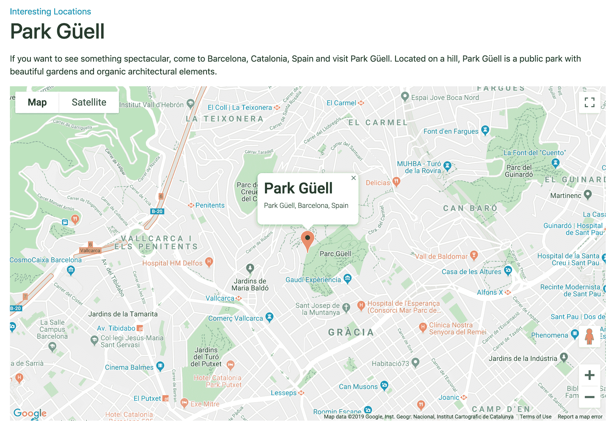

由于移动设备上地图的滚动可能会因为滚动内部滚动问题而出现问题，我们选择在小屏幕上（宽度小于或等于 480 像素）隐藏地图，这样当我们调整屏幕大小时，地图最终会变得不可见，如下所示：

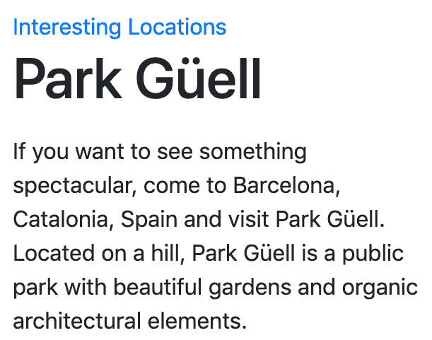

让我们来看看代码。在最初的几个步骤中，我们添加了 Google Maps API 密钥并将其暴露给所有模板。然后我们创建了浏览位置的视图并将它们插入到 URL 配置中。然后我们创建了列表和详细模板。

`DetailView`的`template_name`默认来自模型名称的小写版本，再加上`detail`；因此，我们的模板命名为`location_detail.html`。如果我们想使用不同的模板，可以为视图指定`template_name`属性。同样，`ListView`的`template_name`默认来自模型名称的小写版本，再加上`list`，因此命名为`location_list.html`。

在详细模板中，我们有位置标题和描述，后面是一个带有`id="map"`的`<div>`元素，以及`data-latitude`、`data-longitude`和`data-address`自定义属性。这些组成了`content`块元素。在`<body>`末尾添加了两个`<script>`标签——一个是下面描述的`location_detail.js`，另一个是 Google Maps API 脚本，我们已经传递了我们的 Maps API 密钥和 API 加载时要调用的回调函数的名称。

在 JavaScript 文件中，我们使用原型函数创建了一个`Location`类。这个函数有一个静态的`init()`方法，它被赋予了 Google Maps API 的回调函数。当调用`init()`时，构造函数被调用以创建一个新的单例`Location`实例。在构造函数中，采取了一系列步骤来设置地图及其特性：

1.  首先，通过其 ID 找到地图案例（容器）。只有找到该元素，我们才会继续。

1.  接下来，使用`data-latitude`和`data-longitude`属性找到地理坐标，并将它们存储在字典中作为位置的`coords`。这个对象是 Google Maps API 理解的形式，稍后会用到。

1.  接下来读取`data-address`，并直接将其存储为位置的地址属性。

1.  从这里开始，我们开始构建东西，从地图开始。为了确保位置可见，我们使用之前从数据属性中提取的`coords`设置中心。

1.  一个标记使位置在地图上明显可见，使用相同的`coords`定位。

1.  最后，我们建立一个信息窗口，这是一种可以直接在地图上显示的弹出气泡，使用 API。除了之前检索到的地址，我们还根据模板中给出的`.map-title`类来查找位置标题。这被添加为窗口的`<h1>`标题，后跟地址作为`<p>`段落。为了允许窗口显示，我们在标记上添加了一个点击事件侦听器，它将打开窗口。

# 另请参阅

+   *在 JavaScript 中公开设置*配方

+   *安排 base.html 模板*配方

+   *提供响应式图片*配方

+   *在模态对话框中打开对象详细信息*配方

+   *在第六章*的*将地图插入更改表单*配方，模型管理

# 提供响应式图片

随着响应式网站成为常态，提供相同内容给移动设备和台式电脑时出现了许多性能问题。在小设备上减少响应式网站的加载时间的一个非常简单的方法是提供更小的图像。这就是响应式图片的关键组件`srcset`和`sizes`属性发挥作用的地方。

# 准备工作

让我们从之前的配方中使用的`locations`应用开始。

# 如何做到...

按照以下步骤添加响应式图片：

1.  首先，让我们将`django-imagekit`安装到您的虚拟环境中，并将其添加到`requirements/_base.txt`中。我们将使用它来调整原始图像的大小：

```py
(env)$ pip install django-imagekit==4.0.2

```

1.  在设置中将`"imagekit"`添加到`INSTALLED_APPS`中：

```py
# myproject/settings/_base.py INSTALLED_APPS = [
    # …
    "imagekit",
    # …
]
```

1.  在`models.py`文件的开头，让我们导入一些用于图像版本的库，并定义一个负责图片文件的目录和文件名的函数：

```py
# myproject/apps/locations/models.py import contextlib
import os
# …
from imagekit.models import ImageSpecField
from pilkit.processors import ResizeToFill
# …

def upload_to(instance, filename):
    now = timezone_now()
    base, extension = os.path.splitext(filename)
    extension = extension.lower()
    return f"locations/{now:%Y/%m}/{instance.pk}{extension}"
```

1.  现在让我们在同一个文件中的`Location`模型中添加一个`picture`字段，以及图像版本的定义：

```py
class Location(CreationModificationDateBase, UrlBase):
    # …
    picture = models.ImageField(_("Picture"), upload_to=upload_to)
    picture_desktop = ImageSpecField(
        source="picture",
        processors=[ResizeToFill(1200, 600)],
        format="JPEG",
        options={"quality": 100},
    )
    picture_tablet = ImageSpecField(
        source="picture", processors=[ResizeToFill(768, 384)], 
         format="PNG"
    )
    picture_mobile = ImageSpecField(
        source="picture", processors=[ResizeToFill(640, 320)], 
         format="PNG"
    )
```

1.  然后，覆盖`Location`模型的`delete()`方法，以在模型实例被删除时删除生成的版本：

```py
def delete(self, *args, **kwargs):
    from django.core.files.storage import default_storage

    if self.picture:
        with contextlib.suppress(FileNotFoundError):
            default_storage.delete(self.picture_desktop.path)
            default_storage.delete(self.picture_tablet.path)
            default_storage.delete(self.picture_mobile.path)
        self.picture.delete()

    super().delete(*args, **kwargs)
```

1.  创建并运行迁移以将新的`picture`字段添加到数据库架构中。

1.  更新位置详细模板以包括图像：

```py
{# locations/location_detail.html #}




    <a href=""></a>
    <h1 class="map-title">{{ location.name }}</h1>
 
 <picture class="img-fluid">
 <source
                media="(max-width: 480px)"
                srcset="{{ location.picture_mobile.url }}" />
 <source
                media="(max-width: 768px)"
                srcset="{{ location.picture_tablet.url }}" />
 
 </picture>
     {# … #}



    {# … #}

```

1.  最后，在管理中为位置添加一些图像。

# 工作原理...

响应式图像非常强大，基本上是为了根据指示每个图像将显示在哪些显示器上的媒体规则提供不同的图像。我们在这里做的第一件事是添加`django-imagekit`应用程序，这使得可以动态生成所需的不同图像。

显然，我们还需要原始图像源，因此在我们的`Location`模型中，我们添加了一个名为`picture`的图像字段。在`upload_to()`函数中，我们根据当前年份和月份、位置的 UUID 以及与上传文件相同的文件扩展名构建了上传路径和文件名。我们还在那里定义了图像版本规格，如下所示：

+   `picture_desktop`将具有 1,200 x 600 的尺寸，并将用于桌面布局

+   `picture_tablet`将具有 768 x 384 的尺寸，并将用于平板电脑

+   `picture_mobile`将具有 640 x 320 的尺寸，并将用于智能手机

在位置的`delete()`方法中，我们检查`picture`字段是否有任何值，然后尝试在删除位置本身之前删除它及其图像版本。我们使用`contextlib.suppress(FileNotFoundError)`来静默忽略如果在磁盘上找不到文件的任何错误。

最有趣的工作发生在模板中。当位置图片存在时，我们构建我们的`<picture>`元素。表面上，这基本上是一个容器。实际上，除了在我们的模板中最后出现的默认``标签之外，它可能什么都没有，尽管那将没有什么用。除了默认图像，我们还为其他宽度生成缩略图—480 像素和 768 像素—然后用它们来构建额外的`<source>`元素。每个`<source>`元素都有`media`规则，规定了在哪些条件下从`srcset`属性值中选择图像。在我们的情况下，我们为每个`<source>`只提供一个图像。位置详细页面现在将包括地图上方的图像，并且应该看起来像这样：

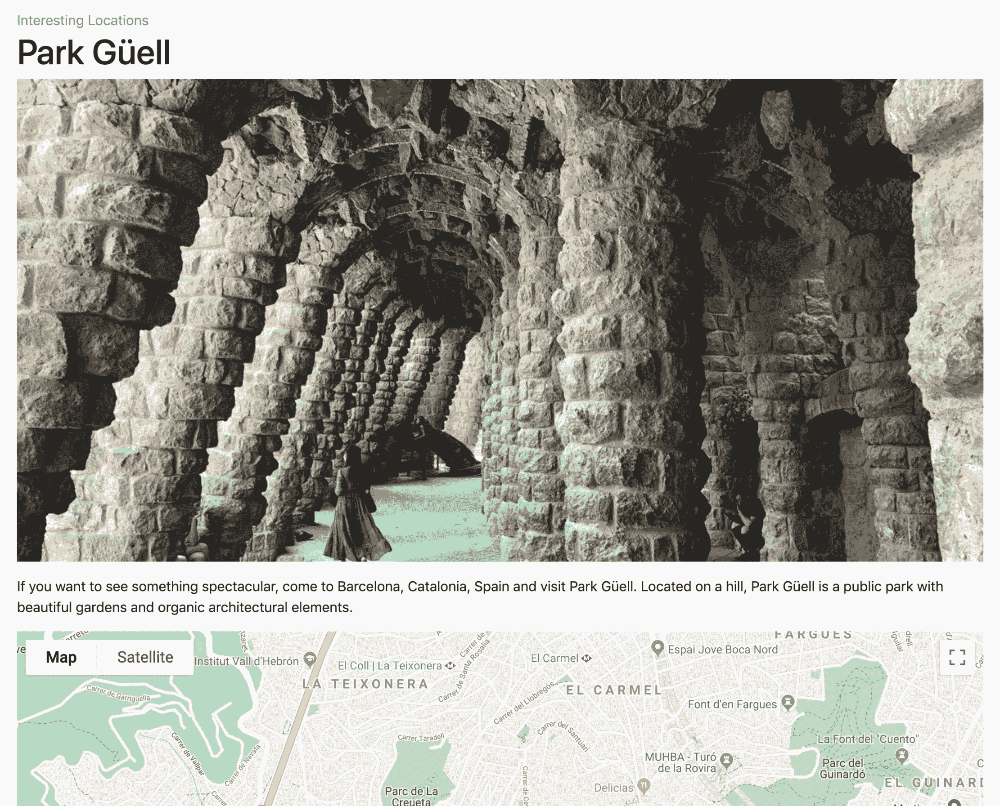

当浏览器加载此标记时，它会按照一系列步骤确定要加载哪个图像：

+   依次检查每个`<source>`的`media`规则，以查看是否有任何一个与当前视口匹配

+   当规则匹配时，将读取`srcset`并加载和显示适当的图像 URL

+   如果没有规则匹配，则加载最终默认图像的`src`

因此，在较小的视口上将加载较小的图像。例如，我们可以看到仅 375 像素宽的视口上加载了最小的图像：

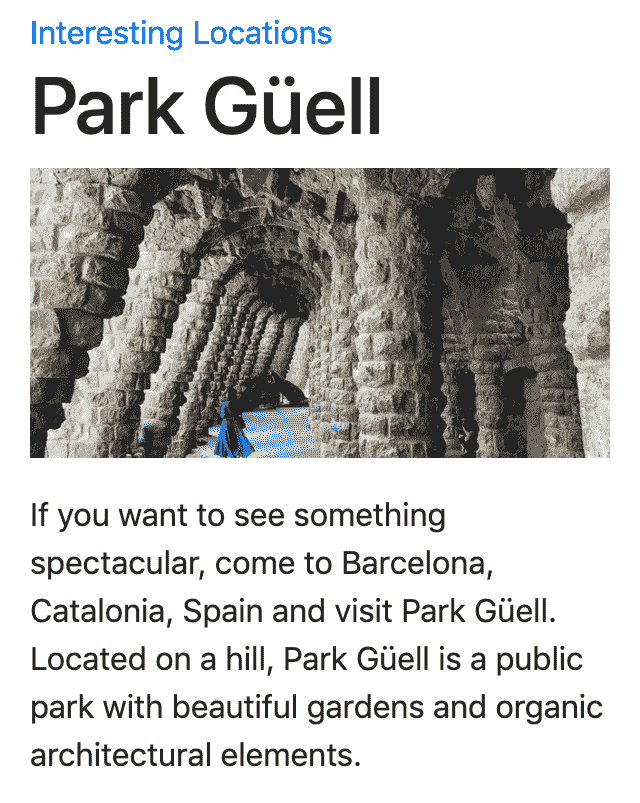

对于根本无法理解`<picture>`和`<source>`标签的浏览器，仍然可以加载默认图像，因为它只是一个普通的``标签。

# 还有更多...

您不仅可以使用响应式图像来提供针对性的图像尺寸，还可以区分像素密度，并为在任何给定的视口大小上专门为设计精心策划的图像。这被称为艺术指导。如果您有兴趣了解更多信息，**Mozilla 开发者网络**（**MDN**）在该主题上有一篇详尽的文章，可在[`developer.mozilla.org/en-US/docs/Learn/HTML/Multimedia_and_embedding/Responsive_images`](https://developer.mozilla.org/en-US/docs/Learn/HTML/Multimedia_and_embedding/Responsive_images)上找到。

# 另请参阅

+   *排列 base.html 模板*配方

+   *使用 HTML5 数据属性*配方

+   *在模态对话框中打开对象详细信息*配方

+   在第六章*的*模型管理*中的*将地图插入更改表单*教程

# 实现连续滚动

社交网站通常具有称为连续滚动的功能，也称为无限滚动，作为分页的替代。与其单独具有查看额外项目集的链接不同，这里有大量项目的长列表，当您向下滚动页面时，新项目将自动加载并附加到底部。在本教程中，我们将看到如何使用 Django 和 jScroll jQuery 插件实现这样的效果。

您可以从[`jscroll.com/`](https://jscroll.com/)下载 jScroll 脚本，并在该网站找到有关该插件的详细文档。

# 准备工作

我们将重用我们在之前的教程中创建的`locations`应用。

为了在列表视图中显示一些更有趣的数据，让我们将`ratings`字段添加到`Location`模型中，如下所示：

```py
# myproject/apps/locations/models.py # …
RATING_CHOICES = ((1, "★☆☆☆☆"), (2, "★★☆☆☆"), (3, "★★★☆☆"), (4, "★★★★☆"), (5, "★★★★★"))

class Location(CreationModificationDateBase, UrlBase):
    # …

    rating = models.PositiveIntegerField(
        _("Rating"), choices=RATING_CHOICES, blank=True, null=True
    )

    # …

    def get_rating_percentage(self):
 return self.rating * 20 if self.rating is not None else None

```

`get_rating_percentage()`方法将需要返回评分作为百分比的表示。

不要忘记进行迁移并添加一些位置的评分到管理中。

# 如何做...

按照以下步骤创建一个连续滚动页面：

1.  首先，在管理中添加足够的位置。正如您从*使用 HTML5 数据属性*教程中所看到的，我们将通过每页 10 个项目对`LocationList`视图进行分页，因此我们至少需要 11 个位置来查看连续滚动是否按预期工作。

1.  修改位置列表视图的模板如下：

```py
{# locations/location_list.html #} 



    <div class="row">
        <div class="col-lg-8">
            <h1></h1>
            
                <div class="item-list">
 
                        <a href="{{ location.get_url_path }}"
                           class="item d-block my-3">
                            <div class="card">
                                <div class="card-body">
                                    <div class="float-right">
                                        <div class="rating" aria-
                                          label="
                                           {{ stars }} of 5 stars
                                            ">
                                            <span style="width:{{ 
                                           location.get_rating
                                        _percentage }}%"></span>
                                        </div>
                                    </div>
                                    <p class="card-text">{{ 
                                        location.name }}<br/>
                                        <small>{{ location.city }},

                                         {{location.get_country
                                          _display }}</small>
                                    </p>
                                </div>
                            </div>
                        </a>
 
 
 <div class="text-center">
 <div class="loading-indicator"></div>
 </div>
 <p class="pagination">
 <a class="next-page"
 href="">
 </a>
 </p>
 
                </div>
            
                <p></p>
            
        </div>
        <div class="col-lg-4">
            
        </div>
    </div>

```

1.  在相同的模板中，使用以下标记覆盖`css`和`js`块：

```py

    <link rel="stylesheet" type="text/css"
          href="">



    <script src="img/jquery.jscroll.min.js"></script>
    <script src="img/list.js' %}"></script>

```

1.  作为最后一步，使用加载指示器的 JavaScript 模板覆盖`extra_body`块：

```py

    <script type="text/template" class="loader">
        <div class="text-center">
            <div class="loading-indicator"></div>
        </div>
    </script>

```

1.  在`locations/includes/navigation.html`中创建页面导航。现在，您只需在那里创建一个空文件。

1.  下一步是添加 JavaScript 并初始化连续滚动小部件：

```py
/* site_static/site/js/list.js */ jQuery(function ($) {
    var $list = $('.item-list');
    var $loader = $('script[type="text/template"].loader');
    $list.jscroll({
        loadingHtml: $loader.html(),
        padding: 100,
        pagingSelector: '.pagination',
        nextSelector: 'a.next-page:last',
        contentSelector: '.item,.pagination'
    });
});
```

1.  最后，我们将添加一些 CSS，以便评分可以使用用户友好的星星来显示，而不仅仅是数字。

```py
/* site_static/site/css/rating.css */ .rating {
  color: #c90;
  display: block;
  position: relative;
  margin: 0;
  padding: 0;
  white-space: nowrap;
}

.rating span {
  color: #fc0;
  display: block;
  position: absolute;
  overflow: hidden;
  top: 0;
  left: 0;
  bottom: 0;
  white-space: nowrap;
}

.rating span:before,
.rating span:after {
  display: block;
  position: absolute;
  overflow: hidden;
  left: 0;
  top: 0;
  bottom: 0;
}

.rating:before {
  content: "☆☆☆☆☆";
}

.rating span:after {
  content: "★★★★★";
}
```

1.  在主网站样式的主文件中，添加一个用于加载指示器的样式：

```py
/* site_static/site/css/style.css */ /* … */
.loading-indicator {
  display: inline-block;
  width: 45px;
  height: 45px;
}
.loading-indicator:after {
  content: "";
  display: block;
  width: 40px;
  height: 40px;
  border-radius: 50%;
  border: 5px solid rgba(0,0,0,.25);
  border-color: rgba(0,0,0,.25) transparent rgba(0,0,0,.25) 
   transparent;
  animation: dual-ring 1.2s linear infinite;
}
@keyframes dual-ring {
  0% {
    transform: rotate(0deg);
  }
  100% {
    transform: rotate(360deg);
  }
}
```

# 它是如何工作的...

当您在浏览器中打开位置列表视图时，页面上会显示视图中设置的预定义项目数量（即 10）。当您向下滚动时，将自动加载并附加另一页的项目和下一个分页链接到项目容器中。分页链接使用了来自*在第五章*的*创建一个模板标签来修改请求查询参数*教程中的``自定义模板标签，以根据当前的 URL 生成一个调整后的 URL，但指向正确的下一页编号。如果您的连接速度较慢，那么当您滚动到页面底部时，您将看到一个类似以下的页面，直到加载并附加到列表中的下一页的项目：

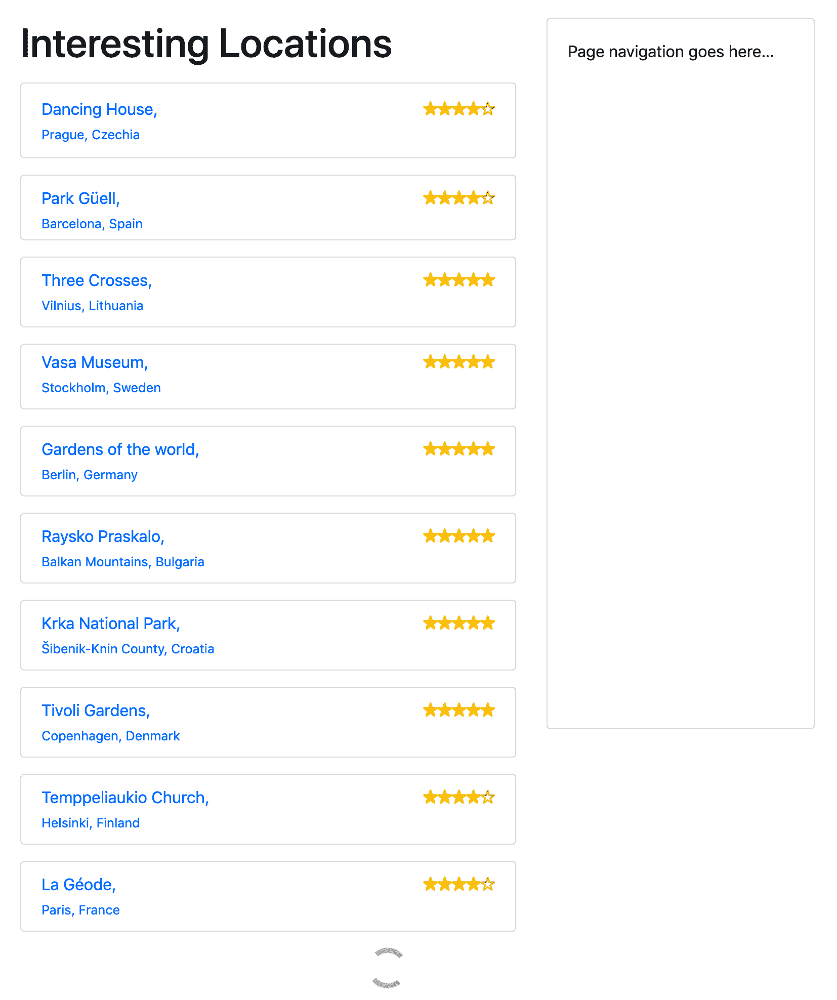

向下滚动，项目的第二、第三和以后的页面将在底部加载并附加。这将持续进行，直到没有更多页面需要加载，这是由最终组中没有进一步加载的分页链接来表示的。

我们在这里使用 Cloudflare CDN URL 来加载 jScroll 插件，但是，如果您选择将其作为静态文件下载到本地副本，则可以使用``查找将脚本添加到模板中。

在初始页面加载时，包含项目和分页链接的具有`item-list` CSS 类的元素将通过`list.js`中的代码成为一个 jScroll 对象。事实上，这个实现是足够通用的，可以用来为任何遵循类似标记结构的列表显示启用连续滚动。

以下选项用于定义其功能：

+   `loadingHtml`：这设置了 jScroll 在加载新项目页面时将注入到列表末尾的标记。在我们的情况下，它是一个动画加载指示器，并且它是直接从标记中的`<script type="text/template" />`标签中提取的 HTML。通过给出这个`type`属性，浏览器不会像执行普通 JavaScript 那样尝试执行它，而且内部内容对用户来说仍然是不可见的。

+   `padding`：当页面的滚动位置在滚动区域的末尾距离内时，应加载新页面。在这里，我们将其设置为 100 像素。

+   `pagingSelector`：一个 CSS 选择器，指示`object_list`中的哪些 HTML 元素是分页链接。在 jScroll 插件激活的浏览器中，这些链接将被隐藏，以便连续滚动可以接管加载额外页面的工作，但在其他浏览器中，用户仍然可以通过正常点击分页来导航。

+   `nextSelector`：此 CSS 选择器查找要从中读取下一页 URL 的 HTML 元素。

+   `contentSelector`：另一个 CSS 选择器。这指定应从 Ajax 加载的内容中提取哪些 HTML 元素，并添加到容器中。

`rating.css`插入 Unicode 星字符，并将轮廓与填充版本重叠，以创建评级效果。使用与评级值百分比的最大值（在本例中为 5）相当的宽度，填充的星星覆盖了空心星星的适当空间，允许小数评级。在标记中，有一个`aria-label`属性，其中包含供使用屏幕阅读器的人使用的评级信息。

最后，`style.css`文件中的 CSS 使用 CSS 动画来创建旋转加载指示器。

# 还有更多...

我们在侧边栏中有一个导航的占位符。请注意，使用连续滚动时，所有项目列表后面的所有次要导航应该放在侧边栏中，而不是页脚中，因为访问者可能永远不会到达页面的末尾。

# 另请参阅

+   在第三章*，表单和视图*中的*过滤对象列表*食谱

+   在第三章*，表单和视图*中的*管理分页列表*食谱

+   在第三章*，表单和视图*中的*组合基于类的视图*食谱

+   *在 JavaScript 中公开设置*食谱

+   第五章*，自定义模板过滤器和标签*中的*创建模板标签以修改请求查询参数*食谱

# 在模态对话框中打开对象详细信息

在这个食谱中，我们将创建一个到位置的链接列表，当点击时，会打开一个 Bootstrap 模态对话框，显示有关位置的一些信息和`了解更多...`链接，指向位置详细页面：

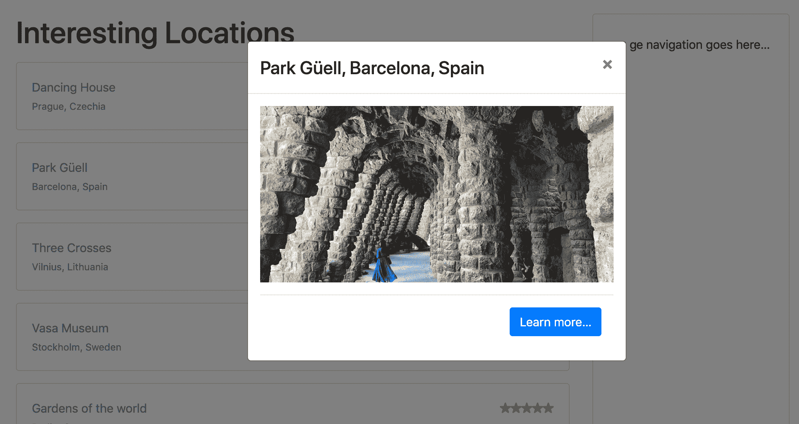

对话框的内容将通过 Ajax 加载。对于没有 JavaScript 的访问者，详细页面将立即打开，而不需要这个中间步骤。

# 准备工作

让我们从之前创建的`locations`应用程序开始。

确保您有视图、URL 配置和位置列表和位置详细信息的模板，就像我们之前定义的那样。

# 如何做...

逐步执行这些步骤，将模态对话框作为列表视图和详细视图之间的中间步骤添加：

1.  首先，在`locations`应用程序的 URL 配置中，为模态对话框的响应添加一个规则：

```py
# myproject/apps/locations/urls.py from django.urls import path
from .views import LocationList, LocationDetail

urlpatterns = [
    path("", LocationList.as_view(), name="location_list"),
    path("add/", add_or_change_location, name="add_location"),
    path("<uuid:pk>/", LocationDetail.as_view(), 
     name="location_detail"),
    path(
 "<uuid:pk>/modal/",
 LocationDetail.as_view(template_name=
         "locations/location_detail_modal.html"),
 name="location_detail_modal",
 ),
]
```

1.  为模态对话框创建一个模板：

```py
{# locations/location_detail_modal.html #}

<p class="text-center">
    
        <picture class="img-fluid">
            <source media="(max-width: 480px)"
                    srcset="{{ location.picture_mobile.url }}"/>
            <source media="(max-width: 768px)"
                    srcset="{{ location.picture_tablet.url }}"/>
            
        </picture>
    
</p>
<div class="modal-footer text-right">
    <a href="" 
     class="btn btn-primary pull-right">
        
    </a>
</div>
```

1.  在位置列表的模板中，通过添加自定义数据属性来更新到位置详细信息的链接：

```py
{# locations/location_list.html #} {# … #}
<a href="{{ location.get_url_path }}"
   data-modal-title="{{ location.get_full_address }}"
   data-modal-url=""
   class="item d-block my-3">
    {# … #}
</a>
{# … #}
```

1.  在同一个文件中，使用模态对话框的标记覆盖`extra_body`内容：

```py

    {# … #}
 <div id="modal" class="modal fade" tabindex="-1" role="dialog"
         aria-hidden="true" aria-labelledby="modal_title">
 <div class="modal-dialog modal-dialog-centered"
             role="document">
 <div class="modal-content">
 <div class="modal-header">
 <h4 id="modal_title"
                        class="modal-title"></h4>
 <button type="button" class="close"
                            data-dismiss="modal"
                            aria-label="">
 <span aria-hidden="true">&times;</span>
 </button>
 </div>
 <div class="modal-body"></div>
 </div>
 </div>
 </div>

```

1.  最后，通过添加脚本来修改`list.js`文件，以处理模态对话框的打开和关闭：

```py
/* site_static/js/list.js */ /* … */
jQuery(function ($) {
    var $list = $('.item-list');
    var $modal = $('#modal');
    $modal.on('click', '.close', function (event) {
        $modal.modal('hide');
        // do something when dialog is closed…
    });
    $list.on('click', 'a.item', function (event) {
        var $link = $(this);
        var url = $link.data('modal-url');
        var title = $link.data('modal-title');
        if (url && title) {
            event.preventDefault();
            $('.modal-title', $modal).text(title);
            $('.modal-body', $modal).load(url, function () {
                $modal.on('shown.bs.modal', function () {
                    // do something when dialog is shown…
                }).modal('show');
            });
        }
    });
});
```

# 它是如何工作的...

如果我们在浏览器中转到位置列表视图并点击其中一个位置，我们将看到类似以下的模态对话框：


让我们来看看这是如何一起实现的。名为`location_detail_modal`的 URL 路径指向相同的位置详细视图，但使用不同的模板。提到的模板只有一个响应式图像和一个带有链接“了解更多…”的模态对话框页脚，该链接指向位置的正常详细页面。在列表视图中，我们更改了列表项的链接，以包括稍后 JavaScript 将引用的`data-modal-title`和`data-modal-url`属性。第一个属性规定应将完整地址用作标题。第二个属性规定应从模态对话框的主体中获取的位置。在列表视图的末尾，我们有 Bootstrap 4 模态对话框的标记。对话框包含一个带有关闭按钮和标题的页眉，以及用于主要详细信息的内容区域。JavaScript 应该通过`js`块添加。 

在 JavaScript 文件中，我们使用了 jQuery 框架来利用更短的语法和统一的跨浏览器功能。当页面加载时，我们为`.item-list`元素分配了一个事件处理程序`on('click')`。当点击任何`a.item`时，该事件被委派给这个处理程序，该处理程序读取并存储自定义数据属性作为`url`和`title`。当这些成功提取时，我们阻止原始点击操作（导航到完整的详细页面），然后设置模态进行显示。我们为隐藏的对话框设置新标题，并通过 Ajax 将模态对话框的内容加载到`.modal-body`元素上。最后，使用 Bootstrap 4 的`modal()` jQuery 插件向访问者显示模态。

如果 JavaScript 文件无法处理模态对话框的 URL 自定义属性，或者更糟糕的是，如果`list.js`中的 JavaScript 加载或执行失败，点击位置链接将像往常一样将用户带到详细页面。我们已经将我们的模态实现为渐进增强，以便用户体验正确，即使面临失败。

# 另请参阅

+   *使用 HTML5 数据属性*配方

+   *提供响应式图像*配方

+   *实现连续滚动*配方

+   *实现“喜欢”小部件*配方

# 实现“喜欢”小部件

一般来说，网站，尤其是那些具有社交组件的网站，通常会集成 Facebook、Twitter 和 Google+小部件，以喜欢和分享内容。在这个配方中，我们将指导您通过构建类似的 Django 功能，每当用户喜欢某物时，都会将信息保存在您的数据库中。您将能够根据用户在您的网站上喜欢的内容创建特定的视图。我们将类似地创建一个带有两状态按钮和显示总喜欢数量的徽章的“喜欢”小部件。

以下屏幕截图显示了非活动状态，您可以单击按钮将其激活：

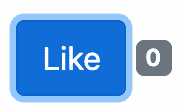

以下屏幕截图显示了活动状态，您可以单击按钮将其停用：

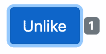

小部件状态的更改将通过 Ajax 调用处理。

# 准备工作

首先，创建一个`likes`应用程序并将其添加到`INSTALLED_APPS`中。然后，设置一个`Like`模型，该模型与喜欢某物的用户具有外键关系，并且与数据库中的任何对象具有通用关系。我们将使用我们在第二章*，模型和数据库结构*中定义的`object_relation_base_factory`，该工厂用于处理通用关系的模型混合。如果您不想使用混合，您也可以自己在以下模型中定义通用关系：

```py
# myproject/apps/likes/models.py from django.db import models
from django.utils.translation import ugettext_lazy as _
from django.conf import settings

from myproject.apps.core.models import (
    CreationModificationDateBase,
    object_relation_base_factory,
)

LikeableObject = object_relation_base_factory(is_required=True)

class Like(CreationModificationDateBase, LikeableObject):
    class Meta:
        verbose_name = _("Like")
        verbose_name_plural = _("Likes")
        ordering = ("-created",)

    user = models.ForeignKey(settings.AUTH_USER_MODEL, 
     on_delete=models.CASCADE)

    def __str__(self):
        return _("{user} likes {obj}").format(user=self.user, 
         obj=self.content_object)
```

还要确保在设置中设置了`request`上下文处理器。我们还需要在设置中添加身份验证中间件，以便将当前登录的用户附加到请求：

```py
# myproject/settings/_base.py # …
MIDDLEWARE = [
    # …
    "django.contrib.auth.middleware.AuthenticationMiddleware",
    # …
]

TEMPLATES = [
    {
        # …
        "OPTIONS": {
            "context_processors": [
                "django.template.context_processors.request",
                # …
            ]
        },
    }
]
```

记得创建并运行迁移，以便为新的`Like`模型设置数据库。

# 如何做...

逐步执行以下步骤：

1.  在`likes`应用程序中，创建一个带有空`__init__.py`文件的`templatetags`目录，使其成为 Python 模块。然后，添加`likes_tags.py`文件，在其中定义``模板标记如下：

```py
# myproject/apps/likes/templatetags/likes_tags.py from django import template
from django.contrib.contenttypes.models import ContentType
from django.template.loader import render_to_string

from ..models import Like

register = template.Library()

# TAGS

class ObjectLikeWidget(template.Node):
    def __init__(self, var):
        self.var = var

    def render(self, context):
        liked_object = self.var.resolve(context)
        ct = ContentType.objects.get_for_model(liked_object)
        user = context["request"].user

        if not user.is_authenticated:
            return ""

        context.push(object=liked_object, content_type_id=ct.pk)
        output = render_to_string("likes/includes/widget.html", 
         context.flatten())
        context.pop()
        return output

@register.tag
def like_widget(parser, token):
    try:
        tag_name, for_str, var_name = token.split_contents()
    except ValueError:
        tag_name = "%r" % token.contents.split()[0]
        raise template.TemplateSyntaxError(
            f"{tag_name} tag requires a following syntax: "
            f"{}"
        )
    var = template.Variable(var_name)
    return ObjectLikeWidget(var)

```

1.  我们还将在同一文件中添加过滤器，以获取用户的 Like 状态以及指定对象的总 Like 数：

```py
# myproject/apps/likes/templatetags/likes_tags.py # …
# FILTERS

@register.filter
def liked_by(obj, user):
    ct = ContentType.objects.get_for_model(obj)
    liked = Like.objects.filter(user=user, content_type=ct, object_id=obj.pk)
    return liked.count() > 0

@register.filter
def liked_count(obj):
    ct = ContentType.objects.get_for_model(obj)
    likes = Like.objects.filter(content_type=ct, object_id=obj.pk)
    return likes.count()
```

1.  在 URL 规则中，我们需要一个处理使用 Ajax 进行点赞和取消点赞的视图规则：

```py
# myproject/apps/likes/urls.py from django.urls import path
from .views import json_set_like

urlpatterns = [
    path("<int:content_type_id>/<str:object_id>/",
         json_set_like,
         name="json_set_like")
]
```

1.  确保将 URL 映射到项目：

```py
# myproject/urls.py from django.conf.urls.i18n import i18n_patterns
from django.urls import include, path

urlpatterns = i18n_patterns(
    # …
 path("likes/", include(("myproject.apps.likes.urls", "likes"), 
     namespace="likes")),
)
```

1.  然后，我们需要定义视图，如下所示：

```py
# myproject/apps/likes/views.py from django.contrib.contenttypes.models import ContentType
from django.http import JsonResponse
from django.views.decorators.cache import never_cache
from django.views.decorators.csrf import csrf_exempt

from .models import Like
from .templatetags.likes_tags import liked_count

@never_cache
@csrf_exempt
def json_set_like(request, content_type_id, object_id):
    """
    Sets the object as a favorite for the current user
    """
    result = {
        "success": False,
    }
    if request.user.is_authenticated and request.method == "POST":
        content_type = ContentType.objects.get(id=content_type_id)
        obj = content_type.get_object_for_this_type(pk=object_id)

        like, is_created = Like.objects.get_or_create(
            content_type=ContentType.objects.get_for_model(obj),
            object_id=obj.pk,
            user=request.user)
        if not is_created:
            like.delete()

        result = {
            "success": True,
            "action": "add" if is_created else "remove",
            "count": liked_count(obj),
        }

    return JsonResponse(result)
```

1.  在任何对象的列表或详细视图模板中，我们可以添加小部件的模板标记。让我们将小部件添加到先前食谱中创建的位置详细信息中，如下所示：

```py
{# locations/location_detail.html #} 



    <a href=""></a>
    <div class="float-right">
 
 
 
    </div>
    <h1 class="map-title">{{ location.name }}</h1>
    {# … #}

```

1.  然后，我们需要一个小部件的模板，如下所示：

```py
{# likes/includes/widget.html #}

<p class="like-widget">
    <button type="button"
            class="like-button btn btn-primary active"
            data-href=""
            data-remove-label=""
            data-add-label="">
        
            
        
            
        
    </button>
    <span class="like-badge badge badge-secondary">
        {{ object|liked_count }}</span>
</p>

<script src="img/widget.js' %}"></script>

```

1.  最后，我们创建 JavaScript 来处理浏览器中的点赞和取消点赞操作，如下所示：

```py
/* myproject/apps/likes/static/likes/js/widget.js */
(function($) {
    $(document).on("click", ".like-button", function() {
        var $button = $(this);
        var $widget = $button.closest(".like-widget");
        var $badge = $widget.find(".like-badge");

        $.post($button.data("href"), function(data) {
            if (data.success) {
                var action = data.action; // "add" or "remove"
                var label = $button.data(action + "-label");

                $buttonaction + "Class";
                $button.html(label);

                $badge.html(data.count);
            }
        }, "json");
    });
}(jQuery));

```

# 它是如何工作的...

现在，您可以为网站中的任何对象使用``模板标记。它生成一个小部件，根据当前登录用户对对象的响应方式显示 Like 状态。

Like 按钮有三个自定义的 HTML5 数据属性：

+   `data-href`提供了一个唯一的、特定于对象的 URL，用于更改小部件的当前状态

+   `data-add-text`是在添加`Like`关联时要显示的翻译文本（取消关联）

+   `data-remove-text`类似地是在取消`Like`关联时要显示的翻译文本（Like）

使用`django-sekizai`，我们将`<script src="img/widget.js' %}"></script>`添加到页面。请注意，如果页面上有多个`Like`小部件，我们只需包含 JavaScript 一次。如果页面上没有`Like`小部件，则根本不会在页面上包含 JavaScript。

在 JavaScript 文件中，`Like`按钮由`like-button` CSS 类识别。附加到文档的事件侦听器会监视页面中找到的任何此类按钮的单击事件，然后将 Ajax 调用发布到`data-href`属性指定的 URL。

指定的视图`json_set_like`接受两个参数：内容类型 ID 和喜欢的对象的主键。视图检查指定对象是否存在`Like`，如果存在，则删除它；否则，添加`Like`对象。因此，视图返回带有`success`状态的 JSON 响应，对于对象的`Like`对象采取的操作（添加或删除）以及所有用户对对象的喜欢总数。根据返回的操作，JavaScript 将显示按钮的适当状态。

您可以在浏览器的开发者工具中调试 Ajax 响应，通常在网络选项卡中。如果在开发过程中发生任何服务器错误，并且在设置中打开了`DEBUG`，您将在响应的预览中看到错误的回溯；否则，您将看到返回的 JSON，如下面的屏幕截图所示：

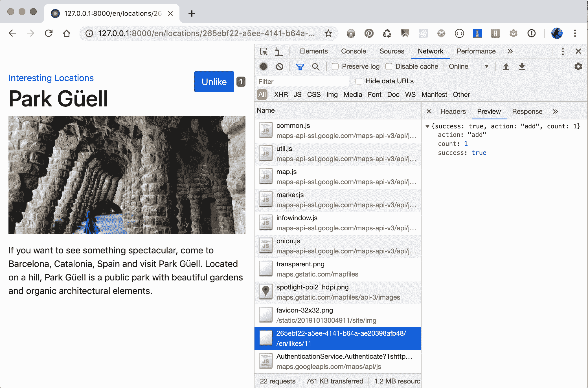

# 另请参阅

+   使用 Django Sekizai 食谱

+   *在模态对话框中打开对象详细信息*食谱

+   *实现连续滚动*食谱

+   通过 Ajax 上传图片的食谱

+   在第二章*,*  *模型和数据库结构*中创建一个处理通用关系的模型 mixin 的食谱

+   第五章*，自定义模板过滤器和标记*

# 通过 Ajax 上传图片

使用默认文件输入字段，很快就会发现我们可以做很多事情来改善用户体验：

+   首先，只有所选文件的路径显示在字段内，而人们希望在选择文件后立即看到他们选择的内容。

+   其次，文件输入本身通常太窄，无法显示所选路径的大部分内容，并且从左端读取。因此，文件名很少在字段内可见。

+   最后，如果表单有验证错误，没有人想再次选择文件；文件应该仍然在具有验证错误的表单中被选中。

在这个示例中，我们将看到如何改进文件上传。

# 准备工作

让我们从我们在之前的示例中创建的`locations`应用程序开始。

我们自己的 JavaScript 文件将依赖于外部库 - jQuery 文件上传。您可以从[`github.com/blueimp/jQuery-File-Upload/tree/v10.2.0`](https://github.com/blueimp/jQuery-File-Upload/tree/v10.2.0)下载并提取文件，并将它们放在`site_static/site/vendor/jQuery-File-Upload-10.2.0`中。该实用程序还需要`jquery.ui.widget.js`，该文件可在`vendor/`子目录中与其他文件一起使用。有了这些，我们就可以开始了。

# 如何做...

让我们定义位置表单，以便它可以支持使用以下步骤进行 Ajax 上传：

1.  让我们为具有非必需的`picture`字段、隐藏的`picture_path`字段和`geoposition`的`latitude`和`longitude`字段创建一个模型表单：

```py
# myproject/apps/locations/forms.py import os
from django import forms
from django.urls import reverse
from django.utils.translation import ugettext_lazy as _
from django.core.files.storage import default_storage
from crispy_forms import bootstrap, helper, layout
from .models import Location

class LocationForm(forms.ModelForm):
    picture = forms.ImageField(
        label=_("Picture"), max_length=255, 
         widget=forms.FileInput(), required=False
    )
    picture_path = forms.CharField(
        max_length=255, widget=forms.HiddenInput(), required=False
    )
    latitude = forms.FloatField(
        label=_("Latitude"),
        help_text=_("Latitude (Lat.) is the angle between any point 
        and the equator (north pole is at 90; south pole is at 
        -90)."),
        required=False,
    )
    longitude = forms.FloatField(
        label=_("Longitude"),
        help_text=_("Longitude (Long.) is the angle east or west 
        of an arbitrary point on Earth from Greenwich (UK), 
        which is the international zero-longitude point 
        (longitude=0 degrees). The anti-meridian of Greenwich is 
        both 180 (direction to east) and -180 (direction to 
        west)."),
        required=False,
    )
    class Meta:
        model = Location
        exclude = ["geoposition", "rating"]
```

1.  在此表单的`__init__()`方法中，我们将从模型实例中读取地理位置，然后为表单定义`django-crispy-forms`布局：

```py
def __init__(self, request, *args, **kwargs):
    self.request = request
    super().__init__(*args, **kwargs)
    geoposition = self.instance.get_geoposition()
 if geoposition:
 self.fields["latitude"].initial = geoposition.latitude
 self.fields["longitude"].initial = geoposition.longitude

    name_field = layout.Field("name", css_class="input-block-
     level")
    description_field = layout.Field(
        "description", css_class="input-block-level", rows="3"
    )
    main_fieldset = layout.Fieldset(_("Main data"), name_field, 
     description_field)

 picture_field = layout.Field(
 "picture",
 data_url=reverse("upload_file"),
 template="core/includes/file_upload_field.html",
 )
 picture_path_field = layout.Field("picture_path")

 picture_fieldset = layout.Fieldset(
 _("Picture"),
 picture_field,
 picture_path_field,
 title=_("Picture upload"),
 css_id="picture_fieldset",
 )

    street_address_field = layout.Field(
        "street_address", css_class="input-block-level"
    )
    street_address2_field = layout.Field(
        "street_address2", css_class="input-block-level"
    )
    postal_code_field = layout.Field("postal_code", 
     css_class="input-block-level")
    city_field = layout.Field("city", css_class="input-block-
     level")
    country_field = layout.Field("country", css_class="input-
     block-level")
    latitude_field = layout.Field("latitude", css_class="input-
     block-level")
    longitude_field = layout.Field("longitude", css_class="input-
     block-level")
    address_fieldset = layout.Fieldset(
        _("Address"),
        street_address_field,
        street_address2_field,
        postal_code_field,
        city_field,
        country_field,
        latitude_field,
        longitude_field,
    )

    submit_button = layout.Submit("save", _("Save"))
    actions = bootstrap.FormActions(layout.Div(submit_button, 
      css_class="col"))

    self.helper = helper.FormHelper()
    self.helper.form_action = self.request.path
    self.helper.form_method = "POST"
    self.helper.attrs = {"noValidate": "noValidate"}
    self.helper.layout = layout.Layout(main_fieldset, 
     picture_fieldset, address_fieldset, actions) 
```

1.  然后我们需要为同一表单的`picture`和`picture_path`字段添加验证：

```py
def clean(self):
    cleaned_data = super().clean()
    picture_path = cleaned_data["picture_path"]
    if not self.instance.pk and not self.files.get("picture") 
     and not picture_path:
        raise forms.ValidationError(_("Please choose an image."))
```

1.  最后，我们将为此表单添加保存方法，该方法将负责保存图像和地理位置：

```py
def save(self, commit=True):
    instance = super().save(commit=False)
    picture_path = self.cleaned_data["picture_path"]
    if picture_path:
        temporary_image_path = os.path.join("temporary-uploads", 
         picture_path)
        file_obj = default_storage.open(temporary_image_path)
        instance.picture.save(picture_path, file_obj, save=False)
        default_storage.delete(temporary_image_path)
    latitude = self.cleaned_data["latitude"]
    longitude = self.cleaned_data["longitude"]
    if latitude is not None and longitude is not None:
        instance.set_geoposition(longitude=longitude, 
         latitude=latitude)
    if commit:
        instance.save()
        self.save_m2m()
    return instance
```

1.  除了`locations`应用程序中先前定义的视图之外，我们将添加一个`add_or_change_location`视图，如下面的代码所示：

```py
# myproject/apps/locations/views.py from django.contrib.auth.decorators import login_required
from django.shortcuts import render, redirect, get_object_or_404

from .forms import LocationForm
from .models import Location

# …

@login_required
def add_or_change_location(request, pk=None):
    location = None
    if pk:
        location = get_object_or_404(Location, pk=pk)
    if request.method == "POST":
        form = LocationForm(request, data=request.POST, 
         files=request.FILES, instance=location)
        if form.is_valid():
            location = form.save()
            return redirect("locations:location_detail", 
             pk=location.pk)
    else:
        form = LocationForm(request, instance=location)

    context = {"location": location, "form": form}
    return render(request, "locations/location_form.html", context)
```

1.  让我们将此视图添加到 URL 配置中：

```py
# myproject/apps/locations/urls.py
from django.urls import path
from .views import add_or_change_location

urlpatterns = [
    # …
    path("<uuid:pk>/change/", add_or_change_location, 
     name="add_or_change_location"),
]
```

1.  在`core`应用程序的视图中，我们将添加一个通用的`upload_file`函数，用于上传可以被具有`picture`字段的其他应用程序重用的图片：

```py
# myproject/apps/core/views.py import os
from django.core.files.base import ContentFile
from django.core.files.storage import default_storage
from django.http import JsonResponse
from django.core.exceptions import SuspiciousOperation
from django.urls import reverse
from django.views.decorators.csrf import csrf_protect
from django.utils.translation import gettext_lazy as _
from django.conf import settings
# …

@csrf_protect
def upload_file(request):
    status_code = 400
    data = {"files": [], "error": _("Bad request")}
    if request.method == "POST" and request.is_ajax() and "picture" 
     in request.FILES:
        file_types = [f"image/{x}" for x in ["gif", "jpg", "jpeg", 
         "png"]]
        file = request.FILES.get("picture")
        if file.content_type not in file_types:
            status_code = 405
            data["error"] = _("Invalid file format")
        else:
            upload_to = os.path.join("temporary-uploads", 
             file.name)
            name = default_storage.save(upload_to, 
             ContentFile(file.read()))
            file = default_storage.open(name)
            status_code = 200
            del data["error"]
            absolute_uploads_dir = os.path.join(
                settings.MEDIA_ROOT, "temporary-uploads"
            )
            file.filename = os.path.basename(file.name)
            data["files"].append(
                {
                    "name": file.filename,
                    "size": file.size,
                    "deleteType": "DELETE",
                    "deleteUrl": (
                        reverse("delete_file") + 
                         f"?filename={file.filename}"
                    ),
                    "path": file.name[len(absolute_uploads_dir) 
                      + 1 :],
                }
            )

    return JsonResponse(data, status=status_code)
```

1.  我们将为新的上传视图设置 URL 规则如下：

```py
# myproject/urls.py from django.urls import path
from myproject.apps.core import views as core_views

# …

urlpatterns += [
    path(
        "upload-file/",
        core_views.upload_file,
        name="upload_file",
    ),
]
```

1.  现在让我们创建一个如下所示的位置表单模板：

```py
{# locations/location_form.html #}




    <div class="row">
        <div class="col-lg-8">
            <a href=""></a>
            <h1>
                
                    
                        Change Location "{{ name }}"
                    
                
                    
                
            </h1>
            
        </div>
    </div>

```

1.  我们需要几个更多的模板。为文件上传字段创建一个自定义模板，其中将包括必要的 CSS 和 JavaScript：

```py
{# core/includes/file_upload_field.html #}



<{{ tag }}div id="div_{{ field.auto_id }}"
class="form-group row {{ wrapper_class }} {{ field.css_classes }}">
  
    <label for="{{ field.id_for_label }}"
           class="col-form-label {{ label_class }} requiredField">
      {{ field.label|safe }}<span 
       class="asteriskField">*</span>
    </label>
  

 <div class="{{ field_class }}">
 <span class="btn btn-success fileinput-button">
 <span></span>
 
 </span>
 
 <p class="form-text text-muted">
 
 
 </p>
 </div>
</{{ tag }}div>


<link rel="stylesheet" href=""/>
<link rel="stylesheet" href=""/>



<script src="img/jquery.ui.widget.js' %}"></script>
<script src="img/jquery.iframe-transport.js' %}"></script>
<script src="img/jquery.fileupload.js' %}"></script>
<script src="img/picture_upload.js' %}"></script>

```

1.  接下来，让我们为图片预览创建一个模板：

```py
{# core/includes/picture_preview.html #} <div id="picture_preview">
  
    
  
</div>
<div id="progress" class="progress" style="visibility: hidden">
  <div class="progress-bar progress-bar-striped 
   progress-bar-animated"
       role="progressbar"
       aria-valuenow="0"
       aria-valuemin="0"
       aria-valuemax="100"
       style="width: 0%"></div>
</div>
```

1.  最后，让我们添加处理图片上传和预览的 JavaScript：

```py
/* site_static/site/js/picture_upload.js */ $(function() {
  $("#id_picture_path").each(function() {
    $picture_path = $(this);
    if ($picture_path.val()) {
      $("#picture_preview").html(
        '          "temporary-uploads/" +
          $picture_path.val() +
          '" alt="" class="img-fluid" />'
      );
    }
  });
  $("#id_picture").fileupload({
    dataType: "json",
    add: function(e, data) {
      $("#progress").css("visibility", "visible");
      data.submit();
    },
    progressall: function(e, data) {
      var progress = parseInt((data.loaded / data.total) * 100, 
       10);
      $("#progress .progress-bar")
        .attr("aria-valuenow", progress)
        .css("width", progress + "%");
    },
    done: function(e, data) {
      $.each(data.result.files, function(index, file) {
        $("#picture_preview").html(
          '            "temporary-uploads/" +
            file.name +
            '" alt="" class="img-fluid" />'
        );
        $("#id_picture_path").val(file.name);
      });
      $("#progress").css("visibility", "hidden");
    }
  });
});
```

# 工作原理...

如果 JavaScript 执行失败，则表单仍然完全可用，但是当 JavaScript 正常运行时，我们将获得一个增强的表单，其中文件字段被一个简单的按钮替换，如下所示：

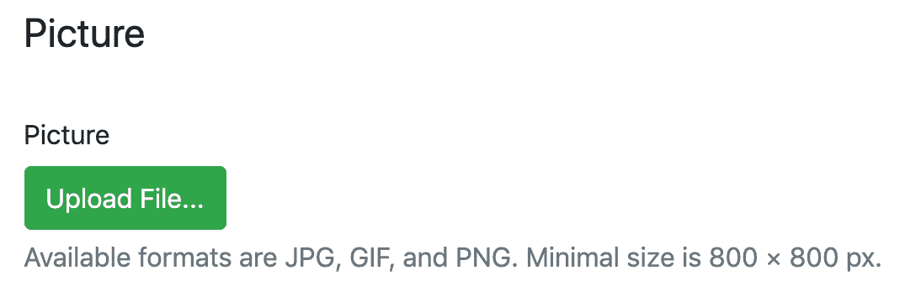

当通过单击“上传文件…”按钮选择图像时，浏览器中的结果将类似于以下屏幕截图：

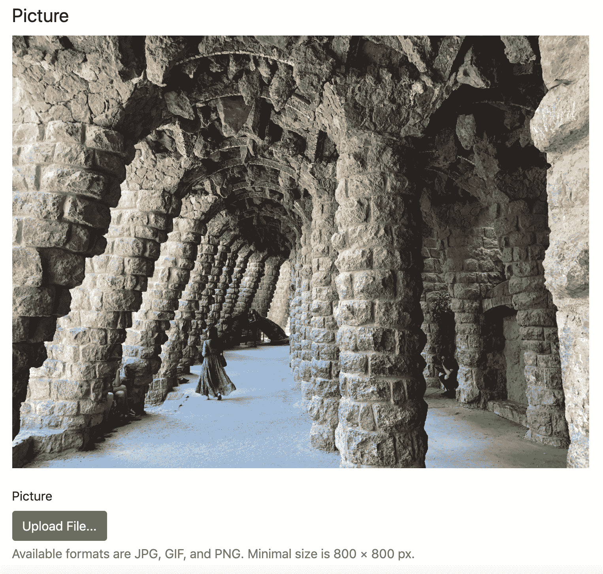

单击“上传文件…”按钮会触发一个文件对话框，要求您选择文件，并在选择后立即开始 Ajax 上传过程。然后我们会看到已附加的图像的预览。预览图片上传到临时目录，并且其文件名保存在`picture_path`隐藏字段中。当您提交表单时，表单会从此临时位置或`picture`字段保存图片。如果表单是在没有 JavaScript 或 JavaScript 加载失败的情况下提交的，则`picture`字段将具有一个值。如果在页面重新加载后其他字段有任何验证错误，则加载的预览图像基于`picture_path`。

让我们通过以下步骤深入了解该过程并看看它是如何工作的。

在我们的“位置”模型的模型表单中，我们将“图片”字段设置为非必填，尽管在模型级别上是必需的。此外，我们在那里添加了`picture_path`字段，然后我们期望其中任何一个字段被提交到表单中。在`crispy-forms`布局中，我们为`picture`字段定义了一个自定义模板`file_upload_field.html`。在那里，我们设置了预览图像、上传进度条和自定义帮助文本，其中包括允许的文件格式和最小尺寸。在同一个模板中，我们还附加了来自 jQuery 文件上传库的 CSS 和 JavaScript 文件以及一个自定义脚本`picture_upload.js`。CSS 文件将文件上传字段呈现为一个漂亮的按钮。JavaScript 文件负责基于 Ajax 的文件上传。

`picture_upload.js`将所选文件发送到`upload_file`视图。该视图检查文件是否为图像类型，然后尝试将其保存在项目的`MEDIA_ROOT`下的`temporary-uploads/`目录中。该视图返回一个 JSON，其中包含有关成功或失败的文件上传的详细信息。

在选择并上传图片并提交表单后，`LocationForm`的“save（）”方法将被调用。如果`picture_path`字段的值存在，则将从临时目录中取出文件并复制到`Location`模型的`picture`字段中。然后删除临时目录中的图片，并保存`Location`实例。

# 还有更多...

我们从模型表单中排除了`geoposition`字段，而是为地理位置数据呈现了“纬度”和“经度”字段。默认的地理位置`PointField`被呈现为一个没有自定义可能性的`Leaflet.js`地图。通过这两个“纬度”和“经度”字段，我们可以灵活地利用 Google Maps API、Bing Maps API 或`Leaflet.js`来在地图中显示它们，手动输入，或者从填写的位置地址中进行地理编码。

为了方便起见，我们使用了两个辅助方法“get_geoposition（）”和“set_geoposition（）”，这些方法我们在“使用 HTML5 数据属性”配方中定义过。

# 另请参阅

+   在“使用 HTML5 数据属性”配方中

+   在“第三章”（ac26c6a6-3fd1-4b28-8b01-5b3cda40f4f9.xhtml）的“表单和视图”中的“上传图片”配方

+   在“以模态对话框形式打开对象详细信息”配方中

+   在“实现连续滚动”配方中

+   在“实现点赞小部件”配方中

+   在“第七章”（0d629161-25ac-4edc-a361-aff632f37b33.xhtml）的“安全性和性能”中的“使表单免受跨站请求伪造（CSRF）”配方
