# 第六章：模型管理

在本章中，我们将涵盖以下主题：

+   在更改列表页面上自定义列

+   创建可排序的内联

+   创建管理操作

+   开发更改列表过滤器

+   更改第三方应用程序的应用程序标签

+   创建自定义帐户应用

+   获取用户 Gravatars

+   将地图插入更改表单

# 介绍

Django 框架提供了一个内置的管理系统，用于数据模型。通过很少的努力，您可以设置可过滤、可搜索和可排序的列表，以浏览您的模型，并且可以配置表单以添加和管理数据。在本章中，我们将通过开发一些实际案例来介绍我们可以使用的高级技术来自定义管理。

# 技术要求

要使用本章中的代码，您需要最新稳定版本的 Python，一个 MySQL 或 PostgreSQL 数据库，以及一个带有虚拟环境的 Django 项目。

您可以在本书的 GitHub 存储库的`chapter 06`目录中找到本章的所有代码：[`github.com/PacktPublishing/Django-3-Web-Development-Cookbook-Fourth-Edition`](https://github.com/PacktPublishing/Django-3-Web-Development-Cookbook-Fourth-Edition)

# 在更改列表页面上自定义列

默认的 Django 管理系统中的更改列表视图提供了特定模型的所有实例的概述。默认情况下，`list_display`模型管理属性控制在不同列中显示的字段。此外，您还可以实现自定义管理方法，该方法将返回关系的数据或显示自定义 HTML。在本示例中，我们将创建一个特殊函数，用于`list_display`属性，该函数将在列表视图的一列中显示图像。作为奖励，我们将通过添加`list_editable`设置使一个字段直接在列表视图中可编辑。

# 准备工作

对于本示例，我们将需要`Pillow`和`django-imagekit`库。让我们使用以下命令在虚拟环境中安装它们：

```py
(env)$ pip install Pillow
(env)$ pip install django-imagekit
```

确保在设置中`INSTALLED_APPS`中包含`django.contrib.admin`和`imagekit`：

```py
# myproject/settings/_base.py
INSTALLED_APPS = [
   # …
   "django.contrib.admin",
   "imagekit",
]
```

然后，在 URL 配置中连接管理站点，如下所示：

```py
# myproject/urls.py
from django.contrib import admin
from django.conf.urls.i18n import i18n_patterns
from django.urls import include, path

urlpatterns = i18n_patterns(
    # …
    path("admin/", admin.site.urls),
)
```

接下来，创建一个新的`products`应用程序，并将其放在`INSTALLED_APPS`下。此应用程序将包含`Product`和`ProductPhoto`模型。在这里，一个产品可能有多张照片。例如，我们还将使用在第二章的*创建具有 URL 相关方法的模型 mixin*食谱中定义的`UrlMixin`。

让我们在`models.py`文件中创建`Product`和`ProductPhoto`模型，如下所示：

```py
# myproject/apps/products/models.py import os

from django.urls import reverse, NoReverseMatch
from django.db import models
from django.utils.timezone import now as timezone_now
from django.utils.translation import ugettext_lazy as _

from ordered_model.models import OrderedModel

from myproject.apps.core.models import UrlBase

def product_photo_upload_to(instance, filename):
    now = timezone_now()
    slug = instance.product.slug
    base, ext = os.path.splitext(filename)
    return f"products/{slug}/{now:%Y%m%d%H%M%S}{ext.lower()}"

class Product(UrlBase):
    title = models.CharField(_("title"), max_length=200)
    slug = models.SlugField(_("slug"), max_length=200)
    description = models.TextField(_("description"), blank=True)
    price = models.DecimalField(
        _("price (EUR)"), max_digits=8, decimal_places=2, 
         blank=True, null=True
    )

    class Meta:
        verbose_name = _("Product")
        verbose_name_plural = _("Products")

    def get_url_path(self):
        try:
            return reverse("product_detail", kwargs={"slug": self.slug})
        except NoReverseMatch:
            return ""

    def __str__(self):
        return self.title

class ProductPhoto(models.Model):
    product = models.ForeignKey(Product, on_delete=models.CASCADE)
    photo = models.ImageField(_("photo"), 
     upload_to=product_photo_upload_to)

    class Meta:
        verbose_name = _("Photo")
        verbose_name_plural = _("Photos")

    def __str__(self):
        return self.photo.name
```

# 如何做...

在本示例中，我们将为`Product`模型创建一个简单的管理，该管理将具有附加到产品的`ProductPhoto`模型的实例。

在`list_display`属性中，我们将包括模型管理的`first_photo()`方法，该方法将用于显示一对多关系中的第一张照片。所以，让我们开始：

1.  让我们创建一个包含以下内容的`admin.py`文件：

```py
# myproject/apps/products/admin.py from django.contrib import admin
from django.template.loader import render_to_string
from django.utils.html import mark_safe
from django.utils.translation import ugettext_lazy as _

from .models import Product, ProductPhoto

class ProductPhotoInline(admin.StackedInline):
    model = ProductPhoto
    extra = 0
    fields = ["photo"]
```

1.  然后，在同一个文件中，让我们为产品添加管理：

```py
@admin.register(Product)
class ProductAdmin(admin.ModelAdmin):
    list_display = ["first_photo", "title", "has_description", 
     "price"]
    list_display_links = ["first_photo", "title"]
    list_editable = ["price"]

    fieldsets = ((_("Product"), {"fields": ("title", "slug", 
     "description", "price")}),)
    prepopulated_fields = {"slug": ("title",)}
    inlines = [ProductPhotoInline]

def first_photo(self, obj):
        project_photos = obj.productphoto_set.all()[:1]
         if project_photos.count() > 0:
 photo_preview = render_to_string(
           "admin/products/includes/photo-preview.html",
             {"photo": project_photos[0], "product": obj},
            )
           return mark_safe(photo_preview)
         return ""

    first_photo.short_description = _("Preview")

def has_description(self, obj):
return bool(obj.description)

    has_description.short_description = _("Has description?")
    has_description.admin_order_field = "description"
    has_description.boolean = True
```

1.  现在，让我们创建将用于生成`photo-preview`的模板，如下所示：

```py
{# admin/products/includes/photo-preview.html #} 

```

# 它是如何工作的...

如果您添加了一些带有照片的产品，然后在浏览器中查看产品管理列表，它将类似于以下截图：

！[](img/d14311ca-f563-4422-bb00-8eb990292a4f.png)

`list_display`属性通常用于定义字段，以便它们在管理列表视图中显示；例如，`TITLE`和`PRICE`是`Product`模型的字段。除了正常的字段名称之外，`list_display`属性还接受以下内容：

+   一个函数，或者另一个可调用的

+   模型管理类的属性名称

+   模型的属性名称

在`list_display`中使用可调用函数时，每个函数都将模型实例作为第一个参数传递。因此，在我们的示例中，我们在模型管理类中定义了`get_photo()`方法，该方法将`Product`实例作为`obj`接收。该方法尝试从一对多关系中获取第一个`ProductPhoto`对象，如果存在，则返回从包含``标签的包含模板生成的 HTML。通过设置`list_display_links`，我们使照片和标题都链接到`Product`模型的管理更改表单。

您可以为在`list_display`中使用的可调用函数设置多个属性：

+   可调用的`short_description`属性定义了列顶部显示的标题。

+   默认情况下，可调用返回的值在管理中是不可排序的，但可以设置`admin_order_field`属性来定义应该按哪个数据库字段对生成的列进行排序。可选地，您可以使用连字符前缀来指示反向排序顺序。

+   通过设置`boolean = True`，您可以显示`True`或`False`值的图标。

最后，如果我们将 PRICE 字段包含在`list_editable`设置中，它可以被编辑。由于现在有可编辑字段，底部将出现一个保存按钮，以便我们可以保存整个产品列表。

# 另请参阅

+   *使用 URL 相关方法创建模型 mixin*配方在第二章*，模型和数据库结构*

+   *创建管理操作*配方

+   *开发更改列表过滤器*配方

# 创建可排序的内联

您将希望对数据库中的大多数模型按创建日期、发生日期或按字母顺序进行排序。但有时，用户必须能够以自定义排序顺序显示项目。这适用于类别、图库、策划列表和类似情况。在这个配方中，我们将向您展示如何使用`django-ordered-model`在管理中允许自定义排序。

# 准备工作

在这个配方中，我们将在之前的配方中定义的`products`应用程序的基础上构建。按照以下步骤开始：

1.  让我们在虚拟环境中安装`django-ordered-model`：

```py
(env)$ pip install django-ordered-model 
```

1.  在设置中将`ordered_model`添加到`INSTALLED_APPS`中。

1.  然后，修改之前定义的`products`应用程序中的`ProductPhoto`模型，如下所示：

```py
# myproject/apps/products/models.py from django.db import models
from django.utils.translation import ugettext_lazy as _

from ordered_model.models import OrderedModel

# …

class ProductPhoto(OrderedModel):
    product = models.ForeignKey(Product, on_delete=models.CASCADE)
    photo = models.ImageField(_("photo"), 
     upload_to=product_photo_upload_to)

order_with_respect_to = "product" 
    class Meta(OrderedModel.Meta):
        verbose_name = _("Photo")
        verbose_name_plural = _("Photos")

def __str__(self):
return self.photo.name
```

`OrderedModel`类引入了一个`order`字段。创建并运行迁移，将新的`order`字段添加到数据库中的`ProductPhoto`。

# 如何做...

要设置可排序的产品照片，我们需要修改`products`应用程序的模型管理。让我们开始吧：

1.  在管理文件中修改`ProductPhotoInline`，如下所示：

```py
# myproject/apps/products/admin.py from django.contrib import admin
from django.template.loader import render_to_string
from django.utils.html import mark_safe
from django.utils.translation import ugettext_lazy as _
from ordered_model.admin import OrderedTabularInline, OrderedInlineModelAdminMixin

from .models import Product, ProductPhoto

class ProductPhotoInline(OrderedTabularInline):
    model = ProductPhoto
    extra = 0
    fields = ("photo_preview", "photo", "order", 
    "move_up_down_links")
    readonly_fields = ("photo_preview", "order", 
    "move_up_down_links")
    ordering = ("order",)

    def get_photo_preview(self, obj):
 photo_preview = render_to_string(
 "admin/products/includes/photo-preview.html",
 {"photo": obj, "product": obj.product},
 )
 return mark_safe(photo_preview)

 get_photo_preview.short_description = _("Preview")
```

1.  然后，修改`ProductAdmin`如下：

```py
@admin.register(Product)
class ProductAdmin(OrderedInlineModelAdminMixin, admin.ModelAdmin):
    # …
```

# 它是如何工作的...

如果您打开更改产品表单，您将看到类似于这样的内容：

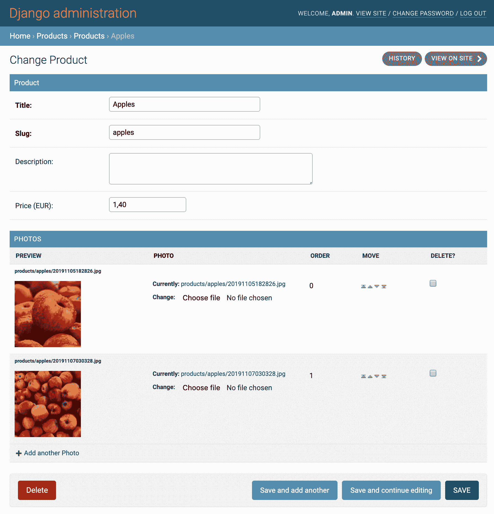

在模型中，我们设置了`order_with_respect_to`属性，以确保对每个产品进行排序，而不仅仅是对产品照片的整个列表进行排序。

在 Django 管理中，产品照片可以通过将产品详细信息本身作为表格内联来进行编辑。在第一列中，我们有一个照片预览。我们使用与之前配方中使用的相同的`photo-preview.html`模板来生成它。在第二列中，有一个用于更改照片的字段。然后，有一个用于 ORDER 字段的列，旁边是一个带有箭头按钮的列，以便我们可以手动重新排序照片。箭头按钮来自`move_up_down_links`方法。最后，有一个带有复选框的列，以便我们可以删除内联。

`readonly_fields`属性告诉 Django，某些字段或方法仅用于阅读。如果要使用另一种方法在更改表单中显示某些内容，必须将这些方法放在`readonly_fields`列表中。在我们的情况下，`get_photo_preview`和`move_up_down_links`就是这样的方法。

`move_up_down_links`在`OrderedTabularInline`中定义，我们正在扩展它而不是`admin.StackedInline`或`admin.TabularInline`。这样可以渲染箭头按钮，使它们在产品照片中交换位置。

# 另请参阅

+   *自定义更改列表页面上的列*食谱

+   *创建管理操作*食谱

+   *开发更改列表过滤器*食谱

# 创建管理操作

Django 管理系统提供了可以为列表中的选定项目执行的操作。默认情况下提供了一个操作，用于删除选定的实例。在这个食谱中，我们将为`Product`模型的列表创建一个额外的操作，允许管理员将选定的产品导出到 Excel 电子表格中。

# 准备工作

我们将从前面的食谱中创建的`products`应用程序开始。确保您的虚拟环境中安装了`openpyxl`模块，以便创建 Excel 电子表格，如下所示：

```py
(env)$ pip install openpyxl
```

# 如何做...

管理操作是带有三个参数的函数，如下所示：

+   当前的`ModelAdmin`值

+   当前的`HttpRequest`值

+   包含所选项目的`QuerySet`值

执行以下步骤创建自定义管理操作以导出电子表格：

1.  在`products`应用程序的`admin.py`文件中为电子表格列配置创建`ColumnConfig`类，如下所示：

```py
# myproject/apps/products/admin.py from openpyxl import Workbook
from openpyxl.styles import Alignment, NamedStyle, builtins
from openpyxl.styles.numbers import FORMAT_NUMBER
from openpyxl.writer.excel import save_virtual_workbook

from django.http.response import HttpResponse
from django.utils.translation import ugettext_lazy as _
from ordered_model.admin import OrderedTabularInline, OrderedInlineModelAdminMixin

# other imports…

class ColumnConfig:
    def __init__(
            self,
            heading,
            width=None,
            heading_style="Headline 1",
            style="Normal Wrapped",
            number_format=None,
         ):
        self.heading = heading
        self.width = width
        self.heading_style = heading_style
        self.style = style
        self.number_format = number_format
```

1.  然后，在同一个文件中，创建`export_xlsx()`函数：

```py
def export_xlsx(modeladmin, request, queryset):
    wb = Workbook()
    ws = wb.active
    ws.title = "Products"

    number_alignment = Alignment(horizontal="right")
    wb.add_named_style(
        NamedStyle(
            "Identifier", alignment=number_alignment, 
             number_format=FORMAT_NUMBER
        )
    )
    wb.add_named_style(
        NamedStyle("Normal Wrapped", 
         alignment=Alignment(wrap_text=True))
    )

    column_config = {
        "A": ColumnConfig("ID", width=10, style="Identifier"),
        "B": ColumnConfig("Title", width=30),
        "C": ColumnConfig("Description", width=60),
        "D": ColumnConfig("Price", width=15, style="Currency", 
             number_format="#,##0.00 €"),
        "E": ColumnConfig("Preview", width=100, style="Hyperlink"),
    }

    # Set up column widths, header values and styles
    for col, conf in column_config.items():
        ws.column_dimensions[col].width = conf.width

        column = ws[f"{col}1"]
        column.value = conf.heading
        column.style = conf.heading_style

    # Add products
    for obj in queryset.order_by("pk"):
        project_photos = obj.productphoto_set.all()[:1]
        url = ""
        if project_photos:
            url = project_photos[0].photo.url

        data = [obj.pk, obj.title, obj.description, obj.price, url]
        ws.append(data)

        row = ws.max_row
        for row_cells in ws.iter_cols(min_row=row, max_row=row):
            for cell in row_cells:
                conf = column_config[cell.column_letter]
                cell.style = conf.style
                if conf.number_format:
                    cell.number_format = conf.number_format

    mimetype = "application/vnd.openxmlformats-
     officedocument.spreadsheetml.sheet"
    charset = "utf-8"
    response = HttpResponse(
        content=save_virtual_workbook(wb),
        content_type=f"{mimetype}; charset={charset}",
        charset=charset,
    )
    response["Content-Disposition"] = "attachment; 
     filename=products.xlsx"
    return response

export_xlsx.short_description = _("Export XLSX")
```

1.  然后，将`actions`设置添加到`ProductAdmin`中，如下所示：

```py
@admin.register(Product)
class ProductAdmin(OrderedInlineModelAdminMixin, admin.ModelAdmin):
    # …
 actions = [export_xlsx]
    # …
```

# 它是如何工作的...

如果您在浏览器中查看产品管理列表页面，您将看到一个名为 Export XLSX 的新操作，以及默认的 Delete selected Products 操作，如下截图所示：

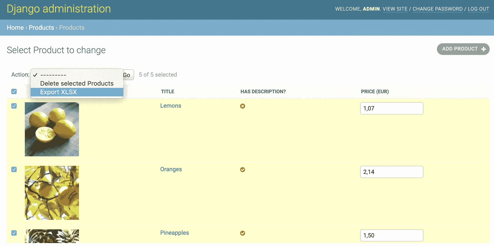

我们使用`openpyxl` Python 模块创建与 Excel 和其他电子表格软件兼容的 OpenOffice XML 文件。

首先创建一个工作簿，并选择活动工作表，为其设置标题为`Products`。因为有一些通用样式，我们希望在整个工作表中使用，所以这些样式被设置为命名样式，这样它们可以按名称应用到每个单元格中。这些样式、列标题和列宽度被存储为`Config`对象，并且`column_config`字典将列字母键映射到对象。然后迭代设置标题和列宽度。

我们使用工作表的`append()`方法为`QuerySet`中的每个选定产品添加内容，按 ID 排序，包括产品的第一张照片的 URL（如果有照片）。然后通过迭代刚添加的行中的每个单元格来单独设置产品数据的样式，再次参考`column_config`以保持样式一致。

默认情况下，管理操作对`QuerySet`执行某些操作，并将管理员重定向回更改列表页面。但是，对于更复杂的操作，可以返回`HttpResponse`。`export_xlsx()`函数将工作簿的虚拟副本保存到`HttpResponse`中，内容类型和字符集适合**Office Open XML**（**OOXML**）电子表格。使用`Content-Disposition`标头，我们设置响应以便可以将其下载为`products.xlsx`文件。生成的工作表可以在 Open Office 中打开，并且看起来类似于以下内容：

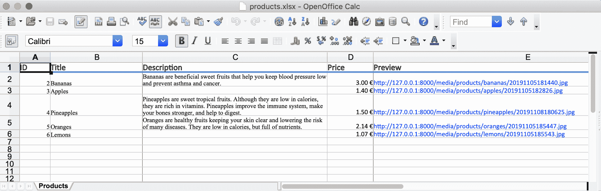

# 另请参阅

+   *自定义更改列表页面上的列*食谱

+   *开发更改列表过滤器*食谱

+   第九章*，导入和导出数据*

# 开发更改列表过滤器

如果您希望管理员能够按日期、关系或字段选择过滤更改列表，您必须使用 admin 模型的`list_filter`属性。此外，还有可能有定制的过滤器。在本教程中，我们将添加一个过滤器，允许我们按附加到产品的照片数量进行选择。

# 准备工作

让我们从我们在之前的教程中创建的`products`应用程序开始。

# 如何做...

执行以下步骤：

1.  在`admin.py`文件中，创建一个`PhotoFilter`类，该类扩展自`SimpleListFilter`，如下所示：

```py
# myproject/apps/products/admin.py
from django.contrib import admin
from django.db import models
from django.utils.translation import ugettext_lazy as _

# other imports…

ZERO = "zero"
ONE = "one"
MANY = "many"

class PhotoFilter(admin.SimpleListFilter):
    # Human-readable title which will be displayed in the
    # right admin sidebar just above the filter options.
    title = _("photos")

    # Parameter for the filter that will be used in the
    # URL query.
    parameter_name = "photos"

    def lookups(self, request, model_admin):
        """
        Returns a list of tuples, akin to the values given for
        model field choices. The first element in each tuple is the
        coded value for the option that will appear in the URL
        query. The second element is the human-readable name for
        the option that will appear in the right sidebar.
        """
        return (
            (ZERO, _("Has no photos")),
            (ONE, _("Has one photo")),
            (MANY, _("Has more than one photo")),
        )

    def queryset(self, request, queryset):
        """
        Returns the filtered queryset based on the value
        provided in the query string and retrievable via
        `self.value()`.
        """
        qs = queryset.annotate(num_photos=
         models.Count("productphoto"))

        if self.value() == ZERO:
            qs = qs.filter(num_photos=0)
        elif self.value() == ONE:
            qs = qs.filter(num_photos=1)
        elif self.value() == MANY:
            qs = qs.filter(num_photos__gte=2)
        return qs
```

1.  然后，在`ProductAdmin`中添加一个列表过滤器，如下所示：

```py
@admin.register(Product)
class ProductAdmin(OrderedInlineModelAdminMixin, admin.ModelAdmin):
    # …
    list_filter = [PhotoFilter]
    # …
```

# 工作原理...

基于我们刚刚创建的自定义字段的列表过滤器将显示在产品列表的侧边栏中，如下所示：

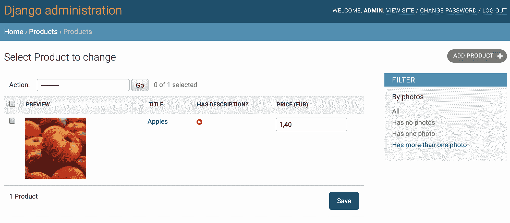

`PhotoFilter`类具有可翻译的标题和查询参数名称作为属性。它还有两种方法，如下所示：

+   `lookups()`方法，定义了过滤器的选择

+   `queryset()`方法，定义了如何在选择特定值时过滤`QuerySet`对象

在`lookups()`方法中，我们定义了三个选择，如下所示：

+   没有照片

+   有一张照片

+   有多张照片附加

在`queryset()`方法中，我们使用`QuerySet`的`annotate()`方法来选择每个产品的照片数量。然后根据所选的选择进行过滤。

要了解有关聚合函数（如`annotate()`）的更多信息，请参阅官方 Django 文档[`docs.djangoproject.com/en/3.0/topics/db/aggregation/`](https://docs.djangoproject.com/en/3.0/topics/db/aggregation/)。

# 另请参阅

+   *自定义更改列表页面上的列*教程

+   *创建管理员操作*教程

+   *创建自定义帐户应用程序*教程

# 更改第三方应用程序的应用程序标签

Django 框架有很多第三方应用程序可以在项目中使用。您可以在[`djangopackages.org/`](https://djangopackages.org/)上浏览和比较大多数应用程序。在本教程中，我们将向您展示如何在管理中重命名`python-social-auth`应用程序的标签。类似地，您可以更改任何 Django 第三方应用程序的标签。

# 准备工作

按照[`python-social-auth.readthedocs.io/en/latest/configuration/django.html`](https://python-social-auth.readthedocs.io/en/latest/configuration/django.html)上的说明将 Python Social Auth 安装到您的项目中。Python Social Auth 允许用户使用社交网络帐户或其 Open ID 登录。完成后，管理页面的索引页面将如下所示：

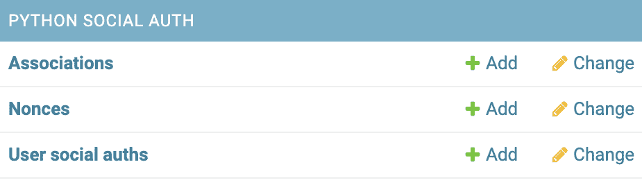

# 如何做...

首先，将 PYTHON SOCIAL AUTH 标签更改为更用户友好的内容，例如 SOCIAL AUTHENTICATION。现在，请按照以下步骤进行操作：

1.  创建一个名为`accounts`的应用程序。在那里的`apps.py`文件中，添加以下内容：

```py
# myproject/apps/accounts/apps.py
from django.apps import AppConfig
from django.utils.translation import ugettext_lazy as _

class AccountsConfig(AppConfig):
    name = "myproject.apps.accounts"
    verbose_name = _("Accounts")

    def ready(self):
        pass

class SocialDjangoConfig(AppConfig):
 name = "social_django"
    verbose_name = _("Social Authentication")
```

1.  设置 Python Social Auth 的一个步骤涉及将`"social_django"`应用添加到`INSTALLED_APPS`中。现在，请将该应用替换为`"myproject.apps.accounts.apps.SocialDjangoConfig"`：

```py
# myproject/settings/_base.py # …
INSTALLED_APPS = [
    # …
    #"social_django",
    "myproject.apps.accounts.apps.SocialDjangoConfig",
    # …
]
```

# 工作原理...

如果您检查管理的索引页面，您将看到类似于以下内容：

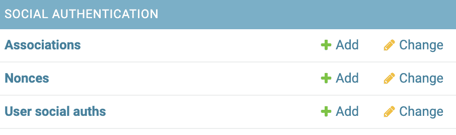

`INSTALLED_APPS`设置接受应用程序的路径或应用程序配置的路径。我们可以传递应用程序配置而不是默认的应用程序路径。在那里，我们更改应用程序的显示名称，甚至可以应用一些信号处理程序或对应用程序进行一些其他初始设置。

# 另请参阅

+   *创建自定义帐户应用程序*教程

+   *获取用户 Gravatars*教程

# 创建自定义帐户应用程序

Django 自带了一个用于身份验证的`django.contrib.auth`应用程序。它允许用户使用他们的用户名和密码登录以使用管理功能，例如。这个应用程序被设计成可以通过您自己的功能进行扩展。在这个示例中，我们将创建自定义用户和角色模型，并为它们设置管理。您将能够通过电子邮件和密码而不是用户名和密码进行登录。

# 准备工作

创建一个`accounts`应用程序，并将该应用程序放在设置的`INSTALLED_APPS`下：

```py
# myproject/apps/_base.py
INSTALLED_APPS = [
   # …
   "myproject.apps.accounts",
]
```

# 如何做...

按照以下步骤覆盖用户和组模型：

1.  在`accounts`应用程序中创建`models.py`，内容如下：

```py
# myproject/apps/accounts/models.py import uuid

from django.contrib.auth.base_user import BaseUserManager
from django.db import models
from django.contrib.auth.models import AbstractUser, Group
from django.utils.translation import ugettext_lazy as _

class Role(Group):
    class Meta:
        proxy = True
        verbose_name = _("Role")
        verbose_name_plural = _("Roles")

    def __str__(self):
        return self.name

class UserManager(BaseUserManager):
    def create_user(self, username="", email="", password="", 
     **extra_fields):
        if not email:
            raise ValueError("Enter an email address")
        email = self.normalize_email(email)
        user = self.model(username=username, email=email, 
         **extra_fields)
        user.set_password(password)
        user.save(using=self._db)
        return user

    def create_superuser(self, username="", email="", password=""):
        user = self.create_user(email=email, password=password, 
         username=username)
        user.is_superuser = True
        user.is_staff = True
        user.save(using=self._db)
        return user

class User(AbstractUser):
    uuid = models.UUIDField(primary_key=True, default=None, 
     editable=False)
    # change username to non-editable non-required field
    username = models.CharField(
        _("username"), max_length=150, editable=False, blank=True
    )
    # change email to unique and required field
    email = models.EmailField(_("email address"), unique=True)

    USERNAME_FIELD = "email"
    REQUIRED_FIELDS = []

    objects = UserManager()

    def save(self, *args, **kwargs):
        if self.pk is None:
            self.pk = uuid.uuid4()
        super().save(*args, **kwargs)
```

1.  在`accounts`应用程序中创建`admin.py`文件，其中包含`User`模型的管理配置：

```py
# myproject/apps/accounts/admin.py
from django.contrib import admin
from django.contrib.auth.admin import UserAdmin, Group, GroupAdmin
from django.urls import reverse
from django.contrib.contenttypes.models import ContentType
from django.http import HttpResponse
from django.shortcuts import get_object_or_404, redirect
from django.utils.encoding import force_bytes
from django.utils.safestring import mark_safe
from django.utils.translation import ugettext_lazy as _
from django.contrib.auth.forms import UserCreationForm

from .helpers import download_avatar
from .models import User, Role

class MyUserCreationForm(UserCreationForm):
    def save(self, commit=True):
        user = super().save(commit=False)
        user.username = user.email
        user.set_password(self.cleaned_data["password1"])
        if commit:
            user.save()
        return user

@admin.register(User)
class MyUserAdmin(UserAdmin):
    save_on_top = True
    list_display = [
        "get_full_name",
        "is_active",
        "is_staff",
        "is_superuser",
    ]
    list_display_links = [
        "get_full_name",
    ]
    search_fields = ["email", "first_name", "last_name", "id", 
     "username"]
    ordering = ["-is_superuser", "-is_staff", "last_name", 
     "first_name"]

    fieldsets = [
        (None, {"fields": ("email", "password")}),
        (_("Personal info"), {"fields": ("first_name", 
         "last_name")}),
        (
            _("Permissions"),
            {
                "fields": (
                    "is_active",
                    "is_staff",
                    "is_superuser",
                    "groups",
                    "user_permissions",
                )
            },
        ),
        (_("Important dates"), {"fields": ("last_login", 
         "date_joined")}),
    ]
    add_fieldsets = (
        (None, {"classes": ("wide",), "fields": ("email", 
         "password1", "password2")}),
    )
    add_form = MyUserCreationForm

    def get_full_name(self, obj):
        return obj.get_full_name()

    get_full_name.short_description = _("Full name")

```

1.  在同一文件中，为`Role`模型添加配置：

```py
admin.site.unregister(Group)

@admin.register(Role)
class MyRoleAdmin(GroupAdmin):
    list_display = ("__str__", "display_users")
    save_on_top = True

    def display_users(self, obj):
        links = []
        for user in obj.user_set.all():
            ct = ContentType.objects.get_for_model(user)
            url = reverse(
                "admin:{}_{}_change".format(ct.app_label, 
                  ct.model), args=(user.pk,)
            )
            links.append(
                """<a href="{}" target="_blank">{}</a>""".format(
                    url,
                    user.get_full_name() or user.username,
                )
            )
        return mark_safe(u"<br />".join(links))

    display_users.short_description = _("Users")
```

# 工作原理...

默认的用户管理列表看起来类似于以下屏幕截图：

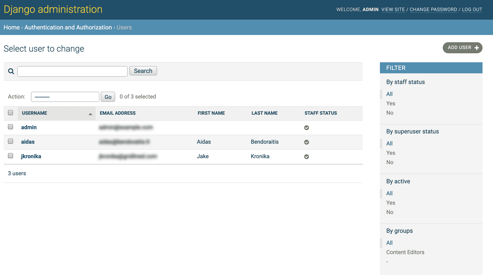

默认的组管理列表看起来类似于以下屏幕截图：

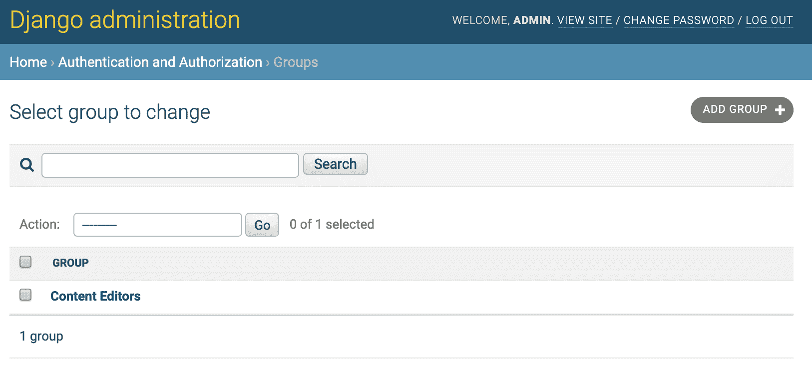

在这个示例中，我们创建了两个模型：

+   `Role`模型是`django.contrib.auth`应用程序中`Group`模型的代理。`Role`模型被创建来将`Group`的显示名称重命名为`Role`。

+   `User`模型，它扩展了与`django.contrib.auth`中的`User`模型相同的抽象`AbstractUser`类。`User`模型被创建来用`UUIDField`替换主键，并允许我们通过电子邮件和密码而不是用户名和密码进行登录。

管理类`MyUserAdmin`和`MyRoleAdmin`扩展了贡献的`UserAdmin`和`GroupAdmin`类，并覆盖了一些属性。然后，我们取消注册了现有的`User`和`Group`模型的管理类，并注册了新的修改后的管理类。

以下屏幕截图显示了用户管理的外观：

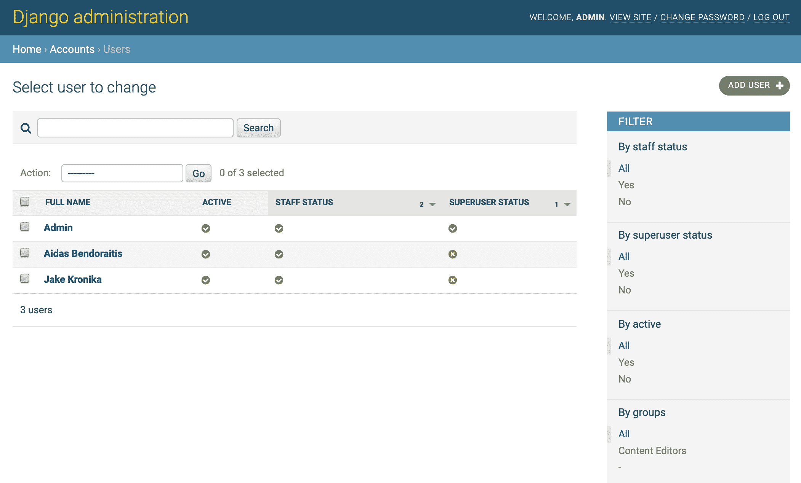

修改后的用户管理设置在列表视图中显示了更多字段，还有额外的过滤和排序选项，并在编辑表单顶部有提交按钮。

在新的组管理设置的更改列表中，我们将显示那些已被分配到特定组的用户。在浏览器中，这将类似于以下屏幕截图：

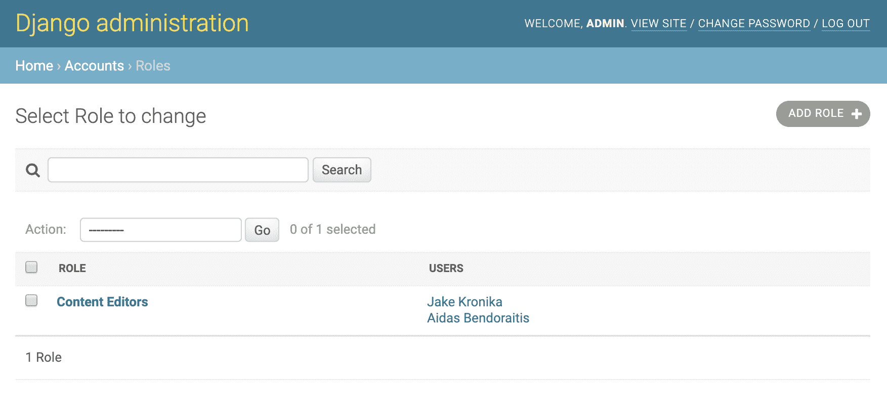

# 另请参阅

+   *自定义更改列表页面上的列*示例

+   *在更改表单中插入地图*示例

# 获取用户 Gravatars

现在我们已经开始使用自定义的`User`模型进行身份验证，我们可以通过添加更多有用的字段来进一步增强它。在这个示例中，我们将添加一个`avatar`字段，并且可以从 Gravatar 服务（[`en.gravatar.com/`](https://en.gravatar.com/)）下载用户的头像。该服务的用户可以上传头像并将其分配给他们的电子邮件。通过这样做，不同的评论系统和社交平台将能够根据用户电子邮件的哈希值从 Gravatar 显示这些头像。

# 准备工作

让我们继续使用之前创建的`accounts`应用程序。

# 如何做...

按照以下步骤增强`accounts`应用程序中的`User`模型：

1.  为`User`模型添加`avatar`字段和`django-imagekit`缩略图规范：

```py
# myproject/apps/accounts/models.py import os

from imagekit.models import ImageSpecField
from pilkit.processors import ResizeToFill
from django.utils import timezone

# …

def upload_to(instance, filename):
 now = timezone.now()
 filename_base, filename_ext = os.path.splitext(filename)
 return "users/{user_id}/{filename}{ext}".format(
 user_id=instance.pk,
 filename=now.strftime("%Y%m%d%H%M%S"),
 ext=filename_ext.lower(),
 )

class User(AbstractUser):
    # …

 avatar = models.ImageField(_("Avatar"), upload_to=upload_to, 
     blank=True)
 avatar_thumbnail = ImageSpecField(
 source="avatar",
 processors=[ResizeToFill(60, 60)],
 format="JPEG",
 options={"quality": 100},
 )

    # …
```

1.  添加一些方法以便在`MyUserAdmin`类中下载和显示 Gravatar：

```py
# myprojects/apps/accounts/admin.py from django.contrib import admin
from django.contrib.auth.admin import UserAdmin, Group, GroupAdmin
from django.urls import reverse
from django.contrib.contenttypes.models import ContentType
from django.http import HttpResponse
from django.shortcuts import get_object_or_404
from django.utils.encoding import force_bytes
from django.utils.safestring import mark_safe
from django.utils.translation import ugettext_lazy as _
from django.contrib.auth.forms import UserCreationForm

from .helpers import download_avatar
from .models import User, Role

class MyUserCreationForm(UserCreationForm):
    def save(self, commit=True):
        user = super().save(commit=False)
        user.username = user.email
        user.set_password(self.cleaned_data["password1"])
        if commit:
            user.save()
        return user

@admin.register(User)
class MyUserAdmin(UserAdmin):
    save_on_top = True
    list_display = [
        "get_avatar",
        "get_full_name",
        "download_gravatar",
        "is_active",
        "is_staff",
        "is_superuser",
    ]
    list_display_links = [
        "get_avatar",
        "get_full_name",
    ]
    search_fields = ["email", "first_name", "last_name", "id", 
     "username"]
    ordering = ["-is_superuser", "-is_staff", "last_name", 
     "first_name"]

    fieldsets = [
        (None, {"fields": ("email", "password")}),
        (_("Personal info"), {"fields": ("first_name", 
         "last_name")}),
        (
            _("Permissions"),
            {
                "fields": (
                    "is_active",
                    "is_staff",
                    "is_superuser",
                    "groups",
                    "user_permissions",
                )
            },
        ),
 (_("Avatar"), {"fields": ("avatar",)}),
        (_("Important dates"), {"fields": ("last_login", 
         "date_joined")}),
    ]
    add_fieldsets = (
        (None, {"classes": ("wide",), "fields": ("email", 
         "password1", "password2")}),
    )
    add_form = MyUserCreationForm

    def get_full_name(self, obj):
        return obj.get_full_name()

    get_full_name.short_description = _("Full name")

    def get_avatar(self, obj):
        from django.template.loader import render_to_string
        html = render_to_string("admin/accounts
         /includes/avatar.html", context={
            "obj": obj
        })
        return mark_safe(html)

    get_avatar.short_description = _("Avatar")

    def download_gravatar(self, obj):
        from django.template.loader import render_to_string
        info = self.model._meta.app_label, 
         self.model._meta.model_name
        gravatar_url = reverse("admin:%s_%s_download_gravatar" % 
         info, args=[obj.pk])
        html = render_to_string("admin/accounts
         /includes/download_gravatar.html", context={
            "url": gravatar_url
        })
        return mark_safe(html)

    download_gravatar.short_description = _("Gravatar")

    def get_urls(self):
        from functools import update_wrapper
        from django.conf.urls import url

        def wrap(view):
            def wrapper(*args, **kwargs):
                return self.admin_site.admin_view(view)(*args, 
                 **kwargs)

            wrapper.model_admin = self
            return update_wrapper(wrapper, view)

        info = self.model._meta.app_label, 
         self.model._meta.model_name

        urlpatterns = [
            url(
                r"^(.+)/download-gravatar/$",
                wrap(self.download_gravatar_view),
                name="%s_%s_download_gravatar" % info,
            )
        ] + super().get_urls()

        return urlpatterns

    def download_gravatar_view(self, request, object_id):
        if request.method != "POST":
            return HttpResponse(
                "{} method not allowed.".format(request.method), 
                 status=405
            )
        from .models import User

        user = get_object_or_404(User, pk=object_id)
        import hashlib

        m = hashlib.md5()
        m.update(force_bytes(user.email))
        md5_hash = m.hexdigest()
        # d=404 ensures that 404 error is raised if gravatar is not 
        # found instead of returning default placeholder
        url = "https://www.gravatar.com/avatar
         /{md5_hash}?s=800&d=404".format(
            md5_hash=md5_hash
        )
        download_avatar(object_id, url)
        return HttpResponse("Gravatar downloaded.", status=200)
```

1.  在`accounts`应用程序中添加一个`helpers.py`文件，内容如下：

```py
# myproject/apps/accounts/helpers.py 
def download_avatar(user_id, image_url):
    import tempfile
    import requests
    from django.contrib.auth import get_user_model
    from django.core.files import File

    response = requests.get(image_url, allow_redirects=True, 
     stream=True)
    user = get_user_model().objects.get(pk=user_id)

    if user.avatar:  # delete the old avatar
        user.avatar.delete()

    if response.status_code != requests.codes.ok:
        user.save()
        return

    file_name = image_url.split("/")[-1]

    image_file = tempfile.NamedTemporaryFile()

    # Read the streamed image in sections
    for block in response.iter_content(1024 * 8):
        # If no more file then stop
        if not block:
            break
        # Write image block to temporary file
        image_file.write(block)

    user.avatar.save(file_name, File(image_file))
    user.save()
```

1.  为管理文件中的头像创建一个模板：

```py
{# admin/accounts/includes/avatar.html #}

    

```

1.  为下载`Gravatar`的`button`创建一个模板：

```py
{# admin/accounts/includes/download_gravatar.html #}

<button type="button" data-url="{{ url }}" class="button js_download_gravatar download-gravatar">
    
</button>
```

1.  最后，为用户更改列表管理创建一个模板，其中包含处理鼠标点击`Get Gravatar`按钮的 JavaScript：

```py
{# admin/accounts/user/change_list.html #}




{{ block.super }}
<style nonce="{{ request.csp_nonce }}">
.button.download-gravatar {
    padding: 2px 10px;
}
</style>
<script nonce="{{ request.csp_nonce }}">
django.jQuery(function($) {
    $('.js_download_gravatar').on('click', function(e) {
        e.preventDefault();
        $.ajax({
            url: $(this).data('url'),
            cache: 'false',
            dataType: 'json',
            type: 'POST',
            data: {},
            beforeSend: function(xhr) {
                xhr.setRequestHeader('X-CSRFToken', 
                 '{{ csrf_token }}');
            }
        }).then(function(data) {
            console.log('Gravatar downloaded.');
            document.location.reload(true);
        }, function(data) {
            console.log('There were problems downloading the 
             Gravatar.');
            document.location.reload(true);
        });
    })
})

</script>

```

# 工作原理...

如果您现在查看用户更改列表管理，您将看到类似于以下内容：

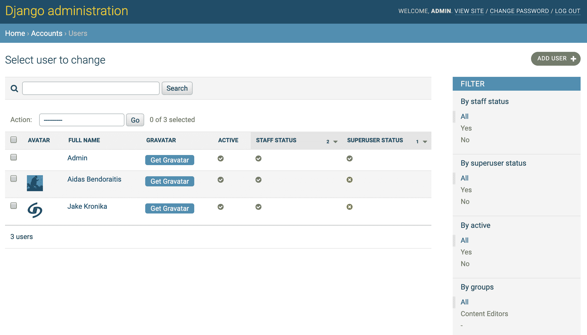

列从用户的 AVATAR 开始，然后是 FULL NAME，然后是一个获取 Gravatar 的按钮。当用户点击获取 Gravatar 按钮时，JavaScript 的`onclick`事件处理程序会向`download_gravatar_view`发出`POST`请求。此视图将为用户的 Gravatar 创建一个 URL，该 URL 依赖于用户电子邮件的 MD5 哈希，然后调用一个帮助函数为用户下载图像，并将其链接到`avatar`字段。

# 还有更多...

Gravatar 图像相当小，下载速度相对较快。如果您从其他服务下载更大的图像，可以使用 Celery 或 Huey 任务队列在后台检索图像。您可以在[`docs.celeryproject.org/en/latest/django/first-steps-with-django.html`](https://docs.celeryproject.org/en/latest/django/first-steps-with-django.html)了解有关 Celery 的信息，并在[`huey.readthedocs.io/en/0.4.9/django.html`](https://huey.readthedocs.io/en/0.4.9/django.html)了解有关 Huey 的信息。

# 另请参阅

+   *更改第三方应用程序的应用标签*示例

+   *创建自定义帐户应用程序*示例

# 在更改表单中插入地图

Google Maps 提供了一个 JavaScript API，我们可以使用它将地图插入到我们的网站中。在这个示例中，我们将创建一个带有`Location`模型的`locations`应用程序，并扩展更改表单的模板，以便管理员可以找到并标记位置的地理坐标。

# 准备工作

注册一个 Google Maps API 密钥，并将其暴露给模板，就像我们在第四章*模板和 JavaScript*中的*使用 HTML5 数据属性*示例中所做的那样。请注意，对于此示例，在 Google Cloud Platform 控制台中，您需要激活地图 JavaScript API 和地理编码 API。为了使这些 API 正常工作，您还需要设置计费数据。

我们将继续创建一个`locations`应用程序：

1.  将应用程序放在设置中的`INSTALLED_APPS`下：

```py
# myproject/settings/_base.py
INSTALLED_APPS = [
    # …
    "myproject.apps.locations",
]
```

1.  在那里创建一个`Location`模型，包括名称、描述、地址、地理坐标和图片，如下所示：

```py
# myproject/apps/locations/models.py
import os
import uuid
from collections import namedtuple

from django.contrib.gis.db import models
from django.urls import reverse
from django.conf import settings
from django.utils.translation import gettext_lazy as _
from django.utils.timezone import now as timezone_now

from myproject.apps.core.models import CreationModificationDateBase, UrlBase

COUNTRY_CHOICES = getattr(settings, "COUNTRY_CHOICES", [])

Geoposition = namedtuple("Geoposition", ["longitude", "latitude"])

def upload_to(instance, filename):
    now = timezone_now()
    base, extension = os.path.splitext(filename)
    extension = extension.lower()
    return f"locations/{now:%Y/%m}/{instance.pk}{extension}"

class Location(CreationModificationDateBase, UrlBase):
    uuid = models.UUIDField(primary_key=True, default=None, 
     editable=False)
    name = models.CharField(_("Name"), max_length=200)
    description = models.TextField(_("Description"))
    street_address = models.CharField(_("Street address"), 
     max_length=255, blank=True)
    street_address2 = models.CharField(
        _("Street address (2nd line)"), max_length=255, blank=True
    )
    postal_code = models.CharField(_("Postal code"), 
     max_length=255, blank=True)
    city = models.CharField(_("City"), max_length=255, blank=True)
    country = models.CharField(
        _("Country"), choices=COUNTRY_CHOICES, max_length=255, 
         blank=True
    )
    geoposition = models.PointField(blank=True, null=True)
    picture = models.ImageField(_("Picture"), upload_to=upload_to)

    class Meta:
        verbose_name = _("Location")
        verbose_name_plural = _("Locations")

    def __str__(self):
        return self.name

    def get_url_path(self):
        return reverse("locations:location_detail", 
         kwargs={"pk": self.pk})

    def save(self, *args, **kwargs):
        if self.pk is None:
            self.pk = uuid.uuid4()
        super().save(*args, **kwargs)

    def delete(self, *args, **kwargs):
        if self.picture:
            self.picture.delete()
        super().delete(*args, **kwargs)

    def get_geoposition(self):
        if not self.geoposition:
            return None
        return Geoposition(self.geoposition.coords[0], 
         self.geoposition.coords[1])

    def set_geoposition(self, longitude, latitude):
        from django.contrib.gis.geos import Point
        self.geoposition = Point(longitude, latitude, srid=4326)
```

1.  接下来，我们需要为我们的 PostgreSQL 数据库安装 PostGIS 扩展。最简单的方法是运行`dbshell`管理命令，并执行以下命令：

```py
> CREATE EXTENSION postgis;
```

1.  现在，使用地理位置模型创建默认管理（我们将在*如何做...*部分中更改这一点）：

```py
# myproject/apps/locations/admin.py
from django.contrib.gis import admin
from .models import Location

@admin.register(Location)
class LocationAdmin(admin.OSMGeoAdmin):
    pass
```

来自`gis`模块的地理`Point`字段的默认 Django 管理使用`Leaflet.js` JavaScript 映射库。瓷砖来自 Open Street Maps，管理将如下所示：

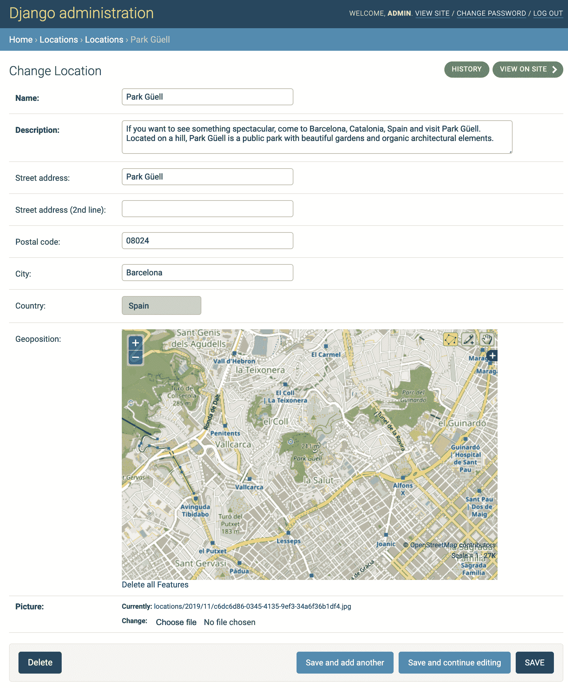

请注意，在默认设置中，您无法手动输入经度和纬度，也无法从地址信息中获取地理位置的可能性。我们将在此示例中实现这一点。

# 如何做...

`Location`模型的管理将从多个文件中组合而成。执行以下步骤来创建它：

1.  让我们为`Location`模型创建管理配置。请注意，我们还创建了一个自定义模型表单，以创建单独的`latitude`和`longitude`字段：

```py
# myproject/apps/locations/admin.py from django.contrib import admin
from django import forms
from django.conf import settings
from django.template.loader import render_to_string
from django.utils.translation import ugettext_lazy as _

from .models import Location

LATITUDE_DEFINITION = _(
    "Latitude (Lat.) is the angle between any point and the "
    "equator (north pole is at 90°; south pole is at -90°)."
)

LONGITUDE_DEFINITION = _(
    "Longitude (Long.) is the angle east or west of a point "
    "on Earth at Greenwich (UK), which is the international "
    "zero-longitude point (longitude = 0°). The anti-meridian "
    "of Greenwich (the opposite side of the planet) is both "
    "180° (to the east) and -180° (to the west)."
)

class LocationModelForm(forms.ModelForm):
    latitude = forms.FloatField(
        label=_("Latitude"), required=False, help_text=LATITUDE_DEFINITION
    )
    longitude = forms.FloatField(
        label=_("Longitude"), required=False, help_text=LONGITUDE_DEFINITION
    )

    class Meta:
        model = Location
        exclude = ["geoposition"]

    def __init__(self, *args, **kwargs):
        super().__init__(*args, **kwargs)
        if self.instance:
            geoposition = self.instance.get_geoposition()
            if geoposition:
                self.fields["latitude"].initial = 
               geoposition.latitude
                self.fields["longitude"].initial = 
               geoposition.longitude

    def save(self, commit=True):
        cleaned_data = self.cleaned_data
        instance = super().save(commit=False)
        instance.set_geoposition(
            longitude=cleaned_data["longitude"],
            latitude=cleaned_data["latitude"],
        )
        if commit:
            instance.save()
            self.save_m2m()
        return instance

@admin.register(Location)
class LocationAdmin(admin.ModelAdmin):
    form = LocationModelForm
    save_on_top = True
    list_display = ("name", "street_address", "description")
    search_fields = ("name", "street_address", "description")

    def get_fieldsets(self, request, obj=None):
        map_html = render_to_string(
            "admin/locations/includes/map.html",
            {"MAPS_API_KEY": settings.GOOGLE_MAPS_API_KEY},
        )
        fieldsets = [
            (_("Main Data"), {"fields": ("name", "description")}),
            (
                _("Address"),
                {
                    "fields": (
                        "street_address",
                        "street_address2",
                        "postal_code",
                        "city",
                        "country",
                        "latitude",
 "longitude",
                    )
                },
            ),
            (_("Map"), {"description": map_html, "fields": []}),
            (_("Image"), {"fields": ("picture",)}),
        ]
        return fieldsets
```

1.  要创建自定义更改表单模板，请在`admin/locations/location/`下的模板目录中添加一个新的`change_form.html`文件。此模板将扩展默认的`admin/change_form.html`模板，并将覆盖`extrastyle`和`field_sets`块，如下所示：

```py
{# admin/locations/location/change_form.html #} 



    {{ block.super }}
    <link rel="stylesheet" type="text/css"
          href="" />



    
        
    
    <script src="img/>     %}"></script>

```

1.  然后，我们必须为将插入到`Map`字段集中的地图创建模板，如下所示：

```py
{# admin/locations/includes/map.html #} 
<div class="form-row map js_map">
    <div class="canvas">
        <!-- THE GMAPS WILL BE INSERTED HERE DYNAMICALLY -->
    </div>
    <ul class="locations js_locations"></ul>
    <div class="btn-group">
        <button type="button"
                class="btn btn-default locate-address  
                 js_locate_address">
            
        </button>
        <button type="button"
                class="btn btn-default remove-geo js_remove_geo">
            
        </button>
    </div>
</div>
<script src="img/js?key={{ MAPS_API_KEY }}"></script>
```

1.  当然，默认情况下地图不会被自动设置样式。因此，我们需要添加一些 CSS，如下所示：

```py
/* site_static/site/css/location_map.css */ .map {
    box-sizing: border-box;
    width: 98%;
}
.map .canvas,
.map ul.locations,
.map .btn-group {
    margin: 1rem 0;
}
.map .canvas {
    border: 1px solid #000;
    box-sizing: padding-box;
    height: 0;
    padding-bottom: calc(9 / 16 * 100%); /* 16:9 aspect ratio */
    width: 100%;
}
.map .canvas:before {
    color: #eee;
    color: rgba(0, 0, 0, 0.1);
    content: "map";
    display: block;
    font-size: 5rem;
    line-height: 5rem;
    margin-top: -25%;
    padding-top: calc(50% - 2.5rem);
    text-align: center;
}
.map ul.locations {
    padding: 0;
}
.map ul.locations li {
    border-bottom: 1px solid #ccc;
    list-style: none;
}
.map ul.locations li:first-child {
    border-top: 1px solid #ccc;
}
.map .btn-group .btn.remove-geo {
    float: right;
}
```

1.  接下来，让我们创建一个`location_change_form.js`的 JavaScript 文件。我们不想用全局变量来污染环境。因此，我们将从闭包开始，以便为变量和函数创建一个私有作用域。

在这个文件中，我们将使用 jQuery（因为 jQuery 随着贡献的管理系统而来，使得这变得简单且跨浏览器），如下所示：

```py
/* site_static/site/js/location_change_form.js */
(function ($, undefined) {
    var gettext = window.gettext || function (val) {
        return val;
    };
    var $map, $foundLocations, $lat, $lng, $street, $street2,
        $city, $country, $postalCode, gMap, gMarker;
    // …this is where all the further JavaScript functions go…
}(django.jQuery));
```

1.  我们将逐一创建 JavaScript 函数并将它们添加到`location_change_form.js`中。`getAddress4search()`函数将从地址字段中收集地址字符串，以便稍后用于地理编码，如下所示：

```py
function getAddress4search() {
    var sStreetAddress2 = $street2.val();
    if (sStreetAddress2) {
        sStreetAddress2 = " " + sStreetAddress2;
    }

    return [
        $street.val() + sStreetAddress2,
        $city.val(),
        $country.val(),
        $postalCode.val()
    ].join(", ");
}
```

1.  `updateMarker()`函数将接受`latitude`和`longitude`参数，并在地图上绘制或移动标记。它还会使标记可拖动，如下所示：

```py
function updateMarker(lat, lng) {
    var point = new google.maps.LatLng(lat, lng);

    if (!gMarker) {
        gMarker = new google.maps.Marker({
            position: point,
            map: gMap
        });
    }

    gMarker.setPosition(point);
    gMap.panTo(point, 15);
    gMarker.setDraggable(true);

    google.maps.event.addListener(gMarker, "dragend",
        function() {
            var point = gMarker.getPosition();
            updateLatitudeAndLongitude(point.lat(), point.lng());
        }
    );
}
```

1.  `updateLatitudeAndLongitude()`函数，如前面的 dragend 事件监听器中所引用的，接受`latitude`和`longitude`参数，并更新具有`id_latitude`和`id_longitude` ID 的字段的值，如下所示：

```py
function updateLatitudeAndLongitude(lat, lng) {
    var precision = 1000000;
    $lat.val(Math.round(lat * precision) / precision);
    $lng.val(Math.round(lng * precision) / precision);
}
```

1.  `autocompleteAddress()`函数从 Google Maps 地理编码中获取结果，并在地图下方列出这些结果，以便选择正确的结果。如果只有一个结果，它将更新地理位置和地址字段，如下所示：

```py
function autocompleteAddress(results) {
    var $item = $('<li/>');
    var $link = $('<a href="#"/>');

    $foundLocations.html("");
    results = results || [];

    if (results.length) {
        results.forEach(function (result, i) {
            $link.clone()
                 .html(result.formatted_address)
                 .click(function (event) {
                     event.preventDefault();
                     updateAddressFields(result
                      .address_components);

                     var point = result.geometry.location;
                     updateLatitudeAndLongitude(
                         point.lat(), point.lng());
                     updateMarker(point.lat(), point.lng());
                     $foundLocations.hide();
                 })
                 .appendTo($item.clone()
                  .appendTo($foundLocations));
        });
        $link.clone()
             .html(gettext("None of the above"))
             .click(function(event) {
                 event.preventDefault();
                 $foundLocations.hide();
             })
             .appendTo($item.clone().appendTo($foundLocations));
        $foundLocations.show();
    } else {
        $foundLocations.hide();
    }
}
```

1.  `updateAddressFields()`函数接受一个嵌套字典，其中包含地址组件作为参数，并填写所有地址字段，如下所示：

```py
function updateAddressFields(addressComponents) {
    var streetName, streetNumber;
    var typeActions = {
        "locality": function(obj) {
            $city.val(obj.long_name);
        },
        "street_number": function(obj) {
            streetNumber = obj.long_name;
        },
        "route": function(obj) {
            streetName = obj.long_name;
        },
        "postal_code": function(obj) {
            $postalCode.val(obj.long_name);
        },
        "country": function(obj) {
            $country.val(obj.short_name);
        }
    };

    addressComponents.forEach(function(component) {
        var action = typeActions[component.types[0]];
        if (typeof action === "function") {
            action(component);
        }
    });

    if (streetName) {
        var streetAddress = streetName;
        if (streetNumber) {
            streetAddress += " " + streetNumber;
        }
        $street.val(streetAddress);
    }
}
```

1.  最后，我们有初始化函数，在页面加载时调用。它将为按钮附加`onclick`事件处理程序，创建一个 Google 地图，并最初标记在`latitude`和`longitude`字段中定义的地理位置，如下所示：

```py
$(function(){
    $map = $(".map");

    $foundLocations = $map.find("ul.js_locations").hide();
    $lat = $("#id_latitude");
    $lng = $("#id_longitude");
    $street = $("#id_street_address");
    $street2 = $("#id_street_address2");
    $city = $("#id_city");
    $country = $("#id_country");
    $postalCode = $("#id_postal_code");

    $map.find("button.js_locate_address")
        .click(function(event) {
            var geocoder = new google.maps.Geocoder();
            geocoder.geocode(
                {address: getAddress4search()},
                function (results, status) {
                    if (status === google.maps.GeocoderStatus.OK) {
                        autocompleteAddress(results);
                    } else {
                        autocompleteAddress(false);
                    }
                }
            );
        });

    $map.find("button.js_remove_geo")
        .click(function() {
            $lat.val("");
            $lng.val("");
            gMarker.setMap(null);
            gMarker = null;
        });

    gMap = new google.maps.Map($map.find(".canvas").get(0), {
        scrollwheel: false,
        zoom: 16,
        center: new google.maps.LatLng(51.511214, -0.119824),
        disableDoubleClickZoom: true
    });

    google.maps.event.addListener(gMap, "dblclick", function(event) 
    {
        var lat = event.latLng.lat();
        var lng = event.latLng.lng();
        updateLatitudeAndLongitude(lat, lng);
        updateMarker(lat, lng);
    });

    if ($lat.val() && $lng.val()) {
        updateMarker($lat.val(), $lng.val());
    }
});
```

# 工作原理...

如果您在浏览器中查看更改位置表单，您将看到一个地图显示在一个字段集中，后面是包含地址字段的字段集，如下截图所示：

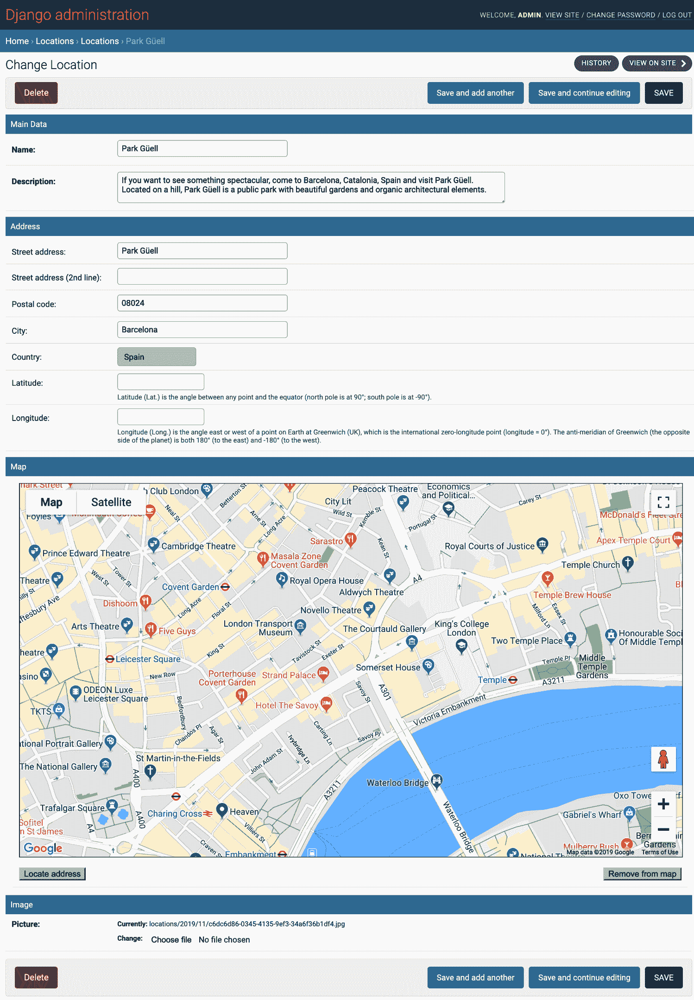

在地图下方有两个按钮：定位地址和从地图中删除。

当您单击“定位地址”按钮时，将调用地理编码以搜索输入地址的地理坐标。执行地理编码的结果是以嵌套字典格式列出的一个或多个地址。我们将把地址表示为可点击链接的列表，如下所示：

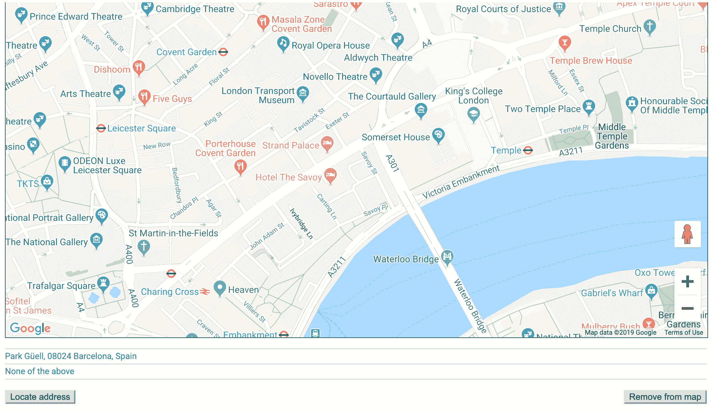

要在开发者工具的控制台中查看嵌套字典的结构，请在`autocompleteAddress()`函数的开头放置以下行：

```py
console.log(JSON.stringify(results, null, 4));
```

当您点击其中一个选择时，地图上会出现标记，显示位置的确切地理位置。纬度和经度字段将填写如下：

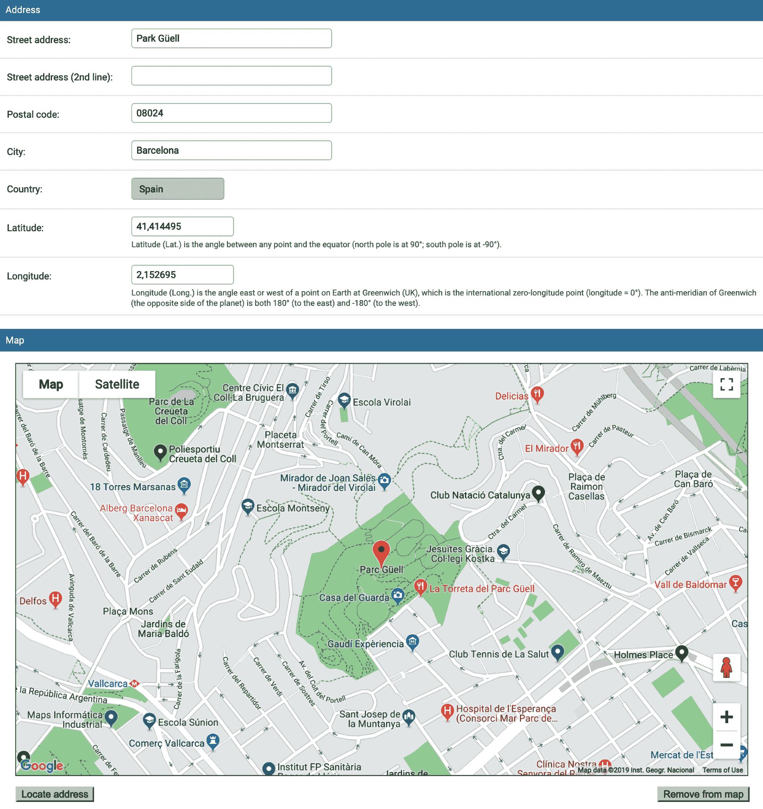

然后，管理员可以通过拖放在地图上移动标记。此外，双击地图上的任何位置将更新地理坐标和标记位置。

最后，如果单击“从地图中删除”按钮，则地理坐标将被清除，并且标记将被移除。

管理使用自定义的`LocationModelForm`，其中排除了`geoposition`字段，添加了`Latitude`和`Longitude`字段，并处理它们的值的保存和加载。

# 另请参阅

+   第四章*，模板和 JavaScript*
