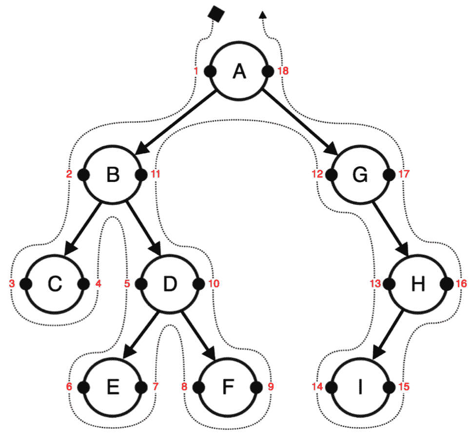
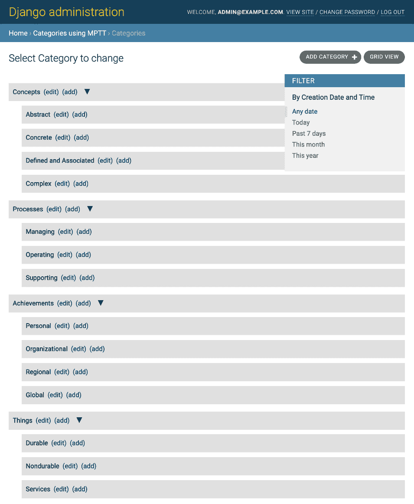
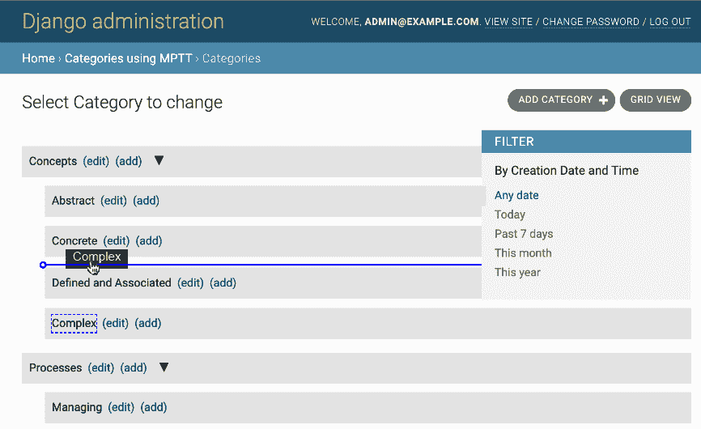
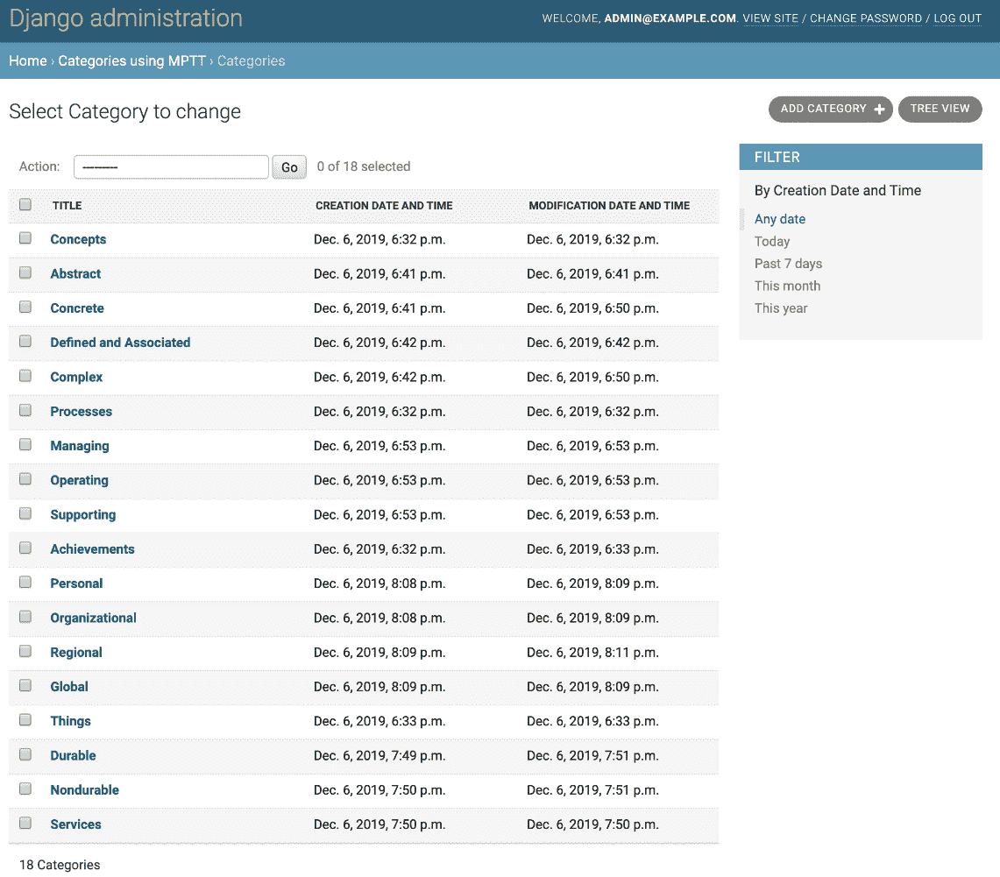
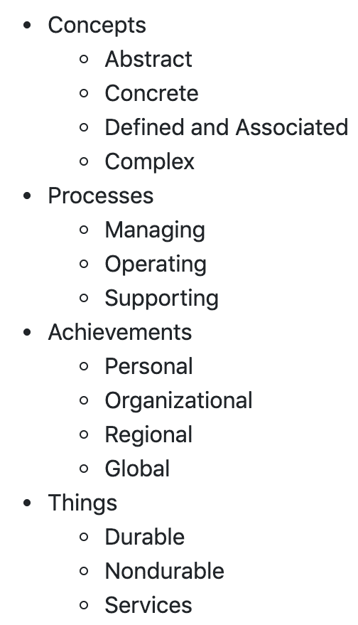
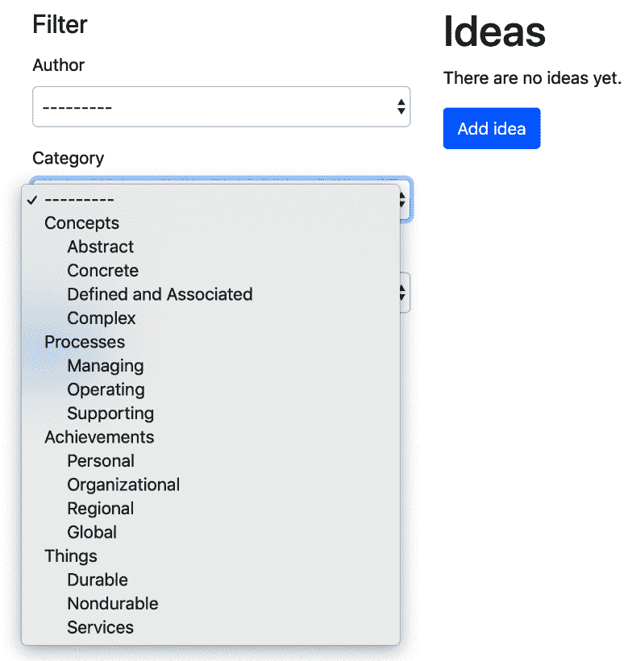
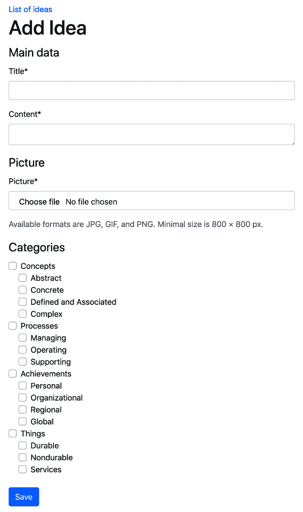
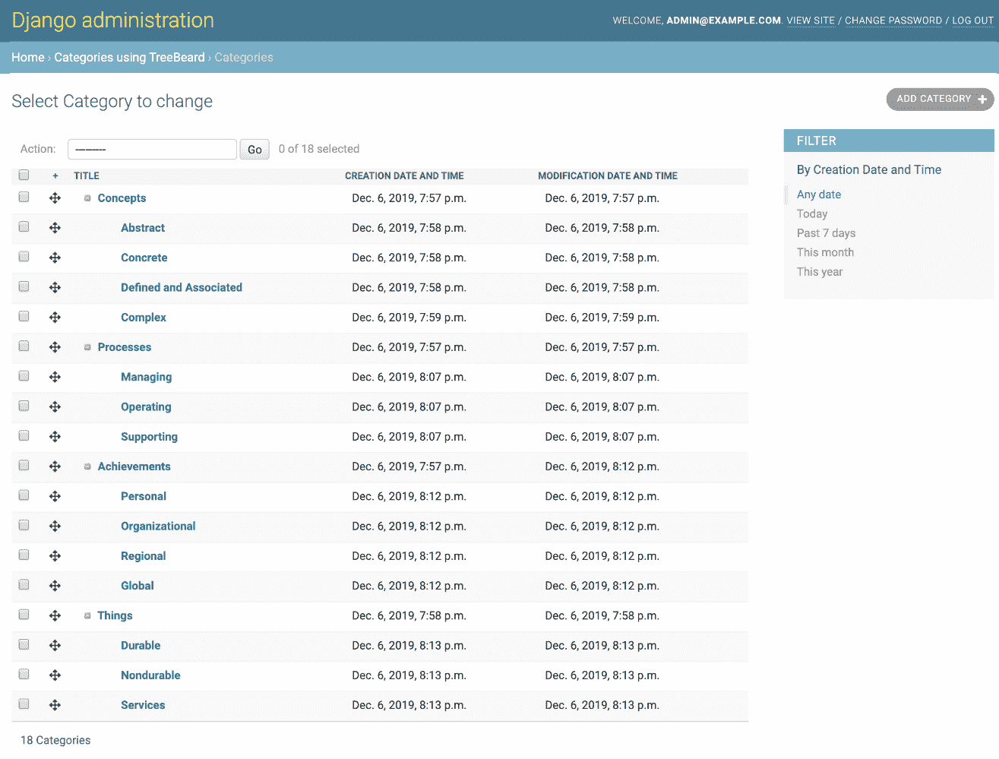
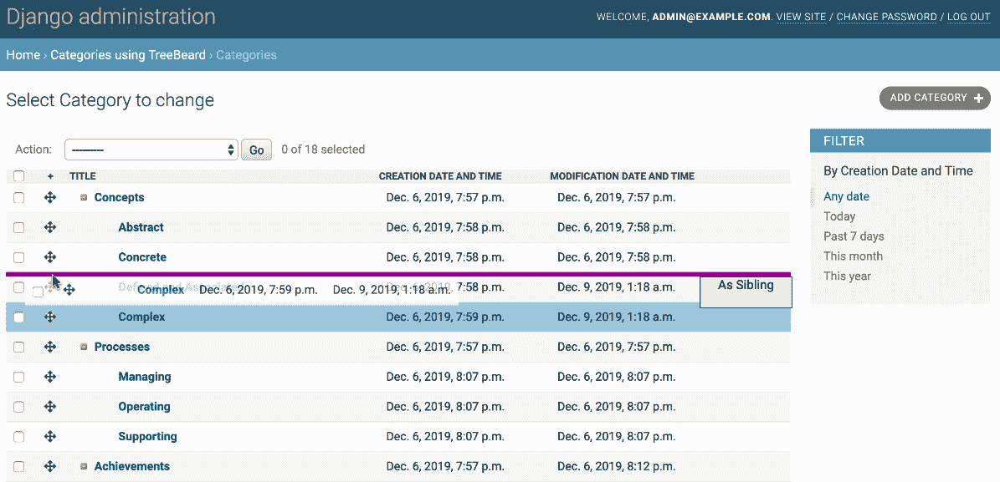
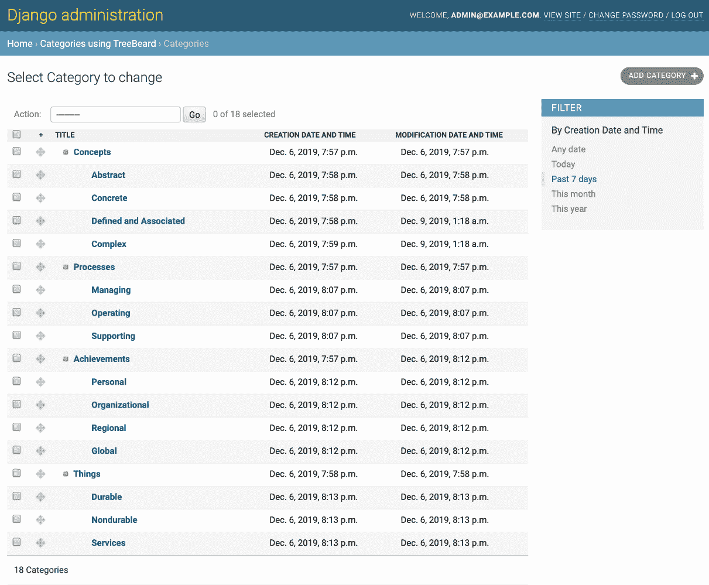

# 第八章：分层结构

在本章中，我们将涵盖以下主题：

+   使用 django-mptt 创建分层类别

+   使用 django-mptt-admin 创建一个类别管理界面

+   在模板中呈现类别与 django-mptt

+   在表单中使用单选字段选择类别与 django-mptt

+   在表单中使用复选框列表选择多个类别与 django-mptt

+   使用 django-treebeard 创建分层类别

+   使用 django-treebeard 创建基本的类别管理界面

# 介绍

无论你是构建自己的论坛、分级评论还是分类系统，总会有一个时刻，你需要在数据库中保存分层结构。尽管关系数据库（如 MySQL 和 PostgreSQL）的表是平面的，但有一种快速有效的方法可以存储分层结构。它被称为**修改的先序树遍历**（**MPTT**）。MPTT 允许你在不需要递归调用数据库的情况下读取树结构。

首先，让我们熟悉树结构的术语。树数据结构是从**根**节点开始，具有对**子节点**的引用的嵌套集合。有一些限制：例如，没有节点应该引用回来创建一个循环，也不应该重复引用。以下是一些其他要记住的术语：

+   父节点是具有对子节点的引用的任何节点。

+   **后代**是通过从父节点递归遍历到其子节点可以到达的节点。因此，一个节点的后代将是它的子节点、子节点的子节点等等。

+   **祖先**是通过从子节点递归遍历到其父节点可以到达的节点。因此，一个节点的祖先将是其父节点、父节点的父节点等等，一直到根节点。

+   **兄弟节点**是具有相同父节点的节点。

+   **叶子**是没有子节点的节点。

现在，我将解释 MPTT 的工作原理。想象一下，将树水平布置，根节点在顶部。树中的每个节点都有左右值。想象它们是节点左右两侧的小手柄。然后，你从根节点开始，逆时针绕树行走（遍历），并用数字标记每个左右值：1、2、3 等等。它看起来类似于以下图表：



在这个分层结构的数据库表中，每个节点都有标题、左值和右值。

现在，如果你想获取**B**节点的**子树**，左值为**2**，右值为**11**，你需要选择所有左值在**2**和**11**之间的节点。它们是**C**、**D**、**E**和**F**。

要获取**D**节点的所有**祖先**，左值为**5**，右值为**10**，你必须选择所有左值小于**5**且右值大于**10**的节点。这些将是**B**和**A**。

要获取节点的**后代**数量，可以使用以下公式：

*后代 = (右值 - 左值 - 1) / 2*

因此，**B**节点的**后代**数量可以根据以下公式计算：

*(11 - 2 - 1) / 2 = 4*

如果我们想把**E**节点附加到**C**节点，我们只需要更新它们的第一个共同祖先**B**节点的左右值。然后，**C**节点的左值仍然是**3**；**E**节点的左值将变为**4**，右值为**5**；**C**节点的右值将变为**6**；**D**节点的左值将变为**7**；**F**节点的左值将保持为**8**；其他节点也将保持不变。

类似地，MPTT 中还有其他与节点相关的树操作。对于项目中的每个分层结构自己管理所有这些可能太复杂了。幸运的是，有一个名为`django-mptt`的 Django 应用程序，它有很长的历史来处理这些算法，并提供了一个简单的 API 来处理树结构。另一个应用程序`django-treebeard`也经过了尝试和测试，并在取代 MPTT 成为 django CMS 3.1 的强大替代品时获得了额外的关注。在本章中，您将学习如何使用这些辅助应用程序。

# 技术要求

您将需要 Python 3 的最新稳定版本、MySQL 或 PostgreSQL 以及一个带有虚拟环境的 Django 项目。

您可以在 GitHub 存储库的`ch08`目录中找到本章的所有代码，网址为：[`github.com/PacktPublishing/Django-3-Web-Development-Cookbook-Fourth-Edition`](https://github.com/PacktPublishing/Django-3-Web-Development-Cookbook-Fourth-Edition)。

# 使用 django-mptt 创建分层类别

为了说明如何处理 MPTT，我们将在第三章*，表单和视图*中的`ideas`应用程序的基础上构建。在我们的更改中，我们将使用分层的`Category`模型替换类别，并更新`Idea`模型以与类别具有多对多的关系。或者，您可以从头开始创建应用程序，仅使用此处显示的内容，以实现`Idea`模型的非常基本的版本。

# 准备工作

要开始，请执行以下步骤：

1.  使用以下命令在虚拟环境中安装`django-mptt`：

```py
(env)$ pip install django-mptt==0.10.0
```

1.  如果尚未创建`categories`和`ideas`应用程序，请创建它们。将这些应用程序以及`mptt`添加到设置中的`INSTALLED_APPS`中，如下所示：

```py
# myproject/settings/_base.py
INSTALLED_APPS = [
    # …
    "mptt",
    # …
    "myproject.apps.categories",
 "myproject.apps.ideas",
]
```

# 操作步骤

我们将创建一个分层的`Category`模型，并将其与`Idea`模型关联，后者将与类别具有多对多的关系，如下所示：

1.  在`categories`应用程序的`models.py`文件中添加一个扩展`mptt.models.MPTTModel`的`Category`模型

`CreationModificationDateBase`，在第二章*，模型和数据库结构*中定义。除了来自混合类的字段之外，`Category`模型还需要具有`TreeForeignKey`类型的`parent`字段和`title`字段：

```py
# myproject/apps/ideas/models.py
from django.db import models
from django.utils.translation import ugettext_lazy as _
from mptt.models import MPTTModel
from mptt.fields import TreeForeignKey

from myproject.apps.core.models import CreationModificationDateBase

class Category(MPTTModel, CreationModificationDateBase):
    parent = TreeForeignKey(
 "self", on_delete=models.CASCADE, 
 blank=True, null=True, related_name="children"
    )
    title = models.CharField(_("Title"), max_length=200)

    class Meta:
 ordering = ["tree_id", "lft"]
        verbose_name = _("Category")
        verbose_name_plural = _("Categories")

 class MPTTMeta:
 order_insertion_by = ["title"]

    def __str__(self):
        return self.title
```

1.  更新`Idea`模型以包括`TreeManyToManyField`类型的`categories`字段：

```py
# myproject/apps/ideas/models.py from django.utils.translation import gettext_lazy as _

from mptt.fields import TreeManyToManyField

from myproject.apps.core.models import CreationModificationDateBase, UrlBase

class Idea(CreationModificationDateBase, UrlBase):
    # …
    categories = TreeManyToManyField(
 "categories.Category",
 verbose_name=_("Categories"),
 related_name="category_ideas",
 )
```

1.  通过进行迁移并运行它们来更新您的数据库：

```py
(env)$ python manage.py makemigrations
(env)$ python manage.py migrate
```

# 工作原理

`MPTTModel`混合类将向`Category`模型添加`tree_id`、`lft`、`rght`和`level`字段：

+   `tree_id`字段用作数据库表中可以有多个树的标识。实际上，每个根类别都保存在单独的树中。

+   `lft`和`rght`字段存储 MPTT 算法中使用的左值和右值。

+   `level`字段存储树中节点的深度。根节点的级别将为 0。

通过 MPTT 特有的`order_insertion_by`元选项，我们确保添加新类别时，它们按标题的字母顺序排列。

除了新字段之外，`MPTTModel`混合类还添加了用于浏览树结构的方法，类似于使用 JavaScript 浏览 DOM 元素。这些方法如下：

+   如果要访问类别的祖先，请使用以下代码。在这里，

`ascending`参数定义从哪个方向读取节点（默认为`False`），`include_self`参数定义是否在`QuerySet`中包含类别本身（默认为`False`）：

```py
ancestor_categories = category.get_ancestors(
    ascending=False,
    include_self=False,
)
```

+   要仅获取根类别，请使用以下代码：

```py
root = category.get_root()
```

+   如果要获取类别的直接子类，请使用以下代码：

```py
children = category.get_children()
```

+   要获取类别的所有后代，请使用以下代码。在这里，`include_self`参数再次定义是否在`QuerySet`中包含类别本身：

```py
descendants = category.get_descendants(include_self=False)
```

+   如果要获取后代计数而不查询数据库，请使用以下代码：

```py
descendants_count = category.get_descendant_count()
```

+   要获取所有兄弟节点，请调用以下方法：

```py
siblings = category.get_siblings(include_self=False)
```

根类别被视为其他根类别的兄弟节点。

+   要只获取前一个和后一个兄弟节点，请调用以下方法：

```py
previous_sibling = category.get_previous_sibling()
next_sibling = category.get_next_sibling()
```

+   此外，还有一些方法可以检查类别是根、子还是叶子，如下所示：

```py
category.is_root_node()
category.is_child_node()
category.is_leaf_node()
```

所有这些方法都可以在视图、模板或管理命令中使用。如果要操作树结构，还可以使用`insert_at()`和`move_to()`方法。在这种情况下，您可以在[`django-mptt.readthedocs.io/en/stable/models.html`](https://django-mptt.readthedocs.io/en/stable/models.html)上阅读有关它们和树管理器方法的信息。

在前面的模型中，我们使用了`TreeForeignKey`和`TreeManyToManyField`。这些类似于`ForeignKey`和`ManyToManyField`，只是它们在管理界面中以层次结构缩进显示选择项。

还要注意，在`Category`模型的`Meta`类中，我们按`tree_id`和`lft`值对类别进行排序，以在树结构中自然显示类别。

# 另请参阅

+   *使用 django-mptt-admin 创建类别管理界面*的说明

第二章*，模型和数据库结构*

+   *使用 django-mptt 创建模型混合以处理创建和修改日期*的说明

# 使用 django-mptt-admin 创建类别管理界面

`django-mptt`应用程序配备了一个简单的模型管理混合功能，允许您创建树结构并使用缩进列出它。要重新排序树，您需要自己创建此功能，或者使用第三方解决方案。一个可以帮助您为分层模型创建可拖动的管理界面的应用程序是`django-mptt-admin`。让我们在这个教程中看一下它。

# 准备工作

首先，按照前面*使用 django-mptt 创建分层类别*的说明设置`categories`应用程序。然后，我们需要通过执行以下步骤安装`django-mptt-admin`应用程序：

1.  使用以下命令在虚拟环境中安装应用程序：

```py
(env)$ pip install django-mptt-admin==0.7.2
```

1.  将其放在设置中的`INSTALLED_APPS`中，如下所示：

```py
# myproject/settings/_base.py
INSTALLED_APPS = [
    # …
    "mptt",
 "django_mptt_admin",
]
```

1.  确保`django-mptt-admin`的静态文件对您的项目可用：

```py
(env)$ python manage.py collectstatic
```

# 如何做...

创建一个`admin.py`文件，在其中我们将定义`Category`模型的管理界面。它将扩展`DjangoMpttAdmin`而不是`admin.ModelAdmin`，如下所示：

```py
# myproject/apps/categories/admin.py from django.contrib import admin
from django_mptt_admin.admin import DjangoMpttAdmin

from .models import Category

@admin.register(Category)
class CategoryAdmin(DjangoMpttAdmin):
    list_display = ["title", "created", "modified"]
    list_filter = ["created"]
```

# 它是如何工作的...

类别的管理界面将有两种模式：树视图和网格视图。您的树视图将类似于以下屏幕截图：



树视图使用**jqTree** jQuery 库进行节点操作。您可以展开和折叠类别，以便更好地查看。要重新排序或更改依赖关系，您可以在此列表视图中拖放标题。在重新排序期间，**用户界面**（**UI**）类似于以下屏幕截图：



请注意，树视图中将忽略任何常规与列表相关的设置，例如`list_display`或`list_filter`。此外，`order_insertion_by`元属性驱动的任何排序都将被手动排序覆盖。

如果要筛选类别、按特定字段对其进行排序或应用管理操作，可以切换到网格视图，它显示默认的类别更改列表，如以下屏幕截图所示：



# 另请参阅

+   *使用 django-mptt 创建分层类别*的说明

+   *使用 django-treebeard 创建类别管理界面*的说明

# 使用 django-mptt 在模板中呈现类别

一旦您在应用程序中创建了类别，您需要在模板中以分层方式显示它们。使用 MPTT 树的最简单方法是使用`django-mptt`应用程序中的``模板标记，如*使用 django-mptt 创建分层类别*食谱中所述。我们将在这个食谱中向您展示如何做到这一点。

# 准备就绪

确保您拥有`categories`和`ideas`应用程序。在那里，您的`Idea`模型应该与`Category`模型有多对多的关系，就像*使用 django-mptt 创建分层类别*食谱中所述。在数据库中输入一些类别。

# 如何做...

将您的分层类别的`QuerySet`传递到模板，然后使用``模板标记，如下所示：

1.  创建一个视图，加载所有类别并将它们传递到模板：

```py
# myproject/apps/categories/views.py from django.views.generic import ListView

from .models import Category

class IdeaCategoryList(ListView):
    model = Category
    template_name = "categories/category_list.html"
    context_object_name = "categories"
```

1.  创建一个模板，其中包含以下内容以输出类别的层次结构：

```py
{# categories/category_list.html #}




    <ul class="root">
        
            <li>
                {{ node.title }}
                
                    <ul class="children">
                        {{ children }}
                    </ul>
                
            </li>
        
    </ul>

```

1.  创建一个 URL 规则来显示视图：

```py
# myproject/urls.py from django.conf.urls.i18n import i18n_patterns
from django.urls import path

from myproject.apps.categories import views as categories_views

urlpatterns = i18n_patterns(
    # …
    path(
 "idea-categories/",
 categories_views.IdeaCategoryList.as_view(),
 name="idea_categories",
 ),
)
```

# 它是如何工作的...

模板将呈现为嵌套列表，如下截图所示：



``块模板标记接受类别的`QuerySet`并使用标记内嵌的模板内容呈现列表。这里使用了两个特殊变量：

+   `node`变量是`Category`模型的一个实例，其字段或方法可用于添加特定的 CSS 类或 HTML5`data-*`属性，例如`{{ node.get_descendent_count }}`、`{{ node.level }}`或`{{ node.is_root }}`。

+   其次，我们有一个`children`变量，用于定义当前类别的渲染子节点将放置在何处。

# 还有更多...

如果您的分层结构非常复杂，超过 20 个级别，建议使用非递归的`tree_info`模板过滤器或``和``迭代标记。

有关如何执行此操作的更多信息，请参阅官方文档[`django-mptt.readthedocs.io/en/latest/templates.html#iterative-tags`](https://django-mptt.readthedocs.io/en/latest/templates.html#iterative-tags)[.](https://django-mptt.readthedocs.io/en/latest/templates.html#iterative-tags)

# 另请参阅

+   *在第四章*的*使用 HTML5 数据属性*食谱，模板和 JavaScript*

+   *使用 django-mptt 创建分层类别*食谱

+   *使用 django-treebeard 创建分层类别*食谱

+   *在使用 django-mptt 在表单中选择类别的单选字段*食谱

# 在表单中使用单选字段来选择类别与 django-mptt

如果您想在表单中显示类别选择，会发生什么？层次结构将如何呈现？在`django-mptt`中，有一个特殊的`TreeNodeChoiceField`表单字段，您可以使用它来在选定字段中显示分层结构。让我们看看如何做到这一点。

# 准备就绪

我们将从前面的食谱中定义的`categories`和`ideas`应用程序开始。对于这个食谱，我们还需要`django-crispy-forms`。查看如何在第三章*的*使用 django-crispy-forms 创建表单布局*食谱中安装它。

# 如何做...

让我们通过在第三章*的*表单和视图*中创建的`ideas`的过滤对象列表的*过滤对象列表*食谱，添加一个按类别进行过滤的字段。

1.  在`ideas`应用程序的`forms.py`文件中，创建一个带有类别字段的表单，如下所示：

```py
# myproject/apps/ideas/forms.py from django import forms
from django.utils.safestring import mark_safe
from django.utils.translation import ugettext_lazy as _
from django.contrib.auth import get_user_model

from crispy_forms import bootstrap, helper, layout
from mptt.forms import TreeNodeChoiceField

from myproject.apps.categories.models import Category

from .models import Idea, RATING_CHOICES

User = get_user_model()

class IdeaFilterForm(forms.Form):
    author = forms.ModelChoiceField(
        label=_("Author"),
        required=False,
        queryset=User.objects.all(),
    )
 category = TreeNodeChoiceField(
 label=_("Category"),
 required=False,
 queryset=Category.objects.all(),
 level_indicator=mark_safe("&nbsp;&nbsp;&nbsp;&nbsp;")
 )
    rating = forms.ChoiceField(
        label=_("Rating"), required=False, choices=RATING_CHOICES
    )
    def __init__(self, *args, **kwargs):
        super().__init__(*args, **kwargs)

        author_field = layout.Field("author")
        category_field = layout.Field("category")
        rating_field = layout.Field("rating")
        submit_button = layout.Submit("filter", _("Filter"))
        actions = bootstrap.FormActions(submit_button)

        main_fieldset = layout.Fieldset(
            _("Filter"),
            author_field,
            category_field,
            rating_field,
            actions,
        )

        self.helper = helper.FormHelper()
        self.helper.form_method = "GET"
        self.helper.layout = layout.Layout(main_fieldset)
```

1.  我们应该已经创建了`IdeaListView`，一个相关的 URL 规则和`idea_list.html`模板来显示此表单。确保在模板中使用``模板标记呈现过滤表单，如下所示：

```py
{# ideas/idea_list.html #}




 



    {# … #}

```

# 它是如何工作的...

类别选择下拉菜单将类似于以下内容：



`TreeNodeChoiceField`的作用类似于`ModelChoiceField`；但是，它显示缩进的分层选择。默认情况下，`TreeNodeChoiceField`表示每个更深层级都以三个破折号`---`为前缀。在我们的示例中，我们通过将`level_indicator`参数传递给字段，将级别指示器更改为四个不间断空格（`&nbsp;` HTML 实体）。为了确保不间断空格不被转义，我们使用`mark_safe()`函数。

# 另请参阅

+   *在模板中使用 django-mptt 呈现类别*食谱

+   *在表单中使用 checkbox 列表来选择多个类别，使用 django-mptt*食谱

# 在表单中使用 checkbox 列表来选择多个类别，使用 django-mptt

当需要一次选择一个或多个类别时，可以使用`django-mptt`提供的`TreeNodeMultipleChoiceField`多选字段。然而，多选字段（例如，`<select multiple>`）在界面上并不是非常用户友好，因为用户需要滚动并按住控制键或命令键来进行多次选择。特别是当需要从中选择相当多的项目，并且用户希望一次选择多个项目，或者用户有辅助功能障碍，如运动控制能力差，这可能会导致非常糟糕的用户体验。一个更好的方法是提供一个复选框列表，用户可以从中选择类别。在这个食谱中，我们将创建一个允许你在表单中显示分层树结构的缩进复选框的字段。

# 准备工作

我们将从我们之前定义的`categories`和`ideas`应用程序以及你的项目中应该有的`core`应用程序开始。

# 操作步骤...

为了呈现带复选框的缩进类别列表，我们将创建并使用一个新的`MultipleChoiceTreeField`表单字段，并为该字段创建一个 HTML 模板。

特定模板将传递给表单中的`crispy_forms`布局。为此，请执行以下步骤：

1.  在`core`应用程序中，添加一个`form_fields.py`文件，并创建一个扩展`ModelMultipleChoiceField`的`MultipleChoiceTreeField`表单字段，如下所示：

```py
# myproject/apps/core/form_fields.py
from django import forms

class MultipleChoiceTreeField(forms.ModelMultipleChoiceField):
    widget = forms.CheckboxSelectMultiple

    def label_from_instance(self, obj):
        return obj
```

1.  在新的想法创建表单中使用带有类别选择的新字段。此外，在表单布局中，将自定义模板传递给`categories`字段，如下所示：

```py
# myproject/apps/ideas/forms.py from django import forms
from django.utils.translation import ugettext_lazy as _
from django.contrib.auth import get_user_model

from crispy_forms import bootstrap, helper, layout

from myproject.apps.categories.models import Category
from myproject.apps.core.form_fields import MultipleChoiceTreeField

from .models import Idea, RATING_CHOICES

User = get_user_model()

class IdeaForm(forms.ModelForm):
 categories = MultipleChoiceTreeField(
 label=_("Categories"),
 required=False,
 queryset=Category.objects.all(),
 )

    class Meta:
        model = Idea
        exclude = ["author"]

    def __init__(self, request, *args, **kwargs):
        self.request = request
        super().__init__(*args, **kwargs)

        title_field = layout.Field("title")
        content_field = layout.Field("content", rows="3")
        main_fieldset = layout.Fieldset(_("Main data"), 
         title_field, content_field)

        picture_field = layout.Field("picture")
        format_html = layout.HTML(
            """"""
        )

        picture_fieldset = layout.Fieldset(
            _("Picture"),
            picture_field,
            format_html,
            title=_("Image upload"),
            css_id="picture_fieldset",
        )

 categories_field = layout.Field(
 "categories",
 template="core/includes
            /checkboxselectmultiple_tree.html"
        )
 categories_fieldset = layout.Fieldset(
 _("Categories"), categories_field, 
             css_id="categories_fieldset"
        )

        submit_button = layout.Submit("save", _("Save"))
        actions = bootstrap.FormActions(submit_button, 
         css_class="my-4")

        self.helper = helper.FormHelper()
        self.helper.form_action = self.request.path
        self.helper.form_method = "POST"
        self.helper.layout = layout.Layout(
            main_fieldset,
            picture_fieldset,
 categories_fieldset,
            actions,
        )

    def save(self, commit=True):
        instance = super().save(commit=False)
        instance.author = self.request.user
        if commit:
            instance.save()
            self.save_m2m()
        return instance
```

1.  创建一个基于`crispy`表单模板`bootstrap4/layout/checkboxselectmultiple.html`的 Bootstrap 风格复选框列表的模板，如下所示：

```py
{# core/include/checkboxselectmultiple_tree.html #} 

<div class=" {{ field_class }}" {{ flat_attrs|safe }}>

    
    <div class="custom-control custom-
     checkbox custom-control-inlineform-check form-check-
     inline">
        <input type="checkbox" class="
         custom-control-inputform-check-input
          is-invalid"
  checked=
         "checked" name="{{ field.html_name }}" 
          id="id_{{ field.html_name }}_{{ forloop.counter }}" 
          value="{{ choice_value|unlocalize }}" {{ field.field
          .widget.attrs|flatatt }}>
        <label class="custom-control-
         labelform-check-label level-{{ 
        choice_instance.level }}" for="id_{{ field.html_name 
          }}_{{ forloop.counter }}">
            {{ choice_instance|unlocalize }}
        </label>
        
            
        
    </div>
    
    
    <div class="w-100 custom-control 
     custom-checkbox custom-control-inline
     form-check form-
      check-inline">
        <input type="checkbox" class="custom-control-input is-invalid">
        
    </div>
    

    
</div>
```

1.  创建一个新的视图来添加一个想法，使用我们刚刚创建的表单：

```py
# myproject/apps/ideas/views.py from django.contrib.auth.decorators import login_required
from django.shortcuts import render, redirect, get_object_or_404

from .forms import IdeaForm
from .models import Idea

@login_required
def add_or_change_idea(request, pk=None):
    idea = None
    if pk:
        idea = get_object_or_404(Idea, pk=pk)
    if request.method == "POST":
        form = IdeaForm(request, data=request.POST, 
         files=request.FILES, instance=idea)
        if form.is_valid():
            idea = form.save()
            return redirect("ideas:idea_detail", pk=idea.pk)
    else:
        form = IdeaForm(request, instance=idea)

    context = {"idea": idea, "form": form}
    return render(request, "ideas/idea_form.html", context)
```

1.  将相关模板添加到显示带有``模板标记的表单中，你可以在第三章*，表单和视图*中了解更多关于其用法的内容：

```py
{# ideas/idea_form.html #}




    <a href=""></a>
    <h1>
        
            
                Change Idea "{{ title }}"
            
        
            
        
    </h1>
 

```

1.  我们还需要一个指向新视图的 URL 规则，如下所示：

```py
# myproject/apps/ideas/urls.py from django.urls import path

from .views import add_or_change_idea

urlpatterns = [
    # …
    path("add/", add_or_change_idea, name="add_idea"),
    path("<uuid:pk>/change/", add_or_change_idea, 
     name="change_idea"),
]
```

1.  在 CSS 文件中添加规则，使用复选框树字段模板中生成的类（如`.level-0`、`.level-1`和`.level-2`），通过设置`margin-left`参数来缩进标签。确保你的 CSS 类有合理数量，以适应上下文中树的预期最大深度，如下所示：

```py
/* myproject/site_static/site/css/style.css */
.level-0 {margin-left: 0;}
.level-1 {margin-left: 20px;}
.level-2 {margin-left: 40px;}
```

# 工作原理...

结果如下，我们得到以下表单：



与 Django 的默认行为相反，后者在 Python 代码中硬编码字段生成，`django-crispy-forms`应用程序使用模板来呈现字段。你可以在`crispy_forms/templates/bootstrap4`下浏览它们，并在必要时将其中一些复制到项目模板目录的类似路径下以覆盖它们。

在我们的创意创建和编辑表单中，我们传递了一个自定义模板，用于`categories`字段，该模板将为`<label>`标签添加`.level-*`CSS 类，包装复选框。正常的`CheckboxSelectMultiple`小部件的一个问题是，当呈现时，它只使用选择值和选择文本，而我们需要类别的其他属性，例如深度级别。为了解决这个问题，我们还创建了一个自定义的`MultipleChoiceTreeField`表单字段，它扩展了`ModelMultipleChoiceField`并覆盖了`label_from_instance()`方法，以返回类别实例本身，而不是其 Unicode 表示。字段的模板看起来很复杂；但实际上，它主要是一个重构后的多复选框字段模板（`crispy_forms/templates/bootstrap4/layout/checkboxselectmultiple.html`），其中包含所有必要的 Bootstrap 标记。我们主要只是稍微修改了一下，添加了`.level-*`CSS 类。

# 另请参阅

+   第三章中的*使用 django-crispy-forms 创建表单布局*方法

+   *使用 django-mptt 在模板中呈现类别*的方法

+   *在表单中使用单个选择字段选择类别*的方法

# 使用 django-treebeard 创建分层类别

树结构有几种算法，每种算法都有其自己的优点。一个名为`django-treebeard`的应用程序，它是 django CMS 使用的`django-mptt`的替代方案，提供了对三种树形表单的支持：

+   **邻接列表**树是简单的结构，其中每个节点都有一个父属性。尽管读取操作很快，但这是以写入速度慢为代价的。

+   **嵌套集**树和 MPTT 树是相同的；它们将节点结构化为嵌套在父节点下的集合。这种结构还提供了非常快速的读取访问，但写入和删除的成本更高，特别是当写入需要某种特定的排序时。

+   **Materialized Path**树是由树中的每个节点构建的，每个节点都有一个关联的路径属性，该属性是一个字符串，指示从根到节点的完整路径，就像 URL 路径指示在网站上找到特定页面的位置一样。这是支持的最有效方法。

作为对其支持所有这些算法的演示，我们将使用`django-treebeard`及其一致的 API。我们将扩展第三章中的`categories`应用程序，*表单和视图*。在我们的更改中，我们将通过支持的树算法之一增强`Category`模型的层次结构。

# 准备工作

要开始，请执行以下步骤：

1.  使用以下命令在虚拟环境中安装`django-treebeard`：

```py
(env)$ pip install django-treebeard==4.3
```

1.  如果尚未创建`categories`和`ideas`应用程序，请创建。将`categories`应用程序以及`treebeard`添加到设置中的`INSTALLED_APPS`中，如下所示：

```py
# myproject/settings/_base.py
INSTALLED_APPS = [
    # …
    "treebeard",
    # …
    "myproject.apps.categories",
 "myproject.apps.ideas",
]
```

# 如何做...

我们将使用**Materialized Path**算法增强`Category`模型，如下所示：

1.  打开`models.py`文件，并更新`Category`模型，以扩展`treebeard.mp_tree.MP_Node`而不是标准的 Django 模型。它还应该继承自我们在第二章中定义的`CreationModificationDateMixin`。除了从混合中继承的字段外，`Category`模型还需要有一个`title`字段：

```py
# myproject/apps/categories/models.py
from django.db import models
from django.utils.translation import ugettext_lazy as _
from treebeard.mp_tree import MP_Node

from myproject.apps.core.models import CreationModificationDateBase

class Category(MP_Node, CreationModificationDateBase):
    title = models.CharField(_("Title"), max_length=200)

    class Meta:
        verbose_name = _("Category")
        verbose_name_plural = _("Categories")

    def __str__(self):
        return self.title
```

1.  这将需要对数据库进行更新，因此接下来，我们需要迁移`categories`应用程序：

```py
(env)$ python manage.py makemigrations
(env)$ python manage.py migrate
```

1.  通过使用抽象模型继承，treebeard 树节点可以使用标准关系与其他模型相关联。因此，`Idea`模型可以继续与`Category`具有简单的`ManyToManyField`关系：

```py
# myproject/apps/ideas/models.py from django.db import models
from django.utils.translation import gettext_lazy as _

from myproject.apps.core.models import CreationModificationDateBase, UrlBase

class Idea(CreationModificationDateBase, UrlBase):
    # …
 categories = models.ManyToManyField(
 "categories.Category",
 verbose_name=_("Categories"),
 related_name="category_ideas",
 )
```

# 它是如何工作的...

`MP_Node`抽象模型为`Category`模型提供了`path`、`depth`和`numchild`字段，以及`steplen`、`alphabet`和`node_order_by`属性，以便根据需要构建树：

+   `depth`和`numchild`字段提供了关于节点位置和后代的元数据。

+   `path`字段被索引，使得可以使用`LIKE`进行数据库查询非常快。

+   `path`字段由固定长度的编码段组成，每个段的大小由`steplen`属性值确定（默认为 4），编码使用`alphabet`属性值中的字符（默认为拉丁字母数字字符）。

`path`，`depth`和`numchild`字段应被视为只读。此外，`steplen`，`alphabet`和`node_order_by`值在保存第一个对象到树后不应更改；否则，数据将被损坏。

除了新字段和属性之外，`MP_Node`抽象类还添加了用于浏览树结构的方法。这些方法的一些重要示例在这里列出：

+   如果要获取类别的**ancestors**，返回从根到当前节点的父代的`QuerySet`，请使用以下代码：

```py
ancestor_categories = category.get_ancestors()
```

+   要只获取`root`类别，其深度为 1，请使用以下代码：

```py
root = category.get_root()
```

+   如果要获取类别的直接`children`，请使用以下代码：

```py
children = category.get_children()
```

+   要获取类别的所有后代，返回为所有子代及其子代的`QuerySet`，依此类推，但不包括当前节点本身，请使用以下代码：

```py
descendants = category.get_descendants()
```

+   如果要只获取`descendant`计数，请使用以下代码：

```py
descendants_count = category.get_descendant_count()
```

+   要获取所有`siblings`，包括参考节点，请调用以下方法：

```py
siblings = category.get_siblings()
```

根类别被认为是其他根类别的兄弟。

+   要只获取前一个和后一个`siblings`，请调用以下方法，其中`get_prev_sibling()`将对最左边的兄弟返回`None`，`get_next_sibling()`对最右边的兄弟也是如此：

```py
previous_sibling = category.get_prev_sibling()
next_sibling = category.get_next_sibling()
```

+   此外，还有方法可以检查类别是否为`root`，`leaf`或与另一个节点相关：

```py
category.is_root()
category.is_leaf()
category.is_child_of(another_category)
category.is_descendant_of(another_category)
category.is_sibling_of(another_category)
```

# 还有更多...

这个食谱只是揭示了`django-treebeard`及其 Materialized Path 树的强大功能的一部分。还有许多其他可用于导航和树构建的方法。此外，Materialized Path 树的 API 与嵌套集树和邻接列表树的 API 基本相同，只需使用`NS_Node`或`AL_Node`抽象类之一来实现您的模型，而不是使用`MP_Node`。

阅读`django-treebeard` API 文档，了解每个树实现的可用属性和方法的完整列表[`django-treebeard.readthedocs.io/en/latest/api.html`](https://django-treebeard.readthedocs.io/en/latest/api.html)。

# 另请参阅

+   第三章*，表单和视图*

+   使用 django-mptt 创建分层类别的食谱

+   使用 django-treebeard 创建类别管理界面的食谱

# 使用 django-treebeard 创建基本类别管理界面

`django-treebeard`应用程序提供了自己的`TreeAdmin`，扩展自标准的`ModelAdmin`。这允许您在管理界面中按层次查看树节点，并且界面功能取决于所使用的树算法。让我们在这个食谱中看看这个。

# 准备就绪

首先，按照本章前面的*使用 django-treebeard 创建分层类别*食谱中的说明设置`categories`应用程序和`django-treebeard`。此外，确保`django-treebeard`的静态文件对您的项目可用：

```py
(env)$ python manage.py collectstatic
```

# 如何做...

为`categories`应用程序中的`Category`模型创建管理界面，该界面扩展了`treebeard.admin.TreeAdmin`而不是`admin.ModelAdmin`，并使用自定义表单工厂，如下所示：

```py
# myproject/apps/categories/admin.py
from django.contrib import admin
from treebeard.admin import TreeAdmin
from treebeard.forms import movenodeform_factory

from .models import Category

@admin.register(Category)
class CategoryAdmin(TreeAdmin):
    form = movenodeform_factory(Category)
    list_display = ["title", "created", "modified"]
    list_filter = ["created"]
```

# 工作原理...

类别的管理界面将具有两种模式，取决于所使用的树实现。对于 Materialized Path 和 Nested Sets 树，提供了高级 UI，如下所示：



此高级视图允许您展开和折叠类别，以便更好地进行概述。要重新排序或更改依赖关系，您可以拖放标题。在重新排序期间，用户界面看起来类似于以下截图：



如果您对类别按特定字段进行过滤或排序，则高级功能将被禁用，但高级界面的更具吸引力的外观和感觉仍然保留。我们可以在这里看到这种中间视图，只显示过去 7 天创建的类别：



但是，如果您的树使用邻接列表算法，则提供了基本 UI，呈现较少的美学呈现，并且没有在高级 UI 中提供的切换或重新排序功能。

有关`django-treebeard`管理的更多细节，包括基本界面的截图，可以在文档中找到：[`django-treebeard.readthedocs.io/en/latest/admin.html`](https://django-treebeard.readthedocs.io/en/latest/admin.html)。

# 另请参阅

+   *使用 django-mptt 创建分层类别*配方

+   *使用 django-treebeard 创建分层类别*配方

+   *使用 django-mptt-admin 创建类别管理界面*配方
