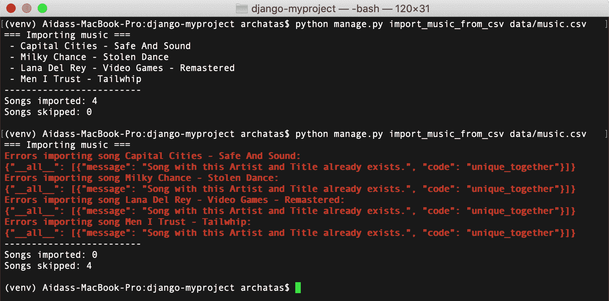
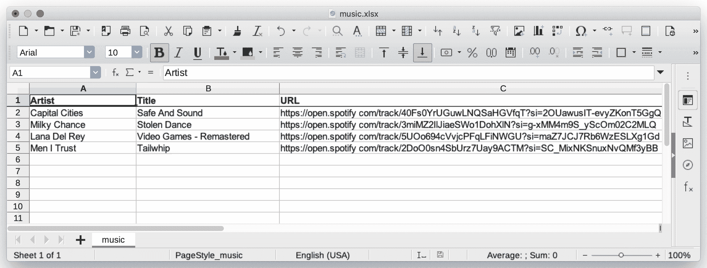
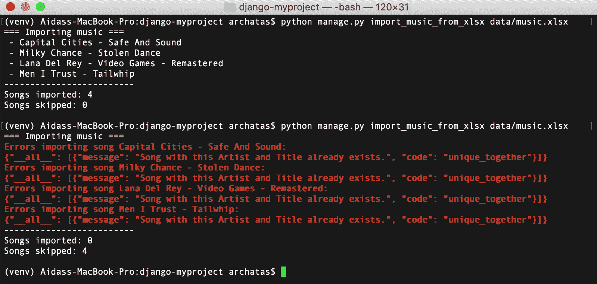
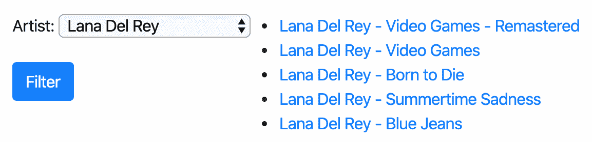
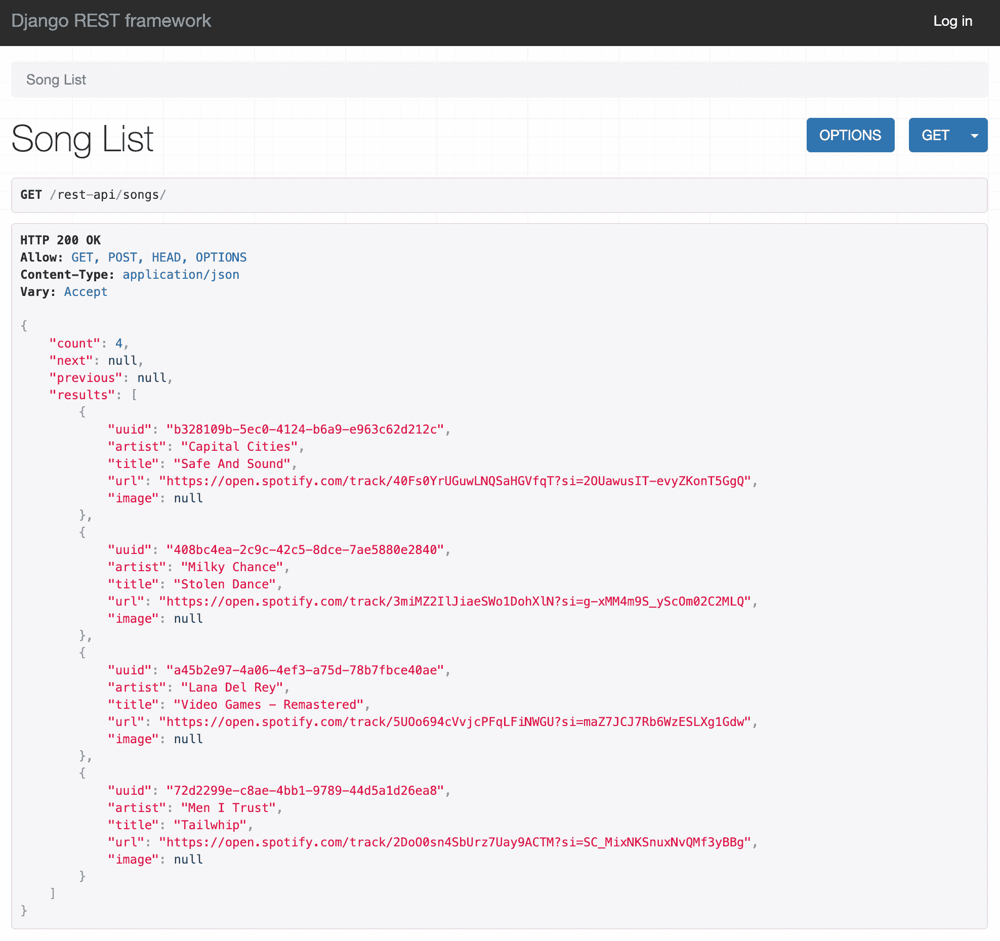
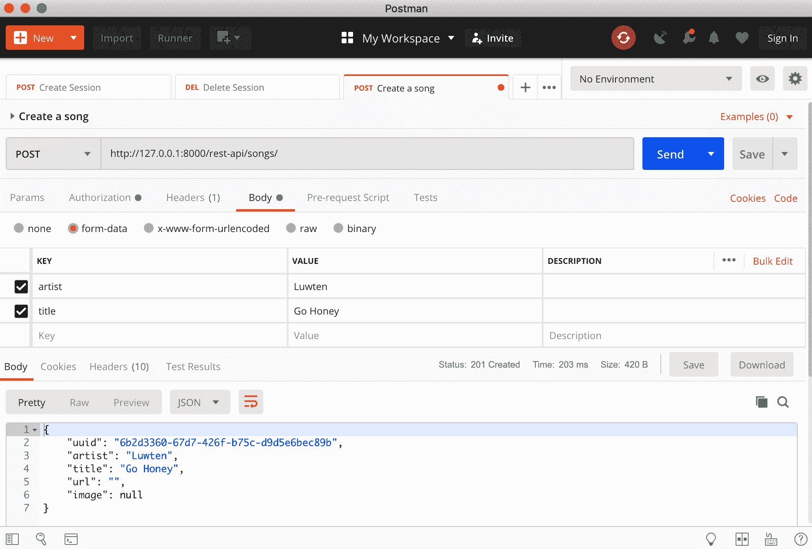
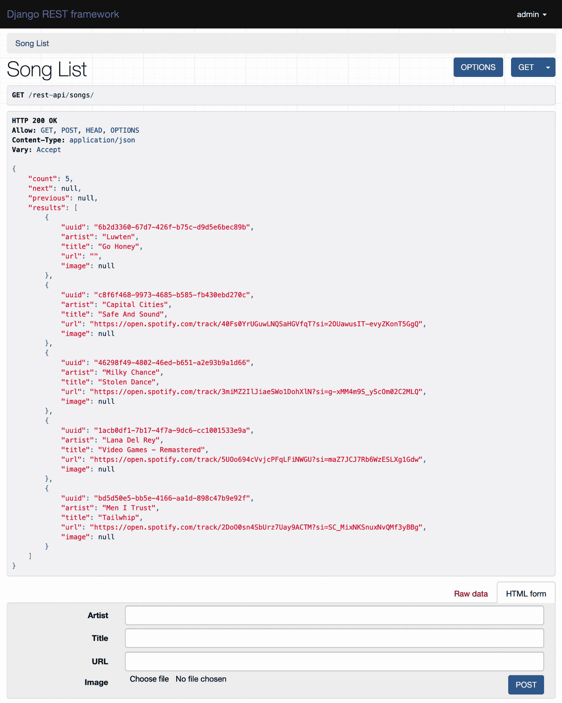

# 第九章：导入和导出数据

在这一章中，我们将涵盖以下主题：

+   从本地 CSV 文件导入数据

+   从本地 Excel 文件导入数据

+   从外部 JSON 文件导入数据

+   从外部 XML 文件导入数据

+   为搜索引擎准备分页站点地图

+   创建可过滤的 RSS 订阅

+   使用 Django REST 框架创建 API

# 介绍

偶尔，您的数据需要从本地格式传输到数据库，从外部资源导入，或者提供给第三方。在这一章中，我们将看一些实际的例子，演示如何编写管理命令和 API 来实现这一点。

# 技术要求

要使用本章的代码，您需要最新稳定版本的 Python、MySQL 或 PostgreSQL 数据库，以及一个带有虚拟环境的 Django 项目。还要确保在虚拟环境中安装 Django、Pillow 和数据库绑定。

您可以在 GitHub 存储库的`ch09`目录中找到本章的所有代码：[`github.com/PacktPublishing/Django-3-Web-Development-Cookbook-Fourth-Edition`](https://github.com/PacktPublishing/Django-3-Web-Development-Cookbook-Fourth-Edition)。

# 从本地 CSV 文件导入数据

**逗号分隔值**（**CSV**）格式可能是在文本文件中存储表格数据的最简单方式。在这个示例中，我们将创建一个管理命令，将数据从 CSV 文件导入到 Django 数据库中。我们需要一个歌曲的 CSV 列表。您可以使用 Excel、Calc 或其他电子表格应用程序轻松创建这样的文件。

# 准备工作

让我们创建一个`music`应用程序，我们将在本章中使用它：

1.  创建`music`应用程序本身，并将其放在设置中的`INSTALLED_APPS`下：

```py
# myproject/settings/_base.py
INSTALLED_APPS = [
    # …
    "myproject.apps.core",
    "myproject.apps.music",
]
```

1.  `Song`模型应该包含`uuid`、`artist`、`title`、`url`和`image`字段。我们还将扩展`CreationModificationDateBase`以添加创建和修改时间戳，以及`UrlBase`以添加用于处理模型详细 URL 的方法：

```py
# myproject/apps/music/models.py
import os
import uuid
from django.urls import reverse
from django.utils.translation import ugettext_lazy as _
from django.db import models
from django.utils.text import slugify
from myproject.apps.core.models import CreationModificationDateBase, UrlBase

def upload_to(instance, filename):
    filename_base, filename_ext = os.path.splitext(filename)
    artist = slugify(instance.artist)
    title = slugify(instance.title)
    return f"music/{artist}--{title}{filename_ext.lower()}"

class Song(CreationModificationDateBase, UrlBase):
    uuid = models.UUIDField(primary_key=True, default=None, 
     editable=False)
    artist = models.CharField(_("Artist"), max_length=250)
    title = models.CharField(_("Title"), max_length=250)
    url = models.URLField(_("URL"), blank=True)
    image = models.ImageField(_("Image"), upload_to=upload_to, 
     blank=True, null=True)

    class Meta:
        verbose_name = _("Song")
        verbose_name_plural = _("Songs")
        unique_together = ["artist", "title"]

    def __str__(self):
        return f"{self.artist} - {self.title}"

    def get_url_path(self):
        return reverse("music:song_detail", kwargs={"pk": self.pk})

    def save(self, *args, **kwargs):
        if self.pk is None:
            self.pk = uuid.uuid4()
        super().save(*args, **kwargs)
```

1.  使用以下命令创建和运行迁移：

```py
(env)$ python manage.py makemigrations
(env)$ python manage.py migrate
```

1.  然后，让我们为`Song`模型添加一个简单的管理：

```py
# myproject/apps/music/admin.py
from django.contrib import admin
from .models import Song

@admin.register(Song)
class SongAdmin(admin.ModelAdmin):
    list_display = ["title", "artist", "url"]
    list_filter = ["artist"]
    search_fields = ["title", "artist"]
```

1.  此外，我们需要一个用于验证和创建导入脚本中的`Song`模型的表单。它是最简单的模型表单，如下所示：

```py
# myproject/apps/music/forms.py
from django import forms
from django.utils.translation import ugettext_lazy as _
from .models import Song

class SongForm(forms.ModelForm):
    class Meta:
        model = Song
        fields = "__all__" 
```

# 如何做...

按照以下步骤创建和使用一个管理命令，从本地 CSV 文件导入歌曲：

1.  创建一个 CSV 文件，第一行包含列名`artist`、`title`和`url`。在接下来的行中添加一些歌曲数据，与列匹配。例如，可以是一个内容如下的`data/music.csv`文件：

```py
artist,title,url
Capital Cities,Safe And Sound,https://open.spotify.com/track/40Fs0YrUGuwLNQSaHGVfqT?si=2OUawusIT-evyZKonT5GgQ
Milky Chance,Stolen Dance,https://open.spotify.com/track/3miMZ2IlJiaeSWo1DohXlN?si=g-xMM4m9S_yScOm02C2MLQ
Lana Del Rey,Video Games - Remastered,https://open.spotify.com/track/5UOo694cVvjcPFqLFiNWGU?si=maZ7JCJ7Rb6WzESLXg1Gdw
Men I Trust,Tailwhip,https://open.spotify.com/track/2DoO0sn4SbUrz7Uay9ACTM?si=SC_MixNKSnuxNvQMf3yBBg
```

1.  在`music`应用程序中，创建一个`management`目录，然后在新的`management`目录中创建一个`commands`目录。在这两个新目录中都放入空的`__init__.py`文件，使它们成为 Python 包。

1.  在那里添加一个名为`import_music_from_csv.py`的文件，内容如下：

```py
# myproject/apps/music/management/commands/import_music_from_csv.py
from django.core.management.base import BaseCommand

class Command(BaseCommand):
    help = (
        "Imports music from a local CSV file. "
        "Expects columns: artist, title, url"
    )
    SILENT, NORMAL, VERBOSE, VERY_VERBOSE = 0, 1, 2, 3

    def add_arguments(self, parser):
        # Positional arguments
        parser.add_argument("file_path", nargs=1, type=str)

    def handle(self, *args, **options):
        self.verbosity = options.get("verbosity", self.NORMAL)
        self.file_path = options["file_path"][0]
        self.prepare()
        self.main()
        self.finalize()
```

1.  然后，在`Command`类的同一文件中，创建一个`prepare()`方法：

```py
    def prepare(self):
        self.imported_counter = 0
        self.skipped_counter = 0
```

1.  然后，我们应该创建`main()`方法：

```py
    def main(self):
        import csv
        from ...forms import SongForm

        if self.verbosity >= self.NORMAL:
            self.stdout.write("=== Importing music ===")

        with open(self.file_path, mode="r") as f:
            reader = csv.DictReader(f)
            for index, row_dict in enumerate(reader):
                form = SongForm(data=row_dict)
                if form.is_valid():
                    song = form.save()
                    if self.verbosity >= self.NORMAL:
                        self.stdout.write(f" - {song}\n")
                    self.imported_counter += 1
                else:
                    if self.verbosity >= self.NORMAL:
                        self.stderr.write(
                            f"Errors importing song "
                            f"{row_dict['artist']} - 
                             {row_dict['title']}:\n"
                        )
                        self.stderr.write(f"{form.errors.as_json()}\n")
                    self.skipped_counter += 1
```

1.  我们将使用`finalize()`方法完成这个类：

```py
    def finalize(self)
        if self.verbosity >= self.NORMAL:
            self.stdout.write(f"-------------------------\n")
            self.stdout.write(f"Songs imported:         
             {self.imported_counter}\n")
            self.stdout.write(f"Songs skipped: 
             {self.skipped_counter}\n\n")
```

1.  要运行导入，请在命令行中调用以下命令：

```py
(env)$ python manage.py import_music_from_csv data/music.csv
```

# 它是如何工作的...

Django 管理命令是从`BaseCommand`派生的`Command`类的脚本，并覆盖`add_arguments()`和`handle()`方法。`help`属性定义了管理命令的帮助文本。当您在命令行中输入以下内容时，可以看到它：

```py
(env)$ python manage.py help import_music_from_csv
```

Django 管理命令使用内置的`argparse`模块来解析传递的参数。`add_arguments()`方法定义了应该传递给管理命令的位置或命名参数。在我们的情况下，我们将添加一个 Unicode 类型的位置参数`file_path`。通过将`nargs`变量设置为`1`属性，我们只允许一个值。

要了解您可以定义的其他参数以及如何做到这一点，请参阅官方的`argparse`文档[`docs.python.org/3/library/argparse.html#adding-arguments`](https://docs.python.org/3/library/argparse.html#adding-arguments)。

在`handle()`方法的开始，检查`verbosity`参数。Verbosity 定义了命令应该提供多少终端输出，从 0，不提供任何日志，到 3，提供详尽的日志。您可以将这个命名参数传递给命令，如下所示：

```py
(env)$ python manage.py import_music_from_csv data/music.csv --verbosity=0
```

我们还期望文件名作为第一个位置参数。`options["file_path"]`返回一个值的列表，其长度由`nargs`定义。在我们的情况下，`nargs`等于一；因此，`options["file_path"]`将等于一个元素的列表。

将您的管理命令的逻辑分割成多个较小的方法是一个很好的做法，例如，就像我们在这个脚本中使用的`prepare()`，`main()`和`finalize()`一样：

+   `prepare()`方法将导入计数器设置为零。它也可以用于脚本所需的任何其他设置。

+   在`main()`方法中，我们执行管理命令的主要逻辑。首先，我们打开给定的文件进行读取，并将其指针传递给`csv.DictReader`。文件中的第一行被假定为每列的标题。`DictReader`将它们用作每行的字典的键。当我们遍历行时，我们将字典传递给模型表单，并尝试验证它。如果验证通过，歌曲将被保存，并且`imported_counter`将被递增。如果验证失败，因为值过长，缺少必需值，错误类型或其他验证错误，`skipped_counter`将被递增。如果 verbosity 等于或大于`NORMAL`（即数字 1），每个导入或跳过的歌曲也将与可能的验证错误一起打印出来。

+   `finalize()`方法打印出导入了多少首歌曲，以及因验证错误而被跳过了多少首。

如果您想在开发时调试管理命令的错误，请将`--traceback`参数传递给它。当发生错误时，您将看到问题的完整堆栈跟踪。

假设我们使用`--verbosity=1`或更高的参数两次调用命令，我们可以期望的输出可能如下：



正如您所看到的，当一首歌被导入第二次时，它不会通过`unique_together`约束，因此会被跳过。

# 另请参阅

+   *从本地 Excel 文件导入数据*食谱

+   *从外部 JSON 文件导入数据*食谱

+   *从外部 XML 文件导入数据*食谱

# 从本地 Excel 文件导入数据

存储表格数据的另一种流行格式是 Excel 电子表格。在这个食谱中，我们将从这种格式的文件中导入歌曲。

# 准备工作

让我们从之前的食谱中创建的`music`应用程序开始。要读取 Excel 文件，您需要安装`openpyxl`包，如下所示：

```py
(env)$ pip install openpyxl==3.0.2

```

# 如何做...

按照以下步骤创建并使用一个管理命令，从本地 XLSX 文件导入歌曲：

1.  创建一个 XLSX 文件，其中包含列名 Artist、Title 和 URL 在第一行。在接下来的行中添加一些与列匹配的歌曲数据。您可以在电子表格应用程序中执行此操作，将前一个食谱中的 CSV 文件保存为 XLSX 文件，`data/music.xlsx`。以下是一个示例：



1.  如果还没有这样做，在`music`应用程序中，创建一个`management`目录，然后在其下创建一个`commands`子目录。在这两个新目录中添加空的`__init__.py`文件，使它们成为 Python 包。

1.  添加一个名为`import_music_from_xlsx.py`的文件，内容如下：

```py
# myproject/apps/music/management/commands
# /import_music_from_xlsx.py
from django.core.management.base import BaseCommand

class Command(BaseCommand):
    help = (
        "Imports music from a local XLSX file. "
        "Expects columns: Artist, Title, URL"
    )
    SILENT, NORMAL, VERBOSE, VERY_VERBOSE = 0, 1, 2, 3

    def add_arguments(self, parser):
        # Positional arguments
        parser.add_argument("file_path",
                            nargs=1,
                            type=str)

    def handle(self, *args, **options):
        self.verbosity = options.get("verbosity", self.NORMAL)
        self.file_path = options["file_path"][0]
        self.prepare()
        self.main()
        self.finalize()
```

1.  然后，在相同的文件中为`Command`类创建一个`prepare()`方法：

```py
    def prepare(self):
        self.imported_counter = 0
        self.skipped_counter = 0

```

1.  然后，在那里创建`main()`方法：

```py
    def main(self):
        from openpyxl import load_workbook
        from ...forms import SongForm

        wb = load_workbook(filename=self.file_path)
        ws = wb.worksheets[0]

        if self.verbosity >= self.NORMAL:
            self.stdout.write("=== Importing music ===")

        columns = ["artist", "title", "url"]
        rows = ws.iter_rows(min_row=2)  # skip the column captions
        for index, row in enumerate(rows, start=1):
            row_values = [cell.value for cell in row]
            row_dict = dict(zip(columns, row_values))
            form = SongForm(data=row_dict)
            if form.is_valid():
                song = form.save()
                if self.verbosity >= self.NORMAL:
                    self.stdout.write(f" - {song}\n")
                self.imported_counter += 1
            else:
                if self.verbosity >= self.NORMAL:
                    self.stderr.write(
                        f"Errors importing song "
                        f"{row_dict['artist']} - 
                         {row_dict['title']}:\n"
                    )
                    self.stderr.write(f"{form.errors.as_json()}\n")
                self.skipped_counter += 1
```

1.  最后，我们将使用`finalize()`方法完成类：

```py
    def finalize(self):
        if self.verbosity >= self.NORMAL:
            self.stdout.write(f"-------------------------\n")
            self.stdout.write(f"Songs imported: 
             {self.imported_counter}\n")
            self.stdout.write(f"Songs skipped: 
             {self.skipped_counter}\n\n")
```

1.  要运行导入，请在命令行中调用以下命令：

```py
(env)$ python manage.py import_music_from_xlsx data/music.xlsx
```

# 它是如何工作的...

从 XLSX 文件导入的原则与 CSV 相同。我们打开文件，逐行读取，形成数据字典，通过模型表单验证它们，并从提供的数据创建`Song`对象。

同样，我们使用`prepare()`、`main()`和`finalize()`方法将逻辑分割成更多的原子部分。

以下是`main()`方法的详细说明，因为它可能是管理命令的唯一不同部分：

+   Excel 文件是包含不同选项卡的工作簿。

+   我们使用`openpyxl`库打开作为命令的位置参数传递的文件。然后，我们从工作簿中读取第一个工作表。

+   第一行包含列标题。我们跳过它。

+   之后，我们将逐行读取行作为值列表，使用`zip()`函数创建字典，将它们传递给模型表单，验证，并从中创建`Song`对象。

+   如果存在任何验证错误并且 verbosity 大于或等于`NORMAL`，那么我们将输出验证错误。

+   再次，管理命令将把导入的歌曲打印到控制台上，除非您设置`--verbosity=0`。

如果我们使用`--verbosity=1`或更高的参数运行命令两次，输出将如下所示：



您可以在[`www.python-excel.org/`](http://www.python-excel.org/)了解有关如何处理 Excel 文件的更多信息。

# 另请参阅

+   从本地 CSV 文件导入数据的方法

+   从外部 JSON 文件导入数据的方法

+   从外部 XML 文件导入数据的方法

# 从外部 JSON 文件导入数据

[Last.fm](http://last.fm)音乐网站在[`ws.audioscrobbler.com/`](https://ws.audioscrobbler.com/)域下有一个 API，您可以使用它来读取专辑、艺术家、曲目、事件等等。该 API 允许您使用 JSON 或 XML 格式。在这个方法中，我们将使用 JSON 格式导入标记为`indie`的热门曲目。

# 准备就绪

按照以下步骤从`Last.fm`导入 JSON 格式的数据：

1.  让我们从我们在*从本地 CSV 文件导入数据*方法中创建的`music`应用程序开始。

1.  要使用[Last.fm](http://last.fm)，您需要注册并获取 API 密钥。API 密钥可以是

在[`www.last.fm/api/account/create`](https://www.last.fm/api/account/create)创建。

1.  API 密钥必须在设置中设置为`LAST_FM_API_KEY`。我们建议

从秘密文件提供它或从环境变量中提取它并将其绘制到您的设置中，如下所示：

```py
# myproject/settings/_base.py
LAST_FM_API_KEY = get_secret("LAST_FM_API_KEY")
```

1.  还要使用以下命令在虚拟环境中安装`requests`库：

```py
(env)$ pip install requests==2.22.0
```

1.  让我们来看看用于热门 indie 曲目的 JSON 端点的结构（`https://ws.audioscrobbler.com/2.0/?method=tag.gettoptracks&tag=indie&api_key=YOUR_API_KEY&format=json`），它应该看起来像这样：

```py
{
  "tracks": {
    "track": [
      {
        "name": "Mr. Brightside",
        "duration": "224",
        "mbid": "37d516ab-d61f-4bcb-9316-7a0b3eb845a8",
        "url": "https://www.last.fm/music
         /The+Killers/_/Mr.+Brightside",
        "streamable": {
          "#text": "0",
          "fulltrack": "0"
        },
        "artist": {
          "name": "The Killers",
          "mbid": "95e1ead9-4d31-4808-a7ac-32c3614c116b",
          "url": "https://www.last.fm/music/The+Killers"
        },
        "image": [
          {
            "#text": 
            "https://lastfm.freetls.fastly.net/i/u/34s
             /2a96cbd8b46e442fc41c2b86b821562f.png",
            "size": "small"
          },
          {
            "#text":  
           "https://lastfm.freetls.fastly.net/i/u/64s
            /2a96cbd8b46e442fc41c2b86b821562f.png",
            "size": "medium"
          },
          {
            "#text": 
            "https://lastfm.freetls.fastly.net/i/u/174s
             /2a96cbd8b46e442fc41c2b86b821562f.png",
            "size": "large"
          },
          {
            "#text": 
            "https://lastfm.freetls.fastly.net/i/u/300x300
             /2a96cbd8b46e442fc41c2b86b821562f.png",
            "size": "extralarge"
          }
        ],
        "@attr": {
          "rank": "1"
        }
      },
      ...
    ],
    "@attr": {
      "tag": "indie",
      "page": "1",
      "perPage": "50",
      "totalPages": "4475",
      "total": "223728"
    }
  }
}
```

我们想要读取曲目的`名称`、`艺术家`、`URL`和中等大小的图像。此外，我们对总共有多少页感兴趣，这是在 JSON 文件的末尾作为元信息提供的。

# 如何做...

按照以下步骤创建一个`Song`模型和一个管理命令，该命令以 JSON 格式将[Last.fm](http://last.fm)的热门曲目导入到数据库中：

1.  如果尚未这样做，在`music`应用程序中，创建一个`management`目录，然后在其中创建一个`commands`子目录。在这两个新目录中添加空的`__init__.py`文件，使它们成为 Python 包。

1.  添加一个`import_music_from_lastfm_json.py`文件，内容如下：

```py
# myproject/apps/music/management/commands
# /import_music_from_lastfm_json.py
from django.core.management.base import BaseCommand

class Command(BaseCommand):
    help = "Imports top songs from last.fm as JSON."
    SILENT, NORMAL, VERBOSE, VERY_VERBOSE = 0, 1, 2, 3
    API_URL = "https://ws.audioscrobbler.com/2.0/"

    def add_arguments(self, parser):
        # Named (optional) arguments
        parser.add_argument("--max_pages", type=int, default=0)

    def handle(self, *args, **options):
        self.verbosity = options.get("verbosity", self.NORMAL)
        self.max_pages = options["max_pages"]
        self.prepare()
        self.main()
        self.finalize()
```

1.  然后，在`Command`类的同一文件中，创建一个`prepare()`方法：

```py
    def prepare(self):
        from django.conf import settings

        self.imported_counter = 0
        self.skipped_counter = 0
        self.params = {
            "method": "tag.gettoptracks",
            "tag": "indie",
            "api_key": settings.LAST_FM_API_KEY,
            "format": "json",
            "page": 1,
        }
```

1.  然后，在那里创建`main()`方法：

```py
    def main(self):
        import requests

        response = requests.get(self.API_URL, params=self.params)
        if response.status_code != requests.codes.ok:
            self.stderr.write(f"Error connecting to 
             {response.url}")
            return
        response_dict = response.json()
        pages = int(
            response_dict.get("tracks", {})
            .get("@attr", {}).get("totalPages", 1)
        )

        if self.max_pages > 0:
            pages = min(pages, self.max_pages)

        if self.verbosity >= self.NORMAL:
            self.stdout.write(f"=== Importing {pages} page(s) 
             of tracks ===")

        self.save_page(response_dict)

        for page_number in range(2, pages + 1):
            self.params["page"] = page_number
            response = requests.get(self.API_URL, 
            params=self.params)
            if response.status_code != requests.codes.ok:
                self.stderr.write(f"Error connecting to 
                 {response.url}")
                return
            response_dict = response.json()
            self.save_page(response_dict)
```

1.  分页源的每一页将由我们应该创建的`save_page()`方法保存，如下所示：

```py
    def save_page(self, data):
        import os
        import requests
        from io import BytesIO
        from django.core.files import File
        from ...forms import SongForm

        for track_dict in data.get("tracks", {}).get("track"):
            if not track_dict:
                continue

            song_dict = {
                "artist": track_dict.get("artist", {}).get("name", ""),
                "title": track_dict.get("name", ""),
                "url": track_dict.get("url", ""),
            }
            form = SongForm(data=song_dict)
            if form.is_valid():
                song = form.save()

                image_dict = track_dict.get("image", None)
                if image_dict:
                    image_url = image_dict[1]["#text"]
                    image_response = requests.get(image_url)
                    song.image.save(
 os.path.basename(image_url),
 File(BytesIO(image_response.content)),
 )

                if self.verbosity >= self.NORMAL:
                    self.stdout.write(f" - {song}\n")
                self.imported_counter += 1
            else:
                if self.verbosity >= self.NORMAL:
                    self.stderr.write(
                        f"Errors importing song "
                        f"{song_dict['artist']} - 
                         {song_dict['title']}:\n"
                    )
                    self.stderr.write(f"{form.errors.as_json()}\n")
                self.skipped_counter += 1
```

1.  我们将使用`finalize()`方法完成类：

```py
    def finalize(self):
        if self.verbosity >= self.NORMAL:
            self.stdout.write(f"-------------------------\n")
            self.stdout.write(f"Songs imported: 
             {self.imported_counter}\n")
            self.stdout.write(f"Songs skipped: 
             {self.skipped_counter}\n\n")
```

1.  要运行导入，请在命令行中调用以下命令：

```py
(env)$ python manage.py import_music_from_lastfm_json --max_pages=3
```

# 它是如何工作的...

如前所述，脚本的参数可以是**位置**的，如果它们只列出一系列字符串，或者**命名**的，如果它们以`--`和变量名开头。命名的`--max_pages`参数将导入的数据限制为三页。如果要下载所有可用的热门曲目，请跳过它，或者明确传递 0（零）。

请注意，`totalPages`值中详细说明了大约有 4,500 页，这将需要很长时间和大量处理。

我们的脚本结构与以前的导入脚本类似：

+   `prepare()`方法用于设置

+   `main()`方法处理请求并处理响应

+   `save_page()`方法保存单个分页页面的歌曲

+   `finalize()`方法打印出导入统计信息

在`main()`方法中，我们使用`requests.get()`来读取来自[Last.fm](http://last.fm)的数据，传递`params`查询参数。响应对象具有名为`json()`的内置方法，它将 JSON 字符串转换为解析后的字典对象。从第一个请求中，我们了解到总页数，然后读取每一页并调用`save_page()`方法来解析信息并保存歌曲。

在`save_page()`方法中，我们从曲目中读取值并构建模型表单所需的字典。我们验证表单。如果数据有效，则创建`Song`对象。

导入的一个有趣部分是下载和保存图像。在这里，我们还使用`requests.get()`来检索图像数据，然后我们通过`BytesIO`将其传递给`File`，这将相应地在`image.save()`方法中使用。 `image.save()`的第一个参数是一个文件名，无论如何都将被`upload_to`函数的值覆盖，并且仅对于文件扩展名是必需的。

如果使用`--verbosity=1`或更高的命令调用，我们将看到有关导入的详细信息，就像在以前的食谱中一样。

您可以在[`www.last.fm/api/`](https://www.last.fm/api/)了解有关如何使用[Last.fm](http://last.fm)的更多信息。

# 另请参阅

+   *从本地 CSV 文件导入数据*食谱

+   *从本地 Excel 文件导入数据*食谱

+   *从外部 XML 文件导入数据*食谱

# 从外部 XML 文件导入数据

正如我们在前面的食谱中展示的可以使用 JSON 做的事情一样，[Last.fm](http://last.fm)文件还允许您以 XML 格式从其服务中获取数据。在这个食谱中，我们将向您展示如何做到这一点。

# 准备工作

按照以下步骤从[Last.fm](http://last.fm)导入 XML 格式的数据：

1.  让我们从我们在*从本地 CSV 文件导入数据*食谱中创建的`music`应用程序开始。

1.  要使用[Last.fm](http://last.fm)，您需要注册并获取 API 密钥。 API 密钥可以是

在[`www.last.fm/api/account/create`](https://www.last.fm/api/account/create)创建

1.  API 密钥必须在设置中设置为`LAST_FM_API_KEY`。我们建议

提供它来自秘密文件或环境变量，并将其绘制到您的设置中，如下所示：

```py
# myproject/settings/_base.py
LAST_FM_API_KEY = get_secret("LAST_FM_API_KEY")
```

1.  还要使用以下命令在虚拟环境中安装`requests`和`defusedxml`库：

```py
(env)$ pip install requests==2.22.0
(env)$ pip install defusedxml==0.6.0

```

1.  让我们检查顶级独立曲目的 JSON 端点的结构（`https://ws.audioscrobbler.com/2.0/?method=tag.gettoptracks&tag=indie&api_key=YOUR_API_KEY&format=xml`），应该看起来像这样：

```py
<?xml version="1.0" encoding="UTF-8" ?>
<lfm status="ok">
    <tracks tag="indie" page="1" perPage="50" 
 totalPages="4475" total="223728">
        <track rank="1">
            <name>Mr. Brightside</name>
            <duration>224</duration>
            <mbid>37d516ab-d61f-4bcb-9316-7a0b3eb845a8</mbid>
            <url>https://www.last.fm/music
            /The+Killers/_/Mr.+Brightside</url>
            <streamable fulltrack="0">0</streamable>
            <artist>
                <name>The Killers</name>
                <mbid>95e1ead9-4d31-4808-a7ac-32c3614c116b</mbid>
                <url>https://www.last.fm/music/The+Killers</url>
            </artist>
            <image size="small">https://lastfm.freetls.fastly.net/i
             /u/34s/2a96cbd8b46e442fc41c2b86b821562f.png</image>
            <image size="medium">
            https://lastfm.freetls.fastly.net/i
            /u/64s/2a96cbd8b46e442fc41c2b86b821562f.png</image>
            <image size="large">https://lastfm.freetls.fastly.net/i
            /u/174s/2a96cbd8b46e442fc41c2b86b821562f.png</image>
            <image size="extralarge">
                https://lastfm.freetls.fastly.net/i/u/300x300
                /2a96cbd8b46e442fc41c2b86b821562f.png
            </image>
        </track>
        ...
    </tracks>
</lfm>
```

# 如何做...

按照以下步骤创建`Song`模型和一个管理命令，该命令以 XML 格式将顶级曲目从[Last.fm](http://last.fm)导入到数据库中：

1.  如果尚未这样做，请在`music`应用程序中创建一个`management`目录，然后在其中创建一个`commands`子目录。在两个新目录中都添加空的`__init__.py`文件，使它们成为 Python 包。

1.  添加一个名为`import_music_from_lastfm_xml.py`的文件，其中包含以下内容：

```py
# myproject/apps/music/management/commands
# /import_music_from_lastfm_xml.py
from django.core.management.base import BaseCommand

class Command(BaseCommand):
    help = "Imports top songs from last.fm as XML."
    SILENT, NORMAL, VERBOSE, VERY_VERBOSE = 0, 1, 2, 3
    API_URL = "https://ws.audioscrobbler.com/2.0/"

    def add_arguments(self, parser):
        # Named (optional) arguments
        parser.add_argument("--max_pages", type=int, default=0)

    def handle(self, *args, **options):
        self.verbosity = options.get("verbosity", self.NORMAL)
        self.max_pages = options["max_pages"]
        self.prepare()
        self.main()
        self.finalize()
```

1.  然后，在`Command`类的同一文件中，创建一个`prepare()`方法： 

```py
    def prepare(self):
        from django.conf import settings

        self.imported_counter = 0
        self.skipped_counter = 0
        self.params = {
            "method": "tag.gettoptracks",
            "tag": "indie",
            "api_key": settings.LAST_FM_API_KEY,
            "format": "xml",
            "page": 1,
        }
```

1.  然后，在那里创建`main()`方法：

```py
    def main(self):
        import requests
        from defusedxml import ElementTree

        response = requests.get(self.API_URL, params=self.params)
        if response.status_code != requests.codes.ok:
            self.stderr.write(f"Error connecting to {response.url}")
            return
        root = ElementTree.fromstring(response.content)

        pages = int(root.find("tracks").attrib.get("totalPages", 1))
        if self.max_pages > 0:
            pages = min(pages, self.max_pages)

        if self.verbosity >= self.NORMAL:
            self.stdout.write(f"=== Importing {pages} page(s) 
             of songs ===")

        self.save_page(root)

        for page_number in range(2, pages + 1):
            self.params["page"] = page_number
            response = requests.get(self.API_URL, params=self.params)
            if response.status_code != requests.codes.ok:
                self.stderr.write(f"Error connecting to {response.url}")
                return
            root = ElementTree.fromstring(response.content)
            self.save_page(root)
```

1.  分页源的每个页面将由我们应该创建的`save_page()`方法保存，如下所示：

```py
    def save_page(self, root):
        import os
        import requests
        from io import BytesIO
        from django.core.files import File
        from ...forms import SongForm

        for track_node in root.findall("tracks/track"):
            if not track_node:
                continue

            song_dict = {
                "artist": track_node.find("artist/name").text,
                "title": track_node.find("name").text,
                "url": track_node.find("url").text,
            }
            form = SongForm(data=song_dict)
            if form.is_valid():
                song = form.save()

                image_node = track_node.find("image[@size='medium']")
                if image_node is not None:
                    image_url = image_node.text
                    image_response = requests.get(image_url)
                    song.image.save(
 os.path.basename(image_url),
 File(BytesIO(image_response.content)),
 )

                if self.verbosity >= self.NORMAL:
                    self.stdout.write(f" - {song}\n")
                self.imported_counter += 1
            else:
                if self.verbosity >= self.NORMAL:
                    self.stderr.write(
                        f"Errors importing song "
                        f"{song_dict['artist']} - {song_dict['title']}:\n"
                    )
                    self.stderr.write(f"{form.errors.as_json()}\n")
                self.skipped_counter += 1
```

1.  我们将使用`finalize()`方法完成课程：

```py
    def finalize(self):
        if self.verbosity >= self.NORMAL:
            self.stdout.write(f"-------------------------\n")
            self.stdout.write(f"Songs imported: {self.imported_counter}\n")
            self.stdout.write(f"Songs skipped: {self.skipped_counter}\n\n")
```

1.  要运行导入，请在命令行中调用以下内容：

```py
(env)$ python manage.py import_music_from_lastfm_xml --max_pages=3
```

# 它是如何工作的...

该过程类似于 JSON 方法。使用`requests.get()`方法，我们从[Last.fm](http://last.fm)读取数据，将查询参数作为`params`传递。响应的 XML 内容传递给`defusedxml`模块的`ElementTree`解析器，并返回`root`节点。

`defusedxml`模块是`xml`模块的更安全的替代品。它可以防止 XML 炸弹——一种允许攻击者使用几百字节的 XML 数据占用几 GB 内存的漏洞。

`ElementTree`节点具有`find()`和`findall()`方法，您可以通过这些方法传递`XPath`查询来过滤特定的子节点。

以下是`ElementTree`支持的可用 XPath 语法表：

| **XPath 语法组件** | **含义** |
| --- | --- |
| `tag` | 这会选择具有给定标签的所有子元素。 |
| `*` | 这会选择所有子元素。 |
| `.` | 这会选择当前节点。 |
| `//` | 这会选择当前元素下所有级别的所有子元素。 |
| `..` | 这会选择父元素。 |
| `[@attrib]` | 这会选择具有给定属性的所有元素。 |
| `[@attrib='value']` | 这会选择具有给定值的给定属性的所有元素。 |
| `[tag]` | 这会选择具有名为 tag 的子元素的所有元素。仅支持直接子元素。 |
| `[position]` | 这会选择位于给定位置的所有元素。位置可以是整数（`1`是第一个位置），`last()`表达式（用于最后位置），或相对于最后位置的位置（例如，`last()-1`）。 |

因此，在`main()`方法中，使用`root.find("tracks").attrib.get("totalPages", 1)`，我们读取页面的总数，如果数据不完整，则默认为 1。我们将保存第一页，然后逐个保存其他页面。

在`save_page()`方法中，`root.findall("tracks/track")`返回一个迭代器，通过`<tracks>`节点下的`<track>`节点。使用`track_node.find("image[@size='medium']")`，我们获得中等大小的图像。同样，`Song`的创建是通过用于验证传入数据的模型表单完成的。

如果我们使用`--verbosity=1`或更高的命令调用，我们将看到有关导入歌曲的详细信息，就像在以前的食谱中一样。

# 还有更多...

您可以从以下链接了解更多信息：

+   阅读如何在[Last.fm](http://last.fm)上使用[`www.last.fm/api/`](https://www.last.fm/api/)。

+   在[`en.wikipedia.org/wiki/XPath`](https://en.wikipedia.org/wiki/XPath)上阅读有关 XPath 的信息。

+   可以在[`docs.python.org/3/library/xml.etree.elementtree.html`](https://docs.python.org/3/library/xml.etree.elementtree.html)找到`ElementTree`的完整文档。

# 另请参阅

+   *从本地 CSV 文件导入数据*食谱

+   *从本地 Excel 文件导入数据*食谱

+   *从外部 JSON 文件导入数据*食谱

# 为搜索引擎准备分页站点地图

**站点地图**协议告诉搜索引擎有关网站上所有不同页面的信息。通常，它是一个单一的`sitemap.xml`文件，通知可以被索引以及频率。如果您的网站上有很多不同的页面，您还可以拆分和分页 XML 文件，以更快地呈现每个资源列表。

在这个食谱中，我们将向您展示如何创建一个分页站点地图，以在您的 Django 网站中使用。

# 准备工作

对于这个和其他食谱，我们需要扩展`music`应用程序并在那里添加列表和详细视图：

1.  创建具有以下内容的`views.py`文件：

```py
# myproject/apps/music/views.py
from django.views.generic import ListView, DetailView
from django.utils.translation import ugettext_lazy as _
from .models import Song

class SongList(ListView):
    model = Song

class SongDetail(DetailView):
    model = Song
```

1.  创建具有以下内容的`urls.py`文件：

```py
# myproject/apps/music/urls.py
from django.urls import path
from .views import SongList, SongDetail

app_name = "music"

urlpatterns = [
    path("", SongList.as_view(), name="song_list"),
    path("<uuid:pk>/", SongDetail.as_view(), name="song_detail"),
]
```

1.  将该 URL 配置包含到项目的 URL 配置中：

```py
# myproject/urls.py
from django.conf.urls.i18n import i18n_patterns
from django.urls import include, path

urlpatterns = i18n_patterns(
    # …
 path("songs/", include("myproject.apps.music.urls", 
     namespace="music")),
)
```

1.  为歌曲列表视图创建一个模板：

```py
{# music/song_list.html #}




    <ul>
        
            <li><a href="{{ song.get_url_path }}">
             {{ song }}</a></li>
        
    </ul>

```

1.  然后，为歌曲详细视图创建一个：

```py
{# music/song_detail.html #}




    
        <h1>{{ song }}</h1>
        
            
        
        
            <a href="{{ song.url }}" target="_blank" 
             rel="noreferrer noopener">
                
            </a>
        
    

```

# 如何做...

要添加分页网站地图，请按照以下步骤操作：

1.  在设置中的`INSTALLED_APPS`中包含`django.contrib.sitemaps`：

```py
# myproject/settings/_base.py
INSTALLED_APPS = [
    # …
    "django.contrib.sitemaps",
    # …
]
```

1.  根据以下方式修改项目的`urls.py`：

```py
# myproject/urls.py
from django.conf.urls.i18n import i18n_patterns
from django.urls import include, path
from django.contrib.sitemaps import views as sitemaps_views
from django.contrib.sitemaps import GenericSitemap
from myproject.apps.music.models import Song

class MySitemap(GenericSitemap):
 limit = 50

 def location(self, obj):
 return obj.get_url_path()

song_info_dict = {
 "queryset": Song.objects.all(), 
 "date_field": "modified",
}
sitemaps = {"music": MySitemap(song_info_dict, priority=1.0)}

urlpatterns = [
 path("sitemap.xml", sitemaps_views.index, 
     {"sitemaps": sitemaps}),
 path("sitemap-<str:section>.xml", sitemaps_views.sitemap, 
     {"sitemaps": sitemaps},
 name="django.contrib.sitemaps.views.sitemap"
    ),
]

urlpatterns += i18n_patterns(
    # …
    path("songs/", include("myproject.apps.music.urls", 
     namespace="music")),
)
```

# 它是如何工作的...

如果您查看`http://127.0.0.1:8000/sitemap.xml`，您将看到带有分页网站地图的索引：

```py
<?xml version="1.0" encoding="UTF-8"?>
<sitemapindex xmlns="http://www.sitemaps.org/schemas/sitemap/0.9">
    <sitemap>
        <loc>http://127.0.0.1:8000/sitemap-music.xml</loc>
    </sitemap>
    <sitemap>
        <loc>http://127.0.0.1:8000/sitemap-music.xml?p=2</loc>
    </sitemap>
    <sitemap>
        <loc>http://127.0.0.1:8000/sitemap-music.xml?p=3</loc>
    </sitemap>
</sitemapindex>

```

每个页面将显示最多 50 个条目，带有 URL、最后修改时间和优先级：

```py
<?xml version="1.0" encoding="UTF-8"?>
<urlset xmlns="http://www.sitemaps.org/schemas/sitemap/0.9">
    <url>
        <loc>http://127.0.0.1:8000/en/songs/b2d3627b-dbc7
         -4c11-a13e-03d86f32a719/</loc>
        <lastmod>2019-12-15</lastmod>
        <priority>1.0</priority>
    </url>
    <url>
        <loc>http://127.0.0.1:8000/en/songs/f5c386fd-1952
         -4ace-9848-717d27186fa9/</loc>
        <lastmod>2019-12-15</lastmod>
        <priority>1.0</priority>
    </url>
    <url>
        <loc>http://127.0.0.1:8000/en/songs/a59cbb5a-16e8
         -46dd-9498-d86e24e277a5/</loc>
        <lastmod>2019-12-15</lastmod>
        <priority>1.0</priority>
    </url>
    ...
</urlset>
```

当您的网站准备就绪并发布到生产环境时，您可以使用网站地图框架提供的`ping_google`管理命令通知**Google 搜索引擎**有关您的页面。在生产服务器上执行以下命令：

```py
(env)$ python manage.py ping_google --settings=myproject.settings.production
```

# 还有更多...

您可以从以下链接了解更多信息：

+   在[这里](https://www.sitemaps.org/)阅读有关网站地图协议的信息。

+   在[这里](https://docs.djangoproject.com/en/3.0/ref/contrib/sitemaps/)阅读有关 Django 网站地图框架的更多信息

[`docs.djangoproject.com/en/3.0/ref/contrib/sitemaps/`](https://docs.djangoproject.com/en/3.0/ref/contrib/sitemaps/)

# 另请参阅

+   *创建可过滤的 RSS 订阅*示例

# 创建可过滤的 RSS 订阅

Django 带有一个**聚合源框架**，允许您创建**真正简单的聚合**（**RSS**）和**Atom**源。RSS 和 Atom 源是具有特定语义的 XML 文档。它们可以订阅到 RSS 阅读器，如 Feedly，或者它们可以在其他网站、移动应用程序或桌面应用程序中进行聚合。在这个示例中，我们将创建一个提供有关歌曲信息的 RSS 源。此外，结果将可以通过 URL 查询参数进行过滤。

# 准备工作

首先，根据*从本地 CSV 文件导入数据*和*为搜索引擎准备分页网站地图*的步骤创建`music`应用程序。具体来说，请按照*准备工作*部分中的步骤设置模型、表单、视图、URL 配置和模板。

对于列出歌曲的视图，我们将添加按艺术家过滤的功能，稍后 RSS 订阅也将使用该功能：

1.  在`forms.py`中添加一个过滤表单。它将具有`artist`选择字段，其中所有艺术家名称都按字母顺序排序，忽略大小写：

```py
# myproject/apps/music/forms.py
from django import forms
from django.utils.translation import ugettext_lazy as _
from .models import Song

# …

class SongFilterForm(forms.Form):
    def __init__(self, *args, **kwargs):
        super().__init__(*args, **kwargs)
        artist_choices = [
            (artist, artist)
            for artist in sorted(
                Song.objects.values_list("artist", 
                 flat=True).distinct(),
                key=str.casefold
            )
        ]
        self.fields["artist"] = forms.ChoiceField(
 label=_("Artist"),
 choices=artist_choices,
 required=False,
 )
```

1.  使用方法增强`SongList`视图来管理过滤：`get()`方法将处理过滤并显示结果，`get_form_kwargs()`方法将为过滤表单准备关键字参数，`get_queryset()`方法将按艺术家过滤歌曲：

```py
# myproject/apps/music/views.py
from django.http import Http404
from django.views.generic import ListView, DetailView, FormView
from django.utils.translation import ugettext_lazy as _
from .models import Song
from .forms import SongFilterForm

class SongList(ListView, FormView):
    form_class = SongFilterForm
    model = Song

    def get(self, request, *args, **kwargs):
        form_class = self.get_form_class()
        self.form = self.get_form(form_class)

        self.object_list = self.get_queryset()
        allow_empty = self.get_allow_empty()
        if not allow_empty and len(self.object_list) == 0:
            raise Http404(_(u"Empty list and '%(class_name)s
             .allow_empty' is False.")
                          % {'class_name': 
                           self.__class__.__name__})

        context = self.get_context_data(object_list=
         self.object_list, form=self.form)
        return self.render_to_response(context)

    def get_form_kwargs(self):
        kwargs = {
            'initial': self.get_initial(),
            'prefix': self.get_prefix(),
        }
        if self.request.method == 'GET':
            kwargs.update({
                'data': self.request.GET,
            })
        return kwargs

    def get_queryset(self):
        queryset = super().get_queryset()
        if self.form.is_valid():
            artist = self.form.cleaned_data.get("artist")
            if artist:
                queryset = queryset.filter(artist=artist)
        return queryset
```

1.  修改歌曲列表模板以添加过滤表单：

```py
{# music/song_list.html #}




 <form action="" method="get">
 {{ form.errors }}
 {{ form.as_p }}
 <button type="submit" class="btn btn-primary">
         </button>
 </form>



    <ul>
        
            <li><a href="{{ song.get_url_path }}">
             {{ song }}</a></li>
        
    </ul>

```

如果您现在在浏览器中检查歌曲列表视图并按照，比如说，Lana Del Rey 进行歌曲过滤，您将看到以下结果：



过滤后的歌曲列表的 URL 将是`http://127.0.0.1:8000/en/songs/?artist=Lana+Del+Rey`。

# 如何做...

现在，我们将向音乐应用程序添加 RSS 订阅：

1.  在`music`应用程序中，创建`feeds.py`文件并添加以下内容：

```py
# myproject/apps/music/feeds.py
from django.contrib.syndication.views import Feed
from django.urls import reverse

from .models import Song
from .forms import SongFilterForm

class SongFeed(Feed):
    description_template = "music/feeds/song_description.html"

    def get_object(self, request, *args, **kwargs):
        form = SongFilterForm(data=request.GET)
        obj = {}
        if form.is_valid():
            obj = {"query_string": request.META["QUERY_STRING"]}
            for field in ["artist"]:
                value = form.cleaned_data[field]
                obj[field] = value
        return obj

    def title(self, obj):
        the_title = "Music"
        artist = obj.get("artist")
        if artist:
            the_title = f"Music by {artist}"
        return the_title

    def link(self, obj):
        return self.get_named_url("music:song_list", obj)

    def feed_url(self, obj):
        return self.get_named_url("music:song_rss", obj)

    @staticmethod
    def get_named_url(name, obj):
        url = reverse(name)
        qs = obj.get("query_string", False)
        if qs:
            url = f"{url}?{qs}"
        return url

    def items(self, obj):
        queryset = Song.objects.order_by("-created")

        artist = obj.get("artist")
        if artist:
            queryset = queryset.filter(artist=artist)

        return queryset[:30]

    def item_pubdate(self, item):
        return item.created
```

1.  为 RSS 源中的歌曲描述创建一个模板：

```py
{# music/feeds/song_description.html #}


    
        
    
    
        <a href="{{ song.url }}" target="_blank" 
         rel="noreferrer noopener">
            
        </a>
    

```

1.  在应用程序的 URL 配置中插入 RSS 源：

```py
# myproject/apps/music/urls.py
from django.urls import path

from .feeds import SongFeed
from .views import SongList, SongDetail

app_name = "music"

urlpatterns = [
    path("", SongList.as_view(), name="song_list"),
    path("<uuid:pk>/", SongDetail.as_view(), name="song_detail"),
 path("rss/", SongFeed(), name="song_rss"),
]
```

1.  在歌曲列表视图的模板中，添加到 RSS 源的链接：

```py
{# music/song_list.html #} 

<p>
    <a href="{{ songs_rss_url }}?{{ request.META.QUERY_STRING }}">
        
    </a>
</p> 
```

# 它是如何工作的...

如果您刷新`http://127.0.0.1:8000/en/songs/?artist=Lana+Del+Rey`上的过滤列表视图，您将看到指向`http://127.0.0.1:8000/en/songs/rss/?artist=Lana+Del+Rey`的订阅 RSS 订阅链接。这将是按艺术家筛选的最多 30 首歌曲的 RSS 订阅。

`SongFeed`类负责自动生成 RSS 源的 XML 标记。我们在那里指定了以下方法：

+   `get_object()`方法为`Feed`类定义了上下文字典，其他方法将使用它。

+   `title()`方法根据结果是否被过滤定义了源的标题。

+   `link()`方法返回列表视图的 URL，而`feed_url()`返回订阅的 URL。它们都使用一个辅助方法`get_named_url()`，该方法通过路径名和查询参数形成 URL。

+   `items()`方法返回歌曲的`queryset`，可以按艺术家进行筛选。

+   `item_pubdate()`方法返回歌曲的创建日期。

要查看我们正在扩展的`Feed`类的所有可用方法和属性，请参阅以下文档：[`docs.djangoproject.com/en/3.0/ref/contrib/syndication/#feed-class-reference`](https://docs.djangoproject.com/en/3.0/ref/contrib/syndication/#feed-class-reference)。

# 另请参阅

+   *从本地 CSV 文件导入数据*示例

+   *为搜索引擎准备分页站点地图*示例

# 使用 Django REST 框架创建 API

当您需要为您的模型创建 RESTful API 以便与第三方传输数据时，**Django REST 框架**可能是您可以使用的最佳工具。该框架有广泛的文档和基于 Django 的实现，有助于使其更易于维护。在这个示例中，您将学习如何使用 Django REST 框架，以允许您的项目合作伙伴、移动客户端或基于 Ajax 的网站访问您网站上的数据，以适当地创建、读取、更新和删除内容。

# 准备工作

首先，在虚拟环境中使用以下命令安装 Django REST 框架：

```py
(env)$ pip install djangorestframework==3.11.0
```

在设置的`INSTALLED_APPS`中添加`"rest_framework"`。

然后，增强我们在*从本地 CSV 文件导入数据*示例中定义的`music`应用程序。您还希望收集 Django REST 框架提供的静态文件，以使其提供的页面样式尽可能漂亮：

```py
(env)$ python manage.py collectstatic
```

# 如何做...

要在我们的`music`应用程序中集成新的 RESTful API，请执行以下步骤：

1.  在设置中为 Django REST 框架添加配置，如下所示：

```py
# myproject/settings/_base.py
REST_FRAMEWORK = {
    "DEFAULT_PERMISSION_CLASSES": [ "rest_framework.permissions
         .DjangoModelPermissionsOrAnonReadOnly"
    ],
    "DEFAULT_PAGINATION_CLASS": 
    "rest_framework.pagination.LimitOffsetPagination",
    "PAGE_SIZE": 50,
}
```

1.  在`music`应用程序中，创建`serializers.py`文件，内容如下：

```py
from rest_framework import serializers
from .models import Song

class SongSerializer(serializers.ModelSerializer):
    class Meta:
        model = Song
        fields = ["uuid", "artist", "title", "url", "image"]
```

1.  在`music`应用程序的`views.py`文件中添加两个基于类的视图：

```py
from rest_framework import generics

from .serializers import SongSerializer
from .models import Song

# …

class RESTSongList(generics.ListCreateAPIView):
    queryset = Song.objects.all()
    serializer_class = SongSerializer

    def get_view_name(self):
        return "Song List"

class RESTSongDetail(generics.RetrieveUpdateDestroyAPIView):
    queryset = Song.objects.all()
    serializer_class = SongSerializer

    def get_view_name(self):
        return "Song Detail"
```

1.  最后，将新视图插入到项目 URL 配置中：

```py
# myproject/urls.py
from django.urls import include, path
from myproject.apps.music.views import RESTSongList, RESTSongDetail

urlpatterns = [
    path("api-auth/", include("rest_framework.urls", 
     namespace="rest_framework")),
    path("rest-api/songs/", RESTSongList.as_view(), 
     name="rest_song_list"),
    path(
        "rest-api/songs/<uuid:pk>/", RESTSongDetail.as_view(), 
          name="rest_song_detail"
    ),
    # …
]
```

# 工作原理...

我们在这里创建的是一个音乐 API，您可以阅读分页的歌曲列表，创建新歌曲，并通过 ID 阅读、更改或删除单个歌曲。阅读是允许的，无需身份验证，但是您必须拥有具有适当权限的用户帐户才能添加、更改或删除歌曲。Django REST 框架为您提供基于 Web 的 API 文档，当您通过`GET`在浏览器中访问 API 端点时会显示出来。未登录时，框架会显示类似以下内容：



以下是您可以使用创建的 API 的方法：

| **URL** | **HTTP 方法** | **描述** |
| --- | --- | --- |
| `/rest-api/songs/` | `GET` | 按 50 页列出歌曲。 |
| `/rest-api/songs/` | `POST` | 如果请求的用户经过身份验证并被授权创建歌曲，则创建新歌曲。 |
| `/rest-api/songs/b328109b-``5ec0-4124-b6a9-e963c62d212c/` | `GET` | 获取 ID 为`b328109b-5ec0-4124-b6a9-e963c62d212c`的歌曲。 |
| `/rest-api/songs/b328109b-``5ec0-4124-b6a9-e963c62d212c/` | `PUT` | 如果用户经过身份验证并被授权更改歌曲，则更新 ID 为`b328109b-5ec0-4124-b6a9-e963c62d212c`的歌曲。 |
| `/rest-api/songs/b328109b-``5ec0-4124-b6a9-e963c62d212c/` | `DELETE` | 如果用户经过身份验证并被授权删除歌曲，则删除 ID 为`b328109b-5ec0-4124-b6a9-e963c62d212c`的歌曲。 |

您可能会问如何实际使用 API。例如，我们可以使用`requests`库从 Python 脚本中创建新歌曲，如下所示：

```py
import requests

response = requests.post(
    url="http://127.0.0.1:8000/rest-api/songs/",
    data={
        "artist": "Luwten",
        "title": "Go Honey",
    },
    auth=("admin", "<YOUR_ADMIN_PASSWORD>"),
)
assert(response.status_code == requests.codes.CREATED)
```

也可以通过**Postman**应用程序来实现，该应用程序提供了一个用户友好的界面来提交请求，如下所示：



当登录时，您还可以通过框架生成的 API 文档下的集成表单尝试 API，如下截图所示：



让我们快速看一下我们编写的代码是如何工作的。在设置中，我们已经设置了访问权限取决于 Django 系统的权限。对于匿名请求，只允许阅读。其他访问选项包括允许任何用户拥有任何权限，只允许经过身份验证的用户拥有任何权限，允许工作人员用户拥有任何权限等等。完整列表可以在[`www.django-rest-framework.org/api-guide/permissions/`](https://www.django-rest-framework.org/api-guide/permissions/)上找到。

然后，在设置中，设置了分页。当前选项是将限制和偏移参数设置为 SQL 查询中的参数。其他选项是对静态内容使用页面编号进行分页，或者对实时数据使用游标分页。我们将默认分页设置为每页 50 个项目。

稍后，我们为歌曲定义了一个序列化程序。它控制将显示在输出中的数据并验证输入。在 Django REST 框架中，有各种序列化关系的方法，我们在示例中选择了最冗长的方法。

要了解如何序列化关系，请参阅[`www.django-rest-framework.org/api-guide/relations/`](https://www.django-rest-framework.org/api-guide/relations/)上的文档。

在定义了序列化程序之后，我们创建了两个基于类的视图来处理 API 端点，并将它们插入到 URL 配置中。在 URL 配置中，我们还有一个规则（`/api-auth/`）用于可浏览的 API 页面，登录和注销。

# 另请参阅

+   *为搜索引擎准备分页站点地图*食谱

+   *创建可过滤的 RSS 提要*食谱

+   在第十一章*，测试*中的*使用 Django REST 框架创建的 API 进行测试*食谱
