# 第十章：花里胡哨

在本章中，我们将涵盖以下主题：

+   使用 Django shell

+   使用数据库查询表达式

+   为了更好地支持国际化，对`slugify()`函数进行猴子补丁

+   切换调试工具栏

+   使用 ThreadLocalMiddleware

+   使用信号通知管理员有关新条目的信息

+   检查缺少的设置

# 介绍

在本章中，我们将介绍一些重要的要点，这些要点将帮助您更好地理解和利用 Django。我们将概述如何使用 Django shell 在编写文件之前对代码进行实验。您将了解到猴子补丁，也称为游击补丁，这是 Python 和 Ruby 等动态语言的强大功能。我们还将讨论全文搜索功能，并学习如何调试代码并检查其性能。然后，您将学习如何从任何模块中访问当前登录的用户（以及其他请求参数）。您还将学习如何处理信号并创建系统检查。准备好迎接有趣的编程体验！

# 技术要求

要使用本章的代码，您需要最新稳定版本的 Python、MySQL 或 PostgreSQL 数据库以及一个带有虚拟环境的 Django 项目。

您可以在 GitHub 存储库的`ch10`目录中找到本章的所有代码，网址为[`github.com/PacktPublishing/Django-3-Web-Development-Cookbook-Fourth-Edition`](https://github.com/PacktPublishing/Django-3-Web-Development-Cookbook-Fourth-Edition)。

# 使用 Django shell

在激活虚拟环境并选择项目目录作为当前目录后，在命令行工具中输入以下命令：

```py
(env)$ python manage.py shell
```

通过执行上述命令，您将进入一个交互式的 Python shell，为您的 Django 项目进行配置，在那里您可以玩弄代码，检查类，尝试方法或即时执行脚本。在本教程中，我们将介绍您在使用 Django shell 时需要了解的最重要的功能。

# 准备工作

您可以安装**IPython**或**bpython**，以为 Python shell 提供额外的接口选项，或者如果需要选择，可以同时安装两者。这些将突出显示 Django shell 输出的语法，并添加一些其他辅助功能。通过使用以下命令为虚拟环境安装它们：

```py
(env)$ pip install ipython
(env)$ pip install bpython
```

# 如何做...

通过按照以下说明学习使用 Django shell 的基础知识：

+   通过输入以下命令来运行 Django shell：

```py
(env)$ python manage.py shell
```

如果您已安装了`IPython`或`bpython`，那么您安装的任何一个都将在您进入 shell 时自动成为默认接口。您还可以通过在前面的命令中添加`-i <interface>`选项来使用特定的接口。提示符将根据您使用的接口而更改。以下屏幕截图显示了`IPython` shell 可能的外观，以`In [1]:`作为提示开始：

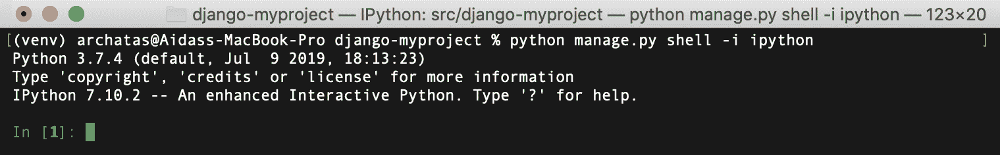

如果您使用`bpython`，则 shell 将显示为带有`>>>`提示，以及在输入时进行代码高亮和文本自动完成，如下所示：

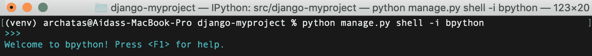

**默认的 Python 接口** shell 如下所示，也使用`>>>`提示，但前言提供有关系统的信息：

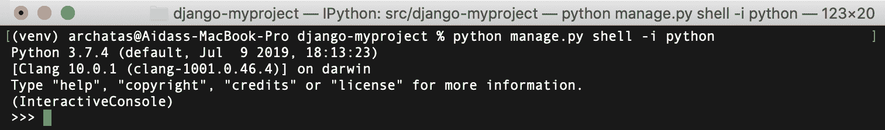

现在您可以导入类、函数或变量，并对它们进行操作。例如，要查看已安装模块的版本，您可以导入该模块，然后尝试读取其`__version__`、`VERSION`或`version`属性（使用`bpython`显示，它还将演示其高亮和自动完成功能），如下所示：

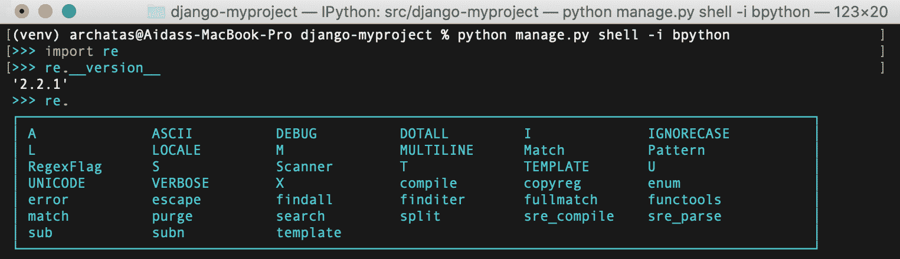

+   要获取模块、类、函数、方法、关键字或文档主题的全面描述，请使用`help()`函数。您可以传递一个包含特定实体路径的字符串，或者实体本身，如下所示：

```py
>>> help("django.forms")
```

这将打开`django.forms`模块的帮助页面。使用箭头键上下滚动页面。按`Q`键返回到 shell。如果您运行`help()`而没有参数，它会打开一个交互式帮助页面。在那里，您可以输入模块、类、函数等的任何路径，并获取有关其功能和用法的信息。要退出交互式帮助，请按`Ctrl + D`。

+   以下是如何将实体传递给`help()`函数的示例：

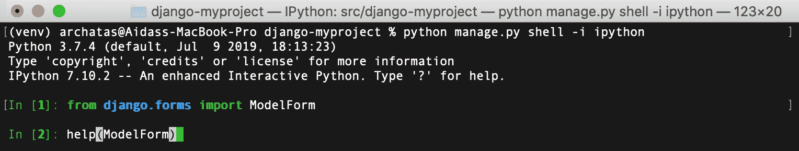

这将打开一个`ModelForm`类的帮助页面，如下所示：

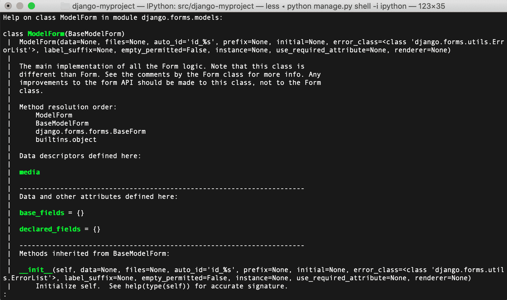

要快速查看模型实例可用的字段和值，可以使用`__dict__`属性。您可以使用`pprint()`函数以更可读的格式打印字典（不仅仅是一行长），如下面的屏幕截图所示。请注意，当我们使用`__dict__`时，我们不会得到多对多关系；但是，这可能足够快速概述字段和值：

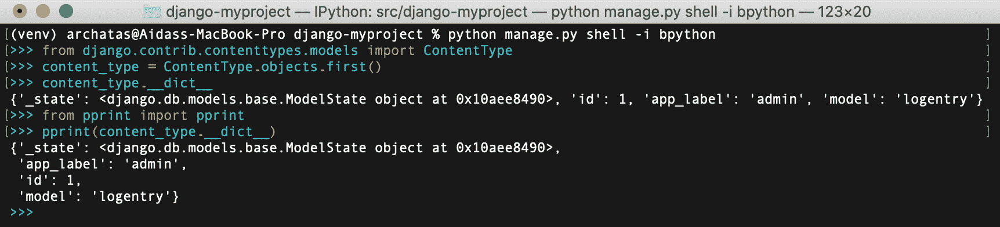

+   要获取对象的所有可用属性和方法，可以使用`dir()`函数，如下所示：

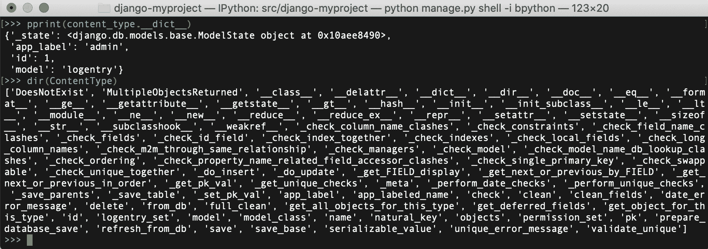

+   要每行打印一个属性，可以使用以下屏幕截图中显示的代码：

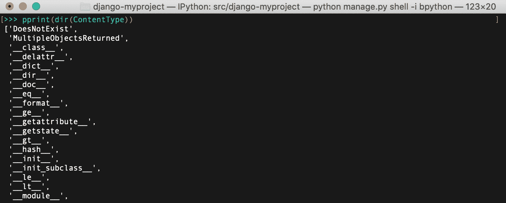

+   Django shell 对于在将其放入模型方法、视图或管理命令之前尝试`QuerySets`或正则表达式非常有用。例如，要检查电子邮件验证正则表达式，可以在 Django shell 中输入以下内容：

```py
>>> import re
>>> email_pattern = re.compile(r"[^@]+@[^@]+\.[^@]+")
>>> email_pattern.match("aidas@bendoraitis.lt")
<_sre.SRE_Match object at 0x1075681d0>
```

+   如果您想尝试不同的`QuerySets`，请使用以下代码：

```py
>>> from django.contrib.auth.models import User 
>>> User.objects.filter(groups__name="Editors")
[<User: admin>]
```

+   要退出 Django shell，请按*Ctrl* + *D*，或输入以下命令：

```py
>>> exit()
```

# 工作原理...

普通 Python shell 和 Django shell 之间的区别在于，当您运行 Django shell 时，`manage.py`会设置`DJANGO_SETTINGS_MODULE`环境变量，以便它指向项目的`settings.py`路径，然后 Django shell 中的所有代码都在项目的上下文中处理。通过使用第三方 IPython 或 bpython 接口，我们可以进一步增强默认的 Python shell，包括语法高亮、自动完成等。

# 另请参阅

*使用数据库查询表达式*配方

*为更好的国际化支持修补 slugify()函数*配方

# 使用数据库查询表达式

**Django 对象关系映射（ORM）**具有特殊的抽象构造，可用于构建复杂的数据库查询。它们称为**查询表达式**，它们允许您过滤数据、对其进行排序、注释新列并聚合关系。在这个配方中，您将看到这些如何在实践中使用。我们将创建一个应用程序，显示病毒视频，并计算每个视频被匿名用户或登录用户观看的次数。

# 准备工作

首先，创建一个`viral_videos`应用程序，其中包含一个`ViralVideo`模型，并设置系统默认记录到日志文件：

创建`viral_videos`应用程序并将其添加到设置中的`INSTALLED_APPS`下：

```py
# myproject/settings/_base.py
INSTALLED_APPS = [
    # …
    "myproject.apps.core",
    "myproject.apps.viral_videos",
]
```

接下来，创建一个病毒视频的模型，其中包含**通用唯一标识符**（**UUID**）作为主键，以及创建和修改时间戳、标题、嵌入代码、匿名用户的印象和经过身份验证用户的印象，如下所示：

```py
# myproject/apps/viral_videos/models.py import uuid
from django.db import models
from django.utils.translation import ugettext_lazy as _

from myproject.apps.core.models import (
 CreationModificationDateBase,
 UrlBase,
)

class ViralVideo(CreationModificationDateBase, UrlBase):
    uuid = models.UUIDField(primary_key=True, default=None, 
     editable=False)
    title = models.CharField(_("Title"), max_length=200, blank=True)
    embed_code = models.TextField(_("YouTube embed code"), blank=True)
    anonymous_views = models.PositiveIntegerField(_("Anonymous 
     impressions"), default=0)
    authenticated_views = models.PositiveIntegerField(
        _("Authenticated impressions"), default=0
    )

    class Meta:
        verbose_name = _("Viral video")
        verbose_name_plural = _("Viral videos")

    def __str__(self):
        return self.title

    def get_url_path(self):
        from django.urls import reverse

        return reverse("viral_videos:viral_video_detail", 
         kwargs={"pk": self.pk})

    def save(self, *args, **kwargs):
        if self.pk is None:
            self.pk = uuid.uuid4()
        super().save(*args, **kwargs)
```

为新应用程序创建并运行迁移，以便您的数据库准备就绪：

```py
(env)$ python manage.py makemigrations
(env)$ python manage.py migrate
```

将日志配置添加到设置中：

```py
LOGGING = {
    "version": 1,
    "disable_existing_loggers": False,
    "handlers": {
        "file": {
            "level": "DEBUG",
            "class": "logging.FileHandler",
            "filename": os.path.join(BASE_DIR, "tmp", "debug.log"),
        }
    },
    "loggers": {"django": {"handlers": ["file"], "level": "DEBUG", 
     "propagate": True}},
}
```

这将调试信息记录到名为`tmp/debug.log`的临时文件中。

# 如何做...

为了说明查询表达式，让我们创建病毒视频详细视图，并将其插入到 URL 配置中，如下所示：

1.  在`views.py`中创建病毒视频列表和详细视图如下：

```py
# myproject/apps/viral_videos/views.py
import logging

from django.conf import settings
from django.db import models
from django.utils.timezone import now, timedelta
from django.shortcuts import render, get_object_or_404
from django.views.generic import ListView

from .models import ViralVideo

POPULAR_FROM = getattr(settings, "VIRAL_VIDEOS_POPULAR_FROM", 500)

logger = logging.getLogger(__name__)

class ViralVideoList(ListView):
    template_name = "viral_videos/viral_video_list.html"
    model = ViralVideo

def viral_video_detail(request, pk):
    yesterday = now() - timedelta(days=1)

    qs = ViralVideo.objects.annotate(
        total_views=models.F("authenticated_views") + 
         models.F("anonymous_views"),
        label=models.Case(
            models.When(total_views__gt=POPULAR_FROM, 
             then=models.Value("popular")),
            models.When(created__gt=yesterday, 
             then=models.Value("new")),
            default=models.Value("cool"),
            output_field=models.CharField(),
        ),
    )

    # DEBUG: check the SQL query that Django ORM generates
    logger.debug(f"Query: {qs.query}")

    qs = qs.filter(pk=pk)
    if request.user.is_authenticated:
        qs.update(authenticated_views=models
         .F("authenticated_views") + 1)
    else:
        qs.update(anonymous_views=models.F("anonymous_views") + 1)

    video = get_object_or_404(qs)

    return render(request, "viral_videos/viral_video_detail.html", 
     {"video": video})
```

1.  为应用程序定义 URL 配置如下：

```py
# myproject/apps/viral_videos/urls.py
from django.urls import path

from .views import ViralVideoList, viral_video_detail

app_name = "viral_videos"

urlpatterns = [
    path("", ViralVideoList.as_view(), name="viral_video_list"),
    path("<uuid:pk>/", viral_video_detail, 
     name="viral_video_detail"),
]
```

1.  将应用程序的 URL 配置包含在项目的根 URL 配置中，如下所示：

```py
# myproject/urls.py
from django.conf.urls.i18n import i18n_patterns
from django.urls import include, path

urlpatterns = i18n_patterns(
path("viral-videos/", include("myproject.apps.viral_videos.urls", namespace="viral_videos")),
)
```

1.  创建以下病毒视频列表视图的模板：

```py
{# viral_videos/viral_video_list.html #}




    <h1></h1>
    <ul>
        
            <li><a href="{{ video.get_url_path }}">
             {{ video.title }}</a></li>
        
    </ul>

```

1.  创建以下病毒视频详细视图的模板：

```py
{# viral_videos/viral_video_detail.html #}




    <h1>{{ video.title }}
        <span class="badge">{{ video.label }}</span>
    </h1>
    <div>{{ video.embed_code|safe }}</div>
    <div>
        <h2></h2>
        <ul>
            <li>:
                {{ video.authenticated_views }}
            </li>
            <li>:
                {{ video.anonymous_views }}
            </li>
            <li>:
                {{ video.total_views }}
            </li>
        </ul>
    </div>

```

1.  设置`viral_videos`应用程序的管理如下，并在完成后向数据库添加一些视频：

```py
# myproject/apps/viral_videos/admin.py
from django.contrib import admin
from .models import ViralVideo

@admin.register(ViralVideo)
class ViralVideoAdmin(admin.ModelAdmin):
    list_display = ["title", "created", "modified"]
```

# 它是如何工作的...

您可能已经注意到视图中的`logger.debug()`语句。如果以`DEBUG`模式运行服务器并在浏览器中访问视频（例如，在本地开发中访问`http://127.0.0.1:8000/en/viral-videos/2b14ffd3-d1f1-4699-a07b-1328421d8312/`），则会在日志中打印类似以下的 SQL 查询（`tmp/debug.log`）：

```py
SELECT "viral_videos_viralvideo"."created", "viral_videos_viralvideo"."modified", "viral_videos_viralvideo"."uuid", "viral_videos_viralvideo"."title", "viral_videos_viralvideo"."embed_code", "viral_videos_viralvideo"."anonymous_views", "viral_videos_viralvideo"."authenticated_views", ("viral_videos_viralvideo"."authenticated_views" + "viral_videos_viralvideo"."anonymous_views") AS "total_views", CASE WHEN ("viral_videos_viralvideo"."authenticated_views" + "viral_videos_viralvideo"."anonymous_views") > 500 THEN 'popular' WHEN "viral_videos_viralvideo"."created" > '2019-12-21T05:01:58.775441+00:00'::timestamptz THEN 'new' ELSE 'cool' END 
 AS "label" FROM "viral_videos_viralvideo" WHERE "viral_videos_viralvideo"."uuid" = '2b14ffd3-d1f1-4699-a07b-1328421d8312'::uuid LIMIT 21; args=(500, 'popular', datetime.datetime(2019, 12, 21, 5, 1, 58, 775441, tzinfo=<UTC>), 'new', 'cool', UUID('2b14ffd3-d1f1-4699-a07b-1328421d8312'))
```

然后，在浏览器中，您将看到一个简单的页面，显示如下内容：

+   视频的标题

+   视频的标签

+   嵌入式视频

+   经过身份验证和匿名用户的观看次数，以及总观看次数

它将类似于以下图像：

！[](img/4a1f0dea-f959-4597-879d-5e24a3470968.png)

Django `QuerySets`中的`annotate()`方法允许您向`SELECT` SQL 语句添加额外的列，以及为从`QuerySets`检索的对象创建的临时属性。使用`models.F()`，我们可以引用所选数据库表中的不同字段值。在此示例中，我们将创建`total_views`属性，该属性是经过身份验证和匿名用户查看的总和。

使用`models.Case()`和`models.When()`，我们可以根据不同的条件返回值。为了标记这些值，我们使用`models.Value()`。在我们的示例中，我们将为 SQL 查询创建`label`列，并为`QuerySet`返回的对象创建属性。如果有超过 500 次印象，则将其设置为 popular，如果在过去的 24 小时内创建，则设置为 new，否则设置为 cool。

在视图的末尾，我们调用了`qs.update()`方法。它们会增加当前视频的`authenticated_views`或`anonymous_views`，具体取决于查看视频的用户是否已登录。增加不是在 Python 级别进行的，而是在 SQL 级别进行的。这解决了所谓的竞争条件问题，即两个或更多访问者同时访问视图，尝试同时增加视图计数的问题。

# 另请参阅

+   *在 Django shell 中使用*的方法

+   第二章*，模型和数据库结构*中的*使用 URL 相关方法创建模型 mixin*的方法

+   第二章*，模型和数据库结构*中的*创建处理创建和修改日期的模型 mixin*的方法

# 为了更好地支持国际化，对 slugify()函数进行猴子补丁

猴子补丁（或游击补丁）是一段代码，它在运行时扩展或修改另一段代码。不建议经常使用猴子补丁；但是，有时它们是修复复杂的第三方模块中的错误的唯一可能方法，而不是创建模块的单独分支。此外，猴子补丁可以用于准备功能或单元测试，而无需使用复杂和耗时的数据库或文件操作。

在这个示例中，您将学习如何使用第三方`transliterate`包中的函数来替换默认的`slugify()`函数，该函数更智能地处理 Unicode 字符到 ASCII 等效字符的转换，并包含许多语言包，根据需要提供更具体的转换。快速提醒，我们使用`slugify()`实用程序来创建对象标题或上传文件名的 URL 友好版本。处理时，该函数会删除任何前导和尾随空格，将文本转换为小写，删除非字母数字字符，并将空格转换为连字符。

# 准备就绪

让我们从这些小步骤开始：

1.  按照以下方式在虚拟环境中安装`transliterate`：

```py
(env)$ pip install transliterate==1.10.2
```

1.  然后，在项目中创建一个`guerrilla_patches`应用，并将其放在设置中的`INSTALLED_APPS`下。

# 如何做...

在`guerrilla_patches`应用的`models.py`文件中，用`transliterate`包中的`slugify`函数覆盖`django.utils.text`中的`slugify`函数：

```py
# myproject/apps/guerrilla_patches/models.py from django.utils import text
from transliterate import slugify

text.slugify = slugify
```

# 它是如何工作的...

默认的 Django `slugify()`函数不正确地处理德语变音符号。要自己看看，请尝试使用所有德语变音符号的非常长的德语单词进行 slugify。首先，在 Django shell 中运行以下代码，不使用 monkey patch：

```py
(env)$ python manage.py shell
>>> from django.utils.text import slugify
>>> slugify("Heizölrückstoßabdämpfung")
'heizolruckstoabdampfung'
```

这在德语中是不正确的，因为字母`ß`被完全剥离，而不是被替换为`ss`，字母`ä`，`ö`和`ü`被改为`a`，`o`和`u`，而它们应该被替换为`ae`，`oe`和`ue`。

我们创建的 monkey patch 在初始化时加载了`django.utils.text`模块，并在核心`slugify()`函数的位置重新分配了`transliteration.slugify`。现在，如果您在 Django shell 中运行相同的代码，您将得到正确的结果，如下所示：

```py
(env)$ python manage.py shell
>>> from django.utils.text import slugify
>>> slugify("Heizölrückstoßabdämpfung")
'heizoelrueckstossabdaempfung'
```

要了解如何使用`transliterate`模块，请参阅[`pypi.org/project/transliterate`](https://pypi.org/project/transliterate/)。

# 还有更多...

在创建 monkey patch 之前，我们需要完全了解要修改的代码的工作原理。这可以通过分析现有代码并检查不同变量的值来完成。为此，有一个有用的内置 Python 调试器模块**pdb**，可以临时添加到 Django 代码（或任何第三方模块）中，在任何断点处停止开发服务器的执行。使用以下代码调试 Python 模块中不清楚的部分：

```py
breakpoint()
```

这将启动交互式 shell，您可以在其中输入变量以查看它们的值。如果输入`c`或`continue`，代码执行将继续直到下一个断点。如果输入`q`或`quit`，管理命令将被中止。

您可以在[`docs.python.org/3/library/pdb.html`](https://docs.python.org/3/library/pdb.html)了解更多 Python 调试器命令以及如何检查代码的回溯。

在开发服务器中查看变量值的另一种快速方法是通过引发带有变量作为消息的警告，如下所示：

```py
raise Warning, some_variable

```

当您处于`DEBUG`模式时，Django 记录器将为您提供回溯和其他本地变量。

在将工作提交到存储库之前，请不要忘记删除调试代码。

如果您使用 PyCharm 交互式开发环境，可以在那里设置断点并直观地调试变量，而无需修改源代码。

# 另请参阅

+   *使用 Django shell*示例

# 切换调试工具栏

在使用 Django 进行开发时，您可能希望检查请求标头和参数，检查当前模板上下文，或者测量 SQL 查询的性能。所有这些以及更多功能都可以通过**Django Debug Toolbar**实现。它是一组可配置的面板，显示有关当前请求和响应的各种调试信息。在本教程中，我们将指导您如何根据一个由书签工具设置的 cookie 的值来切换调试工具栏的可见性。书签工具是一个带有一小段 JavaScript 代码的书签，您可以在浏览器中的任何页面上运行它。

# 准备工作

要开始切换调试工具栏的可见性，请按照以下步骤进行：

1.  在虚拟环境中安装 Django Debug Toolbar：

```py
(env)$ pip install django-debug-toolbar==2.1

```

1.  在设置的`INSTALLED_APPS`下添加`"debug_toolbar"`：

```py
# myproject/settings/_base.py
INSTALLED_APPS = [
    # …
    "debug_toolbar",
]
```

# 如何做...

按照以下步骤设置 Django Debug Toolbar，可以使用浏览器中的书签工具切换开启或关闭：

1.  添加以下项目设置：

```py
# myproject/settings/_base.py
DEBUG_TOOLBAR_CONFIG = {
    "DISABLE_PANELS": [],
    "SHOW_TOOLBAR_CALLBACK": 
    "myproject.apps.core.misc.custom_show_toolbar",
    "SHOW_TEMPLATE_CONTEXT": True,
}

DEBUG_TOOLBAR_PANELS = [
    "debug_toolbar.panels.versions.VersionsPanel",
    "debug_toolbar.panels.timer.TimerPanel",
    "debug_toolbar.panels.settings.SettingsPanel",
    "debug_toolbar.panels.headers.HeadersPanel",
    "debug_toolbar.panels.request.RequestPanel",
    "debug_toolbar.panels.sql.SQLPanel",
    "debug_toolbar.panels.templates.TemplatesPanel",
    "debug_toolbar.panels.staticfiles.StaticFilesPanel",
    "debug_toolbar.panels.cache.CachePanel",
    "debug_toolbar.panels.signals.SignalsPanel",
    "debug_toolbar.panels.logging.LoggingPanel",
    "debug_toolbar.panels.redirects.RedirectsPanel",
]
```

1.  在`core`应用程序中，创建一个带有`custom_show_toolbar()`函数的`misc.py`文件，如下所示：

```py
# myproject/apps/core/misc.py
def custom_show_toolbar(request):
    return "1" == request.COOKIES.get("DebugToolbar", False)
```

1.  在项目的`urls.py`中，添加以下配置规则：

```py
# myproject/urls.py
from django.conf.urls.i18n import i18n_patterns
from django.urls import include, path
from django.conf import settings
import debug_toolbar

urlpatterns = i18n_patterns(
    # …
)

urlpatterns = [
    path('__debug__/', include(debug_toolbar.urls)),
] + urlpatterns
```

1.  打开 Chrome 或 Firefox 浏览器，转到书签管理器。然后，创建两个包含 JavaScript 的新书签。第一个链接将显示工具栏，看起来类似于以下内容：

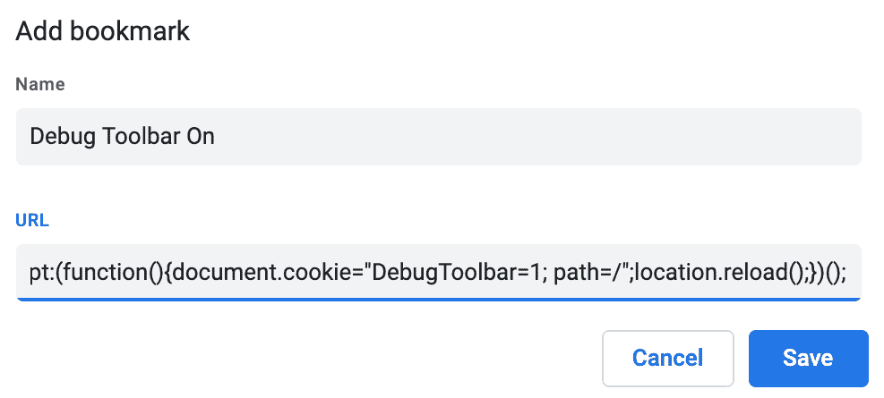

JavaScript 代码如下：

```py
javascript:(function(){document.cookie="DebugToolbar=1; path=/";location.reload();})();
```

1.  第二个 JavaScript 链接将隐藏工具栏，看起来类似于以下内容：

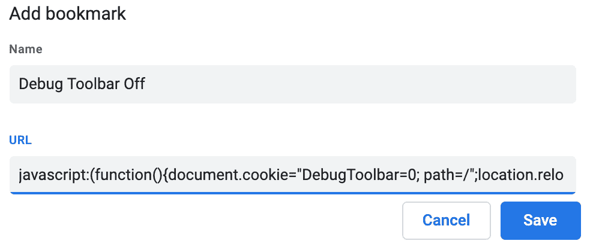

这是完整的 JavaScript 代码：

```py
javascript:(function(){document.cookie="DebugToolbar=0; path=/";location.reload();})();
```

# 工作原理...

`DEBUG_TOOLBAR_PANELS`设置定义了工具栏中要显示的面板。`DEBUG_TOOLBAR_CONFIG`字典定义了工具栏的配置，包括用于检查是否显示工具栏的函数的路径。

默认情况下，当您浏览项目时，Django Debug Toolbar 不会显示；但是，当您单击书签工具 Debug Toolbar On 时，`DebugToolbar` cookie 将被设置为`1`，页面将被刷新，您将看到带有调试面板的工具栏，例如，您将能够检查 SQL 语句的性能以进行优化，如下面的屏幕截图所示：

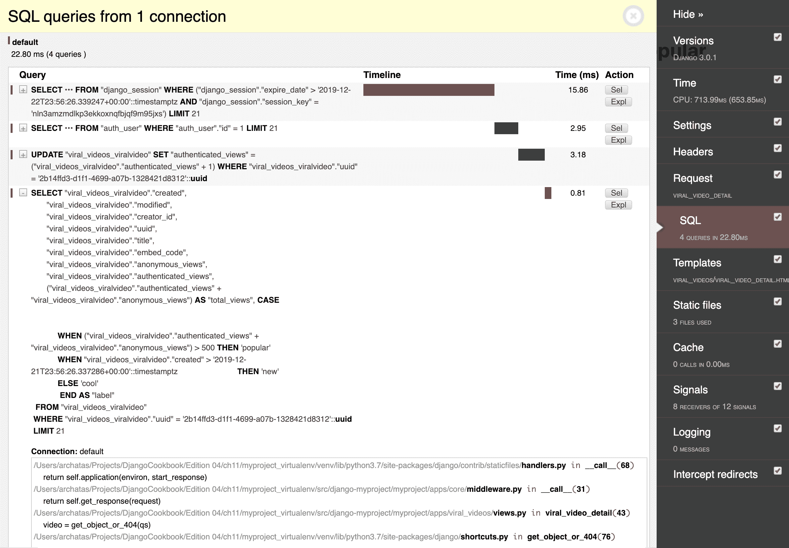

您还可以检查当前视图的模板上下文变量，如下面的屏幕截图所示：

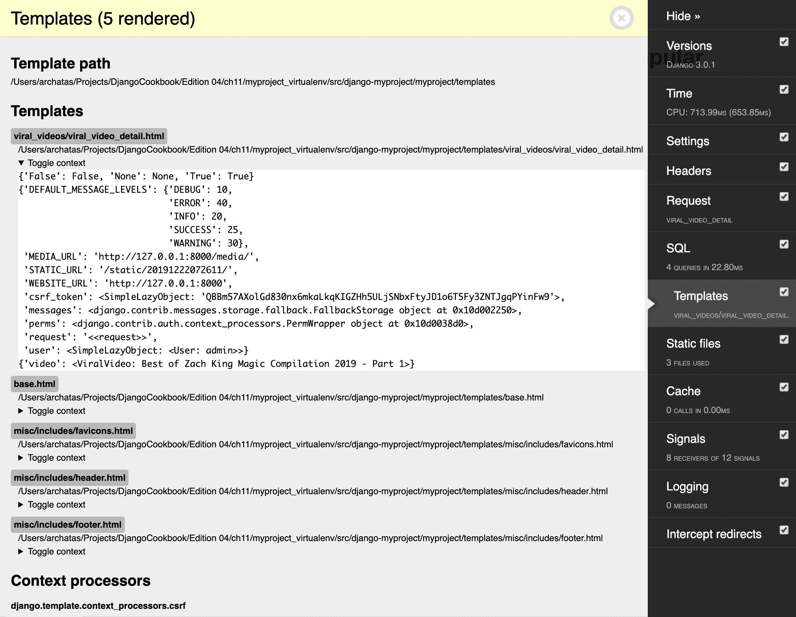

单击第二个书签工具 Debug Toolbar Off，将类似地将`DebugToolbar` cookie 设置为`0`并刷新页面，再次隐藏工具栏。

# 另请参阅

+   *通过电子邮件获取详细的错误报告*教程在第十三章*维护*中

# 使用 ThreadLocalMiddleware

`HttpRequest`对象包含有关当前用户、语言、服务器变量、cookie、会话等的有用信息。事实上，`HttpRequest`在视图和中间件中提供，并且您可以将其（或其属性值）传递给表单、模型方法、模型管理器、模板等。为了简化生活，您可以使用所谓的`ThreadLocalMiddleware`，它将当前的`HttpRequest`对象存储在全局可访问的 Python 线程中。因此，您可以从模型方法、表单、信号处理程序和以前无法直接访问`HttpRequest`对象的其他位置访问它。在本教程中，我们将定义这个中间件。

# 准备工作

如果尚未这样做，请创建`core`应用程序并将其放在设置的`INSTALLED_APPS`下。

# 如何做...

执行以下两个步骤来设置`ThreadLocalMiddleware`，它可以在项目代码的任何函数或方法中获取当前的`HttpRequest`或用户：

1.  在`core`应用程序中添加一个`middleware.py`文件，内容如下：

```py
# myproject/apps/core/middleware.py
from threading import local

_thread_locals = local()

def get_current_request():
    """
    :returns the HttpRequest object for this thread
    """
    return getattr(_thread_locals, "request", None)

def get_current_user():
    """
    :returns the current user if it exists or None otherwise """
    request = get_current_request()
    if request:
        return getattr(request, "user", None)

class ThreadLocalMiddleware(object):
    """
    Middleware to add the HttpRequest to thread local storage
    """

    def __init__(self, get_response):
        self.get_response = get_response

    def __call__(self, request):
        _thread_locals.request = request
        return self.get_response(request)
```

1.  将此中间件添加到设置中的`MIDDLEWARE`中：

```py
# myproject/settings/_base.py
MIDDLEWARE = [
    "django.middleware.security.SecurityMiddleware",
    "django.contrib.sessions.middleware.SessionMiddleware",
    "django.middleware.common.CommonMiddleware",
    "django.middleware.csrf.CsrfViewMiddleware",
    "django.contrib.auth.middleware.AuthenticationMiddleware",
    "django.contrib.messages.middleware.MessageMiddleware",
    "django.middleware.clickjacking.XFrameOptionsMiddleware",
    "django.middleware.locale.LocaleMiddleware",
    "debug_toolbar.middleware.DebugToolbarMiddleware",
 "myproject.apps.core.middleware.ThreadLocalMiddleware",
]
```

# 它是如何工作的...

`ThreadLocalMiddleware` 处理每个请求，并将当前的 `HttpRequest` 对象存储在当前线程中。Django 中的每个请求-响应周期都是单线程的。我们创建了两个函数：`get_current_request()` 和 `get_current_user()`。这些函数可以从任何地方使用，以分别获取当前的 `HttpRequest` 对象或当前用户。

例如，您可以使用此中间件来开发和使用 `CreatorMixin`，它将保存当前用户作为新模型对象的创建者，如下所示：

```py
# myproject/apps/core/models.py
from django.conf import settings
from django.db import models
from django.utils.translation import gettext_lazy as _

class CreatorBase(models.Model):
    """
    Abstract base class with a creator
    """

    creator = models.ForeignKey(
        settings.AUTH_USER_MODEL,
        verbose_name=_("creator"),
        editable=False,
        blank=True,
        null=True,
        on_delete=models.SET_NULL,
    )

    class Meta:
        abstract = True

    def save(self, *args, **kwargs):
        from .middleware import get_current_user

        if not self.creator:
 self.creator = get_current_user()
        super().save(*args, **kwargs)

    save.alters_data = True
```

# 另请参阅

+   第二章*，模型和数据库结构*中的*创建一个具有与 URL 相关方法的模型混合*教程

+   第二章*，模型和数据库结构*中的*创建一个处理创建和修改日期的模型混合*教程

+   第二章*，模型和数据库结构*中的*创建一个处理元标签的模型混合*教程

+   第二章*，模型和数据库结构*中的*创建一个处理通用关系的模型混合*教程

# 使用信号通知管理员有关新条目

Django 框架包括**信号**的概念，类似于 JavaScript 中的事件。有一些内置的信号。您可以使用它们在模型初始化之前和之后触发操作，保存或删除实例，迁移数据库模式，处理请求等。此外，您可以在可重用的应用程序中创建自己的信号，并在其他应用程序中处理它们。在本教程中，您将学习如何使用信号在特定模型保存时向管理员发送电子邮件。

# 准备工作

让我们从我们在*使用数据库查询表达式*教程中创建的 `viral_videos` 应用程序开始。

# 如何做...

按照以下步骤为管理员创建通知：

1.  创建一个名为 `signals.py` 的文件，内容如下：

```py
# myproject/apps/viral_videos/signals.py
from django.db.models.signals import post_save
from django.dispatch import receiver
from django.template.loader import render_to_string

from .models import ViralVideo

@receiver(post_save, sender=ViralVideo)
def inform_administrators(sender, **kwargs):
    from django.core.mail import mail_admins

    instance = kwargs["instance"]
    created = kwargs["created"]

    if created:
        context = {"title": instance.title, "link": 
         instance.get_url()}
        subject = render_to_string(
            "viral_videos/email/administrator/subject.txt", context
        )
        plain_text_message = render_to_string(
            "viral_videos/email/administrator/message.txt", context
        )
        html_message = render_to_string(
            "viral_videos/email/administrator/message.html", 
              context
        )

        mail_admins(
            subject=subject.strip(),
            message=plain_text_message,
            html_message=html_message,
            fail_silently=True,
        )
```

1.  然后我们需要创建一些模板。首先是电子邮件主题的模板：

```py
{# viral_videos/email/administrator/subject.txt #}
New Viral Video Added
```

1.  然后创建一个纯文本消息的模板，类似于以下内容：

```py
{# viral_videos/email/administrator/message.txt #}
A new viral video called "{{ title }}" has been created.
You can preview it at {{ link }}.
```

1.  然后创建一个 HTML 消息的模板如下：

```py
{# viral_videos/email/administrator/message.html #}
<p>A new viral video called "{{ title }}" has been created.</p>
<p>You can <a href="{{ link }}">preview it here</a>.</p>
```

1.  创建一个名为 `apps.py` 的文件，内容如下：

```py
# myproject/apps/viral_videos/apps.py
from django.apps import AppConfig
from django.utils.translation import ugettext_lazy as _

class ViralVideosAppConfig(AppConfig):
    name = "myproject.apps.viral_videos"
    verbose_name = _("Viral Videos")

    def ready(self):
        from .signals import inform_administrators
```

1.  使用以下内容更新 `__init__.py` 文件：

```py
# myproject/apps/viral_videos/__init__.py
default_app_config = "myproject.apps.viral_videos.apps.ViralVideosAppConfig"
```

确保在项目设置中设置了类似以下内容的 `ADMINS`：

```py
# myproject/settings/_base.py
ADMINS = [("Administrator", "admin@example.com")]
```

# 它是如何工作的...

`ViralVideosAppConfig` 应用配置类具有 `ready()` 方法，当项目的所有模型加载到内存中时将调用该方法。根据 Django 文档，信号允许特定发送者通知一组接收者发生了某个动作。因此，在 `ready()` 方法中，我们导入 `inform_administrators()` 函数。

通过 `@receiver` 装饰器，`inform_administrators()` 被注册为 `post_save` 信号的接收者，并且我们将其限制为仅处理 `ViralVideo` 模型为 `sender` 的信号。因此，每当我们保存 `ViralVideo` 对象时，将调用 `receiver` 函数。`inform_administrators()` 函数检查视频是否是新创建的。如果是，它会向在设置中列出的系统管理员发送电子邮件。

我们使用模板生成 `subject`、`plain_text_message` 和 `html_message` 的内容，以便我们可以在我们的应用程序中为每个定义默认模板。如果我们将我们的 `viral_videos` 应用程序公开可用，那些将其引入其自己项目的人可以根据需要自定义模板，也许将它们包装在公司电子邮件模板包装器中。

您可以在官方文档 [`docs.djangoproject.com/en/3.0/topics/signals/`](https://docs.djangoproject.com/en/3.0/topics/signals/) 中了解有关 Django 信号的更多信息。

# 另请参阅

+   在第一章*, Getting Started with Django 3.0*中的*创建应用程序配置*配方

+   使用数据库查询表达式的配方

+   检查缺失设置的配方

# 检查缺失设置

从 Django 1.7 开始，您可以使用一个可扩展的**系统检查框架**，它取代了旧的`validate`管理命令。在这个配方中，您将学习如何创建一个检查，以查看`ADMINS`设置是否已设置。同样，您还可以检查您正在使用的 API 是否设置了不同的密钥或访问令牌。

# 准备工作

让我们从在*使用数据库查询表达式*配方中创建并在上一个配方中扩展的`viral_videos`应用程序开始。

# 如何做...

要使用系统检查框架，请按照以下步骤进行：

1.  创建`checks.py`文件，内容如下：

```py
# myproject/apps/viral_videos/checks.py
from textwrap import dedent

from django.core.checks import Warning, register, Tags

@register(Tags.compatibility)
def settings_check(app_configs, **kwargs):
    from django.conf import settings

    errors = []

    if not settings.ADMINS:
        errors.append(
            Warning(
                dedent("""
                    The system admins are not set in the project 
                     settings
                """),
                obj=settings,
                hint=dedent("""
                    In order to receive notifications when new 
                     videos are created, define system admins 
                     in your settings, like:

                    ADMINS = (
                        ("Admin", "administrator@example.com"),
                    )
                """),
                id="viral_videos.W001",
            )
        )

    return errors
```

1.  在应用程序配置的`ready()`方法中导入检查，如下所示：

```py
# myproject/apps/viral_videos/apps.py
from django.apps import AppConfig
from django.utils.translation import ugettext_lazy as _

class ViralVideosAppConfig(AppConfig):
    name = "myproject.apps.viral_videos"
    verbose_name = _("Viral Videos")

    def ready(self):
        from .signals import inform_administrators
        from .checks import settings_check
```

1.  要尝试刚刚创建的检查，删除或注释掉`ADMINS`设置，然后在虚拟环境中运行`check`管理命令：

```py
(env)$ python manage.py check
System check identified some issues:

WARNINGS:
<Settings "myproject.settings.dev">: (viral_videos.W001)
The system admins are not set in the project settings

HINT:
In order to receive notifications when new videos are
created, define system admins in your settings, like:

ADMINS = (
    ("Admin", "administrator@example.com"),
)

System check identified 1 issue (0 silenced).
```

# 它是如何工作的...

系统检查框架在模型、字段、数据库、管理身份验证配置、内容类型和安全设置中有一堆检查，如果项目中的某些内容设置不正确，它会引发错误或警告。此外，您可以创建自己的检查，类似于我们在这个配方中所做的。

我们已经注册了`settings_check()`函数，如果项目中没有定义`ADMINS`设置，则返回一个带有`Warning`的列表。

除了来自`django.core.checks`模块的`Warning`实例外，返回的列表还可以包含`Debug`、`Info`、`Error`和`Critical`内置类的实例，或者继承自`django.core.checks.CheckMessage`的任何其他类。在调试、信息和警告级别记录会静默失败，而在错误和严重级别记录会阻止项目运行。

在这个例子中，通过将`Tags.compatibility`参数传递给`@register`装饰器，将检查标记为兼容性检查。`Tags`中提供的其他选项包括以下内容：

+   `admin`用于与管理员站点相关的检查

+   `caches`用于与服务器缓存相关的检查

+   `database`用于与数据库配置相关的检查

+   `models`用于与模型、模型字段和管理器相关的检查

+   `security`用于与安全相关的检查

+   `信号`用于与信号声明和处理程序相关的检查

+   `staticfiles`用于静态文件检查

+   `templates`用于与模板相关的检查

+   `translation`用于与字符串翻译相关的检查

+   `url`用于与 URL 配置相关的检查

在官方文档中了解有关系统检查框架的更多信息[`docs.djangoproject.com/en/3.0/topics/checks/`](https://docs.djangoproject.com/en/3.0/topics/checks/)​。

# 另请参阅

+   在第一章*, Getting Started with Django 3.0*中的*创建应用程序配置*配方

+   使用数据库查询表达式的配方

+   使用信号通知管理员有关新条目的配方
