# 第五章：实现社交认证

在上一章中，您将用户注册和认证集成到您的网站中。您实现了密码更改、重置和恢复功能，并学习了如何为您的用户创建自定义配置文件模型。

在本章中，您将使用 Google 为您的网站添加社交认证。您将使用**Python Social Auth for Django**通过 OAuth 2.0 实现社交认证，OAuth 2.0 是行业标准的授权协议。您还将修改社交认证管道，以自动为新用户创建用户配置文件。

本章将涵盖以下内容：

+   使用消息框架

+   构建自定义认证后端

+   防止用户使用现有的电子邮件

+   使用 Python Social Auth 添加社交认证

+   使用 Django Extensions 通过 HTTPS 运行开发服务器

+   添加使用 Google 的认证

+   为使用社交认证注册的用户创建配置文件

# 功能概述

*图 5.1*展示了本章将构建的视图、模板和功能：

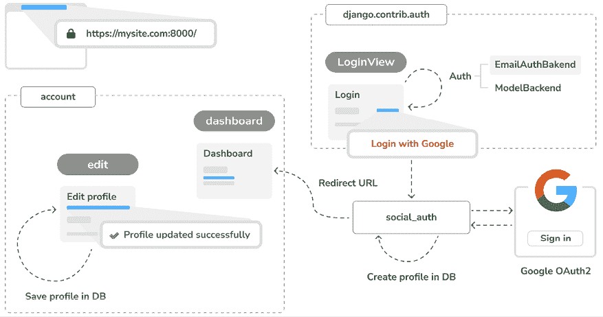

图 5.1：第五章构建的功能图

在本章中，您将使用 Django 消息框架在`edit`视图中生成成功和错误消息。您将为用户使用电子邮件地址进行认证创建一个新的认证后端`EmailAuthBackend`。您将在开发期间使用 Django Extensions 通过 HTTPS 提供服务，并在您的网站上使用 Python Social Auth 实现社交认证。用户认证成功后将被重定向到`dashboard`视图。您将自定义认证管道，以便在通过社交认证创建新用户时自动创建用户配置文件。

# 技术要求

本章的源代码可以在[`github.com/PacktPublishing/Django-5-by-example/tree/main/Chapter05`](https://github.com/PacktPublishing/Django-5-by-example/tree/main/Chapter05)找到。

本章中使用的所有 Python 包都包含在章节源代码中的`requirements.txt`文件中。您可以根据以下章节中的说明安装每个 Python 包，或者使用`python -m pip install -r requirements.txt`命令一次性安装所有依赖。

# 使用消息框架

当用户与平台交互时，有许多情况您可能希望通知他们特定操作的结果，例如在数据库中成功创建对象或成功提交表单。

Django 内置了消息框架，允许您向用户显示一次性通知。这通过提供对用户行为的即时反馈来增强用户体验，使界面更加直观和用户友好。

消息框架位于 `django.contrib.messages`，当你使用 `python manage.py startproject` 创建新项目时，它会被包含在 `settings.py` 文件的默认 `INSTALLED_APPS` 列表中。设置文件还包含 `django.contrib.messages.middleware.MessageMiddleware` 中间件，位于 `MIDDLEWARE` 设置中。

消息框架提供了一个简单的方法来向用户添加消息。默认情况下，消息存储在 cookie 中（如果会话存储失败），它们将在用户的下一个请求中显示和清除。你可以在你的视图中使用消息框架，通过导入 `messages` 模块并使用简单的快捷方式添加新消息，如下所示：

```py
from django.contrib import messages
messages.error(request, 'Something went wrong') 
```

你可以使用 `add_message()` 方法或以下任何快捷方法来创建新消息：

+   `success()`: 成功消息用于显示操作成功时

+   `info()`: 提供信息性消息

+   `warning()`: 这表明失败尚未发生，但它可能即将发生

+   `error()`: 这表明操作未成功或发生了失败

+   `debug()`: 这显示了在生产环境中将被删除或忽略的调试消息

让我们向项目中添加消息。消息框架对项目全局有效。我们将使用基本模板来向客户端显示任何可用的消息。这将允许我们在任何页面上通知客户端任何操作的结果。

打开 `account` 应用程序的 `templates/base.html` 模板，并添加以下加粗代码：

```py

<!DOCTYPE html>
<html>
<head>
<title></title>
<link href="" rel="stylesheet">
</head>
<body>
<div id="header">
    ...
  </div>
 ****
**<****ul****class****=****"messages"****>**
 ****
**<****li****class****=****"{{ message.tags }}"****>**
 **{{ message|safe }}**
**<****a****href****=****"#"****class****=****"close"****>****x****</****a****>**
**</****li****>**
 ****
**</****ul****>**
 ****
<div id="content">
    
    
  </div>
</body>
</html> 
```

消息框架包括 `django.contrib.messages.context_processors.messages` 上下文处理器，它将一个 `messages` 变量添加到请求上下文中。你可以在项目的 `TEMPLATES` 设置中的 `context_processors` 列表中找到它。你可以在模板中使用 `messages` 变量来向用户显示所有现有的消息。

上下文处理器是一个 Python 函数，它接受请求对象作为参数，并返回一个字典，该字典被添加到请求上下文中。你将在 *第八章*，*构建在线商店* 中学习如何创建自己的上下文处理器。

让我们修改 `edit` 视图以使用消息框架。

编辑 `account` 应用程序的 `views.py` 文件，并添加以下加粗行：

```py
**from** **django.contrib** **import** **messages**
# ...
@login_required
def edit(request):
    if request.method == 'POST':
        user_form = UserEditForm(
            instance=request.user,
            data=request.POST
        )
        profile_form = ProfileEditForm(
            instance=request.user.profile,
            data=request.POST,
            files=request.FILES
        )
        if user_form.is_valid() and profile_form.is_valid():
            user_form.save()
            profile_form.save()
 **messages.success(**
 **request,**
**'Profile updated successfully'**
 **)**
**else****:**
 **messages.error(request,** **'Error updating your profile'****)**
else:
        user_form = UserEditForm(instance=request.user)
        profile_form = ProfileEditForm(
                                    instance=request.user.profile)
    return render(
        request,
        'account/edit.html',
        {'user_form': user_form, 'profile_form': profile_form}
    ) 
```

当用户成功更新他们的个人资料时，会生成一条成功消息。如果任何表单包含无效数据，则生成错误消息。

在你的浏览器中打开 `http://127.0.0.1:8000/account/edit/` 并编辑用户的个人资料。当个人资料成功更新时，你应该看到以下消息：

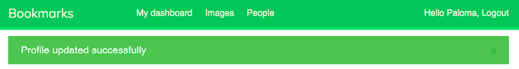

图 5.2：成功编辑的个人资料消息

在 **出生日期** 字段中输入一个无效的日期并再次提交表单。你应该看到以下消息：

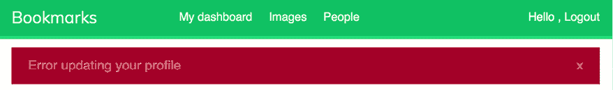

图 5.3：错误更新配置消息

生成消息以通知用户其操作结果非常直接。您还可以轻松地将消息添加到其他视图中。

您可以在 [`docs.djangoproject.com/en/5.0/ref/contrib/messages/`](https://docs.djangoproject.com/en/5.0/ref/contrib/messages/) 了解更多有关消息框架的信息。

现在我们已经构建了所有与用户认证和资料编辑相关的功能，我们将更深入地探讨自定义认证。我们将学习如何构建自定义后端认证，以便用户可以使用他们的电子邮件地址登录网站。

# 构建自定义认证后端

Django 允许您对不同的来源进行用户认证，例如内置的 Django 认证系统、外部认证系统如 **轻量级目录访问协议** (**LDAP**) 服务器，甚至是第三方提供商。`AUTHENTICATION_BACKENDS` 设置包括项目中可用的认证后端列表。Django 允许您指定多个认证后端，以实现灵活的认证方案。`AUTHENTICATION_BACKENDS` 设置的默认值如下：

```py
['django.contrib.auth.backends.ModelBackend'] 
```

默认的 `ModelBackend` 使用 `django.contrib.auth` 中的 `User` 模型对数据库中的用户进行认证。这对于大多数 Web 项目来说很合适。然而，您可以创建自定义后端来对其他来源进行用户认证。

您可以在 [`docs.djangoproject.com/en/5.0/topics/auth/customizing/#other-authentication-sources`](https://docs.djangoproject.com/en/5.0/topics/auth/customizing/#other-authentication-sources) 了解更多有关自定义认证的信息。

每当使用 `django.contrib.auth` 中的 `authenticate()` 函数时，Django 会依次尝试将用户与 `AUTHENTICATION_BACKENDS` 中定义的每个后端进行认证，直到其中一个成功认证用户。只有当所有后端都未能认证用户时，用户才不会被认证。

Django 提供了一种简单的方式来定义您自己的认证后端。认证后端是一个提供以下两个方法的类：

+   `authenticate()`: 它接受 `request` 对象和用户凭证作为参数。如果凭证有效，它必须返回一个与这些凭证匹配的 `user` 对象，否则返回 `None`。`request` 参数是一个 `HttpRequest` 对象，如果没有提供给 `authenticate()` 函数，则为 `None`。

+   `get_user()`: 它接受一个用户 ID 参数，并必须返回一个 `user` 对象。

创建自定义认证后端就像编写一个实现两种方法的 Python 类一样简单。让我们创建一个认证后端，允许用户使用他们的电子邮件地址而不是用户名在网站上进行认证。

在`account`应用程序目录内创建一个新文件，并将其命名为`authentication.py`。向其中添加以下代码：

```py
from django.contrib.auth.models import User
class EmailAuthBackend:
    """
    Authenticate using an e-mail address.
    """
def authenticate(self, request, username=None, password=None):
        try:
            user = User.objects.get(email=username)
            if user.check_password(password):
                return user
            return None
except (User.DoesNotExist, User.MultipleObjectsReturned):
            return None
def get_user(self, user_id):
        try:
            return User.objects.get(pk=user_id)
        except User.DoesNotExist:
            return None 
```

上述代码是一个简单的认证后端。`authenticate()`方法接收一个`request`对象和`username`以及`password`可选参数。我们可以使用不同的参数，但我们使用`username`和`password`来使我们的后端能够立即与认证框架视图一起工作。上述代码的工作原理如下：

+   `authenticate()`: 检索具有给定电子邮件地址的用户，并使用用户模型的内置`check_password()`方法检查密码。此方法处理密码散列，将提供的密码与数据库中存储的密码进行比较。捕获两种不同的 QuerySet 异常：`DoesNotExist`和`MultipleObjectsReturned`。如果找不到具有给定电子邮件地址的用户，将引发`DoesNotExist`异常。如果找到具有相同电子邮件地址的多个用户，将引发`MultipleObjectsReturned`异常。我们将在稍后修改注册和编辑视图，以防止用户使用现有的电子邮件地址。

+   `get_user()`: 您可以通过`user_id`参数提供的 ID 获取一个用户。Django 使用验证用户的后端在用户会话期间检索`User`对象。**pk**是**主键**的缩写，它是数据库中每条记录的唯一标识符。每个 Django 模型都有一个作为其主键的字段。默认情况下，主键是自动生成的 ID 字段。您可以在[`docs.djangoproject.com/en/5.0/topics/db/models/#automatic-primary-key-fields`](https://docs.djangoproject.com/en/5.0/topics/db/models/#automatic-primary-key-fields)找到有关自动主键字段的更多信息。

编辑您项目的`settings.py`文件并添加以下代码：

```py
AUTHENTICATION_BACKENDS = [
    'django.contrib.auth.backends.ModelBackend',
    'account.authentication.EmailAuthBackend',
] 
```

在上述设置中，我们保留了用于使用用户名和密码进行认证的默认`ModelBackend`，并包括我们自己的基于电子邮件的认证后端`EmailAuthBackend`。

在您的浏览器中打开`http://127.0.0.1:8000/account/login/`。请记住，Django 将尝试对每个后端进行用户验证，因此现在您应该能够使用您的用户名或电子邮件账户无缝登录。

用户凭证将使用`ModelBackend`进行验证，如果没有返回用户，则将使用`EmailAuthBackend`进行验证。

在`AUTHENTICATION_BACKENDS`设置中列出的后端顺序很重要。如果相同的凭证对多个后端都有效，Django 将使用列表中第一个成功验证这些凭证的后端来验证用户。这意味着一旦找到匹配项，Django 就不会继续检查剩余的后端。

## 防止用户使用现有的电子邮件地址

认证框架的`User`模型不允许创建具有相同电子邮件地址的用户。如果有两个或更多用户账户共享相同的电子邮件地址，我们将无法区分哪个用户正在认证。现在用户可以使用电子邮件地址登录，我们必须防止用户使用现有电子邮件地址进行注册。

现在，我们将更改用户注册表单，以防止多个用户使用相同的电子邮件地址进行注册。

编辑`account`应用的`forms.py`文件，并将以下加粗的行添加到`UserRegistrationForm`类中：

```py
class UserRegistrationForm(forms.ModelForm):
    password = forms.CharField(
        label='Password',
        widget=forms.PasswordInput
    )
    password2 = forms.CharField(
        label='Repeat password',
        widget=forms.PasswordInput
    )
    class Meta:
        model = User
        fields = ['username', 'first_name', 'email']
    def clean_password2(self):
        cd = self.cleaned_data
        if cd['password'] != cd['password2']:
            raise forms.ValidationError('Passwords don\'t match.')
        return cd['password2']
**def****clean_email****(****self****):**
 **data = self.cleaned_data[****'email'****]**
**if** **User.objects.****filter****(email=data).exists():**
**raise** **forms.ValidationError(****'Email already in use.'****)**
**return** **data** 
```

我们已经为`email`字段添加了验证，防止用户使用现有的电子邮件地址进行注册。我们构建了一个查询集来查找具有相同电子邮件地址的现有用户。我们使用`exists()`方法检查是否有任何结果。如果查询集包含任何结果，`exists()`方法返回`True`，否则返回`False`。

现在，将以下加粗的行添加到`UserEditForm`类中：

```py
class UserEditForm(forms.ModelForm):
    class Meta:
        model = User
        fields = ['first_name', 'last_name', 'email']
**def****clean_email****(****self****):**
 **data = self.cleaned_data[****'email'****]**
 **qs = User.objects.exclude(**
**id****=self.instance.****id**
 **).****filter****(**
 **email=data**
 **)**
**if** **qs.exists():**
**raise** **forms.ValidationError(****'Email already in use.'****)**
**return** **data** 
```

在这种情况下，我们为`email`字段添加了验证，防止用户将他们的现有电子邮件地址更改为另一个用户的现有电子邮件地址。我们从查询集中排除了当前用户。否则，用户的当前电子邮件地址将被视为现有电子邮件地址，表单将无法验证。

# 将社交认证添加到您的网站

社交认证是一个广泛使用的功能，允许用户使用服务提供商的现有账户通过**单点登录**（**SSO**）进行认证。认证过程允许用户使用来自社交服务如 Google、Facebook 或 Twitter 的现有账户登录到网站。在本节中，我们将使用 Google 将社交认证添加到网站。

要实现社交认证，我们将使用授权的行业标准协议**OAuth 2.0**。**OAuth**代表**开放授权**。OAuth 2.0 是一个旨在允许网站或应用代表用户访问其他 Web 应用托管资源的标准。Google 使用 OAuth 2.0 协议进行认证和授权。

Python Social Auth 是一个 Python 模块，简化了将社交认证添加到您网站的过程。使用此模块，您可以让您的用户使用其他服务的账户登录到您的网站。您可以在[`github.com/python-social-auth/social-app-django`](https://github.com/python-social-auth/social-app-django)找到此模块的代码。

此模块包含适用于不同 Python 框架的认证后端，包括 Django。

在 shell 中运行以下命令：

```py
python -m pip install social-auth-app-django==5.4.0 
```

这将安装 Python Social Auth。

然后，将`social_django`添加到项目`settings.py`文件中的`INSTALLED_APPS`设置，如下所示：

```py
INSTALLED_APPS = [
    # ...
**'social_django'****,**
] 
```

这是默认应用程序，用于将 Python Social Auth 添加到 Django 项目中。现在，运行以下命令以将 Python Social Auth 模型与您的数据库同步：

```py
python -m python manage.py migrate 
```

您应该看到默认应用程序的迁移已按以下方式应用：

```py
Applying social_django.0001_initial... OK
...
Applying social_django .0015_rename_extra_data_new_usersocialauth_extra_data... OK 
```

Python Social Auth 包括多个服务的认证后端。您可以在[`python-social-auth.readthedocs.io/en/latest/backends/index.html#supported-backends`](https://python-social-auth.readthedocs.io/en/latest/backends/index.html#supported-backends)找到所有可用后端的列表。

我们将向项目中添加社交认证，允许我们的用户使用 Google 后端进行认证。

首先，我们需要将社交登录 URL 模式添加到项目中。

打开`bookmarks`项目的`urls.py`主文件，并按照以下方式包含`social_django` URL 模式。新行以粗体突出显示：

```py
urlpatterns = [
    path('admin/', admin.site.urls),
    path('account/', include('account.urls')),
    **path(**
**'social-auth/'****,**
 **include(****'social_django.urls'****, namespace=****'social'****)**
 **),**
] 
```

我们的网络应用程序目前可以通过 localhost IP 地址`127.0.0.1`或使用`localhost`主机名访问。Google 允许在成功认证后将用户重定向到`localhost`，但其他社交服务期望 URL 重定向使用域名。在这个项目中，我们将通过在本地机器下使用域名来模拟真实环境。

定位您机器的`hosts`文件。如果您使用 Linux 或 macOS，`hosts`文件位于`/etc/hosts`。如果您使用 Windows，`hosts`文件位于`C:\Windows\System32\Drivers\etc\hosts`。

编辑您机器的`hosts`文件，并添加以下行到其中：

```py
127.0.0.1 mysite.com 
```

这将告诉您的计算机将`mysite.com`主机名指向您的机器。

让我们验证主机名关联是否成功。从 shell 提示符运行以下命令来启动开发服务器：

```py
python manage.py runserver 
```

在浏览器中打开`http://mysite.com:8000/account/login/`。您将看到以下错误：

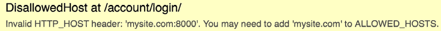

图 5.4：无效的主机头消息

Django 使用`ALLOWED_HOSTS`设置控制可以服务应用程序的主机。这是一个安全措施，用于防止 HTTP 主机头攻击。Django 只会允许列表中包含的主机来服务应用程序。

您可以在[`docs.djangoproject.com/en/5.0/ref/settings/#allowed-hosts`](https://docs.djangoproject.com/en/5.0/ref/settings/#allowed-hosts)了解更多关于`ALLOWED_HOSTS`设置的信息。

编辑项目的`settings.py`文件，并按以下方式修改`ALLOWED_HOSTS`设置。新代码以粗体突出显示：

```py
ALLOWED_HOSTS = [**'mysite.com'****,** **'localhost'****,** **'127.0.0.1'**] 
```

除了`mysite.com`主机外，我们还明确包含了`localhost`和`127.0.0.1`。这允许通过`localhost`和`127.0.0.1`访问网站，这是当`DEBUG`为`True`且`ALLOWED_HOSTS`为空时 Django 的默认行为。

再次在浏览器中打开`http://mysite.com:8000/account/login/`。现在，您应该看到网站的登录页面而不是错误。

## 通过 HTTPS 运行开发服务器

接下来，我们将通过 HTTPS 运行开发服务器以模拟一个真实环境，在这个环境中与浏览器交换的内容是安全的。这有助于我们在 *第六章*，*在您的网站上共享内容* 中安全地提供我们的网站并在任何安全网站上加载我们的图像书签工具。**传输层安全性**（**TLS**）协议是通过安全连接提供网站的标准。TLS 的前身是**安全套接字层**（**SSL**）。

虽然 SSL 现在已弃用，但你将在多个库和在线文档中找到对 TLS 和 SSL 这两个术语的引用。Django 开发服务器无法通过 HTTPS 提供服务，因为这不是它的预期用途。为了测试通过 HTTPS 提供网站的社会认证功能，我们将使用 Django Extensions 的 RunServerPlus 扩展。此包包含一系列有用的 Django 工具。请注意，你永远不应该使用开发服务器在生产环境中运行你的网站。

使用以下命令安装 Django 扩展：

```py
python -m pip install django-extensions==3.2.3 
```

你需要安装 Werkzeug，它包含 Django Extensions 的 RunServerPlus 扩展所需的调试层。使用以下命令安装 Werkzeug：

```py
python -m pip install werkzeug==3.0.2 
```

最后，使用以下命令安装 pyOpenSSL，这是使用 RunServerPlus 的 SSL/TLS 功能所必需的：

```py
python -m pip install pyOpenSSL==24.1.0 
```

编辑你的项目的 `settings.py` 文件，并将 Django Extensions 添加到 `INSTALLED_APPS` 设置中，如下所示：

```py
INSTALLED_APPS = [
    # ...
**'django_extensions'****,**
] 
```

现在，使用 Django Extensions 提供的 `runserver_plus` 管理命令来运行开发服务器，如下所示：

```py
python manage.py runserver_plus --cert-file cert.crt 
```

我们已经为 `runserver_plus` 命令提供了 SSL/TLS 证书的文件名。Django Extensions 将自动生成密钥和证书。

在你的浏览器中打开 `https://mysite.com:8000/account/login/`。现在，你正在通过 HTTPS 访问你的网站。注意我们现在使用 `https://` 而不是 `http://`。

你的浏览器将显示一个安全警告，因为你正在使用一个由自己生成的证书而不是由**认证机构**（**CA**）信任的证书。

如果你正在使用 Google Chrome，你将看到以下屏幕：

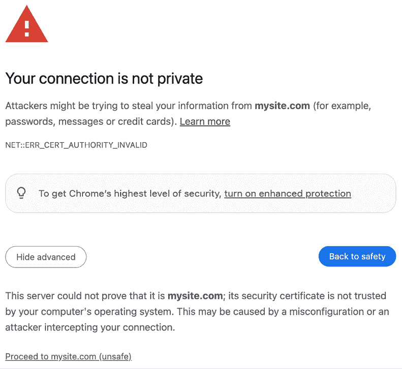

图 5.5：Google Chrome 中的安全错误

在这种情况下，点击 **高级**，然后点击 **继续到 mysite.com（不安全）**。

如果你正在使用 Safari，你将看到以下屏幕：

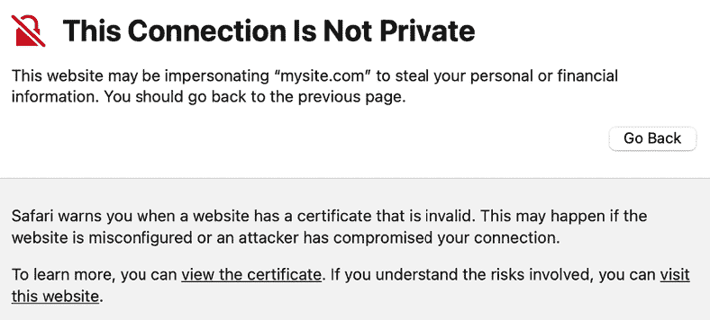

图 5.6：Safari 中的安全错误

在这种情况下，点击 **显示详细信息**，然后点击 **访问此网站**。

如果你正在使用 Microsoft Edge，你将看到以下屏幕：

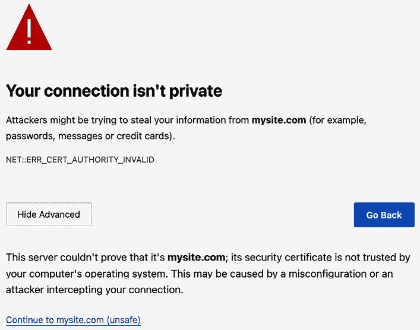

图 5.7：Microsoft Edge 中的安全错误

在这种情况下，点击 **高级**，然后点击 **继续到 mysite.com（不安全）**。

如果您使用的是其他浏览器，请访问浏览器显示的详细信息，并接受自签名证书，以便浏览器信任该证书。

你会看到 URL 以 `https://` 开头，在某些情况下，一个表示连接安全的锁形图标。一些浏览器可能会显示一个损坏的锁形图标，因为你正在使用自签名证书而不是受信任的证书。这不会影响我们的测试：

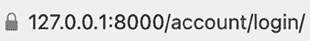

图 5.8：带有安全连接图标的 URL

Django Extensions 包含了许多其他有趣的工具和功能。您可以在 https://django-extensions.readthedocs.io/en/latest/ 上找到有关此包的更多信息。

您现在可以在开发期间通过 HTTPS 提供您的网站服务。

## 使用 Google 进行身份验证

Google 提供了使用 OAuth 2.0 的社交身份验证，允许用户使用 Google 账户登录。您可以在 [`developers.google.com/identity/protocols/OAuth2`](https://developers.google.com/identity/protocols/OAuth2) 上了解有关 Google OAuth2 实现的更多信息。

要实现使用 Google 的身份验证，请将以下加粗的行添加到项目 `settings.py` 文件中的 `AUTHENTICATION_BACKENDS` 设置中：

```py
AUTHENTICATION_BACKENDS = [
    'django.contrib.auth.backends.ModelBackend',
    'account.authentication.EmailAuthBackend',
**'social_core.backends.google.GoogleOAuth2'****,**
] 
```

首先，您需要在 Google 开发者控制台中创建一个 API 密钥。在您的浏览器中打开 [`console.cloud.google.com/projectcreate`](https://console.cloud.google.com/projectcreate)。您将看到以下屏幕：

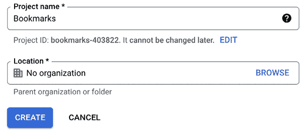

图 5.9：Google 项目创建表单

在 **项目名称** 下，输入 `Bookmarks` 并点击 **创建** 按钮。

当新项目准备就绪时，请确保在顶部导航栏中选择项目，如下所示：


图 5.10：Google 开发者控制台顶部导航栏

项目创建完成后，在 **APIs & Services** 下方点击 **Credentials**：

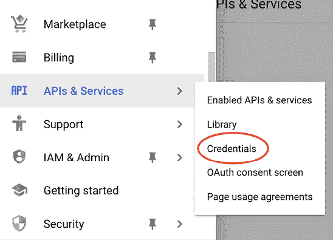

图 5.11：Google API 和服务菜单

您将看到以下屏幕：

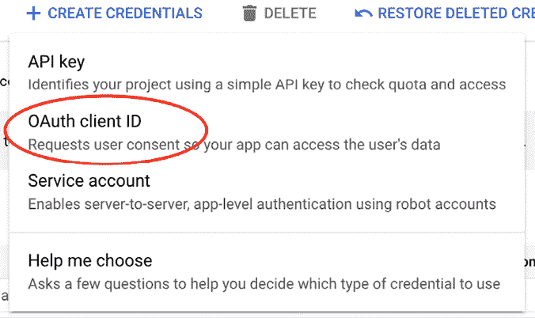

图 5.12：Google API 创建 API 凭据

然后，点击 **创建凭据** 并点击 **OAuth 客户端 ID**。

Google 会要求您首先配置同意屏幕，如下所示：


图 5.13：配置 OAuth 同意屏幕的警告

我们将配置将向用户显示的页面，以便他们同意使用 Google 账户访问您的网站。点击 **配置同意屏幕** 按钮。您将被重定向到以下屏幕：

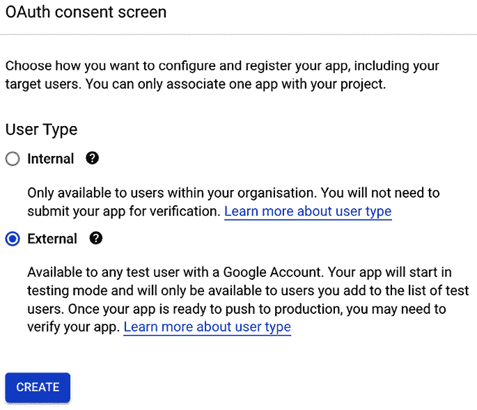

图 5.14：在 Google OAuth 同意屏幕设置中的用户类型选择

将 **用户类型** 选择为 **外部** 并点击 **创建** 按钮。您将看到以下屏幕：

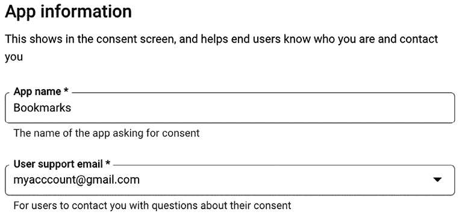

图 5.15：Google OAuth 同意屏幕设置

在**应用名称**下，输入`Bookmarks`并选择您的邮箱作为**用户支持邮箱**。

在**授权域名**下，按照如下方式输入`mysite.com`：

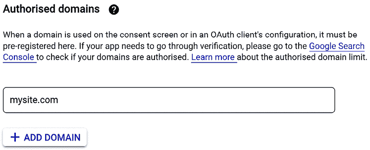

图 5.16：Google OAuth 授权域名

在**开发者联系信息**下输入您的电子邮件，然后点击**保存并继续**。

在第 2 步，**作用域**，不要更改任何内容，然后点击**保存并继续**。

在第 3 步，**测试用户**，将您的 Google 用户添加到**测试用户**中，然后按照如下方式点击**保存并继续**：

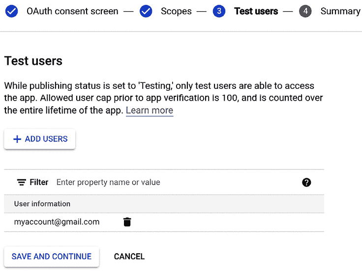

图 5.17：Google OAuth 测试用户

您将看到您的同意屏幕配置摘要。点击**返回仪表板**。

在左侧菜单中，点击**凭证**，然后再次点击**创建凭证**，接着点击**OAuth 客户端 ID**。

作为下一步，输入以下信息：

+   **应用类型**：选择**Web 应用**

+   **名称**：输入`Bookmarks`

+   **授权 JavaScript 源**：添加`https://mysite.com:8000`

+   **授权重定向 URI**：添加`https://mysite.com:8000/social-auth/complete/google-oauth2/`

表单应如下所示：

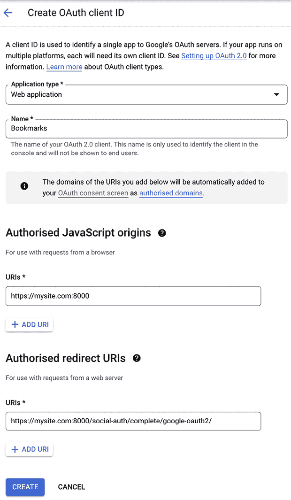

图 5.18：Google OAuth 客户端 ID 创建表单

点击**创建**按钮。您将获得**客户端 ID**和**客户端密钥**：

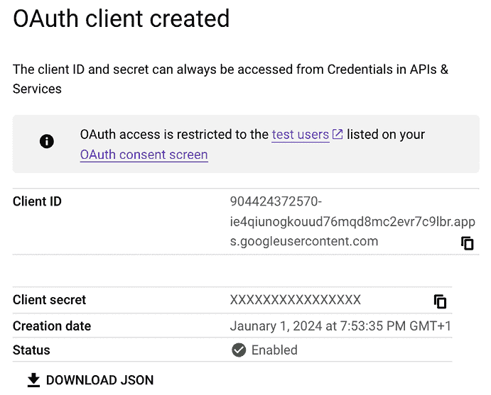

图 5.19：Google OAuth – 客户端 ID 和客户端密钥

在您项目的根目录内创建一个新文件，命名为`.env`。`.env`文件将包含环境变量的键值对。将 OAuth2 凭证添加到新文件中，如下所示：

```py
GOOGLE_OAUTH2_KEY=xxxx
GOOGLE_OAUTH2_SECRET=xxxx 
```

将`xxxx`分别替换为 OAuth2 密钥和密钥。

为了便于将配置与代码分离，我们将使用`python-decouple`。您已经在*第二章*，*增强您的博客并添加社交功能*中使用了这个库。

通过运行以下命令使用`pip`安装`python-decouple`：

```py
python -m pip install python-decouple==3.8 
```

编辑您项目的`settings.py`文件，并向其中添加以下代码：

```py
**from** **decouple** **import** **config**
# ...
**SOCIAL_AUTH_GOOGLE_OAUTH2_KEY = config(****'GOOGLE_OAUTH2_KEY'****)**
**SOCIAL_AUTH_GOOGLE_OAUTH2_SECRET = config(****'GOOGLE_OAUTH2_SECRET'****)** 
```

`SOCIAL_AUTH_GOOGLE_OAUTH2_KEY`和`SOCIAL_AUTH_GOOGLE_OAUTH2_SECRET`设置是从`.env`文件中定义的环境变量加载的。

编辑`account`应用的`registration/login.html`模板，并在`content`块的底部添加以下加粗的代码：

```py

  ...
**<****div****class****=****"social"****>**
**<****ul****>**
**<****li****class****=****"google"****>**
**<****a****href****=****"">**
 **Sign in with Google**
**</****a****>**
**</****li****>**
**</****ul****>**
**</****div****>**
 
```

使用 Django Extensions 提供的`runserver_plus`管理命令来运行开发服务器，如下所示：

```py
python manage.py runserver_plus --cert-file cert.crt 
```

在您的浏览器中打开`https://mysite.com:8000/account/login/`。登录页面现在应如下所示：

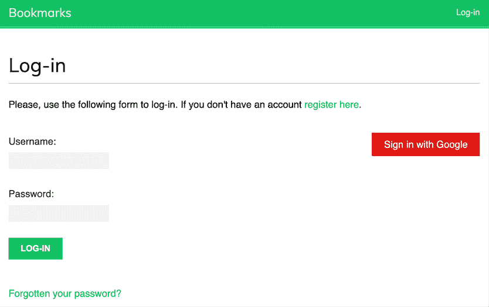

图 5.20：包含 Google 身份验证按钮的登录页面

点击**使用 Google 登录**按钮。您将看到以下屏幕：

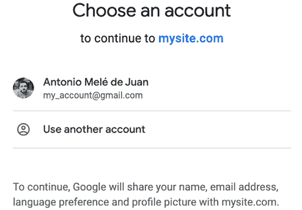

图 5.21：谷歌应用程序授权屏幕

点击您的谷歌账户以授权应用程序。您将被登录并重定向到您网站的仪表板页面。请记住，您已在`LOGIN_REDIRECT_URL`设置中设置了此 URL。如您所见，将社交认证添加到您的网站相当简单。

您现在已将社交认证添加到您的项目，并使用 Google 实现了社交认证。您可以使用 Python Social Auth 轻松实现其他在线服务的社交认证。在下一节中，我们将讨论使用社交认证注册时创建用户配置文件的问题。

## 为使用社交认证注册的用户创建配置文件

当用户使用社交认证进行身份验证时，如果该社交配置文件没有关联现有用户，则会创建一个新的`User`对象。Python Social Auth 使用一个由一系列函数组成的管道，这些函数在身份验证流程中以特定顺序执行。这些函数负责检索任何用户详情，在数据库中创建一个社交配置文件，并将其与现有用户关联或创建一个新的用户。

目前，当通过社交认证创建新用户时，不会创建新的`Profile`对象。我们将向管道添加一个新步骤，以便在创建新用户时自动在数据库中创建一个`Profile`对象。

将以下`SOCIAL_AUTH_PIPELINE`设置添加到您的项目的`settings.py`文件中：

```py
SOCIAL_AUTH_PIPELINE = [
    'social_core.pipeline.social_auth.social_details',
    'social_core.pipeline.social_auth.social_uid',
    'social_core.pipeline.social_auth.auth_allowed',
    'social_core.pipeline.social_auth.social_user',
    'social_core.pipeline.user.get_username',
    'social_core.pipeline.user.create_user',
    'social_core.pipeline.social_auth.associate_user',
    'social_core.pipeline.social_auth.load_extra_data',
    'social_core.pipeline.user.user_details',
] 
```

这是 Python Social Auth 使用的默认身份验证管道。它由执行不同任务的多个函数组成。您可以在[`python-social-auth.readthedocs.io/en/latest/pipeline.html`](https://python-social-auth.readthedocs.io/en/latest/pipeline.html)找到有关默认身份验证管道的更多详细信息。

让我们构建一个函数，在创建新用户时在数据库中创建一个`Profile`对象。然后我们将把这个函数添加到社交认证管道中。

编辑`account/authentication.py`文件，并向其中添加以下代码：

```py
from account.models import Profile
def create_profile(backend, user, *args, **kwargs):
    """
    Create user profile for social authentication
    """
    Profile.objects.get_or_create(user=user) 
```

`create_profile`函数接受两个必需参数：

+   `backend`：用于用户认证的社交认证后端。请记住，您已将社交认证后端添加到项目的`AUTHENTICATION_BACKENDS`设置中。

+   `user`：新或现有已验证用户的`User`实例。

您可以在[`python-social-auth.readthedocs.io/en/latest/pipeline.html#extending-the-pipeline`](https://python-social-auth.readthedocs.io/en/latest/pipeline.html#extending-the-pipeline)检查传递给管道函数的不同参数。

在`create_profile`函数中，我们检查是否存在`user`对象，并使用`get_or_create()`方法查找给定用户的`Profile`对象，并在必要时创建一个。

现在，我们需要将新函数添加到认证流程中。将以下加粗的行添加到你的 `settings.py` 文件中的 `SOCIAL_AUTH_PIPELINE` 设置：

```py
SOCIAL_AUTH_PIPELINE = [
    'social_core.pipeline.social_auth.social_details',
    'social_core.pipeline.social_auth.social_uid',
    'social_core.pipeline.social_auth.auth_allowed',
    'social_core.pipeline.social_auth.social_user',
    'social_core.pipeline.user.get_username',
    'social_core.pipeline.user.create_user',
**'account.authentication.create_profile'****,**
'social_core.pipeline.social_auth.associate_user',
    'social_core.pipeline.social_auth.load_extra_data',
    'social_core.pipeline.user.user_details',
] 
```

我们在 `social_core.pipeline.create_user` 之后添加了 `create_profile` 函数。在此阶段，有一个 `User` 实例可用。用户可以是现有用户或在此管道步骤中创建的新用户。`create_profile` 函数使用 `User` 实例查找相关的 `Profile` 对象，并在必要时创建一个新的。

在管理站点 `https://mysite.com:8000/admin/auth/user/` 中访问用户列表。删除任何通过社交认证创建的用户。

然后，打开 `https://mysite.com:8000/account/login/` 并为已删除的用户执行社交认证。将创建一个新用户，并且现在还会创建一个 `Profile` 对象。访问 `https://mysite.com:8000/admin/account/profile/` 以验证是否为新用户创建了一个资料。

我们已成功添加了自动创建用户资料的功能，用于社交认证。

Python Social Auth 还为断开连接流程提供了管道机制。你可以在 [`python-social-auth.readthedocs.io/en/latest/pipeline.html#disconnection-pipeline`](https://python-social-auth.readthedocs.io/en/latest/pipeline.html#disconnection-pipeline) 找到更多详细信息。

# 摘要

在本章中，你通过创建基于电子邮件的认证后端和添加与 Google 的社交认证，显著提高了你的社交网站认证能力。你还通过使用 Django 消息框架为他们的操作提供反馈来改善了用户体验。最后，你自定义了认证流程以自动为新用户创建用户资料。

在下一章中，你将创建一个图像书签系统。你将学习多对多关系和自定义表单的行为。你将学习如何生成图像缩略图以及如何使用 JavaScript 和 Django 构建 AJAX 功能。

# 其他资源

以下资源提供了与本章涵盖主题相关的额外信息：

+   本章的源代码 – [`github.com/PacktPublishing/Django-5-by-example/tree/main/Chapter05`](https://github.com/PacktPublishing/Django-5-by-example/tree/main/Chapter05)

+   Django 消息框架 – [`docs.djangoproject.com/en/5.0/ref/contrib/messages/`](https://docs.djangoproject.com/en/5.0/ref/contrib/messages/)

+   自定义认证来源 – [`docs.djangoproject.com/en/5.0/topics/auth/customizing/#other-authentication-sources`](https://docs.djangoproject.com/en/5.0/topics/auth/customizing/#other-authentication-sources)

+   自动主键字段 – [`docs.djangoproject.com/en/5.0/topics/db/models/#automatic-primary-key-fields`](https://docs.djangoproject.com/en/5.0/topics/db/models/#automatic-primary-key-fields)

+   Python 社交认证 – [`github.com/python-social-auth`](https://github.com/python-social-auth)

+   Python 社交认证的认证后端 – [`python-social-auth.readthedocs.io/en/latest/backends/index.html#supported-backends`](https://python-social-auth.readthedocs.io/en/latest/backends/index.html#supported-backends)

+   Django 允许的主机设置 – [`docs.djangoproject.com/en/5.0/ref/settings/#allowed-hosts`](https://docs.djangoproject.com/en/5.0/ref/settings/#allowed-hosts)

+   Django 扩展文档 – [`django-extensions.readthedocs.io/en/latest/`](https://django-extensions.readthedocs.io/en/latest/)

+   Google 的 OAuth2 实现 – [`developers.google.com/identity/protocols/OAuth2`](https://developers.google.com/identity/protocols/OAuth2)

+   Google API 凭据 – [`console.developers.google.com/apis/credentials`](https://console.developers.google.com/apis/credentials)

+   Python 社交认证管道 – [`python-social-auth.readthedocs.io/en/latest/pipeline.html`](https://python-social-auth.readthedocs.io/en/latest/pipeline.html)

+   扩展 Python 社交认证管道 – [`python-social-auth.readthedocs.io/en/latest/pipeline.html#extending-the-pipeline`](https://python-social-auth.readthedocs.io/en/latest/pipeline.html#extending-the-pipeline)

+   Python 社交认证断开连接管道 – [`python-social-auth.readthedocs.io/en/latest/pipeline.html#disconnection-pipeline`](https://python-social-auth.readthedocs.io/en/latest/pipeline.html#disconnection-pipeline)
