# 第九章：管理支付和订单

在上一章中，您创建了一个基本的在线商店，包括产品目录和购物车。您学习了如何使用 Django 会话并构建自定义上下文处理器。您还学习了如何使用 Celery 和 RabbitMQ 启动异步任务。

在本章中，您将学习如何将支付网关集成到您的网站中，以便用户可以通过信用卡支付并管理订单支付。您还将扩展管理站点以添加不同的功能。

在本章中，您将：

+   将 Stripe 支付网关集成到您的项目中

+   使用 Stripe 处理信用卡支付

+   处理支付通知并将订单标记为已支付

+   将订单导出为 CSV 文件

+   为管理站点创建自定义视图

+   动态生成 PDF 发票

# 功能概述

*图 9.1* 展示了本章将构建的视图、模板和功能表示：


图 9.1：第九章构建的功能图

在本章中，您将创建一个新的 `payment` 应用程序，在该应用程序中，您将实现 `payment_process` 视图以启动结账会话并使用 Stripe 支付订单。您将构建 `payment_completed` 视图以在支付成功后重定向用户，以及 `payment_canceled` 视图以在支付取消时重定向用户。您将实现 `export_to_csv` 管理操作以在管理站点中以 CSV 格式导出订单。您还将构建管理视图 `admin_order_detail` 以显示订单详情和 `admin_order_pdf` 视图以动态生成 PDF 发票。您将实现 `stripe_webhook` webhook 以接收来自 Stripe 的异步支付通知，并且您将实现 `payment_completed` 异步任务以在订单支付时向客户发送发票。

本章的源代码可以在 [`github.com/PacktPublishing/Django-5-by-example/tree/main/Chapter09`](https://github.com/PacktPublishing/Django-5-by-example/tree/main/Chapter09) 找到。

本章中使用的所有 Python 包都包含在章节源代码中的 `requirements.txt` 文件中。您可以根据以下部分中的说明安装每个 Python 包，或者您可以使用命令 `python -m pip install -r requirements.txt` 一次性安装所有依赖项。

# 集成支付网关

支付网关是一种由商家使用的在线处理客户支付的技术。使用支付网关，您可以管理客户的订单并将支付处理委托给可靠、安全的第三方。通过使用受信任的支付网关，您无需担心在自己的系统中处理信用卡的技术、安全和监管复杂性。

有多个支付网关提供商可供选择。我们将集成 Stripe，这是一个非常流行的支付网关，被 Shopify、Uber、Twitch 和 GitHub 等在线服务以及其他服务使用。

Stripe 提供了一个 **应用程序编程接口** (**API**)，允许您使用多种支付方式（如信用卡、Google Pay 和 Apple Pay）处理在线支付。您可以在 [`www.stripe.com/`](https://www.stripe.com/) 上了解更多关于 Stripe 的信息。

Stripe 提供与支付处理相关的不同产品。它可以管理一次性支付、订阅服务的定期支付、平台和市场的多方支付等。

Stripe 提供不同的集成方法，从 Stripe 托管的支付表单到完全可定制的结账流程。我们将集成 *Stripe* *Checkout* 产品，它由一个优化转换的支付页面组成。用户将能够轻松地使用信用卡或其他支付方式支付他们订购的商品。我们将从 Stripe 收到支付通知。您可以在 [`stripe.com/docs/payments/checkout`](https://stripe.com/docs/payments/checkout) 上查看 *Stripe* *Checkout* 文档。

通过利用 *Stripe* *Checkout* 处理支付，您依赖于一个既安全又符合 **支付卡行业** (**PCI**) 要求的解决方案。您将能够从 Google Pay、Apple Pay、Afterpay、Alipay、SEPA 直接借记、Bacs 直接借记、BECS 直接借记、iDEAL、Sofort、GrabPay、FPX 以及其他支付方式中收集款项。

## 创建 Stripe 账户

您需要一个 Stripe 账户才能将支付网关集成到您的网站上。让我们创建一个账户来测试 Stripe API。在您的浏览器中打开 [`dashboard.stripe.com/register`](https://dashboard.stripe.com/register)。

您将看到一个如下所示的形式：


图 9.2：Stripe 注册表单

使用您自己的数据填写表格，并点击 **创建账户**。您将收到来自 Stripe 的电子邮件，其中包含一个用于验证电子邮件地址的链接。电子邮件将如下所示：

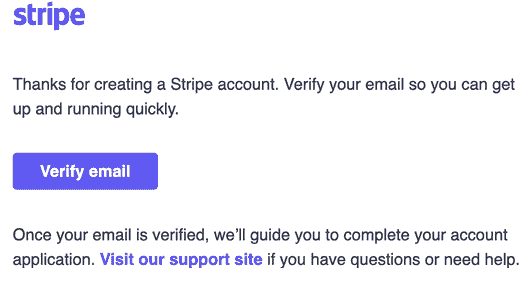

图 9.3：验证电子邮件地址的验证邮件

打开您的收件箱中的电子邮件并点击 **验证电子邮件**。

您将被重定向到 Stripe 控制台屏幕，其外观如下：

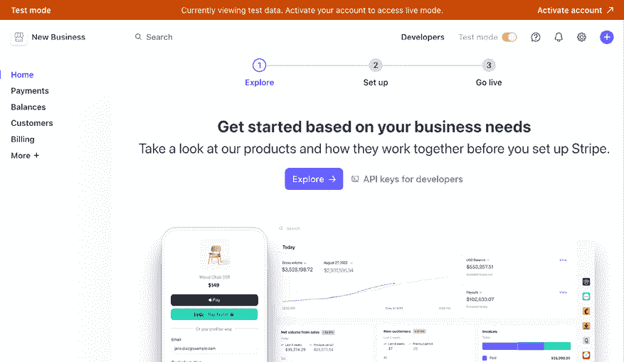

图 9.4：验证电子邮件地址后的 Stripe 控制台

在屏幕右上角，您可以看到 **测试模式** 已激活。Stripe 为您提供了一个测试环境和生产环境。如果您是商人或自由职业者，您可以添加您的业务详情以激活账户并获取处理真实支付的权利。然而，这并不是通过 Stripe 实现和测试支付所必需的，因为我们将在测试环境中工作。

您需要添加一个账户名称来处理支付。在您的浏览器中打开 [`dashboard.stripe.com/settings/account`](https://dashboard.stripe.com/settings/account)。

您将看到以下屏幕：


图 9.5：Stripe 账户设置

在**账户名称**下输入您选择的名称，然后点击**保存**。返回 Stripe 仪表板。您将在页眉中看到您的账户名称：

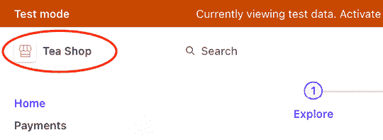

图 9.6：包含账户名称的 Stripe 仪表板页眉

我们将继续通过安装 Stripe Python SDK 并将 Stripe 添加到我们的 Django 项目中。

## 安装 Stripe Python 库

Stripe 提供了一个 Python 库，简化了处理其 API 的过程。我们将使用`stripe`库将支付网关集成到项目中。

您可以在[`github.com/stripe/stripe-python`](https://github.com/stripe/stripe-python)找到 Stripe Python 库的源代码。

使用以下命令从 shell 中安装`stripe`库：

```py
python -m pip install stripe==9.3.0 
```

## 将 Stripe 添加到您的项目中

在浏览器中打开[`dashboard.stripe.com/test/apikeys`](https://dashboard.stripe.com/test/apikeys)。您也可以通过点击 Stripe 仪表板上的**开发者**然后点击**API 密钥**来访问此页面。您将看到以下屏幕：


图 9.7：Stripe 测试 API 密钥屏幕

Stripe 为两个不同的环境提供了密钥对，即测试和生产环境。每个环境都有一个**发布密钥**和**密钥**。测试模式的发布密钥前缀为`pk_test_`，实时模式的发布密钥前缀为`pk_live_`。测试模式的密钥前缀为`sk_test_`，实时模式的密钥前缀为`sk_live_`。

您需要这些信息来验证对 Stripe API 的请求。您应该始终保密您的私钥并安全存储。发布密钥可用于客户端代码，如 JavaScript 脚本。您可以在[`stripe.com/docs/keys`](https://stripe.com/docs/keys)上了解更多关于 Stripe API 密钥的信息。

为了便于将配置与代码分离，我们将使用`python-decouple`。您已经在*第二章*，*增强您的博客并添加社交功能*中使用了这个库。

在您的项目根目录内创建一个新文件，并将其命名为`.env`。`.env`文件将包含环境变量的键值对。将 Stripe 凭证添加到新文件中，如下所示：

```py
STRIPE_PUBLISHABLE_KEY=pk_test_XXXX
STRIPE_SECRET_KEY=sk_test_XXXX 
```

将`STRIPE_PUBLISHABLE_KEY`和`STRIPE_SECRET_KEY`值替换为 Stripe 提供的测试**发布密钥**和**密钥**值。

如果您使用`git`仓库存储代码，请确保将`.env`包含在您的仓库`.gitignore`文件中。这样做可以确保凭证不被包含在仓库中。

通过运行以下命令使用`pip`安装`python-decouple`：

```py
python -m pip install python-decouple==3.8 
```

编辑您的项目`settings.py`文件，并向其中添加以下代码：

```py
**from** **decouple** **import** **config**
# ...
**STRIPE_PUBLISHABLE_KEY = config(****'****STRIPE_PUBLISHABLE_KEY'****)**
**STRIPE_SECRET_KEY = config(****'STRIPE_SECRET_KEY'****)**
**STRIPE_API_VERSION =** **'2024-04-10'** 
```

您将使用 Stripe API 版本`2024-04-10`。您可以在[`stripe.com/docs/upgrades#2024-04-10`](https://stripe.com/docs/api/events/types)上查看此 API 版本的发布说明。

您正在使用项目的测试环境密钥。一旦您上线并验证您的 Stripe 账户，您将获得生产环境的密钥。在*第十七章*，*上线*中，您将学习如何配置多个环境的设置。

让我们将支付网关集成到结账流程中。您可以在[`stripe.com/docs/api?lang=python`](https://stripe.com/docs/api/events/types)找到 Stripe 的 Python 文档。

## 构建支付流程

结账流程将按以下方式工作：

1.  将商品添加到购物车。

1.  检查购物车。

1.  输入信用卡详情并支付。

我们将创建一个新的应用程序来管理支付。使用以下命令在您的项目中创建一个新的应用程序：

```py
python manage.py startapp payment 
```

编辑项目的`settings.py`文件并将新应用程序添加到`INSTALLED_APPS`设置中，如下所示。新行以粗体突出显示：

```py
INSTALLED_APPS = [
    # ...
    'cart.apps.CartConfig',
    'orders.apps.OrdersConfig',
**'payment.apps.PaymentConfig'****,**
'shop.apps.ShopConfig',
] 
```

`payment`应用程序现在已在项目中激活。

目前，用户可以下订单但不能支付。在客户下单后，我们需要将他们重定向到支付流程。

编辑`orders`应用程序的`views.py`文件并包含以下导入：

```py
from django.shortcuts import **redirect,** render 
```

在同一文件中，找到以下`order_create`视图的行：

```py
# launch asynchronous task
order_created.delay(order.id)
return render(
  request, 'orders/order/created.html', {'order': order}
) 
```

将它们替换为以下代码：

```py
# launch asynchronous task
order_created.delay(order.id)
**# set the order in the session**
**request.session[****'order_id'****] = order.****id**
**# redirect for payment**
**return** **redirect(****'payment:process'****)** 
```

编辑后的视图应如下所示：

```py
from django.shortcuts import **redirect,** render
# ...
def order_create(request):
    cart = Cart(request)
    if request.method == 'POST':
        form = OrderCreateForm(request.POST)
        if form.is_valid():
            order = form.save()
            for item in cart:
                OrderItem.objects.create(
                    order=order,
                    product=item['product'],
                    price=item['price'],
                    quantity=item['quantity']
                )
            # clear the cart
            cart.clear()
            # launch asynchronous task
            order_created.delay(order.id)
**# set the order in the session**
 **request.session[****'order_id'****] = order.****id**
**# redirect for payment**
**return** **redirect(****'payment:process'****)**
else:
        form = OrderCreateForm()
    return render(
        request,
        'orders/order/create.html',
        {'cart': cart, 'form': form}
    ) 
```

在放置新订单时，不是渲染模板`orders/order/created.html`，而是将订单 ID 存储在用户会话中，并将用户重定向到`payment:process` URL。我们将在稍后实现此 URL。请记住，Celery 必须运行，以便`order_created`任务可以排队并执行。

让我们将支付网关集成。

### 集成 Stripe 结账

Stripe 结账集成包括由 Stripe 托管的结账页面，允许用户输入支付详情，通常是一张信用卡，然后它收集支付。如果支付成功，Stripe 将客户端重定向到成功页面。如果客户端取消支付，它将客户端重定向到取消页面。

我们将实现三个视图：

+   `payment_process`：创建 Stripe **结账会话**并将客户端重定向到由 Stripe 托管的支付表单。结账会话是客户端重定向到支付表单时看到的程序表示，包括产品、数量、货币和要收取的金额。

+   `payment_completed`：显示成功支付的提示信息。如果支付成功，用户将被重定向到此视图。

+   `payment_canceled`：显示取消支付的提示信息。如果支付被取消，用户将被重定向到此视图。

*图 9.8*显示了结账支付流程：

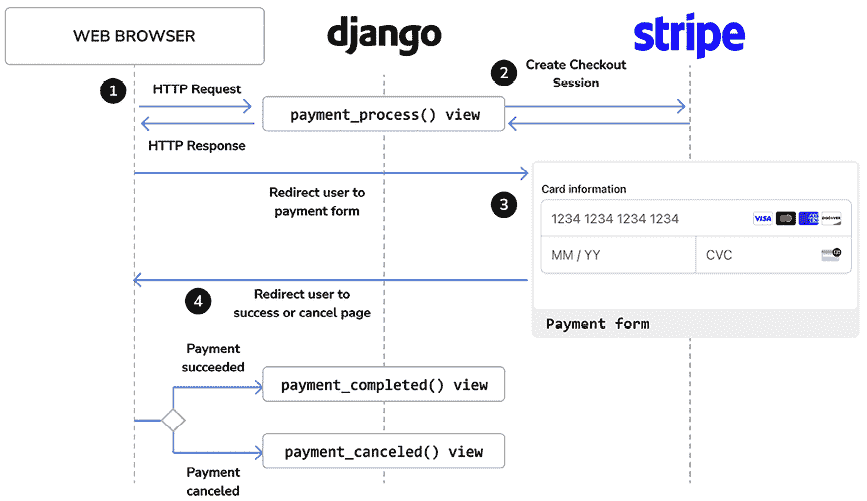

图 9.8：结账支付流程

完整的结账流程将按以下方式工作：

1.  创建订单后，用户将被重定向到`payment_process`视图。用户将看到订单摘要和继续付款的按钮。

1.  当用户继续付款时，将创建一个 Stripe 结账会话。结账会话包括用户将要购买的项目列表、成功付款后重定向用户的 URL 以及付款取消时重定向用户的 URL。

1.  视图将用户重定向到由 Stripe 托管的结账页面。此页面包括付款表单。客户端输入他们的信用卡详情并提交表单。

1.  Stripe 处理付款并将客户端重定向到`payment_completed`视图。如果客户端未完成付款，Stripe 将客户端重定向到`payment_canceled`视图。

让我们开始构建付款视图。编辑`payment`应用的`views.py`文件，并向其中添加以下代码：

```py
from decimal import Decimal
import stripe
from django.conf import settings
from django.shortcuts import get_object_or_404, redirect, render
from django.urls import reverse
from orders.models import Order
# create the Stripe instance
stripe.api_key = settings.STRIPE_SECRET_KEY
stripe.api_version = settings.STRIPE_API_VERSION
def payment_process(request):
    order_id = request.session.get('order_id')
    order = get_object_or_404(Order, id=order_id)
    if request.method == 'POST':
        success_url = request.build_absolute_uri(
            reverse('payment:completed')
        )
        cancel_url = request.build_absolute_uri(
            reverse('payment:canceled')
        )
        # Stripe checkout session data
        session_data = {
            'mode': 'payment',
            'client_reference_id': order.id,
            'success_url': success_url,
            'cancel_url': cancel_url,
            'line_items': []
        }
        # create Stripe checkout session
        session = stripe.checkout.Session.create(**session_data)
        # redirect to Stripe payment form
return redirect(session.url, code=303)
    else:
        return render(request, 'payment/process.html', locals()) 
```

在前面的代码中，导入了`stripe`模块，并使用`STRIPE_SECRET_KEY`设置的值设置 Stripe API 密钥。要使用的 API 版本也使用`STRIPE_API_VERSION`设置的值设置。

`payment_process`视图执行以下任务：

1.  使用`order_id`会话键从数据库检索当前的`Order`对象，该键之前由`order_create`视图存储在会话中。

1.  对于给定的 ID 检索`Order`对象。通过使用快捷函数`get_object_or_404()`，如果没有找到具有给定 ID 的订单，将引发`Http404`（页面未找到）异常。

1.  如果视图通过`GET`请求加载，则渲染并返回模板`payment/process.html`。此模板将包括订单摘要和继续付款的按钮，这将生成一个发送到视图的`POST`请求。

1.  或者，如果视图通过`POST`请求加载，则使用以下参数通过`stripe.checkout.Session.create()`创建带有`POST`请求的 Stripe 结账会话：

    +   `mode`: 结账会话的模式。我们使用`payment`进行一次性付款。您可以在[`stripe.com/docs/api/checkout/sessions/object#checkout_session_object-mode`](https://stripe.com/docs/api/checkout/sessions/object#checkout_session_object-mode)查看此参数接受的不同值。

    +   `client_reference_id`: 这是此付款的唯一参考。我们将使用它来对冲 Stripe 结账会话与我们的订单。通过传递订单 ID，我们将 Stripe 付款与系统中的订单链接起来，并能够从 Stripe 接收付款通知以标记订单为已支付。

    +   `success_url`: 如果支付成功，Stripe 将重定向用户到的 URL。我们使用`request.build_absolute_uri()`从 URL 路径生成绝对 URI。您可以在[`docs.djangoproject.com/en/5.0/ref/request-response/#django.http.HttpRequest.build_absolute_uri`](https://docs.djangoproject.com/en/5.0/ref/request-response/#django.http.HttpRequest.build_absolute_uri)查看此方法的文档。

    +   `cancel_url`: 如果支付被取消，Stripe 将重定向用户到的 URL。

    +   `line_items`: 这是一个空列表。我们将接下来用要购买的商品订单填充它。

1.  创建结账会话后，返回 HTTP 重定向状态码`303`以将用户重定向到 Stripe。建议在执行 HTTP `POST`操作后，将 Web 应用程序重定向到新的 URI 时使用状态码`303`。

您可以在[`stripe.com/docs/api/checkout/sessions/create`](https://stripe.com/docs/api/checkout/sessions/create)查看创建 Stripe `session`对象的所有参数。

让我们用订单商品填充`line_items`列表以创建结账会话。每个项目将包含项目的名称、要收取的金额、使用的货币和购买的数量。

将以下加粗的代码添加到`payment_process`视图中：

```py
def payment_process(request):
    order_id = request.session.get('order_id')
    order = get_object_or_404(Order, id=order_id)
    if request.method == 'POST':
        success_url = request.build_absolute_uri(
            reverse('payment:completed')
        )
        cancel_url = request.build_absolute_uri(
            reverse('payment:canceled')
        )
        # Stripe checkout session data
        session_data = {
            'mode': 'payment',
            'success_url': success_url,
            'cancel_url': cancel_url,
            'line_items': []
        }
**# add order items to the Stripe checkout session**
**for** **item** **in** **order.items.****all****():**
 **session_data[****'line_items'****].append(**
 **{**
**'price_data'****: {**
**'unit_amount'****:** **int****(item.price * Decimal(****'100'****)),**
**'currency'****:** **'usd'****,**
**'product_data'****: {**
**'name'****: item.product.name,**
 **},**
 **},**
**'quantity'****: item.quantity,**
 **}**
 **)**
# create Stripe checkout session
        session = stripe.checkout.Session.create(**session_data)
        # redirect to Stripe payment form
return redirect(session.url, code=303)
    else:
        return render(request, 'payment/process.html', locals()) 
```

我们为每个项目使用以下信息：

+   `price_data`: 与价格相关的信息：

    +   `unit_amount`: 支付要收取的金额（以分计）。这是一个正整数，表示以最小货币单位（无小数位）收取的金额。例如，要收取 10.00 美元，这将表示`1000`（即 1,000 分）。项目价格`item.price`乘以`Decimal('100')`以获得分值，然后将其转换为整数。

    +   `currency`: 在三个字母的 ISO 格式中使用的货币。我们使用`usd`表示美元。您可以在[`stripe.com/docs/currencies`](https://stripe.com/docs/currencies)查看支持的货币列表。

+   `product_data`: 与产品相关的信息：

    +   `name`: 产品的名称

+   `quantity`: 购买单位的数量

`payment_process`视图现在已准备就绪。让我们为支付成功和取消页面创建简单的视图。

将以下代码添加到`payment`应用程序的`views.py`文件中：

```py
def payment_completed(request):
    return render(request, 'payment/completed.html')
def payment_canceled(request):
    return render(request, 'payment/canceled.html') 
```

在`payment`应用程序目录内创建一个新文件，并将其命名为`urls.py`。向其中添加以下代码：

```py
from django.urls import path
from . import views
app_name = 'payment'
urlpatterns = [
    path('process/', views.payment_process, name='process'),
    path('completed/', views.payment_completed, name='completed'),
    path('canceled/', views.payment_canceled, name='canceled'),
] 
```

这些是支付工作流程的 URL。我们包含了以下 URL 模式：

+   `process`: 显示订单摘要给用户的视图，创建 Stripe 结账会话，并将用户重定向到由 Stripe 托管的支付表单

+   `completed`: 如果支付成功，Stripe 将重定向用户到的视图

+   `canceled`: 如果支付被取消，Stripe 将重定向用户到的视图

编辑`myshop`项目的主体`urls.py`文件，并包含`payment`应用程序的 URL 模式，如下所示：

```py
urlpatterns = [
    path('admin/', admin.site.urls),
    path('cart/', include('cart.urls', namespace='cart')),
    path('orders/', include('orders.urls', namespace='orders')),
 **path(****'payment/'****, include(****'payment.urls'****, namespace=****'payment'****)),**
    path('', include('shop.urls', namespace='shop')),
] 
```

我们在`shop.urls`模式之前放置了新的路径，以避免与`shop.urls`中定义的模式意外匹配。请记住，Django 按顺序遍历每个 URL 模式，并在找到第一个与请求 URL 匹配的模式时停止。

让我们为每个视图构建一个模板。在`payment`应用程序目录内创建以下文件结构：

```py
templates/
    payment/
        process.html
        completed.html
        canceled.html 
```

编辑`payment/process.html`模板，并向其中添加以下代码：

```py


Pay your order

  <h1>Order summary</h1>
<table class="cart">
<thead>
<tr>
<th>Image</th>
<th>Product</th>
<th>Price</th>
<th>Quantity</th>
<th>Total</th>
</tr>
</thead>
<tbody>
      
        <tr class="row">
<td>

</td>
<td>{{ item.product.name }}</td>
<td class="num">${{ item.price }}</td>
<td class="num">{{ item.quantity }}</td>
<td class="num">${{ item.get_cost }}</td>
</tr>
      
      <tr class="total">
<td colspan="4">Total</td>
<td class="num">${{ order.get_total_cost }}</td>
</tr>
</tbody>
</table>
<form action="" method="post">
<input type="submit" value="Pay now">
    
  </form>
 
```

这是向用户显示订单摘要并允许客户端进行支付的模板。它包括一个表单和一个**立即支付**按钮，可以通过`POST`提交。当表单提交时，`payment_process`视图将创建 Stripe 结账会话，并将用户重定向到 Stripe 托管的支付表单。

编辑`payment/completed.html`模板，并向其中添加以下代码：

```py

Payment successful

  <h1>Your payment was successful</h1>
<p>Your payment has been processed successfully.</p>
 
```

这是用户在成功支付后被重定向到的页面模板。

编辑`payment/canceled.html`模板，并向其中添加以下代码：

```py

Payment canceled

  <h1>Your payment has not been processed</h1>
<p>There was a problem processing your payment.</p>
 
```

这是当支付被取消时用户被重定向到的页面模板。

我们已经实现了处理支付所需的所有视图，包括它们的 URL 模式和模板。现在是时候尝试结账流程了。

## 测试结账流程

在 shell 中执行以下命令以使用 Docker 启动 RabbitMQ 服务器：

```py
docker run -it --rm --name rabbitmq -p 5672:5672 -p 15672:15672 rabbitmq:3.13.1-management 
```

这将在端口`5672`上运行 RabbitMQ，并在端口`15672`上运行基于 Web 的管理界面。

在另一个 shell 中，从你的项目目录使用以下命令启动 Celery 工作进程：

```py
celery -A myshop worker -l info 
```

在另一个 shell 中，使用以下命令从你的项目目录启动开发服务器：

```py
python manage.py runserver 
```

在你的浏览器中打开`http://127.0.0.1:8000/`，添加一些产品到购物车，并填写结账表单。点击**下单**按钮。订单将被持久化到数据库中，订单 ID 将被保存在当前会话中，你将被重定向到支付流程页面。

支付流程页面将如下所示：

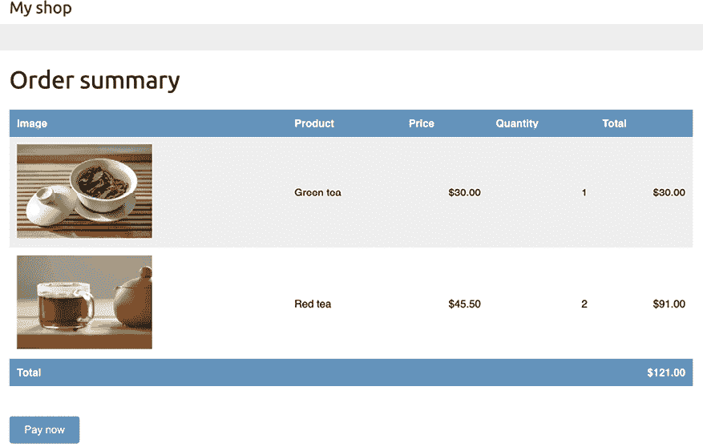

图 9.9：包含订单摘要的支付流程页面

本章中的图片：

+   *绿茶*：由 Jia Ye 在 Unsplash 上的照片

+   *红茶*：由 Manki Kim 在 Unsplash 上的照片

在这个页面上，你可以看到一个订单摘要和一个**立即支付**按钮。点击**立即支付**。`payment_process`视图将创建 Stripe 结账会话，并将你重定向到 Stripe 托管支付表单。

你将看到以下页面：


图 9.10：Stripe 结账支付流程

### 使用测试信用卡

Stripe 提供了来自不同发卡机构和国家的不同测试信用卡，这允许你模拟支付以测试所有可能的场景（成功支付、拒绝支付等）。以下表格显示了你可以测试的不同场景的一些卡片：

| **结果** | **测试信用卡** | **CVC** | **到期日期** |
| --- | --- | --- | --- |
| 成功支付 | `4242 4242 4242 4242` | 任意 3 位数字 | 任意未来日期 |
| 支付失败 | `4000 0000 0000 0002` | 任意 3 位数字 | 任意未来日期 |
| 需要 3D 安全认证 | `4000 0025 0000 3155` | 任意 3 位数字 | 任意未来日期 |

您可以在 [`stripe.com/docs/testing`](https://stripe.com/docs/testing) 找到用于测试的完整信用卡列表。

我们将使用测试卡 `4242 4242 4242 4242`，这是一张返回成功购买的 Visa 卡。我们将使用 CVC `123` 和任何未来的到期日期，例如 `12/29`。按照以下方式在支付表单中输入信用卡详情：

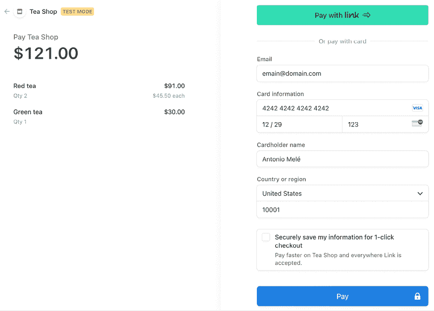

图 9.11：带有有效测试信用卡详情的支付表单

点击 **支付** 按钮。按钮文本将变为 **处理中…**，如图 *9.12* 所示：

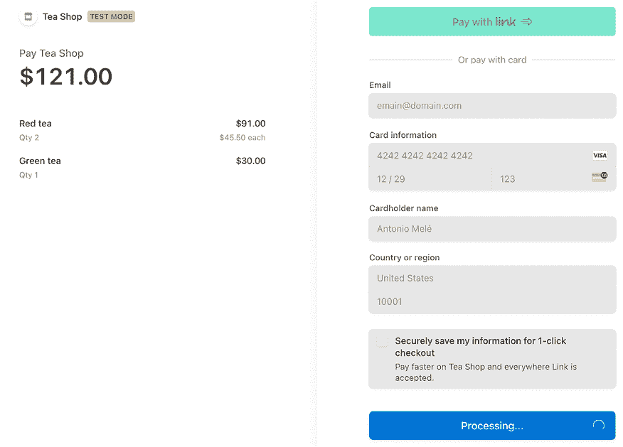

图 9.12：正在处理的支付表单

几秒钟后，您将看到按钮变为绿色，如图 *9.13* 所示：

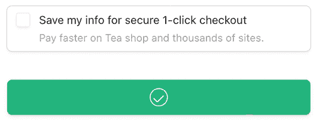

图 9.13：支付成功后的支付表单

然后，Stripe 将您的浏览器重定向到您在创建结账会话时提供的支付完成 URL。您将看到以下页面：


图 9.14：成功支付页面

### 检查 Stripe 控制台中的支付信息

访问 Stripe 控制台 [`dashboard.stripe.com/test/payments`](https://dashboard.stripe.com/test/payments)。在 **支付** 选项下，您将能够看到支付信息，如图 *9.15* 所示：


图 9.15：Stripe 控制台中状态为成功的支付对象

支付状态为 **成功**。支付描述包括以 `pi_` 开头的 **支付意图** ID。当结账会话被确认时，Stripe 会创建与该会话关联的支付意图。支付意图用于从用户那里收集支付。Stripe 记录所有尝试的支付作为支付意图。每个支付意图都有一个唯一的 ID，并封装了交易详情，例如支持的支付方式、要收集的金额和期望的货币。点击交易以访问支付详情。

您将看到以下屏幕：

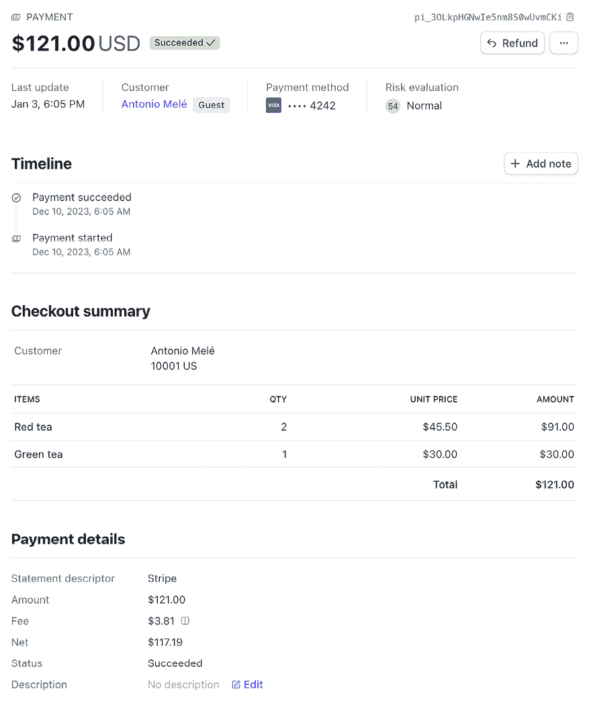

图 9.16：Stripe 交易的支付详情

在这里，您可以查看支付信息和支付时间线，包括支付变更。在 **结账摘要** 选项下，您可以找到购买的行项目，包括名称、数量、单价和金额。

在 **支付详情** 选项下，您可以查看已支付金额和 Stripe 处理支付的费用详情。

在此部分下，您将找到一个 **支付方式** 部分，包括支付方式的详细信息以及 Stripe 执行的信用卡检查，如图 *9.17* 所示：


图 9.17：Stripe 交易中使用的支付方式

在本节下，您将找到另一个名为**事件和日志**的节，如图 9.18 所示：


图 9.18：Stripe 交易的日志和事件

本节包含与交易相关的所有活动，包括对 Stripe API 的请求。您可以通过点击任何请求来查看对 Stripe API 的 HTTP 请求和 JSON 格式的响应。

让我们按时间顺序回顾活动事件，从下到上：

1.  首先，通过向 Stripe API 端点`/v1/checkout/sessions`发送`POST`请求创建一个新的结账会话。在`payment_process`视图中使用的 Stripe SDK 方法`stripe.checkout.Session.create()`构建并发送请求到 Stripe API，处理响应以返回一个`session`对象。

1.  用户被重定向到结账页面，在该页面他们提交支付表单。Stripe 结账页面发送一个确认结账会话的请求。

1.  创建了一个新的支付意向。

1.  创建了一个与支付意向相关的费用。

1.  支付意向现在已完成，并成功支付。

1.  结账会话已完成。

恭喜！您已成功将 Stripe Checkout 集成到您的项目中。接下来，您将学习如何从 Stripe 接收支付通知以及如何在您的商店订单中引用 Stripe 支付。

## 使用 webhooks 接收支付通知

Stripe 可以通过使用 webhooks 将实时事件推送到我们的应用程序。**webhook**，也称为回调，可以被视为一个事件驱动的 API，而不是请求驱动的 API。我们不必频繁轮询 Stripe API 以了解何时完成新的支付，Stripe 可以向我们的应用程序的 URL 发送 HTTP 请求，以实时通知我们成功的支付。这些事件的通知将是异步的，当事件发生时，无论我们是否同步调用 Stripe API。

我们将构建一个 webhook 端点以接收 Stripe 事件。该 webhook 将包含一个视图，该视图将接收一个 JSON 有效负载，其中包含事件信息以进行处理。我们将使用事件信息在结账会话成功完成后标记订单为已支付。

### 创建 webhook 端点

您可以将 webhook 端点 URL 添加到您的 Stripe 账户以接收事件。由于我们正在使用 webhooks，我们没有可以通过公共 URL 访问的托管网站，我们将使用 Stripe **命令行界面**（**CLI**）来监听事件并将它们转发到我们的本地环境。

在您的浏览器中打开[`dashboard.stripe.com/test/webhooks`](https://dashboard.stripe.com/test/webhooks)。您将看到以下屏幕：

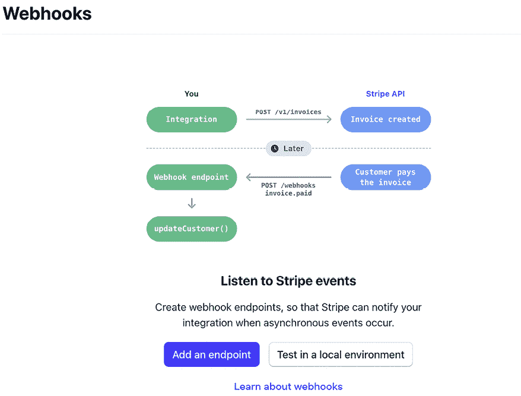

图 9.19：Stripe webhooks 默认屏幕

在这里，您可以查看 Stripe 如何异步通知您的集成的架构。每当发生事件时，您将实时收到 Stripe 通知。Stripe 发送不同类型的事件，如结账会话创建、支付意图创建、支付意图更新或结账会话完成。您可以在 [`stripe.com/docs/api/events/types`](https://stripe.com/docs/api/events/types) 找到 Stripe 发送的所有事件类型的列表。

点击 **在本地环境中测试**。您将看到以下屏幕：


图 9.20：Stripe webhook 设置屏幕

此屏幕显示了从您的本地环境监听 Stripe 事件的步骤。它还包括一个示例 Python webhook 端点。仅复制 `endpoint_secret` 值。

编辑您项目的 `.env` 文件，并向其中添加以下加粗的环境变量：

```py
STRIPE_PUBLISHABLE_KEY=pk_test_XXXX
STRIPE_SECRET_KEY=sk_test_XXXX
**STRIPE_WEBHOOK_SECRET=whsec_XXXX** 
```

将 `STRIPE_WEBHOOK_SECRET` 值替换为 Stripe 提供的 `endpoint_secret` 值。

编辑 `myshop` 项目的 `settings.py` 文件，并向其中添加以下设置：

```py
# ...
STRIPE_PUBLISHABLE_KEY = config('STRIPE_PUBLISHABLE_KEY')
STRIPE_SECERT_KEY = config('STRIPE_SECRET_KEY')
STRIPE_API_VERSION = '2024-04-10'
**STRIPE_WEBHOOK_SECRET = config(****'STRIPE_WEBHOOK_SECRET'****)** 
```

要构建 webhook 端点，我们将创建一个视图来接收包含事件详细信息的 JSON 负载。我们将检查事件详细信息以确定何时完成结账会话，并将相关订单标记为已支付。

Stripe 通过在每个事件中包含一个 `Stripe-Signature` 标头来对其发送到您的端点的 webhook 事件进行签名，每个事件都有一个签名。通过检查 Stripe 签名，您可以验证事件是由 Stripe 发送的，而不是由第三方发送的。如果您不检查签名，攻击者可能会故意向您的 webhook 发送伪造的事件。Stripe SDK 提供了一种验证签名的方法。我们将使用它来创建一个验证签名的 webhook。

向 `payment/` 应用程序目录添加一个新文件，并将其命名为 `webhooks.py`。将以下代码添加到新的 `webhooks.py` 文件中：

```py
import stripe
from django.conf import settings
from django.http import HttpResponse
from django.views.decorators.csrf import csrf_exempt
from orders.models import Order
@csrf_exempt
def stripe_webhook(request):
    payload = request.body
    sig_header = request.META['HTTP_STRIPE_SIGNATURE']
    event = None
try:
        event = stripe.Webhook.construct_event(
            payload, sig_header, settings.STRIPE_WEBHOOK_SECRET
        )
    except ValueError as e:
        # Invalid payload
return HttpResponse(status=400)
    except stripe.error.SignatureVerificationError as e:
        # Invalid signature
return HttpResponse(status=400)
    return HttpResponse(status=200) 
```

`@csrf_exempt` 装饰器用于防止 Django 对所有默认的 `POST` 请求执行 **跨站请求伪造**（**CSRF**）验证。我们使用 `stripe` 库的 `stripe.Webhook.construct_event()` 方法来验证事件的签名标头。如果事件的负载或签名无效，我们返回 HTTP `400 Bad Request` 响应。否则，我们返回 HTTP `200 OK` 响应。

这是验证签名并从 JSON 负载中构建事件的必要基本功能。现在，我们可以实现 webhook 端点的操作。

将以下加粗的代码添加到 `stripe_webhook` 视图中：

```py
@csrf_exempt
def stripe_webhook(request):
    payload = request.body
    sig_header = request.META['HTTP_STRIPE_SIGNATURE']
    event = None
try:
        event = stripe.Webhook.construct_event(
            payload, sig_header, settings.STRIPE_WEBHOOK_SECRET
        )
    except ValueError as e:
        # Invalid payload
return HttpResponse(status=400)
    except stripe.error.SignatureVerificationError as e:
        # Invalid signature
return HttpResponse(status=400)
**if** **event.****type** **==** **'checkout.session.completed'****:**
 **session = event.data.****object**
**if** **(**
 **session.mode ==** **'payment'**
**and** **session.payment_status ==** **'paid'**
 **):**
**try****:**
 **order = Order.objects.get(**
**id****=session.client_reference_id**
 **)**
**except** **Order.DoesNotExist:**
**return** **HttpResponse(status=****404****)**
**# mark order as paid**
 **order.paid =** **True**
 **order.save()**
return HttpResponse(status=200) 
```

在新代码中，我们检查接收到的事件是否为 `checkout.session.completed`。此事件表示结账会话已成功完成。如果我们收到此事件，我们将检索 `session` 对象并检查会话 `mode` 是否为 `payment`，因为这是单次付款的预期模式。

然后，我们获取我们在创建结账会话时使用的`client_reference_id`属性，并使用 Django ORM 检索具有给定`id`的`Order`对象。如果订单不存在，我们抛出 HTTP `404`异常。否则，我们将订单标记为已支付，通过`order.paid = True`，并将订单保存在数据库中。

编辑`payment`应用程序的`urls.py`文件，并添加以下加粗代码：

```py
from django.urls import path
from . import views**, webhooks**
app_name = 'payment'
urlpatterns = [
    path('process/', views.payment_process, name='process'),
    path('completed/', views.payment_completed, name='completed'),
    path('canceled/', views.payment_canceled, name='canceled'),
 **path(****'webhook/'****, webhooks.stripe_webhook, name=****'stripe-webhook'****),**
] 
```

我们已导入`webhooks`模块，并添加了 Stripe webhook 的 URL 模式。

### 测试 webhook 通知

要测试 webhooks，您需要安装 Stripe CLI。Stripe CLI 是一个开发者工具，允许您直接从您的 shell 测试和管理与 Stripe 的集成。您可以在[`stripe.com/docs/stripe-cli#install`](https://stripe.com/docs/stripe-cli#install)找到安装说明。

如果您使用 macOS 或 Linux，可以使用以下命令使用 Homebrew 安装 Stripe CLI：

```py
brew install stripe/stripe-cli/stripe 
```

如果您使用 Windows，或者您使用没有 Homebrew 的 macOS 或 Linux，可以从[`github.com/stripe/stripe-cli/releases/latest`](https://github.com/stripe/stripe-cli/releases/latest)下载最新的 macOS、Linux 或 Windows Stripe CLI 版本，并解压文件。如果您使用 Windows，运行解压后的`.exe`文件。

安装 Stripe CLI 后，从 shell 运行以下命令：

```py
stripe login 
```

您将看到以下输出：

```py
Your pairing code is: xxxx-yyyy-zzzz-oooo This pairing code verifies your authentication with Stripe.Press Enter to open the browser or visit https://dashboard.stripe.com/stripecli/confirm_auth?t=.... 
```

按下*Enter*或打开浏览器中的 URL。您将看到以下屏幕：

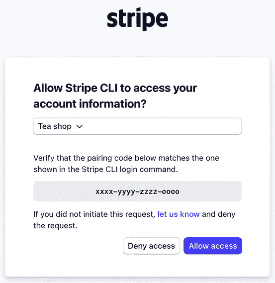

图 9.21：Stripe CLI 配对屏幕

确认 Stripe CLI 中的配对代码与网站上显示的代码匹配，然后点击**允许访问**。您将看到以下消息：

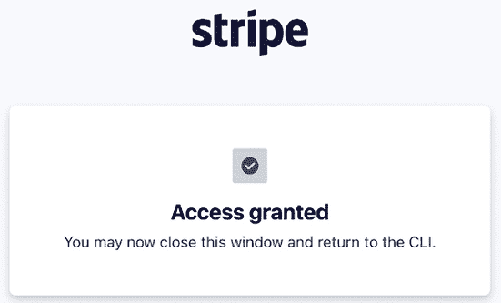

图 9.22：Stripe CLI 配对确认

现在，从您的 shell 运行以下命令：

```py
stripe listen --forward-to 127.0.0.1:8000/payment/webhook/ 
```

我们使用此命令告诉 Stripe 监听事件并将它们转发到我们的 localhost。我们使用 Django 开发服务器运行的端口`8000`，以及与我们的 webhook URL 模式匹配的路径`/payment/webhook/`。

您将看到以下输出：

```py
Getting ready... > Ready! You are using Stripe API Version [2024-04-10]. Your webhook signing secret is xxxxxxxxxxxxxxxxxxx (^C to quit) 
```

在这里，您可以看到 webhook 密钥。检查 webhook 签名密钥是否与项目`settings.py`文件中的`STRIPE_WEBHOOK_SECRET`设置匹配。

在您的浏览器中打开[`dashboard.stripe.com/test/webhooks`](https://dashboard.stripe.com/test/webhooks)。您将看到以下屏幕：


图 9.23：Stripe Webhooks 页面

在**本地监听器**下，您将看到我们创建的本地监听器。

在生产环境中，不需要 Stripe CLI。相反，您需要使用托管应用程序的 URL 添加一个托管 webhook 端点。

在您的浏览器中打开`http://127.0.0.1:8000/`，向购物车添加一些产品，并完成结账流程。

检查您运行 Stripe CLI 的 shell：

```py
2024-01-03 18:06:13   --> **payment_intent.created** [evt_...]
2024-01-03 18:06:13  <--  [200] POST http://127.0.0.1:8000/payment/webhook/ [evt_...]
2024-01-03 18:06:13   --> **payment_intent.succeeded** [evt_...]
2024-01-03 18:06:13  <--  [200] POST http://127.0.0.1:8000/payment/webhook/ [evt_...]
2024-01-03 18:06:13   --> **charge.succeeded** [evt_...]
2024-01-03 18:06:13  <--  [200] POST http://127.0.0.1:8000/payment/webhook/ [evt_...]
2024-01-03 18:06:14   --> **checkout.session.completed** [evt_...]
2024-01-03 18:06:14  <--  [200] POST http://127.0.0.1:8000/payment/webhook/ [evt_...] 
```

您可以看到 Stripe 已发送到本地 webhook 端点的不同事件。事件的顺序可能与上面不同。Stripe 不保证按事件生成顺序交付事件。让我们回顾一下事件：

+   `payment_intent.created`：支付意向已创建。

+   `payment_intent.succeeded`：支付意向成功。

+   `charge.succeeded`：与支付意向关联的扣款成功。

+   `checkout.session.completed`：结账会话已完成。这是我们用来标记订单已付款的事件。

`stripe_webhook` webhook 对所有由 Stripe 发送的请求返回 HTTP `200 OK`响应。然而，我们只处理`checkout.session.completed`事件来标记与支付相关的订单为已付款。

接下来，在浏览器中打开`http://127.0.0.1:8000/admin/orders/order/`。现在订单应标记为已付款：


图 9.24：在管理网站订单列表中标记为已付款的订单

现在，订单会自动通过 Stripe 支付通知标记为已付款。接下来，您将学习如何在您的商店订单中引用 Stripe 支付。

## 在订单中引用 Stripe 支付

每一笔 Stripe 支付都有一个唯一的标识符。我们可以使用支付 ID 将每个订单与其对应的 Stripe 支付关联起来。我们将在`orders`应用的`Order`模型中添加一个新字段，以便我们可以通过其 ID 引用相关的支付。这将允许我们将每个订单与相关的 Stripe 交易链接起来。

编辑`orders`应用的`models.py`文件，并在`Order`模型中添加以下字段。新字段以粗体显示：

```py
class Order(models.Model):
    # ...
 **stripe_id = models.CharField(max_length=****250****, blank=****True****)** 
```

让我们将此字段与数据库同步。使用以下命令为项目生成数据库迁移：

```py
python manage.py makemigrations 
```

您将看到以下输出：

```py
Migrations for 'orders':
  orders/migrations/0002_order_stripe_id.py
    - Add field stripe_id to order 
```

使用以下命令将迁移应用到数据库：

```py
python manage.py migrate 
```

您将看到以下行结束的输出：

```py
Applying orders.0002_order_stripe_id... OK 
```

模型更改现在已与数据库同步。现在，您将能够为每个订单存储 Stripe 支付 ID。

在支付应用的`webhooks.py`文件中编辑`stripe_webhook`函数，并添加以下以粗体显示的行：

```py
# ...
@csrf_exempt
def stripe_webhook(request):
    # ...
if event.type == 'checkout.session.completed':
        session = event.data.object
if (
            session.mode == 'payment'
and session.payment_status == 'paid'
        ):
            try:
                order = Order.objects.get(
                    id=session.client_reference_id
                )
            except Order.DoesNotExist:
                return HttpResponse(status=404)
            # mark order as paid
            order.paid = True
**# store Stripe payment ID**
 **order.stripe_id = session.payment_intent**
            order.save()
    return HttpResponse(status=200) 
```

通过这个更改，当收到完成结账会话的 webhook 通知时，支付意向 ID 将存储在`Order`对象的`stripe_id`字段中。

在您的浏览器中打开`http://127.0.0.1:8000/`，向购物车添加一些产品，并完成结账流程。然后，在浏览器中访问`http://127.0.0.1:8000/admin/orders/order/`并点击最新的订单 ID 进行编辑。`stripe_id`字段应包含支付意向 ID，如图 9.25 所示：


图 9.25：包含支付意向 ID 的 Stripe id 字段

太好了！我们已经成功在订单中引用了 Stripe 支付。现在，我们可以在管理网站的订单列表中添加 Stripe 支付 ID。我们还可以为每个支付 ID 添加一个链接，以便在 Stripe 仪表板中查看支付详情。

编辑`orders`应用的`models.py`文件，并添加以下粗体显示的代码：

```py
**from** **django.conf** **import** **settings**
from django.db import models
class Order(models.Model):
    # ...
class Meta:
        # ...
def __str__(self):
        return f'Order {self.id}'
def get_total_cost(self):
        return sum(item.get_cost() for item in self.items.all())
**def****get_stripe_url****(****self****):**
**if****not** **self.stripe_id:**
**# no payment associated**
**return****''**
**if****'_test_'****in** **settings.STRIPE_SECRET_KEY:**
**# Stripe path for test payments**
 **path =** **'/test/'**
**else****:**
**# Stripe path for real payments**
 **path =** **'****/'**
**return****f'https://dashboard.stripe.com****{path}****payments/****{self.stripe_id}****'** 
```

我们已经将新的`get_stripe_url()`方法添加到`Order`模型中。此方法用于返回与订单关联的 Stripe 仪表板的 URL。如果`Order`对象的`stripe_id`字段中没有存储支付 ID，则返回空字符串。否则，返回 Stripe 仪表板中支付的 URL。我们检查`STRIPE_SECRET_KEY`设置中是否包含字符串`_test_`，以区分生产环境和测试环境。生产环境中的支付遵循模式`https://dashboard.stripe.com/payments/{id}`，而测试支付遵循模式`https://dashboard.stripe.com/payments/test/{id}`。

让我们在管理网站的列表显示页面上为每个`Order`对象添加一个链接。

编辑`orders`应用的`admin.py`文件，并添加以下粗体显示的代码：

```py
# ...
**from** **django.utils.safestring** **import** **mark_safe**
**def****order_payment****(****obj****):**
 **url = obj.get_stripe_url()**
**if** **obj.stripe_id:**
 **html =** **f'<a href="****{url}****" target="_blank">****{obj.stripe_id}****</a>'**
**return** **mark_safe(html)**
**return****''**
**order_payment.short_description =** **'Stripe payment'**
@admin.register(Order)
class OrderAdmin(admin.ModelAdmin):
    list_display = [
        'id',
        'first_name',
        'last_name',
        'email',
        'address',
        'postal_code',
        'city',
        'paid',
 **order_payment,**
'created',
        'updated'
    ]
    # ... 
```

`order_stripe_payment()`函数接受一个`Order`对象作为参数，并返回一个包含 Stripe 支付 URL 的 HTML 链接。Django 默认会转义 HTML 输出。我们使用`mark_safe`函数来避免自动转义。

避免在来自用户的输入上使用`mark_safe`，以避免**跨站脚本攻击**（**XSS**）。XSS 允许攻击者向其他用户查看的网页内容中注入客户端脚本。

在你的浏览器中打开`http://127.0.0.1:8000/admin/orders/order/`。你会看到一个名为**STRIPE PAYMENT**的新列。你可以看到最新订单的相关 Stripe 支付 ID。如果你点击支付 ID，你将被带到 Stripe 中的支付 URL，在那里你可以找到额外的支付详情。


图 9.26：管理网站中 Order 对象的 Stripe 支付 ID

现在，当收到支付通知时，你将自动在订单中存储 Stripe 支付 ID。你已经成功将 Stripe 集成到你的项目中。

## 上线

一旦你测试了你的集成，你可以申请一个生产 Stripe 账户。当你准备好进入生产环境时，记得在`settings.py`文件中将测试 Stripe 凭据替换为实时凭据。你还需要在你的托管网站上添加一个 webhook 端点，而不是使用 Stripe CLI。[`dashboard.stripe.com/webhooks`](https://dashboard.stripe.com/webhooks)。第十七章，*上线*，将教你如何为多个环境配置项目设置。

# 将订单导出到 CSV 文件

有时，您可能希望将模型中包含的信息导出到文件中，以便您可以将其导入到另一个系统中。最广泛使用的导出/导入数据格式之一是**逗号分隔值**（**CSV**）格式。CSV 文件是一个由多个记录组成的纯文本文件。通常每行有一个记录，并且有一些分隔符字符，通常是字面意义上的逗号，用于分隔记录字段。我们将自定义管理网站以能够导出订单到 CSV 文件。

## 向管理网站添加自定义操作。

Django 提供了广泛的选择来自定义管理网站。您将修改对象列表视图以包括自定义管理操作。您可以通过实现自定义管理操作来允许工作人员用户在更改列表视图中一次性应用操作。

管理操作的工作方式如下：用户通过复选框从管理对象列表页面选择对象，选择要对所有选中项执行的操作，然后执行操作。*图 9.27*显示了操作在管理网站上的位置：

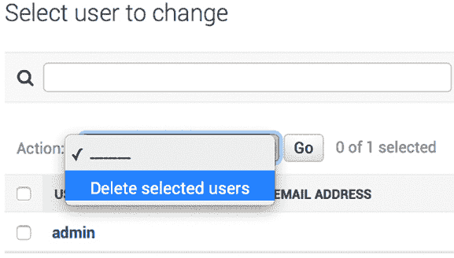

图 9.27：Django 管理操作的下拉菜单

您可以通过编写一个接收以下参数的常规函数来创建自定义操作：

+   当前显示的`ModelAdmin`。

+   当前请求对象作为`HttpRequest`实例。

+   用户选择的对象查询集。

当从管理网站触发操作时，将执行此函数。

您将创建一个自定义管理操作，以将订单列表下载为 CSV 文件。

编辑`orders`应用的`admin.py`文件，并在`OrderAdmin`类之前添加以下代码：

```py
import csv
import datetime
from django.http import HttpResponse
def export_to_csv(modeladmin, request, queryset):
    opts = modeladmin.model._meta
    content_disposition = (
        f'attachment; filename={opts.verbose_name}.csv'
 )
    response = HttpResponse(content_type='text/csv')
    response['Content-Disposition'] = content_disposition
    writer = csv.writer(response)
    fields = [
        field
        for field in opts.get_fields()
        if not field.many_to_many and not field.one_to_many
    ]
    # Write a first row with header information
    writer.writerow([field.verbose_name for field in fields])
    # Write data rows
for obj in queryset:
        data_row = []
        for field in fields:
            value = getattr(obj, field.name)
            if isinstance(value, datetime.datetime):
                value = value.strftime('%d/%m/%Y')
            data_row.append(value)
        writer.writerow(data_row)
    return response
export_to_csv.short_description = 'Export to CSV' 
```

在此代码中，您执行以下任务：

1.  您创建一个`HttpResponse`实例，指定`text/csv`内容类型，以告诉浏览器响应必须被处理为 CSV 文件。您还添加一个`Content-Disposition`头，以指示 HTTP 响应包含一个附加文件。

1.  您创建一个将写入`response`对象的 CSV `writer`对象。

1.  您使用模型的`_meta`选项的`get_fields()`方法动态获取`model`字段。您排除了多对多和一对多关系。

1.  您写入一个包含字段名称的标题行。

1.  您遍历给定的 QuerySet，并为 QuerySet 返回的每个对象写入一行。您会注意格式化`datetime`对象，因为 CSV 的输出值必须是字符串。

1.  您可以通过在函数上设置`short_description`属性来在管理网站的“操作”下拉元素中自定义操作的显示名称。

您已创建一个通用的管理操作，可以添加到任何`ModelAdmin`类中。

最后，将新的`export_to_csv`管理操作添加到`OrderAdmin`类中，如下所示。新的代码加粗显示：

```py
@admin.register(Order)
class OrderAdmin(admin.ModelAdmin):
    # ...
 **actions = [export_to_csv]** 
```

使用以下命令启动开发服务器：

```py
python manage.py runserver 
```

在你的浏览器中打开`http://127.0.0.1:8000/admin/orders/order/`。生成的管理操作应该看起来像这样：


图 9.28：使用自定义导出到 CSV 管理操作

选择一些订单，从选择框中选择**导出到 CSV**操作，然后点击**Go**按钮。你的浏览器将下载名为`order.csv`的生成 CSV 文件。使用文本编辑器打开下载的文件。你应该看到以下格式的内容，包括标题行和每个所选`Order`对象的行：

```py
ID,first name,last name,email,address,postal code,city,created,updated,paid,stripe id
4,Antonio,Melé,email@domain.com,20 W 34th St,10001,New York,03/01/2024,03/01/2024,True,pi_3ORvzkGNwIe5nm8S1wVd7l7i
... 
```

如你所见，创建管理操作相当简单。你可以在[`docs.djangoproject.com/en/5.0/howto/outputting-csv/`](https://docs.djangoproject.com/en/5.0/howto/outputting-csv/)了解更多关于使用 Django 生成 CSV 文件的信息。

如果你想要向你的管理站点添加更高级的导入/导出功能，你可以使用第三方应用`django-import-export`。你可以在[`django-import-export.readthedocs.io/en/latest/`](https://django-import-export.readthedocs.io/en/latest/)找到它的文档。

我们实现的示例对于小型到中型数据集效果良好。鉴于导出发生在 HTTP 请求中，如果服务器在导出过程完成之前关闭连接，非常大的数据集可能会导致服务器超时。为了避免这种情况，你可以使用 Celery 异步生成导出，使用`django-import-export-celery`应用。该项目可在[`github.com/auto-mat/django-import-export-celery`](https://github.com/auto-mat/django-import-export-celery)找到。

接下来，你将通过创建自定义管理视图进一步自定义管理站点。

# 通过自定义视图扩展管理站点

有时候，你可能想要自定义管理站点，超出通过配置`ModelAdmin`、创建管理操作和覆盖管理模板所能实现的范围。你可能想要实现现有管理视图或模板中不可用的附加功能。如果是这种情况，你需要创建一个自定义管理视图。使用自定义视图，你可以构建任何你想要的功能；你只需确保只有工作人员用户可以访问你的视图，并且通过使你的模板扩展管理模板来保持管理的外观和感觉。

让我们创建一个自定义视图来显示关于订单的信息。编辑`orders`应用的`views.py`文件，并添加以下加粗的代码：

```py
**from** **django.contrib.admin.views.decorators** **import** **staff_member_required**
from django.shortcuts import **get_object_or_404,** redirect, render
from cart.cart import Cart
from .forms import OrderCreateForm
from .models import Order, OrderItem
from .tasks import order_created
def order_create(request):
    # ...
**@staff_member_required**
**def****admin_order_detail****(****request, order_id****):**
 **order = get_object_or_404(Order,** **id****=order_id)**
**return** **render(**
 **request,** **'admin/orders/order/detail.html'****, {****'order'****: order}**
 **)** 
```

`staff_member_required`装饰器检查请求页面的用户`is_active`和`is_staff`字段是否都设置为`True`。在这个视图中，你获取具有给定 ID 的`Order`对象并渲染一个模板来显示订单。

接下来，编辑`orders`应用的`urls.py`文件，并添加以下突出显示的 URL 模式：

```py
urlpatterns = [
    path('create/', views.order_create, name='order_create'),
 **path(**
**'admin/order/<int:order_id>/'****,**
 **views.admin_order_detail,**
 **name=****'admin_order_detail'**
**),**
] 
```

在`orders`应用的`templates/`目录内创建以下文件结构：

```py
admin/
    orders/
        order/
            detail.html 
```

编辑`detail.html`模板，并向其中添加以下内容：

```py


  Order {{ order.id }} {{ block.super }}


  <div class="breadcrumbs">
<a href="">Home</a> &rsaquo;
<a href="">Orders</a>
&rsaquo;
<a href="">Order {{ order.id }}</a>
&rsaquo; Detail
  </div>


<div class="module">
<h1>Order {{ order.id }}</h1>
<ul class="object-tools">
<li>
<a href="#" onclick="window.print();">
        Print order
      </a>
</li>
</ul>
<table>
<tr>
<th>Created</th>
<td>{{ order.created }}</td>
</tr>
<tr>
<th>Customer</th>
<td>{{ order.first_name }} {{ order.last_name }}</td>
</tr>
<tr>
<th>E-mail</th>
<td><a href="mailto:{{ order.email }}">{{ order.email }}</a></td>
</tr>
<tr>
<th>Address</th>
<td>
      {{ order.address }},
      {{ order.postal_code }} {{ order.city }}
    </td>
</tr>
<tr>
<th>Total amount</th>
<td>${{ order.get_total_cost }}</td>
</tr>
<tr>
<th>Status</th>
<td>PaidPending payment</td>
</tr>
<tr>
<th>Stripe payment</th>
<td>
        
          <a href="{{ order.get_stripe_url }}" target="_blank">
            {{ order.stripe_id }}
          </a>
        
      </td>
</tr>
</table>
</div>
<div class="module">
<h2>Items bought</h2>
<table style="width:100%">
<thead>
<tr>
<th>Product</th>
<th>Price</th>
<th>Quantity</th>
<th>Total</th>
</tr>
</thead>
<tbody>
      
        <tr class="row">
<td>{{ item.product.name }}</td>
<td class="num">${{ item.price }}</td>
<td class="num">{{ item.quantity }}</td>
<td class="num">${{ item.get_cost }}</td>
</tr>
      
      <tr class="total">
<td colspan="3">Total</td>
<td class="num">${{ order.get_total_cost }}</td>
</tr>
</tbody>
</table>
</div>
 
```

确保没有模板标签被拆分到多行中。

这是用于在管理网站上显示订单详情的模板。该模板扩展了 Django 管理网站的`admin/base_site.html`模板，其中包含主要的 HTML 结构和 CSS 样式。你使用父模板中定义的块来包含你自己的内容。你显示关于订单和购买项目的信息。

当你想扩展管理模板时，你需要了解其结构并识别现有块。你可以在[`github.com/django/django/tree/5.0/django/contrib/admin/templates/admin`](https://github.com/django/django/tree/5.0/django/contrib/admin/templates/admin)找到所有管理模板。

如果需要，你也可以覆盖管理模板。为此，将一个模板复制到你的`templates/`目录中，保持相同的相对路径和文件名。Django 的管理网站将使用你的自定义模板而不是默认模板。

最后，让我们在管理网站列表显示页面的每个`Order`对象上添加一个链接。编辑`orders`应用的`admin.py`文件，并在`OrderAdmin`类之上添加以下代码：

```py
from django.urls import reverse
def order_detail(obj):
    url = reverse('orders:admin_order_detail', args=[obj.id])
    return mark_safe(f'<a href="{url}">View</a>') 
```

这是一个接受`Order`对象作为参数的函数，并返回`admin_order_detail` URL 的 HTML 链接。Django 默认会转义 HTML 输出。你必须使用`mark_safe`函数来避免自动转义。

然后，编辑`OrderAdmin`类以显示链接，如下所示。新的代码以粗体突出显示：

```py
class OrderAdmin(admin.ModelAdmin):
    list_display = [
        'id',
        'first_name',
        'last_name',
        'email',
        'address',
        'postal_code',
        'city',
        'paid',
        order_payment,
        'created',
        'updated',
 **order_detail,**
    ]
    # ... 
```

使用以下命令启动开发服务器：

```py
python manage.py runserver 
```

在你的浏览器中打开`http://127.0.0.1:8000/admin/orders/order/`。每一行都包含一个**视图**链接，如下所示：


图 9.29：每个订单行中包含的视图链接

点击任何订单的**视图**链接以加载自定义订单详情页面。你应该看到如下页面：


现在你已经创建了产品详情页面，你将学习如何动态生成 PDF 格式的订单发票。

# 动态生成 PDF 发票

现在你已经有一个完整的结账和支付系统，你可以为每个订单生成 PDF 发票。有几个 Python 库可以生成 PDF 文件。一个流行的使用 Python 代码生成 PDF 的库是 ReportLab。你可以在 [`docs.djangoproject.com/en/5.0/howto/outputting-pdf/`](https://docs.djangoproject.com/en/5.0/howto/outputting-pdf/) 找到有关如何使用 ReportLab 输出 PDF 文件的信息。

在大多数情况下，你将不得不向你的 PDF 文件添加自定义样式和格式。你会发现渲染 HTML 模板并将其转换为 PDF 文件，同时将 Python 从表示层中移开，会更加方便。你将遵循这种方法，并使用一个模块来使用 Django 生成 PDF 文件。你将使用 WeasyPrint，这是一个可以从 HTML 模板生成 PDF 文件的 Python 库。

## 安装 WeasyPrint

首先，从 [`doc.courtbouillon.org/weasyprint/stable/first_steps.html`](https://doc.courtbouillon.org/weasyprint/stable/first_steps.html) 安装适用于你的操作系统的 WeasyPrint 依赖项。然后，使用以下命令通过 `pip` 安装 WeasyPrint：

```py
python -m pip install WeasyPrint==61.2 
```

## 创建 PDF 模板

你需要一个 HTML 文档作为 WeasyPrint 的输入。你将创建一个 HTML 模板，使用 Django 进行渲染，并将其传递给 WeasyPrint 以生成 PDF 文件。

在 `orders` 应用的 `templates/orders/order/` 目录中创建一个新的模板文件，并将其命名为 `pdf.html`。向其中添加以下代码：

```py
<html>
<body>
<h1>My Shop</h1>
<p>
    Invoice no. {{ order.id }}<br>
<span class="secondary">
      {{ order.created|date:"M d, Y" }}
    </span>
</p>
<h3>Bill to</h3>
<p>
    {{ order.first_name }} {{ order.last_name }}<br>
    {{ order.email }}<br>
    {{ order.address }}<br>
    {{ order.postal_code }}, {{ order.city }}
  </p>
<h3>Items bought</h3>
<table>
<thead>
<tr>
<th>Product</th>
<th>Price</th>
<th>Quantity</th>
<th>Cost</th>
</tr>
</thead>
<tbody>
      
        <tr class="row">
<td>{{ item.product.name }}</td>
<td class="num">${{ item.price }}</td>
<td class="num">{{ item.quantity }}</td>
<td class="num">${{ item.get_cost }}</td>
</tr>
      
      <tr class="total">
<td colspan="3">Total</td>
<td class="num">${{ order.get_total_cost }}</td>
</tr>
</tbody>
</table>
<span class="paidpending">
    PaidPending payment
  </span>
</body>
</html> 
```

这是 PDF 发票的模板。在这个模板中，你显示所有订单详情和一个包含产品的 HTML `<table>` 元素。你还包括一个消息来显示订单是否已支付。

## 渲染 PDF 文件

你将创建一个视图来使用管理站点生成现有订单的 PDF 发票。编辑 `orders` 应用程序目录内的 `views.py` 文件，并向其中添加以下代码：

```py
import weasyprint
from django.contrib.staticfiles import finders
from django.http import HttpResponse
from django.template.loader import render_to_string
@staff_member_required
def admin_order_pdf(request, order_id):
    order = get_object_or_404(Order, id=order_id)
    html = render_to_string('orders/order/pdf.html', {'order': order})
    response = HttpResponse(content_type='application/pdf')
    response['Content-Disposition'] = f'filename=order_{order.id}.pdf'
    weasyprint.HTML(string=html).write_pdf(
        response,
        stylesheets=[weasyprint.CSS(finders.find('css/pdf.css'))]
    )
    return response 
```

这是生成订单 PDF 发票的视图。你使用 `staff_member_required` 装饰器确保只有工作人员用户可以访问此视图。

你获取具有给定 ID 的 `Order` 对象，并使用 Django 提供的 `render_to_string()` 函数渲染 `orders/order/pdf.html`。渲染后的 HTML 保存到 `html` 变量中。

然后，你生成一个新的 `HttpResponse` 对象，指定 `application/pdf` 内容类型，并包含 `Content-Disposition` 头来指定文件名。你使用 WeasyPrint 从渲染的 HTML 代码生成 PDF 文件，并将文件写入 `HttpResponse` 对象。

你使用静态文件 `css/pdf.css` 向生成的 PDF 文件添加 CSS 样式。为了定位文件，你使用 `staticfiles` 模块的 `finders()` 函数。最后，你返回生成的响应。

如果你缺少 CSS 样式，请记住将位于 `shop` 应用程序 `static/` 目录中的静态文件复制到你的项目相同的位置。

您可以在[`github.com/PacktPublishing/Django-5-by-Example/tree/main/Chapter09/myshop/shop/static`](https://github.com/PacktPublishing/Django-5-by-Example/tree/main/Chapter09/myshop/shop/static)找到目录内容。

由于您需要使用`STATIC_ROOT`设置，您必须将其添加到您的项目中。这是静态文件所在的项目路径。编辑`myshop`项目的`settings.py`文件，并添加以下设置：

```py
STATIC_ROOT = BASE_DIR / 'static' 
```

然后，运行以下命令：

```py
python manage.py collectstatic 
```

您应该看到以下结尾的输出：

```py
131 static files copied to 'code/myshop/static'. 
```

`collectstatic`命令会将所有静态文件从您的应用复制到`STATIC_ROOT`设置中定义的目录。这允许每个应用通过包含它们的`static/`目录来提供自己的静态文件。您还可以在`STATICFILES_DIRS`设置中提供额外的静态文件源。当执行`collectstatic`时，所有在`STATICFILES_DIRS`列表中指定的目录也将被复制到`STATIC_ROOT`目录。每次您再次执行`collectstatic`时，都会询问您是否要覆盖现有的静态文件。

编辑`orders`应用目录内的`urls.py`文件，并添加以下加粗的 URL 模式：

```py
urlpatterns = [
    # ...
 **path(****'admin/order/<int:order_id>/pdf/'****,**
 **views.admin_order_pdf,**
 **name=****'admin_order_pdf'**
**),**
] 
```

现在，您可以编辑`Order`模型的行政列表显示页面，为每个结果添加一个指向 PDF 文件的链接。编辑`orders`应用内的`admin.py`文件，并在`OrderAdmin`类上方添加以下代码：

```py
def order_pdf(obj):
    url = reverse('orders:admin_order_pdf', args=[obj.id])
    return mark_safe(f'<a href="{url}">PDF</a>')
order_pdf.short_description = 'Invoice' 
```

如果您为您的可调用对象指定了`short_description`属性，Django 将使用它作为列的名称。

将`order_pdf`添加到`OrderAdmin`类的`list_display`属性中，如下所示：

```py
class OrderAdmin(admin.ModelAdmin):
    list_display = [
        'id',
        'first_name',
        'last_name',
        'email',
        'address',
        'postal_code',
        'city',
        'paid',
        order_payment,
        'created',
        'updated',
        order_detail,
 **order_pdf,**
    ] 
```

确保开发服务器正在运行。在您的浏览器中打开`http://127.0.0.1:8000/admin/orders/order/`。现在，每一行都应该包括一个**PDF**链接，如下所示：


图 9.31：包含在每个订单行中的 PDF 链接

点击任何订单的**PDF**链接。您应该看到一个生成的 PDF 文件，如下所示（对于尚未付款的订单）：


图 9.32：未付款订单的 PDF 发票

对于已付款订单，您将看到以下 PDF 文件：


图 9.33：已付款订单的 PDF 发票

## 通过电子邮件发送 PDF 文件

当支付成功时，您将向您的客户发送包含生成的 PDF 发票的自动电子邮件。您将创建一个异步任务来执行此操作。

在`payment`应用目录内创建一个新文件，命名为`tasks.py`。向其中添加以下代码：

```py
from io import BytesIO
import weasyprint
from celery import shared_task
from django.contrib.staticfiles import finders
from django.core.mail import EmailMessage
from django.template.loader import render_to_string
from orders.models import Order
@shared_task
def payment_completed(order_id):
    """
    Task to send an e-mail notification when an order is
    successfully paid.
    """
    order = Order.objects.get(id=order_id)
    # create invoice e-mail
    subject = f'My Shop - Invoice no. {order.id}'
    message = (
        'Please, find attached the invoice for your recent purchase.'
    )
    email = EmailMessage(
        subject, message, 'admin@myshop.com', [order.email]
    )
    # generate PDF
    html = render_to_string('orders/order/pdf.html', {'order': order})
    out = BytesIO()
    stylesheets=[weasyprint.CSS(finders.find('css/pdf.css'))]
    weasyprint.HTML(string=html).write_pdf(out, stylesheets=stylesheets)
    # attach PDF file
    email.attach(
        f'order_{order.id}.pdf', out.getvalue(), 'application/pdf'
 )
    # send e-mail
    email.send() 
```

你通过使用 `@shared_task` 装饰器来定义 `payment_completed` 任务。在这个任务中，你使用 Django 提供的 `EmailMessage` 类创建一个 `email` 对象。然后，你在 `html` 变量中渲染模板。从渲染的模板生成 PDF 文件并将其输出到 `BytesIO` 实例，这是一个内存中的字节缓冲区。然后，使用 `attach()` 方法将生成的 PDF 文件附加到 `EmailMessage` 对象上，包括 `out` 缓冲区的内容。最后，发送电子邮件。

记得在项目的 `settings.py` 文件中设置你的 **简单邮件传输协议** (**SMTP**) 设置以发送电子邮件。你可以参考 *第二章*，*通过高级功能增强你的博客*，以查看 SMTP 配置的工作示例。如果你不想设置电子邮件设置，你可以通过在 `settings.py` 文件中添加以下设置来告诉 Django 将电子邮件写入控制台：

```py
EMAIL_BACKEND = 'django.core.mail.backends.console.EmailBackend' 
```

让我们将 `payment_completed` 任务添加到处理支付完成事件的 webhook 端点。

编辑 `payment` 应用程序的 `webhooks.py` 文件，并修改它使其看起来像这样：

```py
import stripe
from django.conf import settings
from django.http import HttpResponse
from django.views.decorators.csrf import csrf_exempt
from orders.models import Order
**from** **.tasks** **import** **payment_completed**
@csrf_exempt
def stripe_webhook(request):
    payload = request.body
    sig_header = request.META['HTTP_STRIPE_SIGNATURE']
    event = None
try:
        event = stripe.Webhook.construct_event(
            payload, sig_header, settings.STRIPE_WEBHOOK_SECRET
        )
    except ValueError as e:
        # Invalid payload
return HttpResponse(status=400)
    except stripe.error.SignatureVerificationError as e:
        # Invalid signature
return HttpResponse(status=400)
    if event.type == 'checkout.session.completed':
        session = event.data.object
if (
            session.mode == 'payment'
and session.payment_status == 'paid'
        ):
            try:
                order = Order.objects.get(
                    id=session.client_reference_id
                )
            except Order.DoesNotExist:
                return HttpResponse(status=404)
            # mark order as paid
            order.paid = True
# store Stripe payment ID
            order.stripe_id = session.payment_intent
            order.save()
            **# launch asynchronous task**
 **payment_completed.delay(order.****id****)**
return HttpResponse(status=200) 
```

通过调用其 `delay()` 方法，将 `payment_completed` 任务排队。该任务将被添加到队列中，并由 Celery 工作器尽快异步执行。

现在，你可以完成一个新的结账过程，以便在您的电子邮件中接收 PDF 发票。如果您正在使用 `console.EmailBackend` 作为您的电子邮件后端，在您运行 Celery 的 shell 中，您将能够看到以下输出：

```py
MIME-Version: 1.0
Subject: My Shop - Invoice no. 7
From: admin@myshop.com
To: email@domain.com
Date: Wed, 3 Jan 2024 20:15:24 -0000
Message-ID: <164841212458.94972.10344068999595916799@amele-mbp.home>
--===============8908668108717577350==
Content-Type: text/plain; charset="utf-8"
MIME-Version: 1.0
Content-Transfer-Encoding: 7bit
Please, find attached the invoice for your recent purchase.
--===============8908668108717577350==
Content-Type: application/pdf
MIME-Version: 1.0
Content-Transfer-Encoding: base64
Content-Disposition: attachment; filename="order_7.pdf"
JVBERi0xLjcKJfCflqQKMSAwIG9iago8PAovVHlwZSA... 
```

此输出显示电子邮件包含附件。你已经学会了如何将文件附加到电子邮件并程序化地发送它们。

恭喜！你已经完成了 Stripe 集成，并为你的商店添加了有价值的功能。

# 摘要

在本章中，你将 Stripe 支付网关集成到你的项目中，并创建了一个 webhook 端点以接收支付通知。你构建了一个自定义管理操作来导出订单到 CSV 文件。你还使用自定义视图和模板自定义了 Django 管理站点。最后，你学习了如何使用 WeasyPrint 生成 PDF 文件并将它们附加到电子邮件中。

下一章将教你如何使用 Django 会话创建优惠券系统，并且你将使用 Redis 构建一个产品推荐引擎。

# 其他资源

以下资源提供了与本章涵盖的主题相关的额外信息：

+   本章的源代码：[`github.com/PacktPublishing/Django-5-by-example/tree/main/Chapter09`](https://github.com/PacktPublishing/Django-5-by-example/tree/main/Chapter09)

+   Stripe 网站：[`www.stripe.com/`](https://www.stripe.com/)

+   Stripe Checkout 文档：[`stripe.com/docs/payments/checkout`](https://stripe.com/docs/payments/checkout)

+   创建 Stripe 账户：[`dashboard.stripe.com/register`](https://dashboard.stripe.com/register)

+   Stripe 账户设置：[`dashboard.stripe.com/settings/account`](https://dashboard.stripe.com/settings/account)

+   Stripe Python 库：[`github.com/stripe/stripe-python`](https://github.com/stripe/stripe-python)

+   Stripe 测试 API 密钥：[`dashboard.stripe.com/test/apikeys`](https://dashboard.stripe.com/test/apikeys)

+   Stripe API 密钥文档：[`stripe.com/docs/keys`](https://stripe.com/docs/keys)

+   Stripe API 版本 2024-04-10 发布：[`stripe.com/docs/upgrades#2024-04-10`](https://stripe.com/docs/api/events/types)

+   Stripe 会话模式：[`stripe.com/docs/api/checkout/sessions/object#checkout_session_object-mode`](https://stripe.com/docs/api/checkout/sessions/object#checkout_session_object-mode)

+   使用 Django 构建绝对 URI：[`docs.djangoproject.com/en/5.0/ref/request-response/#django.http.HttpRequest.build_absolute_uri`](https://docs.djangoproject.com/en/5.0/ref/request-response/#django.http.HttpRequest.build_absolute_uri)

+   创建 Stripe 会话：[`stripe.com/docs/api/checkout/sessions/create`](https://stripe.com/docs/api/checkout/sessions/create)

+   Stripe 支持货币：[`stripe.com/docs/currencies`](https://stripe.com/docs/currencies)

+   Stripe 支付仪表板：[`dashboard.stripe.com/test/payments`](https://dashboard.stripe.com/test/payments)

+   用于测试与 Stripe 支付测试的信用卡：[`stripe.com/docs/testing`](https://stripe.com/docs/testing)

+   Stripe 网络钩子：[`dashboard.stripe.com/test/webhooks`](https://dashboard.stripe.com/test/webhooks)

+   Stripe 发送的事件类型：[`stripe.com/docs/api/events/types`](https://stripe.com/docs/api/events/types)

+   安装 Stripe CLI：[`stripe.com/docs/stripe-cli#install`](https://stripe.com/docs/stripe-cli#install )

+   最新 Stripe CLI 版本发布：[`github.com/stripe/stripe-cli/releases/latest`](https://github.com/stripe/stripe-cli/releases/latest)

+   使用 Django 生成 CSV 文件：[`docs.djangoproject.com/en/5.0/howto/outputting-csv/`](https://docs.djangoproject.com/en/5.0/howto/outputting-csv/)

+   `django-import-export`应用程序：[`django-import-export.readthedocs.io/en/latest/`](https://django-import-export.readthedocs.io/en/latest/)

+   `django-import-export-celery`应用程序：[`github.com/auto-mat/django-import-export-celery`](https://github.com/auto-mat/django-import-export-celery)

+   Django 管理模板：[`github.com/django/django/tree/5.0/django/contrib/admin/templates/admin`](https://github.com/django/django/tree/5.0/django/contrib/admin/templates/admin)

+   使用 ReportLab 输出 PDF 文件：[`docs.djangoproject.com/en/5.0/howto/outputting-pdf/`](https://docs.djangoproject.com/en/5.0/howto/outputting-pdf/)

+   安装 WeasyPrint：[`doc.courtbouillon.org/weasyprint/stable/first_steps.html`](https://doc.courtbouillon.org/weasyprint/stable/first_steps.html)

+   本章节的静态文件：[`github.com/PacktPublishing/Django-5-by-Example/tree/main/Chapter09/myshop/shop/static`](https://github.com/PacktPublishing/Django-5-by-Example/tree/main/Chapter09/myshop/shop/static)
