# 第十一章：将国际化添加到您的商店

在上一章中，您为您的商店添加了优惠券系统并构建了一个产品推荐引擎。

在本章中，您将学习国际化与本地化的工作原理。通过使您的应用程序支持多种语言，您可以服务更广泛的用户。此外，通过适应本地格式约定，如日期或数字格式，您可以提高其可用性。通过翻译和本地化您的应用程序，您将使其对来自不同文化背景的用户更加直观，并增加用户参与度。

本章将涵盖以下主题：

+   为项目准备国际化

+   管理翻译文件

+   翻译 Python 代码

+   翻译模板

+   使用 Rosetta 管理翻译

+   翻译 URL 模式和使用 URL 中的语言前缀

+   允许用户切换语言

+   使用`django-parler`翻译模型

+   使用 ORM 进行模型翻译

+   适配视图以使用翻译

+   使用`django-localflavor`的本地化表单字段

# 功能概述

*图 11.1*显示了本章将构建的视图、模板和功能表示：

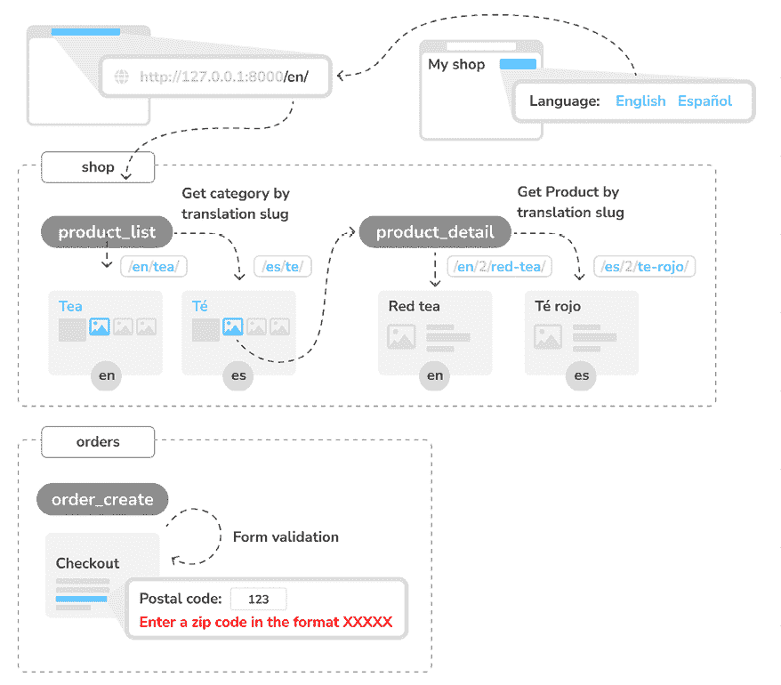

图 11.1：第十一章构建的功能图

在本章中，您将在项目中实现国际化并翻译模板、URL 和模型。您将在网站页眉中添加语言选择链接并创建特定语言的 URL。您将修改`shop`应用程序的`product_list`和`product_detail`视图，通过其翻译的别名检索`Category`和`Product`对象。您还将向`order_create`视图中使用的表单添加一个本地化邮政编码字段。

本章的源代码可以在[`github.com/PacktPublishing/Django-5-by-example/tree/main/Chapter11`](https://github.com/PacktPublishing/Django-5-by-example/tree/main/Chapter11)找到。

本章中使用的所有 Python 模块都包含在本章提供的源代码中的`requirements.txt`文件中。您可以按照以下说明安装每个 Python 模块，或者可以使用命令`python -m pip install -r requirements.txt`一次性安装所有依赖。

# 使用 Django 进行国际化

Django 提供了完整的国际化与本地化支持。它允许您将应用程序翻译成多种语言，并处理日期、时间、数字和时区等特定地区的格式。让我们明确国际化与本地化的区别：

+   **国际化**（通常缩写为**i18n**）是指适应软件以适应不同语言和地区的潜在使用，使其不会硬编码到特定的语言或地区。

+   **本地化**（缩写为 **l10n**）是将软件实际翻译并适应特定区域的过程。Django 本身使用其国际化框架翻译成 50 多种语言。

国际化框架允许您轻松地为字符串标记翻译，无论是在 Python 代码中还是在您的模板中。它依赖于 GNU `gettext` 工具集来生成和管理消息文件。**消息文件**是一个纯文本文件，代表一种语言。它包含应用程序中找到的翻译字符串及其相应翻译的某个部分或全部。消息文件具有 `.po` 扩展名。一旦完成翻译，消息文件将被编译以提供对翻译字符串的快速访问。编译后的翻译文件具有 `.mo` 扩展名。

让我们回顾 Django 为国际化和本地化提供的设置。

## 国际化和本地化设置

Django 为国际化提供了几个设置。以下设置是最相关的：

+   `USE_I18N`: 一个布尔值，指定 Django 的翻译系统是否启用。默认情况下为 `True`。

+   `USE_TZ`: 一个布尔值，指定日期时间是否具有时区意识。使用 `startproject` 命令创建项目时，此设置为 `True`。

+   `LANGUAGE_CODE`: 项目的默认语言代码。这是标准语言 ID 格式，例如，`en-us` 代表美国英语或 `en-gb` 代表英国英语。此设置需要将 `USE_I18N` 设置为 `True` 才能生效。您可以在 `http://www.i18nguy.com/unicode/language-identifiers.html` 找到有效语言 ID 的列表。

+   `LANGUAGES`: 包含项目可用语言的元组。它们以两个元组的形式出现，包含 **语言代码** 和 **语言名称**。您可以在 `django.conf.global_settings` 中查看可用语言的列表。当您选择您的网站将支持的语言时，将 `LANGUAGES` 设置为该列表的子集。

+   `LOCALE_PATHS`: Django 查找包含项目翻译消息文件的目录列表。

+   `TIME_ZONE`: 表示项目时区的字符串。使用 `startproject` 命令创建新项目时，此设置为 `'UTC'`。您可以将其设置为任何其他时区，例如 `'Europe/Madrid'`。

这些是一些可用的国际化和本地化设置。您可以在 [`docs.djangoproject.com/en/5.0/ref/settings/#globalization-i18n-l10n`](https://docs.djangoproject.com/en/5.0/ref/settings/#globalization-i18n-l10n) 找到完整的列表。

在审查了国际化和本地化最重要的设置之后，让我们学习如何为我们的应用程序创建翻译。

## 国际化管理命令

Django 包含以下管理命令来管理翻译：

+   `makemessages`：这个命令会遍历源代码树，找到所有标记为翻译的字符串，并在`locale`目录中创建或更新`.po`消息文件。每种语言都会创建一个单独的`.po`文件。

+   `compilemessages`：这个命令将现有的`.po`消息文件编译成`.mo`文件，这些文件用于检索翻译。

Django 依赖于`gettext`工具包来生成和编译翻译文件。让我们回顾一下如何安装它。

## 安装`gettext`工具包

你需要`gettext`工具包来创建、更新和编译消息文件。大多数 Linux 发行版都包含`gettext`工具包。如果你使用 macOS，最简单的方法是通过 Homebrew 安装它，在[`brew.sh/`](https://brew.sh/)，使用以下命令：

```py
brew install gettext 
```

你可能还需要使用以下命令强制链接：

```py
brew link --force gettext 
```

如果你使用的是 Windows，请遵循[`docs.djangoproject.com/en/5.0/topics/i18n/translation/#gettext-on-windows`](https://docs.djangoproject.com/en/5.0/topics/i18n/translation/#gettext-on-windows)中的步骤。你可以从[`mlocati.github.io/articles/gettext-iconv-windows.html`](https://mlocati.github.io/articles/gettext-iconv-windows.html)下载预编译的`gettext`二进制安装程序。

一旦安装了`gettext`工具包，你就可以开始翻译你的项目了。首先，你需要了解翻译项目所需的步骤以及 Django 如何确定用户的语言。

## 如何向 Django 项目添加翻译

让我们探索国际化项目的过程。以下是翻译 Django 项目所需的步骤：

1.  在你的 Python 代码和模板中标记需要翻译的字符串。

1.  运行`makemessages`命令以创建或更新包含所有翻译字符串的消息文件。

1.  翻译消息文件中包含的字符串。

1.  使用`compilemessages`管理命令编译消息文件。

我们将遵循这个过程在本章中为我们的项目添加翻译。

接下来，你将学习 Django 如何确定当前用户的语言。

## Django 如何确定当前语言

Django 附带一个中间件，根据请求数据确定当前语言。这是位于`django.middleware.locale.LocaleMiddleware`的`LocaleMiddleware`中间件，它执行以下任务：

1.  如果你使用的是`i18n_patterns`，即你使用的是翻译过的 URL 模式，它会查找请求 URL 中的语言前缀以确定当前语言。你将在*翻译 URL 模式部分*中学习如何翻译 URL 模式。

1.  如果没有找到语言前缀，它会在当前用户的会话中查找现有的`LANGUAGE_SESSION_KEY`。

1.  如果会话中没有设置语言，它将查找包含当前语言的现有 cookie。可以在`LANGUAGE_COOKIE_NAME`设置中提供此 cookie 的自定义名称。默认情况下，此 cookie 的名称为`django_language`。

1.  如果找不到 cookie，它将查找请求的`Accept-Language` HTTP 头。

1.  如果`Accept-Language`头没有指定语言，Django 将使用`LANGUAGE_CODE`设置中定义的语言。

默认情况下，Django 将使用`LANGUAGE_CODE`设置中定义的语言，除非您正在使用`LocaleMiddleware`。这里描述的过程仅适用于使用此中间件的情况。

我们还可以让用户更改他们的语言。您将在*允许用户切换语言*部分了解如何实现语言选择器。

让我们从配置我们的项目以进行国际化开始。

# 为您的项目准备国际化

我们将准备我们的项目以使用不同的语言。我们将为在线商店创建英语和西班牙语版本：

编辑您的项目的`settings.py`文件，并向其中添加以下`LANGUAGES`设置。将其放置在`LANGUAGE_CODE`设置旁边：

```py
LANGUAGES = [
    ('en', 'English'),
    ('es', 'Spanish'),
] 
```

`LANGUAGES`设置包含两个元组，由语言代码和名称组成。语言代码可以是区域特定的，如`en-us`或`en-gb`，也可以是通用的，如`en`。通过此设置，您指定应用程序将仅提供英语和西班牙语。如果您没有定义自定义的`LANGUAGES`设置，则站点将提供 Django 翻译成所有语言。

让您的`LANGUAGE_CODE`设置看起来像以下这样：

```py
LANGUAGE_CODE = **'****en'** 
```

将`'django.middleware.locale.LocaleMiddleware'`添加到`MIDDLEWARE`设置中。确保这个中间件在`SessionMiddleware`之后，因为`LocaleMiddleware`需要使用会话数据。它还必须放在`CommonMiddleware`之前，因为后者需要一个有效的语言来解析请求的 URL。`MIDDLEWARE`设置现在应该看起来像以下这样：

```py
MIDDLEWARE = [
    'django.middleware.security.SecurityMiddleware',
    'django.contrib.sessions.middleware.SessionMiddleware',
**'django.middleware.locale.LocaleMiddleware'****,**
'django.middleware.common.CommonMiddleware',
    'django.middleware.csrf.CsrfViewMiddleware',
    'django.contrib.auth.middleware.AuthenticationMiddleware',
    'django.contrib.messages.middleware.MessageMiddleware',
    'django.middleware.clickjacking.XFrameOptionsMiddleware',
] 
```

中间件类的顺序非常重要，因为每个中间件都可能依赖于之前执行的其他中间件设置的数据。中间件按照`MIDDLEWARE`中出现的顺序应用于请求，对于响应则按相反的顺序。

在主项目目录内，在`manage.py`文件旁边创建以下目录结构：

```py
locale/
    en/
    es/ 
```

`locale`目录是您的应用程序消息文件存放的地方。

再次编辑`settings.py`文件，并向其中添加以下设置：

```py
LOCALE_PATHS = [
    BASE_DIR / 'locale',
] 
```

`LOCALE_PATHS`设置指定了 Django 必须查找翻译文件的目录。首先出现的区域路径具有最高优先级。

当您从项目目录中使用`makemessages`命令时，将在您创建的`locale/`路径下生成消息文件。然而，对于包含`locale/`目录的应用程序，消息文件将在该目录下生成。

您的项目现在已配置为国际化。接下来，您将学习如何在 Python 代码中翻译字符串。

# 翻译 Python 代码

我们将探讨在 Python 代码中处理翻译的各种方法。我们将涵盖以下方法：

+   **标准翻译**

+   **延迟翻译**：在访问值时执行，而不是在调用函数时。

+   **包含变量的翻译**：用于在要翻译的字符串中插入变量。

+   **翻译中的复数形式**：管理依赖于可能影响要翻译的字符串的数值的技术。

对于翻译 Python 代码中的字面量，您可以使用包含在`django.utils.translation`中的`gettext()`函数标记字符串以进行翻译。此函数翻译消息并返回一个字符串。惯例是将此函数导入为简短的别名`_`（下划线字符）。

您可以在[`docs.djangoproject.com/en/5.0/topics/i18n/translation/`](https://docs.djangoproject.com/en/5.0/topics/i18n/translation/)找到有关翻译的所有文档。

让我们回顾一下 Python 字符串的不同翻译方法。

## 标准翻译

以下代码展示了如何标记字符串以进行翻译：

```py
from django.utils.translation import gettext as _
output = _('Text to be translated.') 
```

此方法允许您通过使用`gettext()`函数（为方便起见别名为`_`）将翻译应用于 Python 代码中的大多数字符串。

## 延迟翻译

Django 为其所有翻译函数都包含**延迟**版本，这些版本具有后缀`_lazy()`。当使用延迟函数时，字符串在访问值时进行翻译，而不是在调用函数时（这就是为什么它们是**延迟翻译**的）。当标记为翻译的字符串位于在模块加载时执行的路径中时，延迟翻译函数非常有用。

延迟翻译的一个常见示例是在项目的`settings.py`文件中，在那里立即翻译不切实际，因为必须在翻译系统完全准备就绪之前定义设置。

使用`gettext_lazy()`而不是`gettext()`意味着字符串在访问值时进行翻译。Django 为所有翻译函数提供了一种延迟版本。

## 包含变量的翻译

标记为翻译的字符串可以包含占位符以在翻译中包含变量。以下代码是一个包含占位符的翻译字符串的示例：

```py
from django.utils.translation import gettext as _
month = _('April')
day = '14'
output = _('Today is %(month)s %(day)s') % {'month': month, 'day': day} 
```

通过使用占位符，您可以重新排序文本变量。例如，上一个示例的英文翻译可能是“今天是 4 月 14 日”，而西班牙语的翻译可能是“今天是 4 月 14 日”。当翻译字符串有多个参数时，始终使用字符串插值而不是位置插值。这样做，您将能够重新排序占位符文本。

## 翻译中的复数形式

对于复数形式，Django 提供了`ngettext()`和`ngettext_lazy()`函数。这些函数根据表示对象数量的参数翻译单数和复数形式。以下示例展示了如何使用它们：

```py
output = ngettext(
    'there is %(count)d product',    # Singular form
'there are %(count)d products',  # Plural form
    count                            # Numeric value to determine form
) % {'count': count} 
```

在这个例子中，如果`count`是`1`，`ngettext()`将使用第一个字符串并输出`there is 1 product`。对于任何其他数字，它将使用第二个字符串，适当地输出，例如，`there are 5 products`。这允许在需要复数规则的语种中进行更准确和语法正确的翻译。

现在你已经了解了在 Python 代码中翻译字面量的基础知识，是时候将翻译应用到你的项目中了。

## 将自己的代码翻译成其他语言

首先，我们将翻译语言名称。为此，你可以按照以下说明操作：

编辑你的项目的`settings.py`文件，导入`gettext_lazy()`函数，并更改`LANGUAGES`设置，如下所示：

```py
**from** **django.utils.translation** **import** **gettext_lazy** **as** **_**
# ...
LANGUAGES = [
    ('en', **_(**'English'**)**),
    ('es', **_(**'Spanish'**)**),
] 
```

在这里，你使用`gettext_lazy()`函数而不是`gettext()`函数，以避免循环导入，从而在访问时翻译语言名称。

在你的项目目录中打开 shell，并运行以下命令：

```py
django-admin makemessages --all 
```

你应该会看到以下输出：

```py
processing locale es
processing locale en 
```

看一下`locale/`目录。你应该会看到以下文件结构：

```py
en/
    LC_MESSAGES/
        django.po
es/
    LC_MESSAGES/
        django.po 
```

为每种语言创建了一个`.po`消息文件。

使用文本编辑器打开`es/LC_MESSAGES/django.po`。在文件末尾，你应该能看到以下内容：

```py
#: myshop/settings.py:118
msgid "English"
msgstr ""
#: myshop/settings.py:119
msgid "Spanish"
msgstr "" 
```

每个翻译字符串前面都有一个注释，显示有关文件和找到该行的详细信息。每个翻译包括两个字符串：

+   `msgid`：源代码中出现的翻译字符串。

+   `msgstr`：语言翻译，默认为空。这是你需要输入给定字符串的实际翻译的地方。

按照以下方式填写给定`msgid`字符串的`msgstr`翻译：

```py
#: myshop/settings.py:118
msgid "English"
msgstr **"Inglés"**
#: myshop/settings.py:119
msgid "Spanish"
msgstr **"Español"** 
```

保存修改后的消息文件，打开 shell，并运行以下命令：

```py
django-admin compilemessages 
```

如果一切顺利，你应该会看到以下输出：

```py
processing file django.po in myshop/locale/en/LC_MESSAGES
processing file django.po in myshop/locale/es/LC_MESSAGES 
```

输出会给你关于正在编译的消息文件的信息。再次查看`myshop`项目的`locale`目录。你应该会看到以下文件：

```py
en/
    LC_MESSAGES/
        django.mo
        django.po
es/
    LC_MESSAGES/
        django.mo
        django.po 
```

你可以看到，为每种语言都生成了一个`.mo`编译的消息文件。

现在你已经翻译了语言名称，让我们翻译网站上显示的模型字段名称：

编辑`orders`应用程序的`models.py`文件，并将标记为翻译的名称添加到`Order`模型字段中，如下所示：

```py
**from** **django.utils.translation** **import** **gettext_lazy** **as** **_**
class Order(models.Model):
    first_name = models.CharField(**_(****'first name'****)**, max_length=50)
    last_name = models.CharField(**_(****'last name'****)**, max_length=50)
    email = models.EmailField(**_(****'e-mail'****)**)
    address = models.CharField(**_(****'address'****)**, max_length=250)
    postal_code = models.CharField(**_(****'postal code'****)**, max_length=20)
    city = models.CharField(**_(****'city'****)**, max_length=100)
    # ... 
```

你已经添加了当用户放置新订单时显示的字段名称。这些是`first_name`、`last_name`、`email`、`address`、`postal_code`和`city`。记住，你也可以使用`verbose_name`属性来命名字段。

在`orders`应用程序目录内创建以下目录结构：

```py
locale/
    en/
    es/ 
```

通过创建一个 `locale` 目录，此应用程序的翻译字符串将存储在此目录中的消息文件中，而不是主消息文件中。这样，您可以为每个应用程序生成单独的翻译文件。

从项目目录打开 shell 并运行以下命令：

```py
django-admin makemessages --all 
```

您应该看到以下输出：

```py
processing locale es
processing locale en 
```

使用文本编辑器打开 `order` 应用程序的 `locale/es/LC_MESSAGES/django.po` 文件。您将看到 `Order` 模型的翻译字符串。为给定的 `msgid` 字符串填写以下 `msgstr` 翻译：

```py
#: orders/models.py:12
msgid "first name"
msgstr **"nombre"**
#: orders/models.py:14
msgid "last name"
msgstr **"apellidos"**
#: orders/models.py:16
msgid "e-mail"
msgstr **"e-mail"**
#: orders/models.py:17
msgid "address"
msgstr **"dirección"**
#: orders/models.py:19
msgid "postal code"
msgstr **"código postal"**
#: orders/models.py:21
msgid "city"
msgstr **"ciudad"** 
```

在您完成添加翻译后，保存文件。

除了文本编辑器外，您还可以使用 Poedit 来编辑翻译。Poedit 是一款使用 `gettext` 的翻译编辑软件，适用于 Linux、Windows 和 macOS。您可以从 [`poedit.net/`](https://poedit.net/) 下载 Poedit。

让我们也翻译您项目的表单。`orders` 应用程序的 `OrderCreateForm` 不需要翻译。这是因为它是一个 `ModelForm`，并使用 `Order` 模型字段的 `verbose_name` 属性作为表单字段标签。您将翻译 `cart` 和 `coupons` 应用程序的表单：

编辑 `cart` 应用程序目录内的 `forms.py` 文件，并将 `label` 属性添加到 `CartAddProductForm` 的 `quantity` 字段。然后，按照以下方式标记此字段以进行翻译：

```py
from django import forms
**from** **django.utils.translation** **import** **gettext_lazy** **as** **_**
PRODUCT_QUANTITY_CHOICES = [(i, str(i)) for i in range(1, 21)]
class CartAddProductForm(forms.Form):
    quantity = forms.TypedChoiceField(
        choices=PRODUCT_QUANTITY_CHOICES,
        coerce=int**,**
 **label=_(****'Quantity'****)**
    )
    override = forms.BooleanField(
        required=False,
        initial=False,
        widget=forms.HiddenInput
    ) 
```

编辑 `coupons` 应用程序的 `forms.py` 文件，并按照以下方式翻译 `CouponApplyForm` 表单：

```py
from django import forms
**from** **django.utils.translation** **import** **gettext_lazy** **as** **_**
class CouponApplyForm(forms.Form):
    code = forms.CharField(**label=_(****'Coupon'****)**) 
```

您已经为 `code` 字段添加了一个标签，并标记了它以进行翻译。

您已经完成了对 Python 字符串的标记以进行翻译。接下来，您将学习如何在模板中标记文本以进行翻译。

# 翻译模板

Django 提供了 `` 和 `` 模板标签来使用模板进行字符串翻译。为了使用翻译模板标签，您必须在模板顶部添加 `` 来加载它们。

## `` 模板标签

`` 模板标签允许您标记一个文字以进行翻译。内部，Django 对给定文本执行 `gettext()`。这是在模板中标记字符串以进行翻译的方法：

```py
 
```

您可以使用 `as` 将翻译内容存储在一个变量中，这样您就可以在整个模板中使用它。以下示例将翻译文本存储在一个名为 `greeting` 的变量中：

```py

<h1>{{ greeting }}</h1> 
```

`` 标签对于简单的翻译字符串很有用，但它无法处理包含变量的翻译内容。

## `` 模板标签

`` 模板标签允许您使用占位符标记包含文字和变量内容的文本。以下示例展示了如何使用 `` 标签，包括在内容中为翻译添加一个 `name` 变量：

```py
Hello {{ name }}! 
```

你可以使用 `with` 来包含模板表达式，例如访问对象属性或对变量应用模板过滤器。你总是必须为这些使用占位符。你无法在 `blocktrans` 块内访问表达式或对象属性。以下示例展示了如何使用 `with` 来包含一个应用了 `capfirst` 过滤器的对象属性：

```py

  Hello {{ name }}!
 
```

当你需要将变量内容包含在翻译字符串中时，使用 `` 标签而不是 ``。

现在你已经熟悉了翻译模板标签，让我们来使用它们。

## 翻译商店模板

编辑 `shop/base.html` 模板。确保你在模板顶部加载 `i18n` 标签，并按照以下方式标记字符串为翻译。新的代码以粗体显示：

```py

<!DOCTYPE html>
<html>
<head>
<meta charset="utf-8" />
<title>
    ****
  </title>
<link href="" rel="stylesheet">
</head>
<body>
<div id="header">
<a href="/" class="logo">****</a>
</div>
<div id="subheader">
<div class="cart">
      
        
          ****:
          <a href="">
****
 **{{ items }} item, ${{ total }}**
 ****
 **{{ items }} items, ${{ total }}**
 ****
</a>
        
          ****
        
      
    </div>
</div>
<div id="content">
    
    
  </div>
</body>
</html> 
```

确保不要将模板标签拆分到多行。

注意显示购物车摘要的 `` 标签。购物车摘要之前如下所示：

```py
{{ total_items }} item{{ total_items|pluralize }},
${{ cart.get_total_price }} 
```

你已经更改了它，现在你使用 `` 来设置占位符 `total`，其值为 `cart.get_total_price`（这里调用的是对象方法）。你同样使用了 `count`，这允许你为 Django 设置一个计数对象的变量，以便选择正确的复数形式。你将 `items` 变量设置为计数具有 `total_items` 值的对象。

这允许你在 `` 块内使用 `` 标签来设置单数和复数形式的翻译，你通过这个标签来分隔它们。生成的代码如下：

```py

  {{ items }} item, ${{ total }}

  {{ items }} items, ${{ total }}
 
```

接下来，编辑 `shop/product/detail.html` 模板，并添加 `i18n` 到 `` 标签中：

```py


... 
```

注意 `` 允许你通过包含由空格分隔的模块一次性加载所有模板标签。在这种情况下，我们加载了包含模板标签的 `i18n` 和 `static` 模块。

然后，找到以下行：

```py
<input type="submit" value="Add to cart"> 
```

用以下内容替换它：

```py
<input type="submit" value="****"> 
```

然后，找到以下行：

```py
<h3>People who bought this also bought</h3> 
```

用以下内容替换它：

```py
<h3>****</h3> 
```

现在，翻译 `orders` 应用程序模板。编辑 `orders/order/create.html` 模板，并按照以下方式标记文本为翻译：

```py

****

 ****


  <h1>****</h1>
  <div class="order-info">
    <h3>****</h3>
    <ul>
      
        <li>
          {{ item.quantity }}x {{ item.product.name }}
          <span>${{ item.total_price }}</span>
        </li>
      
      
        <li>
          ****
**"****{{ code }}"** **({{ discount }}% off)**
 ****
          <span class="neg">- ${{ cart.get_discount|floatformat:2 }}</span>
        </li>
      
    </ul>
    <p>****: ${{
    cart.get_total_price_after_discount|floatformat:2 }}</p>
  </div>
  <form method="post" class="order-form">
    {{ form.as_p }}
    <p><input type="submit" value="****"></p>
    
  </form>
 
```

确保不要将模板标签拆分到多行。查看伴随本章节的代码中的以下文件，以了解字符串是如何标记为翻译的：

+   `shop` 应用程序：模板 `shop/product/list.html`

+   `orders` 应用程序：模板 `orders/order/pdf.html`

+   `cart` 应用程序：模板 `cart/detail.html`

+   `payments` 应用程序：模板 `payment/process.html`、`payment/completed.html` 和 `payment/canceled.html`

记住，你可以在这个章节的源代码在 [`github.com/PacktPublishing/Django-5-by-Example/tree/master/Chapter11`](https://github.com/PacktPublishing/Django-5-by-Example/tree/master/Chapter11) 找到。

让我们更新消息文件以包含新的翻译字符串：

打开 shell 并运行以下命令：

```py
django-admin makemessages --all 
```

`.po`文件位于`myshop`项目的`locale`目录中，您会看到`orders`应用程序现在包含了您标记为翻译的所有字符串。

编辑项目的`.po`翻译文件和`orders`应用程序，并在`msgstr`中包含西班牙语翻译。您还可以在伴随本章节的源代码中使用翻译后的`.po`文件。

运行以下命令以编译翻译文件：

```py
django-admin compilemessages 
```

您将看到以下输出：

```py
processing file django.po in myshop/locale/en/LC_MESSAGES
processing file django.po in myshop/locale/es/LC_MESSAGES
processing file django.po in myshop/orders/locale/en/LC_MESSAGES
processing file django.po in myshop/orders/locale/es/LC_MESSAGES 
```

为每个`.po`翻译文件生成了一个包含编译翻译的`.mo`文件。

现在，您已经使用文本编辑器或 Poedit 编辑了`.po`文件。接下来，我们将使用 Django 应用程序直接在浏览器中编辑翻译。

# 使用 Rosetta 翻译界面

Rosetta 是一个第三方应用程序，允许您使用与 Django 管理站点相同的界面直接在浏览器中编辑翻译。Rosetta 使编辑`.po`文件变得容易，并更新编译的翻译文件。这消除了下载和上传翻译文件的需要，并支持多用户协作编辑。

让我们将 Rosetta 集成到您的项目中：

使用以下命令通过`pip`安装 Rosetta：

```py
python -m pip install django-rosetta==0.10.0 
```

然后，将`'rosetta'`添加到项目`settings.py`文件中的`INSTALLED_APPS`设置，如下所示：

```py
INSTALLED_APPS = [
    # ...
**'rosetta'****,**
] 
```

您需要将 Rosetta 的 URL 添加到您的主 URL 配置中。编辑项目的主`urls.py`文件并添加以下加粗的 URL 模式：

```py
urlpatterns = [
    path('admin/', admin.site.urls),
    path('cart/', include('cart.urls', namespace='cart')),
    path('orders/', include('orders.urls', namespace='orders')),
    path('payment/', include('payment.urls', namespace='payment')),
    path('coupons/', include('coupons.urls', namespace='coupons')),
 **path(****'rosetta/'****, include(****'rosetta.urls'****)),**
    path('', include('shop.urls', namespace='shop')),
] 
```

确保将其放置在`shop.urls`模式之前，以防止不希望的匹配模式。

打开`http://127.0.0.1:8000/admin/`并以超级用户身份登录。然后，在浏览器中导航到`http://127.0.0.1:8000/rosetta/`。在**过滤器**菜单中，点击**第三方**以显示所有可用的消息文件，包括属于`orders`应用程序的文件。

您应该看到一个现有语言的列表，如下所示：

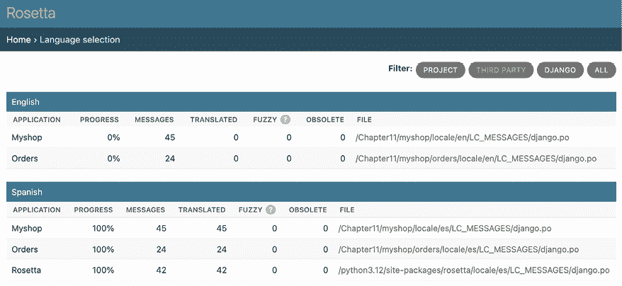

图 11.2：Rosetta 管理界面

在**西班牙语**部分点击**Myshop**链接来编辑西班牙语翻译。您应该看到一个翻译字符串列表，如下所示：

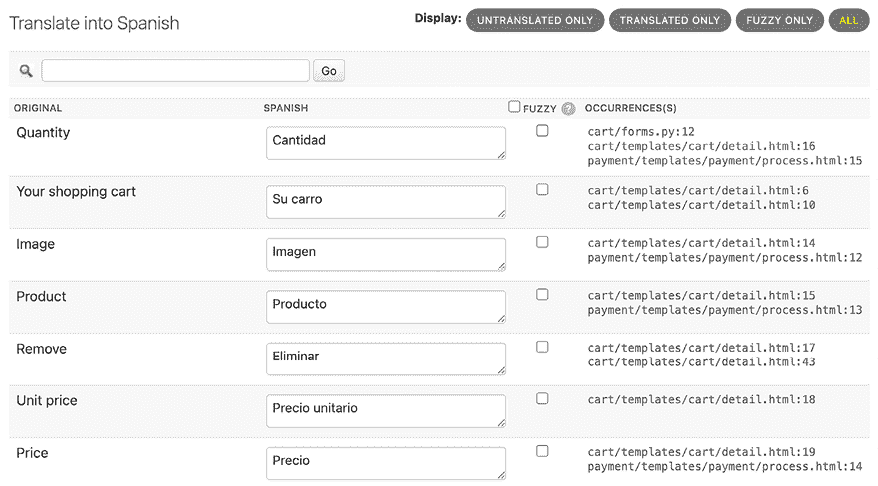

图 11.3：使用 Rosetta 编辑西班牙语翻译

您可以在**西班牙语**列中输入翻译。**出现次数**列显示每个翻译字符串被找到的文件和代码行。

包含占位符的翻译将如下所示：


图 11.4：包含占位符的翻译

Rosetta 使用不同的背景颜色来显示占位符。在翻译内容时，请确保您保留占位符未翻译。例如，以下字符串：

```py
%(items)s items, $%(total)s 
```

它可以被翻译成西班牙语如下：

```py
%(items)s productos, $%(total)s 
```

您可以查看本章附带源代码，以使用相同的西班牙语翻译为您的项目。

当你完成翻译编辑后，点击**保存并翻译下一块**按钮将翻译保存到`.po`文件。Rosetta 在保存翻译时编译消息文件，因此你不需要运行`compilemessages`命令。然而，Rosetta 需要写入`locale`目录的权限来写入消息文件。确保目录具有有效的权限。

如果你希望其他用户能够编辑翻译，请在浏览器中打开`http://127.0.0.1:8000/admin/auth/group/add/`并创建一个名为`translators`的新组。然后，访问`http://127.0.0.1:8000/admin/auth/user/`来编辑你想要授予权限以编辑翻译的用户。在编辑用户时，在**权限**部分，为每个用户将`translators`组添加到**选择的组**。Rosetta 仅对超级用户或属于`translators`组的用户可用。

你可以在[`django-rosetta.readthedocs.io/`](https://django-rosetta.readthedocs.io/)阅读 Rosetta 的文档。

当你向生产环境添加新翻译时，如果你使用真实 Web 服务器运行 Django，你必须在运行`compilemessages`命令或使用 Rosetta 保存翻译后重新加载服务器，以便任何更改生效。

在编辑翻译时，可以将翻译标记为*模糊的*。让我们回顾一下模糊翻译是什么。

# 模糊翻译

在 Rosetta 编辑翻译时，你可以看到一个**FUZZY**列。这不是 Rosetta 的功能；它是由`gettext`提供的。如果翻译的**FUZZY**标志处于激活状态，则它将不会包含在编译的消息文件中。此标志标记需要翻译员审查的翻译字符串。当`.po`文件更新为新翻译字符串时，某些翻译字符串可能会自动标记为模糊。这发生在`gettext`发现某些`msgid`被略微修改时。`gettext`将其与它认为的旧翻译配对，并将其标记为模糊以供审查。然后，翻译员应审查模糊翻译，移除**FUZZY**标志，并再次编译翻译文件。

你已经翻译了项目界面，但国际化并不止于此。你还可以翻译 URL 模式，为每种支持的语言提供定制的 URL。

# 国际化的 URL 模式

Django 为 URL 提供了国际化功能。它包括两个主要功能用于国际化 URL：

+   **URL 模式中的语言前缀**：在 URL 中添加语言前缀，以便在不同的基本 URL 下提供每种语言版本

+   **翻译后的 URL 模式**：翻译 URL 模式，使每个 URL 针对每种语言都不同

翻译 URL 的一个原因是为了优化您的网站以适应搜索引擎。通过在您的模式中添加语言前缀，您将能够为每种语言索引一个 URL，而不是为所有语言索引一个单一的 URL。此外，通过将 URL 翻译成每种语言，您将为搜索引擎提供在每种语言中排名更好的 URL。

## 在 URL 模式中添加语言前缀

Django 允许您在 URL 模式中添加语言前缀。例如，您网站的英文版本可以通过以`/en/`开头的路径提供服务，而西班牙语版本在`/es/`下。要使用 URL 模式中的语言，您必须使用 Django 提供的`LocaleMiddleware`。框架将使用它从请求的 URL 中识别当前语言。之前，您已将其添加到项目的`MIDDLEWARE`设置中，因此现在您不需要再这样做。

让我们在 URL 模式中添加一个语言前缀：

编辑`myshop`项目的主体`urls.py`文件，并添加`i18n_patterns()`，如下所示：

```py
**from** **django.conf.urls.i18n** **import** **i18n_patterns**
urlpatterns = **i18n_patterns(**
    path('admin/', admin.site.urls),
    path('cart/', include('cart.urls', namespace='cart')),
    path('orders/', include('orders.urls', namespace='orders')),
    path('payment/', include('payment.urls', namespace='payment')),
    path('coupons/', include('coupons.urls', namespace='coupons')),
    path('rosetta/', include('rosetta.urls')),
    path('', include('shop.urls', namespace='shop')),
**)** 
```

您可以将不可翻译的标准 URL 模式和`i18n_patterns`下的模式结合起来，以便某些模式包含语言前缀，而其他模式则不包含。然而，最好只使用翻译的 URL，以避免不小心翻译的 URL 与非翻译的 URL 模式匹配的可能性。

运行开发服务器并在您的浏览器中打开`http://127.0.0.1:8000/`。Django 将执行*如何确定当前语言*部分中描述的步骤以确定当前语言，并将您重定向到请求的 URL，包括语言前缀。查看您浏览器中的 URL；现在它应该看起来像`http://127.0.0.1:8000/en/`。当前语言是您的浏览器`Accept-Language`头中设置的语言，如果是西班牙语或英语；否则，它是您设置中定义的默认`LANGUAGE_CODE`（英语）。

您已经为您的 URL 添加了语言前缀，为每种可用的语言生成不同的 URL。这有助于您在搜索引擎中索引不同的版本。

接下来，我们将翻译 URL 模式，以便我们可以将完全翻译的 URL 添加到我们的网站上。

## 翻译 URL 模式

Django 支持在 URL 模式中使用翻译字符串。您可以为单个 URL 模式使用不同的翻译。您可以使用与字面量相同的方式标记需要翻译的 URL 模式，使用`gettext_lazy()`函数。为此，请按照以下步骤操作：

编辑`myshop`项目的主体`urls.py`文件，并为`cart`、`orders`、`payment`和`coupons`应用的 URL 模式正则表达式添加翻译字符串，如下所示：

```py
**from** **django.utils.translation** **import** **gettext_lazy** **as** **_**
urlpatterns = i18n_patterns(
    path('admin/', admin.site.urls),
    path(**_(**'cart/'**)**, include('cart.urls', namespace='cart')),
    path(**_(**'orders/'**)**, include('orders.urls', namespace='orders')),
    path(**_(**'payment/'**)**, include('payment.urls', namespace='payment')),
    path(**_(**'coupons/'**)**, include('coupons.urls', namespace='coupons')),
    path('rosetta/', include('rosetta.urls')),
    path('', include('shop.urls', namespace='shop')),
) 
```

编辑`orders`应用的`urls.py`文件，并标记`order_create` URL 模式为翻译，如下所示：

```py
**from** **django.utils.translation** **import** **gettext_lazy** **as** **_**
urlpatterns = [
    path(**_(**'create/'**)**, views.order_create, name='order_create'),
    # ...
] 
```

编辑`payment`应用的`urls.py`文件，并将代码更改为以下内容：

```py
**from** **django.utils.translation** **import** **gettext_lazy** **as** **_**
urlpatterns = [
    path(**_(**'process/'**)**, views.payment_process, name='process'),
    path(**_(****'**completed/'**)**, views.payment_completed, name='completed'),
    path(**_(**'canceled/'**)**, views.payment_canceled, name='canceled'),
    path('webhook/', webhooks.stripe_webhook, name='stripe-webhook'),
] 
```

注意，这些 URL 模式将包括语言前缀，因为它们包含在项目的`main `urls.py`文件中的`i18n_patterns()`下。这将使每个 URL 模式对于每种可用语言都有一个不同的 URI，一个以`/en/`开头，另一个以`/es/`开头，依此类推。然而，我们需要一个用于 Stripe 通知事件的单个 URL，并且我们需要在`webhook` URL 中避免语言前缀。

从`payment`应用的`urls.py`文件中删除`webhook` URL 模式。文件现在应如下所示：

```py
from django.utils.translation import gettext_lazy as _
urlpatterns = [
    path(_('process/'), views.payment_process, name='process'),
    path(_('completed/'), views.payment_completed, name='completed'),
    path(_('canceled/'), views.payment_canceled, name='canceled'),
] 
```

然后，将以下`webhook` URL 模式添加到`myshop`项目的`main `urls.py`文件中。新的代码以粗体显示：

```py
from django.utils.translation import gettext_lazy as _
**from** **payment** **import** **webhooks**
urlpatterns = i18n_patterns(
    path('admin/', admin.site.urls),
    path(_('cart/'), include('cart.urls', namespace='cart')),
    path(_('orders/'), include('orders.urls', namespace='orders')),
    path(_('payment/'), include('payment.urls', namespace='payment')),
    path(_('coupons/'), include('coupons.urls', namespace='coupons')),
    path('rosetta/', include('rosetta.urls')),
    path('', include('shop.urls', namespace='shop')),
)
**urlpatterns += [**
 **path(**
**'payment/webhook/'****,**
 **webhooks.stripe_webhook,**
 **name=****'stripe-webhook'**
 **),**
**]**
if settings.DEBUG:
    urlpatterns += static(
        settings.MEDIA_URL, document_root=settings.MEDIA_ROOT
    ) 
```

我们已将`webhook` URL 模式添加到`urlpatterns`之外，以确保我们保持 Stripe 事件通知的单个 URL。

您不需要翻译`shop`应用的 URL 模式，因为它们是用变量构建的，不包含任何其他文字。

打开 shell 并运行以下命令以更新消息文件中的新翻译：

```py
django-admin makemessages --all 
```

确保开发服务器正在以下命令下运行：

```py
python manage.py runserver 
```

在您的浏览器中打开`http://127.0.0.1:8000/en/rosetta/`并点击**西班牙语**部分下的**Myshop**链接。点击**仅未翻译**以仅查看尚未翻译的字符串。现在，您将看到翻译的 URL 模式，如图*图 11.5*所示：

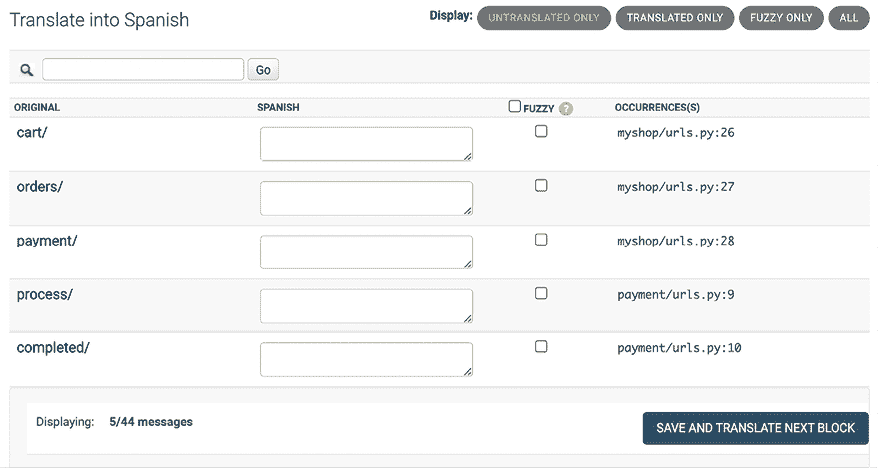

图 11.5：Rosetta 界面中的翻译 URL 模式

为每个 URL 添加不同的翻译字符串。不要忘记在每个 URL 的末尾包括一个斜杠字符`/`，如图*图 11.6*所示：

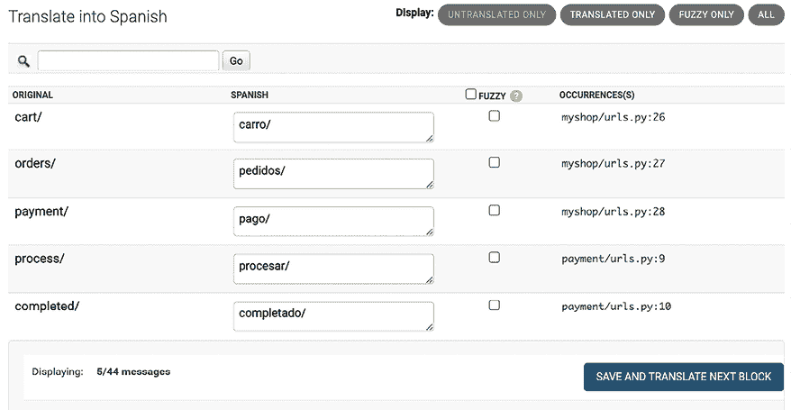

图 11.6：Rosetta 界面中的 URL 模式西班牙语翻译

完成后，点击**保存并翻译下一块**。

然后，点击**仅模糊**。您将看到被标记为模糊的翻译，因为这些翻译与类似原始字符串的旧翻译配对。在*图 11.7*中显示的情况下，翻译是错误的，需要更正：

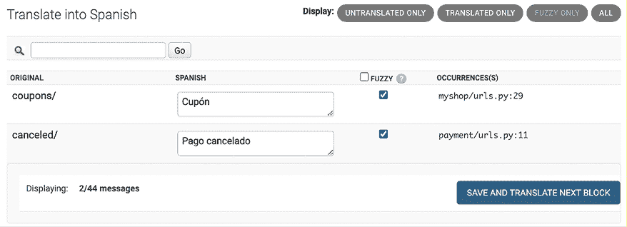

图 11.7：Rosetta 界面中的模糊翻译

为模糊翻译输入正确的文本。当您为翻译输入新文本时，Rosetta 将自动取消选中**模糊**选择框。完成输入后，点击**保存并翻译下一块**：

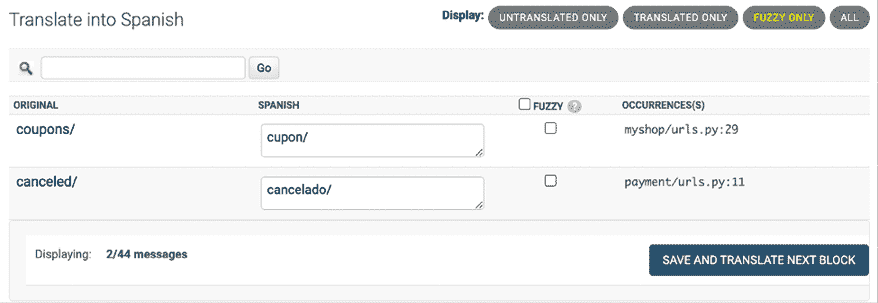

图 11.8：在 Rosetta 界面中更正模糊翻译

您现在可以回到`http://127.0.0.1:8000/en/rosetta/files/third-party/`并编辑`orders`应用的西班牙语翻译。

在将字符串翻译成西班牙语后，我们的网站将提供两种语言。您已经学习了 Django 如何确定当前语言。然而，用户可能希望切换语言。让我们创建允许用户更改语言偏好的功能。

# 允许用户切换语言

由于你提供的内容支持多种语言，你应该允许用户切换网站的语种。你将向你的网站添加一个语言选择器。语言选择器将包含一个显示链接的可用语言列表。

编辑 `shop/base.html` 模板中的 `shop` 应用程序，并定位以下行：

```py
<div id="header">
<a href="/" class="logo"></a>
</div> 
```

将它们替换为以下代码：

```py
<div id="header">
<a href="/" class="logo"></a>
 ****
 ****
 ****
**<****div****class****=****"languages"****>**
**<****p****>****:****</****p****>**
**<****ul****class****=****"languages"****>**
 ****
**<****li****>**
**<****a****href****=****"/{{ language.code }}/"**
 **** **class****=****"selected"****>**
 **{{ language.name_local }}**
**</****a****>**
**</****li****>**
 ****
**</****ul****>**
**</****div****>**
</div> 
```

确保没有任何模板标签被拆分成多行。

这就是构建你的语言选择器的方式：

1.  你使用 `` 加载国际化标签。

1.  你使用 `` 标签来检索当前语言。

1.  你可以通过使用 `` 模板标签来获取在 `LANGUAGES` 设置中定义的语言。

1.  你使用 `` 标签来提供对语言属性的便捷访问。

1.  你构建一个 HTML 列表来显示所有可用语言，并给当前活动的语言添加一个 `selected` 类属性。

在语言选择器的代码中，你使用了由 `i18n` 提供的模板标签，基于你项目设置中的可用语言。现在，在你的浏览器中打开 `http://127.0.0.1:8000/` 并查看。你应该在网站右上角看到语言选择器，如下所示：


图 11.9：产品列表页面，包括网站页眉中的语言选择器

本章中的图片：

*绿茶*：由 Jia Ye 在 Unsplash 上拍摄的照片

*红茶*：由 Manki Kim 在 Unsplash 上拍摄的照片

*茶粉*：由 Phuong Nguyen 在 Unsplash 上拍摄的照片

用户现在可以通过选择语言选择器中提供的选项轻松切换到他们喜欢的语言。

# 使用 django-parler 翻译模型

Django 不包括内置的模型翻译支持。要管理多语言内容，你可以开发一个自定义解决方案，或者选择一个促进模型翻译的第三方模块。有几种第三方应用程序可用，每种应用程序都采用独特的方法来存储和检索翻译。其中之一是 `django-parler`。此模块为翻译模型提供了一种非常有效的方法，并且与 Django 的管理站点无缝集成。

`django-parler` 为每个包含翻译的模型生成一个单独的数据库表。此表包括所有翻译字段以及一个外键，指向翻译所属的原始对象。它还包含一个语言字段，因为每一行存储的是单一语言的内容。

`django-parler` 包已经好几年没有更新了。尽管如此，许多开发者仍然继续使用它，因为它在促进模型翻译方面的有效性得到了证明。

## 安装 django-parler

使用以下命令通过 `pip` 安装 `django-parler`：

```py
python -m pip install django-parler==2.3 
```

编辑你的项目中的 `settings.py` 文件，并将 `'parler'` 添加到 `INSTALLED_APPS` 设置中，如下所示：

```py
INSTALLED_APPS = [
    # ...
**'parler'****,**
] 
```

此外，将以下代码添加到你的设置中：

```py
# django-parler settings
PARLER_LANGUAGES = {
    None: (
        {'code': 'en'},
        {'code': 'es'},
    ),
    'default': {
        'fallback': 'en',
        'hide_untranslated': False,
    }
} 
```

此设置定义了`django-parler`可用的语言，`en`和`es`，对于`django-parler`。您指定默认语言`en`，并指示`django-parler`不应隐藏未翻译的内容。

Parler 现在已在我们的项目中激活。让我们为我们的模型字段添加翻译功能。

## 翻译模型字段

让我们为您的产品目录添加翻译。`django-parler`提供了一个`TranslatableModel`模型类和一个`TranslatedFields`包装器来翻译模型字段。您可以按照以下说明操作：

编辑`shop`应用程序目录内的`models.py`文件并添加以下导入：

```py
from parler.models import TranslatableModel, TranslatedFields 
```

然后，修改`Category`模型，使`name`和`slug`字段可翻译，如下所示：

```py
class Category(**TranslatableModel**):
 **translations = TranslatedFields(**
       name = models.CharField(max_length=200)**,**
        slug = models.SlugField(max_length=200, unique=True)**,**
 **)** 
```

`Category`模型现在从`models.Model`继承，而不是从`TranslatableModel`继承，并且`name`和`slug`字段都包含在`TranslatedFields`包装器中。

编辑`Product`模型以添加`name`、`slug`和`description`字段的翻译，如下所示：

```py
class Product(**TranslatableModel**):
 **translations = TranslatedFields(**
        name = models.CharField(max_length=200)**,**
        slug = models.SlugField(max_length=200)**,**
        description = models.TextField(blank=True)
 **)**
    category = models.ForeignKey(
        Category,
        related_name='products',
        on_delete=models.CASCADE
    )
    image = models.ImageField(
        upload_to='products/%Y/%m/%d',
        blank=True
    )
    price = models.DecimalField(max_digits=10, decimal_places=2)
    available = models.BooleanField(default=True)
    created = models.DateTimeField(auto_now_add=True)
    updated = models.DateTimeField(auto_now=True) 
```

`django-parler`通过为每个可翻译模型生成另一个模型来管理翻译。在以下架构中，您可以查看`Product`模型的字段以及生成的`ProductTranslation`模型将是什么样子：

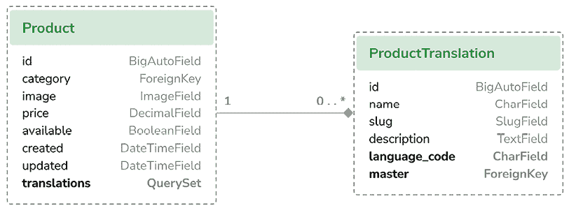

图 11.10：由 django-parler 生成的产品模型和相关产品翻译模型

`django-parler`生成的`ProductTranslation`模型包括`name`、`slug`和`description`可翻译字段、一个`language_code`字段以及指向主`Product`对象的`ForeignKey`。从`Product`到`ProductTranslation`存在一对一的关系。每个`Product`对象将存在一个对应每种可用语言的`ProductTranslation`对象。

由于 Django 使用单独的表来存储翻译，因此您无法使用一些 Django 功能。无法使用带有翻译字段的默认排序。您可以在查询中按翻译字段进行筛选，但不能在`ordering Meta`选项中包含可翻译字段。此外，您不能为翻译字段使用索引，因为这些字段将不会存在于原始模型中，因为它们将位于翻译模型中。

编辑`shop`应用程序的`models.py`文件并取消注释`Category Meta`类的`ordering`和`indexes`属性：

```py
class Category(TranslatableModel):
    # ...
class Meta:
        **#** ordering = ['name']
**#** indexes = [
**#**     models.Index(fields=['name']),
**#** ]
        verbose_name = 'category'
        verbose_name_plural = 'categories' 
```

您还必须取消注释`Product Meta`类的`ordering`属性和引用翻译字段的索引。取消注释以下`Product Meta`类的行：

```py
class Product(TranslatableModel):
    # ...
class Meta:
        **#** ordering = ['name']
        indexes = [
            **#** models.Index(fields=['id', 'slug']),
**#** models.Index(fields=['name']),
            models.Index(fields=['-created']),
        ] 
```

您可以阅读有关`django-parler`模块与 Django 兼容性的更多信息，请参阅[`django-parler.readthedocs.io/en/latest/compatibility.html`](https://django-parler.readthedocs.io/en/latest/compatibility.html)。

让我们继续将可翻译模型集成到管理站点中。

## 将翻译集成到管理站点

`django-parler`与 Django 管理站点无缝集成。这允许您通过用户友好的管理界面轻松编辑对象的多种翻译。它包括一个`TranslatableAdmin`类，该类覆盖了 Django 提供的`ModelAdmin`类以管理模型翻译。

编辑`shop`应用的`admin.py`文件，并向其中添加以下导入：

```py
from parler.admin import TranslatableAdmin 
```

将`CategoryAdmin`和`ProductAdmin`类修改为从`TranslatableAdmin`继承，而不是从`ModelAdmin`继承。`django-parler`模块不支持`prepopulated_fields`属性，但它支持`get_prepopulated_fields()`方法，该方法提供相同的功能。让我们相应地进行更改。编辑`admin.py`文件，使其看起来如下：

```py
from django.contrib import admin
**from** **parler.admin** **import** **TranslatableAdmin**
from .models import Category, Product
@admin.register(Category)
class CategoryAdmin(**TranslatableAdmin**):
    list_display = ['name', 'slug']
**def****get_prepopulated_fields****(****self, request, obj=****None****):**
**return** **{****'slug'****: (****'name'****,)}**
@admin.register(Product)
class ProductAdmin(**TranslatableAdmin**):
    list_display = [
        'name',
        'slug',
        'price',
        'available',
        'created',
        'updated'
    ]
    list_filter = ['available', 'created', 'updated']
    list_editable = ['price', 'available']
**def****get_prepopulated_fields****(****self, request, obj=****None****):**
**return** **{****'slug'****: (****'name'****,)}** 
```

您已将管理站点调整为与新的翻译模型一起工作。您现在可以同步数据库，以与您所做的模型更改保持一致。

## 创建模型翻译的迁移

要创建迁移，请按照以下说明操作：

打开终端并运行以下命令以创建模型翻译的新迁移：

```py
python manage.py makemigrations shop --name "translations" 
```

您将看到以下输出：

```py
Migrations for 'shop':
  shop/migrations/0002_translations.py
    - Create model CategoryTranslation
    - Create model ProductTranslation
    - Change Meta options on category
    - Change Meta options on product
    - Remove index shop_catego_name_289c7e_idx from category
    - Remove index shop_produc_id_f21274_idx from product
    - Remove index shop_produc_name_a2070e_idx from product
    - Remove field name from category
    - Remove field slug from category
    - Remove field description from product
    - Remove field name from product
    - Remove field slug from product
    - Add field master to producttranslation
    - Add field master to categorytranslation
    - Alter unique_together for producttranslation (1 constraint(s))
    - Alter unique_together for categorytranslation (1 constraint(s)) 
```

此迁移自动包括由`django-parler`动态创建的`CategoryTranslation`和`ProductTranslation`模型。请注意，此迁移会删除模型中先前存在的字段。

这意味着您将丢失这些数据，在运行它之后需要在管理站点上重新设置类别和产品。

编辑`shop`应用的`migrations/0002_translations.py`文件，并识别以下行的两个出现：

```py
bases=(parler.models.TranslatedFieldsModelMixin, models.Model), 
```

将这些出现替换为以下内容：

```py
bases=(parler.models.**TranslatableModel**, models.Model), 
```

这是针对您使用的`django-parler`版本中发现的微小问题的修复。此更改是必要的，以防止在应用迁移时迁移失败。此问题与在模型中创建现有字段的翻译有关，应在较新的`django-parler`版本中得到修复。

运行以下命令以应用迁移：

```py
python manage.py migrate shop 
```

您将看到一个以以下行为结尾的输出：

```py
Applying shop.0002_ categorytranslation_producttranslation_and_more... OK 
```

您的模型现在与数据库同步。

使用以下命令运行开发服务器：

```py
python manage.py runserver 
```

在浏览器中打开`http://127.0.0.1:8000/en/admin/shop/category/`。您将看到由于删除了这些字段并使用由`django-parler`生成的可翻译模型，现有的类别失去了名称和 slug。您将只看到每列下的破折号，如*图 11.11*所示：


图 11.11：创建翻译模型后在 Django 管理站点上的类别列表

点击类别名称下的破折号以编辑它。您将看到**更改类别**页面包括两个不同的选项卡，一个用于英语翻译，一个用于西班牙语翻译：

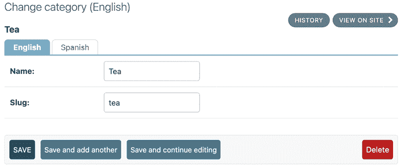

图 11.12：包括由 django-parler 添加的语言选项卡的类别编辑表单

确保为所有现有类别填写一个名称和 slug。当您编辑一个类别时，输入英语详情并点击 **保存并继续编辑**。然后，点击 **西班牙语**，为字段添加西班牙语翻译，并点击 **保存**：


图 11.13：类别编辑表单的西班牙语翻译

在切换语言选项卡之间确保保存更改。

完成现有类别的数据后，打开 `http://127.0.0.1:8000/en/admin/shop/product/` 并编辑每个产品，提供英语和西班牙语名称、slug 和描述。

一旦翻译就绪，下一步将是探索如何通过 Django ORM 与翻译字段交互。

## 在 QuerySets 中使用翻译

让我们看看如何在 QuerySets 中处理翻译。运行以下命令以打开 Python shell：

```py
python manage.py shell 
```

让我们看看如何检索和查询翻译字段。要获取具有可翻译字段的特定语言的对象，您可以使用 Django 的 `activate()` 函数，如下所示：

```py
>>> from shop.models import Product
>>> from django.utils.translation import activate
>>> activate('es')
>>> product=Product.objects.first()
>>> product.name
'Té verde' 
```

另一种方法是使用 `django-parler` 提供的 `language()` 管理器，如下所示：

```py
>>> product=Product.objects.language('en').first()
>>> product.name
'Green tea' 
```

当您访问翻译字段时，它们将使用当前语言进行解析。您可以为对象设置不同的当前语言以访问特定的翻译，如下所示：

```py
>>> product.set_current_language('es')
>>> product.name
'Té verde'
>>> product.get_current_language()
'es' 
```

当使用 `filter()` 执行 QuerySet 时，您可以使用 `translations__` 语法通过相关翻译对象进行过滤，如下所示：

```py
>>> Product.objects.filter(translations__name='Green tea')
<TranslatableQuerySet [<Product: Té verde>]> 
```

让我们将所学知识应用到我们的视图中。

## 调整视图以进行翻译

让我们调整产品目录视图：

编辑 `shop` 应用程序的 `views.py` 文件，并在 `product_list` 视图中添加以下加粗显示的代码：

```py
def product_list(request, category_slug=None):
    category = None
    categories = Category.objects.all()
    products = Product.objects.filter(available=True)
    if category_slug:
 **language = request.LANGUAGE_CODE**
        category = get_object_or_404(
            Category,
 **translations__language_code=language,**
 **translations__**slug=category_slug
        )
        products = products.filter(category=category)
    return render(
        request,
        'shop/product/list.html',
        {
            'category': category,
            'categories': categories,
            'products': products
        }
    ) 
```

然后，编辑 `product_detail` 视图，并添加以下加粗显示的代码：

```py
def product_detail(request, id, slug):
 **language = request.LANGUAGE_CODE**
    product = get_object_or_404(
        Product,
        id=id,
        **translations__language_code=language,**
 **translations__**slug=slug,
        available=True
    )
    cart_product_form = CartAddProductForm()
    r = Recommender()
    recommended_products = r.suggest_products_for([product], 4)
    return render(
        request,
        'shop/product/detail.html',
        {
            'product': product,
            'cart_product_form': cart_product_form,
            'recommended_products': recommended_products
        }
    ) 
```

`product_list` 和 `product_detail` 视图现在已调整以使用翻译字段检索对象。

使用以下命令运行开发服务器：

```py
python manage.py runserver 
```

在您的浏览器中打开 `http://127.0.0.1:8000/es/`。您应该看到产品列表页面，包括所有翻译成西班牙语的产品：


图 11.14：产品列表页面的西班牙语版本

现在，每个产品的 URL 都是使用当前语言的 `slug` 字段构建的。例如，西班牙语产品的 URL 是 `http://127.0.0.1:8000/es/2/te-rojo/`，而在英语中，URL 是 `http://127.0.0.1:8000/en/2/red-tea/`。如果您导航到产品详情页面，您将看到翻译后的 URL 和所选语言的內容，如下例所示：

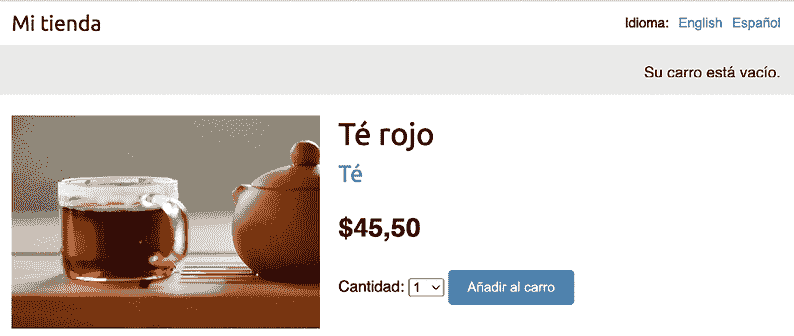

图 11.15：产品详情页面的西班牙语版本

如果您想了解更多关于 `django-parler` 的信息，您可以在 [`django-parler.readthedocs.io/en/latest/`](https://django-parler.readthedocs.io/en/latest/) 找到完整的文档。

您已经学习了如何翻译 Python 代码、模板、URL 模式和模型字段。为了完成国际化区域化过程，您还需要使用日期、时间和数字的区域化格式。

# 格式区域化

为了提升用户体验，将日期、时间和数字以与用户区域设置一致的方式呈现非常重要。将您的网站调整为适应不同地区用户熟悉的数据格式，可以显著提高其可访问性。自 Django 5.0 以来，数据区域化格式化始终是启用的。Django 使用当前区域设置的格式显示数字和日期。

Django 试图在模板中输出值时使用区域特定的格式。*图 11.16*显示了网站英文和西班牙语文本中十进制数字的格式区域化：

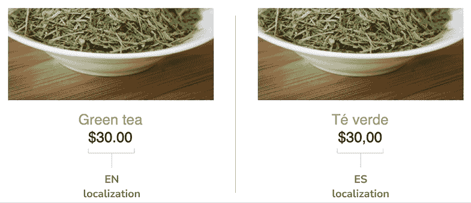

图 11.16：英文和西班牙语文本中的格式区域化

英语文本中的十进制数字使用点作为小数分隔符显示，而在西班牙语文本中，使用逗号作为分隔符。这是由于 Django 为`en`和`es`区域设置的格式。您可以在[`github.com/django/django/blob/stable/5.0.x/django/conf/locale/en/formats.py`](https://github.com/django/django/blob/stable/5.0.x/django/conf/locale/en/formats.py)查看英文格式配置，并在[`github.com/django/django/blob/stable/5.0.x/django/conf/locale/es/formats.py`](https://github.com/django/django/blob/stable/5.0.x/django/conf/locale/es/formats.py)查看西班牙语文本格式配置。

默认情况下，Django 为每个区域设置应用格式区域化。但是，可能存在您不想使用区域化值的情况。这尤其适用于输出 JavaScript 或 JSON，它们必须提供机器可读的格式。

Django 提供了一个``模板标签，允许您为模板片段打开/关闭区域化。这为您提供了对区域化格式的控制。您必须加载`l10n`（区域化）标签才能使用此模板标签。以下是在模板中打开和关闭区域化的示例：

```py


  {{ value }}


  {{ value }}
 
```

Django 还提供了`localize`和`unlocalize`模板过滤器，可以强制或避免对值进行区域化。这些过滤器可以按以下方式应用：

```py
{{ value|localize }}
{{ value|unlocalize }} 
```

您还可以创建自定义格式文件来指定区域设置格式。您可以在[`docs.djangoproject.com/en/5.0/topics/i18n/formatting/`](https://docs.djangoproject.com/en/5.0/topics/i18n/formatting/)找到有关格式区域设置的更多信息。

接下来，您将学习如何创建区域化表单字段。

# 使用 django-localflavor 验证表单字段

`django-localflavor`是一个第三方模块，包含一系列特定于每个国家的实用工具，如表单字段或模型字段。它对于验证本地区域、本地电话号码、身份证号码、社会保险号码等非常有用。该软件包组织成一系列以 ISO 3166 国家代码命名的模块。按照以下说明进行设置：

使用以下命令安装`django-localflavor`：

```py
python -m pip install django-localflavor==4.0 
```

编辑您项目的`settings.py`文件，并将`localflavor`添加到`INSTALLED_APPS`设置中，如下所示：

```py
INSTALLED_APPS = [
    # ...
**'localflavor'****,**
] 
```

您将添加美国邮政编码字段，以便创建新订单时必须输入有效的美国邮政编码。编辑`orders`应用的`forms.py`文件，使其看起来如下所示：

```py
from django import forms
**from** **localflavor.us.forms** **import** **USZipCodeField**
from .models import Order
class OrderCreateForm(forms.ModelForm):
 **postal_code = USZipCodeField()**
class Meta:
        model = Order
        fields = [
            'first_name',
            'last_name',
            'email',
            'address',
            'postal_code',
            'city'
        ] 
```

您从`localflavor`的`us`包中导入`USZipCodeField`字段，并将其用于`OrderCreateForm`表单的`postal_code`字段。

使用以下命令运行开发服务器：

```py
python manage.py runserver 
```

在您的浏览器中打开`http://127.0.0.1:8000/en/orders/create/`。填写所有字段，输入三位字母的邮政编码，然后提交表单。您将得到以下验证错误，这是由`USZipCodeField`引发的：

```py
Enter a zip code in the format XXXXX or XXXXX-XXXX. 
```

*图 11.17* 展示了表单验证错误：


图 11.17：无效美国邮政编码的验证错误

这只是一个如何在自己的项目中使用`localflavor`中的自定义字段进行验证的简要示例。`localflavor`提供的本地组件对于使您的应用程序适应特定国家非常有用。您可以阅读`django-localflavor`文档，查看每个国家可用的所有本地组件，请参阅[`django-localflavor.readthedocs.io/en/latest/`](https://django-localflavor.readthedocs.io/en/latest/)。

# 使用 AI 扩展您的项目

在本节中，您将面临一个扩展您项目的任务，并附有 ChatGPT 的示例提示以供协助。要参与 ChatGPT，请访问[`chat.openai.com/`](https://chat.openai.com/)。如果您是第一次与 ChatGPT 互动，您可以回顾*第三章，扩展您的博客应用程序*中的*使用 AI 扩展您的项目*部分。

在本项目示例中，我们已经实现了一个在线商店。我们添加了订单、支付和优惠券系统。现在，电子商务平台的另一个典型功能是管理运费。让我们考虑为产品添加重量属性，并基于运输物品的总重量实现运费。使用 ChatGPT 帮助您实现基于产品重量的运费，确保 Stripe 收取正确的金额，包括计算出的运费。您可以使用提供的提示[`github.com/PacktPublishing/Django-5-by-example/blob/main/Chapter11/prompts/task.md`](https://github.com/PacktPublishing/Django-5-by-example/blob/main/Chapter11/prompts/task.md)。

将 ChatGPT 作为调试伴侣使用。如果你发现自己卡在一个特别顽固的 bug 上，描述问题及其上下文。它可以从一个全新的角度提供帮助，通常能促使你考虑可能忽略的角度，从而更快地解决问题解决。

# 摘要

在本章中，你学习了 Django 项目的国际化本地化的基础知识。你为代码和模板字符串标记了翻译，并发现了如何生成和编译翻译文件。你还将在项目中安装 Rosetta 以通过 Web 界面管理翻译。你翻译了 URL 模式，并创建了一个语言选择器，允许用户切换站点的语言。然后，你使用 `django-parler` 翻译模型，并使用 `django-localflavor` 验证本地化表单字段。

在下一章中，你将开始一个新的 Django 项目，该项目将包括一个在线学习平台。你将学习如何使用模型继承来实现多态性，并为一个灵活的内容管理系统打下基础。你将创建应用程序模型，并学习如何创建和应用 fixtures 为模型提供初始数据。你将构建自定义模型字段并在模型中使用它。你还将为你的新应用程序构建身份验证视图。

# 其他资源

以下资源提供了与本章所涵盖主题相关的额外信息：

+   本章的源代码：[`github.com/PacktPublishing/Django-5-by-example/tree/main/Chapter11`](https://github.com/PacktPublishing/Django-5-by-example/tree/main/Chapter11)

+   有效语言 ID 的列表：[`www.i18nguy.com/unicode/language-identifiers.html`](http://www.i18nguy.com/unicode/language-identifiers.html)

+   国际化和本地化设置的列表：[`docs.djangoproject.com/en/5.0/ref/settings/#globalization-i18n-l10n`](https://docs.djangoproject.com/en/5.0/ref/settings/#globalization-i18n-l10n)

+   Homebrew 软件包管理器：[`brew.sh/`](https://brew.sh/)

+   在 Windows 上安装 `gettext`：[`docs.djangoproject.com/en/5.0/topics/i18n/translation/#gettext-on-windows`](https://docs.djangoproject.com/en/5.0/topics/i18n/translation/#gettext-on-windows)

+   Windows 的预编译 `gettext` 二进制安装程序：[`mlocati.github.io/articles/gettext-iconv-windows.html`](https://mlocati.github.io/articles/gettext-iconv-windows.html)

+   关于翻译的文档：[`docs.djangoproject.com/en/5.0/topics/i18n/translation/`](https://docs.djangoproject.com/en/5.0/topics/i18n/translation/)

+   Poedit 翻译文件编辑器：[`poedit.net/`](https://poedit.net/)

+   Django Rosetta 文档：[`django-rosetta.readthedocs.io/`](https://django-rosetta.readthedocs.io/)

+   `django-parler` 模块与 Django 的兼容性：[`django-parler.readthedocs.io/en/latest/compatibility.html`](https://django-parler.readthedocs.io/en/latest/compatibility.html)

+   `django-parler` 的文档：[`django-parler.readthedocs.io/en/latest/`](https://django-parler.readthedocs.io/en/latest/)

+   英语地区的 Django 格式化配置：[`github.com/django/django/blob/stable/5.0.x/django/conf/locale/en/formats.py`](https://github.com/django/django/blob/stable/5.0.x/django/conf/locale/en/formats.py)

+   西班牙语地区的 Django 格式化配置：[`github.com/django/django/blob/stable/5.0.x/django/conf/locale/es/formats.py`](https://github.com/django/django/blob/stable/5.0.x/django/conf/locale/es/formats.py)

+   Django 格式本地化：[`docs.djangoproject.com/en/5.0/topics/i18n/formatting/`](https://docs.djangoproject.com/en/5.0/topics/i18n/formatting/)

+   `django-localflavor` 的文档：[`django-localflavor.readthedocs.io/en/latest/`](https://django-localflavor.readthedocs.io/en/latest/)
