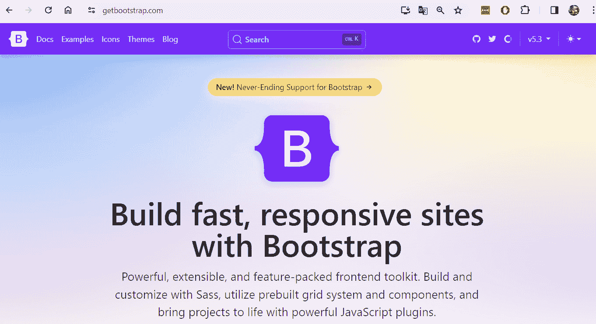
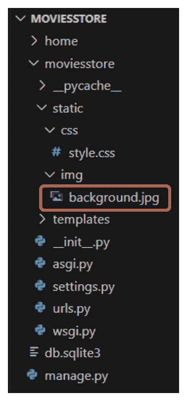
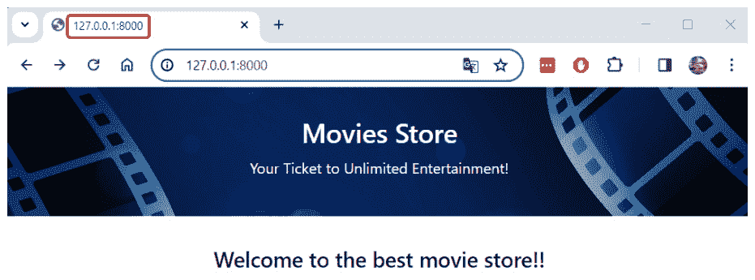
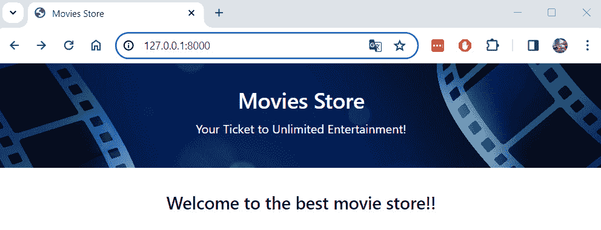
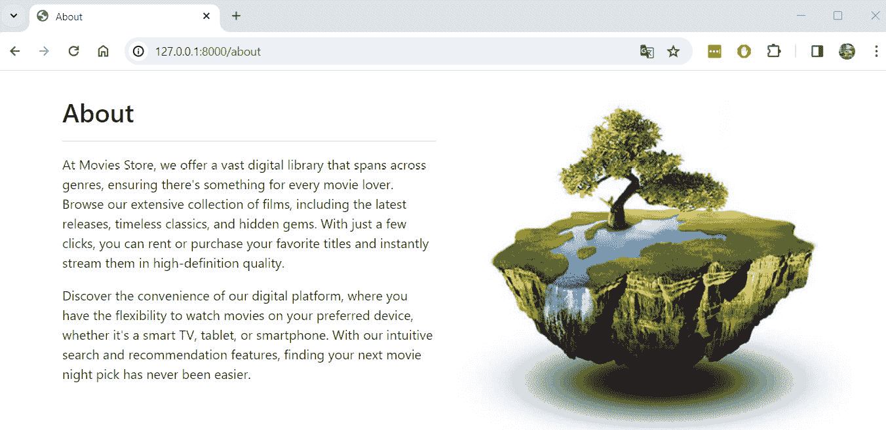
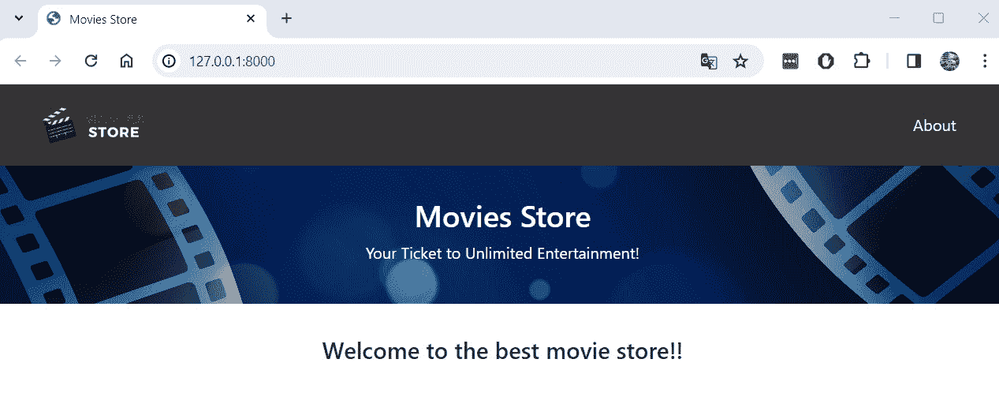
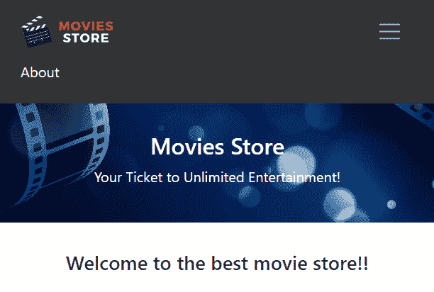
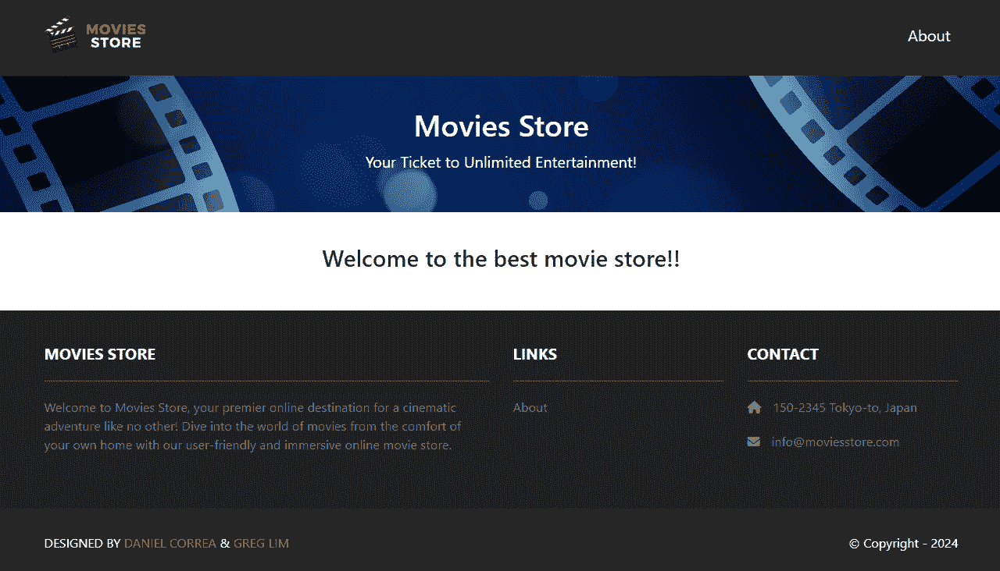

# 第四章：<st c="0">3</st>

# <st c="2">设计基本模板</st>

<st c="27">Django 项目可以包含数十或数百个模板文件。</st> <st c="97">有时，这些文件可能包含重复的 HTML 和 CSS 代码，这会影响项目的可维护性。</st> <st c="207">在本章中，我们介绍了</st> **<st c="252">基本模板</st>** <st c="266">的概念以及如何使用它们来减少重复的模板代码。</st> <st c="328">我们还将通过设计一个包含页眉和页脚以及指向不同页面的链接的基本模板来改进我们应用程序的外观和感觉。</st>

<st c="488">在本章中，我们将涵盖以下主题：</st> <st c="530">以下主题：</st>

+   <st c="547">使用 Bootstrap 创建</st> <st c="573">基本模板</st>

+   <st c="587">更新</st> **<st c="601">主页</st>** <st c="605">以使用</st> <st c="622">基本模板</st>

+   <st c="635">更新</st> **<st c="649">关于</st>** <st c="654">页面以使用</st> <st c="671">基本模板</st>

+   <st c="684">添加一个</st> <st c="694">页眉部分</st>

+   <st c="708">添加一个</st> <st c="718">页脚部分</st>

<st c="732">最终，你将了解基本模板的重要性以及如何使用它们来减少重复代码并改善你</st> <st c="882">Web 应用程序的外观和感觉。</st>

# <st c="899">技术要求</st>

<st c="922">在本章中，我们将使用</st> **<st c="957">Python 3.10+</st>**<st c="969">。此外，我们将在本书中使用</st> **<st c="1006">VS Code</st>** <st c="1013">编辑器，您可以从</st> <st c="1058">以下位置下载</st> <st c="1063">https://code.visualstudio.com/</st><st c="1093">。</st>

<st c="1094">本章的代码位于</st> <st c="1132">于</st> <st c="1135">https://github.com/PacktPublishing/Django-5-for-the-Impatient-Second-Edition/tree/main/Chapter03/moviesstore</st><st c="1243">。</st>

<st c="1244">本章的 CiA 视频可以在</st> <st c="1289">以下位置找到</st> [<st c="1292">https://packt.link/psU29</st>](https://packt.link/psU29)

# <st c="1316">使用 Bootstrap 创建基本模板</st>

<st c="1356">我们目前</st> <st c="1370">有两个模板（</st>`<st c="1390">index.html</st>` <st c="1401">和</st> `<st c="1406">about.html</st>`<st c="1416">）重复了网站的结构和一些 HTML 标签。</st> <st c="1480">目前，这似乎不是一个严重的问题。</st> <st c="1529">然而，一旦应用程序开始增长，我们将有大量的重复 HTML 代码</st> <st c="1618">散布在数十个模板文件中。</st> <st c="1656">为了避免这个问题，我们将创建一个包含网站主要结构的单个文件的基本模板，其他模板将扩展这个</st> <st c="1814">基本模板。</st>

## <st c="1828">介绍 Bootstrap</st>

**<st c="1850">Bootstrap</st>** 是开发响应式和移动优先网站最流行的 CSS 框架（见**<st c="1952">图 3.1</st>**）。<st c="1966">Bootstrap</st> 提供了一套 HTML、CSS 和 JavaScript 组件和实用工具，开发者可以使用它们快速构建现代用户界面。</st> <st c="2110">对于 Django 项目，如果开发者愿意，可以从头开始设计用户界面。</st> <st c="2203">然而，由于本书不是关于用户界面的，我们将利用 CSS 框架（如 Bootstrap）并使用其中的一些元素和示例来创建看起来专业的产品。</st> <st c="2405">您可以在[<st c="2446">https://getbootstrap.com/</st>](https://getbootstrap.com/)了解更多关于 Bootstrap 的信息。</st> <st c="2471">.</st>



图 3.1 – Bootstrap 网站

## 介绍 Django 模板语言（DTL）

我们将构建基础模板，作为 Bootstrap、HTML、CSS、JavaScript 和**<st c="2938">DTL</st>**的组合。

DTL 是 Django Web 框架中用于构建动态网页的模板语言（[<st c="3041">https://docs.djangoproject.com/en/5.0/topics/templates/</st>](https://docs.djangoproject.com/en/5.0/topics/templates/)）。<st c="3101">它旨在将表示层与应用程序的业务逻辑分离，促进编写干净和可维护的代码。</st>

Django 模板语言的关键特性包括以下内容：

+   `<st c="3417">{{</st>` `<st c="3420">变量</st>`<st c="3431">.</st>

+   `<st c="3538"></st>`<st c="3543">. 模板标签允许循环、条件和其他控制流语句。</st> <st c="3625">例如，</st> `<st c="3638"> ...</st>` <st c="3661"></st>`<st c="3672">.</st>

+   `<st c="3721">{# #}</st>` <st c="3726">在最终的输出 HTML 中不会被渲染。</st>

+   **<st c="3773">模板继承</st>**：Django 模板支持继承，允许创建定义页面整体结构和布局的基础模板，子模板继承并覆盖特定的块或部分。

## 创建基础模板

<st c="4035">基本模板将作为“全局”模板（将在所有页面和应用程序中使用）。</st> <st c="4136">因此，我们将将其添加到我们的主要</st> <st c="4166">项目文件夹中。</st> <st c="4183">在</st> `<st c="4190">moviesstore/</st>` <st c="4202">文件夹中（包含</st> `<st c="4243">settings.py</st>` <st c="4254">文件的目录），创建一个名为</st> `<st c="4277">templates</st>`<st c="4294">的文件夹。在该文件夹中，创建一个名为</st> `<st c="4333">base.html</st>`<st c="4342">的文件。目前，用以下内容填充它：</st>

```py
 <!DOCTYPE html>
<html>
  <head>
    <title>{{ template_data.title }}</title>
    <link href=
      "https://cdn.jsdelivr.net/npm/bootstrap@5.3.3/
      dist/css/bootstrap.min.css" rel="stylesheet"
      crossorigin="anonymous">
    <link rel=
      "stylesheet"  href="https://cdnjs.cloudflare.com/
      ajax/libs/font-awesome/6.1.1/css/all.min.css">
    <link href=
      "https://fonts.googleapis.com/
      css2?family=Poppins:wght@300;400;500;600;700&display=
      swap" rel="stylesheet">
    <script src=
      "https://cdn.jsdelivr.net/npm/bootstrap@5.3.3/dist/
      js/bootstrap.bundle.min.js"crossorigin="anonymous">
    </script>
    <meta name="viewport" content="width=device-width,
      initial-scale=1" />
  </head>
  <body>
    <!-- Header -->
    <!-- Header -->
    <div>
      
      
    </div>
    <!-- Footer -->
    <!-- Footer -->
  </body>
</html>
```

<st c="5160">前面的文件包含我们网站的基 HTML 结构。</st> <st c="5224">让我们回顾一下前面代码的一些重要方面：</st>

+   <st c="5281">`<st c="5286">head</st>` <st c="5290">标签包含</st> `<st c="5308">title</st>` <st c="5313">标签，该标签使用 DTL 双大括号来显示变量的信息（</st>`<st c="5396">{{ template_data.title }}</st>`<st c="5422">）。</st> <st c="5426">稍后，我们将看到如何</st> <st c="5449">从视图传递该变量到这个模板。</st> <st c="5500">它还包含一些链接和脚本，用于包含 Bootstrap 以及我们网站的字体。</st> <st c="5591">我们从以下</st> <st c="5629">网站</st> <st c="5635">https://getbootstrap.com/docs/5.3/getting-started/introduction/#cdn-links</st><st c="5708">中获取了一些链接。</st>

+   <st c="5709">`<st c="5714">body</st>` <st c="5718">标签包含一个 HTML 注释，指示头部（我们将在该位置包含头部）的位置和</st> `<st c="5842">div</st>`<st c="5845">，其中包含一些 DTL 模板标签。</st> `<st c="5893"></st>` <st c="5904">和</st> `<st c="5909"></st>` <st c="5923">是用于模板继承的模板标签。</st> <st c="5973">这是一个定义名为</st> `<st c="6023">content</st>`<st c="6030">的块的模板标签。块是模板中的占位符，可以被子模板覆盖。</st> <st c="6115">此块内的内容将被扩展此模板的子模板中定义的内容所替换（我们将在后面看到它的实际应用）。</st> <st c="6266">它还包含一个 HTML 注释，指示脚部的位置（我们将在该位置包含脚部）。</st>

## <st c="6389">注册基本模板</st>

<st c="6419">最后，我们需要</st> <st c="6439">在应用设置中</st> <st c="6453">注册</st> `<st c="6453">moviesstore/templates</st>` <st c="6474">文件夹。</st> <st c="6511">我们需要导入</st> `<st c="6533">os</st>` <st c="6535">模块，并将新的模板路径包含在我们的</st> `<st c="6584">/moviesstore/settings.py</st>` <st c="6608">文件中。</st> <st c="6615">在</st> `<st c="6618">/moviesstore/settings.py</st>`<st c="6642">中，添加以下</st> <st c="6662">粗体内容：</st>

```py
 … <st c="6672">import os</st> from pathlib import Path
…
ROOT_URLCONF = 'moviesstore.urls'
TEMPLATES = [
    {
        'BACKEND': 'django.template.backends.django. DjangoTemplates',
        'DIRS': [<st c="6831">os.path.join(BASE_DIR,</st>
 <st c="6854">'moviesstore/templates')</st>],
        'APP_DIRS': True,
        …
```

<st c="6902">现在我们已经定义了基本模板的结构，让我们更新</st> **<st c="6974">主页</st>** <st c="6978">和</st> **<st c="6983">关于</st>** <st c="6988">页面以扩展</st> <st c="7005">此模板。</st>

# <st c="7019">更新主页以使用基本模板</st>

<st c="7067">新的主页将</st> <st c="7091">扩展基本模板；它将包含带有图像的背景，并且将包含自定义 CSS。</st> <st c="7133">让我们创建新的</st> <st c="7213">主页。</st>

## <st c="7223">创建新的索引模板</st>

<st c="7255">在</st> `<st c="7259">/home/templates/home/index.html</st>`<st c="7290">中，将整个模板代码</st> <st c="7324">替换为</st> <st c="7330">以下内容：</st>

```py
 

<header class="masthead bg-index text-white text-center
           py-4">
  <div class="container d-flex align-items-center flex-
  column pt-2">
    <h2>Movies Store</h2>
    <p>Your Ticket to Unlimited Entertainment!</p>
  </div>
</header>
<div class="p-3">
  <div class="container">
    <div class="row mt-3">
      <div class="col mx-auto text-center mb-3">
        <h4>Welcome to the best movie store!!</h4>
      </div>
    </div>
  </div>
</div>

```

<st c="7809">让我们解释一下</st> <st c="7828">前面的代码：</st>

+   <st c="7842">新的</st> `<st c="7851">index.html</st>` <st c="7861">文件现在扩展了</st> `<st c="7883">base.html</st>` <st c="7892">模板。</st>

+   <st c="7902">内部的代码</st> `<st c="7927"></st>` `<st c="7946"></st>` <st c="7969">将被注入到</st> `<st c="7994">div</st>` <st c="7997">的</st> `<st c="8005">base.html</st>` <st c="8014">模板文件中。</st> <st c="8030">此代码定义了一些消息并使用了一些将在下面定义的自定义 CSS 类。</st>

## <st c="8128">创建自定义 CSS 文件</st>

<st c="8155">在</st> `<st c="8163">moviesstore/</st>` <st c="8175">文件夹（包含</st> `<st c="8216">settings.py</st>` <st c="8227">文件的目录），创建一个名为</st> `<st c="8258">static</st>`<st c="8264">的文件夹。在该文件夹中，创建一个名为</st> `<st c="8291">css</st>`<st c="8311">的子文件夹。然后，在</st> `<st c="8322">moviesstore/static/css/</st>` <st c="8345">创建一个名为</st> `<st c="8367">style.css</st>`<st c="8376">的文件。目前，用以下内容填充它：</st>

```py
 .bg-index{
  background: url("/static/img/background.jpg") no-repeat
    fixed;
  background-size: 100% auto;
}
```

<st c="8520">前面的代码定义了一个名为</st> `<st c="8566">bg-index</st>`<st c="8574">的 CSS 类，它将被用于在主页上显示图像作为背景。</st>

## <st c="8648">存储图像</st>

<st c="8665">让我们也将</st> `<st c="8689">background.jpg</st>` <st c="8703">图像包含到我们的项目中。</st> <st c="8726">在</st> `<st c="8729">moviesstore/static</st>`<st c="8747">中，创建一个名为</st> <st c="8765">img</st>`<st c="8775">的文件夹。然后，在</st> `<st c="8786">moviesstore/static/img/</st>`<st c="8809">中，从以下链接下载并存储</st> `<st c="8834">background.jpg</st>` <st c="8848">图像：</st> [<st c="8871">https://github.com/PacktPublishing/Django-5-for-the-Impatient-Second-Edition/blob/main/Chapter03/moviesstore/moviesstore/static/img/background.jpg</st>](https://github.com/PacktPublishing/Django-5-for-the-Impatient-Second-Edition/blob/main/Chapter03/moviesstore/moviesstore/static/img/background.jpg) <st c="9017">(如图</st> *<st c="9031">图 3</st>**<st c="9039">.2</st>*<st c="9041">所示)。</st>



<st c="9214">图 3.2 – 在项目结构下包含背景图像</st>

## <st c="9283">服务静态文件</st>

<st c="9308">我们已经定义了一些静态文件，一个 CSS 文件和一个 JPG 文件。</st> <st c="9379">为了能够在我们的应用程序中使用或显示它们，我们需要注册包含它们的文件夹。</st> <st c="9489">在</st> `<st c="9538">/</st>``<st c="9539">moviesstore/settings.py</st>` <st c="9562">文件中添加以下代码：</st>

```py
 …
DEFAULT_AUTO_FIELD = 'django.db.models.BigAutoField' <st c="9623">STATICFILES_DIRS = [</st>
 <st c="9643">BASE_DIR / 'moviesstore/static/',</st>
<st c="9677">]</st>
```

## <st c="9679">更新基础模板以使用定制 CSS 和加载静态文件</st>

<st c="9749">我们还需要更新基础</st> <st c="9782">模板以链接我们之前创建的定制 CSS，并且我们需要使用一个定制的 DTL 标签来加载静态文件。</st> <st c="9899">在</st> `<st c="9902">/moviesstore/templates/base.html</st>`<st c="9934">中，添加以下</st> <st c="9954">粗体内容：</st>

```py
 <!DOCTYPE html>
<html> <st c="9986"></st> <head>
    <title>{{ template_data.title }}</title>
    … <st c="10054"><link rel="stylesheet" type="text/css"</st>
 <st c="10092">href=""></st> <meta name="viewport"
          content="width=device-width, initial-scale=1" />
  </head>
  …
```

<st c="10209">在前面的代码中，使用了</st> `<st c="10236">load static</st>` <st c="10247">模板标签来在</st> `<st c="10301">base.html</st>` <st c="10310">模板中加载静态文件。</st> <st c="10321">一旦我们使用了这个标签，我们就可以使用</st> `<st c="10364">static</st>` <st c="10370">模板标签来引用要加载的特定静态文件。</st> <st c="10432">它将根据</st> `<st c="10481">STATICFILES_DIRS</st>` <st c="10497">文件夹的位置来搜索静态文件。</st>

<st c="10514">现在，保存这些文件，运行服务器，然后回到</st> `<st c="10569">http://localhost:8000</st>`<st c="10590">；你应该会看到新的主页被显示出来（</st>*<st c="10637">图 3</st>**<st c="10646">.3</st>*<st c="10648">）。</st> <st c="10652">检查标签标题是否没有出现，因为我们需要从视图函数发送</st> `<st c="10716">template_data.title</st>` <st c="10735">变量到模板中（这将在下一部分进行）。</st>



<st c="10933">图 3.3 – 缺少标签页标题的新主页</st>

<st c="10990">注意</st>

<st c="10995">如果你在加载背景图片时遇到问题，我们建议你停止服务器并重新运行，或者清除浏览器缓存。</st> <st c="11125">此外，尝试直接从浏览器访问图像文件，</st> <st c="11188">检查图像是否已正确加载</st> <st c="11224">（</st>[<st c="11234">http://localhost:8000/static/img/background.jpg</st>](http://localhost:8000/static/img/background.jpg)<st c="11282">）。</st>

## <st c="11285">更新视图索引函数</st>

<st c="11319">最后，让我们从视图</st> <st c="11363">函数传递标题到</st> <st c="11379">模板。</st> <st c="11391">在</st> `<st c="11394">/home/views.py</st>`<st c="11408">中，添加以下内容，并用粗体标出：</st>

```py
 from django.shortcuts import render
def index(request): <st c="11493">template_data = {}</st><st c="11511">template_data['title'] = 'Movies Store'</st> return render(request, 'home/index.html'<st c="11592">, {</st>
 <st c="11595">'template_data': template_data})</st> def about(request):
    return render(request, 'home/about.html')
```

<st c="11690">让我们解释一下</st> <st c="11709">之前的代码：</st>

+   <st c="11723">我们创建了一个名为</st> `<st c="11761">template_data</st>`<st c="11774">的 Python 字典。</st> <st c="11774">当我们需要从视图函数</st> <st c="11864">传递信息到模板时</st>，我们总是使用这个字典。

+   <st c="11877">我们在</st> `<st c="11911">template_data</st>` <st c="11924">字典中添加了一个名为</st> `<st c="11898">title</st>` <st c="11937">的键。</st> `<st c="11937">title</st>` <st c="11942">将用于定义浏览器标签页标题。</st> <st c="11989">请记住</st> `<st c="12003">template_data.title</st>` <st c="12022">在</st> `<st c="12038">base.html</st>` <st c="12047">模板中</st> <st c="12022">被使用。</st>

+   <st c="12057">我们修改了</st> `<st c="12072">render</st>` <st c="12078">函数以传递第三个参数。</st> <st c="12114">这次我们传递了</st> `<st c="12136">template_data</st>` <st c="12149">变量，它将在</st> `<st c="12195">home/index.html</st>` <st c="12210">模板</st> <st c="12219">或它扩展的模板中</st> <st c="12219">可用。</st>

*<st c="12253">图 3</st>**<st c="12262">.4</st>* <st c="12264">显示了带有适当浏览器</st> <st c="12320">标签页标题的更新后的</st> **<st c="12286">主页</st>** <st c="12290">。</st>



<st c="12484">图 3.4 – 带有适当浏览器标签页标题的新主页</st>

# <st c="12540">更新关于页面以使用基本模板</st>

<st c="12589">新的</st> **<st c="12598">关于</st>** <st c="12603">页面也将扩展基本模板，并且它</st> <st c="12652">将包含关于页面的示例文本和图像。</st>

## <st c="12706">创建新的关于模板</st>

<st c="12738">在</st> `<st c="12742">/home/templates/home/about.html</st>`<st c="12773">中，将整个模板代码</st> <st c="12808">替换为以下内容：</st> <st c="12813">以下内容：</st>

```py
 


<div class="p-3">
  <div class="container">
    <div class="row mt-3">
      <div class="col-md-6 mx-auto mb-3">
        <h2>About</h2>
        <hr />
        <p>
           At Movies Store, we offer a vast digital library
           that spans across genres, ensuring there's
           something for every movie lover. Browse our
           extensive collection of films, including the
           latest releases, timeless classics, and hidden
           gems. With just a few clicks, you can rent or
           purchase your favorite titles and instantly
           stream them in high-definition quality. </p>
        <p>
          Discover the convenience of our digital platform,
          where you have the flexibility to watch movies
          on your preferred device, whether it's a smart
          TV, tablet, or smartphone. With our intuitive
          search and recommendation features, finding your
          next movie night pick has never been easier. </p>
      </div>
      <div class="col-md-6 mx-auto mb-3 text-center">
        
      </div>
    </div>
  </div>
</div>

```

<st c="13857">让我们解释一下</st> <st c="13876">之前的代码：</st>

+   <st c="13890">新的</st> `<st c="13899">about.html</st>` <st c="13909">文件现在扩展了</st> `<st c="13931">base.html</st>` <st c="13940">模板。</st>

+   <st c="13950">我们使用</st> `<st c="13958"></st>` `<st c="13977"></st>` <st c="14000">来在</st> `<st c="14039">div</st>` <st c="14042">的</st> `<st c="14050">base.html</st>` <st c="14059">模板文件中注入适当的 HTML 代码。</st> <st c="14075">此代码定义了一个关于页面的段落，并显示一个将要</st> <st c="14155">存储的图片。</st>

+   <st c="14167">我们同样使用</st> `<st c="14184"></st>` <st c="14201">标签，因为这个模板通过使用</st> `<st c="14260">static</st>` <st c="14266">模板标签来加载自定义图片。</st>

## <st c="14280">存储 about.jpg 图片</st>

<st c="14308">让我们也把</st> `<st c="14332">about.jpg</st>` <st c="14341">图片添加到我们的</st> <st c="14354">项目中。</st> <st c="14364">在</st> `<st c="14367">moviesstore/static/img/</st>`<st c="14390">目录下，从以下</st> <st c="14415">链接</st>下载并存储`<st c="14424">about.jpg</st>` <st c="14441">图片：</st> [<st c="14447">https://github.com/PacktPublishing/Django-5-for-the-Impatient-Second-Edition/blob/main/Chapter03/moviesstore/moviesstore/static/img/about.jpg</st>](https://github.com/PacktPublishing/Django-5-for-the-Impatient-Second-Edition/blob/main/Chapter03/moviesstore/moviesstore/static/img/about.jpg)<st c="14588">。</st>

## <st c="14589">更新关于函数的视图</st>

<st c="14623">最后，让我们将从视图</st> <st c="14667">关于函数传递的标题到模板中。</st> <st c="14701">在</st> `<st c="14704">/home/views.py</st>`<st c="14718">中，添加以下</st> <st c="14738">加粗内容：</st>

```py
 from django.shortcuts import render
…
def about(request): <st c="14805">template_data = {}</st><st c="14823">template_data['title'] = 'About'</st> return render(request,
                  'home/about.html'<st c="14897">,</st>
<st c="14948">index</st> function, we define the <st c="14978">template_data</st> dictionary and create the proper <st c="15025">title</st> key with its value. Then, we pass the <st c="15069">template_data</st> variable to the templates.
			<st c="15109">Now, save those files, run the server, and go to</st> [<st c="15159">http://localhost:8000/about</st>](http://localhost:8000/about)<st c="15186">; you should see the new</st> **<st c="15212">About</st>** <st c="15217">page displayed (</st>*<st c="15234">Figure 3</st>**<st c="15243">.5</st>*<st c="15245">).</st>
			

			<st c="15937">Figure 3.5 – New About page</st>
			<st c="15964">Now that we have updated the home and</st> **<st c="16003">About</st>** <st c="16008">pages, let’s improve the base template by adding a header</st> <st c="16067">section that includes the website</st> <st c="16101">menu options.</st>
			<st c="16114">Adding a header section</st>
			<st c="16138">To complete the</st> `<st c="16155">base.html</st>` <st c="16164">template, we need to include a header section and a footer section.</st> <st c="16233">Let’s start</st> <st c="16245">with</st> <st c="16250">the header.</st>
			<st c="16261">Updating the base template</st>
			<st c="16288">In</st> `<st c="16292">/moviesstore/templates/base.html</st>`<st c="16324">, add the</st> <st c="16333">following</st> <st c="16344">in bold:</st>

```

…

<body>

    <!-- Header --> <st c="16377"><nav class="p-3 navbar navbar-dark bg-dark</st>

<st c="16419">navbar-expand-lg"></st>

<st c="16438"><div class="container"></st>

<st c="16462"><a class="navbar-brand"</st>

<st c="16486">href=""></st>

<st c="16517">

<st c="16567">height="40" /></st>

<st c="16582"></a></st>

<st c="16587"><button class="navbar-toggler" type="button"</st>

<st c="16632">data-bs-toggle="collapse"</st>

<st c="16658">data-bs-target="#navbarNavAltMarkup"</st>

**<st c="16695">aria-controls="navbarNavAltMarkup"</st>**

**<st c="16730">aria-expanded="false"</st>**

**<st c="16752">aria-label="Toggle navigation"></st>**

**<st c="16784"><span class="navbar-toggler-icon"></span></st>**

**<st c="16826"></button></st>**

**<st c="16836"><div class="collapse navbar-collapse"</st>**

**<st c="16874">id="navbarNavAltMarkup"</st>**

**<st c="16899"><div class="navbar-nav ms-auto navbar-ml"></st>**

**<st c="16942"><a class="nav-link"</st>**

****<st c="16962">href="">关于</a></st>**

**<st c="17002"></div></st>**

**<st c="17009"></div></st>**

**<st c="17016"></div></st>**

**<st c="17023"></nav></st>** <st c="17030"><!-- Header -->

    …</st>**

```py

 **<st c="17047">We included a responsive</st> `<st c="17073">navbar</st>` <st c="17079">between the</st> `<st c="17092">Header</st>` <st c="17098">HTML comments.</st> <st c="17114">This responsive navbar includes a</st> `<st c="17148">logo.png</st>` <st c="17156">file that links to the</st> `<st c="17180">home.index</st>` <st c="17190">URL, and includes an</st> `<st c="17212">About</st>` <st c="17217">text that links to the</st> `<st c="17241">home.about</st>` <st c="17251">URL.</st> <st c="17257">Check that we used the</st> `<st c="17280">url</st>` <st c="17283">template tag, as this tag</st> <st c="17309">links to the specified URL</st> <st c="17337">pattern name.</st>

<st c="17350">Note</st>

<st c="17355">The construction of the previous header section is inspired by the Bootstrap</st> `<st c="17433">navbar</st>` <st c="17439">component.</st> <st c="17451">You can take a look at this component and its available options at this</st> <st c="17523">link:</st> [<st c="17529">https://getbootstrap.com/docs/5.3/components/navbar/</st>](https://getbootstrap.com/docs/5.3/components/navbar/)<st c="17581">.</st>

## <st c="17582">Storing the logo image</st>

<st c="17605">Let’s include the</st> `<st c="17624">logo.png</st>` <st c="17632">image in</st> <st c="17641">our project.</st> <st c="17655">In</st> `<st c="17658">moviesstore/static/img/</st>`<st c="17681">, download and store the</st> `<st c="17706">logo.png</st>` <st c="17714">image from this</st> <st c="17731">link:</st> [<st c="17737">https://github.com/PacktPublishing/Django-5-for-the-Impatient-Second-Edition/blob/main/Chapter03/moviesstore/moviesstore/static/img/logo.png</st>](https://github.com/PacktPublishing/Django-5-for-the-Impatient-Second-Edition/blob/main/Chapter03/moviesstore/moviesstore/static/img/logo.png)<st c="17877">.</st>

## <st c="17878">Updating the style.css</st>

<st c="17901">Finally, let’s include a couple of CSS</st> <st c="17940">classes in our custom CSS file.</st> <st c="17973">In</st> `<st c="17976">/moviesstore/static/css/style.css</st>`<st c="18009">, add the following in bold at the end of</st> <st c="18051">the file:</st>

```

… <st c="18062">.navbar a.nav-link {</st>

<st c="18082">color: #FFFEF6 !important;</st>

<st c="18109">}</st>

<st c="18111">.bg-dark {</st>

<st c="18121">background-color: #2E2E2E !important;</st>

<st c="18159">}</st>

```py

<st c="18161">Now, save those files, run the server, and go to</st> [<st c="18210">http://localhost:8000/</st>](http://localhost:8000/)<st c="18232">; you should see the home page</st> <st c="18264">with the new header section (</st>*<st c="18293">Figure 3</st>**<st c="18302">.6</st>*<st c="18304">).</st>

			

<st c="18415">Figure 3.6 – The home page with the header section</st>

<st c="18465">This new header section is responsive.</st> <st c="18505">If you reduce the browser window width, you will see a responsive navbar, thanks to the use of different Bootstrap classes (see</st> *<st c="18633">Figure 3</st>**<st c="18641">.7</st>*<st c="18643">).</st>

			

<st c="18737">Figure 3.7 – Home page with a responsive navbar</st>

<st c="18784">The base template now includes a proper header section.</st> <st c="18841">Let’s finalize this template by adding a</st> <st c="18882">footer section.</st>

# <st c="18897">Adding a footer section</st>

<st c="18921">Let’s complete the website</st> <st c="18949">structure with the inclusion of</st> <st c="18981">a footer.</st>

## <st c="18990">Updating the base template</st>

<st c="19017">In</st> `<st c="19021">/moviesstore/templates/base.html</st>`<st c="19053">, add the</st> <st c="19062">following</st> <st c="19073">in bold:</st>

```

…

    <!-- Footer --> <st c="19099"><section class="p-3 ms-footer d-none d-md-block"></st>

<st c="19148"><div class="container"></st>

<st c="19172"><div class="row mt-3 text-white"></st>

<st c="19206"><div class="col-md-6 col-lg-6 col-xl-6</st>

<st c="19245">mx-auto mb-4"></st>

<st c="19260"><b>电影商店</b></st>

<st c="19280"><hr /></st>

<st c="19287"><p></st>

<st c="19291">欢迎来到电影商店，您首选的在线</st>

<st c="19336">其他任何地方的电影冒险的目的地！</st>

<st c="19382">从家中深入电影的世界！</st> <st c="19390">探索电影世界的奥秘！</st>

<st c="19428">在家中享受我们的用户-</st>

<st c="19468">一个友好且沉浸式的在线电影商店。</st>

<st c="19511"></p></st>

<st c="19516"></div></st>

<st c="19523"><div class="col-md-3 col-lg-3 col-xl-3</st>

<st c="19562">mx-auto mb-4"></st>

<st c="19577"><b>链接</b></st>

<st c="19590"><hr /></st>

<st c="19597"><p><a class="nav-link"</st>

**<st c="19620">href=""></st>**

**<st c="19651">关于</st>**

**<st c="19657"></a></p></st>**

**<st c="19666"></div></st>**

**<st c="19673"><div class="col-md-3 col-lg-3 col-xl-3 mx-auto</st>**

**<st c="19720">mb-4"></st>**

**<st c="19727"><b>联系</b></st>**

**<st c="19742"><hr /></st>**

**<st c="19749"><p><i class="fas fa-home me-2"></i></st>**

**<st c="19785">150-2345 东京都，日本</st>**

****<st c="19810"></p></st>**

**<st c="19815"><p><i class="fas fa-envelope me-2"></i></st>**

**<st c="19855">info@moviesstore.com</st>**

**<st c="19876"></p></st>**

**<st c="19881"><p><i class="fas fa-phone me-2"></i></st>**

**<st c="19918">+81 03-3333-3333</st>**

**<st c="19935"></p></st>**

**<st c="19940"></div></st>**

**<st c="19947"></div></st>**

**<st c="19954"></div></st>**

****<st c="19961"></section></st>**

**<st c="19972"><section class="p-3 ms-footer-bottom bg-dark"></st>**

**<st c="20019"><div class="container d-flex</st>**

**<st c="20048">justify-content-between"></st>**

**<st c="20074"><div class="me-5 text-white"></st>**

**<st c="20104"><span>设计者</span>**

**<st c="20122"><a href="https://www.x.com/danielgarax"</st>**

**<st c="20162">target="_blank">DANIEL CORREA</a> &</st>**

**<st c="20198"><a href="https://www.x.com/greglim81"</st>**

**<st c="20236">target="_blank">GREG LIM</a></st>**

****<st c="20265"></span></st>**

**<st c="20273"></div></st>**

**<st c="20280"><div class="text-white"></st>**

**<st c="20305"><span>版权所有 - 2024</span></st>**

**<st c="20337"></div></st>**

**<st c="20344"></div></st>

**<st c="20351"></section></st>** <st c="20362"><!-- Footer -->

    …</st>******

```py

 ****<st c="20379">We included a footer section with</st> <st c="20413">information on the website, some links, and the book’s author names and links to their</st> <st c="20501">X accounts.</st>

## <st c="20512">Updating the style.css</st>

<st c="20535">Finally, let’s include some custom</st> <st c="20571">CSS classes.</st> <st c="20584">In</st> `<st c="20587">/moviesstore/static/css/style.css</st>`<st c="20620">, add the following in bold at the end of</st> <st c="20662">the file:</st>

```

… <st c="20673">.ms-footer {</st>

<st c="20685">background-color: #202020;</st>

<st c="20712">}</st>

<st c="20714">.ms-footer p {</st>

<st c="20728">颜色: #7F7F7F;</st>

<st c="20744">字体大小: 13 像素;</st>

<st c="20761">}</st>

<st c="20763">.ms-footer a:hover {</st>

<st c="20783">颜色: #6ab43e;</st>

<st c="20799">文本装饰: 无;</st>

<st c="20822">}</st>

<st c="20824">.ms-footer-bottom span{</st>

**<st c="20847">字体大小: 13 像素;</st>**

**<st c="20864">行高: 38 像素;</st>**

**<st c="20883">}</st>**

**<st c="20885">.ms-footer-bottom a {</st>**

**<st c="20906">颜色: #6ab43e;</st>**

**<st c="20922">文本装饰: 无;</st>**

**<st c="20945">}</st>**

**<st c="20947">.ms-footer-bottom a:hover {</st>**

**<st c="20974">颜色: #fff;</st>**

**<st c="20987">}</st>**

```py

 **<st c="20989">Now, save those files, run the server, and go to</st> [<st c="21038">http://localhost:8000/</st>](http://localhost:8000/)<st c="21060">; you should see the home page</st> <st c="21092">with the new footer section (</st>*<st c="21121">Figure 3</st>**<st c="21130">.8</st>*<st c="21132">).</st>

			

<st c="21315">Figure 3.8 – The home page with the footer section</st>

<st c="21365">You can also click the</st> **<st c="21389">About</st>** <st c="21394">link, and you will see the</st> **<st c="21422">About</st>** <st c="21427">page with the same</st> <st c="21447">website structure.</st>

# <st c="21465">Summary</st>

<st c="21473">In this chapter, we learned how to create base templates that reduce duplicated code.</st> <st c="21560">We improved our application interface with the inclusion of a header and footer, and we learned how to manage static files.</st> <st c="21684">We redesigned the home and</st> **<st c="21711">About</st>** <st c="21716">pages to extend the base template and created proper links to those pages.</st> <st c="21792">In the next chapter, we’ll learn how to start</st> <st c="21838">managing movies.</st>******** 
```
