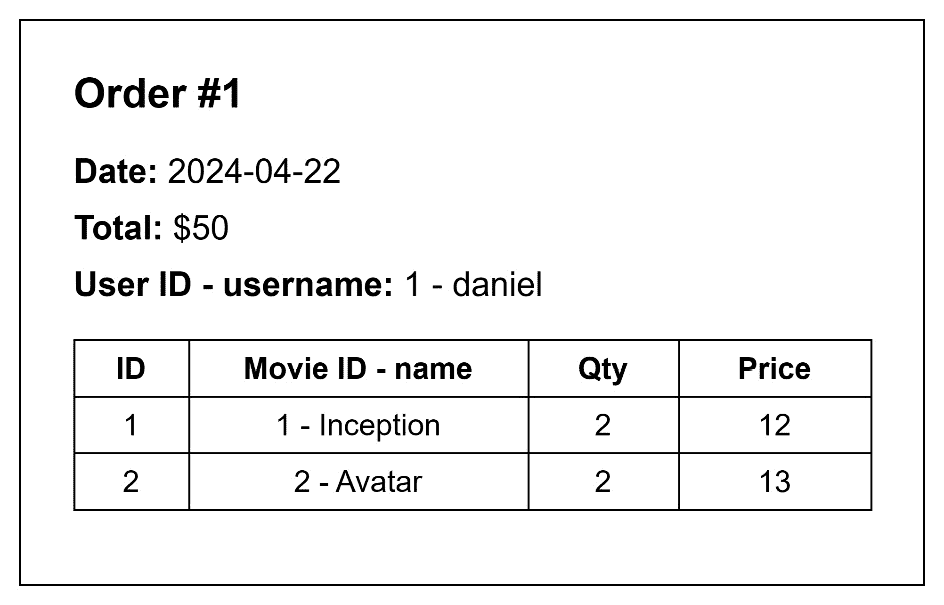
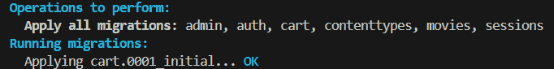
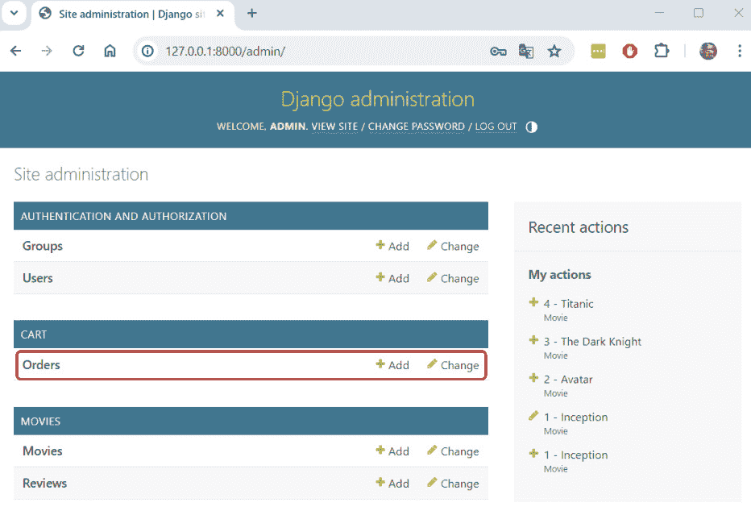
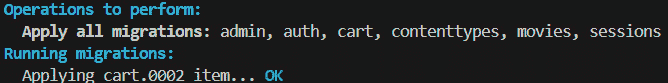
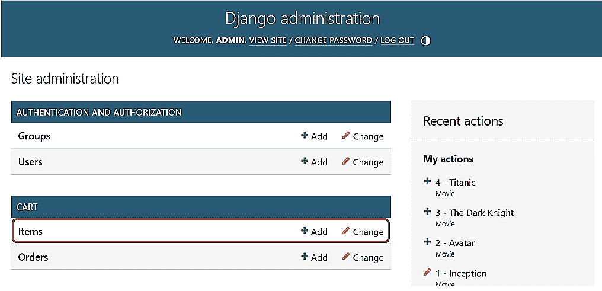
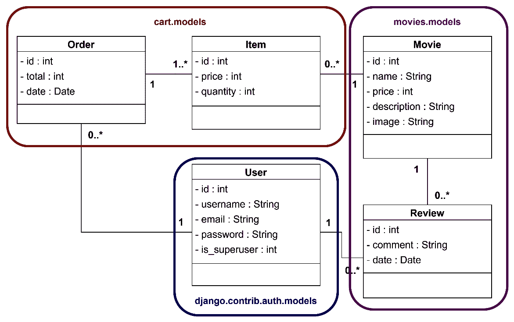
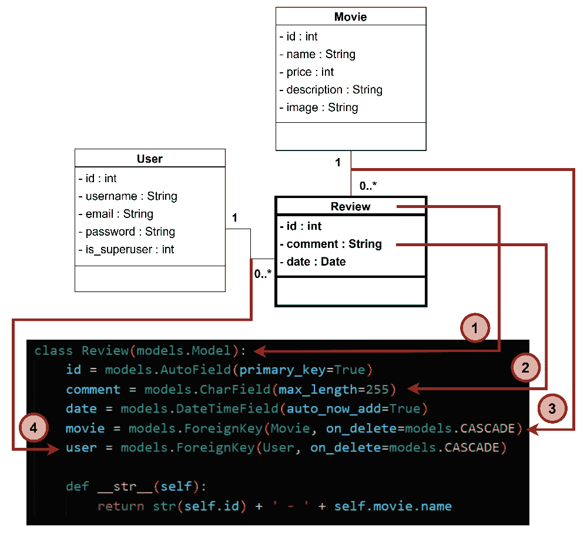

# 第十二章：<st c="0">11</st>

# <st c="3">实现订单和项目模型</st>

<st c="38">在前一章中，我们实现了购物车系统，并允许用户将电影添加到购物车中。</st> <st c="149">为了使用户能够购买电影，我们需要在数据库中存储额外的信息，特别是存储订单和项目信息。</st> <st c="292">在本章中，我们将实现订单和项目模型，并建立它们之间的连接。</st> <st c="380">。</st>

<st c="393">在本章中，我们将涵盖以下主题：</st> <st c="435">。</st>

+   <st c="452">分析</st> <st c="463">商店发票</st>

+   <st c="477">创建</st> <st c="491">订单模型</st>

+   <st c="502">创建</st> <st c="516">项目模型</st>

+   <st c="526">回顾电影商店</st> <st c="554">类图</st>

<st c="567">到本章结束时，我们将拥有存储购买信息的完整结构。</st> <st c="665">此外，我们将回顾类图，并检查 Django 模型与类图中的类之间的关系。</st> <st c="789">。</st>

# <st c="803">技术要求</st>

<st c="826">在本章中，我们将使用</st> **<st c="861">Python 3.10+</st>**<st c="873">。此外，我们将使用本书中的</st> **<st c="910">VS Code</st>** <st c="917">编辑器，您可以从</st> <st c="962">以下链接</st> [<st c="967">https://code.visualstudio.com/</st>](https://code.visualstudio.com/)<st c="997">下载。</st>

<st c="998">本章的代码位于</st> <st c="1036">以下链接</st> [<st c="1039">https://github.com/PacktPublishing/Django-5-for-the-Impatient-Second-Edition/tree/main/Chapter11/moviesstore</st>](https://github.com/PacktPublishing/Django-5-for-the-Impatient-Second-Edition/tree/main/Chapter11/moviesstore)<st c="1147">。</st>

<st c="1148">本章的 CiA 视频可在以下链接找到</st> <st c="1193">以下链接</st> [<st c="1196">https://packt.link/eQzNG</st>](https://packt.link/eQzNG)

# <st c="1220">分析商店发票</st>

<st c="1245">如果你在现代商店购买东西，你几乎肯定会收到一张发票。</st> <st c="1277">不同的商店以不同的信息管理发票，但在大多数情况下，你都会找到相同的基本信息。</st> *<st c="1470">图 11</st>**<st c="1479">.1</st>* <st c="1481">显示了一张简单的发票。</st> <st c="1506">我们将以此作为蓝图来设计和实现我们将用于存储购买信息的 Django 模型。</st> <st c="1610">。</st>



<st c="1768">图 11.1 – 简单发票的示例</st>

<st c="1809">让我们分析图 11*<st c="1845">.1</st>**<st c="1854">中显示的发票，以了解我们需要存储哪些购买信息（基于订单和项目）。</st>

<st c="1953">我们必须为订单存储以下信息：</st> <st c="1998">：</st>

+   **<st c="2008">ID</st>**<st c="2011">：用于唯一标识每个订单。</st> <st c="2047">在先前的图中，它表示为</st> **<st c="2092">#1</st>**<st c="2094">。</st>

+   **<st c="2095">日期</st>**<st c="2100">：标识订单完成的日期。</st> <st c="2158">在先前的图中，它表示为</st> **<st c="2203">2024-04-22</st>**<st c="2213">。</st>

+   **<st c="2214">总计</st>**<st c="2220">：标识订单的总金额。</st> <st c="2266">在先前的图中，它表示为</st> **<st c="2311">$50</st>**<st c="2314">。</st>

+   **<st c="2315">用户</st>**<st c="2320">：标识进行购买的用户。</st> <st c="2367">在先前的图中，它表示为</st> **<st c="2412">1 -</st>** **<st c="2416">daniel</st>**<st c="2422">。</st>

<st c="2423">一个订单由项目组成，表示为图 11*<st c="2492">.1</st>**<st c="2501">.1</st>*<st c="2503">.我们必须为每个项目存储以下信息：</st> <st c="2549">：</st>

+   **<st c="2559">ID</st>**<st c="2562">：用于唯一标识每个项目。</st> <st c="2597">在先前的图中，第一件商品的 ID 表示为</st> **<st c="2664">1</st>**<st c="2665">。</st>

+   **<st c="2666">数量</st>**<st c="2675">：指定用户想要购买的电影数量。</st> <st c="2743">在先前的示例中，第一件商品的数量表示为</st> <st c="2814">为</st> **<st c="2817">2</st>**<st c="2818">。</st>

+   **<st c="2819">价格</st>**<st c="2825">：指定用户购买商品时的电影价格。</st> <st c="2900">在先前的示例中，第一件商品的价格表示为</st> <st c="2968">为</st> **<st c="2971">12</st>**<st c="2973">。</st>

+   **<st c="2974">电影</st>**<st c="2980">：指定与项目链接的电影。</st> <st c="3033">在先前的示例中，第一件商品的链接电影表示为</st> **<st c="3111">1 -</st>** **<st c="3115">Inception</st>**<st c="3124">。</st>

+   **<st c="3125">订单</st>**<st c="3131">：指定与项目链接的订单。</st> <st c="3184">在先前的示例中，第一件商品的链接订单表示为</st> **<st c="3262">#1</st>**<st c="3264">。</st>

<st c="3265">现在我们已经掌握了这些简单发票的功能，让我们继续创建</st> <st c="3361">适当的模型。</st>

# <st c="3380">创建订单模型</st>

<st c="3405">为了存储购买信息，我们</st> <st c="3444">需要首先创建一个 Order Django 模型。</st> <st c="3493">以下是为存储购买信息所需的三个步骤：</st>

1.  <st c="3564">创建订单模型。</st>

1.  <st c="3588">应用迁移。</st>

1.  <st c="3606">将订单模型添加到</st> `<st c="3634">管理面板。</st>`

<st c="3646">让我们详细地</st> `<st c="3669">了解它们。</st>`

## <st c="3679">创建订单模型</st>

<st c="3704">我们将开始创建</st> `<st c="3737">Order</st>` <st c="3745">模型。</st> <st c="3745">我们将在这个</st> `<st c="3782">cart app</st>` <st c="3782">中创建这个模型。</st>

<st c="3791">在</st> `<st c="3795">/cart/models.py</st>` <st c="3810">文件中，添加以下</st> `<st c="3835">在</st> **<st c="3838">粗体</st>**<st c="3842">：</st>`

```py
 from django.db import models <st c="3874">from django.contrib.auth.models import User</st>
<st c="3917">class Order(models.Model):</st>
 <st c="3944">id = models.AutoField(primary_key=True)</st>
 <st c="3984">total = models.IntegerField()</st>
 <st c="4014">date = models.DateTimeField(auto_now_add=True)</st>
 <st c="4061">user = models.ForeignKey(User,</st>
 <st c="4092">on_delete=models.CASCADE)</st>
 <st c="4118">def __str__(self):</st>
 <st c="4137">return str(self.id) + ' - ' + self.user.username</st>
```

<st c="4186">让我们解释一下</st> `<st c="4205">之前的代码：</st>`

+   <st c="4219">我们从 Django 的</st> `<st c="4234">User</st>` <st c="4238">模型中导入</st> `<st c="4259">django.contrib.auth.models</st>` <st c="4285">模块。</st>

+   <st c="4293">我们定义了一个名为</st> `<st c="4325">Order</st>`<st c="4330">的 Python 类，它继承自</st> `<st c="4352">models.Model</st>`<st c="4364">。这意味着</st> `<st c="4382">Order</st>` <st c="4387">是一个 Django</st> `<st c="4400">模型类。</st>`

+   <st c="4412">在</st> `<st c="4424">Order</st>` <st c="4429">类中，我们定义了</st> `<st c="4447">几个字段：</st>`

    +   `<st c="4462">id</st>`<st c="4465">：这是一个</st> `<st c="4479">AutoField</st>`<st c="4488">，它会自动为数据库中添加的每个新记录增加其值。</st> <st c="4574">`<st c="4578">primary_key=True</st>` <st c="4594">`参数指定这个字段是表的键，唯一标识</st> `<st c="4686">每个记录。</st>`

    +   `<st c="4698">total</st>`<st c="4704">：这是一个</st> `<st c="4717">IntegerField</st>`<st c="4729">，它表示订单的总金额。</st> <st c="4779">它存储整数值。</st>

    +   `<st c="4804">date</st>`<st c="4809">：这是一个</st> `<st c="4822">DateTimeField</st>` <st c="4835">，它表示订单创建的日期和时间。</st> `<st c="4900">auto_now_add=True</st>` <st c="4917">确保在创建订单时自动将日期和时间设置为当前日期和时间。</st>

    +   `<st c="5026">user</st>`<st c="5031">：这是一个与</st> `<st c="5076">User</st>` <st c="5080">模型的</st> `<st c="5080">外键关系，它建立了订单和用户之间的多对一关系。</st> <st c="5159">这意味着每个订单都与单个用户相关联，每个用户可以有多个订单。</st> `<st c="5258">on_delete=models.CASCADE</st>` <st c="5282">指定如果相关用户被删除，相关的订单也将</st> `<st c="5362">被删除。</st>`

+   `<st c="5373">__str__</st>` <st c="5381">是一个返回订单字符串表示的方法。</st> <st c="5445">在这种情况下，它返回一个由订单 ID 和下订单用户的用户名组成的字符串。</st>

## <st c="5554">应用迁移</st>

<st c="5574">现在我们已经创建了</st> <st c="5592">订单</st> <st c="5609">模型，根据您的</st> <st c="5703">操作系统</st>，运行以下命令之一来更新数据库：</st>

+   <st c="5720">对于 macOS 系统，</st> <st c="5732">运行以下命令：</st>

    ```py
    <st c="5741">python3 manage.py makemigrations</st>
    <st c="5774">python3 manage.py migrate</st>
    ```

+   <st c="5800">对于 Windows 系统，</st> <st c="5814">运行以下命令：</st>

    ```py
    <st c="5823">python manage.py makemigrations</st>
    <st c="5855">python manage.py migrate</st>
    ```

<st c="5880">现在，您应该会看到以下内容：</st> <st c="5911">（如图 11.2 所示）</st>



<st c="6015">图 11.2 – 应用订单迁移</st>

## <st c="6057">将订单模型添加到管理面板</st>

<st c="6099">要将</st> `<st c="6111">订单</st>` <st c="6116">模型添加到管理界面，请前往</st> `<st c="6139">/cart/admin.py</st>` <st c="6153">并按以下步骤注册它，添加以下</st> <st c="6179">内容</st> <st c="6194">（以粗体显示）：</st>

```py
 from django.contrib import admin <st c="6237">from .models import Order</st>
<st c="6363">/admin</st>. The order model will now appear (as shown in *<st c="6416">Figure 11</st>**<st c="6425">.3</st>*):
			

			<st c="6824">Figure 11.3 – Admin page with orders available</st>
			<st c="6870">Now that we have created and applied our</st> `<st c="6912">Order</st>` <st c="6917">model, let’s create the</st> `<st c="6942">Item</st>` <st c="6946">model to complete the information</st> <st c="6981">required to</st> <st c="6993">store purchases.</st>
			<st c="7009">Creating the Item model</st>
			<st c="7033">Let’s continue by</st> <st c="7051">creating an</st> `<st c="7064">Item</st>` <st c="7068">model and follow</st> <st c="7086">these steps:</st>

				1.  <st c="7098">Create the</st> <st c="7110">Item model.</st>
				2.  <st c="7121">Apply migrations.</st>
				3.  <st c="7139">Add the item model to the</st> <st c="7166">admin panel.</st>

			<st c="7178">Creating the Item model</st>
			<st c="7202">In</st> `<st c="7206">/cart/models.py</st>` <st c="7221">file, add the following</st> <st c="7246">in</st> *<st c="7249">bold</st>*<st c="7253">:</st>

```

从 django.db 导入 models

从 django.contrib.auth.models 导入 User <st c="7329">从 movies.models 导入 Movie</st> class Order(models.Model):

    … <st c="7390">class Item(models.Model):</st>

**<st c="7415">id = models.AutoField(primary_key=True)</st>**

**<st c="7455">价格 = models.IntegerField()</st>**

**<st c="7485">数量 = models.IntegerField()</st>**

**<st c="7518">订单 = models.ForeignKey(Order,</st>**

**<st c="7551">on_delete=models.CASCADE)</st>**

**<st c="7577">电影 = models.ForeignKey(Movie,</st>**

**<st c="7610">on_delete=models.CASCADE)</st>**

**<st c="7636">def __str__(self):</st>**

**<st c="7655">return str(self.id) + ' - ' + self.movie.name</st>**

```py

 <st c="7701">Let’s explain the</st> <st c="7720">previous code:</st>

*   <st c="7734">We import the</st> `<st c="7749">Movie</st>` <st c="7754">model from the</st> `<st c="7770">movies</st>` <st c="7776">app.</st>

*   <st c="7781">We define a Python class named</st> `<st c="7813">Item</st>`<st c="7817">, which inherits from</st> `<st c="7839">models.Model</st>`<st c="7851">. This means that</st> `<st c="7869">Item</st>` <st c="7873">is a Django</st> <st c="7886">model class.</st>

*   <st c="7898">Inside the</st> `<st c="7910">Item</st>` <st c="7914">class, we</st> <st c="7925">define</st> <st c="7932">several fields:</st>
    *   `<st c="7947">id</st>`<st c="7950">: This is an</st> `<st c="7964">AutoField</st>`<st c="7973">, which automatically increments its value for each new record added to the database.</st> <st c="8059">The</st> `<st c="8063">primary_key=True</st>` <st c="8079">parameter specifies that this field is the primary key for the table, uniquely identifying</st> <st c="8171">each record.</st>
    *   `<st c="8183">price</st>`<st c="8189">: This is an</st> `<st c="8203">IntegerField</st>`<st c="8215">, which represents the price at which the item</st> <st c="8262">was purchased.</st>
    *   `<st c="8276">quantity</st>`<st c="8285">: This is an</st> `<st c="8299">IntegerField</st>`<st c="8311">, which represents the desired quantity of the item</st> <st c="8363">to purchase.</st>
    *   `<st c="8375">order</st>`<st c="8381">: This is a foreign key relationship with the</st> `<st c="8428">Order</st>` <st c="8433">model, which defines a foreign key relating each item to a</st> <st c="8493">specific order.</st>
    *   `<st c="8508">movie</st>`<st c="8514">: This is a foreign key relationship with the</st> `<st c="8561">Movie</st>` <st c="8566">model, which defines a foreign key relating each item to a</st> <st c="8626">specific movie.</st>

*   `<st c="8641">__str__</st>` <st c="8649">is a method that returns a string representation of the item.</st> <st c="8712">In this case, it returns a string composed of the item ID and the name of the</st> <st c="8790">associated movie.</st>

## <st c="8807">Applying migrations</st>

<st c="8827">Now that we have created the</st> `<st c="8857">Item</st>` <st c="8861">model, let’s update our database by running the following commands</st> <st c="8928">based on your</st> <st c="8943">operating system.</st>

*   <st c="8960">For macOS,</st> <st c="8972">run this:</st>

    ```

    <st c="8981">python3 manage.py makemigrations</st>

    <st c="9014">python3 manage.py migrate</st>

    ```py

*   <st c="9040">For Windows,</st> <st c="9054">run this:</st>

    ```

    <st c="9063">python manage.py makemigrations</st>

    <st c="9095">python manage.py migrate</st>

    ```py

<st c="9120">Now, you should see something</st> <st c="9151">like this:</st>

			

<st c="9283">Figure 11.4 – Applying the item migration</st>

## <st c="9324">Adding the item model to the admin panel</st>

<st c="9365">To add the</st> `<st c="9377">Item</st>` <st c="9381">model to admin, go to</st> `<st c="9404">/cart/admin.py</st>` <st c="9418">and register it by adding the</st> <st c="9448">following</st> <st c="9459">in</st> *<st c="9462">bold</st>*<st c="9466">:</st>

```

从 django.contrib 导入 admin

从 .models 导入 Order<st c="9527">, Item</st> admin.site.register(Order) <st c="9675">/admin</st>. 现在项目模型将显示出来（如图 *<st c="9727">图 11</st>**<st c="9736">.5</st>* 所示）：

            

            <st c="10038">图 11.5 – 可用项目的管理页面</st>

            现在我们已经完成了进行购买所需的数据结构。</st> <st c="10115">在继续购买流程之前，让我们回顾一下我们的模型与项目</st> <st c="10153">类图之间的关系。</st>

            <st c="10267">回顾电影商店类图</st>

            <st c="10308">我们在</st> *<st c="10367">第一章</st>* <st c="10376">中设计的电影商店类图是设计电影商店代码的蓝图。</st> <st c="10417">我们已经实现了完成项目代码所需的所有模型。</st> <st c="10443">因此，让我们快速回顾一下模型与类之间的这种关系。</st> <st c="10525">和类。</st>

            *<st c="10594">图 11</st>**<st c="10604">.6</st>* `<st c="10606">显示了类图，突出了我们实现相应</st>` `<st c="10698">Django 模型</st>` 的位置：</st>

            

            `<st c="11118">图 11.6 – 电影商店类图，突出模型位置</st>`

            `<st c="11188">让我们分析一下</st>` `<st c="11207">前面的图：</st>`

                +   `<st c="11223">《</st>` `<st c="11228">电影</st>` `<st c="11233">和</st>` `<st c="11238">评论</st>` `<st c="11244">模型在</st>` `<st c="11280">movies</st>` `<st c="11286">应用</st>` 中实现。</st>

                +   `<st c="11291">《</st>` `<st c="11296">订单</st>` `<st c="11301">和</st>` `<st c="11306">项目</st>` `<st c="11310">模型在</st>` `<st c="11346">购物车</st>` `<st c="11350">应用</st>` 中实现。</st>

                +   `<st c="11355">《</st>` `<st c="11360">用户</st>` `<st c="11364">模型尚未实现。</st>` `<st c="11378">相反，我们利用了位于</st>` `<st c="11472">admin.contrib.auth</st>` `<st c="11490">应用</st>` 中的 Django 内置模型。</st>

            `<st c="11495">最后，让我们回顾一下特定类与模型之间的关系（</st>`*<st c="11559">图 11</st>**<st c="11569">.7</st>*<st c="11571">）：</st>`

                +   `<st c="11582">评论</st>` `<st c="11588">类名变成了一个</st>` `<st c="11609">评论</st>` `<st c="11615">Python 类。</st>` `<st c="11630">我们继承自</st>` `<st c="11648">models.Model</st>` `<st c="11660">来定义它为一个 Django</st>` `<st c="11686">模型类。</st>`

                +   `<st c="11706">id</st>` `<st c="11708">,</st>` `<st c="11710">comment</st>` `<st c="11717">, 和</st>` `<st c="11723">date</st>` `<st c="11727">类属性变成了 Python 类属性。</st>` `<st c="11777">我们利用了</st>` `<st c="11793">models</st>` `<st c="11799">模块来利用类似于在类图中定义的字段类型。</st>`

                +   `<st c="11919">评论</st>` `<st c="11925">和</st>` `<st c="11930">电影</st>` `<st c="11935">类变成了 Python 类属性。</st>` `<st c="11977">我们利用了</st>` `<st c="11993">models.ForeignKey</st>` `<st c="12010">方法来定义两个模型之间的外键关系</st>` `<st c="12067">。</st>`

                +   `<st c="12111">评论</st>` `<st c="12117">和</st>` `<st c="12122">用户</st>` `<st c="12126">类变成了 Python 类属性。</st>` `<st c="12168">我们利用了</st>` `<st c="12184">models.ForeignKey</st>` `<st c="12201">方法来定义两个模型之间的外键关系</st>` `<st c="12246">。</st>`

            

            `<st c="12531">图 11.7 – 类与模型之间的关系</st>`

            `<st c="12585">我们已经完成了类图和 Django 模型之间的所有连接。</st>` `<st c="12673">现在，我们准备启用用户进行购买。</st>`

            `<st c="12725">总结</st>`

            <st c="12733">在本章中，我们学习了简单发票的工作原理。</st> <st c="12788">我们创建了一些模型（</st>`<st c="12819">订单</st>` <st c="12825">和</st> `<st c="12830">项目</st>`<st c="12834">）。</st> <st c="12838">这些模型将使我们能够存储有关用户购买信息。</st> <st c="12914">我们回顾了创建 Django 模型和应用迁移的过程。</st> <st c="12994">最后，我们回顾了类图如何作为创建项目模型的蓝图。</st> <st c="13089">在下一章中，我们将实现购买功能，并允许用户查看</st> <st c="13175">他们的订单。</st>

```py 
```
