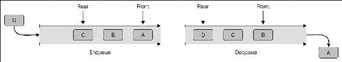

# 第五章。队列：FIFO 集合

**队列**是一种抽象数据结构，它作为基于**先进先出**（**FIFO**）原则插入和删除对象的线性集合。队列最显著的操作是**入队**，它将对象添加到集合的尾部或末尾，以及**出队**，它从集合的头部或前端移除对象。以下图示展示了队列数据结构以及这两个基本操作。其他常见操作包括**查看**、**空**和**满**，所有这些将在本章后面进行探讨：



队列与栈非常相似，它们共享一些相同的功能。甚至它们的主要操作也非常相似，只是基于相反的原则。像栈一样，队列可以是基于数组的或基于链表的，而在大多数情况下，基于链表的版本更有效率。然而，与可以排序或未排序的栈不同，队列根本不打算排序，并且每次向集合中添加对象时对队列进行排序会导致可怕的**O**(*n.log(n)*)操作成本。队列的一个替代版本，称为**优先队列**，基于**堆**数据结构。优先队列支持一种排序类型，但这仍然很昂贵，并且通常只在特殊应用中使用。

总体而言，队列数据结构非常适合任何需要基于**先来先服务**原则对操作进行优先级排序的应用程序。如果你在可视化队列结构时遇到困难，只需想想你曾经排队等待的任何时刻。在小学时，我们等待饮水机；在超市里，我们等待收银员；在熟食店，我们等待**我们的号码**；在各个政府办公室，我们等待（并且等待）下一个可用的出纳员。实际上，我们自出生以来就一直在排队...除非你是双胞胎，那样你比我们中的大多数人开始得早一点。

在本章中，我们将涵盖以下主题：

+   队列数据结构的定义

+   初始化队列

+   案例研究 - 客户服务

+   队列实现

+   常见队列操作

+   基于数组的队列

+   基于列表的队列

+   基于堆的队列

+   双端队列

+   优先队列

# 初始化队列

每种语言对队列数据结构的支持程度不同。以下是一些初始化集合、向集合的尾部添加对象以及从集合的头部移除头对象的示例。

**C#**

C#通过`Queue<T>`泛型类提供了队列数据结构的具体实现：

```py
    Queue<MyObject> aQueue = new Queue<MyObject>(); 
    aQueue.Enqueue(anObject); 
    aQueue.Dequeue(); 

```

**Java**

Java 提供了抽象的 `Queue<E>` 接口，并且有几个队列数据结构的具体实现使用了这个接口。队列也被扩展到 `Deque<E>` 接口，它代表一个**双端队列**。`ArrayDeque<E>` 类是 `Deque<E>` 接口的一个具体实现：

```py
    ArrayDeque<MyObject> aQueue = new ArrayDeque<MyObject>(); 
    aQueue.addLast(anObject); 
    aQueue.getFirst(); 

```

**Objective-C**

Objective-C 没有提供队列数据结构的具体实现，但可以使用 `NSMutableArray` 类簇轻松创建。请注意，这将创建一个基于数组的队列实现，这通常**不如**基于链表的实现高效：

```py
    NSMutableArray<MyObject *> *aStack = [NSMutableArray array]; 
    [aStack addObject:anObject]; 
    [aStack removeObjectAtIndex:0]; 

```

### 注意

我对使用 `NSMutableArray` 实现的栈和队列在效率上的可测量差异感到好奇，因此我进行了一系列简单的测试。在这些测试中，我首先实例化了一个包含 1,000,000 个 `EDSUser` 对象的 `NSMutableArray` 对象。在第一个测试中，我将数组视为栈，并通过调用 `removeLastObject` 对象依次从数组的尾部弹出每个项目。在第二个测试中，我将数组视为队列，并通过调用 `removeObjectAtIndex:0` 依次从数组的头部出队每个用户。使用 `for` 循环，我对每个测试序列进行了 1,000 次操作，然后平均了每次迭代移除所有对象所需的时间。我预计队列结构将和栈结构表现相当，或者略低效，所以我对这些结果感到惊讶：

平均栈时间：0.202993

平均队列时间：0.184913

如您所见，队列结构实际上表现得略好于栈结构，平均快了大约 18 毫秒。当然，不同环境下的结果会有所不同，18 毫秒几乎可以忽略不计，但经过这些测试，我有信心地说，`NSMutableArray` 类足够高效，可以作为队列结构使用。如果您想亲自运行测试，请在 Objective-C 代码文件中的 `EDSCollectionTests` 执行静态方法 `stackTest` 和 `queueTest`。

**Swift**

与 Objective-C 类似，Swift 没有提供队列数据结构的具体实现，但可以使用 `Array` 类来实现该结构。以下示例演示了 `append()` 和 `popLast()` 方法：

```py
    var aStack: Array [MyObject](); 
    aStack.append(anObject) 
    aStack.popLast() 

```

## 队列操作

并非所有队列数据结构的实现都公开相同的操作方法。然而，更常见的操作应该可用，或者根据开发者的需要提供：

+   **入队**：入队操作通过向集合追加（如果它是基于数组的）或向集合添加新节点（如果它是基于链表的）将新对象添加到队列的末尾。

+   **出队**：出队操作是入队的相反操作。在大多数实现中，出队操作会从数组或列表中移除并返回第一个对象给调用者。

+   **查看**：查看操作返回数组或列表中的第一个对象给调用者，但不从集合中移除该对象。

+   **计数**：计数操作返回集合中当前对象或节点的总数。

+   **空载**：空载操作通常返回一个布尔值，表示集合中是否有对象。

+   **满载**：满载操作通常返回一个布尔值，表示集合是否已满载或是否仍有空间添加更多对象。并非所有实现都允许调用者定义容量，但这个细节可以通过队列计数轻松添加。

# 案例研究：客户服务

**业务问题**：一家小型软件公司希望通过一款移动应用程序进入新市场，该应用程序用于跟踪在机动车管理局（DMV）服务地点的客户服务请求。该应用程序将允许用户在通过代表服务区域的**地理围栏**时使用他们的移动设备**取号**。这将允许客户立即移动到下一个可用的窗口或坐下舒适地等待工作人员协助他们。一个主要业务需求是，服务将按照先到先得的原则向客户提供服务。除了业务需求外，团队还希望以通用设计实现核心功能，这样他们就可以在不修改底层业务逻辑的情况下扩展到新市场。

负责创建核心功能的主开发人员决定，跟踪每位客户在队列中位置的类应该与网络服务捆绑在一起。这个类在正常操作中需要一些机制来添加和删除客户，以及在办公室当天关闭时能够清除等待名单上的所有客户。由于客户通常想知道在与工作人员交谈之前他们需要等待多长时间，因此该类还必须能够报告当前等待被接待的客户总数以及当前客户前面的客户数量。如果客户的移动设备再次穿越地理围栏，他们实际上已经离开了服务区域，并放弃了他们在队列中的位置。因此，尽管从队列中间移除对象不是队列操作，但该类还应该能够在客户在与工作人员交谈之前离开时取消他们在队列中的位置。最后，该类应该能够报告客户名单是否为空以及它是否达到了位置的占用上限。

**C#**

如实现示例所示，C# 在 `Queue<T>` 类中提供了队列支持。这个类是泛型的，它包括了实现 `CustomerQueue` 类所需的所有基本操作。以下是一个使用 C# 的简单实现的示例：

```py
    Queue<Customer> _custQueue; 
    int _cap; 

    public CustomerQueue(int capacity) 
    { 
        _custQueue = new Queue<Customer>(); 
        _cap = capacity; 
    } 

```

我们这个类声明了两个字段。第一个是 `_custQueue`，它代表我们的队列数据结构以及这个类的核心。该字段是私有的，因此只有我们类中的方法可以修改它。第二个字段是 `_cap`，它维护我们调用者定义的集合中客户的最大数量。最后，构造函数初始化 `_custQueue` 并将 `capacity` 赋值给 `_cap`：

```py
    private bool CanCheckinCustomer() 
    { 
        return this._custQueue.Count < this._cap; 
    } 

```

`CanCheckinCustomer()` 方法通过确认 `_custQueue.Count` 小于定义的容量并返回结果来对 `CustomerQueue` 进行简单的验证：

```py
    public void CustomerCheckin(Customer c) 
    { 
        if (this.CanCheckinCustomer()) 
        { 
            this._custQueue.Enqueue(c); 
        } 
    } 

```

两个基本队列操作中的第一个，*入队*，被封装在 `CustomerCheckin(Customer)` 方法中。这个方法验证一个新的 `Customer` 对象可以被添加，然后调用 `Enqueue(T)` 将 `c` 添加到 `_custQueue` 集合中。这个操作的成本是 **O**(*1*)：

```py
    public Customer CustomerConsultation() 
    { 
        return this._custQueue.Peek(); 
    } 

```

为了保持当前排队等待的客户准确数量，我们不希望在一位员工处理完客户的需求或咨询之前就出队一个客户。因此，当客户到达队列头部时，`CustomerConsultation()` 方法会调用 `Peek()`。这个方法返回 `_custQueue` 中的下一个 `Customer` 对象，但不会从集合中移除该对象。实际上，这个方法提供了发送“正在服务：”消息或类似消息所需的数据。这个操作的成本是 **O**(*1*)：

```py
    public void CustomerCheckout() 
    { 
        this._custQueue.Dequeue(); 
    } 

```

一位员工完成与当前客户的交易后，客户在队列中的位置可以被清除。`CustomerCheckout()` 方法调用 `Dequeue()` 方法，从 `_custQueue` 的前端位置移除 `Customer` 对象。这个操作的成本是 **O**(*1*)：

```py
    public void ClearCustomers() 
    { 
        this._custQueue.Clear(); 
    } 

```

当是时候关闭大门时，我们的类需要一种方法来清理滞留的客户。`ClearCustomers()` 方法提供了清除功能，因此我们的类可以将集合重置为空状态：

```py
    public void CustomerCancel(Customer c) 
    { 
        Queue<Customer> tempQueue = new Queue<Customer>(); 
        foreach (Customer cust in this._custQueue) 
        { 
            if (cust.Equals(c)) 
            { 
                continue; 
            } 
            tempQueue.Enqueue(c); 
        } 
        this._custQueue = tempQueue; 
    } 

```

`CustomerCancel(Customer)` 方法引入了非队列操作，用于从 `_custQueue` 集合中移除 `Customer` 对象。由于 `Queue<T>` 没有提供执行此操作的接口，我们需要进行改进。该方法首先创建一个临时的队列集合，`tempQueue`，然后遍历 `_custQueue` 中的每一个 `Customer` 对象。如果 `cust` 不等于 `c`，则将其添加到 `tempQueue`。当我们的 `for` 循环完成后，只有仍然在队列中的客户会被添加到 `tempQueue`。最后，将 `tempQueue` 赋值给 `_custQueue`。这个操作的成本是 **O**(*n*)，但这是可以接受的，因为这个方法不应该经常作为正常操作的一部分被调用：

```py
    public int CustomerPosition(Customer c) 
    { 
        if (this._custQueue.Contains(c)) 
        { 
            int i = 0; 
            foreach (Customer cust in this._custQueue) 
            {  
                if (cust.Equals(c)) 
                { 
                    return i; 
                } 
                i++; 
            } 
        } 
        return -1;  
    } 

```

为了以任何程度的准确性估计客户的当前等待时间，有必要知道他们在队列中的位置，而`CustomerPosition(Customer)`方法为我们提供了这个功能。再次强调，`Queue<T>`不提供这个功能，因此我们需要自己编写。`CustomerPosition(Customer)`方法检查`_custQueue`是否包含我们要找的`Customer`。如果集合不包含`Customer c`，则该方法返回`-1`。否则，它将遍历整个集合，直到找到`c`。位于队列末尾的`Customer c`对象是`Queue<T>.Contains(T)`方法和`foreach`循环的最坏情况，每个都代表一个**O**(*n*)的成本。由于这些操作是嵌套的，因此该方法的总成本为**O**(2*n*)：

```py
    public int CustomersInLine() 
    { 
        return this._custQueue.Count; 
    } 

    public bool IsLineEmpty() 
    { 
        return this._custQueue.Count == 0; 
    } 

    public bool IsLineFull() 
    { 
        return this._custQueue.Count == this.cap; 
    } 

```

最后三个方法，`CustomersInLine()`、`IsLineEmpty()`和`IsLineFull()`，为我们这个类引入了*计数*、*空*和*满*功能。这些操作的成本都是**O**(*1*)。

### 提示

**嵌套循环**

当你发现自己嵌套循环时，总是要仔细检查。从整体实现来看，`CustomerPosition()`方法有两个特别需要注意的原因。对于这样一个简单的操作，**O**(2*n*)的操作成本非常高。此外，由于用户在最佳情况下也倾向于缺乏耐心，因此他们可能会几乎不断监控预期的等待时间。这种行为将转化为对`CustomerPosition()`方法的多次调用。可以说，这种低效在实践中可以忽略不计，因为处理一个物理队列中的人的列表所需的时间，即使是等待进入体育场的队列，也是微不足道的。然而，成本为*x^n*（其中*x* > 1）的算法有一个糟糕的*代码味道*，大多数开发者会在将其发布到野外之前尝试构建一个更好的解决方案。

**Java**

如在实现示例中讨论的那样，Java 支持几个具体的列表实现，这些实现可以用于队列类，但最合适的版本符合双端队列`Dequeue<E>`接口。一个具体的实现是`ArrayQueue<E>`类。以下是一个使用 Java 的`ArrayQueue<E>`类进行简单实现的示例：

```py
    ArrayQueue<Customer> _custQueue; 
    int _cap; 

    public CustomerQueue(int capacity) 
    { 
        _custQueue = new ArrayDeque<Customer>(); 
        _cap = capacity; 
    } 

```

我们这个类声明了两个字段。第一个是`_custQueue`，它代表我们的队列数据结构以及这个类的核心。该字段是私有的，因此只有我们类中的方法可以修改它。第二个字段是`_cap`，它维护我们的调用者定义的集合中客户的最大数量。最后，构造函数初始化`_custQueue`并将`capacity`分配给`_cap`：

```py
    private boolean canCheckinCustomer() 
    { 
        return this._custQueue.size() < this._cap; 
    }   

```

`canCheckinCustomer()`方法通过确认`_custQueue.size()`小于定义的容量并返回结果来为`CustomerQueue`添加简单的验证：

```py
    public void customerCheckin(Customer c) 
    { 
        if (this.canCheckinCustomer()) 
        { 
            this._custQueue.addLast(c); 
        } 
    }  

```

两个基本队列操作中的第一个，*enqueue*，被封装在 `customerCheckin(Customer)` 方法中。这个方法确认我们可以向队列中添加一个新的 `Customer`，然后调用 `AddLast(E)` 将 `c` 添加到 `_custQueue` 集合中。这个操作的成本是 **O**(*1*)：

```py
    public Customer customerConsultation() 
    { 
        return this._custQueue.peek(); 
    } 

```

为了保持当前排队等待的客户准确数量，我们不希望在一位员工处理完客户的需求或咨询之前就出队一个客户。因此，当客户到达队列头部时，`customerConsultation()` 方法会调用 `peek()`。这个方法返回 `_custQueue` 中的下一个 `Customer` 对象，但不会从集合中移除该对象。这个操作的成本是 **O**(*1*)：

```py
    public void customerCheckout() 
    { 
        this._custQueue.removeFirst(); 
    } 

```

一位员工完成与当前客户的交易后，客户的队列位置可以被清除。`customerCheckout()` 方法调用 `Dequeue()`，从 `_custQueue` 的前端位置移除 `Customer` 对象。这个操作的成本是 **O**(*1*)：

```py
    public void clearCustomers() 
    { 
        this._custQueue.clear(); 
    } 

```

`ClearCustomers()` 方法提供了 *clear* 功能，因此我们的类可以将集合重置为空状态：

```py
    public void customerCancel(Customer c) 
    { 
        this._custQueue.remove(c); 
    } 

```

`customerCancel(Customer)` 方法引入了非队列操作来从 `_custQueue` 集合中移除 `Customer` 对象。由于 `ArrayQueue<E>` 提供了 `remove(E)` 方法来从队列中移除任何匹配 `E` 的对象，`customerCancel(Customer)` 简单地调用该方法。这个操作的成本是 **O**(*n*)，但在正常操作中这个方法不应该经常被调用：

```py
    public int customerPosition(Customer c) 
    { 
        if (this._custQueue.contains(c)) 
        { 
            int i = 0; 
            for (Customer cust : this._custQueue) 
            { 
                if (cust.equals(c)) 
                { 
                    return i; 
                } 
                i++; 
            } 
        } 

        return -1; 
    } 

```

为了以任何形式的准确性估计客户的当前等待时间，有必要知道他们在队列中的位置。`customerPosition(Customer)` 方法为我们提供了位置功能。`ArrayQueue<E>` 接口不提供这个功能，因此我们需要自己编写。`CustomerPosition(Customer)` 检查 `_custQueue` 是否包含我们要找的 `Customer`。如果集合不包含 `Customer c`，该方法返回 `-1`。否则，它将遍历整个集合，直到找到 `c`。位于队列末尾的 `Customer c` 对象是 `Queue<T>.Contains(T)` 方法和 `foreach` 循环的最坏情况，每个都代表一个 **O**(*n*) 成本。由于这些操作是嵌套的，这个方法的总成本是 **O**(2*n*)：

```py
    public int customersInLine() 
    { 
        return this._custQueue.size(); 
    } 

    public boolean isLineEmpty() 
    { 
        return this._custQueue.size() == 0;  
    } 

    public boolean isLineFull() 
    { 
        return this._custQueue.size() == this._cap; 
    } 

```

最后三个方法，`customersInLine()`、`isLineEmpty()` 和 `isLineFull()`，为我们的类引入了 *count*、*empty* 和 *full* 功能。这些操作的成本都是 **O**(*1*)。

**Objective-C**

如前所述，Objective-C 不提供队列数据结构的具体实现，但可以使用 `NSMutableArray` 类簇轻松模拟。以下是一个简单实现的示例：

```py
    NSMutableArray *_custQueue; 
    int _cap; 

    -(instancetype)initWithCapacity:(int)capacity 
    { 
        if (self = [super init]) 
        { 
            _custQueue = [NSMutableArray array]; 
            _cap = capacity; 
        } 
        return self; 
    } 

```

我们的类声明了两个 **ivar** 属性。第一个是一个名为 `_custQueue` 的 `NSMutableArray` 对象，它代表我们的队列数据结构以及这个类的核心。第二个字段是 `_cap`。这个字段维护了我们调用者定义的集合中客户的最大数量。这两个都是 ivars，所以只有我们类中的方法可以修改它们的值。最后，构造函数初始化 `_custQueue` 并将 `capacity` 赋值给 `_cap`：

```py
    -(BOOL)canCheckinCustomer 
    { 
        return [_custQueue count] < _cap; 
    } 

```

`canCheckinCustomer:` 通过确认 `[_custQueue count]` 小于定义的容量并返回结果来为 `CustomerQueue` 添加简单的验证：

```py
    -(void)checkInCustomer:(EDSCustomer*)c 
    { 
        if ([self canCheckinCustomer]) 
        { 
            [_custQueue addObject:c]; 
        } 
    } 

```

两个基本队列操作中的第一个，*入队*，被封装在 `checkInCustomer:` 方法中。这个方法确认我们可以向队列中添加一个新的 `Customer`，然后调用 `addObject:` 方法将 `c` 添加到 `_custQueue` 集合中。这个操作的成本是 **O**(*1*)：

```py
    -(EDSCustomer*)customerConsultation 
    { 
        return [_custQueue firstObject]; 
    } 

```

为了保持当前排队等待的客户准确数量，我们不希望在一位同事处理完他们的需求或咨询之前就 *出队* 一个客户。因此，当客户到达队列头部时，`customerConsultation:` 方法返回 `firstObject`。这返回了 `_custQueue` 中的下一个 `Customer` 对象，但不会从集合中移除该对象。这个操作的成本是 **O**(*1*)：

```py
    -(void)checkoutCustomer 
    { 
        [_custQueue removeObjectAtIndex:0]; 
    } 

```

一位同事完成与当前客户的交易后，可以清除客户在队列中的位置。`checkoutCustomer:` 方法调用 `removeObjectAtIndex:0`，从 `_custQueue` 的前端位置移除 `Customer` 对象。这个操作的成本是 **O**(*1*)：

```py
-(void)clearCustomers 
{ 
    [_custQueue removeAllObjects]; 
} 

```

`clearCustomers:` 方法提供了 *清除* 功能，因此我们的类可以将集合重置为空状态：

```py
    -(void)cancelCustomer:(EDSCustomer*)c 
    { 
        NSUInteger index = [self positionOfCustomer:c]; 
        if (index != -1) 
        { 
            [_custQueue removeObjectAtIndex:index]; 
        } 
    } 

```

`cancelCustomer:` 方法引入了非队列操作来从 `_custQueue` 集合中移除 `Customer` 对象。由于 `NSMutableArray` 提供了 `removeObjectAtIndex:` 属性，`cancelCustomer:` 简单地调用该方法。这个操作的成本是 **O**(*n*+1)，但在正常操作中不应频繁调用此方法：

```py
    -(NSUInteger)positionOfCustomer:(EDSCustomer*)c 
    { 
        return [_custQueue indexOfObject:c]; 
    } 

```

为了以任何程度的准确性估计客户的当前等待时间，有必要知道他们在队列中的位置。`positionOfCustomer:` 属性通过简单地返回 `indexOfObject:` 为我们的类提供位置功能。这个操作的成本是 **O**(*n*)：

```py
    -(NSUInteger)customersInLine 
    { 
        return [_custQueue count]; 
    } 

    -(BOOL)isLineEmpty 
    { 
        return [_custQueue count] == 0; 
    } 

    -(BOOL)isLineFull 
    { 
        return [_custQueue count] == _cap; 
    } 

```

最后三个方法，`customersInLine()`、`isLineEmpty()` 和 `isLineFull()`，为我们的类引入了 *计数*、*空* 和 *满* 功能。每个操作的成本都是 **O**(*1*)。

**Swift**

如前所述，Swift 没有提供队列数据结构的具体实现，但可以使用 `Array` 类轻松模拟。以下是一个简单实现的示例：

```py
    var _custQueue: Array = [Customer]() 
    var _cap: Int; 

    public init(capacity: Int) 
    { 
        _cap = capacity; 
    } 

```

我们的这个类声明了两个属性。第一个是一个名为 `_custQueue` 的 `Customer` 数组，它代表我们的队列数据结构和这个类的核心。第二个字段是 `_cap`。这个字段维护我们的调用者定义的集合中客户的最大数量。这两个都是私有的，所以只有我们这个类的方法可以修改它们的值。最后，构造函数初始化 `_custQueue` 并将 `capacity` 赋值给 `_cap`：

```py
    public func canCheckinCustomer() -> Bool 
    { 
        return _custQueue.count < _cap 
    } 

```

`canCheckinCustomer()` 方法通过确认 `_custQueue.count` 小于定义的容量并对结果进行返回，为 `CustomerQueue` 添加了简单的验证：

```py
    public func checkInCustomer(c: Customer) 
    { 
        if canCheckinCustomer() 
        { 
            _custQueue.append
        } 
    } 

```

两个基本队列操作中的第一个，*入队*，被封装在 `checkInCustomer()` 方法中。这个方法确认我们可以向队列中添加一个新的 `Customer`，然后调用 `append()` 将 `c` 添加到 `_custQueue` 集合中。这个操作的成本是 **O**(1)：

```py
    public func customerConsultation() -> Customer 
    { 
        return _custQueue.first! 
    } 

```

当一个客户到达队列头部时，`customerConsultation()` 方法调用 `first!`。这返回 `_custQueue` 中的下一个 `Customer`，但不从集合中移除该对象。这个操作的成本是 **O**(*1*)：

```py
    public func checkoutCustomer() 
    { 
        _custQueue.removeFirst() 
    } 

```

一旦一个关联方完成了与其当前客户的交易，客户的队列位置可以被清除。`checkoutCustomer()` 方法调用 `removeFirst`，从 `_custQueue` 的前端位置移除 `Customer` 对象。这个操作的成本是 **O**(*1*)：

```py
    public func clearCustomers() 
    { 
        _custQueue.removeAll() 
    } 

```

`clearCustomers()` 方法提供了 *清除* 功能，因此我们的类可以将集合重置为空状态：

```py
    public func cancelCustomer(c: Customer) 
    { 
        if let index = _custQueue.index(of: c) 
        { 
            _custQueue.removeAtIndex(at: index) 
        } 
    } 

```

`cancelCustomer(Customer)` 方法引入了非队列操作，用于从 `_custQueue` 集合中移除 `Customer` 对象。由于 `Array` 不提供简单的移除类型方法，我们需要再次进行改进。我们的代码首先使用 `indexOf()` 设置条件 `var index`。如果 `index` 有值，该方法将 `index` 传递给 `removeAtIndex()`。这个操作的成本是 **O**(*n*+1)：

### 注意

在 Swift 实现中，我们没有调用实例方法 `positionOfCustomer()`。这是因为 `let ... =` 符号是一个 **条件绑定** 的初始化器，而 `positionOfCustomer()` 返回 `Int`，这不是一个可选值。由于 `positionOfCustomer()` 和此方法都使用了相同的 `indexOf()` 方法调用，所以在操作成本上没有差异。

这个代码的示例如下：

```py
    public func positionOfCustomer(c: Customer) -> Int 
    { 
        return _custQueue.index(of:c)! 
    } 

```

为了以任何形式的准确性估计客户的当前等待时间，有必要知道他们在队列中的位置。`positionOfCustomer()` 方法通过简单地返回 `indexOf()` 为我们的类提供位置功能。这个操作的成本是 **O**(*n*)：

```py
    public func customersInLine() -> Int 
    { 
        return _custQueue.count 
    } 

    public func isLineEmpty() -> Bool 
    { 
        return _custQueue.count == 0 
    } 

    public func isLineFull() -> Bool 
    { 
        return _custQueue.count == _cap 
    } 

```

最后三个方法，`customersInLine()`、`isLineEmpty()`和`isLineFull()`，引入了我们类的**计数**、**空**和**满**功能。每个操作的成本为**O**(*1*)。总的来说，Swift 队列实现与其在 C#、Java 和 Objective-C 中的对应物非常相似，尽管 Swift 语言与其他语言有相当大的不同。

# 高级主题

队列数据结构可以建立在几种不同的底层数据结构之上。每个基础提供了不同的优势，而选择哪种类型通常取决于应用程序的需求。最常见的三种实现是数组基础、链表基础和堆基础。

队列数据结构还有两种额外的变体，包括双端队列和优先队列。同样，每种变体都提供了优势和劣势，而选择哪种类型将主要取决于应用程序的需求。

## 基于数组的队列

**基于数组的队列**使用可变数组来表示队列。Objective-C 和 Swift 中的两个示例都采用这种形式。在这个实现中，数组的`[0]`位置代表队列的头部或前端。尽管一般来说，队列是严格的 FIFO 集合，开发者不应尝试对它们进行排序，但基于数组的队列排序特别困难和昂贵。如果你的应用程序绝对需要有序集合，你应该考虑使用其他数据结构，例如列表。

## 基于链表的队列

**基于链表的队列**使用一个指向队列前端的指针，以及随着每个新对象被附加到集合上而后续的指针。从队列前端移除对象只需将头指针从节点 0 的对象移动到节点 1 的对象。如果你的对象集合必须是有序队列，则优先选择基于链表的队列而不是基于数组的队列。

## 基于堆的队列

**基于堆的队列**是一个使用**堆**集合作为其后盾创建的队列。堆本身是专门化的**基于树的数据库结构**，其中对象根据对象的某些值或属性自然排序为升序（**最小堆**）或降序（**最大堆**）。

### 注意

堆不应与计算机系统的堆（或动态分配的内存池）混淆。我们将在第十章（part0058_split_000.html#1NA0K1-77f2b5b248f04368a6f723b0e9357ef3 "第十章。堆：有序树"）中更详细地讨论堆的概念，*堆：有序树*。将在第十二章（part0069_split_000.html#21PMQ2-77f2b5b248f04368a6f723b0e9357ef3 "第十二章。排序：从混乱中带来秩序"）中广泛讨论排序堆数据结构的方法。

## 双端队列

**双端队列**是一个集合，对象可以添加到或从队列的前端或后端移除。`ArrayQueue<E>`接口是 Java 对`Queue<E>`接口的具体实现，它是一个双端队列的例子。

## 优先队列

**优先队列**根据某些值或**优先级**对集合中的对象进行排序。由于堆的自然层次结构，优先队列通常被实现为一个基于堆的队列。在这种设计中，具有更高优先级的对象自然地排列在队列的前端附近，因此每次出队时，总是具有最高优先级的对象。在两个或多个对象具有相同优先级的情况下，已在队列中等待时间最长的对象将首先出队。

# 摘要

在本章中，你学习了队列数据结构的基本定义，包括如何在所讨论的四种语言中初始化该结构的具体实现。接下来，我们讨论了与队列数据结构相关联的最常见操作及其操作成本。我们考察了一个使用队列跟踪在*先到先得*队列中等待的客户的应用示例。这些示例展示了 C#和 Java 如何提供队列的具体实现，而 Objective-C 和 Swift 则没有。随后，我们考察了三种最常见的队列实现类型，包括基于数组、基于链表和基于堆的队列。最后，我们探讨了队列数据结构的双端和优先级变体。
