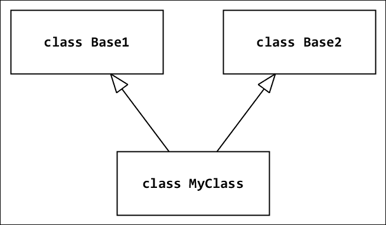
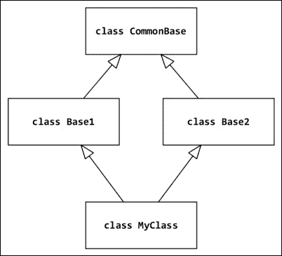
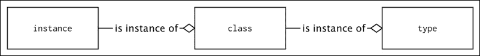
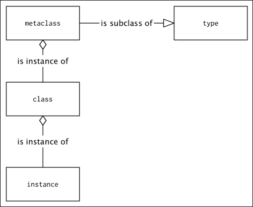
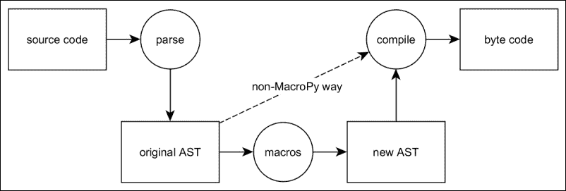

# 第三章： 语法最佳实践-在类级别以上

现在，我们将专注于类的语法最佳实践。这里不打算涵盖设计模式，因为它们将在第十四章*有用的设计模式*中讨论。本章概述了高级 Python 语法，以操纵和增强类代码。

对象模型在 Python 2 的历史中发生了很大的变化。很长一段时间，我们生活在一个同一语言中两种面向对象编程范式的实现并存的世界中。这两种模型简单地被称为*旧式*和*新式*类。Python 3 结束了这种二分法，只有*新式*类这种模型可供开发人员使用。无论如何，了解它们在 Python 2 中是如何工作的仍然很重要，因为它将帮助您移植旧代码并编写向后兼容的应用程序。了解对象模型的变化也将帮助您理解为什么它现在是这样设计的。这就是为什么下一章将有相对较多关于旧 Python 2 功能的注释，尽管本书的目标是最新的 Python 3 版本。

本章将讨论以下主题：

+   子类内置类型

+   从超类访问方法

+   使用属性和插槽

+   元编程

# 子类内置类型

在 Python 中，对内置类型进行子类化非常简单。名为`object`的内置类型是所有内置类型以及所有未明确指定父类的用户定义类的共同祖先。由于这个原因，每当需要实现一个行为几乎像内置类型之一的类时，最佳实践是对其进行子类型化。

现在，我们将向您展示一个名为`distinctdict`的类的代码，它使用了这种技术。它是通常的 Python `dict`类型的子类。这个新类在大多数方面的行为都像一个普通的 Python `dict`。但是，与其允许具有相同值的多个键不同，当有人尝试添加一个具有相同值的新条目时，它会引发一个带有帮助消息的`ValueError`子类：

```py
class DistinctError(ValueError):
    """Raised when duplicate value is added to a distinctdict."""

class distinctdict(dict):
    """Dictionary that does not accept duplicate values."""
    def __setitem__(self, key, value):
        if value in self.values():
            if (
                (key in self and self[key] != value) or
                key not in self
            ):
                raise DistinctError(
                    "This value already exists for different key"
                )

        super().__setitem__(key, value)
```

以下是在交互会话中使用`distictdict`的示例：

```py
>>> my = distinctdict()
>>> my['key'] = 'value'
>>> my['other_key'] = 'value'
Traceback (most recent call last):
 **File "<input>", line 1, in <module>
 **File "<input>", line 10, in __setitem__
DistinctError: This value already exists for different key
>>> my['other_key'] = 'value2'
>>> my
{'key': 'value', 'other_key': 'value2'}

```

如果您查看现有代码，可能会发现许多部分实现内置类型的类，并且可以作为子类型更快，更清洁。例如，`list`类型管理序列，并且可以在类内部使用序列时使用：

```py
class Folder(list):
    def __init__(self, name):
        self.name = name

    def dir(self, nesting=0):
        offset = "  " * nesting
        print('%s%s/' % (offset, self.name))

        for element in self:
            if hasattr(element, 'dir'):
                element.dir(nesting + 1)
            else:
                print("%s  %s" % (offset, element))
```

以下是在交互会话中的一个示例用法：

```py
>>> tree = Folder('project')
>>> tree.append('README.md')
>>> tree.dir()
project/
 **README.md
>>> src = Folder('src')
>>> src.append('script.py')
>>> tree.append(src)
>>> tree.dir()
project/
 **README.md
 **src/
 **script.py

```

### 提示

**内置类型涵盖了大多数用例**

当您要创建一个类似序列或映射的新类时，请考虑其特性并查看现有的内置类型。`collections`模块扩展了许多有用的容器的基本内置类型。您将大部分时间使用其中一个。

# 从超类访问方法

`super`是一个内置类，可用于访问属于对象的超类的属性。

### 注意

Python 官方文档将`super`列为内置函数。但它是一个内置类，即使它像一个函数一样使用：

```py
>>> super
<class 'super'>

```

当您习惯于通过直接调用父类并将`self`作为第一个参数传递来访问类属性或方法时，其用法有点令人困惑。这是一个非常古老的模式，但在一些代码库中仍然可以找到（特别是在传统项目中）。请参阅以下代码：

```py
class Mama:  # this is the old way
    def says(self):
        print('do your homework')

class Sister(Mama):
    def says(self):
        Mama.says(self)
        print('and clean your bedroom')
```

在解释器会话中运行时，会得到以下结果：

```py
>>> Sister().says()
do your homework
and clean your bedroom

```

特别注意`Mama.says(self)`这一行，我们使用刚才描述的技术来调用超类（即`Mama`类）的`says()`方法，并将`self`作为参数传递。这意味着将调用属于`Mama`的`says()`方法。但是，它将被调用的实例作为`self`参数提供，这在这种情况下是`Sister`的一个实例。

相反，`super`的用法将是：

```py
class Sister(Mama):def says(self):
 **super(Sister, self).says()
        print('and clean your bedroom')
```

或者，您也可以使用`super()`调用的更短形式：

```py
class Sister(Mama):def says(self):
 **super().says()
        print('and clean your bedroom')
```

`super`的更短形式（不传递任何参数）允许在方法内部使用，但`super`不仅限于方法。它可以在任何需要调用给定实例的超类方法实现的代码中使用。但是，如果在方法内部不使用`super`，则其参数是必需的：

```py
>>> anita = Sister()
>>> super(anita.__class__, anita).says()
do your homework

```

关于`super`最后且最重要的一点是，它的第二个参数是可选的。当只提供第一个参数时，`super`将返回一个无界类型。这在使用`classmethod`时特别有用：

```py
class Pizza:
    def __init__(self, toppings):
        self.toppings = toppings

    def __repr__(self):
        return "Pizza with " + " and ".join(self.toppings)

    @classmethod
    def recommend(cls):
        """Recommend some pizza with arbitrary toppings,"""
        return cls(['spam', 'ham', 'eggs'])

class VikingPizza(Pizza):
    @classmethod
    def recommend(cls):
        """Use same recommendation as super but add extra spam"""
        recommended = super(VikingPizza).recommend()
        recommended.toppings += ['spam'] * 5
        return recommended
```

请注意，方法装饰有`classmethod`装饰器的方法也允许使用零参数的`super()`形式。在这样的方法中，不带参数地调用`super()`被视为只定义了第一个参数。

前面介绍的用例非常简单易懂，但当您面对多重继承模式时，使用`super`就变得困难了。在解释这些问题之前，了解何时应避免使用`super`以及 Python 中**方法解析顺序**（**MRO**）的工作原理是很重要的。

## Python 2 中的旧式类和 super

Python 2 中的`super()`几乎完全相同。调用签名的唯一区别是，更短的零参数形式不可用，因此始终必须提供预期的参数之一。

对于想要编写跨版本兼容代码的程序员来说，另一个重要的事情是，Python 2 中的`super`仅适用于新式类。早期版本的 Python 没有以`object`形式的所有类的共同祖先。旧行为在每个 Python 2.x 分支版本中都保留了向后兼容性，因此在这些版本中，如果类定义没有指定祖先，它将被解释为旧式类，无法使用`super`：

```py
class OldStyle1:
    pass

class OldStyle2():
    pass
```

Python 2 中的新式类必须明确继承自 object 或其他新式类：

```py
class NewStyleClass(object):
    pass

class NewStyleClassToo(NewStyleClass):
    pass
```

Python 3 不再维护旧式类的概念，因此任何不继承自其他类的类都隐式继承自`object`。这意味着明确声明一个类继承自`object`可能看起来是多余的。一般的良好实践是不包含多余的代码，但在这种情况下去除这种多余对于不再针对任何 Python 2 版本的项目来说是一个好方法。目标跨版本兼容性的 Python 代码必须始终将`object`作为基类的祖先包括在内，即使在 Python 3 中这是多余的。不这样做将导致这样的类被解释为旧式类，最终会导致非常难以诊断的问题。

## 理解 Python 的方法解析顺序

Python 的方法解析顺序基于**C3**，这是为 Dylan 编程语言构建的 MRO（[`opendylan.org`](http://opendylan.org)）。Michele Simionato 撰写的参考文档位于[`www.python.org/download/releases/2.3/mro`](http://www.python.org/download/releases/2.3/mro)。它描述了 C3 如何构建类的**线性化**，也称为**优先级**，这是祖先的有序列表。这个列表用于寻找属性。稍后在本节中将更详细地描述 C3 算法。

MRO 的变化是为了解决引入共同基本类型（`object`）时出现的问题。在 C3 线性化方法改变之前，如果一个类有两个祖先（参见*图 1*），那么解析方法的顺序对于不使用多重继承模型的简单情况来说是非常简单的。以下是一个在 Python 2 下不使用 C3 作为方法解析顺序的代码示例：

```py
class Base1:
    pass

class Base2:
    def method(self):
        print('Base2')

class MyClass(Base1, Base2):
    pass
```

交互式会话的以下转录显示了这种方法解析的工作方式：

```py
>>> MyClass().method()
Base2

```

当调用`MyClass().method()`时，解释器首先在`MyClass`中查找方法，然后在`Base1`中查找，最终在`Base2`中找到：



图 1 经典层次结构

当我们在两个基类（`Base1`和`Base2`都继承自它，参见*图 2*）之上引入一些`CommonBase`类时，情况变得更加复杂。结果，按照*从左到右深度优先*规则行为的简单解析顺序在查看`Base2`类之前通过`Base1`类返回到顶部。这种算法会产生出人意料的输出。在某些情况下，执行的方法可能不是在继承树中最接近的方法。

当在 Python 2 中使用旧式类（不继承自`object`）时，仍然可以使用这种算法。以下是 Python 2 中使用旧式类的旧方法解析的示例：

```py
class CommonBase:
    def method(self):
        print('CommonBase')

class Base1(CommonBase):
    pass

class Base2(CommonBase):
    def method(self):
        print('Base2')

class MyClass(Base1, Base2):
    pass
```

来自交互会话的以下转录显示，尽管`Base2`在类层次结构中比`CommonBase`更接近，但`Base2.method()`不会被调用：

```py
>>> MyClass().method()
CommonBase

```



图 2 钻石类层次结构

这种继承场景极为罕见，因此更多是理论问题而不是实践问题。标准库不以这种方式构造继承层次结构，许多开发人员认为这是一种不好的做法。但是，随着在类型层次结构顶部引入`object`，多重继承问题在语言的 C 端出现冲突。还要注意的是，Python 3 中的每个类现在都有相同的共同祖先。由于使其与现有的 MRO 正常工作涉及太多工作，新的 MRO 是一个更简单和更快的解决方案。

因此，在 Python 3 下运行相同的示例会产生不同的结果：

```py
class CommonBase:
    def method(self):
        print('CommonBase')

class Base1(CommonBase):
    pass

class Base2(CommonBase):
    def method(self):
        print('Base2')

class MyClass(Base1, Base2):
    pass
```

以下是使用示例，显示 C3 序列化将选择最接近祖先的方法：

```py
>>> MyClass().method()
Base2

```

### 提示

请注意，上述行为在 Python 2 中无法复制，除非`CommonBase`类明确继承自`object`。即使在 Python 3 中这是多余的，也有必要在 Python 3 中指定`object`作为类祖先的原因在前一节*Python 2 中的旧式类和 super*中提到。

Python MRO 基于对基类的递归调用。总结 Michele Simionato 在本节开头引用的论文，应用于我们示例的 C3 符号表示法是：

```py
L[MyClass(Base1, Base2)] =
        MyClass + merge(L[Base1], L[Base2], Base1, Base2)
```

在这里，`L[MyClass]`是`MyClass`类的线性化，`merge`是一个合并多个线性化结果的特定算法。

因此，Simionato 所说的合成描述是：

> *"C 的线性化是 C 的总和加上父类的线性化的合并和父类的列表"*

`merge`算法负责删除重复项并保留正确的顺序。它在论文中描述如下（适用于我们的示例）：

> *"取第一个列表的头，即 L[Base1][0]；如果这个头不在其他列表的尾部，则将其添加到 MyClass 的线性化中并从合并的列表中删除它，否则查看下一个列表的头并取出它，如果它是一个好的头。*
> 
> *然后，重复操作，直到所有类都被移除或者无法找到好的头。在这种情况下，无法构造合并，Python 2.3 将拒绝创建`MyClass`类并引发异常。*

`head`是列表的第一个元素，`tail`包含其余的元素。例如，在`(Base1, Base2, ..., BaseN)`中，`Base1`是`head`，`(Base2, ..., BaseN)`是`tail`。

换句话说，C3 对每个父类进行递归深度查找以获得一系列列表。然后，它计算一个从左到右的规则，以合并所有包含类的列表，并进行层次结构消歧义。

因此结果是：

```py
def L(klass):
    return [k.__name__ for k in klass.__mro__]

>>> L(MyClass)
['MyClass', 'Base1', 'Base2', 'CommonBase', 'object']
```

### 提示

一个类的`__mro__`属性（只读）存储了线性化计算的结果，这是在类定义加载时完成的。

你也可以调用`MyClass.mro()`来计算并获取结果。这也是 Python 2 中的类应该额外小心的另一个原因。虽然 Python 2 中的旧式类有一定的方法解析顺序，但它们不提供`__mro__`属性和`mro()`方法。因此，尽管有解析顺序，但说它们有 MRO 是错误的。在大多数情况下，每当有人在 Python 中提到 MRO 时，他们指的是本节中描述的 C3 算法。

## super 陷阱

回到`super`。在使用多重继承层次结构时，它可能非常危险，主要是因为类的初始化。在 Python 中，基类不会在`__init__()`中被隐式调用，因此开发人员需要调用它们。我们将看到一些例子。

### 混合使用 super 和显式类调用

在以下示例中，来自 James Knight 网站（[`fuhm.net/super-harmful`](http://fuhm.net/super-harmful)）的一个示例，一个调用其基类使用`__init__()`方法的`C`类将使`B`类被调用两次：

```py
class A:
    def __init__(self):
        print("A", end=" ")
        super().__init__()

class B:
    def __init__(self):
        print("B", end=" ")
        super().__init__()

class C(A, B):
    def __init__(self):
        print("C", end=" ")
        A.__init__(self)
        B.__init__(self)
```

以下是输出：

```py
>>> print("MRO:", [x.__name__ for x in C.__mro__])
MRO: ['C', 'A', 'B', 'object']
>>> C()
C A B B <__main__.C object at 0x0000000001217C50>

```

这是由`A.__init__(self)`调用引起的，它是用`C`实例进行的，因此使得`super(A, self).__init__()`调用`B.__init__()`方法。换句话说，`super`应该在整个类层次结构中使用。问题在于有时这个层次结构的一部分位于第三方代码中。James 的网页上可以找到由多重继承引入的层次结构调用的许多相关陷阱。

不幸的是，你无法确定外部包在他们的代码中是否使用`super()`。每当你需要对第三方类进行子类化时，最好的方法是查看其代码以及 MRO 中其他类的代码。这可能会很繁琐，但作为奖励，你会得到有关该软件包提供的代码质量的一些信息，以及对其实现的更多理解。你可能会通过这种方式学到一些新东西。

### 异构参数

`super`用法的另一个问题是初始化中的参数传递。如果一个类调用其基类的`__init__()`代码，但它的签名不同，会导致以下问题：

```py
class CommonBase:
    def __init__(self):
        print('CommonBase')
        super().__init__()

class Base1(CommonBase):
    def __init__(self):
        print('Base1')
        super().__init__()

class Base2(CommonBase):
    def __init__(self, arg):
        print('base2')
        super().__init__()

class MyClass(Base1 , Base2):
    def __init__(self, arg):
        print('my base')
        super().__init__(arg)
```

尝试创建`MyClass`实例将由于父类的`__init__()`签名不匹配而引发`TypeError`：

```py
>>> MyClass(10)
my base
Traceback (most recent call last):
 **File "<stdin>", line 1, in <module>
 **File "<stdin>", line 4, in __init__
TypeError: __init__() takes 1 positional argument but 2 were given

```

一个解决方案是使用`*args`和`**kwargs`魔术打包的参数和关键字参数，以便所有构造函数传递所有参数，即使它们不使用它们：

```py
class CommonBase:
    def __init__(self, *args, **kwargs):
        print('CommonBase')
        super().__init__()

class Base1(CommonBase):
    def __init__(self, *args, **kwargs):
        print('Base1')
        super().__init__(*args, **kwargs)

class Base2(CommonBase):
    def __init__(self, *args, **kwargs):
        print('base2')
        super().__init__(*args, **kwargs)

class MyClass(Base1 , Base2):
    def __init__(self, arg):
        print('my base')
        super().__init__(arg)
```

使用这种方法，父类的签名将始终匹配：

```py
>>> _ = MyClass(10)
my base
Base1
base2
CommonBase

```

然而，这是一个糟糕的修复方法，因为它使所有构造函数都接受任何类型的参数。这会导致代码质量低下，因为任何东西都可以被传递和执行。另一个解决方案是在`MyClass`中使用特定类的显式`__init__()`调用，但这将导致第一个陷阱。

## 最佳实践

为了避免所有提到的问题，并且在 Python 在这个领域发展之前，我们需要考虑以下几点：

+   应避免多重继承：它可以用第十四章中介绍的一些设计模式来替代，*有用的设计模式*。

+   超级用法必须保持一致：在类层次结构中，`super`应该在所有地方或者都不使用。混合使用`super`和经典调用是一种令人困惑的做法。人们倾向于避免使用`super`，以使他们的代码更加明确。

+   如果你的目标是 Python 2，那么在 Python 3 中明确从 object 继承：在 Python 2 中，没有指定任何祖先的类被识别为旧式类。在 Python 2 中应避免混合旧式类和新式类。

+   **在调用父类时必须查看类层次结构**：为了避免任何问题，每次调用父类时，都必须快速查看涉及的 MRO（使用`__mro__`）。

# 高级属性访问模式

当许多 C++和 Java 程序员首次学习 Python 时，他们会对 Python 缺少`private`关键字感到惊讶。最接近的概念是*名称混淆*。每当属性以`__`为前缀时，解释器会即时重命名属性：

```py
class MyClass:
    __secret_value = 1
```

通过其初始名称访问`__secret_value`属性将引发`AttributeError`异常：

```py
>>> instance_of = MyClass()
>>> instance_of.__secret_value
Traceback (most recent call last):
 **File "<stdin>", line 1, in <module>
AttributeError: 'MyClass' object has no attribute '__secret_value'
>>> dir(MyClass)
['_MyClass__secret_value', '__class__', '__delattr__', '__dict__', '__dir__', '__doc__', '__eq__', '__format__', '__ge__', '__getattribute__', '__gt__', '__hash__', '__init__', '__le__', '__lt__', '__module__', '__ne__', '__new__', '__reduce__', '__reduce_ex__', '__repr__', '__setattr__', '__sizeof__', '__str__', '__subclasshook__', '__weakref__']
>>> instance_of._MyClass__secret_value
1

```

提供此功能是为了避免继承下的名称冲突，因为属性会以类名作为前缀进行重命名。这不是真正的锁，因为可以通过其组合名称访问属性。此功能可用于保护对某些属性的访问，但在实践中，不应该使用`__`。当属性不是公共的时，使用的约定是使用`_`前缀。这不会调用任何混淆算法，而只是将属性记录为类的私有元素，并且是主要的样式。

Python 中还有其他机制可用于构建类的公共部分以及私有代码。应该使用描述符和属性来设计一个干净的 API，这是面向对象设计的关键特性。

## 描述符

描述符允许您自定义在对象上引用属性时应执行的操作。

描述符是 Python 中复杂属性访问的基础。它们在内部用于实现属性、方法、类方法、静态方法和`super`类型。它们是定义另一个类的属性如何被访问的类。换句话说，一个类可以将属性的管理委托给另一个类。

描述符类基于三个形成**描述符协议**的特殊方法：

+   `__set__(self, obj, type=None)`: 每当设置属性时调用此方法。在以下示例中，我们将其称为**setter**。

+   `__get__(self, obj, value)`: 每当读取属性时调用此方法（称为**getter**）。

+   `__delete__(self, obj)`: 当对属性调用`del`时调用此方法。

实现`__get__()`和`__set__()`的描述符称为**数据描述符**。如果只实现`__get__()`，则称为**非数据描述符**。

实际上，该协议的方法是由对象的特殊`__getattribute__()`方法调用的（不要与具有不同目的的`__getattr__()`混淆），在每次属性查找时都会隐式调用`__getattribute__()`方法，并且它按以下顺序查找属性：

1.  它验证属性是否是实例的类对象上的数据描述符。

1.  如果没有，它会查看属性是否可以在实例对象的`__dict__`中找到。

1.  最后，它查看属性是否是实例的类对象上的非数据描述符。

换句话说，数据描述符优先于`__dict__`查找，而`__dict__`查找优先于非数据描述符。

为了更清楚，这里有一个来自官方 Python 文档的示例，展示了描述符在实际代码中的工作原理：

```py
class RevealAccess(object):
    """A data descriptor that sets and returns values
       normally and prints a message logging their access.
    """

    def __init__(self, initval=None, name='var'):
        self.val = initval
        self.name = name

    def __get__(self, obj, objtype):
        print('Retrieving', self.name)
        return self.val

    def __set__(self, obj, val):
        print('Updating', self.name)
        self.val = val

class MyClass(object):
    x = RevealAccess(10, 'var "x"')
    y = 5
```

以下是在交互会话中使用它的示例：

```py
>>> m = MyClass()
>>> m.x
Retrieving var "x"
10
>>> m.x = 20
Updating var "x"
>>> m.x
Retrieving var "x"
20
>>> m.y
5

```

前面的例子清楚地表明，如果一个类具有给定属性的数据描述符，那么每次检索实例属性时都会调用描述符的`__get__()`方法来返回值，并且每当将值分配给这样的属性时都会调用`__set__()`。虽然在前面的例子中没有显示描述符的`__del__`方法的情况，但现在应该很明显：每当使用`del instance.attribute`语句或`delattr(instance, 'attribute')`调用删除实例属性时都会调用它。

数据和非数据描述符之间的区别是重要的，因为在开始时已经说明的事实。Python 已经使用描述符协议将类函数绑定到实例作为方法。它们还支持`classmethod`和`staticmethod`装饰器背后的机制。这是因为实际上，函数对象也是非数据描述符：

```py
>>> def function(): pass
>>> hasattr(function, '__get__')
True
>>> hasattr(function, '__set__')
False

```

对于使用 lambda 表达式创建的函数也是如此：

```py
>>> hasattr(lambda: None, '__get__')
True
>>> hasattr(lambda: None, '__set__')
False

```

因此，如果`__dict__`不优先于非数据描述符，我们将无法在运行时动态覆盖已构造实例上的特定方法。幸运的是，由于 Python 中描述符的工作方式。它是可用的，因此开发人员可以使用一种称为猴子补丁的流行技术来改变实例的工作方式，而无需子类化。

### 现实生活中的例子-延迟评估属性

描述符的一个例子用法可能是将类属性的初始化延迟到从实例中访问它的时刻。如果此类属性的初始化取决于全局应用上下文，则这可能是有用的。另一种情况是当这样的初始化只是昂贵的，但不知道在导入类时是否会使用它。这样的描述符可以实现如下：

```py
class InitOnAccess:
    def __init__(self, klass, *args, **kwargs):
        self.klass = klass
        self.args = args
        self.kwargs = kwargs
        self._initialized = None

    def __get__(self, instance, owner):
        if self._initialized is None:
            print('initialized!')
            self._initialized = self.klass(*self.args, **self.kwargs)
        else:
            print('cached!')
        return self._initialized
```

以下是一个例子用法：

```py
>>> class MyClass:
...     lazily_initialized = InitOnAccess(list, "argument")
...
>>> m = MyClass()
>>> m.lazily_initialized
initialized!
['a', 'r', 'g', 'u', 'm', 'e', 'n', 't']
>>> m.lazily_initialized
cached!
['a', 'r', 'g', 'u', 'm', 'e', 'n', 't']

```

PyPI 上提供的官方 OpenGL Python 库以`PyOpenGL`名称可用，使用类似的技术来实现`lazy_property`，它既是装饰器又是数据描述符：

```py
class lazy_property(object):
    def __init__(self, function):
        self.fget = function

    def __get__(self, obj, cls):
        value = self.fget(obj)
        setattr(obj, self.fget.__name__, value)
        return value
```

这样的实现类似于使用`property`装饰器（稍后描述），但用它包装的函数只执行一次，然后类属性被此类属性返回的值替换。当开发人员需要同时满足以下两个要求时，这种技术通常很有用：

+   对象实例需要存储为一个类属性，在其实例之间共享，以节省资源

+   这个对象不能在导入时初始化，因为它的创建过程取决于一些全局应用状态/上下文

在使用 OpenGL 编写的应用程序中，这通常是很真实的。例如，在 OpenGL 中创建着色器是昂贵的，因为它需要编译用**GLSL**（**OpenGL 着色语言**）编写的代码。只有在需要时才合理地创建它们，并将它们的定义包含在需要它们的类的紧密接近中。另一方面，没有初始化 OpenGL 上下文就无法执行着色器编译，因此很难在导入时在全局模块命名空间中可靠地定义和编译它们。

以下示例显示了在某个想象的基于 OpenGL 的应用程序中使用修改后的 PyOpenGL 的`lazy_property`装饰器（这里是`lazy_class_attribute`）的可能用法。对原始`lazy_property`装饰器的突出更改是为了允许在不同类实例之间共享属性：

```py
import OpenGL.GL as gl
from OpenGL.GL import shaders

class lazy_class_attribute(object):
    def __init__(self, function):
        self.fget = function
 **def __get__(self, obj, cls):
 **value = self.fget(obj or cls)
 **# note: storing in class object not its instance
 **#       no matter if its a class-level or
 **#       instance-level access
 **setattr(cls, self.fget.__name__, value)
 **return value

class ObjectUsingShaderProgram(object):
    # trivial pass-through vertex shader implementation
    VERTEX_CODE = """
        #version 330 core
        layout(location = 0) in vec4 vertexPosition;
        void main(){
            gl_Position =  vertexPosition;
        }
    """
    # trivial fragment shader that results in everything
    # drawn with white color
    FRAGMENT_CODE = """
        #version 330 core
        out lowp vec4 out_color;
        void main(){
            out_color = vec4(1, 1, 1, 1);
        }
    """

    @lazy_class_attribute
    def shader_program(self):
        print("compiling!")
        return shaders.compileProgram(
            shaders.compileShader(
                self.VERTEX_CODE, gl.GL_VERTEX_SHADER
            ),
            shaders.compileShader(
                self.FRAGMENT_CODE, gl.GL_FRAGMENT_SHADER
            )
        )
```

像 Python 的每个高级语法特性一样，这个特性也应该谨慎使用，并在代码中进行良好的文档记录。对于经验不足的开发人员来说，修改后的类行为可能会非常令人困惑和意外，因为描述符会影响类行为的基本部分，比如属性访问。因此，非常重要的是确保所有团队成员都熟悉描述符，并且如果它在项目的代码库中起重要作用，他们对这个概念有很好的理解。

## 属性

属性提供了一种内置的描述符类型，知道如何将属性链接到一组方法。`property`接受四个可选参数：`fget`，`fset`，`fdel`和`doc`。最后一个可以提供用于定义与属性关联的`docstring`，就像它是一个方法一样。下面是一个`Rectangle`类的示例，可以通过直接访问存储两个角点的属性或使用`width`和`height`属性来控制：

```py
class Rectangle:
    def __init__(self, x1, y1, x2, y2):
        self.x1, self.y1 = x1, y1
        self.x2, self.y2 = x2, y2

    def _width_get(self):
        return self.x2 - self.x1

    def _width_set(self, value):
        self.x2 = self.x1 + value

    def _height_get(self):
        return self.y2 - self.y1

    def _height_set(self, value):
        self.y2 = self.y1 + value

    width = property(
        _width_get, _width_set,
        doc="rectangle width measured from left"
    )
    height = property(
        _height_get, _height_set,
        doc="rectangle height measured from top"
    )

    def __repr__(self):
        return "{}({}, {}, {}, {})".format(
            self.__class__.__name__,
            self.x1, self.y1, self.x2, self.y2
        )
```

在交互式会话中使用这些定义的属性的示例用法如下：

```py
>>> rectangle = Rectangle(10, 10, 25, 34)
>>> rectangle.width, rectangle.height
(15, 24)
>>> rectangle.width = 100
>>> rectangle
Rectangle(10, 10, 110, 34)
>>> rectangle.height = 100
>>> rectangle
Rectangle(10, 10, 110, 110)
help(Rectangle)
Help on class Rectangle in module chapter3:

class Rectangle(builtins.object)
 **|  Methods defined here:
 **|** 
 **|  __init__(self, x1, y1, x2, y2)
 **|      Initialize self.  See help(type(self)) for accurate signature.
 **|** 
 **|  __repr__(self)
 **|      Return repr(self).
 **|** 
 **|  --------------------------------------------------------
 **|  Data descriptors defined here:
 **|  (...)
 **|** 
 **|  height
 **|      rectangle height measured from top
 **|** 
 **|  width
 **|      rectangle width measured from left

```

属性使得编写描述符更加容易，但在使用继承时必须小心处理。创建的属性是使用当前类的方法动态生成的，并不会使用在派生类中被覆盖的方法。

例如，以下示例将无法覆盖父类（`Rectangle`）`width`属性的`fget`方法的实现：

```py
>>> class MetricRectangle(Rectangle):
...     def _width_get(self):
...         return "{} meters".format(self.x2 - self.x1)
...** 
>>> Rectangle(0, 0, 100, 100).width
100

```

为了解决这个问题，只需要在派生类中简单地覆盖整个属性：

```py
>>> class MetricRectangle(Rectangle):
...     def _width_get(self):
...         return "{} meters".format(self.x2 - self.x1)
...     width = property(_width_get, Rectangle.width.fset)
...** 
>>> MetricRectangle(0, 0, 100, 100).width
'100 meters'

```

不幸的是，前面的代码存在一些可维护性问题。如果开发人员决定更改父类，但忘记更新属性调用，这可能会成为一个问题。这就是为什么不建议仅覆盖属性行为的部分。与其依赖于父类的实现，不如在派生类中重写所有属性方法，如果需要更改它们的工作方式。在大多数情况下，这通常是唯一的选择，因为通常更改属性的`setter`行为意味着需要更改`getter`的行为。

由于前面的原因，创建属性的最佳语法是使用`property`作为装饰器。这将减少类内部方法签名的数量，并使代码更易读和易维护：

```py
class Rectangle:
    def __init__(self, x1, y1, x2, y2):
        self.x1, self.y1 = x1, y1
        self.x2, self.y2 = x2, y2
    @property
    def width(self):
        """rectangle height measured from top"""
        return self.x2 - self.x1

    @width.setter
    def width(self, value):
        self.x2 = self.x1 + value

    @property
    def height(self):
        """rectangle height measured from top"""
        return self.y2 - self.y1

    @height.setter
    def height(self, value):
        self.y2 = self.y1 + value
```

## Slots

开发人员几乎从不使用的一个有趣特性是 slots。它们允许您为给定类设置一个静态属性列表，使用`__slots__`属性，并跳过在每个类实例中创建`__dict__`字典。它们旨在为具有非常少属性的类节省内存空间，因为`__dict__`不会在每个实例中创建。

除此之外，它们可以帮助设计需要被冻结的类的签名。例如，如果您需要限制语言的动态特性在一个类上，定义 slots 可以帮助：

```py
>>> class Frozen:
...     __slots__ = ['ice', 'cream']
...** 
>>> '__dict__' in dir(Frozen)
False
>>> 'ice' in dir(Frozen)
True
>>> frozen = Frozen()
>>> frozen.ice = True
>>> frozen.cream = None
>>> frozen.icy = True
Traceback (most recent call last):
 **File "<input>", line 1, in <module>
AttributeError: 'Frozen' object has no attribute 'icy'

```

这个特性应该谨慎使用。当使用`__slots__`限制一组可用属性时，动态地向对象添加内容就会变得更加困难。一些技术，比如猴子补丁，将无法用于具有定义 slots 的类的实例。幸运的是，如果派生类没有定义自己的 slots，新属性可以添加到派生类中：

```py
>>> class Unfrozen(Frozen):
...     pass
...** 
>>> unfrozen = Unfrozen()
>>> unfrozen.icy = False
>>> unfrozen.icy
False

```

# 元编程

可能有一些学术论文中对元编程有很好的定义，可以在这里引用，但这更像是一本关于良好软件工艺的书，而不是关于计算机科学理论的书。这就是为什么我们将使用一个简单的定义：

> “元编程是一种编写计算机程序的技术，可以在运行时将自身视为数据，因此可以自省、生成和/或修改自身。”

使用这个定义，我们可以区分 Python 中的两种主要元编程方法。

第一种方法集中在语言的能力上，可以自省其基本元素，如函数、类或类型，并在运行时创建或修改它们。Python 为开发人员在这个领域提供了很多工具。最简单的是装饰器，允许向现有的函数、方法或类添加额外的功能。接下来是类的特殊方法，允许您干预类实例的创建过程。最强大的是元类，允许程序员甚至完全重新设计面向对象编程范式的 Python 实现。在这里，我们还有一系列不同的工具，允许程序员直接使用代码，无论是以原始纯文本格式还是以更具编程访问性的抽象语法树（AST）形式。这第二种方法当然更复杂，更难处理，但允许实现非常特别的事情，比如扩展 Python 的语言语法，甚至创建自己的领域特定语言（DSL）。

## 装饰器-元编程的一种方法

装饰器语法在第二章中有解释，*语法最佳实践-类级别以下*，作为一个简单的模式：

```py
def decorated_function():
    pass
decorated_function = some_decorator(decorated_function)
```

这清楚地展示了装饰器的作用。它接受一个函数对象，并在运行时对其进行修改。结果，基于先前的函数对象创建了一个新函数（或其他任何东西），名称相同。这甚至可能是一个复杂的操作，根据原始函数的实现方式给出不同的结果。这意味着装饰器可以被视为元编程工具。

这是个好消息。装饰器相对容易掌握，在大多数情况下可以使代码更简洁、更易读，也更便于维护。Python 中的其他元编程工具更难以理解和掌握。而且，它们可能根本不会使代码简单。

## 类装饰器

Python 的一个不太为人知的语法特性是类装饰器。它们的语法和工作方式与第二章中提到的函数装饰器完全相同，*语法最佳实践-类级别以下*。唯一的区别是它们期望返回一个类，而不是函数对象。以下是一个修改`__repr__()`方法以返回可打印对象表示的示例类装饰器，该表示被缩短为任意数量字符：

```py
def short_repr(cls):
    cls.__repr__ = lambda self: super(cls, self).__repr__()[:8]
    return cls

@short_repr
class ClassWithRelativelyLongName:
    pass
```

以下是您将在输出中看到的内容：

```py
>>> ClassWithRelativelyLongName()
<ClassWi

```

当然，前面的代码片段绝对不是一个好的代码示例，因为它太神秘了。但它展示了本章中解释的多种语言特性如何可以一起使用：

+   不仅实例，类对象也可以在运行时修改

+   函数也是描述符，因此它们可以在运行时添加到类中，因为实际的绑定实例是作为描述符协议的一部分进行属性查找的

+   `super()`调用可以在类定义范围之外使用，只要提供适当的参数

+   最后，类装饰器可以用于类定义

编写函数装饰器的其他方面也适用于类装饰器。最重要的是，它们可以使用闭包并且可以被参数化。利用这些事实，前面的示例可以重写为更可读和可维护的形式：

```py
def parametrized_short_repr(max_width=8):
    """Parametrized decorator that shortens representation"""
    def parametrized(cls):
        """Inner wrapper function that is actual decorator"""
        class ShortlyRepresented(cls):
            """Subclass that provides decorated behavior"""
            def __repr__(self):
                return super().__repr__()[:max_width]

        return ShortlyRepresented

    return parametrized
```

在类装饰器中使用闭包的主要缺点是，结果对象不再是被装饰的类的实例，而是在装饰器函数中动态创建的子类的实例。除其他外，这将影响类的`__name__`和`__doc__`属性：

```py
@parametrized_short_repr(10)
class ClassWithLittleBitLongerLongName:
    pass
```

类装饰器的这种用法将导致对类元数据的以下更改：

```py
>>> ClassWithLittleBitLongerLongName().__class__
<class 'ShortlyRepresented'>
>>> ClassWithLittleBitLongerLongName().__doc__
'Subclass that provides decorated behavior'

```

不幸的是，这不能像在第二章的*保留内省装饰器*部分中所解释的那样简单修复，*语法最佳实践 - 类级别以下*，使用额外的`wraps`装饰器。这使得在某些情况下，以这种形式使用类装饰器受到限制。如果没有额外的工作来保留旧类的元数据，那么这可能会破坏许多自动化文档生成工具的结果。

尽管有这个单一的警告，类装饰器仍然是流行的 mixin 类模式的一个简单而轻量的替代品。

在 Python 中，mixin 是一个不打算被实例化的类，而是用来为其他现有类提供一些可重用的 API 或功能。Mixin 类几乎总是以多重继承的形式添加的：

```py
class SomeConcreteClass(MixinClass, SomeBaseClass):
    pass
```

Mixin 是一种有用的设计模式，在许多库中被使用。举个例子，Django 是其中一个广泛使用它们的框架。虽然有用且受欢迎，但如果设计不好，mixin 可能会引起一些麻烦，因为在大多数情况下，它们需要开发人员依赖多重继承。正如之前所说，Python 相对较好地处理多重继承，这要归功于 MRO。无论如何，如果不需要太多额外的工作并且使代码更简单，最好避免对多个类进行子类化。这就是为什么类装饰器可能是 mixin 的一个很好的替代品。

## 使用`__new__()`方法来重写实例创建过程

特殊方法`__new__()`是一个负责创建类实例的静态方法。它是特殊情况，因此不需要使用`staticmethod`装饰器将其声明为静态方法。这个`__new__(cls, [,...])`方法在`__init__()`初始化方法之前被调用。通常，重写的`__new__()`的实现会使用`super().__new__()`调用其超类版本，并使用合适的参数修改实例后返回它：

```py
class InstanceCountingClass:
    instances_created = 0
    def __new__(cls, *args, **kwargs):
        print('__new__() called with:', cls, args, kwargs)
        instance = super().__new__(cls)
        instance.number = cls.instances_created
        cls.instances_created += 1

        return instance

    def __init__(self, attribute):
        print('__init__() called with:', self, attribute)
        self.attribute = attribute
```

这是一个示例交互会话的日志，展示了我们的`InstanceCountingClass`实现是如何工作的：

```py
>>> instance1 = InstanceCountingClass('abc')
__new__() called with: <class '__main__.InstanceCountingClass'> ('abc',) {}
__init__() called with: <__main__.InstanceCountingClass object at 0x101259e10> abc
>>> instance2 = InstanceCountingClass('xyz')
__new__() called with: <class '__main__.InstanceCountingClass'> ('xyz',) {}
__init__() called with: <__main__.InstanceCountingClass object at 0x101259dd8> xyz
>>> instance1.number, instance1.instances_created
(0, 2)
>>> instance2.number, instance2.instances_created
(1, 2)

```

`__new__()`方法通常应该返回一个特色类的实例，但也可能返回其他类的实例。如果发生这种情况（返回不同的类实例），则对`__init__()`方法的调用将被跳过。当需要修改非可变类实例的创建行为时，这一事实是有用的，比如 Python 的一些内置类型：

```py
class NonZero(int):
    def __new__(cls, value):
        return super().__new__(cls, value) if value != 0 else None

    def __init__(self, skipped_value):
        # implementation of __init__ could be skipped in this case
        # but it is left to present how it may be not called
        print("__init__() called")
        super().__init__()
```

让我们在交互式会话中看看这个：

```py
>>> type(NonZero(-12))
__init__() called
<class '__main__.NonZero'>
>>> type(NonZero(0))
<class 'NoneType'>
>>> NonZero(-3.123)
__init__() called
-3

```

那么，什么时候使用`__new__()`呢？答案很简单：只有当`__init__()`不够用时。已经提到了这样的情况。这是对非可变的内置 Python 类型（如`int`、`str`、`float`、`frozenset`等）进行子类化。这是因为一旦创建了这样一个不可变对象实例，就没有办法在`__init__()`方法中修改它。

一些程序员可能会认为`__new__()`对于执行重要的对象初始化可能是有用的，如果用户忘记使用`super()`，则可能会错过。`__init__()`调用是被重写的初始化方法。虽然听起来是合理的，但这有一个主要的缺点。如果使用这种方法，那么程序员更难以显式地跳过先前的初始化步骤，如果这已经是期望的行为。它也打破了`__init__()`中执行的所有初始化的一个不成文的规则。

因为`__new__()`不受限于返回相同的类实例，所以它很容易被滥用。对这种方法的不负责任使用可能对代码造成很大的伤害，因此应该始终小心使用，并配以广泛的文档支持。通常，最好是寻找可能可用于给定问题的其他解决方案，而不是以一种会破坏基本程序员期望的方式影响对象创建。甚至前面提到的不可变类型的重写初始化也可以用更可预测和成熟的设计模式来替代，比如工厂方法，它在第十四章中有描述，*有用的设计模式*。

在 Python 编程中至少有一个方面，广泛使用`__new__()`方法是完全合理的。这些是在下一节中描述的元类。

## 元类

元类是 Python 的一个特性，被许多人认为是这种语言中最困难的东西，因此被许多开发人员所避免。实际上，一旦你理解了一些基本概念，它并不像听起来那么复杂。作为回报，了解这个特性可以做一些使用其他方法不可能做到的事情。

元类是定义其他类型（类）的类型（类）。要理解它们的工作原理，最重要的是要知道定义对象实例的类也是对象。因此，如果它们是对象，那么它们就有一个关联的类。每个类定义的基本类型只是内置的`type`类。下面是一个简单的图表，应该能够清楚地说明这一点：



图 3 类型化类的方式

在 Python 中，可以用我们自己的类型替换类对象的元类。通常，新的元类仍然是`type`类的子类（参见*图 4*），因为不这样做会使得结果类在继承方面与其他类高度不兼容。



图 4 自定义元类的通用实现

### 一般语法

对内置的`type()`类的调用可以用作类语句的动态等价物。它根据其名称、基类和包含其属性的映射创建一个新的类对象：

```py
def method(self):
    return 1

klass = type('MyClass', (object,), {'method': method})
```

以下是输出：

```py
>>> instance = klass()
>>> instance.method()
1

```

这相当于对类的显式定义：

```py
class MyClass:
    def method(self):
        return 1
```

这是你将得到的：

```py
>>> instance = MyClass()
>>> instance.method()
1

```

使用类语句隐式创建的每个类都将`type`作为其元类。通过在类语句中提供`metaclass`关键字参数，可以更改此默认行为：

```py
class ClassWithAMetaclass(metaclass=type):
    pass
```

作为`metaclass`参数提供的值通常是另一个类对象，但它可以是任何其他可调用对象，接受与`type`类相同的参数，并且预期返回另一个类对象。调用签名是`type(name, bases, namespace)`，如下所述：

+   `name`：这是将存储在`__name__`属性中的类的名称

+   `bases`：这是将成为`__bases__`属性并用于构造新创建类的 MRO 的父类列表

+   `namespace`：这是一个包含类体定义的命名空间（映射），将成为`__dict__`属性

思考元类的一种方式是`__new__()`方法，但在类定义的更高级别上。

尽管可以使用显式调用`type()`的函数来替代元类，但通常的方法是使用一个从`type`继承的不同类来实现这个目的。元类的通用模板如下：

```py
class Metaclass(type):
    def __new__(mcs, name, bases, namespace):
        return super().__new__(mcs, name, bases, namespace)

    @classmethod
    def __prepare__(mcs, name, bases, **kwargs):
        return super().__prepare__(name, bases, **kwargs)

    def __init__(cls, name, bases, namespace, **kwargs):
        super().__init__(name, bases, namespace)

    def __call__(cls, *args, **kwargs):
        return super().__call__(*args, **kwargs)
```

`name`、`bases`和`namespace`参数的含义与前面解释的`type()`调用相同，但这四种方法中的每一种都可以有不同的目的：

+   `__new__(mcs, name, bases, namespace)`: 这负责实际创建类对象，方式与普通类相同。第一个位置参数是一个元类对象。在前面的示例中，它将简单地是一个`Metaclass`。注意，`mcs`是这个参数的常用命名约定。

+   `__prepare__(mcs, name, bases, **kwargs)`: 这创建一个空的命名空间对象。默认情况下，它返回一个空的`dict`，但可以被覆盖以返回任何其他映射类型。注意，它不接受`namespace`作为参数，因为在调用它之前命名空间不存在。

+   `__init__(cls, name, bases, namespace, **kwargs)`: 这在元类实现中并不常见，但与普通类中的意义相同。它可以在使用`__new__()`创建类对象后执行额外的类对象初始化。第一个位置参数现在按照惯例命名为`cls`，以标记这已经是一个已创建的类对象（元类实例），而不是一个元类对象。当调用`__init__()`时，类已经被构建，因此这个方法可以做的事情比`__new__()`方法少。实现这样一个方法与使用类装饰器非常相似，但主要区别在于`__init__()`将被调用用于每个子类，而类装饰器不会被子类调用。

+   `__call__(cls, *args, **kwargs)`: 当调用元类的实例时调用此方法。元类的实例是一个类对象（参见*图 3*）；当创建类的新实例时调用它。这可以用来覆盖类实例被创建和初始化的默认方式。

前面的每个方法都可以接受额外的关键字参数，这里用`**kwargs`表示。这些参数可以通过在类定义中使用额外的关键字参数传递给元类对象，形式如下代码：

```py
class Klass(metaclass=Metaclass, extra="value"):
    pass
```

在没有适当的示例的情况下，这么多的信息可能会让人感到不知所措，所以让我们通过一些`print()`调用来追踪元类、类和实例的创建：

```py
class RevealingMeta(type):
    def __new__(mcs, name, bases, namespace, **kwargs):
        print(mcs, "__new__ called")
        return super().__new__(mcs, name, bases, namespace)

    @classmethod
    def __prepare__(mcs, name, bases, **kwargs):
        print(mcs, "__prepare__ called")
        return super().__prepare__(name, bases, **kwargs)

    def __init__(cls, name, bases, namespace, **kwargs):
        print(cls, "__init__ called")
        super().__init__(name, bases, namespace)

    def __call__(cls, *args, **kwargs):
        print(cls, "__call__ called")
        return super().__call__(*args, **kwargs)
```

使用`RevealingMeta`作为元类来创建一个新的类定义将在 Python 交互会话中给出以下输出：

```py
>>> class RevealingClass(metaclass=RevealingMeta):
...     def __new__(cls):
...         print(cls, "__new__ called")
...         return super().__new__(cls)
...     def __init__(self):
...         print(self, "__init__ called")
...         super().__init__()
...** 
<class 'RevealingMeta'> __prepare__ called
<class 'RevealingMeta'> __new__ called
<class 'RevealingClass'> __init__ called
>>> instance = RevealingClass()
<class 'RevealingClass'> __call__ called
<class 'RevealingClass'> __new__ called
<RevealingClass object at 0x1032b9fd0> __init__ called

```

### 元类的新 Python 3 语法

元类不是一个新特性，在 Python 2.2 版本以来就可用。无论如何，这种语法的改变是显著的，这种改变既不向后兼容也不向前兼容。新的语法是：

```py
class ClassWithAMetaclass(metaclass=type):
    pass
```

在 Python 2 中，这必须写成如下形式：

```py
class ClassWithAMetaclass(object):
    __metaclass__ = type
```

Python 2 中的类语句不接受关键字参数，因此在 Python 3 中定义`metaclasses`的语法将在导入时引发`SyntaxError`异常。仍然可以编写使用元类的代码在两个 Python 版本上运行，但需要一些额外的工作。幸运的是，像`six`这样的与兼容性相关的包提供了这个问题的简单可重用的解决方案。

```py
from six import with_metaclass

class Meta(type):
    pass

class Base(object):
    pass

class MyClass(with_metaclass(Meta, Base)):
    pass
```

另一个重要的区别是 Python 2 中元类缺少`__prepare__()`钩子。实现这样一个函数在 Python 2 中不会引发任何异常，但是没有意义，因为它不会被调用以提供一个干净的命名空间对象。这就是为什么需要保持 Python 2 兼容性的包需要依赖更复杂的技巧，如果它们想要实现使用`__prepare__()`更容易实现的功能。例如，Django REST Framework ([`www.django-rest-framework.org`](http://www.django-rest-framework.org)) 使用以下方法来保留属性添加到类的顺序：

```py
class SerializerMetaclass(type):
    @classmethod
    def _get_declared_fields(cls, bases, attrs):
        fields = [(field_name, attrs.pop(field_name))
                  for field_name, obj in list(attrs.items())
                  if isinstance(obj, Field)]
        fields.sort(key=lambda x: x[1]._creation_counter)

        # If this class is subclassing another Serializer, add 
        # that Serializer's fields. 
        # Note that we loop over the bases in *reverse*. 
        # This is necessary in order to maintain the 
        # correct order of fields.
        for base in reversed(bases):
            if hasattr(base, '_declared_fields'):
                fields = list(base._declared_fields.items()) + fields

        return OrderedDict(fields)

    def __new__(cls, name, bases, attrs):
        attrs['_declared_fields'] = cls._get_declared_fields(
            bases, attrs
        )
        return super(SerializerMetaclass, cls).__new__(
            cls, name, bases, attrs
        )
```

这是默认命名空间类型，即`dict`，不能保证保留键值元组的顺序的解决方法。预期`Field`类的每个实例中都会有`_creation_counter`属性。`Field.creation_counter`属性的创建方式与`__new__()`方法部分中介绍的`InstanceCountingClass.instance_number`相同。这是一个相当复杂的解决方案，它通过在两个不同的类之间共享其实现来打破单一责任原则，以确保属性的可跟踪顺序。在 Python 3 中，这可能会更简单，因为`__prepare__()`可以返回其他映射类型，如`OrderedDict`：

```py
from collections import OrderedDict

class OrderedMeta(type):
    @classmethod
    def __prepare__(cls, name, bases, **kwargs):
        return OrderedDict()

    def __new__(mcs, name, bases, namespace):
        namespace['order_of_attributes'] = list(namespace.keys())
        return super().__new__(mcs, name, bases, namespace)

class ClassWithOrder(metaclass=OrderedMeta):
    first = 8
    second = 2
```

以下是您将看到的内容：

```py
>>> ClassWithOrderedAttributes.order_of_attributes
['__module__', '__qualname__', 'first', 'second']
>>> ClassWithOrderedAttributes.__dict__.keys()
dict_keys(['__dict__', 'first', '__weakref__', 'second', 'order_of_attributes', '__module__', '__doc__'])

```

### 注意

有关更多示例，请参阅 David Mertz 在 Python 2 中的元类编程的介绍，网址为[`www.onlamp.com/pub/a/python/2003/04/17/metaclasses.html`](http://www.onlamp.com/pub/a/python/2003/04/17/metaclasses.html)。

### 元类用法

一旦掌握了元类，它就是一个强大的功能，但总是会使代码复杂化。它们可能还会使代码不够健壮，而这些代码本来是打算适用于任何类型的类。例如，当类中使用槽时，或者当某个基类已经实现了一个元类，与您的元类发生冲突时，可能会遇到不良的交互。它们只是无法很好地组合。

对于简单的事情，如更改读/写属性或添加新属性，可以避免使用元类，而使用更简单的解决方案，如属性、描述符或类装饰器。

同样可以肯定的是，元类经常可以用其他更简单的方法替代，但也有一些情况下很难在没有它们的情况下轻松完成。例如，很难想象没有广泛使用元类的 Django 的 ORM 实现。这可能是可能的，但结果解决方案很可能不会像使用那样容易。而框架是元类真正适合的地方。它们通常有很多复杂的解决方案，不容易理解和遵循，但最终允许其他程序员编写更简洁和可读的代码，以更高的抽象级别操作。

### 元类陷阱

与其他一些高级 Python 特性一样，元类非常灵活，很容易被滥用。虽然类的调用签名相当严格，但 Python 并不强制返回参数的类型。只要它在调用时接受传入的参数并在需要时具有所需的属性，它可以是任何东西。

可以是*任何地方*的一个对象是`unittest.mock`模块中提供的`Mock`类的实例。`Mock`不是一个元类，也不继承自`type`类。它在实例化时也不返回类对象。尽管如此，它可以作为类定义中的元类关键字参数包含在内，这不会引发任何问题，尽管这样做是没有意义的：

```py
>>> from unittest.mock import Mock
>>> class Nonsense(metaclass=Mock):  # pointless, but illustrative
...     pass
...** 
>>> Nonsense
<Mock spec='str' id='4327214664'>

```

当然，前面的例子完全没有意义，任何尝试实例化这样一个`Nonsense`伪类都会失败。但重要的是要知道这样的事情是可能的，因为`metaclass`类型的问题有时很难发现和理解，不会导致`type`子类的创建。作为证明，这是我们尝试创建前面介绍的`Nonsense`类的新实例时引发的异常的回溯：

```py
>>> Nonsense()
Traceback (most recent call last):
 **File "<stdin>", line 1, in <module>
 **File "/Library/Frameworks/Python.framework/Versions/3.5/lib/python3.5/unittest/mock.py", line 917, in __call__
 **return _mock_self._mock_call(*args, **kwargs)
 **File "/Library/Frameworks/Python.framework/Versions/3.5/lib/python3.5/unittest/mock.py", line 976, in _mock_call
 **result = next(effect)
StopIteration

```

## 有关代码生成的一些建议

如前所述，动态代码生成是代码生成中最困难的方法。Python 中有一些工具可以让您生成和执行代码，甚至对已编译的代码对象进行一些修改。关于这个话题可以写一本完整的书，即使那样也无法完全穷尽这个话题。

诸如**Hy**（稍后提到）之类的各种项目表明，甚至可以使用代码生成技术在 Python 中重新实现整个语言。这证明了可能性几乎是无限的。知道这个话题有多广泛，以及它有多少各种各样的陷阱，我甚至不会尝试提供关于如何以这种方式创建代码或提供有用的代码示例的详细建议。

无论如何，如果你打算自己深入研究这个领域，知道什么是可能的可能对你有用。因此，只把这一部分当作进一步学习的可能起点的简短总结。大部分内容都带有许多警告，以防你急于在自己的项目中调用`exec()`和`eval()`。

### exec、eval 和 compile

Python 提供了三个内置函数来手动执行、评估和编译任意 Python 代码：

+   `exec(object, globals, locals)`: 这允许你动态执行 Python 代码。`object`应该是一个字符串或代码对象（参见`compile()`函数）。`globals`和`locals`参数为执行的代码提供全局和局部命名空间，是可选的。如果它们没有提供，那么代码将在当前范围内执行。如果提供了，`globals`必须是字典，而`locals`可以是任何映射对象；它总是返回`None`。

+   `eval(expression, globals, locals)`: 用于评估给定表达式并返回其值。它类似于`exec()`，但它接受`expression`应该是单个 Python 表达式而不是一系列语句。它返回评估表达式的值。

+   `compile(source, filename, mode)`: 这将源代码编译为代码对象或 AST 对象。要编译的代码以字符串形式提供在源参数中。文件名应该是从中读取代码的文件。如果它没有关联的文件，因为它的源是动态创建的，那么`<string>`是通常使用的值。模式应该是`exec`（一系列语句）、`eval`（单个表达式）或`single`（单个交互式语句，如 Python 交互式会话中的语句）。

`exec()`和`eval()`函数是在尝试动态生成代码时最容易开始的，因为它们可以操作字符串。如果你已经知道如何在 Python 中编程，那么你可能知道如何正确地以编程方式生成可工作的源代码。我希望你知道。

在元编程的上下文中最有用的显然是`exec()`，因为它允许我们执行任何一系列 Python 语句。而*任何*这个词对你来说应该是令人警惕的。即使是`eval()`，它只允许在熟练的程序员（在接收用户输入时）的手中评估表达式，也可能导致严重的安全漏洞。请注意，崩溃的 Python 解释器是你应该害怕的最不可怕的情景。由于不负责任地使用`exec()`和`eval()`而引入远程执行漏洞可能会让你失去作为专业开发人员的形象，甚至失去工作。

即使在使用受信任的输入时，关于`exec()`和`eval()`的一长串细节太长而无法在这里包括，但可能会影响你的应用程序的工作方式，这是你意想不到的。Armin Ronacher 有一篇很好的文章列出了其中最重要的一些，名为*小心使用 Python 中的 exec 和 eval*（参见[`lucumr.pocoo.org/2011/2/1/exec-in-python/`](http://lucumr.pocoo.org/2011/2/1/exec-in-python/)）。

尽管有所有这些令人恐惧的警告，但也有自然情况下使用`exec()`和`eval()`是真正合理的。关于何时必须使用它们的流行说法是：*你会知道*。换句话说，如果有一丁点疑虑，你就不应该使用它们，而应该尝试找到另一种解决方案。

### 提示

**eval()和不受信任的输入**

`eval()`函数的签名可能会让您认为，如果提供空的`globals`和`locals`命名空间，并用适当的`try ... except`语句包装它，那么它将是相当安全的。这是完全错误的。Ned Batchelder 在一篇非常好的文章中展示了如何在`eval()`调用中导致解释器分段错误，即使已经擦除了对所有 Python 内置函数的访问（[`nedbatchelder.com/blog/201206/eval_really_is_dangerous.html`](http://nedbatchelder.com/blog/201206/eval_really_is_dangerous.html)）。这是一个单一的证据，`exec()`和`eval()`都不应该与不受信任的输入一起使用。

### 抽象语法树

Python 语法在编译成字节码之前会转换为**抽象语法树**（**AST**）。这是源代码的抽象语法结构的树形表示。Python 语法的处理得益于内置的`ast`模块。可以使用带有`ast.PyCF_ONLY_AST`标志的`compile()`函数或使用`ast.parse()`助手来创建 Python 代码的原始 AST。直接逆向翻译并不那么简单，内置函数中也没有提供这样的功能。不过一些项目，比如 PyPy，确实会这样做。

`ast`模块提供了一些辅助函数，允许与 AST 一起工作：

```py
>>> tree = ast.parse('def hello_world(): print("hello world!")')
>>> tree
<_ast.Module object at 0x00000000038E9588>
>>> ast.dump(tree)
"Module(
 **body=[
 **FunctionDef(
 **name='hello_world',** 
 **args=arguments(
 **args=[],** 
 **vararg=None,** 
 **kwonlyargs=[],** 
 **kw_defaults=[],** 
 **kwarg=None,** 
 **defaults=[]
 **),** 
 **body=[
 **Expr(
 **value=Call(
 **func=Name(id='print', ctx=Load()),** 
 **args=[Str(s='hello world!')],** 
 **keywords=[]
 **)
 **)
 **],** 
 **decorator_list=[],** 
 **returns=None
 **)
 **]
)"

```

在前面的示例中，`ast.dump()`的输出被重新格式化以增加可读性，并更好地显示 AST 的树状结构。重要的是要知道，在传递给`compile()`调用之前，AST 可以被修改，这给出了许多新的可能性。例如，可以使用新的语法节点进行额外的插装，比如测试覆盖率测量。还可以修改现有的代码树，以添加新的语义到现有的语法中。MacroPy 项目（[`github.com/lihaoyi/macropy`](https://github.com/lihaoyi/macropy)）使用了这样的技术，以使用已经存在的语法向 Python 添加语法宏（参见*图 5*）：



图 5：MacroPy 在导入时如何向 Python 模块添加语法宏

AST 也可以以纯人工方式创建，根本不需要解析任何源代码。这使得 Python 程序员能够为自定义领域特定语言甚至完全实现其他现有编程语言在 Python VM 之上。

#### 导入钩子

利用 MacroPy 修改原始 AST 的能力不像使用`import macropy.activate`语句那么容易，如果它不以某种方式覆盖 Python 的导入行为。幸运的是，Python 提供了使用两种类型的导入钩子拦截导入的方法：

+   **元钩子**：这些在任何其他`import`处理发生之前被调用。使用元钩子，可以覆盖`sys.path`的处理方式，甚至冻结和内置模块。为了添加新的元钩子，必须将新的**元路径查找器**对象添加到`sys.meta_path`列表中。

+   导入路径钩子：这些被称为`sys.path`处理的一部分。如果遇到与给定钩子相关联的路径项，则会使用它们。导入路径钩子是通过将新的**路径查找器**对象添加到`sys.path_hooks`列表来扩展的。

有关实现路径查找器和元路径查找器的详细信息在官方 Python 文档中有广泛的实现（[`docs.python.org/3/reference/import.html`](https://docs.python.org/3/reference/import.html)）。如果您想在这个层面上与导入交互，官方文档应该是您的主要资源。这是因为 Python 中的导入机制相当复杂，任何试图在几段文字中总结它的尝试都不可避免地会失败。请将本节视为这样的一个注释，即这样的事情是可能的，并作为更详细信息的参考。

### 使用代码生成模式的项目

真的很难找到一个真正可用的库实现，它依赖于代码生成模式，而不仅仅是一个实验或简单的概念证明。这种情况的原因是相当明显的：

+   对`exec()`和`eval()`函数的恐惧是理所当然的，因为如果不负责任地使用它们，可能会造成真正的灾难。

+   成功的代码生成非常困难，因为它需要对所选语言有深刻的理解和一般的卓越编程技能

尽管存在这些困难，但仍有一些项目成功地采用了这种方法，以改善性能或实现其他方式无法实现的目标。

#### Falcon 的编译路由器

Falcon ([`falconframework.org/`](http://falconframework.org/))是一个极简的 Python WSGI Web 框架，用于构建快速轻量级的 API。它强烈推崇 REST 架构风格，这在 Web 上目前非常流行。它是 Django 或 Pyramid 等其他相当沉重的框架的良好替代品。它也是其他旨在简化的微框架（如 Flask、Bottle 和 web2py）的强有力竞争对手。

它的一个特点是其非常简单的路由机制。它不像 Django 的`urlconf`提供的路由那样复杂，也不提供那么多功能，但在大多数情况下，对于遵循 REST 架构设计的任何 API 来说，它都足够了。关于 falcon 路由最有趣的是，实际的路由器是使用从提供给定义 API 配置的对象的路由列表生成的代码来实现的。这是为了使路由更快。

考虑一下从 falcon 的 Web 文档中摘取的这个非常简短的 API 示例：

```py
# sample.py
import falcon
import json

class QuoteResource:
    def on_get(self, req, resp):
        """Handles GET requests"""
        quote = {
            'quote': 'I\'ve always been more interested in '
                     'the future than in the past.',
            'author': 'Grace Hopper'
        }

        resp.body = json.dumps(quote)

api = falcon.API()
api.add_route('/quote', QuoteResource())

```

在简短的话语中，对`api.add_route()`方法的突出调用意味着更新整个动态生成的路由器代码树，使用`compile()`进行编译，并使用`eval()`生成新的路由查找函数。查看`api._router._find()`函数的`__code__`属性显示，它是从字符串生成的，并且随着对`api.add_route()`的每次调用而更改：

```py
>>> api._router._find.__code__
<code object find at 0x00000000033C29C0, file "<string>", line 1>
>>> api.add_route('/none', None)
>>> api._router._find.__code__
<code object find at 0x00000000033C2810, file "<string>", line 1>

```

#### Hy

Hy ([`docs.hylang.org/`](http://docs.hylang.org/))是完全用 Python 编写的 Lisp 方言。许多类似的项目通常只尝试在 Python 中实现其他代码，只是将提供的纯文本代码标记化为文件对象或字符串，并将其解释为一系列明确的 Python 调用。与其他项目不同，Hy 可以被视为在 Python 运行时环境中完全运行的语言，就像 Python 一样。使用 Hy 编写的代码可以使用现有的内置模块和外部包，反之亦然。使用 Hy 编写的代码可以被导入回 Python。

为了在 Python 中嵌入 Lisp，Hy 直接将 Lisp 代码转换为 Python 抽象语法树。使用导入挂钩实现了导入互操作性，一旦在 Python 中导入 Hy 模块，就会注册该挂钩。具有`.hy`扩展名的每个模块都被视为 Hy 模块，并且可以像普通的 Python 模块一样导入。由于这个事实，下面的“hello world”程序是用这种 Lisp 方言编写的：

```py
;; hyllo.hy
(defn hello [] (print "hello world!"))
```

它可以通过以下 Python 代码导入和执行：

```py
>>> import hy
>>> import hyllo
>>> hyllo.hello()
hello world!

```

如果我们深入挖掘并尝试使用内置的`dis`模块来分解`hyllo.hello`，我们会注意到 Hy 函数的字节码与其纯 Python 对应物并没有显著的区别：

```py
>>> import dis
>>> dis.dis(hyllo.hello)
 **2           0 LOAD_GLOBAL        0 (print)
 **3 LOAD_CONST         1 ('hello world!')
 **6 CALL_FUNCTION      1 (1 positional, 0 keyword pair)
 **9 RETURN_VALUE
>>> def hello(): print("hello world!")
>>> dis.dis(hello)
 **1           0 LOAD_GLOBAL        0 (print)
 **3 LOAD_CONST         1 ('hello world!')
 **6 CALL_FUNCTION      1 (1 positional, 0 keyword pair)
 **9 POP_TOP
 **10 LOAD_CONST         0 (None)
 **13 RETURN_VALUE

```

# 总结

本章介绍了与类相关的最佳语法实践。它从如何对内置类型进行子类化和调用超类方法的基本信息开始。之后，介绍了 Python 中面向对象编程的更高级概念。这些是有用的语法特性，侧重于实例属性访问：描述符和属性。它展示了它们如何用于创建更清晰和更易维护的代码。插槽也被介绍了，重要的是要谨慎使用它们。

本章的其余部分探讨了 Python 中元编程的广泛主题。详细描述了语法特性，有利于各种元编程模式，如装饰器和元类，并举了一些来自实际代码的例子。

元编程的另一个重要方面是以动态代码生成的形式进行描述，但由于篇幅有限，只是简单地描述了一下，因为这个主题实在是太广泛了。然而，这应该是一个很好的起点，它快速总结了该领域的可能选项。
