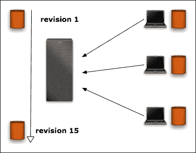
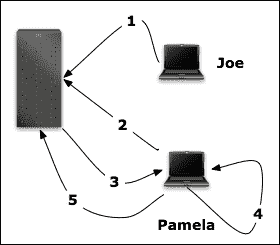
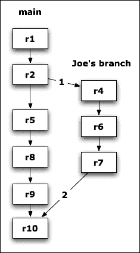
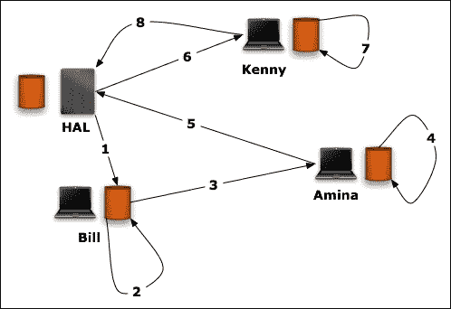
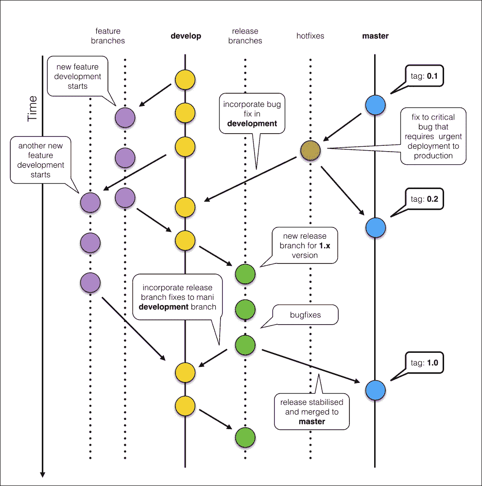
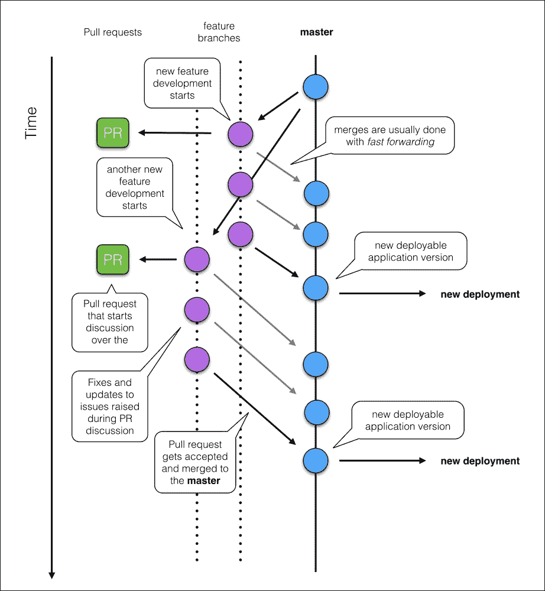
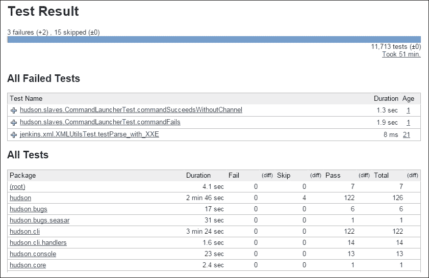
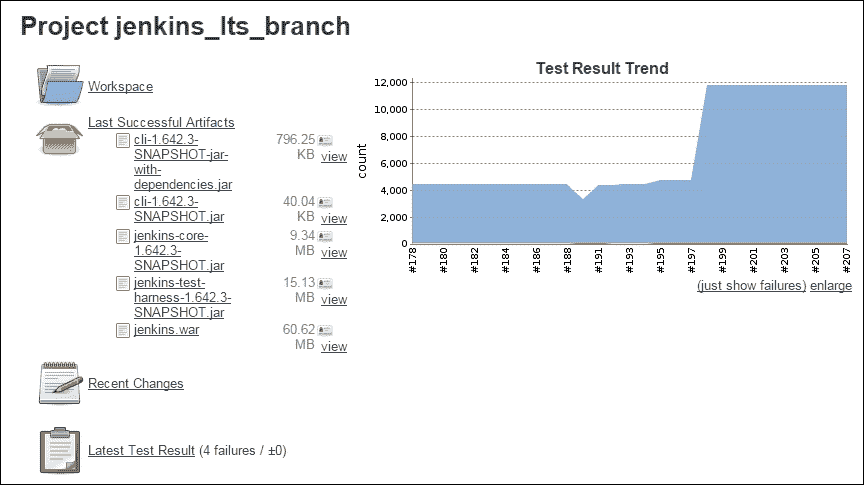
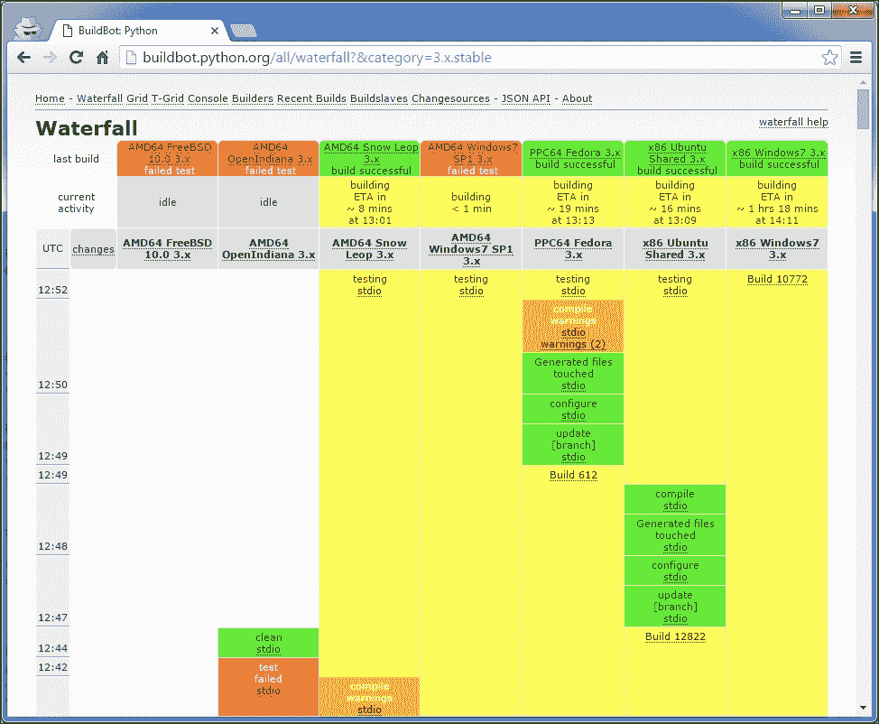
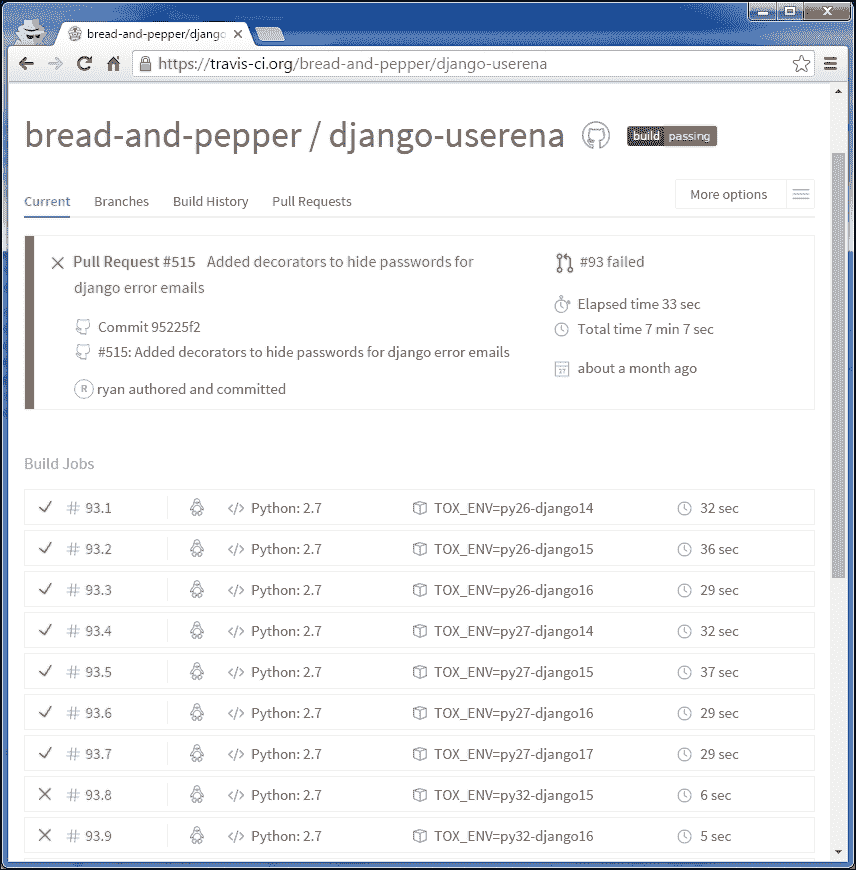

# 第八章：管理代码

在涉及多人的软件项目上工作是困难的。一切都变慢并变得更加困难。这是由于几个原因。本章将揭示这些原因，并尝试提供一些对抗它们的方法。

本章分为两部分，分别解释：

+   如何使用版本控制系统

+   如何建立持续开发流程

首先，代码库的演变非常重要，需要跟踪所有的更改，尤其是当许多开发人员在其上工作时。这就是**版本控制系统**的作用。

接下来，即使没有直接连接在一起的几个大脑仍然可以在同一个项目上工作。他们有不同的角色并且在不同的方面工作。因此，缺乏全局可见性会导致对其他人正在进行的工作和正在做的事情产生很多困惑。这是不可避免的，必须使用一些工具来提供持续的可见性并减轻问题。这是通过建立一系列持续开发流程的工具来实现的，如**持续集成**或**持续交付**。

现在我们将详细讨论这两个方面。

# 版本控制系统

**版本控制系统**（**VCS**）提供了一种分享、同步和备份任何类型文件的方法。它们分为两个家族：

+   集中式系统

+   分布式系统

## 集中式系统

集中式版本控制系统基于一个保存文件并允许人们检入和检出对这些文件所做更改的单个服务器。原则非常简单——每个人都可以在自己的系统上获取文件的副本并对其进行操作。从那里，每个用户都可以将他/她的更改提交到服务器。它们将被应用并且*修订*号将被提升。然后其他用户将能够通过*更新*来同步他们的*仓库*副本以获取这些更改。

仓库通过所有的提交而发展，系统将所有修订版本存档到数据库中，以撤消任何更改或提供有关已完成的工作的信息：

图 1

在这种集中式配置中，每个用户都负责将他/她的本地仓库与主要仓库同步，以获取其他用户的更改。这意味着当本地修改的文件已被其他人更改并检入时，可能会发生一些冲突。在这种情况下，冲突解决机制是在用户系统上进行的，如下图所示：

图 2

这将帮助您更好地理解：

1.  Joe 提交了一个更改。

1.  Pamela 试图在同一个文件上进行更改检入。

1.  服务器抱怨她的文件副本已经过时。

1.  Pamela 更新了她的本地副本。版本控制软件可能能够无缝地合并这两个版本（即，没有冲突）。

1.  Pamela 提交了一个包含 Joe 和她自己最新更改的新版本。

这个过程在涉及少数开发人员和少量文件的小型项目中是完全可以的。但对于更大的项目来说就会有问题。例如，复杂的更改涉及大量文件，这是耗时的，并且在整个工作完成之前将所有内容保留在本地是不可行的。这种方法的问题包括：

+   这是危险的，因为用户可能会保留他/她的计算机更改，而这些更改不一定被备份

+   在检查之前很难与其他人分享，而在完成之前分享它会使仓库处于不稳定状态，因此其他用户不会想要分享

集中式版本控制系统通过提供*分支*和*合并*来解决了这个问题。可以从主要修订流中分叉出来，然后再回到主要流中。

在*图 3*中，乔从修订版 2 开始创建一个新的分支来开发一个新功能。每次检入更改时，主流和他的分支中的修订版都会增加。在第 7 个修订版，乔完成了他的工作，并将更改提交到主干（主分支）。这通常需要一些冲突解决。

但是，尽管它们有优势，集中式版本控制系统也有一些缺陷：

+   分支和合并是非常难处理的。它可能变成一场噩梦。

+   由于系统是集中式的，离线提交更改是不可能的。这可能导致用户在重新联机时向服务器进行大量的单一提交。最后，对于像 Linux 这样的项目来说，它并不适用得很好，许多公司永久地维护着软件的自己的分支，并且没有每个人都有账户的中央仓库。

对于后者，一些工具使得离线工作成为可能，比如 SVK，但更根本的问题是集中式版本控制系统的工作方式。

图 3

尽管存在这些缺陷，集中式版本控制系统在许多公司中仍然非常受欢迎，主要是由于企业环境的惯性。许多组织使用的集中式版本控制系统的主要示例是**Subversion**（**SVN**）和**Concurrent Version System**（**CVS**）。集中式架构对版本控制系统的明显问题是为什么大多数开源社区已经转向更可靠的**分布式版本控制系统**（**DVCS**）的架构。

## 分布式系统

分布式版本控制系统是对集中式版本控制系统缺陷的答案。它不依赖于人们使用的主服务器，而是依赖于点对点的原则。每个人都可以拥有和管理自己独立的项目仓库，并将其与其他仓库同步：

图 4

在*图 4*中，我们可以看到这样一个系统的使用示例：

1.  比尔从 HAL 的仓库*拉取*文件。

1.  比尔对文件进行了一些更改。

1.  阿米娜从比尔的仓库*拉取*文件。

1.  阿米娜也改变了文件。

1.  阿米娜*推送*更改到 HAL。

1.  肯尼从 HAL*拉取*文件。

1.  肯尼做出了改变。

1.  肯尼定期*推送*他的更改到 HAL。

关键概念是人们*推送*和*拉取*文件到其他仓库，这种行为会根据人们的工作方式和项目管理方式而改变。由于不再有主要仓库，项目的维护者需要为人们*推送*和*拉取*更改定义一种策略。

此外，当人们使用多个仓库时，他们必须更加聪明。在大多数分布式版本控制系统中，修订号是针对每个仓库的，没有全局的修订号可以供任何人参考。因此，必须使用*标签*来使事情更清晰。它们是可以附加到修订版的文本标签。最后，用户需要负责备份他们自己的仓库，而在集中式基础设施中，通常是管理员设置备份策略。

### 分布式策略

当然，在公司环境中，如果所有人都朝着同一个目标努力工作，使用分布式版本控制系统仍然需要一个中央服务器。但是，该服务器的目的与集中式版本控制系统中的完全不同。它只是一个中心，允许所有开发人员在一个地方共享他们的更改，而不是在彼此的仓库之间进行拉取和推送。这样一个单一的中央仓库（通常称为*上游*）也作为所有团队成员个人仓库中跟踪的所有更改的备份。

可以采用不同的方法与 DVCS 中央存储库共享代码。最简单的方法是设置一个像常规集中式服务器一样运行的服务器，项目的每个成员都可以将自己的更改推送到一个公共流中。但这种方法有点简单化。它没有充分利用分布式系统，因为人们将使用推送和拉取命令的方式与集中式系统相同。

另一种方法是在服务器上提供几个具有不同访问级别的存储库：

+   **不稳定** **存储库**是每个人都可以推送更改的地方。

+   **稳定** **存储库**对于除发布经理之外的所有成员都是只读的。他们被允许从不稳定的存储库中拉取更改并决定应该合并什么。

+   各种**发布** **存储库**对应于发布，并且是只读的，正如我们将在本章后面看到的那样。

这使人们可以贡献，管理者可以审查更改，然后再将其提交到稳定的存储库。无论如何，根据所使用的工具，这可能是太多的开销。在许多分布式版本控制系统中，这也可以通过适当的分支策略来处理。

其他策略可以根据 DVCS 提供的无限组合进行制定。例如，使用 Git（[`git-scm.com/`](http://git-scm.com/)）的 Linux 内核基于星型模型，Linus Torvalds 维护官方存储库，并从一组他信任的开发人员那里拉取更改。在这种模型中，希望向内核推送更改的人将尝试将它们推送给受信任的开发人员，以便通过他们达到 Linus。

## 集中式还是分布式？

忘记集中式版本控制系统。

让我们诚实一点。集中式版本控制系统是过去的遗物。在大多数人都有全职远程工作的机会时，受到集中式 VCS 所有缺陷的限制是不合理的。例如，使用 CVS 或 SVN 时，您无法在离线时跟踪更改。这太愚蠢了。当您的工作场所的互联网连接暂时中断或中央存储库崩溃时，您该怎么办？您应该忘记所有的工作流程，只允许更改堆积直到情况改变，然后将其作为一个巨大的非结构化更新提交吗？不！

此外，大多数集中式版本控制系统无法有效处理分支方案。分支是一种非常有用的技术，可以让您在许多人在多个功能上工作的项目中限制合并冲突的数量。在 SVN 中，分支是如此荒谬，以至于大多数开发人员都尽量避免使用它。相反，大多数集中式 VCS 提供了一些文件锁定原语，应该被视为任何版本控制系统的反模式。关于每个版本控制工具的悲哀事实是，如果它包含危险的选项，您团队中的某个人最终将开始每天使用它。锁定是这样一个功能，它虽然减少了合并冲突，但会极大地降低整个团队的生产力。通过选择不允许这种糟糕工作流的版本控制系统，您正在创造一种更有可能使您的开发人员有效使用它的情况。

## 如果可以，请使用 Git

Git 目前是最流行的分布式版本控制系统。它是由 Linus Torvalds 创建的，用于维护 Linux 内核的版本，当其核心开发人员需要从之前使用的专有 BitKeeper 辞职时。

如果您尚未使用任何版本控制系统，则应从头开始使用 Git。如果您已经使用其他工具进行版本控制，请无论如何学习 Git。即使您的组织在不久的将来不愿切换到 Git，您也应该这样做，否则您可能会成为一个活化石。

我并不是说 Git 是最终和最好的 DVCS 版本控制系统。它肯定有一些缺点。最重要的是，它不是一个易于使用的工具，对新手来说非常具有挑战性。Git 的陡峭学习曲线已经成为网络上许多笑话的来源。可能有一些版本控制系统对许多项目表现更好，开源 Git 竞争者的完整列表会相当长。无论如何，Git 目前是最受欢迎的 DVCS，因此*网络效应*确实对它有利。

简而言之，网络效应导致使用流行工具的整体效益大于使用其他工具，即使稍微更好，也是因为其高度的流行（这就是 VHS 击败 Betamax 的原因）。很可能你的组织中的人，以及新员工，对 Git 都有一定的熟练程度，因此集成这个 DVCS 的成本会比尝试一些不那么流行的工具要低。

无论如何，了解更多并熟悉其他分布式版本控制系统总是好的。Git 最受欢迎的开源竞争对手是 Mercurial、Bazaar 和 Fossil。第一个特别好，因为它是用 Python 编写的，并且是 CPython 源代码的官方版本控制系统。有迹象表明，这种情况可能会在不久的将来发生变化，所以当你读到这本书的时候，CPython 开发人员可能已经在使用 Git 了。但这并不重要。这两个系统都很棒。如果没有 Git，或者它不那么受欢迎，我肯定会推荐 Mercurial。它的设计显然很美。它肯定没有 Git 那么强大，但对初学者来说更容易掌握。

## Git flow 和 GitHub flow

与 Git 一起工作的非常流行和标准化的方法简称为**Git flow**。以下是该流程的主要规则的简要描述：

+   通常有一个主要的工作分支，通常称为`develop`，所有最新版本应用的开发都在这里进行。

+   新项目功能是在称为*功能分支*的单独分支上实现的，这些分支总是从`develop`分支开始。当功能完成并且代码经过适当测试后，该分支会合并回`develop`。

+   当`develop`中的代码稳定下来（没有已知的错误）并且需要发布新的应用程序版本时，会创建一个新的*发布分支*。这个发布分支通常需要额外的测试（广泛的 QA 测试、集成测试等），所以一定会发现新的错误。如果发布分支包括额外的更改（如错误修复），它们最终需要合并回`develop`分支。

+   当*发布分支*上的代码准备部署/发布时，它会合并到`master`分支，并且`master`上的最新提交会被标记为适当的版本标签。除了`release`分支，没有其他分支可以合并到`master`。唯一的例外是需要立即部署或发布的紧急修复。

+   需要紧急发布的热修复总是在从`master`开始的单独分支上实现。修复完成后，它会合并到`develop`和`master`分支。热修复分支的合并就像普通的发布分支一样进行，因此必须正确标记，并相应地修改应用程序版本标识符。

*图 5*中展示了*Git flow*的视觉示例。对于那些从未以这种方式工作过，也从未使用过分布式版本控制系统的人来说，这可能有点压倒性。无论如何，如果你的组织没有任何正式的工作流程，值得尝试。它有多重好处，也解决了真正的问题。对于多名程序员团队，他们正在开发许多独立功能，并且需要为多个版本提供持续支持时，它尤其有用。

如果您想使用持续部署流程来实现持续交付，这种方法也很方便，因为在您的组织中始终清楚哪个代码版本代表了您的应用程序或服务的可交付版本。对于开源项目来说，它也是一个很好的工具，因为它为用户和活跃的贡献者提供了很好的透明度。

图 5 展示了 Git 流程的视觉呈现

因此，如果您认为这个对*Git 流程*的简短总结有点意义，并且还没有吓到您，那么您应该深入研究该主题的在线资源。很难说出这个工作流的原始作者是谁，但大多数在线来源都指向 Vincent Driessen。因此，学习*Git 流程*的最佳起点材料是他的在线文章，标题为*成功的 Git* *分支模型*（参考[`nvie.com/posts/a-successful-git-branching-model/`](http://nvie.com/posts/a-successful-git-branching-model/)）。

像其他流行的方法一样，*Git 流程*在互联网上受到了很多程序员的批评。Vincent Driessen 的文章中最受评论的事情是（严格技术性的）规则，即每次合并都应该创建一个代表该合并的新人工提交。Git 有一个选项可以进行*快进*合并，Vincent 不鼓励使用该选项。当然，这是一个无法解决的问题，因为执行合并的最佳方式完全是组织 Git 正在使用的主观问题。无论如何，*Git 流程*的真正问题在于它显然很复杂。完整的规则集非常长，因此很容易犯一些错误。您很可能希望选择一些更简单的东西。

GitHub 使用了这样的流程，并由 Scott Chacon 在他的博客上描述（参考[`scottchacon.com/2011/08/31/github-flow.html`](http://scottchacon.com/2011/08/31/github-flow.html)）。它被称为**GitHub 流程**，与*Git 流程*非常相似：

+   主分支中的任何内容都可以部署

+   新功能是在单独的分支上实现的

与*Git 流程*的主要区别在于简单性。只有一个主要开发分支（`master`），它始终是稳定的（与*Git 流程*中的`develop`分支相反）。也没有发布分支，而且非常强调对代码进行标记。在 GitHub 上没有这样的需要，因为他们说，当某些东西合并到主分支时，通常会立即部署到生产环境。图 6 展示了 GitHub 流程示例的图表。

GitHub 流程似乎是一个适合希望为其项目设置持续部署流程的团队的良好且轻量级的工作流。当然，这样的工作流对于具有严格版本号概念的任何项目来说都是不可行的，至少没有进行任何修改。重要的是要知道*始终可部署* `master`分支的主要假设是，没有适当的自动化测试和构建程序就无法保证。这就是持续集成系统要处理的问题，我们稍后会讨论这个问题。以下是一个展示 GitHub 流程示例的图表：

图 6 展示了 GitHub 流程的视觉呈现

请注意，*Git flow*和*GitHub flow*都只是分支策略，所以尽管它们的名字中都有*Git*，但它们并不局限于单一的分布式版本控制系统。*Git flow*的官方文章提到了在执行合并时应该使用的特定`git`命令参数，但这个基本思想几乎可以轻松应用于几乎任何其他分布式版本控制系统。事实上，由于它建议如何处理合并，Mercurial 似乎是更好的工具来使用这种特定的分支策略！*GitHub flow*也是一样。这是唯一一种带有一点特定开发文化的分支策略，因此它可以在任何允许你轻松创建和合并代码分支的版本控制系统中使用。

最后一点要记住的是，没有一种方法论是铁板一块，也没有人强迫你使用它。它们被创造出来是为了解决一些现有的问题，并防止你犯一些常见的错误。你可以接受它们的所有规则，或者根据自己的需要修改其中一些。它们是初学者的好工具，可以轻松地避开常见的陷阱。如果你不熟悉任何版本控制系统，那么你应该从像*GitHub flow*这样的轻量级方法开始，不做任何自定义修改。只有当你对 Git 或你选择的其他工具有足够的经验时，你才应该考虑更复杂的工作流。无论如何，随着你的熟练程度越来越高，你最终会意识到没有一种完美的工作流适用于每个项目。在一个组织中运行良好的东西不一定在其他组织中也能运行良好。

# 持续开发过程

有一些过程可以极大地简化你的开发，并减少将应用程序准备好发布或部署到生产环境所需的时间。它们的名字中经常带有`continuous`，我们将在本节讨论最重要和最受欢迎的过程。需要强调的是，它们是严格的技术过程，因此它们几乎与项目管理技术无关，尽管它们可以与后者高度契合。

我们将提到的最重要的过程是：

+   持续集成

+   持续交付

+   持续部署

列出顺序很重要，因为它们中的每一个都是前一个的延伸。持续部署甚至可以简单地被认为是持续交付的变体。无论如何，我们将分别讨论它们，因为对一个组织来说只是一个微小的差异，对其他组织来说可能是至关重要的。

这些都是技术过程的事实意味着它们的实施严格依赖于适当工具的使用。它们背后的基本思想都相当简单，所以你可以构建自己的持续集成/交付/部署工具，但最好的方法是选择已经构建好的工具。这样，你就可以更多地专注于构建产品，而不是持续开发的工具链。

## 持续集成

**持续集成**，通常缩写为**CI**，是一种利用自动化测试和版本控制系统来提供完全自动化集成环境的过程。它可以与集中式版本控制系统一起使用，但在实践中，只有在使用良好的分布式版本控制系统来管理代码时，它才能充分发挥作用。

设置仓库是持续集成的第一步，这是一组从**极限编程**(**XP**)中出现的软件实践。这些原则在维基百科上清楚地描述了([`en.wikipedia.org/wiki/Continuous_integration#The_Practices`](http://en.wikipedia.org/wiki/Continuous_integration#The_Practices))，并定义了一种确保软件易于构建、测试和交付的方式。

实施持续集成的第一个和最重要的要求是拥有一个完全自动化的工作流程，可以在给定的修订版中测试整个应用程序，以决定其是否在技术上正确。技术上正确意味着它没有已知的错误，并且所有功能都按预期工作。

CI 的一般理念是在合并到主流开发分支之前始终运行测试。这只能通过开发团队中的正式安排来处理，但实践表明这不是一种可靠的方法。问题在于，作为程序员，我们倾向于过于自信，无法对我们的代码进行批判性的审视。如果持续集成仅建立在团队安排上，它将不可避免地失败，因为一些开发人员最终会跳过他们的测试阶段，并将可能有缺陷的代码提交到应始终保持稳定的主流开发分支。而且，实际上，即使是简单的更改也可能引入关键问题。

明显的解决方案是利用专用构建服务器，它在代码库发生更改时自动运行所有必需的应用程序测试。有许多工具可以简化这个过程，并且它们可以很容易地集成到诸如 GitHub 或 Bitbucket 等版本控制托管服务以及 GitLab 等自托管服务中。使用这些工具的好处是开发人员可以在本地仅运行与他当前工作相关的选定测试子集，并将潜在耗时的整个集成测试套件留给构建服务器。这确实加快了开发速度，但仍然减少了新功能破坏主流代码分支中现有稳定代码的风险。

使用专用构建服务器的另一个好处是可以在接近生产环境的环境中运行测试。开发人员还应尽可能使用与生产环境尽可能匹配的环境，并且有很好的工具可以做到这一点（例如 Vagrant）；然而，在任何组织中强制执行这一点是很困难的。您可以在一个专用的构建服务器上甚至在一个构建服务器集群上轻松实现这一点。许多 CI 工具通过利用各种虚拟化工具来确保测试始终在相同的、完全新鲜的测试环境中运行，使这一点变得更加不成问题。

拥有一个构建服务器对于创建必须以二进制形式交付给用户的桌面或移动应用程序也是必不可少的。显而易见的做法是始终在相同的环境中执行这样的构建过程。几乎每个 CI 系统都考虑到应用程序通常需要在测试/构建完成后以二进制形式下载。这样的构建结果通常被称为**构建产物**。

因为 CI 工具起源于大多数应用程序都是用编译语言编写的时代，它们大多使用术语“构建”来描述它们的主要活动。对于诸如 C 或 C ++之类的语言，这是显而易见的，因为如果不构建（编译）应用程序，则无法运行和测试。对于 Python 来说，这就显得有点不合理，因为大多数程序以源代码形式分发，并且可以在没有任何额外构建步骤的情况下运行。因此，在我们的语境中，当谈论持续集成时，“构建”和“测试”这两个术语经常可以互换使用。

### 测试每次提交

持续集成的最佳方法是在每次更改推送到中央存储库时对整个测试套件进行测试。即使一个程序员在单个分支中推送了一系列多个提交，通常也有意义对每个更改进行单独测试。如果您决定仅测试单个存储库推送中的最新更改集，那么将更难找到可能在中间某个地方引入的潜在回归问题的源头。

当然，许多分布式版本控制系统，如 Git 或 Mercurial，允许你通过提供*二分*历史更改的命令来限制搜索回归源的时间，但实际上，将其作为持续集成过程的一部分自动完成会更加方便。

当然，还有一个问题是，一些测试套件运行时间非常长，可能需要数十分钟甚至数小时才能完成。一个服务器可能无法在给定时间内处理每次提交的所有构建。这将使等待结果的时间更长。事实上，长时间运行的测试本身就是一个问题，稍后将在*问题 2-构建时间过长*部分进行描述。现在，你应该知道，你应该始终努力测试推送到仓库的每次提交。如果你没有能力在单个服务器上做到这一点，那么就建立整个构建集群。如果你使用的是付费服务，那么就支付更高价格的计划，进行更多并行构建。硬件是便宜的，你开发人员的时间不是。最终，通过拥有更快的并行构建和更昂贵的 CI 设置，你将节省更多的钱，而不是通过跳过对选定更改的测试来节省钱。

### 通过 CI 进行合并测试

现实是复杂的。如果功能分支上的代码通过了所有测试，并不意味着当它合并到稳定主干分支时构建不会失败。在*Git flow*和*GitHub flow*部分提到的两种流行的分支策略都假设合并到`master`分支的代码总是经过测试并可部署。但是如果你还没有执行合并，你怎么能确定这个假设是成立的呢？对于*Git flow*来说，这个问题相对较小（如果实施得当并且使用得当），因为它强调发布分支。但对于简单的*GitHub flow*来说，这是一个真正的问题，因为合并到`master`通常会导致冲突，并且很可能会引入测试回归。即使对于*Git flow*来说，这也是一个严重的问题。这是一个复杂的分支模型，所以当人们使用它时肯定会犯错误。因此，如果你不采取特殊预防措施，你永远无法确定合并后`master`上的代码是否会通过测试。

解决这个问题的一个方法是将合并功能分支到稳定主干分支的责任委托给你的 CI 系统。在许多 CI 工具中，你可以轻松地设置一个按需构建作业，该作业将在本地合并特定功能分支到稳定分支，并且只有在通过了所有测试后才将其推送到中央仓库。如果构建失败，那么这样的合并将被撤销，使稳定分支保持不变。当然，在快节奏的项目中，这种方法会变得更加复杂，因为同时开发许多功能分支会存在高风险的冲突，这些冲突无法被任何 CI 系统自动解决。当然，针对这个问题也有解决方案，比如在 Git 中进行变基。

如果你考虑进一步实施持续交付流程，或者如果你的工作流程严格规定稳定分支中的所有内容都是可发布的，那么将任何东西合并到版本控制系统的稳定分支中实际上是必须的。

### 矩阵测试

如果你的代码需要在不同的环境中进行测试，矩阵测试是一个非常有用的工具。根据你的项目需求，你的 CI 解决方案对这种功能的直接支持可能更或更少需要。

解释矩阵测试的最简单方法是以一些开源的 Python 软件包为例。例如，Django 是一个严格指定支持的 Python 语言版本的项目。1.9.3 版本列出了运行 Django 代码所需的 Python 2.7、Python 3.4 和 Python 3.5 版本。这意味着每次 Django 核心开发人员对项目进行更改时，必须在这三个 Python 版本上执行完整的测试套件，以支持这一说法。如果在一个环境中甚至有一个测试失败，整个构建必须标记为失败，因为可能违反了向后兼容性约束。对于这样一个简单的情况，你不需要 CI 的任何支持。有一个很棒的 Tox 工具（参见[`tox.readthedocs.org/`](https://tox.readthedocs.org/)），除了其他功能外，它还允许你在隔离的虚拟环境中轻松运行不同 Python 版本的测试套件。这个实用程序也可以很容易地用于本地开发。

但这只是最简单的例子。不少应用程序必须在多个环境中进行测试，其中必须测试完全不同的参数。举几个例子：

+   不同的操作系统

+   不同的数据库

+   不同版本的后备服务

+   不同类型的文件系统

完整的组合形成了一个多维环境参数矩阵，这就是为什么这样的设置被称为矩阵测试。当你需要这样一个深层测试工作流程时，很可能需要一些集成支持来进行矩阵测试。对于可能的组合数量很大，你还需要一个高度可并行化的构建过程，因为每次在矩阵上运行都需要大量的工作来自你的构建服务器。在某些情况下，如果你的测试矩阵有太多维度，你将被迫做一些权衡。

## 持续交付

持续交付是持续集成思想的一个简单延伸。这种软件工程方法旨在确保应用程序可以随时可靠地发布。持续交付的目标是在短时间内发布软件。它通常通过允许将应用程序的变更逐步交付到生产环境中来降低成本和发布软件的风险。

构建成功的持续交付过程的主要先决条件是：

+   可靠的持续集成过程

+   自动部署到生产环境的流程（如果项目有生产环境的概念）

+   一个明确定义的版本控制系统工作流程或分支策略，允许你轻松定义哪个软件版本代表可发布的代码

在许多项目中，自动化测试并不足以可靠地告诉你软件的给定版本是否真的准备好发布。在这种情况下，通常由熟练的 QA 人员执行额外的手动用户验收测试。根据你的项目管理方法论，这可能还需要客户的批准。这并不意味着如果你的验收测试必须由人工手动执行，你就不能使用*Git flow*、*GitHub flow*或类似的分支策略。这只是将你的稳定和发布分支的语义从*准备部署*更改为*准备进行用户验收测试和批准*。

此外，前面的段落并不改变代码部署应始终自动化的事实。我们已经在第六章中讨论了一些工具和自动化的好处，*部署代码*。正如在那里所述，它将始终降低新版本发布的成本和风险。此外，大多数可用的 CI 工具都允许你设置特殊的构建目标，而不是测试，将为你执行自动化部署。在大多数持续交付过程中，这通常是由授权人员手动触发的，当他们确信已经获得了必要的批准并且所有验收测试都以成功结束时。

## 持续部署

持续部署是将持续交付推向更高水平的过程。对于所有验收测试都是自动化的项目来说，这是一个完美的方法，而且不需要客户的手动批准。简而言之，一旦代码合并到稳定分支（通常是`master`），它就会自动部署到生产环境。

这种方法似乎非常好和稳健，但并不经常使用，因为很难找到一个不需要在发布新版本之前进行手动 QA 测试和某人批准的项目。无论如何，这是可行的，一些公司声称他们正在以这种方式工作。

为了实现持续部署，你需要与持续交付过程相同的基本先决条件。此外，对合并到稳定分支的更加谨慎的方法通常是必需的。在持续集成中合并到`master`的内容通常会立即进入生产环境。因此，将合并任务交给你的 CI 系统是合理的，就像在*通过 CI 进行合并测试*部分中所解释的那样。

## 持续集成的流行工具

现在有大量的持续集成工具可供选择。它们在易用性和可用功能上有很大的差异，几乎每一个都有一些其他工具缺乏的独特功能。因此，很难给出一个好的一般性建议，因为每个项目的需求完全不同，开发工作流也不同。当然，有一些很棒的免费开源项目，但付费托管服务也值得研究。这是因为尽管像 Jenkins 或 Buildbot 这样的开源软件可以免费安装，但错误地认为它们是免费运行的。拥有自己的 CI 系统还需要硬件和维护成本。在某些情况下，支付这样的服务可能比支付额外的基础设施成本和花费时间解决开源 CI 软件中的任何问题更便宜。但是，你需要确保将代码发送到任何第三方服务是否符合公司的安全政策。

在这里，我们将回顾一些流行的免费开源工具，以及付费托管服务。我真的不想为任何供应商做广告，所以我们只讨论那些对开源项目免费提供的工具，以证明这种相当主观的选择。我们不会给出最佳建议，但我们会指出任何解决方案的优缺点。如果你还在犹豫不决，下一节描述常见持续集成陷阱的部分应该能帮助你做出明智的决定。

### Jenkins

Jenkins ([`jenkins-ci.org`](https://jenkins-ci.org)) 似乎是最受欢迎的持续集成工具。它也是这一领域最古老的开源项目之一，与 Hudson 一起（这两个项目的开发分离，Jenkins 是 Hudson 的一个分支）。

图 7 Jenkins 主界面预览

Jenkins 是用 Java 编写的，最初主要用于构建用 Java 语言编写的项目。这意味着对于 Java 开发人员来说，它是一个完美的 CI 系统，但如果您想将其与其他技术栈一起使用，可能需要花费一些精力。

Jenkins 的一个重大优势是其非常广泛的功能列表，这些功能已经直接实现在 Jenkins 中。从 Python 程序员的角度来看，最重要的功能是能够理解测试结果。Jenkins 不仅提供有关构建成功的简单二进制信息，还能够以表格和图形的形式呈现运行期间执行的所有测试的结果。当然，这不会自动工作，您需要以特定格式提供这些结果（默认情况下，Jenkins 理解 JUnit 文件）在构建期间。幸运的是，许多 Python 测试框架能够以机器可读的格式导出结果。

以下是 Jenkins 在其 Web UI 中单元测试结果的示例演示：

图 8 展示了 Jenkins 中单元测试结果

以下截图说明了 Jenkins 如何呈现额外的构建信息，例如趋势或可下载的构建产物：

图 9 示例 Jenkins 项目上的测试结果趋势图

令人惊讶的是，Jenkins 的大部分功能并不来自其内置功能，而是来自一个庞大的免费插件库。从干净的安装中可用的内容对于 Java 开发人员可能很棒，但使用不同技术的程序员将需要花费大量时间使其适用于其项目。甚至对 Git 的支持也是由一些插件提供的。

Jenkins 如此易于扩展是很棒的，但这也有一些严重的缺点。您最终将依赖于安装的插件来驱动您的持续集成过程，这些插件是独立于 Jenkins 核心开发的。大多数流行插件的作者都会尽力使其与 Jenkins 的最新版本保持兼容并及时更新。然而，较小社区的扩展将更新频率较低，有一天您可能不得不放弃它们或推迟核心系统的更新。当需要紧急更新（例如安全修复）时，这可能是一个真正的问题，但您的 CI 过程中一些关键插件将无法与新版本一起使用。

提供主 CI 服务器的基本 Jenkins 安装也能够执行构建。这与其他 CI 系统不同，其他系统更加注重分发并严格区分主构建服务器和从构建服务器。这既有利也有弊。一方面，它允许您在几分钟内设置一个完全工作的 CI 服务器。当然，Jenkins 支持将工作推迟到构建从节点，因此在未来需要时可以进行扩展。另一方面，Jenkins 通常性能不佳，因为它部署在单服务器设置中，其用户抱怨性能问题而未为其提供足够的资源。向 Jenkins 集群添加新的构建节点并不困难。对于那些习惯于单服务器设置的人来说，这似乎更多是一种心理挑战而不是技术问题。

### Buildbot

Buildbot ([`buildbot.net/`](http://buildbot.net/))是一个用 Python 编写的软件，可以自动化任何类型的软件项目的编译和测试周期。它可以配置为对源代码存储库上的每个更改生成一些构建，启动一些测试，然后提供一些反馈：

图 10 CPython 3.x 分支的 Buildbot 瀑布视图

例如，CPython 核心使用此工具，可以在[`buildbot.python.org/all/waterfall?&category=3.x.stable`](http://buildbot.python.org/all/waterfall?&category=3.x.stable)中找到。

Buildbot 的默认构建结果表示是一个瀑布视图，如*图 10*所示。每一列对应一个**构建**，由**步骤**组成，并与一些**构建** **从机**相关联。整个系统由构建主机驱动：

+   构建主机集中和驱动一切

+   构建是用于构建应用程序并对其运行测试的一系列步骤

+   一个**步骤**是一个原子命令，例如：

+   检出项目的文件

+   构建应用程序

+   运行测试

构建从机是负责运行构建的机器。只要它能够连接到构建主机，它可以位于任何位置。由于这种架构，Buildbot 的扩展性非常好。所有繁重的工作都是在构建从机上完成的，你可以拥有任意数量的构建从机。

Buildbot 的设计非常简单和清晰，使其非常灵活。每个构建步骤只是一个单独的命令。Buildbot 是用 Python 编写的，但它完全与语言无关。因此，构建步骤可以是任何东西。进程退出代码用于决定步骤是否以成功结束，步骤命令的所有标准输出默认情况下都会被捕获。大多数测试工具和编译器遵循良好的设计实践，并使用适当的退出代码指示失败，并在`stdout`或`stderr`输出流中返回可读的错误/警告消息。如果这不是真的，通常可以很容易地用 Bash 脚本包装它们。在大多数情况下，这是一个简单的任务。由于这个原因，许多项目可以只需很少的努力就可以与 Buildbot 集成。

Buildbot 的另一个优势是，它支持许多版本控制系统，无需安装任何额外的插件：

+   CVS

+   Subversion

+   Perforce

+   Bzr

+   Darcs

+   Git

+   Mercurial

+   Monotone

Buildbot 的主要缺点是缺乏用于呈现构建结果的高级呈现工具。例如，其他项目（如 Jenkins）可以考虑在构建过程中运行的单元测试。如果你用适当的格式（通常是 XML）呈现测试结果数据，它们可以以表格和图形的形式呈现所有测试。Buildbot 没有这样的内置功能，这是它为了灵活性和简单性所付出的代价。如果你需要一些额外的功能，你需要自己构建它们或者寻找一些定制的扩展。另一方面，由于这种简单性，更容易推理 Buildbot 的行为并维护它。因此，总是有一个权衡。

### Travis CI

Travis CI ([`travis-ci.org/`](https://travis-ci.org/))是一个以软件即服务形式出售的持续集成系统。对企业来说是付费服务，但在 GitHub 上托管的开源项目中可以完全免费使用。

图 11 django-userena 项目的 Travis CI 页面显示了构建矩阵中的失败构建

当然，这是它定价计划中的免费部分，这使它非常受欢迎。目前，它是 GitHub 上托管的项目中最受欢迎的 CI 解决方案之一。但与 Buildbot 或 Jenkins 等旧项目相比，最大的优势在于构建配置的存储方式。所有构建定义都在项目存储库的根目录中的一个`.travis.yml`文件中提供。Travis 只与 GitHub 一起工作，因此如果你启用了这样的集成，你的项目将在每次提交时进行测试，只要有一个`.travis.yml`文件。

在项目的代码存储库中拥有整个 CI 配置确实是一个很好的方法。这使得整个过程对开发人员来说更加清晰，也允许更灵活性。在必须提供构建配置以单独构建服务器的系统中（使用 Web 界面或通过服务器配置），当需要向测试装置添加新内容时，总会有一些额外的摩擦。在一些只有选定员工被授权维护 CI 系统的组织中，这确实减慢了添加新构建步骤的过程。而且，有时需要使用完全不同的程序测试代码的不同分支。当构建配置在项目源代码中可用时，这样做就容易得多。

Travis 的另一个重要特性是它强调在干净的环境中运行构建。每个构建都在一个完全新的虚拟机中执行，因此没有一些持久状态会影响构建结果的风险。Travis 使用一个相当大的虚拟机镜像，因此您可以使用许多开源软件和编程环境，而无需额外安装。在这个隔离的环境中，您拥有完全的管理权限，因此可以下载和安装任何您需要执行构建的东西，而`.travis.yml`文件的语法使其非常容易。不幸的是，您对可用的操作系统没有太多选择。Travis 不允许提供自己的虚拟机镜像，因此您必须依赖提供的非常有限的选项。通常根本没有选择，所有构建都必须在某个版本的 Ubuntu 或 Mac OS X 中进行（在撰写本书时仍处于实验阶段）。有时可以选择系统的某个旧版本或新测试环境的预览，但这种可能性总是暂时的。总是有办法绕过这一点。您可以在 Travis 提供的虚拟机内运行另一个虚拟机。这应该是一些允许您在项目源代码中轻松编码虚拟机配置的东西，比如 Vagrant 或 Docker。但这将增加构建的时间，因此这不是您将采取的最佳方法。以这种方式堆叠虚拟机可能不是在不同操作系统下执行测试的最佳和最有效的方法。如果这对您很重要，那么这表明 Travis 不适合您。

Travis 最大的缺点是它完全锁定在 GitHub 上。如果您想在开源项目中使用它，那么这不是什么大问题。对于企业和闭源项目，这基本上是一个无法解决的问题。

### GitLab CI

GitLab CI 是 GitLab 项目的一部分。它既可以作为付费服务（企业版）提供，也可以作为您自己基础设施上托管的开源项目（社区版）提供。开源版本缺少一些付费服务功能，但在大多数情况下，它是任何公司从管理版本控制存储库和持续集成的软件中所需要的一切。

GitLab CI 在功能集方面与 Travis 非常相似。它甚至使用存储在`.gitlab-ci.yml`文件中的非常相似的 YAML 语法进行配置。最大的区别在于，GitLab 企业版定价模型不为开源项目提供免费帐户。社区版本身是开源的，但您需要拥有一些自己的基础设施才能运行它。

与 Travis 相比，GitLab 在执行环境上具有明显的优势。不幸的是，在环境隔离方面，GitLab 的默认构建运行程序略逊一筹。名为 Gitlab Runner 的进程在相同的环境中执行所有构建步骤，因此它更像 Jenkins 或 Buildbot 的从属服务器。幸运的是，它与 Docker 兼容，因此你可以通过基于容器的虚拟化轻松添加更多隔离，但这需要一些努力和额外的设置。在 Travis 中，你可以立即获得完全隔离。

## 选择合适的工具和常见陷阱

正如前面所说，没有完美的 CI 工具适用于每个项目，更重要的是，适用于每个组织和使用的工作流。我只能为托管在 GitHub 上的开源项目提供一个建议。对于平台无关代码的小型代码库，Travis CI 似乎是最佳选择。它易于开始，并且几乎可以立即获得最小量的工作的满足感。

对于闭源项目来说，情况完全不同。可能需要在不同的设置中评估几个 CI 系统，直到能够决定哪一个最适合你。我们只讨论了四种流行的工具，但这应该是一个相当代表性的群体。为了让你的决定变得更容易一些，我们将讨论一些与持续集成系统相关的常见问题。在一些可用的 CI 系统中，可能会比其他系统更容易犯某些类型的错误。另一方面，一些问题可能对每个应用程序都不重要。我希望通过结合你的需求的知识和这个简短的总结，能够更容易地做出正确的第一个决定。

### 问题 1 - 构建策略太复杂

一些组织喜欢在合理的水平之外正式化和结构化事物。在创建计算机软件的公司中，这在两个领域尤其真实：项目管理工具和 CI 服务器上的构建策略。

过度配置项目管理工具通常会导致在 JIRA（或任何其他管理软件）上处理问题工作流程变得如此复杂，以至于无法用图表表示。如果你的经理有这种配置/控制狂，你可以和他谈谈，或者换一个经理（即：辞职）。不幸的是，这并不能可靠地保证在这方面有任何改进。

但是当涉及到 CI 时，我们可以做更多。持续集成工具通常由我们开发人员维护和配置。这些是我们的工具，应该改善我们的工作。如果有人对每个开关和旋钮都有无法抗拒的诱惑，那么他应该远离 CI 系统的配置，尤其是如果他的主要工作是整天说话和做决定。

没有必要制定复杂的策略来决定哪个提交或分支应该被测试。也不需要将测试限制在特定的标签上。也不需要排队提交以执行更大的构建。也不需要通过自定义提交消息禁用构建。你的持续集成过程应该简单易懂。测试一切！一直测试！就这样！如果没有足够的硬件资源来测试每个提交，那就增加更多的硬件。记住，程序员的时间比硅片更贵。

### 问题 2 - 构建时间太长

长时间的构建是任何开发人员的性能杀手。如果你需要等待几个小时才能知道你的工作是否做得正确，那么你就无法高效地工作。当然，在测试功能时有其他事情要做会有所帮助。无论如何，作为人类，我们真的很擅长多任务处理。在不同问题之间切换需要时间，并且最终会将我们的编程性能降至零。在同时处理多个问题时，保持专注是非常困难的。

解决方案非常简单：不惜一切代价保持构建速度快。首先，尝试找到瓶颈并对其进行优化。如果构建服务器的性能是问题，那么尝试扩展。如果这没有帮助，那么将每个构建拆分成较小的部分并并行化。

有很多解决方案可以加快缓慢的构建测试，但有时候这个问题无法解决。例如，如果你有自动化的浏览器测试或需要对外部服务进行长时间调用，那么很难在某个硬性限制之外提高性能。例如，当你的 CI 中自动接受测试的速度成为问题时，你可以放松*测试一切，始终测试*的规则。对程序员来说，最重要的通常是单元测试和静态分析。因此，根据你的工作流程，缓慢的浏览器测试有时可以推迟到准备发布时。

解决缓慢构建运行的另一个方法是重新思考应用程序的整体架构设计。如果测试应用程序需要很长时间，很多时候这是一个信号，表明它应该被拆分成几个可以独立开发和测试的组件。将软件编写为庞大的单体是通往失败的最短路径之一。通常，任何软件工程过程都会因为软件没有适当模块化而失败。

### 问题 3 - 外部作业定义

一些持续集成系统，特别是 Jenkins，允许你完全通过 Web UI 设置大部分构建配置和测试过程，而无需触及代码存储库。但你真的应该避免将除构建步骤/命令的简单入口之外的任何东西放入外部系统。这是一种可能会带来麻烦的 CI 反模式。

你的构建和测试过程通常与你的代码库紧密相关。如果你将其整个定义存储在 Jenkins 或 Buildbot 等外部系统中，那么要对该过程进行更改将非常困难。

举一个由全局外部构建定义引入的问题的例子，假设我们有一些开源项目。最初的开发很忙碌，我们并不关心任何样式指南。我们的项目很成功，所以开发需要另一个重大发布。过了一段时间，我们从`0.x`版本移动到`1.0`，并决定重新格式化所有代码以符合 PEP 8 指南。将静态分析检查作为 CI 构建的一部分是一个很好的方法，所以我们决定将`pep8`工具的执行添加到我们的构建定义中。如果我们只有一个全局外部构建配置，那么如果需要对旧版本的代码进行改进，就会出现问题。假设应用程序的两个分支：`0.x`和`1.y`都需要修复一个关键的安全问题。我们知道 1.0 版本以下的任何内容都不符合样式指南，而新引入的针对 PEP 8 的检查将标记构建为失败。

解决问题的方法是尽可能将构建过程的定义与源代码保持接近。对于一些 CI 系统（如 Travis CI 和 GitLab CI），您默认就可以得到这样的工作流程。对于其他解决方案（如 Jenkins 和 Buildbot），您需要额外小心，以确保大部分构建过程都包含在您的代码中，而不是一些外部工具配置中。幸运的是，您有很多选择可以实现这种自动化。

+   Bash 脚本

+   Makefiles

+   Python 代码

### 问题 4 - 缺乏隔离

我们已经多次讨论了在 Python 编程时隔离的重要性。我们知道在包级别上隔离 Python 执行环境的最佳方法是使用 `virtualenv` 或 `python -m venv`。不幸的是，在测试代码以进行持续集成流程的目的时，通常还不够。测试环境应尽可能接近生产环境，而要在没有额外的系统级虚拟化的情况下实现这一点确实很困难。

在构建应用程序时，如果不确保适当的系统级隔离，可能会遇到的主要问题有：

+   在构建之间持久存在的一些状态，无论是在文件系统上还是在后备服务中（缓存、数据库等）

+   通过环境、文件系统或后备服务进行多个构建或测试的接口

+   由于生产操作系统的特定特性而可能发生的问题没有在构建服务器上被捕捉到

如果您需要对同一应用程序执行并发构建，甚至并行化单个构建，上述问题尤为棘手。

一些 Python 框架（主要是 Django）为数据库提供了一些额外的隔离级别，试图确保在运行测试之前存储将被清理。`py.test` 还有一个非常有用的扩展叫做 `pytest-dbfixtures`（参见 [`github.com/ClearcodeHQ/pytest-dbfixtures`](https://github.com/ClearcodeHQ/pytest-dbfixtures)），它甚至可以更可靠地实现这一点。无论如何，这样的解决方案会增加构建的复杂性，而不是减少它。始终在每次构建时清除虚拟机（类似于 Travis CI 的风格）似乎是一种更优雅、更简单的方法。

# 总结

我们在本章中学到了以下内容：

+   集中式和分布式版本控制系统之间有什么区别

+   为什么您应该更喜欢分布式版本控制系统而不是集中式

+   为什么 Git 应该是您选择分布式版本控制系统的首选

+   Git 的常见工作流程和分支策略是什么

+   什么是持续集成/交付/部署，以及允许您实施这些流程的流行工具是什么

下一章将解释如何清晰地记录您的代码。
