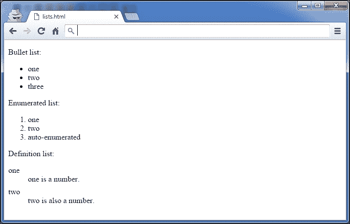
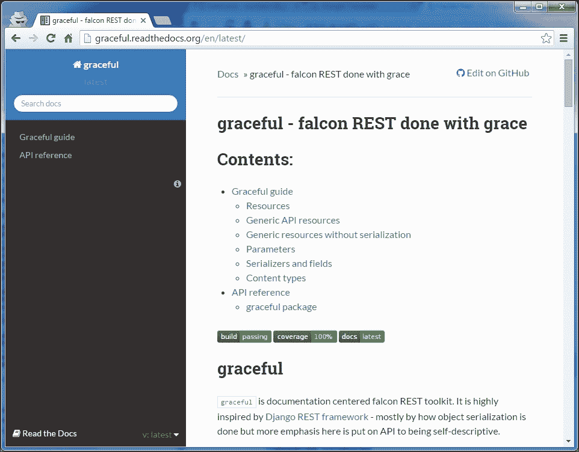

# 第九章：记录你的项目

文档经常被开发者忽视，有时也被管理者忽视。这往往是由于在开发周期结束时缺乏时间，以及人们认为自己写作水平不佳。其中一些确实写得不好，但大多数人能够制作出良好的文档。

无论如何，结果都是由匆忙写成的文档组成的混乱文档。大多数时候，开发者都讨厌做这种工作。当需要更新现有文档时，情况变得更糟。许多项目只提供质量低劣、过时的文档，因为管理者不知道如何处理它。

但在项目开始时建立文档流程，并将文档视为代码模块，可以使文档编写变得更容易。遵循一些规则时，写作甚至可以成为一种乐趣。

本章提供了一些开始记录项目的提示：

+   总结最佳实践的技术写作的七条规则

+   reStructuredText 入门，这是 Python 项目中使用的纯文本标记语法

+   构建良好项目文档的指南

# 技术写作的七条规则

写好文档在许多方面比写代码更容易。大多数开发者认为这很难，但遵循一套简单的规则后，它变得非常容易。

我们这里讨论的不是写一本诗集，而是一篇全面的文本，可以用来理解设计、API 或构成代码库的任何内容。

每个开发者都能够制作这样的材料，本节提供了七条规则，可以在所有情况下应用：

+   **分两步写**：先关注想法，然后再审查和塑造你的文本。

+   **针对读者群**：谁会阅读它？

+   **使用简单的风格**：保持简洁明了。使用良好的语法。

+   **限制信息的范围**：一次引入一个概念。

+   **使用现实的代码示例**："Foos"和"bars"应该避免。

+   **使用轻量但足够的方法**：你不是在写一本书！

+   **使用模板**：帮助读者养成习惯。

这些规则大多受到 Andreas Rüping 的《敏捷文档：软件项目轻量级文档的模式指南》（Wiley）的启发和改编，该书侧重于在软件项目中制作最佳文档。

## 分两步写

Peter Elbow 在《写作的力量：掌握写作过程的技巧》（牛津大学出版社）中解释说，任何人几乎不可能一次写出完美的文本。问题在于，许多开发者写文档并试图直接得到一些完美的文本。他们成功的唯一方法是在每写两个句子后停下来阅读它们并做一些修改。这意味着他们同时关注文本的内容和风格。

这对大脑来说太难了，结果往往不如预期的那么好。在完全思考其含义之前，花费了大量时间和精力来打磨文本的风格和形状。

另一种方法是放弃文本的风格和组织，专注于其内容。所有想法都被记录在纸上，无论它们是如何书写的。开发者开始写一个连续的流，不会在犯语法错误或任何与内容无关的事情时停下来。例如，只要想法被写下来，句子几乎无法理解并不重要。他/她只是以粗略的组织写下他想说的话。

通过这样做，开发者专注于他/她想要表达的内容，可能会从他/她的头脑中得到比最初想象的更多的内容。

进行自由写作时的另一个副作用是，与主题无关的其他想法会很容易浮现在脑海中。一个好的做法是，当它们出现时，在第二张纸或屏幕上把它们写下来，这样它们就不会丢失，然后回到主要写作上。

第二步是回读整个文本，并对其进行润色，使其对每个人都能理解。润色文本意味着增强其风格，纠正其错误，稍微重新组织它，并删除任何多余的信息。

当写作文档的时间有限时，一个好的做法是将这段时间分成两半——一半用于写作内容，一半用于清理和组织文本。

### 注意

专注于内容，然后是风格和整洁。

## 针对读者群

在撰写内容时，作家应考虑一个简单的问题：*谁会阅读它？*

这并不总是显而易见，因为技术文本解释了软件的工作原理，并且通常是为可能获得和使用代码的每个人而写的。读者可能是正在寻找适当技术解决方案的研究人员，或者需要用它实现功能的开发人员。设计师也可能会阅读它，以了解包是否从架构的角度符合他/她的需求。

良好的文档应遵循一个简单的规则——每个文本只应有一种读者。

这种理念使写作变得更容易。作家清楚地知道自己正在与何种读者打交道。他/她可以提供简明而准确的文档，而不是模糊地面向各种读者。

一个好的做法是提供一个简短的介绍性文本，简要解释文档的内容，并引导读者到适当的部分：

```py
Atomisator is a product that fetches RSS feeds and saves them in a database, with a filtering process.

If you are a developer, you might want to look at the API description (api.txt)

If you are a manager, you can read the features list and the FAQ (features.txt)

If you are a designer, you can read the architecture and infrastructure notes (arch.txt)
```

通过这种方式引导读者，你可能会产生更好的文档。

### 注意

在开始写作之前了解你的读者群。

## 使用简单的风格

塞思·戈丁是营销领域畅销书作家之一。你可能想阅读《Ideavirus 的释放》，哈希特图书，它可以在互联网上免费获取。

不久前，他在博客上进行了一项分析，试图理解为什么他的书卖得这么好。他列出了营销领域所有畅销书的清单，并比较了它们每句话的平均字数。

他意识到他的书每句话的字数最少（十三个字）。塞思解释说，这个简单的事实证明读者更喜欢简短而简单的句子，而不是长而时髦的句子。

通过保持句子简短和简单，你的写作将消耗更少的大脑力量来提取、处理和理解其内容。技术文档的撰写旨在为读者提供软件指南。它不是一部小说，应该更接近你的微波炉使用说明书，而不是最新的斯蒂芬·金小说。

要牢记的一些建议是：

+   使用简单的句子。句子不应超过两行。

+   每个段落应由三到四个句子组成，最多表达一个主要观点。让你的文本有呼吸空间。

+   不要重复太多。避免新闻报道风格，其中的想法一遍又一遍地重复，以确保它们被理解。

+   不要使用多种时态。大多数情况下，现在时就足够了。

+   如果你不是一个真正优秀的作家，就不要在文本中开玩笑。在技术文本中搞笑真的很难，很少有作家能掌握。如果你真的想表达一些幽默，把它放在代码示例中，你就没问题了。

### 注意

你不是在写小说，所以尽量保持风格简单。

## 限制信息范围

在软件文档中有一个简单的坏迹象——你正在寻找一些你知道存在的信息，但找不到它。在阅读目录表一段时间后，你开始在文件中使用 grep 尝试几个单词组合，但找不到你要找的东西。

当作者没有按主题组织他们的文本时，就会发生这种情况。他们可能提供了大量的信息，但它只是以单一或非逻辑的方式聚集在一起。例如，如果读者正在寻找你的应用程序的整体情况，他或她不应该阅读 API 文档——那是一个低级的问题。

为了避免这种效果，段落应该被聚集在一个有意义的标题下，全局文档标题应该用简短的短语来概括内容。

目录可以由所有章节的标题组成。

组成标题的一个简单做法是问自己，“我会在 Google 中输入什么短语来找到这个部分？”

## 使用现实的代码示例

*Foo*和*bar*是不好的用法。当读者试图理解代码片段的工作方式时，如果有一个不切实际的例子，将会使理解变得更加困难。

为什么不使用一个真实的例子呢？一个常见的做法是确保每个代码示例都可以在真实的程序中剪切和粘贴。

为了展示一个糟糕的用法示例，让我们假设我们想展示如何使用`parse()`函数：

```py
>>> from atomisator.parser import parse
>>> # Let's use it:
>>> stuff = parse('some-feed.xml')
>>> next(stuff)
{'title': 'foo', 'content': 'blabla'}

```

一个更好的例子是，当解析器知道如何使用 parse 函数返回一个 feed 内容时，它作为一个顶级函数可用：

```py
>>> from atomisator.parser import parse
>>> # Let's use it:
>>> my_feed = parse('http://tarekziade.wordpress.com/feed')
>>> next(my_feed)
{'title': 'eight tips to start with python', 'content': 'The first tip is..., ...'}

```

这种细微的差别可能听起来有些过分，但事实上它会使你的文档更有用。读者可以将这些行复制到 shell 中，理解 parse 使用 URL 作为参数，并且它返回一个包含博客条目的迭代器。

当然，提供一个现实的例子并不总是可能或可行的。这对于非常通用的代码尤其如此。即使这本书中也有一些模糊的`foo`和`bar`字符串的出现，其中名称上下文并不重要。无论如何，你应该始终努力将这种不切实际的例子的数量减少到最低。

### 注意

代码示例应该直接在真实程序中可重用。

## 使用轻量但足够的方法

在大多数敏捷方法论中，文档不是第一位的。使软件正常工作比详细的文档更重要。因此，一个好的做法，正如 Scott Ambler 在他的书《敏捷建模：极限编程和统一过程的有效实践》中所解释的那样，是定义真正的文档需求，而不是创建详尽的文档集。

例如，让我们看一个简单项目的文档示例——`ianitor`——它在 GitHub 上可用[`github.com/ClearcodeHQ/ianitor`](https://github.com/ClearcodeHQ/ianitor)。这是一个帮助在 Consul 服务发现集群中注册进程的工具，因此主要面向系统管理员。如果你看一下它的文档，你会意识到这只是一个单一的文档（`README.md`文件）。它只解释了它的工作原理和如何使用它。从管理员的角度来看，这是足够的。他们只需要知道如何配置和运行这个工具，没有其他人群预期使用`ianitor`。这个文档通过回答一个问题来限制其范围，“我如何在我的服务器上使用`ianitor`？”

## 使用模板

维基百科上的每一页都很相似。一侧有用于总结日期或事实的框。文件的开头是一个带有链接的目录，这些链接指向同一文本中的锚点。最后总是有一个参考部分。

用户习惯了。例如，他们知道他们可以快速查看目录，如果找不到所需信息，他们将直接转到参考部分，看看是否可以在该主题上找到另一个网站。这对维基百科上的任何页面都适用。你学会了*维基百科方式*，更有效率。

因此，使用模板强制了文档的通用模式，因此使人们更有效地使用它们。他们习惯了结构并知道如何快速阅读它。

为每种文档提供模板也为作者提供了快速入门。

# reStructuredText 入门

reStructuredText 也被称为 reST（参见[`docutils.sourceforge.net/rst.html`](http://docutils.sourceforge.net/rst.html)）。它是一种纯文本标记语言，在 Python 社区广泛用于文档化包。reST 的好处在于文本仍然可读，因为标记语法不像 LaTeX 那样混淆文本。

这是这样一个文档的示例：

```py
=====
Title
=====

Section 1
=========
This *word* has emphasis.

Section 2
=========

Subsection
::::::::::

Text.
```

reST 包含在`docutils`中，该软件包提供了一套脚本，可将 reST 文件转换为各种格式，如 HTML、LaTeX、XML，甚至是 S5，Eric Meyer 的幻灯片系统（参见[`meyerweb.com/eric/tools/s5`](http://meyerweb.com/eric/tools/s5)）。

作者可以专注于内容，然后根据需要决定如何呈现它。例如，Python 本身是用 reST 文档化的，然后呈现为 HTML 以构建[`docs.python.org`](http://docs.python.org)，以及其他各种格式。

开始写 reST 所需了解的最少元素是：

+   部分结构

+   列表

+   内联标记

+   文字块

+   链接

本节是语法的快速概述。更多信息可在以下网址找到快速参考：[`docutils.sourceforge.net/docs/user/rst/quickref.html`](http://docutils.sourceforge.net/docs/user/rst/quickref.html)，这是开始使用 reST 的好地方。

要安装 reStructuredText，安装`docutils`：

```py
$ pip install docutils

```

例如，由`docutils`包提供的`rst2html`脚本将根据 reST 文件生成 HTML 输出：

```py
$ more text.txt
Title
=====

content.

$ rst2html.py text.txt
<?xml version="1.0" encoding="utf-8" ?>
...
<html ...>
<head>
...
</head>
<body>
<div class="document" id="title">
<h1 class="title">Title</h1>
<p>content.</p>
</div>
</body>
</html>

```

## 部分结构

文档的标题及其各节使用非字母数字字符进行下划线。它们可以被上下划线覆盖，并且一种常见的做法是为标题使用这种双重标记，并为各节保持简单的下划线。

用于下划线部分标题的最常用字符按优先顺序排列：`=, -, _, :, #, +, ^`。

当一个字符用于一个部分时，它与其级别相关联，并且必须在整个文档中一致使用。

例如，考虑以下代码：

```py
==============
Document title
==============

Introduction to the document content.

Section 1
=========

First document section with two subsections.

Note the ``=`` used as heading underline.

Subsection A
------------

First subsection (A) of Section 1.

Note the ``-`` used as heading underline.

Subsection B
------------
Second subsection (B) of Section 1.

Section 2
=========

Second section of document with one subsection.

Subsection C
------------

Subsection (C) of Section 2.
```


图 1 reStructuredText 转换为 HTML 并在浏览器中呈现

## 列表

reST 为项目列表、编号列表和具有自动编号功能的定义列表提供可读的语法：

```py
Bullet list:

- one
- two
- three

Enumerated list:

1\. one
2\. two
#. auto-enumerated

Definition list:

one
    one is a number.

two
    two is also a number.
```



图 2 不同类型的列表呈现为 HTML

## 内联标记

文本可以使用内联标记进行样式化：

+   `*强调*`：斜体

+   `**强调**`：粗体

+   `inline preformated`：内联预格式化文本（通常是等宽的，类似终端）

+   ``带有链接的文本`_`：只要在文档中提供了它（请参阅*链接*部分），它将被替换为超链接

## 文字块

当您需要展示一些代码示例时，可以使用文字块。两个冒号用于标记块，这是一个缩进的段落：

```py
This is a code example

::

    >>> 1 + 1
    2

Let's continue our text
```

### 注意

不要忘记在`::`后和块后添加空行，否则它将无法呈现。

请注意，冒号字符可以放在文本行中。在这种情况下，它们将在各种呈现格式中被替换为单个冒号：

```py
This is a code example::

    >>> 1 + 1
    2

Let's continue our text
```

如果不想保留单个冒号，可以在前导文本和`::`之间插入一个空格。在这种情况下，`::`将被解释并完全删除。


图 3 reST 中呈现为 HTML 的代码示例

## 链接

只要提供在文档中，文本就可以通过以两个点开头的特殊行更改为外部链接：

```py
Try `Plone CMS`_, it is great ! It is based on Zope_.

.. _`Plone CMS`: http://plone.org
.. _Zope: http://zope.org
```

通常的做法是将外部链接分组放在文档的末尾。当要链接的文本包含空格时，必须用`` ` ``（反引号）字符括起来。

通过在文本中添加标记，也可以使用内部链接：

```py

This is a code example

.. _example:

::

    >>> 1 + 1
    2

Let's continue our text, or maybe go back to
the example_.
```

还可以使用目标作为部分：

```py

==============
Document title
==============

Introduction to the document content.


Section 1
=========

First document section.


Section 2
=========

-> go back to `Section 1`_
```

# 搭建文档

引导读者和作者更简单的方法是为每个人提供助手和指南，就像我们在本章的前一节中学到的那样。

从作者的角度来看，这是通过具有一组可重用的模板以及描述何时何地在项目中使用它们的指南来完成的。这被称为**文档投资组合**。

从读者的角度来看，能够毫无困难地浏览文档并有效地查找信息是很重要的。通过构建一个**文档景观**来实现。

## 构建投资组合

软件项目可能有许多种类的文档，从直接参考代码的低级文档到提供应用程序高级概述的设计论文。

例如，Scott Ambler 在他的书 *敏捷建模：极限编程和统一过程的有效实践* 中定义了一个广泛的文档类型列表，*约翰·威利和儿子*。他从早期规格到操作文档构建了一个投资组合。甚至项目管理文档也包括在内，因此整个文档需求都建立在一套标准化的模板集合上。

由于完整的投资组合与用于构建软件的方法密切相关，本章将只关注你可以根据自己的特定需求完成的常见子集。构建高效的投资组合需要很长时间，因为它涵盖了你的工作习惯。

软件项目中的一组常见文档可以分为三类：

+   **设计**：这包括所有提供架构信息和低级设计信息的文档，如类图或数据库图

+   **用法**：这包括所有关于如何使用软件的文档；这可以是烹饪书和教程或模块级别的帮助

+   **操作**：这提供了有关如何部署、升级或操作软件的指南

### 设计

创建此类文档的重要点是确保目标读者群体完全了解，内容范围受限。因此，设计文档的通用模板可以提供轻量级结构，并为作者提供一点建议。

这样的结构可能包括：

+   标题

+   作者

+   标签（关键字）

+   描述（摘要）

+   目标（谁应该阅读这个？）

+   内容（含图表）

+   引用其他文档

打印时，内容应为三至四页，以确保范围受限。如果内容变得更大，应将其拆分为几个文档或进行摘要。

该模板还提供了作者的姓名和一系列标签，以管理其发展并便于分类。这将在本章后面介绍。

在 reST 中的示例设计文档模板可以如下所示：

```py

=========================================
Design document title
=========================================

:Author: Document Author
:Tags: document tags separated with spaces

:abstract:

    Write here a small abstract about your design document.

.. contents ::


Audience
========

Explain here who is the target readership.


Content
=======

Write your document here. Do not hesitate to split it in several sections.


References
==========

Put here references, and links to other documents.
```

### 用法

使用文档描述了软件的特定部分如何使用。 此文档可以描述低级部分，例如函数的工作原理，但也可以描述高级部分，例如调用程序的命令行参数。 这是框架应用程序中文档的最重要部分，因为目标读者主要是将重用代码的开发人员。

三种主要类型的文档是：

+   **配方**：这是一份简短的文档，解释如何做某事。 这种文档针对一个读者群，重点是一个特定主题。

+   **教程**：这是一份逐步解释如何使用软件功能的文档。 这个文档可以参考配方，每个实例都针对一个读者群。

+   **模块助手**：这是一份低级文档，解释模块包含什么内容。 例如，当您调用模块上的`help`内置时，可以显示此文档。

#### 配方

配方回答了一个非常具体的问题，并提供了解决方案以解决它。 例如，ActiveState 在线提供了一个巨大的 Python 配方库，开发人员可以在其中描述如何在 Python 中做某事（参见[`code.activestate.com/recipes/langs/python/`](http://code.activestate.com/recipes/langs/python/)）。 这样一个与单一领域/项目相关的配方集合通常称为*食谱*。

这些配方必须简短，结构如下：

+   标题

+   提交者

+   最后更新

+   版本

+   类别

+   描述

+   来源（源代码）

+   讨论（解释代码的文本）

+   评论（来自 Web）

往往只有一个屏幕长，不会详细说明。 这种结构非常适合软件的需要，并且可以适应通用结构，在这个结构中，添加了目标读者，并用标签替换了类别：

+   标题（简短的句子）

+   作者

+   标签（关键词）

+   谁应该阅读这个？

+   先决条件（要阅读的其他文档，例如）

+   问题（简短描述）

+   解决方案（主要内容，一个或两个屏幕）

+   引用（链接到其他文档）

这里的日期和版本不太有用，因为项目文档应该像项目中的源代码一样管理。 这意味着最好的处理文档的方法是通过版本控制系统进行管理。 在大多数情况下，这与用于项目代码的代码存储库完全相同。

一个简单的可重用的模板，用于配方，可以如下所示：

```py

===========
Recipe name
===========

:Author: Recipe Author
:Tags: document tags separated with spaces

:abstract:

    Write here a small abstract about your design document.

.. contents ::


Audience
========

Explain here who is the target readership.


Prerequisites
=============

Write the list of prerequisites for implementing this recipe. This can be additional documents, software, specific libraries, environment settings or just anything that is required beyond the obvious language interpreter.


Problem
=======

Explain the problem that this recipe is trying to solve.


Solution
========

Give solution to problem explained earlier. This is the core of a recipe.


References
==========

Put here references, and links to other documents.
```

#### 教程

教程与配方在目的上有所不同。 它不是为了解决一个孤立的问题，而是描述如何逐步使用应用程序的功能。 这可能比配方长，并且可能涉及应用程序的许多部分。 例如，Django 在其网站上提供了一系列教程。 *编写你的第一个 Django 应用程序，第一部分*（参见[`docs.djangoproject.com/en/1.9/intro/tutorial01/`](https://docs.djangoproject.com/en/1.9/intro/tutorial01/)）简要解释了如何使用 Django 构建应用程序的几个屏幕。

这种文档的结构将是：

+   标题（简短的句子）

+   作者

+   标签 (单词)

+   描述（摘要）

+   谁应该阅读这个？

+   先决条件（要阅读的其他文档，例如）

+   教程（主要文本）

+   参考文献 (链接到其他文档)

#### 模块助手

我们收集的最后一个模板是模块助手模板。模块助手指的是单个模块，并提供其内容的描述以及用法示例。

一些工具可以通过提取文档字符串并使用`pydoc`来计算模块帮助来自动生成这样的文档，例如 Epydoc（参见 [`epydoc.sourceforge.net`](http://epydoc.sourceforge.net)）。因此，可以基于 API 内省生成广泛的文档。这种类型的文档通常在 Python 框架中提供。例如，Plone 提供了一个 [`api.plone.org`](http://api.plone.org) 服务器，保存了一个最新的模块助手集合。

这种方法的主要问题有：

+   没有进行对真正有趣的模块的智能选择

+   文档可以使代码变得晦涩难懂

此外，模块文档提供的示例有时涉及模块的几个部分，很难将其分割为函数和类文档字符串之间。模块文档字符串可以通过在模块顶部编写文本来用于这一目的。但这会导致具有一段文本而非代码块的混合文件。当代码占总长度的不到 50%时，这会导致混淆。如果你是作者，这很正常。但当人们尝试阅读代码（而不是文档）时，他们将不得不跳过文档字符串部分。

另一种方法是将文本分开存储在自己的文件中。然后可以进行手动选择，决定哪个 Python 模块将拥有自己的模块助手文件。然后，文档可以从代码库中分离出来，允许它们独立存在，就像我们将在下一部分看到的那样。这就是 Python 的文档方式。

许多开发人员对文档和代码分离是否比文档字符串更好持不同意见。这种方法意味着文档过程完全集成在开发周期中； 否则它将很快变得过时。文档字符串方法通过提供代码和使用示例之间的接近性来解决了这个问题，但并未将其提升到更高的水平——可以作为纯文档的一部分使用的文档。

模块助手的模板非常简单，因为在编写内容之前它只包含一些元数据。目标未定义，因为希望使用该模块的是开发人员：

+   标题（模块名称）

+   作者

+   标签 (单词)

+   内容

### 注意

下一章将涵盖使用 doctests 和模块助手进行测试驱动开发。

### 操作

操作文档用于描述如何操作软件。例如，请考虑以下几点：

+   安装和部署文档

+   管理文档

+   常见问题（FAQ）文档

+   解释人们如何贡献、寻求帮助或提供反馈的文档

这些文档非常具体，但它们可能可以使用在前面一节中定义的教程模板。

# 制作你自己的作品集

我们之前讨论的模板只是你可以用来记录软件的基础。随着时间的推移，你最终会开发出自己的模板和文档风格。但始终要记住轻量但足够的项目文档编写方法：每个添加的文档都应该有一个明确定义的目标读者群，并填补一个真实的需求。不增加真实价值的文档不应该被写入。

每个项目都是独特的，有不同的文档需求。例如，具有简单使用的小型终端工具绝对可以只使用单个`README`文件作为其文档景观。如果目标读者被精确定义并始终分组（例如系统管理员），那么采用这种最小单文档方法完全可以接受。

同样，不要过于严格地应用提供的模板。例如，在大型项目或严格规范化的团队中，提供的一些附加元数据作为示例真的很有用。例如，标签旨在提高大型文档中的文本搜索，但在只包含几个文档的文档景观中将不提供任何价值。

此外，包括文档作者并不总是一个好主意。这种方法在开源项目中可能尤其值得怀疑。在这类项目中，你会希望社区也为文档做出贡献。在大多数情况下，这样的文档在需要时会由任何人不断更新。人们往往也会将文档的 *作者* 视为文档的 *所有者*。如果每个文档都明确指定了作者，这可能会阻止人们更新文档。通常，版本控制软件提供了关于真实文档作者的更清晰、更透明的信息，而不是提供明确的元数据注释。确实建议明确指定作者的情况是各种设计文档，特别是在设计过程严格规范化的项目中。最好的例子是 Python 语言增强提案系列（PEP）文档。

## 构建景观

在前一节中构建的文档组合在文档级别提供了一个结构，但没有提供一种组织和分类来构建读者将拥有的文档。这就是安德烈亚斯·鲁平格所称的文档景观，指的是读者在浏览文档时使用的心智地图。他得出结论，组织文档的最佳方式是构建一个逻辑树。

换句话说，组成作品集的不同类型的文档需要在目录树中找到一个存放的位置。当作者创建文档时，这个位置对他们来说必须是明显的；当读者寻找文档时，这个位置对他们也必须是明显的。

浏览文档时一个很大的帮助是每个级别都有索引页面可以引导作者和读者。

构建文档景观有两个步骤：

+   为制片人（作者）构建一个树

+   在制片人树的基础上为消费者（读者）构建一个树

制片人和消费者之间的区别很重要，因为它们以不同的方式访问文档，而且使用不同的格式。

### 制片人布局

从制片人的角度来看，每个文档都要像 Python 模块一样处理。它应该存储在版本控制系统中，并且像代码一样工作。作者不关心他们的散文最终的外观和可用性，他们只是想确保他们在写一篇文档，因此它是有关主题的唯一真相来源。存储在文件夹树中的 reStructuredText 文件与软件代码一起存储在版本控制系统中，并且是制片人构建文档景观的方便解决方案。

按照惯例，`docs`文件夹被用作文档树的根：

```py

$ cd my-project
$ find docs
docs
docs/source
docs/source/design
docs/source/operations
docs/source/usage
docs/source/usage/cookbook
docs/source/usage/modules
docs/source/usage/tutorial
```

注意，这个树位于一个`source`文件夹中，因为`docs`文件夹将被用作下一节中设置特殊工具的根文件夹。

从那里，可以在每个级别（除了根目录）添加一个`index.txt`文件，解释文件夹包含什么类型的文档或总结每个子文件夹包含的内容。这些索引文件可以定义它们所包含的文档列表。例如，`operations`文件夹可以包含一个可用的操作文档列表：

```py

==========
Operations
==========

This section contains operations documents:

− How to install and run the project
− How to install and manage a database for the project
It is important to know that people tend to forget 

```

需要知道的是，人们往往会忘记更新这些文档列表和目录。因此最好是自动更新它们。在下一小节，我们将讨论一个工具，它除了许多其他功能之外，也可以处理这种情况。

### 消费者的布局

从消费者的角度来看，重要的是制作出索引文件，并以易于阅读和美观的格式呈现整个文档。网页是最好的选择，也很容易从 reStructuredText 文件中生成。

**Sphinx** ([`sphinx.pocoo.org`](http://sphinx.pocoo.org)) 是一组脚本和`docutils`扩展，可以用来从我们的文本树生成 HTML 结构。这个工具被用于（例如）构建 Python 文档，并且现在有许多项目都在用它来编写文档。其中内置的功能之一是，它生成了一个真正好用的浏览系统，还有一个轻量但足够的客户端 JavaScript 搜索引擎。它还使用`pygments`来渲染代码示例，因此产生了非常好的语法高亮。

Sphinx 可以轻松配置为与前一节中定义的文档方向保持一致。它可以使用`pip`轻松安装为`Sphinx`包。

与 Sphinx 一起工作的最简单方法是使用`sphinx-quickstart`脚本。此实用程序将生成一个脚本和`Makefile`，可用于在需要时生成 Web 文档。它将交互式地询问您一些问题，然后引导整个初始文档源树和配置文件。一旦完成，您可以随时轻松调整它。假设我们已经引导了整个 Sphinx 环境，并且我们想要查看其 HTML 表示。这可以通过使用`make html`命令轻松完成：

```py

project/docs$ make html
sphinx-build -b html -d _build/doctrees   . _build/html
Running Sphinx v1.3.6
making output directory...
loading pickled environment... not yet created
building [mo]: targets for 0 po files that are out of date
building [html]: targets for 1 source files that are out of date
updating environment: 1 added, 0 changed, 0 removed
reading sources... [100%] index
looking for now-outdated files... none found
pickling environment... done
checking consistency... done
preparing documents... done
writing output... [100%] index
generating indices... genindex
writing additional pages... search
copying static files... done
copying extra files... done
dumping search index in English (code: en) ... done
dumping object inventory... done
build succeeded.
Build finished. The HTML pages are in _build/html.

```



图 4 使用 Sphinx 构建的文档的示例 HTML 版本 - [`graceful.readthedocs.org/en/latest/`](http://graceful.readthedocs.org/en/latest/)

除了文档的 HTML 版本外，该工具还构建了自动页面，例如模块列表和索引。Sphinx 提供了一些`docutils`扩展来驱动这些功能。主要的是：

+   构建目录的指令

+   可用于将文档注册为模块助手的标记

+   添加索引中的元素的标记

#### 处理索引页面

Sphinx 提供了一个`toctree`指令，可用于在文档中注入带有指向其他文档链接的目录。每行必须是具有其相对路径的文件，从当前文档开始。还可以提供 Glob 样式名称以添加匹配表达式的多个文件。

例如，`cookbook`文件夹中的索引文件，我们之前在生产者景观中定义的，可以是这样的：

```py

========
Cookbook
========

Welcome to the Cookbook.

Available recipes:

.. toctree::
   :glob:
   *

```

使用这种语法，HTML 页面将显示`cookbook`文件夹中所有可用的 reStructuredText 文档的列表。此指令可用于所有索引文件中以构建可浏览的文档。

#### 注册模块助手

对于模块助手，可以添加标记，以便它自动列在模块的索引页面中并可用：

```py

=======
session
=======

.. module:: db.session

The module session...

```

注意，这里的`db`前缀可以用来避免模块冲突。Sphinx 将其用作模块类别，并将以`db.`开头的所有模块分组到此类别中。

#### 添加索引标记

还可以使用另一个选项填充索引页面，将文档链接到条目：

```py
=======
session
=======

.. module:: db.session

.. index::
   Database Access
   Session

The module session...

```

将在索引页面中添加两个新条目，`Database Access`和`Session`。

#### 交叉引用

最后，Sphinx 提供了一种内联标记来设置交叉引用。例如，可以这样链接到模块：


```py

:mod:`db.session`

```

在这里，`:mod:`是模块标记的前缀，``db.session``是要链接到的模块的名称（如之前注册的）；请记住，`：mod:`以及之前的元素都是 Sphinx 在 reSTructuredText 中引入的特定指令。

### 注意

Sphinx 提供了更多功能，您可以在其网站上发现。例如，*autodoc*功能是自动提取您的 doctests 以构建文档的一个很好的选项。请参阅[`sphinx.pocoo.org`](http://sphinx.pocoo.org)。

## 文档构建和持续集成

Sphinx 确实提高了从消费者角度阅读文档的可读性和体验。正如前面所说的，当其部分与代码紧密耦合时，特别有帮助，比如 dosctrings 或模块助手。虽然这种方法确实使得确保文档的源版本与其所记录的代码匹配变得更容易，但并不能保证文档读者能够访问到最新和最新的编译版本。

如果文档的目标读者不熟练使用命令行工具，也不知道如何将其构建成可浏览和可读的形式，那么仅有最小的源表示也是不够的。这就是为什么在代码存储库发生任何更改时，自动将文档构建成消费者友好的形式非常重要。

使用 Sphinx 托管文档的最佳方式是生成 HTML 构建，并将其作为静态资源提供给您选择的 Web 服务器。Sphinx 提供了适当的`Makefile`来使用`make html`命令构建 HTML 文件。因为`make`是一个非常常见的实用工具，所以很容易将这个过程与第八章中讨论的任何持续集成系统集成，*管理代码*。

如果您正在使用 Sphinx 记录一个开源项目，那么使用**Read the Docs**（[`readthedocs.org/`](https://readthedocs.org/)）会让您的生活变得轻松很多。这是一个免费的服务，用于托管使用 Sphinx 的开源 Python 项目的文档。配置完全无忧，而且非常容易与两个流行的代码托管服务集成：GitHub 和 Bitbucket。实际上，如果您的账户正确连接并且代码存储库正确设置，启用 Read the Docs 上的文档托管只需要点击几下。

# 总结

本章详细解释了如何：

+   使用一些高效写作的规则

+   使用 reStructuredText，Python 程序员的 LaTeX

+   构建文档组合和布局

+   使用 Sphinx 生成有用的 Web 文档

在记录项目时最难的事情是保持准确和最新。将文档作为代码存储库的一部分使得这变得更容易。从那里，每当开发人员更改一个模块时，他或她也应该相应地更改文档。

在大型项目中可能会很困难，在这种情况下，在模块头部添加相关文档列表可以有所帮助。

确保文档始终准确的一个补充方法是通过 doctests 将文档与测试结合起来。这将在下一章中介绍，该章节将介绍测试驱动开发原则，然后是文档驱动开发。
