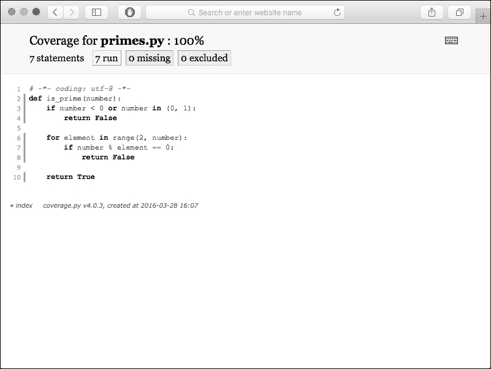

# 第十章：测试驱动开发

**测试驱动开发**（**TDD**）是一种生产高质量软件的简单技术。它在 Python 社区中被广泛使用，但在其他社区中也很受欢迎。

由于 Python 的动态特性，测试尤为重要。它缺乏静态类型，因此许多甚至微小的错误直到代码运行并执行每一行时才会被注意到。但问题不仅仅在于 Python 中类型的工作方式。请记住，大多数错误与不良语法使用无关，而是与逻辑错误和微妙的误解有关，这可能导致重大故障。

本章分为两个部分：

+   *我不测试*，倡导 TDD 并快速描述如何使用标准库进行测试

+   *我进行测试*，这是为那些进行测试并希望从中获得更多的开发人员设计的

# 我不测试

如果您已经被说服使用 TDD，您应该转到下一节。它将专注于高级技术和工具，以使您在处理测试时的生活更轻松。这部分主要是为那些不使用这种方法并试图倡导其使用的人而设计的。

## 测试驱动开发原则

测试驱动开发过程，最简单的形式包括三个步骤：

1.  为尚未实现的新功能或改进编写自动化测试。

1.  提供最小的代码，只需通过所有定义的测试即可。

1.  重构代码以满足期望的质量标准。

关于这个开发周期最重要的事实是，在实现之前应该先编写测试。这对于经验不足的开发人员来说并不容易，但这是唯一保证您要编写的代码是可测试的方法。

例如，一个被要求编写一个检查给定数字是否为质数的函数的开发人员，会写一些关于如何使用它以及预期结果的示例：

```py
assert is_prime(5)
assert is_prime(7)
assert not is_prime(8)
```

实现功能的开发人员不需要是唯一负责提供测试的人。示例也可以由其他人提供。例如，网络协议或密码算法的官方规范经常提供旨在验证实现正确性的测试向量。这些是测试用例的完美基础。

从那里，函数可以被实现，直到前面的示例起作用：

```py
def is_prime(number):
    for element in range(2, number):
        if number % element == 0:
            return False
    return True
```

错误或意外结果是函数应该能够处理的新用法示例：

```py
>>> assert not is_prime(1)
Traceback (most recent call last):
 **File "<stdin>", line 1, in <module>
AssertionError

```

代码可以相应地更改，直到新的测试通过：

```py
def is_prime(number):
    if number in (0, 1):
        return False

    for element in range(2, number):
        if number % element == 0:
            return False

    return True
```

还有更多情况表明实现仍然不完整：

```py
>>> assert not is_prime(-3)** 
Traceback (most recent call last):
 **File "<stdin>", line 1, in <module>
AssertionError

```

更新后的代码如下：

```py
def is_prime(number):
    if number < 0 or number in (0, 1):
        return False

    for element in range(2, number):
        if number % element == 0:
            return False

    return True
```

从那里，所有测试可以被收集在一个测试函数中，每当代码发展时运行：

```py
def test_is_prime():
    assert is_prime(5)
    assert is_prime(7)

    assert not is_prime(8)
    assert not is_prime(0)
    assert not is_prime(1)

    assert not is_prime(-1)
    assert not is_prime(-3)
    assert not is_prime(-6)
```

每当我们提出一个新的需求时，“test_is_prime（）”函数应该首先更新以定义“is_prime（）”函数的预期行为。然后，运行测试以检查实现是否提供了期望的结果。只有当已知测试失败时，才需要更新经过测试的函数的代码。

测试驱动开发提供了许多好处：

+   它有助于防止软件回归

+   它提高了软件质量

+   它提供了代码行为的一种低级文档

+   它允许您在短时间内更快地生成健壮的代码

处理测试的最佳约定是将它们全部收集在一个单独的模块或包中（通常命名为`tests`），并且有一种简单的方法可以使用单个 shell 命令运行整个测试套件。幸运的是，没有必要自己构建整个测试工具链。Python 标准库和 Python 软件包索引都提供了大量的测试框架和实用工具，可以让您以方便的方式构建、发现和运行测试。我们将在本章后面讨论这些包和模块中最值得注意的例子。

### 防止软件回归

我们在开发人员生活中都会面临软件回归问题。软件回归是由更改引入的新错误。它表现为在软件先前版本中已知的功能或功能在项目开发过程中的某个时刻出现故障并停止工作。

回归的主要原因是软件的复杂性。在某个时刻，不可能猜测代码库中的单个更改可能导致什么结果。更改某些代码可能会破坏其他功能，有时会导致恶意副作用，比如悄悄地损坏数据。高复杂性不仅是庞大代码库的问题。当然，代码量和复杂性之间存在明显的相关性，但即使是小型项目（几百/几千行代码）的架构也可能如此复杂，以至于很难预测相对较小的更改的所有后果。

为了避免回归，软件提供的整套功能应该在每次更改发生时进行测试。如果没有这样做，你将无法可靠地区分软件中一直存在的错误和最近在正确工作的部分引入的新错误。

向多个开发人员开放代码库会加剧这个问题，因为每个人都不会完全了解所有的开发活动。虽然版本控制系统可以防止冲突，但它并不能阻止所有不必要的交互。

TDD 有助于减少软件回归。每次更改后，整个软件都可以自动测试。只要每个功能都有适当的测试集，这种方法就有效。当 TDD 正确执行时，测试基础会随着代码基础一起增长。

由于完整的测试活动可能需要相当长的时间，将其委托给一些可以在后台执行工作的持续集成系统是一个好的做法。我们在第八章“管理代码”中已经讨论过这样的解决方案。然而，开发人员也应该手动执行测试的本地重新启动，至少对于相关模块来说是如此。仅依赖持续集成会对开发人员的生产力产生负面影响。程序员应该能够在其环境中轻松地运行测试的选择。这就是为什么你应该仔细选择项目的测试工具。

### 提高代码质量

当编写新的模块、类或函数时，开发人员会专注于如何编写以及如何产生最佳的代码。但是，当他们专注于算法时，他们可能会失去用户的视角：他们的函数将如何被使用？参数是否易于使用和合乎逻辑？API 的名称是否正确？

这是通过应用前几章描述的技巧来完成的，比如第四章，“选择好的名称”。但要高效地做到这一点，唯一的方法就是写使用示例。这是开发人员意识到他或她编写的代码是否合乎逻辑且易于使用的时刻。通常，在模块、类或函数完成后，第一次重构就会发生。

编写测试，这些测试是代码的用例，有助于从用户的角度进行思考。因此，当开发人员使用 TDD 时，通常会产生更好的代码。测试庞大的函数和庞大的单块类是困难的。考虑测试的代码往往更清晰、更模块化。

### 提供最佳的开发人员文档

测试是开发人员了解软件运行方式的最佳途径。它们是代码最初创建的用例。阅读它们可以快速深入地了解代码的运行方式。有时，一个例子胜过千言万语。

这些测试始终与代码库保持最新，使它们成为软件可以拥有的最佳开发人员文档。测试不会像文档一样过时，否则它们会失败。

### 更快地生成健壮的代码

没有测试的编写会导致长时间的调试会话。一个模块中的错误可能会在软件的完全不同部分表现出来。由于您不知道该责怪谁，您会花费大量时间进行调试。当测试失败时，最好一次只解决一个小错误，因为这样您会更好地了解真正的问题所在。测试通常比调试更有趣，因为它是编码。

如果您测量修复代码所花费的时间以及编写代码所花费的时间，通常会比 TDD 方法所需的时间长。当您开始编写新的代码时，这并不明显。这是因为设置测试环境并编写前几个测试所花费的时间与仅编写代码的时间相比极长。

但是，有些测试环境确实很难设置。例如，当您的代码与 LDAP 或 SQL 服务器交互时，编写测试根本不明显。这在本章的*伪造和模拟*部分中有所涵盖。

## 什么样的测试？

任何软件都可以进行几种测试。主要的是**验收测试**（或**功能测试**）和**单元测试**，这是大多数人在讨论软件测试主题时所考虑的。但是在您的项目中，还有一些其他测试类型可以使用。我们将在本节中简要讨论其中一些。

### 验收测试

验收测试侧重于功能，并处理软件就像黑匣子一样。它只是确保软件确实做了它应该做的事情，使用与用户相同的媒体并控制输出。这些测试通常是在开发周期之外编写的，以验证应用程序是否满足要求。它们通常作为软件的检查表运行。通常，这些测试不是通过 TDD 进行的，而是由经理、QA 人员甚至客户构建的。在这种情况下，它们通常被称为**用户验收测试**。

但是，它们可以并且应该遵循 TDD 原则。在编写功能之前可以提供测试。开发人员通常会得到一堆验收测试，通常是由功能规格书制作的，他们的工作是确保代码能够通过所有这些测试。

编写这些测试所使用的工具取决于软件提供的用户界面。一些 Python 开发人员使用的流行工具包括：

| 应用程序类型 | 工具 |
| --- | --- |
| Web 应用程序 | Selenium（用于带有 JavaScript 的 Web UI） |
| Web 应用程序 | `zope.testbrowser`（不测试 JS） |
| WSGI 应用程序 | `paste.test.fixture`（不测试 JS） |
| Gnome 桌面应用程序 | dogtail |
| Win32 桌面应用程序 | pywinauto |

### 注意

对于功能测试工具的广泛列表，Grig Gheorghiu 在[`wiki.python.org/moin/PythonTestingToolsTaxonomy`](https://wiki.python.org/moin/PythonTestingToolsTaxonomy)上维护了一个 wiki 页面。

### 单元测试

单元测试是完全适合测试驱动开发的低级测试。顾名思义，它们专注于测试软件单元。软件单元可以理解为应用程序代码的最小可测试部分。根据应用程序的不同，大小可能从整个模块到单个方法或函数不等，但通常单元测试是针对可能的最小代码片段编写的。单元测试通常会将被测试的单元（模块、类、函数等）与应用程序的其余部分和其他单元隔离开来。当需要外部依赖项时，例如 Web API 或数据库，它们通常会被伪造对象或模拟替换。

### 功能测试

功能测试侧重于整个功能和功能，而不是小的代码单元。它们在目的上类似于验收测试。主要区别在于功能测试不一定需要使用用户相同的界面。例如，在测试 Web 应用程序时，一些用户交互（或其后果）可以通过合成的 HTTP 请求或直接数据库访问来模拟，而不是模拟真实页面加载和鼠标点击。

这种方法通常比使用*用户验收测试*中使用的工具进行测试更容易和更快。有限功能测试的缺点是它们往往不能涵盖应用程序的足够多的部分，其中不同的抽象层和组件相遇。侧重于这种*相遇点*的测试通常被称为集成测试。

### 集成测试

集成测试代表了比单元测试更高级的测试水平。它们测试代码的更大部分，并侧重于许多应用层或组件相遇和相互交互的情况。集成测试的形式和范围取决于项目的架构和复杂性。例如，在小型和单片项目中，这可能只是运行更复杂的功能测试，并允许它们与真实的后端服务（数据库、缓存等）进行交互，而不是模拟或伪造它们。对于复杂的场景或由多个服务构建的产品，真正的集成测试可能非常广泛，甚至需要在模拟生产环境的大型分布式环境中运行整个项目。

集成测试通常与功能测试非常相似，它们之间的边界非常模糊。很常见的是，集成测试也在逻辑上测试独立的功能和特性。

### 负载和性能测试

负载测试和性能测试提供的是关于代码效率而不是正确性的客观信息。负载测试和性能测试这两个术语有时可以互换使用，但实际上前者指的是性能的有限方面。负载测试侧重于衡量代码在某种人为需求（负载）下的行为。这是测试 Web 应用程序的一种非常流行的方式，其中负载被理解为来自真实用户或程序化客户端的 Web 流量。重要的是要注意，负载测试往往涵盖了对应用程序的整个请求，因此与集成和功能测试非常相似。这使得确保被测试的应用程序组件完全验证工作正常非常重要。性能测试通常是旨在衡量代码性能的所有测试，甚至可以针对代码的小单元。因此，负载测试只是性能测试的一个特定子类型。

它们是一种特殊类型的测试，因为它们不提供二进制结果（失败/成功），而只提供一些性能质量的测量。这意味着单个结果需要被解释和/或与不同测试运行的结果进行比较。在某些情况下，项目要求可能对代码设置一些严格的时间或资源约束，但这并不改变这些测试方法中总是涉及某种任意解释的事实。

负载性能测试是任何需要满足一些**服务****级别协议**的软件开发过程中的一个重要工具，因为它有助于降低关键代码路径性能受损的风险。无论如何，不应该过度使用。

### 代码质量测试

代码质量没有一个确定的任意刻度，可以明确地说它是好还是坏。不幸的是，代码质量这个抽象概念无法用数字形式来衡量和表达。但相反，我们可以测量与代码质量高度相关的软件的各种指标。举几个例子：

+   代码风格违规的数量

+   文档的数量

+   复杂度度量，如 McCabe 的圈复杂度

+   静态代码分析警告的数量

许多项目在其持续集成工作流程中使用代码质量测试。一个良好且流行的方法是至少测试基本指标（静态代码分析和代码风格违规），并且不允许将任何代码合并到主流中使这些指标降低。

## Python 标准测试工具

Python 提供了标准库中的两个主要模块来编写测试：

+   `unittest` ([`docs.python.org/3/library/unittest.html`](https://docs.python.org/3/library/unittest.html))：这是基于 Java 的 JUnit 的标准和最常见的 Python 单元测试框架，最初由 Steve Purcell（以前是`PyUnit`）编写

+   `doctest` ([`docs.python.org/3/library/doctest.html`](https://docs.python.org/3/library/doctest.html))：这是一个具有交互式使用示例的文学编程测试工具

### unittest

`unittest`基本上提供了 Java 的 JUnit 所提供的功能。它提供了一个名为`TestCase`的基类，该类具有一系列广泛的方法来验证函数调用和语句的输出。

这个模块是为了编写单元测试而创建的，但只要测试使用了用户界面，也可以用它来编写验收测试。例如，一些测试框架提供了辅助工具来驱动诸如 Selenium 之类的工具，这些工具是建立在`unittest`之上的。

使用`unittest`为模块编写简单的单元测试是通过子类化`TestCase`并编写以`test`前缀开头的方法来完成的。*测试驱动开发原则*部分的最终示例将如下所示：

```py
import unittest

from primes import is_prime

class MyTests(unittest.TestCase):
    def test_is_prime(self):
        self.assertTrue(is_prime(5))
        self.assertTrue(is_prime(7))

        self.assertFalse(is_prime(8))
        self.assertFalse(is_prime(0))
        self.assertFalse(is_prime(1))

        self.assertFalse(is_prime(-1))
        self.assertFalse(is_prime(-3))
        self.assertFalse(is_prime(-6))

if __name__ == "__main__":
    unittest.main()
```

`unittest.main()`函数是一个实用程序，允许将整个模块作为测试套件来执行：

```py
$ python test_is_prime.py -v
test_is_prime (__main__.MyTests) ... ok

----------------------------------------------------------------------
Ran 1 test in 0.000s

OK

```

`unittest.main()`函数扫描当前模块的上下文，并寻找子类为`TestCase`的类。它实例化它们，然后运行所有以`test`前缀开头的方法。

一个良好的测试套件遵循常见和一致的命名约定。例如，如果`is_prime`函数包含在`primes.py`模块中，测试类可以被称为`PrimesTests`，并放入`test_primes.py`文件中：

```py
import unittest

from primes import is_prime

class PrimesTests(unittest.TestCase):
    def test_is_prime(self):
        self.assertTrue(is_prime(5))
        self.assertTrue(is_prime(7))

        self.assertFalse(is_prime(8))
        self.assertFalse(is_prime(0))
        self.assertFalse(is_prime(1))

        self.assertFalse(is_prime(-1))
        self.assertFalse(is_prime(-3))
        self.assertFalse(is_prime(-6))

if __name__ == '__main__':
    unittest.main()
```

从那时起，每当`utils`模块发展时，`test_utils`模块就会得到更多的测试。

为了工作，`test_primes`模块需要在上下文中有`primes`模块可用。这可以通过将两个模块放在同一个包中，或者通过将被测试的模块显式添加到 Python 路径中来实现。在实践中，`setuptools`的`develop`命令在这里非常有帮助。

在整个应用程序上运行测试假设您有一个脚本，可以从所有测试模块构建一个**测试运行**。`unittest`提供了一个`TestSuite`类，可以聚合测试并将它们作为一个测试运行来运行，只要它们都是`TestCase`或`TestSuite`的实例。

在 Python 的过去，有一个约定，测试模块提供一个返回`TestSuite`实例的`test_suite`函数，该实例在模块被命令提示符调用时在`__main__`部分中使用，或者由测试运行器使用：

```py
import unittest

from primes import is_prime

class PrimesTests(unittest.TestCase):
    def test_is_prime(self):
        self.assertTrue(is_prime(5))

        self.assertTrue(is_prime(7))

        self.assertFalse(is_prime(8))
        self.assertFalse(is_prime(0))
        self.assertFalse(is_prime(1))

        self.assertFalse(is_prime(-1))
        self.assertFalse(is_prime(-3))
        self.assertFalse(is_prime(-6))

class OtherTests(unittest.TestCase):
    def test_true(self):
        self.assertTrue(True)

def test_suite():
    """builds the test suite."""
    suite = unittest.TestSuite()
    suite.addTests(unittest.makeSuite(PrimesTests))
    suite.addTests(unittest.makeSuite(OtherTests))

    return suite

if __name__ == '__main__':
    unittest.main(defaultTest='test_suite')
```

从 shell 中运行这个模块将打印测试运行结果：

```py
$ python test_primes.py -v
test_is_prime (__main__.PrimesTests) ... ok
test_true (__main__.OtherTests) ... ok

----------------------------------------------------------------------
Ran 2 tests in 0.001s

OK

```

在旧版本的 Python 中，当`unittest`模块没有适当的测试发现工具时，需要使用前面的方法。通常，所有测试的运行是由一个全局脚本完成的，该脚本浏览代码树寻找测试并运行它们。这称为**测试发现**，稍后在本章中将更详细地介绍。现在，您只需要知道`unittest`提供了一个简单的命令，可以从带有`test`前缀的模块和包中发现所有测试：

```py
$ python -m unittest -v
test_is_prime (test_primes.PrimesTests) ... ok
test_true (test_primes.OtherTests) ... ok

----------------------------------------------------------------------
Ran 2 tests in 0.001s

OK

```

如果您使用了前面的命令，那么就不需要手动定义`__main__`部分并调用`unittest.main()`函数。

### doctest

`doctest`是一个模块，它从文档字符串或文本文件中提取交互式提示会话的片段，并重放它们以检查示例输出是否与真实输出相同。

例如，以下内容的文本文件可以作为测试运行：

```py
Check addition of integers works as expected::

>>> 1 + 1
2
```

假设这个文档文件存储在文件系统中，文件名为`test.rst`。`doctest`模块提供了一些函数，用于从这样的文档中提取并运行测试：

```py
>>> import doctest
>>> doctest.testfile('test.rst', verbose=True)
Trying:
 **1 + 1
Expecting:
 **2
ok
1 items passed all tests:
 **1 tests in test.rst
1 tests in 1 items.
1 passed and 0 failed.
Test passed.
TestResults(failed=0, attempted=1)

```

使用`doctest`有很多优点：

+   包可以通过示例进行文档和测试

+   文档示例始终是最新的

+   使用 doctests 中的示例来编写一个包有助于保持用户的观点

然而，doctests 并不会使单元测试过时；它们只应该用于在文档中提供可读的示例。换句话说，当测试涉及低级问题或需要复杂的测试装置，这些测试装置会使文档变得晦涩时，就不应该使用它们。

一些 Python 框架，如 Zope，广泛使用 doctests，并且有时会受到对代码不熟悉的人的批评。有些 doctests 真的很难阅读和理解，因为这些示例违反了技术写作的规则之一——它们不能在简单的提示符下运行，并且需要广泛的知识。因此，那些本应帮助新手的文档变得很难阅读，因为基于复杂测试装置或特定测试 API 构建的 doctests 的代码示例很难阅读。

### 注意

如第九章中所解释的，*项目文档*，当你使用 doctests 作为你的包文档的一部分时，要小心遵循技术写作的七条规则。

在这个阶段，你应该对 TDD 带来的好处有一个很好的概述。如果你还不确定，你应该在几个模块上试一试。使用 TDD 编写一个包，并测量构建、调试和重构所花费的时间。你会很快发现它确实是优越的。

# 我进行测试

如果你来自*我不测试*部分，并且现在已经确信要进行测试驱动开发，那么恭喜你！你已经了解了测试驱动开发的基础知识，但在能够有效地使用这种方法之前，你还有一些东西需要学习。

本节描述了开发人员在编写测试时遇到的一些问题，以及解决这些问题的一些方法。它还提供了 Python 社区中流行的测试运行器和工具的快速回顾。

## 单元测试的缺陷

`unittest`模块是在 Python 2.1 中引入的，并且自那时以来一直被开发人员广泛使用。但是一些替代的测试框架由社区中一些对`unittest`的弱点和限制感到沮丧的人创建。

以下是经常提出的常见批评：

+   **框架使用起来很繁重**，因为:

+   你必须在`TestCase`的子类中编写所有测试

+   你必须在方法名前加上`test`前缀

+   鼓励使用`TestCase`提供的断言方法，而不是简单的`assert`语句，现有的方法可能无法覆盖每种情况

+   这个框架很难扩展，因为它需要大量地对基类进行子类化或者使用装饰器等技巧。

+   有时测试装置很难组织，因为`setUp`和`tearDown`设施与`TestCase`级别相关联，尽管它们每次测试运行时只运行一次。换句话说，如果一个测试装置涉及许多测试模块，那么组织它的创建和清理就不简单。

+   在 Python 软件上运行测试活动并不容易。默认的测试运行器（`python -m unittest`）确实提供了一些测试发现，但并没有提供足够的过滤能力。实际上，需要编写额外的脚本来收集测试，汇总它们，然后以方便的方式运行它们。

需要一种更轻量的方法来编写测试，而不会受到太像其大型 Java 兄弟 JUnit 的框架的限制。由于 Python 不要求使用 100%基于类的环境，因此最好提供一个更符合 Python 风格的测试框架，而不是基于子类化。

一个常见的方法是：

+   提供一种简单的方法来标记任何函数或任何类作为测试

+   通过插件系统扩展框架

+   为所有测试级别提供完整的测试装置环境：整个活动、模块级别的一组测试和测试级别

+   基于测试发现提供测试运行器，具有广泛的选项集

## unittest 替代方案

一些第三方工具尝试通过提供`unittest`扩展的形式来解决刚才提到的问题。

Python 维基提供了各种测试实用工具和框架的非常长的列表（参见[`wiki.python.org/moin/PythonTestingToolsTaxonomy`](https://wiki.python.org/moin/PythonTestingToolsTaxonomy)），但只有两个项目特别受欢迎：

+   `nose`：[`nose.readthedocs.org`](http://nose.readthedocs.org)

+   `py.test`：[`pytest.org`](http://pytest.org)

### nose

`nose`主要是一个具有强大发现功能的测试运行器。它具有广泛的选项，允许在 Python 应用程序中运行各种测试活动。

它不是标准库的一部分，但可以在 PyPI 上找到，并可以使用 pip 轻松安装：

```py
pip install nose

```

#### 测试运行器

安装 nose 后，一个名为`nosetests`的新命令可以在提示符下使用。可以直接使用它来运行本章第一节中介绍的测试：

```py
nosetests -v
test_true (test_primes.OtherTests) ... ok
test_is_prime (test_primes.PrimesTests) ... ok
builds the test suite. ... ok

----------------------------------------------------------------------
Ran 3 tests in 0.009s

OK

```

`nose`通过递归浏览当前目录并自行构建测试套件来发现测试。乍一看，前面的例子看起来并不像简单的`python -m unittest`有什么改进。如果你使用`--help`开关运行此命令，你会注意到 nose 提供了数十个参数，允许你控制测试的发现和执行。

#### 编写测试

`nose`更进一步，通过运行所有类和函数，其名称与正则表达式`((?:^|[b_.-])[Tt]est)`匹配的模块中的测试。大致上，所有以`test`开头并位于匹配该模式的模块中的可调用项也将作为测试执行。

例如，这个`test_ok.py`模块将被`nose`识别并运行：

```py
$ more test_ok.py
def test_ok():
 **print('my test')
$ nosetests -v
test_ok.test_ok ... ok

-----------------------------------------------------------------
Ran 1 test in 0.071s

OK

```

还会执行常规的`TestCase`类和`doctests`。

最后，`nose`提供了类似于`TestCase`方法的断言函数。但这些是作为遵循 PEP 8 命名约定的函数提供的，而不是使用`unittest`使用的 Java 约定（参见[`nose.readthedocs.org/`](http://nose.readthedocs.org/)）。

#### 编写测试装置

`nose`支持三个级别的装置：

+   **包级别**：`__init__.py`模块中可以添加`setup`和`teardown`函数，其中包含所有测试模块的测试包

+   **模块级别**：测试模块可以有自己的`setup`和`teardown`函数

+   **测试级别**：可调用项也可以使用提供的`with_setup`装饰器具有装置函数

例如，要在模块和测试级别设置测试装置，请使用以下代码：

```py
def setup():
    # setup code, launched for the whole module
    ...

def teardown():
    # teardown code, launched for the whole module
    ... 

def set_ok():
    # setup code launched only for test_ok
    ...

@with_setup(set_ok)
def test_ok():
    print('my test')
```

#### 与 setuptools 的集成和插件系统

最后，`nose`与`setuptools`完美集成，因此可以使用`test`命令（`python setup.py test`）。这种集成是通过在`setup.py`脚本中添加`test_suite`元数据来完成的：

```py
setup(
    #...
    test_suite='nose.collector',
)
```

`nose`还使用`setuptool's`入口机制，供开发人员编写`nose`插件。这允许你从测试发现到输出格式化覆盖或修改工具的每个方面。

### 注意

在[`nose-plugins.jottit.com`](https://nose-plugins.jottit.com)上维护了一个`nose`插件列表。

#### 总结

`nose`是一个完整的测试工具，修复了`unittest`存在的许多问题。它仍然设计为使用测试的隐式前缀名称，这对一些开发人员来说仍然是一个约束。虽然这个前缀可以定制，但仍然需要遵循一定的约定。

这种约定优于配置的说法并不坏，比在`unittest`中需要的样板代码要好得多。但是，例如使用显式装饰器可能是摆脱`test`前缀的好方法。

此外，通过插件扩展`nose`的能力使其非常灵活，并允许开发人员定制工具以满足其需求。

如果您的测试工作流程需要覆盖很多 nose 参数，您可以在主目录或项目根目录中轻松添加`.noserc`或`nose.cfg`文件。它将指定`nosetests`命令的默认选项集。例如，一个很好的做法是在测试运行期间自动查找 doctests。启用运行 doctests 的`nose`配置文件示例如下：

```py
[nosetests]
with-doctest=1
doctest-extension=.txt

```

### py.test

`py.test`与`nose`非常相似。事实上，后者是受`py.test`启发的，因此我们将主要关注使这些工具彼此不同的细节。该工具诞生于一个名为`py`的更大软件包的一部分，但现在它们是分开开发的。

像本书中提到的每个第三方软件包一样，`py.test`可以在 PyPI 上获得，并且可以通过`pip`安装为`pytest`：

```py
$ pip install pytest

```

从那里，一个新的`py.test`命令在提示符下可用，可以像`nosetests`一样使用。该工具使用类似的模式匹配和测试发现算法来捕获要运行的测试。该模式比`nose`使用的模式更严格，只会捕获：

+   以`Test`开头的类，在以`test`开头的文件中

+   以`test`开头的函数，在以`test`开头的文件中

### 注意

要小心使用正确的字符大小写。如果一个函数以大写的“T”开头，它将被视为一个类，因此会被忽略。如果一个类以小写的“t”开头，`py.test`将会中断，因为它会尝试将其视为一个函数。

`py.test`的优点包括：

+   轻松禁用一些测试类的能力

+   处理 fixtures 的灵活和独特机制

+   将测试分发到多台计算机的能力

#### 编写测试 fixtures

`py.test`支持两种处理 fixtures 的机制。第一种是模仿 xUnit 框架的，类似于`nose`。当然，语义有些不同。`py.test`将在每个测试模块中查找三个级别的 fixtures，如下例所示：

```py
def setup_module(module): 
    """ Setup up any state specific to the execution 
        of the given module.
    """

def teardown_module(module):    
    """ Teardown any state that was previously setup
        with a setup_module method.
    """

def setup_class(cls):    
    """ Setup up any state specific to the execution
        of the given class (which usually contains tests).
    """

def teardown_class(cls):    
    """ Teardown any state that was previously setup
        with a call to setup_class.
    """

def setup_method(self, method):
    """ Setup up any state tied to the execution of the given
        method in a class. setup_method is invoked for every
        test method of a class.
    """

def teardown_method(self, method):
    """ Teardown any state that was previously setup
        with a setup_method call.
    """
```

每个函数将以当前模块、类或方法作为参数。因此，测试 fixture 将能够在上下文中工作，而无需查找它，就像`nose`一样。

`py.test`编写 fixtures 的另一种机制是建立在依赖注入的概念上，允许以更模块化和可扩展的方式维护测试状态。非 xUnit 风格的 fixtures（setup/teardown 过程）总是具有唯一的名称，并且需要通过在类中的测试函数、方法和模块中声明它们的使用来显式激活它们。

fixtures 的最简单实现采用了使用`pytest.fixture()`装饰器声明的命名函数的形式。要将 fixture 标记为在测试中使用，需要将其声明为函数或方法参数。为了更清楚，考虑使用`py.test` fixtures 重写`is_prime`函数的测试模块的先前示例：

```py
import pytest

from primes import is_prime

@pytest.fixture()
def prime_numbers():
    return [3, 5, 7]

@pytest.fixture()
def non_prime_numbers():
    return [8, 0, 1]

@pytest.fixture()
def negative_numbers():
    return [-1, -3, -6]

def test_is_prime_true(prime_numbers):
    for number in prime_numbers:
        assert is_prime(number)

def test_is_prime_false(non_prime_numbers, negative_numbers):
    for number in non_prime_numbers:
        assert not is_prime(number)

    for number in non_prime_numbers:
        assert not is_prime(number)
```

#### 禁用测试函数和类

`py.test` 提供了一个简单的机制，可以在特定条件下禁用一些测试。这称为跳过，`pytest` 包提供了 `.skipif` 装饰器来实现这一目的。如果需要在特定条件下跳过单个测试函数或整个测试类装饰器，就需要使用这个装饰器，并提供一些值来验证是否满足了预期条件。以下是官方文档中跳过在 Windows 上运行整个测试用例类的示例：

```py
import pytest

@pytest.mark.skipif(
    sys.platform == 'win32',
    reason="does not run on windows"
)
class TestPosixCalls:

    def test_function(self):
        """will not be setup or run under 'win32' platform"""
```

当然，您可以预先定义跳过条件，以便在测试模块之间共享：

```py
import pytest

skipwindows = pytest.mark.skipif(
    sys.platform == 'win32',
    reason="does not run on windows"
)

@skip_windows
class TestPosixCalls:

    def test_function(self):
        """will not be setup or run under 'win32' platform"""
```

如果一个测试以这种方式标记，它将根本不会被执行。然而，在某些情况下，您希望运行这样的测试，并希望执行它，但是您知道，在已知条件下它应该失败。为此，提供了一个不同的装饰器。它是 `@mark.xfail`，确保测试始终运行，但如果预定义条件发生，它应该在某个时候失败：

```py
import pytest

@pytest.mark.xfail(
sys.platform == 'win32',
    reason="does not run on windows"
)
class TestPosixCalls:

    def test_function(self):
        """it must fail under windows"""
```

使用 `xfail` 比 `skipif` 更严格。测试始终会被执行，如果在预期情况下没有失败，那么整个 `py.test` 运行将会失败。

#### 自动化分布式测试

`py.test` 的一个有趣特性是它能够将测试分布到多台计算机上。只要计算机可以通过 SSH 访问，`py.test` 就能够通过发送要执行的测试来驱动每台计算机。

然而，这一特性依赖于网络；如果连接中断，从属端将无法继续工作，因为它完全由主控端驱动。

当一个项目有长时间的测试活动时，Buildbot 或其他持续集成工具更可取。但是，当您在开发一个运行测试需要大量资源的应用程序时，`py.test` 分布模型可以用于临时分发测试。

#### 总结

`py.test` 与 `nose` 非常相似，因为它不需要聚合测试的样板代码。它还有一个很好的插件系统，并且在 PyPI 上有大量的扩展可用。

最后，`py.test` 专注于使测试运行速度快，与这一领域的其他工具相比确实更加优越。另一个显著特性是对夹具的原始处理方式，这确实有助于管理可重用的夹具库。有些人可能会认为其中涉及了太多魔法，但它确实简化了测试套件的开发。`py.test` 的这一单一优势使其成为我的首选工具，因此我真的推荐它。

## 测试覆盖

**代码覆盖** 是一个非常有用的度量标准，它提供了关于项目代码测试情况的客观信息。它只是衡量了在所有测试执行期间执行了多少行代码以及哪些行代码。通常以百分比表示，100% 的覆盖率意味着在测试期间执行了每一行代码。

最流行的代码覆盖工具简称为 coverage，并且可以在 PyPI 上免费获得。使用非常简单，只有两个步骤。第一步是在您的 shell 中运行 coverage run 命令，并将运行所有测试的脚本/程序的路径作为参数：

```py
$ coverage run --source . `which py.test` -v
===================== test session starts ======================
platformdarwin -- Python 3.5.1, pytest-2.8.7, py-1.4.31, pluggy-0.3.1 -- /Users/swistakm/.envs/book/bin/python3
cachedir: .cache
rootdir: /Users/swistakm/dev/book/chapter10/pytest, inifile:** 
plugins: capturelog-0.7, codecheckers-0.2, cov-2.2.1, timeout-1.0.0
collected 6 items** 

primes.py::pyflakes PASSED
primes.py::pep8 PASSED
test_primes.py::pyflakes PASSED
test_primes.py::pep8 PASSED
test_primes.py::test_is_prime_true PASSED
test_primes.py::test_is_prime_false PASSED

========= 6 passed, 1 pytest-warnings in 0.10 seconds ==========

```

coverage run 还接受 `-m` 参数，该参数指定可运行的模块名称，而不是程序路径，这对于某些测试框架可能更好：

```py
$ coverage run -m unittest
$ coverage run -m nose
$ coverage run -m pytest

```

下一步是从 `.coverage` 文件中缓存的结果生成可读的代码覆盖报告。`coverage` 包支持几种输出格式，最简单的一种只在您的终端中打印 ASCII 表格：

```py
$ coverage report
Name             StmtsMiss  Cover
------------------------------------
primes.py            7      0   100%
test_primes.py      16      0   100%
------------------------------------
TOTAL               23      0   100%

```

另一个有用的覆盖报告格式是 HTML，可以在您的 Web 浏览器中浏览：

```py
$ coverage html

```

此 HTML 报告的默认输出文件夹是您的工作目录中的 `htmlcov/`。`coverage html` 输出的真正优势在于您可以浏览项目的带有缺失测试覆盖部分的注释源代码（如 *图 1* 所示）：



图 1 覆盖率 HTML 报告中带注释的源代码示例

您应该记住，虽然您应该始终努力确保 100%的测试覆盖率，但这并不意味着代码被完美测试，也不意味着代码不会出错的地方。这只意味着每行代码在执行过程中都被执行到了，但并不一定测试了每种可能的条件。实际上，确保完整的代码覆盖率可能相对容易，但确保每个代码分支都被执行到则非常困难。这对于可能具有多个`if`语句和特定语言构造（如`list`/`dict`/`set`推导）组合的函数的测试尤其如此。您应该始终关注良好的测试覆盖率，但您不应该将其测量视为测试套件质量的最终答案。

## 伪造和模拟

编写单元测试预设了对正在测试的代码单元进行隔离。测试通常会向函数或方法提供一些数据，并验证其返回值和/或执行的副作用。这主要是为了确保测试：

+   涉及应用程序的一个原子部分，可以是函数、方法、类或接口

+   提供确定性、可重现的结果

有时，程序组件的正确隔离并不明显。例如，如果代码发送电子邮件，它可能会调用 Python 的`smtplib`模块，该模块将通过网络连接与 SMTP 服务器进行通信。如果我们希望我们的测试是可重现的，并且只是测试电子邮件是否具有所需的内容，那么可能不应该发生这种情况。理想情况下，单元测试应该在任何计算机上运行，而不需要外部依赖和副作用。

由于 Python 的动态特性，可以使用**monkey patching**来修改测试装置中的运行时代码（即在运行时动态修改软件而不触及源代码）来**伪造**第三方代码或库的行为。

### 构建一个伪造

在测试中创建伪造行为可以通过发现测试代码与外部部分交互所需的最小交互集。然后，手动返回输出，或者使用先前记录的真实数据池。

这是通过启动一个空类或函数并将其用作替代来完成的。然后启动测试，并迭代更新伪造，直到其行为正确。这是由于 Python 类型系统的特性。只要对象的行为与预期的类型相匹配，并且不需要通过子类化成为其祖先，它就被认为与给定类型兼容。这种在 Python 中的类型化方法被称为鸭子类型——如果某物的行为像鸭子，那么它就可以被当作鸭子对待。

让我们以一个名为`mailer`的模块中的名为`send`的函数为例，该函数发送电子邮件：

```py
import smtplib
import email.message

def send(
    sender, to,
    subject='None',
    body='None',
    server='localhost'
):
    """sends a message."""
    message = email.message.Message()
    message['To'] = to
    message['From'] = sender
    message['Subject'] = subject
    message.set_payload(body)

    server = smtplib.SMTP(server)
    try:
        return server.sendmail(sender, to, message.as_string())
    finally:
        server.quit()
```

### 注意

`py.test`将用于在本节中演示伪造和模拟。

相应的测试可以是：

```py
from mailer import send

def test_send():
    res = send(
        'john.doe@example.com', 
        'john.doe@example.com', 
        'topic',
        'body'
    )
    assert res == {}
```

只要本地主机上有 SMTP 服务器，这个测试就会通过并工作。如果没有，它会失败，就像这样：

```py
$ py.test --tb=short
========================= test session starts =========================
platform darwin -- Python 3.5.1, pytest-2.8.7, py-1.4.31, pluggy-0.3.1
rootdir: /Users/swistakm/dev/book/chapter10/mailer, inifile:** 
plugins: capturelog-0.7, codecheckers-0.2, cov-2.2.1, timeout-1.0.0
collected 5 items** 

mailer.py ..
test_mailer.py ..F

============================== FAILURES ===============================
______________________________ test_send ______________________________
test_mailer.py:10: in test_send
 **'body'
mailer.py:19: in send
 **server = smtplib.SMTP(server)
.../smtplib.py:251: in __init__
 **(code, msg) = self.connect(host, port)
.../smtplib.py:335: in connect
 **self.sock = self._get_socket(host, port, self.timeout)
.../smtplib.py:306: in _get_socket
 **self.source_address)
.../socket.py:711: in create_connection
 **raise err
.../socket.py:702: in create_connection
 **sock.connect(sa)
E   ConnectionRefusedError: [Errno 61] Connection refused
======== 1 failed, 4 passed, 1 pytest-warnings in 0.17 seconds ========

```

可以添加一个补丁来伪造 SMTP 类：

```py
import smtplib
import pytest
from mailer import send

class FakeSMTP(object):
    pass

@pytest.yield_fixture()
def patch_smtplib():
    # setup step: monkey patch smtplib
    old_smtp = smtplib.SMTP
    smtplib.SMTP = FakeSMTP

    yield

    # teardown step: bring back smtplib to 
    # its former state
    smtplib.SMTP = old_smtp

def test_send(patch_smtplib):
    res = send(
        'john.doe@example.com',
        'john.doe@example.com',
        'topic',
        'body'
    )
    assert res == {}
```

在前面的代码中，我们使用了一个新的`pytest.yield_fixture()`装饰器。它允许我们使用生成器语法在单个 fixture 函数中提供设置和拆卸过程。现在我们的测试套件可以使用`smtplib`的修补版本再次运行：

```py
$ py.test --tb=short -v
======================== test session starts ========================
platform darwin -- Python 3.5.1, pytest-2.8.7, py-1.4.31, pluggy-0.3.1 -- /Users/swistakm/.envs/book/bin/python3
cachedir: .cache
rootdir: /Users/swistakm/dev/book/chapter10/mailer, inifile:** 
plugins: capturelog-0.7, codecheckers-0.2, cov-2.2.1, timeout-1.0.0
collected 5 items** 

mailer.py::pyflakes PASSED
mailer.py::pep8 PASSED
test_mailer.py::pyflakes PASSED
test_mailer.py::pep8 PASSED
test_mailer.py::test_send FAILED

============================= FAILURES ==============================
_____________________________ test_send _____________________________
test_mailer.py:29: in test_send
 **'body'
mailer.py:19: in send
 **server = smtplib.SMTP(server)
E   TypeError: object() takes no parameters
======= 1 failed, 4 passed, 1 pytest-warnings in 0.09 seconds =======

```

从前面的对话记录中可以看出，我们的`FakeSMTP`类实现并不完整。我们需要更新其接口以匹配原始的 SMTP 类。根据鸭子类型原则，我们只需要提供被测试的`send()`函数所需的接口：

```py
class FakeSMTP(object):
    def __init__(self, *args, **kw):
        # arguments are not important in our example
        pass

    def quit(self):
        pass

    def sendmail(self, *args, **kw):
        return {}
```

当然，虚假类可以随着新的测试而发展，以提供更复杂的行为。但它应该尽可能短小简单。相同的原则可以用于更复杂的输出，通过记录它们来通过虚假 API 返回它们。这通常用于 LDAP 或 SQL 等第三方服务器。

当猴子补丁任何内置或第三方模块时，需要特别小心。如果操作不当，这种方法可能会留下意想不到的副作用，会在测试之间传播。幸运的是，许多测试框架和工具提供了适当的实用工具，使得对任何代码单元进行补丁变得安全且容易。在我们的例子中，我们手动完成了所有操作，并提供了一个自定义的`patch_smtplib()` fixture 函数，其中包括了分离的设置和拆卸步骤。在`py.test`中的典型解决方案要简单得多。这个框架带有一个内置的猴子补丁 fixture，应该满足我们大部分的补丁需求。

```py
import smtplib
from mailer import send

class FakeSMTP(object):
    def __init__(self, *args, **kw):
        # arguments are not important in our example
        pass

    def quit(self):
        pass

    def sendmail(self, *args, **kw):
        return {}

def test_send(monkeypatch):
    monkeypatch.setattr(smtplib, 'SMTP', FakeSMTP)

    res = send(
        'john.doe@example.com',
        'john.doe@example.com',
        'topic',
        'body'
    )
    assert res == {}
```

您应该知道，*虚假*有真正的局限性。如果决定虚假一个外部依赖，可能会引入真实服务器不会有的错误或意外行为，反之亦然。

### 使用模拟

模拟对象是通用的虚假对象，可以用来隔离被测试的代码。它们自动化了对象的输入和输出的构建过程。在静态类型的语言中，模拟对象的使用更多，因为猴子补丁更难，但它们在 Python 中仍然很有用，可以缩短代码以模拟外部 API。

Python 中有很多模拟库可用，但最受认可的是`unittest.mock`，它是标准库中提供的。它最初是作为第三方包创建的，而不是作为 Python 发行版的一部分，但很快就被包含到标准库中作为一个临时包（参见[`docs.python.org/dev/glossary.html#term-provisional-api`](https://docs.python.org/dev/glossary.html#term-provisional-api)）。对于早于 3.3 版本的 Python，您需要从 PyPI 安装它：

```py
pip install Mock

```

在我们的例子中，使用`unittest.mock`来补丁 SMTP 比从头开始创建一个虚假对象要简单得多。

```py
import smtplib
from unittest.mock import MagicMock
from mailer import send

def test_send(monkeypatch):
    smtp_mock = MagicMock()
    smtp_mock.sendmail.return_value = {}

    monkeypatch.setattr(
        smtplib, 'SMTP', MagicMock(return_value=smtp_mock)
    )

    res = send(
        'john.doe@example.com',
        'john.doe@example.com',
        'topic',
        'body'
    )
    assert res == {}
```

模拟对象或方法的`return_value`参数允许您定义调用返回的值。当使用模拟对象时，每次代码调用属性时，它都会即时为属性创建一个新的模拟对象。因此，不会引发异常。这就是我们之前编写的`quit`方法的情况，它不需要再定义了。

在前面的示例中，实际上我们创建了两个模拟对象：

+   第一个模拟了 SMTP 类对象而不是它的实例。这使您可以轻松地创建一个新对象，而不管预期的`__init__()`方法是什么。如果将模拟对象视为可调用，默认情况下会返回新的`Mock()`对象。这就是为什么我们需要为其`return_value`关键字参数提供另一个模拟对象，以便对实例接口进行控制。

+   第二个模拟了在补丁`smtplib.SMTP()`调用上返回的实际实例。在这个模拟中，我们控制了`sendmail()`方法的行为。

在我们的例子中，我们使用了`py.test`框架提供的猴子补丁实用程序，但`unittest.mock`提供了自己的补丁实用程序。在某些情况下（比如补丁类对象），使用它们可能比使用特定于框架的工具更简单更快。以下是使用`unittest.mock`模块提供的`patch()`上下文管理器进行猴子补丁的示例：

```py
from unittest.mock import patch
from mailer import send

def test_send():
    with patch('smtplib.SMTP') as mock:
        instance = mock.return_value
        instance.sendmail.return_value = {}
        res = send(
            'john.doe@example.com',
            'john.doe@example.com',
            'topic',
            'body'
        )
        assert res == {}
```

## 测试环境和依赖兼容性

本书中已经多次提到了环境隔离的重要性。通过在应用程序级别（虚拟环境）和系统级别（系统虚拟化）上隔离执行环境，您可以确保您的测试在可重复的条件下运行。这样，您就可以保护自己免受由于损坏的依赖关系引起的罕见和隐晦的问题。

允许适当隔离测试环境的最佳方式是使用支持系统虚拟化的良好持续集成系统。对于开源项目，有很好的免费解决方案，比如 Travis CI（Linux 和 OS X）或 AppVeyor（Windows），但如果你需要为测试专有软件构建这样的解决方案，很可能需要花费一些时间在一些现有的开源 CI 工具（GitLab CI、Jenkins 和 Buildbot）的基础上构建这样的解决方案。

### 依赖矩阵测试

大多数情况下，针对开源 Python 项目的测试矩阵主要关注不同的 Python 版本，很少关注不同的操作系统。对于纯粹是 Python 的项目，没有预期的系统互操作性问题，不在不同系统上进行测试和构建是完全可以的。但是一些项目，特别是作为编译 Python 扩展进行分发的项目，绝对应该在各种目标操作系统上进行测试。对于开源项目，甚至可能被迫使用几个独立的 CI 系统，为仅仅提供三种最流行的系统（Windows、Linux 和 Mac OS X）的构建。如果你正在寻找一个很好的例子，可以看一下小型的 pyrilla 项目（参考[`github.com/swistakm/pyrilla`](https://github.com/swistakm/pyrilla)），这是一个简单的用于 Python 的 C 音频扩展。它同时使用了 Travis CI 和 AppVeyor 来为 Windows 和 Mac OS X 提供编译构建，并支持大量的 CPython 版本。

但是测试矩阵的维度不仅仅局限于系统和 Python 版本。提供与其他软件集成的包，比如缓存、数据库或系统服务，往往应该在各种集成应用的版本上进行测试。一个很好的工具，可以让这样的测试变得容易，是 tox（参考[`tox.readthedocs.org`](http://tox.readthedocs.org)）。它提供了一种简单的方式来配置多个测试环境，并通过单个`tox`命令运行所有测试。它是一个非常强大和灵活的工具，但也非常容易使用。展示其用法的最佳方式是向您展示一个配置文件的示例，实际上这个配置文件是 tox 的核心。以下是 django-userena 项目的`tox.ini`文件（参考[`github.com/bread-and-pepper/django-userena`](https://github.com/bread-and-pepper/django-userena)）：

```py
[tox]
downloadcache = {toxworkdir}/cache/

envlist =
    ; py26 support was dropped in django1.7
    py26-django{15,16},
    ; py27 still has the widest django support
    py27-django{15,16,17,18,19},
    ; py32, py33 support was officially introduced in django1.5
    ; py32, py33 support was dropped in django1.9
    py32-django{15,16,17,18},
    py33-django{15,16,17,18},
    ; py34 support was officially introduced in django1.7
    py34-django{17,18,19}
    ; py35 support was officially introduced in django1.8
    py35-django{18,19}

[testenv]
usedevelop = True
deps =
    django{15,16}: south
    django{15,16}: django-guardian<1.4.0
    django15: django==1.5.12
    django16: django==1.6.11
    django17: django==1.7.11
    django18: django==1.8.7
    django19: django==1.9
    coverage: django==1.9
    coverage: coverage==4.0.3
    coverage: coveralls==1.1

basepython =
    py35: python3.5
    py34: python3.4
    py33: python3.3
    py32: python3.2
    py27: python2.7
    py26: python2.6

commands={envpython} userena/runtests/runtests.py userenaumessages {posargs}

[testenv:coverage]
basepython = python2.7
passenv = TRAVIS TRAVIS_JOB_ID TRAVIS_BRANCH
commands=
    coverage run --source=userena userena/runtests/runtests.py userenaumessages {posargs}
    coveralls
```

这个配置允许在五个不同版本的 Django 和六个版本的 Python 上测试`django-userena`。并非每个 Django 版本都能在每个 Python 版本上运行，`tox.ini`文件使得定义这样的依赖约束相对容易。实际上，整个构建矩阵包括 21 个独特的环境（包括一个用于代码覆盖收集的特殊环境）。手动创建每个测试环境，甚至使用 shell 脚本，都需要巨大的工作量。

Tox 很棒，但是如果我们想要更改不是纯 Python 依赖的测试环境的其他元素，它的使用就会变得更加复杂。这是一个情况，当我们需要在不同版本的系统软件包和后备服务下进行测试时。解决这个问题的最佳方法是再次使用良好的持续集成系统，它允许您轻松地定义环境变量的矩阵，并在虚拟机上安装系统软件。使用 Travis CI 进行这样做的一个很好的例子是`ianitor`项目（参见[`github.com/ClearcodeHQ/ianitor/`](https://github.com/ClearcodeHQ/ianitor/)），它已经在第九章中提到过，*记录您的项目*。这是 Consul 发现服务的一个简单实用程序。Consul 项目有一个非常活跃的社区，每年都会发布许多新版本的代码。这使得对该服务的各种版本进行测试非常合理。这确保了`ianitor`项目仍然与该软件的最新版本保持最新，但也不会破坏与以前的 Consul 版本的兼容性。以下是 Travis CI 的`.travis.yml`配置文件的内容，它允许您对三个不同的 Consul 版本和四个 Python 解释器版本进行测试：

```py
language: python

install: pip install tox --use-mirrors
env:
  matrix:
    # consul 0.4.1
    - TOX_ENV=py27     CONSUL_VERSION=0.4.1
    - TOX_ENV=py33     CONSUL_VERSION=0.4.1
    - TOX_ENV=py34     CONSUL_VERSION=0.4.1
    - TOX_ENV=py35     CONSUL_VERSION=0.4.1

    # consul 0.5.2
    - TOX_ENV=py27     CONSUL_VERSION=0.5.2
    - TOX_ENV=py33     CONSUL_VERSION=0.5.2
    - TOX_ENV=py34     CONSUL_VERSION=0.5.2
    - TOX_ENV=py35     CONSUL_VERSION=0.5.2

    # consul 0.6.4
    - TOX_ENV=py27     CONSUL_VERSION=0.6.4
    - TOX_ENV=py33     CONSUL_VERSION=0.6.4
    - TOX_ENV=py34     CONSUL_VERSION=0.6.4
    - TOX_ENV=py35     CONSUL_VERSION=0.6.4

    # coverage and style checks
    - TOX_ENV=pep8     CONSUL_VERSION=0.4.1
    - TOX_ENV=coverage CONSUL_VERSION=0.4.1

before_script:
  - wget https://releases.hashicorp.com/consul/${CONSUL_VERSION}/consul_${CONSUL_VERSION}_linux_amd64.zip
  - unzip consul_${CONSUL_VERSION}_linux_amd64.zip
  - start-stop-daemon --start --background --exec `pwd`/consul -- agent -server -data-dir /tmp/consul -bootstrap-expect=1

script:
  - tox -e $TOX_ENV
```

前面的例子为`ianitor`代码提供了 14 个独特的测试环境（包括`pep8`和`coverage`构建）。这个配置还使用 tox 在 Travis VM 上创建实际的测试虚拟环境。这实际上是将 tox 与不同的 CI 系统集成的一种非常流行的方法。通过尽可能多地将测试环境配置移动到 tox，您可以减少将自己锁定到单个供应商的风险。像安装新服务或定义系统环境变量这样的事情，大多数 Travis CI 的竞争对手都支持，因此如果市场上有更好的产品可用，或者 Travis 会改变其针对开源项目的定价模式，切换到不同的服务提供商应该相对容易。

## 文档驱动开发

与其他语言相比，*文档测试*在 Python 中是一个真正的优势。文档可以使用代码示例，这些示例也可以作为测试运行，这改变了 TDD 的方式。例如，在开发周期中，文档的一部分可以通过`doctests`来完成。这种方法还确保提供的示例始终是最新的并且确实有效。

通过文档测试构建软件而不是常规单元测试被称为**文档驱动开发**（**DDD**）。开发人员在实现代码时用简单的英语解释代码的功能。

### 写故事

在 DDD 中编写文档测试是通过构建关于代码如何工作和应该如何使用的故事来完成的。首先用简单的英语描述原则，然后在文本中分布一些代码使用示例。一个好的做法是先写关于代码如何工作的文本，然后添加一些代码示例。

要看一个实际的文档测试的例子，让我们看一下`atomisator`软件包（参见[`bitbucket.org/tarek/atomisator`](https://bitbucket.org/tarek/atomisator)）。其`atomisator.parser`子软件包的文档文本（位于`packages/atomisator.parser/atomisator/parser/docs/README.txt`）如下：

```py
=================
atomisator.parser
=================

The parser knows how to return a feed content, with
the `parse` function, available as a top-level function::

>>> from atomisator.parser import Parser

This function takes the feed url and returns an iterator
over its content. A second parameter can specify a maximum
number of entries to return. If not given, it is fixed to 10::

>>> import os
>>> res = Parser()(os.path.join(test_dir, 'sample.xml'))
>>> res
<itertools.imap ...>

Each item is a dictionary that contain the entry::

>>> entry = res.next()
>>> entry['title']
u'CSSEdit 2.0 Released'

The keys available are:

>>> keys = sorted(entry.keys())
>>> list(keys)
    ['id', 'link', 'links', 'summary', 'summary_detail', 'tags', 
     'title', 'title_detail']

Dates are changed into datetime::

>>> type(entry['date'])
>>>
```

随后，文档测试将会发展，以考虑新元素或所需的更改。这个文档测试也是开发人员想要使用该软件包的良好文档，并且应该根据这种用法进行更改。

在文档中编写测试的一个常见陷阱是将其转化为一段难以阅读的文本。如果发生这种情况，就不应再将其视为文档的一部分。

也就是说，一些开发人员专门通过 doctests 工作，通常将他们的 doctests 分为两类：可读和可用的，可以成为软件包文档的一部分，以及不可读的，仅用于构建和测试软件。

许多开发人员认为应该放弃后者，转而使用常规单元测试。其他人甚至为错误修复使用专门的 doctests。

因此，doctests 和常规测试之间的平衡是一种品味问题，由团队决定，只要 doctests 的已发布部分是可读的。

### 注意

在项目中使用 DDD 时，专注于可读性，并决定哪些 doctests 有资格成为已发布文档的一部分。

# 总结

本章提倡使用 TDD，并提供了更多关于：

+   `unittest`陷阱

+   第三方工具：`nose`和`py.test`

+   如何构建伪造和模拟

+   文档驱动开发

由于我们已经知道如何构建、打包和测试软件，在接下来的两章中，我们将专注于寻找性能瓶颈并优化您的程序的方法。
