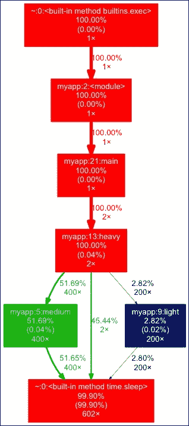
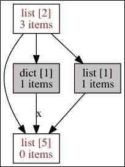
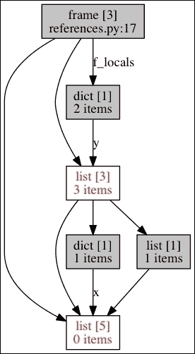
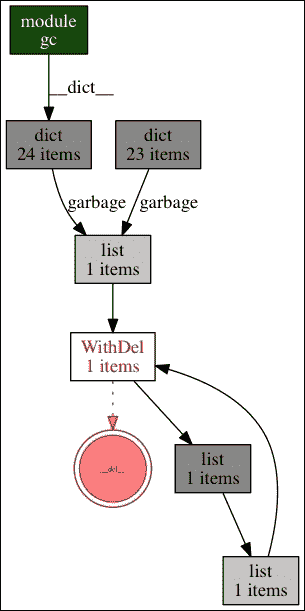

# 第十一章：优化-一般原则和分析技术

|   | *"我们应该忘记小的效率，大约有 97%的时间：过早的优化是万恶之源。"* |   |
| --- | --- | --- |
|   | --*唐纳德·克努斯* |

本章讨论了优化，并提供了一套通用原则和分析技术。它提供了每个开发人员都应该了解的三条优化规则，并提供了优化指南。最后，它着重介绍了如何找到瓶颈。

# 优化的三条规则

优化是有代价的，无论结果如何。当一段代码工作时，也许最好（有时）是不要试图不惜一切代价使其更快。在进行任何优化时，有一些规则需要牢记：

+   首先使其工作

+   从用户的角度出发

+   保持代码可读

## 首先使其工作

一个非常常见的错误是在编写代码时尝试对其进行优化。这在大多数情况下是毫无意义的，因为真正的瓶颈通常出现在你从未想到的地方。

应用程序通常由非常复杂的交互组成，在真正使用之前，很难完全了解发生了什么。

当然，这并不是不尝试尽快使其运行的原因。您应该小心尽量降低其复杂性，并避免无用的重复。但第一个目标是使其工作。这个目标不应该被优化努力所阻碍。

对于代码的每一行，Python 的哲学是有一种，最好只有一种方法来做。因此，只要你遵循 Pythonic 的语法，描述在第二章和第三章中描述的*语法最佳实践*，你的代码应该没问题。通常情况下，写更少的代码比写更多的代码更好更快。

在你的代码能够工作并且你准备进行分析之前，不要做任何这些事情：

+   首先编写一个全局字典来缓存函数的数据

+   考虑将代码的一部分外部化为 C 或 Cython 等混合语言

+   寻找外部库来进行基本计算

对于非常专业的领域，如科学计算或游戏，从一开始就使用专门的库和外部化可能是不可避免的。另一方面，使用像 NumPy 这样的库可能会简化特定功能的开发，并在最后产生更简单更快的代码。此外，如果有一个很好的库可以为你完成工作，你就不应该重写一个函数。

例如，Soya 3D 是一个基于 OpenGL 的游戏引擎（参见[`home.gna.org/oomadness/en/soya3d/index.html`](http://home.gna.org/oomadness/en/soya3d/index.html)），在渲染实时 3D 时使用 C 和 Pyrex 进行快速矩阵运算。

### 注意

优化是在已经工作的程序上进行的。

正如 Kent Beck 所说，“先让它工作，然后让它正确，最后让它快。”

## 从用户的角度出发

我曾见过一些团队致力于优化应用服务器的启动时间，而当服务器已经运行良好时，他们可能更好（有时）是不要尝试不惜一切代价使其更快。在进行任何优化时，有一些规则需要牢记：

虽然使程序启动更快从绝对角度来看是件好事，但团队应该谨慎地优先考虑优化工作，并问自己以下问题：

+   我被要求使其更快了吗？

+   谁发现程序运行缓慢？

+   真的很慢，还是可以接受？

+   使其更快需要多少成本，是否值得？

+   哪些部分需要快？

记住，优化是有成本的，开发人员的观点对客户来说毫无意义，除非您正在编写一个框架或库，而客户也是开发人员。

### 注意

优化不是一场游戏。只有在必要时才应该进行。

## 保持代码可读和易于维护

即使 Python 试图使常见的代码模式运行得最快，优化工作可能会使您的代码变得难以阅读。在产生可读且易于维护的代码与破坏代码以提高速度之间需要保持平衡。

当您达到 90%的优化目标，并且剩下的 10%使您的代码完全无法阅读时，最好停止工作或寻找其他解决方案。

### 注意

优化不应该使您的代码难以阅读。如果发生这种情况，您应该寻找替代解决方案，比如外部化或重新设计。要在可读性和速度之间寻找一个好的折衷方案。

# 优化策略

假设您的程序存在真正的速度问题需要解决。不要试图猜测如何使其更快。瓶颈通常很难通过查看代码来找到，需要一组工具来找到真正的问题。

一个良好的优化策略可以从以下三个步骤开始：

+   **找到另一个罪魁祸首**：确保第三方服务器或资源没有故障

+   **扩展硬件**：确保资源足够

+   **编写速度测试**：创建具有速度目标的场景

## 找到另一个罪魁祸首

通常，性能问题发生在生产级别，客户通知您它的工作方式与软件测试时不同。性能问题可能是因为应用程序没有计划在现实世界中与大量用户和数据大小增加的情况下运行。

但是，如果应用程序与其他应用程序进行交互，首先要做的是检查瓶颈是否位于这些交互上。例如，数据库服务器或 LDAP 服务器可能会导致额外的开销，并使一切变慢。

应用程序之间的物理链接也应该被考虑。也许您的应用程序服务器与内部网络中的另一台服务器之间的网络链接由于错误配置或拥塞而变得非常缓慢。

设计文档应提供所有交互的图表和每个链接的性质，以便全面了解系统并在尝试解决速度问题时提供帮助。

### 注意

如果您的应用程序使用第三方服务器或资源，每次交互都应该经过审计，以确保瓶颈不在那里。

## 扩展硬件

当没有更多的易失性内存可用时，系统开始使用硬盘来存储数据。这就是交换。

这会带来很多额外开销，并且性能会急剧下降。从用户的角度来看，系统在这个阶段被认为已经死机。因此，扩展硬件以防止这种情况发生非常重要。

虽然系统上有足够的内存很重要，但确保应用程序不会表现出异常行为并占用过多内存也很重要。例如，如果一个程序处理几百兆大小的大型视频文件，它不应该完全将它们加载到内存中，而是应该分块处理或使用磁盘流。

磁盘使用也很重要。如果 I/O 错误隐藏在试图反复写入磁盘的代码中，分区已满可能会严重减慢应用程序。此外，即使代码只尝试写入一次，硬件和操作系统也可能尝试多次写入。

请注意，升级硬件（垂直扩展）有一些明显的限制。你无法将无限量的硬件放入一个机架中。此外，高效的硬件价格极其昂贵（收益递减定律），因此这种方法也有经济上的限制。从这个角度来看，总是更好的是拥有可以通过添加新的计算节点或工作节点（水平扩展）来扩展的系统。这样可以使用性价比最高的商品软件来扩展服务。

不幸的是，设计和维护高度可扩展的分布式系统既困难又昂贵。如果你的系统不能轻松地进行水平扩展，或者垂直扩展更快更便宜，那么最好选择这种方法，而不是在系统架构的全面重新设计上浪费时间和资源。请记住，硬件的性能和价格总是随时间变得更快更便宜。许多产品都处于这种甜蜜点，它们的扩展需求与提高硬件性能的趋势相一致。

## 编写速度测试

在开始优化工作时，重要的是使用类似于测试驱动开发的工作流程，而不是不断地运行一些手动测试。一个好的做法是在应用程序中专门设置一个测试模块，其中编写了需要优化的调用序列。有了这种情景，您在优化应用程序时将有助于跟踪您的进展。

甚至可以编写一些断言，设置一些速度目标。为了防止速度回归，这些测试可以在代码优化后留下：

```py
>>> def test_speed():
...     import time
...     start = time.time()
...     the_code()
...     end = time.time() - start
...     assert end < 10, \
...     "sorry this code should not take 10 seconds !"
...** 

```

### 注意

测量执行速度取决于所使用的 CPU 的性能。但是我们将在下一节中看到如何编写通用的持续时间测量。

# 找到瓶颈

通过以下方式找到瓶颈：

+   分析 CPU 使用情况

+   分析内存使用情况

+   分析网络使用情况

## 分析 CPU 使用情况

瓶颈的第一个来源是你的代码。标准库提供了执行代码分析所需的所有工具。它们基于确定性方法。

**确定性分析器**通过在最低级别添加计时器来测量每个函数中花费的时间。这会引入一些开销，但可以很好地了解时间消耗在哪里。另一方面，**统计分析器**对指令指针的使用进行采样，不会对代码进行仪器化。后者不够准确，但允许以全速运行目标程序。

有两种方法可以对代码进行分析：

+   宏观分析：在程序运行时对整个程序进行分析并生成统计数据

+   微观分析：通过手动对程序的精确部分进行仪器化来测量

### 宏观分析

宏观分析是通过以特殊模式运行应用程序来完成的，解释器被仪器化以收集代码使用统计信息。Python 提供了几种工具来实现这一点：

+   `profile`：这是一个纯 Python 实现

+   `cProfile`：这是一个 C 实现，提供了与`profile`工具相同的接口，但开销较小

对大多数 Python 程序员来说，由于其开销较小，推荐的选择是`cProfile`。无论如何，如果需要以某种方式扩展分析器，那么`profile`可能是更好的选择，因为它不使用 C 扩展。

这两种工具具有相同的接口和用法，因此我们将只使用其中一个来展示它们的工作原理。以下是一个`myapp.py`模块，其中包含一个我们将使用`cProfile`测试的主函数：

```py
import time

def medium():
    time.sleep(0.01)

def light():
    time.sleep(0.001)

def heavy():
    for i in range(100):
        light()
        medium()
        medium()
    time.sleep(2)

def main():
    for i in range(2):
        heavy()

if __name__ == '__main__':
    main()
```

该模块可以直接从提示符中调用，并在此处总结结果：

```py
$ python3 -m cProfile myapp.py
 **1208 function calls in 8.243 seconds

 **Ordered by: standard name

 **ncalls  tottime  percall  cumtime  percall filename:lineno(function)
 **2    0.001    0.000    8.243    4.121 myapp.py:13(heavy)
 **1    0.000    0.000    8.243    8.243 myapp.py:2(<module>)
 **1    0.000    0.000    8.243    8.243 myapp.py:21(main)
 **400    0.001    0.000    4.026    0.010 myapp.py:5(medium)
 **200    0.000    0.000    0.212    0.001 myapp.py:9(light)
 **1    0.000    0.000    8.243    8.243 {built-in method exec}
 **602    8.241    0.014    8.241    0.014 {built-in method sleep}

```

提供的统计数据是由分析器填充的统计对象的打印视图。可以手动调用该工具：

```py
>>> import cProfile
>>> from myapp import main
>>> profiler = cProfile.Profile()
>>> profiler.runcall(main)
>>> profiler.print_stats()
 **1206 function calls in 8.243 seconds

 **Ordered by: standard name

 **ncalls  tottime  percall  cumtime  percall file:lineno(function)
 **2    0.001    0.000    8.243    4.121 myapp.py:13(heavy)
 **1    0.000    0.000    8.243    8.243 myapp.py:21(main)
 **400    0.001    0.000    4.026    0.010 myapp.py:5(medium)
 **200    0.000    0.000    0.212    0.001 myapp.py:9(light)
 **602    8.241    0.014    8.241    0.014 {built-in method sleep}

```

统计数据也可以保存在文件中，然后由`pstats`模块读取。该模块提供了一个知道如何处理分析文件并提供一些辅助功能的类的调用：

```py
>>> import pstats
>>> import cProfile
>>> from myapp import main
>>> cProfile.run('main()', 'myapp.stats')
>>> stats = pstats.Stats('myapp.stats')
>>> stats.total_calls
1208
>>> stats.sort_stats('time').print_stats(3)
Mon Apr  4 21:44:36 2016    myapp.stats

 **1208 function calls in 8.243 seconds

 **Ordered by: internal time
 **List reduced from 8 to 3 due to restriction <3>

 **ncalls  tottime  percall  cumtime  percall file:lineno(function)
 **602    8.241    0.014    8.241    0.014 {built-in method sleep}
 **400    0.001    0.000    4.025    0.010 myapp.py:5(medium)
 **2    0.001    0.000    8.243    4.121 myapp.py:13(heavy)

```

从那里，您可以通过打印每个函数的调用者和被调用者来浏览代码：

```py
>>> stats.print_callees('medium')
 **Ordered by: internal time
 **List reduced from 8 to 1 due to restriction <'medium'>

Function           called...
 **ncalls  tottime  cumtime
myapp.py:5(medium) ->  400    4.025    4.025  {built-in method sleep}

>>> stats.print_callees('light')
 **Ordered by: internal time
 **List reduced from 8 to 1 due to restriction <'light'>

Function           called...
 **ncalls  tottime  cumtime
myapp.py:9(light)  ->  200    0.212    0.212  {built-in method sleep}

```

能够对输出进行排序可以在不同的视图上查找瓶颈。例如，考虑以下情景：

+   当调用次数非常高并且占用大部分全局时间时，该函数或方法可能在循环中。通过将此调用移动到不同的范围以减少操作次数，可能可以进行可能的优化

+   当一个函数执行时间很长时，如果可能的话，缓存可能是一个不错的选择

从分析数据中可视化瓶颈的另一个好方法是将它们转换成图表（见*图 1*）。**Gprof2Dot**（[`github.com/jrfonseca/gprof2dot`](https://github.com/jrfonseca/gprof2dot)）可以将分析器数据转换为点图。您可以使用`pip`从 PyPI 下载这个简单的脚本，并在安装了 Graphviz（参见[`www.graphviz.org/`](http://www.graphviz.org/)）的环境中使用它：

```py
$ gprof2dot.py -f pstats myapp.stats | dot -Tpng -o output.png

```

`gprof2dot`的优势在于它试图成为一种语言无关的工具。它不仅限于 Python `profile`或`cProfile`的输出，还可以从多个其他配置文件中读取，比如 Linux perf、xperf、gprof、Java HPROF 等等。



图 1 使用 gprof2dot 生成的分析概览图的示例

宏观分析是检测有问题的函数或者它的周边的一个好方法。当你找到它之后，你可以转向微观分析。

### 微观分析

当找到慢函数时，有时需要进行更多的分析工作，测试程序的一部分。这是通过手动在代码的一部分进行仪器化速度测试来完成的。

例如，可以使用`cProfile`模块作为装饰器：

```py
>>> import tempfile, os, cProfile, pstats
>>> def profile(column='time', list=5):
...     def _profile(function):
...         def __profile(*args, **kw):
...             s = tempfile.mktemp()
...             profiler = cProfile.Profile()
...             profiler.runcall(function, *args, **kw)
...             profiler.dump_stats(s)
...             p = pstats.Stats(s)
...             p.sort_stats(column).print_stats(list)
...         return __profile
...     return _profile
...
>>> from myapp import main
>>> @profile('time', 6)
... def main_profiled():
...     return main()
...
>>> main_profiled()
Mon Apr  4 22:01:01 2016    /tmp/tmpvswuovz_

 **1207 function calls in 8.243 seconds

 **Ordered by: internal time
 **List reduced from 7 to 6 due to restriction <6>

 **ncalls  tottime  percall  cumtime  percall file:lineno(function)
 **602    8.241    0.014    8.241    0.014 {built-in method sleep}
 **400    0.001    0.000    4.026    0.010 myapp.py:5(medium)
 **2    0.001    0.000    8.243    4.121 myapp.py:13(heavy)
 **200    0.000    0.000    0.213    0.001 myapp.py:9(light)
 **1    0.000    0.000    8.243    8.243 myapp.py:21(main)
 **1    0.000    0.000    8.243    8.243 <stdin>:1(main_profiled)

>>> from myapp import light
>>> stats = profile()(light)
>>> stats()
Mon Apr  4 22:01:57 2016    /tmp/tmpnp_zk7dl

 **3 function calls in 0.001 seconds

 **Ordered by: internal time

 **ncalls  tottime  percall  cumtime  percall file:lineno(function)
 **1    0.001    0.001    0.001    0.001 {built-in method sleep}
 **1    0.000    0.000    0.001    0.001 myapp.py:9(light)

```

这种方法允许测试应用程序的部分，并锐化统计输出。但在这个阶段，拥有一个调用者列表可能并不有趣，因为函数已经被指出为需要优化的函数。唯一有趣的信息是知道它有多快，然后加以改进。

`timeit`更适合这种需求，它提供了一种简单的方法来测量小代码片段的执行时间，使用主机系统提供的最佳底层计时器（`time.time`或`time.clock`）：

```py
>>> from myapp import light
>>> import timeit
>>> t = timeit.Timer('main()')
>>> t.timeit(number=5)
10000000 loops, best of 3: 0.0269 usec per loop
10000000 loops, best of 3: 0.0268 usec per loop
10000000 loops, best of 3: 0.0269 usec per loop
10000000 loops, best of 3: 0.0268 usec per loop
10000000 loops, best of 3: 0.0269 usec per loop
5.6196951866149902

```

该模块允许您重复调用，并且旨在尝试独立的代码片段。这在应用程序上下文之外非常有用，比如在提示符中，但在现有应用程序中使用起来并不方便。

### 注

确定性分析器将根据计算机正在执行的操作提供结果，因此结果可能每次都会有所不同。多次重复相同的测试并进行平均值计算可以提供更准确的结果。此外，一些计算机具有特殊的 CPU 功能，例如**SpeedStep**，如果计算机在启动测试时处于空闲状态，可能会改变结果（参见[`en.wikipedia.org/wiki/SpeedStep`](http://en.wikipedia.org/wiki/SpeedStep)）。因此，对小代码片段进行持续重复测试是一个好的做法。还有一些其他缓存需要记住，比如 DNS 缓存或 CPU 缓存。

但`timeit`的结果应该谨慎使用。它是一个非常好的工具，可以客观比较两个短代码片段，但也容易让您犯下危险的错误，导致令人困惑的结论。例如，使用`timeit`模块比较两个无害的代码片段，可能会让您认为通过加法进行字符串连接比`str.join()`方法更快：

```py
$ python3 -m timeit -s 'a = map(str, range(1000))' '"".join(a)'
1000000 loops, best of 3: 0.497 usec per loop

$ python3 -m timeit -s 'a = map(str, range(1000)); s=""' 'for i in a: s += i'
10000000 loops, best of 3: 0.0808 usec per loop

```

从第二章 *语法最佳实践 - 类级别以下*，我们知道通过加法进行字符串连接不是一个好的模式。尽管有一些微小的 CPython 微优化专门为这种用例设计，但最终会导致二次运行时间。问题在于`timeit`的`setup`参数（命令行中的`-s`参数）以及 Python 3 中范围的工作方式的细微差别。我不会讨论问题的细节，而是留给您作为练习。无论如何，以下是在 Python 3 中使用`str.join()`习惯用法来比较字符串连接的正确方法：

```py
$ python3 -m timeit -s 'a = [str(i) for i in range(10000)]' 's="".join(a)'
10000 loops, best of 3: 128 usec per loop

$ python3 -m timeit -s 'a = [str(i) for i in range(10000)]' '
>s = ""
>for i in a:
>    s += i
>'
1000 loops, best of 3: 1.38 msec per loop

```

### 测量 Pystones

在测量执行时间时，结果取决于计算机硬件。为了能够产生一个通用的度量，最简单的方法是对一段固定的代码序列进行速度基准测试，并计算出一个比率。从那里，函数所花费的时间可以转换为一个通用值，可以在任何计算机上进行比较。

### 注

有很多用于测量计算机性能的通用基准测试工具。令人惊讶的是，一些很多年前创建的工具今天仍在使用。例如，Whetstone 是在 1972 年创建的，当时它提供了一种 Algol 60 的计算机性能分析器。它用于测量**每秒 Whetstone 百万条指令**（**MWIPS**）。在[`freespace.virgin.net/roy.longbottom/whetstone%20results.htm`](http://freespace.virgin.net/roy.longbottom/whetstone%20results.htm)上维护了一张旧 CPU 和现代 CPU 的结果表。

Python 在其`test`包中提供了一个基准测试工具，用于测量一系列精心选择的操作的持续时间。结果是计算机每秒能够执行的**pystones**数量，以及执行基准测试所用的时间，通常在现代硬件上大约为一秒：

```py
>>> from test import pystone
>>> pystone.pystones()
(1.0500000000000007, 47619.047619047589)

```

速率可以用来将配置持续时间转换为一定数量的 pystones：

```py
>>> from test import pystone
>>> benchtime, pystones = pystone.pystones()
>>> def seconds_to_kpystones(seconds):
...     return (pystones*seconds) / 1000** 
...** 
...** 
>>> seconds_to_kpystones(0.03)
1.4563106796116512
>>> seconds_to_kpystones(1)
48.543689320388381
>>> seconds_to_kpystones(2)
97.087378640776762

```

`seconds_to_kpystones`返回**千 pystones**的数量。如果您想对执行速度进行编码，这种转换可以包含在您的测试中。

拥有 pystones 将允许您在测试中使用这个装饰器，以便您可以对执行时间进行断言。这些测试将在任何计算机上都可以运行，并且将允许开发人员防止速度回归。当应用程序的一部分被优化后，他们将能够在测试中设置其最大执行时间，并确保它不会被进一步的更改所违反。这种方法当然不是理想的，也不是 100%准确的，但至少比将执行时间断言硬编码为以秒为单位的原始值要好。

## 内存使用情况

优化应用程序时可能遇到的另一个问题是内存消耗。如果程序开始占用太多内存，以至于系统开始交换，那么您的应用程序中可能存在太多对象被创建的地方，或者您并不打算保留的对象仍然被一些意外的引用保持活动。这通常很容易通过经典的分析来检测，因为消耗足够的内存使系统交换涉及到很多可以被检测到的 CPU 工作。但有时候这并不明显，内存使用情况必须进行分析。

### Python 如何处理内存

当您使用 CPython 实现时，内存使用可能是 Python 中最难进行分析的事情。虽然像 C 这样的语言允许您获取任何元素的内存大小，但 Python 永远不会让您知道给定对象消耗了多少内存。这是由于语言的动态性质，以及内存管理不直接可访问给语言用户。

内存管理的一些原始细节已经在第七章中解释过了，*其他语言中的 Python 扩展*。我们已经知道 CPython 使用引用计数来管理对象分配。这是一种确定性算法，可以确保当对象的引用计数降至零时，将触发对象的释放。尽管是确定性的，但这个过程不容易在复杂的代码库中手动跟踪和推理。此外，根据 CPython 解释器的编译标志、系统环境或运行时上下文，内部内存管理器层可能决定留下一些空闲内存块以便将来重新分配，而不是完全释放它。

CPython 实现中的额外微优化也使得预测实际内存使用变得更加困难。例如，指向相同短字符串或小整数值的两个变量可能指向内存中的同一个对象实例，也可能不是。

尽管看起来相当可怕和复杂，但 Python 中的内存管理有很好的文档记录（参考[`docs.python.org/3/c-api/memory.html`](https://docs.python.org/3/c-api/memory.html)）。请注意，在调试内存问题时，大多数情况下可以忽略之前提到的微优化。此外，引用计数基本上是基于一个简单的陈述——如果给定对象不再被引用，它就会被移除。换句话说，在解释器之后，函数中的所有局部引用都会被移除。

+   离开函数

+   确保对象不再被使用

因此，仍然在内存中的对象有：

+   全局对象

+   仍然以某种方式被引用的对象

要小心**参数** **入站** **出站**的边缘情况。如果在参数中创建了一个对象，如果函数返回该对象，则参数引用仍然存在。如果将其用作默认值，可能会导致意外结果：

```py
>>> def my_function(argument={}):  # bad practice
...     if '1' in argument:
...         argument['1'] = 2
...     argument['3'] = 4
...     return argument
...** 
>>> my_function()
{'3': 4}
>>> res = my_function()
>>> res['4'] = 'I am still alive!'
>>> print my_function()
{'3': 4, '4': 'I am still alive!'}

```

这就是为什么应该始终使用不可变对象的原因，就像这样：

```py
>>> def my_function(argument=None):  # better practice
...     if argument is None:
...         argument = {}  # a fresh dict is created everytime
...     if '1' in argument:
...         argument['1'] = 2
...     argument['3'] = 4
...     return argument
...** 
>>> my_function()
{'3': 4}
>>> res = my_function()
>>> res['4'] = 'I am still alive!'
>>> print my_function()
{'3': 4}

```

Python 中的引用计数很方便，可以免除手动跟踪对象引用和手动销毁对象的义务。尽管这引入了另一个问题，即开发人员从不清理内存中的实例，如果开发人员不注意使用数据结构的方式，它可能会以不受控制的方式增长。

通常的内存占用者有：

+   不受控制地增长的缓存

+   全局注册实例的对象工厂，并且不跟踪它们的使用情况，比如每次调用查询时都会使用的数据库连接器创建者

+   线程没有正确完成

+   具有`__del__`方法并涉及循环的对象也会占用内存。在 Python 的旧版本（3.4 版本之前），垃圾收集器不会打破循环，因为它无法确定应该先删除哪个对象。因此，会造成内存泄漏。在大多数情况下，使用这种方法都是一个坏主意。

不幸的是，在使用 Python/C API 的 C 扩展中，必须手动管理引用计数和引用所有权，使用`Py_INCREF()`和`Py_DECREF()`宏。我们在第七章中已经讨论了处理引用计数和引用所有权的注意事项，所以你应该已经知道这是一个充满各种陷阱的相当困难的话题。这就是为什么大多数内存问题是由没有正确编写的 C 扩展引起的。

### 内存分析

在开始解决 Python 中的内存问题之前，您应该知道 Python 中内存泄漏的性质是非常特殊的。在一些编译语言如 C 和 C++中，内存泄漏几乎完全是由不再被任何指针引用的分配的内存块引起的。如果您没有对内存的引用，就无法释放它，这种情况被称为*内存泄漏*。在 Python 中，用户没有低级内存管理，所以我们更多地处理泄漏的引用——对不再需要但未被移除的对象的引用。这会阻止解释器释放资源，但与 C 中的内存泄漏情况不同。当然，也总是有 C 扩展的特殊情况，但它们是一种完全不同类型的东西，需要完全不同的工具链，而且不能轻易从 Python 代码中检查。

因此，Python 中的内存问题主要是由意外或非计划的资源获取模式引起的。很少情况下，这是由于内存分配和释放例程的错误处理引起的真正错误。这样的例程只在 CPython 中在使用 Python/C API 编写 C 扩展时才对开发人员可用，而且很少会遇到。因此，Python 中所谓的内存泄漏主要是由软件的过度复杂性和其组件之间的次要交互引起的，这些问题很难追踪。为了发现和定位软件的这些缺陷，您需要了解程序中实际内存使用的情况。

获取有关由 Python 解释器控制的对象数量及其实际大小的信息有点棘手。例如，要知道给定对象的大小需要遍历其所有属性，处理交叉引用，然后将所有内容相加。如果考虑到对象相互引用的方式，这是一个相当困难的问题。`gc`模块没有为此提供高级函数，而且需要 Python 以调试模式编译才能获得完整的信息。

通常，程序员在执行给定操作之后和之前会询问系统关于其应用程序的内存使用情况。但这种测量是一种近似值，很大程度上取决于系统级别的内存管理方式。例如，在 Linux 下使用`top`命令或在 Windows 下使用任务管理器，可以在内存问题明显时检测到内存问题。但这种方法很费力，使得很难追踪到有问题的代码块。

幸运的是，有一些工具可以创建内存快照并计算加载对象的数量和大小。但让我们记住，Python 不会轻易释放内存，它更愿意保留内存以防再次需要。

有一段时间，调试 Python 中的内存问题和使用情况时最流行的工具之一是 Guppy-PE 及其 Heapy 组件。不幸的是，它似乎已不再维护，并且缺乏 Python 3 支持。幸运的是，还有一些其他替代方案在某种程度上与 Python 3 兼容：

+   **Memprof** ([`jmdana.github.io/memprof/`](http://jmdana.github.io/memprof/))：宣称可在 Python 2.6、2.7、3.1、3.2 和 3.3 以及一些符合 POSIX 标准的系统（Mac OS X 和 Linux）上运行

+   **memory_profiler** ([`pypi.python.org/pypi/memory_profiler`](https://pypi.python.org/pypi/memory_profiler))：宣称支持与 Memprof 相同的 Python 版本和系统

+   **Pympler** ([`pythonhosted.org/Pympler/`](http://pythonhosted.org/Pympler/))：宣称支持 Python 2.5、2.6、2.7、3.1、3.2、3.3 和 3.4，并且与操作系统无关

请注意，前面的信息纯粹基于最新版本的特色软件包使用的 trove 分类器。这可能会在本书编写后的时间内轻松更改。尽管如此，目前有一个软件包支持最广泛的 Python 版本，并且也已知在 Python 3.5 下完美运行。它就是`objgraph`。它的 API 似乎有点笨拙，并且功能集非常有限。但它工作正常，做了它需要做的事情，并且非常容易使用。内存检测不是永久添加到生产代码中的东西，因此这个工具不需要很漂亮。由于它在 OS 独立性中支持 Python 版本的广泛支持，我们在讨论内存分析示例时将只关注`objgraph`。本节提到的其他工具也是令人兴奋的软件，但您需要自行研究它们。

#### objgraph

`objgraph`（参见[`mg.pov.lt/objgraph/`](http://mg.pov.lt/objgraph/)）是一个简单的工具，用于创建对象引用的图表，应该在查找 Python 内存泄漏时非常有用。它可以在 PyPI 上找到，但它不是一个完全独立的工具，需要 Graphviz 来创建内存使用图表。对于像 Mac OS X 或 Linux 这样的开发人员友好的系统，您可以使用您喜欢的系统包管理器轻松获取它。对于 Windows，您需要从项目页面（参见[`www.graphviz.org/`](http://www.graphviz.org/)）下载 Graphviz 安装程序并手动安装。

`objgraph` 提供了多种实用工具，允许您列出和打印有关内存使用和对象计数的各种统计信息。以下是一个使用这些实用程序的示例，显示了解释器会话的转录。

```py
>>> import objgraph
>>> objgraph.show_most_common_types()
function                   1910
dict                       1003
wrapper_descriptor         989
tuple                      837
weakref                    742
method_descriptor          683
builtin_function_or_method 666
getset_descriptor          338
set                        323
member_descriptor          305
>>> objgraph.count('list')
266
>>> objgraph.typestats(objgraph.get_leaking_objects())
{'Gt': 1, 'AugLoad': 1, 'GtE': 1, 'Pow': 1, 'tuple': 2, 'AugStore': 1, 'Store': 1, 'Or': 1, 'IsNot': 1, 'RecursionError': 1, 'Div': 1, 'LShift': 1, 'Mod': 1, 'Add': 1, 'Invert': 1, 'weakref': 1, 'Not': 1, 'Sub': 1, 'In': 1, 'NotIn': 1, 'Load': 1, 'NotEq': 1, 'BitAnd': 1, 'FloorDiv': 1, 'Is': 1, 'RShift': 1, 'MatMult': 1, 'Eq': 1, 'Lt': 1, 'dict': 341, 'list': 7, 'Param': 1, 'USub': 1, 'BitOr': 1, 'BitXor': 1, 'And': 1, 'Del': 1, 'UAdd': 1, 'Mult': 1, 'LtE': 1}

```

如前所述，`objgraph`允许您创建内存使用模式和交叉引用的图表。该库最有用的图表工具是`objgraph.show_refs()`和`objgraph.show_backrefs()`。它们都接受对被检查对象的引用，并使用 Graphviz 包将图表图像保存到文件中。这些图的示例在*图 2*和*图 3*中呈现。

以下是用于创建这些图表的代码：

```py
import objgraph

def example():
    x = []
    y = [x, [x], dict(x=x)]

    objgraph.show_refs(
        (x, y),
        filename='show_refs.png',
        refcounts=True
    )
    objgraph.show_backrefs(
        (x, y),
        filename='show_backrefs.png',
        refcounts=True
    )

if __name__ == "__main__":
    example()
```

*图 2*显示了由`x`和`y`对象持有的所有引用的图表。从上到下，从左到右，它确切地呈现了四个对象：

+   `y = [x, [x], dict(x=x)]` 列表实例

+   `dict(x=x)` 字典实例

+   `[x]` 列表实例

+   `x = []` 列表实例



图 2 `show_refs()` 函数的示例结果

*图 3*不仅显示了`x`和`y`之间的引用，还显示了所有持有对这两个实例的引用的对象。这些被称为反向引用，对于找到阻止其他对象被释放的对象非常有帮助。



图 3 `show_backrefs()` 函数的示例结果

为了展示`objgraph`如何在实践中使用，让我们回顾一些实际的例子。正如我们在本书中已经多次提到的，CPython 有自己的垃圾收集器，它独立于其引用计数方法存在。它不用于一般的内存管理，而仅用于解决循环引用的问题。在许多情况下，对象可能以一种使得使用简单的基于跟踪引用数量的技术无法删除它们的方式相互引用。以下是最简单的例子：

```py
x = []
y = [x]
x.append(y)
```

这种情况在*图 4*中以可视化方式呈现。在前面的情况下，即使所有对`x`和`y`对象的外部引用都将被移除（例如，通过从函数的局部范围返回），这两个对象也不能被移除，因为这两个对象仍然拥有的两个交叉引用。这是 Python 垃圾收集器介入的情况。它可以检测到对象的循环引用并在循环外没有其他有效引用时触发它们的释放。


图 4 两个对象之间循环引用的示例图表

当这样的循环中至少有一个对象定义了自定义的`__del__()`方法时，真正的问题开始。这是一个自定义的释放处理程序，当对象的引用计数最终变为零时将被调用。它可以执行任意的 Python 代码，因此也可以创建对特色对象的新引用。这就是为什么在 Python 3.4 版本之前的垃圾收集器无法打破引用循环的原因，如果其中至少有一个对象提供了自定义的`__del__()`方法实现。PEP 442 引入了对 Python 的安全对象最终化，并成为 Python 3.4 版本开始的标准的一部分。无论如何，这对于担心向后兼容性并针对广泛的 Python 解释器版本的软件包仍可能是一个问题。以下代码片段向您展示了不同 Python 版本中循环垃圾收集器行为的差异：

```py
import gc
import platform
import objgraph

class WithDel(list):
    """ list subclass with custom __del__ implementation """
    def __del__(self):
        pass

def main():
    x = WithDel()
    y = []
    z = []

    x.append(y)
    y.append(z)
    z.append(x)

    del x, y, z

    print("unreachable prior collection: %s" % gc.collect())
    print("unreachable after collection: %s" % len(gc.garbage))
    print("WithDel objects count:        %s" %
          objgraph.count('WithDel'))

if __name__ == "__main__":
    print("Python version: %s" % platform.python_version())
    print()
    main()
```

在 Python 3.3 下执行上述代码的输出显示，旧版本的 Python 中的循环垃圾收集器无法收集定义了`__del__()`方法的对象：

```py
$ python3.3 with_del.py** 
Python version: 3.3.5

unreachable prior collection: 3
unreachable after collection: 1
WithDel objects count:        1

```

在较新版本的 Python 中，垃圾收集器可以安全地处理对象的最终化，即使它们定义了`__del__()`方法：

```py
$ python3.5 with_del.py** 
Python version: 3.5.1

unreachable prior collection: 3
unreachable after collection: 0
WithDel objects count:        0

```

尽管在最新的 Python 版本中自定义最终化不再棘手，但对于需要在不同环境下工作的应用程序仍然是一个问题。如前所述，`objgraph.show_refs()`和`objgraph.show_backrefs()`函数允许您轻松地发现有问题的类实例。例如，我们可以轻松修改`main()`函数以显示对`WithDel`实例的所有反向引用，以查看是否存在泄漏资源：

```py
def main():
    x = WithDel()
    y = []
    z = []

    x.append(y)
    y.append(z)
    z.append(x)

    del x, y, z

    print("unreachable prior collection: %s" % gc.collect())
    print("unreachable after collection: %s" % len(gc.garbage))
    print("WithDel objects count:        %s" %
          objgraph.count('WithDel'))

    objgraph.show_backrefs(
        objgraph.by_type('WithDel'),
        filename='after-gc.png'
    )
```

在 Python 3.3 下运行上述示例将导致一个图表（见*图 5*），显示`gc.collect()`无法成功移除`x`、`y`和`z`对象实例。此外，`objgraph`突出显示了所有定义了自定义`__del__()`方法的对象，以便更容易地发现此类问题。



图 5 显示在 Python 3.4 版本之前无法被 Python 垃圾收集器捕获的循环引用的示例图表

### C 代码内存泄漏

如果 Python 代码看起来完全正常，当您循环执行隔离的函数时内存仍然增加，那么泄漏可能发生在 C 端。例如，当缺少`Py_DECREF`调用时会发生这种情况。

Python 核心代码非常健壮，并经过泄漏测试。如果您使用具有 C 扩展的软件包，它们可能是首先要查看的地方。因为您将处理的代码比 Python 的抽象级别低得多，您需要使用完全不同的工具来解决此类内存问题。

在 C 中进行内存调试并不容易，因此在深入研究扩展内部之前，请确保正确诊断问题的根源。隔离一个可疑的包并使用类似于单元测试的代码是一个非常流行的方法：

+   为您怀疑泄漏内存的扩展的每个 API 单元或功能编写单独的测试

+   在隔离中进行测试循环（每次运行一个测试）

+   从外部观察被测试功能中哪些会随时间增加内存使用量

使用这种方法，您可以隔离扩展的故障部分，这将减少以后检查和修复其代码所需的时间。这个过程可能看起来很繁重，因为它需要大量额外的时间和编码，但从长远来看，它真的很值得。您可以通过重用一些测试工具来简化工作，这些工具在第十章中介绍，*测试驱动开发*。像 tox 这样的实用程序也许并不是专门为这种情况设计的，但它们至少可以减少在隔离环境中运行多个测试所需的时间。

希望您已经隔离了扩展中泄漏内存的部分，并最终可以开始实际调试。如果您很幸运，对源代码进行简单的手动检查可能会得到期望的结果。在许多情况下，问题就像添加丢失的`Py_DECREF`调用一样简单。然而，在大多数情况下，我们的工作并不那么简单。在这种情况下，您需要使用一些更强大的工具。在编译代码中对抗内存泄漏的一个显著通用工具是**Valgrind**，它应该是每个程序员的工具包中的一部分。它是一个用于构建动态分析工具的整个仪器框架。因此，它可能不容易学习和掌握，但您绝对应该了解基础知识。

## 分析网络使用情况

正如我之前所说，与数据库、缓存、Web 服务或 LDAP 服务器等第三方程序通信的应用程序在这些应用程序运行缓慢时可能会变慢。这可以通过应用程序端的常规代码分析方法进行跟踪。但是，如果第三方软件单独运行良好，那么问题很可能是网络。

问题可能是配置错误的中心、低带宽网络链接，甚至是大量的流量碰撞，导致计算机多次发送相同的数据包。

以下是一些要素，可以帮助您了解正在发生什么，首先需要调查三个领域：

+   使用诸如以下工具监视网络流量：

+   `ntop`：[`www.ntop.org`](http://www.ntop.org)（仅限 Linux）

+   `wireshark`：[www.wireshark.org](http://www.wireshark.org)（以前称为 Ethereal）

+   使用`net-snmp`（[`www.net-snmp.org`](http://www.net-snmp.org)）跟踪不健康或配置错误的设备。

+   使用统计工具`Pathrate`估算两台计算机之间的带宽。参见[`www.cc.gatech.edu/~dovrolis/bw-est/pathrate.html`](http://www.cc.gatech.edu/~dovrolis/bw-est/pathrate.html)。

如果您想进一步了解网络性能问题，您可能还想阅读*网络性能开源工具包*，作者 Richard Blum，*Wiley*。这本书介绍了调整大量使用网络的应用程序的策略，并提供了扫描复杂网络问题的教程。

*高性能 MySQL*，*O'Reilly Media*，作者 Jeremy Zawodny 在编写使用 MySQL 的应用程序时也是一本不错的书。

# 总结

在本章中，我们已经看到：

+   优化的三个规则：

+   先让它工作

+   以用户的角度看问题

+   保持代码可读性

+   基于编写具有速度目标的场景的优化策略

+   如何分析 CPU 或内存使用情况以及一些网络分析的技巧

现在您知道如何定位性能问题，下一章将介绍一些流行和通用的策略来摆脱这些问题。
