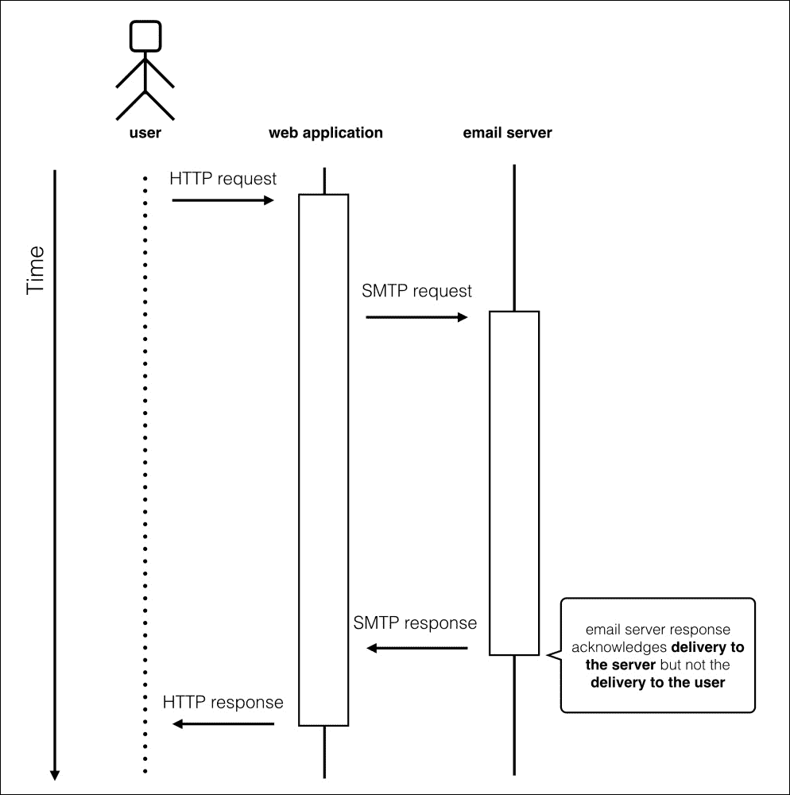
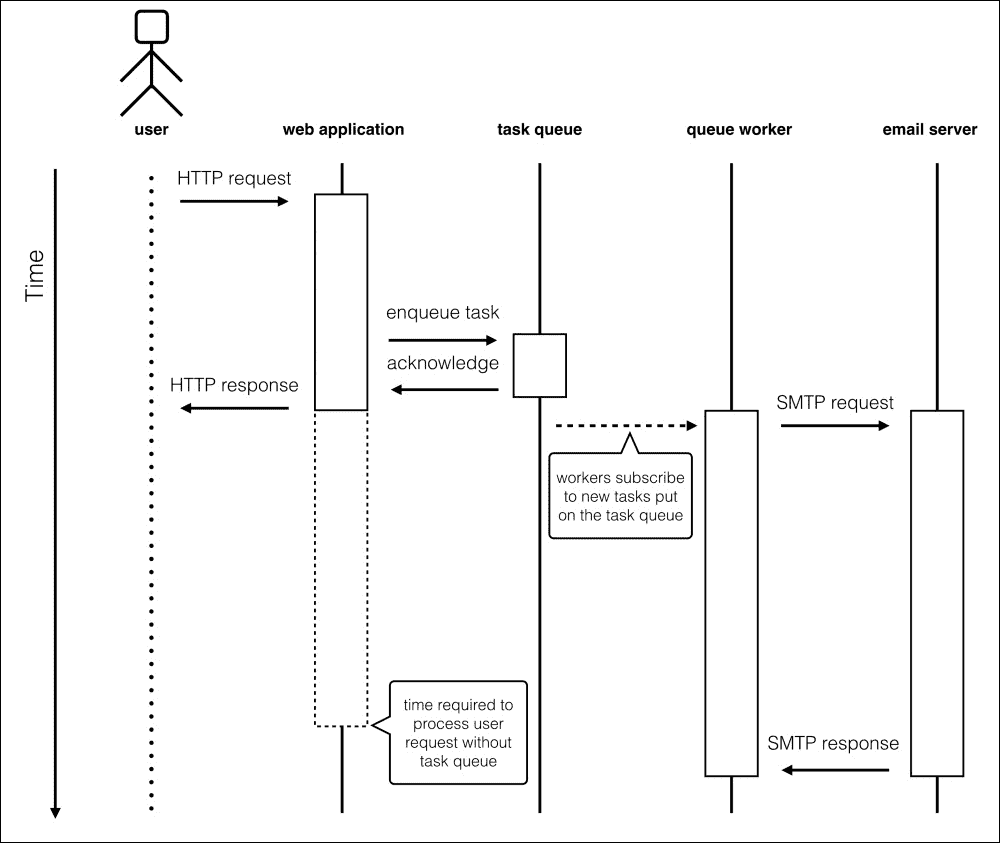
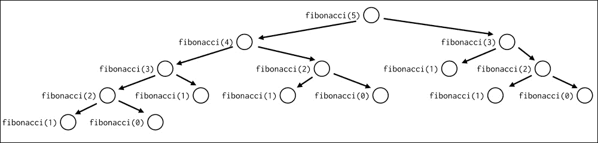
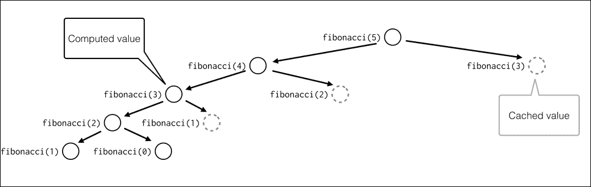

# 第十二章：优化-一些强大的技术

优化程序并不是一个神奇的过程。它是通过遵循一个简单的算法完成的，由 Stefan Schwarzer 在 Europython 2006 中合成的原始伪代码示例：

```py
def optimize():
    """Recommended optimization"""
    assert got_architecture_right(), "fix architecture"
    assert made_code_work(bugs=None), "fix bugs"
    while code_is_too_slow():
        wbn = find_worst_bottleneck(just_guess=False,
                                    profile=True)
        is_faster = try_to_optimize(wbn,
                                    run_unit_tests=True,
                                    new_bugs=None)
        if not is_faster:
            undo_last_code_change()

# By Stefan Schwarzer, Europython 2006
```

这个例子可能不是最整洁和最清晰的例子，但基本上涵盖了组织优化过程的所有重要方面。我们从中学到的主要内容是：

+   优化是一个迭代过程，不是每一次迭代都会带来更好的结果

+   主要的前提是经过测试验证的代码能够正常工作

+   您应该始终专注于优化当前的应用程序瓶颈

使您的代码运行更快并不是一件容易的事情。在抽象数学问题的情况下，解决方案当然在于选择正确的算法和适当的数据结构。但在这种情况下，很难提供一些通用的提示和技巧，可以用于解决算法问题的任何代码。当然，有一些通用的方法论用于设计新算法，甚至可以应用于各种问题的元启发式算法，但它们是相当与语言无关的，因此超出了本书的范围。

无论如何，一些性能问题只是由特定的代码质量缺陷或应用程序使用上下文引起的。例如，应用程序的速度可能会因为：

+   基本内置类型的错误使用

+   过于复杂

+   硬件资源使用模式与执行环境不匹配

+   等待第三方 API 或后台服务的响应时间过长

+   在应用程序的时间关键部分做得太多

更多时候，解决这些性能问题并不需要高级的学术知识，而只需要良好的软件工艺。而工艺的一大部分就是知道何时使用适当的工具。幸运的是，有一些处理性能问题的众所周知的模式和解决方案。

在本章中，我们将讨论一些流行且可重复使用的解决方案，使您能够通过非算法优化程序：

+   降低复杂性

+   使用架构权衡

+   缓存

# 降低复杂性

在我们进一步探讨优化技术之前，让我们明确定义我们要处理的内容。从本章的介绍中，我们知道专注于改进应用程序瓶颈对于成功的优化至关重要。瓶颈是严重限制程序或计算机系统容量的单个组件。每个具有性能问题的代码的一个重要特征是它通常只有一个瓶颈。我们在上一章中讨论了一些分析技术，所以您应该已经熟悉了定位和隔离这些地方所需的工具。如果您的分析结果显示有一些地方需要立即改进，那么您应该首先尝试将每个地方视为一个独立的组件并进行独立优化。

当然，如果没有明显的瓶颈，但您的应用程序仍然表现不符合您的期望，那么您真的处于一个糟糕的位置。优化过程的收益与优化瓶颈的性能影响成正比。优化每个不会对整体执行时间或资源消耗产生实质性贡献的小组件，只会让您在分析和优化上花费的时间获益微薄。如果您的应用程序似乎没有真正的瓶颈，有可能是您遗漏了某些东西。尝试使用不同的分析策略或工具，或者从不同的角度（内存、I/O 操作或网络吞吐量）来看待它。如果这并没有帮助，您应该真正考虑修改您的软件架构。

但是，如果您成功找到了限制应用程序性能的单个完整组件，那么您真的很幸运。很有可能，只需进行最小的代码改进，您就能真正提高代码执行时间和/或资源使用率。而优化的收益将再次与瓶颈的大小成正比。

在尝试提高应用程序性能时，首要和最明显的方面是复杂性。关于程序复杂性有很多定义，也有很多表达方式。一些复杂度度量标准可以提供关于代码行为的客观信息，有时这些信息可以推断出性能期望。有经验的程序员甚至可以可靠地猜测两种不同的实现在实践中的性能，知道它们的复杂性和现实的执行环境。

定义应用程序复杂性的两种流行方法是：

+   圈复杂度经常与应用程序性能相关联

+   Landau 符号，也称为大 O 符号，是一种非常有用的算法分类方法，可以客观地评判性能。

从那里，优化过程有时可以理解为降低复杂性的过程。本节提供了简化循环的简单技巧。但首先，让我们学习如何测量复杂性。

## 圈复杂度

圈复杂度是由 Thomas J. McCabe 在 1976 年开发的一个度量标准。因为它的作者，它经常被称为 McCabe 的复杂度。它衡量了代码中的线性路径数量。所有的 if，for 和 while 循环都被计算出一个度量。

然后可以将代码分类如下：

| 圈复杂度 | 它的含义 |
| --- | --- |
| 1 到 10 | 不复杂 |
| 11 到 20 | 中等复杂 |
| 21 到 50 | 真的很复杂 |
| 大于 50 | 太复杂 |

圈复杂度更多是代码质量评分，而不是客观评判其性能的度量标准。它不能取代寻找性能瓶颈的代码性能分析的需要。无论如何，具有较高圈复杂度的代码往往倾向于使用相当复杂的算法，这些算法在输入数据较大时可能表现不佳。

尽管圈复杂度不是判断应用程序性能的可靠方法，但它有一个非常好的优势。它是一个源代码度量标准，因此可以用适当的工具来测量。这不能说是关于表达复杂性的其他方式——大 O 符号。由于可测量性，圈复杂度可能是对性能分析的有用补充，它可以为您提供有关软件问题部分的更多信息。在考虑根本性的代码架构重设计时，复杂的代码部分是首先要审查的。

在 Python 中测量 McCabe 的复杂度相对简单，因为它可以从其抽象语法树中推导出来。当然，你不需要自己做这个。一个为 Python 提供圈复杂度测量的流行工具是 flake8（带有 mccabe 插件），它已经在第四章“选择良好的名称”中介绍过。

## 大 O 符号

定义函数复杂性的最经典方法是大 O 符号。这个度量标准定义了算法如何受输入数据大小的影响。例如，算法是否与输入数据的大小成线性关系还是二次关系？

手动计算算法的大 O 符号是获得算法性能与输入数据大小关系概览的最佳方法。了解应用程序组件的复杂度使您能够检测并专注于真正减慢代码的部分。

为了衡量大 O 符号，所有常数和低阶项都被移除，以便专注于当输入数据增长时真正起作用的部分。这个想法是尝试将算法归类为这些类别中的一个，即使它是一个近似值：

| 符号 | 类型 |
| --- | --- |
| O(1) | 常数。不依赖于输入数据。 |
| O(n) | 线性。随着“n”的增长而增长。 |
| O(n log n) | 准线性。 |
| O(n²) | 二次复杂度。 |
| O(n³) | 立方复杂度。 |
| O(n!) | 阶乘复杂度。 |

例如，我们已经从第二章中知道，`dict`查找的平均复杂度是*O(1)*。无论`dict`中有多少元素，它都被认为是常数，而查找特定项的列表中的元素是*O(n)*。

让我们来看另一个例子：

```py
>>> def function(n):
...     for i in range(n):
...         print(i)
...

```

在这种情况下，打印语句将被执行*n*次。循环速度将取决于`n`，因此它的复杂度使用大 O 符号表示将是*O(n)*。

如果函数有条件，保留的正确符号是最高的：

```py
>>> def function(n):
...     if some_test:
...         print('something')
...     else:
...         for i in range(n):
...             print(i)
...** 

```

在这个例子中，函数可能是*O(1)*或*O(n)*，取决于测试。但最坏情况是*O(n)*，所以整个函数的复杂度是*O(n)*。

在讨论用大 O 符号表示的复杂度时，我们通常会考虑最坏情况。虽然这是在比较两个独立算法的复杂度时最好的方法，但在每种实际情况下可能不是最佳方法。许多算法会根据输入数据的统计特征改变运行时性能，或者通过巧妙的技巧摊销最坏情况操作的成本。这就是为什么在许多情况下，最好以*平均复杂度*或*摊销复杂度*来审查你的实现。

例如，看一下将单个元素附加到 Python 的`list`类型实例的操作。我们知道 CPython 中的`list`使用具有内部存储的过度分配的数组，而不是链表。如果数组已满，附加新元素需要分配新数组，并将所有现有元素（引用）复制到内存中的新区域。如果从**最坏情况复杂度**的角度来看，很明显`list.append()`方法的复杂度是*O(n)*。与链表结构的典型实现相比，这有点昂贵。

但我们也知道 CPython 的`list`类型实现使用过度分配来减轻这种偶尔重新分配的复杂性。如果我们评估一系列操作的复杂性，我们会发现`list.append()`的*平均复杂度*是*O(1)*，这实际上是一个很好的结果。

在解决问题时，我们通常对输入数据的许多细节有很多了解，比如它的大小或统计分布。在优化应用程序时，始终值得利用关于输入数据的每一个知识点。在这里，最坏情况复杂度的另一个问题开始显现出来。它旨在显示函数在输入趋向于大值或无穷大时的极限行为，而不是为真实数据提供可靠的性能近似值。渐近符号在定义函数的增长率时非常有用，但它不会对一个简单的问题给出可靠的答案：哪种实现会花费更少的时间？最坏情况复杂度会忽略关于你的实现和数据特征的所有细节，以显示你的程序在渐近上的行为。它适用于可能根本不需要考虑的任意大的输入。

例如，假设您有一个关于由*n*个独立元素组成的数据的问题要解决。再假设您知道两种不同的解决这个问题的方法——*程序 A*和*程序 B*。您知道*程序 A*需要 100n²次操作才能完成，而*程序 B*需要 5n³次操作才能给出问题的解决方案。您会选择哪一个？当谈论非常大的输入时，*程序 A*当然是更好的选择，因为它在渐近上表现更好。它的复杂度是*O(n²)*，而*程序 B*的复杂度是*O(n³)*。

但是通过解决一个简单的 100 n² > 5 n³不等式，我们可以发现当*n*小于 20 时，*程序 B*将需要更少的操作。如果我们对输入范围有更多了解，我们可以做出稍微更好的决策。

# 简化

为了减少代码的复杂性，数据存储的方式是基础性的。您应该仔细选择数据结构。本节提供了一些简单代码片段的性能如何通过适当的数据类型来提高的示例。

## 在列表中搜索

由于 Python 中`list`类型的实现细节，搜索列表中特定值不是一个廉价的操作。`list.index()`方法的复杂度是*O(n)*，其中*n*是列表元素的数量。如果不需要执行许多元素索引查找，这种线性复杂度并不特别糟糕，但如果需要执行许多这样的操作，它可能会产生负面的性能影响。

如果您需要在列表上进行快速搜索，可以尝试 Python 标准库中的`bisect`模块。该模块中的函数主要设计用于以保持已排序序列顺序的方式插入或查找给定值的插入索引。无论如何，它们可以用于使用二分算法有效地查找元素索引。以下是官方文档中使用二分搜索查找元素索引的函数的配方：

```py
def index(a, x):
    'Locate the leftmost value exactly equal to x'
    i = bisect_left(a, x)
    if i != len(a) and a[i] == x:
        return i
    raise ValueError
```

请注意，`bisect`模块中的每个函数都需要一个排序好的序列才能工作。如果您的列表没有按正确的顺序排列，那么对其进行排序至少需要*O(n log n)*的复杂度。这是比*O(n)*更糟糕的类别，因此对整个列表进行排序仅进行单个搜索肯定不划算。但是，如果您需要在一个不经常改变的大列表中执行大量索引搜索，那么使用单个排序操作的`bisect`可能是一个非常好的折衷方案。

另外，如果您已经有一个排序好的列表，您可以使用`bisect`插入新的项目到该列表中，而无需重新排序。

### 使用`set`而不是列表

当您需要从给定序列中构建一系列不同值时，可能首先想到的算法是：

```py
>>> sequence = ['a', 'a', 'b', 'c', 'c', 'd']
>>> result = []
>>> for element in sequence:
...     if element not in result:
...         result.append(element)
...** 
>>> result
['a', 'b', 'c', 'd']

```

复杂度是由在`result`列表中使用`in`运算符引入的，它的时间复杂度是*O(n)*。然后它在循环中使用，这将花费*O(n)*。因此，总体复杂度是二次的—*O(n²)*。

对于相同的工作使用`set`类型将更快，因为存储的值使用哈希查找，就像`dict`类型一样。此外，`set`确保元素的唯一性，因此我们不需要做任何额外的工作，只需从我们的`sequence`对象创建一个新的集合。换句话说，对于`sequence`中的每个值，查看它是否已经在`set`中所花费的时间将是恒定的：

```py
>>> sequence = ['a', 'a', 'b', 'c', 'c', 'd']
>>> result = set(sequence)
>>> result
set(['a', 'c', 'b', 'd'])

```

这将复杂度降低到*O(n)*，这是`set`对象创建的复杂度。额外的优势是代码更短更明确。

### 注意

当您尝试降低算法的复杂度时，要仔细考虑您的数据结构。有各种内置类型，所以要选择合适的类型。

#### 减少外部调用，减轻工作量

复杂性的一部分是由于调用其他函数、方法和类引入的。一般来说，尽可能多地将代码从循环中移出。对于嵌套循环来说，这一点尤为重要。不要一遍又一遍地重新计算那些在循环开始之前就可以计算出来的东西。内部循环应该是紧凑的。

# 使用 collections

`collections` 模块提供了高性能的替代内置容器类型。该模块中提供的主要类型有：

+   `deque`：带有额外功能的类似列表的类型

+   `defaultdict`：带有内置默认工厂功能的类似字典的类型

+   `namedtuple`：类似元组的类型，为成员分配键

## deque

`deque` 是列表的另一种实现方式。列表基于数组，而 `deque` 基于双向链表。因此，当需要在中间或头部插入时，`deque` 要快得多，但是当需要访问任意索引时，`deque` 要慢得多。

当然，由于 Python `list` 类型中内部数组的过度分配，不是每次 `list.append()` 调用都需要内存重新分配，而这种方法的平均复杂度是 *O(1)*。但是，*pops* 和 *appends* 在链表上执行时通常比在数组上执行要快。当元素需要添加到序列的任意点时，情况会发生戏剧性的变化。因为数组中新元素右侧的所有元素都需要移动，所以 `list.insert()` 的复杂度是 *O(n)*。如果需要执行大量的 pops、appends 和 inserts，那么使用 `deque` 而不是列表可能会提供显著的性能改进。但是在从 `list` 切换到 `deque` 之前，一定要对代码进行分析，因为在数组中快速的一些操作（例如访问任意索引）在链表中非常低效。

例如，如果我们使用 `timeit` 测量向序列添加一个元素并从中删除的时间，`list` 和 `deque` 之间的差异甚至可能不会被注意到：

```py
$ python3 -m timeit \
> -s 'sequence=list(range(10))' \
> 'sequence.append(0); sequence.pop();'
1000000 loops, best of 3: 0.168 usec per loop

```

```py
$ python3 -m timeit \** 
> -s 'from collections import deque; sequence=deque(range(10))' \
> 'sequence.append(0); sequence.pop();'
1000000 loops, best of 3: 0.168 usec per loop

```

但是，如果我们对想要添加和移除序列的第一个元素的情况进行类似的比较，性能差异是显著的：

```py
$ python3 -m timeit \
> -s 'sequence=list(range(10))' \
> 'sequence.insert(0, 0); sequence.pop(0)'

1000000 loops, best of 3: 0.392 usec per loop
$ python3 -m timeit \
> -s 'from collections import deque; sequence=deque(range(10))' \
> 'sequence.appendleft(0); sequence.popleft()'
10000000 loops, best of 3: 0.172 usec per loop

```

而且，当序列的大小增长时，这种差异会变得更大。以下是对包含 10,000 个元素的列表执行相同测试的示例：

```py
$ python3 -m timeit \
> -s 'sequence=list(range(10000))' \
> 'sequence.insert(0, 0); sequence.pop(0)'
100000 loops, best of 3: 14 usec per loop
$ python3 -m timeit \
> -s 'from collections import deque; sequence=deque(range(10000))' \** 
> 'sequence.appendleft(0); sequence.popleft()'
10000000 loops, best of 3: 0.168 usec per loop

```

由于高效的 `append()` 和 `pop()` 方法可以同时从序列的两端以相同的速度工作，`deque` 是实现队列的完美类型。例如，使用 `deque` 而不是 `list` 来实现 **FIFO**（先进先出）队列将会更加高效。

### 注意

`deque` 在实现队列时效果很好。不过，从 Python 2.6 开始，Python 标准库中有一个单独的 `queue` 模块，提供了 FIFO、LIFO 和优先级队列的基本实现。如果要将队列用作线程间通信的机制，应该使用 `queue` 模块中的类，而不是 `collections.deque`。这是因为这些类提供了所有必要的锁定语义。如果不使用线程和不使用队列作为通信机制，那么 `deque` 应该足够提供队列实现的基础。

## defaultdict

`defaultdict` 类型类似于 `dict` 类型，但为新键添加了一个默认工厂。这避免了编写额外的测试来初始化映射条目，并且比 `dict.setdefault` 方法更高效。

`defaultdict` 看起来只是 `dict` 上的语法糖，简单地允许您编写更短的代码。实际上，在失败的键查找时返回预定义值也比 `dict.setdefault()` 方法稍微快一些：

```py
$ python3 -m timeit \
> -s 'd = {}'** 
> 'd.setdefault("x", None)'
10000000 loops, best of 3: 0.153 usec per loop
$ python3 -m timeit \** 
> -s 'from collections import defaultdict; d=defaultdict(lambda: None)' \
> 'd["x"]'
10000000 loops, best of 3: 0.0447 usec per loop

```

差异并不大，因为计算复杂度并没有改变。`dict.setdefault`方法包括两个步骤（键查找和键设置），这两个步骤的复杂度都是*O(1)*，正如我们在第二章的*字典*部分中所看到的，*语法最佳实践-类级别以下*。没有办法使复杂度低于*O(1)*。但在某些情况下，它无疑更快，值得知道，因为在优化关键代码部分时，每一个小的速度提升都很重要。

`defaultdict`类型接受一个工厂作为参数，因此可以与不需要参数的内置类型或类一起使用其构造函数。以下是官方文档中的一个示例，展示了如何使用`defaultdict`进行计数：

```py
>>> s = 'mississippi'
>>> d = defaultdict(int)
>>> for k in s:
...     d[k] += 1
...
>>> list(d.items())
[('i', 4), ('p', 2), ('s', 4), ('m', 1)]

```

## namedtuple

`namedtuple`是一个类工厂，它接受一个类型名称和一个属性列表，并创建一个类。然后可以用这个类来实例化一个类似元组的对象，并为其元素提供访问器：

```py
>>> from collections import namedtuple** 
>>> Customer = namedtuple(
...     'Customer',
...     'firstname lastname'
... )
>>> c = Customer('Tarek', 'Ziadé')
>>> c.firstname
'Tarek'

```

它可以用来创建比需要一些样板代码来初始化值的自定义类更容易编写的记录。另一方面，它基于元组，因此通过索引访问其元素非常快。生成的类可以被子类化以添加更多操作。

使用`namedtuple`而不是其他数据类型的收益一开始可能并不明显。主要优点是它比普通元组更容易使用、理解和解释。元组索引不携带任何语义，因此通过属性访问元组元素也很好。但是，你也可以从具有*O(1)*获取/设置操作平均复杂度的字典中获得相同的好处。

就性能而言，`namedtuple`的第一个优势是它仍然是`tuple`的一种。这意味着它是不可变的，因此底层数组存储被分配到了所需的大小。另一方面，字典需要使用内部哈希表的过度分配来确保获取/设置操作的平均复杂度较低。因此，`namedtuple`在内存效率方面胜过`dict`。

`namedtuple`基于元组的事实也可能对性能有益。它的元素可以通过整数索引访问，就像另外两个简单的序列对象-列表和元组一样。这个操作既简单又快速。在`dict`或自定义类实例（也使用字典来存储属性）的情况下，元素访问需要哈希表查找。它经过高度优化，以确保不管集合大小如何，性能都很好，但提到的*O(1)*复杂度实际上只是*平均复杂度*。`dict`在设置/获取操作的实际摊销最坏情况复杂度是*O(n)*。在对性能关键的代码部分，有时使用列表或元组而不是字典可能是明智的。这仅仅是因为它们在性能方面更可预测。

在这种情况下，`namedtuple`是一种很好的类型，它结合了字典和元组的优点：

+   在更重视可读性的部分，可能更喜欢属性访问

+   在性能关键的部分，元素可以通过它们的索引访问

### 注意

通过将数据存储在与算法使用方式良好匹配的高效数据结构中，可以实现降低复杂性。

也就是说，当解决方案不明显时，你应该考虑放弃并重写被指责的部分，而不是为了性能而破坏代码的可读性。

通常情况下，Python 代码既可以可读又可以快速。因此，尝试找到一种执行工作的好方法，而不是试图绕过有缺陷的设计。

# 使用架构权衡

当您的代码无法通过减少复杂性或选择适当的数据结构来进一步改进时，一个很好的方法可能是考虑做一些权衡。如果我们审查用户问题并定义对他们来说真正重要的是什么，我们可以放松一些应用要求。性能通常可以通过以下方式改进：

+   用启发式和近似算法替换确切解算法

+   将一些工作推迟到延迟任务队列

+   使用概率数据结构

## 使用启发式和近似算法

有些算法问题根本没有可以在用户可接受的时间内运行的*最先进*解决方案。例如，考虑一个处理一些复杂优化问题的程序，如**旅行商问题**（**TSP**）或**车辆路径问题**（**VRP**）。这两个问题都是组合优化中的*NP 难*问题。这些问题的确切算法的复杂度较低是未知的。这意味着可以实际解决的问题规模受到极大限制。对于非常大的输入，很可能无法在用户可接受的时间内提供确切的解决方案。

幸运的是，用户很可能对最佳解决方案不感兴趣，而是对足够好且及时获得的解决方案感兴趣。因此，当启发式或近似算法提供可接受的结果质量时，使用它们确实是有意义的：

+   启发式通过在速度上进行权衡优化给定问题，而不是完整性、准确性或精度。它们专注于速度，但可能很难证明它们的解决方案质量与确切算法的结果相比。

+   近似算法与启发式类似，但与启发式不同的是，它们具有可证明的解决方案质量和运行时间界限。

例如，已知一些良好的启发式和近似问题可以在合理的时间内解决极大的 TSP 问题。它们还有很高的概率产生距最优解仅 2-5%的结果。

启发式的另一个好处是，它们并不总是需要针对您需要解决的每个新问题从头开始构建。它们的高级版本，称为**元启发式**，提供了解决数学优化问题的策略，这些策略不是特定于问题的，因此可以应用于许多情况。一些流行的元启发式算法包括：

+   模拟退火

+   遗传算法

+   禁忌搜索

+   蚁群优化

+   进化计算

## 使用任务队列和延迟处理

有时并不是做很多事情，而是在正确的时间做事情。一个很好的例子是在网页应用中发送电子邮件。在这种情况下，增加的响应时间可能并不一定是您实现的结果。响应时间可能被某些第三方服务所主导，例如电子邮件服务器。如果您的应用程序大部分时间都在等待其他服务的回复，您能优化您的应用程序吗？

答案既是肯定的也是否定的。如果您无法控制服务，这是处理时间的主要贡献者，并且没有其他更快的解决方案可用，那么您当然无法进一步加快速度。您不能简单地跳过时间以获取您正在等待的回复。下图（*图* *1*）展示了处理 HTTP 请求并导致发送电子邮件的简单示例。您无法减少等待时间，但可以改变用户的感知方式！



图 1 网页应用中同步发送电子邮件的示例

这种类型问题的通常模式是使用消息/任务队列。当您需要做一些可能需要不确定时间的事情时，只需将其添加到需要完成的工作队列中，并立即响应接受请求的用户。这里，我们来到为什么发送电子邮件是一个很好的例子的原因。电子邮件已经是任务队列！如果您使用 SMTP 协议向电子邮件服务器提交新消息，成功的响应并不意味着您的电子邮件已经传递给收件人。这意味着电子邮件已经传递给了电子邮件服务器，并且它将稍后尝试进一步传递。

因此，如果服务器的响应并不保证电子邮件是否已经传递，您无需等待它以生成用户的 HTTP 响应。使用任务队列处理请求的更新流程如下图所示：



图 2 Web 应用程序中异步电子邮件传递的示例

当然，您的电子邮件服务器可能响应非常快，但您需要更多时间来生成需要发送的消息。也许您正在生成 XLS 格式的年度报告，或者在 PDF 文件中交付发票。如果您使用的是已经是异步的电子邮件传输，那么也将整个消息生成任务放到消息处理系统中。如果无法保证准确的交付时间，那么您不应该打扰同步生成您的交付物。

在应用程序的关键部分正确使用任务/消息队列还可以给您带来其他好处：

+   为服务 HTTP 请求的 Web 工作者将从额外的工作中解脱出来，处理请求更快。这意味着您将能够使用相同的资源处理更多的请求，从而处理更大的负载。

+   消息队列通常更不容易受到外部服务的瞬态故障的影响。例如，如果您的数据库或电子邮件服务器不时超时，您可以始终重新排队当前处理的任务并稍后重试。

+   通过良好的消息队列实现，您可以轻松地将工作分布在多台机器上。这种方法可能提高应用程序某些组件的可扩展性。

如您在*图 2*中所见，将异步任务处理添加到应用程序中不可避免地增加了整个系统架构的复杂性。您将需要设置一些新的后备服务（例如 RabbitMQ 这样的消息队列）并创建能够处理这些异步作业的工作者。幸运的是，有一些流行的工具用于构建分布式任务队列。在 Python 开发人员中最受欢迎的是**Celery**（[`www.celeryproject.org/`](http://www.celeryproject.org/)）。它是一个完整的任务队列框架，支持多个消息代理，还允许定期执行任务（可以替代您的`cron`作业）。如果您需要更简单的东西，那么 RQ（[`python-rq.org/`](http://python-rq.org/)）可能是一个不错的选择。它比 Celery 简单得多，并使用 Redis 键/值存储作为其消息代理（**RQ**实际上代表**Redis Queue**）。

尽管有一些经过良好测试的工具，您应该始终仔细考虑您对任务队列的方法。绝对不是每种工作都应该在队列中处理。它们擅长解决一些问题，但也引入了一大堆新问题：

+   系统架构的复杂性增加

+   处理“多次”交付

+   更多需要维护和监控的服务

+   更长的处理延迟

+   更困难的日志记录

## 使用概率数据结构

概率数据结构是设计为以一种允许您在时间或资源约束内回答一些特定问题的方式存储值集合的结构，这是其他数据结构无法实现的。最重要的事实是答案只有可能是真实的或是真实值的近似。然而，可以很容易地估计正确答案的概率或准确性。因此，尽管不总是给出正确答案，如果我们接受一定程度的误差，它仍然可以是有用的。

有许多具有这种概率特性的数据结构。它们中的每一个都解决了一些特定的问题，并且由于它们的随机性质，不能在每种情况下使用。但是，为了举一个实际的例子，让我们谈谈其中一个特别受欢迎的——HyperLogLog。

HyperLogLog（参见[`en.wikipedia.org/wiki/HyperLogLog`](https://en.wikipedia.org/wiki/HyperLogLog)）是一种近似估计多重集中不同元素数量的算法。对于普通集合，您需要存储每个元素，这对于非常大的数据集可能非常不切实际。HLL 与实现集合的经典方式不同。不深入实现细节，我们可以说它只专注于提供集合基数的近似值。因此，实际值从不存储。它们不能被检索、迭代和测试成员资格。HyperLogLog 以时间复杂度和内存大小交换准确性和正确性。例如，Redis 实现的 HLL 只需要 12k 字节，标准误差为 0.81%，集合大小没有实际限制。

使用概率数据结构是解决性能问题的一种非常有趣的方式。在大多数情况下，这是在速度更快的处理或更好的资源使用之间进行一些准确性或正确性的权衡。但并不总是需要这样。概率数据结构在键/值存储系统中经常用于加速键查找。在这类系统中使用的一种流行技术称为近似成员查询（AMQ）。可以用于此目的的一个有趣的数据结构是 Bloom 过滤器（参见[`en.wikipedia.org/wiki/Bloom_filter`](https://en.wikipedia.org/wiki/Bloom_filter)）。

# 缓存

当您的应用程序函数计算时间过长时，可以考虑的有用技术是缓存。缓存无非是保存返回值以供将来参考。运行成本高昂的函数或方法的结果可以被缓存，只要：

+   函数是确定性的，给定相同的输入，结果每次都是相同的值

+   函数的返回值在一段时间内仍然有用且有效（非确定性）

换句话说，确定性函数对于相同的参数集始终返回相同的结果，而非确定性函数返回可能随时间变化的结果。这种方法通常大大减少了计算时间，并允许您节省大量计算资源。

任何缓存解决方案最重要的要求是具有允许您检索保存的值的存储，其速度明显快于计算它们所需的时间。通常适合缓存的是：

+   可查询数据库的可调用结果

+   来自呈现静态值的可调用的结果，例如文件内容、Web 请求或 PDF 呈现

+   来自执行复杂计算的确定性可调用的结果

+   全局映射，跟踪具有过期时间的值，例如 Web 会话对象

+   需要经常快速访问的结果

缓存的另一个重要用例是保存通过 Web 提供的第三方 API 的结果。这可能通过减少网络延迟大大提高应用程序性能，但也可以让您节省金钱，如果您被要求对此类 API 的每个请求进行计费。

根据您的应用架构，缓存可以以许多种方式和各种复杂程度实现。提供缓存的方式有很多种，复杂的应用程序可以在应用程序架构堆栈的不同级别上使用不同的方法。有时，缓存可能只是一个保留在进程内存中的单个全局数据结构（通常是`dict`）。在其他情况下，您可能希望设置一个专用的缓存服务，该服务将在精心定制的硬件上运行。本节将为您提供有关最流行的缓存方法的基本信息，并指导您通过常见的用例和常见的陷阱。

## 确定性缓存

确定性函数是缓存的最简单和最安全的用例。确定性函数如果给定完全相同的输入，总是返回相同的值，因此通常可以无限期地存储它们的结果。唯一的限制是用于缓存的存储大小。缓存这些结果的最简单方法是将它们放入进程内存中，因为这通常是从中检索数据的最快地方。这样的技术通常被称为**记忆化**。

在优化可能多次评估相同输入的递归函数时，记忆化非常有用。我们已经在第七章中讨论了斐波那契数列的递归实现，*其他语言中的 Python 扩展*。当时，我们尝试用 C 和 Cython 来改进我们的程序的性能。现在我们将尝试通过更简单的方法来实现相同的目标——借助缓存的帮助。但在这样做之前，让我们回顾一下`fibonacci()`函数的代码：

```py
def fibonacci(n):
    """ Return nth Fibonacci sequence number computed recursively
    """
    if n < 2:
        return 1
    else:
        return fibonacci(n - 1) + fibonacci(n - 2)
```

正如我们所见，`fibonacci()`是一个递归函数，如果输入值大于两，它会调用自身两次。这使得它非常低效。运行时间复杂度为*O(2^n)*，执行会创建一个非常深和广的调用树。对于大的值，这个函数将需要非常长的时间来执行，并且很有可能很快就会超过 Python 解释器的最大递归限制。

如果您仔细观察*图 3*，它展示了一个示例调用树，您会发现它多次评估许多中间结果。如果我们能够重用其中一些值，就可以节省大量时间和资源。



图 3 fibonacci(5)执行的调用树

一个简单的记忆化尝试是将先前运行的结果存储在字典中，并在可用时检索它们。`fibonacci()`函数中的递归调用都包含在一行代码中：

```py
return fibonacci(n - 1) + fibonacci(n - 2)
```

我们知道 Python 从左到右评估指令。这意味着，在这种情况下，具有更高参数值的函数调用将在具有较低参数的函数调用之前执行。由于这个原因，我们可以通过构建一个非常简单的装饰器来提供记忆化：

```py
def memoize(function):
    """ Memoize the call to single-argument function
    """
    call_cache = {}

    def memoized(argument):
        try:
            return call_cache[argument]
        except KeyError:
            return call_cache.setdefault(argument, function(argument))

    return memoized

@memoize
def fibonacci(n):
    """ Return nth Fibonacci sequence number computed recursively
    """
    if n < 2:
        return 1
    else:
        return fibonacci(n - 1) + fibonacci(n - 2)
```

我们在`memoize()`装饰器的闭包上使用了字典作为缓存值的简单存储。将值保存和检索到这个数据结构的平均*O(1)*复杂度，因此这大大降低了记忆化函数的总体复杂度。每个唯一的函数调用将只被评估一次。这样更新的函数的调用树如*图 4*所示。在不进行数学证明的情况下，我们可以直观地推断，在不改变`fibonacci()`函数的核心的情况下，我们将复杂度从非常昂贵的*O(2n)*降低到线性的*O(n)*。



图 4 使用记忆化执行 fibonacci(5)的调用树

当然，我们的`memoize()`装饰器的实现并不完美。它在那个简单的例子中表现良好，但绝对不是可重用的软件。如果您需要记忆化具有多个参数的函数或想要限制缓存的大小，您需要更通用的东西。幸运的是，Python 标准库提供了一个非常简单和可重用的实用程序，它在大多数情况下都可以用于在内存中缓存确定性函数的结果。这就是`functools`模块中的`lru_cache(maxsize, typed)`装饰器。名称来自 LRU 缓存，代表*最近最少使用*。附加参数允许更精细地控制记忆化行为：

+   `maxsize`：这设置了缓存的最大大小。`None`值表示没有限制。

+   `typed`：这定义了不同类型的值是否应该被缓存为给出相同结果。

在我们的斐波那契数列示例中使用`lru_cache`的方法如下：

```py
@lru_cache(None)
def fibonacci(n):
    """ Return nth Fibonacci sequence number computed recursively
    """
    if n < 2:
        return 1
    else:
        return fibonacci(n - 1) + fibonacci(n - 2)
```

## 非确定性缓存

对于非确定性函数的缓存比记忆化更加棘手。由于这样一个函数的每次执行可能会产生不同的结果，通常不可能在任意长的时间内使用先前的值。你需要做的是决定缓存值可以被视为有效的时间有多长。在经过一段时间后，存储的结果被视为过时，缓存需要通过新值进行刷新。

通常需要缓存的非确定性函数往往依赖于很难在应用程序代码内部跟踪的某些外部状态。典型的组件示例包括：

+   关系数据库和通常任何类型的结构化数据存储引擎

+   通过网络连接访问的第三方服务（Web API）

+   文件系统

换句话说，非确定性缓存在任何情况下都可以使用，当您临时使用预先计算的结果时，而不确定它们是否代表与其他系统组件的状态一致的状态（通常是后备服务）。

请注意，这种缓存的实现显然是一种权衡。因此，它与我们在*使用架构权衡*部分中介绍的技术有一定关系。如果您放弃每次运行代码的一部分，而是使用过去保存的结果，您就有可能使用变得过时或代表系统不一致状态的数据。这样，您就在以速度和性能换取正确性和/或完整性。

当然，只要与缓存交互所花费的时间少于函数所花费的时间，这种缓存就是有效的。如果重新计算值更快，那就尽管这样做！这就是为什么只有在值得的情况下才需要设置缓存；正确设置缓存是有成本的。

通常缓存的实际内容通常是与系统的其他组件交互的整个结果。如果您想在与数据库通信时节省时间和资源，值得缓存昂贵的查询。如果您想减少 I/O 操作的数量，您可能希望缓存经常访问的文件的内容（例如配置文件）。

缓存非确定性函数的技术实际上与缓存确定性函数的技术非常相似。最显著的区别是它们通常需要通过其年龄来使缓存值失效的选项。这意味着`functools`模块中的`lru_cache()`装饰器在这种情况下的用途非常有限。扩展此功能以提供过期功能应该不是很难，但我会把它留给你作为一个练习。

## 缓存服务

我们说过，非确定性缓存可以使用本地进程内存来实现，但实际上很少这样做。这是因为本地进程内存在大型应用程序中作为缓存存储的效用非常有限。

如果你遇到非确定性缓存是你首选的解决性能问题的方案，通常你需要更多。通常，当你需要同时为多个用户提供数据或服务时，非确定性缓存是你必须要的解决方案。如果是这样，那么迟早你需要确保用户可以同时被服务。虽然本地内存提供了一种在多个线程之间共享数据的方式，但它可能不是每个应用程序的最佳并发模型。它的扩展性不好，所以最终你将需要将你的应用程序作为多个进程运行。

如果你足够幸运，你可能需要在数百甚至数千台机器上运行你的应用程序。如果你想要将缓存值存储在本地内存中，这意味着你的缓存需要在每个需要它的进程上进行复制。这不仅仅是对资源的浪费。如果每个进程都有自己的缓存，那就已经是速度和一致性之间的权衡，你如何保证所有的缓存与彼此一致呢？

在后续请求之间保持一致性是一个严重的问题（尤其是）对于具有分布式后端的 Web 应用程序。在复杂的分布式系统中，确保用户始终由托管在同一台机器上的同一进程一致地提供服务是非常困难的。当然，在一定程度上是可以做到的，但一旦解决了这个问题，就会出现十个其他问题。

如果你正在开发一个需要为多个并发用户提供服务的应用程序，那么处理非确定性缓存的最佳方式是使用专门的服务。通过使用 Redis 或 Memcached 等工具，你可以让所有的应用程序进程共享相同的缓存结果。这既减少了宝贵的计算资源的使用，也避免了由多个独立和不一致的缓存引起的问题。

### Memcached

如果你想认真对待缓存，**Memcached**是一个非常流行且经过实战验证的解决方案。这个缓存服务器被像 Facebook 或 Wikipedia 这样的大型应用程序用来扩展他们的网站。除了简单的缓存功能，它还具有集群功能，可以在很短的时间内建立一个高效的分布式缓存系统。

这个工具是基于 Unix 的，但可以从任何平台和许多语言驱动。有许多略有不同的 Python 客户端，但基本用法通常是相同的。与 Memcached 的最简单交互几乎总是由三种方法组成：

+   `set(key, value)`: 保存给定键的值

+   `get(key)`: 如果存在，获取给定键的值

+   `delete(key)`: 如果存在，删除给定键下的值

这里有一个与 Memcached 集成的示例，使用了流行的 Python 包之一——`pymemcached`：

```py
from pymemcache.client.base import Client

# setup Memcached client running under 11211 port on localhost
client = Client(('localhost', 11211))

# cache some value under some key and expire it after 10 seconds
client.set('some_key', 'some_value', expire=10)

# retrieve value for the same key
result = client.get('some_key')
```

Memcached 的一个缺点是它设计用于将值存储为字符串或二进制数据块，这与每种本地 Python 类型都不兼容。实际上，它只与一种类型兼容——字符串。这意味着更复杂的类型需要被序列化才能成功存储在 Memcached 中。对于简单数据结构来说，常见的序列化选择是 JSON。这里有一个使用 JSON 序列化与`pymemcached`的示例：

```py
import json
from pymemcache.client.base import Client

def json_serializer(key, value):
     if type(value) == str:
         return value, 1
     return json.dumps(value), 2

def json_deserializer(key, value, flags):
    if flags == 1:
        return value
    if flags == 2:
        return json.loads(value)
    raise Exception("Unknown serialization format")

client = Client(('localhost', 11211), serializer=json_serializer,
                deserializer=json_deserializer)
client.set('key', {'a':'b', 'c':'d'})
result = client.get('key')
```

与每个基于键/值存储原则的缓存服务一起工作时，非常常见的另一个问题是如何选择键名。

对于缓存简单函数调用的情况，通常问题比较简单。您可以将函数名和其参数转换为字符串并将它们连接在一起。您唯一需要关心的是确保为应用程序的许多部分使用缓存时，为不同函数创建的键之间没有冲突。

更棘手的情况是当缓存函数具有由字典或自定义类组成的复杂参数时。在这种情况下，您需要找到一种方法以一致的方式将这样的调用签名转换为缓存键。

最后一个问题是，像许多其他缓存服务一样，Memcached 不太喜欢非常长的键字符串。通常，越短越好。长键可能会降低性能，或者根本不适合硬编码的服务限制。例如，如果你缓存整个 SQL 查询，查询字符串本身通常是可以用作键的良好唯一标识符。但另一方面，复杂的查询通常太长，无法存储在诸如 Memcached 之类的典型缓存服务中。一个常见的做法是计算**MD5**、**SHA**或任何其他哈希函数，并将其用作缓存键。Python 标准库有一个`hashlib`模块，提供了几种流行的哈希算法的实现。

请记住，计算哈希是有代价的。然而，有时这是唯一可行的解决方案。在处理需要用于创建缓存键的复杂类型时，这也是一种非常有用的技术。在使用哈希函数时需要注意的一件重要事情是哈希冲突。没有哈希函数能保证冲突永远不会发生，所以一定要知道概率并注意这样的风险。

# 总结

在本章中，您已经学到了：

+   如何定义代码的复杂性以及一些减少复杂性的方法

+   如何利用一些架构上的权衡来提高性能

+   缓存是什么以及如何使用它来提高应用程序性能

前面的方法集中了我们在单个进程内的优化工作。我们试图减少代码复杂性，选择更好的数据类型，或者重用旧的函数结果。如果这些都没有帮助，我们尝试做一些权衡，使用近似值，做得更少，或者留下工作以后再做。

在下一章中，我们将讨论一些 Python 中的并发和并行处理技术。
