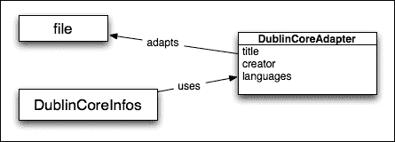
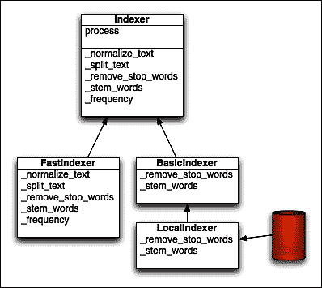

# 第十四章：有用的设计模式

设计模式是软件设计中常见问题的可重用的、有些特定于语言的解决方案。关于这个主题最流行的书是*设计模式：可复用面向对象软件的元素*，*Addison-Wesley Professional*，由 Gamma、Helm、Johnson 和 Vlissides 编写，也被称为*四人帮*或*GoF*。它被认为是这一领域的重要著作，并提供了 23 种设计模式的目录，其中包括 SmallTalk 和 C++的示例。

在设计应用程序代码时，这些模式有助于解决常见问题。它们向所有开发人员发出警报，因为它们描述了经过验证的开发范例。但是应该根据使用的语言来学习它们，因为其中一些在某些语言中没有意义或者已经内置。

本章描述了 Python 中最有用的模式或者有趣讨论的模式，并提供了实现示例。以下是三个部分，对应于 GoF 定义的设计模式类别：

+   **创建模式**：这些模式用于生成具有特定行为的对象

+   **结构模式**：这些模式有助于为特定用例构建代码结构

+   **行为模式**：这些模式有助于分配责任和封装行为

# 创建模式

创建模式处理对象实例化机制。这样的模式可能定义了对象实例的创建方式，甚至类的构造方式。

这些模式在编译语言（如 C 或 C++）中非常重要，因为在运行时更难以按需生成类型。

但是在 Python 中，运行时创建新类型非常简单。内置的`type`函数允许您通过代码定义一个新的类型对象：

```py
>>> MyType = type('MyType', (object,), {'a': 1})
>>> ob = MyType()
>>> type(ob)
<class '__main__.MyType'>
>>> ob.a
1
>>> isinstance(ob, object)
True

```

类和类型是内置的工厂。我们已经处理了新类对象的创建，您可以使用元类与类和对象生成进行交互。这些功能是实现**工厂**设计模式的基础，但我们不会在本节进一步描述它，因为我们已经在第三章中广泛涵盖了类和对象创建的主题，*语法最佳实践 - 类级别以上*。

除了工厂，GoF 中另一个有趣的创建设计模式是单例。

## 单例

**单例**将类的实例化限制为仅一个对象实例。

单例模式确保给定的类在应用程序中始终只有一个活动实例。例如，当您希望将资源访问限制为进程中仅有一个内存上下文时，可以使用此模式。例如，数据库连接器类可以是一个单例，它处理同步并在内存中管理数据。它假设与数据库交互的同时没有其他实例。

这种模式可以简化应用程序中处理并发的方式。提供应用程序范围功能的实用程序通常被声明为单例。例如，在 Web 应用程序中，负责保留唯一文档 ID 的类将受益于单例模式。应该有一个且仅有一个执行此工作的实用程序。

在 Python 中，有一种流行的半成语是通过覆盖类的`__new__()`方法来创建单例：

```py
class Singleton:
    _instance = None

    def __new__(cls, *args, **kwargs):
        if cls._instance is None:
            cls._instance = super().__new__(cls, *args, **kwargs)

        return cls._instance
```

如果您尝试创建该类的多个实例并比较它们的 ID，您会发现它们都代表同一个对象：

```py
>>> instance_a = Singleton()
>>> instance_b = Singleton()
>>> id(instance_a) == id(instance_b)
True
>>> instance_a == instance_b
True

```

我将其称为半成语，因为这是一个非常危险的模式。问题在于当您尝试对基本单例类进行子类化并创建此新子类的实例时，如果您已经创建了基类的实例，则问题就开始了。

```py
>>> class ConcreteClass(Singleton): pass
>>> Singleton()
<Singleton object at 0x000000000306B470>
>>> ConcreteClass()
<Singleton object at 0x000000000306B470>

```

这可能会变得更加棘手，当你注意到这种行为受到实例创建顺序的影响时。根据你的类使用顺序，你可能会得到相同的结果，也可能不会。让我们看看如果你首先创建子类实例，然后创建基类的实例，结果会是什么样的：

```py
>>> class ConcreteClass(Singleton): pass
>>> ConcreteClass()
<ConcreteClass object at 0x00000000030615F8>
>>> Singleton()
<Singleton object at 0x000000000304BCF8>

```

正如你所看到的，行为完全不同，非常难以预测。在大型应用程序中，这可能导致非常危险且难以调试的问题。根据运行时上下文，您可能会或者不会使用您本来打算使用的类。由于这种行为真的很难预测和控制，应用程序可能会因为改变的导入顺序甚至用户输入而崩溃。如果您的单例不打算被子类化，那么以这种方式实现可能相对安全。无论如何，这是一个定时炸弹。如果将来有人忽视风险并决定从您的单例对象创建一个子类，一切都可能会爆炸。避免使用这种特定的实现，使用另一种替代方案会更安全。

使用更高级的技术——元类是更安全的。通过重写元类的`__call__()`方法，您可以影响自定义类的创建。这允许创建可重用的单例代码：

```py
class Singleton(type):
    _instances = {}

    def __call__(cls, *args, **kwargs):
        if cls not in cls._instances:
            cls._instances[cls] = super().__call__(*args, **kwargs)
        return cls._instances[cls]
```

通过将`Singleton`用作自定义类的元类，您可以获得安全的可子类化的单例，并且不受实例创建顺序的影响：

```py
>>> ConcreteClass() == ConcreteClass()
True
>>> ConcreteSubclass() == ConcreteSubclass()
True
>>> ConcreteClass()
<ConcreteClass object at 0x000000000307AF98>
>>> ConcreteSubclass()
<ConcreteSubclass object at 0x000000000307A3C8>

```

克服单例实现问题的另一种方法是使用 Alex Martelli 提出的方法。他提出了一种与单例类似但在结构上完全不同的方法。这不是来自 GoF 书籍的经典设计模式，但似乎在 Python 开发人员中很常见。它被称为**Borg**或**Monostate**。

这个想法非常简单。单例模式中真正重要的不是一个类有多少个实例，而是它们始终共享相同的状态。因此，Alex Martelli 提出了一个使类的所有实例共享相同`__dict__`的类：

```py
class Borg(object):
    _state = {}

    def __new__(cls, *args, **kwargs):
        ob = super().__new__(cls, *args, **kwargs)
        ob.__dict__ = cls._state
        return ob
```

这解决了子类化问题，但仍取决于子类代码的工作方式。例如，如果重写了`__getattr__`，则可能会破坏模式。

然而，单例不应该有多层继承。标记为单例的类已经是特定的。

也就是说，许多开发人员认为这种模式是处理应用程序中的唯一性的一种繁重方式。如果需要单例，为什么不使用具有函数的模块，因为 Python 模块已经是单例了呢？最常见的模式是将模块级变量定义为需要是单例的类的实例。这样，你也不会限制开发人员对你的初始设计。

### 注意

单例工厂是处理应用程序唯一性的*隐式*方式。你可以不用它。除非你在类似 Java 的框架中工作，这种模式是必需的，否则请使用模块而不是类。

# 结构模式

结构模式在大型应用程序中非常重要。它们决定了代码的组织方式，并为开发人员提供了如何与应用程序的每个部分进行交互的指南。

长期以来，Python 世界中许多结构模式的最著名实现是 Zope 项目的**Zope 组件架构**（**ZCA**）。它实现了本节中描述的大多数模式，并提供了一套丰富的工具来处理它们。ZCA 旨在不仅在 Zope 框架中运行，还在其他框架中运行，如 Twisted。它提供了接口和适配器的实现，以及其他功能。

不幸的是（或者不是），Zope 几乎失去了所有的动力，不再像以前那样受欢迎。但是它的 ZCA 可能仍然是 Python 中实现结构模式的一个很好的参考。Baiju Muthukadan 创建了*Zope 组件架构综合指南*。它可以打印和免费在线获取（参考[`muthukadan.net/docs/zca.html`](http://muthukadan.net/docs/zca.html)）。它是在 2009 年写的，所以它没有涵盖 Python 的最新版本，但应该是一个很好的阅读，因为它为一些提到的模式提供了很多合理性。

Python 已经通过其语法提供了一些流行的结构模式。例如，类和函数装饰器可以被认为是**装饰器模式**的一种变体。此外，创建和导入模块的支持是**模块模式**的一种表现。

常见结构模式的列表实际上相当长。原始的*设计模式*书中有多达七种，后来的文献中还扩展了这个列表。我们不会讨论所有这些模式，而只会专注于最受欢迎和公认的三种模式，它们是：

+   适配器

+   代理

+   外观

## 适配器

**适配器**模式允许使用现有类的接口从另一个接口中使用。换句话说，适配器包装了一个类或对象*A*，使其在预期用于类或对象*B*的上下文中工作。

在 Python 中创建适配器实际上非常简单，因为这种语言的类型系统是如何工作的。Python 中的类型哲学通常被称为鸭子类型：

> *“如果它走起来像鸭子，说起来像鸭子，那么它就是鸭子！”*

根据这个规则，如果一个函数或方法接受一个值，决定不应该基于它的类型，而应该基于它的接口。因此，只要对象的行为符合预期，即具有适当的方法签名和属性，它的类型就被认为是兼容的。这与许多静态类型的语言完全不同，在这些语言中很少有这样的事情。

在实践中，当一些代码打算与给定类一起工作时，只要它们提供了代码使用的方法和属性，就可以用另一个类的对象来提供它。当然，这假设代码不会调用`instance`来验证实例是否属于特定类。

适配器模式基于这种哲学，定义了一种包装机制，其中一个类或对象被包装以使其在最初不打算用于它的上下文中工作。`StringIO`就是一个典型的例子，因为它适应了`str`类型，所以它可以被用作`file`类型：

```py
>>> from io import StringIO
>>> my_file = StringIO('some content')
>>> my_file.read()
'some content'
>>> my_file.seek(0)
>>> my_f
ile.read(1)
's'

```

让我们举另一个例子。`DublinCoreInfos`类知道如何显示给定文档的一些 Dublin Core 信息子集的摘要（参见[`dublincore.org/`](http://dublincore.org/)），并提供为`dict`提供。它读取一些字段，比如作者的名字或标题，并打印它们。为了能够显示文件的 Dublin Core，它必须以与`StringIO`相同的方式进行适配。下图显示了这种适配器模式实现的类似 UML 的图。



图 2 简单适配器模式示例的 UML 图

`DublinCoreAdapter`包装了一个文件实例，并提供了对其元数据的访问：

```py
from os.path import split, splitext

class DublinCoreAdapter:
    def __init__(self, filename):
        self._filename = filename

    @property
    def title(self):
        return splitext(split(self._filename)[-1])[0]

    @property
    def languages(self):
        return ('en',)

    def __getitem__(self, item):
        return getattr(self, item, 'Unknown')

class DublinCoreInfo(object):
    def summary(self, dc_dict):
        print('Title: %s' % dc_dict['title'])
        print('Creator: %s' % dc_dict['creator'])
        print('Languages: %s' % ', '.join(dc_dict['languages']))
```

以下是示例用法：

```py
>>> adapted = DublinCoreAdapter('example.txt')
>>> infos = DublinCoreInfo()
>>> infos.summary(adapted)
Title: example
Creator: Unknown
Languages: en

```

除了允许替换的事实之外，适配器模式还可以改变开发人员的工作方式。将对象适应特定上下文的假设是对象的类根本不重要。重要的是这个类实现了`DublinCoreInfo`等待的内容，并且这种行为由适配器固定或完成。因此，代码可以简单地告诉它是否与实现特定行为的对象兼容。这可以通过*接口*来表达。

### 接口

**接口**是 API 的定义。它描述了一个类应该具有的方法和属性列表，以实现所需的行为。这个描述不实现任何代码，只是为希望实现接口的任何类定义了一个明确的合同。然后任何类都可以以任何方式实现一个或多个接口。

虽然 Python 更喜欢鸭子类型而不是明确的接口定义，但有时使用它们可能更好。例如，明确的接口定义使框架更容易定义接口上的功能。

好处在于类之间松散耦合，这被认为是一种良好的实践。例如，要执行给定的过程，类`A`不依赖于类`B`，而是依赖于接口`I`。类`B`实现了`I`，但它可以是任何其他类。

许多静态类型语言（如 Java 或 Go）内置了对这种技术的支持。接口允许函数或方法限制实现给定接口的可接受参数对象的范围，无论它来自哪种类。这比将参数限制为给定类型或其子类更灵活。这就像鸭子类型行为的显式版本：Java 使用接口在编译时验证类型安全，而不是在运行时使用鸭子类型将事物绑在一起。

Python 对接口的类型哲学与 Java 完全不同，因此它没有原生支持接口。无论如何，如果您想对应用程序接口有更明确的控制，通常有两种选择：

+   使用一些第三方框架添加接口的概念

+   使用一些高级语言特性来构建处理接口的方法论。

#### 使用 zope.interface

有一些框架允许您在 Python 中构建明确的接口。最值得注意的是 Zope 项目的一部分。它是`zope.interface`包。尽管如今 Zope 不像以前那样受欢迎，但`zope.interface`包仍然是 Twisted 框架的主要组件之一。

`zope.interface`包的核心类是`Interface`类。它允许您通过子类化来明确定义一个新的接口。假设我们想为矩形的每个实现定义一个强制性接口：

```py
from zope.interface import Interface, Attribute

class IRectangle(Interface):
    width = Attribute("The width of rectangle")
    height = Attribute("The height of rectangle")

    def area():
        """ Return area of rectangle
        """

    def perimeter():
        """ Return perimeter of rectangle
        """
```

使用`zope.interface`定义接口时需要记住的一些重要事项如下：

+   接口的常见命名约定是使用`I`作为名称后缀。

+   接口的方法不得带有`self`参数。

+   由于接口不提供具体实现，因此它应该只包含空方法。您可以使用`pass`语句，引发`NotImplementedError`，或提供文档字符串（首选）。

+   接口还可以使用`Attribute`类指定所需的属性。

当您定义了这样的合同后，您可以定义提供`IRectangle`接口实现的新具体类。为此，您需要使用`implementer()`类装饰器并实现所有定义的方法和属性：

```py
@implementer(IRectangle)
class Square:
    """ Concrete implementation of square with rectangle interface
    """

    def __init__(self, size):
        self.size = size

    @property
    def width(self):
        return self.size

    @property
    def height(self):
        return self.size

    def area(self):
        return self.size ** 2

    def perimeter(self):
        return 4 * self.size

@implementer(IRectangle)
class Rectangle:
    """ Concrete implementation of rectangle
    """
    def __init__(self, width, height):
        self.width = width
        self.height = height

    def area(self):
        return self.width * self.height

    def perimeter(self):
        return self.width * 2 + self.height * 2
```

通常说接口定义了具体实现需要满足的合同。这种设计模式的主要好处是能够在对象被使用之前验证合同和实现之间的一致性。使用普通的鸭子类型方法，只有在运行时缺少属性或方法时才会发现不一致性。使用`zope.interface`，您可以使用`zope.interface.verify`模块的两种方法来提前检查实际实现中的不一致性：

+   `verifyClass(interface, class_object)`: 这会验证类对象是否存在方法，并检查其签名的正确性，而不会查找属性

+   `verifyObject(interface, instance)`: 这验证实际对象实例的方法、它们的签名和属性

由于我们已经定义了我们的接口和两个具体的实现，让我们在交互式会话中验证它们的契约：

```py
>>> from zope.interface.verify import verifyClass, verifyObject
>>> verifyObject(IRectangle, Square(2))
True
>>> verifyClass(IRectangle, Square)
True
>>> verifyObject(IRectangle, Rectangle(2, 2))
True
>>> verifyClass(IRectangle, Rectangle)
True

```

没有什么令人印象深刻的。`Rectangle`和`Square`类仔细遵循了定义的契约，因此除了成功的验证外，没有更多的东西可见。但是当我们犯错时会发生什么？让我们看一个未能提供完整`IRectangle`接口实现的两个类的示例：

```py
@implementer(IRectangle)
class Point:
    def __init__(self, x, y):
        self.x = x
        self.y = y

@implementer(IRectangle)
class Circle:
    def __init__(self, radius):
        self.radius = radius

    def area(self):
        return math.pi * self.radius ** 2

    def perimeter(self):
        return 2 * math.pi * self.radius
```

`Point`类没有提供`IRectangle`接口的任何方法或属性，因此它的验证将在类级别上显示不一致性：

```py
>>> verifyClass(IRectangle, Point)

Traceback (most recent call last):
 **File "<stdin>", line 1, in <module>
 **File "zope/interface/verify.py", line 102, in verifyClass
 **return _verify(iface, candidate, tentative, vtype='c')
 **File "zope/interface/verify.py", line 62, in _verify
 **raise BrokenImplementation(iface, name)
zope.interface.exceptions.BrokenImplementation: An object has failed to implement interface <InterfaceClass __main__.IRectangle>

 **The perimeter attribute was not provided.

```

`Circle`类有点棘手。它定义了所有接口方法，但在实例属性级别上违反了契约。这就是为什么在大多数情况下，您需要使用`verifyObject()`函数来完全验证接口实现的原因：

```py
>>> verifyObject(IRectangle, Circle(2))

Traceback (most recent call last):
 **File "<stdin>", line 1, in <module>
 **File "zope/interface/verify.py", line 105, in verifyObject
 **return _verify(iface, candidate, tentative, vtype='o')
 **File "zope/interface/verify.py", line 62, in _verify
 **raise BrokenImplementation(iface, name)
zope.interface.exceptions.BrokenImplementation: An object has failed to implement interface <InterfaceClass __main__.IRectangle>

 **The width attribute was not provided.

```

使用`zope.inteface`是一种有趣的解耦应用程序的方式。它允许您强制执行正确的对象接口，而无需多重继承的过度复杂性，并且还可以及早捕获不一致性。然而，这种方法最大的缺点是要求您明确定义给定类遵循某个接口才能进行验证。如果您需要验证来自内置库的外部类的实例，这将特别麻烦。`zope.interface`为该问题提供了一些解决方案，当然您也可以使用适配器模式或甚至猴子补丁来处理这些问题。无论如何，这些解决方案的简单性至少是值得商榷的。

#### 使用函数注释和抽象基类

设计模式的目的是使问题解决变得更容易，而不是为您提供更多的复杂层次。`zope.interface`是一个很好的概念，可能非常适合某些项目，但它并不是万能解决方案。使用它，您可能很快就会发现自己花费更多时间修复与第三方类的不兼容接口的问题，并提供无休止的适配器层，而不是编写实际的实现。如果您有这种感觉，那么这是某种问题出现的迹象。幸运的是，Python 支持构建轻量级的接口替代方案。它不像`zope.interface`或其替代方案那样是一个成熟的解决方案，但通常提供更灵活的应用程序。您可能需要编写更多的代码，但最终您将拥有更具可扩展性，更好地处理外部类型，并且可能更具*未来性*的东西。

请注意，Python 在其核心中没有接口的明确概念，可能永远不会有，但具有一些功能，允许您构建类似接口功能的东西。这些功能包括：

+   **抽象基类**（**ABCs**）

+   函数注释

+   类型注释

我们解决方案的核心是抽象基类，所以我们将首先介绍它们。

如您可能知道的那样，直接的类型比较被认为是有害的，而且不是*pythonic*。您应该始终避免以下比较：

```py
assert type(instance) == list
```

在函数或方法中比较类型的方式完全破坏了将类子类型作为参数传递给函数的能力。稍微更好的方法是使用`isinstance()`函数，它会考虑继承关系：

```py
assert isinstance(instance, list)
```

`isinstance()`的额外优势是您可以使用更广泛的类型来检查类型兼容性。例如，如果您的函数期望接收某种序列作为参数，您可以与基本类型的列表进行比较：

```py
assert isinstance(instance, (list, tuple, range))
```

这种类型兼容性检查的方式在某些情况下是可以的，但仍然不完美。它将适用于`list`、`tuple`或`range`的任何子类，但如果用户传递的是与这些序列类型完全相同但不继承自任何一个的东西，它将失败。例如，让我们放宽要求，说你想接受任何类型的可迭代对象作为参数。你会怎么做？可迭代的基本类型列表实际上相当长。你需要涵盖 list、tuple、range、str、bytes、dict、set、生成器等等。适用的内置类型列表很长，即使你覆盖了所有这些类型，它仍然不允许你检查是否与定义了`__iter__()`方法的自定义类兼容，而是直接继承自`object`。

这是抽象基类（ABC）是适当解决方案的情况。ABC 是一个类，不需要提供具体的实现，而是定义了一个类的蓝图，可以用来检查类型的兼容性。这个概念与 C++语言中的抽象类和虚方法的概念非常相似。

抽象基类用于两个目的：

+   检查实现的完整性

+   检查隐式接口兼容性

因此，让我们假设我们想定义一个接口，确保一个类具有`push()`方法。我们需要使用特殊的`ABCMeta`元类和标准`abc`模块中的`abstractmethod()`装饰器创建一个新的抽象基类：

```py
from abc import ABCMeta, abstractmethod

class Pushable(metaclass=ABCMeta):

    @abstractmethod
    def push(self, x):
        """ Push argument no matter what it means
        """
```

`abc`模块还提供了一个可以用来代替元类语法的 ABC 基类：

```py
from abc import ABCMeta, abstractmethod

class Pushable(metaclass=ABCMeta):
    @abstractmethod
    def push(self, x):
        """ Push argument no matter what it means
        """
```

一旦完成，我们可以将`Pushable`类用作具体实现的基类，并且它将阻止我们实例化具有不完整实现的对象。让我们定义`DummyPushable`，它实现了所有接口方法和`IncompletePushable`，它违反了预期的合同：

```py
class DummyPushable(Pushable):
    def push(self, x):
        return

class IncompletePushable(Pushable):
    pass
```

如果你想获得`DummyPushable`实例，那就没有问题，因为它实现了唯一需要的`push()`方法：

```py
>>> DummyPushable()
<__main__.DummyPushable object at 0x10142bef0>

```

但是，如果你尝试实例化`IncompletePushable`，你会得到`TypeError`，因为缺少`interface()`方法的实现：

```py
>>> IncompletePushable()
Traceback (most recent call last):
 **File "<stdin>", line 1, in <module>
TypeError: Can't instantiate abstract class IncompletePushable with abstract methods push

```

前面的方法是确保基类实现完整性的好方法，但与`zope.interface`替代方案一样明确。`DummyPushable`实例当然也是`Pushable`的实例，因为 Dummy 是`Pushable`的子类。但是其他具有相同方法但不是`Pushable`的后代的类呢？让我们创建一个并看看：

```py
>>> class SomethingWithPush:
...     def push(self, x):
...         pass
...** 
>>> isinstance(SomethingWithPush(), Pushable)
False

```

还有一些东西缺失。`SomethingWithPush`类明确具有兼容的接口，但尚未被视为`Pushable`的实例。那么，缺少什么？答案是`__subclasshook__(subclass)`方法，它允许你将自己的逻辑注入到确定对象是否是给定类的实例的过程中。不幸的是，你需要自己提供它，因为`abc`的创建者不希望限制开发人员覆盖整个`isinstance()`机制。我们对它有完全的控制权，但我们被迫写一些样板代码。

虽然你可以做任何你想做的事情，但通常在`__subclasshook__()`方法中唯一合理的事情是遵循常见的模式。标准程序是检查定义的方法集是否在给定类的 MRO 中的某个地方可用：

```py
from abc import ABCMeta, abstractmethod

class Pushable(metaclass=ABCMeta):

    @abstractmethod
    def push(self, x):
        """ Push argument no matter what it means
        """

    @classmethod
    def __subclasshook__(cls, C):
        if cls is Pushable:
            if any("push" in B.__dict__ for B in C.__mro__):
                return True
        return NotImplemented
```

通过这种方式定义`__subclasshook__()`方法，现在可以确认隐式实现接口的实例也被视为接口的实例：

```py
>>> class SomethingWithPush:
...     def push(self, x):
...         pass
...** 
>>> isinstance(SomethingWithPush(), Pushable)
True

```

不幸的是，这种验证类型兼容性和实现完整性的方法并未考虑类方法的签名。因此，如果实现中预期的参数数量不同，它仍将被视为兼容。在大多数情况下，这不是问题，但如果您需要对接口进行如此精细的控制，`zope.interface`包允许这样做。正如前面所说，`__subclasshook__()`方法不会限制您在`isinstance()`函数的逻辑中添加更多复杂性，以实现类似的控制水平。

补充抽象基类的另外两个特性是函数注释和类型提示。函数注释是在第二章中简要描述的语法元素，*语法最佳实践-类级别以下*。它允许您使用任意表达式对函数及其参数进行注释。正如第二章中所解释的，*语法最佳实践-类级别以下*，这只是一个不提供任何语法意义的功能存根。标准库中没有使用此功能来强制执行任何行为。无论如何，您可以将其用作通知开发人员预期参数接口的便捷且轻量级的方式。例如，考虑从`zope.interface`重写的`IRectangle`接口以抽象基类的形式：

```py
from abc import (
    ABCMeta,
    abstractmethod,
    abstractproperty
)

class IRectangle(metaclass=ABCMeta):

    @abstractproperty
    def width(self):
        return

    @abstractproperty
    def height(self):
        return

    @abstractmethod
    def area(self):
        """ Return rectangle area
        """

    @abstractmethod
    def perimeter(self):
        """ Return rectangle perimeter
        """

    @classmethod
    def __subclasshook__(cls, C):
        if cls is IRectangle:
            if all([
                any("area" in B.__dict__ for B in C.__mro__),
                any("perimeter" in B.__dict__ for B in C.__mro__),
                any("width" in B.__dict__ for B in C.__mro__),
                any("height" in B.__dict__ for B in C.__mro__),
            ]):
                return True
        return NotImplemented
```

如果您有一个仅适用于矩形的函数，比如`draw_rectangle()`，您可以将预期参数的接口注释如下：

```py
def draw_rectangle(rectangle: IRectange):
    ...
```

这只是为开发人员提供有关预期信息的信息。即使这是通过非正式合同完成的，因为正如我们所知，裸注释不包含任何语法意义。但是，它们在运行时是可访问的，因此我们可以做更多的事情。以下是一个通用装饰器的示例实现，它能够验证函数注释中提供的接口是否使用抽象基类：

```py
def ensure_interface(function):
    signature = inspect.signature(function)
    parameters = signature.parameters

    @wraps(function)
    def wrapped(*args, **kwargs):
        bound = signature.bind(*args, **kwargs)
        for name, value in bound.arguments.items():
            annotation = parameters[name].annotation

            if not isinstance(annotation, ABCMeta):
                continue

            if not isinstance(value, annotation):
                raise TypeError(
                    "{} does not implement {} interface"
                    "".format(value, annotation)
                )

        function(*args, **kwargs)

    return wrapped
```

一旦完成，我们可以创建一些具体的类，它们隐式地实现了`IRectangle`接口（而不是继承自`IRectangle`），并更新`draw_rectangle()`函数的实现，以查看整个解决方案的工作原理：

```py
class ImplicitRectangle:
    def __init__(self, width, height):
        self._width = width
        self._height = height

    @property
    def width(self):
        return self._width

    @property
    def height(self):
        return self._height

    def area(self):
        return self.width * self.height

    def perimeter(self):
        return self.width * 2 + self.height * 2

@ensure_interface
def draw_rectangle(rectangle: IRectangle):
    print(
        "{} x {} rectangle drawing"
        "".format(rectangle.width, rectangle.height)
    )
```

如果我们使用不兼容的对象来调用`draw_rectangle()`函数，它现在将引发`TypeError`并提供有意义的解释：

```py
>>> draw_rectangle('foo')
Traceback (most recent call last):
 **File "<input>", line 1, in <module>
 **File "<input>", line 101, in wrapped
TypeError: foo does not implement <class 'IRectangle'> interface

```

但是，如果我们使用`ImplicitRectangle`或任何其他类似`IRectangle`接口的对象，该函数将按预期执行：

```py
>>> draw_rectangle(ImplicitRectangle(2, 10))
2 x 10 rectangle drawing

```

我们的`ensure_interface()`的示例实现是基于`typeannotations`项目中的`typechecked()`装饰器，该项目试图提供运行时检查功能（请参阅[`github.com/ceronman/typeannotations`](https://github.com/ceronman/typeannotations)）。它的源代码可能会给您一些有趣的想法，关于如何处理类型注释以确保运行时接口检查。

可以用来补充这种接口模式的最后一个特性是类型提示。类型提示在 PEP 484 中有详细描述，并且是最近添加到语言中的。它们在新的`typing`模块中公开，并且从 Python 3.5 开始可用。类型提示建立在函数注释的基础上，并重用了 Python 3 中略微被遗忘的语法特性。它们旨在指导类型提示并检查各种*尚未出现*的 Python 类型检查器。`typing`模块和 PEP 484 文档旨在提供一种用于描述类型注释的标准类型和类的层次结构。

然而，类型提示似乎并不是什么革命性的东西，因为这个特性并没有内置任何类型检查器到标准库中。如果你想在你的代码中使用类型检查或者强制严格的接口兼容性，你需要创建自己的工具，因为目前还没有值得推荐的工具。这就是为什么我们不会深入研究 PEP 484 的细节。无论如何，类型提示和描述它们的文档是值得一提的，因为如果在 Python 的类型检查领域出现了一些非凡的解决方案，它很可能是基于 PEP 484 的。

#### 使用 collections.abc

抽象基类就像创建更高级抽象的小积木。它们允许你实现真正可用的接口，但非常通用，设计用于处理远远超出这个单一设计模式的东西。你可以释放你的创造力，做出神奇的事情，但构建一些通用的、真正可用的东西可能需要大量的工作。这可能永远得不到回报。

这就是为什么自定义抽象基类并不经常使用。尽管如此，`collections.abc`模块提供了许多预定义的 ABCs，允许验证许多基本 Python 类型的接口兼容性。使用这个模块提供的基类，你可以检查一个给定的对象是否可调用、映射，或者是否支持迭代。使用它们与`isinstance()`函数比较要比与基本的 Python 类型比较要好得多。即使你不想使用`ABCMeta`定义自己的自定义接口，你也应该知道如何使用这些基类。

你会时不时地使用`collections.abc`中最常见的抽象基类：

+   `Container`：这个接口意味着对象支持`in`操作符，并实现了`__contains__()`方法

+   `Iterable`：这个接口意味着对象支持迭代，并实现了`__iter__()`方法

+   `Callable`：这个接口意味着它可以像函数一样被调用，并实现了`__call__()`方法

+   `Hashable`：这个接口意味着对象是可散列的（可以包含在集合中并作为字典中的键），并实现了`__hash__`方法

+   `Sized`：这个接口意味着对象有大小（可以使用`len()`函数）并实现了`__len__()`方法

`collections.abc`模块中可用的抽象基类的完整列表可以在官方 Python 文档中找到（参见[`docs.python.org/3/library/collections.abc.html`](https://docs.python.org/3/library/collections.abc.html)）。

## 代理

**代理**提供了对昂贵或远程资源的间接访问。**代理**位于**客户端**和**主体**之间，如下图所示：


如果 Subject 的访问是昂贵的，这是为了优化 Subject 的访问。例如，在第十二章中描述的`memoize()`和`lru_cache()`装饰器，*优化-一些强大的技术*，可以被视为代理。

代理也可以用来提供对主体的智能访问。例如，大型视频文件可以被包装成代理，以避免在用户只要求它们的标题时将它们加载到内存中。

`urllib.request`模块提供了一个例子。`urlopen`是一个代理，用于访问远程 URL 上的内容。当它被创建时，可以独立于内容本身检索头部，而无需读取响应的其余部分：

```py
>>> class Url(object):
...     def __init__(self, location):
...         self._url = urlopen(location)
...     def headers(self):
...         return dict(self._url.headers.items())
...     def get(self):
...         return self._url.read()
...** 
>>> python_org = Url('http://python.org')
>>> python_org.headers().keys()
dict_keys(['Accept-Ranges', 'Via', 'Age', 'Public-Key-Pins', 'X-Clacks-Overhead', 'X-Cache-Hits', 'X-Cache', 'Content-Type', 'Content-Length', 'Vary', 'X-Served-By', 'Strict-Transport-Security', 'Server', 'Date', 'Connection', 'X-Frame-Options'])

```

这可以用来决定在获取页面主体之前是否已经更改了页面，通过查看`last-modified`头部。让我们用一个大文件举个例子：

```py
>>> ubuntu_iso = Url('http://ubuntu.mirrors.proxad.net/hardy/ubuntu-8.04-desktop-i386.iso')
>>> ubuntu_iso.headers()['Last-Modified']
'Wed, 23 Apr 2008 01:03:34 GMT'

```

代理的另一个用例是**数据唯一性**。

例如，让我们考虑一个网站，在几个位置上呈现相同的文档。特定于每个位置的额外字段被附加到文档中，例如点击计数器和一些权限设置。在这种情况下，可以使用代理来处理特定于位置的问题，并指向原始文档，而不是复制它。因此，给定的文档可以有许多代理，如果其内容发生变化，所有位置都将受益，而无需处理版本同步。

一般来说，代理模式对于实现可能存在于其他地方的某些东西的本地处理很有用：

+   加快流程

+   避免外部资源访问

+   减少内存负载

+   确保数据的唯一性

## Facade

**Facade**提供了对子系统的高级、简单的访问。

Facade 只是一个快捷方式，用于使用应用程序的功能，而不必处理子系统的底层复杂性。例如，可以通过在包级别提供高级功能来实现这一点。

Facade 通常是在现有系统上完成的，其中包的频繁使用被合成为高级功能。通常，不需要类来提供这样的模式，`__init__.py`模块中的简单函数就足够了。

一个提供了一个大的外观覆盖复杂和复杂接口的项目的很好的例子是`requests`包（参考[`docs.python-requests.org/`](http://docs.python-requests.org/)）。它通过提供一个清晰的 API，使得在 Python 中处理 HTTP 请求和响应的疯狂变得简单，这对开发人员来说非常容易阅读。它实际上甚至被宣传为“人类的 HTTP”。这种易用性总是以一定的代价为代价，但最终的权衡和额外的开销并不会吓倒大多数人使用 Requests 项目作为他们选择的 HTTP 工具。最终，它使我们能够更快地完成项目，而开发人员的时间通常比硬件更昂贵。

### 注意

Facade 简化了您的包的使用。在几次迭代后，通常会添加 Facade 以获得使用反馈。

# 行为模式

行为模式旨在通过结构化它们的交互过程来简化类之间的交互。

本节提供了三个流行的行为模式的示例，您在编写 Python 代码时可能需要考虑：

+   观察者

+   访问者

+   模板

## 观察者

**观察者**模式用于通知一系列对象观察组件的状态变化。

观察者允许以可插拔的方式向应用程序添加功能，通过将新功能与现有代码库解耦。事件框架是观察者模式的典型实现，并在接下来的图中描述。每当发生事件时，所有观察者都会收到触发此事件的主题的通知。

事件是发生某事时创建的。在图形用户界面应用程序中，事件驱动编程（参见[`en.wikipedia.org/wiki/Event-driven_programming`](http://en.wikipedia.org/wiki/Event-driven_programming)）通常用于将代码与用户操作链接起来。例如，可以将函数链接到`MouseMove`事件，以便在鼠标在窗口上移动时调用它。

在 GUI 应用程序的情况下，将代码与窗口管理内部解耦会大大简化工作。函数是分开编写的，然后注册为事件观察者。这种方法存在于微软的 MFC 框架的最早版本中（参见[`en.wikipedia.org/wiki/Microsoft_Foundation_Class_Library`](http://en.wikipedia.org/wiki/Microsoft_Foundation_Class_Library)），以及 Qt 或 GTK 等所有 GUI 开发工具中。许多框架使用*信号*的概念，但它们只是观察者模式的另一种表现。

代码也可以生成事件。例如，在一个将文档存储在数据库中的应用程序中，`DocumentCreated`、`DocumentModified`和`DocumentDeleted`可以是代码提供的三个事件。一个在文档上工作的新功能可以注册自己作为观察者，每当文档被创建、修改或删除时得到通知，并进行适当的工作。这样就可以在应用程序中添加一个文档索引器。当然，这要求负责创建、修改或删除文档的所有代码都触发事件。但这比在整个应用程序代码库中添加索引挂钩要容易得多！一个遵循这种模式的流行 Web 框架是 Django，它具有信号机制。

可以通过在类级别上工作来实现 Python 中观察者的注册的`Event`类：

```py
class Event:
    _observers = []

    def __init__(self, subject):
        self.subject = subject

    @classmethod
    def register(cls, observer):
        if observer not in cls._observers:
            cls._observers.append(observer)

    @classmethod
    def unregister(cls, observer):
        if observer in cls._observers:
            cls._observers.remove(observer)

    @classmethod
    def notify(cls, subject):
        event = cls(subject)
        for observer in cls._observers:
            observer(event)
```

观察者使用`Event`类方法注册自己，并通过携带触发它们的主题的`Event`实例得到通知。以下是一个具体的`Event`子类的示例，其中一些观察者订阅了它的通知：

```py
class WriteEvent(Event):
    def __repr__(self):
        return 'WriteEvent'

def log(event):
    print(
        '{!r} was fired with subject "{}"'
        ''.format(event, event.subject)
    )

class AnotherObserver(object):
    def __call__(self, event):
        print(
            "{!r} trigerred {}'s action"
            "".format(event, self.__class__.__name__)
        )

WriteEvent.register(log)
WriteEvent.register(AnotherObserver())
```

这里是使用`WriteEvent.notify()`方法触发事件的示例结果：

```py
>>> WriteEvent.notify("something happened")
WriteEvent was fired with subject "something happened"
WriteEvent trigerred AnotherObserver's action

```

这个实现很简单，只是作为说明目的。要使其完全功能，可以通过以下方式加以增强：

+   允许开发人员更改事件的顺序

+   使事件对象携带的信息不仅仅是主题

解耦你的代码是有趣的，观察者是正确的模式。它将你的应用程序组件化，并使其更具可扩展性。如果你想使用现有的工具，可以尝试**Blinker**（参见[`pythonhosted.org/blinker/`](https://pythonhosted.org/blinker/)）。它为 Python 对象提供快速简单的对象到对象和广播信号。

## 访问者

**访问者**有助于将算法与数据结构分离，其目标与观察者模式类似。它允许扩展给定类的功能，而不改变其代码。但是访问者通过定义一个负责保存数据并将算法推送到其他类（称为`Visitors`）的类，更进一步。每个访问者专门负责一个算法，并可以在数据上应用它。

这种行为与 MVC 范式非常相似（参见[`en.wikipedia.org/wiki/Model-view-controller`](http://en.wikipedia.org/wiki/Model-view-controller)），其中文档是被动容器，通过控制器推送到视图，或者模型包含被控制器改变的数据。

访问者模式是通过在数据类中提供一个入口点来实现的，所有类型的访问者都可以访问。一个通用的描述是一个接受`Visitor`实例并调用它们的`Visitable`类，如下图所示：


`Visitable`类决定如何调用`Visitor`类，例如，决定调用哪个方法。例如，负责打印内置类型内容的访问者可以实现`visit_TYPENAME()`方法，每个这些类型可以在其`accept()`方法中调用给定的方法：

```py
class VisitableList(list):
    def accept(self, visitor):
        visitor.visit_list(self)

class VisitableDict(dict):
    def accept(self, visitor):
        visitor.visit_dict(self)

class Printer(object):
    def visit_list(self, instance):
        print('list content: {}'.format(instance))

    def visit_dict(self, instance):
        print('dict keys: {}'.format(
            ', '.join(instance.keys()))
        )
```

这是在下面的例子中所做的：

```py
>>> visitable_list = VisitableList([1, 2, 5])
>>> visitable_list.accept(Printer())
list content: [1, 2, 5]
>>> visitable_dict = VisitableDict({'one': 1, 'two': 2, 'three': 3})
>>> visitable_dict.accept(Printer())
dict keys: two, one, three

```

但这种模式意味着每个被访问的类都需要有一个`accept`方法来被访问，这是相当痛苦的。

由于 Python 允许代码内省，一个更好的主意是自动链接访问者和被访问的类：

```py
>>> def visit(visited, visitor):
...     cls = visited.__class__.__name__
...     method_name = 'visit_%s' % cls
...     method = getattr(visitor, method_name, None)
...     if isinstance(method, Callable):
...         method(visited)
...     else:
...         raise AttributeError(
...             "No suitable '{}' method in visitor"
...             "".format(method_name)
...         )
...** 
>>> visit([1,2,3], Printer())
list content: [1, 2, 3]
>>> visit({'one': 1, 'two': 2, 'three': 3}, Printer())
dict keys: two, one, three
>>> visit((1, 2, 3), Printer())
Traceback (most recent call last):
 **File "<input>", line 1, in <module>
 **File "<input>", line 10, in visit
AttributeError: No suitable 'visit_tuple' method in visitor

```

这种模式在`ast`模块中以这种方式使用，例如，通过`NodeVisitor`类调用编译代码树的每个节点的访问者。这是因为 Python 没有像 Haskell 那样的匹配操作符。

另一个例子是一个目录遍历器，根据文件扩展名调用访问者方法：

```py
>>> def visit(directory, visitor):
...     for root, dirs, files in os.walk(directory):
...         for file in files:
...             # foo.txt → .txt
...             ext = os.path.splitext(file)[-1][1:]
...             if hasattr(visitor, ext):
...                 getattr(visitor, ext)(file)
...
>>> class FileReader(object):
...     def pdf(self, filename):
...         print('processing: {}'.format(filename))
...
>>> walker = visit('/Users/tarek/Desktop', FileReader())
processing slides.pdf
processing sholl23.pdf

```

如果您的应用程序具有多个算法访问的数据结构，则访问者模式将有助于分离关注点。数据容器最好只专注于提供对数据的访问和保存，而不做其他事情。

## 模板

**模板**通过定义在子类中实现的抽象步骤来设计通用算法。这种模式使用**Liskov 替换原则**，由维基百科定义为：

> “如果 S 是 T 的子类型，则程序中类型 T 的对象可以替换为类型 S 的对象，而不会改变该程序的任何理想属性。”

换句话说，抽象类可以通过在具体类中实现的步骤来定义算法的工作方式。抽象类还可以为算法提供基本或部分实现，并让开发人员覆盖其部分。例如，`queue`模块中的`Queue`类的一些方法可以被覆盖以使其行为变化。

让我们实现一个示例，如下图所示。



`Indexer`是一个索引器类，它在五个步骤中处理文本，无论使用何种索引技术，这些步骤都是常见的：

+   文本规范化

+   文本拆分

+   停用词去除

+   词干词

+   频率

`Indexer`为处理算法提供了部分实现，但需要在子类中实现`_remove_stop_words`和`_stem_words`。 `BasicIndexer`实现了严格的最小值，而`LocalIndex`使用了停用词文件和词干词数据库。 `FastIndexer`实现了所有步骤，并可以基于快速索引器（如 Xapian 或 Lucene）。

一个玩具实现可以是：

```py
from collections import Counter

class Indexer:
    def process(self, text):
        text = self._normalize_text(text)
        words = self._split_text(text)
        words = self._remove_stop_words(words)
        stemmed_words = self._stem_words(words)

        return self._frequency(stemmed_words)

    def _normalize_text(self, text):
        return text.lower().strip()

    def _split_text(self, text):
        return text.split()

    def _remove_stop_words(self, words):
        raise NotImplementedError

    def _stem_words(self, words):
        raise NotImplementedError

    def _frequency(self, words):
        return Counter(words)
```

从那里，`BasicIndexer`实现可以是：

```py
class BasicIndexer(Indexer):
    _stop_words = {'he', 'she', 'is', 'and', 'or', 'the'}

    def _remove_stop_words(self, words):
        return (
            word for word in words
            if word not in self._stop_words
        )

    def _stem_words(self, words):
        return (
            (
                len(word) > 3 and
                word.rstrip('aeiouy') or
                word
            )
            for word in words
        )
```

而且，像往常一样，这是前面示例代码的一个使用示例：

```py
>>> indexer = BasicIndexer()
>>> indexer.process("Just like Johnny Flynn said\nThe breath I've taken and the one I must to go on")
Counter({"i'v": 1, 'johnn': 1, 'breath': 1, 'to': 1, 'said': 1, 'go': 1, 'flynn': 1, 'taken': 1, 'on': 1, 'must': 1, 'just': 1, 'one': 1, 'i': 1, 'lik': 1})

```

应该考虑模板，以便设计可能变化并可以表达为孤立子步骤的算法。这可能是 Python 中最常用的模式，并且不总是需要通过子类实现。例如，许多内置的 Python 函数处理算法问题，接受允许您将部分实现委托给外部实现的参数。例如，“sorted（）”函数允许使用后续由排序算法使用的可选`key`关键字参数。对于在给定集合中查找最小值和最大值的“min（）”和“max（）”函数也是如此。

# 总结

设计模式是可重用的，与语言有关的解决方案，用于软件设计中的常见问题。无论使用何种语言，它们都是所有开发人员文化的一部分。

因此，使用给定语言中最常用模式的实现示例是记录的好方法。在网络和其他书籍中，您将很容易找到 GoF 书籍中提到的每个设计模式的实现。这就是为什么我们只集中在 Python 语言上下文中最常见和流行的模式上。
