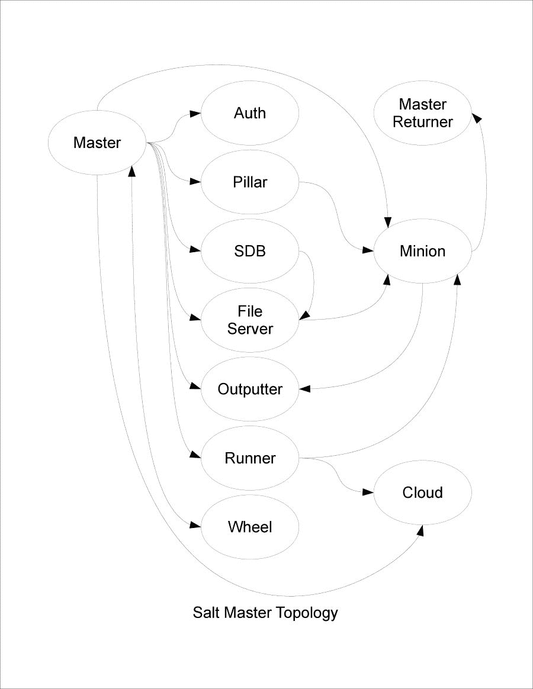
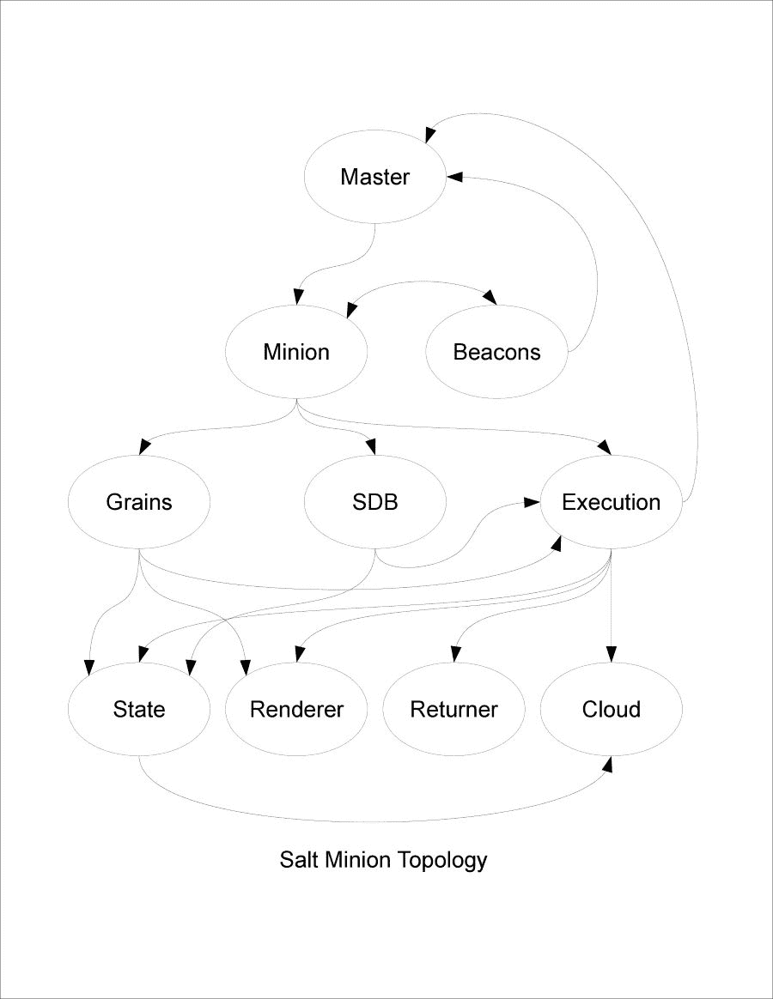
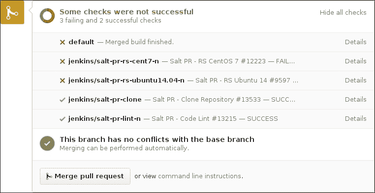
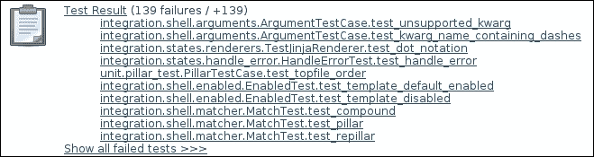
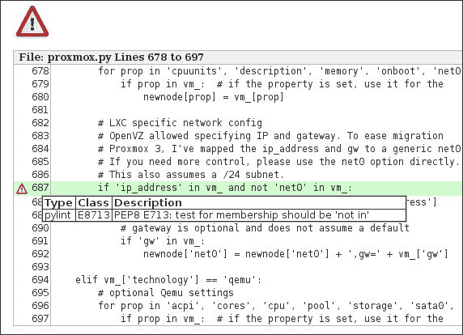

# 第十一章。扩展 Master

尽管我们迄今为止编写的一些模块可以在 Master 上使用，但焦点仍然完全集中在基于 Minion 的操作管理上。即使是只在 Master 上运行的 runners，最初也是为了在 Minion 之间脚本化任务而设计的。

有两种模块完全是为 Master 端工作而设计的：外部认证模块和轮模块。在本章中，我们将介绍：

+   向 Master 添加外部认证

+   外部认证模块故障排除

+   使用轮模块管理 Master 配置

+   轮模块故障排除

# 使用外部认证

在其默认设置中，用户通常只使用一个用户与 Salt 通信：通常是`root`或`salt`。任何能够以该用户身份登录的用户都将能够发出 Salt 命令。对于较小的设置，这可能没问题，但它根本无法扩展。较大的组织希望每个用户都能使用自己的登录来管理 Salt，并且能够根据用户设置访问控制。还有其他程序，包括 Salt API，需要使用外部认证模块。

**外部认证**（或**auth**或**eauth**）模块允许单个用户对 Salt 的各个组件拥有自己的权限。最简单的大概是`pam`模块，部分原因是因为其他现有的访问控制机制可以在 PAM 内部进行配置。不幸的是，PAM 很少在 Linux 之外使用，因此在其他平台上需要其他模块。

## 认证凭证

表面上看，认证模块不需要做太多。它只需要接受一个用户名和一个密码，并检查适当的服务以确保其有效性。如果是，则返回`True`。否则，它将返回`False`。

让我们继续为一家虚构的、接受用户名和密码的 Web 服务设置一个认证模块，如果它们正确，则返回状态`200`（`OK`），如果不正确，则返回`403`（`FORBIDDEN`）。与其他一些模块类型一样，认证模块中有一个必需的函数。这个函数叫做`auth()`。让我们一次性查看整个认证模块：

```py
'''
Provide authentication using an authentication web service. This service
must be configured with an API ID and API key in the master configuration.

webauth:
  apiid: 0123456789
  apikey: abcdef0123456789abcdef0123456789

This file should be saved as salt/auth/webauth.py
'''
import json
import base64
import urllib
import salt.utils.http

def auth(username, password):
    '''
    Authenticate using an external web authentication service
    '''
    apiid = __opts__.get('webauth', {}).get('apiid', None)
    apikey = __opts__.get('webauth', {}).get('apikey', None)
    url = 'https://api.example.com/v1/checkauth'

    username = urllib.quote(username)
    password = urllib.quote(password)
    data = {
        'type': 'basic',
        'value': base64.b64encode('{0}:{1}'.format(username, password))
    }

    result = salt.utils.http.query(
        path,
        method='POST',
        username=apiid,
        password=apikey,
        data=json.dumps(data),
        status=True,
        opts=__opts__,
    )
    if result.get('status', 403) == 200:
        return True

    return False
```

我们的功能声明有两个必需的参数：用户名和密码。这些信息将被发送到认证服务以检查其有效性。我们的服务不仅仅接受任意的凭证；它要求首先设置一个账户，并拥有自己的认证，该认证存储用户名和密码。因此，我们的首要任务是抓取该服务的凭证（`apiid`和`apikey`）从主配置中。然后添加用于认证检查的 URL：

```py
    apiid = __opts__.get('webauth', {}).get('apiid', None)
    apikey = __opts__.get('webauth', {}).get('apikey', None)
    url = 'https://api.example.com/v1/checkauth'
```

我们希望能够在用户名或密码中接受特殊字符，但由于它们在网络上无法正确翻译，我们使用 Python 的`urllib`库为它们添加引号。然后我们以外部 Web 服务期望的方式格式化凭证：

```py
    username = urllib.quote(username)
    password = urllib.quote(password)
    data = {
        'type': 'basic',
        'value': base64.b64encode('{0}:{1}'.format(username, password))
    }
```

现在我们已经设置了所有要传递给 Web 服务的数据，我们使用 `http.query()` 函数进行调用。`apiid` 和 `apikey` 用作服务本身的用户名和密码，用户的用户名和密码也作为 JSON 字符串设置。我们还确保告诉 `http.query()` 返回状态码，因为这是我们唯一关心的结果部分：

```py
    result = salt.utils.http.query(
        path,
        method='POST',
        username=apiid,
        password=apikey,
        data=json.dumps(data),
        status=True,
        opts=__opts__,
    )
```

一旦我们有了认证代码，我们会检查它是否为 `200`。如果出现问题且没有代码，则默认值为 `403`，但归根结底，除了 `200` 以外的任何代码都意味着凭证将被视为无效：

```py
   if result.get('status', 403) == 200:
        return True

    return False
```

# 故障排除外部身份验证

故障排除 `auth` 模块与其他类型的模块略有不同，因为你所测试的是访问命令的能力，而不是结果命令的功能。这意味着你选择的要执行的命令应该是已知可以正常工作的，例如 `test.ping`。

## 设置认证参数

在你可以使用 `auth` 模块之前，你需要在主配置文件中启用它。可以使用 `external_auth` 指令配置多个认证模块：

```py
external_auth:
  pam:
    moe:
      - .*
      - '@runner'
      - '@wheel'
    larry:
      - test.*
      - disk.*
      - network.*
      - '@runner'
      - '@wheel'
  webauth:
    shemp:
      - test.*
      - network.*
      - '@runner'
      - '@wheel'
```

在这个例子中，我们设置了三个用户，分布在两个不同的 `auth` 模块之间。`moe` 和 `larry` 用户被设置为使用 `pam` 模块，而 `shemp` 用户被设置为使用我们刚刚创建的 `webauth` 模块。`moe` 用户可以访问所有执行模块，以及 runner 和 wheel 系统，而 `larry` 的执行模块访问权限仅限于 `test`、`disk` 和 `network` 模块。`shemp` 用户与 `larry` 相同，只是没有访问 `disk` 模块的权限。

请记住，Salt API 需要 `@runner` 和 `@wheel` 被设置。如果你不打算使用 Salt API 向用户授予资源访问权限，那么你可以跳过这两行。

一旦你配置了 `external_auth`，就有两种测试 `auth` 模块的方法：在 Master 上使用 `salt` 命令，以及使用 Salt API。

### 使用 salt 命令进行测试

测试 `auth` 模块最快的方法是登录到以 `salt-master` 服务运行的 Master 账户，并发出一个 `salt` 命令，使用适当的参数设置要使用的 `auth` 模块和要使用的凭证：

+   `--auth` 或 `-a`：此参数设置要使用的认证模块。此参数的默认值是 `pam`。

+   `--username`：用于认证的用户名。

+   `--password`：用于认证的密码。

假设你正在使用我们刚刚创建的 `webauth` 模块进行测试，一个基本的 `salt` 命令看起来像这样：

```py
salt --auth=webauth --username=larry --password=123pass '*' test.ping

```

### 使用 Salt API 进行测试

你也可以使用 Salt API 测试 `auth` 模块。这可以通过在 Linux 中常见的 `curl` 命令轻松实现。在你可以使用此方法测试之前，你需要配置 `master` 配置文件中的 Salt API。

请注意，以下配置块是不安全的，因为它没有使用 SSL。在生产环境中，切勿将 `disable_ssl` 设置为 `True`！作为一个安全措施，此配置块还将 Salt API 设置为仅监听来自本地主机的请求：

```py
rest_cherrypy:
  port: 8080
  host: 127.0.0.1
  debug: True
  disable_ssl: True
```

一旦配置好 Salt API，请继续在两个不同的窗口中启动前台运行的 `salt-master` 和 `salt-api` 服务：

```py
# salt-master -l debug
# salt-api -l debug

```

使用以下 `curl` 命令运行 `test.ping` 函数：

```py
# curl localhost:8080/run \
 -H 'Accept: application/json' \
 -d username=larry \
 -d password=123pass \
 -d eauth=pam \
 -d client=local \
 -d tgt='*' \
 -d fun='test.ping'

```

这里最重要的参数是 `eauth`，它等同于 `salt` 命令中的 `--auth` 参数，以及 `client`，它指定要访问的模块类型。在这里，我们使用 `local`，它指的是执行模块。其他一些可用的参数是 `runner` 和 `wheel`，分别用于运行者和 wheel 模块。

当您使用正确的凭据执行前面的命令时，您将收到一个包含结果的 JSON 字符串：

```py
{"return": [{"dufresne": true}]}
```

如果您使用错误的凭据执行它，您将收到一个包含以下文本的错误页面：

```py
<h2>401 Unauthorized</h2>
<p>No permission -- see authorization schemes</p>
```

如果您查看前台运行的 `salt-master` 窗口，您将看到如下错误信息：

```py
[WARNING ] Authentication failure of type "eauth" occurred for user larry.
```

如果您查看运行 `salt-api` 的窗口，您将看到如下信息：

```py
127.0.0.1 - - [26/Jan/2016:08:25:32] "POST /run HTTP/1.1" 401 1214 "" "curl/7.46.0"
[INFO    ] 127.0.0.1 - - [26/Jan/2016:08:25:32] "POST /run HTTP/1.1" 401 1214 "" "curl/7.46.0"

```

# 使用 wheel 模块管理 Master

wheel 系统旨在为主机提供一个 API，该 API 可通过提供对外部访问主机的程序（如 Salt API）进行访问。

当您编写 wheel 模块时，您会发现没有可用的命令行程序可以直接测试 wheel 模块。通常，wheel 模块包括一些功能，如果您直接登录到 Master，这些功能将通过其他方式可用，但即使没有手动访问选项，这些功能仍然很有用。

例如，最常用的 wheel 模块是 key，它允许以编程方式管理 Minion 密钥，而无需使用密钥命令。由于 wheel 模块对 reactor 系统可用，您可以编写 reactor 模块，这些模块可以根据预定义的条件自动接受或删除 Minion 的密钥。

## 将 wheel 包裹在运行者周围

对于我们的示例模块，我们将组合一个 wheel 模块，该模块返回有关运行者模块的一小部分数据。此模块是 `sys` 执行模块内运行者函数的简化版本。这些函数可能作为 wheel 模块有用，因为运行者被设计在 Master 上运行，而不是在 Minion 上。如果您不在 Master 上运行 `salt-minion` 服务，那么您就没有办法以编程方式列出 Master 上可用的运行者模块。

首先，我们将创建一个函数，该函数除了列出运行者系统中可用的所有函数外，不做任何其他操作：

```py
'''
Show information about runners on the Master

This file should be saved as salt/wheel/runners.py
'''
import salt.runner

def list_functions():
    '''
    List the functions for all runner modules.
    '''
    run_ = salt.runner.Runner(__opts__)
    return sorted(run_.functions)
```

此函数并没有做什么。它设置与运行者系统的连接，并将其分配给 `run_ 对象`。然后它返回 Master 上所有可用运行者函数的排序列表。

为了测试这一点，我们需要配置 Salt API，就像我们在*故障排除外部身份验证*部分所做的那样。然后我们发出一个命令，将`client`设置为使用`wheel`系统：

```py
# curl localhost:8080/run \
 -H 'Accept: application/json' \
 -d username=larry \
 -d password=123pass \
 -d eauth=pam \
 -d client=wheel \
 -d fun='runners.list_functions'

```

在只有一个管理模块可用的 Master 上，我们会得到一个看起来像这样的 JSON 字符串：

```py
"return": [{"tag": "salt/wheel/20160126084725920013", "data": {"jid": "20160126084725920013", "return": ["manage.alived", "manage.allowed", "manage.bootstrap", "manage.bootstrap_psexec", "manage.down", "manage.get_stats", "manage.joined", "manage.key_regen", "manage.lane_stats", "manage.list_not_state", "manage.list_state", "manage.not_alived", "manage.not_allowed", "manage.not_joined", "manage.not_present", "manage.not_reaped", "manage.present", "manage.reaped", "manage.road_stats", "manage.safe_accept", "manage.status", "manage.tagify", "manage.up", "manage.versions"], "success": true, "_stamp": "2016-01-26T15:47:25.974625", "tag": "salt/wheel/20160126084725920013", "user": "larry", "fun": "wheel.runners.list_functions"}}]}
```

让我们在此基础上进一步扩展，并在执行模块中添加一个特定于 runner 的`sys.doc`函数版本：

```py
from salt.utils.doc import strip_rst as _strip_rst

def doc():
    '''
    Return the docstrings for all runners.
    '''
    run_ = salt.runner.Runner(__opts__)
    docs = {}
    for fun in run_.functions:
        docs[fun] = run_.functions[fun].__doc__
    return _strip_rst(docs)
```

再次强调，此函数设置与 Runner 系统的连接，并将其分配给`run_`对象。然后它遍历`run_`对象内的函数，提取存在于`__doc__`属性中的 docstrings。每个 docstring 都被添加到一个名为`docs`的字典中，该字典通过 Salt 中的一个函数`_strip_rst()`传递，该函数稍微清理了一下这些内容。

让我们用一个函数来结束这一切，该函数只列出可用的运行模块，而不包含其他信息，例如 docstrings 或甚至函数名称：

```py
__func_alias__ = {
    'list_': 'list'
}

def list_():
    '''
    List the runners loaded on the minion
    '''
    run_ = salt.runner.Runner(__opts__)
    runners = set()
    for func in run_.functions:
        comps = func.split('.')
        if len(comps) < 2:
            continue
        runners.add(comps[0])
    return sorted(runners)
```

此函数通过删除函数名称并添加结果模块名称到名为`runners`的集合中来扩展`list_runners()`函数。与之前一样，返回该集合的排序副本。

## 最后一个 wheel 模块

将我们所有的函数组合在一起，最终我们会得到一个看起来像这样的模块：

```py
'''
Show information about runners on the Master

This file should be saved as salt/wheel/runners.py
'''
import salt.runner
from salt.utils.doc import strip_rst as _strip_rst

__func_alias__ = {
    'list_': 'list'
}

def doc():
    '''
    Return the docstrings for all runners.
    '''
    run_ = salt.runner.Runner(__opts__)
    docs = {}
    for fun in run_.functions:
        docs[fun] = run_.functions[fun].__doc__
    return _strip_rst(docs)

def list_():
    '''
    List the runners loaded on the minion
    '''
    run_ = salt.runner.Runner(__opts__)
    runners = set()
    for func in run_.functions:
        comps = func.split('.')
        if len(comps) < 2:
            continue
        runners.add(comps[0])
    return sorted(runners)

def list_functions():
    '''
    List the functions for all runner modules.
    '''
    run_ = salt.runner.Runner(__opts__)
    return sorted(run_.functions)
```

# 轮模块故障排除

再次强调，轮模块在故障排除方面有些特殊，因为 Salt 中没有特定的命令行程序可以直接执行它们。与`auth`模块不同，它们甚至不能使用`salt`命令进行测试。

然而，正如您刚才看到的，它们可以使用 Salt API 和`curl`进行测试：

```py
# curl localhost:8080/run \
 -H 'Accept: application/json' \
 -d username=larry \
 -d password=123pass \
 -d eauth=pam \
 -d client=wheel \
 -d fun='runners.list'

```

您还可以使用 Salt 的事件系统测试 wheel 模块。习惯于这种方式进行测试是很好的，因为 wheel 模块在 reactor 模块中非常有用。

让我们设置一个反应器，从 Master 中删除 Minion 的密钥：

```py
# This reactor should be saved as /srv/reactor/test_delete.sls
test_delete_minion:
  wheel.key.delete:
    - match: data['bad_minion']
```

然后将该反应器添加到`master`配置文件中：

```py
reactor:
  - 'user/minon/delete/*':
    - '/srv/reactor/test_delete.sls'
```

在 Master 上创建一个坏 Minion 密钥：

```py
# touch /etc/salt/pki/master/minions/ronald

```

在重启 Master 后，发出一个命令以触发反应器：

```py
# salt myminion event.fire_master '{"bad_minion":"ronald"}' 'user/minion/delete/ronald'

```

一旦您发出此命令，您可以使用`salt-key`命令确保 Minion 的坏密钥不再存在：

```py
# salt-key -L

```

或者为了加分，为什么不使用 Salt API 来确保 Minion 的密钥已经删除？：

```py
# curl localhost:8080/run \
 -H 'Accept: application/json' \
 -d username=larry \
 -d password=123pass \
 -d eauth=pam \
 -d client=wheel \
 -d fun='key.list' \
 -d match='ronald'
{"return": [{"tag": "salt/wheel/20160126091522567932", "data": {"jid": "20160126091522567932", "return": {}, "success": true, "_stamp": "2016-01-26T16:15:22.576966", "tag": "salt/wheel/20160126091522567932", "user": "larry", "fun": "wheel.key.list"}}]}

```

不要被`success`设置为`true`的事实所迷惑；这里的重要值是`return`，它是一个空字典。

# 摘要

外部身份验证（或 auth）模块允许外部身份验证系统在 Master 上验证用户凭据。这可以用于本地验证用户，但使用连接到 Salt 的外部系统时是必需的。

轮模块允许对 Master 端功能的 API 访问。轮模块中包含的函数通常允许管理在 Master 端通过其他方式本地可用，但不是通过 Master 外部端点的功能。然而，轮模块可以包含你认为必要的任何 Master 端管理功能。

恭喜！你已经完成了 Extending SaltStack 的所有内容！我们包括了一些附录，为你提供一些一般性的开发指南以及一些关于贡献社区的信息。

正如你所见，Salt 开发的世界有待探索。经常会有更多模块被添加，偶尔也会出现新的模块类型。虽然我们还没有涵盖所有现有或将来会有的内容，但你现在已经拥有了一个坚实的基础，可以用来解决你遇到的新的 Salt 代码。祝你好运；希望你在那里取得成功！

# 附录 A. 连接不同模块

在构建基础设施时，了解每种模块类型如何相互配合是有帮助的。这包括它们如何在 Salt 内部配合，以及你如何能够使用这些连接来构建自己的解决方案。

# 分离 Master 和 Minion 功能

很容易将 Salt 理解为以下方式：Master 向 Minion 发送命令，Minion 执行工作，然后 Minion 将结果发送回 Master。然而，Master 和 Minion 是两个不同的组件，它们和谐地协同工作以完成各自的任务。

需要记住的是，当 Minion 以无 Master 模式运行（使用`salt-call --local`）时，它表现得像自己的 Master 一样，除了少数特定功能（如`salt-key`和使用`local_client`的 runners）之外，Master 上可用的任何功能在 Minion 上也是可用的，使用与`master`文件中相同的配置选项，但位于`minion`文件中。

但当与一个 Master 和一个或多个 Minion 一起运行时，它们是两个不同的实体。一些模块类型只对 Master 或 Minion 可用；而许多其他模块类型仅对该特定服务可用。

让我们看看 Salt Master 拓扑的图示表示：



现在将展示 Salt Minion 拓扑的图示表示：



与 Master 和 Minion 一样，每种模块类型都是特定和独特的。然而，与 Master 和 Minion 一样，模块相互连接并协同工作以完成更大的工作流程。无论模块类型如何，Master 和 Minion 都将始终直接通信（使用传输模块，这超出了本书的范围）。除此之外，不同的模块能够以不同程度的相互通信。

Master 通常直接使用其自己的模块。其中一些模块可能被用来为 Minion 提供资源（例如文件服务器模块），但许多模块完全用于为 Master 本身提供资源。Master 返回者与在 Minion 上执行的返回者在功能上相同，唯一的区别是它们获取数据的方式。

Minion 模块之间进行广泛的通信。执行模块可以从 Grain 和 SDB 模块（以及通过 Master 从柱子上）拉取数据，并相互调用。状态模块本身由执行模块调用，但也可以访问跨回调到执行模块。渲染器被多种不同的模块类型使用，最终，返回者将返回数据传输到正确的目的地。

Salt Cloud 是异类，因为它可以通过 runner 或执行模块访问，也可以直接访问，甚至可以在不安装 Salt 的情况下独立使用。实际上，它可以用来管理节点，甚至不需要在这些节点上安装 Salt。

# 与双下划线操作符一起工作

对于那些不知道的人来说，*双下划线*指的是由两个下划线前后夹着的变量。例如，Salt 中最常见的双下划线之一是`__opts__`，它包含 Master 或 Minion 的配置，具体取决于上下文。有许多双下划线一起工作，形成将所有 Salt 连接在一起的粘合剂。让我们依次看看它们：

+   `__opts__`：在 Master 上，`__opts__`字典包含位于 Master 配置文件中的信息（通常是`/etc/salt/master`以及位于`/etc/salt/master.d/`目录中的文件），还包括未指定配置参数的默认值，以及 Salt 在运行时为其自身生成的任何内部配置。

    在 Minion 上，当连接到 Master 时，`__opts__`包含类似的信息（但来自`/etc/salt/minion`文件和`/etc/salt/minion.d/`目录），然而，当 Minion 以无 Master 模式（例如从`salt-call --local`调用时）使用，任何默认值都填充为如果它是一个 Master，而不是 Minion。这是因为需要从某种 Master 提供查找，如 pillar 和文件，在这个角色中，Minion 需要扮演这个角色。

+   `__salt__`：在运行在 Minion 上的模块（最显著的是执行和状态模块）中，`__salt__`包含对系统上所有可用执行模块的函数调用的列表。这些项可以直接调用，就像它们是调用模块内部的函数一样。例如：

    ```py
    __salt__['disk.usage']()
    __salt__'cmd.run'
    __salt__'cmd.run'
    ```

    以这种方式使用函数被称为*跨调用*。因为它调用执行模块，而这些模块仅作为 Minion 可用，所以 Master 不使用跨调用。

+   `__grains__`: 另一个仅适用于 Minion 的内置字典是`__grains__`，它包含为 Minion 计算的所有 grains 的副本。Salt 广泛使用它来帮助 Minion 自动检测可用的资源类型。可以通过传递`--skip-grains`标志来启动`salt-call`而不检测 grains，如下所示：

    ```py
    # salt-call --local --skip-grains test.ping

    ```

    你会注意到，如果你这样做，Minion 的响应速度会更快。但如果你尝试使用比`test`更高级的任何模块，你很快就会了解到 grains 对于 Minion 功能的重要性。

+   `__pillar__`: Pillar 也有自己的内置字典，其名称奇怪地是单数形式（`__pillar__`而不是`__pillars__`）。与由 Minion 生成的 grains 不同，pillar 是由 Master 生成的。然而，如果你像这样以`--local`模式运行`salt-call`，你会发现`__opts__`现在包含 Master 端配置，因此通常位于 Master 上的 pillar 配置现在将由 Minion 接受：

    ```py
    # salt-call --local test.ping

    ```

+   这对于编写和调试 pillar 模块非常有用，因为你不会冒着用不良 pillar 数据污染其他 Minion 的风险。

+   `__context__`: 这个字典对状态模块和执行模块都可用。当 Salt 启动第一个执行模块（在状态运行中将是`state`模块），它将创建`__context__`字典。所有输入到这个字典的信息都将跨后续模块持久化，这样不同的模块就有了一种存储信息以供其他模块后续使用的方法。一旦最终模块完成，`__context__`字典将被销毁。

    确保如果你决定使用`__context__`，在尝试设置或使用它之前检查其键的存在。这是因为你真的没有事先知道某人将使用模块的顺序，所以你不应该假设某些事情已经被填充或没有被填充。

### 注意

有关 Salt 内置函数的更多信息，请参阅：

[`docs.saltstack.com/en/latest/topics/development/dunder_dictionaries.html`](https://docs.saltstack.com/en/latest/topics/development/dunder_dictionaries.html)

# 使用事件总线

事件总线没有出现在拓扑图中，因为它在 Salt 内部任何地方都可用，只需导入`salt.event`库即可。它还具有使用反应器系统调用其他模块类型的能力。反应器可以访问执行、状态和运行模块。

### 小贴士

你可能想知道为什么这本书没有涵盖反应器模块。实际上，并没有所谓的反应器模块。反应器是用标准的 SLS 文件编写的，可以使用渲染器系统添加额外的功能。关于编写和使用反应器的更深入讨论，请务必查看*Mastering SaltStack*，*Joseph Hall*，*Packt Publishing*。

由于事件总线无处不在，它可以是一个非常强大的工具，用于将其他模块类型绑定成一个连贯的工作流程。

例如，让我们看看 Salt Cloud。它可以独立于 Salt 的其他部分运行，但在使用主节点+从节点设置时，它将在创建和删除过程中向主节点触发事件，这些事件可以被反应器捕获。

Salt Cloud 事件使用标签，这些标签以命名空间的方式命名，可以很容易地由反应器确定：

```py
salt/cloud/<minion_id>/<operation>
```

可用的事件取决于云提供商，以及该提供商已配置的工作，但一个编写良好的云驱动程序在创建节点时始终会触发至少这两个事件：

```py
salt/cloud/<minion_id>/creating
salt/cloud/<minion_id>/created
```

删除节点时，它还会触发这两个事件：

```py
salt/cloud/<minion_id>/deleting
salt/cloud/<minion_id>/deleted
```

使用这些事件可以启动对从节点及其资源进行维护的操作。例如，如果你想从创建从节点的那一刻起同步从节点的资源，你可以使用一个看起来像这样的反应器：

```py
sync_minion:
  cmd.saltutil.sync_all:
    - tgt: data['id']
```

由于从节点将在 Salt Cloud 发送`salt/cloud/<minion_id>/created`标签时可用，你可以设置一个反应器来确保从节点一上线就同步，而无需配置任何`startup_states`。

# 触发事件

你可以从从节点模块（如执行和状态模块）和主节点模块（如运行器）触发事件。从一个从节点模块，你不需要做更多的事情，只需调用事件执行模块，如下所示：

```py
__salt__'event.fire_master'
```

但在主模块中，你需要做更多的工作，因为`__salt__`不可用。你需要导入`salt.utils.event`，然后使用它来触发事件。这并不是很多工作，但你确实需要进行一些设置。看起来是这样的：

```py
import os.path
import salt.utils.event
import salt.syspaths
sock_dir = os.path.join(salt.syspaths.SOCK_DIR, 'master')
transport = __opts__.get('transport', 'zeromq')
event = salt.utils.event.get_event(
    'master',
    sock_dir,
    transport,
    listen=False,
)
event.fire_event(data_dict, some_tag)
```

让我们回顾一下这里发生了什么。首先，我们设置我们的导入。`salt.syspaths`库包含有关在这个系统上标准文件和目录将位于何处的信息。在我们的情况下，我们需要连接到一个名为`master`的套接字。我们使用这些信息来设置一个名为`sock_dir`的变量，它告诉 Salt 如何找到要连接的事件总线。

我们还找出为这个系统配置了哪种传输机制。这通常会是`zeromq`，但也可能是其他协议，如`raet`或`tcp`。然后我们使用`get_event()`函数设置一个对象。第一个参数说明我们正在处理哪个总线，然后是`sock_dir`、传输，最后我们说明我们不会监听事件，我们将发送它们。

### 注意

我们所说的*我们正在处理哪个总线*是什么意思？主节点和从节点都有自己的事件总线。从节点可以使用`minion`总线向自己发送消息，或者使用`master`总线向主节点发送。从节点的事件总线很少被使用，除非是 Salt 的内部代码，但主节点总线被广泛使用。

一旦我们设置了事件对象，我们就可以触发事件。首先指定数据（可以是列表或字典），然后是事件标签。如果你愿意，你可以在 Master 上设置一个监听器来查看这些事件：

```py
# salt-run state.event pretty=True
```

事件被用于许多最有用的事情之一是 reactors。如前所述，有关编写 reactors 的更多信息，请参阅*Mastering SaltStack*，*Joseph Hal* *l*，*Packt Publishing*。

# 附录 B. 向上游贡献代码

多年来，许多用户都评论说 Salt 对新开发者的入门门槛很低。这可以部分归因于友好且专业的社区，以及用于管理 Salt 代码库的工具。

# 社区如何运作

Salt 社区由来自全球的用户和开发者组成。这些人中的绝大多数都是在商业环境中使用 Salt 的专业人士，尽管也有一些爱好者在其中找到了自己的位置。

当大多数人进入社区时，他们正在寻找关于他们正在处理的特定情况的帮助和信息。这可能是寻找示例或文档这样的小事，也可能是更严重的事情，比如报告软件中似乎存在的错误。

人们在社区中度过了一些时间后，他们通常会留下来帮助其他用户。记住，尽管他们中的一些人可能是 Salt 及其管理的各种技术的专家，但他们仍然只是像你一样的用户，他们贡献自己的时间来帮助像你这样的人。

# 提问和报告问题

Salt 社区有三个主要的地方聚集在一起讨论软件并互相帮助：邮件列表、IRC 聊天室和 GitHub 上的问题跟踪器。

在这些地方，你通常会找到三种类型的信息：关于软件的问题、错误报告和功能请求。一般来说，关于软件的问题应该在邮件列表或 IRC 上提出。错误报告和功能请求更适合在问题跟踪器中提出。

## 使用邮件列表

salt-users 邮件列表是一个非常活跃的讨论环境，托管在 Google Groups 上。邮件列表可以在以下链接找到：

[`groups.google.com/d/forum/salt-users`](https://groups.google.com/d/forum/salt-users)

你可以通过前面的链接浏览邮件列表，或者设置电子邮件订阅，将消息发送到你的收件箱，你可以在那里回复它们。通常，每天有大约一二十封电子邮件，所以如果你觉得太多，那么可能只是在线查看是更好的选择。

如果你打算发帖提问，有一些指南可以帮助你：

+   当你提问时，尽量提供足够关于你问题的信息，以便人们能够帮助你。在过去，人们曾询问如何修复特定的问题，但没有说明问题的实际情况，或者在某些情况下，甚至没有提到与 Salt 相关的问题的部分。正如你可以想象的那样，这对任何人都没有帮助。

+   描述你想要尝试的事情以及你期望发生的结果。如果某些事情没有按照你预期的样子工作，请确保说明实际上发生了什么。

+   你可能需要发布命令的输出以解释正在发生的事情。如果这种情况发生，请确保发布你正在运行的实际命令和相关的输出部分。如果你发出的命令产生了数十行日志输出，但实际错误只占五行，那么最初只发布这五行。如果有人要求更多，那么你可以继续发布更多。

    ### 小贴士

    在发布日志和配置文件时要小心！人们往往会无意中发布 API 密钥、密码或私人网络信息。在将任何信息粘贴到任何可能被他人看到的地方之前，请确保删除任何敏感信息。确保不发布过长的日志消息会使这个过程容易得多。

+   了解你正在运行的 Salt 版本也很有帮助。你的特定经验可能只与 Salt 的特定版本相关。与其只说 Salt 的哪个版本，通常更有帮助的是给出以下命令的输出：

    ```py
    # salt --versions-report

    ```

+   如果你正在使用 Salt Cloud，那么请确保使用以下方式获取报告：

    ```py
    # salt-cloud --versions-report

    ```

+   因为 Salt Cloud 使用不同的库集，使用它的`versions`报告将提供更多可能有用的信息，除了 Salt 本身的版本信息之外。

+   如果你从邮件列表之外找到了解决你情况的方案，回复你自己的帖子并提供解决方案的副本也是一个好主意。邮件列表存档在谷歌的服务器上，如果其他人遇到同样的问题并搜索它，他们会很感激看到解决方案。相信我，没有什么比在十几个不同的邮件列表上找到十几个不同的人问同样的问题，要么没有解决方案，要么是原始发件人留言说“嘿，我想通了”，然后就此结束更令人沮丧的了。

## 使用 IRC

IRC，或互联网中继聊天，是一种存在了很长时间的聊天室类型。如果你已经有了 IRC 客户端，你可以连接到 Freenode 服务器：

[irc.freenode.com](http://irc.freenode.com)

然后加入 Salt 聊天室：

```py
#salt

```

如果你还没有 IRC 客户端，你可能想要考虑使用 Pidgin，这是一个支持多种聊天协议的聊天客户端。它并不是最受欢迎的 IRC 客户端，但它易于使用，并且适用于 Windows、Mac 和 Linux。你可以在以下地址下载它：

[`www.pidgin.im/`](https://www.pidgin.im/)

如果你不想使用 IRC 客户端，Freenode 确实有一个基于 Web 的 IRC 客户端，你可以用它来连接到 Salt 的聊天室。你可以在以下位置找到这个客户端：

[`webchat.freenode.net/`](https://webchat.freenode.net/)

当你连接到 Salt 的聊天室时，有一些事情是很有用的：

+   **耐心等待**。在任何给定时间，Salt 聊天室中都有数百人登录，但并非所有人都在积极参与。人们在工作时登录到 IRC 房间，并在一天中定期检查是很常见的。当你提问时，不要期望立即得到回答。可能有人正在观察并试图帮助你，但这可能需要一个小时才能有合适的人看到你的问题并跳出来尝试回答。

+   **准备好提供必要的信息**。愿意帮助你的人可能会要求查看日志消息或代码片段，或者可能会要求你尝试几个不同的命令，并发布响应。

    你可能想要考虑在文本分享服务上注册一个账户。这样一个流行的服务是 PasteBin：

    [`pastebin.com/`](http://pastebin.com/)

    然而，你也可能想要考虑使用 GitHub 的 gist 服务：

    [`gist.github.com/`](https://gist.github.com/)

    这已经成为一种越来越流行的分享日志和代码片段的方式，就像 PasteBin 一样，但具有 Git 所知的版本管理功能。

+   **发布解决方案**。与邮件列表一样，Salt 聊天室中的对话都会被存档。你可以在以下位置找到它们：

    [`irclog.perlgeek.de/salt/`](https://irclog.perlgeek.de/salt/)

    如果你在工作过程中找到了解决方案，但通过查看对话并不明显，确保将其发布在聊天室中，以便其他人以后可以找到。

## 使用问题跟踪器

当你遇到你知道是错误的情况，或者你有功能请求时，GitHub 上的 Salt 问题跟踪器是正确的选择。你可以在以下位置找到它：

[`github.com/saltstack/salt/issues`](https://github.com/saltstack/salt/issues)

你可能会遇到一种情况，你不知道你的问题是不是由于缺乏经验，或者是一个真正的错误。如果你不确定，请将问题发布在邮件列表上。如果是错误，那么你可能会被要求在问题跟踪器中提交问题，前提是其他人还没有提交相同的问题。

在问题跟踪器中提交问题的优点之一是，你将自动订阅该问题的更新。这意味着当其他人发布有关问题的提问和评论时，你将收到一封包含他们响应的电子邮件。如果其他人已经发布了该问题，那么你仍然可以订阅它。只需在问题页面右侧查找**订阅**按钮：


一旦点击那个按钮，它将变为“取消订阅”。如果你对收到该问题的更新感到厌倦（即使是你创建的），那么你可以取消订阅。但如果你在上面留下了评论，我鼓励你保持订阅，以防将来有人想要进一步询问你。

再次强调，确保发布任何相关信息，就像你在邮件列表上做的那样。关于问题的详细信息、版本报告和代码片段都是有帮助的。最近添加到 Salt 问题跟踪器的一个新功能是使用模板，它提供了关于需要提供哪些信息的提醒。

## 使用 GitHub Markdown

GitHub 中一个极其有用的功能是能够使用 Markdown。你可以在以下位置找到一个有用的 Markdown 指南：

[GitHub Markdown 指南](https://guides.github.com/features/mastering-markdown/)

到目前为止，最实用的 Markdown 语法是知道如何标记代码块。用于标记代码的字符通常被称为反引号，也称为重音符号。在美国 QWERTY 键盘上，这个键位于左上角的位置：


当你在一段文本的前面和后面放置一个反引号时，该文本将被格式化为代码。如果你需要格式化多行，则在第一行开始时使用三个连续的反引号，在最后一行结束时也使用三个连续的反引号。以这种方式标记代码块极大地提高了可读性。


# 理解 Salt 风格指南

如果你已经在 Python 中花费了足够的时间，那么你已经熟悉了 Python 代码风格指南，也称为 PEP 8。对于那些尚未看到它或需要复习的人，你可以在以下位置查看它：

[Python PEP 8 指南](https://www.python.org/dev/peps/pep-0008/)

还有一个关于 Salt 编码风格的指南，可在以下位置找到：

[Salt 编码风格指南](https://docs.saltstack.com/en/latest/topics/development/conventions/style.html)

通常，Salt 的编码约定遵循 PEP 8，但有一些关键的区别：

+   **引用：** 新开发者遇到的第一项约定之一是 Salt 使用单引号（'）而不是双引号（"）。这适用于从字符串格式化到文档字符串的任何地方。

+   **行长度：** 代码通常限制每行不超过 80 个字符，这在 Python 中尤其被严格遵守。这种做法基于一个较老的约定，即计算机屏幕的宽度正好是 80 个字符。由于现在的情况已经不再是这样，因此在 Salt 中扩展到 120 个字符被认为是可接受的，尤其是如果这有助于提高可读性。

+   **制表符与空格：** Salt 使用四个空格进行缩进。不使用制表符。没有例外。

## 使用 Pylint

Salt 广泛使用一个名为 **Pylint** 的程序来确保其代码遵循其风格指南。你可以在以下位置找到有关安装 Pylint 的信息：

[pylint 网站](http://www.pylint.org/)

请记住，Salt 目前使用 Python 2（最低版本为 2.6），所以如果你在一个同时提供 Python 2 和 3 版本的 Pylint 的发行版中工作，请确保你使用 Python 2 版本。

Salt 代码库附带了一个 `.pylintrc` 文件，用于与 Pylint 一起使用。默认情况下它不会被使用，所以你需要确保将其指向 Pylint：

```py
$ cd /path/to/salt
$ pylint --rcfile=.pylintrc

```

不仅这个文件允许你检查你的代码是否符合 Salt 风格指南，还可以一次性检查整个代码库。这很重要，因为加载器会将变量插入到其他情况下 Pylint 无法检测到的模块中。

# 在 GitHub 上创建 pull request

与许多项目社区只通过邮件列表或复杂的网站接受代码不同，Salt 选择坚持使用 pull request 来接受代码贡献。活跃的 pull request 列表可以在以下位置找到：

[saltstack/salt 的 pull request](https://github.com/saltstack/salt/pulls)

Git 的完整使用细节超出了本书的范围，但了解克隆 Salt 仓库和提交新的 pull request 的步骤是值得的。

首先，你需要在 GitHub 上有自己的 Salt fork。如果你还没有，那么请使用 Salt 自己的 GitHub 页面上的 **Fork** 按钮：

[saltstack/salt](https://github.com/saltstack/salt)

假设你的 GitHub 用户名是 *mygithubuser*，你的新 fork 将出现在：

`https://github.com/mygithubuser/salt`

一旦你设置了 fork，你需要在你的电脑上克隆一个副本。以下步骤假设你在命令行环境中工作，例如 Linux：

1.  如果你已经设置了 SSH 密钥，你可以使用 SSH 克隆：

    ```py
    $ git clone git@github.com:mygithubuser/salt.git

    ```

    否则，你需要通过 HTTPS 克隆：

    ```py
    $ git clone https://github.com/mygithubuser/salt.git

    ```

1.  你还需要将原始 SaltStack 仓库添加到你的本地克隆中，以便能够创建 pull request：

    ```py
    $ git remote add upstream https://github.com/saltstack/salt.git

    ```

1.  默认的 Git 分支是 `develop`。如果你正在为 Salt 添加新功能，则应在基于 `develop` 的分支上执行工作。要创建一个名为 `newfeature` 的新分支并切换到它，请使用：

    ```py
    $ git checkout -b newfeature

    ```

1.  当你准备好提交 pull request 时，最好重新基于你的分支进行合并，以确保它不会与自上次更新以来已合并的任何其他 pull request 冲突：

    ```py
    $ git checkout develop
    $ git fetch upstream
    $ git pull upstream develop
    $ git checkout newfeature
    $ git rebase develop

    ```

    ### 注意

    关于使用 rebase 的更多信息，请参阅：

    [使用 Git rebase](https://help.github.com/articles/using-git-rebase/)

1.  一旦你完成了 rebase，就可以将你的分支推送到 GitHub：

    ```py
    $ git push origin newfeature

    ```

1.  当你再次访问你的 GitHub fork 时，你会看到一个链接，上面写着 **New Pull Request**。从那里，你可以查看你的分支和 GitHub 上 `develop` 分支当前版本的差异，并在满意后创建你的 pull request。

与问题提交一样，pull request 现在也有一个模板可供使用，作为描述 pull request 包含的更改的指南，提供有用的信息。

## 使用其他分支

如果你正在提交错误修复，那么可能更合适的是针对与 Salt 的特定版本匹配的分支提交。如果你知道错误首次出现在哪个版本的 Salt 中，那么请使用那个分支。例外情况是，如果相关的分支已经太旧，不再维护。如果是这种情况，那么请选择正在维护的最旧分支。例如，如果最旧的维护版本是 `2015.8.x`，那么检出 `2015.8` 分支：

```py
$ git checkout 2015.8

```

# 理解 pull request 中的测试错误

当你提交一个新的 pull request 时，GitHub 将触发测试套件对其运行。这需要几分钟，因为它需要创建一个新的虚拟机，并使用 Pylint 启动一个 lint 测试，以及针对 CentOS 和 Ubuntu 等流行平台的测试：



当测试正在运行时，你可以通过点击右侧的 **详情** 按钮来检查进度：



点击其中一个测试以查看更多信息。你会看到错误消息、堆栈跟踪以及标准输出和标准错误输出。

有可能你 pull request 中出现的测试失败并非你的责任。可能是另一个 pull request 被合并，导致构建服务器出现了未预见的错误。如果出现的错误看起来与你的代码无关，请留下评论询问。SaltStack 的核心开发者会看到并帮助你。

Lint 错误看起来略有不同。当你查看 lint 测试的详细信息时，你会看到一个受影响的文件列表。点击其中一个，你会看到每个错误都被标记出来。悬停在它上面以找出出了什么问题：



如果你需要更多关于 lint 测试的信息，你可以点击左侧的 **控制台输出**，以查看 lint 测试的完整日志。

一旦你在本地 Git 克隆的代码中进行了修正，按照常规提交它们，并将它们推回 GitHub：

```py
$ git push origin newfeature

```

将安排新的测试运行，任何剩余的错误将如之前一样显示。一旦所有错误都得到解决，核心开发者将能够合并你的代码。
