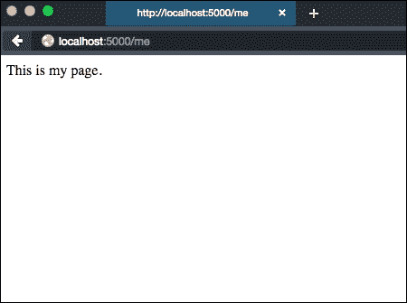

# 第二章：从小到大-扩展 Flask 应用程序结构

Flask 是一个很棒的框架，适合想要编写一个非常快速的单文件应用程序以原型化 API 或构建一个非常简单的网站的人。然而，不那么明显的是，Flask 在更大、更模块化的应用程序结构中的灵活性和能力，这在单模块布局变得更加繁琐而不再方便时是必不可少的。本章我们将涵盖的主要要点如下：

+   如何将基于模块的 Flask 应用程序转换为基于包的布局

+   如何在基于包的应用程序结构上实现 Flask 蓝图

+   如何确保我们的结果应用程序可以使用内置的 Werkzeug 开发服务器运行

# 你的第一个 Flask 应用程序结构

在官方网站上找到的典型的 Flask 入门应用程序是简单的典范，这是你很可能以前就遇到过的：

```py
# app.py 
from flask import Flask
app = Flask(__name__)

@app.route("/")
def hello():
 return "Hello World!"

if __name__ == "__main__":
app.run()

```

首先通过从`pip`安装`Flask`包（当然是在虚拟环境中），然后在 Python 解释器下执行脚本来运行前面的应用程序：

```py
$ pip install Flask
$ python app.py

```

这将启动 Werkzeug 开发 Web 服务器，默认情况下会在`http://localhost:5000`上为`Flask`通过`pip`获取时安装的应用程序提供服务。

人们启动新的`Flask`应用程序的典型方式是向我们在前一节中展示的非常简单的模块添加各种端点：

```py
from flask import Flask, request
app = Flask(__name__)

@app.route("/")
def hello():
 return "Hello World!"

@app.route("/contact")
def contact():
 return "You can contact me at 555-5555, or "
 " email me at test@example.com"

@app.route('/login', methods=['GET', 'POST'])
def login():
 if request.method == 'POST':
 # Logic for handling login
 pass
 else:
 # Display login form
 pass

if __name__ == "__main__":
 app.run()

```

虽然直观，但是一旦应用程序的复杂性增加，这种方法的缺点就变得明显起来：

+   模块中的函数定义数量几乎与我们想要路由到的 URL 数量成线性增长。虽然这不是一个固有的缺点，但开发人员应该更喜欢将功能拆分成更容易理解的小包。

+   路由所需的模板和静态文件积累在同一子文件夹位置，因此使它们的组织更加复杂和容易出错。

+   某些操作（例如日志记录）在按包配置而不是在一个庞大的模块中配置时会变得更简单。

# 从模块到包

可以对基于模块的 Flask 应用程序应用的最简单的结构变化是将其转换为典型的 Python 包，并特别考虑静态和模板文件夹。

```py
application
└──application
    ├──__init__.py
    ├──static
    │  ├──app.js
    │  └──styles.css
    └──templates
         ├──index.html
         └──layout.html
```

在这里，我们创建了一个顶级应用程序包，将`app.py`模块以及`static`和`template`文件夹放入其中，并将其重命名为`__init__.py`。

### 注意

`__init__.py`文件是一个文件夹被视为有效的 Python 包所必需的。

此时应该处理的一个细节是用于运行开发服务器的代码。如果你还记得，单模块应用程序包含以下条件语句：

```py
if __name__ == "__main__":
 app.run()

```

这使我们能够直接用 Python 解释器执行模块文件，如下所示：

```py
$ python app.py
* Running on http://localhost:5000/

```

出于各种原因，这不再是一个可行的选择。然而，我们仍然希望以简单的方式运行开发服务器。为此，我们将创建一个`run.py`文件，作为内部`application`包文件夹的同级：

```py
├──application
│  ├──__init__.py
│  ├──static
│  │  ├──app.js
│  │  └──styles.css
│  └──templates
│  ├──index.html
│  └──layout.html
└──run.py
```

在`run.py`文件中，我们将添加以下片段：

```py
from application import app
app.run()

```

这使我们能够通过 CLI 调用以下命令以通常的方式运行开发服务器：

```py
$ python run.py

```

### 注意

通常情况下，在`__init__.py`包中包含修改状态的代码（例如创建 Flask 应用程序对象）被认为是一种不好的做法。我们现在只是为了说明目的而这样做。

我们的 Flask 应用程序对象的`run`方法可以接受一些可选参数。以下是最有用的几个：

+   `host`：要绑定的主机 IP。默认为任何端口，用`0.0.0.0`表示。

+   `port`：应用程序将绑定到的端口。默认为`5000`。

+   `debug`：如果设置为`True`，Werkzeug 开发服务器在检测到代码更改时将重新加载，并在发生未处理的异常时在 HTML 页面中提供一个交互式调试器。

在我们在前一节中概述的新应用程序结构中，很容易看到功能，比如路由处理程序定义，可以从`__init__.py`中拆分成类似`views.py`模块的东西。同样，我们的数据模型可以被分解成一个`models.py`模块，如下所示：

```py
application
├──application
│  ├──__init__.py
│  ├──models.py
│  ├──static
│  │  ├──app.js
│  │  └──styles.css
│  ├──templates
│  │  ├──index.html
│  │  └──layout.html
│  └──views.py
└──run.py

```

我们只需要在`__init__.py`中导入这些模块，以确保在运行应用程序时它们被加载：

```py
from flask import Flask
app = Flask(__name__)

import application.models
import application.views

```

### 注意

请注意，我们需要在实例化应用程序对象后导入视图，否则将创建循环导入。一旦我们开始使用蓝图开发应用程序，我们通常会尽量避免循环导入，确保一个蓝图不从另一个蓝图中导入。

同样，我们必须在`views.py`模块中导入 Flask 应用程序对象，以便我们可以使用`@app.route`装饰器来定义我们的路由处理程序：

```py
from application import app

@app.route("/")
def hello():
 return "Hello World!"

@app.route("/contact")
def contact():
 return "You can contact me at 555-5555, or "
 " email me at test@example.com"

@app.route('/login', methods=['GET', 'POST'])
def login():
 if request.method == 'POST':
 # Logic for handling login
 pass
 else:
 # Display login form
 pass

```

如预期的那样，应用程序仍然可以像以前一样使用内置的 Werkzeug 应用程序服务器从**命令行界面**（**CLI**）运行；唯一改变的是我们文件的组织。我们获得的优势（以额外文件的代价和可能出现循环导入的可能性）是功能分离和组织：我们的视图处理程序可以根据其感兴趣的领域在单个或多个模块中分组，我们的数据层和实用函数可以存在于应用程序结构的其他位置。

# 从包到蓝图

我们刚刚探讨的基于包的应用程序结构可能适用于大量的应用程序。然而，Flask 为我们提供了一种抽象级别**即蓝图**，它在视图层面上规范和强制实施了关注点的分离。

### 注意

不要将 Flask 中的蓝图概念与同名的 Packt 图书系列的概念混淆！

一个变得过于笨重的 Flask 应用程序可以被分解成一组离散的蓝图——每个蓝图都有自己的 URI 映射和视图函数、静态资源（例如 JavaScript 和 CSS 文件）、Jinja 模板，甚至 Flask 扩展。在许多方面，蓝图与 Flask 应用程序本身非常相似。但是，蓝图不是独立的 Flask 应用程序，不能作为独立的应用程序运行，如官方 Flask 文档中所述：

> *在 Flask 中，蓝图不是可插拔应用程序，因为它实际上不是一个应用程序——它是一组可以在应用程序上注册的操作，甚至可以多次注册。—官方 Flask 文档，[`flask.pocoo.org/docs/0.10/blueprints/`](http://flask.pocoo.org/docs/0.10/blueprints/)*

因此，应用程序中的所有蓝图将共享相同的主应用程序对象和配置，并且它们必须在 URI 分发之前向主 Flask 对象注册。

## 我们的第一个蓝图

以前基于包的应用程序布局可以通过首先添加一个新的包来包含我们的蓝图来扩展为基于蓝图的架构，我们将简单地称之为`users`：

```py
├──application
│  ├──__init__.py
│  └──users
│  ├──__init__.py
│  └──views.py
└──run.py

```

`users`包的内容包括必需的`__init__.py`和另一个模块`views.py`。我们（现在只是简单的）`users`蓝图的视图函数将放在`views.py`模块中：

```py
from flask import Blueprint

users = Blueprint('users', __name__)

@users.route('/me')
def me():
 return "This is my page.", 200

```

### 注意

我们本可以将这段代码放在`users/__init__.py`文件中，而不是将其分离成自己的`views.py`模块；但这样做的话，我们将会在包初始化中放置一个产生副作用的代码（即，实例化用户蓝图对象），这通常是不被赞同的。将其分离成一个不同的模块会带来一些额外的复杂性，但将会在以后避免一些麻烦。

在这个新模块中，我们从 Flask 中导入了`Blueprint`类，并用它来实例化了一个`users`蓝图对象。`Blueprint`类有两个必需的参数，`name`和`import_name`，我们提供的是`users`和`__name__`，这是所有 Python 模块和脚本都可以使用的全局魔术属性。前者可以是我们所需的所有注册蓝图中的任何唯一标识符，后者应该是实例化蓝图对象的模块的名称。

一旦我们完成了这一步，我们必须修改我们在`application/__init__.py`中的应用程序初始化，以便将蓝图绑定到 Flask 应用程序对象：

```py
from flask import Flask
from application.users.views import users

app = Flask(__name__)
app.register_blueprint(users, url_prefix='/users')

```

在将蓝图对象注册到应用程序实例时，可以指定几个可选参数。其中一个参数是`url_prefix`，它将自动为所讨论的蓝图中定义的所有路由添加给定字符串的前缀。这使得封装所有视图和路由变得非常简单，这些视图和路由用于处理以`/users/*` URI 段开头的任何端点的请求，这是我们在本书中经常使用的一种模式。

完成后，我们可以通过我们的`run.py`脚本以通常的方式使用内置的 Werkzeug 应用程序服务器来运行我们的应用程序：

```py
$ python run.py

```

打开我们选择的浏览器并导航到`http://localhost:5000/users/me`会产生以下渲染结果：



# 总结

在本章中，我们从最常见的简单 Flask 应用程序架构开始，并探讨了一些扩展它的方法，以实现更模块化的方法。我们首先从基于模块的布局转向基于包的布局，然后升级到使用 Flask 蓝图，为我们在接下来的章节中使用的基本应用程序结构铺平了道路。

在下一章中，我们将利用在这里获得的知识，通过使用蓝图模式和几个众所周知的 Flask 扩展来创建我们的第一个功能性 Flask 应用程序。
