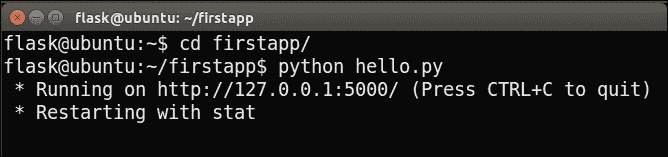
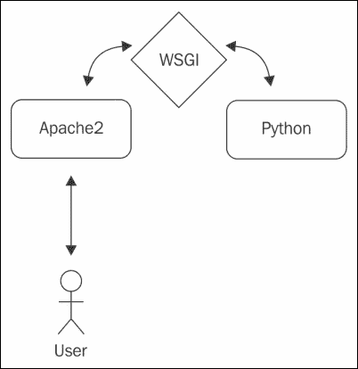
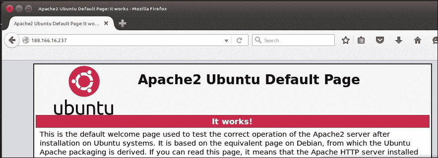
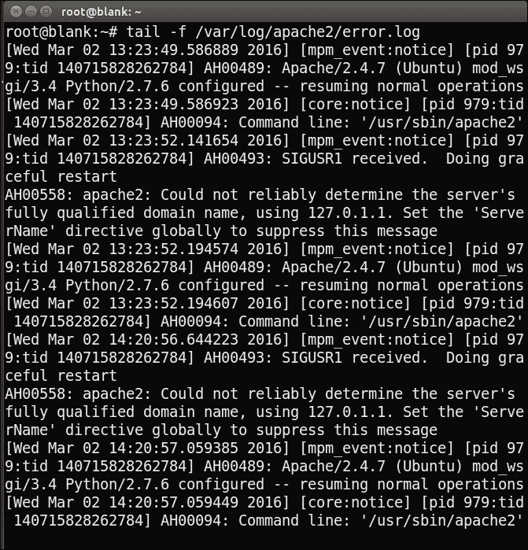

# 第一章：你好，世界！

你好，读者！让我们开始构建一些 Flask 应用程序。Flask 足够简约，以便为您提供选择和灵活性；与较大的框架不同，您可以选择要做什么，然后操纵 Flask 来完成您的要求，它足够完整，可以直接使用。

我们将一起开发三个 Web 应用程序；第一个很简单，将允许您在构建一个非平凡的 Web 应用程序时熟悉 Flask 和新技术和术语；第二个将让您开始构建一个使用传统 SQL 数据库的 Web 应用程序；最后一个将使用**NoSQL**数据库和前端框架来创建一个有用且外观良好的 Web 应用程序。

在本章中，我们将简要介绍 Flask 是什么，也许更重要的是，它不是什么。我们将继续设置我们的基本开发环境以及 Web 服务器，并安装 Python 包管理器以及 Flask 本身。到本章结束时，我们将有我们第一个应用程序的轮廓，并且按照古老的传统，我们将使用我们的新技能来显示文本“Hello, World!”。

简而言之，我们将涵盖以下主题：

+   介绍 Flask

+   创建我们的开发环境

+   编写“Hello, World！”

+   部署我们的应用程序到生产环境

# 介绍 Flask

Flask 是 Python Web 开发的微框架。框架，简单来说，是一个库或一组库，旨在解决通用问题的一部分，而不是完全特定的问题。在构建 Web 应用程序时，总会有一些问题需要解决，例如从 URL 到资源的路由，将动态数据插入 HTML，以及与最终用户交互。

Flask 是微框架，因为它只实现了核心功能（包括路由），但将更高级的功能（包括身份验证和数据库 ORM）留给了扩展。这样做的结果是对于第一次使用者来说初始设置更少，对于有经验的用户来说有更多的选择和灵活性。这与“更完整”的框架形成对比，例如**Django**，后者规定了自己的 ORM 和身份验证技术。

正如我们将讨论的那样，在 Flask 中，我们的 Hello World 应用程序只需要七行代码就可以编写，整个应用程序只包含一个文件。听起来不错吗？让我们开始吧！

# 创建我们的开发环境

开发环境包括开发人员在构建软件时使用的所有软件。首先，我们将安装 Python 包管理器（**pip**）和 Flask 包。在本书中，我们将展示在**Ubuntu 14.04**的干净安装上使用**Python 2.7**进行开发的详细步骤，但是一切都应该很容易转换到 Windows 或 OS X。

## 安装 pip

对于我们的 Hello World 应用程序，我们只需要 Python Flask 包，但在我们的三个应用程序的开发过程中，我们将安装几个 Python 包。为了管理这些包，我们将使用 Python 包管理器 pip。如果您到目前为止一直在 Python 中开发而没有使用包管理器，您会喜欢使用 pip 下载、安装、删除和更新包的简便性。如果您已经使用它，那么跳到下一步，我们将使用它来安装 Flask。

pip 管理器包含在 Python 的 3.4+和 2.7.9+版本中。对于较旧版本的 Python，需要安装 pip。要在 Ubuntu 上安装 pip，请打开终端并运行以下命令：

```py
sudo apt-get update
sudo apt-get install python-pip

```

### 注意

要在 Windows 或 OS X 上安装 pip，您可以从 pip 主页[`pip.pypa.io/en/latest/installing/#install-or-upgrade-pip`](https://pip.pypa.io/en/latest/installing/#install-or-upgrade-pip)下载并运行`get-pip.py`文件。

就是这样！现在您可以通过 pip 轻松安装任何 Python 包。

## 安装 Flask

通过 pip 安装 Flask 再简单不过了。只需运行以下命令：

```py
pip install –-user flask

```

您可能会在终端中看到一些警告，但最后，您也应该看到**成功安装了 Flask**。现在，您可以像导入其他库一样将 Flask 导入 Python 程序中。

### 注意

如果您习惯于在 Python 开发中使用 VirtualEnv，您可以在 VirtualEnv 环境中安装 Flask。我们将在附录 A.未来的一瞥中进一步讨论这个问题。

# 编写“你好，世界！”

现在，我们将创建一个基本的网页，并使用 Flask 的内置服务器将其提供给`localhost`。这意味着我们将在本地机器上运行一个 Web 服务器，我们可以轻松地从本地机器上发出请求。这对开发非常有用，但不适用于生产应用程序。稍后，我们将看看如何使用流行的 Apache Web 服务器来提供 Flask Web 应用程序。 

## 编写代码

我们的应用程序将是一个单独的 Python 文件。在您的主目录中创建一个名为`firstapp`的目录，然后在其中创建一个名为`hello.py`的文件。在`hello.py`文件中，我们将编写代码来提供一个包含静态字符串“Hello, World!”的网页。代码如下所示：

```py
from flask import Flask

app = Flask(__name__)

@app.route("/")
def index():
    return "Hello, World!"

if __name__ == '__main__':
    app.run(port=5000, debug=True)
```

### 提示

**下载示例代码**

您可以从[`www.packtpub.com`](http://www.packtpub.com)的帐户中下载本书的示例代码文件。如果您在其他地方购买了本书，您可以访问[`www.packtpub.com/support`](http://www.packtpub.com/support)并注册，以便直接将文件发送到您的电子邮件。

您可以按照以下步骤下载代码文件：

+   使用您的电子邮件地址和密码登录或注册我们的网站。

+   将鼠标指针悬停在顶部的 SUPPORT 标签上。

+   单击“代码下载和勘误”。

+   在搜索框中输入书名。

+   选择您要下载代码文件的书籍。

+   从下拉菜单中选择您购买此书的地方。

+   单击“下载代码”。

下载文件后，请确保使用最新版本的解压缩或提取文件夹：

+   WinRAR / 7-Zip for Windows

+   Zipeg / iZip / UnRarX for Mac

+   7-Zip / PeaZip for Linux

让我们来分解一下这段代码。第一行应该很熟悉；它只是从`flask`包中导入 Flask。第二行使用我们模块的名称作为参数创建了一个 Flask 对象的实例。Flask 使用这个来解析资源，在复杂的情况下，可以在这里使用其他东西而不是`__name__`。对于我们的目的，我们将始终使用`__name__`，这将我们的模块链接到 Flask 对象。

第 3 行是一个 Python 装饰器。Flask 使用装饰器进行 URL 路由，因此这行代码意味着直接下面的函数应该在用户访问我们网页应用程序的主*根*页面时被调用（由单个斜杠定义）。如果您不熟悉装饰器，这些是美丽的 Python 快捷方式，起初似乎有点像黑魔法。实质上，它们调用一个函数，该函数接受在装饰器下定义的函数（在我们的情况下是`index()`）并返回一个修改后的函数。

接下来的两行也应该很熟悉。它们定义了一个非常简单的函数，返回我们的消息。由于这个函数是由 Flask 在用户访问我们的应用程序时调用的，因此这个返回值将是对请求我们的着陆页面的用户发送的响应。

第 6 行是您可能熟悉的 Python 习语。这是一个简单的条件语句，如果我们的应用程序直接运行，则评估为`True`。它用于防止 Python 脚本在被导入其他 Python 文件时意外运行。

最后一行在我们的本地机器上启动了 Flask 的开发服务器。我们将其设置为在`端口 5000`上运行（我们将在生产中使用`端口 80`），并将调试设置为`True`，这将帮助我们在网页浏览器中直接查看详细的错误。

## 运行代码

要运行我们的开发 Web 服务器，只需打开一个终端并运行`hello.py`文件。如果你使用了前一节中概述的相同结构，命令将如下所示：

```py
cd firstapp/hello
python hello.py

```

你应该得到类似下面截图中的输出：



此外，你应该看到进程继续运行。这是我们的网络服务器在等待请求。所以，让我们发出一个请求！

打开一个网络浏览器——我使用的是 Ubuntu 自带的 Firefox——并导航到`localhost:5000`。

URL 中的`localhost`部分是指向回环地址的快捷方式，通常是`127.0.0.1`，它要求你的计算机向自己发出网络请求。冒号后面的数字（`5000`）是它应该发出请求的端口。默认情况下，所有 HTTP（网络）流量都通过`端口 80`进行传输。现在，我们将使用`5000`，因为它不太可能与任何现有服务冲突，但在生产环境中我们将切换到`端口 80`，这是常规的，这样你就不必担心冒号了。

你应该在浏览器中看到“Hello, World!”字符串显示，就像下面的截图一样。恭喜，你已经使用 Flask 构建了你的第一个网络应用！


# 将我们的应用部署到生产环境

拥有一个运行的应用程序是很棒的，但作为网络应用程序的概念固有的是我们希望其他人能够使用它。由于我们的应用程序是基于 Python 的，我们在如何在 Web 服务器上运行我们的应用程序方面有一些限制（许多传统的 Web 主机只配置为运行 PHP 和/或.NET 应用程序）。让我们考虑如何使用运行 Ubuntu 服务器、Apache 和 WSGI 的**虚拟专用服务器**（**VPS**）来提供 Flask 应用程序。

从这一点开始，我们将维护*两个*环境。第一个是我们的**开发**环境，我们刚刚设置好，在这里我们将编写代码并使用在`localhost`上运行的 Flask 服务器查看其结果（就像我们刚刚做的那样）。第二个将是**生产**环境。这将是一个服务器，我们可以在其中部署我们的网络应用程序，并使它们对世界可访问。当我们在开发环境安装新的 Python 库或其他软件时，我们通常希望在生产环境中复制我们的操作。

## 设置虚拟专用服务器

尽管理论上你可以在本地主机上托管你的网络应用并允许其他人使用，但这有一些严重的限制。首先，每次关闭电脑时，你的应用都将不可用。此外，你的电脑可能通过互联网服务提供商（ISP）和可能的无线路由器连接到互联网。这意味着你的 IP 地址是动态的，经常会变化，这使得你的应用程序的用户难以跟上！最后，很可能你的互联网连接是不对称的，这意味着你的上传速度比下载速度慢。

在服务器上托管你的应用程序可以解决所有这些问题。在“云”变得流行之前，托管网络应用的传统方式是购买一台物理服务器并找到一个数据中心来托管它。如今，情况简单得多。在几分钟内，你可以启动一个虚拟服务器，对你来说它看起来就像一台物理服务器——你可以登录、配置它，并完全控制它——但实际上它只是云提供商拥有和控制的一台虚拟“片”。

在撰写本文时，云服务提供商领域的主要参与者包括亚马逊网络服务、微软 Azure、谷歌云计算和 Digital Ocean。所有这些公司都允许你按小时支付来租用一个虚拟服务器或多台虚拟服务器。如果你是作为爱好学习 Flask，并且不愿意支付任何人来托管你的网络应用程序，你可能会很容易地在这些提供商中找到一个免费试用。任何提供商的最小服务都足以托管我们将运行的所有应用程序。

选择前述提供商之一或您选择的其他提供商。如果您以前从未做过类似的事情，Digital Ocean 通常被认为是注册并创建新机器的最简单过程。选择提供商后，您应该能够按照其各自的说明启动运行 Ubuntu Server 14.04 并通过 SSH 连接到它的 VPS。您将完全控制该机器，只有一个细微的区别：您将没有显示器或鼠标。

您将在本地终端上输入命令，实际上将在远程机器上运行。有关如何连接到您的 VPS 的详细说明将由提供商提供，但如果您使用 Ubuntu，只需运行以下命令即可：

```py
ssh user@123.456.789.000

```

或者，如果您使用公共-私有密钥身份验证进行设置，其中`yourkey.pem`是您的私钥文件的完整路径，以下是要运行的命令：

```py
ssh user@123.456.78.000 –i yourkey.pem

```

这里，`user`是 VPS 上的默认用户，`yourkey`是您的私钥文件的名称。

**其他操作系统的 SSH：**

### 提示

从 OS X 进行 SSH 应该与 Ubuntu 相同，但如果您使用 Windows，您将需要下载 PuTTY。请参阅[`www.putty.org/`](http://www.putty.org/)进行下载和完整的使用说明。请注意，如果您使用密钥文件进行身份验证，您将需要将其转换为与 PuTTY 兼容的格式。在 PuTTY 网站上也可以找到转换工具。

一旦我们连接到 VPS，安装 Flask 的过程与以前相同：

```py
sudo apt-get update
sudo apt-get install python-pip
pip install --user Flask

```

要安装我们的 Web 服务器 Apache 和 WSGI，我们将运行以下命令：

```py
sudo apt-get install apache2
sudo apt-get install libapache2-mod-wsgi

```

Apache 是我们的 Web 服务器。它将监听 Web 请求（由我们的用户使用他们的浏览器访问我们的 Web 应用程序生成）并将这些请求交给我们的 Flask 应用程序。由于我们的应用程序是用 Python 编写的，我们还需要**WSGI（Web 服务器网关接口）**。

这是 Web 服务器和 Python 应用程序之间的常见接口，它允许 Apache 与 Flask 进行通信，反之亦然。架构概述可以在以下图表中看到：



## 配置我们的服务器

现在我们已经安装了 Apache，我们可以看到我们的第一个结果。您可能习惯于使用 URL 访问网站，例如`http://example.com`。我们将直接使用 VPS 的 IP 地址访问我们的 Web 应用程序。您的 VPS 应该有一个静态的公共地址。静态意味着它不会定期更改，公共意味着它是全局唯一的。当您通过 SSH 连接到 VPS 时，您可能使用了公共 IP 地址。如果找不到它，请在 VPS 上运行以下命令，您应该会在输出中看到一个包含您的公共 IP 的`inet addr`部分：

```py
ifconfig

```

IP 地址应该类似于`123.456.78.9`。将您的 IP 地址输入到浏览器的地址栏中，您应该会看到一个页面，上面写着“**Apache2 Ubuntu 默认页面：It Works!**”或类似的内容，如下面的屏幕截图所示：



这意味着我们现在可以向任何有互联网连接的人提供 Web 内容！但是，我们仍然需要：

+   将我们的代码复制到 VPS

+   连接 Apache 和 Flask

+   配置 Apache 以提供我们的 Flask 应用程序

在第一步中，我们将在本地机器上设置一个 Git 存储库，并将存储库克隆到 VPS。在第二步中，我们将使用与 Apache 一起安装的 WSGI 模块。最后，我们将看一下如何编写虚拟主机，使 Apache 默认提供我们的 Flask 应用程序。

## 安装和使用 Git

Git 是一个版本控制系统。版本控制系统除其他功能外，还会自动保存我们代码库的多个版本。这对于撤消意外更改甚至删除非常有用；我们可以简单地恢复到我们代码的以前版本。它还包括许多分布式开发的功能，即许多开发人员在一个项目上工作。然而，我们主要将其用于备份和部署功能。

要在本地计算机和 VPS 上安装 Git，请在每台计算机上运行以下命令：

```py
sudo apt-get update
sudo apt-get install git

```

### 注意

确保您对使用终端在自己的计算机上运行命令和通过 SSH 连接在服务器上运行命令之间的区别感到满意。在许多情况下，我们需要两次运行相同的命令 - 分别针对每个环境运行一次。

现在您已经拥有了软件，您需要一个托管 Git 存储库或“repos”的地方。两个受欢迎且免费的 Git 托管服务是 GitHub（[`github.com`](http://github.com)）和 Bitbucket（[`bitbucket.org`](http://bitbucket.org)）。前往其中一个，创建一个帐户，并按照提供的说明创建一个新存储库。在给存储库命名的选项时，将其命名为`firstapp`，以匹配我们将用于代码库的目录的名称。创建新存储库后，您应该会得到一个唯一的存储库 URL。请记下这一点，因为我们将使用它来使用`git`推送我们的**Hello, World!**应用程序，然后部署到我们的 VPS。

在本地计算机上，打开终端并将目录更改为 Flask 应用程序。通过以下命令初始化一个新存储库，并将其链接到您的远程 Git 存储库：

```py
cd firstapp
git init
git remote add origin <your-git-url>

```

告诉`git`您是谁，以便它可以自动向您的代码更改添加元数据，如下所示：

```py
git config --global user.email "you@example.com"
git config --global user.name "Your Name"

```

Git 允许您完全控制哪些文件是存储库的一部分，哪些不是。即使我们在`firstapp`目录中初始化了 Git 存储库，我们的存储库目前不包含任何文件。按照以下步骤将我们的应用程序添加到存储库中，提交，然后推送：

```py
git add hello.py
git commit -m "Initial commit"
git push -u origin master

```

这些是我们将在本书中使用的主要 Git 命令，因此让我们简要了解每个命令的作用。`add`命令将新文件或修改的文件添加到我们的存储库中。这告诉 Git 哪些文件实际上是我们项目的一部分。将`commit`命令视为对我们项目当前状态的快照。此快照保存在我们的本地计算机上。对代码库进行重大更改时，最好进行新的`commit`，因为我们可以轻松地恢复到以前的`commits`，如果后来的`commit`破坏了我们的应用程序。最后，`push`命令将我们的本地更改推送到远程 Git 服务器。这对备份很有用，并且还将允许我们在我们的 VPS 上获取更改，从而使我们的本地计算机上的代码库与我们的 VPS 上的代码库保持同步。

现在，再次 SSH 到您的 VPS 并获取我们的代码，如下所示：

```py
cd /var/www
git clone <your-git-url>

```

### 注意

上述命令中的`<your-git-url>`部分实际上是对 Git 存储库的 URL 的占位符。

如果尝试克隆 Git 存储库时出现`permission denied`错误，则可能需要为您正在使用的 Linux 用户的`/var/www`目录所有权。如果您使用`tom@123.456.789.123`登录到服务器，可以运行以下命令，这将使您的用户拥有`/var/www`的所有权，并允许您将 Git 存储库克隆到其中。再次，`tom`是以下情况中使用的占位符：

```py
sudo chown -R tom /var/www

```

如果您将`firstapp`用作远程存储库的名称，则应创建一个名为`firstapp`的新目录。使用以下命令验证我们的代码是否存在：

```py
cd firstapp
ls

```

您应该看到您的`hello.py`文件。现在，我们需要配置 Apache 以使用 WSGI。

## 使用 WSGI 为我们的 Flask 应用提供服务

首先，在我们的应用程序目录中创建一个非常简单的`.wsgi`文件。然后，在 Apache 查找可用站点的目录中创建一个 Apache 配置文件。

这两个步骤中唯一稍微棘手的部分是，我们将直接在我们的 VPS 上创建文件，而我们的 VPS 没有显示器，这意味着我们必须使用命令行界面文本编辑器。当然，我们可以像为我们的代码库做的那样，将文件本地创建然后传输到我们的 VPS，但是对于对配置文件进行小的更改，这往往比值得的努力更多。使用没有鼠标的文本编辑器需要一点时间来适应，但这是一个很好的技能。Ubuntu 上的默认文本编辑器是 Nano，其他流行的选择是 vi 或 Vim。有些人使用 Emacs。如果您已经有喜欢的，就用它。如果没有，我们将在本书的示例中使用 Nano（它已经安装并且可以说是最简单的）。但是，如果您想要更上一层楼，我建议学习使用 Vim。

假设您仍然连接到您的 VPS，并已经像最近的步骤一样导航到`/var/www/firstapp`目录，运行以下命令：

```py
nano hello.wsgi

```

这将创建`hello.wsgi`文件，您现在可以通过 Nano 进行编辑。输入以下内容：

```py
import sys
sys.path.insert(0, "/var/www/firstapp")
from hello import app as application

```

这只是 Python 语法，它将我们的应用程序补丁到 PATH 系统中，以便 Apache 可以通过 WSGI 找到它。然后我们将`app`（我们在`hello.py`应用程序中使用`app = Flask(__name__)`行命名）导入命名空间。

按*Ctrl* + *X*退出 Nano，并在提示时输入*Y*以保存更改。

现在，我们将创建一个 Apache 配置文件，指向我们刚刚创建的`.wsgi`文件，如下所示：

```py
cd /etc/apache2/sites-available
nano hello.conf

```

### 注意

如果您在编辑或保存文件时遇到权限问题，您可能还需要取得`apache2`目录的所有权。运行以下命令，将用户名替换为您的 Linux 用户：

`sudo chown –R tom /etc/apache2`

在这个文件中，我们将为 Apache 虚拟主机创建一个配置。这将允许我们从单个服务器上提供多个站点，这在以后想要使用我们的单个 VPS 来提供其他应用程序时将非常有用。在 Nano 中，输入以下配置：

```py
<VirtualHost *>
    ServerName example.com

    WSGIScriptAlias / /var/www/firstapp/hello.wsgi
    WSGIDaemonProcess hello
    <Directory /var/www/firstapp>
       WSGIProcessGroup hello
       WSGIApplicationGroup %{GLOBAL}
        Order deny,allow
        Allow from all
    </Directory>
</VirtualHost>
```

这可能看起来很复杂，但实际上非常简单。我们将创建一个`virtualhost`并指定我们的域名，我们的`.wsgi`脚本所在的位置，我们的应用程序的名称以及谁被允许访问它。我们将在最后一章讨论域名，但现在，您可以将其保留为`example.com`，因为我们将通过其 IP 地址访问我们的应用程序。

### 注意

如果您在这一步遇到问题，Flask 网站上有一个关于配置和故障排除 Apache 配置的很好的资源。您可以在[`flask.pocoo.org/docs/0.10/deploying/mod_wsgi/`](http://flask.pocoo.org/docs/0.10/deploying/mod_wsgi/)找到它。

按*Ctrl* + *X*，然后在再次提示时输入*Y*以保存并退出文件。现在，我们需要启用配置并将其设置为我们的默认站点。

### 配置 Apache 以提供我们的 Flask 应用程序

Apache 站点的工作方式如下：有一个`sites-available`目录（我们在其中创建了新的虚拟主机配置文件）和一个`sites-enabled`目录，其中包含我们希望处于活动状态的所有配置文件的快捷方式。默认情况下，您会在`sites-available`目录中看到一个名为`000-default.conf`的文件。这就是我们第一次安装 Apache 时看到默认的**It works** Apache 页面的原因。我们不再想要这个了；相反，我们希望使用我们的应用程序作为默认站点。因此，我们将禁用默认的 Apache 站点，启用我们自己的站点，然后重新启动 Apache 以使更改生效。运行以下命令来执行此操作：

```py
sudo a2dissite 000-default.conf
sudo a2ensite hello.conf
sudo service apache2 reload

```

### 注意

所需的 Apache 配置和命令可能会根据您使用的平台而有所不同。如果您使用推荐的 Ubuntu 服务器，上述内容应该都能顺利工作。如果不是，您可能需要稍微了解一下如何为您的特定平台配置 Apache。

您应该注意输出中的`重新加载 web 服务器 apache2`。如果显示错误，则可能在前面的命令中配置错误。如果是这种情况，请仔细阅读错误消息，并返回查看之前的步骤，看看为什么事情没有按预期工作。

为了测试一切是否正常工作，请在本地机器上的 Web 浏览器中打开并再次在地址栏中键入您的 IP 地址。您应该在浏览器中看到**Hello, World!**而不是之前看到的默认 Apache 页面。

如果您收到**错误 500**，这意味着我们的应用程序出现了一些问题。不要担心；最好现在就习惯处理这个错误，因为修复可能会很简单，而不是以后，当我们添加了更多可能出错或配置错误的组件时。要找出出了什么问题，运行以下命令在您的 VPS 上：

```py
sudo tail –f /var/log/apache2/error.log

```

`tail`命令只是输出作为参数传递的文件的最后几行。`-f`是用于跟踪，这意味着如果文件更改，输出将被更新。如果您无法立即确定哪些行是我们正在寻找的错误的指示，再次在本地机器上的 Web 浏览器中访问该站点，您将看到`tail`命令的输出相应地更新。以下截图显示了`tail`命令在没有错误时的输出；但是，如果出了任何问题，您将看到错误输出打印在所有信息消息中。



一些可能的绊脚石是错误配置的 WSGI 和 Apache 文件（例如，确保您的`WSGIDaemonProcess`和`daemon name`匹配）或错误配置的 Python（您可能忘记在 VPS 上安装 Flask）。如果您无法弄清楚错误消息的含义，互联网搜索消息（删除应用程序的错误特定部分，如名称和路径）通常会指引您朝正确的方向。如果失败，Stack Overflow 和 Google Groups 上有强大而友好的 Flask 和 WSGI 社区，通常会有人愿意帮助初学者。请记住，如果您遇到问题并且找不到现有的解决方案，请不要感到难过；您将帮助无数面临类似问题的人。

# 摘要

在本章中，我们涉及了相当多的材料！我们进行了一些初始设置和日常工作，然后使用 Flask 编写了我们的第一个 Web 应用程序。我们看到这在本地运行，然后讨论了如何使用 Git 将我们的代码复制到服务器。我们配置了服务器以向公众提供我们的应用程序；但是，我们的应用程序只是一个静态页面，向访问我们页面的人打印“Hello, World!”字符串。这对许多人来说并不有用，并且可以使用静态 HTML 页面更简单地实现。但是，通过我们付出的额外努力，现在我们的应用程序背后拥有 Python 的所有功能；我们只是还没有使用它！

在下一章中，我们将发现如何利用 Python 使我们的 Web 应用程序更有用！
