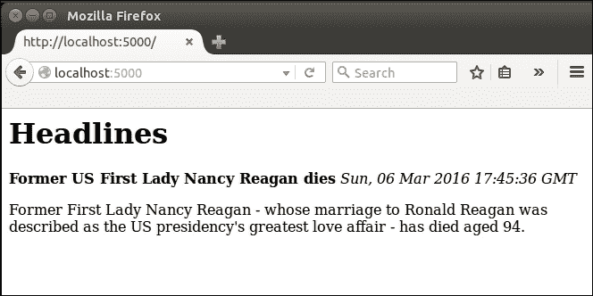
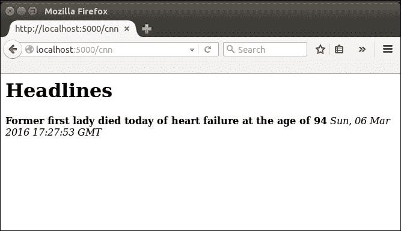

# 第二章：开始我们的头条项目

现在我们的 Hello World 应用程序已经启动运行，我们已经完成了所有必要的工作，可以创建一个更有用的应用程序。在接下来的几章中，我们将创建一个头条应用程序，向用户显示最新的新闻头条，天气信息和货币汇率。

在本章中，我们将介绍 RSS 订阅，并展示如何使用它们自动检索特定出版物的最新新闻文章。在下一章中，我们将讨论如何使用模板向用户显示检索到的文章的标题和摘要。第四章，*我们头条项目的用户输入*，将向您展示如何从用户那里获取输入，以便他们可以自定义他们的体验，并且还将讨论如何向我们的应用程序添加天气和货币数据。我们将在第五章中完成项目，*改善我们头条项目的用户体验*，通过添加一些 CSS 样式，并研究如何在用户的下一次访问中记住他们的偏好。

在本章结束时，您将学会如何创建一个更复杂的 Flask 应用程序。我们将从真实世界的新闻故事中提取原始数据，并构建 HTML 格式以向用户显示这些内容。您还将了解更多关于路由的知识，即不同的 URL 触发应用程序代码的不同部分。

在这一章中，我们将涵盖以下主题：

+   搭建我们的项目和 Git 仓库

+   创建一个新的 Flask 应用程序

+   介绍 RSS 和 RSS 订阅

# 设置我们的项目和 Git 仓库

我们可以简单地编辑我们的 Hello World 应用程序以添加所需的功能，但更干净的做法是开始一个新项目。我们将为每个项目创建一个新的 Git 仓库，一个新的 Python 文件，一个新的`.wsgi`文件和一个新的 Apache 配置文件。这意味着书中的所有三个项目以及原始的 Hello World 应用程序都可以从我们的 Web 服务器访问。

设置与我们在第一章中为我们的 Hello World 应用程序所做的非常相似，但我们将再次简要地介绍这些步骤，因为我们不必重复大部分配置和安装，如下所示：

1.  登录到您的 GitHub 或 BitBucket 帐户，并创建一个名为`headlines`的新存储库。记下您获得的此空存储库的 URL。

1.  在您的本地计算机上，在您的主目录或者您放置`firstapp`目录的任何地方创建一个名为`headlines`的新目录。

1.  在此目录中创建一个名为`headlines.py`的新文件。

1.  在您的终端中，将目录更改为`headlines`目录，并通过执行以下命令初始化 Git 存储库：

```py
cd headlines
git init
git remote add origin <your headlines git URL>
git add headlines.py
git commit -m "initial commit"
git push –u origin master

```

现在，我们几乎准备好将代码推送到我们的新仓库；我们只需要先编写它。

# 创建一个新的 Flask 应用程序

首先，我们将创建新的 Flask 应用程序的框架，这与我们的 Hello World 应用程序几乎相同。在编辑器中打开`headlines.py`并写入以下代码：

```py
from flask import Flask

app = Flask(__name__)

@app.route("/")
def get_news():
  return "no news is good news"

if __name__ == '__main__':
  app.run(port=5000, debug=True)
```

这与以前完全一样。您可以在终端中使用`python headlines.py`运行它。打开浏览器并导航到`localhost:5000`，以查看显示的**没有新闻就是好消息**字符串。然而，尽管这句古话可能是真的，但糟糕的消息是我们的应用程序除了这个之外没有做任何更有用的事情。让我们让它向用户显示实际的新闻。

# 介绍 RSS 和 RSS 订阅

RSS 是一种古老但仍然广泛使用的技术，用于管理内容订阅。它已经存在了很长时间，以至于有人争论 RSS 这几个字母实际上代表什么，有人说是真正简单的聚合，有人说是丰富的站点摘要。这有点无关紧要，因为每个人都只是称它为 RSS。

RSS 使用 XML 以有序和结构化的格式呈现内容。它有几种用途，其中较常见的用途之一是供人们消费新闻文章。在新闻网站上，新闻通常以类似于印刷报纸的方式布局，重要的文章会占用更多的空间，并且会在页面上停留更长的时间。这意味着经常访问页面的用户会重复看到一些内容，并且必须寻找新内容。另一方面，有些网页更新非常不频繁，比如一些作者的博客。用户必须继续检查这些页面，看它们是否有更新，即使它们大部分时间都没有变化。RSS 源解决了这两个问题。如果网站配置为使用 RSS 源，所有新内容都会发布到一个源中。用户可以订阅他或她选择的源，并使用 RSS 阅读器来消费这些内容。他或她订阅的所有源的新故事将出现在阅读器中，并在标记为已读后消失。

由于 RSS 源具有正式的结构，它们允许我们在 Python 中以编程方式轻松解析标题、文章文本和日期。我们将使用一些主要新闻出版物的 RSS 源来向我们应用程序的用户显示新闻。

尽管 RSS 遵循严格的格式，我们可以不费太多力气地编写逻辑来解析源，但我们将使用 Python 库来完成这项工作。该库将抽象出诸如不同版本的 RSS 之类的东西，并允许我们以完全一致的方式访问所需的数据。

有几个 Python 库可以用来实现这一点。我们将选择`feedparser`。要安装它，打开你的终端并输入以下内容：

```py
pip install --user feedparser

```

现在，让我们去找一个要解析的 RSS 源！大多数主要出版物都提供 RSS 源，而建立在流行平台上的较小网站，如 WordPress 和 Blogger，通常也会默认包含 RSS。有时需要一点努力才能找到 RSS 源；然而，由于没有关于它应该位于何处的标准，你经常会在主页的某个地方看到 RSS 图标（查看页眉和页脚），它看起来类似于这样：


此外，寻找标有**RSS**或**Feed**的链接。如果这种方法失败，尝试访问[site.com/rss](http://site.com/rss)或[site.com/feed](http://site.com/feed)，其中`site.com`是你正在寻找 RSS 源的网站的根 URL。

我们将使用主要 BBC 新闻页面的 RSS 源。在撰写本文时，它位于[`feeds.bbci.co.uk/news/rss.xml`](http://feeds.bbci.co.uk/news/rss.xml)。如果你感兴趣，你可以在浏览器中打开这个 URL，在页面的某个地方右键单击，然后点击**查看源代码**或等效选项。你应该会看到一些结构化的 XML，格式类似于以下内容：

```py
<?xml version="1.0" encoding="UTF-8"?>
  <channel>
    <title>FooBar publishing</title>
    <link>http://dwyer.co.za</link>
    <description>A mock RSS feed</description> 
    <language>en-gb</language>  
    <item> 
      <title>Flask by Example sells out</title>
      <description>Gareth Dwyer's new book, Flask by Example sells out in minutes</description>
      <link>http://dwyer.co.za/book/news/flask-by-example</link>
      <guid isPermalink="false">http://dwyer.co.za/book/news/flask-by-example</guid>
      <pubDate>Sat, 07 Mar 2015 09:09:19 GMT</pubDate>
    </item>
  </channel>
</rss>
```

在源的顶部，你会看到一两行描述源本身的内容，比如它使用的 RSS 版本以及可能一些关于样式的信息。之后，你会看到与源的发布者相关的信息，然后是一系列`<item>`标签。其中每个代表一个*故事*——在我们的情况下，是一篇新闻文章。这些项目包含诸如标题、摘要、发布日期和完整故事的链接等信息。让我们开始解析吧！

## 使用 Python 从 RSS 获取信息

在我们的`headlines.py`文件中，我们将进行修改以导入我们安装的`feedparser`库，解析 feed，并获取第一篇文章。我们将围绕第一篇文章构建 HTML 格式，并在我们的应用程序中显示这个。如果你对 HTML 不熟悉，它代表**超文本标记语言**，用于定义网页中文本的外观和布局。它非常简单，但如果对你来说完全是新的，你应该花一点时间去学习一下初学者教程，以熟悉它的最基本用法。有许多免费的在线教程，快速搜索应该能找到几十个。一个受欢迎且非常适合初学者的教程可以在[`www.w3schools.com/html/`](http://www.w3schools.com/html/)找到。

我们的新代码添加了新库的导入，定义了一个新的全局变量用于 RSS feed URL，并进一步添加了一些逻辑来解析 feed，获取我们感兴趣的数据，并将其插入到一些非常基本的 HTML 中。它看起来类似于这样：

```py
import feedparser
from flask import Flask

app = Flask(__name__)

BBC_FEED = "http://feeds.bbci.co.uk/news/rss.xml"

@app.route("/")
def get_news():
 feed = feedparser.parse(BBC_FEED)
 first_article = feed['entries'][0]
 return """<html>
 <body>
 <h1> BBC Headlines </h1>
 <b>{0}</b> <br/>
 <i>{1}</i> <br/>
 <p>{2}</p> <br/>
 </body>
</html>""".format(first_article.get("title"), first_article.get("published"), first_article.get("summary"))

if __name__ == "__main__":
  app.run(port=5000, debug=True)
```

这个函数的第一行将 BBC 的 feed URL 传递给我们的`feedparser`库，该库下载 feed，解析它，并返回一个 Python 字典。在第二行，我们仅从 feed 中获取了第一篇文章并将其分配给一个变量。`feedparser`返回的字典中的`entries`条目包含了包括我们之前提到的新闻故事的所有项目的列表，因此我们从中取出了第一个，并从中获取了标题或`title`，日期或`published`字段以及文章的摘要（即`summary`）。在`return`语句中，我们在一个三引号的 Python 字符串中构建了一个基本的 HTML 页面，其中包括所有 HTML 页面都有的`<html>`和`<body>`标签，以及描述我们页面的`<h1>`标题；`<b>`，这是一个*加粗*标签，显示新闻标题；`<i>`，代表*斜体*标签，显示文章的日期；和`<p>`，这是一个段落标签，用于显示文章的摘要。由于 RSS feed 中几乎所有项目都是可选的，我们使用了`python.get()`运算符而不是使用索引表示法（方括号），这意味着如果有任何信息缺失，它将简单地从我们最终的 HTML 中省略，而不会导致运行时错误。

为了清晰起见，我们在这个例子中没有进行任何异常处理；但是请注意，`feedparser`在尝试解析 BBC URL 时可能会抛出异常。如果你的本地互联网连接不可用，BBC 服务器宕机，或者提供的 feed 格式不正确，那么`feedparser`将无法将 feed 转换为 Python 字典。在一个真实的应用程序中，我们会添加一些异常处理并在这里重试逻辑。在一个真实的应用程序中，我们也绝不会在 Python 字符串中构建 HTML。我们将在下一章中看看如何正确处理 HTML。打开你的网络浏览器，看看结果。你应该看到一个非常基本的页面，看起来类似于以下内容（尽管你的新闻故事将是不同的）：



这是一个很好的开始，我们现在为我们应用程序的假设用户提供了动态内容（即根据用户或外部事件自动更改的内容）。然而，最终，它并不比静态字符串更有用。谁想要看到来自他们无法控制的单一出版物的单一新闻故事呢？

为了完成本章，我们将看看如何根据 URL 路由从不同的出版物中显示文章。也就是说，我们的用户将能够在我们的网站上导航到不同的 URL，并查看来自几种出版物中的文章。在此之前，让我们稍微详细地看一下 Flask 如何处理 URL 路由。

## Flask 中的 URL 路由

你还记得我们在上一章中简要提到了 Python 装饰器吗？它们由我们主要函数上面的有趣的`@app.route("/")`行表示，它们指示 Flask 应用程序的哪些部分应该由哪些 URL 触发。我们的基本 URL 通常类似于`site.com`，但在我们的情况下是我们 VPS 的 IP 地址，它被省略了，我们将在装饰器中指定剩下的 URL（即路径）。之前，我们使用了一个斜杠，表示当我们的基本 URL 被访问时，没有指定路径时应该触发该函数。现在，我们将设置我们的应用程序，以便用户可以访问类似[site.com/bbc](http://site.com/bbc)或[site.com/cnn](http://site.com/cnn)的 URL，选择他们想要看到文章的出版物。

我们需要做的第一件事是收集一些 RSS URL。在撰写本文时，以下所有内容都是有效的：

+   CNN: [`rss.cnn.com/rss/edition.rss`](http://rss.cnn.com/rss/edition.rss)

+   Fox News: [`feeds.foxnews.com/foxnews/latest`](http://feeds.foxnews.com/foxnews/latest)

+   IOL: [`www.iol.co.za/cmlink/1.640`](http://www.iol.co.za/cmlink/1.640)

首先，我们将考虑如何使用静态路由来实现我们的目标。这绝不是最好的解决方案，因此我们将仅为我们的两个出版物实现静态路由。一旦我们完成这项工作，我们将考虑如何改用动态路由，这是许多问题的更简单和更通用的解决方案。

我们将建立一个 Python 字典，封装所有的 RSS 订阅，而不是为每个 RSS 订阅声明一个全局变量。我们将使我们的`get_news()`方法通用化，并让我们装饰的方法使用相关的出版物调用它。我们修改后的代码如下：

```py
import feedparser
from flask import Flask

app = Flask(__name__)

RSS_FEEDS = {'bbc': 'http://feeds.bbci.co.uk/news/rss.xml',
             'cnn': 'http://rss.cnn.com/rss/edition.rss',
             'fox': 'http://feeds.foxnews.com/foxnews/latest',
             'iol': 'http://www.iol.co.za/cmlink/1.640'}

@app.route("/")
@app.route("/bbc")
def bbc():
    return get_news('bbc')

@app.route("/cnn")
def cnn():
    return get_news('cnn')

def get_news(publication):
  feed = feedparser.parse(RSS_FEEDS[publication])
  first_article = feed['entries'][0]
  return """<html>
    <body>
        <h1>Headlines </h1>
        <b>{0}</b> </ br>
        <i>{1}</i> </ br>
        <p>{2}</p> </ br>
    </body>
</html>""".format(first_article.get("title"), first_article.get("published"), first_article.get("summary"))

if __name__ == "__main__":
  app.run(port=5000, debug=True)
```

Common mistakes:

### 提示

如果您复制或粘贴函数并编辑`@app.route`装饰器，很容易忘记编辑函数名。虽然我们的函数名在很大程度上是无关紧要的，因为我们不直接调用它们，但我们不能让不同的函数共享与最新定义相同的名称，因为最新的定义将始终覆盖任何先前的定义。

我们仍然默认返回 BBC 新闻订阅，但如果用户访问 CNN 或 BBC 路由，我们将明确从各自的出版物中获取头条新闻。请注意，我们可以在一个函数中有多个装饰器，这样我们的`bbc()`函数就会在访问我们的基本 URL 或`/bbc`路径时触发。另外，请注意函数名不需要与路径相同，但在前面的例子中我们遵循了这个常见的约定。

接下来，当用户访问`/cnn`页面时，我们可以看到我们应用程序的输出。显示的标题现在来自 CNN 订阅。



现在我们知道了 Flask 中路由的工作原理，如果能更简单就好了，不是吗？我们不想为我们的每个订阅定义一个新的函数。我们需要的是函数根据路径动态获取正确的 URL。这正是动态路由所做的事情。

在 Flask 中，如果我们在 URL 路径的一部分中使用尖括号`<` `>`，那么它将被视为一个变量，并传递给我们的应用程序代码。因此，我们可以重新使用单个`get_news()`函数，并传入一个`<publication>`变量，该变量可用于从我们的字典中进行选择。装饰器指定的任何变量都必须在我们函数的定义中考虑到。更新后的`get_news()`函数的前几行如下所示：

```py
@app.route("/")
@app.route("/<publication>")
def get_news(publication="bbc"):
    # rest of code unchanged  
```

在前面显示的代码中，我们将`<publication>`添加到路由定义中。这将创建一个名为`publication`的参数，我们需要将其作为函数的参数直接添加到路由下面。因此，我们可以保留出版物参数的默认值为`bbc`，但如果用户访问 CNN，Flask 将传递`cnn`值作为出版物参数。

代码的其余部分保持不变，但是删除现在未使用的`bbc()`和`cnn()`函数定义非常重要，因为我们需要默认路由来激活我们的`get_news()`函数。

很容易忘记在函数定义中*catch* URL 变量。路由的任何动态部分都必须在函数中包含同名的参数才能使用该值，因此要注意这一点。请注意，我们给我们的 publication 变量一个默认值`bbc`，这样当用户访问我们的基本 URL 时，我们就不需要担心它未定义。但是，再次强调，如果用户访问我们字典中没有的任何 URL，我们的代码将抛出异常。在真实的 Web 应用程序中，我们会捕获这种情况并向用户显示错误，但我们将把错误处理留到以后的章节。

## 发布我们的头条应用程序

这是我们在本章中将应用的最远程度。让我们将结果推送到我们的服务器，并配置 Apache 默认显示我们的头条新闻应用程序，而不是我们的 Hello World 应用程序。

首先，将更改添加到 Git 存储库中，对其进行提交，并将其推送到远程。您可以通过运行以下命令来完成此操作（在打开终端并切换到头条目录后）：

```py
git add headlines.py
git commit –m "dynamic routing"
git push origin master

```

然后，使用以下命令通过 SSH 连接到 VPS 并在那里克隆新项目：

```py
ssh –i yourkey.pem root@123.456.789.123
cd /var/www
git clone https://<yourgitrepo>

```

不要忘记安装我们现在依赖的新库。在服务器上忘记安装依赖关系是一个常见的错误，可能会导致令人沮丧的调试。请记住这一点。以下是此命令：

```py
pip install --user feedparser

```

现在，创建`.wsgi`文件。我假设您在创建远程存储库时将 Git 项目命名为`headlines`，并且在执行前面的 Git 克隆命令时，在您的`/var/www`目录中创建了一个名为`headlines`的目录。如果您将项目命名为其他名称，并且现在有一个具有不同名称的目录，请将其重命名为 headlines（否则，您将不得不相应地调整我们即将进行的大部分配置）。在 Linux 中重命名目录，请使用以下命令：

```py
mv myflaskproject headlines

```

之前使用的命令将目录称为`myflaskproject`重命名为`headlines`，这将确保接下来的所有配置都能正常工作。现在，运行以下命令：

```py
cd headlines
nano headlines.wsgi

```

然后，插入以下内容：

```py
import sys
sys.path.insert(0, "/var/www/headlines")
from headlines import app as application
```

通过按下*Ctrl* + *X*键组合退出 Nano，并在提示保存更改时输入*Y*。

现在，转到 Apache 中的`sites-available`目录，并使用以下命令创建新的`.conf`文件：

```py
cd /etc/apache2/sites-available
nano headlines.conf

```

接下来，输入以下内容：

```py
<VirtualHost *>
    ServerName example.com

    WSGIScriptAlias / /var/www/headlines/headlines.wsgi
    WSGIDaemonProcess headlines
    <Directory /var/www/headlines>
       WSGIProcessGroup headlines
       WSGIApplicationGroup %{GLOBAL}
        Order deny,allow
        Allow from all
    </Directory>
</VirtualHost>
```

保存文件并退出 nano。现在，通过运行以下命令禁用我们的旧站点，启用新站点，并重新启动 Apache：

```py
sudo a2dissite hello.conf
sudo a2enssite headlines.conf
sudo service apache2 reload

```

尝试从本地机器访问 VPS 的 IP 地址，如果一切如预期般进行，您应该像以前一样看到新闻标题！如果没有，不要担心。在某些配置中犯错误是很容易的。最有可能的是您的`headlines.wsgi`或`headlines.conf`文件有一个小错误。找到这个最简单的方法是查看 Apache 错误日志中的最近错误，这些错误在您尝试访问站点时会触发。使用以下命令再次查看：

```py
sudo tail –fn 20 /var/log/apache2/error.log

```

# 摘要

这就是本章的全部内容。本章的主要要点是看一下 Flask 如何处理静态和动态路由。您还学会了一种相当混乱的使用 HTML 格式化数据并将其返回给用户的方法。

在下一章中，我们将看一下使用 Jinja 模板更清晰地分离 HTML 代码和 Python 代码的方法。我们还将让我们的应用程序显示不止一个新闻故事。
