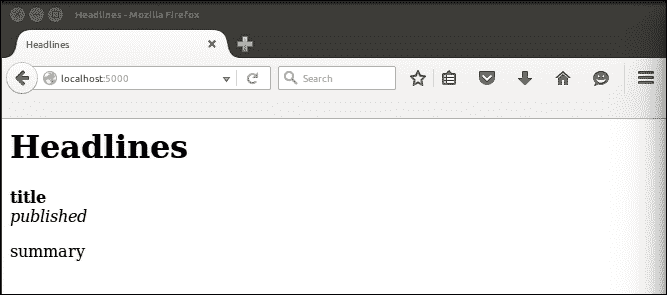
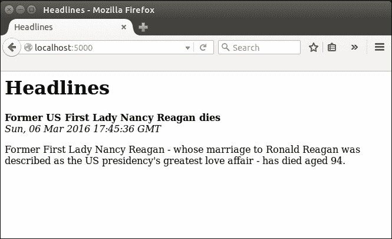
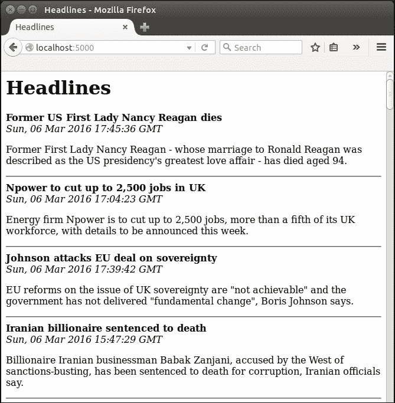
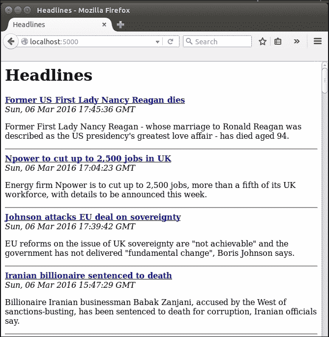
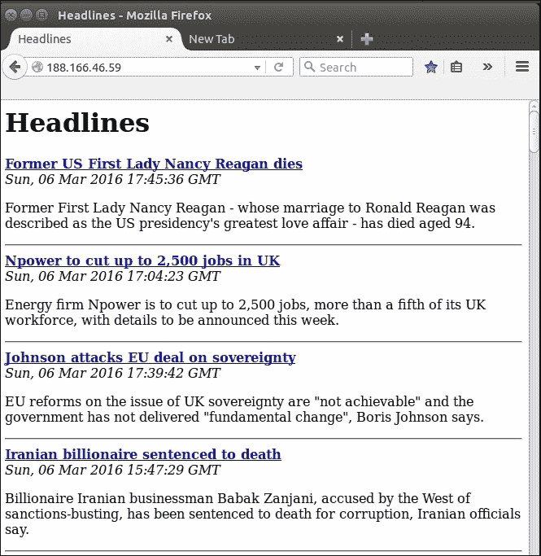

# 第三章：在我们的头条项目中使用模板

在上一章中，我们看到了一种将静态 HTML 与动态内容结合起来创建网页的方法。但这很混乱，我们不想在 Python 字符串中构建我们的网页。混合 HTML 和 Python 并不理想，原因有几个：首先，这意味着如果我们想要更改静态文本，比如出现在标题中的文本，我们必须编辑我们的 Python 文件，这也涉及重新加载这些文件到 Apache。如果我们雇佣前端开发人员来处理 HTML，他们有可能会不小心破坏陌生的 Python 代码，并且更难以正确地构建任何其他前端代码，比如 JavaScript 和 CSS。理想情况下，我们应该在前端和后端组件之间实现完全的隔离。我们可以在很大程度上使用 Jinja 来实现这一点，但与生活的大多数方面一样，一些妥协是必要的。

在本章结束时，我们将扩展我们的应用程序，以显示所选出版物的不止一个头条新闻。我们将为每个出版物显示多篇文章，每篇文章都有一个指向原始文章的链接，我们的逻辑和视图组件将在很大程度上分离。在本章中，我们将涵盖以下主题：

+   介绍 Jinja

+   Jinja 模板的基本用法

+   Jinja 模板的高级用法

# 介绍 Jinja

Jinja 是一个 Python 模板引擎。它允许我们轻松地定义由 Python 填充的动态 HTML 块。HTML 模板即使对于具有多个页面的静态网站也是有用的。通常，每个页面都有一些共同的元素，比如标题和页脚。虽然对于静态网站来说，可以维护每个页面，但如果对共享部分进行更改，则需要在多个位置进行单个更改。Flask 是建立在 Jinja 之上的，因此虽然可以在没有 Flask 的情况下使用 Jinja，但 Jinja 仍然是 Flask 的固有部分，并且 Flask 提供了几种直接与 Jinja 一起工作的方法。一般来说，Flask 对于应用程序的结构假设没有任何东西，除了你告诉它的内容，并且更喜欢通过可选插件提供功能。Jinja 在某种程度上是一个例外。Flask 默认为您提供 Jinja，并假设您将所有 Jinja 模板存储在名为`templates`的应用程序子目录中。

创建模板后，我们将从我们的 Flask 应用程序中调用渲染这些模板。渲染涉及解析 Jinja 代码，插入任何动态数据，并创建纯 HTML 以返回给用户的浏览器。尽管所有这些都是在幕后完成的，但可能会让人有点困惑，不知道在哪里完成了什么。我们将一步一步地进行。

# Jinja 模板的基本用法

使用 Jinja 模板的第一步是在我们的应用程序中创建一个目录来包含我们的模板文件，所以导航到您的`headlines`目录，并创建一个名为`templates`的目录。与之前的步骤不同，这个名称是应用程序的其他部分所期望的，并且区分大小写，因此在创建时要小心。在最基本的级别上，Jinja 模板可以只是一个 HTML 文件，我们将为所有的 Jinja 模板使用`.html`扩展名。在`templates`目录中创建一个名为`home.html`的新文件。这将是我们的用户访问我们的应用程序时看到的页面，并且将包含我们以前在 Python 字符串中的所有 HTML。

### 注意

在本书中，我们只会使用 Jinja 来构建 HTML 文件，但 Jinja 足够灵活，可以用于生成任何基于文本的格式。虽然我们使用`.html`扩展名来命名我们的 Jinja 模板，但这些文件本身并不总是纯 HTML。

现在，将以下静态 HTML 代码放入此文件中。我们将在下一步中看如何在 Python 和我们的模板之间传递动态数据。

```py
<html>
    <head>
        <title>Headlines</title>
    </head>
    <body>
        <h1>Headlines</h1>
        <b>title</b><br />
        <i>published</i><br />
        <p>summary</p>
    </body>
</html>
```

现在在我们的 Python 代码中，我们将渲染这个模板并返回它，而不是在我们的路由函数中构建字符串并返回它。在`headlines.py`中，在顶部添加一个导入：

```py
from flask import render_template
```

`render_template`函数是一个魔术，它以 Jinja 模板作为输入，并产生纯 HTML 作为输出，可以被任何浏览器读取。目前，一些魔术已经失去了，因为我们将纯 HTML 作为输入，并在浏览器中查看相同的输出。

## 渲染基本模板

在你的`get_news()`函数中，删除包含我们三引号 HTML 字符串的`return`语句。保留之前从`feedparser`获取数据的行，因为我们很快会再次使用它。

更新`return`语句，使得`get_news()`函数现在如下所示：

```py
@app.route("/")
@app.route("/<publication>"
def get_news(publication="bbc"):
  feed = feedparser.parse(RSS_FEEDS[publication])
  first_article = feed['entries'][0]
 return render_template("home.html")

```

尽管我们当前的 HTML 文件是纯 HTML，还没有使用我们稍后将看到的 Jinja 语法，但实际上我们已经做了相当多的魔术。这个调用在我们的`templates`目录中查找名为`home.html`的文件，读取它，解析任何 Jinja 逻辑，并创建一个 HTML 字符串返回给用户。一旦你做了以上两个更改，再次用`python headlines.py`运行你的应用程序，并在浏览器中导航到`localhost:5000`。

再次，我们为了前进而后退了一步。如果你现在运行应用程序并在浏览器中查看结果，你应该会看到与我们原始页面类似的东西，只是现在你会看到字符串**title**，**published**和**summary**，如下图所示：



让我们看看如何在`render_template`调用中填充这些字段，以便我们可以再次看到真实的新闻内容。

## 将动态数据传递给我们的模板

首先，在我们的 Python 文件中，我们将把每个作为命名变量传递。再次更新`get_news()`函数，并将所有需要显示给用户的数据作为参数传递给`render_template()`，如下所示：

```py
@app.route("/")
@app.route("/<publication>"
def get_news(publication="bbc"):
  feed = feedparser.parse(RSS_FEEDS[publication])
  first_article = feed['entries'][0]
 render_template("home.html",title=first_article.get("title"),published=first_article.get("published"),summary=first_article.get("summary"))

```

`render_template`函数以模板的文件名作为第一个参数，然后可以接受任意数量的命名变量作为后续参数。每个变量中的数据将在模板中使用变量名可用。

## 在我们的模板中显示动态数据

在我们的`home.html`文件中，我们只需要在占位符的两侧放上两个大括号。更改后的样子如下：

```py
<html>
    <head>
        <title>Headlines</title>
    </head>
    <body>
        <h1>Headlines</h1>
        <b>{{title}}</b><br />
        <i>{{published}}</i><br />
        <p>{{summary}}</p>
    </body>
</html>
```

双大括号，{{ }}, 表示对 Jinja 来说，它们内部的任何内容都不应被视为字面 HTML 代码。因为我们的*占位符*，*title*，*published*和*summary*与我们传递给`render_template`调用的 Python 变量名相同，只需添加周围的大括号，`render_template`调用将用真实数据替换这些，返回一个纯 HTML 页面。试一下，确保我们可以再次看到真实的新闻数据，如下图所示：



# Jinja 模板的高级用法

现在我们完全分离了后端和前端组件，但我们的应用程序并没有比以前做更多的事情。让我们看看如何从所选出版物中显示多个新闻文章。我们不想为每篇文章的`render_template`调用添加三个新参数（或者如果我们决定要显示的不仅仅是文章的标题、日期和摘要，那么可能会添加几十个额外的参数）。

幸运的是，Jinja 可以接管 Python 的一些逻辑。这就是我们需要小心的地方：我们花了很多精力来分离逻辑和视图组件，当我们发现 Jinja 语言实际上有多么强大时，很容易将大部分逻辑移到我们的模板文件中。这将使我们回到最初的状态，代码难以维护。然而，在某些情况下，我们的前端代码需要处理一些逻辑，比如现在我们不想用太多重复的参数来污染我们的后端代码。

## 使用 Jinja 对象

首先要学习的是 Jinja 如何处理对象。所有基本的 Python 数据结构，如变量、对象、列表和字典，Jinja 都能理解，并且可以以与 Python 非常相似的方式进行处理。例如，我们可以将`first_article`对象传递给模板，而不是将文章的三个组件分别传递给模板，然后在 Jinja 中处理分离。让我们看看如何做到这一点。将 Python 代码更改为向`render_template`传递单个命名参数，即`first_article`，并将前端代码更改为从中提取所需的部分。

`render_template`调用现在应该是这样的：

```py
render_template("home.html", article=first_article)
```

模板现在有一个名为`article`的引用，我们可以使用它来获得与之前相同的结果。更改 home.html 中相关部分如下：

```py
<b>{{article.title}}</b><br />
<i>{{article.published</i><br />
<p>{{article.summary}}</p>
```

请注意，在 Jinja 中访问字典中的项与 Python 中略有不同。我们使用句点来访问属性，因此要访问文章的标题，我们使用`{{article.title}}`，而不是 Python 中的`article["title"]`或`article.get("title")`。我们的代码再次更整洁，但没有额外的功能。

## 向我们的模板添加循环逻辑

几乎没有额外的努力，我们可以使所有文章列表可用于 Jinja。在 Python 代码中，更改`render_template`调用如下：

```py
render_template("home.html", articles=feed['entries'])
```

您可以删除代码中直接在前一行上定义`first_article`变量的行，因为我们不再需要它。我们的模板现在可以访问我们通过`feedparser`获取的完整文章列表。

在我们的 Jinja 模板中，我们现在可以`添加{{articles}}`或`{{articles[0]}}`来查看我们现在传递的所有信息的完整转储，或者仅查看第一篇文章的转储。如果您感兴趣，可以尝试这个中间步骤，但在下一步中，我们将循环遍历所有文章并显示我们想要的信息。

通过向模板提供更多数据，我们传递了一些理想情况下应该由 Python 代码处理的逻辑责任，但我们也可以在 Jinja 中处理得非常干净。类似于我们使用双大括号`{{` `}}`表示变量的方式，我们使用大括号和百分号的组合``表示控制逻辑。通过示例来看会更清楚。更改模板代码中的`<body>`部分如下：

```py
<body>
    <h1>Headlines</h1>
    
        <b>{{article.title}}</b><br />
        <i>{{article.published}}</i><br />
        <p>{{article.summary}}</p>
        <hr />
    
</body>
```

我们可以看到 Jinja 的 for 循环与 Python 类似。它循环遍历我们从 Python 代码传递进来的*articles*列表，并为循环的每次迭代创建一个新变量`article`，每次引用列表中的下一个项目。然后可以像其他 Jinja 变量一样使用`article`变量（使用双大括号）。因为 Jinja 中的空格是无关紧要的，不像 Python，我们必须用``行定义循环的结束位置。最后，在 HTML 中的`<hr />`创建一个作为每篇文章之间分隔符的水平线。

使用新的模板文件在本地运行应用程序，并在浏览器中查看结果。您应该看到类似以下图片的东西：



## 向我们的模板添加超链接

现在我们想要将每个标题链接到原始文章。我们的用户可能会发现这很有用 - 如果一个标题看起来有趣，他或她可以轻松地获取文章的全文来阅读。RSS 订阅的所有者通常也会要求或要求使用该订阅的任何人链接回原始文章。（再次检查大多数大型订阅发布的条款和条件。）因为我们已经将整个`article`对象传递给我们的模板，所以我们不需要对我们的 Python 代码进行进一步的更改来实现这一点；我们只需要利用我们已经可用的额外数据。

在模板文件中，搜索以下内容：

```py
<b>{{article.title}}</b><br />
```

将此行更改为以下内容：

```py
<b><a href="{{article.link}}">{{article.title}}</a></b><br />
```

如果您对 HTML 不熟悉，那么这里有很多事情要做。让我们分解一下：HTML 中的`<a>`标签表示超链接（通常在大多数浏览器中默认显示为蓝色并带有下划线），`href`属性指定链接的目的地或 URL，并且链接以`</a>`标签结束。也就是说，`<a>`和`</a>`之间的任何文本都将是可点击的，并且将由我们用户的浏览器以不同的方式显示。请注意，我们可以在双引号中使用双大括号来指示变量，即使在用于定义目标属性的双引号内也可以。

如果您在浏览器中刷新页面，现在应该看到标题是粗体链接，如下图所示，并且点击其中一个链接应该会带您到原始文章。



## 将我们的代码推送到服务器

现在是将代码推送到我们的 VPS 的好时机。这是我们将分解如何做这件事的最后一次，但希望你现在对 Git 和 Apache 已经很熟悉，不会有任何意外发生。在本地机器上，从`headlines`目录运行：

```py
git add headlines.py
git add templates
git commit -m "with Jinja templates"
git push origin master

```

然后在您的 VPS 上（像往常一样通过 SSH 登录），切换到适当的目录，从 Git 存储库中拉取更新，并重新启动 Apache 以重新加载代码：

```py
cd /var/www/headlines
git pull
sudo service apache2 reload

```

确保一切都已经通过从本地机器的网络浏览器访问 VPS 的 IP 地址并检查是否看到与我们在本地看到的相同的输出来运行，如下图所示：



# 摘要

现在我们有了一个基本的新闻摘要网站！您可以从许多不同的网站显示最近的新闻，查看每篇最近文章的标题，日期和摘要，并且可以点击任何标题访问原始文章。不过，您只看到了 Jinja 语言的一小部分功能 - 随着我们扩展这个项目和将来章节中的其他项目，您将看到它如何用于继承、条件语句等等。

在下一章中，我们将向我们的应用程序添加天气和货币信息，并探讨与用户互动的方式。
