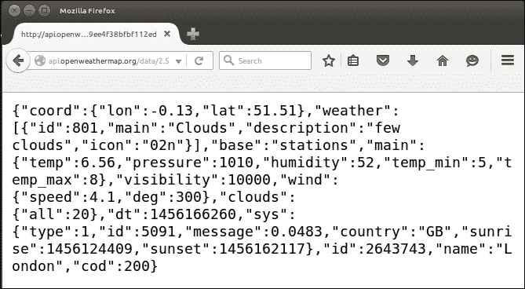
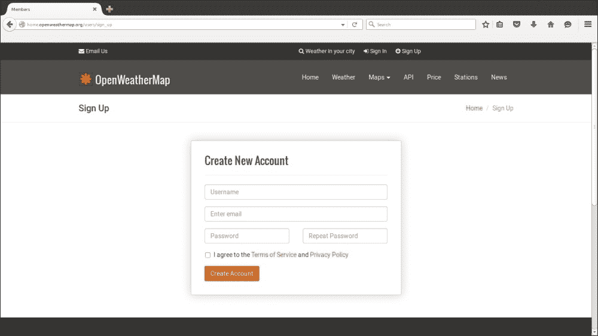
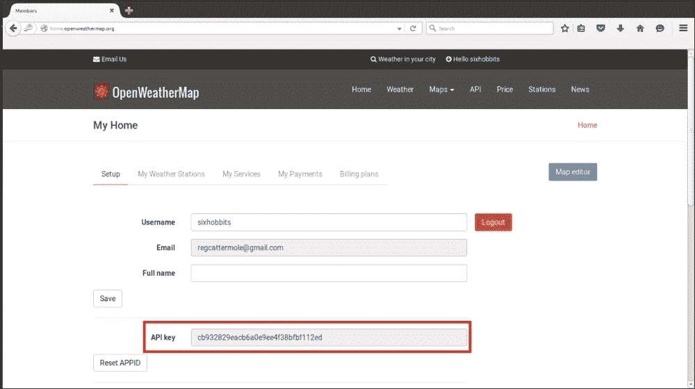
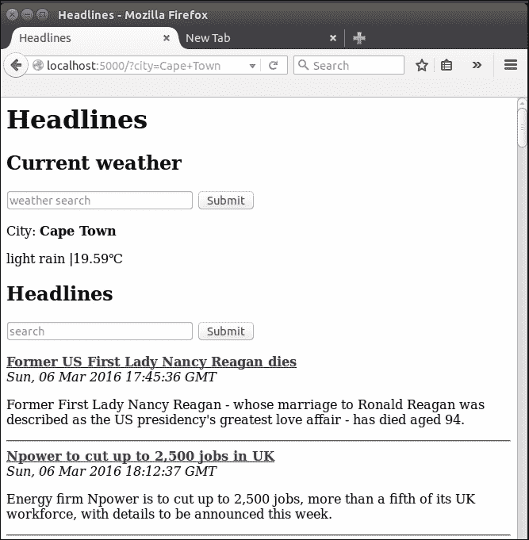
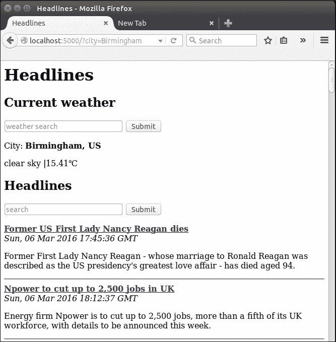
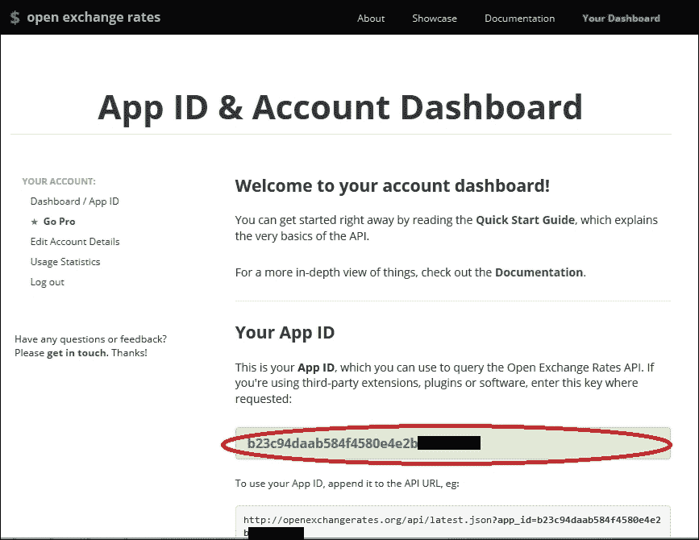
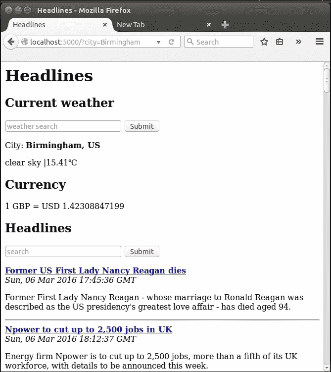
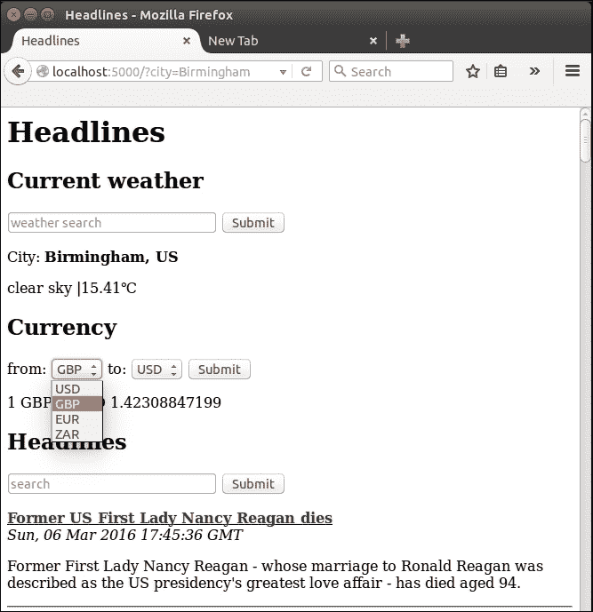
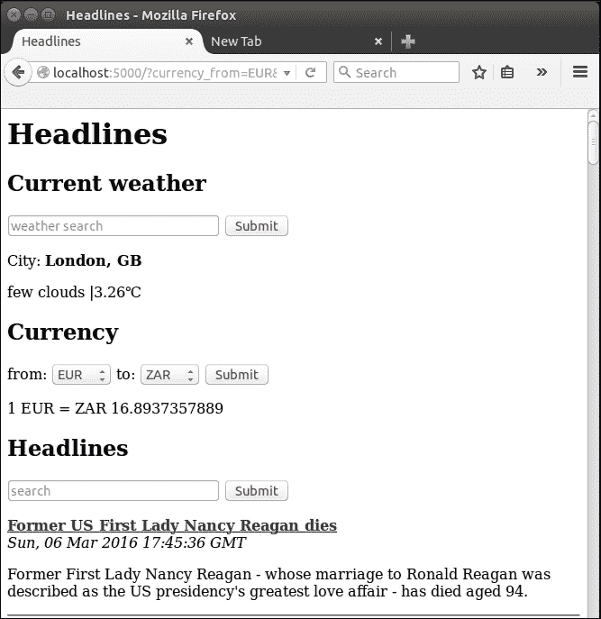

# 第四章：我们 Headlines 项目的用户输入

还记得我们是如何允许用户使用 URL 中的`<variable>`部分指定要查看的出版物的吗？尽管我们实际上是在从用户那里获取输入，但这种检索输入的方式有一些相当严重的限制。让我们看看与用户交互的更强大的方法，并向我们的应用程序添加一些更有用的信息。从现在开始，我们将对我们的代码文件进行相当多的增量更改，因此请记住，如果您需要概述，您可以随时参考附带的代码包。

在本章中，我们将看一些更灵活和强大的获取输入的方法。我们还将在这个过程中遇到一些更高级的 Git 功能，并花点时间解释如何使用它们。

在本章中，我们将讨论以下主题：

+   使用 HTTP GET 获取用户输入

+   使用 HTTP POST 获取用户输入

+   添加天气和货币数据

# 使用 HTTP GET 获取用户输入

HTTP GET 请求是从用户那里检索输入的最简单方式。在浏览网页时，您可能已经注意到 URL 中的问号。在网站的搜索框中提交一个术语时，您的搜索术语通常会出现在 URL 中，看起来像这样：

`example.com/search?query=weather`

问号后面的部分表示一个命名的 GET 参数。名称是`query`，值是`weather`。尽管这些参数通常是通过 HTML 输入框自动生成的，但用户也可以手动将它们插入到 URL 中，或者它们可以是发送给用户的可点击链接的一部分。HTTP GET 旨在从用户那里获取有限的、非敏感的信息，以便服务器根据 GET 参数返回所请求的页面。按照惯例，GET 请求不应该以产生副作用的方式修改服务器状态，也就是说，用户应该能够多次发出完全相同的请求，并始终得到完全相同的结果。

因此，GET 请求非常适合让用户指定要查看的出版物。让我们扩展我们的 Headlines 项目，以根据 GET 请求选择一个标题。首先，让我们修改 Python 代码以执行以下操作：

+   从 Flask 导入请求上下文

+   删除动态 URL 变量

+   检查用户是否已输入有效的出版物作为 GET 参数

+   将用户查询和出版物传递给模板

按照以下方式更新`headlines.py`文件：

```py
import feedparser
from flask import Flask
from flask import render_template
from flask import request

app = Flask(__name__)

RSS_FEEDS = {'bbc': 'http://feeds.bbci.co.uk/news/rss.xml',
             'cnn': 'http://rss.cnn.com/rss/edition.rss',
             'fox': 'http://feeds.foxnews.com/foxnews/latest',
             'iol': 'http://www.iol.co.za/cmlink/1.640'}

@app.route("/")
def get_news():
 query = request.args.get("publication")
 if not query or query.lower() not in RSS_FEEDS:
 publication = "bbc"
 else:
 publication = query.lower()
        feed = feedparser.parse(RSS_FEEDS[publication])
 return render_template("home.html",articles=feed['entries']

if __name__ == "__main__":
    app.run(port=5000, debug=True)
```

第一个新变化是 Flask 请求上下文的新导入。这是 Flask 魔法的另一部分，使我们的生活更轻松。它提供了一个全局上下文，我们的代码可以使用它来访问关于最新请求的信息。这对我们很有用，因为用户作为请求的一部分传递的 GET 参数会自动在`request.args`中可用，我们可以像使用 Python 字典一样访问键值对（尽管它是不可变的）。请求上下文还简化了请求处理的其他部分，这意味着我们不必担心线程或请求的顺序。您可以在以下网站上阅读有关请求上下文工作原理及其功能的更多信息：

[`flask-cn.readthedocs.org/en/latest/reqcontext/`](http://flask-cn.readthedocs.org/en/latest/reqcontext/)

我们使用`get()`方法来检查是否已设置出版物键，如果键不存在，则返回`None`。如果参数存在，我们确保值是有效的（即它在我们的`RSS_FEEDS`映射中），如果是，则返回匹配的出版物。

我们可以通过访问我们的 URL 后跟 `get` 参数来测试代码，例如：`localhost:5000/?publication=bbc`。不幸的是，从我们的用户体验来看，我们使应用程序变得不太用户友好，而不是更加用户友好。为什么我们要这样做呢？原来我们的用户不必手动修改 URL——通过一个非常小的更改，我们可以自动填充 URL 参数，这样用户根本不必触摸 URL。修改 `home.html` 模板，并在标题下方添加以下 HTML： 

```py
<form>
  <input type="text" name="publication" placeholder="search" />
  <input type="submit" value="Submit" />
</form>
```

这很简单，但让我们分解一下看看它是如何工作的。首先，我们创建了一个 HTML 表单元素。默认情况下，当提交时，这将创建一个 HTTP GET 请求，通过将任何输入作为 GET 参数传递到 URL 中。我们有一个名为 `publication` 的单个文本输入。这个名称很重要，因为 GET 参数将使用它。`placeholder` 是可选的，但它会让我们的用户有更好的体验，因为浏览器会用它来指示文本字段的用途。最后，我们有另一个类型为 `submit` 的输入。这将自动为我们的表单创建一个漂亮的**提交**按钮，当按下时，它将获取输入框中的任何文本并将其提交到我们的 Python 后端。

保存模板，重新加载页面以查看它现在的工作方式。您应该在页面顶部看到输入表单，如下面的截图所示。我们为四行 HTML 获得了很多功能，现在我们可以看到，尽管 GET 参数最初看起来像是在创建更多的任务和管理员，但实际上它们使我们的 Web 应用程序更简单、更用户友好。


# 使用 HTTP POST 获取用户输入

HTTP GET 的替代方法是 HTTP POST，并不总是立即明显应该使用哪一个。HTTP POST 用于向服务器发布更大的数据块或更敏感的数据。通过 POST 请求发送的数据在 URL 中不可见，尽管这并不使其本质上更安全（它默认不提供加密或验证），但它确实提供了一些安全优势。URL 经常被浏览器缓存，并通过自动完成功能建议下次用户输入类似的 URL 时。

因此，通过 GET 请求发送的数据可能会被保留。使用 POST 还可以防止他人通过窥视用户的肩膀（肩部冲浪）来查看数据。特别是密码通常在输入时通过使用 HTML 密码字段而被遮蔽，使其在浏览器中显示为星号（********）或点（••••••••）。然而，如果使用 GET 发送，数据仍然会在 URL 中清晰可见，因此应始终使用 POST。

虽然我们的搜索查询并不是机密的或过长的，但我们现在要花点时间来看看如何使用 POST 而不是 GET 来实现相同的功能。如果您只想继续完成我们的 Headlines 应用程序，可以跳过本节，但请记住，我们将在后续项目中使用 POST 请求而不进行详细解释。完成 POST 示例后，我们将把我们的应用程序恢复到当前状态（使用 GET 请求），因为这更适合我们的用例。

## 在 Git 中创建分支

对我们的代码库进行更改，我们不确定是否想要，我们将使用 Git 的分支功能。把分支想象成是路上的岔路口，除了我们随时可以改变主意并返回决策点。首先，我们需要确保我们当前的分支（master）是最新的——即所有本地更改都已提交。打开终端，从 headlines 目录运行以下命令：

```py
git add headlines.py
git add templates/home.html
git commit -m "Using GET"
git push origin master

```

我们不严格需要将其推送到服务器——Git 在本地保留完整的修订历史，即使没有推送，我们的更改理论上仍然是安全的。然而，我们的代码处于工作状态，因此进行远程备份也没有坏处。现在我们将创建新的分支并切换到使用它来进行下一组更改：

```py
git branch post-requests
git checkout post-requests

```

我们现在正在我们代码库的一个新分支上工作。通常，我们最终会将此分支合并回主分支，但在我们的情况下，一旦我们完成所需的工作，我们将放弃它。由于 Git 大多数操作都是在后台进行，很难将发生的事情可视化，因此如果您感兴趣并且可能会在将来的项目中使用 Git，那么值得阅读有关 Git 的内容。否则，只需将其视为一个检查点，以便我们可以自由地进行实验，而不必担心搞乱我们的代码。

## 在 Flask 中添加 POST 路由

要使用 POST 请求，我们需要对 Python 和 HTML 代码进行一些小的更改。在`headlines.py`文件中，进行以下更改：

+   将`request.args.get`更改为`request.form.get`

+   将`@app.route("/")`更改为`@app.route("/", methods=['GET', 'POST'])`

第一个更改的原因是我们现在从表单中获取用户数据，因此 Flask 会自动将其提供给我们的`request.form`。这与`request.get`的工作方式相同，只是它从 POST 请求而不是从 GET 请求中收集数据。第二个更改并不那么明显。我们之前没有提到的是，所有路由装饰器都可以指定函数如何被访问：通过 GET 请求、POST 请求或两者兼有。默认情况下，只允许 GET，但我们现在希望我们的默认页面可以通过 GET（当我们只是访问主页并且默认给出 BBC 时）或 POST（当我们通过带有额外查询数据的表单请求页面时）来访问。`methods`参数接受一个 HTTP 方法的列表，这些方法应该被允许访问我们应用程序的特定路由。

## 使我们的 HTML 表单使用 POST

我们的模板需要进行类似的更改。将`home.html`文件中的开头`<form>`标签更改为：

```py
<form action="/" method="POST">
```

与 Flask 一样，HTML 表单默认使用 GET，因此我们必须明确定义我们要使用 POST 而不是 GET。`action`属性并不是绝对必要的，但通常当我们使用 POST 时，我们会将用户重定向到确认页面或类似的页面，接下来的页面的 URL 将出现在这里。在这种情况下，我们明确表示我们希望在提交表单后重定向到同一个页面。

保存 Python 和 HTML 文件的更改，并在浏览器中刷新页面以查看更改生效。功能应该完全相同，只是我们在 URL 中看不到任何数据。对于许多应用程序来说，这可能更清晰，但在我们的情况下，这不是我们想要的。首先，我们希望用户的浏览器可以缓存搜索词。如果用户习惯性地查询 FOX，我们希望浏览器在他开始在我们的应用程序的 URL 中输入时能够自动完成这一点。此外，我们希望我们的用户能够轻松地分享包括查询的链接。

如果用户（让我们称之为鲍勃）在将**cnn**输入到我们的应用程序后看到一堆有趣的标题，并希望与另一个用户（简）分享所有这些标题，我们不希望鲍勃不得不给简发消息，告诉她访问我们的网站，并在搜索表单中输入特定的查询。相反，鲍勃应该能够分享一个 URL，让简直接访问页面，就像他看到的那样（例如，`example.com/?publication=cnn`）。简只需点击鲍勃发送的链接，就可以查看相同的标题（假设她在 RSS 订阅更新之前访问我们的页面）。

## 恢复我们的 Git 存储库

我们需要将代码恢复到之前的状态。因为上一节中的所有更改都是在我们的实验性 post 请求分支中进行的，所以我们不需要手动重新编辑我们更改的行。相反，我们将提交我们的更改到这个分支，然后切换回我们的主分支，在那里我们会发现一切都和我们离开时一样。在您的终端中运行以下命令：

```py
git add headlines.py
git add templates/home.html
git commit –m "POST requests"
git checkout master

```

打开`headlines.py`和`templates/home.html`文件，确保它们与我们在进行 POST 实验之前保持一致！

# 添加天气和货币数据

现在让我们添加一些更多功能。我们正在显示来自三个不同来源的媒体头条，但我们的用户可能对更多内容感兴趣。我们将看看在页面顶部显示当前天气和一些汇率有多容易。对于天气数据，我们将使用 OpenWeatherMap API，对于货币数据，我们将使用 Open Exchange Rates。在撰写本文时，这些 API 是免费提供的，尽管它们都需要注册。

## 介绍 OpenWeatherMap API

在您的网络浏览器中，访问 URL [`api.openweathermap.org/data/2.5/weather?q=London,uk&units=metric&appid=cb932829eacb6a0e9ee4f38bfbf112ed`](http://api.openweathermap.org/data/2.5/weather?q=London,uk&units=metric&appid=cb932829eacb6a0e9ee4f38bfbf112ed)。您应该看到类似以下截图的内容：



这是伦敦的 JSON 天气数据，设计成自动读取而不是人工读取。在看如何将这些数据读入我们的 Headlines 应用程序之前，请注意我们访问的 URL 有一个`appid`参数。尽管天气数据是免费提供的，但每个访问数据的开发人员都需要在 OpenWeatherMap 注册一个免费账户，并获取一个唯一的 API 密钥作为`appid`参数的值。这是为了防止人们滥用 API，进行过多的请求，并占用可用的带宽。在撰写本文时，OpenWeatherMap 允许每分钟对 API 进行 60 次调用，每天 50000 次作为他们的免费访问计划的一部分，因此我们的项目不太可能达到这些限制。

### 注册 OpenWeatherMap

您应该注册自己的 API 密钥，而不是使用本书中发布的密钥。通常，您的 API 密钥应保持秘密，并且应避免共享它（尤其是避免在书中发布它）。要获取您自己的 API 密钥，请转到[www.openweathermap.org](http://www.openweathermap.org)，并通过单击页面顶部的注册链接完成他们的注册流程。填写电子邮件地址，用户名和密码。注册页面应该类似于以下截图：



## 检索您的 OpenWeatherMap API 密钥

注册后，您将能够登录 OpenWeatherMap。您可以通过导航到[home.openweathermap.org](http://home.openweathermap.org)并向下滚动到**API 密钥**文本框找到您的个人 API 密钥。您应该在以下图像中看到您的 API 密钥，如红色矩形所示：



将密钥复制到剪贴板，因为我们很快将在我们的 Python 代码中使用它。

## 使用 Python 解析 JSON

现在我们可以通过使用 URL 在 HTTP 上访问结构化的天气数据。但是在浏览器中这样做并没有太大用处，因为我们希望从我们的 Python 代码自动读取这些数据。幸运的是，Python 有一堆有用的标准库，正好适用于这种用例！

## 介绍 JSON

JSON 是一种结构化数据格式，非常类似于 Python 字典，从前面的示例中应该很明显。实际上，在这种情况下，它是相同的，我们可以非常简单地将其转换为 Python 字典，以便在我们的 Flask 应用程序中使用，方法是将其加载为字符串，然后在其上运行内置的 Python `eval`函数。然而，JSON 并不总是与 Python 字典相同。例如，它使用`true`和`false`而不是`True`和`False`（注意大小写的区别）-将任何我们无法完全控制的东西传递给`eval()`通常是一个坏主意。因此，我们将使用`Python json`库来安全地解析它。我们还将使用 Python `urllib2`库从网络上下载数据，并使用 Python `urllib`库正确编码 URL 参数。

## 在 Python 中检索和解析 JSON

对于在 Python 中检索和解析 JSON，第一步是向我们的`headlines.py`文件添加我们需要的三个新导入：

```py
import json
import urllib2
import urllib
```

**风格提示：**

### 提示

为了良好的 Python 风格，保持导入按字母顺序排列。您可以在以下网站阅读有关导入排序约定的更多信息：[`www.python.org/dev/peps/pep-0008/#imports`](https://www.python.org/dev/peps/pep-0008/#imports)

现在添加一个新函数`get_weather()`，它将使用特定查询调用天气 API。这很简单，代码如下。用你从 OpenWeatherMap 页面复制的 API 密钥替换`<your-api-key-here>`占位符。

```py
def get_weather(query):
    api_url = http://api.openweathermap.org/data/2.5/weather?q={}&units=metric&appid=<your-api-key-here>
    query = urllib.quote(query)
    url = api_url.format(query)
    data = urllib2.urlopen(url).read()
    parsed = json.loads(data)
    weather = None
    if parsed.get("weather"):
        weather = {"description":parsed["weather"][0]["description"],"temperature":parsed["main"]["temp"],"city":parsed["name"]
                  }
    return weather
```

我们在浏览器中使用与之前相同的 URL，但是我们使查询部分可配置，以便检索天气数据的城市是动态的。我们在查询变量上使用`urllib.quote()`，因为 URL 中不能有空格，但是我们想要检索天气的城市的名称可能包含空格。`quote()`函数通过将空格转换为"`%20`"（这是 URL 中表示空格的方式）来处理这个问题。然后我们使用`urllib2`库将数据通过 HTTP 加载到 Python 字符串中。与我们的 feedparsing 示例一样，通过互联网下载数据总是潜在不稳定的，对于真实的应用程序，我们需要在这里添加一些异常处理和重试逻辑。

然后我们使用 json 库的`loads()`函数（加载字符串）将我们下载的 JSON 字符串转换为 Python 字典。最后，我们根据 API 返回的 JSON 构建一个更简单的 Python 字典，因为 OpenWeatherMap 提供了一大堆我们不需要的属性。

## 使用我们的天气代码

现在对`get_news()`函数进行两个小改动，以便使用我们的`get_weather()`函数。我们需要调用`get_weather()`函数（现在我们只会传入伦敦作为常量），然后将天气数据传递给我们的模板。`get_news()`函数现在应该如下所示：

```py
@app.route("/")
def get_news():
        query = request.args.get("publication")
        if not query or query.lower() not in RSS_FEEDS:
                publication = "bbc"
        else:
                publication = query.lower()
        feed = feedparser.parse(RSS_FEEDS[publication])
        weather = get_weather("London,UK")
        return render_template("home.html",articles=feed["entries"],weather=weather)

```

现在将伦敦的简化数据加载到天气变量中，并将其传递给我们的模板文件，以便我们可以向用户显示数据。

## 显示天气数据

现在我们只需要调整我们的模板来适应额外的数据。我们将在新闻标题上方显示天气数据，并添加一些二级标题以保持我们应用程序的不同部分有序。

在开头的`<h1>`标签后面，向 home.html 模板添加以下三行：

```py
<body>
  <h1>Headlines</h1>
  <h2>Current weather</h2>
  <p>City: <b>{{weather.city}}</b></p>
  <p>{{weather.description}} |{{weather.temperature}}℃</p>
  <h2>Headlines</h2>

```

这里没有我们之前没有见过的东西。我们只需使用大括号从我们的天气变量中获取我们想要的部分。有趣的`&#8451;`部分是为了显示摄氏度符号。如果你是那些能够理解华氏度概念的人之一，那么从 API URL 中删除`&units=metric`（这将告诉 OpenWeatherData 以华氏度给我们温度），并在模板中使用`&#8457;`代替*F*符号来显示给我们的用户。

## 允许用户自定义城市

如前所述，我们并不总是想显示伦敦的天气。让我们为城市添加第二个搜索框！搜索通常很困难，因为用户输入的数据从来都不一致，而计算机喜欢一致。幸运的是，我们正在使用的 API 非常灵活，因此我们将直接传递用户的输入，并将困难的部分留给其他人处理。

### 在我们的模板中添加另一个搜索框

我们将搜索框添加到我们的模板中，就像以前一样。这个表单直接放在`home.html`文件中“当前天气”标题下面。

```py
<form>
  <input type="text" name="city" placeholder="weather search">
  <input type="submit" value="Submit">
</form>
```

在前面的代码片段中定义的表单简单地使用了一个命名文本输入和一个提交按钮，就像我们为出版物输入添加的那样。

### 在我们的 Python 代码中使用用户的城市搜索

在我们的 Python 代码中，我们需要在 GET 请求中查找`city`参数。我们的“get_news（）”函数不再命名良好，因为它不仅仅是获取新闻。让我们进行一些重构。之后，我们将有一个“home（）”函数，该函数调用获取新闻和天气数据（以及以后的货币数据），我们的“get_news（）”函数将再次只负责获取新闻。我们还将有很多不同事物的默认值，因此我们将添加一个`DEFAULTS`字典作为全局变量，每当我们的代码无法在 GET 参数中找到信息时，它将返回到那里获取所需的信息。我们代码的更改部分（不包括导入、全局 URL 和最后的主要部分）现在看起来像这样：

```py
# ...

DEFAULTS = {'publication':'bbc',
            'city': 'London,UK'}

@app.route("/")
def home():
    # get customized headlines, based on user input or default
    publication = request.args.get('publication')
    if not publication:
        publication = DEFAULTS['publication']
    articles = get_news(publication)
    # get customized weather based on user input or default
    city = request.args.get('city')
    if not city:
        city = DEFAULTS['city']
    weather = get_weather(city)
return render_template("home.html", articles=articles,weather=weather)

def get_news(query):
    if not query or query.lower() not in RSS_FEEDS:
        publication = DEFAULTS["publication"]
    else:
        publication = query.lower()
    feed = feedparser.parse(RSS_FEEDS[publication])
    return feed['entries']

def get_weather(query):
    query = urllib.quote(query)
    url = WEATHER_URL.format(query)
    data = urllib2.urlopen(url).read()
    parsed = json.loads(data)
    weather = None
    if parsed.get('weather'):
        weather = {'description':parsed['weather'][0]['description'],'temperature':parsed['main']['temp'],'city':parsed['name']}
    return weather
```

现在我们有了良好的关注点分离-我们的“get_weather（）”函数获取天气数据，我们的“get_news（）”函数获取新闻，我们的“home（）”函数将两者结合起来，并处理用户的输入，向我们的访问者显示定制数据。

## 检查我们的新功能

如果一切顺利，我们现在应该有一个显示可定制新闻和天气数据的网站。如前所述，天气搜索非常灵活。尝试一些不同的输入-您应该会看到一个类似以下图像的页面：



## 处理重复的城市名称

OpenWeatherMap API 很好地处理了重复的城市名称，尽管默认值有时有点反直觉。例如，如果我们搜索伯明翰，我们将得到美国的那个。如果我们想要查找英国的伯明翰，我们可以搜索伯明翰，英国。为了不让观众感到困惑，我们将对显示城市旁边的国家进行小修改。然后他们将立即能够看到是否得到了与他们预期的城市不同的结果。如果您检查我们的天气调用的完整 API 响应，您会发现国家代码列在`sys`下-我们将获取它，添加到我们的自定义字典中，然后在我们的模板中显示它。

在`get_weather`函数中，修改我们构建字典的行：

```py
weather = {'description': parsed['weather'][0]['description'],
           'temperature': parsed['main']['temp'],
           'city': parsed['name'],
 'country': parsed['sys']['country']
          }
```

并在我们的模板中修改显示城市的行如下：

```py
<p>City: <b>{{weather.city}}, {{weather.country}}</b></p>
```

检查它是否工作-如果您重新启动应用程序并重新加载页面，您应该会看到在“当前天气”搜索框中键入“伯明翰”现在显示城市名称旁边的国家代码。



## 货币

货币数据被认为比天气数据更有价值。许多商业服务提供经常更新且非常可靠的 API。但是，免费的 API 有点罕见。一个提供有限免费 API 的服务是 Open Exchange Rates-再次，我们需要注册一个免费帐户以获得 API 密钥。

### 获取 Open Exchange Rates API 的 API 密钥

转到[openexchangerates.com](http://openexchangerates.com)，并完成他们的注册流程。 点击**注册**链接后，它可能看起来他们只有付费计划，因为这些更加突出显示。 但是，在大型付费计划选项下方，有一行描述其免费提供的单行文本，并附有选择它的链接。 点击这个链接，并输入您的详细信息。

如果您没有自动重定向，请转到他们网站上的仪表板，您会看到您的**API 密钥**（应用程序 ID）显示出来。 复制这个，因为我们需要将其添加到我们的 Python 代码中。 您可以在以下截图中看到如何找到您的 API 密钥的示例：



### 使用 Open Exchange Rates API

`currency` API 返回的 JSON 与`weather` API 一样，因此我们可以非常容易地将其集成到我们的 Headlines 应用程序中。 我们需要将 URL 添加为全局变量，然后添加一个新函数来计算汇率。 不幸的是，API 的免费版本受限于返回所有主要货币相对于美元的汇率，因此我们将不得不为不涉及美元的转换计算我们自己的近似汇率，并依赖于一个完美的市场尽可能地保持我们的信息准确（参见[`en.wikipedia.org/wiki/Triangular_arbitrage`](http://en.wikipedia.org/wiki/Triangular_arbitrage)）。

在现有的`WEATHER_URL`下面的全局变量中添加变量`CURRENCY_URL`，如下面的代码片段所示。 您需要替换自己的 App ID。

```py
WEATHER_URL = "http://api.openweathermap.org/data/2.5/weather?q={}&units=metric&APPID=<your-api-key-here>"
CURRENCY_URL = "https://openexchangerates.org//api/latest.json?app_id=<your-api-key-here>"
```

添加`get_rates()`函数如下：

```py
def get_rate(frm, to):
        all_currency = urllib2.urlopen(CURRENCY_URL).read()

        parsed = json.loads(all_currency).get('rates')
        frm_rate = parsed.get(frm.upper())
        to_rate = parsed.get(to.upper())
        return to_rate/frm_rate
```

请注意我们在最后进行的计算。 如果请求是从美元到其他任何货币，我们可以简单地从返回的 JSON 中获取正确的数字。 但在这种情况下，计算是足够简单的，因此不值得添加额外的逻辑步骤来判断我们是否需要进行计算。

### 使用我们的货币功能

现在我们需要从我们的`home()`函数中调用`get_rates()`函数，并将数据传递给我们的模板。 我们还需要向我们的`DEFAULTS`字典添加默认货币。 根据以下突出显示的代码进行更改：

```py
DEFAULTS = {'publication':'bbc',
            'city': 'London,UK',
 'currency_from':'GBP',
 'currency_to':'USD'
}

@app.route("/")
def home():
    # get customized headlines, based on user input or default
    publication = request.args.get('publication')
    if not publication:
        publication = DEFAULTS['publication']
    articles = get_news(publication)
    # get customized weather based on user input or default
    city = request.args.get('city')
    if not city:
        city = DEFAULTS['city']
    weather = get_weather(city)
    # get customized currency based on user input or default
    currency_from = request.args.get("currency_from")
    if not currency_from:
        currency_from = DEFAULTS['currency_from']
    currency_to = request.args.get("currency_to")
    if not currency_to:
        currency_to = DEFAULTS['currency_to']
    rate = get_rate(currency_from, currency_to)
    return render_template("home.html", articles=articles,weather=weather,
                           currency_from=currency_from, currency_to=currency_to, rate=rate)
```

### 在我们的模板中显示货币数据

最后，我们需要修改我们的模板以显示新数据。 在`home.html`中的天气部分下面添加：

```py
<h2>Currency</h2>
1 {{currency_from}} = {{currency_to}} {{rate}}
```

像往常一样，在浏览器中检查一切是否正常运行。 您应该看到英镑兑美元的默认货币数据，如下图所示：



### 为用户选择货币添加输入

现在我们需要添加另一个用户输入来自定义要显示的货币。 我们可以像之前两个一样轻松地添加另一个文本搜索，但这会变得混乱。 我们需要用户的两个输入：*从*货币和*到*货币。 我们可以添加两个输入，或者我们可以要求用户将两者输入到同一个输入中，但前者会使我们的页面变得非常凌乱，而后者意味着我们需要担心正确地拆分用户输入数据（这几乎肯定不一致）。 相反，让我们看看另一个输入元素，HTML `select`。 您几乎肯定在其他网页上看到过这些——它们是带有用户可以选择的值列表的下拉菜单。 让我们看看如何在 HTML 中构建它们，以及如何在 Flask 中抓取它们的数据。

### 创建 HTML 选择下拉元素

首先，在每个下拉菜单中硬编码四种货币。 代码应该插入在`home.html`模板中**货币**标题的下方，代码如下：

```py
<form>
    from: <select name="currency_from">
            <option value="USD">USD</option>
            <option value="GBP">GBP</option>
            <option value="EUR">EUR</option>
            <option value="ZAR">ZAR</option>
          </select>

     to: <select name="currency_to">
           <option value="USD">USD</option>
           <option value="GBP">GBP</option>
           <option value="EUR">EUR</option>
           <option value="ZAR">ZAR</option>
         </select>
         <input type="submit" value="Submit">
</form>
```

用于 GET 请求参数的名称是选择标签本身的属性（类似于我们在`<input type="text">`标签中使用的名称属性）。在我们的情况下，这些是`currency_from`和`currency_to`，这些是我们之前在 Python 代码中指定的。值稍微有些棘手——我们有在 GET 请求中传递的值（例如`currency_from=EUR`），然后是显示给用户的值。在这种情况下，我们将两者都使用相同的——货币代码——但这不是强制的。例如，我们可以在显示值中使用货币的全名，如美元，在请求中传递代码。参数值被指定为`<option>`标签的属性，每个都是`<select>`的子元素。显示值插入在开放和关闭的`<option>`和`</option>`标签之间。

测试一下，确保它能正常工作，保存模板并重新加载页面。您应该会看到下拉输入框出现，如下图所示：



### 将所有货币添加到选择输入中

当然，我们可以像前一节那样对完整列表进行操作。但是我们是程序员，不是数据捕捉者，所以我们将使列表动态化，使用`for`循环插入选项，并保持我们的模板更新和清晰。为了获取货币列表，我们可以简单地获取 JSON `all_currency`对象的键，以便使我们的`get_rate()`函数返回一个元组——计算出的汇率和货币列表。然后我们可以将（排序后的）列表传递给我们的模板，模板可以循环遍历它们并用它们构建下拉列表。更改如下所示：

在`home()`函数中进行以下更改：

```py
        if not currency_to:
          currency_to=DEFAULTS['currency_to']
 rate, currencies = get_rate(currency_from, currency_to)
 return render_template("home.html", articles=articles,weather=weather, currency_from=currency_from, currency_to=currency_to,    rate=rate,currencies=sorted(currencies))
```

在`get_rate()`函数中：

```py
frm_rate = parsed.get(frm.upper())
to_rate = parsed.get(to.upper())
return (to_rate / frm_rate, parsed.keys())

```

在`home.html`模板中：

```py
        <h2>Currency</h2>
        <form>
                from: <select name="currency_from">
 
 <optionvalue="{{currency}}">{{currency}}</option>
 
                      </select>

                to: <select name="currency_to">
 
 <option value="{{currency}}">{{currency}}</option>
 

                    </select>
                <input type="submit" value="Submit">
        </form>
        1 {{currency_from}} = {{currency_to}} {{rate}}
```

### 在下拉输入中显示所选货币

之后，我们应该能够轻松地查看任何我们想要的货币的汇率。一个小小的烦恼是下拉框总是默认显示顶部项目。如果它们显示当前选定的值会更直观。我们可以通过在我们的选择标签中设置`selected="selected"`属性和一个简单的一行 Jinja `if`语句来实现这一点。更改我们`home.html`模板中货币输入的`for`循环如下：

对于`currency_from`循环：

```py

    <option value="{{currency}}" {{'selected="selected"' if currency_from==currency}}>{{currency}}</option>

```

对于`currency_to`循环：

```py

    <option value="{{currency}}" {{'selected="selected"' if currency_to==currency}}>{{currency}}</option>

```

重新加载应用程序和页面，现在您应该能够从两个选择输入中选择任何可用的货币，并且在页面加载所需的货币数据后，选择输入应该自动显示当前货币，如下图所示。单击选择输入后，您还应该能够在键盘上输入并根据您输入的首字母选择选项。



现在我们可以同时看到新闻、天气和货币数据！您可以从本章的代码包中参考完整的代码。

# 总结

在本章中，我们看了一下 HTTP GET 和 POST 请求之间的区别，并讨论了在何时使用哪种请求。虽然目前我们没有好的用途来使用 HTTP POST，但在未来的项目中，我们将从用户那里获取登录数据时使用它。幸运的是，我们对 HTTP POST 的解释工作并没有白费——我们还看了一些 Git 可以帮助我们进行版本控制的更高级的方法，我们未使用的代码安全地存储在代码库的不同分支中，以防以后需要参考。最后但并非最不重要的是，我们将天气和货币数据添加到了我们的应用程序中，并研究了一些不同的选项，以允许用户向我们的应用程序输入数据。我们的第一个项目快要完成了！

在下一章中，我们将进行一些修饰性的润色，并考虑如何记住我们的用户，这样他们就不必每次访问我们的网站时都执行完全相同的操作。
