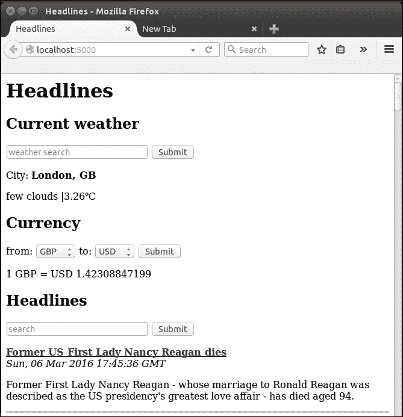
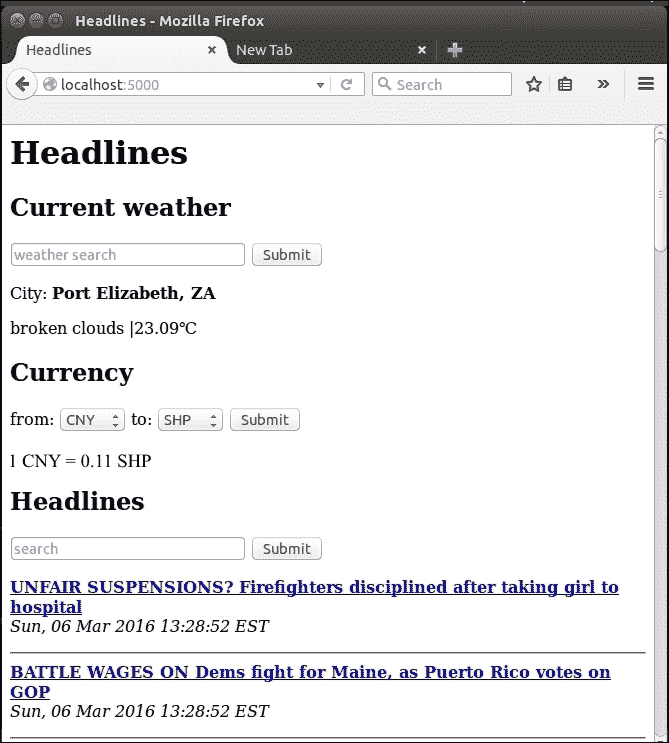
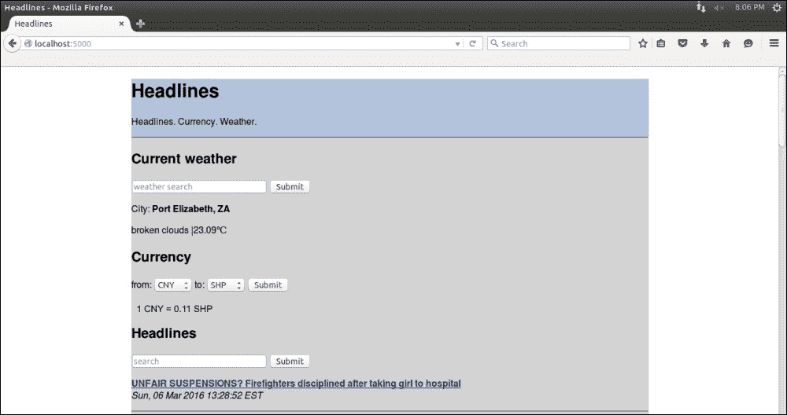
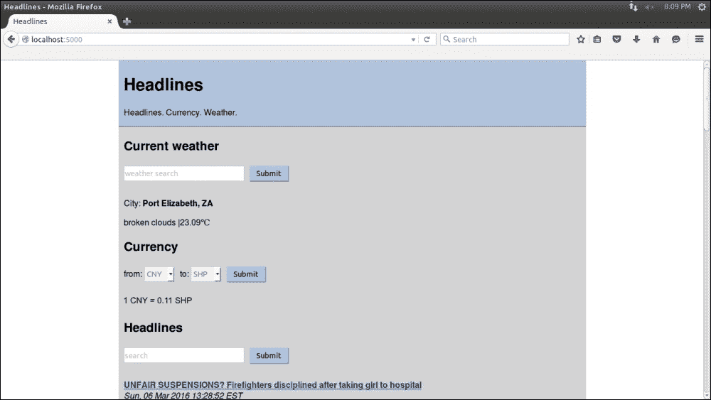

# 第五章：改进我们的头条项目的用户体验

富有的商人们为了不断给人留下良好印象以保持有利可图的关系，有时会雇佣个人助理来研究他们的熟人。然后，个人助理会站在社交活动中富有的人的身后，对即将接触的人耳语几句关键的话。这些话必须简洁但具有信息量，比如“保罗·史密斯。一个孩子，吉尔。最近去了毛里求斯”。现在，我们的商人可以假装接近的人是一个亲密的朋友，并且长篇大论地谈论他的孩子和旅行，而实际上并不知道这个人是谁。这会让其他人觉得重要和受欢迎，这有助于我们假设的百万富翁变得更加富有。

为什么这与 Web 应用程序相关呢？好吧，我们想做的就是这样。我们网站的用户觉得重要和被记住，更有可能回来，所以我们需要一个数字助理，让用户觉得我们花了时间和精力来记住他们是谁以及他们喜欢什么。我们可以建立一个用户数据库，存储他们通常计算的货币转换和他们感兴趣的城市天气，然后默认显示给他们。这种策略的问题在于我们需要他们在每次访问时进行身份识别，而大多数用户会觉得输入用户名，可能还有密码，这一额外步骤很烦人。

输入 HTTP cookie。这些狡猾的小东西将潜伏在我们用户的计算机上，在用户第二次访问我们的网站时，充当我们的数字助理，给我们提供我们以前获得但没有记住的信息。这听起来相当不光彩。有一段时间，欧盟也是这么认为的，并试图对 cookie 的使用进行监管，但它们无处不在，简单而有用，监管尝试有点令人失望（请看[`silktide.com/the-stupid-cookie-law-is-dead-at-last/`](http://silktide.com/the-stupid-cookie-law-is-dead-at-last/)）。

在最简单的形式中，cookie 只是我们存储在用户计算机上的键值对，并要求他们的浏览器在访问我们的网站时自动发送给我们。这样做的好处是我们不必保留和维护数据库，也不必明确要求用户告诉我们他们是谁。然而，缺点是我们无法控制这些信息，如果用户更换计算机、Web 浏览器，甚至只是删除我们的 cookie，我们将无法再识别他或她。因此，cookie 非常适合我们构建的应用程序；如果用户不得不点击几次才能回到上次搜索的媒体、货币和天气信息，这并不是世界末日，但如果我们能记住以前的选择并自动显示这些信息，那就很好。

当我们谈论用户体验（通常称为 UX）时，我们的网站看起来好像是上世纪 80 年代制作的。我们将在后面的章节中更加注重美学，但现在我们也将看看如何向我们的网站添加一些基本的布局和颜色。因为我们专注于功能和简单性，所以它仍然远非“现代化”，但我们将向我们的工具包添加一些基本组件，以便以后更加谨慎地使用。我们将使用层叠样式表（通常简称为 CSS）来实现这一点。CSS 是一个很好的工具，可以进一步分离关注点；我们已经主要将逻辑（即我们的 Python 脚本）与内容（即我们的 HTML 模板）分开。现在，我们将看看 CSS 如何帮助我们将格式（颜色、字体、布局等）与我们的其他内容（例如模板文件中的静态文本）分开。

现在我们已经概述了 cookies 和 CSS，我们将开始研究如何在 Flask 中实现它们。这是我们第一个项目的最后一章，到最后，我们将拥有一个包括 cookies 和 CSS 的 Headlines 应用程序。

在本章中，我们将研究以下主题：

+   向我们的 Headlines 应用程序添加 cookies

+   向我们的 Headlines 应用程序添加 CSS

# 向我们的 Headlines 应用程序添加 cookies

在这一点上，我们的应用程序有一些问题。让我们想象一个名叫鲍勃的用户，他住在西雅图。鲍勃访问我们的网站，看到了 BBC，伦敦和将 GBP 转换为 USD 的默认值。鲍勃想要看到西雅图的天气，所以他在**天气搜索**栏中输入`西雅图`并按下回车键。他浏览返回的天气，感到很沮丧，因为天气一如既往地寒冷和下雨，所以他从页面底部的天气中看向 BBC 的头条新闻。他更喜欢 CNN 的头条新闻，所以他从下拉菜单中选择了这个出版物并点击**提交**。他读了几条头条新闻后意识到时事新闻甚至比天气更沉闷和令人沮丧。所以，他的眼睛再次移回页面顶部来振作自己。他感到困惑；自从更改了他的出版物偏好后，天气又默认回到了伦敦，那里的天气甚至更糟糕！他关闭了我们的应用程序，不再回来。如果他回来，一切都会再次显示默认值。

两个直接问题是：

+   即使用户在我们的网站上停留，也不记住用户的选择

+   用户关闭我们的网站并在以后重新访问时不记住用户的选择

让我们解决这两个问题。

## 使用 Flask 处理 cookies

如前所述，cookies 可以被视为我们可能或可能不会从返回访客那里收到的键值对。我们需要改变我们的应用程序，这样当用户做出选择时，我们创建或更新他们的 cookie 以反映这些更改，当用户请求我们的网站时，我们检查是否存在 cookie，并尽可能多地从中读取未指定的信息。首先，我们将看看如何设置 cookies 并让用户的浏览器自动记住信息，然后我们将看看如何检索我们以前使用 cookies 存储的信息。

### 在 Flask 中设置 cookies

Flask 使处理 cookies 变得非常容易。首先，我们需要更多的导入；我们将使用 Python 的`datetime`库来设置即将存在的 cookies 的寿命，我们将使用 Flask 的`make_response()`函数来创建一个响应对象，我们可以在其上设置 cookies。在`headlines.py`文件的导入部分中添加以下两行：

```py
import datetime
from flask import make_response
```

之前，我们只是用自定义参数渲染我们的模板，然后将其返回给用户的网络浏览器。为了设置 cookies，我们需要额外的步骤。首先，我们将使用新的`make_response()`函数创建一个响应对象，然后使用这个对象设置我们的 cookie。最后，我们将返回整个响应，其中包括渲染的模板和 cookies。

用以下行替换`headlines.py`中`home()`函数的最后一行：

```py
response = make_response(render_template("home.html",
  articles=articles,
  weather=weather,
  currency_from=currency_from,
  currency_to=currency_to,
  rate=rate,
  currencies=sorted(currencies)))
expires = datetime.datetime.now() + datetime.timedelta(days=365)
response.set_cookie("publication", publication, expires=expires)
response.set_cookie("city", city, expires=expires)
response.set_cookie("currency_from",
  currency_from, expires=expires)
response.set_cookie("currency_to", currency_to, expires=expires)
return response
```

这与我们之前简单的返回语句相比是一个相当大的改变，所以让我们来详细分析一下。首先，我们将在我们的`render_template()`调用周围包装一个`make_response()`调用，而不是直接返回渲染的模板。这意味着我们的 Jinja 模板将被渲染，所有的占位符将被替换为正确的值，但是我们不会直接将这个响应返回给用户，而是将它加载到一个变量中，以便我们可以对它进行一些更多的添加。一旦我们有了这个响应对象，我们将创建一个值为今天日期后 365 天的`datetime`对象。然后，我们将在我们的`response`对象上进行一系列的`set_cookie()`调用，保存所有用户的选择（或刷新以前的默认值），并将到期时间设置为从设置 cookie 的时间开始的一年，使用我们的`datetime`对象。

最后，我们将返回包含渲染模板的 HTML 和我们的四个 cookie 值的`response`对象。在加载页面时，用户的浏览器将保存这四个 cookies，如果同一用户再次访问我们的应用程序，我们将能够检索这些值。

### 在 Flask 中检索 cookies

如果我们不对信息进行任何处理，那么记住这些信息也没有太大的意义。在向用户发送响应之前，我们现在将 cookies 设置为最后一步。然而，当用户向我们发送请求时，我们需要检查保存的 cookies。如果你还记得我们如何从 Flask 的请求对象中获取命名参数，你可能猜到如何获取保存的 cookies。如果存在，以下行将获取名为`publication`的 cookie：

```py
request.cookies.get("publication")
```

这很简单，对吧？唯一棘手的部分是正确获取我们的回退逻辑。我们仍然希望显式请求具有最高优先级；也就是说，如果用户输入文本或从下拉菜单中选择一个值，这将是他或她想要的，而不管我们对以前的访问期望如何。如果没有显式请求，我们将查看 cookies，以检查是否可以从中获取默认值。最后，如果我们仍然没有任何内容，我们将使用我们硬编码的默认值。

#### 编写回退逻辑以检查 cookies

首先，让我们只为`publication`实现这个逻辑。在`headlines.py`的`home()`函数中的 publication 逻辑中添加一个新的`if`块，使其匹配以下内容：

```py
# get customised headlines, based on user input or default
publication = request.args.get("publication")
if not publication:
 publication = request.cookies.get("publication")
    if not publication:
        publication = DEFAULTS["publication"]
```

现在，我们将查看 GET 参数，必要时回退到保存的 cookies，最后回退到我们的默认值。让我们看看这个工作。打开你的网络浏览器，导航到`localhost:5000`。在**Publication**搜索栏中搜索`Fox`，等待页面重新加载，显示 Fox News 的头条新闻。现在，关闭你的浏览器，重新打开它，再次加载`localhost:5000`。这次，你应该看到 Fox 的头条新闻，而不需要再搜索它们，就像下面的截图一样。

请注意，URL 中没有`publication`参数，但是头条新闻现在是来自 Fox News。



#### 检索其他数据的 cookies

我们的 publication 有基本的 cookies 工作，但我们仍然希望读取我们可能为天气和货币选项保存的 cookies。我们可以简单地在代码的每个部分添加相同的 if 语句，将`city`、`currency_from`和`currency_to`替换为相关的`publication`，但是在代码的许多部分进行相同的更改是我们需要进行一些重构的明显迹象。

让我们创建一个`get_value_with_fallback()`函数，它在更抽象的层面上实现了我们的回退逻辑。将新函数添加到`headlines.py`文件中，并从`home()`函数中调用它，如下所示：

```py
def get_value_with_fallback(key):
    if request.args.get(key):
        return request.args.get(key)
    if request.cookies.get(key):
        return request.cookies.get(key)
    return DEFAULTS[key]

@app.route("/")
def home():
    # get customised headlines, based on user input or default
    publication = get_value_with_fallback("publication")
    articles = get_news(publication)

    # get customised weather based on user input or default
    city = get_value_with_fallback("city")
    weather = get_weather (city)

    # get customised currency based on user input or default
    currency_from = get_value_with_fallback("currency_from")
    currency_to = get_value_with_fallback("currency_to")
    rate, currencies = get_rate(currency_from, currency_to)

    # save cookies and return template
    response = make_response(render_template("home.html", articles=articles, weather=weather, currency_from=currency_from, currency_to=currency_to, rate=rate, currencies=sorted(currencies)))
    expires = datetime.datetime.now() + datetime.timedelta(days=365)
    response.set_cookie("publication", publication, expires=expires)
    response.set_cookie("city", city, expires=expires)
    response.set_cookie("currency_from", currency_from, expires=expires)
    response.set_cookie("currency_to", currency_to, expires=expires)
    return response
```

现在，我们应该能够以任何顺序提交表单，并且所有的选项都能被记住，就像我们期望的那样。此外，每当我们访问我们的网站时，它都会自动配置为我们最近使用的选项。试一试吧！您应该能够搜索货币、天气和头条新闻；然后关闭浏览器；再次访问网站。您最近使用的输入应该默认显示出来。

在下面的截图中，我们可以看到 URL 中没有传递任何参数，但我们正在显示南非伊丽莎白港的天气数据；从**人民币**（**CNY**）到**圣赫勒拿镑**（**SHP**）的货币数据；以及来自福克斯新闻的头条新闻。



# 向我们的 Headlines 应用程序添加 CSS

我们的网站仍然相当简陋。有很多白色和一些黑色。大多数用户更喜欢颜色、动画、边框、边距等。如前所述，我们现在不会真正关注美学，但我们会添加一些基本的颜色和样式。

## 外部、内部和内联 CSS

CSS 可以以几种方式添加到网页中。最好的方法是将其与 HTML 完全分开，并将其保存在一个外部文件中，该文件在 HTML 中通过`<link>`元素包含。这有时被称为*外部 CSS*。最糟糕的方法被称为*内联 CSS*。使用内联方法，CSS 是根据每个元素定义的；这被认为是不好的做法，因为对样式的任何更改都需要在 HTML 中查找相关部分。

此外，页面上的许多元素通常具有相同或至少相关的样式，以保持整个站点的颜色方案和样式。因此，使用内联样式通常会导致大量的代码重复，我们知道要避免这种情况。

对于这个项目，我们将采取一个折中的方法。我们将保持我们在`.html`模板文件中定义的 CSS，但我们将把它们都定义在一个地方。这是因为我们还没有看过 Flask 如何按照惯例处理文件，所以现在把所有的代码放在一个地方更简单。

## 添加我们的第一个 CSS

CSS 非常简单；我们将通过类型、ID、类等描述页面的元素，并为这些元素定义许多属性，如颜色、布局、填充、字体等。CSS 被设计为*级联*，也就是说，如果我们没有为更具体的元素指定属性，它将自动继承为更一般的元素定义的属性。我们将快速浏览 CSS 本身，所以如果您以前从未听说过它，并且想了解更多关于它的信息，现在是一个适当的时机休息一下，查看一些特定于 CSS 的资源。在线有很多这样的资源，一个快速搜索就会揭示出来；如果您喜欢我们之前提到的 W3Schools HTML 教程，您可以在这里找到类似的 CSS 教程[`www.w3schools.com/css/`](http://www.w3schools.com/css)。或者，通过接下来的示例和简要解释来深入了解！

首先，让我们为我们的网站添加一个更好的标题。我们将在顶级标题下方添加一个标语，并用一个新的`<div>`标签将其包围起来，以便我们可以在即将到来的 CSS 中修改整个标题。修改`home.html`模板的开头如下所示：

```py
<div id="header">
    <h1>Headlines</h1>
 <p>Headlines. Currency. Weather.</p>
 <hr />
</div>

```

`<div>`标签本身并没有做任何事情，您可以将其视为一个容器。我们可以使用它将逻辑相关的元素分组到同一个元素中，这对于 CSS 非常有用，因为我们可以一次性地为`<div>`标签中的所有元素设置样式。

CSS 应该添加到我们模板的`<head>`部分中的`<style>`标签中。在我们的`home.html`模板中的`<title>`标签下面，添加以下代码：

```py
<style>
html {
    font-family: "Helvetica";
    background: white;
}

body {
    background: lightgrey;
    max-width: 900px;
    margin: 0 auto;
}

#header {
    background: lightsteelblue;
}
</style>
```

我们明确定义了三个元素的样式：外部`<html>`元素，`<body>`元素和具有`id="header"`属性的任何元素。由于我们所有的元素都在`<html>`元素内部，字体会自动向下级元素级联（尽管仍然可以被子元素显式覆盖）。我们将页面中所有可见项包含在`<body>`元素中，并将其最大宽度设置为 900 像素。`margin: 0 auto;`表示`<body>`顶部和底部没有边距，左右两侧有自动边距。这会使页面上的所有内容居中。`background: white;`和`background: lightgrey;`表示我们将在较大的窗口内有一个居中的主要元素，其背景为浅灰色，而窗口本身为白色。最后，我们定义的头部`div`将具有浅钢蓝色的背景。保存添加样式的页面并刷新以查看效果。它应该看起来类似于以下图片：



让我们看看如何在下一节中改善美学。

**浏览器和缓存**

### 提示

浏览器通常会在本地缓存不经常更改的内容，以便在下次访问页面时更快地显示页面。这对开发来说并不理想，因为您希望在进行更改时看到更改。如果您的样式似乎没有达到您的预期，请清除浏览器的缓存，然后重试。在大多数浏览器上，可以通过按下*Ctrl* + *Shift* + *ESC*并从弹出的菜单中选择相关选项来完成此操作。

## 向我们的 CSS 添加填充

这比白色背景上的黑色略有趣，但仍然相当丑陋。一个问题是文本紧贴着颜色的边缘，没有任何空间。我们可以使用*CSS 填充*来解决这个问题，它可以通过指定的数量从顶部、右侧、底部、左侧或任何组合移动所有内容。

我们可以直接向我们的`<body>`标签添加填充，因为我们希望所有文本都有一个漂亮的左侧缓冲区。如果您尝试这样做，您会看到一个直接的问题；填充会影响所有内容，包括我们的`<div>`头部和将其与其余内容分隔开的`<hr>`标签，这意味着会有一条我们不想要的奇怪的灰色条纹。我们将以一种您很快会用于几乎所有与 CSS 相关的事情的方式来解决这个问题——只需添加更多的 div！我们需要一个*main*`<div>`头部，围绕所有的子标题和一个内部头部 div，这样我们就可以填充头部的文本，而不填充背景颜色或分隔符。

### 在我们的 CSS 中添加更多样式

将以下部分添加到您的 CSS 中，为我们的主要和内部头部 div 定义左侧填充，并更新`#header`部分以包括一些顶部填充：

```py
#header {
  padding-top: 5;
  background: lightsteelblue;
}
#inner-header {
  padding-left: 10;
}
#main{
  padding-left: 10;
}
```

### 将 div 标签添加到模板文件

现在，让我们添加 div 本身；`home.html`中的模板代码应更新为如下所示：

```py
    <body>
        <div id="header">
            <div id="inner-header">
                <h1>Headlines</h1>
                <p>Headlines. Currency. Weather.</p>
             </div>
           <hr />
        </div>
        <div id="main">
            <h2>Current weather</h2>

... [ rest of the content code here ] ...

            
        </div>
    </body>
```

## 为我们的输入添加样式

这使得布局看起来更加愉悦，因为文本看起来不像是试图溜走。接下来的一个主要问题是我们的输入元素，它们非常无聊。让我们也为它们添加一些样式。在我们迄今为止的 CSS 底部，添加以下文本：

```py
input[type="text"], select {
    color: grey;
    border: 1px solid lightsteelblue;
    height: 30px;
    line-height:15px;
    margin: 2px 6px 16px 0px;
}
input[type="submit"] {
    padding: 5px 10px 5px 10px;
    color: black;
    background: lightsteelblue;
    border: none;
    box-shadow: 1px 1px 1px #4C6E91;
}
input[type="submit"]:hover{
    background: steelblue;
}
```

第一部分样式化了我们的文本输入和选择（即下拉）元素。文本颜色是灰色，它有一个与我们标题相同颜色的边框，我们将通过高度和行高使它们比以前的默认值稍微大一点。我们还需要调整边距，使文本更自然地适应新的大小（如果你感兴趣，可以在第一部分的底部留出边距行，看看结果）。第二和第三部分是为了美化我们的**提交**按钮；一个是定义它们通常的外观，另一个是定义当鼠标移动到它们上面时的外观。再次保存这些更改并刷新页面，看看它们的外观。你应该看到类似以下截图的东西。



最终结果仍然不会赢得任何设计奖，但至少你已经学会了 CSS 的基础知识。设计网页最令人沮丧的部分之一是，每个浏览器对 CSS 的解释略有不同（或在某些情况下，差异很大）。跨浏览器测试和验证是每个网页开发人员的死敌，在后面的章节中，我们将看一些工具和框架，可以用来减轻由于潜在的不一致性而引起的问题。

# 摘要

在本章中，我们使我们的网站在功能上更加用户友好（通过使用 cookie 记住用户的选择）和美观（使用 CSS）。在以后的项目中，我们将回到这两个主题，其中我们将使用 cookie 允许用户登录和一些更高级的 CSS。这是我们 Headlines 项目的结束；我们有一个可以显示新闻、天气和货币信息的 Headlines 应用程序。

在下一章中，我们将开始建立一个新项目：一个交互式犯罪地图。
