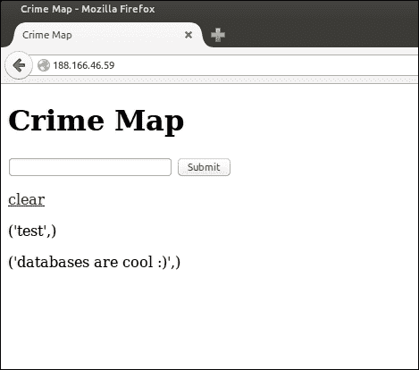
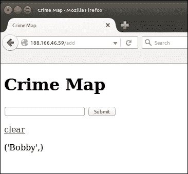
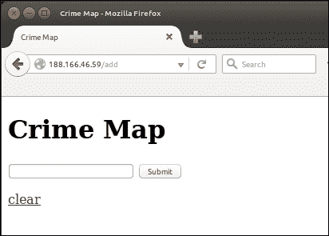
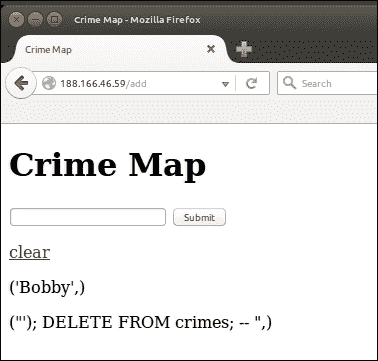

# 第六章：构建交互式犯罪地图

我们的第一个项目明显缺乏任何形式的长期存储。虽然我们通过使用 cookie 来模拟长期存储来解决问题，但我们也看到了这些方法的局限性。在这个项目中，我们将构建一个交互式犯罪地图，允许用户标记见证或经历的犯罪活动的位置细节。由于我们希望长期保留数据并使其对许多用户可用，我们不能依赖于用户的本地和临时存储。

因此，我们项目的第一步将是在我们的 VPS 上设置一个 MySQL 数据库，并将其与一个新的 Flask Web 应用程序进行链接。我们将使用 Google Maps API 允许用户查看我们的地图并向其添加新的标记（其中每个标记代表一种犯罪）。

我们的新项目将具有比我们以前的项目更高级的用户输入，允许用户过滤他们对地图的视图，并向地图添加相当复杂的数据。因此，我们将更加关注输入验证和净化。

我们项目的目标是创建一个包含交互地图的网页。用户应该能够通过选择地图上的位置并输入犯罪的日期、类别和描述来提交新的犯罪。用户还应该能够查看地图上以图标形式记录的所有先前记录的犯罪，并通过选择地图上相关图标来查看任何特定犯罪的更多细节。地图的目的是能够轻松查看犯罪率高的地区，以及帮助调查人员发现犯罪的模式和趋势。

本章的相当大一部分内容都是关于在我们的 VPS 上设置 MySQL 数据库并为犯罪数据创建数据库。接下来我们将设置一个包含地图和文本框的基本页面。我们将看到如何通过将输入到文本框中的数据存储到我们的数据库中，将 Flask 与 MySQL 进行链接。

与上一个项目一样，我们将避免在“现实世界”项目中几乎肯定会使用的框架和自动化工具。由于我们将专注于学习，较低级别的抽象是有用的。因此，我们不会为我们的数据库查询使用对象关系映射（ORM），也不会为用户输入和交互使用 JavaScript 框架。这意味着会有一些繁琐的 SQL 和纯 JavaScript 编写，但在盲目使用这些工具和框架之前，充分理解它们存在的原因以及它们解决的问题是非常重要的。

在本章中，我们将涵盖：

+   设置一个新的 Git 存储库

+   理解关系数据库

+   在我们的 VPS 上安装和配置 MySQL

+   在 MySQL 中创建我们的犯罪地图数据库

+   创建一个基本的数据库 Web 应用程序

# 设置一个新的 Git 存储库

我们将为我们的新代码库创建一个新的 Git 存储库，因为尽管一些设置将是相似的，但我们的新项目应该与我们的第一个项目完全无关。如果您需要更多关于此步骤的帮助，请返回到第一章，“你好，世界！”并按照“安装和使用 Git”部分中的详细说明进行操作。如果您感到自信，请检查您是否可以仅使用以下摘要完成此操作：

+   前往 Bitbucket、GitHub 或您用于第一个项目的任何托管平台的网站。登录并创建一个新的存储库

+   将您的存储库命名为`crimemap`并记下您收到的 URL

+   在您的本地计算机上，打开终端并运行以下命令：

```py
mkdir crimemap
cd crimemap
git init
git remote add origin <git repository URL>

```

我们将暂时将此存储库保留为空，因为我们需要在我们的 VPS 上设置一个数据库。一旦我们安装了数据库，我们将回到这里设置我们的 Flask 项目。

# 理解关系数据库

在其最简单的形式中，关系数据库管理系统，如 MySQL，就是一个类似于 Microsoft Excel 的高级电子表格程序。我们用它来以行和列的形式存储数据。每一行都是一个“*thing*”，每一列都是有关相关行中“*thing*”的特定信息。我在“*thing*”中加了引号，因为我们不仅仅局限于存储对象。事实上，在现实世界和解释数据库中，关于人的数据是最常见的“*thing*”。一个关于电子商务网站客户信息的基本数据库可能看起来类似于以下内容：

| ID | 名 | 姓 | 电子邮件地址 | 电话 |
| --- | --- | --- | --- | --- |
| 1 | 弗罗多 | 巴金斯 | `fbaggins@example.com` | +1 111 111 1111 |
| 2 | 比尔博 | 巴金斯 | `bbaggins@example.com` | +1 111 111 1010 |
| 3 | 山姆怀斯 | 甘吉 | `sgamgee@example.com` | +1 111 111 1001 |

如果我们从左到右查看单行，我们将得到有关一个人的所有信息。如果我们从上到下查看单列，我们将得到每个人的一条信息（例如，电子邮件地址）。这两种方式都很有用；如果我们想要添加一个新的人或联系特定的人，我们可能会对特定行感兴趣。如果我们想向所有客户发送通讯，我们只对电子邮件列感兴趣。

那么，为什么我们不能只使用电子表格而不是数据库呢？嗯，如果我们进一步考虑电子商务店的例子，我们很快就会看到限制。如果我们想要存储我们提供的所有物品的清单，我们可以创建另一个类似于前面的表，其中包含`Item name`、`Description`、`Price`和`Quantity in stock`等列。我们的模型仍然很有用；然而，现在，如果我们想要存储弗罗多曾经购买的所有物品的清单，就没有一个合适的地方来存放这些数据。我们可以在我们的客户表中添加 1000 列（如前所示），比如`Purchase 1`、`Purchase 2`，一直到`Purchase 1000`，并希望弗罗多永远不会购买超过 1000 件物品。这既不可扩展，也不容易处理。我们如何获取弗罗多上周二购买的物品的描述？我们只是将`name`项存储在我们的新列中吗？那些没有唯一名称的物品会发生什么？

很快，我们会意识到我们需要反向思考。我们需要创建一个名为`Orders`的新表，将每个订单中购买的物品存储在`Customers`表中，同时在每个订单中存储对客户的引用。因此，一个订单“知道”它属于哪个客户，但客户本身并不知道属于他/她的订单。

尽管我们的模型仍然可以勉强放入电子表格中，但随着我们的数据模型和规模的增长，我们的电子表格变得更加繁琐。我们需要进行复杂的查询，比如“我想看到所有库存中的物品，过去六个月至少被订购一次，并且价格超过 10 美元的物品”。

进入**关系数据库管理系统**（**RDBMS**）。它们已经存在了几十年，是一种经过验证的解决常见问题的方法（例如以有组织和可访问的方式存储具有复杂关系的数据）。我们不会在我们的犯罪地图中涉及它们的全部功能（事实上，如果需要，我们可能可以将我们的数据存储在文本文件中），但如果你有兴趣构建 Web 应用程序，你将在某个时候需要一个数据库。因此，让我们从小处着手，将强大的 MySQL 工具添加到我们不断增长的工具箱中。

我强烈建议您了解更多关于数据库的知识！如果您对构建我们当前项目的经验感兴趣，那就去阅读和学习关于数据库的知识吧。关系数据库管理系统的历史很有趣，而规范化和数据库种类的复杂性和微妙性（包括我们下一个项目中将会看到的 NoSQL 数据库）值得更多的学习时间，而这本书专注于 Python web 开发，我们无法花太多时间在这方面。

# 在我们的 VPS 上安装和配置 MySQL

安装和配置 MySQL 是一个非常常见的任务。因此，您可以在预构建的镜像或为您构建整个*stacks*的脚本中找到它。一个常见的 stack 被称为**LAMP stack**，代表**Linux**，**Apache**，**MySQL**和**PHP**，许多 VPS 提供商提供一键式的 LAMP stack 镜像。

由于我们将使用 Linux 并且已经手动安装了 Apache，在安装 MySQL 后，我们将非常接近传统的 LAMP stack；我们只是使用 P 代替 PHP。为了符合我们“教育第一”的目标，我们将手动安装 MySQL，并通过命令行进行配置，而不是安装 GUI 控制面板。如果您以前使用过 MySQL，请随意按照您的意愿进行设置。

MySQL 和 Git

### 注意

请记住，我们的 MySQL 设置和我们存储在其中的数据都不是我们 Git 存储库的一部分。任何在数据库级别上的错误，包括错误配置或删除数据，都将更难以撤消。

## 在我们的 VPS 上安装 MySQL

在我们的服务器上安装 MySQL 非常简单。通过 SSH 登录到您的 VPS 并运行以下命令：

```py
sudo apt-get update
sudo apt-get install mysql-server

```

您应该看到一个界面提示您输入 MySQL 的 root 密码。在提示时输入密码并重复输入。安装完成后，您可以通过输入以下内容获得一个实时的 SQL shell：

```py
mysql –p

```

然后，在提示时输入您之前选择的密码。我们可以使用这个 shell 创建数据库和模式，但我们宁愿通过 Python 来做这件事；所以，如果您打开了 MySQL shell，请输入`quit`并按下*Enter*键来终止它。

## 为 MySQL 安装 Python 驱动程序

由于我们想要使用 Python 来访问我们的数据库，我们需要安装另一个软件包。Python 有两个主要的 MySQL 连接器：*PyMySQL*和*MySQLdb*。从简单性和易用性的角度来看，第一个更可取。它是一个纯 Python 库，这意味着它没有依赖性。MySQLdb 是一个 C 扩展，因此有一些依赖性，但理论上它会更快一些。一旦安装，它们的工作方式非常相似。在本章的示例中，我们将使用 PyMySQL。

要安装它，请在您的 VPS 上运行以下命令：

```py
pip install --user pymysql

```

# 在 MySQL 中创建我们的犯罪地图数据库

对 SQL 语法的一些了解将对本章的其余部分有所帮助，但您应该能够跟上。我们需要做的第一件事是为我们的 Web 应用程序创建一个数据库。如果您习惯使用命令行编辑器，您可以直接在 VPS 上创建以下脚本，这样可以更容易调试，而且我们不会在本地运行它们。然而，在 SSH 会话中进行开发远非理想；因此，我建议您在本地编写它们，并使用 Git 在运行之前将它们传输到服务器上。

这可能会使调试有点令人沮丧，因此在编写这些脚本时要特别小心。如果您愿意，您可以直接从本书附带的代码包中获取它们。在这种情况下，您只需要正确填写`dbconfig.py`文件中的用户和密码字段，一切都应该正常工作。

## 创建一个数据库设置脚本

在本章开始时我们初始化 Git 存储库的`crimemap`目录中，创建一个名为`db_setup.py`的 Python 文件，其中包含以下代码：

```py
import pymysql
import dbconfig
connection = pymysql.connect(host='localhost',
                             user=dbconfig.db_user,
                             passwd=dbconfig.db_password)

try:
        with connection.cursor() as cursor:
                sql = "CREATE DATABASE IF NOT EXISTS crimemap"
                cursor.execute(sql)
                sql = """CREATE TABLE IF NOT EXISTS crimemap.crimes (
id int NOT NULL AUTO_INCREMENT,
latitude FLOAT(10,6),
longitude FLOAT(10,6),
date DATETIME,
category VARCHAR(50),
description VARCHAR(1000),
updated_at TIMESTAMP,
PRIMARY KEY (id)
)"""
                cursor.execute(sql);
        connection.commit()
finally:
        connection.close()
```

让我们看看这段代码做了什么。首先，我们导入了刚刚安装的`PyMySQL`库。我们还导入了`dbconfig`，稍后我们将在本地创建并填充数据库凭据（我们不希望将这些凭据存储在我们的存储库中）。然后，我们将使用`localhost`（因为我们的数据库安装在与我们的代码相同的机器上）和尚不存在的凭据创建到我们的数据库的连接。

现在我们已经连接到我们的数据库，我们可以获取一个游标。您可以将游标想象成文字处理器中的闪烁对象，指示当您开始输入时文本将出现的位置。数据库游标是一个指向数据库中我们想要创建、读取、更新或删除数据的位置的对象。一旦我们开始处理数据库操作，就会出现各种异常。我们始终希望关闭与数据库的连接，因此我们将在`try`块中创建一个游标（并执行所有后续操作），并在`finally`块中使用`connection.close()`（`finally`块将在`try`块成功与否时执行）。

游标也是一个资源，所以我们将获取一个并在`with:`块中使用它，这样当我们完成后它将自动关闭。设置完成后，我们可以开始执行 SQL 代码。

当我们调用`cursor.execute()`函数时，我们将传入的 SQL 代码将使用数据库引擎运行，并且如果适当的话，游标将被填充结果。我们将在后面讨论如何使用游标和`execute()`函数读取和写入数据。

### 创建数据库

SQL 读起来与英语类似，因此通常很容易弄清楚现有的 SQL 代码的作用，即使编写新代码可能有点棘手。我们的第一个 SQL 语句将创建一个`crimemap`数据库（如果尚不存在），这意味着如果我们回到这个脚本，我们可以保留这行而不必每次删除整个数据库。我们将把我们的第一个 SQL 语句作为一个字符串创建，并使用`sql`变量来存储它。然后，我们将使用我们创建的游标执行该语句。

### 查看我们的表列

现在我们知道我们有一个数据库，我们可以创建一个表。该表将存储我们记录的所有犯罪的数据，每起犯罪在表的一行中。因此，我们需要几列。我们的`create table`语句中可以看到每列以及将存储在该列中的数据类型。为了解释这些，我们有：

+   **id**：这是一个唯一的数字，对于我们记录的每一起犯罪都会自动记录。我们不需要太担心这个字段，因为 MySQL 会在我们每次添加新的犯罪数据时自动插入它，从 1 开始递增。

+   **纬度和经度**：这些字段将用于存储每起犯罪的位置。在浮点数后面我们将指定`(10, 6)`，这意味着每个浮点数最多可以有 10 位数字，小数点后最多可以有 6 位数字。

+   **日期**：这是犯罪的日期和时间。

+   **类别**：我们将定义几个类别来对不同类型的犯罪进行分类。这将有助于以后过滤犯罪。`VARCHAR(50)`表示这将是可变长度的数据，最长为 50 个字符。

+   **描述**：这类似于`类别`，但最多为 1000 个字符。

+   **Updated_at**：这是另一个我们不需要担心的字段。当我们插入数据或编辑数据时，MySQL 会将其设置为当前时间。例如，如果我们想要删除特定时间错误插入的一堆数据，这可能会很有用。

### 索引和提交

我们`create table`查询的最后一行指定了我们的`id`列为*主键*。这意味着它将被索引（因此，如果我们在查询我们的数据库时使用它，我们将能够非常有效地找到数据），并且将具有各种其他有用的属性，比如强制存在和唯一性。

一旦我们定义了这个更复杂的 SQL 片段，我们将在下一行执行它。然后，我们将提交我们对数据库的更改。把这看作是保存我们的更改；如果我们在没有提交的情况下关闭连接，我们的更改将被丢弃。

**SQL 提交**：

### 提示

忘记提交更改是 SQL 初学者的常见错误。如果您到达一个点，您的数据库表现不如预期，并且您无法弄清楚原因，检查一下您的代码中是否忘记了提交。

## 使用数据库设置脚本

将我们的脚本保存在本地并推送到存储库。请参考以下命令的顺序：

```py
git add db_setup.py
git commit –m "database setup script"
git push origin master

```

通过以下命令 SSH 到您的 VPS，并将新存储库克隆到您的/var/www 目录：

```py
ssh user@123.456.789.123
cd /var/www
git clone <your-git-url>
cd crimemap

```

### 向我们的设置脚本添加凭据

现在，我们仍然没有我们的脚本依赖的凭据。在使用设置脚本之前，我们将做两件事：

+   创建`dbconfig.py`文件，其中包含数据库和密码

+   将此文件添加到`.gitignore`中，以防止它被添加到我们的存储库中

使用以下命令在您的 VPS 上直接创建和编辑`dbconfig.py`文件：

```py
nano dbconfig.py

```

然后，使用您在安装 MySQL 时选择的密码输入以下内容：

```py
db_user = "root"
db_password = "<your-mysql-password>"
```

按下*Ctrl* + *X*保存，并在提示时输入*Y*。

现在，使用类似的`nano`命令来创建、编辑和保存`.gitignore`，其中应包含以下内容：

```py
dbconfig.py
*.pyc

```

第一行防止我们的`dbconfig`文件被添加到 Git 存储库中，这有助于防止未经授权使用我们的数据库密码。第二行防止编译的 Python 文件被添加到存储库中，因为这些只是运行时优化，并且与我们的项目相关。

### 运行我们的数据库设置脚本

完成后，您可以运行：

```py
python db_setup.py

```

假设一切顺利，现在你应该有一个用于存储犯罪的表的数据库。Python 将输出任何 SQL 错误，允许您在必要时进行调试。如果您从服务器对脚本进行更改，请运行与您从本地机器运行的相同的`git add`、`git commit`和`git push`命令。

git 状态：

### 提示

您可以从终端运行`git status`（确保您在存储库目录中）来查看已提交文件的摘要。您现在可以使用这个（在`git push`之前）来确保您没有提交`dbconfig`文件。

这就结束了我们的初步数据库设置！现在，我们可以创建一个使用我们的数据库的基本 Flask 项目。

# 创建一个基本的数据库 Web 应用程序

我们将首先构建我们的犯罪地图应用程序的框架。它将是一个基本的 Flask 应用程序，只有一个页面：

+   显示我们的数据库中`crimes`表中的所有数据

+   允许用户输入数据并将这些数据存储在数据库中

+   有一个**清除**按钮，可以删除之前输入的所有数据

尽管我们将存储和显示的内容现在还不能真正被描述为*犯罪数据*，但我们将把它存储在我们之前创建的`crimes`表中。我们现在只使用`description`字段，忽略所有其他字段。

设置 Flask 应用程序的过程与我们之前所做的非常相似。我们将把数据库逻辑分离到一个单独的文件中，留下我们的主要`crimemap.py`文件用于 Flask 设置和路由。

## 设置我们的目录结构

在您的本地机器上，切换到`crimemap`目录。如果您在服务器上创建了数据库设置脚本或对其进行了任何更改，请确保将更改同步到本地。然后，通过运行以下命令（或者如果您愿意，使用 GUI 文件浏览器）创建`templates`目录并触摸我们将使用的文件：

```py
cd crimemap
git pull origin master
mkdir templates
touch templates/home.html
touch crimemap.py
touch dbhelper.py

```

## 查看我们的应用程序代码

将以下代码添加到`crimemap.py`文件中。这里没有什么意外的内容，应该都是我们在 Headlines 项目中熟悉的。唯一需要指出的是`DBHelper()`类，我们将在下一步考虑它的代码。我们将在初始化应用程序后简单地创建一个全局的`DBHelper`实例，然后在相关方法中使用它来从数据库中获取数据，将数据插入数据库，或者从数据库中删除所有数据：

```py
from dbhelper import DBHelper
from flask import Flask
from flask import render_template
from flask import request

app = Flask(__name__)
DB = DBHelper()

@app.route("/")
def home():
    try:
        data = DB.get_all_inputs()
    except Exception as e:
        print e
        data = None
    return render_template("home.html", data=data)

@app.route("/add", methods=["POST"])
def add():
  try:
    data = request.form.get("userinput")
    DB.add_input(data)
  except Exception as e:
    print e
  return home()

@app.route("/clear")
def clear():
  try:
    DB.clear_all()
  except Exception as e:
    print e
  return home()

if __name__ == '__main__':
  app.run(port=5000, debug=True)
```

## 查看我们的 SQL 代码

从我们的数据库辅助代码中还有一些 SQL 需要学习。将以下代码添加到`dbhelper.py`文件中：

```py
import pymysql
import dbconfig

class DBHelper:

  def connect(self, database="crimemap"):
    return pymysql.connect(host='localhost',
              user=dbconfig.db_user,
              passwd=dbconfig.db_password,
              db=database)

  def get_all_inputs(self):
  connection = self.connect()
    try:
      query = "SELECT description FROM crimes;"
      with connection.cursor() as cursor:
        cursor.execute(query)
      return cursor.fetchall()
    finally:
      connection.close()

  def add_input(self, data):
    connection = self.connect()
    try:
      # The following introduces a deliberate security flaw. See section on SQL injection below
      query = "INSERT INTO crimes (description) VALUES ('{}');".format(data)
      with connection.cursor() as cursor:
        cursor.execute(query)
        connection.commit()
    finally:
      connection.close()

  def clear_all(self):
    connection = self.connect()
    try:
      query = "DELETE FROM crimes;"
      with connection.cursor() as cursor:
        cursor.execute(query)
        connection.commit()
    finally:
      connection.close()
```

就像在我们的设置脚本中一样，我们需要与数据库建立连接，然后从连接中获取一个游标以执行有意义的操作。同样，我们将在`try:` `finally:`块中执行所有操作，以确保连接被关闭。

在我们的辅助程序中，我们将考虑四个主要数据库操作中的三个。**CRUD**（**创建，读取，更新**和**删除**）描述了基本的数据库操作。我们要么创建和插入新数据，读取现有数据，修改现有数据，或者删除现有数据。在我们的基本应用程序中，我们不需要更新数据，但创建，读取和删除肯定是有用的。

### 读取数据

让我们从阅读开始，假设我们的数据库中已经有一些数据了。在 SQL 中，这是使用`SELECT`语句来完成的；我们将根据一组条件选择要检索的数据。在我们的情况下，`get_all_inputs`函数中的查询是`SELECT description FROM crimes;`。稍后我们会看一下如何完善`SELECT`查询，但这个查询只是获取我们`crimes`表中每一行的`description`字段。这类似于我们在本章开头讨论的例子，那时我们想要发送一封新闻简报，需要每个客户的电子邮件地址。在这里，我们想要每个犯罪的描述。

一旦游标执行了查询，它将指向一个包含结果的数据结构的开头。我们将在游标上执行`fetchall()`，将我们的结果集转换为列表，以便我们可以将它们传回我们的应用程序代码。（如果你在 Python 中使用了生成器，可能会觉得数据库游标就像一个生成器。它知道如何遍历数据，但它本身并不包含所有数据）。

### 插入数据

接下来是我们的`add_input()`函数。这个函数会获取用户输入的数据，并将其插入数据库中。在 SQL 中，使用`INSERT`关键字来创建数据。我们的查询（假设`foobar`是我们传入的数据）是`INSERT into crimes (description) VALUES ('foobar')`。

这可能看起来比实际做的事情要复杂，但请记住，我们仍然只处理一个字段（描述）。我们稍后会讨论`INSERT`是如何设计来接受多个但是任意列的，这些列可以在第一组括号中命名，然后为每个列提供匹配的值，在`VALUES`之后的第二组括号中给出。

由于我们对数据库进行了更改，我们需要*提交*我们的连接以使这些更改永久化。

### 删除数据

最后，我们将看一下 SQL 中`DELETE`语句有多简洁。`DELETE FROM crimes`会清除我们`crimes`数据库中的所有数据。稍后我们会考虑如何通过指定条件来删除部分数据，使这个关键字的行为不那么像核武器。

同样，这会对我们的数据库进行更改，所以我们需要提交这些更改。

如果所有新的 SQL 命令似乎太多了，那就去在线沙盒或者我们之前讨论过如何访问的实时 SQL shell 中玩一下。你会发现，SQL 在一段时间后会变得非常自然，因为它的大部分关键词都来自自然语言，而且它使用的符号非常少。

最后，让我们来看一下我们的 HTML 模板。

## 创建我们的视图代码

Python 和 SQL 编写起来很有趣，它们确实是我们应用程序的主要部分。但是，目前我们有一个没有门或窗户的房子；困难和令人印象深刻的部分已经完成，但它是不可用的。让我们添加一些 HTML 代码，以便世界可以与我们编写的代码进行交互。

在`templates/home.html`中，添加以下内容：

```py
<html>
<body>
  <head>
    <title>Crime Map</title>
  </head>

  <h1>Crime Map</h1>
  <form action="/add" method="POST">
    <input type="text" name="userinput">
    <input type="submit" value="Submit">
    </form>
  <a href="/clear">clear</a>
  
    <p>{{userinput}}</p>
    
</body>
</html>
```

这里没有我们以前没有见过的东西。在这里，我们有一个带有单个文本输入的表单，通过调用我们应用程序的`/add`函数向我们的数据库添加数据，并且直接在其下面，我们循环遍历所有现有数据，并在`<p>`标签中显示每个片段。

## 在我们的 VPS 上运行代码

最后，我们需要使我们的代码对世界可访问。这意味着将其推送到我们的`git`存储库，将其拉到 VPS 上，并配置 Apache 进行服务。在本地运行以下命令：

```py
git add .
git commit –m "Skeleton CrimeMap"
git push origin master
ssh <username>@<vps-ip-address>

```

现在，在您的 VPS 上运行以下命令：

```py
cd /var/www/crimemap
git pull origin master

```

现在，我们需要一个`.wsgi`文件将 Python 链接到 Apache，可以通过运行以下命令创建：

```py
nano crimemap.wsgi

```

`.wsgi`文件应包含以下内容：

```py
import sys
sys.path.insert(0, "/var/www/crimemap")
from crimemap import app as application
```

现在，按下*Ctrl* + *X*，然后在提示保存时输入*Y*。

我们还需要创建一个新的 Apache`.conf`文件，并将其设置为默认文件（而不是`headlines`，即我们当前默认的`.conf`文件）。运行以下命令创建文件：

```py
cd /etc/apache2/sites-available
nano crimemap.conf

```

接下来，添加以下代码：

```py
<VirtualHost *>
    ServerName example.com

 WSGIScriptAlias / /var/www/crimemap/crimemap.wsgi
 WSGIDaemonProcess crimemap
 <Directory /var/www/crimemap>
 WSGIProcessGroup crimemap
       WSGIApplicationGroup %{GLOBAL}
        Order deny,allow
        Allow from all
    </Directory>
</VirtualHost>
```

这与我们为以前的项目创建的`headlines.conf`文件非常相似，您可能会发现最好只需复制以前的文件并根据需要进行替换。

最后，我们需要停用旧站点并激活新站点，如下所示：

```py
sudo a2dissite headlines.conf
sudo a2ensite crimemap.conf
sudo service apache2 reload

```

现在，一切应该都正常工作。如果您手动复制了代码，几乎可以肯定会有一两个 bug 需要处理。不要因此而感到沮丧；记住调试预计将成为开发的一个重要部分！如有必要，运行`tail –f /var/log/apache2/error.log`，同时加载站点以注意任何错误。如果失败，请在`crimemap.py`和`dbhelper.py`中添加一些打印语句，以缩小故障位置。

一切都正常工作后，您应该能够看到一个带有单个文本输入的网页。当您通过输入提交文本时，您应该能够在页面上看到文本显示，就像以下示例一样：



请注意，我们从数据库获取的数据是一个元组，因此它被括号括起来，并且有一个尾随逗号。这是因为我们只从我们的`crimes`表中选择了一个字段，`'description'`，而在理论上，我们可能会处理每个犯罪的许多列（很快我们将这样做）。

## 减轻 SQL 注入

我们的应用程序存在一个致命缺陷。我们从用户那里获取输入，并使用 Python 字符串格式化将其插入到我们的 SQL 语句中。当用户输入正常的字母数字字符串时，这样做效果很好，但是如果用户是恶意的，他们实际上可以注入自己的 SQL 代码并控制我们的数据库。尽管 SQL 注入是一种古老的攻击方式，大多数现代技术都会自动减轻其影响，但每年仍然有数十起针对主要公司的攻击，其中由于 SQL 注入漏洞而泄漏了密码或财务数据。我们将花一点时间讨论什么是 SQL 注入以及如何防止它。

### 向我们的数据库应用程序注入 SQL

转到我们的 Web 应用程序，点击**清除**链接以删除任何保存的输入。现在，在输入框中输入`Bobby`，然后点击**提交**按钮。页面现在应该类似于以下图片：



在此输入中，现在键入：

`'); DELETE FROM crimes; --`

所有字符在这里都很重要。

输入需要以单引号开头，后跟一个闭括号，然后是一个分号，然后是删除语句，另一个分号，一个空格，最后是两个破折号。当页面刷新时，您可能期望看到第二行，列出这个看起来奇怪的字符串，位于**Bobby**输出下面，但实际上，您将看到一个空白页面，看起来类似于下面的屏幕截图：



这很奇怪，对吧？让我们看看发生了什么。在我们的`DBHelper`类中，我们的插入语句有以下行：

```py
query = "INSERT INTO crimes (description) VALUES ('{}');".format(data)
```

这意味着用户的输入会在我们运行代码之前添加到 SQL 代码中。当我们将之前使用的看起来奇怪的输入放入 SQL 语句的占位符中时，我们将得到以下字符串：

```py
"INSERT INTO crimes (description) VALUES (''); DELETE FROM crimes; -- ');"
```

这是两个 SQL 语句而不是一个。我们用一个空值关闭了`INSERT`语句，然后用`DELETE`语句删除了`crimes`表中的所有内容。末尾的两个破折号形成了一个 SQL 注释，这样额外的闭引号和括号就不会引起任何语法错误。当我们输入我们的数据时，我们向数据库插入了一个空行，然后删除了`crimes`表中的所有数据！

当然，一个有创造力的攻击者可以在我们选择的`DELETE`语句的位置运行任何 SQL 语句。他们可以删除整个表（参考[`xkcd.com/327/`](https://xkcd.com/327/)中的一个幽默的例子），或者他们可以运行一个选择语句来绕过数据库登录功能。或者，如果您存储信用卡信息，类似的攻击可以用来获取数据并将其显示给攻击者。总的来说，我们不希望我们的 Web 应用程序的用户能够在我们的数据库上运行任意代码！

### 防止 SQL 注入

防范 SQL 注入涉及对用户输入进行消毒，并确保如果用户输入可能被解释为 SQL 语法的特殊字符，则忽略这些字符。有不同的方法可以做到这一点，我们将使用我们的 Python SQL 库自动提供的一个简单方法。有关此主题的更全面信息，请参阅[`www.owasp.org/index.php/SQL_Injection_Prevention_Cheat_Sheet`](https://www.owasp.org/index.php/SQL_Injection_Prevention_Cheat_Sheet)。

在`dbhelper.py`文件中，将`add_input()`方法更改为以下内容：

```py
def add_input(self, data):
    connection = self.connect()
  try:
      query = "INSERT INTO crimes (description) VALUES (%s);"
      with connection.cursor() as cursor:
          cursor.execute(query, data)
          connection.commit()
      finally:
          connection.close()
```

我们在这里使用的`%s`标记是一个字符串占位符，类似于`%d`，它在普通 Python 字符串中用作占位符，也是大括号的旧替代方法。但是，我们不会使用 Python 的`str.format()`函数，而是将要插入到占位符中的字符串和值传递给 PyMySQL 的`cursor.execute()`函数。这将自动转义所有对 SQL 有意义的字符，这样我们就不必担心它们被执行。

现在，如果您再次尝试输入，您将看到它们按预期显示-包括特殊字符-如下面的屏幕截图所示：



在本书的最后一章中，我们将简要讨论可以提供更强大防范 SQL 注入攻击的 ORM 技术。虽然似乎我们通过转义一些特殊字符解决了一个简单的问题，但实际上可能会变得相当微妙。诸如**sqlmap**（[`sqlmap.org/`](http://sqlmap.org/)）之类的工具可以尝试对相同的想法（即输入特殊字符针对数据库）进行数百种不同的变体，直到找到意外的结果并发现漏洞。请记住，为了使您的应用程序安全，它必须受到对每种可能的漏洞的保护；而要使其不安全，它只需要对一个漏洞进行攻击。

# 摘要

这就是我们犯罪地图项目介绍的全部内容。我们讨论了如何在我们的 VPS 上安装 MySQL 数据库以及如何将其连接到 Flask。我们看了看如何创建、读取、更新和删除数据，并创建了一个基本的数据库 Web 应用程序，可以接受用户输入并再次显示出来。最后，我们看了看 SQL 注入漏洞以及如何保护自己免受其影响。

接下来，我们将添加一个谷歌地图小部件和一些更好的美学设计。
