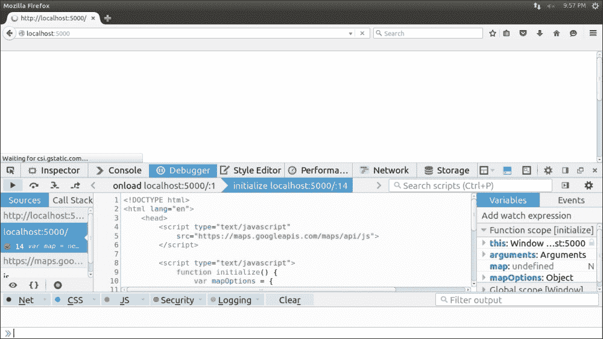
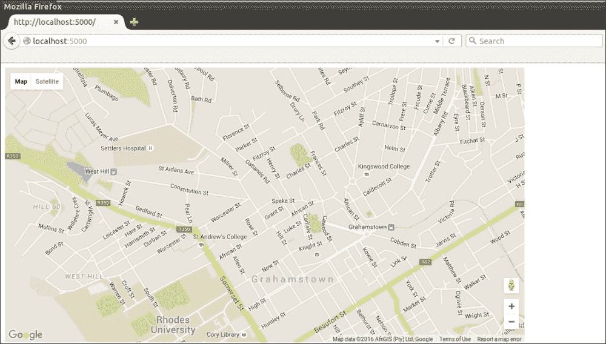
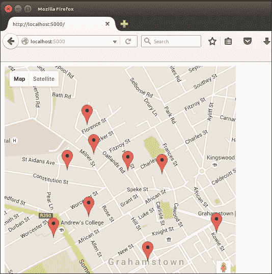
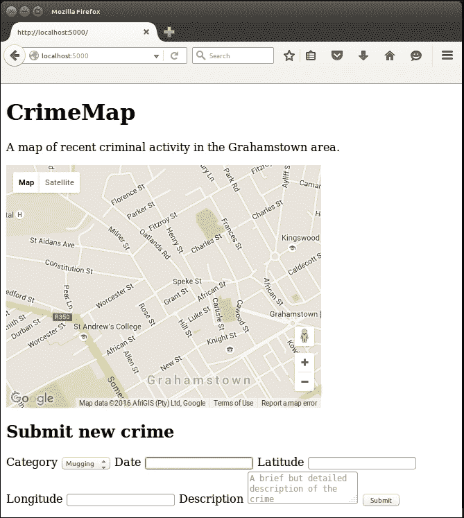
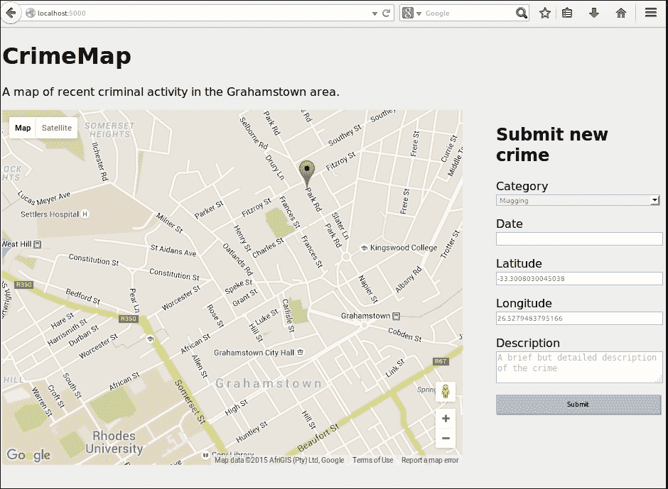
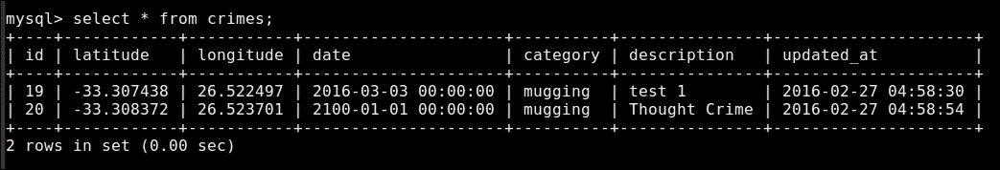
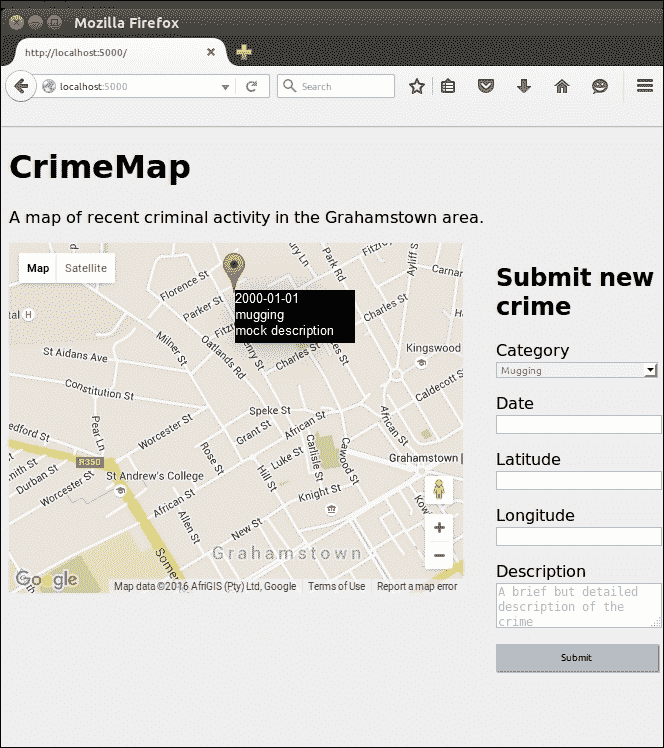
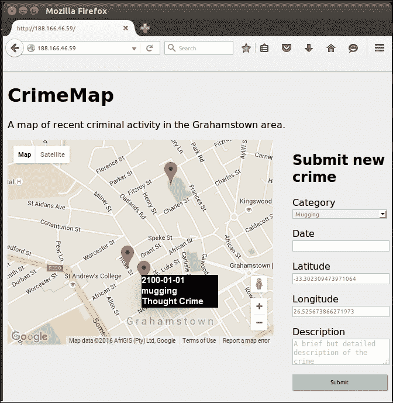

# 第七章：将 Google 地图添加到我们的犯罪地图项目

在上一章中，我们设置了一个数据库，并讨论了如何通过 Flask 向其中添加和删除数据。现在有了一个可以进行长期存储的输入和输出的网络应用程序，我们现在拥有了几乎所有网络应用程序所需的基本组件，只受我们想象力的限制。

在本章中，我们将比上一章的纯文本界面添加更多功能；我们将添加嵌入式 Google 地图，允许用户以直观的方式查看和选择地理坐标。

Google Maps 是用 JavaScript 编写的，我们需要编写一些 JavaScript 代码来适应我们的需求。与往常一样，我们将为以前从未使用过 JavaScript 的读者做一个快速教程，但如果您有兴趣巩固您的全面网络应用知识，现在是快速浏览一些特定于 JavaScript 的教程的好时机。如果您以前从未见过任何 JavaScript 代码，可以在[`www.w3schools.com/js/default.asp`](http://www.w3schools.com/js/default.asp)找到一个类似于我们之前提供链接的 HTML 和 CSS 教程的简单介绍。

可以说，犯罪地图最重要的部分是地图本身。我们将使用 Google Maps API，这对开发人员来说简单而强大，对用户来说直观。作为第一步，我们将只添加一个基本地图，加载到我们选择的区域和缩放级别。一旦我们完成了这一步，我们将添加功能以允许标记。标记对我们的地图有两个目的：首先，我们将在地图上显示我们在数据库中保存的每起犯罪的位置；其次，当用户点击地图时，它将添加一个新的标记，并允许用户提交新的犯罪报告（最终通过在表单字段中添加描述和日期）。

然而，首先我们需要能够再次在本地运行我们的应用程序进行开发和调试。将其链接到数据库，这有点棘手；因此，我们将看看如何解决这个常见问题。

在本章中，我们将涵盖以下主题：

+   在本地运行数据库应用程序

+   将嵌入式 Google 地图小部件添加到我们的应用程序

+   为新犯罪添加一个输入表单

+   在地图上显示现有的犯罪

# 在本地运行数据库应用程序

为了在本地开发和调试，我们需要能够运行应用程序。然而，目前这是不可能的，因为 MySQL 只安装在我们的 VPS 上。有三种主要选项来在本地开发我们的数据库应用程序：

+   即使在本地机器上运行 Flask，也要连接到我们 VPS 上的数据库

+   在本地机器上安装 MySQL

+   使用 Python 在内存中创建我们数据库的“模拟”

虽然任何一个都可以工作，但我们将选择第三个选项。连接到我们的生产数据库会导致我们受到延迟的影响，如果我们在离我们的 VPS 很远的地方开发，这也意味着我们将对我们的生产数据库运行测试代码，这绝不是一个好主意。第二个选项将限制我们开发环境的可移植性，增加切换到新开发环境时的设置时间，并且在最坏的情况下，会消耗大量的本地资源。

## 创建我们数据库的模拟

如果您尝试在本地运行`crimemap.py`文件，您将看到的第一个错误是`ImportError`，因为我们没有`dbconfig.py`文件。在上一章中，我们直接在我们的 VPS 上创建了这个文件，并且没有将其检入 git，因为它包含敏感的数据库凭据。我们将创建`dbconfig.py`的本地副本，这表明我们的应用程序应该使用模拟数据库。我们将在我们的 VPS 上更新`dbconfig.py`文件，以指示在那里运行应用程序时应使用真实的数据库。我们将使用一个简单的布尔标志来实现这一点。

### 添加一个测试标志

在您的本地`crimemap`目录中，创建一个新的`dbconfig.py`文件，并添加一行代码：

```py
test = True
```

现在，SSH 进入您的 VPS，并将标志添加到生产配置中；尽管这里，值应设置为`False`，如下所示：

```py
ssh user@123.456.789.123
cd /var/www/crimemap
nano dbconfig.py

```

在文件顶部添加以下内容：

```py
test = False
```

然后，键入*Ctrl* + *X*，然后*Y*保存并退出文件

现在，退出 SSH 会话。这将解决`ImportError`（`dbconfig.py`文件现在存在于我们的 VPS 和本地），并且我们的应用程序现在知道它是在测试还是生产环境中运行。

### 编写模拟代码

尽管我们的标志目前实际上并没有做任何事情，我们也不想在测试应用程序时触发所有的异常。相反，我们将编写我们数据库代码的“模拟”（`dbhelper.py`文件中的代码），它将返回基本静态数据或`None`。当我们的应用程序运行时，它将能够正常调用数据库函数，但实际上并没有数据库。相反，我们将有几行 Python 来模拟一个非常基本的数据库。在您的`crimemap`目录中创建`mockdbhelper.py`文件，并添加以下代码：

```py
class MockDBHelper:

  def connect(self, database="crimemap"):
    pass

  def get_all_inputs(self):
    return []

  def add_input(self, data):
    pass

  def clear_all(self):
    pass
```

正如您所注意到的，我们用于基本数据库应用程序的方法都存在，但并没有做任何事情。`get_all_inputs()`方法返回一个空列表，我们仍然可以将其传递给我们的模板。现在，我们只需要告诉我们的应用程序在测试环境中使用这个方法，而不是真正的`DBHelper`类。在`crimemap.py`的导入部分的末尾添加以下代码，确保删除现有的`import` for `DBHelper`：

```py
import dbconfig
if dbconfig.test:
    from mockdbhelper import MockDBHelper as DBHelper
else:
    from dbhelper import DBHelper
```

我们使用`dbconfig`中的测试标志来指定是否导入真正的`DBHelper`（它依赖于与 MySQL 的连接）或导入模拟的`DBHelper`（它不需要数据库连接）。如果我们导入模拟助手，我们可以更改名称，以便代码的其余部分可以继续运行而无需对测试标志进行条件检查。

### 验证我们的期望

现在，您应该能够像以前添加数据库依赖项之前一样在本地运行代码。在您的终端中运行：

```py
python crimemap.py

```

然后，在浏览器中访问`localhost:5000`，查看您的应用程序加载情况。检查终端的输出，确保没有触发异常（如果您尝试运行真正的`DBHelper`代码而不是我们刚刚制作的模拟代码，就会触发异常）。尽管我们的应用程序不再“工作”，但至少我们可以运行它来测试不涉及数据库的代码。然后，当我们部署到生产环境时，一切应该与我们的测试一样正常工作，但实际上插入了一个真正的数据库。

# 将嵌入式谷歌地图小部件添加到我们的应用程序

现在，我们想要在我们的应用程序中添加地图视图，而不是基本输入框。谷歌地图允许您创建地图而无需注册，但您只能进行有限次数的 API 调用。如果您创建了这个项目，在网上发布了一个链接，并且它变得火爆，您有可能达到限制（目前每天最多 2500 次地图加载）。如果您认为这将是一个限制因素，您可以注册地图 API，并有选择向谷歌支付更多容量。然而，免费版本对于开发甚至生产来说都足够了，如果您的应用程序不太受欢迎的话。

## 将地图添加到我们的模板

我们想在我们应用程序的主页上显示地图，这意味着编辑我们`templates`目录中的`home.html`文件中的代码。删除所有现有代码，并用以下代码替换：

```py
<!DOCTYPE html>
<html lang="en">
  <head>
    <script type="text/javascript"
      src="img/js">
    </script>

    <script type="text/javascript">
      function initialize() { 
        var mapOptions = {
          center: new google.maps.LatLng(- 33.30578381949298, 26.523442268371582),
          zoom: 15
        };
        var map = new
        google.maps.Map(document.getElementById("map- canvas"),mapOptions);
      }
     </script>

  </head>
    <body onload="initialize()">
    <div id="map-canvas" style="width:80%; height:500px;"></div>
    </body>
</html>
```

### 引入 JavaScript

让我们看看这里发生了什么。第一行告诉我们的用户浏览器，我们正在使用 HTML5。第 4 到 6 行包括我们页面中需要的地图资源。请注意，这是在`<script>`标签之间，表示这是 JavaScript。在这种特殊情况下，我们实际上并没有编写 JavaScript 代码 - 我们只是链接到它托管在谷歌服务器上的位置。把它想象成 Python 的`import`语句，除了我们甚至不需要在本地安装包；它只是在您的用户浏览器运行时“导入”。

紧随其后的是我们的设置脚本，用于显示基本地图。同样，这是在`<script>`标签之间，以表明这是 JavaScript 而不是 HTML。尽管在括号、大括号和`for`循环方面，它的语法与 Java 类似，但除此之外，它与 Java 之间几乎没有关系。

我们的 JavaScript 代码的第一行是一个函数定义；类似于 Python 的“`def`”，我们使用`function`关键字来定义一个名为`initialise()`的新函数。我们声明了一个变量`var mapOptions =`，并将一个类似于 Python 字典的新 JavaScript 对象分配给了这个变量。我们使用经纬度元组的方式定义了一个位置，这是因为我们可以访问到第 4 到 6 行的内容，该对象还包含一个“`zoom`”级别。这些选项描述了我们的初始地图：应该显示哪个区域以及以什么缩放级别。

最后，我们创建了一个新变量`map`，并初始化了一个 Google 地图对象，传入了一个 HTML 元素的 ID（我们将在下一节中详细解释）和我们刚刚定义的地图选项。然后我们到达了 JavaScript 代码的末尾，所以我们关闭了`<script>`标签。

### 我们的 HTML 代码的主体

虽然我们的`<body>`部分只有几行，但其中有一些微妙之处。第一行打开了`<body>`标签，并定义了`onload`参数。此参数接受一个 JavaScript 函数的名称，该函数将在页面加载时自动调用。请注意，函数名称（在我们的例子中是“`initialize`”）被引号括起来。如果你想到 Python，这可能有些反直觉，因为引号主要用于字符串字面量。将其视为将函数*名称*传递给 body 块，但请注意我们仍然使用开闭括号作为名称的一部分。

下一行创建了一个`<div>`元素。通常，`<div>`除了包含更多的 HTML 之外什么也不做，但这并不意味着空的`<div>`块，就像我们这里有的一样，是毫无意义的。请注意我们给`<div>`的 ID，`map-canvas`。这与我们 JavaScript 代码中的名称相匹配；也就是说，JavaScript 函数将查找一个名为`map-canvas`的 HTML 元素（使用`document.getElementById()`）并将其转换为 Google 地图小部件。因此，使用`<div>`元素是有意义的，因为我们希望 JavaScript 代码使用一个空元素。

最后，我们的`<div>`元素还包括一些内联 CSS。我们可以使用 CSS 的`height`和`width`属性来定义地图的宽度和高度（这是 Google Maps API 的要求）。在这种情况下，我们将地图的`height`值定义为常量`500`像素，`width`值定义为页面的`80%`。宽度的百分比很有用，因为滚动功能通常会与缩放功能重叠。也就是说，如果用户想要在触摸板或鼠标滚轮上向下滚动页面，并且光标位于地图上，地图将放大而不是页面向下滚动。因此，右侧的 20%的“空白”空间为用户提供了滚动时移动鼠标的位置。同样，对于触摸屏，用户在尝试滚动时会在地图周围“平移”，但可以利用这个空间来放置手指。

### 测试和调试

我们现在应该能够在本地运行我们的 Web 应用程序并查看嵌入的 Google 地图。如果您的应用程序尚未运行，请使用终端再次启动它，并在浏览器中导航到`localhost:5000`。由于我们不在本地存储 Google 地图的代码，因此需要从 Google 的服务器获取，因此我们的本地机器需要在线才能正常工作（类似于获取我们 Headlines 应用程序所需的数据）。

调试 JavaScript 代码有点棘手，因为任何错误都不会被 Flask 注册，因此不会在应用程序输出中看到。如果您的网页是空白的或执行任何意外操作，首先要查看的地方是您的浏览器开发者控制台。这是开发人员的工具，在所有主要浏览器中都可以找到，通常通过按下*Ctrl* + *Shift* + *C*并导航到出现的窗口或侧边栏中的“**控制台**”选项卡。在这里，您将注意到代码触发的任何 JavaScript 错误或警告，因此此工具在调试 Web 应用程序中非常宝贵。

尽管控制台应该报告错误以及行号，但有时确切地追踪出错的地方可能有些困难。JavaScript 是一种动态类型的语言，以其一些相当古怪和反直觉的行为而臭名昭著。如果有必要，您还可以在 HTML 的`<script>`标签之间添加 JavaScript 行，这些行除了在开发人员工具控制台中记录外什么也不做。要做到这一点，请使用以下内容：

```py
console.log("A message");
```

这类似于 Python 的`print`语句，您可以传递变量和大多数对象，以查看它们的字符串表示形式记录到输出中。使用`+`符号进行连接。例如，如果您有一个名为“`a`”的变量，并且想要在代码的特定点看到它的值，可以添加以下行：

```py
console.log("The value of a is: " + a);
```

对于更复杂的调试方法，请查看开发人员工具窗口（或浏览器中的等效窗口）中的**调试器**选项卡，并尝试在 JavaScript 中设置断点。开发人员工具通常是一套功能强大的工具，很遗憾，其全部功能超出了本书的范围。以下屏幕截图显示了 Mozilla Firefox 开发人员控制台，在加载地图之前设置了断点：



一旦所有错误都被消除（或者如果您非常细心和幸运，可以立即看到），您应该在浏览器中看到一个包含嵌入的 Google 地图的页面，该地图以**格雷厄姆斯敦**，南非为中心。通过使用 JavaScript 代码中的`mapOptions`变量设置的缩放级别和坐标来获取您选择的初始地图。单击并在地图上按住将允许“平移”或在世界各地移动。通过使用您的中间鼠标滚轮滚动，使用触摸板或在触摸屏上进行“捏合缩放”来进行缩放。结果应该与以下屏幕截图类似：



现在让我们继续使我们的地图更加交互和有用。

## 使我们的地图交互起来

我们将为我们的应用程序添加的第一个功能允许用户在地图上放置一个标记。这将最终允许用户通过指示犯罪发生地点来添加犯罪报告，从而增加我们的众包犯罪数据库。我们还将在 JavaScript 中实现标记功能，使用“侦听器”。

### 添加标记

JavaScript 是*事件驱动*的。诸如鼠标移动或鼠标单击之类的操作都是事件，我们可以通过设置事件侦听器来对这些事件做出反应。侦听器只是在后台运行，等待特定事件，然后在检测到事件时触发指定的操作。我们将为鼠标单击设置一个侦听器，如果检测到，我们将在单击时在鼠标位置放置一个地图标记。

使用 Google 地图 API，可以用几行代码实现这一点。首先，我们将使我们的`map`变量全局化。然后，我们将创建一个`placeMarker()`函数，该函数将引用我们的`map`变量，并在调用时在其上放置一个标记。在我们现有的`initalise()`函数中，我们将添加一个点击侦听器，当触发时将调用`placeMarker()`函数。

完整的 JavaScript 代码可以在此处查看，修改的行已突出显示：

```py
<script type="text/javascript"
  src="img/js">
</script>

<script type="text/javascript">

 var map;
  function initialize() { 
  var mapOptions = {
    center: new google.maps.LatLng(-33.30578381949298, 26.523442268371582),
    zoom: 15
  };
 map = new google.maps.Map(document.getElementById("map- canvas"), mapOptions);
 google.maps.event.addListener(map, 'click', function(event){ 
 placeMarker(event.latLng);
 });
  }

 function placeMarker(location) {
 var marker = new google.maps.Marker({
 position: location, 
 map: map
 });
  }
</script>
```

特别注意从`var map = new google.maps.Map`到`map = new google.maps.Map`的更改。我们删除了`var`声明，这意味着我们将新的地图分配给我们的全局`map`变量，而不是创建一个新的局部变量。

下一行调用了`addListener()`，这可能看起来有点奇怪。`addListener()`函数接受一个`map`、`event`和`function`，当监听器被触发时调用。与 Python 一样，JavaScript 有一流的函数，这意味着我们可以将函数作为参数传递给其他函数。与 Python 不同的是，我们不需要使用`lambda`关键字来创建匿名函数；我们可以简单地声明我们想要传递的函数，而不是参数。在这种情况下，我们创建了一个匿名函数，它接受一个`event`参数，然后调用我们的`placeMarker()`函数，将`event`的`latLng`属性传递给它。在我们的情况下，`event`是监听器捕获的鼠标点击，`latLng`属性是鼠标点击的位置。

在我们的`placeMarker()`函数中，我们接受一个位置并创建一个新的`Marker`对象，将其放置在我们地图上传入的位置（这就是为什么我们将地图设为全局的；现在我们可以在这个新函数中引用它）。

总之，当页面加载时，我们将添加一个监听器，它会在后台等待点击。当检测到点击时，监听器会调用`placeMarker()`，传入它检测到的点击的坐标。`placeMarker()`函数然后在指定的坐标处添加一个标记，这意味着用户在点击地图时会看到一个标记出现在地图上。如果出现意外情况，请像之前一样在浏览器中使用控制台和调试器进行尝试。您应该看到每次点击地图都会放置一个新的标记，并且能够生成类似于以下截图的地图：



### 使用单个标记

为每次点击创建一个新标记并不理想。实际上，我们希望用户能够在每次点击时移动标记，而不是创建一个新的标记。一次添加多个犯罪将会变得过于复杂，也不是特别有用。

为了实现这一点，在现有的全局`map`变量下创建另一个全局`marker`变量。然后，在`placeMarker()`函数中添加一个简单的条件，只有在没有标记时才创建一个新的标记，否则移动现有标记的位置。

完整的代码，再次突出显示修改的行，如下所示。再次注意，我们从创建新的`marker`变量的行中删除了`var`，因此使用全局变量而不是创建一个局部变量。有了这些改变，每次点击地图时都应该移动标记，而不是创建一个新的标记。试一试：

```py
<script type="text/javascript"
  src="img/js">
</script>

<script type="text/javascript">

  var map;
 var marker;
  function initialize() { 
    var mapOptions = {
    center: new google.maps.LatLng(-33.30578381949298, 26.523442268371582),
    zoom: 15
    };
    map = new google.maps.Map(document.getElementById("map- canvas"), mapOptions);
    google.maps.event.addListener(map, 'click', function(event){  
      placeMarker(event.latLng);
    });
  }

  function placeMarker(location) {
 if (marker) {
 marker.setPosition(location);
 } else {
 marker = new google.maps.Marker({
       position: location,
       map: map
     });
    }
  }
</script>
```

# 为新犯罪添加输入表单

我们希望用户能够指定比简单位置更多的信息。下一步是创建一个表单，用户可以使用该表单向犯罪提交添加日期、类别和描述数据。这些信息中的每一个都将存储在我们在上一章中创建的数据库列中。创建网络表单是一个很常见的任务，有许多框架和插件可以帮助尽可能自动化这个过程，因为大多数表单都需要一个漂亮的前端，其中包括错误消息，如果用户输入了意外的输入，以及后端逻辑来处理数据并进行更彻底的验证，以防止格式不正确或不正确的数据污染数据库。

然而，为了学习的目的，我们现在将从头开始创建一个网络表单的后端和前端。在我们的下一个项目中，我们将看看如何使用各种工具来做类似的事情，以使这个过程不那么费力。

我们的目标是在地图的右侧有一些输入字段，允许用户指定关于目击或经历的犯罪的详细信息，并将其提交以包含在我们现有的数据中。表单应该有以下输入：

+   **类别**：一个下拉菜单，允许用户选择犯罪属于哪个类别

+   **日期**：一个允许用户轻松输入犯罪日期和时间的日历

+   **描述**：一个更大的文本框，允许用户以自由形式描述犯罪

+   **纬度和经度**：根据使用标记选择的位置自动填充的文本框

在填写前面的字段后，用户应该能够单击**提交**按钮，并查看刚刚提交的犯罪在地图上显示出来。

## 表单的 HTML 代码

我们表单所需的 HTML 代码与我们之前项目中创建的表单非常相似，但也有一些新元素，即`<textarea>`和`<label>`以及一个带有`type="date"`的输入。`<textarea>`元素与我们之前注意到的标准文本字段非常相似，但显示为更大的正方形，以鼓励用户输入更多文本。标签元素可以定义一个`for`属性来指定我们要标记的内容。在开放和关闭的`label`标签之间的文本将显示在要标记的元素附近。

这对我们的表单很有用，因为我们可以提示用户在每个字段中输入什么数据。日期字段将提供一个漂亮的日历下拉菜单来选择日期。不幸的是，这是 HTML 的一个相当新的添加，不是所有浏览器都支持。在不支持的浏览器（包括 Firefox）中，这将与文本输入相同，因此我们将在本章末尾讨论如何处理用户输入的日期。

另外，请注意，我们将表单放在一个`<div>`元素中，以便更容易地在页面上进行样式和定位（我们稍后也会这样做）。我们的 HTML 页面的完整`<body>`元素现在如下所示（请注意，我们在地图上方添加了一个标题和段落，而表单是在地图下方添加的）。看一下以下代码：

```py
<body onload="initialize()">
  <h1>CrimeMap</h1>
  <p>A map of recent criminal activity in the Grahamstown area.</p>
  <div id="map-canvas" style="width:70%; height:500px"></div>

  <div id="newcrimeform">
   <h2>Submit new crime</h2>
   <form action="/submitcrime" method="POST">
    <label for="category">Category</label>
    <select name="category" id="category">
     <option value="mugging">Mugging</option>
     <option value="breakin">Break-in</option>
    </select>
    <label for="date">Date</label>
    <input name="date" id="date" type="date">
    <label for="latitude">Latitude</label>
    <input name="latitude" id="latitude" type="text">
    <label for="longitude">Longitude</label>
    <input name="longitude" id="longitude" type="text">
    <label for="description">Description</label>
    <textarea name="description" id="description" placeholder="A brief but detailed  description of the crime"></textarea>
    <input type="submit" value="Submit">
    </form></div>
</body>
```

刷新页面以查看地图下方的表单。您会注意到它看起来非常糟糕，字段大小不同，布局水平，如下面的截图所示：



让我们添加一些 CSS 来修复这个问题。

## 将外部 CSS 添加到我们的 Web 应用程序

为了使表单出现在地图的右侧，我们将使用 CSS。我们已经为我们的地图添加了一些 CSS，我们可以以类似的方式添加更多的 CSS。但是，请参考我们在第五章中对内联、内部和外部 CSS 的讨论，*改进我们的头条项目的用户体验*，在*向我们的头条应用程序添加 CSS*部分，记住将所有 CSS 放在一个单独的文件中是最佳实践。因此，我们将创建一个`style.css`文件，并考虑如何将其链接到我们的 Flask 应用程序。

### 在我们的目录结构中创建 CSS 文件

在 Flask 中，默认情况下，我们的静态文件应该保存在一个名为`static`的目录中。我们最终会想在这里保存各种文件，如图像、JavaScript 和 CSS，因此我们将创建一个名为`CSS`的子目录，并在其中创建我们的`style.css`文件。在终端中导航到您的项目目录，并运行以下命令将此目录结构和文件添加到我们的项目中：

```py
mkdir –p static/css
touch static/css/style.css

```

### 添加 CSS 代码

将以下 CSS 代码插入到这个新文件中：

```py
body {
 font-family: sans-serif;
 background: #eee;
}

input, select, textarea {
 display: block;
 color: grey;
 border: 1px solid lightsteelblue;
 line-height: 15px;
 margin: 2px 6px 16px 0px;
 width: 100%;
}

input[type="submit"] {
 padding: 5px 10px 5px 10px;
 color: black;
 background: lightsteelblue;
 border: none;
 box-shadow: 1px 1px 1px #4C6E91;
}

input[type="submit"]:hover {
 background: steelblue;
}

#map-canvas {
 width: 70%;
 height: 500px;
 float: left;
}

#newcrimeform {
 float: right;
 width: 25%;
}
```

您可能会注意到我们在头条项目中使用的 CSS 代码的相似之处。但是，仍然有一些重要的要点需要注意：

+   我们在这里定义了具有 ID`map-canvas`的任何元素的“宽度”和“高度”（在倒数第二个块中），因此我们可以从我们的`body.html`文件中删除内联样式。

+   我们使用了 CSS 的浮动功能，将我们的表单显示在地图的右侧而不是下方。地图占页面宽度的`70%`，表单占`25%`（最后的 5%留下了地图和表单之间的一些空间。我们的地图浮动到页面的左侧，而表单浮动到右侧。因为它们的宽度加起来不到 100%，所以它们将在浏览器中并排显示。

### 配置 Flask 使用 CSS

通常在 HTML 页面中，我们可以通过给出样式表的相对路径来链接到外部 CSS 文件。由于我们使用的是 Flask，我们需要配置我们的应用程序将 CSS 文件作为静态文件返回。默认情况下，Flask 从项目根目录中名为`static`的目录中提供文件，这就是为什么将 CSS 文件放在这里很重要，就像之前描述的那样。Flask 可以使用`url_for`函数为我们需要链接到的 CSS 文件生成 URL。在`home.html`模板中，在`<head>`部分的顶部添加以下行：

```py
<link type="text/css" rel="stylesheet" href="{{url_for('static', filename='css/style.css') }}" />
```

这创建了我们的 HTML 和 CSS 之间的链接。我们使用属性来描述链接为`text/css`文件，并且它是一个样式表。然后使用`url_for()`函数给出了它的位置。

我们还需要添加一行 JavaScript 代码，以便在地图上的标记被创建或移动时自动填充位置输入。通过在`placeMarker()`函数中添加以下突出显示的行来实现这一点：

```py
function placeMarker(location) {
 if (marker) {
  marker.setPosition(location);
 } else {
  marker = new google.maps.Marker({
   position: location,
   map: map
  });
 }
 document.getElementById('latitude').value = location.lat();
 document.getElementById('longitude').value = location.lng();
}
```

这些行只是找到纬度和经度框（通过它们的`id`属性标识）并插入用于放置标记的位置。当我们将表单`POST`到服务器时，我们将能够在后端读取这些值。

最后，删除我们之前添加的内联 CSS，因为这个功能现在是我们外部样式表的责任。查看`home.html`文件中的以下行：

```py
<div id="map-canvas" style="width:70%; height:500px"></div>
```

前面的行可以修改为以下内容：

```py
<div id="map-canvas"></div>
```

### 查看结果

重新加载浏览器中的页面以查看结果。请记住，浏览器通常会缓存 CSS 和 JavaScript，因此如果看到意外行为，请按*Ctrl* + *R*进行强制刷新。如果*Ctrl* + *R*不起作用，请尝试按*Ctrl* + *Shift* + *Delete*，然后在浏览器菜单中选择**缓存**选项并清除浏览数据，然后再次刷新。

带有表单的样式地图应该类似于以下屏幕截图：



请注意，现在单击地图会用标记的坐标填充纬度和经度框。

### 发布结果

我们有表单、地图和一些 CSS，现在是将结果推送到我们的 VPS 的好时机，这样我们就可以看到它在不同设备上的外观，或者向人们征求反馈意见。

要推送我们的更改，打开终端，将目录更改为根文件夹，然后运行以下命令：

```py
git add crimemap.py
git add templates/home.html
git add static
git commit –m "Map with form and CSS"
git push origin master

```

然后，通过运行以下命令，SSH 进入您的 VPS 并拉取新代码：

```py
cd /var/www/crimemap
git pull origin master
sudo service apache2 reload

```

访问您的 VPS 的 IP，检查页面是否正常工作并且外观正确。如果发生意外情况，请查看`/var/log/apache2/error.log`。

## 将表单链接到后端

拥有漂亮的表单来接受用户输入是很好的，但目前，我们只是丢弃任何提交的数据。与我们在头条应用程序中实时处理输入不同，我们希望捕获输入并将其存储在我们的数据库中。让我们看看如何实现这一点。

### 设置 URL 以收集 POST 数据

与我们的头条项目一样，第一步是在我们的服务器上设置一个 URL，以便可以将数据发布到该 URL。在我们创建的 HTML 表单中，我们将此 URL 设置为`/submitcrime`，因此让我们在 Flask 应用程序中创建这个路由。在`crimemap.py`中，添加以下函数：

```py
@app.route("/submitcrime", methods=['POST'])
def submitcrime():
 category = request.form.get("category")
 date = request.form.get("date")
 latitude = float(request.form.get("latitude"))
 longitude = float(request.form.get("longitude"))
 description = request.form.get("description")
 DB.add_crime(category, date, latitude, longitude, description)
 return home()
```

在这里，我们只是获取用户输入的所有数据并将其传递给我们的数据库助手。在前面的代码中，我们使用了`DB.add_crime()`函数，但这个函数还不存在。我们需要它来真正将新数据添加到我们的数据库中，对于我们真正的`DBHelper`，我们还需要这个函数的存根。让我们看看如何添加这些。

### 添加数据库方法

在`MockDBHelper.py`中，这个函数很简单。它需要接受相同的参数，然后不执行任何操作。将以下内容添加到`mockdbhelper.py`中：

```py
def add_crime(self, category, date, latitude, longitude, description):
  pass
```

真实的功能需要添加到`dbhelper.py`中，而且涉及的内容更多。它看起来像这样：

```py
def add_crime(self, category, date, latitude, longitude, description):
  connection = self.connect()
  try:
    query = "INSERT INTO crimes (category, date, latitude, longitude, description) \
      VALUES (%s, %s, %s, %s, %s)"
    with connection.cursor() as cursor:
      cursor.execute(query, (category, date, latitude, longitude, description))
      connection.commit()
  except Exception as e:
    print(e)
  finally:
    connection.close()
```

在这里我们没有看到任何新东西。我们使用了占位符值，并且只在`cursor.execute()`语句中填充它们，以避免 SQL 注入，并且我们在`finally`块中关闭了连接，以确保它总是发生。

### 在服务器上测试代码

现在是提交所有更改到存储库并快速检查错误的好时机。一旦新代码在您的 VPS 上运行，尝试通过访问您的 IP 地址并填写我们制作的表单向数据库添加犯罪记录。在您的 VPS 上，您可以通过运行以下命令来检查数据是否成功添加。请注意，这将启动一个实时的 SQL shell——直接连接到您的数据库，应谨慎使用。输入错误的命令可能导致数据不可挽回地丢失或损坏。运行以下命令：

```py
mysql –p
<your database password>
use database crimemap
select * from crimes;

```

您将看到 MySQL 打印了一个漂亮的 ASCII 表，显示了数据库中数据的摘要，如下面的屏幕截图所示（在这种情况下，显示了`crimemap`数据库的`crimes`表中的所有记录和列）：



# 在地图上显示现有的犯罪记录

现在，用户可以向我们的犯罪数据库添加新的犯罪记录，但我们也希望地图显示已经添加的犯罪记录。为了实现这一点，每当页面加载时，我们的应用程序需要调用数据库以获取最新的犯罪数据。然后，我们需要将这些数据传递给我们的模板文件，循环遍历每个犯罪记录，并在地图上的正确位置放置一个标记。

现在，我们的数据存储在 MySQL 数据库中。我们将在服务器端使用 Python 访问它，并希望在客户端使用 JavaScript 显示它；因此，我们需要花一些时间将我们的数据转换为适当的格式。当我们通过 Python 的`pymysql`驱动访问数据时，我们将收到一个元组。为了使用 JavaScript 显示数据，我们希望将其转换为 JSON。你可能还记得我们在 Headlines 项目中提到过 JSON，它是 JavaScript 对象表示法，是一种 JavaScript 可以轻松读取和操作的结构化数据格式。与我们之前的项目一样，我们将利用 Python 字典与 JSON 非常相似的事实。我们将从我们的数据库中获取的元组创建一个 Python 字典，将其转换为 JSON 字符串，并将其传递给我们的模板，模板将使用 JavaScript 将数据显示为地图上的标记。

## 从 SQL 获取数据

我们将从我们的`DBHelper`类开始——添加一个方法来返回我们在数据库中每个犯罪记录所需的字段。将以下方法添加到您的`dbhelper.py`文件中：

```py
def get_all_crimes(self):
 connection = self.connect()
 try:
  query = "SELECT latitude, longitude, date, category, description FROM crimes;"
  with connection.cursor() as cursor:
   cursor.execute(query)
  named_crimes = []
  for crime in cursor:
   named_crime = {
    'latitude': crime[0],
    'longitude': crime[1],
    'date': datetime.datetime.strftime(crime[2], '%Y- %m-%d'),
    'category': crime[3],
    'description': crime[4]
   }
   named_crimes.append(named_crime)
  return named_crimes
 finally:
  connection.close()
```

此外，通过以下方式将我们需要的`datetime`模块的新`import`添加到`dbhelper.py`的顶部：

```py
import datetime
```

我们忽略了`id`和`updated_at`字段，因为用户对这些不感兴趣，使用`SELECT`操作符选择所有其他字段。由于我们没有`WHERE`子句，这个查询将返回我们数据库中的所有犯罪。一旦我们有了所有的犯罪，我们可以简单地以它们的默认表示形式返回它们，即元组的元组。然而，这会使我们的应用程序的维护变得困难。我们不想记住`latitude`是我们元组的第一个元素，`longitude`是第二个元素，依此类推。这将使得开发我们应用程序的 JavaScript 部分变得痛苦，因为我们不得不不断地参考我们的`DBHelper`，以了解如何准确地获取，例如，我们数据的`category`元素。如果我们将来想要对我们的应用程序进行更改，可能需要在这里和我们的 JavaScript 代码中进行相同的更改。

相反，我们将从我们的每条记录中创建一个字典并返回这些字典。这有两个优点：首先，这样开发会更容易，因为我们可以通过名称而不是索引来引用我们数据的元素；其次，我们可以轻松地将我们的字典转换为 JSON，以在我们的 JavaScript 代码中使用。对于我们字典中的大多数项目，我们将简单地使用数据库列名作为键，数据本身作为值。唯一的例外是日期；我们的数据库驱动程序将其返回为 Python 的`datetime`对象，但我们希望将其显示为一个字符串供用户使用，因此我们将在存储到字典中之前将其格式化为"yyyy-mm-dd"。

我们可以向我们的`MockDBHelper`中添加这个方法的存根，以便我们可以继续在本地运行我们的代码而不需要数据库。在这种情况下，我们不仅返回一个空列表，还会返回一个模拟犯罪，格式与我们真正的`DBHelper`所期望的相同。制作任何模拟类时，让你创建的模拟类的行为类似于它们的真实等价物是一个好的做法，因为这可以帮助我们在本地测试时捕捉开发错误。

将以下函数添加到`mockdbhelper.py`中：

```py
def get_all_crimes(self):
 return [{ 'latitude': -33.301304,
    'longitude': 26.523355,
    'date': "2000-01-01",
    'category': "mugging",
    'description': "mock description" }]
```

## 将数据传递给我们的模板

现在我们有了通过调用单个函数从数据库中检索所需数据的能力，让我们看看我们将如何在我们的主要 Flask 应用程序中使用它，并将其传递到我们的模板文件中。

每当用户访问我们的主页时，我们希望从数据库中获取犯罪数据，并以 JSON 格式将其传递给模板，以便在用户的浏览器中使用 JavaScript 显示。由于大部分工作都是在我们的`DBHelper`类中完成的，我们可以保持我们的`home()`函数相当整洁。整个函数如下所示：

```py
@app.route("/")
def home():
 crimes = DB.get_all_crimes()
 crimes = json.dumps(crimes)
 return render_template("home.html", crimes=crimes)
```

我们将使用`json.dumps()`函数，这是我们在第一个项目中使用的`json.loads()`的相反操作，用于为我们的字典创建一个 JSON 字符串（`dumps`中的字母"`s`"代表"string"），然后将 JSON 字符串传递给我们的模板，以便它可以用它来填充地图。

我们还需要为 JSON 库添加一个导入。在`crimemap.py`的顶部附近，添加以下行：

```py
import json
```

## 在我们的模板中使用数据

我们的模板现在可以访问我们数据库中所有犯罪的 JSON 格式化列表，并且我们可以使用这个列表在地图上显示标记——每个现有犯罪一个标记。我们希望使用位置数据来选择放置标记的位置，然后我们希望将`category`、`date`和`description`嵌入到我们的标记上作为标签。这意味着当用户将鼠标移动到标记中的一个时，将显示有关这个标记所代表的犯罪的信息。

我们需要在`home.html`文件中的 JavaScript 代码中添加一个新的函数。在`initialize()`函数下面，添加以下内容：

```py
function placeCrimes(crimes) {
 for (i=0; i<crimes.length; i++) {
  crime = new google.maps.Marker( {
   position: new google.maps.LatLng(crimes[i].latitude, crimes[i].longitude),
   map: map,
   title: crimes[i].date + "\n" + 
    crimes[i].category + "\n" + crimes[i].description
   }
  );
 }
}
```

此函数将`crimes`作为参数，循环遍历它，并为列表中的每个犯罪在我们的地图上创建一个新标记（我们现在可以引用它，因为我们之前将其作为全局变量）。我们使用调用`google.maps.Marker()`来创建标记，并传递参数字典（在本例中是`google.maps.LatLng()` "`position`"，我们从我们的`latitude`和`longitude`参数构造）；我们的地图的引用，即`map`；以及我们的`date`、`category`和`description`的连接，用换行字符分隔作为`title`。

### 提示

**自定义 Google 地图标记**

我们放置的标记可以进行相当大的定制。我们可以传递的所有选项的完整列表可以在[`developers.google.com/maps/documentation/javascript/reference?hl=en#MarkerOptions`](https://developers.google.com/maps/documentation/javascript/reference?hl=en#MarkerOptions)上看到。

现在要做的就是在我们的`initialize()`函数中调用我们的新函数，并传入我们在 Python 中构建的 JSON 地图列表。整个`initialize()`函数如下所示，其中突出显示了新部分：

```py
function initialize() { 
 var mapOptions = {
  center: new google.maps.LatLng(-33.30578381949298, 26.523442268371582),
  zoom: 15
 };
 map = new google.maps.Map(document.getElementById("map- canvas"), mapOptions);
 google.maps.event.addListener(map, 'click', function(event){  
  placeMarker(event.latLng);
 });
 placeCrimes({{crimes | safe}});
}
```

我们只是调用了我们的`placeCrimes()`函数并传入了犯罪。请注意，我们使用了 Jinja 内置的`safe`函数，通过使用`|`（管道）符号并传入我们的`crimes`数据。这是必要的，因为默认情况下，Jinja 会转义大多数特殊字符，但我们需要我们的 JSON 字符串以原始形式解释，所有特殊字符都是原样的。

但是，通过使用`safe`函数，我们告诉 Jinja 我们知道我们的数据是安全的，但在这个阶段，情况并非一定如此。仅仅因为我们没有恶意意图，并不意味着我们所有的数据都是绝对安全的。请记住，我们的大多数数据都是由用户提交的，因此我们的数据绝对不安全。在确保它按预期工作（正常预期使用）之后，我们将看一下我们在应用程序中打开的重大安全漏洞。

### 注意

如果您熟悉*nix shell，`|`或管道应该是非常简单的语法。如果不熟悉，请将其视为具有输入和输出的常规函数。我们不是通过括号中的参数传递输入，并使用某种形式的`return`函数来获取输出，而是将我们的输入放在`|`符号的左侧，并将函数名称放在右侧（在本例中为`safe`）。输入通过函数进行传递，我们得到输出。这种语法可以非常有用，可以将许多函数链接在一起，因为每个外部函数都简单地放在另一个`|`符号之后的右侧。

## 查看结果

首先，在本地测试代码。这将确保一切仍然运行，并可能会捕捉一些更微妙的错误。由于我们在数据库函数中使用了模拟，因此在 VPS 上运行之前，我们对此的工作没有太多信心。

在终端中运行`python crimemap.py`并在浏览器中访问`localhost:5000`后，您应该会看到以下内容：



我们可以注意到一个单一的标记，其中包含我们在`MockDBHelper`中指定的细节。在截图中，我们将鼠标移动到标记上，使`title`显示出犯罪的所有细节。

现在是时候`commit`到`git`并推送到我们的 VPS 了。从您的`crimemap`目录中在本地运行以下命令：

```py
git add crimemap.py
git add dbhelper.py
git add mockdbhelper.py
git add templates/home.html
git commit –m "add new crimes functionality"
git push origin master

```

然后，SSH 到您的 VPS 以拉取新更改：

```py
ssh username@123.456.789.123
cd /var/www/crimemap
git pull origin master
sudo service apache2 reload

```

如果现在访问 VPS 的 IP 地址，我们应该会看到我们在能够显示它们之前添加的两起犯罪。由于我们在生产站点上使用了真实的`DBHelper`和我们的 MySQL 数据库，因此我们应该能够使用表单添加犯罪，并实时将每起犯罪添加为地图上的标记。希望您会得到类似以下截图的结果：



如果事情不如预期那样顺利，像往常一样在您的 VPS 上运行以下命令，并在访问网站时查看输出：

```py
tail –f /var/log/apache2/error.log

```

此外，通过按下*Ctrl* + *Shift* + *C* 使用浏览器的调试器来捕获可能出现的任何 JavaScript 错误。

我们的犯罪地图现在已经可以使用，可以开始跟踪城镇的犯罪并让人们保持知情。然而，在进行最终项目之前，我们还将在下一章中添加一些最后的修饰。

# 摘要

在本章中，我们学习了如何在 Python 中创建一个模拟数据库，以便我们可以开发我们的应用程序而不需要访问真实的数据库。我们还向我们的应用程序添加了一个谷歌地图小部件，并允许用户通过单击地图轻松提交纬度和经度，同时能够查看现有犯罪的位置和描述。

在下一章中，我们将看看另一个注入漏洞，XSS，并讨论如何保护以及输入验证。
