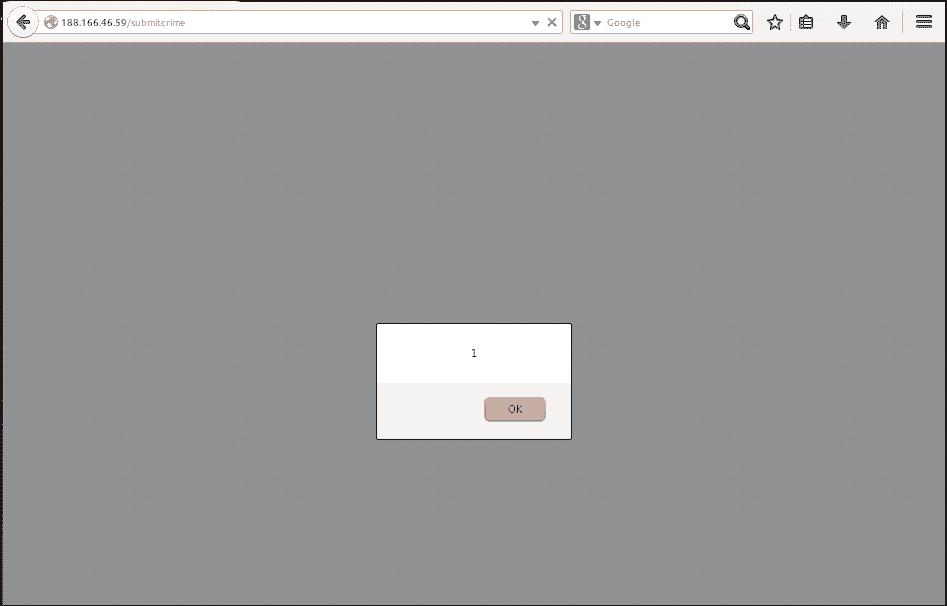
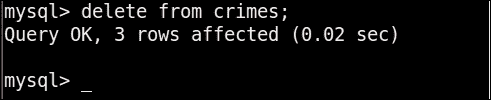
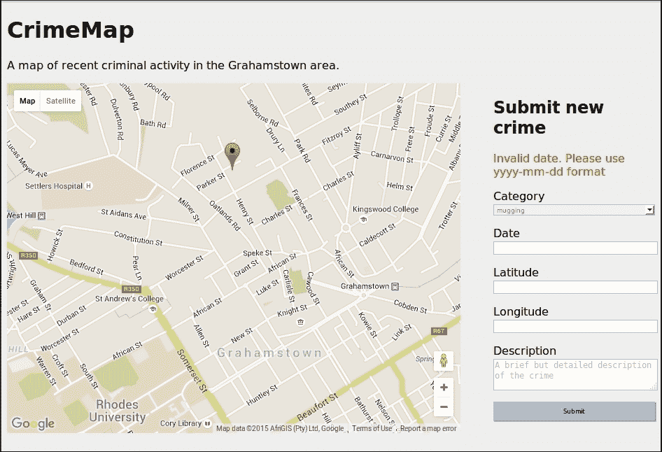

# 第八章：在我们的犯罪地图项目中验证用户输入

用户总是以你意想不到或意料之外的方式使用你的应用程序，无论是出于无知还是恶意意图。用户有任何控制权的输入都应该经过验证，以确保其符合预期。

通过确保用户无法意外或通过恶意输入破坏我们的第二个项目。

在本章中，我们将涵盖以下主题：

+   选择在哪里进行验证

+   尝试 XSS 示例

+   验证和清理

# 选择在哪里进行验证

在验证用户输入和提供帮助他们纠正任何错误的反馈时，有一些选择要做。主要选择是在*哪里*进行验证：在浏览器中，在服务器上，或两者兼顾。

我们可以在用户的浏览器中使用 JavaScript 进行验证。这种方法的优点是用户会得到更快的反馈（他们不必等待将数据发送到我们的服务器，进行验证，然后再发送响应），而且还减轻了我们服务器的负担；如果我们不使用 CPU 周期和网络带宽来验证用户数据，这意味着我们在运行服务器时有更低的成本。这种方法的缺点是我们无法保证用户不会绕过这些检查；如果检查在用户的浏览器中运行，那么用户就完全控制它们。这意味着经过客户端检查验证的数据仍然不能保证是我们期望的。

我们可以在用户提交数据后在服务器上进行验证。这种方法的优缺点与前面描述的相反。我们使用了更多的处理时间，但我们对检查的完整性有额外的保证。另一方面，用户通常需要等待更长时间才能得到有关合法（而非恶意）错误的反馈。

最后的选择是两者兼顾。这样可以让我们兼顾各方面的利益；我们可以在 JavaScript 中快速向用户提供反馈，然后在服务器端重新检查结果，以确保没有绕过客户端检查。另一方面，这样做的缺点是我们最终会浪费 CPU 周期来检查合法数据两次，而且我们还需要在开发中付出更多的努力，因为我们需要在 JavaScript 和 Python 中编写验证检查。

在这个项目中，由于我们将从头开始实现表单管理，我们只会在服务器端进行一些非常基本的检查，而不会在客户端进行检查。在我们下一个项目中，当我们使用框架来处理用户输入时，我们将讨论如何轻松使用一些更复杂的验证方法。

## 识别需要验证的输入

我们已经注意到，并非所有浏览器都支持 HTML5 的`"date"`类型输入。这意味着，就我们的网站而言，一些用户可能会手动输入犯罪日期，这意味着我们需要能够处理用户以各种格式输入日期。我们的数据库期望 yyyy-mm-dd（例如，2015-10-10 代表 2015 年 10 月 10 日），但我们的用户不一定会遵守这个格式，即使我们告诉他们。因此，“日期”字段是我们希望验证的输入之一。

我们的“纬度”和“经度”字段也可以由用户编辑，因此用户可能会在其中输入文本或其他无效的坐标。我们可以为这些字段添加验证检查，但是，由于用户实际上不应该需要编辑这些值，我们将考虑如何将它们设置为*只读*。我们将添加验证检查，以确保用户没有将它们留空。

**描述**是最明显危险的字段。用户可以在这里自由输入文本，这意味着用户有机会*注入*代码到我们的应用中。这意味着用户可以在这里输入干扰我们期望运行的代码的 JavaScript 或 HTML 代码，而不是填写文本描述，正如我们可能期望的那样。这样做将是所谓的 XSS 或跨站点脚本攻击的一个例子，我们将看一些用户可能在这里使用的恶意输入。

我们的最后一个输入是**类别**。这可能看起来非常安全，因为用户必须从下拉列表中进行选择。然而，重要的是下拉列表只是一种便利，实际上，具有一些基本知识的用户也可以在这里使用自由格式的文本。这是因为浏览器使用表单中的信息创建`POST`请求，然后将其发送到我们的服务器。由于`POST`请求只是以某种方式结构化并通过 HTTP 发送的文本，所以我们的技术娴熟的用户可以构造`POST`请求而不使用 Web 浏览器（他们可以使用 Python 或其他编程语言，甚至一些更专门的，但免费提供的软件，如 BURP Suite）。

正如我们所看到的，我们所有的输入都需要以某种形式进行验证。在我们看一下如何验证输入之前，让我们简要看一下如果我们决定不实施验证，恶意用户可能会做些什么。

# 尝试 XSS 示例

恶意用户最渴望的攻击之一是所谓的*持久性* XSS 攻击。这意味着攻击者不仅成功地将代码注入到您的 Web 应用程序中，而且这些注入的代码还会在较长时间内保留。通常情况下，这是通过欺骗应用程序将恶意注入的代码存储在数据库中，然后在后续访问页面时运行代码来实现的。

### 注意

在接下来的示例中，我们将*破坏*我们的应用程序，特定输入到我们的表单。然后，您需要登录到 VPS 上的数据库，手动清除这些使我们的应用程序处于破碎状态的输入。

就我们目前的应用而言，攻击者可以通过填写**类别**、**日期**、**纬度**和**经度**字段，然后在**描述**字段中使用以下内容来进行持久性 XSS 攻击：

```py
</script><script>alert(1);</script>
```

这可能看起来有点奇怪，但试一试。你应该会看到以下内容：



在你点击弹出窗口上的**确定**后，你可能会注意到页面顶部的 JavaScript 代码片段（你的`longitude`值将不同，取决于你放置标记的位置）。

```py
", "longitude": 26.52799}]); } function placeCrimes(crimes) { for (i=0; i
```

让我们看看这里发生了什么。如果我们查看页面的完整源代码，就会更清楚地理解。右键单击页面，然后单击**查看页面源代码**或等效选项。

我们的 JavaScript 代码中`initialize`函数中的`placecrimes()`调用现在看起来如下：

```py
placeCrimes([{"latitude": -33.305645, "date": "2015-10-10", "category": "mugging", "description": "</script><script>alert(1);</script>", "longitude": 26.52799}]);
```

如果您的浏览器使用任何形式的代码高亮，那么更容易看到发生了什么。在我们页面开头附近的开放`<script>`标签现在被我们第一个犯罪的描述所关闭，因为我们的浏览器知道要解释`<script>`和`</script>`之间的任何内容为 JavaScript 代码。由于我们在`"description"`的开头有`</script>`，浏览器关闭了这部分 JavaScript。紧接着，新的 JavaScript 部分由`<script>`打开，这是我们描述的下一部分。接着，我们有`alert(1);`，它只是创建了我们之前注意到的带有**1**的弹出框。这个脚本部分再次关闭，我们页面的其余部分现在被我们的浏览器解释为一团糟。我们可以看到我们 JSON 的其余部分(`"longitude": …` )直到我们`for`循环的一半被显示给用户，而`i<crimes.length`中的"`<`"符号现在被浏览器解释为另一个开放标签，因此随后的 JavaScript 再次被隐藏。

为了修复我们的应用程序，请使用以下命令从数据库中删除所有犯罪数据（您应该在 VPS 上运行这些命令）：

```py
mysql crimemap –p
<your database password>
delete from crimes;

```

您应该看到有关从`crimes`表中删除了多少犯罪记录的消息，类似于以下截图中看到的消息：



## 持久性 XSS 的潜力

我们的网络应用程序出现故障似乎很糟糕。更糟糕的是，重新加载页面并不是一个解决方案。由于恶意描述存储在我们的数据库中，无论我们多少次重新加载页面，都会出现相同的问题。更糟糕的是，"`alert(1);`"示例就是这样一个示例，用来显示攻击者有权利运行任何他或她想要的代码。通常，攻击者利用这一点来诱使用户访问另一个（恶意）页面，因为用户相信原始页面，因此更有可能相信其中的内容。可能性实际上只受到我们攻击者想象力的限制。

# 验证和清理

为了防止上述情况发生，我们已经选择在服务器端检查数据，并确保其符合我们的期望。不过，我们还有一些选择要做。

## 白名单和黑名单

我们需要创建一些规则来选择可接受的输入和不可接受的输入，有两种主要方法可以做到这一点。一种方法是*黑名单*输入看起来恶意。使用这种方法，我们将创建一个可能被恶意使用的字符列表，比如"`<`"和"`>`"，并且我们将拒绝包含这些字符的输入。另一种方法是使用*白名单*方法。这与黑名单相反，我们可以选择一个我们*允许*的字符列表，而不是选择我们不允许的字符。

这似乎是一个微不足道的区别，但它仍然很重要。如果我们选择黑名单方法，我们更有可能被恶意用户智能地使用我们没有添加到禁止列表的字符来注入代码。

另一方面，使用白名单方法，我们更有可能让想要使用我们没有考虑添加到白名单的字符的用户感到沮丧。

由于我们的应用程序只需要一个`"description"`输入来进行自由文本，并且因为我们的应用程序是本地化的（在我们使用的示例中，该应用程序是特定于南非格雷厄姆斯敦，因此我们预计我们的用户只需要普通的拉丁字符，而不是例如中文字符），我们应该能够在不妨碍用户的情况下使用白名单。

## 验证与清理

接下来，我们必须决定如何处理无效输入。我们是完全拒绝它并要求用户重试，还是只剥离用户输入的无效部分并保留其余部分？删除或修改用户输入（例如添加转义字符）被称为*净化*输入。这种方法的优势是用户通常对此毫不知情；如果他或她在犯罪描述中无意中包含特殊字符，而我们将其删除，这不太可能使描述的其余部分变得难以理解或毫无价值。缺点是，如果用户最终依赖我们列入黑名单的太多字符，它可能会使信息损坏到无法使用甚至误解用户的本意。

## 实施验证

考虑到所有前述内容，我们希望：

+   检查用户提交的类别，并确保它在我们期望的类别列表中

+   检查用户提交的日期，并确保我们可以正确理解它作为日期。

+   检查用户提交的纬度和经度，并确保这些可以解析为浮点数

+   检查用户提交的描述，并剥离除了字母数字字符或基本标点字符预选列表之外的所有字符

尽管我们会悄悄编辑“描述”以删除非白名单字符，但如果其他字段不符合我们的预期，我们希望拒绝整个提交并让用户重新开始。因此，我们还希望在用户提交表单后添加一种显示自定义错误消息的方法。让我们添加一些 Python 函数来帮助我们完成所有这些。我们还将重构一些代码以符合*不要重复自己（DRY）*原则。

## 验证类别

以前，当我们为“类别”创建下拉列表时，我们在模板中硬编码了我们想要的两个“类别”。这已经不理想，因为这意味着如果我们想要添加或编辑“类别”，我们必须编写更多样板代码（如 HTML 标记）。现在我们还想在 Python 中访问“类别”列表，以便我们可以验证用户是否偷偷使用了不在我们列表中的类别，因此重构一下是有道理的，这样我们只定义一次我们的“类别”列表。

我们将在 Python 代码中定义列表，然后我们可以将其传递给模板以构建下拉列表，并在用户提交表单时使用相同的列表进行验证。在`crimemap.py`的顶部，与其他全局变量一起，添加以下内容：

```py
categories = ['mugging', 'break-in']
```

在`home()`函数的`return`语句中，将此列表作为命名参数传递。该行现在应该类似于这样：

```py
return render_template("home.html", crimes=crimes, categories=categories)
```

在`home.html`中，更改`<select>`块以使用 Jinja 的`for`循环，如下所示：

```py
<select name="category" id="category">
    
        <option value="{{category}}">{{category}}</option>
    
</select>
```

通过这些小修改，我们有了一种更容易维护我们的“类别”列表的方法。我们现在还可以使用新列表进行验证。由于类别是由下拉列表提供的，普通用户在这里不会输入无效值，因此我们不必太担心提供礼貌的反馈。在这种情况下，我们将忽略提交并再次返回主页。

在`submitcrime()`函数中加载类别数据到变量中的位置下方直接添加以下`if`语句：

```py
category = request.form.get("category")
if category not in categories:
    return home()
```

如果触发了这个“返回”，它会在我们向数据库添加任何内容之前发生，并且我们用户尝试的输入将被丢弃。

## 验证位置

由于我们的位置数据应该由用户在地图上放置的标记自动填充，我们希望将这些字段设置为`readonly`。这意味着我们的 JavaScript 仍然可以修改值，因为标记被使用，但字段将拒绝用户键盘的输入或修改。要做到这一点，只需在`home.html`模板中定义表单的地方添加`readonly`属性。更新后的`input`定义应如下所示：

```py
<label for="latitude">Latitude</label>
<input name="latitude" id="latitude" type="text" readonly>
<label for="longitude">Longitude</label>
<input name="longitude" id="longitude" type="text" readonly>
```

与下拉列表一样，`readonly`属性仅在浏览器级别执行，并且很容易被绕过。因此，我们还希望添加服务器端检查。为此，我们将使用 Python 的哲学“宁可请求原谅，而不是征得许可”，换句话说，假设一切都会没问题，并在`except`块中处理其他情况，而不是使用太多的`if`语句。

如果我们可以将用户的位置数据解析为浮点数，那几乎肯定是安全的，因为只用数字很难做一些事情，比如修改 HTML、JavaScript 或 SQL 代码。在我们解析位置输入的`submitcrime()`函数部分周围添加以下代码：

```py
try:
    latitude = float(request.form.get("latitude"))
    longitude = float(request.form.get("longitude"))
except ValueError:
    return home()
```

如果`latitude`或`longitude`输入中有任何意外的文本，在我们尝试转换为浮点类型时，将抛出`ValueError`，然后我们将返回到主页，而不会将任何潜在危险的数据放入我们的数据库。

## 验证日期

对于`date`输入，我们可以采取与`category`相同的方法。大多数情况下，用户将从日历选择器中选择日期，因此将无法输入无效日期。但是，由于并非所有浏览器都支持`date`输入类型，有时普通用户会手动输入日期，这可能会导致意外错误。

因此，在这种情况下，我们不仅要拒绝无效的输入。我们希望尽可能弄清楚用户的意图，如果我们不能，我们希望向用户显示一条消息，指出需要修复的地方。

为了允许更灵活的输入，我们将使用一个名为`dateparser`的 Python 模块。该模块允许我们将格式不一致的日期转换为准确的 Python `datetime`对象。我们需要做的第一件事是通过`pip`安装它。在本地和 VPS 上运行以下命令：

```py
pip install --user dateparser
```

如果您以前没有使用过它，您可能会喜欢尝试一下它的可能性。以下独立脚本演示了`dateparser`提供的一些魔力：

```py
import dateparser
print dateparser.parse("1-jan/15")
print dateparser.parse("1 week and 3 days ago")
print(dateparser.parse("3/4/15")
```

所有前面的字符串都被正确解析为`datetime`对象，最后一个可能是例外，因为`dateparser`使用美国格式，并将其解释为 2015 年 3 月 4 日，而不是 2015 年 4 月 3 日。

还可以在 PyPI 上找到更多示例以及关于`dateparser`模块的其他信息[`pypi.python.org/pypi/dateparser`](https://pypi.python.org/pypi/dateparser)。

仅使用此软件包将解决我们很多问题，因为我们现在可以将无效输入转换为有效输入，而无需用户的任何帮助。稍微不方便的是，我们已经设置了数据库接受以"*yyyy-mm-dd*"格式插入的日期；但是，为了利用我们的新`dateparser`模块，我们将希望将用户的输入转换为`datetime`对象。稍微反直觉的解决方法是将我们从用户那里收到的字符串输入转换为`datetime`对象，然后再转换为字符串（始终以正确的格式），然后将其传递到我们的数据库代码中存储在 MySQL 中。

首先，在您的`crimemap.py`文件中添加以下辅助函数：

```py
def format_date(userdate):
    date = dateparser.parse(userdate)
    try:
        return datetime.datetime.strftime(date, "%Y-%m-%d")
    except TypeError:
        return None    
```

此外，将`crimemap.py`的顶部添加`datetime`和`dateparser`模块的导入，如下所示：

```py
import datetime
import dateparser
```

我们将通过用户输入的`date`（`userdate`）传递给这个函数，并使用我们的`dateparser`模块进行解析。如果日期完全无法解析（例如，“`aaaaa`”），`dateparser.parse`函数将返回空而不是抛出错误。因此，我们将调用`strftime`，它将以正确的格式将日期格式化为字符串，放入`try except`块中；如果我们的`date`变量为空，我们将得到`TypeError`，在这种情况下，我们的辅助函数也将返回`None`。

现在，我们需要决定如果无法解析日期该怎么办。与我们之前看到的其他验证情况不同，在这种情况下，我们希望向用户提示一条消息，说明我们无法理解他或她的输入。为了实现这一点，我们将在`home()`函数中添加一个错误消息参数，并从`submitcrime()`函数中传递相关的错误消息。修改`home()`函数以添加参数，并将参数传递到我们的模板中，如下所示：

```py
@app.route("/")
def home(error_message=None):
    crimes = DB.get_all_crimes()
    crimes = json.dumps(crimes)
 return render_template("home.html", crimes=crimes, categories=categories, error_message=error_message)

```

然后，修改`submitcrime()`函数，添加一些逻辑来解析用户输入的日期，并在无法解析`date`时向我们的`home()`函数传递错误消息，如下所示：

```py
if category not in categories:
    return home()
date = format_date(request.form.get("date"))
if not date:
 return home("Invalid date. Please use yyyy-mm-dd format")

```

我们还需要在模板文件中添加一个部分来显示错误消息（如果存在的话）。我们将把它添加到表单的顶部，通过以下代码引起用户的注意：

```py
<div id="newcrimeform">
    <h2>Submit new crime</h2>
 
 <div id="error"><p>{{error_message}}</p></div>
 
    <form action="/submitcrime" method="POST">
```

我们将添加前面的`if`语句，否则当`error_message`变量具有默认值`None`时，我们将在表单上方看到单词“`None`”。另外，请注意，消息本身出现在具有 ID 为 error 的`<div>`标签中。这允许我们添加一些 CSS 使错误消息以红色显示。在您的静态目录中的`style.css`文件中添加以下块：

```py
#error {
    color: red;
}
```

这就是我们验证日期的方法。如果您的浏览器不支持`date`输入，请尝试创建一个新的犯罪，并输入一个连`dateparser`也无法解释为合法日期的字符串，以确保您看到预期的错误。它应该看起来类似于以下图片：



### 注意

Flask 提供了一些非常方便的消息*闪烁*功能，即在页面的特定位置显示可选文本。这比我们讨论的基本示例具有更强大和灵活的功能，并且应该在类似的情况下予以考虑。有关 Flask 中消息闪烁的信息可以在[`flask.pocoo.org/docs/0.10/patterns/flashing/`](http://flask.pocoo.org/docs/0.10/patterns/flashing/)找到。

## 验证描述

我们可以假设用户只能使用数字、字母（大写和小写）和一些基本的标点符号来传达有关犯罪的基本信息，因此让我们创建一个简单的 Python 函数，过滤掉除了我们已确定为安全的字符之外的所有字符。在您的`crimemap.py`文件中添加以下`sanitize()`函数：

```py
def sanitize_string(userinput):
    whitelist = string.letters + string.digits + " !?$.,;:-'()&"
    return filter(lambda x: x in whitelist, userinput)
```

然后，在`crimemap.py`的导入部分添加字符串的导入，如下所示：

```py
import string
```

我们的`sanitize_string()`函数非常简洁，并使用了 Python 的一些函数式编程潜力。`filter`函数对列表中的每个元素重复应用另一个函数，并基于“通过”的元素构建一个新列表。在这种情况下，我们将传递给`filter()`的函数是一个简单的`lambda`函数，用于检查字母是否属于我们的白名单。我们函数的结果是一个类似于输入的字符串，但删除了不属于我们白名单的所有字符。

我们的白名单是由所有字母（大写和小写）、数字一到九以及一些基本的标点符号构建而成，人们在输入事件的非正式描述时可能会使用这些标点符号。

要使用我们的新函数，只需将`crimemap.py`中`submitcrime()`函数末尾的行从以下内容更改为以下内容：

```py
description = request.form.get("description")
description = sanitize_string(request.form.get("description"))
```

请注意，由于我们的 SQL 驱动程序可以减轻 SQL 注入，而我们的`json.dumps()`函数可以转义双引号，因此我们只需在黑名单中列出一些字符，比如尖括号，我们就可以基本上安全了，我们用它来演示 XSS 攻击。这将为我们的用户提供更多的灵活性，但是恶意用户可能会决心并且有创造力地制作输入，以绕过我们设置的过滤器。参考[`www.owasp.org/index.php/XSS_Filter_Evasion_Cheat_Sheet`](https://www.owasp.org/index.php/XSS_Filter_Evasion_Cheat_Sheet)获取一些例子。首先在本地尝试验证更改，然后，如果一切看起来都很好，就提交到`git`，将存储库推送到远程，并将其拉到 VPS 上。重新启动 Apache 并访问您的 IP 地址。尝试在`description`中提交一个使用`</script>`的犯罪，当您将光标悬停在这个犯罪的标记上时，您会注意到我们存储的只是"`script`"。我们将删除斜杠和尖括号，从而确保防止 XSS 攻击。

我们已经讨论了黑名单和白名单的利弊，但是为了强调白名单并不是一个完美的方法，看一下这里关于开发人员在为用户的名称设置白名单时经常犯的错误的帖子：[`www.kalzumeus.com/2010/06/17/falsehoods-programmers-believe-about-names/`](http://www.kalzumeus.com/2010/06/17/falsehoods-programmers-believe-about-names/)

我们可以对我们的`dbhelper.py`、`mockdbhelper.py`和`crimemap.py`文件进行的最后一个更改是删除我们不再需要的函数。当我们有一个不特定于犯罪的基本数据库应用程序时，我们在我们的`DBHelper`类中有`get_all_inputs()`、`add_input()`和`clear_all()`函数，在我们的`crimemap.py`文件中有`add()`和`clear()`函数。所有这些都可以被移除。

# 总结

我们已经花了一整章的时间来研究验证，但是如果你看一下过去几年面临信息安全漏洞的主要公司，你会同意安全是值得花一些时间的。我们特别关注了跨站脚本攻击或 XSS 攻击，但我们也讨论了一些更一般的输入验证要点。这让我们来到了我们第二个项目的结束。

一个明显缺失的事情是弄清楚是谁添加了哪些犯罪。如果一个恶意用户向我们的数据库添加了一堆虚假的犯罪，他们可能会搞乱我们整个数据集！

在我们的下一个项目中，我们将研究通过用户帐户控制系统对用户进行身份验证，这将使我们对我们允许在我们的网站上的用户以及他们可以做什么有更多的控制。
