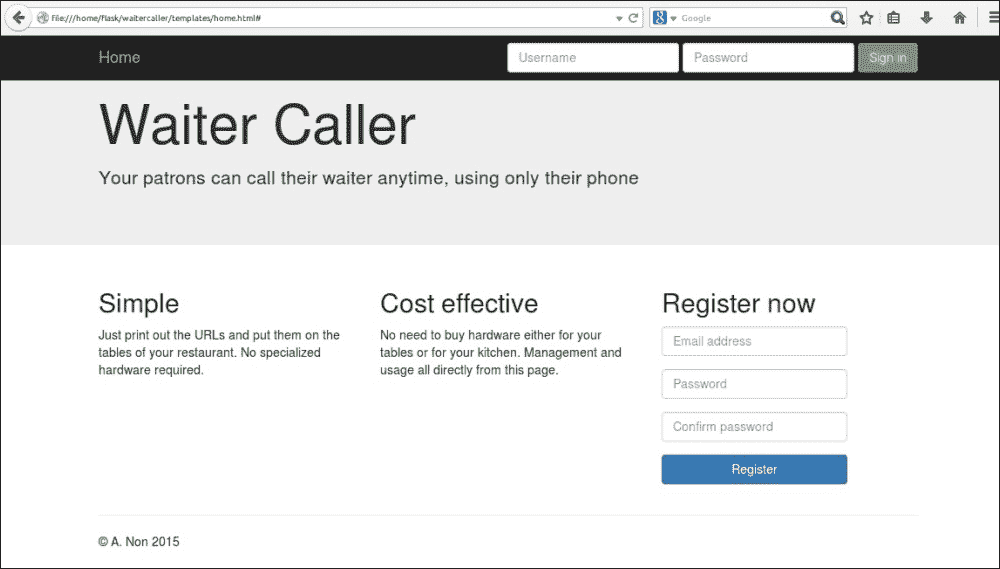
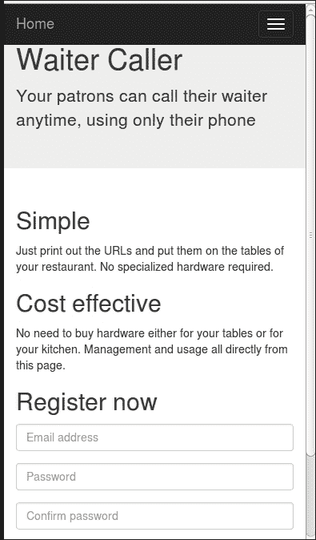
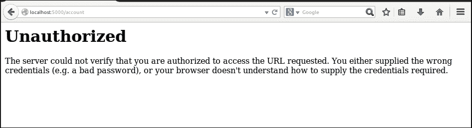
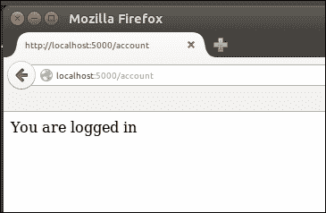
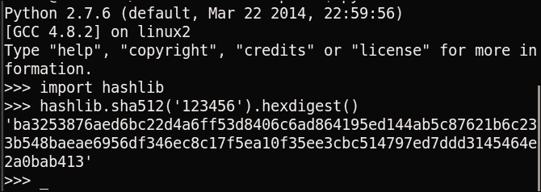
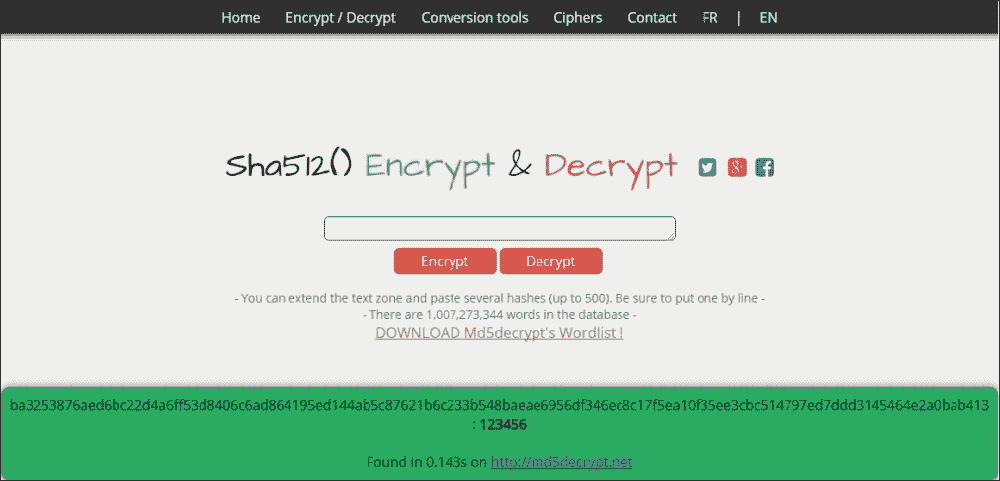

# 第九章：建立服务员呼叫应用程序

在经历了头条项目之后，你学习了 Flask 的基础知识，以及 Crimemap 项目，其中你学习了一些更有用的 Flask 功能，比如如何使用数据库和如何编写一些基本的 JavaScript 代码，我们现在准备进行我们迄今为止最复杂的项目！我们将建立一个服务员呼叫网络应用程序，允许餐厅顾客轻松地呼叫服务员到他们的桌子上。餐厅经理将能够轻松注册并开始使用我们的应用程序，而无需投资昂贵的硬件。

我们将深入研究 Flask 世界，看看一些 Flask 扩展，帮助我们进行用户账户控制和网络表单，并且我们还将看看如何在 Jinja 中使用模板继承。我们还将使用 Bootstrap 前端框架，这样我们就不必从头开始编写太多 HTML 和 CSS 代码。

与我们之前应用程序使用的 MySQL 数据库相比，我们将看看一个有争议的替代方案：MongoDB。MongoDB 是一个 NoSQL 数据库，这意味着我们在其中不处理表、行和列。我们还将讨论这究竟意味着什么。

对于服务员来说，最困难的任务之一就是知道顾客需要什么。要么顾客抱怨等待服务员来询问甜点选择的时间太长，要么他们抱怨服务员不断打断对话来询问一切是否顺利。为了解决这个问题，一些餐厅在每张桌子上安装了专用按钮，当按下时，通知服务员需要他的注意。然而，对于规模较小的餐厅来说，专门硬件和安装的成本是不可承受的，对于规模较大的餐厅来说，这往往只是太麻烦了。

在我们现代的时代，几乎所有的餐厅顾客都有智能手机，我们可以利用这一事实为餐厅提供一个成本更低的解决方案。当顾客需要服务时，他们只需在手机上访问一个简短的 URL，服务员就会在一个集中的屏幕上收到通知。

我们希望该应用程序允许多个不相关的餐厅使用同一个网络应用程序，因此每个餐厅都应该有我们系统的私人登录账户。我们希望餐厅经理能够轻松设置；也就是说，当一个新餐厅加入系统时，我们作为开发人员不需要参与其中。

我们应用程序所需的设置如下：

+   餐厅经理在我们的网络应用程序上注册一个新账户

+   餐厅经理提供了关于餐厅有多少张桌子的基本信息

+   网络应用程序为每张桌子提供一个独特的 URL

+   餐厅经理打印出这些 URL，并确保相关的 URL 可以轻松从每张桌子上访问

我们的应用程序使用应该具有以下功能：

+   餐厅员工应该能够从一个集中的屏幕登录到网络应用程序并看到一个简单的通知页面。

+   一些顾客希望通过智能手机获得服务，并访问与他们的桌子相关的 URL，因此这应该是可能的。

+   服务员应该实时看到通知出现在一个集中的屏幕上。然后服务员会在屏幕上确认通知并为顾客提供服务。

+   如果在第一个通知被确认之前出现更多通知，后来的通知应该出现在先前的通知下方。

在接下来的三章中，我们将实现一个具有所有前述功能的 Flask 应用程序。我们将拥有一个数据库，用于存储注册使用我们的应用程序的所有个别餐厅的帐户信息，以便我们可以为每个餐厅单独处理顾客的请求。顾客将能够发出请求，这些请求将在数据库中注册，而餐厅工作人员将能够查看他们餐厅的当前关注请求。我们将构建一个用户帐户控制系统，以便餐厅可以为我们的应用程序拥有自己的受密码保护的帐户。

首先，我们将设置一个新的 Flask 应用程序、Git 存储库和 Apache 配置来提供我们的新项目。我们将引入 Twitter 的 Bootstrap 框架作为我们在前端使用的框架。我们将下载一个基本的 Bootstrap 模板作为我们应用程序前端的起点，并对其进行一些更改以将其整合到一个基本的 Flask 应用程序中。然后，我们将设置一个用户帐户控制系统，允许用户通过提供电子邮件地址和密码在我们的应用程序中注册、登录和注销。

在本章中，我们将涵盖以下主题：

+   设置新的`git`存储库

+   使用 Bootstrap 启动我们的应用程序

+   将用户帐户控制添加到我们的应用程序

# 设置新的 Git 存储库

与以前一样，我们需要创建一个新的`git`存储库来托管我们的新项目。第一步是登录 BitBucket 或您正在使用的任何代码存储库主机的 Web 界面，选择**创建新存储库**选项，并选择**Git**单选按钮，注意它提供给您的 URL。由于接下来的步骤与以前的项目相同，我们只会给您一个摘要。如果您需要更详细的指导，请参考第一章 *安装和使用 git*部分，*你好，世界！*。

## 在本地设置新项目

为了设置本地项目结构，请在本地运行以下命令：

```py
mkdir waitercaller
cd waitercaller
git init
git remote add origin <new-repository-url>
mkdir templates
mkdir static
touch waitercaller.py
touch templates/home.html
touch .gitignore

```

我们希望为这个项目获得最小的运行应用程序，以便在开始开发之前解决任何配置问题。将以下内容添加到您的`waitercaller.py`文件中：

```py
from flask import Flask

app = Flask(__name__)

@app.route("/")
def home():
   return "Under construction"

if __name__ == '__main__':
    app.run(port=5000, debug=True)
```

然后，使用以下命令将项目概述推送到存储库：

```py
git add .
git commit –m "Initial commit"
git push origin master

```

## 在我们的 VPS 上设置项目

在您的 VPS 上，运行以下命令来克隆存储库，并设置 Apache2 以将我们的新项目作为默认网站提供服务：

```py
cd /var/www/
git clone <new-repository-url>
cd waitercaller
nano waitercaller.wsgi

```

将以下代码添加到我们最近创建的`.wsgi`文件中：

```py
import sys
sys.path.insert(0, "/var/www/waitercaller")
from waitercaller import app as application
```

现在，按下*Ctrl* + *X*，并在提示时选择*Y*退出 Nano。

最后，通过运行以下命令创建 Apache 配置文件：

```py
cd /etc/apache2/sites-available
nano waitercaller.conf

```

将以下配置数据添加到我们刚创建的`waitercaller.conf`文件中：

```py
<VirtualHost *>

    WSGIScriptAlias / /var/www/waitercaller/waitercaller.wsgi
    WSGIDaemonProcess waitercaller
    <Directory /var/www/waitercaller>
       WSGIProcessGroup waitercaller
       WSGIApplicationGroup %{GLOBAL}
        Order deny,allow
        Allow from all
    </Directory>
</VirtualHost>
```

退出 Nano，保存新文件。现在，为了禁用我们的`crimemap`项目作为默认站点，并启用我们的新项目，运行以下命令：

```py
sudo a2dissite crimemap.conf
sudo a2ensite waitercaller.conf
sudo service apache2 reload

```

通过在 Web 浏览器中访问您的 VPS 的 IP 地址来验证一切是否正常。您应该看到**正在建设中**字符串。如果事情不如预期那样工作，请再次查看您的配置和日志文件。

# 使用 Bootstrap 启动我们的应用程序

在我们以前的项目中，我们花了相当多的时间在前端工作上，摆弄 CSS 和 HTML，并且甚至没有触及到 Web 应用程序开发人员需要注意的一些前端问题，比如确保我们的内容在任何操作系统上的任何浏览器上的所有屏幕尺寸的所有设备上看起来好看并且功能正常。浏览器和设备的多样性以及它们各自实现某些 JavaScript、HTML 和 CSS 功能的不一致方式是 Web 开发的最大挑战之一，没有解决问题的银弹。然而，像 Bootstrap 这样的前端框架可以减轻一些痛苦，为开发人员提供改进用户体验的捷径。

## 介绍 Bootstrap

Bootstrap 由 Twitter 开发，并在开放许可下发布。它可以极大地加快 CSS 开发，因为它为不同的 HTML 布局和表单输入提供了许多样式。它还可以提供*响应性*；也就是说，它可以根据用户设备的屏幕大小自动更改某些元素的布局。我们将在本章后面讨论这对我们和这个项目的确切意义。

### 注意

Bootstrap 受到了一些批评，但它仍然保持着它的流行度。有许多具有不同优势和劣势的替代品。随着现代网页开发的快速发展，也会定期出现许多新的框架。现有的框架经常会进行重大更新，并且不提供向旧版本的向后兼容性。对于重要的生产网页应用程序，当前研究什么最适合这个项目的特定需求总是至关重要的。

Bootstrap 的主要提供的是可重复使用的 CSS 和 JavaScript 模块。我们主要会用它的 CSS 组件。

查看 Bootstrap 的主页[`getbootstrap.com/`](http://getbootstrap.com/)，以及子页面[`getbootstrap.com/getting-started/#examples`](http://getbootstrap.com/getting-started/#examples)和[`getbootstrap.com/components/`](http://getbootstrap.com/components/)，以了解 Bootstrap 提供了什么。

与从头开始编写 CSS 不同，Bootstrap 允许我们使用各种输入、图标、导航栏和其他经常需要的网站组件，默认情况下看起来很好。

## 下载 Bootstrap

有几种安装 Bootstrap 的方法，但要记住 Bootstrap 可以被视为一组 JavaScript、CSS 和图标文件的集合，我们不会做太复杂的事情。我们可以简单地下载编译后的代码文件的`.zip`文件，并在我们的本地项目中使用这些文件。我们将在我们的`git`存储库中包含 bootstrap，因此无需在我们的 VPS 上安装它。执行以下步骤：

1.  转到[`getbootstrap.com/getting-started/#download`](http://getbootstrap.com/getting-started/#download)，选择**下载 Bootstrap**选项，这应该是已编译和压缩的版本，没有文档。

1.  解压您下载的文件，您会发现一个名为`bootstrap-3.x.x`的单个目录（这里，重复的字母 x 代表包含的 Bootstrap 版本的数字）。在目录内，可能会有一些子目录，可能是`js`、`css`和`fonts`。

1.  将`js`、`css`和`fonts`目录复制到`waitercaller`项目的`static`目录中。您的项目现在应该具有以下结构：

```py
waitercaller/
templates
    home.html
static
    css/
    fonts/
    js
.gitignore
waitercaller.py
```

由于定期的 Bootstrap 更新，我们在附带的代码包中包含了 Bootstrap 3.3.5 的完整代码副本（在撰写本书时的最新版本）。虽然最新版本可能更好，但它可能与我们提供的示例不兼容。您可以选择使用我们提供的版本来测试，知道示例应该按预期工作，或者直接尝试适应更新的 Bootstrap 代码，必要时尝试适应示例。

### Bootstrap 模板

Bootstrap 强烈鼓励用户构建定制的前端页面，而不是简单地使用现有的模板。你可能已经注意到很多现代网页看起来非常相似；这是因为前端设计很困难，人们喜欢走捷径。由于本书侧重于 Flask 开发，我们也会采取一些前端的捷径，并从 Bootstrap 提供的示例模板文件开始。我们将使用的模板文件可以在[`getbootstrap.com/examples/jumbotron/`](http://getbootstrap.com/examples/jumbotron/)中找到，我们项目的适配可以在本章的附带代码包中的`tempates/home.html`中找到。你可以注意到这两个文件的相似之处，我们并没有做太多的工作来获得一个基本的网页，看起来也很好。

从代码包中的`templates/home.html`文件中复制代码到您之前创建的项目目录中的相同位置。如果您在`static`文件夹中正确地包含了所有的 Bootstrap 文件，直接在 Web 浏览器中打开这个新文件将会得到一个类似于以下屏幕截图的页面。（请注意，在这个阶段，我们仍然使用纯 HTML，没有使用 Jinja 功能，所以您可以直接在 Web 浏览器中打开文件，而不是从 Flask 应用程序中提供服务。）



我们可以注意到，我们可以用很少的代码实现输入、标题、导航栏和 Jumbotron（靠近顶部的灰色条，上面有超大的**服务员呼叫**文本）的样式的优势。然而，使用 Bootstrap 最显著的节省时间的元素可能是我们网站的*响应性*。Bootstrap 基于网格布局，这意味着网格的不同元素可以重新排列以更好地适应任何设备。注意模板中的 HTML 的这一部分：

```py
<div class="row">
 <div class="col-md-4">
 <h2>Simple</h2>

```

一个`"row"`有 12 列的空间。我们的 Jumbotron 下面的三个主要内容元素每个占据四列，因此填满了整行（*4 x 3 = 12*）。我们使用`class="col-md-4"`属性来指定这一点。可以将其视为大小为四的中等（`md`）列。您可以在[`getbootstrap.com/css/`](http://getbootstrap.com/css/)上阅读有关网格系统如何工作的更多信息，并查看一些示例。

在前面的屏幕截图中还有一些看起来没有使用的代码，类似于这样：

```py
<button type="button" class="navbar-toggle collapsed" data- toggle="collapse" data-target="#navbar" aria-expanded="false" aria-controls="navbar">

```

前面的两个摘录可能是使我们的网络应用程序响应的最重要的组成部分。要理解这意味着什么，可以在页面打开时调整浏览器窗口大小。这模拟了我们的页面在较小设备上（如手机和平板电脑）上的显示方式。它应该看起来类似于以下的屏幕截图：



我们可以注意到，我们使用 Bootstrap 网格功能的三个主要内容元素现在排列在彼此下方，而不是并排。这对于较小的设备来说是理想的，用户更习惯于向下滚动，而不是在侧边寻找更多的内容。我们的导航栏也变得更加简洁，登录输入现在被隐藏了。

这些可以通过选择右上角的*汉堡包*图标来显示；这是一个有争议但非常普遍的网页开发元素。大多数用户本能地知道他们可以触摸图标以获得某种形式的菜单或扩展，但是有许多批评使用这种技术。目前，我们只接受这种正常的做法，不去深究它背后的问题。这绝对比尝试在任何屏幕大小上显示完全相同的内容，并且让我们的用户根据需要逐个部分地放大页面要好得多。

# 向我们的应用程序添加用户帐户控制

对于用户帐户控制，预期用户将使用密码登录和进行身份验证。例如，当您登录到您的网络邮件帐户时，您在访问页面时输入密码。此后，所有您的操作都将被视为经过身份验证；也就是说，当您发送电子邮件时，您不必再次输入密码。网络邮件客户端*记住*您已登录，因此允许您完成某些操作。

然而，HTTP 是一种无状态协议，这意味着我们无法直接知道登录的用户是否是发送电子邮件请求的同一用户。为了解决这个问题，我们将在用户最初登录时给用户一个 cookie，然后用户的浏览器将在*每个*后续请求中将此 cookie 发送给我们。我们将使用我们的数据库来跟踪当前已登录的用户。这使我们能够在每个请求中对用户进行身份验证，而无需多次请求用户的密码。

我们可以使用 Flask cookie 从头开始实现这一点，方式类似于我们在 Headlines 项目中看到的方式。但是，我们需要实现许多步骤，例如选择应用程序中哪些页面需要身份验证，并确保 cookie 是安全的，并参与决定在 cookie 中存储什么信息。

相反，我们将提高一级抽象，并使用`Flask-Login`扩展。

## 介绍 Flask-Login

`Flask-Login`是一个 Flask 扩展，实现了所有用户帐户控制系统所需的基础工作。要使用此功能，我们需要通过`pip`安装它，然后创建一个遵循特定模式的用户类。您可以在[`flask-login.readthedocs.org/en/latest/`](https://flask-login.readthedocs.org/en/latest/)找到`Flask-Login`的摘要以及全面的文档。

## 安装和导入 Flask-Login

要安装`Flask-Login`，运行以下命令：

```py
pip install --user flask-login

```

与我们安装的所有 Python 模块一样，请记住在本地和 VPS 上都要这样做。

首先，我们将添加可能的最基本的登录功能。我们的应用程序将为经过身份验证的用户显示**您已登录**，但未输入正确密码的用户将无法看到消息。

## 使用 Flask 扩展

当我们安装 Flask 扩展时，我们可以通过`flask.ext`路径自动访问它们。我们将从`Flask-Login`扩展中使用的第一个类是所谓的`LoginManager`类。我们还将使用`@login_required`装饰器指定哪些路由受限于已登录用户。将以下导入添加到您的`waitercaller.py`文件中：

```py
from flask.ext.login import LoginManager
from flask.ext.login import login_required
```

现在，我们需要将扩展连接到我们的 Flask 应用程序。在我们使用更多 Flask 扩展时将变得熟悉的模式中，将以下行直接添加到`waitercaller.py`中创建`app`变量的位置下面：

```py
app = Flask(__name__)
login_manager = LoginManager(app)

```

我们实例化的`LoginManager`类现在引用了我们的应用程序。我们将使用这个新的`LoginManager`类来管理我们应用程序的登录。

## 添加受限路由

现在，让我们在`/account`上为我们的应用程序添加一个路由，并确保只有经过身份验证的用户才能查看此页面。这一步的简单部分是确保*非*经过身份验证的用户*不能*看到页面，因此我们将从这里开始。

首先，我们希望我们的应用程序默认呈现我们的 Bootstrap 模板。将以下路由添加到`waitercaller.py`文件中：

```py
@app.route("/")
def home():
    return render_template("home.html")
```

现在，我们将添加一个受限路由，未登录的用户无法看到。将以下函数添加到`waitercaller.py`：

```py
@app.route("/account")
@login_required
def account():
   return "You are logged in"
```

请注意，我们正在使用`@login_required`装饰器。类似于`@app.route`装饰器，这是一个接受下面的函数作为输入并返回修改后的函数的函数。在这种情况下，它不是路由魔法，而是验证用户是否已登录，如果没有，它将重定向用户到一个**未经授权**页面，而不是返回我们在`return`语句中指定的内容。重要的是`@app.route`装饰器首先出现，`@login_required`装饰器在其下面，就像前面的例子一样。

### 注意

在浏览网页时，你可能会有时看到**404 页面未找到**错误。虽然**404**尤为臭名昭著，但有许多错误代码是 HTTP 规范的一部分。不同的浏览器在接收到这些错误时可能会显示不同的默认错误消息，也可以定义自定义错误页面在指定错误发生时显示。

由于我们还没有设置任何登录逻辑，没有用户应该能够验证并查看我们创建的新路由。在本地启动你的 Flask 应用程序，尝试访问`localhost:5000/account`的账户路由。如果一切顺利，你应该会看到类似以下截图的未经授权的错误消息：



## 验证用户

互联网可能是一个黑暗和可怕的地方。这就是为什么你需要在许多网络应用程序中输入密码；密码证明你是你所声称的人。通过告诉我们只有你知道的东西，网络应用程序知道你是“你”，而不是冒名顶替者。

实现密码检查系统的最简单方法是在数据库中存储与用户名关联的密码。当用户登录时，你需要首先验证用户名是否存在，如果存在，你需要验证用户刚刚给出的密码是否与注册时使用的密码匹配。

实际上，这是一个糟糕的主意。数据库可能被任意数量的人访问，包括运行网络应用程序的公司的员工，可能还有黑客。相反，我们最终将存储用户密码的加密哈希；但是现在，为了确保我们的登录系统正常工作，我们将使用明文密码。

我们将建立一个模拟数据库，这个数据库与我们在犯罪地图项目中使用的数据库非常相似，并检查是否允许模拟用户查看我们的“账户”页面，只有在输入正确的密码时才允许。

### 创建一个用户类

由于我们正在使用`Flask-Login`模块，我们需要创建一个符合严格格式的`User`类。`Flask-Login`足够灵活，可以允许一些更高级的登录功能，比如区分*活跃*和*非活跃*账户以及匿名用户。我们不会使用这些功能，但我们需要创建一个能够与`Flask-Login`一起工作的`User`类，因此我们将有一些看起来多余的方法。

在你的`waitercaller`目录中创建一个名为`user.py`的新文件。将以下代码添加到其中：

```py
class User:
   def __init__(self, email):
      self.email = email

   def get_id(self):
      return self.email

   def is_active(self):
      return True

   def is_anonymous(self):
      return False

   def is_authenticated(self):
      return True
```

`Flask-Login`要求我们在我们的`User`类中实现一个`get_id()`方法，返回用户的唯一标识符。我们将使用用户的电子邮件地址，因此在`get_id()`函数中，我们可以简单地返回它。

我们将把所有用户视为活跃账户；因此，在这个方法中，我们将简单地返回`True`。对于`is_anonymous()`函数也是如此；虽然这也是必需的，但我们不会在我们的应用程序中处理匿名登录的概念，所以我们将始终返回`False`。

最后一个函数可能看起来有点奇怪；我们将始终为`is_authenticated()`返回`True`。这是因为只有在输入正确的用户名和密码组合时才会创建用户对象，所以如果用户对象存在，它将被验证。

## 模拟我们的用户数据库

我们将再次创建一个`MockDBHelper`类，并创建一个配置文件，指示在测试应用程序时应在本地使用它，而不需要访问数据库。它需要有一个函数，接受用户名和密码，并检查它们是否存在于数据库中，并且彼此关联。

首先，在您的`waitercaller`目录中创建一个名为`mockdbhelper.py`的文件，并添加以下代码：

```py
MOCK_USERS = {'test@example.com': '123456'}

class MockDBHelper:

   def get_user(self, email):
      if email in MOCK_USERS:
         return MOCK_USERS[email]
      return None
```

在顶部，我们有一个充当数据库存储的字典。我们有一个单独的`get_user()`方法，检查用户是否存在于我们的数据库中，并在存在时返回密码。

现在，在`waitercaller`目录中创建一个`config.py`文件，并添加以下单行：

```py
test = True
```

与上一个项目一样，此文件将让我们的应用程序知道它是在我们的测试（本地）环境中运行还是在我们的生产（VPS）环境中运行。与以前的项目不同，我们将稍后向此文件添加其他不涉及数据库的信息，这就是为什么我们将其称为`config.py`而不是`dbconfig.py`。我们不希望将此文件检入我们的`git`存储库，因为它在我们的 VPS 上会有所不同，并且还将包含我们不希望存储的敏感数据库凭据；因此，在您的`waitercaller`目录中创建一个`.gitignore`文件，并添加以下行：

```py
config.py
*.pyc
```

## 登录用户

我们的模板已经设置了一个登录表单，允许用户输入电子邮件和密码。现在，我们将设置功能，允许我们输入并检查此表单中的输入是否与我们的模拟数据库匹配。如果我们输入的电子邮件和密码存在于我们的模拟数据库中，我们将登录用户并允许访问我们的`/account`路由。如果不是，我们将重定向回主页（我们将在下一章节的*使用 WTForms 添加用户反馈*部分中查看向输入无效信息的用户显示反馈）。

### 添加导入和配置

我们需要导入`Flask-Login`扩展的`login_user`函数，以及我们的新`User`类代码和数据库助手。在`waitercaller.py`的导入中添加以下行：

```py
from flask.ext.login import login_user

from mockdbhelper import MockDBHelper as DBHelper
from user import User
```

由于目前除了我们的模拟数据库助手外，我们没有其他数据库助手，所以我们将始终导入模拟数据库助手。稍后，我们将使用`config.py`中的值来决定要`import`哪个数据库助手-真实的还是模拟的，就像我们在以前的项目中所做的那样。

我们还需要创建一个`DBHelper`全局类，以便我们的应用程序代码可以轻松地与我们的数据库交流。在`waitercaller.py`的导入部分下面添加以下行：

```py
DB = DBHelper()
```

最后，我们还需要为我们的应用程序配置一个秘密密钥。这用于对`Flask-Login`在用户登录时分发的会话信息 cookie 进行加密签名。签署 cookie 可以防止用户手动编辑它们，有助于防止欺诈登录。对于这一步，您应该创建一个长而安全的秘密密钥；您永远不必记住它，所以不要把它当作密码或口令来考虑。尽管随机按键盘应该足够，但人类通常很难创建无偏见的随机性，因此您也可以使用以下命令使用`/dev/urandom`创建一个随机字符串（将`100`更改为您想要的字符数）：

```py
cat /dev/urandom | base64 | head -c 100 ; echo

```

一旦您有了一长串随机字符，将以下行添加到您的`waitercaller.py`文件中，在您声明`app`变量的位置下，用您自己的随机字符替换它：

```py
app.secret_key = 'tPXJY3X37Qybz4QykV+hOyUxVQeEXf1Ao2C8upz+fGQXKsM'
```

### 添加登录功能

登录用户有两个主要部分需要考虑。第一部分是用户输入电子邮件地址和密码进行身份验证，第二部分是用户通过发送所需的 cookie 进行身份验证，即他或她仍然处于与成功登录完成时相同的浏览器*会话*中。

#### 编写登录功能

我们已经为第一个案例创建了登录路由的存根，现在，我们将稍微完善一下，检查输入信息与我们的数据库匹配，并使用`Flask-Login`来登录用户，如果电子邮件和密码匹配的话。

我们还将介绍一种更清晰的方式，从一个单独的 Flask 路由调用另一个。将以下行添加到`waitercaller.py`的导入部分：

```py
from flask import redirect
from flask import url_for
```

第一个函数接受一个 URL，并为一个简单重定向用户到指定 URL 的路由创建一个响应。第二个函数从一个函数名构建一个 URL。在 Flask 应用程序中，你经常会看到这两个函数一起使用，就像下面的例子一样。

在`waitercaller.py`中编写登录函数，以匹配以下代码：

```py
@app.route("/login", methods=["POST"])
def login():
   email = request.form.get("email")
   password = request.form.get("password")
   user_password = DB.get_user(email)
   if user_password and user_password == password:
      user = User(email)
      login_user(user)
      return redirect(url_for('account'))
   return home()
```

我们还需要为`request`库添加`import`。将以下行添加到`waitercaller.py`的`import`部分：

```py
from flask import request 
```

我们将用户的输入加载到`email`和`password`变量中，然后将存储的密码加载到`user_password`变量中。`if`语句很冗长，因为我们明确验证了是否返回了密码（也就是说，我们验证了用户是否存在），以及密码是否正确，尽管第二个条件暗示了第一个条件。稍后，我们将讨论在向用户提供反馈时区分这两个条件的权衡。

如果一切有效，我们将从电子邮件地址创建一个`User`对象，现在使用电子邮件地址作为 Flask 登录所需的唯一标识符。然后，我们将把我们的`User`对象传递给`Flask-Login`模块的`login_user()`函数，以便它可以处理认证操作。如果登录成功，我们将重定向用户到账户页面。由于用户现在已经登录，这将返回`"You are logged in"`字符串，而不是之前得到的`"Unauthorized"`错误。

请注意，我们将使用`url_for()`函数为我们的账户页面创建一个 URL。我们将把这个结果传递给`redirect()`函数，以便用户从`/login`路由被带到`/account`路由。这比简单地使用以下方式更可取：

```py
return account()
```

我们的意图更加明确，用户将在浏览器中看到正确的 URL（也就是说，两者都会把用户带到`/account`页面），但如果我们不使用`redirect()`函数，即使在`/account`页面上，浏览器中仍然会显示`/login`。

#### 创建`load_user`函数

如果用户已经登录，他们的浏览器将通过`Flask-Login`在我们调用`login_user`函数时给他们的 cookie 发送信息。这个 cookie 包含了我们在创建`User`对象时指定的唯一标识符的引用，即在我们的情况下是电子邮件地址。

`Flask-Login`有一个现有的函数，我们称之为`user_loader`，它将为我们处理这个问题；我们只需要将它作为我们自己的函数的装饰器，检查数据库以确保用户存在，并从我们得到的标识符创建一个`User`对象。

将以下函数添加到你的`waitercaller.py`文件中：

```py
@login_manager.user_loader
def load_user(user_id):
    user_password = DB.get_user(user_id)
    if user_password:
       return User(user_id)
```

装饰器指示`Flask-Login`这是我们要用来处理已经分配了 cookie 的用户的函数，每当一个用户访问我们的网站时，它都会把 cookie 中的`user_id`变量传递给这个函数，这个用户已经有了一个。类似于之前的操作，我们将检查用户是否在我们的数据库中（如果`user_id`无效，`user_password`将为空），如果是，我们将重新创建`User`对象。我们永远不会显式调用这个函数或使用结果，因为它只会被`Flask-Login`代码使用，但是如果我们的应用程序通过我们的`login()`函数给用户分配了一个 cookie，当用户访问网站时`Flask-Login`找不到这个`user_loader()`函数的实现，我们的应用程序将抛出一个错误。

在这一步中检查数据库似乎是不必要的，因为我们给用户一个据称是防篡改的令牌，证明他或她是一个有效的用户，但实际上是必要的，因为自用户上次登录以来数据库可能已经更新。如果我们使用户的会话令牌有效时间很长（回想一下，在我们的 Headlines 项目中，我们让 cookies 持续了一年），那么用户的帐户在分配 cookie 后可能已经被修改或删除。

### 检查登录功能

是时候尝试我们的新登录功能了！在本地启动`waitercaller.py`文件，并在 Web 浏览器中访问`localhost:5000`。在我们的模拟数据库中输入电子邮件 ID`test@example.com`和密码`123456`，然后点击登录按钮。您应该会被重定向到`http://localhost:5000/account`，并看到**您已登录**的消息。

关闭浏览器，然后重新打开，这次直接访问`localhost:5000/account`。由于我们没有告诉`Flask-Login`记住用户，您现在应该再次看到**未经授权**的错误。

由于我们应用程序的性质，我们预计大多数用户都希望保持登录状态，以便餐厅员工可以在早上简单地打开页面并立即使用功能。`Flask-Login`使这个改变非常简单。只需更改`login()`函数中的以下行：

```py
 login_user(user)
```

您的新`login()`函数现在应该是这样的：

```py
login_user(user, remember=True)
```

现在，如果您重复前面的步骤，即使重新启动浏览器，您也应该看到**您已登录**的消息，如下面的屏幕截图所示：



现在我们可以登录用户，让我们看看如何让用户注销。

## 注销用户

`Flask-Login`提供了一个直接可用的注销功能。我们所要做的就是将其链接到一个路由上。在您的`waitercaller.py`文件中添加以下路由：

```py
@app.route("/logout")
def logout():
   logout_user()
   return redirect(url_for("home"))
```

然后，在`waitercaller.py`的导入部分添加`logout_user()`函数的`import`：

```py
from flask.ext.login import logout_user
```

请注意，在此调用中不需要将`User`对象传递给`Flask-Login`；`logout()`函数只是从用户的浏览器中删除会话 cookie。一旦用户注销，我们就可以将他们重定向回主页。

在浏览器中访问`localhost:5000/logout`，然后尝试再次访问`localhost:5000/account`。您应该会再次看到**未经授权**的错误，因为`test@example.com`用户已注销。

## 注册用户

我们可以登录用户是很好的，但目前我们只能使用硬编码到我们数据库中的模拟用户来这样做。当注册表格被填写时，我们需要能够将新用户添加到我们的数据库中。我们仍然会通过我们的模拟数据库来完成所有这些工作，因此每次应用程序重新启动时，所有用户都将丢失（它们只会保存在本地 Python 字典变量中，在应用程序终止时丢失）。

我们提到存储用户密码是一个非常糟糕的主意；因此，首先，我们将简要介绍密码哈希的工作原理以及如何更安全地管理密码。

### 使用密码进行密码管理的密码哈希

我们不想存储密码，而是想存储*从*密码派生出的东西。当用户注册并给我们一个密码时，我们将对其进行一些修改，并存储修改的结果。然后，用户下次访问我们的网站并使用密码登录时，我们可以对输入密码进行相同的修改，并验证结果是否与我们存储的匹配。

问题在于我们希望我们的修改是不可逆的；也就是说，有权访问修改后的密码的人不应该能够推断出原始密码。

输入哈希函数。这些小片段的数学魔法将字符串作为输入并返回（大）数字作为输出。相同的字符串输入将始终产生相同的输出，但几乎不可能使两个不同的输入产生相同的输出。哈希函数被称为*单向*函数，因为如果您只有输出，则无法推断输入是可以证明的。

### 注意

密码存储和管理是一个大课题，我们在这个项目中只能触及一点。有关信息安全的大多数事项的更多信息，请访问[www.owasp.org](http://www.owasp.org)。他们关于安全存储密码的全面指南可以在[`www.owasp.org/index.php/Password_Storage_Cheat_Sheet`](https://www.owasp.org/index.php/Password_Storage_Cheat_Sheet)找到。

#### Python hashlib

让我们看看如何在 Python 中使用哈希函数。在 Python shell 中运行以下命令：

```py
import hashlib
hashlib.sha512('123456').hexdigest()

```

作为输出，您应该看到哈希**ba3253876aed6bc22d4a6ff53d8406c6ad864195ed144ab5c87621b6c233b548baeae6956df346ec8c17f5ea10f35ee3cbc514797ed7ddd3145464e2a0bab413**，如下面的屏幕截图所示：



十六进制字符的随机字符串是`sha512`哈希值的`'123456'`字符串，这是我们将存储在数据库中的内容。每当用户输入明文密码时，我们将通过哈希函数运行它，并验证这两个哈希是否匹配。如果攻击者或员工在数据库中看到哈希值，他们无法冒充用户，因为他们无法从哈希中推断出`'123456'`。

#### 反向哈希

实际上，这一部分的标题并不完全正确。虽然没有办法*反向*哈希并编写一个函数，该函数以前面的十六进制字符串作为输入并产生`'123456'`作为输出，但人们可能会非常坚决。黑客可能仍然尝试每种可能的输入，并通过相同的哈希函数运行它，并继续这样做，直到哈希匹配。当黑客遇到一个输入，产生的输出为**ba3253876aed6bc22d4a6ff53d8406c6ad864195ed144ab5c87621b6c233b548baeae6956df346ec8c17f5ea10f35ee3cbc514797ed7ddd3145464e2a0bab413**时，他已成功破解了密码。

然而，哈希函数往往需要大量的处理能力，因此通过大量输入（称为*暴力破解*）并不实际。人们还创建了所谓的彩虹表，其中包含所有常见输入的预先计算和存储在数据库中，以便可以立即找到结果。这是计算机科学中经常看到的经典*空间-时间*权衡。如果我们计算所有可能的输入的哈希值，将需要很长时间；如果我们想要预先计算每种可能的组合，以便我们可以立即查找结果，我们需要大量的存储空间。

如果您转到哈希反转网站，例如[`md5decrypt.net/en/Sha512/`](http://md5decrypt.net/en/Sha512/)，并输入您在此处注意到的确切十六进制字符串，它会告诉您解密版本为**123456**。



在所声称的 0.143 秒内，它实际上并没有尝试每种可能的输入组合，但它存储了以前计算哈希时的答案。这样的网站有一个包含映射和明文字符串以及它们的哈希等效项的大型数据库。

如果您对字符串进行哈希处理，例如`b⁷⁸asdflkjwe@#xx...&AFs--l`，并将生成的哈希粘贴到 md5decrypt 网站上，您会注意到该字符串对于该特定网站来说并不常见，而不是再次获得纯文本，您将看到一个类似于以下屏幕截图的屏幕：

![反向哈希

我们希望我们存储的所有密码都足够复杂，以至于在预先计算的哈希表中不存在。然而，我们的用户更有可能选择常见到已经被预先计算的密码。解决方案是在存储密码之前添加所谓的*盐*。

#### 给密码加盐

由于用户往往使用弱密码，比如 `123456`，这些密码很可能存在于预先计算的哈希表中，我们希望为我们的用户做一些好事，并在存储密码时为其添加一些随机值。这样，即使恶意攻击者能够访问存储的哈希值，也更难以获取用户的私人密码，尽管我们将存储与密码一起使用的随机值。这就是所谓的*给密码加盐*；类似于给食物加盐，我们很容易给密码加一些盐，但希望去除盐是不可能的。

总之，我们想要：

+   在注册时接受用户的明文密码

+   为这个密码添加一些随机值（盐）以加强它

+   对密码和盐的连接进行哈希处理

+   存储哈希和盐

当用户登录时，我们需要：

+   从用户那里获取明文密码

+   查找我们数据库中存储的盐，并将其添加到用户的输入中

+   对密码和盐的连接进行哈希处理

+   验证结果是否与我们之前存储的相匹配

### 在 Python 中实现安全的密码存储

为了实现上述内容，我们将创建一个非常小的 `PasswordHelper` 类，它将负责哈希处理和生成随机盐。尽管这是非常少量的代码，但当我们使用标准的 `hashlib`、`os` 和 `base64` Python 库时，将所有加密逻辑抽象到自己的类中是一个良好的实践。这样，如果我们改变了密码管理的实现方式，我们可以将大部分更改都应用到这个新类中，而不必触及主应用程序代码。

我们还需要对我们的 `login()` 函数进行一些更改，完善我们的 `registration()` 函数，并为我们的数据库辅助代码创建一个新的方法，用于向我们的模拟数据库中添加新用户。

#### 创建 PasswordHelper 类

让我们从 `PasswordHelper` 开始。在您的 `waitercaller` 目录中创建一个名为 `passwordhelper.py` 的文件，并将以下代码添加到其中：

```py
import hashlib
import os
import base64

class PasswordHelper:

   def get_hash(self, plain):
      return hashlib.sha512(plain).hexdigest()

   def get_salt(self):
      return base64.b64encode(os.urandom(20))

   def validate_password(self, plain, salt, expected):
      return self.get_hash(plain + salt) == expected
```

前两种方法用于用户首次注册时，并可以解释如下：

+   `get_hash()` 方法只是我们之前看过的 `sha512` 哈希函数的包装器。我们将使用它来创建最终存储在我们数据库中的哈希值。

+   `get_salt()` 方法使用 `os.urandom()` 生成一个密码学上安全的随机字符串。我们将把它编码为 `base64` 字符串，因为随机字符串可能包含任何字节，其中一些可能会在我们的数据库中存储时出现问题。

`validate_password()` 方法在用户登录时使用，并再次给出原始明文密码。我们将传入用户给我们的内容（`plain` 参数），他们注册时存储的盐，并验证对这两者进行哈希处理是否产生了我们存储的相同哈希值（`expected` 参数）。

#### 更新我们的数据库代码

现在我们需要为每个用户存储一个密码和盐；我们不能再使用之前的简单电子邮件和密码字典。相反，对于我们的模拟数据库，我们将使用一个字典列表，其中我们需要存储的每个信息都有一个键和值。

我们还将更新 `mockdbhelper.py` 中的代码如下：

```py
MOCK_USERS = [{"email": "test@example.com", "salt": 
 "8Fb23mMNHD5Zb8pr2qWA3PE9bH0=", "hashed":
  "1736f83698df3f8153c1fbd6ce2840f8aace4f200771a46672635374073cc876c  "f0aa6a31f780e576578f791b5555b50df46303f0c3a7f2d21f91aa1429ac22e"}]

class MockDBHelper:
    def get_user(self, email):
        user = [x for x in MOCK_USERS if x.get("email") == email]
        if user:
            return user[0]
        return None

 def add_user(self, email, salt, hashed):
MOCK_USERS.append({"email": email, "salt": salt, "hashed":hashed})
```

我们的模拟用户仍然使用密码`123456`，但潜在的攻击者不再能够通过查找彩虹表中的哈希值来破解密码。我们还创建了`add_user()`函数，该函数接受新用户的`email`、`salt`和`hashed`密码，并存储这些记录。我们的`get_user()`方法现在需要循环遍历所有模拟用户，以找出是否有任何匹配输入电子邮件地址的用户。这是低效的，但将由我们的数据库更有效地处理，并且由于我们永远不会有数百个模拟用户，所以我们不需要担心这一点。

#### 更新我们的应用程序代码

在我们的主要`waitercaller.py`文件中，我们需要为密码助手添加另一个`import`，并实例化密码助手类的全局实例，以便我们可以在`register()`和`login()`函数中使用它。我们还需要修改我们的`login()`函数以适应新的数据库模型，并完善我们的`register()`函数以执行一些验证，并调用数据库代码来添加新用户。

在`waitercaller.py`的导入部分添加以下行：

```py
from passwordhelper import PasswordHelper
```

然后，在创建`DBHelper()`对象的地方附近添加以下内容：

```py
PH = PasswordHelper()
```

现在，修改`login()`函数如下：

```py
@app.route("/login", methods=["POST"])
def login():
   email = request.form.get("email")
   password = request.form.get("password")
 stored_user = DB.get_user(email)
 if stored_user and PH.validate_password(password, stored_user['salt'], stored_user['hashed']):
      user = User(email)
      login_user(user, remember=True)
      return redirect(url_for('account'))
   return home()
```

唯一的真正变化在`if`语句中，我们现在将使用密码助手使用盐和用户提供的密码来验证密码。我们还将用户的变量名称更改为`stored_user`，因为现在这是一个字典，而不仅仅是以前的密码值。

最后，我们需要构建`register()`函数。这将使用密码和数据库助手来创建一个新的加盐和哈希密码，并将其与用户的电子邮件地址一起存储在我们的数据库中。

在`waitercaller.py`文件中添加`/register`路由和相关函数，代码如下：

```py
@app.route("/register", methods=["POST"])
def register():
   email = request.form.get("email")
   pw1 = request.form.get("password")
   pw2 = request.form.get("password2")
   if not pw1 == pw2:
      return redirect(url_for('home'))
   if DB.get_user(email):
      return redirect(url_for('home'))
   salt = PH.get_salt()
   hashed = PH.get_hash(pw1 + salt)
   DB.add_user(email, salt, hashed)
   return redirect(url_for('home'))
```

我们要求用户在注册表单上两次输入他们的密码，因为用户在注册时很容易出现输入错误，然后无法访问他们的帐户（因为他们使用了与他们打算使用的密码不同的密码）。因此，在这一步中，我们可以确认用户输入的两个密码是相同的。

我们还验证了用户是否已经存在，因为每个用户都需要使用唯一的电子邮件地址。

最后，我们生成了一个盐，从密码和盐创建了一个哈希，并将其存储在我们的数据库中。然后，我们将用户重定向回主页，测试我们的注册功能。

现在是时候再次对应用程序进行测试了。关闭浏览器并在本地重新启动应用程序。访问主页并通过选择电子邮件和密码注册一个帐户。注册后，使用刚刚注册的相同用户名和密码登录。如果一切顺利，您将看到**您已登录**消息。然后再次访问`http://localhost:5000/logout`以注销。

# 总结

在本章中，我们学习了如何使用 Bootstrap 使我们的应用程序在开箱即用时看起来很好，并根据用户的屏幕大小进行响应。我们建立了一个基本的用户帐户控制系统，我们可以注册用户，登录用户，然后再次注销用户。

我们还花了一些时间研究如何使用加密哈希函数和盐来安全存储密码。

在下一章中，我们将构建应用程序的功能，这些功能在本章开头的项目概述中讨论过。我们还将看一种更简单的方法来创建访问者将用来与我们的应用程序交互的表单。
