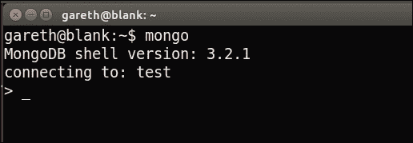
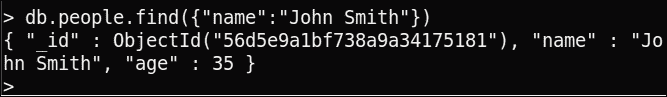
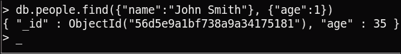
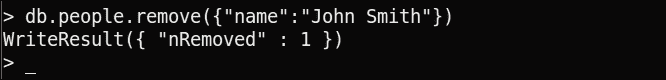
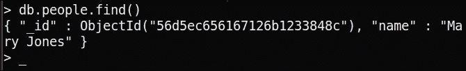
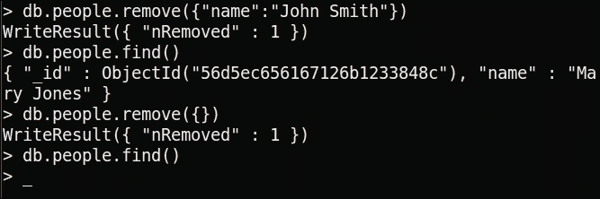
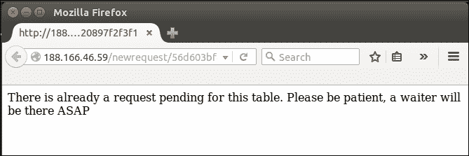
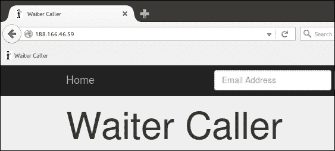

# 第十一章：在我们的服务员呼叫器项目中使用 MongoDB

我们的网络应用现在几乎具备了所有功能。如果我们计划对这个应用进行货币化，现在就是向潜在客户演示的时候。即使他们的数据（如他们的账户名称和虚拟表数据）每次我们不得不重新启动服务器时都会丢失，这些数据也足够微不足道，使得完全演示应用程序成为可能。

在本章中，我们将为生产环境添加一个适当的数据库。我们将使用 MongoDB——一个略具争议的 NoSQL 数据库管理系统，因其简单性而变得极其流行，可以说这主要是因为其简单性。我们将看看如何在我们的 VPS 上安装它，正确配置它，并使用 Python 驱动程序访问它。然后，我们将实现完整的`DBHelper`类来替换我们用于测试的`MockDBHelper`。最后，我们将看看如何向 MongoDB 添加索引和向我们的应用程序添加一个 favicon。

在本章中，我们将涵盖以下主题：

+   介绍 MongoDB

+   安装 MongoDB

+   使用 MongoDB shell

+   介绍 PyMongo

+   添加一些最后的修饰

# 介绍 MongoDB

MongoDB 是一个 NoSQL 数据库。这意味着与我们在犯罪地图项目中使用的 MySQL 数据库不同，它不是组织成表、行和列；相反，它是组织成集合、文档和字段。虽然将这些新术语视为我们用于关系数据库的一种翻译可能会有用，但这些概念并不完全相同。如果您有关系数据库的背景，可以在官方 MongoDB 网站上找到有关这些翻译的有用且更完整的参考资料[`docs.mongodb.org/manual/reference/sql-comparison/`](https://docs.mongodb.org/manual/reference/sql-comparison/)。

MongoDB 的结构比 SQL 数据库灵活得多——我们的所有数据都不必符合特定的模式，这可以节省开发时间。对于我们的犯罪地图项目，我们不得不花时间来查看我们的数据，并决定如何在数据库中表示它。然后，我们不得不设置一堆字段，指定数据类型、长度和其他约束。相比之下，MongoDB 不需要这些。它比关系数据库管理系统更灵活，并且使用文档来表示数据。文档本质上是类似于我们从使用的 API 中提取的数据的 JSON 数据。这意味着我们可以根据需要轻松添加或删除字段，并且我们不需要为我们的字段指定数据类型。

这样做的缺点是，由于不需要强制结构化和一致，我们很容易变得懒惰，并陷入在单个字段中混合不同数据类型和允许无效数据污染我们数据库的不良做法。简而言之，MongoDB 给了我们更多的自由，但这样做也将一些保持清洁和一致性的责任转移到了我们的肩上。

# 安装 MongoDB

MongoDB 可以在 Ubuntu 软件仓库中找到，但由于更新频繁且仓库版本往往滞后，强烈建议直接从官方 Mongo 软件包安装。

我们将逐步介绍如何做到这一点，但由于安装过程可能会发生变化，建议从官方安装指南中获取所需 URL 和步骤的更新版本[`docs.mongodb.org/manual/tutorial/install-mongodb-on-ubuntu/`](https://docs.mongodb.org/manual/tutorial/install-mongodb-on-ubuntu/)。

首先，我们需要导入 MongoDB 的公钥，以便进行身份验证。仅在您的 VPS 上（与以前一样，我们不会在开发机器上安装数据库服务器），运行以下命令：

```py
sudo apt-key adv --keyserver hkp://keyserver.ubuntu.com:80 --recv EA312927

```

现在我们有了密钥，我们可以使用以下命令将 MongoDB 软件包的链接添加到我们的软件源。请注意，此命令特定于 Ubuntu 14.04“Trusty”，这是写作时最新的长期支持 Ubuntu 版本。如果您的 VPS 运行不同版本的 Ubuntu，请确保从前面提供的 MongoDB 文档链接中获取正确的命令。要发现您使用的 Ubuntu 版本，请在终端中运行`lsb_release -a`并检查版本号和名称的输出：

```py
echo "deb http://repo.mongodb.org/apt/ubuntu trusty/mongodb-org/3.2 multiverse" | sudo tee /etc/apt/sources.list.d/mongodb-org-3.2.list

```

现在，我们只需要通过运行以下命令来更新我们的源列表：

```py
sudo apt-get update

```

最后，通过运行以下命令进行实际安装：

```py
sudo apt-get install -y mongodb-org

```

前面的命令将使用一些合理的默认值安装 MongoDB 并启动服务器。它还会配置服务器，以便在重新启动 VPS 时自动启动。

# 使用 MongoDB shell

与我们在 MySQL 中讨论的类似，MongoDB 带有一个简单的 shell。这非常适合运行快速的一次性命令并熟悉语法。让我们运行基本的 CRUD 操作，以熟悉 MongoDB 的工作方式。

与我们之前的项目一样，一旦我们引入 MongoDB，我们将只通过 Python 代码来使用它；然而，首先我们将直接在 shell 中编写命令。这意味着语法上会有一些细微的差异，但由于几乎所有东西都是基于 JSON 的，这些差异不应该是问题。

## 启动 MongoDB shell

要启动 MongoDB shell，请在您的 VPS 上运行以下命令：

```py
mongo

```

这将启动交互式 MongoDB shell，如下图所示，您可以随时通过按*Ctrl + C*或在 shell 中输入`exit`并按*Enter*来退出。



## 在 MongoDB shell 中运行命令

与 MySQL 一样，MongoDB 中的顶级概念是数据库。默认情况下，这将连接到名为`test`的数据库。我们可以使用`use`命令更改数据库。在 shell 中运行以下命令：

```py
use sandbox

```

您应该看到输出“**切换到 db sandbox**”。这是我们可以注意到 MySQL 和 MongoDB 之间的第一个重大差异。对于 MySQL，我们首先必须创建数据库。这是我们将在 MongoDB 中看到的一个常见模式；如果引用一个不存在的数据库、集合或字段，它将自动为您创建。

### 使用 MongoDB 创建数据

现在，让我们创建一个集合（类似于 Crime Map 项目中的 MySQL 数据库中的表）并向其中添加一个文档（类似于 MySQL 数据库中的表中的行）。在 MongoDB shell 中运行以下命令：

```py
db.people.insert({"name":"John Smith", "age": 35})

```

在前面的命令中，`db`指的是当前数据库。紧接着，`people`指的是这个名称的集合。由于它不存在，当我们尝试使用它时，它将被创建。接下来是`insert`，这意味着我们想要向数据库添加一些内容。我们将作为参数传递（在圆括号内），这是一个 JSON 结构。在我们的例子中，我们用一个包含人名和年龄的 JSON 对象表示一个人。请注意，除了`age`字段的值之外，所有内容都在引号中；再次，与 MySQL 不同，我们不必为这些数据指定类型。MongoDB 将把名称存储为字符串，将年龄存储为整数，但不对这些字段施加任何限制。

向数据库添加另一个人，以使我们将尝试的下一个操作更有意义。运行以下命令：

```py
db.people.insert({"name":"Mary Jones"})

```

### 使用 MongoDB 读取数据

MongoDB 使用`find()`命令而不是 SQL 中的`SELECT`语句。与 SQL 类似，我们可以指定要在数据中搜索的条件，并选择要返回的数据库字段。运行以下命令：

```py
db.people.find()

```

这是`find`操作的最基本版本。它将简单地*查找*或*检索*`people`集合中的所有数据和所有字段。您应该会看到 MongoDB 输出我们刚刚添加的两个人的所有信息。您会注意到每个人还添加了一个`ObjectId`字段；MongoDB 会自动为我们的每个文档添加唯一标识符字段，并且这些`ID`字段也会自动索引。

我们也可以使用单个参数的`find`。该参数指定条件，MongoDB 只返回与之匹配的文档。运行以下命令：

```py
db.people.find({"name":"John Smith"})

```

如果名称匹配`John Smith`，则此命令将返回所有记录的所有字段，因此您应该会看到返回一个单一结果并打印到 shell 中，如下面的截图所示：



最后，如果我们不想返回所有字段，可以运行`find`命令并传入第二个参数来指定我们想要的字段。运行以下命令，您应该会看到以下截图中的结果：

```py
db.people.find({"name":"John Smith"}, {"age":1})

```



第一个参数表示我们只对名为“John Smith”的人感兴趣。第二个参数表示我们只对他们的年龄感兴趣。这里，`1`是一个标志，表示我们想要这个字段。我们可以使用`0`来表示我们对一个字段不感兴趣，这样的话，除了这个字段之外，所有字段都会被返回。

请注意，即使我们说我们只对`age`字段感兴趣，上述命令返回了`_id`字段。除非明确排除，否则始终返回`_id`字段。例如，我们可以运行以下命令：

```py
db.people.find({"name":"John Smith"}, {"age":1, "_id": 0})

```

这将只返回约翰的年龄，没有其他内容。另外，请注意`_id`字段的键是`_id`而不是`id`；这是为了避免与许多编程语言中的`id`关键字发生冲突，包括 Python。

我们的每个示例都使用了非常基本的 JSON 对象，每个参数只有一个值，但我们可以为每个参数指定多个值。考虑以下命令之间的区别：

```py
db.people.find({"name":"John Smith", "age":1})
db.people.find({"name":"John Smith"}, {"age":1})

```

第一个命令使用带有单个参数的`find`，返回所有名为 John Smith 且年龄为 1 岁的人的所有记录。第二个命令使用带有两个参数的`find`，返回名为 John Smith 的人的`age`字段（和`_id`字段）。

与 MySQL 的最后一个区别是，不需要提交新数据。一旦我们运行`insert`语句，数据将保存在数据库中，直到我们将其删除。

### 使用 MongoDB 更新数据

更新现有记录稍微复杂一些。MongoDB 提供了一个`update`方法，可以与`insert`和`find`相同的方式调用。它也需要两个参数——第一个指定查找要更新的文档的条件，第二个提供一个新文档来替换它。运行以下命令：

```py
db.people.update({"name":"John Smith"}, {"name":"John Smith", "age":43})

```

这将找到名为 John Smith 的人，并用一个新的人替换他，新人也叫`John Smith`，年龄为 43 岁。如果有很多字段，我们只想更改一个字段，那么重新创建所有旧字段是繁琐和浪费的。因此，我们可以使用 MongoDB 的`$set`关键字，它只会替换文档中指定的字段，而不是替换整个文档。运行以下命令：

```py
db.people.update({"name":"John Smith"}, {$set: {"age":35}})

```

这将把约翰的年龄再次更新为 35 岁，这对他来说可能是一种解脱。我们只改变了`age`字段，而不是覆盖整个文档。我们在第二个参数中使用了`$set`关键字来实现这一点。请注意，`update`函数仍然需要两个参数，而第二个参数现在具有嵌套的 JSON 结构——输出的 JSON 对象将`$set`作为键，另一个 JSON 对象作为值。内部 JSON 对象指定了我们想要进行的更新。

### 使用 MongoDB 删除数据

删除数据就像查找数据一样简单。我们将简单地使用`remove`函数而不是`find`，然后在单个参数中指定匹配条件，就像我们在`find`中所做的那样。运行以下命令从我们的数据库中删除 John：

```py
db.people.remove({"name":"John Smith"})

```

您将看到一个确认，显示已删除一条记录，如下图所示：



您还可以通过运行以下命令来检查 John 是否已被删除：

```py
db.people.find()

```

现在，只有 Mary 将被返回，如下图所示：



要从集合中删除所有文档，我们可以传入一个空参数。运行以下命令以删除所有剩余的人：

```py
db.people.remove({})

```

在这里，`{}`指定了一个空的条件，因此匹配所有文档。通过再次运行`find`命令来检查我们的`people`集合是否为空，如下所示：

```py
db.people.find()

```

您将看不到任何输出，如下图所示（包括前面的示例，以便了解上下文），因为我们的`people`集合现在为空：



现在我们已经了解了 MongoDB 的基础知识，让我们看看如何使用 Python 而不是通过 shell 来运行类似的命令。

# 介绍 PyMongo

PyMongo 是一个实现了 MongoDB 驱动程序的库，它允许我们从应用程序代码中对数据库执行命令。像往常一样，使用以下命令通过 pip 安装它（请注意，与 MongoDB 类似，您只需要在服务器上安装此库）：

```py
pip install --user pymongo

```

现在，我们可以将这个库导入到我们的应用程序中，并构建我们真正的`DBHelper`类，实现我们在`MockDBHelper`类中使用的所有方法。

## 编写 DBHelper 类

我们需要的最后一个类是`DBHelper`类，它将包含我们的应用程序代码与数据库交互所需的所有函数。这个类将使用我们刚刚安装的`pymongo`库来运行 MongoDB 命令。在`waiter`目录中创建一个名为`dbhelper.py`的文件，并添加以下代码：

```py
import pymongo

DATABASE = "waitercaller"

class DBHelper:

  def __init__(self):
    client = pymongo.MongoClient()
    self.db = client[DATABASE]
```

这段代码导入了`pymongo`库，在构造函数中，它创建了一个客户端——一个 Python 对象，让我们可以在数据库上运行我们之前尝试过的 CRUD 操作。我们将我们的数据库名称定义为全局的，并在构造函数的第二行中，使用`client`连接到指定的数据库。

### 添加用户方法

对于用户管理，我们需要与我们的模拟类中相同的两个函数。第一个是从数据库中获取用户（以便登录此用户），第二个是向数据库中添加新用户（以便注册新用户）。将以下两个方法添加到`DBHelper`类中：

```py
    def get_user(self, email):
        return self.db.users.find_one({"email": email})

    def add_user(self, email, salt, hashed):
        self.db.users.insert({"email": email, "salt": salt, "hashed": hashed})
```

对于第一种方法，我们使用了 PyMongo 的`find_one()`函数。这类似于我们在 MongoDB shell 中使用的`find()`方法，但是它只返回单个匹配项，而不是所有匹配的结果。由于我们每个电子邮件地址只允许注册一个用户，所以匹配结果要么是一个，要么是零。在这里使用`find()`而不是`find_one()`也可以，但是我们会得到一个产生单个或零元素的 Python 生成器。使用`find_one()`，我们要么得到一个单个用户的结果，要么得到空，这正是我们的登录代码所需要的。

对于`add_user()`方法，我们使用了`insert()`，就像我们在使用 MongoDB shell 时讨论的那样，并插入了一个包含电子邮件地址、盐和密码的盐哈希的新文档。

### 添加表方法

我们需要处理我们的用户将创建的虚拟表的以下情况的方法：

+   一个用于添加新表

+   一个用于更新表（以便我们可以添加缩短的 bitly URL）

+   一个用于获取所有表（以便我们可以在**账户**页面中显示它们）

+   一个用于获取单个表（以便我们可以将本地表号添加到我们的请求中）

+   一个用于删除表

这是一组不错的方法，因为它演示了所有四种 CRUD 数据库操作。将以下代码添加到`DBHelper`类中：

```py
def add_table(self, number, owner):
    new_id = self.db.tables.insert({"number": number, "owner": owner})
    return new_id

def update_table(self, _id, url):
    self.db.tables.update({"_id": _id}, {"$set": {"url": url}})

def get_tables(self, owner_id):
    return list(self.db.tables.find({"owner": owner_id}))

def get_table(self, table_id):
    return self.db.tables.find_one({"_id": ObjectId(table_id)})

def delete_table(self, table_id):
    self.db.tables.remove({"_id": ObjectId(table_id)})
```

对于`add_table()`方法，每次插入表时，MongoDB 都会分配一个唯一标识符。这为我们提供了真正的多用户支持。我们的模拟代码使用用户选择的表号作为唯一标识符，并且在多个用户选择相同的表号时会出现问题。在`add_table()`方法中，我们将此唯一标识符返回给应用程序代码，然后可以用它来构建所需的 URL，以便为此特定表发出新的请求。

`update_table()`方法使用了我们之前讨论过的`insert()`函数。与我们之前的示例一样，我们使用了`$set`关键字来保持我们的原始数据完整，并且只编辑了特定字段（而不是覆盖整个文档）。

### 注意

请注意，与 MongoDB shell 示例不同，我们现在需要在`$set`周围加上引号；这使得它在语法上成为合法的 Python 代码（字典的所有键都必须是字符串），而 PyMongo 会在后台处理魔术，将我们的 Python 字典转换为 MongoDB 命令和对象。

`get_tables()`函数使用了`find()`函数，而不是我们用于用户代码的`find_one()`函数。这导致 PyMongo 返回一个 Python 生成器，可以生成与*find*条件匹配的所有数据。由于我们假设总是能够将所有表加载到内存中，因此我们将此生成器转换为列表，然后将其传递给我们的模板。

`get_table()`函数用于在我们只有访问表 ID 并且需要获取有关表的其他信息时使用。这正是我们处理请求时的情况；请求的 URL 包含了表的唯一 ID，但希望将表号添加到**Dashboard**页面。MongoDB 生成的唯一标识符实际上是对象而不是简单的字符串，但我们只有来自我们的 URL 的字符串。因此，在使用此 ID 查询数据库之前，我们创建了`ObjectId`并传入了字符串。`ObjectId`可以从自动安装的`bson`库中导入。这意味着我们还需要添加另一个导入语句。将以下行添加到`dbhelper.py`文件的顶部：

```py
from bson.objectid import ObjectId
```

最后，`delete_table()`方法使用了`remove()`函数，与之前完全相同。在这里，我们通过其唯一标识符删除了一个表，因此我们再次从之前的字符串创建了一个`ObjectId`对象，然后将其传递给数据库。

### 添加请求方法

我们需要将最后三个方法添加到`DBHelper`类中以处理关注请求。我们需要：

+   当顾客访问提供的 URL 时，添加一个请求

+   获取特定用户的所有请求，以在**Dashboard**页面上显示

+   当用户点击**解决**按钮时，从数据库中删除请求

将以下方法添加到`dbhelper.py`文件中：

```py
    def add_request(self, table_id, time):
        table = self.get_table(table_id)
        self.db.requests.insert({"owner": table['owner'], "table_number": table['number'],"table_id": table_id, "time": time})

    def get_requests(self, owner_id):
        return list(self.db.requests.find({"owner": owner_id}))

    def delete_request(self, request_id):
        self.db.requests.remove({"_id": ObjectId(request_id)})
```

## 更改应用程序代码

现在我们有了一个真正的`DBHelper`类，我们需要根据我们所处的环境有条件地导入它。将`waitercaller.py`文件中`MockDBHelper`类的导入更改为如下所示：

```py
if config.test
    from mockdbhelper import MockDBHelper as DBHelper
else:
    from dbhelper import DBHelper
```

确保在`config`导入下面添加前面四行。

此外，我们的`DBHelper`类主要处理许多`ObjectId`实例，而我们的`MockDBHelper`类使用字符串。因此，我们需要对我们的`account_createtable()`函数进行小的更改，将`ObjectId`转换为字符串。查看`waitercaller.py`中的以下行：

```py
new_url = BH.shorten_url(config.base_url + "newrequest/" + tableid)
```

现在，将其更改为以下内容：

```py
new_url = BH.shorten_url(config.base_url + "newrequest/" + str(tableid))
```

这将确保在我们将其连接到我们的 URL 之前，`tableid`始终是一个字符串。

我们生产环境需要的最后一次代码更改是一个不同的`config`文件，用于指定 VPS 的正确`base_url`并指示不应使用`MockDBHelper`类。由于我们不会将`config`文件检入`git`存储库，因此我们需要直接在 VPS 上创建这个文件。

# 在生产环境中测试我们的应用程序

一旦添加了上述代码，我们的应用程序现在应该是完全可用的！与我们的犯罪地图应用程序的数据库部分一样，这部分是最微妙的，因为我们无法在本地测试`DBHelper`代码，而必须直接在 VPS 上进行调试。然而，我们有信心，从我们的`MockDBHelper`类中，我们的应用程序逻辑都是有效的，如果新的数据库代码能够保持下来，其他一切应该都会按预期进行。让我们将代码推送到服务器上并进行测试。

在您的`waitercaller`目录中本地运行以下命令：

```py
git add .
git commit -m "DBHelper code"
git push origin master

```

在您的 VPS 上，切换到`WaiterCaller`目录，拉取新代码，并按以下方式重新启动 Apache：

```py
cd /var/www/waitercaller
git pull origin master

```

现在，通过运行以下命令使用 nano 创建生产`config`文件：

```py
nano config.py

```

在新的`config.py`文件中输入以下内容，将`base_url`中的 IP 地址替换为您的 VPS 的 IP 地址。

```py
test = False
base_url = "http://123.456.789.123/

```

然后，通过按*Ctrl* + *X*并在提示时输入*Y*来保存并退出文件。

现在，运行以下命令以使用新代码重新加载 Apache：

```py
sudo service apache2 reload 

```

在本地浏览器中访问您的 VPS 的 IP 地址，并对所有功能进行一次全面测试，以确保一切都按预期工作。这包括尝试使用无效数据注册、注册、尝试使用无效数据登录、登录、创建表、创建请求、查看仪表板、等待仪表板刷新、解决请求等。对于全面的测试，所有操作应该以不同的组合多次完成。

你可能会明白，即使对于我们相对简单的应用程序，这也变得很繁琐。对于更复杂的应用程序，值得花费精力创建自动测试——模拟用户在网站上的操作，但也具有内置的对每个步骤应该发生什么的期望。诸如 Selenium（[www.seleniumhq.org](http://www.seleniumhq.org)）之类的工具非常有用，可以用来构建这样的测试。

### 提示

与往常一样，如果出现任何问题，或者出现可怕的“500：内部服务器错误”，请检查`/etc/log/apache2/error.log`中的 Apache 错误文件以获取提示。

# 添加一些最后的修饰

最后，我们将向我们的数据库添加一些索引，以提高效率并防止为单个表打开多个请求。之后，我们将添加一个网站图标来个性化我们的 Web 应用程序。

## 向 MongoDB 添加索引

数据库索引用于提高效率。通常，要在数据库中找到与特定条件匹配的一组文档（也就是说，每当我们使用 MongoDB 的`find()`方法时），数据库引擎必须检查每条记录并添加与返回结果匹配的记录。如果我们向特定字段添加索引，数据库将存储更多的元数据，可以将其视为存储该字段的排序副本。在排序列表中查找`john@example.com`是否出现比在无序列表中查找要高效得多。然而，索引确实会占用额外的存储空间，因此选择在哪里添加索引是计算机科学中经典的“时空权衡”，无处不在。MongoDB 还可以使用索引对字段施加一些约束。在我们的情况下，我们将使用*唯一*索引，如果索引字段的值已经出现在此集合中的另一个文档中，则阻止向数据库添加新文档。

我们将在 MongoDB 中添加两个索引。我们将在`users`集合的`email`字段上添加一个索引，因为我们将使用此字段在登录时查找用户，并且我们希望查找尽可能快。我们还希望在数据库级别确保每个电子邮件地址都是唯一的。我们已经有两个检查：HTML5 字段进行前端检查，我们的应用程序代码进行后端检查。即使数据库检查可能看起来是不必要的，但设置起来很容易，并遵循内置安全性的良好原则（其中检查不仅仅是作为事后添加的，而是尽可能经常验证所有数据），以及应用程序的每个*层*（前端，应用程序层和数据库层在我们的情况下）都不应该盲目地信任从更高层传递的数据的原则。

我们还将在请求集合的`table_id`字段上添加唯一索引。这将防止单个不耐烦的桌子通过刷新创建新请求的页面来向仪表板发送多个请求。这也很有用，因为我们的请求是使用 GET 请求创建的，可以很容易地复制（通过浏览器预加载页面或社交网络抓取用户访问的链接以了解更多信息）。通过确保每个请求的`table_id`是唯一的，我们可以防止这两个问题。

### 我们在哪里添加索引？

当我们构建 MySQL 数据库时，我们有一个独立于我们的犯罪地图 Web 应用程序的设置脚本。此设置脚本构建了数据库的框架，我们用 Python 编写它，以便如果我们需要迁移到新服务器或重新安装我们的数据库，我们可以轻松地再次运行它。

由于 MongoDB 非常灵活，我们不需要设置脚本。我们可以在新服务器上启动我们的应用程序，并且只要安装了 MongoDB，数据库将会在添加新数据或从备份中恢复旧数据时从头开始重新创建。

缺少设置脚本意味着我们实际上没有一个很好的地方可以向我们的数据库添加索引。如果我们通过 MongoDB shell 添加索引，这意味着如果应用程序需要迁移到新服务器，有人必须记住再次添加它们。因此，我们将创建一个独立的 Python 脚本来创建索引。在您的本地计算机上，在`waitercaller`目录中创建一个 Python 文件，并将其命名为`create_mongo_indices.py`。添加以下代码：

```py
import pymongo
client = pymongo.MongoClient()
c = client['waitercaller']
print c.users.create_index("email", unique=True)
print c.requests.create_index("table_id", unique=True)
```

连接代码与我们以前使用的代码相同，用于创建索引的代码足够简单。我们在要在其上创建索引的集合上调用`create_index()`方法，然后传递要用于创建索引的字段名称。在我们的情况下，我们还传递了`unique=True`标志，以指定索引也应该添加唯一约束。

现在，我们需要对我们的应用程序进行一些小的更改，以便它可以处理已经打开的相同请求的情况。在`dbhelper.py`文件中，将`add_request()`方法更新为以下内容：

```py
    def add_request(self, table_id, time):
        table = self.get_table(table_id)
        try:
            self.db.requests.insert({"owner": table['owner'], "table_number": table['number'], "table_id": table_id, "time": time})
            return True
        except pymongo.errors.DuplicateKeyError:
            return False
```

如果我们尝试向数据库插入具有重复的`table_id`字段的请求，将抛出`DuplicateKeyError`。在更新的代码中，我们将捕获此错误并返回`False`以指示请求未成功创建。当请求成功时，我们现在也将返回`True`。为了在应用程序代码中利用这些信息，我们还需要更新`new_request()`方法。编辑该方法，使其类似于此：

```py
@app.route("/newrequest/<tid>")
def new_request(tid):
        if DB.add_request(tid, datetime.datetime.now()):
            return "Your request has been logged and a waiter will be with you shortly"
        return "There is already a request pending for this table. Please be patient, a waiter will be there ASAP"
```

现在，我们将检查新请求是否成功创建，或者现有请求是否阻止它。在后一种情况下，我们将返回不同的消息，要求顾客耐心等待。

为了测试新功能，将新的和修改后的文件添加到 Git（`waitercaller.py`，`dbhelper.py`，`create_mongo_indices.py`），提交，然后推送它们。在您的 VPS 上，拉取新的更改，重新启动 Apache，并运行以下命令：

```py
python create_mongo_indices.py

```

为了创建我们之前讨论过的索引，再次在浏览器中运行一些测试，确保没有出现任何问题，并验证当您重复访问相同的关注请求 URL 时是否显示了新消息，如下图所示：



你可能会发现，由于浏览器预取页面，当您首次通过帐户页面创建表格时，会自动发出关注请求。如果您在不期望时看到上图中显示的消息，请在仪表板页面上解决任何未处理的请求，并再次访问 newrequest URL。

## 添加网站图标

我们要添加到我们的应用程序的最后一件事是一个网站图标。*网站图标*是大多数浏览器在打开页面时在标签栏中显示的小图像，如果用户将网站加为书签，则会显示在书签栏上。它们为网站增添了友好的触感，并帮助用户更快地识别网站。

关于网站图标的棘手之处在于它们必须非常小。习惯上使用 16x16 像素的图像作为网站图标，这并不留下太多创意空间。有一些很好的网站可以帮助您为您的网站创建完美的网站图标。其中一个网站是[favicon.cc](http://favicon.cc)，它允许您从头开始创建网站图标（给您 16x16 的空白像素开始），或者可以导入图像。使用导入功能，您可以使用一个更大的图像，[favicon.cc](http://favicon.cc)会尝试将其缩小为 16x16 像素，这样做的效果参差不齐，通常对于简单的图像效果更好。代码包中包含一个示例网站图标，放在静态目录中，并在下图中显示了它的放大版本：


一旦您有了一个图标（您可以使用代码包中提供的图标），就很容易告诉 Flask 将其与页面的其余部分一起提供。确保您的图标被命名为`favicon.ico`（图标文件的标准扩展名是`.ico`），并将其放在`waitercaller/static`目录中。然后，在`base.html`模板的`<head>`部分中添加以下行：

```py
<link rel="shortcut icon" href="{{ url_for('static', filename='favicon.ico') }}">
```

这将创建一个链接到`favicon.ico`文件，使用 Jinja 的`url_for`函数生成所需的完整 URL，以便指向静态目录，然后将其简单转换为 HTML（您可以通过浏览器中的**查看源代码**来查看）。看一下下面的内容：

```py
<link rel="shortcut icon" href="/static/favicon.ico">
```

现在，如果您再次重新加载页面，您将在标签标题中看到网站图标，如果您将页面加为书签，您也将在浏览器的书签工具栏中看到图标，如下图所示：



这就是我们最后的项目。当然，没有一个 Web 应用程序是真正完整的，有无数的改进和功能可以添加。在本书的这个阶段，您将拥有足够的知识来开始添加自己的更改，并将您的原创想法变成现实，无论是作为我们在本书中介绍的项目的扩展，还是从头开始，作为全新的 Web 应用程序。

# 总结

在本章中，我们完成了我们的服务员呼叫器 Web 应用程序。我们在服务器上安装了 MongoDB，学习了如何通过 shell 使用它，然后安装了 PyMongo。使用 PyMongo，我们创建了一个新的数据库助手类，允许我们的应用程序代码在新数据库上运行操作。

最后，我们添加了一个网站图标，使我们的 Web 应用程序更加友好和美观。

在下一章和最后一章中，我们将看看我们的应用程序还可以添加什么来改善可用性和安全性，并以一些指针结束，指出接下来继续学习 Flask 和 Python 进行 Web 开发的地方。
