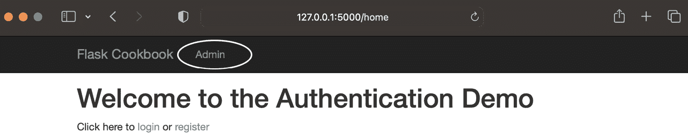
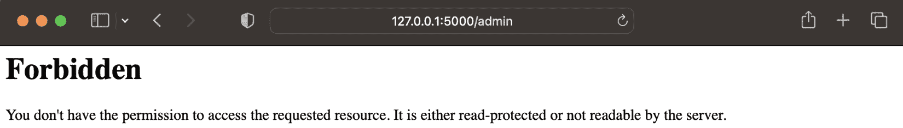
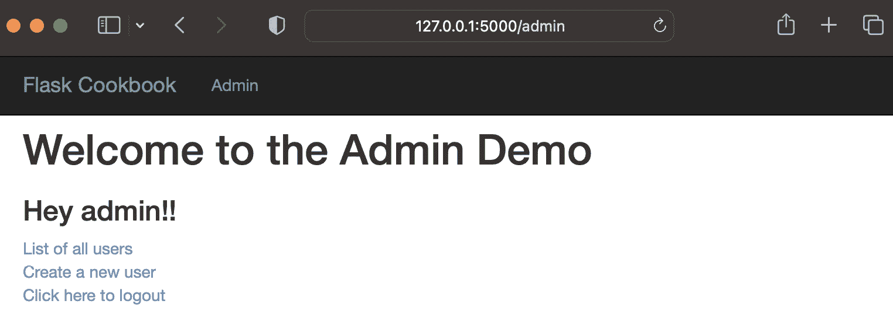
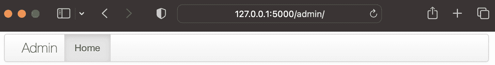
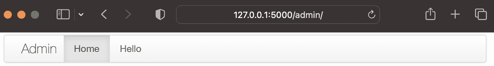
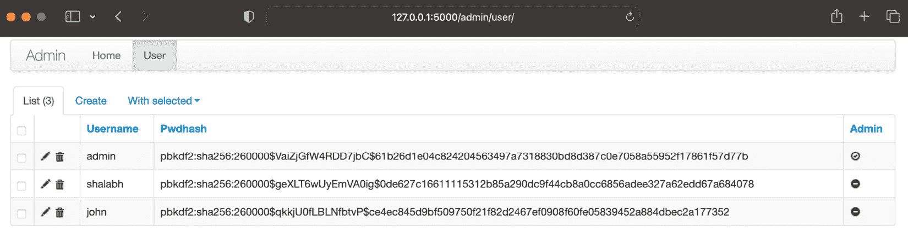
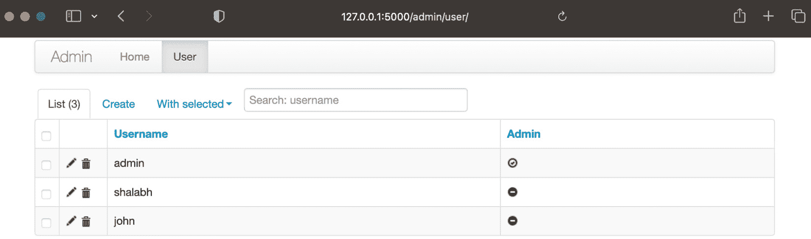
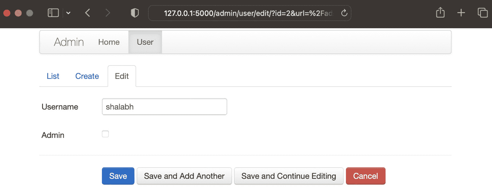
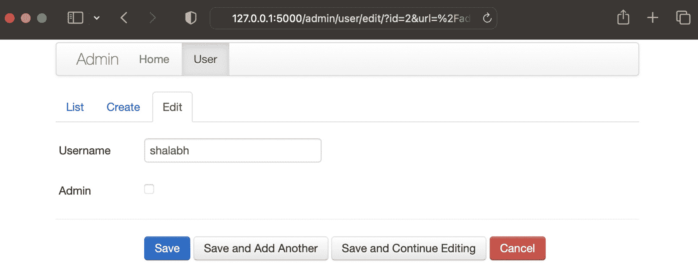
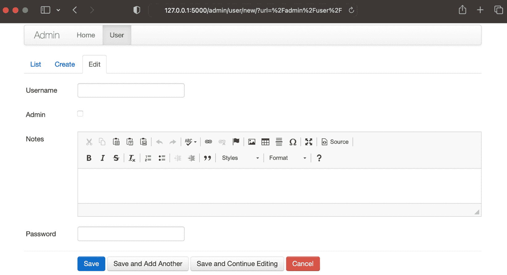

# 第八章：Flask 应用程序的管理界面

许多应用程序需要一种界面，它可以为某些用户提供特殊权限，并可用于维护和升级应用程序的资源。例如，我们可以在电子商务应用程序中有一个界面，允许一些特殊用户创建类别、产品等。一些用户可能拥有特殊权限来处理在网站上购物的其他用户，处理他们的账户信息等。同样，可能存在许多需要将应用程序界面的某些部分从普通用户中隔离出来的情况。

与非常流行的基于 Python 的 Web 框架 Django 相比，Flask 默认不提供任何管理界面。虽然这可能会被许多人视为一个缺点，但这给了开发者根据他们的需求创建管理界面的灵活性，并完全控制应用程序。

我们可以选择从头开始为我们自己的应用程序编写管理界面，或者使用 Flask 的扩展，它为我们做了大部分工作，并允许我们根据需要自定义逻辑。在 Flask 中创建管理界面的一个非常流行的扩展是 Flask-Admin ([`flask-admin.readthedocs.io/en/latest/`](https://flask-admin.readthedocs.io/en/latest/))。它受到 Django 管理界面的启发，但以一种让开发者完全控制应用程序的外观、感觉和功能的方式实现。在本章中，我们将从创建自己的管理界面开始，然后转向使用 `Flask-Admin` 扩展，并根据需要对其进行微调。

在本章中，我们将涵盖以下配方：

+   创建简单的 CRUD 界面

+   使用 Flask-Admin 扩展

+   将模型注册到 Flask-Admin

+   创建自定义表单和操作

+   使用 WYSIWYG 编辑器进行 `textarea` 集成

+   创建用户角色

# 创建简单的 CRUD 界面

**CRUD** 代表 **创建、读取、更新和删除**。管理界面的基本需求是能够根据需要创建、修改或删除应用程序中的记录/资源。我们将创建一个简单的管理界面，允许管理员用户对其他普通用户通常无法操作的记录执行这些操作。

## 准备工作

我们将从第六章“在 Flask 中认证”中的“使用 Flask-Login 扩展进行认证”配方开始，并添加带有管理员界面的管理员认证，这将仅允许管理员用户创建、更新和删除用户记录。在这里，在这个配方中，我将涵盖理解这些概念所必需的一些特定部分。对于完整的应用程序，您可以参考本书提供的代码示例。

## 如何做到这一点...

要创建一个简单的管理界面，请执行以下步骤：

1.  首先，通过在`auth/models.py`中的`User`模型中添加一个名为`admin`的新`BooleanField`字段来修改模型。这个字段将帮助识别用户是否是管理员：

    ```py
    from wtforms import BooleanField
    ```

    ```py
    class User(db.Model):
    ```

    ```py
        id = db.Column(db.Integer, primary_key=True)
    ```

    ```py
        username = db.Column(db.String(100))
    ```

    ```py
        pwdhash = db.Column(db.String())
    ```

    ```py
        admin = db.Column(db.Boolean())
    ```

    ```py
        def __init__(self, username, password,
    ```

    ```py
          admin=False):
    ```

    ```py
            self.username = username
    ```

    ```py
            self.pwdhash =
    ```

    ```py
              generate_password_hash(password)
    ```

    ```py
            self.admin = admin
    ```

    ```py
        def is_admin(self):
    ```

    ```py
            return self.admin
    ```

前面的方法只是返回管理员字段的值。这可以根据我们的需求有自定义的实现。

小贴士

由于这是添加到`User`模型的新字段，因此需要进行数据库迁移。你可以参考*第三章*中关于使用 Alembic 和 Flask-Migrate 迁移数据库的配方，*Flask 中的数据建模*，以获取更多详细信息。

1.  在`auth/models.py`中创建两个表单，这些表单将由管理员视图使用：

    ```py
    class AdminUserCreateForm(FlaskForm):
    ```

    ```py
        username = StringField('Username',
    ```

    ```py
          [InputRequired()])
    ```

    ```py
        password = PasswordField('Password',
    ```

    ```py
          [InputRequired()])
    ```

    ```py
        admin = BooleanField('Is Admin ?')
    ```

    ```py
    class AdminUserUpdateForm(FlaskForm):
    ```

    ```py
        username = StringField('Username',
    ```

    ```py
          [InputRequired()])
    ```

    ```py
        admin = BooleanField('Is Admin ?')
    ```

1.  现在，修改`auth/views.py`中的视图以实现管理员界面：

    ```py
    from functools import wraps
    ```

    ```py
    from flask import abort
    ```

    ```py
    from my_app.auth.models import AdminUserCreateForm,
    ```

    ```py
      AdminUserUpdateForm
    ```

    ```py
    def admin_login_required(func):
    ```

    ```py
        @wraps(func)
    ```

    ```py
        def decorated_view(*args, **kwargs):
    ```

    ```py
            if not current_user.is_admin():
    ```

    ```py
                return abort(403)
    ```

    ```py
            return func(*args, **kwargs)
    ```

    ```py
        return decorated_view
    ```

前面的代码是`admin_login_required`装饰器，它的工作方式与`login_required`装饰器类似。在这里，区别在于它需要与`login_required`一起实现，并检查当前登录的用户是否是管理员。

1.  创建以下处理程序，这些处理程序将用于创建简单的管理员界面。注意`@admin_login_required`装饰器的使用。其他所有内容基本上都是标准的，正如我们在本书前面章节中学到的，这些章节专注于视图和认证处理。所有处理程序都将放在`auth/views.py`中：

    ```py
    @auth.route('/admin')
    ```

    ```py
    @login_required
    ```

    ```py
    @admin_login_required
    ```

    ```py
    def home_admin():
    ```

    ```py
        return render_template('admin-home.html')
    ```

    ```py
    @auth.route('/admin/users-list')
    ```

    ```py
    @login_required
    ```

    ```py
    @admin_login_required
    ```

    ```py
    def users_list_admin():
    ```

    ```py
        users = User.query.all()
    ```

    ```py
        return render_template('users-list-admin.html',
    ```

    ```py
          users=users)
    ```

    ```py
    @auth.route('/admin/create-user', methods=['GET',
    ```

    ```py
      'POST'])
    ```

    ```py
    @login_required
    ```

    ```py
    @admin_login_required
    ```

    ```py
    def user_create_admin():
    ```

    ```py
        form = AdminUserCreateForm()
    ```

    ```py
        if form.validate_on_submit():
    ```

    ```py
            username = form.username.data
    ```

    ```py
            password = form.password.data
    ```

    ```py
            admin = form.admin.data
    ```

    ```py
            existing_username = User.query.filter_by
    ```

    ```py
              (username=username).first()
    ```

    ```py
            if existing_username:
    ```

    ```py
                flash(
    ```

    ```py
                    'This username has been already taken.
    ```

    ```py
                      Try another one.',
    ```

    ```py
                    'warning'
    ```

    ```py
                )
    ```

    ```py
                return render_template('register.html',
    ```

    ```py
                  form=form)
    ```

    ```py
            user = User(username, password, admin)
    ```

    ```py
            db.session.add(user)
    ```

    ```py
            db.session.commit()
    ```

    ```py
            flash('New User Created.', 'info')
    ```

    ```py
            return
    ```

    ```py
              redirect(url_for('auth.users_list_admin'))
    ```

    ```py
        if form.errors:
    ```

    ```py
            flash(form.errors, 'danger')
    ```

    ```py
        return render_template('user-create-admin.html',
    ```

    ```py
          form=form)
    ```

前面的方法允许管理员用户在系统中创建新用户。这与`register()`方法的工作方式非常相似，但允许管理员设置用户的`admin`标志。

以下方法允许管理员用户更新其他用户的记录：

```py
@auth.route('/admin/update-user/<id>', methods=['GET', 'POST'])
@login_required
@admin_login_required
def user_update_admin(id):
    user = User.query.get(id)
    form = AdminUserUpdateForm(
        username=user.username,
        admin=user.admin
    )
    if form.validate_on_submit():
        username = form.username.data
        admin = form.admin.data
        User.query.filter_by(id=id).update({
            'username': username,
            'admin': admin,
        })
        db.session.commit()
        flash('User Updated.', 'info')
        return
          redirect(url_for('auth.users_list_admin'))
    if form.errors:
        flash(form.errors, 'danger')
    return render_template('user-update-admin.html', form=form, 
      user=user)
```

然而，根据编写 Web 应用程序的最佳实践，我们不允许管理员简单地查看和更改任何用户的密码。在大多数情况下，更改密码的权限应该属于账户的所有者。尽管在某些情况下管理员可以更新密码，但绝对不应该允许他们看到用户之前设置的密码。这个话题在*创建自定义表单和操作*配方中进行了讨论。

以下方法处理管理员删除用户的情况：

```py
@auth.route('/admin/delete-user/<id>')
@login_required
@admin_login_required
def user_delete_admin(id):
    user = User.query.get(id)
    db.session.delete(user)
    db.session.commit()
    flash('User Deleted.', 'info')
    return redirect(url_for('auth.users_list_admin'))
```

`user_delete_admin()`方法实际上应该在`POST`请求上实现。这留给你自己实现。

1.  在模型和视图之后，创建一些模板来补充它们。对于你们中的许多人来说，从视图本身的代码中可能已经很明显，我们需要添加四个新的模板，即`admin-home.html`、`user-create-admin.html`、`user-update-admin.html`和`users-list-admin.html`。这些模板的工作原理将在下一节中展示。现在，你应该能够自己实现这些模板；然而，为了参考，代码总是与书中提供的示例一起提供。

## 它是如何工作的...

首先，我们在应用程序中添加了一个菜单项；这提供了一个直接链接到管理员主页，其外观如下所示截图：



图 8.1 – 管理员访问菜单项

用户必须以管理员身份登录才能访问此页面和其他相关管理员页面。如果用户没有以管理员身份登录，则应用程序将显示错误，如下面的截图所示：



图 8.2 – 非管理员用户的禁止访问错误

信息

在您能够以管理员身份登录之前，需要创建一个管理员用户。要创建管理员用户，您可以从命令行使用 SQL 查询在 SQLAlchemy 中对数据库进行更改。另一种更简单但有些不规范的实现方法是，在`auth/models.py`中将`admin`标志更改为`True`，然后注册一个新用户。这个新用户将成为管理员用户。请确保在此操作完成后，将`admin`标志恢复为默认的`False`。

对于已登录的管理员用户，管理员主页将如下所示：



图 8.3 – 管理员主页

从这里，管理员可以查看系统上的用户列表或创建新用户。编辑或删除用户的选项将直接在用户列表页面上提供。

# 使用 Flask-Admin 扩展

`Flask-Admin`是一个可用的扩展，它以更简单、更快的速度帮助我们为应用程序创建管理员界面。本章的所有后续食谱都将专注于使用和扩展此扩展。

## 准备工作

首先，我们需要安装`Flask-Admin`扩展：

```py
$ pip install Flask-Admin
```

我们将从之前的食谱扩展我们的应用程序，并在此基础上继续构建。

## 如何操作…

使用`Flask-Admin`扩展将简单的管理员界面添加到任何 Flask 应用程序中只是一个语句的问题。

简单地将以下行添加到应用程序配置的`my_app/__init__.py`中：

```py
from flask_admin import Admin
app = Flask(__name__)
# Add any other application configurations
admin = Admin(app)
```

您还可以添加自己的视图；这就像添加一个继承自`BaseView`类的新类作为新视图一样简单，如下面的代码块所示。此代码块位于`auth/views.py`中：

```py
from flask_admin import BaseView, expose
class HelloView(BaseView):
    @expose('/')
    def index(self):
        return self.render('some-template.html')
```

然后，将此视图添加到`my_app/__init__.py`中 Flask 配置的`admin`对象中：

```py
import my_app.auth.views as views
admin.add_view(views.HelloView(name='Hello'))
```

这里需要注意的一点是，此页面默认没有实现任何身份验证或授权逻辑，它将对所有人开放。原因在于`Flask-Admin`对现有的身份验证系统没有任何假设。由于我们正在使用`Flask-Login`为我们的应用程序，您可以在`HelloView`类中添加一个名为`is_accessible()`的方法：

```py
    def is_accessible(self):
        return current_user.is_authenticated and \
            current_user.is_admin()
```

## 工作原理…

只需像本食谱的第一步所演示的那样，使用`Flask-Admin`扩展中的`Admin`类初始化应用程序，就会显示一个基本的管理员页面，如下面的截图所示：



图 8.4 – 使用 Flask-Admin 的管理员主页

注意截图中的 URL，它是`http://127.0.0.1:5000/admin/`。请特别注意 URL 末尾的正斜杠（`/`）。如果你错过了这个正斜杠，那么它将打开上一个食谱中的网页。

在第二步中添加自定义的`HelloView`会使管理页面看起来如下截图所示：



图 8.5 – 添加一个虚拟的 Hello 视图

## 更多内容…

在实现前面的代码之后，仍然有一个行政视图不会完全受到用户保护，并且将是公开可用的。这将是一个行政主页。为了使其仅对管理员可用，我们必须从`AdminIndexView`继承并实现`is_accessible()`：

```py
from flask_admin import BaseView, expose, AdminIndexView
class MyAdminIndexView(AdminIndexView):
    def is_accessible(self):
        return current_user.is_authenticated and
          current_user.is_admin()
```

然后，只需将此视图传递到应用程序配置中的`admin`对象，作为`index_view`，我们就完成了：

```py
admin = Admin(app, index_view=views.MyAdminIndexView())
```

这种方法使得所有我们的行政视图仅对管理员用户可访问。我们还可以根据需要实现任何权限或条件访问规则在`is_accessible()`中。

# 使用 Flask-Admin 注册模型

在之前的食谱中，我们学习了如何使用`Flask-Admin`扩展开始创建我们应用程序的行政界面/视图。在本食谱中，我们将检查如何使用执行 CRUD 操作的功能实现现有模型的行政视图。

## 准备工作

我们将从之前的食谱扩展我们的应用程序，包括`User`模型的行政界面。

## 如何做到这一点…

再次强调，使用`Flask-Admin`，将模型注册到行政界面非常简单；执行以下步骤：

1.  只需将以下单行代码添加到`auth/views.py`：

    ```py
    from flask_admin.contrib.sqla import ModelView
    ```

    ```py
    # Other admin configuration as shown in last recipe
    ```

    ```py
    admin.add_view(ModelView(views.User, db.session))
    ```

在这里，在第一行中，我们从`flask_admin.contrib.sqla`中导入了`ModelView`，这是由`Flask-Admin`提供的，用于集成 SQLAlchemy 模型。

观察此食谱中“如何工作…”部分的第一个步骤对应的截图（*图 8.6*），我们大多数人都会同意，向任何用户显示密码散列，无论是管理员还是普通用户，都没有意义。此外，`Flask-Admin`提供的默认模型创建机制将无法为我们创建的`User`模型工作，因为我们`User`模型中有一个`__init__()`方法。该方法期望三个字段（`username`、`password`和`is_admin`）的值，而`Flask-Admin`中实现的模型创建逻辑非常通用，在模型创建过程中不提供任何值。

1.  现在，自定义`Flask-Admin`的默认行为，使其成为你自己的，在`auth/views.py`中修复`User`创建机制并隐藏密码散列：

    ```py
    from wtforms import PasswordField
    ```

    ```py
    from flask_admin.contrib.sqla import ModelView
    ```

    ```py
    class UserAdminView(ModelView):
    ```

    ```py
        column_searchable_list = ('username',)
    ```

    ```py
        column_sortable_list = ('username', 'admin')
    ```

    ```py
        column_exclude_list = ('pwdhash',)
    ```

    ```py
        form_excluded_columns = ('pwdhash',)
    ```

    ```py
        form_edit_rules = ('username', 'admin')
    ```

    ```py
        def is_accessible(self):
    ```

    ```py
            return current_user.is_authenticated and
    ```

    ```py
              current_user.is_admin()
    ```

上述代码展示了我们的`User`模型 admin 视图将遵循的一些规则和设置。这些规则通过其名称即可解释。其中一些，如`column_exclude_list`和`form_excluded_columns`可能看起来有些令人困惑。前者将从 admin 视图中排除所提到的列，并避免在搜索、创建和其他 CRUD 操作中使用它们。后者将防止字段在 CRUD 操作的表单中显示。

1.  在`auth/views.py`中创建一个方法，覆盖从模型创建表单，并添加一个`password`字段，该字段将用于替代密码散列：

    ```py
        def scaffold_form(self):
    ```

    ```py
            form_class = super(UserAdminView,
    ```

    ```py
              self).scaffold_form()
    ```

    ```py
            form_class.password =
    ```

    ```py
              PasswordField('Password')
    ```

    ```py
            return form_class
    ```

1.  然后，覆盖`auth/views.py`中的模型创建逻辑以适应应用程序：

    ```py
        def create_model(self, form):
    ```

    ```py
            model = self.model(
    ```

    ```py
                form.username.data, form.password.data,
    ```

    ```py
                  form.admin.data
    ```

    ```py
            )
    ```

    ```py
            form.populate_obj(model)
    ```

    ```py
            self.session.add(model)
    ```

    ```py
            self._on_model_change(form, model, True)
    ```

    ```py
            self.session.commit()
    ```

1.  最后，通过编写以下代码将此模型添加到应用程序配置中的`admin`对象`my_app/__init__.py`：

    ```py
    admin.add_view(views.UserAdminView(views.User,
    ```

    ```py
      db.session))
    ```

信息

注意`self._on_model_change(form, model, True)`语句。在这里，最后一个参数`True`表示调用是为创建新记录。

## 工作原理…

第一步将创建一个新的`User`模型 admin 视图，其外观如下截图：



图 8.6 – 没有自定义逻辑的用户列表

在完成所有步骤后，`User`模型的 admin 界面将类似于以下截图：



图 8.7 – 隐藏密码散列的用户列表

这里有一个搜索框，没有显示密码散列。用户创建和编辑视图也有所更改。我建议您运行应用程序亲自查看。

# 创建自定义表单和操作

在这个菜谱中，我们将使用`Flask-Admin`提供的表单创建一个自定义表单。此外，我们还将使用自定义表单创建一个自定义操作。

## 准备工作

在前面的菜谱中，我们看到`User`记录更新编辑表单视图没有更新用户密码的选项。表单看起来如下截图：



图 8.8 – 内置用户编辑表单

在这个菜谱中，我们将自定义此表单，允许管理员更新任何用户的密码。

## 如何操作…

实现此功能只需修改`views.py`文件：

1.  首先，从`Flask-Admin`表单导入`rules`：

    ```py
    from flask_admin.form import rules
    ```

在前面的菜谱中，我们有一个`form_edit_rules`，它只有两个字段 – 即`username`和`admin` – 作为列表。这表示在`User`模型的更新视图中，管理员用户可用的字段。

1.  更新密码不仅仅是将一个字段添加到`form_edit_rules`列表中；这是因为我们不存储明文密码。相反，我们存储用户无法直接编辑的密码散列。我们需要从用户那里输入密码，然后在存储时将其转换为散列。请看以下代码中如何做到这一点：

    ```py
    form_edit_rules = (
    ```

    ```py
            'username', 'admin',
    ```

    ```py
            rules.Header('Reset Password'),
    ```

    ```py
            'new_password', 'confirm'
    ```

    ```py
        )
    ```

    ```py
        form_create_rules = (
    ```

    ```py
            'username', 'admin', 'notes', 'password'
    ```

    ```py
        )
    ```

前面的代码片段表示我们现在在表单中有一个标题；这个标题将密码重置部分与其他部分分开。然后，添加两个新字段`new_password`和`confirm`，这将帮助我们安全地更改密码。

1.  这也要求对`scaffold_form()`方法进行更改，以便在表单渲染时两个新字段是有效的：

    ```py
        def scaffold_form(self):
    ```

    ```py
            form_class = super(UserAdminView,
    ```

    ```py
              self).scaffold_form()
    ```

    ```py
            form_class.password =
    ```

    ```py
              PasswordField('Password')
    ```

    ```py
            form_class.new_password = PasswordField('New
    ```

    ```py
              Password')
    ```

    ```py
            form_class.confirm = PasswordField('Confirm
    ```

    ```py
              New Password')
    ```

    ```py
            return form_class
    ```

1.  最后，实现`update_model()`方法，该方法在尝试更新记录时被调用：

    ```py
        def update_model(self, form, model):
    ```

    ```py
            form.populate_obj(model)
    ```

    ```py
            if form.new_password.data:
    ```

    ```py
                if form.new_password.data !=
    ```

    ```py
                  form.confirm.data:
    ```

    ```py
                    flash('Passwords must match')
    ```

    ```py
                    return
    ```

    ```py
                model.pwdhash = generate_password_hash(
    ```

    ```py
                    form.new_password.data)
    ```

    ```py
            self.session.add(model)
    ```

    ```py
            self._on_model_change(form, model, False)
    ```

    ```py
            self.session.commit()
    ```

在前面的代码中，我们首先确保两个字段中输入的密码相同。如果相同，我们将继续重置密码以及任何其他更改。

## 它是如何工作的…

用户更新表单现在将看起来如下截图所示：



图 8.9 – 带自定义操作的定制表单

在这里，如果我们同时在两个密码字段中输入相同的密码，用户密码将被更新。

# 使用 WYSIWYG 编辑器进行 textarea 集成

作为网站用户，我们都知道使用普通的`textarea`字段编写格式化的文本是一个噩梦。有一些插件让我们的工作变得更简单，并将简单的`textarea`字段转换为`textarea`字段。

## 准备工作

我们首先在我们的`User`模型中添加一个新的`textarea`字段用于笔记，然后将其与 CKEditor 集成以编写格式化文本。这包括向一个普通的`textarea`字段添加一个 JavaScript 库和一个 CSS 类，将其转换为 CKEditor 兼容的`textarea`字段。

## 如何做…

要将 CKEditor 集成到你的应用程序中，请执行以下步骤：

1.  首先，按照以下方式在`auth/models.py`中的`User`模型中添加`notes`字段：

    ```py
    class User(db.Model):
    ```

    ```py
        id = db.Column(db.Integer, primary_key=True)
    ```

    ```py
        username = db.Column(db.String(100))
    ```

    ```py
        pwdhash = db.Column(db.String())
    ```

    ```py
        admin = db.Column(db.Boolean())
    ```

    ```py
        notes = db.Column(db.UnicodeText)
    ```

    ```py
        def __init__(self, username, password,
    ```

    ```py
          admin=False, notes=''):
    ```

    ```py
            self.username = username
    ```

    ```py
            self.pwdhash =
    ```

    ```py
              generate_password_hash(password)
    ```

    ```py
            self.admin = admin
    ```

    ```py
            self.notes = notes
    ```

重要

为了添加一个新字段，你可能需要运行迁移脚本。你可以参考*第三章*中关于“使用 Alembic 和 Flask-Migrate 迁移数据库”的配方，*Flask 中的数据建模*，以获取更多详细信息。

1.  然后，在`auth/models.py`中创建一个自定义的`wtform`小部件和一个用于 CKEditor `textarea`字段的字段：

    ```py
    from wtforms import widgets, TextAreaField
    ```

    ```py
    class CKTextAreaWidget(widgets.TextArea):
    ```

    ```py
        def __call__(self, field, **kwargs):
    ```

    ```py
            kwargs.setdefault('class_', 'ckeditor')
    ```

    ```py
            return super(CKTextAreaWidget,
    ```

    ```py
              self).__call__(field, **kwargs)
    ```

在前面的自定义小部件中，我们向`TextArea`小部件添加了一个`ckeditor`类。有关 WTForms 小部件的更多信息，你可以参考*第五章*中关于“创建自定义小部件”的配方，*使用 WTForms 的 Web 表单*。

1.  接下来，创建一个继承自`TextAreaField`的自定义字段，并将其更新为使用之前步骤中创建的小部件：

    ```py
    class CKTextAreaField(TextAreaField):
    ```

    ```py
        widget = CKTextAreaWidget()
    ```

在前面的代码中的自定义字段中，我们将小部件设置为 `CKTextAreaWidget`，当这个字段被渲染时，将会添加 `ckeditor` CSS 类。

1.  接下来，修改 `auth/views.py` 中的 `UserAdminView` 类中的 `form_edit_rules`，在那里我们指定用于 `create` 和 `edit` 表单的模板。此外，用 `CKTextAreaField` 替换 `notes` 的正常 `TextAreaField` 对象。确保从 `auth/models.py` 导入 `CKTextAreaField`：

    ```py
        form_overrides = dict(notes=CKTextAreaField)
    ```

    ```py
        create_template = 'edit.html'
    ```

    ```py
        edit_template = 'edit.html'
    ```

在前面的代码块中，`form_overrides` 允许用 CKEditor 的 `textarea` 字段覆盖正常的 `textarea` 字段。

1.  此菜谱的最后一部分是前面提到的 `templates/edit.html` 模板：

    ```py
    
    ```

    ```py
    
    ```

    ```py
        {{ super() }}
    ```

    ```py
        <script src="img/pre>

    ```

    /4.20.1/standard/ckeditor.js"></script>

    ```py

    ```

    

    ```py

    ```

在这里，我们扩展了 Flask-Admin 提供的默认 `edit.html` 文件，并添加了 CKEditor JS 文件，以便我们的 `CKTextAreaField` 中的 `ckeditor` 类能够工作。

## 它是如何工作的…

在我们完成所有更改后，创建用户表单将看起来像下面的截图；特别是，注意**笔记**字段：



图 8.10 – 使用 WYSIWYG 编辑器创建的笔记字段

在这里，输入到**笔记**字段中的任何内容在保存时都会自动格式化为 HTML，并且以后可以在任何地方用于显示目的。

## 参见

这个菜谱受到了 Flask-Admin 作者的 **gist** 的启发。该 gist 可在[`gist.github.com/mrjoes/5189850`](https://gist.github.com/mrjoes/5189850)找到。

您也可以选择直接使用 Flask-CKEditor 扩展，该扩展可在[`flask-ckeditor.readthedocs.io/en/latest/`](https://flask-ckeditor.readthedocs.io/en/latest/)找到。我没有使用这个扩展，因为我想要从较低级别演示这个概念。

# 创建用户角色

到目前为止，我们已经发现如何使用 `is_accessible()` 方法轻松创建一组特定管理员用户可访问的视图。这可以扩展到不同的场景，其中特定的用户将能够查看特定的视图。在模型中，还有另一种在更细粒度级别实现用户角色的方法，其中角色决定了用户能否执行所有、一些或任何 CRUD 操作。

## 准备工作

在这个菜谱中，我们将探索创建用户角色的基本方法，其中管理员用户只能执行他们有权执行的操作。

信息

记住，这只是实现用户角色的一种方式。还有许多更好的方法来做这件事，但这种方法似乎是最好的，可以展示创建用户角色的概念。一种方法可以是创建用户组并将角色分配给组，而不是单个用户。另一种方法可以是更复杂的基于策略的用户角色，这将包括根据复杂的业务逻辑定义角色。这种方法通常由 ERP、CRM 等商业系统采用。

## 如何实现...

要向应用程序添加基本用户角色，请执行以下步骤：

1.  首先，在`auth/models.py`中的`User`模型中添加一个名为`roles`的字段，如下所示：

    ```py
    class User(db.Model):
    ```

    ```py
        id = db.Column(db.Integer, primary_key=True)
    ```

    ```py
        username = db.Column(db.String(100))
    ```

    ```py
        pwdhash = db.Column(db.String())
    ```

    ```py
        admin = db.Column(db.Boolean())
    ```

    ```py
        notes = db.Column(db.UnicodeText)
    ```

    ```py
        roles = db.Column(db.String(4))
    ```

    ```py
        def __init__(self, username, password,
    ```

    ```py
          admin=False, notes='', roles='R'):
    ```

    ```py
            self.username = username
    ```

    ```py
            self.pwdhash =
    ```

    ```py
              generate_password_hash(password)
    ```

    ```py
            self.admin = admin
    ```

    ```py
            self.notes = notes
    ```

    ```py
            self.roles = self.admin and roles or ''
    ```

在这里，我们添加了一个新的字段，`roles`，它是一个长度为`4`的字符串字段。我们假设在这个字段中可能出现的条目是`C`、`R`、`U`和`D`的任何组合。具有`roles`值为`CRUD`的用户将有权执行所有操作，而任何缺失的权限将阻止用户执行该操作。请注意，读取权限始终隐含于任何管理员用户，无论是否指定。

重要

为了添加新字段，你可能需要运行迁移脚本。你可以参考*第三章*中关于使用 Alembic 和 Flask-Migrate 迁移数据库的配方，即*在 Flask 中进行数据建模*，以获取更多详细信息。

1.  接下来，对`auth/views.py`中的`UserAdminView`类进行一些修改：

    ```py
    from flask_admin.actions import ActionsMixin
    ```

    ```py
    class UserAdminView(ModelView, ActionsMixin):
    ```

    ```py
        form_edit_rules = (
    ```

    ```py
            'username', 'admin', 'roles', 'notes',
    ```

    ```py
            rules.Header('Reset Password'),
    ```

    ```py
            'new_password', 'confirm'
    ```

    ```py
        )
    ```

    ```py
        form_create_rules = (
    ```

    ```py
            'username', 'admin', 'roles', 'notes',
    ```

    ```py
              'password'
    ```

    ```py
        )
    ```

在先前的代码中，我们只是将`roles`字段添加到我们的`create`和`edit`表单中。我们还继承了一个名为`ActionsMixin`的类。这是处理如批量删除等批量更新操作所必需的。

1.  接下来，我们有需要实现条件并处理各种角色逻辑的方法：

    1.  首先是处理模型创建的方法：

    ```py
        def create_model(self, form):
    ```

    ```py
            if 'C' not in current_user.roles:
    ```

    ```py
                flash('You are not allowed to create
    ```

    ```py
                  users.', 'warning')
    ```

    ```py
                return
    ```

    ```py
            model = self.model(
    ```

    ```py
                form.username.data, form.password.data,
    ```

    ```py
                  form.admin.data,
    ```

    ```py
                form.notes.data
    ```

    ```py
            )
    ```

    ```py
            form.populate_obj(model)
    ```

    ```py
            self.session.add(model)
    ```

    ```py
            self._on_model_change(form, model, True)
    ```

    ```py
            self.session.commit()
    ```

在先前的方法中，我们首先检查`current_user`中的`roles`字段是否有权限创建记录（这表示为`C`）。如果没有，我们显示错误消息并从方法中返回。

1.  接下来是处理更新的方法：

```py
    def update_model(self, form, model):
        if 'U' not in current_user.roles:
            flash('You are not allowed to edit
              users.', 'warning')
            return
        form.populate_obj(model)
        if form.new_password.data:
            if form.new_password.data !=
              form.confirm.data:
                flash('Passwords must match')
                return
            model.pwdhash = generate_password_hash(
                form.new_password.data)
        self.session.add(model)
        self._on_model_change(form, model, False)
        self.session.commit()
```

在先前的方法中，我们首先检查`current_user`中的`roles`字段是否有权限更新记录（这表示为`U`）。如果没有，我们显示错误消息并从方法中返回。

1.  下一个方法处理删除操作：

```py
    def delete_model(self, model):
        if 'D' not in current_user.roles:
            flash('You are not allowed to delete
              users.', 'warning')
            return
        super(UserAdminView, self).delete_model(model)
```

类似地，在先前的方法中，我们检查了`current_user`是否有权限删除记录。

1.  最后，解决了检查相关角色和权限的需求：

```py
    def is_action_allowed(self, name):
        if name == 'delete' and 'D' not in
          current_user.roles:
            flash('You are not allowed to delete
              users.', 'warning')
            return False
        return True
```

在先前的方法中，我们检查操作是否为`delete`以及`current_user`是否有权限删除。如果没有，则显示错误消息并返回一个`False`值。此方法可以扩展以处理任何自定义编写的操作。

## 它是如何工作的...

这个菜谱的工作方式与我们的应用程序到目前为止的工作方式非常相似，除了现在，具有指定角色的用户将能够执行特定操作。否则，将显示错误信息。

用户列表现在将看起来如下截图所示：


图 8.11 – 分配给用户的管理员角色

为了测试其余的功能，例如创建新用户（包括普通用户和管理员），删除用户，更新用户记录等，我强烈建议您亲自尝试一下。
