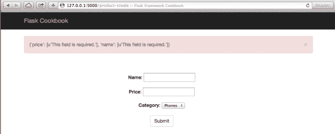
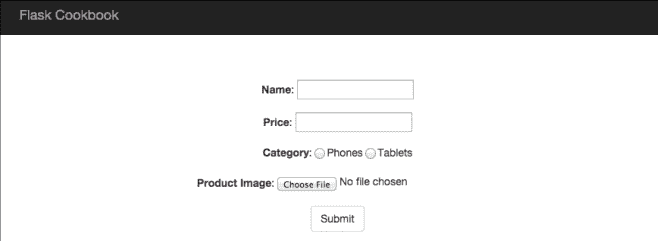
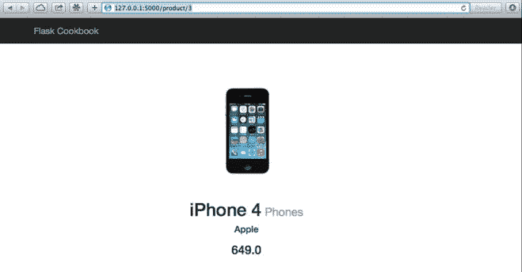
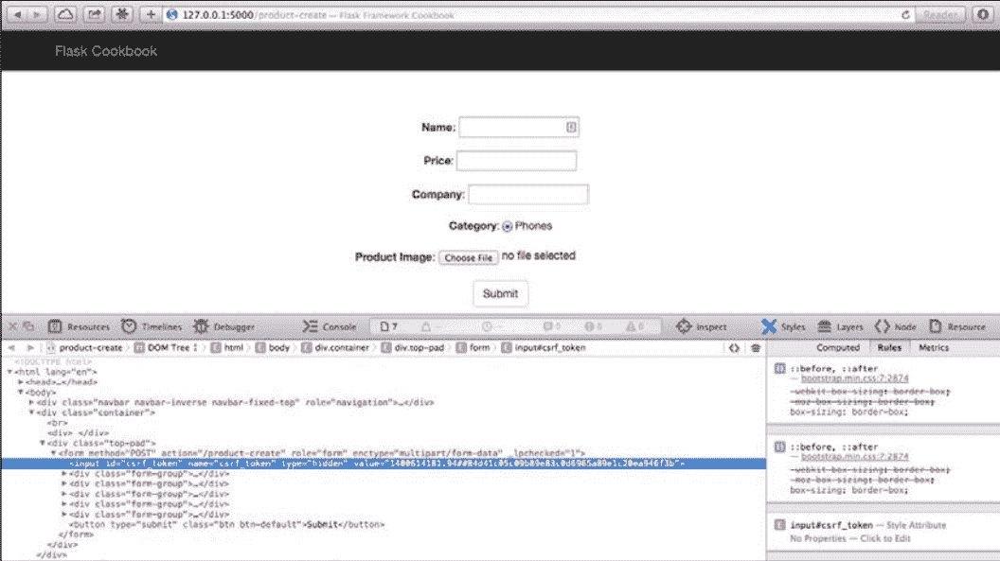

# 第五章：使用 WTForms 处理表单

表单处理是任何应用程序中不可或缺的一部分。无数的案例说明任何 web 应用中表单的存在都是非常重要的。用户登录或者提交一些数据，或者需要从用户得到一些输入，这些都需要表单。和表单同样重要的是表单验证。以交互的方式向用户展示验证信息会提高用户体验。

这一章，将涉及以下小节：

*   SQLAlchemy 模型数据做为表单展现
*   在服务器端验证字段
*   创建一个通用的表单集
*   创建自定义字段和验证
*   创建自定义部件（widget）
*   通过表单上传文件
*   CSRF 保护

## 介绍

web 应用中有许多设计和实现表单的方法。随着 Web2.0 的出现，表单验证和向用户展示验证信息变得非常重要。客户端验证可以在前端使用 JavaScript 和 HTML5 完成。服务端验证在增加应用安全方面扮演一个重要的角色，防止添加任何不正确的数据进入数据库。

WTForms 默认情况下给服务端提供了许多的字段，这加快了开发的速度减少了工作量。它同样提供了根据需要编写自定义验证器和自定义字段的灵活性。
我们这一章将使用一个 Flask 扩展，叫做 Flask-WTF（`https://flask-wtf.readthedocs.org/en/latest/`）。它集成了了 WTForms 和 Flask，为我们处理了大量我们需要做的事情，使得我们开发应用高效更安全。安装它：

```py
$ pip install Flask-WTF 
```

## SQLAlchemy 模型数据作为表单展现

首先，用 SQLAlchemy 模型创建一个表单。我们将用商品目录应用中的商品模型，然后给它添加在前端使用表单创建商品的功能。

#### 准备

我们将用第四章的商品目录应用,为 Product 模型创建一个表。

#### 怎么做

Product 模型看起来像 models.py 里这些代码：

```py
class Product(db.Model):

    id = db.Column(db.Integer, primary_key=True)
    name = db.Column(db.String(255))
    price = db.Column(db.Float)
    category_id = db.Column(db.Integer, db.ForeignKey('category.id'))
    category = db.relationship('Category', backref=db.backref('products', lazy='dynamic'))
    company = db.Column(db.String(100)) 
```

现在，我们将创建一个 ProductForm 类来表示表单需要的字段，ProductForm 将继承由 flask_wtf 提供的 Form 类。

```py
from flask_wtf import Form
from wtforms import TextField, DecimalField, SelectField

class ProductForm(Form):
    name = TextField('Name')
    price = DecimalField('Price'）
    category = SelectField('Category', coerce=int) 
```

我们从 flask-wtf 扩展导入 Form。其他东西比如 fields 和 validators 都是直接从 wtforms 导入的。字段 Name 是 TextField 类型，它需要 text 数据，Price 是 DecimalField 类型，数据将会被解析为 Python 的十进制类型。设置 Category 类型为 SelectField，这意味着，当创建商品时，只能从之前创建好的类别里选择一个。

###### 注意

注意在 category 字段里有一个叫做 coerce 的参数，它的意思是会在任何验证或者处理之前强制转化表单的输入为一个整数。在这里，强制仅仅意味着转换，由一个特定数据类型到另一个不同的数据类型。

views.py 中 create_product()处理程序需要修改：

```py
from my_app.catalog.models import ProductForm

@catalog.route('/product-create', methods=['GET', 'POST'])
def create_product():
    form = ProductForm(request.form, csrf_enabled=False)
    categories = [(c.id, c.name) for c in Category.query.all()]
    form.category.choices = categories
    if request.method == 'POST':
        name = request.form.get('name')
        price = request.form.get('price')
        category = Category.query.get_or_404(
            request.form.get('category')
        )
        product = Product(name, price, category)
        db.session.add(product)
        db.session.commit()
        flash('The product %s has been created' % name, 'success')
        return redirect(url_for('catalog.product', id=product.id))
    return render_template('product-create.html', form=form) 
```

create_product()方法从 POST 请求中的 form 获取参数。这个方法会在 GET 请求时渲染一个空的表单，其中包含预先填充的选项。在 POST 请求中，表单数据将用来创建一个新的商品，并且当商品创建完成的时候，将会展示创建好的商品页。

###### 注意

你将注意到使用`form=ProductForm(request.form, csrf_enabled=False)`时，我们设置 csrf_enabled 为 False。CSRF 是任何应用中重要的一部分。我们将在这章 CSRF 保护一节做详细讨论。

模板`templates/product-create.html`同样需要修改。WTForms 创建的 objects 对象提供了一个简单的方式去创建 HTML 表单，代码如下：

```py



    <div class="top-pad">
        <form method="POST" action="{{ url_for('catalog.create_product') }}" role="form">
            <div class="form-group">{{ form.name.label }}: {{ form.name() }}</div>
            <div class="form-group">{{ form.price.label }}: {{ form.price() }}</div>
            <div class="form-group">{{ form.category.label }}: {{ form.category() }}</div>
            <button type="submit" class="btn btndefault">Submit</button>
        </form>
    </div>
 
```

#### 原理

在一个 GET 请求中，打开`http://127.0.0.1:5000/product-create`，我们将看到和下面截图类似的表单：


你可以填写这个表单去创建一个新的商品。

#### 其他

*   下一小节将帮助理解怎么验证我们刚刚创建的字段

## 在服务器端验证字段

现在有了表单和字段，我们必须验证他们以确保只有正确的数据存入数据库，并且提前处理这些错误，可以避免破坏数据库。这些验证通常可以用来防止 XSS 和 CSRF 攻击。WTForms 提供了许多字段类型，他们自身有默认验证。除了这些，还有一些验证器可以根据选择和需要使用。我们将使用他们其中的一些来进一步理解这个概念。

#### 怎么做

在 WTForm 字段中很容易添加验证器。我们仅仅需要传递一个 validators 参数，它接收要实现的验证器列表。每个验证器有它自己的参数，这使得可以在很大程度上控制验证。
让我们使用 validations 来修改 ProductForm 类：

```py
from decimal import Decimal
from wtforms.validators import InputRequired, NumberRange

class ProductForm(Form):
    name = TextField('Name', validators=[InputRequired()])
    price = DecimalField('Price', validators=[
        InputRequired(), NumberRange(min=Decimal('0.0'))
    ])
    category = SelectField(
        'Category', validators=[InputRequired()], coerce=int
    ) 
```

这里，在许多字段中添加了 InputRequired 验证器，它意味着这些字段是必须填写的，这些字段如果不填写，表单就不会被提交。

Price 字段有一个额外的验证器 NumberRange，并将 min 参数设置为了 0。这意味着，我们不能用小于 0 的值做为商品的价格。为了完成配合这些调整，我们得修改 create_product()：

```py
@catalog.route('/product-create', methods=['GET', 'POST'])
def create_product():
    form = ProductForm(request.form, csrf_enabled=False)
    categories = [(c.id, c.name) for c in Category.query.all()]
    form.category.choices = categories

    if request.method == 'POST' and form.validate():
        name = form.name.data
        price = form.price.data
        category = Category.query.get_or_404(form.category.data)
        product = Product(name, price, category)
        db.session.add(product)
        db.session.commit()
        flash('The product %s has been created' % name, 'success')
        return redirect(url_for('product', id=product.id))
    if form.errors:
        flash(form.errors, 'danger')
    return render_template('product-create.html', form=form) 
```

###### 提示

form.errors 消息将会以 JSON 形式展示表单错误。可以用更好的形式向用户展示他们，这留给你们自己实现。

这里，我们修改了 create_product()方法去验证输入表单的值，并且检查了请求方法类型。在 POST 请求里，表单数据将先进行验证。如果因为一些原因验证失败了，这个页面将重新渲染一遍，并显示一些错误信息在上面。如果验证成功了，并且商品成功创建了，新建的商品将被展示出来。

#### 原理

现在，试着不填写任何字段进行提交。一个错误警告消息会像下面进行展示：



尝试一些非法验证的不同组合，可以看到不同的错误消息提示。

#### 更多

我们可以使用 validate_on_submit 替代既要检查请求类型是 POST 还是 PUT，还要进行表单验证的过程。之前代码是：

```py
if request.method == 'POST' and form.validate(): 
```

可以用下面方法来替代：

```py
if form.validate_on_submit(): 
```

## 创建一个通用的表单集

一个应用取决于设计和目的会存在各种各样的表单。其中大部分都有相同的字段并且有相同的验证器。我们有可能会想，我们能不能将这些共同的表单分离出来并且当需要的时候重用他们，这对于 WTForms 提供的表单定义的类结构来说，是可能的。

#### 怎么做

在商品目录应用中，我们有两个表单，一个用于 Product，一个用于 Category。这些表单都有一个共同的字段：Name。我们可以为这个字段创建一个通用的表单，然后 Product 和 Category 可以使用这个通用表单而不是都去创建一个 Name 字段。通过下面代码，可以实现这个功能：

```py
class NameForm(Form):
    name = TextField('Name', validators=[InputRequired()])

class ProductForm(NameForm):
    price = DecimalField('Price', validators=[
        InputRequired(), NumberRange(min=Decimal('0.0'))
    ])
    category = SelectField(
        'Category', validators=[InputRequired()], coerce=int
    )
    company = TextField('Company', validators=[Optional()])

class CategoryForm(NameForm):
    pass 
```

我们创建了一个通用的表单 NameForm。表单 ProductForm 和 CategoryForm，他们继承了 NameForm，默认有一个名为 Name 的字段。然后根据需要添加其他字段。

我们可以修改 category_create()方法去使用 CategoryForm 创建种类：

```py
@catalog.route('/category-create', methods=['GET', 'POST'])
def create_category():
    form = CategoryForm(request.form, csrf_enabled=False)

    if form.validate_on_submit():
        name = form.name.data
        category = Category(name)
        db.session.add(category)
        db.session.commit()
        flash('The category %s has been created' % name, 'success')
        return redirect(url_for('catalog.category', id=category.id))
    if form.errors:
        flash(form.errors)
    return render_template('category-create.html', form=form) 
```

为了商品类别的创建，需要新增`templates/category-create.html`模板：

```py



    <div class="top-pad">
        <form method="POST" action="{{ url_for('catalog.create_category') }}" role="form">
            <div class="form-group">{{ form.name.label }}: {{ form.name() }}</div>
            <button type="submit" class="btn btndefault">Submit</button>
        </form>
    </div>
 
```

###### 译者注

新版本 Flask 建议用 StringField 代替使用 TextField

#### 原理

新增商品类别表单看起来像这样：


###### 提示

这是演示如何使用通用表单的一个小例子。这种方法的实际好处可以在电子商务应用程序中看到，我们可以使用公共地址表单，然后可以将它们扩展到单独的计费账单和发货地址表单上。

## 创建自定义字段和验证

除了提供一些字段和验证器，Flask 也提供了创建自定义字段和验证器的灵活性。有时，我们需要解析一些表单参数，但是他们不能利用现有的字段来实现。这种情况下，我们需要自定义字段了。

#### 怎么做

在我们的商品目录中，category 使用 SelectField，我们在 create_product()方法的 GET 请求中，填充了该字段。如果该字段可以自行填充将会变得很方便。我们在 models.py 里实现一个自定义的字段 ：

```py
class CategoryField(SelectField):

    def iter_choices(self):
        categories = [(c.id, c.name) for c in Category.query.all()]
        for value, label in categories:
            yield (value, label, self.coerce(value) == self.data)

    def pre_validate(self, form):
        for v, _ in [(c.id, c.name) for c in Category.query.all()]:
            if self.data == v:
                break
            else:
                raise ValueError(self.gettext('Not a valid choice'))

class ProductForm(NameForm):

    price = DecimalField('Price', validators=[
        InputRequired(), NumberRange(min=Decimal('0.0'))
    ])
    category = CategoryField(
        'Category', validators=[InputRequired()], coerce=int
    ) 
```

SelectField 实现了一个叫做`iter_choices()`的方法，这个方法使用`choices`参数提供的值列表填充表单值。我们重写了`iter_choices()`方法，从数据库里直接获取类别的值，这避免了在每次使用表单的时候每次都需要填写字段的麻烦。

###### 提示

这里通过使用 CategoryField 的行为，同样可以使用 QuerySelectField 实现。参见`http://wtforms.readthedocs.org/en/latest/ext.html#wtforms.ext.sqlalchemy.fields.QuerySelectField`寻求更多信息。

views.py 里的 create_product()方法也需要修改。需移除下面两句：

```py
categories = [(c.id, c.name) for c in Category.query.all()]
form.category.choices = categories 
```

## 原理

上面程序不会有任何视觉效果。唯一的更改是在表单中填充类别值，如上一节所解释的那样。

#### 更多

我们刚刚看了如何自定义字段。相似的，我们可以自定义验证器。假设我们不允许有重复的类别。我们可以在模型里很轻松的实现该功能，现在让我们在表单里使用一个自定义验证器：

```py
from wtforms.validators import ValidationError

def check_duplicate_category(case_sensitive=True):
    def _check_duplicate(form, field):
        if case_sensitive:
            res = Category.query.filter(Category.name.like('%' + field.data + '%')).first()
        else:
            res = Category.query.filter(Category.name.ilike('%' + field.data + '%')).first()
        if res:
            raise ValidationError(
                'Category named %s already exists' % field.data
            )
    return _check_duplicate

class CategoryForm(NameForm):
    name = TextField('Name', validators=[
        InputRequired(), check_duplicate_category()
    ]) 
```

我们用工厂方式（factory style）创建了一个装饰器，我们可以根据是否需要区分大小写来获得不同的验证结果。
我们甚至可以使用基于类的设计，这可以使验证器更加通用和灵活，这留给读者自行探索。

## 创建自定义控件（widget）

就像我们创建自定义字段和验证器一样，我们同样可以创建自定义控件。这些控件允许我们控制前端字段看起来像什么样子。每个字段类型都有一个与之关联的控件。WTForms 本身提供了许多基础的 HTML5 的控件。为了理解如何创建一个自定义控件，我们将转换填写商品类别的 select 控件为一个 radio 控件。我想很多人会说，可以直接使用 WTForms 提供的 radio 字段啊！这里我们仅仅尝试去理解并自己实现它。

#### 怎么做

前面小节，我们创建了 CategoryField。这个字段使用了超类（superclass）Select 提供的 Select 控件。让我们用 radio 输入替换 select 控件：

```py
from wtforms.widgets import html_params, Select, HTMLString

class CustomCategoryInput(Select):

    def __call__(self, field, **kwargs):
        kwargs.setdefault('id', field.id)
        html = []
        for val, label, selected in field.iter_choices():
            html.append(
                '<input type="radio" %s> %s' % (html_params(name=field.name, value=val, checked=selected, **kwargs), label)
            )
        return HTMLString(' '.join(html))

class CategoryField(SelectField):
    widget = CustomCategoryInput()

    # Rest of the code remains same as in last recipe Creating custom field and validation 
```

我们在`CategoryField`类中新增了叫做`widget`的类属性。这个`widget`指向了`CustomCategoryInput`，它处理该字段要呈现出来样子的 HTML 代码生成。`CustomCategoryInput`类有一个`__call__`方法，重写了`iter_choices()`提供的值，现在返回`radio`。

#### 原理

当打开`http://127.0.0.1:5000/product-create`，将会看到：


## 通过表单上传文件

通过表单上传文件是许多 Web 框架关注的问题。Flask 和 WTForms 使用了一个简洁的方式为我们处理了。

#### 怎么做

首先需要一点配置。需要向应用配置提供一个参数：`UPLOAD_FOLDER`。这个参数告诉 Flask 上传文件被存储的位置。我们将实现一个存储商品图片的功能。

###### 提示

一种存储商品图片的方式是以二进制的方式存储在数据库里。但是这种方式很低效的，在任何应用中都不推荐使用。我们应该总是将图片和其他文件存储在文件系统中，然后将他们的路径以字符串的形式存储在数据库中。

在`my_app/__init__.py`新增下面配置：

```py
import os

ALLOWED_EXTENSIONS = set(['txt', 'pdf', 'png', 'jpg', 'jpeg', 'gif'])
app.config['UPLOAD_FOLDER'] = os.path.realpath('.') + '/my_app/static/uploads' 
```

###### # 译者注

如果是在 windows 运行程序，需要处理反斜杠。简单方式是将/my_app/static/uploads 更改为\my_app\static\uploads，并且需要新建 uploads 文件夹，当然最好的处理方法是兼容 linux 和 windows 两种不同的文件路径处理方式。

###### 提示

看一下`app.config['UPLOAD_FOLDER']`语句，我们存储图片到 static 里的一个子文件中。这将使得渲染图片变得非常容易。`ALLOWED_EXTENSIONS`语句被用来确保只有特定格式的文件才能被上传。这个列表仅仅用作演示，对于图片，我们可以过滤更多类型。

修改模型文件`my_app/catalog/models.py`：

```py
from wtforms import FileField

class Product(db.Model):
    image_path = db.Column(db.String(255))

    def __init__(self, name, price, category, image_path):
        self.image_path = image_path

class ProductForm(NameForm):
    image = FileField('Product Image') 
```

看`ProductForm`中`image`字段`FileField`，和`Product`中`image_path`字段。这就是之前我们讨论的，在文件系统中存储图片，并在数据库中存储他们的路径。

现在修改文件`my_app/catalog/views.py`里的 create_product()方法来保存文件：

```py
import os
from werkzeug import secure_filename
from my_app import ALLOWED_EXTENSIONS

def allowed_file(filename):
    return '.' in filename and filename.lower().rsplit('.', 1)[1] in ALLOWED_EXTENSIONS

@catalog.route('/product-create', methods=['GET', 'POST'])
def create_product():
    form = ProductForm(request.form, csrf_enabled=False)

    if form.validate_on_submit():
        name = form.name.data
        price = form.price.data
        category = Category.query.get_or_404(form.category.data)
        image = request.files['image']
        filename = ''
        if image and allowed_file(image.filename):
            filename = secure_filename(image.filename)
            image.save(os.path.join(app.config['UPLOAD_FOLDER'], filename))
        product = Product(name, price, category, filename)
        db.session.add(product)
        db.session.commit()
        flash('The product %s has been created' % name, 'success')
        return redirect(url_for('catalog.product', id=product.id))

    if form.errors:
        flash(form.errors, 'danger')
    return render_template('product-create.html', form=form) 
```

我们需要向模板`templates/product-create.html`新增 product-create 表单。修改表单标签定义来包含
enctype 参数，在 Submit 按钮前新增图片字段（或者表单里其他你感觉必要的地方）：

```py
<form method="POST" action="{{ url_for('create_product') }}" role="form" enctype="multipart/form-data">
    <!-- The other field definitions as always -->
    <div class="formgroup">
        {{ form.image.label }}: {{ form.image(style='display:inline;') }}
    </div> 
```

这个表单应该包含参数`enctype="multipart/form-data"`，以便告诉应用该表单参数含有多个数据。

渲染存储在 static 文件夹中的图片非常容易。`templates/product.html`中需要显示图片的地方仅仅需增加 img 标记。

```py
 
```

#### 原理

上传图片的页面将看起来像这样：



创建了商品之后，图片被显示出来像这样：



## CSRF（Cross-site Request Forgery protection)保护

本章第一小节，我们已经知道了 CSRF 是 web 表单安全中重要的一部分。这里我们将讨论细节。CSRF 指的是跨站请求伪造，即一些人黑进了携带 cookie 的请求，然后使用它触发一些破坏性的活动。我们不会讨论 CSRF 的细节，因为网上有很多关于此的资源。我们将讨论 WTForms 怎么帮助我们防止 CSRF。Flask 默认不提供任何 CSRF 保护，因为这得从表单验证层面进行处理，而不是由 Flask 提供。我们可以使用 Flask-WTF 扩展处理这些。

###### 提示

参加`http://en.wikipedia.org/wiki/Cross-site_request_forgery`了解更多 CSRF。

#### 怎么做

Flask-WTF 默认情况下提供的表单是 CSRF 保护的。如果我们看一下之前的小节，可以看到我们明确的告诉表单不要开启 CSRF 保护。我们仅仅需要删除相应的语句就可以使能 CSRF。
所以，`form = ProductForm(request.form, csrf_enabled=False)`将变为`form = ProductForm(request.form)`。
我们应用同样需要做些配置上的改动。

```py
app.config['WTF_CSRF_SECRET_KEY'] = 'random key for form' 
```

默认情况下，CSRF key 和应用 secret key 是一样的。

当 CSRF 启动的时候，我们得在表单里提供一个额外的字段，这是一个隐藏的字段，包含了 CSRF token。WTForms 为我们处理隐藏的字段，我们仅需在表单里添加`{{ form.csrf_token }}`：

```py
<form method="POST" action="/some-action-like-create-product">
    {{ form.csrf_token }}
</form> 
```

很容易嘛！但是表单提交方式不仅这一种。我们同样会通过 AJAX 提交表单；实际上这比使用普通表单很普遍，这种形式也正取代传统 web 应用。
因为这个原因，我们得在应用配置里增加额外的一步：

```py
from flask_wtf.csrf import CsrfProtect

# Add configurations
CsrfProtect(app) 
```

前面的配置将允许我们可以在模板的任何位置通过使用{{ csrf_token() }}获取 CSRF token。现在，有两种方式向 AJAX POST 请求添加 CSRF token。
一种方式是在 script 标签里获取 CSRF token，然后在 POST 请求中使用：

```py
<script type="text/javascript">
    var csrfToken = "{{ csrf_token() }}";
</script> 
```

另外一种方式是在 meta 标签中渲染 token，然后在需要的地方使用它：

```py
<meta name="csrf-token" content="{{ csrf_token() }}"/> 
```

两者之间的区别是，第一种方法可能会在多个地方存在重复，这要取决于应用里 script 标签的数量。

现在，向 AJAX POST 里添加 CSRF token，得先添加 X-CSRFToken 属性。这属性值可以通过之前两种方法里任一一种都可以取得。我们将用第二种方法做为例子：

```py
var csrfToken = $('meta[name="csrf-token"]').attr('content');
$.ajaxSetup({
    beforeSend: function(xhr, settings) {
        if (!/^(GET|HEAD|OPTIONS|TRACE)$/i.test(settings.type)) {
            xhr.setRequestHeader("X-CSRFToken", csrftoken)
        }
    }
}) 
```

这将确保在所有 AJAX POST 请求发出去之前都添加了 CSRF token。

#### 原理

下面的截图显示了我们表单添加了 CSRF token 的样子：



token 是完全随机的，所有请求都是不同的。实现 CSRF-token 生成的方式有很多种，但这些已经超出了本书的范围，但还是鼓励读者去看一下是如何实现的，并且理解他们。

