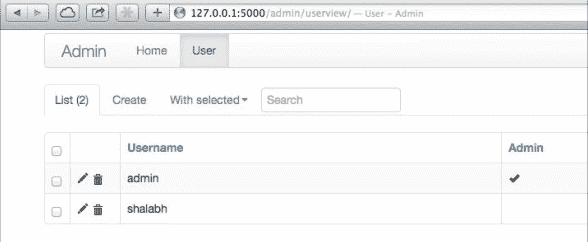
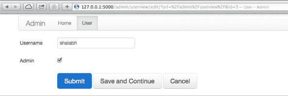
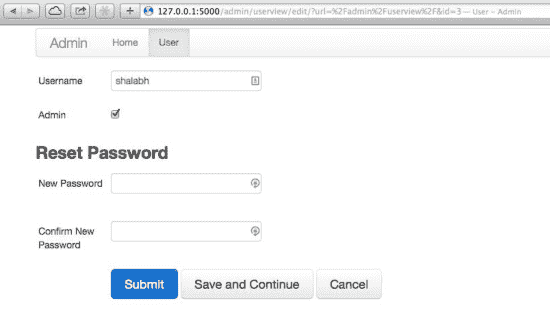
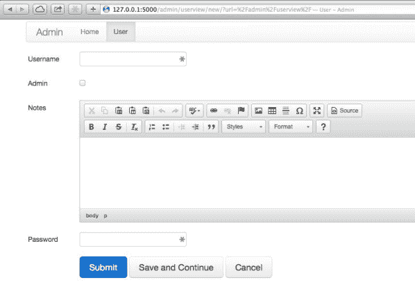

# 第八章：为 Flask 应用提供管理员接口

每个应用需要一些接口给用户提供一些特权，以此来维护和升级应用资源。举个例子，我们可以在电商应用里有这样一个接口：这个接口允许一些特殊用户来创建商品类别和商品等。一些用户可能有权限来处理在网站购物的用户，处理他们的账单信息等等。相似的，还有很多案例需要从应用里隔离出一个接口，和普通用户分开。

这一章将包含下面小节：

*   创建一个简单的 CRUD 接口
*   使用 Flask-Admin 扩展
*   使用 Flask-Admin 注册模型
*   创建自定义表单和行为
*   WYSIWYG 文本集成
*   创建用户角色

## 介绍

和其他 Python web 框架比如 Django 不同的是，Flask 默认情况下不提供管理员接口。尽管如此，这被很多人视为缺点，但这其实是给了开发者去根据需要创建管理员接口的灵活性。
我们可以选择从头开始为我们的应用程序编写管理界面，也可以使用 Flask 扩展。扩展为我们做了大部分的事情，但也允许我们去根据需要自定义逻辑处理。Flask 中一个受欢迎的创建管理员接口的扩展是 Flask-Admin（`https://pypi.python.org/pypi/Flask-Admin`）。这一章我们将从自己创建管理员接口开始，然后使用 Flask-Admin 扩展。

## 创建一个简单的 CRUD 接口

CRUD 指的是 Create，Read，Update，Delete。一个管理员接口必要的能力是可以根据需要创建，修改或者删除应用里的记录/资源。我们将创建一个简单的管理员接口，这将允许管理员用户进行这些操作，而其他普通用户则不能。

#### 准备

我们将从第六章的应用开始，给它添加管理员认证和管理员接口。接口只允许管理员创建，修改，删除用户记录。这一小节，会提到一些特定的内容以帮助理解一些概念。

#### 怎么做

首先修改 models.py，向 User 模型新增一个字段：admin。这个字段将帮助我们区别这个用户是否是管理员。

```py
from wtforms import BooleanField

class User(db.Model):
    id = db.Column(db.Integer, primary_key=True)
    username = db.Column(db.String(60))
    pwdhash = db.Column(db.String())
    admin = db.Column(db.Boolean())

    def __init__(self, username, password, admin=False):
        self.username = username
        self.pwdhash = generate_password_hash(password)
        self.admin = admin

    def is_admin(self):
        return self.admin 
```

前面 is_admin()方法仅仅返回了 admin 字段的值。这个可以根据需要自定义的实现。看下面代码：

```py
class AdminUserCreateForm(Form):
    username = TextField('Username', [InputRequired()])
    password = PasswordField('Password', [InputRequired()])
    admin = BooleanField('Is Admin ?')

class AdminUserUpdateForm(Form):
    username = TextField('Username', [InputRequired()])
    admin = BooleanField('Is Admin ?') 
```

同时，我们创建了两个用在管理员视图里的表单。
现在修改 views.py 里的视图，来完成管理员接口：

```py
from functools import wraps
from my_app.auth.models import AdminUserCreateForm, AdminUserUpdateForm

def admin_login_required(func):
    @wraps(func)
    def decorated_view(*args, **kwargs):
        if not current_user.is_admin:
            return abort(403)
        return func(*args, **kwargs)
    return decorated_view 
```

前面代码是`admin_login_required`装饰器，效果和`login_required`装饰器类似。区别在于它需要使用`login_required`，并且检查当前登录用户是否是管理员。

接下来用来创建管理员接口的处理程序。注意`@admin_login_required`装饰器的使用方法。其他内容和我们之前学到的事一样的，现在只关注视图和认证处理：

```py
@auth.route('/admin')
@login_required
@admin_login_required
def home_admin():
    return render_template('admin-home.html')

@auth.route('/admin/users-list')
@login_required
@admin_login_required
def users_list_admin():
    users = User.query.all()
    return render_template('users-list-admin.html', users=users)

@auth.route('/admin/create-user', methods=['GET', 'POST'])
@login_required
@admin_login_required
def user_create_admin():
    form = AdminUserCreateForm(request.form)
    if form.validate_on_submit():
        username = form.username.data
        password = form.password.data
        admin = form.admin.data
        existing_username = User.query.filter_by(username=username).first()
        if existing_username:
            flash('This username has been already taken. Try another one.', 'warning')
            return render_template('register.html', form=form)
        user = User(username, password, admin)
        db.session.add(user)
        db.session.commit()
        flash('New User Created.', 'info')
        return redirect(url_for('auth.users_list_admin'))
    if form.errors:
        flash(form.errors, 'danger')
    return render_template('user-create-admin.html', form=form) 
```

前面的方法允许管理员用户在系统里创建新用户。这个行为和 register()方法是类似的，但是允许设置用户的 admin 标志。看下面代码:

```py
@auth.route('/admin/update-user/<id>', methods=['GET', 'POST'])
@login_required
@admin_login_required
def user_update_admin(id):
    user = User.query.get(id)
    form = AdminUserUpdateForm(
        rquest.form,
        username=user.username, 
        admin=user.admin
    )

    if form.validate_on_submit():
        username = form.username.data
        admin = form.admin.data

        User.query.filter_by(id=id).update({
            'username': usernmae,
            'admin': admin,
        })
        db.session.commit()
        flash('User Updated', 'info')
        return redirect(url_for('auth.users_list_admin'))

    if form.errors:
        flash(form.errors, 'danger')

    return render_template('user-update-admin.html', form=form, user=user) 
```

前面的方法允许管理员更新其他用户的记录。但是，最好别允许管理员修改任何用户的密码。大多数情况下，只能允许用户自己修改密码。尽管如此，一些情况下，管理员还是有修改密码的权限，但是不应该看到用户设置的密码。看下面代码：

```py
@auth.route('/admin/delete-user/<id>')
@login_required
@admin_login_required
def user_delete_admin(id):
    user = User.query.get(id)
    db.session.delete(user)
    db.session.commit()
    flash('User Deleted.'， 'info')
    return redirect(url_for('auth.users_list_admin')) 
```

`user_delete_admin()`方法实际上应该在 POST 请求里完成。这留给读者自己完成。
下面需要创建模板。从前面视图代码里可以看出，我们需要新增四个模板，分别是`admin-home.html，user-create-admin.html，user-update-admin.html，users-list-admin.html`。下一小节看一下他们如何工作的。读者现在应该可以自己实现这些模板了，作为参考，具体代码可下载本书示例代码。

###### 译者注

原文为 user.delete()，现修改为 db.session.delete(user)。
原味为 if form.validate()，现修改为 if form.validate_on_submit():

#### 原理

我们为应用新增一个菜单条目，这在管理员主页上添加了一个链接，页面看起来像这样：


一个用户必须作为管理员登录才能访问这些页面和其他管理员页面。如果一个用户不是作为管理员登录的，应该展示一个错误，看起来像下面这样：


管理员登录后主页看起来像这样：


管理员可以看到系统里的用户列表也可以创建一个新用户。用户列表页本身也提供了编辑和删除用户的选项。

###### 提示

创建第一个管理员，需要通过使用控制台命令创建一个用户，设置 admin 标记为 True。

## 使用 Flask-Admin 扩展

Flask-Admin 是一个扩展，用来帮助更简单更快速的为应用创建管理员接口。这一小节将专注于使用这个扩展。

#### 准备

首先，需要安装 Flask-Admin 扩展：

```py
$ pip install Flask-Admin 
```

我们扩展上一小节的应用来使用 Flask-Admin 完成它。

#### 怎么做

使用 Flask-Admin 扩展为任何 Flask 应用新增一个简单的管理员接口只需要几句。
我们仅仅需要向应用配置里增加下面几句：

```py
from flask_admin import Admin
app = Flask(__name__)
# Add any other application configuration
admin = Admin(app) 
```

仅仅用 Flask-Admin 扩展提供的 Admin 类初始化应用，只会提供一个基本的管理员界面，看起来像这样：


注意截图里的 URL 是`http://127.0.0.1:5000/admin/`。我们同样可以添加自己的视图，仅仅需要继承 BaseView 类就可以添加一个类作为视图了：

```py
from flask_admin import BaseView, expose

class HelloView(BaseView):
    @expose('/')
    def index(self):
        return self.render('some-template.html') 
```

之后，我们需要在 Flask 配置里添加这个视图到 admin 对象上：

```py
import my_app.auth.views as views
admin.add_view(views.HelloView(name='Hello')) 
```

现在管理员主页看起来像这样：


需要注意的一件事是，默认情况下这个页面没有进行任何的认证，这需要自行实现。因为 Flask-Admin 没有对认证系统做任何的假设。我们的应用使用的是 Flask-Login 进行登录，所以我们可以新增一个方法叫 is_accessible()到 HelloView 类中：

```py
def is_accessible(self):
    return current_user.is_authenticated and current_user.is_admin 
```

###### 译者注

原书为`current_user.is_authenticated() and current_user.is_admin()`，这会报错，不是函数，不能调用，所以需去掉()。

#### 更多

在完成前面的代码之后，还有一个管理员视图不需要认证，任何人就可以访问。这就是管理员主页。为了仅仅向管理员开放这个页面，我们需要继承 AdminIndexView 并完成 is_accessible()方法：

```py
from flask_admin import AdminIndexView

class MyAdminIndexView(AdminIndexView):
    def is_accessible(self):
        return current_user.is_authenticated and current_user.is_admin 
```

之后，需要在应用配置里把这个视图做为 index_view 传递到 admin 对象，实现如下：

```py
admin = Admin(app, index_view=views.MyadminIndexView()) 
```

这个方法使得所有的管理员视图仅向管理员开放。我们还可以在需要时在 is_accessible()中实现任何权限或条件访问规则。

## 使用 Flask-Admin 注册模型

上一小节，我们看到了如何使用 Flask-Admin 扩展在应用里创建管理员接口。这一小节，我们将会看到如何为已存在的模型创建管理员接口/视图，使得可以进行 CRUD 操作。

#### 准备

我们将扩展上一小节应用来为 User 模型创建管理员接口。

#### 怎么做

使用 Flask-Admin 注册一个模型到管理员接口里是非常简单的。需要像下面这样添加几行代码：

```py
from flask_admin.contrib.sqla import ModelView

# Other admin configuration as shown in last recipe
admin.add_view(ModelView(views.User, db.session)) 
```

这里，第一行，我们从 flask_admin.contrib.sqla 导入了 ModelView。flask_admin.contrib.sqla 是由 Flask-Admin 提供的一个继承 SQLAlehcmy 模型的视图。这将为 User 模型创建一个新的管理员视图。视图看起来像这样：


看前面的截图，很多人都会认为向用户显示密码的哈希值是没有意义的。同时，Flask-Admin 默认的模型创建机制在创建 User 时会失败，因为我们 User 模型里有一个`__init__()`方法。这个方法期望三个字段，然而 Flask-Admin 里面的模型创建逻辑是非常通用的，在模型创建的时候不会提供任何值。
现在，我们将自定义 Flask-Admin 的一些默认行为，来修改 User 创建机制，以及隐藏视图里的密码哈希值：

```py
class UserAdminView(ModelView):
    column_searchable_list = ('username',)
    column_sortable_list = ('username', 'admin')
    column_exclude_list = ('pwdhash',)
    form_excluded_columns = ('pwdhash',)
    form_edit_rules = ('username', 'admin')

    def is_accessible(self):
        return current_user.is_authenticated and current_user.is_admin 
```

前面的代码展示了 User 的管理员视图遵循的一些规则和配置。其中有一些是很容易理解的。可能会对`column_exclude_list`和`form_excluded_columns`有点困惑。前者将排除管理员视图自身提供的列，不能在搜索，创建和其他 CRUD 操作里使用这些列。后者将防止在 CRUD 表单上显示这些字段。看下面代码：

```py
def scaffold_form(self):
    form_class = super(UserAdminView, self).scaffold_form()
    form_class.password = PasswordField('Password')
    return form_class 
```

前面方法将重写模型的表单创建，添加了一个密码字段，这将替换密码哈希值。看下面代码：

```py
def create_model(self, form):
    model = self.model(
            form.username.data, form.password.data, form.admin.data
        )
    form.populate_obj(model)
    self.session.add(model)
    self._on_model_change(form, model, True)
    self.session.commit() 
```

前面方法重写了模型创建逻辑，以适应我们的应用。
为了在应用配置里向 admin 对象添加一个模型，得像下面这样编码：

```py
admin.add_view(views.UserAdminView(views.User, db.session)) 
```

#### 提示

看`self._on_model_change(form, model, True)`一句。最后一个参数 True 表示调用是为了创建一个新的记录。

User 模型的管理员界面将看起来像下面这样：



这里有一个搜索框，没有显示密码哈希值。用户创建和编辑视图也有更改，建议读者亲自运行这个程序看看效果。

## 创建自定义表单和动作

这一小节，我们将使用 Flask-Admin 提供的表单来创建自定义的表单。同时将使用自定义表单创建一个自定义动作。

#### 准备

上一小节，我们看到 User 更新表单没有更新密码的选项。表单看起来像这样：



这一小节，我们将自定义这个表单允许管理员为任何用户更改密码。

#### 怎么做

完成这个特性仅仅需要修改 views.py。首先，我们从 Flask-Admin 表单里导入 rules 开始：

```py
from flask_admin.form import rules 
```

上一小节，`form_edit_rules`设置了两个字段：username 和 admin。这表示 User 模型更新视图中可供管理用户编辑的字段。

更新密码不是一个简单的事情，不是向列表 form_edit_rules 仅仅添加一个或者多个字段就可以完成的。因为我们不能存储密码的明文。我们得存储密码的哈希值，这不能被任何用户直接修改。我们需要用户输入密码，然后在存储的时候转为一个哈希值进行存储。我们将看到如何在下面的代码里实现这个：

```py
form_edit_rules = (
    'username', 'admin',
    rules.Header('Reset Password'),
    'new_password', 'confirm'
)
form_create_rules = (
    'username', 'admin', 'notes', 'password'
) 
```

前面代码表示现在表单有了一个 header，它将密码重置部分和其他部分分离开了。之后，我们将新增两个字段 new_password 和 confirm，这将帮助我们安全的修改密码：

```py
def scaffold_form(self):
    form_class = super(UserAdminView, self).scaffold_form()
    form_class.password = PasswordField('Password')
    form_class.new_password = PasswordField('New Password')
    form_class.confirm = PasswordField('Confirm New Password')
    return form_class 
```

`scaffold_form()`方法需要修改，以便使得这两个新的字段在表单渲染的时候变得有效。
最后，我们将实现 update_model()方法，这在更新记录的时候会被调用：

```py
def update_model(self, form, model):
    form.populate_obj(model)
    if form.new_password.data:
        if form.new_password.data != form.confirm.data:
            flash('Passwords must match')
            return
        model.pwdhash = generate_password_hash(form.new_password.data)
    self.session.add(model)
    self._on_model_change(form, model, False)
    self.session.commit() 
```

前面代码中，我们首先确保两个字段中输入的密码是一样的。如果是，我们将继续重置密码以及任何其他更改。

###### 提示

看`self._on_model_change(form, model, False)`。这里最后一个参数 False 表示这个调用不能用于创建一个新记录。这同样用在了上一小节创建用户那里。那个例子中，最后一个参数设置为了 True。

#### 原理

用户更新表单看起来像下面这样：



如果我们在两个密码字段里输入的密码是相同的，才会更新用户密码。

## WYSIWYG 文本集成

做为一个网站的用户，我们都知道使用传统的 textarea 字段编写出漂亮的格式化的文本是一个噩梦。有许多插件使得生活变得美好，可以转换简单的文本字段到 What you see is what you get（WYSIWYG）编辑器。CKEditor 就是这样一个编辑器。这是一个开源项目，提供了非常好的扩展，并且有大型社区的支持。同时允许用户根据需要构建附加物（add-ons）。

#### 准备

我们从向 User 模型新增一个新的 notes 字段开始，然后使用 CKEditor 集成这个字段来编写格式化的文本。这会添加额外的 Javascript 库和 CSS 类到普通 textarea 字段中，以将其转换为与 CKEditor 兼容的 textarea 字段。

#### 怎么做

首先，我们将向 User 模型添加 notes 字段，看起来像这样：

```py
class User(db.Model):
    id = db.Column(db.Integer, primary_key=True)
    username = db.Column(db.String(60))
    pwdhash = db.Column(db.String())
    admin = db.Column(db.Boolean())
    notes = db.Column(db.UnicodeText)

    def __init__(self, username, password, admin=False, notes=''):
        self.username = username
        self.pwdhash = generate_password_hash(password)
        self.admin = admin
        self.notes = notes 
```

之后，我们将创建一个自定义的 wtform 控件和一个字段:

```py
from wtforms import widgets, TextAreaField

class CKTextAreaWidget(widgets.TextArea):
    def __call__(self, field, **kwargs):
        kwargs.setdefault('class_', 'ckeditor')
        return super(CKTextAreaWidget, self).__call__(field, **kwargs) 
```

在前面自定义控件中，我们向 TextArea 控件添加了一个 ckeditor 类。如果需要了解更多的 WTForm 控件，参见第五章创建一个自定义控件这一节。看下面代码：

```py
class CKTextAreaField(TextAreaField):
    widget = CKTextAreaWidget() 
```

前面代码里，我们设置控件为 CKTextAreaWidget，当这个文本字段进行渲染的时候，CSS 类 ckeditor 会被添加进去。

接下来，我们需要修改 UserAdminView 类中表单规则，我们可以指定创建和编辑表单时使用的模板。我们同样需要用 CKTextAreaField 重写 TextAreaField：

```py
form_overrides = dict(notes=CKTextAreaField)
create_template = 'edit.html'
edit_template = 'edit.html' 
```

前面的代码中，form_overrides 允许用 CKTextAreaFiled 字段替代普通的 textarea 字段。

剩下部分是之前提到的`templates/edit.html`模板：

```py



    {{ super() }}
    <script src="http://cdnjs.cloudflare.com/ajax/libs/ckeditor/4.0.1/ckeditor.js"></script>
 
```

这里，我们扩展 Flask-Admin 提供的默认 edit.html，向里面添加了 CKEditors JS 文件，这样 ckeditors 类的 CKTextAreaField 才可以使用。

#### 原理

在做了这些修改之后，用户创建表单将看起来像这样，需注意 Notes 字段：



这里，任何在 Note 字段里输入的东西将会在保存的时候被自动转成 HTML，这使得可以用在任何地方以进行显示。

## 创建用户权限

现在为止，我们看到了使用 is_accessible()方法可以轻松地创建对特定管理用户可访问的视图。可以将其扩展到不同类型的场景，特定用户只能查看特定视图。在模型中，还有另一种在更细粒度级别上实现用户角色的方法，其中角色决定用户是否能够执行所有或部分 CRUD 操作。

#### 准备

这一小节，我们将看到一种创建用户角色的基本方法，其中管理员用户只能执行他们有权执行的操作。

###### 提示

记住这只是完成用户角色的一种方法。还有很多更好的方法，但是现在讲解的方式是演示创建用户角色的最好例子。
一个合适的方法是去创建用户组，给用户组分配角色而不是个人用户。另一种方法可以是基于复杂策略的用户角色，包括根据复杂的业务逻辑定义角色。这种方法通常被企业系统所采用比如 ERP，CRM 等等。

#### 怎么做

首先，我们向 User 模型添加一个字段：roles：

```py
class User(db.Model):
    id = db.Column(db.Integer, primary_key=True)
    username = db.Colum(db.String(60))
    pwdhash = db.Column(db.String())
    admin = db.Column(db.Boolean())
    notes = db.Column(db.UnicodeText)
    roles = db.Column(db.String(4))

    def __init__(self, username, password, admin=False, notes='', roles='R'):
        self.username = username
        self.pwdhash = generate_password_hash(password)
        self.admin = admin
        self.notes = notes
        self.roles = self.admin and self.roles or '' 
```

这里，我们添加了一个新的字段：roles，这个字段是长度为 4 的字符串字段。我们假定任何用户这个字段值是 C,R,U,D 的组合。一个用户如果 roles 字段值是 CRUD，即有执行所有操作的权限。缺少哪个权限就不允许执行相应的动作。读权限是对任何管理员开放的。

接下来，我们需要对 UserAdminView 类做一些修改：

```py
from flask.ext.admin.actions import ActionsMixin

class UserAdminView(ModelView, ActionsMixin):

    form_edit_rules = (
        'username','admin','roles','notes',
        rules.Header('Reset Password'),
        'new_password', 'confirm'
    )

    form_create_rules = (
        'username','admin','roles','notes','password'
    ) 
```

前面的代码中，我们仅仅向创建和编辑表单里添加了 roles 字段。我们同样继承了一个叫做 ActionsMixin 的类。这在大规模更新时（如大规模删除）是必须的。看下面代码：

```py
def create_model(self, form):
    if 'C' not in current_user.roles:
        flash('You are not allowed to create users.', 'warning')
        return
    model = self.model(
        form.username.data, form.password.data, form.admin.data,
        form.notes.data
    )
    form.populate_obj(model)
    self.session.add(model)
    self._on_model_change(form, model, True)
    self.session.commit() 
```

这个方法里，首先检查当前用户 roles 字段是否含有创建的权限（是否有 C）。如果没有，就显示一个错误，然后返回。看下面代码：

```py
 def update_model(self, form, model):
    if 'U' not in current_user.roles:
        flash('You are not allowed to edit users.', 'warning')
        return
    form.populate_obj(model)
    if form.new_password.data:
        if form.new_password.data != form.confirm.data:
            flash('Passwords must match')
            return
        model.pwdhash = generate_password_hash(form.new_password.data)
    self.session.add(model)
    self._on_model_change(form, model, False)
    self.session.commit() 
```

这个方法中，我们首先检查当前用户 roles 字段是否含有修改记录的权限（是否有 U）。如果没有，就显示一个错误，然后返回。看下面代码：

```py
def delete_model(self, model):
    if 'D' not in current_user.roles:
        flash('You are not allowed to delete users.', 'warning')
        return
    super(UserAdminView, self).delete_model(model) 
```

相似的，这里我们检查当前用户是否被允许去删除记录。看下面代码：

```py
def is_action_allowed(self, name):
    if name == 'delete' and 'D' not in current_user.roles:
        flash('You are not allowed to delete users.', 'warning')
        return False
    return True 
```

前面方法中，我们检查当前操作是否是 delete 并且检查当前用户是否被允许去删除。如果不，就显示一个错误，返回一个 False。

#### 原理

这一小节代码的效果和之前应用运行起来的效果类似，但是，现在用户只有有了相应的权限才能执行相应的操作。否则将显示错误信息。

用户列表看起来像下面这样：


测试其余的功能，比如创建用户（普通用户或者管理员用户），删除用户，更新用户等等，这些读者最好自己尝试做一遍。
