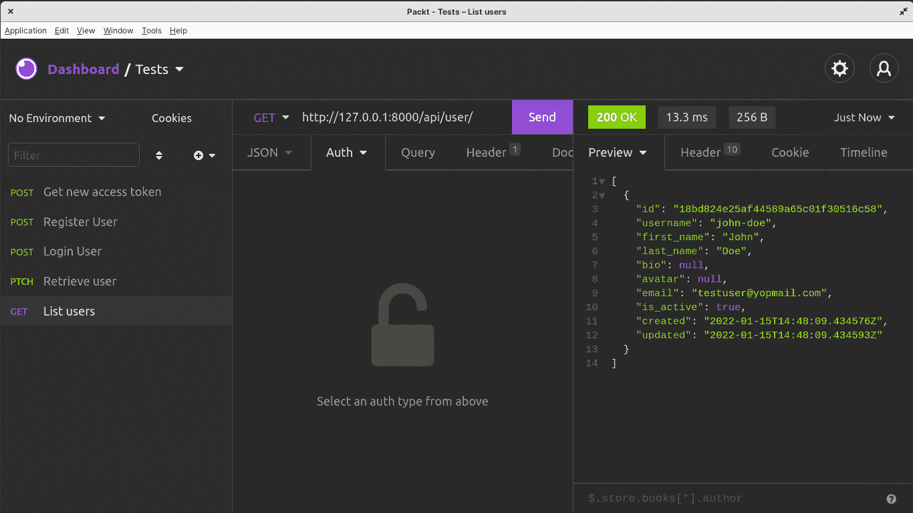

# 第二章：使用 JWT 进行认证和授权

在本章中，我们将更深入地探讨 Django 及其架构。我们将使用**模型**、**序列化器**和**视图集**来创建一个可以接收 HTTP 请求并返回响应的 API。这将通过构建一个使用**JSON Web Tokens**（JWT）的认证和授权系统来实现，以允许用户创建账户、登录和登出。

到本章结束时，您将能够创建 Django 模型、编写 Django 序列化器和验证、编写视图集来处理 API 请求、通过 Django REST 路由器公开视图集、基于 JWT 创建认证和授权系统，并理解 JWT 是什么以及它如何帮助进行认证和权限管理。

在本章中，我们将介绍以下主题：

+   理解 JWT

+   组织项目

+   创建用户模型

+   编写用户注册功能

+   添加登录功能

+   刷新逻辑

# 技术要求

对于本章内容，您需要在您的机器上安装 Insomnia 来向我们将要构建的 API 发送请求。

您也可以在[`github.com/PacktPublishing/Full-stack-Django-and-React/tree/chap2`](https://github.com/PacktPublishing/Full-stack-Django-and-React/tree/chap2)找到本章的代码。

# 理解 JWT

在编写认证功能之前，让我们解释一下 JWT 是什么。如前所述，**JWT**代表**JSON Web Token**。它是网络应用程序中最常用的认证方式之一，同时也帮助进行授权和信息交换。

根据 RFC 7519，JWT 是一个 JSON 对象，被定义为在双方之间安全传输信息的方式。JWT 传输的信息是数字签名的，因此可以被验证和信任。

JWT 包含三个部分——一个头部（`x`）、一个负载（`y`）和一个签名（`z`），它们由点分隔：

```py
xxxxx.yyyyy.zzzzz
```

+   **头部**

JWT 的头部由两部分组成：令牌类型和使用的签名算法。签名算法用于确保消息的真实性且未被篡改。

下面是一个头部的示例：

```py
{
    "alg": "RSA",
    "typ": "JWT"
}
```

签名算法是用于为您的应用程序或 API 签发令牌的算法。

+   **负载**

负载是包含声明的第二部分。根据官方 JWT 文档([`jwt.io/introduction`](https://jwt.io/introduction))，声明是关于一个实体（通常是用户）及其附加数据的陈述。

下面是一个负载的示例：

```py
{
  "id": "d1397699-f37b-4de0-8e00-948fa8e9bf2c",
  "name": "John Doe",
  "admin": true
}
```

在前面的示例中，我们有三个声明：用户的 ID、用户的名字，以及一个表示用户类型的布尔值。

+   **签名**

JWT 的签名是由编码的头部、编码的负载加上一个密钥，以及头部中指定的算法组合并签名而成的。

例如，可以使用 RSA 算法以下方式创建签名：

```py
RSA(
  base64UrlEncode(header) + "." +
  base64UrlEncode(payload),
  secret)
```

签名的作用是跟踪信息是否被更改。

但 JWT 实际上是如何在身份验证中使用的呢？

## 理解 JWT 在身份验证中的应用

每次用户成功登录时，都会创建并返回一个 JWT。JWT 将作为用于访问受保护资源的凭证。由于可以在 JWT 中存储数据，这使得它容易受到攻击。这就是为什么在创建 JWT 时应该指定一个过期时间。

在这本书中，我们将以两种方式使用 JWT。为了简单起见，我们将有两种类型的令牌：

+   **访问令牌**：用于访问资源和处理授权

+   **刷新令牌**：用于获取新的访问令牌

但为什么使用两个令牌呢？正如我们之前所述，JWT 是在用户登录时生成的。此外，用于访问资源的 JWT 应该有很短的生命周期。这意味着 JWT 过期后，用户必须一次又一次地登录——而且没有用户希望登录页面每 5 分钟就出现一次。

这就是刷新令牌有用的地方。它将包含验证用户和生成新访问令牌所需的基本信息。

现在我们已经了解了 JWT 的目的，让我们在创建用户模型的同时，更多地了解 Django 中的模型以及它们解决的问题。

# 组织项目

当使用 Django 工作时，你需要创建许多应用程序来处理项目的不同部分。例如，你可以为身份验证有一个不同的应用程序，为支付或文章有另一个应用程序。为了有一个干净且组织良好的项目，我们可以创建一个 Django 应用程序，它将包含我们将为这本书创建的所有应用程序。

在项目的根目录下，运行以下命令：

```py
django-admin startapp core
```

将创建一个新的应用程序。删除此应用程序中除`apps.py`文件和`__init__.py`文件之外的所有文件。在`apps.py`内部，添加以下行：

core/apps.py

```py
from django.apps import AppConfig
class CoreConfig(AppConfig):
   default_auto_field = 'django.db.models.BigAutoField'
   name = 'core'
   label = 'core'
```

在项目的`setting.py`文件中注册应用程序：

CoreRoot/settings.py

```py
# Application definition
INSTALLED_APPS = [
   'django.contrib.admin',
   'django.contrib.auth',
   'django.contrib.contenttypes',
   'django.contrib.sessions',
   'django.contrib.messages',
   'django.contrib.staticfiles',
   'core'
]
```

`INSTALLED_APPS`是 Django 设置配置，它是一个项目内 Django 应用程序的列表。

我们现在可以自信地创建用户应用程序并编写我们的第一个模型。

# 创建用户模型

除非你正在创建一个简单的 Web 应用程序，否则很难避免与数据库交互的必要性，尤其是拥有需要用户注册或登录才能使用你的 Web 应用程序的账户功能。

在讨论账户功能之前，让我们更多地了解 Django 模型以及它们解决的问题。

## Django 模型是什么？

如果你需要将你的应用程序连接到数据库，尤其是**SQL**，首先想到的假设是你将不得不直接通过 SQL 查询与数据库进行交互——如果这是真的，那可能很有趣，但并非对每个人来说都是如此；一些开发者可能会发现 SQL 很复杂。你不再专注于用你自己的语言编写应用程序逻辑。一些任务可能会变得重复，例如编写 SQL 脚本来创建表、从数据库中获取条目或插入或更新数据。

正如你所看到的，随着代码库的不断发展，维护代码库中的简单和复杂 SQL 查询变得越来越困难。如果你正在使用多个数据库，这个问题会更加严重，这需要你学习许多 SQL 语言。例如，有许多 SQL 数据库，每个数据库都以自己的方式实现 SQL。

幸运的是，在 Django 中，这个问题通过使用 Django 模型来访问数据库得到了解决。这并不意味着你不需要编写 SQL 查询：只是说，除非你想这么做，否则你不必使用 SQL。

Django 模型为底层数据库提供了 **对象关系映射**（**ORM**）。ORM 是一个工具，通过提供对象和数据库之间简单的映射来简化数据库编程。然后，你不必一定知道数据库结构或编写复杂的 SQL 查询来操作或从数据库中检索数据。

例如，在 SQL 中创建一个表需要编写一个长的 SQL 查询。在 Python 中做这件事只需要编写一个继承自 `django.db` 包的类（*图 2.1*）：


图 2.1 – Django ORM 与 SQL 查询的比较

在前面的图中，你可以看到 SQL 语句，它需要一些语法知识，以及字段和选项。Django ORM 的第二个代码块做了完全相同的事情，但以更 Pythonic 和更简洁的方式。

使用 Django 编写模型具有几个优点：

+   **简洁性**：在 Python 中编写查询可能不如在 SQL 中编写清晰，但它更不容易出错，也更高效，因为你不需要在尝试理解代码之前控制你正在使用的数据库类型。

+   **一致性**：SQL 在不同的数据库之间是不一致的。使用 Django 模型创建了一个抽象层，有助于你专注于最重要的任务。

+   **跟踪**：与 Django 模型一起工作，跟踪数据库设计变更甚至更容易。这是通过阅读用 Python 编写的迁移文件来完成的。我们将在下一章中进一步讨论这个问题。

注意，你还可以访问模型管理器。Django 管理器是一个类，它作为一个接口，通过它 Django 模型与数据库交互。每个 Django 模型默认继承自 `models.Manager` 类，该类提供了在数据库表上执行 **创建、读取、更新和删除**（**CRUD**）操作所必需的方法。

现在我们对 Django 模型有了更好的理解，让我们在这个项目中创建第一个模型，即 `User` 模型。通过使用我们的第一个模型，我们还将学习如何使用 Django ORM 的基本方法来执行 CRUD 操作。

## 编写用户模型

在前面的部分中，我们看到了模型是如何作为一个类来表示的，以及它基本上可以创建为数据库中的表。

谈到`User`模型，Django 自带一个预构建的`User`模型类，你可以用它来进行基本认证或会话。它实际上提供了一个认证功能，你可以用它快速为你的项目添加认证和授权。

虽然这对于大多数用例来说都很棒，但它也有其局限性。例如，在这本书中，我们正在构建一个社交媒体网络应用程序。这个应用程序中的用户将有一些简介或甚至一个头像。为什么不能也有一个电话号码用于**双因素****认证**（2FA）呢？

实际上，Django 的`User`模型并没有包含这些字段。这意味着我们需要扩展它并拥有自己的用户模型。这也意味着我们还需要为创建用户和超级用户添加自定义方法到管理器中。这将加快编码过程。在 Django 中，超级用户是具有管理员权限的用户。

在创建模型之前，我们实际上需要一个应用程序，并注册它。Django 应用程序是 Django 项目的子模块。它是一个 Python 包，旨在在 Django 项目中工作并遵循 Django 约定，例如包含文件或子模块，如`models`、`tests`、`urls`和`views`。

### 创建用户应用程序

要在这个项目中启动一个新的应用程序，请运行以下命令：

```py
cd core && django-admin startapp user
```

这将创建一个包含新文件的新包（目录）。以下是目录结构：

```py
├── admin.py
├── apps.py
├── __init__.py
├── migrations
│   └── __init__.py
├── models.py
├── tests.py
└── views.py
```

现在，我们可以自信地开始编写`User`模型。以下是我们在数据库中想要拥有的`User`表的结构：


图 2.2 – 用户表结构

下面是关于`User`表结构的代码：

core/user/models.py

```py
import uuid
from django.contrib.auth.models import AbstractBaseUser,
    BaseUserManager, PermissionsMixin
from django.core.exceptions import ObjectDoesNotExist
from django.db import models
from django.http import Http404
class User(AbstractBaseUser, PermissionsMixin):
   public_id = models.UUIDField(db_index=True, unique=True,
       default=uuid.uuid4, editable=False)
   username = models.CharField(db_index=True,
       max_length=255, unique=True)
   first_name = models.CharField(max_length=255)
   last_name = models.CharField(max_length=255)
   email = models.EmailField(db_index=True, unique=True)
   is_active = models.BooleanField(default=True)
   is_superuser = models.BooleanField(default=False)
   created = models.DateTimeField(auto_now=True)
   updated = models.DateTimeField(auto_now_add=True)
   USERNAME_FIELD = 'email'
   REQUIRED_FIELDS = ['username']
   objects = UserManager()
   def __str__(self):
       return f"{self.email}"
   @property
   def name(self):
       return f"{self.first_name} {self.last_name}"
```

Django 的`models`模块提供了一些字段工具，可以用来编写字段并添加一些规则。例如，`CharField`代表在`User`表中创建的字段类型，类似于`BooleanField`。`EmailField`也是`CharField`，但被重新编写以验证传递给此字段的电子邮件值。

我们还将`EMAIL_FIELD`设置为电子邮件，将`USERNAME_FIELD`设置为用户名。这将帮助我们有两个登录字段。用户名可以是用户的实际用户名，也可以是用于注册的电子邮件地址。

我们还有像`name`这样的方法，这基本上是一个模型属性。然后，它可以在`User`对象的任何地方访问，例如`user.name`。我们还在重新编写`__str__`方法，以便返回一个可以帮助我们快速识别`User`对象的字符串。

### 创建用户和超级用户

接下来，让我们编写`UserManager`，这样我们就可以有创建用户和超级用户的方法：

core/user/models.py

```py
class UserManager(BaseUserManager):
   def get_object_by_public_id(self, public_id):
       try:
           instance = self.get(public_id=public_id)
           return instance
       except (ObjectDoesNotExist, ValueError, TypeError):
           return Http404
   def create_user(self, username, email, password=None,
        **kwargs):
       """Create and return a `User` with an email, phone
           number, username and password."""
       if username is None:
           raise TypeError('Users must have a username.')
       if email is None:
           raise TypeError('Users must have an email.')
       if password is None:
           raise TypeError('User must have an email.')
       user = self.model(username=username,
           email=self.normalize_email(email), **kwargs)
       user.set_password(password)
       user.save(using=self._db)
       return user
   def create_superuser(self, username, email, password,
       **kwargs):
       """
       Create and return a `User` with superuser (admin)
           permissions.
       """
       if password is None:
           raise TypeError('Superusers must have a
           password.')
       if email is None:
           raise TypeError('Superusers must have an
               email.')
       if username is None:
           raise TypeError('Superusers must have an
           username.')
       user = self.create_user(username, email, password,
           **kwargs)
       user.is_superuser = True
       user.is_staff = True
       user.save(using=self._db)
       return user
```

对于`create_user`方法，我们基本上确保字段如`password`、`email`、`username`、`first_name`和`last_name`不是`None`。如果一切正常，我们可以自信地调用模型，设置密码，并将用户保存到表中。

这是通过使用`save()`方法完成的。

`create_superuser`也遵循`create_user`方法的操作——这是非常正常的，因为毕竟，超级用户只是一个具有管理员权限的用户，并且`is_superuser`和`is_staff`字段也设置为`True`。一旦完成，我们将新的`User`对象保存到数据库中并返回用户。

看一下`save`方法，它将`User`对象所做的更改提交到数据库。

模型已编写，现在我们需要运行迁移以在数据库中创建表。

### 运行迁移并测试模型

在运行迁移之前，我们需要在`CoreRoot/settings.py`中的`INSTALLED_APPS`中注册用户应用程序。

首先，让我们重写用户的`apps.py`文件。它包含 Django 将用于定位应用程序的应用程序配置。我们还要为应用程序添加一个标签：

core/user/apps.py

```py
from django.apps import AppConfig
class UserConfig(AppConfig):
   default_auto_field = 'django.db.models.BigAutoField'
   name = 'core.user'
   label = 'core_user'
Let's register the application now:
   'core',
   'core.user'
]
```

让我们现在在`INSTALLED_APPS`设置中注册应用程序：

CoreRoot/settings.py

```py
...
   'core',
   'core.user'
]
```

我们还需要告诉 Django 使用这个`User`模型作为认证用户模型。在`settings.py`文件中，添加以下行：

CoreRoot/settings.py

```py
AUTH_USER_MODEL = 'core_user.User'
```

太好了——我们现在可以为用户应用程序创建第一个迁移：

```py
python manage.py makemigrations
```

您将得到类似的输出：

```py
Migrations for 'core_user':
  core/user/migrations/0001_initial.py
    - Create model User
```

让我们将此修改迁移到数据库中：

```py
python manage.py migrate
```

表已创建在数据库中。让我们使用 Django shell 来稍微玩一下新创建的模型：

```py
python manage.py shell
```

让我们导入模型并添加一个包含创建用户所需数据的字典：

```py
Python 3.10.1 (main, Dec 21 2021, 17:46:38) [GCC 9.3.0] on linux
Type "help", "copyright", "credits" or "license" for more information.
(InteractiveConsole)
>>> from core.user.models import User
>>> data_user = {
... "email": "testuser@yopmail.com",
... "username": "john-doe",
... "password": "12345",
... "first_name": "John",
... "last_name": "Doe"
... }
>>> user =  User.objects.create_user(**data_user)
The user is created in the database. Let's access some properties of the user object.
>>> user.name
'John Doe'
>>> user.email
'testuser@yopmail.com'
>>> user.password
'pbkdf2_sha256$320000$NxM7JZ0cQ0OtDzCVusgvV7$fM1WZp7QhHC3QEajnb Bjo5rBPKO+Q8ONhDFkCV/gwcI='
```

太好了——我们刚刚编写了模型并创建了第一个用户。然而，网络浏览器不会直接从我们的数据库中读取用户数据——更糟糕的是，我们正在处理一个 Python 原生对象，而大多数浏览器或客户端在向我们的服务器发出请求时主要支持 JSON 或 XML。一个想法是使用`json`库，但我们正在处理一个复杂的数据结构；复杂的数据结构可以很容易地通过序列化器处理。

让我们在下一节编写序列化器。

## 编写 UserSerializer

序列化器允许我们将复杂的 Django 数据结构，如`QuerySet`或模型实例，转换为 Python 原生对象，这些对象可以轻松地转换为 JSON 或 XML 格式。然而，序列化器也可以将 JSON 或 XML 序列化为原生 Python。您可以使用`serializers`包来编写序列化器，并在使用此序列化器对端点进行 API 调用时进行验证。让我们先安装 DRF 包并进行一些配置：

```py
pip install djangorestframework django-filter
```

不要忘记将以下内容添加到`requirements.txt`文件中：

requirements.txt

```py
Django==4.0.1
psycopg2-binary==2.9.3
djangorestframework==3.13.1
django-filter==21.1
```

我们还添加了`django-filter`以支持数据过滤。让我们将`rest_framework`添加到`INSTALLED_APPS`设置中：

CoreRoot/settings.py

```py
INSTALLED_APPS = [
    ...
    'rest_framework',
]
```

在`core/user`目录中，创建一个名为`serializers.py`的文件。此文件将包含`UserSerializer`类：

core/user/serializers.py

```py
from rest_framework import serializers
from core.user.models import User
class UserSerializer(serializers.ModelSerializer):
   id = serializers.UUIDField(source='public_id',
       read_only=True, format='hex')
   created = serializers.DateTimeField(read_only=True)
   updated = serializers.DateTimeField(read_only=True)
   class Meta:
       model = User
       fields = ['id', 'username', 'first_name',
           'last_name', 'bio', 'avatar', 'email',
           'is_active', 'created', 'updated']
       read_only_field = ['is_active']
```

`UserSerializer`类继承自`serializers.ModelSerializer`类。这是一个继承自`serializers.Serializer`类的类，但它具有对支持模型的深度集成。它将自动将模型的字段与正确的验证匹配。

例如，我们已声明电子邮件是唯一的。那么，每次有人注册并输入数据库中已存在的电子邮件地址时，他们都会收到关于此的错误消息。

`fields`属性包含所有可读或可写的字段。然后，我们还有只读字段。这意味着它们不能被修改，这样当然更好。为什么给外部用户修改`created`、`updated`或`id`字段的可能性呢？

现在有了`UserSerializer`，我们可以编写`viewset`了。

## 编写 UserViewset

如我们所知，Django 的核心是基于**模型-视图-模板**（**MVT**）架构。模型与视图（或控制器）通信，模板显示响应或将请求重定向到视图。

然而，当 Django 与 DRF 结合使用时，模型可以直接连接到视图。但是，作为良好的实践，在模型和视图集之间使用序列化器。这确实有助于验证，也进行了一些重要的检查。

那么，什么是视图集呢？DRF 提供了一个名为`APIView`的类，许多 DRF 的类都从这个类继承以执行 CRUD 操作。因此，视图集就是一个基于类的视图，它可以处理所有基本的 HTTP 请求——`GET`、`POST`、`PUT`、`DELETE`和`PATCH`——而不需要在这里硬编码任何 CRUD 逻辑。

对于`viewset`用户，我们只允许`PATCH`和`GET`方法。以下是端点将看起来像什么：

| **方法** | **URL** | **结果** |
| --- | --- | --- |
| `GET` | `/api/user/` | 列出所有用户 |
| `GET` | `/api/user/user_pk/` | 获取特定用户 |
| `PATCH` | `/api/user/user_pk/` | 修改用户 |

表 1.1 – 端点

让我们编写视图集。在`user`目录中，将`view`文件重命名为`viewsets.py`并添加以下内容：

core/user/viewsets.py

```py
from rest_framework.permissions import AllowAny
from rest_framework import viewsets
from core.user.serializers import UserSerializer
from core.user.models import User
class UserViewSet(viewsets.ModelViewSet):
   http_method_names = ('patch', 'get')
   permission_classes = (AllowAny,)
   serializer_class = UserSerializer
   def get_queryset(self):
       if self.request.user.is_superuser:
           return User.objects.all()
       return User.objects.exclude(is_superuser=True)
   def get_object(self):
    obj =
    User.objects.get_object_by_public_id(self.kwargs['pk'])
       self.check_object_permissions(self.request, obj)
       return obj
```

这里允许的方法只有`GET`和`PUT`。我们还设置了`serializer_class`和`permission_classes`为`AllowAny`，这意味着任何人都可以访问这些视图集。我们还重写了两个方法：

+   `get_queryset`：这个方法由视图集用来获取所有用户的列表。当使用`GET`请求访问`/user/`时，这个方法会被调用。

+   `get_object`：这个方法由视图集用来获取一个用户。当对`/user/id/`端点进行`GET`或`PUT`请求时，这个方法会被调用。

我们在那里有`User`视图集——但是还没有端点来使其工作。好吧，现在让我们添加一个路由器。

## 添加路由器

路由器允许您快速声明给定控制器所有常见的路由；下面的代码片段显示了一个我们将添加路由器的视图集。

在 `core` 项目的根目录下创建一个名为 `routers.py` 的文件。

现在让我们添加代码：

core/routers.py

```py
from rest_framework import routers
from core.user.viewsets import UserViewSet
router = routers.SimpleRouter()
# ##################################################################### #
# ################### USER                       ###################### #
# ##################################################################### #
router.register(r'user', UserViewSet, basename='user')
urlpatterns = [
   *router.urls,
]
```

为视图集注册路由时，`register()` 方法需要两个参数：

+   **前缀**：表示端点的名称，基本上

+   **视图集**：仅表示一个有效的视图集类

`basename` 参数是可选的，但使用它是良好的实践，因为它有助于可读性，并且也有助于 Django 进行 URL 注册。

路由器现在已添加；我们可以使用 Insomnia 向 API 发送一些请求。

重要提示

Insomnia 是一个 REST 客户端工具，用于向 RESTful API 发送请求。使用 Insomnia，您可以优雅地管理和创建请求。它提供对 cookie 管理、环境变量、代码生成和身份验证的支持。

在做之前，请确保服务器正在运行：

```py
python manage.py runserver
```

让我们向 `http://127.0.0.1:8000/api/user/` 发送一个 `GET` 请求。查看下面的截图，并确保使用相同的 URL – 或者你可以将 `127.0.0.1` 替换为 `localhost --`，在 **发送** 按钮旁边。



图 2.3 – 列出所有用户

如您所见，我们创建了一个用户列表。现在，让我们也使用此 URL 发送一个 `GET` 请求来检索第一个用户：`/api/user/<id>/`。


图 2.4 – 获取用户

我们现在有一个 `User` 对象。此端点还允许 `PATCH` 请求。让我们将此用户的 `last_name` 值设置为 `Hey`。将请求类型更改为 `PATCH` 并添加一个 JSON 主体。


图 2.5 – 无权限修改用户

虽然它正在工作，但实际上这是一个非常糟糕的场景。我们不能让用户修改其他用户的名称或数据。一个解决方案是更改 `UserViewSet` 类中的 `permission_classes` 属性上的权限。 

core/user/viewsets.py

```py
from rest_framework.permissions import IsAuthenticated
...
class UserViewSet(viewsets.ModelViewSet):
   http_method_names = ('patch', 'get')
   permission_classes = (IsAuthenticated,)
   serializer_class = UserSerializer
...
```

让我们再次尝试 `PATCH` 请求。


图 2.6 – 无权限修改用户

我们通常会有一个 `401` 状态码，这是身份验证问题的指示。基本上，这意味着应该提供一个身份验证头。有关与用户交互的权限，我们还有更多要添加的内容，但让我们在后面的章节中讨论这个问题。

太好了。现在我们已经完成了用户应用程序，我们可以自信地继续向项目中添加登录和注册功能。

# 编写用户注册功能

在访问受保护的数据之前，用户需要进行身份验证。这假设存在一个注册系统来创建账户和凭证。

为了使事情更简单，如果用户注册成功，我们将提供凭证，这里是 JWT，这样用户就不需要再次登录来开始会话——这是用户体验的胜利。

首先，让我们安装一个将为我们处理 JWT 认证的包。`djangorestframework-simplejwt`包是 DRF 的 JWT 认证插件：

```py
pip install djangorestframework-simplejwt
```

该包涵盖了 JWT 最常见的使用场景，在此案例中，它简化了访问令牌和刷新令牌的创建与管理。在使用此包之前，需要在`settings.py`文件中进行一些配置。我们需要在`INSTALLED_APPS`中注册应用，并在`REST_FRAMEWORK`字典中指定`DEFAULT_AUTHENTICATION_CLASSES`：

CoreRoot/settings.py

```py
   …
   # external packages apps
   'rest_framework',
   'rest_framework_simplejwt',
   'core',
   'core.user'
]
...
REST_FRAMEWORK = {
   'DEFAULT_AUTHENTICATION_CLASSES': (
       'rest_framework_simplejwt.authentication
           .JWTAuthentication',
   ),
   'DEFAULT_FILTER_BACKENDS':
     ['django_filters.rest_framework.DjangoFilterBackend'],
}
```

首先，我们需要编写一个注册序列化器，但在那之前，让我们在`core`应用中创建一个名为`auth`的新应用：

```py
cd core && django-admin startapp auth
```

它将包含有关登录、注册、注销以及更多逻辑的所有逻辑。

正如我们之前为用户应用所做的那样，让我们重写`apps.py`文件，并在`INSTALLED_APPS`设置中注册应用：

core/auth/apps.py

```py
from django.apps import AppConfig
class AuthConfig(AppConfig):
   default_auto_field = 'django.db.models.BigAutoField'
   name = 'core.auth'
   label = 'core_auth'
And adding the new application to INSTALLED_APPS:
...
'core',
   'core.user',
   'core.auth'
]
...
```

从`auth`目录中删除`admin.py`和`models.py`文件，因为我们不会使用它们。对于注册和登录，我们将有许多序列化器和视图集，所以让我们相应地组织代码。创建一个名为`serializers`的 Python 包和另一个名为`viewsets`的包。确保这些新目录都有一个`__init__.py`文件。这是你的`auth`应用树应该看起来像这样：

```py
├── apps.py
├── __init__.py
├── migrations
│   ├── __init__.py
├── serializers
│   └── __init__.py
├── tests.py
├── viewsets
│   └── __init__.py
└── views.py
```

在`serializers`目录内，创建一个名为`register.py`的文件。它将包含`RegisterSerializer`的代码，这是注册序列化器类的名称：

core/auth/serializers/register.py

```py
from rest_framework import serializers
from core.user.serializers import UserSerializer
from core.user.models import User
class RegisterSerializer(UserSerializer):
   """
   Registration serializer for requests and user creation
   """
   # Making sure the password is at least 8 characters
       long, and no longer than 128 and can't be read
   # by the user
   password = serializers.CharField(max_length=128,
       min_length=8, write_only=True, required=True)
   class Meta:
       model = User
       # List of all the fields that can be included in a
           request or a response
       fields = ['id', 'bio', 'avatar', 'email',
           'username', 'first_name', 'last_name',
           'password']
   def create(self, validated_data):
       # Use the `create_user` method we wrote earlier for
           the UserManager to create a new user.
       return User.objects.create_user(**validated_data)
```

如您所见，`RegisterSerializer`是`UserSerializer`的子类。这非常有帮助，因为我们不需要再次重写字段。

在这里，我们不需要重新验证诸如`email`或`password`之类的字段。因为我们声明了这些字段并附加了一些条件，Django 将自动处理它们的验证。

接下来，我们可以在`register.py`文件中添加视图集并注册它：

core/auth/viewsets/register.py

```py
from rest_framework.response import Response
from rest_framework.viewsets import ViewSet
from rest_framework.permissions import AllowAny
from rest_framework import status
from rest_framework_simplejwt.tokens import RefreshToken
from core.auth.serializers import RegisterSerializer
class RegisterViewSet(ViewSet):
   serializer_class = RegisterSerializer
   permission_classes = (AllowAny,)
   http_method_names = ['post']
   def create(self, request, *args, **kwargs):
       serializer =
           self.serializer_class(data=request.data)
       serializer.is_valid(raise_exception=True)
       user = serializer.save()
       refresh = RefreshToken.for_user(user)
       res = {
           "refresh": str(refresh),
           "access": str(refresh.access_token),
       }
       return Response({
           "user": serializer.data,
           "refresh": res["refresh"],
           "token": res["access"]
       }, status=status.HTTP_201_CREATED)
```

这里没有真正的新内容——我们正在使用`ViewSet`类的属性。我们还重写了`create`方法，在响应体中添加访问和刷新令牌。`djangorestframework-simplejwt`包提供了我们可以直接生成令牌的实用工具。这就是`RefreshToken.for_user(user)`所做的事情。

最后一步——让我们在`routers.py`文件中注册视图集：

core/routers.py

```py
 ...
# ##################################################################### #
# ################### AUTH                       ###################### #
# ##################################################################### #
router.register(r'auth/register', RegisterViewSet,
    basename='auth-register')
...
```

太好了！让我们用 Insomnia 测试新的端点。在此项目的请求集合中创建一个新的`POST`请求。URL 如下：`localhost:8000/api/auth/register/`。

作为请求的主体，您可以传递以下内容：

```py
{
    "username": "mouse21",
    "first_name": "Mickey",
    "last_name": "Mouse",
    "password": "12345678",
    "email": "mouse@yopmail.com"
}
```

然后，发送请求。你应该得到一个类似于*图 2**.6 中所示，带有`201` `HTTP`状态的响应：


图 2.7 – 注册用户

让我们看看如果我们尝试使用相同的电子邮件和用户名创建用户会发生什么。会触发`400`错误。


图 2.8 – 使用相同的电子邮件和用户名注册用户

太好了。我们现在可以确信端点的行为符合我们的期望。下一步将是添加登录端点，按照相同的流程：编写序列化器和视图集，然后注册路由。

# 添加登录功能

登录功能将需要电子邮件或用户名和密码。使用提供名为`TokenObtainPairSerializer`的序列化器的`djangorestframework-simplejwt`包，我们将编写一个序列化器来检查用户认证，并返回包含访问和刷新令牌的响应。为此，我们将重写`TokenObtainPairSerializer`类中的`validate`方法。在`core/auth/serializers`目录内，创建一个名为`login.py`的新文件（此文件将包含`LoginSerializer`，它是`TokenObtainPairSerializer`的子类）：

core/auth/serializers/login.py

```py
from rest_framework_simplejwt.serializers import
  TokenObtainPairSerializer
from rest_framework_simplejwt.settings import api_settings
from django.contrib.auth.models import update_last_login
from core.user.serializers import UserSerializer
class LoginSerializer(TokenObtainPairSerializer):
   def validate(self, attrs):
       data = super().validate(attrs)
       refresh = self.get_token(self.user)
       data['user'] = UserSerializer(self.user).data
       data['refresh'] = str(refresh)
       data['access'] = str(refresh.access_token)
       if api_settings.UPDATE_LAST_LOGIN:
           update_last_login(None, self.user)
       return data
```

我们将`validate`方法从`TokenObtainPairSerializer`类中提取出来，以适应我们的需求。这就是为什么`super`在这里很有帮助。它是 Python 中的一个内置方法，返回一个临时对象，可以用来访问基类的类方法。

然后，我们使用`user`来检索访问和刷新令牌。一旦序列化器编写完成，不要忘记将其导入到`__init__.py`文件中：

core/auth/serializers/__init__.py

```py
from .register import RegisterSerializer
from .login import LoginSerializer
```

下一步是添加视图集。我们将把这个视图集命名为`LoginViewset`。由于我们在这里不是直接与模型交互，我们只需使用`viewsets.ViewSet`类：

core/auth/viewsets/login.py

```py
from rest_framework.response import Response
from rest_framework.viewsets import ViewSet
from rest_framework.permissions import AllowAny
from rest_framework import status
from rest_framework_simplejwt.exceptions import TokenError,
    InvalidToken
from core.auth.serializers import LoginSerializer
class LoginViewSet(ViewSet):
   serializer_class = LoginSerializer
   permission_classes = (AllowAny,)
   http_method_names = ['post']
   def create(self, request, *args, **kwargs):
       serializer =
           self.serializer_class(data=request.data)
       try:
           serializer.is_valid(raise_exception=True)
       except TokenError as e:
           raise InvalidToken(e.args[0])
       return Response(serializer.validated_data,
           status=status.HTTP_200_OK)
```

将视图集添加到`viewsets`目录的`__init__.py`文件中：

```py
from .register import RegisterViewSet
from .login import LoginViewSet
```

我们现在可以导入它并在`routers.py`文件中注册它：

core/routers.py

```py
...
from core.auth.viewsets import RegisterViewSet,
    LoginViewSet
router = routers.SimpleRouter()
# ##################################################################### #
# ################### AUTH                       ###################### #
# ##################################################################### #
router.register(r'auth/register', RegisterViewSet,
    basename='auth-register')
router.register(r'auth/login', LoginViewSet,
    basename='auth-login')
...
```

登录端点将在`/auth/login/`处可用。让我们用 Insomnia 尝试一个请求。

这是我将使用的请求体的主体：

```py
{
    "password": "12345678",
    "email": "mouse@yopmail.com"
}
```


图 2.9 – 使用用户凭据登录

登录功能已经准备好并且运行得很好——但我们遇到了一点小问题。访问令牌在 5 分钟后过期。基本上，为了获取新的访问令牌，用户将不得不再次登录。让我们看看我们如何使用刷新令牌来请求新的访问令牌而无需再次登录。

# 刷新逻辑

`djangorestframework-simplejwt`提供了刷新逻辑功能。正如你所注意到的，我们每次完成注册或登录时都会生成刷新令牌并将其作为响应返回。我们将从`TokenRefreshView`类继承并转换成视图集。

在`auth/viewsets`中，添加一个名为`refresh.py`的新文件：

core/auth/viewsets/refresh.py

```py
from rest_framework.response import Response
from rest_framework_simplejwt.views import TokenRefreshView
from rest_framework.permissions import AllowAny
from rest_framework import status
from rest_framework import viewsets
from rest_framework_simplejwt.exceptions import TokenError,
    InvalidToken
class RefreshViewSet(viewsets.ViewSet, TokenRefreshView):
   permission_classes = (AllowAny,)
   http_method_names = ['post']
   def create(self, request, *args, **kwargs):
       serializer = self.get_serializer(data=request.data)
       try:
           serializer.is_valid(raise_exception=True)
       except TokenError as e:
           raise InvalidToken(e.args[0])
       return Response(serializer.validated_data,
           status=status.HTTP_200_OK)
Now add the class in the __init__.py file.
from .register import RegisterViewSet
from .login import LoginViewSet
from .refresh import RefreshViewSet
```

现在将类添加到`__init__.py`文件中。

core/auth/viewsets/__init__.py

```py
from .register import RegisterViewSet
from .login import LoginViewSet
from .refresh import RefreshViewSet
```

现在将其注册到`routers.py`文件中：

core/routers.py

```py
from core.auth.viewsets import RegisterViewSet,
    LoginViewSet, RefreshViewSet
...
router.register(r'auth/refresh', RefreshViewSet,
    basename='auth-refresh')
...
```

太好了——让我们测试新的端点`/auth/refresh/`以获取新的令牌。这将是一个带有请求体中刷新令牌的`POST`请求，你将在响应中收到新的访问令牌：


图 2.10 – 请求新的访问令牌

太好了——我们刚刚学习了如何在应用程序中实现刷新令牌逻辑。

# 摘要

在本章中，我们学习了如何使用 DRF 和`djangorestframework-simplejwt`为 Django 应用程序编写基于 JWT 的认证系统。我们还学习了如何扩展类和重写函数。

在下一章中，我们将添加`posts`功能。我们的用户将能够创建一个可以被其他用户查看和点赞的帖子。

# 问题

1.  JWT 是什么？

1.  Django Rest Framework 是什么？

1.  模型是什么？

1.  序列化器是什么？

1.  视图集是什么？

1.  路由器是什么？

1.  刷新令牌的用途是什么？
