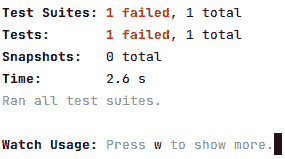
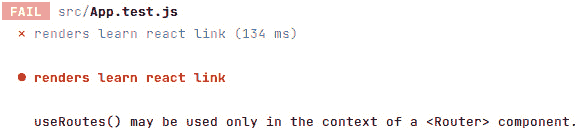
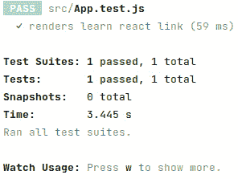

# 第十一章：React 组件的有效 UI 测试

我们已经在*第五章**，测试 REST API*中介绍了使用 Python 和 Django 进行测试。在本章中，情境不同，我们将使用 JavaScript 和 React 来测试我们设计和实现的前端组件。本章将展示在前端应用程序中应该测试什么以及如何为 React UI 组件编写测试。

在本章中，我们将涵盖以下主题：

+   React 中的组件测试

+   Jest 和**React 测试库**（**RTL**）

+   测试表单组件

+   测试`post`组件

+   快照测试

# 技术要求

确保你的机器上已安装并配置了 VS Code 和更新的浏览器。你可以从本章找到代码：[`github.com/PacktPublishing/Full-stack-Django-and-React/tree/chap11`](https://github.com/PacktPublishing/Full-stack-Django-and-React/tree/chap11)。

# React 中的组件测试

我们已经了解到前端是应用程序的客户端部分。关于我们在*第五章**，测试 REST API*中编写的测试，在我们的 Django 应用程序中，我们主要测试了数据库是否存储了传递给视图集、序列化和模型的数据。然而，我们没有测试用户界面。

作为一名 React 开发者，你可能正在思考：在我的前端应用程序中我应该测试什么？好吧，让我们通过了解为什么需要前端测试以及需要测试什么来回答这个问题。

## 测试前端的重要性

在开发应用程序时，确保你的应用程序在生产环境中按预期工作是很重要的。

前端也代表了用户将用来与你的后端交互的界面。为了良好的用户体验，编写确保你的组件按预期行为的测试是至关重要的。

## 在你的 React 应用程序中应该测试什么

如果你来自后端视角，你可能在你的前端应用程序中测试什么方面可能会有些困惑。从基本的角度来看，它与测试后端并没有不同。如果你的应用程序中有类或方法，你可以编写测试。前端测试包括测试 UI 的不同方面，如格式、可见文本、图形以及应用程序的功能部分，如按钮、表单或可点击链接。

现在，区别在于你的 React 前端是由 UI 组件构成的，这些组件接收属性以向用户显示数据。React 生态系统提供了测试工具，这些工具可以轻松帮助你为你的组件编写测试。

在下一节中，我们将从对 Jest 和 RTL 的简要介绍开始，然后我们将为我们的认证表单编写测试。

# Jest、RTL 和固定数据

**Jest** 是一个用于编写、运行和结构化测试的 JavaScript 框架。它包含所有检查代码覆盖率、轻松模拟函数和导入函数以及编写简单且出色的异常所需的工具。RTL 是一个用于实际测试 React 应用的库。它专注于从用户体验的角度测试组件，而不是测试 React 组件本身的实现和逻辑。

重要提示

在编写测试时，您通常会需要确保某些值或变量满足某些条件。这在本书的 *第五章**，测试 REST API* 中已经完成，使用 `assert` 在使用 pytest 编写 Django 应用程序的测试时。与 Jest 一起工作时，术语从断言变为异常。在使用 Jest 进行前端测试时，我们期望值满足条件。例如，如果用户输入并点击一个将重置表单的按钮，我们期望在按钮上的点击动作之后表单被重置。

RTL（右对齐文本）与 Jest 并未分离，因为您需要两者来为您的前端应用程序编写测试。Jest 将帮助您编写测试块，而 RTL 将提供选择组件、渲染组件和触发常见用户事件（如点击和输入）的工具。这些工具在创建 React 项目时已默认安装，因此无需添加其他包。

我们需要的唯一包是 `faker.js` 和 JavaScript 的 `uuid` 包来生成 UUID4 标识符。Faker 是一个用于生成虚假但逼真数据的 JavaScript 包。在 React 项目中，使用以下命令将包作为开发依赖项安装：

```py
yarn add @faker-js/faker uuid –dev
```

在安装了这些包之后，我们现在可以为下一行中将要测试的组件添加一些重要的固定值。

## 编写测试固定值

在 `src/helpers` 目录下，创建一个名为 `fixtures` 的新目录。此目录将包含包含函数的 JavaScript 文件，这些函数返回可用于测试的固定值。

我们将首先编写用户的固定值。因此，在 `fixtures` 目录下，创建一个名为 `user.js` 的新文件。此文件将包含返回用户对象真实数据的函数的代码。让我们从从 `faker.js` 和 `uuid` 包中导入函数以创建固定值开始：

src/helpers/fixtures/user.js

```py
import { faker } from "@faker-js/faker";
import { v4 as uuid4 } from "uuid";
function userFixtures() {
...
}
export default userFixtures;
```

在编写了导入和 `userFixtures` 函数的结构之后，我们现在可以返回对象固定值：

src/helpers/fixtures/user.js

```py
...
function userFixtures() {
 const firstName = faker.name.firstName();
 const lastName = faker.name.lastName();
 return {
   id: uuid4(),
   first_name: firstName,
   last_name: lastName,
   name: firstName + " " + lastName,
   post_count: Math.floor(Math.random() * 10),
   email: `${firstName}@yopmail.com`,
   bio: faker.lorem.sentence(20),
   username: firstName + lastName,
   avatar: null,
   created: faker.date.recent(),
   updated: faker.date.recent(),
 };
}
...
```

Faker 提供了许多模块和返回数据的函数。在上一个代码块中，我们使用 `faker.name` 生成随机姓名，使用 `faker.lorem` 生成随机 lorem 文本，以及使用 `faker.date` 生成最近日期。`userFixtures` 返回的对象现在与 Django API 返回的用户对象结构最接近，这正是我们想要的。

在深入组件测试之前，让我们确保我们的测试环境已经很好地配置。

## 运行第一个测试

当创建一个 React 应用程序时，`App.js` 文件附带一个名为 `App.test.js` 的测试文件，你可以在这里看到：

src/App.test.js

```py
import { render, screen } from "@testing-library/react";
import App from "./App";
test("renders learn react link", () => {
 render(<App />);
 const linkElement = screen.getByText(/learn react/i);
 expect(linkElement).toBeInTheDocument();
});
```

让我来解释一下代码。在这里，我们正在从 RTL 中导入 `render` 和 `screen` 方法。这些模块将被用来渲染一个组件，并通过提供选择 DOM 元素的方法来简化与组件的交互。 

接下来，我们有 `test` 方法。它只是一个 Jest 关键字，用于编写测试。它接受两个参数：一个描述测试的字符串，以及一个回调函数，你在其中编写测试逻辑。在回调函数内部，首先渲染 `App` 组件。然后，使用 `learn react` 文本从屏幕中检索 `linkElement`。一旦检索到，我们就可以检查 `linkElement` 是否存在于渲染的文档中。

让我们使用以下命令运行这个测试：

```py
yarn test
```

你应该在终端中得到类似的输出。



图 11.1 – 运行 yarn test 命令

测试失败了。但是为什么呢？你可以在前面的输出中看到一些原因。



图 11.2 – App.js 测试失败的原因

我们项目中的 `App` 组件使用了 `react-router-dom` 组件，例如 `Routes`，这些组件反过来又使用了 `useRoutes` Hook。这个 Hook 利用路由组件提供的上下文，因此我们需要将其包裹在一个 Router 中，在这种情况下，是 `BrowserRouter` 组件。让我们纠正这个问题，同时更改我们从中检索链接元素的文本：

src/App.test.js

```py
import { render, screen } from "@testing-library/react";
import App from "./App";
import { BrowserRouter } from "react-router-dom";
test("renders Welcome to Postagram text", () => {
 render(
   <BrowserRouter>
     <App />
   </BrowserRouter>
 );
 const textElement =
   screen.getByText(/Welcome to Postagram!/i);
 expect(textElement).toBeInTheDocument();
});
```

现在，再次运行测试，一切应该都能正常工作：



图 11.3 – 通过测试

但我们仍然有问题。React 应用程序中的许多组件使用了来自 `react-router-dom` 库的 Hooks。这意味着对于每个测试，我们都需要在 `BrowserRouter` 中包裹组件。遵循 DRY 原则，让我们重写 RTL 中的渲染方法，使其能够自动将我们的组件包裹在 `BrowserRouter` 中。

## 扩展 RTL 渲染方法

在 `src/helpers` 目录下，创建一个名为 `test-utils.jsx` 的文件。一旦文件创建完成，添加以下代码行：

src/helpers/test-utils.jsx

```py
import React from "react";
import { render as rtlRender } from "@testing-library/react";
import { BrowserRouter } from "react-router-dom";
function render(ui, { ...renderOptions } = {}) {
 const Wrapper = ({ children }) =>
   <BrowserRouter>{children}</BrowserRouter>;
 return rtlRender(ui, { wrapper: Wrapper, ...renderOptions
   });
}
export * from "@testing-library/react";
export { render };
```

在代码中，我们首先导入所需的工具。注意 `rtlRender` 的导入吗？这是为了避免命名冲突，因为我们也在编写一个渲染函数。接下来，我们创建一个名为 `Wrapper` 的函数，其中传递子组件的参数，然后将其包裹在一个 `BrowserRouter` 组件中。然后，我们返回一个包含 UI、`wrapper` 和其他指定渲染选项的渲染对象。

重要提示

RTL 提供的渲染方法除了包装器之外，还提供了其他渲染选项。您还可以传递一个容器、查询等更多内容。您可以在官方文档中查看更多渲染选项，网址为 [`testing-library.com/docs/react-testing-library/api/#render-options`](https://testing-library.com/docs/react-testing-library/api/#render-options)。

现在，让我们在 `App.test.js` 中使用这个方法：

src/App.test.js

```py
import { render, screen } from "@testing-library/react";
import App from "./App";
test("renders Welcome to Postagram text", () => {
 render(<App />);
...
});
```

再次运行测试命令，一切应该都是绿色的。当测试环境准备就绪并设置好以便快速编写测试时，我们现在可以继续测试 React 项目的组件。

重要提示

在运行测试时，您可能会遇到来自 `axios` 包的错误。在撰写本书时，我们使用 `axios` 的 0.26.0 版本来避免在运行测试时出现错误。您也可以将 `package.json` 文件中的测试命令修改为以下内容：`"test": "react-scripts test --transformIgnorePatterns "node_modules/(?!axios)/""`。更多关于此问题的信息，请参阅 [`github.com/axios/axios/issues/5101`](https://github.com/axios/axios/issues/5101)。

# 测试认证组件

在 React 中测试表单可能看起来很复杂，但使用 Jest 和 RTL 时却相当简单。我们将开始在 React 项目中编写测试，从认证组件开始。我会向您展示如何编写 **登录** 表单的测试，之后您应该能够编写注册表单的测试套件。

为了有更好的代码结构，在 `src/components/authentication` 目录中创建一个新的目录名为 `__tests__`。这个目录将包含 `components/authentication` 目录中组件的测试。在新建的目录中，创建一个名为 `LoginForm.test.js` 的文件，并添加以下代码：

src/components/authentication/__tests__/LoginForm.test.js

```py
import { render, screen } from "../../../helpers/test-utils";
import userEvent from "@testing-library/user-event";
import LoginForm from "../LoginForm";
import { faker } from "@faker-js/faker";
import userFixtures from "../../../helpers/fixtures/user";
const userData = userFixtures();
test("renders Login form", async () => {
...
});
```

在前面的代码中，我们添加了编写测试所需的导入，并定义了测试函数的结构。我们将首先渲染 `LoginForm` 组件，并设置用户对象以使用 `userEvent` 方法触发用户行为事件：`method:src/components/authentication/__tests__/LoginForm.test.js`

```py
...
test("renders Login form", async () => {
 const user = userEvent.setup();
 render(<LoginForm />);
...
```

重要提示

`userEvent` 和 `fireEvent` 都是用于在测试环境中模拟网站用户交互的方法。它们可以用来测试当用户执行某些操作（如点击按钮或填写表单）时网站的行为。

`userEvent` 是由 `@testing-library/user-event` 库提供的方法，旨在使测试网站的用户交互更容易。这是一个实用函数，它通过使用 `@testing-library/react` 库提供的 `fireEvent` 方法来模拟用户事件。`userEvent` 允许您指定要模拟的事件类型，例如点击或按键，并且它会自动为您派发适当的事件。

`fireEvent` 是由 `@testing-library/react` 库提供的，可以用来向 DOM 元素派发事件。它允许你指定你想要派发的事件类型，以及你想要包含的任何附加事件数据。`fireEvent` 是一个比 `userEvent` 更低级的方法，它需要你手动指定你想要派发的事件的详细信息。

之后，我们可以开始测试表单和输入是否已渲染到文档中：

src/components/authentication/__tests__/LoginForm.test.js

```py
test("renders Login form", async () => {
...
 const loginForm = screen.getByTestId("login-form");
 expect(loginForm).toBeInTheDocument();
const usernameField = screen.getByTestId("username-field");
expect(usernameField).toBeInTheDocument();
const passwordField = screen.getByTestId("password-field");
expect(passwordField).toBeInTheDocument();
...
```

然后，我们可以确保输入可以接收文本和值，因为我们已经选择了用户名和密码字段：

src/components/authentication/__tests__/LoginForm.test.js

```py
test("renders Login form", async () => {
...
 const password = faker.lorem.slug(2);
 await user.type(usernameField, userData.username);
 await user.type(passwordField, password);
 expect(usernameField.value).toBe(userData.username);
 expect(passwordField.value).toBe(password);
});
```

如果你再次运行测试命令，它将失败。这是正常的，因为在这里我们正在使用 `getByTestId` 方法检索元素。RTL 在渲染的 DOM 中查找具有 `data-testid` 属性且其值传递给 `screen.getByTestId` 函数的元素。我们需要将此属性添加到我们想要选择和测试的元素上。

要做到这一点，在 `src/components/authentication/LoginForm.js` 中添加以下 `data-testid` 属性：

src/components/authentication/LoginForm.js

```py
function LoginForm() {
...
 return (
   <Form
     id="registration-form"
     className="border p-4 rounded"
     noValidate
     validated={validated}
     onSubmit={handleSubmit}
     data-testid="login-form"
   >
...
       <Form.Label>Username</Form.Label>
       <Form.Control
         value={form.username}
         data-testid="username-field"
...
     <Form.Group className="mb-3">
       <Form.Label>Password</Form.Label>
       <Form.Control
         value={form.password}
         data-testid="password-field"
...
```

完成后，重新运行测试命令。一切应该都会正常工作。

下一步是为注册表单组件编写测试。它将与登录表单组件上的测试类似，所以你可以处理这个小练习。你可以在[`github.com/PacktPublishing/Full-stack-Django-and-React/blob/main/social-media-react/src/components/authentication/__tests__/RegistrationForm.test.js`](https://github.com/PacktPublishing/Full-stack-Django-and-React/blob/main/social-media-react/src/components/authentication/__tests__/RegistrationForm.test.js)找到解决方案。

重要提示

JavaScript 也具有测试文件的默认命名约定。JavaScript 项目的测试文件命名约定如下：

- `<``TestFileName>.test.js`

- `<``TestFileName>.spec.js`

现在我们已经对 React 中的测试有了坚实的介绍，让我们继续编写帖子组件的测试。

# 测试帖子组件

创建、读取、更新和删除帖子的功能是 Postagram 应用程序的核心功能，因此确保它们按预期工作非常重要。让我们从对 `Post` 组件的简单测试开始。

## 模拟 localStorage 对象

在编写`Post`组件的测试之前，理解`Post`组件的工作方式非常重要。基本上，它接受一个名为`post`的属性，并调用`localStorage`来检索有关用户的信息。不幸的是，`localStorage`不能被 Jest 模拟。有许多解决方案可以让你的测试与`localStorage`一起工作，并且使它简单且减少样板代码，我们将使用`jest-localstorage-mock`JavaScript 包。该包可以与 Jest 一起使用来运行依赖于`localStorage`的前端测试。要添加该包，请将以下行添加到文件中：

```py
yarn add --dev jest-localstorage-mock
```

一旦安装了包，我们需要做一些配置。在`src/setupTests.js`文件中，添加以下行以加载`jest-localstorage-mock`包：

src/setupTests.js

```py
...
require('jest-localstorage-mock');
```

之后，在`package.json`文件中覆盖默认的 Jest 配置：

package.json

```py
...
{
  "jest": {
    "resetMocks": false
  }
}
...
```

配置就绪后，我们可以添加一个生成帖子固定数据的函数。

## 编写帖子固定数据

在`src/helpers/fixtures`目录中，创建一个名为`post.js`的新文件。该文件将包含一个从帖子对象返回假数据的函数。

我们将开始编写此文件中的代码，添加导入并定义将返回生成帖子对象的`postFixtures`函数：

src/helpers/fixtures/post.js

```py
import { faker } from "@faker-js/faker";
import { v4 as uuid4 } from "uuid";
import userFixtures from "./user";
function postFixtures(isLiked = true, isEdited = false, user = undefined) {
...
}
export default postFixtures;
```

让我们添加`postFixtures`函数的主体：

src/helpers/fixtures/post.js

```py
...
function postFixtures(isLiked = true, isEdited = false, user = undefined) {
 return {
   id: uuid4(),
   author: user || userFixtures(),
   body: faker.lorem.sentence(20),
   edited: isEdited,
   liked: isLiked,
   likes_count: Math.floor(Math.random() * 10),
   comments_count: Math.floor(Math.random() * 10),
   created: faker.date.recent(),
   updated: faker.date.recent(),
 };
}
```

在这里，我们传递一个生成的`userFixtures`或一个已定义的用户对象。如果我们想确保帖子的作者与在`localStorage`中注册的用户相同，这是很重要的。

在编写帖子固定数据后，我们可以为`Post`组件编写测试套件。

## 编写`Post`组件的测试

要在`src/components/posts`目录中编写测试套件，创建一个名为`__tests__`的新文件夹。在新建的文件夹中，添加一个名为`Post.test.js`的新文件。在文件中，添加导入，创建所需的数据，并使用`setUserData`函数在本地存储中设置`userFixtures`函数返回的用户数据：

src/components/posts/__tests__/Post.test.js

```py
import { render, screen } from "../../../helpers/test-utils";
import Post from "../Post";
import { setUserData } from "../../../hooks/user.actions";
import userFixtures from "../../../helpers/fixtures/user";
import postFixtures from "../../../helpers/fixtures/post";
const userData = userFixtures();
const postData = postFixtures(true, false, userData);
beforeEach(() => {
 // to fully reset the state between __tests__, clear the
 // storage
 localStorage.clear();
 // and reset all mocks
 jest.clearAllMocks();
 setUserData({
   user: userData,
   access: null,
   refresh: null,
 });
});
```

`beforeEach`方法是一个 Jest 方法，它在每个测试之前运行。它接受一个回调函数作为参数，其中可以执行应该在测试之前运行的代码行。在这里，我们首先清除本地存储以避免内存泄漏（使用`localStorage.clear`），最后，我们将从`userFixtures`函数检索的用户数据设置在本地存储中。

重要提示

当程序在堆中创建内存并忘记删除它时，会发生内存泄漏。在最坏的情况下，如果分配了太多内存且未正确使用，这可能会降低计算机的性能。

现在让我们编写`Post`组件的测试：

src/components/posts/__tests__/Post.test.js

```py
...
test("render Post component", () => {
 render(<Post post={postData} />);
 const postElement = screen.getByTestId("post-test");
 expect(postElement).toBeInTheDocument();
});
```

如果你运行测试命令，它将失败。这是正常的，因为在`Post`组件的 JSX 中没有设置值为`post-test`的`data-testid`属性。让我们通过在`Post`组件中添加`data-testid`属性来修复这个问题：

src/components/posts/Post.jsx

```py
...
function Post(props) {
...
 return (
   <>
     <Card className="rounded-3 my-4"
       data-testid="post-test">
...
   </>
 );
}
export default Post;
```

再次运行测试命令，一切应该都是绿色的。让我们继续编写`CreatePost`组件的测试。

## 测试 CreatePost 组件

在`src/components/posts/__tests__`目录下，创建一个名为`CreatePost.test.js`的新文件。我们将从必要的导入和`test`函数的定义开始：

src/components/posts/__tests__/CreatePost.test.js

```py
import { render, screen, fireEvent } from "../../../helpers/test-utils";
import userEvent from "@testing-library/user-event";
import CreatePost from "../CreatePost";
import { faker } from "@faker-js/faker";
test("Renders CreatePost component", async () => {
...
});
```

你可以注意到在回调函数之前引入了`async`关键字。为了创建帖子，用户在文本输入框中进行输入操作，最后点击按钮提交帖子。这些操作是异步的。我们将使用来模拟用户交互的函数，如`fireEvent`，应该在异步作用域中使用。

在编写测试逻辑之前，让我们回顾一下`CreatePost`组件是如何工作的：

1.  用户点击输入框以添加新的帖子。

1.  显示一个包含表单的模态框，用户可以输入帖子的文本。同时，提交按钮处于禁用状态。

1.  当字段中有足够的文本时，提交按钮被启用，用户可以点击发送帖子。

我们必须确保在编写测试时尊重这个逻辑。现在，让我们开始编写测试。

首先，我们渲染显示创建帖子模态框的表单：

src/components/posts/__tests__/CreatePost.test.js

```py
test("Renders CreatePost component", async () => {
 const user = userEvent.setup();
 render(<CreatePost />);
 const showModalForm =
   screen.getByTestId("show-modal-form");
 expect(showModalForm).toBeInTheDocument();
});
```

我们现在可以使用`fireEvent.click`在`showModalForm`上模拟点击事件来显示创建帖子的表单：

src/components/posts/__tests__/CreatePost.test.js

```py
...
 // Clicking to show the modal
 fireEvent.click(showModalForm);
 const createFormElement =
   screen.getByTestId("create-post-form");
 expect(createFormElement).toBeInTheDocument();
...
```

我们确保正文字段被渲染，提交按钮被禁用：

src/components/posts/__tests__/CreatePost.test.js

```py
...
 const postBodyField =
   screen.getByTestId("post-body-field");
 expect(postBodyField).toBeInTheDocument();
 const submitButton =
   screen.getByTestId("create-post-submit");
 expect(submitButton).toBeInTheDocument();
 expect(submitButton.disabled).toBeTruthy();
 ...
```

之后，我们可以在正文字段中输入一些文本，测试输入的文本是否符合预期，并确保之后按钮处于启用状态：

src/components/posts/__tests__/CreatePost.test.js

```py
 ...
 const postBody = faker.lorem.sentence(10);
 await user.type(postBodyField, postBody);
 // Checking if field has the text and button is not
 // disabled
 expect(postBodyField.value).toBe(postBody);
 expect(submitButton.disabled).toBeFalsy();
});
```

太好了！我们有一个可靠的测试套件，现在我们可以向`CreatePost`组件添加`data-testid`属性以使测试通过：

src/components/posts/CreatePost.jsx

```py
function CreatePost() {
...
 return (
   <>
     <Form.Group className="my-3 w-75">
       <Form.Control
         className="py-2 rounded-pill border-primary
                    text-primary"
         data-testid="show-modal-form"
...
       <Modal.Body className="border-0">
         <Form
           noValidate
           validated={validated}
           onSubmit={handleSubmit}
           data-testid="create-post-form"
         >
           <Form.Group className="mb-3">
             <Form.Control
               name="body"
               data-testid="post-body-field"
...
       </Modal.Body>
       <Modal.Footer>
         <Button
           variant="primary"
           onClick={handleSubmit}
           disabled={!form.body}
           data-testid="create-post-submit"
...
   </>
 );
}
```

再次运行测试命令，一切应该正常工作。下一步是编写`UpdatePost`组件的单元测试。

## 测试 UpdatePost 组件

在`src/components/posts/__tests__`目录下，创建一个名为`UpdatePost.test.js`的新文件。让我们从必要的导入和`test`函数的定义开始：

src/components/posts/__tests__/UpdatePost.test.js

```py
import { render, screen, fireEvent } from "../../../helpers/test-utils";
import userEvent from "@testing-library/user-event";
import UpdatePost from "../UpdatePost";
import userFixtures from "../../../helpers/fixtures/user";
import postFixtures from "../../../helpers/fixtures/post";
import { faker } from "@faker-js/faker";
const userData = userFixtures();
const postData = postFixtures(true, false, userData);
test("Render UpdatePost component", async () => {
...
});
```

在编写测试逻辑之前，让我们回顾一下从用户的角度来看`UpdatePost`组件是如何工作的：

1.  用户点击下拉菜单项来修改帖子。

1.  显示一个包含表单的模态框，用户可以修改帖子的文本。

1.  修改后，用户可以使用更新后的帖子提交表单。

我们必须确保在编写测试时尊重这种逻辑。

因此，首先，我们渲染显示更新帖子表单的表单模态：

src/components/posts/__tests__/UpdatePost.test.js

```py
test("Render UpdatePost component", async () => {
 const user = userEvent.setup();
 render(<UpdatePost post={postData} />);
 const showModalForm =
   screen.getByTestId("show-modal-form");
 expect(showModalForm).toBeInTheDocument();
...
```

然后，我们希望触发一个点击事件来显示用于更新帖子的表单模态：

src/components/posts/__tests__/UpdatePost.test.js

```py
...
 fireEvent.click(showModalForm);
 const updateFormElement =
   screen.getByTestId("update-post-form");
 expect(updateFormElement).toBeInTheDocument();
...
```

然后，我们选择帖子正文字段和提交按钮，以确保它们被渲染：

src/components/posts/__tests__/UpdatePost.test.js

```py
...
 const postBodyField =
   screen.getByTestId("post-body-field");
 expect(postBodyField).toBeInTheDocument();
 const submitButton =
   screen.getByTestId("update-post-submit");
 expect(submitButton).toBeInTheDocument();
...
```

之后，我们现在可以在帖子正文字段中触发一个输入事件，并确保用户提交了正确的数据：

src/components/posts/__tests__/UpdatePost.test.js

```py
...
 const postBody = faker.lorem.sentence(10);
 await user.type(postBodyField, postBody);
 // Checking if field has the text and button is not
 // disabled
 expect(postBodyField.value).toBe(postData.body +
   postBody);
 expect(submitButton.disabled).toBeFalsy();
});
```

下一步是将`data-testid`属性添加到`UpdatePost`组件中的帖子表单、帖子正文输入和提交按钮，以便测试通过：

src/components/posts/UpdatePost.jsx

```py
...
function UpdatePost(props) {
...
 return (
   <>
     <Dropdown.Item data-testid="show-modal-form"
       onClick={handleShow}>
...
       <Modal.Body className="border-0">
         <Form
          noValidate
          validated={validated}
          onSubmit={handleSubmit}
    data-testid="update-post-form"
   >
           <Form.Group className="mb-3">
             <Form.Control
               name="body"
               value={form.body}
               data-testid="post-body-field"
...
       </Modal.Body>
       <Modal.Footer>
         <Button
           data-testid="update-post-submit"
...
```

再次运行测试命令，一切应该都会正常工作。

通过对 Jest 和 RTL 的复杂测试的介绍，您可以轻松编写评论组件的测试。您可以在[`github.com/PacktPublishing/Full-stack-Django-and-React/tree/main/social-media-react/src/components/comments/__tests__`](https://github.com/PacktPublishing/Full-stack-Django-and-React/tree/main/social-media-react/src/components/comments/__tests__)找到这些测试的解决方案。祝您好运！

在下一节中，我们将了解快照测试是什么。

# 快照测试

当您想确保 UI 不会意外改变时，快照测试是一个非常有用的工具。一个快照测试案例遵循以下步骤：

+   它渲染 UI 组件。

+   然后，它将捕获一个快照并将其与存储在测试文件旁边的参考快照文件进行比较。

+   如果两个状态相同，快照测试就成功了。否则，您将得到错误，并需要决定是否需要更新快照测试或修复您的组件。

快照测试非常有助于防止 UI 回归并确保应用程序遵守您的开发团队的代码质量和价值观。

然而，快照测试存在一个小问题。快照测试与动态组件配合得不是很好。例如，`Post`组件使用`timeago`来显示可读时间。这意味着在时间`t`的该组件的快照将不同于在时间`t + 1`的同一组件的快照。然而，在 React 应用程序中也有一些静态组件，例如`LoginForm`、`RegistrationForm`、`ProfileDetails`、`ProfileCard`、`CreatePost`等等。

为了简化，我们将为`ProfileCard`组件编写一个快照测试，这些组件简单直接，并且可以轻松复制。

在`src/components/profile`目录下，创建一个名为`__tests__`的新目录。然后，创建一个名为`ProfileCard.test.js`的新文件。对于快照测试，我们不希望数据发生变化，因此我们将使用静态用户固定值，因为使用`userFixtures`生成固定值会在每次运行快照测试时创建随机数据。在新建的文件中，让我们添加创建快照测试所需的导入，并定义一个名为`userData`的固定值对象：

src/components/profile/__tests__/ProfileCard.test.js

```py
import { render, screen } from "../../../helpers/test-utils";
import TestRenderer from "react-test-renderer";
import ProfileCard from "../ProfileCard";
import { BrowserRouter } from "react-router-dom";
const userData = {
 id: "0590cd67-eacd-4299-8413-605bd547ea17",
 first_name: "Mossie",
 last_name: "Murphy",
 name: "Mossie Murphy",
 post_count: 3,
 email: "Mossie@yopmail.com",
 bio: "Omnis necessitatibus facere vel in est provident
       sunt tempora earum accusantium debitis vel est
       architecto minima quis sint et asperiores.",
 username: "MossieMurphy",
 avatar: null,
 created: "2022-08-19T17:31:03.310Z",
 updated: "2022-08-20T07:38:47.631Z",
};
```

在添加了所需的导入并编写了`userData`固定值之后，我们现在可以编写测试函数：

src/components/profile/__tests__/ProfileCard.test.js

```py
...
test("Profile Card snapshot", () => {
 const profileCardDomTree = TestRenderer.create(
   <BrowserRouter>
     <ProfileCard user={userData} />
   </BrowserRouter>
 ).toJSON();
 expect(profileCardDomTree).toMatchSnapshot();
});
```

如果你运行测试命令，你会注意到在`__tests__`目录下创建了一个快照目录：


图 11.4 – 创建了快照目录

如果你检查`ProfileCard.test.js.snap`的内容，它基本上是`ProfileCard`组件的渲染代码。每次快照测试的测试函数运行时，都会比较这个文件的内容。

现在我们已经涵盖了 React 应用程序的基本单元测试，我们主要完成了添加功能的工作。我们的全栈应用程序现在已准备好投入生产！太好了，但不要过早庆祝。我们仍然需要在安全、质量和性能方面为我们的应用程序做好生产准备，这正是本书第三部分将要做的。

# 摘要

在本章中，你学习了前端单元测试。我们发现了为什么在前端应用程序中编写单元测试很重要，以及确切要测试什么。我们还为 Postagram 应用程序中的组件编写了测试，看到了如何扩展测试工具模块和方法，如何编写测试的生成固定值，以及如何通过触发用户事件使测试更接近用户交互。我们还对快照测试做了一些介绍。

本书第三部分的下一章将重点介绍使用 AWS 服务、GitHub 和 GitHub Actions 在云上部署后端和前端。最后，我们将看到如何从性能、安全性和质量方面改进全栈应用程序。

# 问题

1.  RTL 的渲染方法是什么？

1.  Jest 是什么？

1.  `data-tested`属性的作用是什么？

1.  快照测试的缺点是什么？

1.  用于在 React 测试套件中触发用户事件的模块有哪些？

# 第三部分：在 AWS 上部署 Django 和 React

部署是软件开发中最后的重要步骤之一。您的应用程序在本地运行且一切正常。但您如何将代码部署到公共服务器上？您如何托管前端？您如何修改代码并使部署和测试自动化？在本书的这一部分，我们将探讨在 AWS EC2 上部署 Django 应用和在 AWS S3 上部署 React 应用时涉及的 CI/CD、GitHub、Docker 以及最佳部署实践等主题。我们还将讨论安全和性能问题。

本节包含以下章节：

+   *第十二章*，*部署基础 – Git、GitHub 和 AWS*

+   *第十三章*，*将 Django 项目容器化*

+   *第十四章*，*在 AWS 上自动化部署*

+   *第十五章*，*在 AWS 上部署我们的 React 应用*

+   *第十六章*，*性能、优化和安全*
