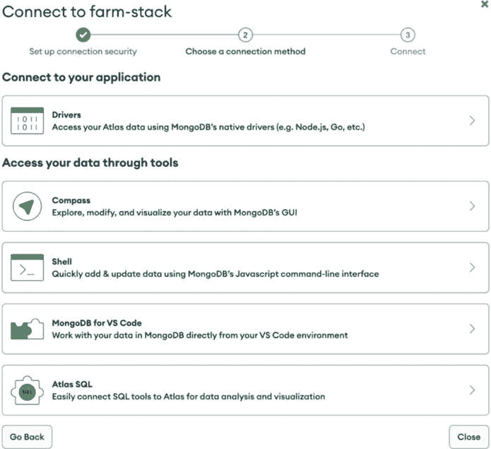
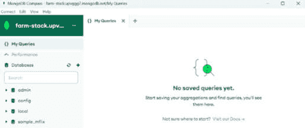

# 第二章：使用 MongoDB 设置数据库

在本章中，您将通过几个简单而具有说明性的示例来探索 MongoDB 的一些主要功能。您将了解 MongoDB 查询 API 的基本命令，以开始与存储在 MongoDB 数据库中的数据进行交互。您将学习到必要的命令和方法，使您能够插入、管理、查询和更新您的数据。

本章的目的是帮助您了解在本地机器或云上设置 MongoDB 数据库是多么容易，以及如何在快速发展的 Web 开发过程中执行可能需要的操作。

通过 MongoDB 方法和聚合进行查询，最佳的学习方式是通过实验数据。本章利用 MongoDB Atlas 提供的真实世界样本数据集，这些数据集已加载到您的云数据库中。您将学习如何对这些数据集执行 CRUD 和聚合查询。

本章将涵盖以下主题：

+   MongoDB 数据库的结构

+   安装 MongoDB 社区服务器和工具

+   创建 Atlas 集群

+   MongoDB 查询和 CRUD 操作

+   聚合框架

# 技术要求

对于本章，您需要 MongoDB 版本 7.0.7 和 Windows 11（以及 Ubuntu 22.04 LTS）。

MongoDB 版本 7.0 与以下兼容：

+   Windows 11、Windows Server 2019 或 Windows Server 2022（64 位版本）

+   Ubuntu 20.04 LTS（Focal）和 Ubuntu 22.04 LTS（Jammy）Linux（64 位版本）

以下是一些推荐的系统配置：

+   至少配备 8 GB RAM 的台式机或笔记本电脑。

+   没有指定 CPU 要求，但请确保它是现代的（多核处理器），以确保高效性能。

# MongoDB 数据库的结构

MongoDB 在流行度和使用方面被广泛认为是领先的 NoSQL 数据库——其强大的功能、易用性和多功能性使其成为大型和小型项目的绝佳选择。其可扩展性和性能使得您的应用程序的数据层拥有非常坚实的基础。

在以下章节中，您将更深入地了解 MongoDB 的基本概念和构建块：文档、集合和数据库。由于本书采用自下而上的方法，您将从最底层开始，了解 MongoDB 中可用的最简单数据结构的概述，然后从这里开始，进入文档、集合等。

## 文档

MongoDB 是一个面向文档的数据库。但这实际上意味着什么呢？

在 MongoDB 中，文档类似于传统关系数据库中的行。MongoDB 中的每个文档都是一个由键值对组成的数据结构，代表一条记录。存储在 MongoDB 中的数据为应用程序开发者提供了极大的灵活性，使他们能够根据需要建模数据，并允许他们随着应用程序需求的变化在未来轻松地演进模式。MongoDB 具有灵活的模式模型，这基本上意味着你可以在集合中的不同文档中拥有不同的字段。根据需要，你还可以为文档中的字段使用不同的数据类型。

然而，如果你的应用程序需要在集合中的文档中保持数据的一致结构，你可以使用 MongoDB 中的模式验证规则来强制一致性。MongoDB 使你能够以对应用程序需求最有意义的方式存储数据。

MongoDB 中的文档只是一个有序的键值对集合。在这本书中，术语**键**和**字段**可以互换使用，因为它们代表同一事物。这种结构，正如你稍后将要探索的，与每种编程语言中的数据结构相对应；在 Python 中，你会发现这种结构是一个字典，非常适合 Web 应用程序或桌面应用程序的数据流。

创建文档的规则相当简单：键/字段名称必须是字符串，有一些例外，你可以在文档中了解更多信息，并且一个文档不能包含重复的键名。请记住，MongoDB 是区分大小写的。

在本章中，你将把一个名为`sample_mflix`的示例数据集加载到你的 MongoDB Atlas 集群中。该数据集包含许多集合，但本章中对我们感兴趣的是`movies`集合，它包含描述电影的文档。以下文档可能存在于这个集合中：

```py
{
  _id: ObjectId("573a1390f29313caabcd42e8"),
  plot: 'A group of bandits stage a brazen train hold-up, only to find a determined posse hot on their heels.',
  genres: [ 'Short', 'Western' ],
  runtime: 11,
  cast: [
    'A.C. Abadie',
    "Gilbert M. 'Broncho Billy' Anderson",
    'George Barnes',
    'Justus D. Barnes'
  ],
  poster: 'https://m.media-amazon.com/images/M/MV5BMTU3NjE5NzYtYTYyNS00MDVmL WIwYjgtMmYwYWIxZDYyNzU2XkEyXkFqcGdeQXVyNzQzNzQxNzI@._V1_SY1000_SX677_AL_.jpg',
  title: 'The Great Train Robbery',
  fullplot: "Among the earliest existing films in American cinema - notable as the first film that presented a narrative story to tell - it depicts a group of cowboy outlaws who hold up a train and rob the passengers. They are then pursued by a Sheriff's posse. Several scenes have color included - all hand tinted.",
  languages: [ 'English' ],
  released: ISODate("1903-12-01T00:00:00.000Z"),
  directors: [ 'Edwin S. Porter' ],
  rated: 'TV-G',
  awards: { wins: 1, nominations: 0, text: '1 win.' },
  lastupdated: '2015-08-13 00:27:59.177000000',
  year: 1903,
  imdb: { rating: 7.4, votes: 9847, id: 439 },
  countries: [ 'USA' ],
  type: 'movie',
  tomatoes: {
    viewer: { rating: 3.7, numReviews: 2559, meter: 75 },
    fresh: 6,
    critic: { rating: 7.6, numReviews: 6, meter: 100 },
    rotten: 0,
    lastUpdated: ISODate("2015-08-08T19:16:10.000Z")
  },
  num_mflix_comments: 0
}
```

注意

当涉及到文档中的文档嵌套时，MongoDB 支持 100 层嵌套，这在大多数应用程序中你可能不会达到这个限制。

## MongoDB 支持的数据类型

MongoDB 允许你将任何 BSON 数据类型作为字段值存储。BSON 与 JSON 非常相似，它代表“二进制 JSON”。BSON 的二元结构使其更快，并且比 JSON 支持更多的数据类型。在设计任何类型的应用程序时，最重要的决定之一是数据类型的选择。作为一个开发者，你永远不会想为当前的工作使用错误工具。

注意

MongoDB 支持的所有数据类型的完整列表可以在官方文档中找到：[`www.mongodb.com/docs/mongodb-shell/reference/data-types/`](https://www.mongodb.com/docs/mongodb-shell/reference/data-types/)。

MongoDB 支持的一些最重要的数据类型包括：

+   **字符串**：这些可能是 MongoDB 中最基本和最通用的数据类型，它们用于表示文档中的所有文本字段。

+   **数字**：MongoDB 支持不同类型的数字，包括：

    +   **int**：32 位整数

    +   **long**：64 位整数

    +   **double**：64 位浮点数

    +   **decimal**：基于 128 位的十进制浮点数

+   `true`或`false`值；它们不使用引号书写，因为你不希望它们被解释为字符串。

+   **对象或内嵌文档**：在 MongoDB 中，文档内的字段可以包含内嵌文档，允许在单个文档中进行复杂的数据结构化。这种能力支持类似 JSON 的结构深层嵌套，便于灵活和分层的数据建模。

+   **数组**：数组可以包含零个或多个值，具有类似列表的结构。数组的元素可以是任何 MongoDB 数据类型，包括其他文档和数组。它们是从零开始的，特别适合创建**内嵌关系**。例如，你可以在博客文章文档本身中存储所有评论，包括时间戳和发表评论的用户。数组可以利用标准的 JavaScript 数组方法进行快速编辑、推送和其他操作。

+   `_id`作为主键。如果插入的文档省略了`_id`字段，MongoDB 会自动为`_id`字段生成一个 ObjectId，用于在集合中唯一标识文档。ObjectId 的长度为 12 字节。它们体积小、可能唯一、生成速度快、有序。这些 ObjectId 广泛用作传统关系的键——ObjectId 会自动索引。

+   **日期**：尽管 JSON 不支持日期类型并将它们存储为普通字符串，但 MongoDB 的 BSON 格式明确支持日期类型。它们表示自 Unix 纪元（1970 年 1 月 1 日）以来的 64 位毫秒数。所有日期都存储为 UTC，没有时区关联。BSON 日期类型是有符号的。负值表示 1970 年之前的日期。

+   **二进制数据**：二进制数据字段可以存储任意二进制数据，是保存非 UTF-8 字符串到数据库的唯一方式。这些字段可以与 MongoDB 的 GridFS 文件系统结合使用，例如存储图像。

+   **Null**：这可以表示 null 值或不存在的字段，我们甚至可以将 JavaScript 函数作为不同的数据类型存储。

现在你已经了解了 MongoDB 中可用的字段类型以及如何将你的业务逻辑映射到（灵活的）模式中，是时候介绍集合了——文档的组，在关系数据库世界中与表相对应。

## 集合和数据库

尽管你可以在同一个集合中存储多个模式，但有许多理由将你的数据存储在多个数据库和多个集合中：

+   **数据分离**：集合允许你逻辑上分离不同类型的数据。例如，你可以有一个用于用户数据的集合，另一个用于产品数据的集合，还有一个用于订单数据的集合。这种分离使得管理和查询特定类型的数据变得更加容易。

+   **性能优化**：通过将数据分离到不同的集合中，你可以通过更有效地索引和查询特定集合来优化性能。这可以提高查询性能并减少需要扫描的数据量。

+   **数据局部性**：在集合中将相同类型的文档分组将需要更少的磁盘查找时间，考虑到索引是由集合定义的，查询效率会更高。

虽然单个 MongoDB 实例可以同时托管多个数据库，但将应用程序中使用的所有文档集合都保存在单个数据库中是一种良好的做法。

注意

当你安装 MongoDB 时，将创建三个数据库，它们的名称不能用于你的应用程序数据库：`admin`、`local` 和 `config`。它们是内置数据库，不应被替换，因此请避免意外地将你的数据库命名为相同的方式或对这些数据库进行任何更改。

## 安装 MongoDB 数据库的选项

在回顾了 MongoDB 数据库的基本术语、概念和结构之后，现在是时候学习如何在本地和云端设置 MongoDB 数据库服务器了。

本地数据库设置方便快速原型设计，甚至不需要互联网连接。然而，我们建议你在设置数据库作为未来章节中用作后端时，使用 MongoDB Atlas 提供的云托管数据库。

MongoDB Atlas 相比本地安装提供了许多优势。首先，它易于设置，正如你将看到的，你可以在几分钟内将其设置好并运行起来，一个慷慨的免费层数据库已经准备好工作。MongoDB 处理数据库的所有操作方面，如配置、扩展、备份和监控。

Atlas 取代了大部分手动设置并保证了可用性。其他好处包括 MongoDB 团队的参与（他们试图实施最佳实践），默认情况下具有访问控制、防火墙和细粒度访问控制、自动备份（取决于层级），以及立即开始生产力的可能性。

# 安装 MongoDB 和相关工具

MongoDB 不仅仅是一个数据库服务提供商，而是一个完整的开发者数据平台，它围绕核心数据库构建了一系列技术，以满足你所有的数据需求并提高你的开发效率。让我们检查以下组件，你将在接下来的章节中安装或使用它们：

+   **MongoDB 社区版**：MongoDB 的免费版本，可在所有主要操作系统上运行。这是你将在本地玩转数据时使用的版本。

+   **MongoDB Compass**：一个用于在可视化环境中管理、查询、聚合和分析 MongoDB 数据的**图形用户界面（GUI**）。Compass 是一个成熟且实用的工具，您将在初始查询和聚合探索过程中使用它。

+   **MongoDB Atlas**：MongoDB 的数据库即服务解决方案。这一服务是 MongoDB 成为 FARM 堆栈核心部分的主要原因之一。它相对容易设置，并且可以减轻您手动管理数据库的负担。

+   (`mongosh`)：一个命令行外壳，不仅可以在您的数据库上执行简单的**创建**、**读取**、**更新**和**删除**（**CRUD**）操作，还允许执行管理任务，如创建和删除数据库、启动和停止服务以及类似的工作。

+   **MongoDB 数据库工具**：几个命令行实用程序，允许管理员和开发者将数据从数据库导出或导入，提供诊断功能，或允许操作存储在 MongoDB 的 GridFS 系统中的大文件。

本章将重点介绍实现完全功能安装的流程。请检查与您的操作系统对应的安装说明。本章包括 Windows、Linux 和 macOS 的安装说明。

# 在 Windows 上安装 MongoDB 和 Compass

在本节中，您将学习如何安装 MongoDB 社区版最新版本，撰写本文时为 7.0。MongoDB 社区版仅支持 x86_64 架构的 64 位 Windows 版本。支持的 Windows 版本包括 Windows 11、Windows Server 2019 和 Windows Server 2022。要安装 MongoDB 和 Compass，您可以参考以下步骤。

注意

我们强烈建议您检查 MongoDB 网站上的说明（[`www.mongodb.com/docs/manual/tutorial/install-mongodb-on-windows/`](https://www.mongodb.com/docs/manual/tutorial/install-mongodb-on-windows/)），以确保您能够获取最新信息，因为它们可能会有所变化。

1.  要下载安装程序，请访问 MongoDB 下载中心[`www.mongodb.com/try/download/community`](https://www.mongodb.com/try/download/community)，选择 Windows 版本，然后点击**下载**，如下所示：


图 2.1：MongoDB 下载页面

1.  接下来，执行它。如果出现安全提示“打开可执行文件”，请选择**是**，然后继续进入 MongoDB 设置向导。

1.  阅读许可协议，勾选复选框，然后点击**下一步**。

1.  这是一个重要的屏幕。当被问及选择哪种设置类型时，请选择**完整**，如下所示：


图 2.2：完整安装

1.  下一个向导将询问您是否希望 MongoDB 作为 Windows 网络服务（您应该选择这种方式）或本地和域服务运行。保留默认值，不要做任何更改，直接进入下一步。

1.  另一个向导将出现，提示你是否想安装 Compass，MongoDB 的数据库管理 GUI 工具。选择复选框并继续安装：

    +   

图 2.3：安装 Compass

1.  最后，Windows 的 **用户账户控制**（**UAC**）警告屏幕将弹出，你应该选择 **是**。

现在你已经在本地机器上安装了 MongoDB Community Server，下一节将展示如何安装你将在本书中使用的其他必要工具。

# 安装 MongoDB Shell (mongosh)

在您的计算机上安装 MongoDB Community Server 和 Compass 后，接下来将安装 `mongosh`，MongoDB Shell。

注意

关于其他操作系统的说明，请访问 MongoDB 文档：[`www.mongodb.com/docs/mongodb-shell/install/`](https://www.mongodb.com/docs/mongodb-shell/install/).

这里是如何在 Windows 上操作的：

1.  导航到 MongoDB 下载中心 ([`www.mongodb.com/try/download/shell`](https://www.mongodb.com/try/download/shell))，在 **工具** 部分选择 **MongoDB Shell**。

1.  从下拉菜单中选择 Windows 版本和 **msi** 包，然后点击 **下载**。


图 2.4：下载 MongoDB Shell

1.  接下来，在您的计算机上找到 **msi** 包并执行它。如果安全提示要求 **打开可执行文件**，选择 **是** 并继续到 MongoDB 设置向导。向导将打开以下页面。点击 **下一步**：


图 2.5：MongoDB Shell 设置向导

1.  在提示中，选择安装 `mongosh` 的目标文件夹，或者如果你觉得默认选项看起来不错，就保持默认，然后完成安装。

1.  到目前为止，你应该能够测试 MongoDB 是否正在运行（作为服务）。在你的选择命令提示符中输入以下命令（最好是使用 **cmder**，可在 [`cmder.app`](https://cmder.app) 获取）：

    ```py
    mongosh
    ```

1.  你应该会看到各种通知和一个标记为 `>` 的小提示。尝试输入以下内容：

    ```py
    Show dbs
    ```

    如果你看到自动生成的 `admin`、`config` 和 `local` 数据库，你应该可以继续了。

1.  现在，检查 Compass 的安装情况。在 Windows 上，你应该能在开始菜单下的 **MongoDBCompass**（无空格）中找到它。

1.  如果你只是点击 `27017`，你应该能看到当你使用 MongoDB 命令行时看到的全部数据库：`admin`、`config` 和 `local`。

# MongoDB 数据库工具

MongoDB 数据库工具是一组用于与 MongoDB 部署一起使用的命令行实用程序。以下是一些常见的数据库工具：

+   `mongoimport`：从扩展的 JSON、CSV 或 TSV 导出文件导入内容

+   `mongoexport`：从 `mongod` 实例中生成 JSON 或 CSV 导出

+   `mongodump`：创建 `mongod` 数据库内容的二进制导出

有一些其他工具，例如 `mongorestore`、`bsondump`、`mongostat`、`mongotop` 和 `mongofiles`。MongoDB 数据库工具可以使用 MSI 安装程序安装（或作为 ZIP 存档下载）。

注意

`msi` 软件包可以从 MongoDB 下载中心下载（[`www.mongodb.com/try/download/database-tools`](https://www.mongodb.com/try/download/database-tools)）。

下载后，您可以按照 MongoDB 文档中提供的安装说明进行操作（[`www.mongodb.com/docs/database-tools/installation/installation-windows/`](https://www.mongodb.com/docs/database-tools/installation/installation-windows/)）。

下一节将介绍在标准 Linux 发行版上安装 MongoDB 的过程。

# 在 Linux 上安装 MongoDB 和 Compass：Ubuntu

Linux 为本地服务器的开发和管理工作提供了许多好处，但最重要的是，如果您决定不再使用 MongoDB 的数据库即服务，您可能希望在一个基于 Linux 的服务器上工作。

在本书中，我们将介绍在 Ubuntu 22.04 LTS（Jammy）版本上的安装过程，同时 MongoDB 版本也支持 x86_64 架构的 Ubuntu 20.04 LTS（Focal）。安装 MongoDB Ubuntu 所需的步骤将在此列出，但您应始终检查 MongoDB Ubuntu 安装页面（[`www.mongodb.com/docs/manual/tutorial/install-mongodb-on-ubuntu/`](https://www.mongodb.com/docs/manual/tutorial/install-mongodb-on-ubuntu/)）以了解最近的变化。然而，过程本身不应发生变化。

以下操作需要在 Bash shell 中执行。下载允许您安装 MongoDB 的公钥，然后您将创建一个列表文件并重新加载包管理器。对于其他 Linux 发行版，也需要执行类似的步骤，因此请确保检查您选择发行版的网站上的文档。最后，您将通过包管理器执行 MongoDB 的实际安装并启动服务。

总是最好跳过 Linux 发行版提供的软件包，因为它们通常没有更新到最新版本。按照以下步骤在 Ubuntu 上安装 MongoDB：

1.  按照以下方式导入软件包管理系统中使用的公钥。

    您的系统上需要安装 `gnupg` 和 `curl`。如果您还没有安装它们，可以通过运行以下命令进行安装：

    ```py
    sudo apt-get install gnupg curl
    ```

    要导入 MongoDB 公共 GPG 密钥，请运行以下命令：

    ```py
    curl -fsSL https://www.mongodb.org/static/pgp/server-7.0.asc | \
       sudo gpg -o /usr/share/keyrings/mongodb-server-7.0.gpg \
       --dearmor
    ```

    通过运行以下命令为 Ubuntu 22.04（Jammy）创建 `/etc/apt/sources.list.d/mongodb-org-7.0.list` 文件：

    ```py
    echo "deb [ arch=amd64,arm64 signed-by=/usr/share/keyrings/mongodb-server-7.0.gpg ] https://repo.mongodb.org/apt/ubuntu jammy/mongodb-org/7.0 multiverse" | sudo tee /etc/apt/sources.list.d/mongodb-org-7.0.list
    ```

1.  使用以下命令重新加载本地包数据库：

    ```py
    sudo apt-get update
    ```

1.  安装 MongoDB 软件包。要安装最新稳定版本，请执行以下命令：

    ```py
    sudo apt-get install -y mongodb-org
    ```

1.  运行 MongoDB 社区版。如果您遵循这些说明并通过包管理器安装 MongoDB，则在安装过程中将创建`/var/lib/mongodb`数据目录和`/var/log/mongodb`日志目录。

1.  您可以使用以下命令启动`mongod`进程：

    ```py
    sudo systemctl start mongod
    Failed to start mongod.service: Unit mongod.service not found.
    ```

    首先运行以下命令：

    ```py
    sudo systemctl daemon-reload
    ```

    然后再次运行`start`命令（如*步骤* *5*所示）。

1.  您只需简单地输入以下命令即可开始使用 MongoDB Shell (`mongosh`)：

    ```py
    mongosh
    ```

当涉及到安装和进程管理时，MongoDB 与其他 Linux 软件并没有特别不同。然而，如果您在安装过程中遇到任何问题，第一个建议是访问 MongoDB Linux 安装页面。

# 设置 Atlas

MongoDB Atlas——由 MongoDB 提供的云数据库服务——是 MongoDB 最强大的卖点之一。

MongoDB Atlas 是一项完全托管的数据服务，这意味着 MongoDB 为您处理基础设施管理、数据库设置、配置和维护任务。这使您能够专注于开发应用程序，而不是管理底层基础设施。

注意

在[`www.mongodb.com/docs/atlas/getting-started/`](https://www.mongodb.com/docs/atlas/getting-started/)上详细记录了注册和设置 MongoDB Atlas 实例的过程。

您可以通过两种方式设置您的 Atlas 账户：

+   Atlas UI（网站）

+   Atlas CLI（命令行）

Atlas CLI 为 MongoDB Atlas 提供了一个专门的命令行界面，允许您从终端直接管理您的 Atlas 数据库部署和 Atlas Search。在本书中，您将看到如何从 UI 进行操作。

如果您还没有 Atlas 账户，请前往[`www.mongodb.com/cloud/atlas/register`](https://www.mongodb.com/cloud/atlas/register)创建一个 Atlas 账户。您可以使用 Google 账户、GitHub 账户或电子邮件账户注册此服务。

注意

随着更多功能的引入，Atlas UI 和集群创建步骤可能会发生变化。强烈建议您在设置集群时参考最新说明（[`www.mongodb.com/docs/atlas/getting-started/`](https://www.mongodb.com/docs/atlas/getting-started/)）。

在设置账户（这里使用的是 Gmail 地址，因此您可以使用 Google 账户登录以实现更快的访问）之后，系统会提示您创建一个集群。您将创建一个免费的`M0`集群，并且应该选择一个尽可能接近您物理位置的**云提供商和区域**选项，以最小化延迟。

## 创建 Atlas 集群

要设置一个 Atlas 集群，请执行以下步骤：

1.  在您的 Atlas 仪表板上，您将看到**创建部署**选项。点击**创建**以开始创建您的第一个 Atlas 集群的过程。


图 2.6：Atlas 仪表板

在这一步，您需要做几件事情：

1.  选择免费的**M0** **沙盒**选项。

1.  给您的集群起一个有意义的名字，例如`farm-stack`。您可以选择任何其他名字。

1.  确保已勾选**自动安全设置**和**添加示例数据集**选项。这将在以后非常有用。

1.  选择您偏好的云服务提供商（默认为 AWS）

1.  选择离您位置最近的区域以最小化延迟，然后点击**创建部署**。

注意

创建 Atlas 用户和设置 IP 是一个重要的步骤，您必须在开始使用 Atlas 集群之前完成。

1.  在下一屏，您将被要求创建一个数据库用户，该用户将有一个用户名和密码。这两个字段都是自动填充的，以简化流程。您可以根据自己的偏好更改用户名和密码。**请确保将密码保存在某个地方，因为您稍后连接到** **您的集群时需要它****。

1.  默认情况下，您的当前 IP 地址被添加以启用本地连接。MongoDB Atlas 提供了许多安全层，受限 IP 地址访问是其中之一。如果您打算从任何其他 IP 地址使用您的集群，您可以稍后添加该 IP，或者您也有选择启用从任何地方访问（`0.0.0.0/0`），这将允许您从任何地方连接，但出于安全原因，这不是推荐选项。

完成这些步骤后，您已成功创建了第一个 Atlas 集群！

## 获取 Atlas 集群的连接字符串

接下来，您将查看为您自动加载的示例数据集。在本节中，您将使用 Compass 将数据集连接到您的 Atlas 集群，并使用它来探索相同的数据集：

1.  在 Atlas 仪表板上，点击如图*图 2.7*所示的**浏览集合**按钮。


图 2.7：Atlas 仪表板

1.  您可以看到`sample_mflix`数据集已经加载到您的集群中。您将拥有一个名为`sample_mflix`的数据库，并在其下创建六个集合：`comments`、`embedded_movies`、`movies`、`sessions`、`theatres`和`users`。

1.  现在，前往您的 Atlas 仪表板，获取从 Compass 连接到 Atlas 集群的连接字符串。

1.  在 Atlas 仪表板上，点击绿色的**连接**按钮。


图 2.8：连接到您的集群

1.  然后，选择**Compass**：



图 2.9：连接到您的集群

1.  在下一个向导中，复制框中显示的连接字符串：


图 2.10：获取连接字符串

太好了！现在，您已经有了 Atlas 集群的连接字符串。您可以去 Compass 并使用此连接字符串从 Compass 连接到您的 Atlas 集群。连接到集群之前，别忘了将`<password>`替换为您的 Atlas 用户密码。

## 从 Compass 连接到 Atlas 集群

执行以下步骤以从 Compass 连接到您的 Atlas 集群：

1.  如果 Compass 尚未在您的计算机上运行，请启动它。在**URI**框中，粘贴您从上一步复制的连接字符串，并添加您的密码。接下来，单击**连接**：


图 2.11：MongoDB Compass

1.  成功连接到您的 Atlas 集群后，您将看到类似于*图 2.12*的内容：



图 2.12：MongoDB Compass 中的“我的查询”选项卡

1.  您可以在左侧面板中看到您集群中的数据库列表。单击**sample_mflix**以展开下拉菜单并显示集合列表。然后，单击**movies**以查看该集合中存储的文档：


图 2.13：集合中的文档列表

*图 2.13* 显示，你的`sample_mflix.movies`集合中有 21.4k 个文档。

现在，您应该在您的机器上拥有一个功能齐全的全球最受欢迎的 NoSQL 数据库实例。您还创建了一个在线账户，并成功创建了您自己的集群，准备好应对大多数数据挑战并为您的 Web 应用提供动力。

# MongoDB 查询和 CRUD 操作

让我们看看 MongoDB 的实际应用，亲身体验全球最受欢迎的 NoSQL 数据库的力量。本节将通过简单的示例向您展示最关键的 MongoDB 命令。这些方法将使您作为开发者能够控制您的数据，创建新的文档，使用不同的标准和条件查询文档，执行简单和更复杂的聚合，并以各种形式输出数据。

虽然您将通过 Python 驱动程序（Motor 和 PyMongo）与 MongoDB 进行通信，但首先学习如何直接编写查询是有帮助的。您将从查询在集群创建时导入的`sample_mflix.movies`数据集开始，然后您将经历创建新数据的过程——插入、更新等。

让我们先定义执行 MongoDB 命令的两种选项，如下所示：

+   Compass 图形用户界面

+   MongoDB Shell (`mongosh`)

从`mongosh`连接到您的 MongoDB Atlas 集群并执行数据上的 CRUD 操作：

1.  要从`mongosh`（MongoDB Shell）连接到您的 Atlas 集群，请导航到您的 Atlas 集群仪表板并获取`mongosh`的连接字符串。步骤将与 Compass 相同，只是连接工具不同。为此，您需要 MongoDB Shell 而不是 Compass。

    *图 2.14* 显示了`mongosh`的连接字符串：


图 2.14：连接到 mongosh（MongoDB Shell）

1.  复制连接字符串并导航到您计算机上的 CLI。

1.  现在，为了在 Atlas 中的云数据库上设置与执行命令的选项，请执行以下步骤：

    1.  在 shell 会话（Windows 上的命令提示符或 Linux 上的 Bash）中，将连接字符串粘贴到提示符中，然后按*Enter*键。然后，输入密码并按*Enter*键。

    您也可以通过使用`--password`选项后跟您的密码来显式地在连接字符串中传递密码。为了避免在输入密码时出现任何拼写错误或错误，您可以使用此选项。

    1.  成功连接到您的 Atlas 集群后，您应该看到如下内容：


图 2.15：成功连接到 MongoDB 数据库

1.  接下来，使用`show dbs`命令列出集群中所有存在的数据库：

```py
show dbs
```

此命令应列出所有可用的数据库：`admin`、`local`和`sample_mflix`（您的数据库）。

1.  为了使用您的数据库，请输入以下代码：

```py
use sample_mflix
```

控制台将响应`switched to db sample_mflix`，这意味着现在您可以查询并操作您的数据库。

1.  要查看`sample_mflix`中的可用集合，请尝试以下代码：

```py
show collections
```

您应该能够查看在 Atlas UI 和 Compass 中看到的六个集合，即`comments`、`embedded_movies`、`movies`、`sessions`、`theatres`和`users`。现在您已经有了可用的数据库和集合，您可以继续使用一些查询选项。

# MongoDB 中的查询

本节将通过使用`sample_mflix.movies`集合作为示例来展示`find()`的使用。使用具有预期查询结果的真实数据有助于巩固所学知识，并使理解底层过程更加容易和全面。

本章将涵盖的最常见的 MongoDB 查询语言命令如下：

+   `find()`: 根据简单或复杂的标准查找和选择文档

+   `insertOne()`: 将新文档插入到集合中

+   `insertMany()`: 将一个文档数组插入到集合中

+   `updateOne()`和`updateMany()`: 根据某些标准更新一个或多个文档

+   `deleteOne()`和`deleteMany()`: 从集合中删除一个或多个文档

`sample_mflix.movies`集合中有 21,349 个文档。要查询所有文档，请在 MongoDB Shell 中输入以下命令：

```py
db.movies.find()
```

上述命令将打印出几个文档，如下所示：


图 2.16：`find()`查询输出

控制台将打印出消息“输入“it”以获取更多信息”，因为控制台一次只打印出 20 个文档。这个语句在 SQL 世界中可以理解为经典的`SELECT * FROM TABLE`。

注意

`find()`方法返回一个游标而不是实际的结果。游标允许对返回的文档执行一些标准数据库操作，例如限制结果数量、按一个或多个键（升序或降序）排序以及跳过记录。

您还可以应用一些过滤器，只返回满足指定条件的文档。`movies`集合有一个`years`字段，它表示电影发布的年份。例如，您可以编写一个查询来只返回在`1969`年发布的电影。

在命令提示符中，输入以下命令：

```py
db.movies.find({"year": 1969}).limit(5)
```

在这里，你使用了游标上的 `limit()` 方法来指定游标应返回的最大文档数，在这种情况下为 `5`。

上述命令将返回搜索结果：


图 2.17：带有过滤条件的 find() 操作

结果现在应仅包含满足 `year` 键等于 `1969` 的条件的文档。查看结果，似乎有很多文档。你还可以通过使用 `db.collection.countDocuments()` 方法在查询上执行计数操作。例如：

```py
db.movies.countDocuments({"year": 1969})
```

上述命令返回 `107`，这意味着你的集合中有 `107` 个文档符合你的搜索条件；也就是说，有 `107` 部电影是在 `1969` 年发布的。

你在之前的查询中使用的 JSON 语法是一个 **过滤器**，它可以有多个键值对，用于定义你的查询方法。MongoDB 有许多操作符，允许你查询具有比简单相等更复杂条件的字段，并且它们的最新文档可在 MongoDB 网站上找到，网址为 [`docs.mongodb.com/manual/reference/operator/query/`](https://docs.mongodb.com/manual/reference/operator/query/)。

你可以访问该页面并查看一些操作符，因为它们可以给你一个关于如何构建你的查询的想法。

例如，假设你想找到所有在 `USA` 发布且年份在 `1945` 之后的 `Comedy` (类型) 电影。以下查询将完成这项工作：

```py
db.movies.find({"year": {$gt: 1945}, "countries": "USA", "genres": "Comedy"})
```

执行查询后，你应该会看到游标返回的一堆文档。

你也可以使用 `countDocuments` 方法来找出匹配过滤条件的文档的确切数量：

```py
db.movies.countDocuments({"year": {$gt: 1945}, "countries": "USA", "genres": "Comedy"})
```

你会发现集合中有 `3521` 个文档符合你的搜索条件。

`$gt` 操作符用于指定年份应大于 `1945`，确保所选电影是在此年之后发布的。国家和类型的条件很简单，需要 `countries` 数组包含 `USA`，而 `genres` 数组包含 `Comedy`。

记住，`find()` 方法意味着一个 **AND** 操作，因此只有满足所有三个条件的文档才会被返回。

一些最广泛使用的查询操作符如下：

+   `$gt`：大于

+   `$lt`：小于

+   `$in`：提供值列表

然而，你可以在 MongoDB 文档中看到更多——逻辑上的 *与*、*或* 和 *非*；用于在地图上查找最近点的 *地理空间* 操作符等等。现在是时候探索其他允许你执行查询和操作的方法了。

`findOne()` 与 `find()` 类似；它也接受一个可选的过滤参数，但只返回满足条件的第一个文档。

在你深入研究创建、删除和更新现有文档的过程之前，重要的是要提到一个非常有用的功能，称为**投影**。

## 投影

投影允许你指定在查询结果中应包含或排除哪些字段。这是通过向`find()`和`findOne()`方法提供额外的参数来实现的。此参数是一个对象，它指定了要包含或排除的字段，从而有效地定制查询结果，只包含所需的信息。

构建投影很简单；一个投影查询只是一个 JSON 对象，其中键是字段的名称，而值是`0`（如果你想从输出中排除一个字段）或`1`（如果你想包含它）。`ObjectId`类型默认包含，所以如果你想从输出中移除它，你必须明确将其设置为`0`。此外，如果你没有在投影中包含任何字段的名称，它假定具有`0`值，并且不会被投影。

假设在你之前的查询中，你只想投影电影标题、上映国家和年份。为此，执行以下命令：

```py
db.movies.find({"year": {$gt: 1945}, "countries": "USA", "genres": "Comedy"}, {"_id":0, "title": 1, "countries": 1, "year": 1}).sort({"year": 1}).limit(5)
```

排序和限制操作首先按`year`字段升序排序返回的文档，然后根据`limit`参数限制结果为五份文档。在投影部分，通过将其设置为`0`来抑制`_id`字段，并通过将其设置为`1`来包含`title`、`countries`和`year`字段。由于在投影中省略了`genres`字段和所有其他字段，它们自动被排除在返回的文档之外。

## 创建新文档

在 MongoDB 中创建新文档的方法是`insertOne()`。你可以尝试将以下虚构电影插入到你的数据库中：

```py
db.movies.insertOne({"title": "Once upon a time on Moon", "genres":["Test"], year: 2024})
```

上述命令将打印以下消息：

```py
{
  acknowledged: true,
  insertedId: ObjectId("66b25f48b959c3fb3a4e56ed")
}
```

第一部分表示 MongoDB 已确认插入操作，而第二部分则打印出`ObjectId`键，这是 MongoDB 使用的并自动分配给新插入文档的主键，除非手动提供。

自然地，MongoDB 也支持使用`insertMany()`方法一次性插入多个文档。该方法接受一个文档数组，而不是单个文档。例如，你可以按如下方式插入另外几部样本电影：

```py
db.movies.insertMany([{"title": "Once upon a time on Moon", "genres":["Test"], year: 2024}, {"title": "Once upon a time on Mars", "genres":["Test"], year: 2023}, {"title": "Tiger Force in Paradise", "genres":["Test"], year: 2019, rating: "G"}])
```

在这里，你插入了三部虚构的电影，第三部有一个新的属性，评分（设置为`G`），这在任何其他电影中都不存在，只是为了突出 MongoDB 的架构灵活性。Shell 也确认了这一点，并打印出新插入文档的`ObjectId`键。

## 更新文档

在 MongoDB 中更新文档可以通过几种不同的方法来实现，这些方法适合于可能出现在你的业务逻辑中的不同场景。

`updateOne()` 方法使用在字段中提供的数据更新遇到的第一个文档。例如，让我们更新第一个 `genres` 字段包含 `Test` 的电影，并将其设置为 `PlaceHolder` 类型，如下所示：

```py
db.movies.updateOne({genres: "Test"}, {$set: {"genres.$": "PlaceHolder"}})
```

只要使用 `$set` 操作符，你也可以更新文档的现有属性。假设你想要更新你收藏中所有匹配过滤条件且 `genres` 字段值设置为 `placeHolder` 类型的文档，并将年份值增加 `1`。你可以尝试以下命令：

```py
db.movies.updateMany( { "genres": "Test" }, { $set: { "genres.$": "PlaceHolder" }, $inc: { "year": 1 } } )
```

上述命令更新了许多文档，即所有 `genres` 字段包含 `Test` 的电影。

更新文档是一个原子操作——如果同时发出两个或多个更新，则首先到达服务器的更新将被应用。

`mongosh` 还提供了一个 `replaceOne()` 方法，它接受一个过滤器，就像你之前的方法一样，但还期望一个完整的文档来替换前面的文档。你可以在以下文档中获取有关集合方法的更多信息：[`www.mongodb.com/docs/manual/reference/method/db.collection.updateOne/`](https://www.mongodb.com/docs/manual/reference/method/db.collection.updateOne/)。

## 删除文档

删除文档的方式与 `find` 方法类似——你可以提供一个过滤器来指定要删除的文档，并使用 `deleteOne` 或 `deleteMany` 方法来执行操作。

使用以下命令删除你收藏中插入的所有假电影：

```py
db.movies.deleteMany({genres: "PlaceHolder"})
```

壳会通过一个 `deletedCount` 变量来确认此操作，其值等于 `4`——被删除的文档数量。`deleteOne` 方法以非常相似的方式通过删除第一个匹配过滤条件的文档来操作。

要在 MongoDB 中删除整个集合，你可以使用 `db.collection.drop()` 命令。然而，不建议在不加考虑的情况下删除整个集合，因为它将删除所有数据和相关的索引。建议不要为电影数据集运行此命令，因为我们还需要它来完成本章的其余部分。

注意

如果你删除了所有文档，请确保在 Atlas 中再次导入数据（你应在 Atlas 仪表板上看到一个选项）。

### 聚合框架

MongoDB 聚合框架是一个极其有用的工具，它可以将一些（或大多数）计算和不同复杂度的聚合负担卸载到 MongoDB 服务器，从而减轻你的客户端以及（基于 Python 的）后端的工作量。

围绕一个 `find` 方法展开，你已经广泛使用了这个方法，但额外的好处是在不同的阶段或步骤中进行数据处理。

如果你想要熟悉所有可能性，MongoDB 文档网站（[`www.mongodb.com/docs/manual/reference/method/db.collection.aggregate/`](https://www.mongodb.com/docs/manual/reference/method/db.collection.aggregate/））是最佳起点。然而，我们将从几个简单的示例开始。

聚合的语法与其他你之前使用的方法类似，例如 `find()` 和 `findOne()`。我们使用 `aggregate()` 方法，它接受一个阶段列表作为参数。

可能最好的聚合开始方式是模仿 `find` 方法。

编写一个聚合查询以选择所有 `genres` 字段包含 `Comedy` 的电影：

```py
db.movies.aggregate([{$match: {"genres": "Comedy"}}])
```

这可能是最简单的聚合，它只包含一个阶段，即 `$match` 阶段，它告诉 MongoDB 你只想获取喜剧电影，因此第一个阶段的输出正好是这些。

在你的集合中，你既有 `series` 数据也有 `movies` 数据。让我们编写一个聚合管道来过滤出类型为电影且类型为 `Comedy` 的电影。然后，将它们分组在一起以找出喜剧电影的平均时长：

```py
db.movies.aggregate([ {$match: {type: "movie", genres: "Comedy" } }, {$group: {_id: null, averageRuntime: { $avg: "$runtime" } } } ])
```

上述代码将返回以下输出：

```py
[ { _id: null, averageRuntime: 98.86438291881745 } ]
```

这里是对前面聚合查询的更详细解释：

+   `$match` 定义了过滤文档的标准。在这种情况下，`{type: "movie", genres: "Comedy"}` 指定文档必须具有类型等于 `movie`，并且它们的 `genres` 数组中必须包含 `Comedy` 才能通过。

+   `$group` 阶段接受定义如何分组文档以及要对分组数据执行哪些计算的参数。

+   `$group` 阶段，`_id` 指定分组标准。将 `_id` 设置为 null 意味着所有从前一个阶段传递过来的文档将被聚合到一个单独的组中，而不是根据不同的字段值分成多个组。

+   `$avg` 是一个累加器运算符，在这里用于计算平均值。`$runtime` 指定每个文档的运行时字段应用于计算。

一旦数据按照你的要求分组和聚合，你就可以应用其他更简单的操作，例如排序、排序和限制。

# 摘要

本章详细介绍了定义 MongoDB 及其结构的基石。你已经看到了如何使用 MongoDB Atlas 在云端设置数据库，以及探索了创建、更新和删除文档的基础。此外，本章详细介绍了聚合管道框架——一个强大的分析工具。

下一章将展示如何使用 FastAPI 创建 API——这是一个令人兴奋且全新的 Python 框架。我们将提供一个最小化但完整的指南，介绍主要的概念和功能，希望这能让你相信构建 API 可以快速、高效且有趣。
