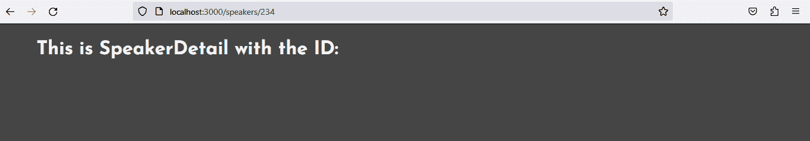
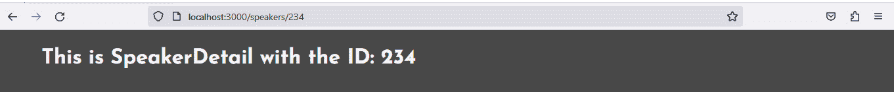
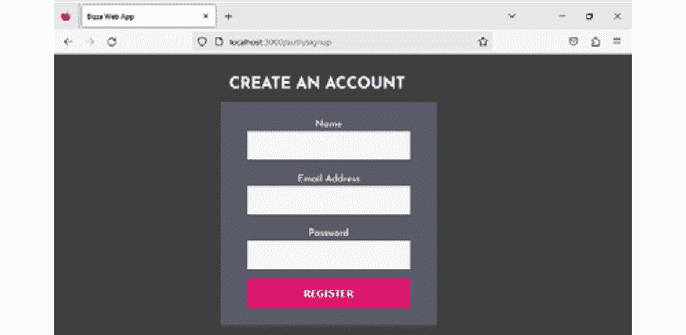
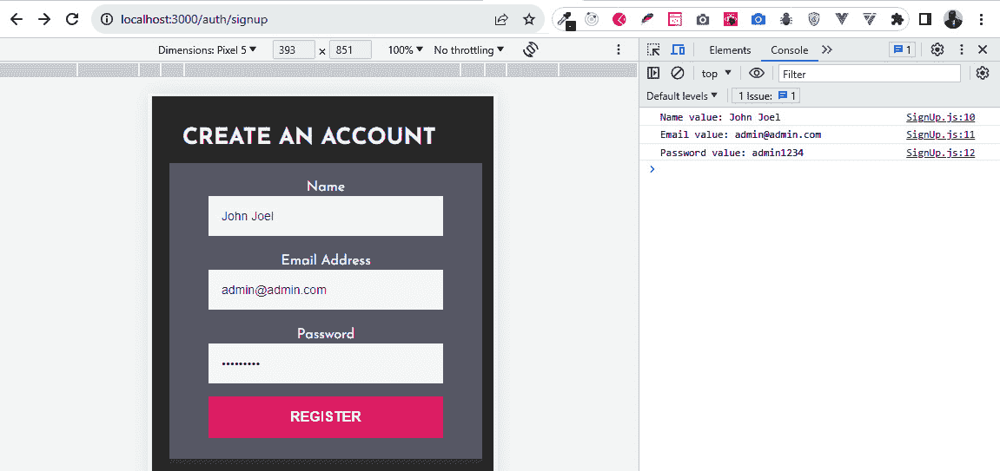
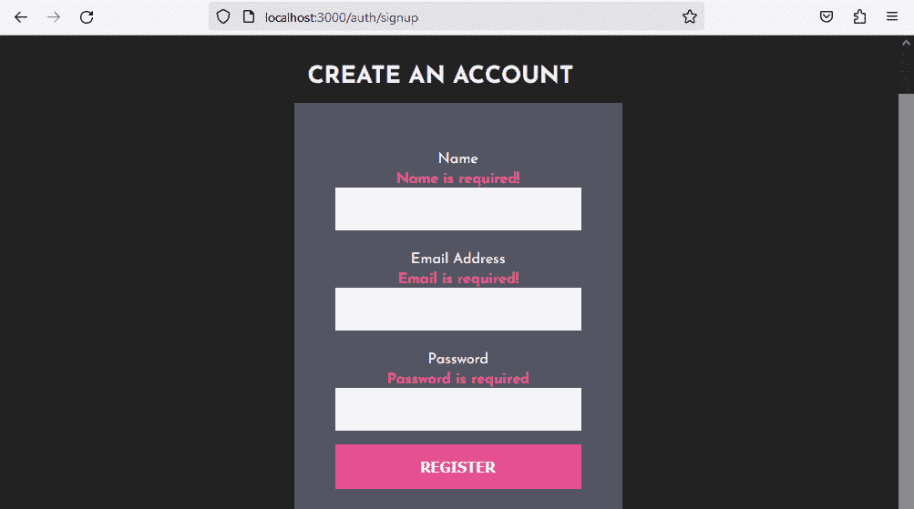

# 第六章：与 React Router 和表单一起工作

**React Router**是一个用于客户端和服务器端路由的库。想象一下网站通常是如何工作的；当你点击一个链接时，你的浏览器向 web 服务器发送一个请求，接收一大堆数据，然后花费时间处理所有这些，最后才最终显示新页面的内容。

每次你从网站请求新页面时，你都会获得相同的体验。使用客户端路由，事情会变得非常顺畅！每次你点击链接时，你不必经历整个过程，你的 Web 应用程序可以立即更新 URL，而不必打扰服务器获取新文档。这意味着你的 Web 应用程序可以快速显示应用程序的新部分，而没有任何延迟。这正是 React Router 所提供的。

在本章中，我们将探索 React Router v6 作为一个神奇的工具来处理导航。你还可以使用 React Router 进行数据获取，但我们将本书的范围限制在组件导航。你将在 React 中实现简单和复杂的嵌套路由。你还将使用`useParams`和`useNavigate`钩子进行动态和程序性路由。

接下来，我们将深入探讨 React 应用程序中的表单处理。表单是任何 Web 应用程序中的关键组件。没有表单，你无法拥有一个完整的 Web 应用程序。有趣的是，我们使用表单来完成各种目的，这些目的取决于业务或项目需求。

在 React 中，表单用于组件中，以允许用户登录、注册、搜索、联系表单、购物结账页面、活动参与者表单等活动。表单为浏览器-数据库服务器交互提供了一个媒介。

我们通过表单从我们应用程序的用户那里收集数据；有时，我们将用户数据发送到数据库或发送/保存到其他平台，如电子邮件和第三方应用程序。这完全取决于我们打算如何处理表单数据。

简而言之，你将学习如何使用表单元素来促进你的 React 应用程序中的用户交互。你还将了解如何利用 React Router，这是一个流行的客户端路由库。

到本章结束时，通过使用 React Router 库来导航你的不同应用程序端点，你将了解 React 应用程序中路由是如何工作的。最后，你将能够开发优雅的 React 表单，并以 React 的方式处理用户信息。

在本章中，我们将涵盖以下主要主题：

+   使用 React Router 进行路由

+   在 React 中添加 React Router

+   处理动态路由

+   在 React 中使用表单

+   受控和非受控表单组件

+   处理用户输入 – `输入字段`、`文本区域`和`选择`

+   在 React 中验证和清理用户数据

# 技术要求

本章的代码可以在[`github.com/PacktPublishing/Full-Stack-Flask-and-React/tree/main/Chapter06`](https://github.com/PacktPublishing/Full-Stack-Flask-and-React/tree/main/Chapter06)找到。

由于页面限制，一些代码块已被截断。请参阅 GitHub 以获取完整代码。

# 使用 React Router 进行路由

**路由**在 React Web 应用程序中是指无缝导航到和从多个应用程序组件、URL、页面和资源的能力，无论是内部还是外部。默认情况下，React 不包括页面路由在其库中。事实上，React 的主要目标是允许开发者设计单页 Web 应用程序的视图显示。

我们都知道 Web 应用程序需要多个视图，因此需要像 React Router 这样的外部库来允许组件导航。处理大型应用程序需要多个专业视图。这意味着我们必须解决 React 库中未处理的导航问题，但这就是 React Router 发挥作用的地方。

**React Router**是一个开源包，用于在 React 应用程序中进行基于组件的路由。它在 React 开发者中很受欢迎，并在各种 React 项目中广泛使用。有趣的是，你可以在任何打算运行 React 应用程序的地方使用 React Router：客户端使用浏览器、在 Web 服务器上使用 NodeJS，甚至通过 React Native 在移动应用程序中使用。

到目前为止，我们已逐步处理了*Bizza*应用程序，挑选组件及其交互。现在，我们将浏览我们项目的页面，并使用 React Router 将它们链接起来。

React Router 由一些路由功能组成。这些功能是 React Router 内部工作的螺丝钉。了解它们将有助于我们理解 React Router。在以下章节中，我们将解释 React Router 的一些常用功能。

让我们从`Router`组件开始，它允许在 React 应用程序中进行导航和路由。

## 路由器

React Router 提供了不同类型的路由器，允许你在 React 应用程序中处理路由和导航。每个路由器都有其特定的用例和优势。我们将简要讨论一些常用的 React Router 路由器：

+   `CreateBrowserRouter`：这是 React Router v6 中的一个专用函数，它作为在 Web 项目中生成浏览器路由的首选方法。通过利用 DOM 历史 API，它有效地更新 URL 并维护历史堆栈。此外，它解锁了对 v6.4 数据 API 的访问，包括加载器、操作、fetchers 和其他 React Router 功能。

+   `RouterProvider`：这是 React Router 中的一个组件，旨在为其作用域内渲染的所有组件提供路由实例。这确保了路由可以被用于高效管理应用程序的导航和路由需求。

    `RouterProvider` 组件需要一个 `router` 属性作为参数，这个属性作为将要分布到 `RouterProvider` 内渲染的组件中的路由实例。将 `RouterProvider` 定位在组件树的最顶层是至关重要的，以确保所有应用程序组件都能有效地访问路由实例。

+   `NativeRouter`: 这是一个在 React Native 中运行 React Router 所必需的接口，它是移动应用程序的路由解决方案。这超出了本书的范围。

接下来，我们将讨论 React Router 中的组件。React Router 中的组件允许您在单页应用程序中渲染特定路由的用户界面。

## 组件

React Router 中的组件使您能够在 React 应用程序内创建一个灵活且动态的路由系统，这使得管理导航和状态以及用户与您的 UI 交互变得更加容易。我们将简要讨论一些常用组件。

+   `Link`: `Link` 是一个组件元素，允许用户在点击时导航到另一个组件页面。在底层，`react-router-dom` 将一个 `<Link>` 标签渲染为一个带有真实 `href` 的锚点元素 `<a>`，该 `href` 将用户引导到它所指向的资源。

+   `NavLink`: 它作为一个 `<Link>` 标签工作，但增加了指示菜单中活动元素的功能。这在构建标签菜单时常用，您想显示当前选中的菜单部分。

+   `Route`: 这用于根据当前位置在 React Router 中渲染 UI。`Route` 有一个路径和一个元素作为属性。这是它的工作方式：每当 `Route` 组件的路径与当前 URL 匹配，基于用户的点击操作，它将渲染其元素。这个元素可以是应用程序中的任何组件。我们很快将看到一个实时示例。

+   `Routes`: 它有 `Route` 作为其子元素。`Routes` 在逻辑上以简单的方式工作，就像 `Route` 一样，只不过 `Route` 或一系列 `Route` 是 `Routes` 的子元素。因此，每当 UI 组件的路径发生变化时，`Routes` 会检查其所有子 `Route` 元素，以确定用户请求或点击路径的最佳匹配，并渲染该特定 UI。

接下来，我们将讨论 React Router 中的钩子。钩子提供了一种与路由状态交互并在组件内直接执行导航操作的机制。我们将讨论 `useLocation`、`useParams` 和 `useNavigate` 等钩子。

## 钩子

React Router 提供了一系列钩子，使开发者能够以高效的方式管理组件内的路由、状态和导航。我们将简要讨论一些常用钩子：

+   `useLocation`: 您可以使用此钩子来在需要跟踪当前位置变化时执行一些副作用。`useLocation` 钩子通常返回当前位置对象。

+   `UseParams`：您可以使用此钩子通过当前 URL 匹配`<Route path>`从浏览器获取参数。`useParams`钩子返回一个包含动态参数键值对的对象。

+   `UseNavigate`：您可以使用此钩子在不使用`history`对象或`Link`组件的情况下，在 React 应用程序的不同路由之间进行编程式导航。

现在，是时候将 React Router 添加到我们的根应用程序中，并将我们的页面连接起来。

# 在 React 中添加 React Router

您需要安装 React Router 才能在项目中使用它。我们将为*Bizza*项目构建导航功能，以连接不同的组件。导航标签将包括主页、关于页、演讲者页、活动页、赞助商页和联系页。让我们通过在项目目录的终端中输入以下命令开始编码：

```py
npm install react-router-dom@latest
```

一旦我们在项目的根目录中安装了该包，我们就可以创建主页、关于页、演讲者页、新闻页和联系页的组件。

现在，我们将为这些组件中的每一个添加内容：

+   在`src/pages/HomePage/HomePage.js`内部，添加以下代码片段：

    ```py
    import React from 'react';const HomePage = () => {    return <div> Home page </div>;};export default HomePage;
    ```

+   在`src/pages/AboutPage/AboutPage.js`内部，添加以下内容：

    ```py
    import React from 'react';const AboutPage = () => {    return <div> About page </div>}export default AboutPage;
    ```

+   在`src/pages/SpeakersPage/SpeakersPage.js`内部，添加以下内容：

    ```py
    import React from 'react';const SpeakersPage = () => {    return <div>Speakers </div>}export default SpeakersPage;
    ```

+   在`src/pages/EventsPage/EventsPage.js`内部，添加以下内容：

    ```py
    import React from 'react';const EventsPage = () => {    return <div>Events page </div>}export default EventsPage;
    ```

+   在`src/pages/SponsorsPage/SponsorsPage.js`内部，添加以下内容：

    ```py
    import React from 'react'const SponsorsPage = () => {    return <div>Sponsors Page</div>}export default SponsorsPage
    ```

+   在`src/pages/ContactPage/ContactPage.js`内部，添加以下内容：

    ```py
    import React from 'react'const ContactPage = () => {    return <div>Contact Page</div>}export default ContactPage
    ```

现在这些组件已经设置好了，让我们开始在我们的应用程序中实现 React Router 的功能：

1.  在`src/index.js`内部，添加以下代码：

    ```py
    import React from 'react';import { createRoot } from 'react-dom/client';import {    createBrowserRouter,    RouterProvider,} from 'react-router-dom';
    import statements required for the client-side routing using React Router:
    ```

    +   `createRoot`：导入创建用于渲染的根 React 组件的函数

    +   `createBrowserRouter`和`RouterProvider`：导入与 React Router 相关的组件和函数，它提供了路由功能

1.  我们还需要导入我们之前创建的所有各种组件。仍然在`index.js`内部，添加以下组件导入：

    ```py
    import HomePage from './pages/HomePage/HomePage';import AboutPage from './pages/AboutPage/AboutPage'import SpeakersPage from './pages/SpeakersPage/SpeakersPage';import EventsPage from './pages/EventsPage/EventsPage';import SponsorsPage from './pages/SponsorsPage/SponsorsPage';import SponsorsPage from './pages/SponsorsPage/SponsorsPage';
    ```

    上述导入是将在应用程序中使用的各种文件和组件。

请注意，我们可能希望 React Router 了解的所有未来组件都可以作为导入的文件和应用程序的组件添加。接下来，我们将设置路由配置。

## 设置路由配置

在网络应用程序开发和如 React Router 之类的库的背景下，路由配置指的是设置规则或映射的过程，这些规则或映射定义了网络应用程序中不同的 URL（或路由）应该如何被处理。这包括指定为特定 URL 渲染哪些组件或视图，使用户能够无缝地浏览应用程序的不同部分。

使用 React Router，您可以定义一系列路由，并将每个路由与要显示的相应组件关联起来。这些路由可以是静态的、动态的（带有占位符）或嵌套的，以创建一个层次结构。

让我们将这些应用到实际中。将以下代码添加到 `index.js` 文件中：

```py
const router = createBrowserRouter([  {
    path: "/",
    element: <HomePage />,
  },
  {
    path: "/about",
    element: <AboutPage/>,
  },
  {
    path: "/speakers",
    element: <SpeakersPage/>,
  },
  {
    path: "/events",
    element: <EventsPage/>,
  },
{
    path: "/sponsors",
    element: <SponsorsPage/>,
  },
{
    path: "/contact",
    element: <ContactPage/>,
  },
    ],
);
createRoot(document.getElementById("root")).render(
  <RouterProvider router={router} />
);
```

上述代码展示了使用 `createBrowserRouter` 函数创建的 `router` 对象，该函数定义了应用程序的路由配置。这个 `router` 对象设置了不同的路径及其对应的 React 组件，当这些路径匹配时，将渲染这些组件。

这意味着当用户在应用程序中导航到不同的 URL 时，将根据定义的路由渲染相应的组件；例如：

+   导航到 `/` 将渲染 `HomePage` 组件

+   导航到 `/about` 将渲染 `AboutPage` 组件

同样，其余的组件也是根据路由及其对应的组件进行渲染和显示的。`react-dom` 库中的 `createRoot()` 函数，`'react-dom/client'`，用于创建一个用于渲染的 `root` 组件。这是一个较新且更高效的替代方案，用于 `ReactDOM.render()`。`createRoot()` 函数接受一个目标 DOM 元素作为参数，并返回一个可以用于将 React 元素渲染到该目标元素的 `root` 组件。

在这种情况下，`createRoot(document.getElementById("root"))` 创建了一个将在具有 `"root"` ID 的 `<div>` 元素内部渲染其内容的 `root` React 组件。本质上，`createRoot` 函数用于创建 `Root` 对象并将 `RouterProvider` 组件渲染到 `root` DOM 元素中。

然后，`RouterProvider` 组件渲染 `HomePage` 组件，这是应用程序的默认路由。`<RouterProvider router={router} />` 使用了 React Router 的 `RouterProvider` 组件。`RouterProvider` 接收一个名为 `router` 的属性，该属性的值是之前定义的包含先前路由配置的 router 对象。这使得 `router` 可用于整个应用程序，并基于定义的路由进行导航。

我们将在下一节中添加到路由的链接。

## 添加链接

让我们通过向元素添加链接来改进导航菜单。要向元素添加链接，请使用 `<Link to="" >elementName </Link>`。`to=""` 允许我们插入我们打算导航到的导航路径。让我们看看典型链接定义的细节：

```py
<nav className="nav">  <ul>
    <li>
      <Link to="/" className='navlink'>Home</Link>
    </li>
    <li>
      <Link to="/about" className='navlink'>About</Link>
    </li>
    <li>
      <Link to="/speakers" className='active
        navlink'>Speakers</Link>
    </li>
    <li>
      <Link to="/events" className='navlink'>Events</Link>
    </li>
    <li>
      <Link to="/sponsors" className='navlink'>
        Sponsors</Link>
    </li>
      <li><Link to="/contact" className='navlink'>
        Contact</Link>
    </li>
  </ul>
</nav>
```

检查 GitHub `src/components/Header/Header.jsx` 文件以了解更多关于 `Link` 定义的信息。

以下截图显示了带有菜单和链接的 `HomePage`：


图 6.1 – 展示路由和链接的截图

接下来，让我们学习如何将一个路由嵌入到另一个路由中，以便我们得到所谓的嵌套路由。

## 添加嵌套路由

**React Router 中的嵌套路由** 提供了一种在应用程序中组织路由的结构化方法。它们便于对相关路由进行分组，简化不同部分之间的导航。要实现嵌套路由，必须在 Route 组件上使用 children 属性。

此属性接受一个路由组件数组作为其值，定义了当父路由匹配时将渲染的子路由。例如，考虑以下代码片段，它演示了为演讲者创建嵌套路由。

在`src/index.js`内部，更新`/speakers`路由，如下所示：

```py
const router = createBrowserRouter([  {
    path: "/speakers",
    children: [
      {
        index: true,
        element: <SpeakersPage />,
      },
      {
        path: "/speakers/:speakerId",
        element: <SpeakerDetail />
      },
    ],
  },
]);
```

在前面的代码中，我们有一个名为`speakers`的父路由，路径为`/speakers`。`SpeakerDetail`的子路由路径为`/speakers/:speakerId`。路径中的`:speakerId`占位符是一个动态参数，当用户导航到该路由时，它将被演讲者的`:speakerId`值替换。

`SpeakerDetail`组件将使用 URL 中`speakerId`的详细信息进行渲染。在`src/pages`内部，创建`SpeakerDetail/SpeakerDetail.js`；然后，添加以下代码：

```py
const SpeakerDetail = () => {    return (
        <div className='page-wrapper'>
            <h1>This is SpeakerDetail with the ID: </h1>
        </div>
    )
}
export default SpeakerDetail
```

以下截图显示了带有`http://localhost:3000/speakers/234`的嵌套路由：



图 6.2 – 展示嵌套路由的截图

从本质上讲，嵌套路由可以用来以对应用程序有意义的方式组织路由。它们还可以用来使在相关路由之间导航更容易。

接下来，我们将探讨如何使用`useParams`和`useNavigate`处理动态和程序化路由。

# 处理动态路由

在 Web 应用程序开发中，使用`speakerId`、`productId`、`postId`等来表示变化的值。

例如，让我们考虑我们之前更新的带有`/speakers/:speakerId`的演讲者路由。在动态路由前添加冒号是一种惯例，如下所示：`:speakerId`。那么，我们如何从 URL 中检索这个`speakerId`的值呢？这就是`useParams`钩子的作用所在。

## 使用 useParams

React Router 中的`useParams`钩子提供了对从路由中提取的动态参数的访问。这些参数是与动态路由路径中的占位符相对应的值。

例如，在以下代码片段中，使用了`useParams`钩子从`/speakers/:speakerId`路由中检索`SpeakerId`。以下代码展示了代码实现。

按照以下方式更新`src/pages/`中的`SpeakerDetail`组件：

```py
import React from 'react'import { useParams } from 'react-router-dom'
const SpeakerDetail = () => {
    const {speakerId} = useParams()
    return (
        <div className='page-wrapper'>
            <h1>This is SpeakerDetail with the ID:
                {speakerId} </h1>
        </div>
    )
}
export default SpeakerDetail
```

在前面的代码片段中，我们有`SpeakerDetail`组件，它用于根据从 URL 中提取的`speakerId`动态参数显示演讲者的详细信息。`useParams`钩子将返回一个包含路由中动态参数的对象。在这种情况下，对象中的`speakerId`属性将包含 URL 中的演讲者 ID。

以下截图显示了从 URL 中提取的`speakerId`：



图 6.3 – 展示提取的 speakerId 的截图

`useParams` 钩子是一个强大的工具，可以用来访问任何路由的动态参数。接下来，我们将简要讨论 `useNavigate` 钩子用于编程导航。

## 使用 `useNavigate`

`useNavigate` 是 React Router v6 中引入的一个新钩子。它提供了一种在 React 应用程序中通过编程方式导航或重定向用户到不同路由的方法。与之前版本中提供对历史对象访问的 `useHistory` 钩子不同，`useNavigate` 提供了一种更直接和明确的方式来在路由之间导航。

使用 `useNavigate`，你可以响应某些事件（如按钮点击、表单提交或其他用户操作）来启动导航。与 React Router v5 中直接修改 URL 不同，你现在可以使用 `useNavigate` 返回的 `navigate` 函数来实现导航。

例如，在 `src/components/Header/Header.jsx` 文件中，我们有以下代码来展示 `useNavigate` 的实现：

```py
import React from 'react';import {Link, useNavigate } from 'react-router-dom';
const Header = () => {
  const navigate = useNavigate();
  const handleLoginButtonClick = () => {
    navigate('/auth/login');
  }
  return (
    <header className="header">
      ...
      <div className="auth">
        <button onClick={handleLoginButtonClick}
          className="btn">Login</button>
      </div>
    </header>
  );
}
export default Header;
```

在前面的代码片段中，调用了 `useNavigate` 钩子以获取 `navigate` 函数。当按钮被点击时，会执行 `handleLoginButtonClick` 函数，该函数反过来调用 `navigate('/auth/login')`。这将通过编程方式将用户导航到 `'/auth/login'` 路由。

与直接操作历史对象相比，`useNavigate` 提供了一种更声明性和简洁的方式来处理导航。当使用 React Router v6 时，它提高了代码的可读性和可维护性。

本节总结了 React Router 的路由功能。接下来的部分将重点转向 React 库中表单管理的领域。

# 在 React 中使用表单

传统上，表单用于收集用户输入。没有表单的严肃生产级 Web 应用程序是不存在的。在 React 中使用表单与使用 HTML 表单元素略有不同。如果你已经开发了一段时间的 React 应用程序，这可能对你来说并不陌生。

React 表单元素与普通 HTML 表单元素之间的细微差别是由于 React 处理表单内部状态的独特方式。HTML DOM 以浏览器 DOM 的方式管理原生 HTML 表单元素的内部状态。另一方面，React 通过其组件的状态来处理表单元素。

那么，这个状态究竟是什么呢？我们所说的状态是一个在表单提交前持有用户输入的对象。表单元素有一个内部状态，它可以防止在将用户输入提交到处理通道之前数据丢失。

在为表单元素的内部状态管理奠定基础之后，让我们快速了解一下 React 如何通过其基于组件的方法以及 React 的 VDOM 机制来增强用户体验。我们将使用 React 开发表单，而不使用任何外部库；相反，我们将专注于纯 React，并利用其基于受控组件的方法来管理表单状态。目前，我们将设计一个简单的注册表单组件。

下面的代码片段显示了一个 `SignUp` 表单组件，以帮助你了解如何在 React 中创建一个简单的表单。

在你的项目目录 `src/pages/Auth/SignUp.js/` 中创建 `SignUp`：

```py
import React from 'react';const SignUp = () => {
  return (
    <>
    <div className="signUpContainer">
    <form>
    <h2>Create an account</h2>
      <div className="signUpForm">
        <label htmlFor="name">Name</label>
        <input
          id="name"
          type="text"
          name="name"
        />
      <label htmlFor="email">Email Address</label>
        <input
          id="email"
          type="email"
          name="email"
        />
      <label htmlFor="password">Password</label>
        <input
          id="password"
          type="password"
          name="password"
        />
            <button>Register</button>
      </div>
    </form>
    </div>
</>
  );
};
export default SignUp;
```

前面的代码片段应该看起来很熟悉——这里没有特别之处，除了 `<label>` 属性的 `htmlFor`。这是 React 添加 `for` 属性到表单标签的方式。`htmlFor` 属性用于将相应的 ID 与输入表单元素匹配。

接下来，让我们更新 `index.js` 中的路由配置，并添加 `signup` 路由。在 `src/index.js` 中，添加注册路径及其相关组件：

```py
{    path: "/auth/signup",
    element: <SignUp/>,
  },
};
```

下面的图显示了注册表单代码片段的输出：



图 6.4 – 展示渲染的注册表单截图

当你导航到 `http://localhost:3000/auth/signup` 时，你会看到 `SignUp` 表单组件已经被渲染。有了这个，React 只是渲染表单元素，并允许原生浏览器 DOM 在每次表单提交时继续正常工作。如果你填写表单并点击 **注册**，你会看到页面重新加载的效果。

这显然是一种反 React 设计模式，这意味着这不是 React 设计表单元素的方式。那么，在构建直观的用户表单体验方面，React 的设计期望是什么？这个问题的答案就是我们将在下一节中关注的重点。在那里，你将学习如何使用 React 的所有要素构建引人入胜且可重用的表单。

在 React 中，有两种表单组件的方法：受控和不受控表单组件。在下一节中，我们将深入探讨这个问题，并学习如何设计在 React 网络应用程序项目中增强与表单元素交互的表单组件。

# 受控和不受控表单组件

到目前为止，在这本书中，我们已经熟悉了组件以及它们是如何成为任何 React 应用程序的构建块的。当你将独立设计的组件片段混合在一起时，你会得到一个 UI 组件或一个完整的 React 网络应用程序，具体取决于你正在做什么。

React 的组件驱动方法在不久的将来不会改变。为应用程序构建高质量的 UI 是 React 最擅长的。作为开发者，无论哪种方式，您都需要一个高性能的表单。React 通过两种构建防漏数据并提高表单交互用户体验的表单组件的方法来满足您的需求。

这两种方法分别是受控和非受控表单组件。让我们从受控表单组件开始，以便我们充分理解它们的实现方式和为什么它们是 React 推荐的表单处理方法。

## 受控表单

在受控表单方面，React 组件维护表单元素中用户输入的内部状态。我们的意思是什么？本质上，React 有一个内置的事件包装器，称为 `SyntheticEvent`，它是 React 事件系统的一个关键组件。

我们在 *第五章*，*React 中的 JSX 和列表显示*，*React 的事件处理* 部分详细讨论了 `SyntheticEvent`。在受控表单方法中，受控表单组件的事件处理函数接受 `SyntheticEvent` 的实例，例如 `onChange`、`onInput`、`onInvalid`、`onReset` 和 `onSubmit`，以控制表单数据的状态。

例如，`onChange` 事件监听组件表单状态值的变化：这种变化可能是用户在表单输入中输入某些内容或尝试替换表单输入的值。`onChange` 事件被触发，并且相应地更改状态数据值。

让我们探索事件处理程序如何使我们拥有受控表单组件。以下代码片段演示了 React 中的受控表单，以及管理 `onChange` 和 `onSubmit` 事件的相关事件处理程序。更新 `SignUp.js` 文件代码，以在 `src/pages/Auth/SignUp.js` 中的表单组件内演示事件处理程序的使用：

```py
import React,{ useState } from 'react';const SignUp = () => {
  const[name, setName ] = useState("");
  const [ email, setEmail ] = useState("" );
  const [password, setPassword] = useState("");
  const nameHandler = (e) => {
    setName(e.target.value);
  };
  const onSubmitHandler = (e) => {
    e.preventDefault();
    alert(`Name: ${name}: Email: ${email} Password:
      ${password}`);
  };
  return (
    <>
      <div className="signUpContainer">
        <form onSubmit={onSubmitHandler}>
          <h2>Create an account</h2>
          <div className="signUpForm">
            <label htmlFor="name">Name</label>
            <input
              id="name"
              type="text"
              name="name"
              value={name}
              onChange={nameHandler}
            />
            <button>Register</button>
          </div>
        </form>
      </div>
    </>
  );
};
export default SignUp;
```

请参阅 GitHub 以获取完整的源代码。在前面的代码片段中，我们通过向其添加一些输入属性来更新我们的默认表单——即 `value` 和 `onChange` 事件，并为受控表单做好了准备。表单输入使用 `value` 作为当前值的属性，并使用 `onChange` 作为回调来更新值的内部状态。

如您所知，用户操作，如轻触键盘、点击网页上的按钮或鼠标悬停在 HTML 元素上，都会引发事件。但 React 有我们所说的合成事件，具有一些实例方法和属性，用于监听用户交互并发出某些事件。

在 React 中，`onChange` 和 `onClick` 是这些实例中比较流行的。我们将使用更多这样的功能。`onChange` 事件会在表单输入元素发生变化时触发。Web API 的 `event.target` 属性用于访问这个变化的价值。

此外，`onClick` 事件在每次点击 HTML 元素时都会被激活；例如，当按钮被点击时。在我们的代码片段中，事件处理程序指定在组件函数的主体中：`nameHandler`、`emailHandler` 和 `passwordHandler`。这些事件处理程序监听表单输入中的相应值变化并控制表单的操作。

在 `nameHandler` 的情况下，它监听用户输入的内容，使用 `e.target` 属性访问值，并通过 `setName()` 更新其状态：

```py
const nameHandler = (e) => {          setName(e.target.value);
};
```

在带有 `Name` 标签的表单输入中，添加了以下内容：

```py
        <input              …
              value={name}
          onChange={nameHandler}
        />
```

注意

电子邮件和密码的 `input` 元素同样更新了适当的值和 `onChange` 事件处理程序。

`onSubmitHandler()` 处理表单元素的 `onSubmit` 事件：

```py
<form onSubmit={onSubmitHandler}>  const onSubmitHandler = (e) => {
        e.preventDefault();
        alert(`Name: ${name}: Email: ${email} Password:
          ${password}`);
  };
```

`e.preventDefault()` 阻止浏览器默认的重新加载行为。我们还使用 `alert()` 输出提交的表单数据。控制表单组件的好处是什么？

有几个原因会让你想要使用控制表单组件：

+   React 推荐这样做。这是 React 处理 React 中用户输入的最佳实践方式。

+   组件紧密控制表单的行为，从而确保用户和开发者有反应性的体验。

+   由于事件处理程序监听表单元素并适当地发出事件，我们从表单中获得即时反馈。

控制表单组件提升了 React 应用中表单交互的体验，并且在 React 社区中得到了广泛的应用。接下来，我们将学习未控制表单组件为 React 开发者社区提供了什么，以及我们如何使用它们。

## 未控制表单

在未控制表单中，原生 DOM 直接维护和存储用户输入的状态。它是通过在 DOM 中存储表单元素的值并引用表单元素来做到这一点的。这是 HTML 表单元素维护其内部状态的常规方式。

React 组件通过维护对 DOM 中底层表单元素的引用来简单地与未控制表单元素交互。让我们复制我们之前的注册表单，并重构代码片段以使用未控制表单组件。

此代码片段使用 `useRef` 钩子来引用 DOM 中表单元素的值：

```py
import React,{ useRef } from 'react';const SignUp = () => {
  const onSubmitHandler = (e) => {
    e.preventDefault();
    console.log("Name value: " + name.current.value);
    console.log("Email value: " + email.current.value);
    console.log("Password value: " +
      password.current.value);
  };
  return (    <>
    <div className="signUpContainer">
    <form onSubmit={onSubmitHandler}>
    <h2>Create an account</h2>
      <div className="signUpForm">
        <label htmlFor="name">Name</label>
        <input
          id="name"
          type="text"
          name="name"
          ref={name}
        />
      <button>Register</button>
      </div>
    </form>
    </div>
</>
  );
};
export default SignUp;
```

请参阅 GitHub 以获取完整的源代码。让我们简要解释前面的代码片段。

在使用未控制表单 React 组件时，我们需要 `useRef` 钩子来访问 DOM 中的表单元素。`import React, { useRef } from 'react';` 将 React 和 `useRef()` 钩子引入作用域。

然后，我们创建了一个引用变量来保存 DOM 中表单元素的引用：

```py
const name = useRef();const email = useRef();
const password = useRef();
```

在 `input` 标签中，我们将引用变量绑定到输入元素的 `ref` 属性：

```py
<label htmlFor="name">Name</label>        <input
          id="name"
          type="text"
          name="name"
          ref={name}
        />
```

对于电子邮件和密码输入元素，采取了相同的步骤。

为了提取表单字段的当前值，我们必须在 `onSubmitHandler()` 中使用 `useRef` 的 `current.value` 属性：

```py
  const onSubmitHandler = (e) => {    e.preventDefault();
    console.log("Name value: " + name.current.value);
    console.log("Email value: " + email.current.value);
    console.log("Password value: " +
      password.current.value);
  };
```

以下图显示了 React 中未受控表单组件的控制台日志：



图 6.5 – 未受控表单组件的控制台日志

未受控表单组件有哪些好处？

虽然 React 推荐使用受控方法，但使用未受控表单组件的好处并不多。以下是一些在您的 React 项目中需要考虑的好处：

+   在复杂的 React 表单应用中，每次用户输入都重新渲染表单 UI 可能会对应用程序的性能造成昂贵的 DOM 操作。使用未受控表单组件可以防止与表单元素组件重新渲染相关的性能瓶颈。

+   当您需要在 React 应用程序中处理`file`类型的表单输入时，例如进行文件上传，未受控表单更为合适。

+   当您从遗留的非 React 代码库项目迁移时，未受控表单的使用非常快捷。由于 DOM 维护表单的状态，因此从遗留代码库中处理表单字段更容易。

现在我们已经充分了解了 React 项目中未受控表单的相关内容，并介绍了一些使用未受控表单的好处，让我们深入了解一些常用的输入元素：`Input`、`TextArea`和`Select`。

# 处理用户输入 – Input、TextArea 和 Select

处理 React 表单元素的方式与非 React 应用程序处理用户输入的方式略有不同。在本节中，我们将查看在遵循 React 最佳实践的同时处理用户输入时使用的常见表单元素。

## Input

表单中的**Input**字段是任何 Web 应用程序中最广泛使用的标签。输入字段允许收集用户数据。根据在表单中的用途，输入字段有不同的类型。在受控输入表单元素中，组件状态始终通过表单输入字段的值或 checked 属性来设置。您还有一个回调函数，用于监听用户输入导致的价值变化。

对于单选按钮和复选框的输入类型，我们使用 checked 属性。要访问输入字段的值，我们可以使用`event.target.checked`。

## TextArea

`Textarea`是一个允许用户写入多行文本字符的标签。`Textarea`通常用于收集用户数据，如 Web 应用程序中的评论或评论部分。React 中的`Textarea`元素工作方式不同。状态是通过表单输入字段中的值或 checked 属性来设置的，类似于单个输入字段。`textarea`没有子元素，这是 HTML 的典型特征。

您可以使用回调函数来检索表单元素状态值的更改：

```py
<textarea value={textarea} onChange={onChangeCallback} />
```

## Select

`select`表单元素用于设计下拉列表。React 有自己独特的处理`select`的方式。选中值通过`select`表单元素上的`value`属性设置。在 React 中，没有`selected`属性。

这个选择是由`select`表单元素上的`set value`属性决定的。您可以在处理表单元素中的选中值时使用回调函数：

```py
<select value={user} onChange={onChangeCallback}><option value="user">User</option>
<option value="admin">Admin</option>
</select>
```

接下来，我们将讨论 React 应用程序如何处理用户数据验证，以及当用户在填写表单元素时，您如何对用户数据进行清理。

# 在 React 中验证和清理用户数据

**验证**是一个确保用户数据质量、完整性和系统期望的适当格式的过程。您永远不能盲目信任您应用程序用户提供的数据。虽然我们期望他们信任我们的代码，但我们不能通过不指导他们如何处理我们的表单和表单数据来回报这种信任。

从初级开发者开始，短语“永远不要相信用户会始终用你的表单做正确的事”将永远适用。您永远不能信任用户数据原样。来自用户的数据必须经过彻底审查和清理，并确保其处于期望的格式。

表单字段是通向您在 Web 开发中可能称之为后端的一切的开放窗口。因此，在没有规则的情况下信任用户输入可能会对您作为开发者的精神健康以及您 Web 应用程序的健康状况造成损害。

作为 React 开发者，您始终可以遵循一些标准的验证规则。这些验证规则指导您和您的应用程序避免应用程序中的不良行为者。

让我们看看在用户输入数据存入您的数据库或任何后端基础设施之前，您可能想要勾选的一些验证规则：

+   **数据类型**：您需要确认用户是否为表单字段输入了正确的数据类型。他们甚至是否填写了任何内容？您需要检查。例如，在一个期望字符串字符的表单字段中，确保您没有接收到数值数据。

+   **一致性**：您需要确保用户输入的数据一致性，确保获取一致数据的一种方法是通过强制执行验证规则。例如，您可能添加一个正则表达式来检查密码长度是否不少于 8 个字符，并且包含符号。

    或者，您可能只是允许用户从选项下拉列表中选择他们想要访问的国家，而不是要求他们输入他们想要访问的国家名称。如果您这样做，您将对您的好意得到的回报感到粗鲁的震惊。

+   **数据格式**：您可能希望应用程序用户的出生日期以*YYYY-MM-DD*或*DD-MM-YYYY*格式。我和您都知道我们不能将此留给用户的任意选择！

+   **范围和约束**：你也可能想要检查数据是否与某些参数范围或某些数据是否落在某些预期约束内。因此，你需要通过一些机制来强制执行这一点 - 正则表达式就是这样的机制之一。你应该始终记住，用户也容易犯真正的错误，即使他们无意于做出不良行为。

话虽如此，在 React 表单设计中，你会在两个主要情况下想要强制执行验证规则：

+   **在用户输入时**：当用户与表单元素交互时，你会检查其合规性并提供即时反馈。React 在这里使用受控表单组件表现最佳，该组件使用回调来收集用户值并将它们传递给具有检查错误能力的事件处理器。我们将在我们的注册表单中很快实现这一点。

+   **在用户提交时**：在这种情况下，当用户点击提交按钮时，表单数据将受到验证。这曾经是过去的黄金标准。然而，如今，由于前端技术的阵列使得即时反馈变得容易实现，这在企业应用开发中似乎发生得越来越少。

## 实现表单验证

让我们检查使用 React 受控表单组件实现表单数据验证的实现方式。

我们将首先导入 `useState` 和 `useEffect` 钩子，并将它们引入作用域以分别管理状态和副作用：

```py
import React,{ useState,useEffect } from 'react';
```

然后，我们必须设置状态变量为 `initialValues`、`formValues`、`formErrors` 和 `isSubmit`：

```py
const SignUp = () => {const initialValues = { name: "", email: "", password: "" };
const [formValues, setFormValues] = useState(initialValues);
const [formErrors, setFormErrors] = useState({});
const [isSubmit, setIsSubmit] = useState(false);
```

`initialValues` 被声明为一个对象，用于保存初始表单输入状态，设置为空字符串。`useState` 将 `initialValues` 变量的值作为初始状态，并将其分配给 `formValues`，这样从开始，所有表单输入值都是空字符串。`formErrors` 的初始状态设置为空对象，`isSubmit` 的初始状态设置为 `false`。这意味着还没有提交任何表单。

我们需要一个 `onChange` 函数来跟踪表单输入值的变化。我们必须设置 `onChangeHandler()`，它接受事件对象的参数 `e` 并解构 `e.target` 对象，该对象返回两个属性 - `name` 和 `value`。`setFormValues` 函数接受所有当前的 `formValues`，使用 `...formValues` 扩展运算符，并将它们更新为新值：

```py
const onChangeHandler = (e) => {const { name, value } = e.target;
setFormValues({ ...formValues, [name]: value });  };
```

`useEffect()` 用于在表单没有错误时记录成功提交的值：

```py
useEffect(() => {    if (Object.keys(formErrors).length === 0 && isSubmit) {
      console.log(formValues);
    }
  }, [formErrors]);
```

接下来，使用 `validateForm` 函数设置表单数据验证规则。这是一个简单的验证规则，检查 `name`、`email` 和 `password` 表单输入是否已填写。它还检查是否使用了正确的格式来处理电子邮件，使用 `regex.test()`。

对于密码，我们必须检查密码是否超过 8 个字符但不超过 12 个字符：

```py
const validateForm = (values) => {    const errors = {};
    const regex = /^[^\s@]+@[^\s@]+\.[^\s@]{2,}$/i;
    if (!values.name) {
      errors.name = "Name is required!";
    }
      ...(This ... represents omitted code which can be
          found on GitHub)
    return errors;
  };
```

然后，调用`onSubmitHandler()`，这确保了`setFormErrors()`函数被运行，该函数以`validateForm()`作为参数。如果没有表单错误，`setIsSubmit`被设置为`true`，允许表单提交：

```py
  const onSubmitHandler = € => {    e.preventDefault();
    setFormErrors(validateForm(formValues));
    setIsSubmit(true);
  };
```

下面是表单组件返回的 JSX，其中包含`onSubmitHandler`以及`formErrors`对象显示的每个错误：

```py
return (  <div className="signUpContainer">
    <form onSubmit={onSubmitHandler}>
      <h2>Create an account</h2>
      <div className="signUpForm">
        <label htmlFor="name">Name</label>
        <p style={{color:'red', fontWeight:'bold'}}>
          {formErrors.name}</p>
        <input
          id="name"
          type="text"
          name="name"
          value={formValues.name}
          onChange={onChangeHandler}
        />
  ...(This ... represents omitted code which can be found
      on GitHub)
        <button>Register</button>
      </div>
    </form>
  </div>
);
};
export default SignUp;
```

下图显示了在提交前填写表单字段时的表单条目输出：



图 6.6 – 包含验证规则的表单截图

我们为每个表单元素添加了`formErrors`属性，以便在存在错误时输出错误信息。例如，`{formErrors.name}`会在表单中没有填写名称时显示错误。

该验证规则的完整代码可以在本书的 GitHub 仓库中找到：https://github.com/PacktPublishing/Full-Stack-Flask-Web-Development-with-React/blob/main/Chapter-06/

这总结了如何在 React 应用程序中添加验证而不使用外部库，从而最小化应用程序可能依赖的潜在依赖项数量。

# 摘要

在本章中，我们讨论了 React 中的两个重要概念：表单和路由。我们强调了在非 React 和 React 应用程序中设置的表单之间的细微差别。React 通过使用受控和非受控表单组件来处理表单元素，从而在用户体验方面提供了大量的改进。

然后，我们深入探讨了验证概念以及如何在 React 中实现验证规则。然后，我们讨论了 React Router。我们展示了第三方库 React Router 如何使我们能够导航复杂的 React 应用程序。我们讨论了`Route`、`Links`和嵌套`Routes`的使用，并探讨了它们在 React 项目中的应用。

在下一章中，我们将学习并理解如何在 React 应用程序中实现测试。测试是软件开发的一个基本部分，因为它确保应用程序的组件按预期工作，并且在开发中遵循了相关的最佳实践。
