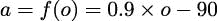

## 第二章：2

介绍基本函数式概念

函数式编程的大多数特性已经包含在 Python 语言中。我们编写函数式 Python 的目标是尽可能地将我们的关注点从命令式（过程式或面向对象）技术转移到函数式编程上。

我们将探讨以下函数式编程主题：

+   在 Python 中，函数是一等对象。

+   我们可以使用和创建高阶函数。

+   我们可以非常容易地创建纯函数。

+   我们可以处理不可变数据。

+   在一定程度上，我们可以创建具有非严格子表达式评估的函数。Python 通常严格评估表达式。正如我们稍后将要看到的，一些运算符是非严格的。

+   我们可以设计利用贪婪与惰性评估的函数。

+   我们可以用递归代替显式的循环状态。

+   我们有一个类型系统，可以应用于函数和对象。

这部分内容是对第一章概念的扩展：首先，纯函数式编程避免了通过变量赋值来维护显式状态的复杂性；其次，Python 不是一个纯函数式语言。

由于 Python 不是一个纯函数式语言，我们将关注那些在函数式编程中无可争议的重要特性。我们将从查看函数作为具有自己属性和方法的独立 Python 对象开始。

### 2.1 函数作为一等对象

函数式编程通常简洁且表达力强。实现这一目标的一种方法是通过将函数作为其他函数的参数和返回值。我们将探讨许多操作函数的示例。

为了实现这一点，函数必须在运行时环境中是一等对象。在像 C 这样的编程语言中，函数不是运行时对象；因为编译的 C 代码通常缺乏内部属性和方法，所以对函数的运行时内省很少。然而，在 Python 中，函数是由 `def` 语句创建的对象（通常），并且可以被其他 Python 函数操作。我们还可以通过将 lambda 对象赋给变量来创建一个可调用的函数对象。

函数定义如何创建具有属性的对象的示例如下：

```py
>>> def example(a, b, **kw): 
...     return a*b 
... 
>>> type(example) 
<class ’function’> 
>>> example.__code__.co_varnames 
(’a’, ’b’, ’kw’) 
>>> example.__code__.co_argcount 
2
```

我们创建了一个对象，名为 `example`，它属于 `function` 类。这个对象有许多属性。函数对象的 `__code__` 属性也有自己的属性。实现细节并不重要。重要的是函数是一等对象，可以像所有其他对象一样被操作。以下示例展示了函数对象许多属性中的两个。

#### 2.1.1 纯函数

一个不受副作用混淆影响的函数通常比在应用程序的其他地方更新状态的函数更具表达性。使用纯函数还可以通过改变评估顺序进行一些优化。然而，主要的优势来自于纯函数在概念上更简单，并且更容易测试。

要在 Python 中编写纯函数，我们必须编写局部代码。这意味着我们必须避免使用 `global` 语句。我们需要避免与具有隐藏状态的对象纠缠；通常，这意味着避免输入和输出操作。我们还需要仔细检查任何对 `nonlocal` 的使用。虽然将值赋给非局部变量是一个副作用，但状态变化仅限于嵌套函数定义。避免全局变量和文件操作是一个容易达到的标准。纯函数是 Python 程序的常见特性。

没有内置的工具可以保证 Python 函数没有副作用。对于对细节感兴趣的人，可以使用 `mr-proper` 工具，[`pypi.org/project/mr-proper/`](https://pypi.org/project/mr-proper/)，来确认函数是纯的。

Python 中的 lambda 经常用于创建一个非常小的、纯函数。lambda 对象执行输入或输出或使用不纯函数是可能的。一些代码检查仍然有助于消除任何疑虑。

这里是一个通过将 lambda 对象赋值给变量创建的函数：

```py
>>> mersenne = lambda x: 2 ** x - 1 
>>> mersenne(17) 
131071
```

我们使用 `lambda` 创建了一个纯函数，并将其赋值给变量 `mersenne`。这是一个具有单个参数 `x` 的可调用对象，返回单个值。

以下是一个作为 lambda 对象定义的不纯函数的示例：

```py
>>> default_zip = lambda row: row.setdefault(’ZIP’, ’00000’)
```

此函数有更新字典的潜力，如果键 `'ZIP'` 不存在。以下示例中有两种情况：

```py
>>> r_0 = {’CITY’: ’Vaca Key’} 
>>> default_zip(r_0) 
’00000’ 
>>> r_0 
{’CITY’: ’Vaca Key’, ’ZIP’: ’00000’} 

>>> r_1 = {’CITY’: ’Asheville’, ’ZIP’: 27891} 
>>> default_zip(r_1) 
27891
```

在第一种情况下，字典对象 `r_0` 没有键 `'ZIP'`。字典对象被 lambda 对象更新。这是使用字典的 `setdefault()` 方法的后果。

在第二种情况下，`r_1` 对象包含键 `'ZIP'`。没有更新字典。副作用取决于函数之前对象的状态，这使得函数可能更难以理解。

#### 2.1.2 高阶函数

我们可以使用高阶函数来实现表达性、简洁的程序。这些函数可以接受一个函数作为参数或返回一个函数作为值。我们可以使用高阶函数作为从简单函数创建复合函数的一种方式。

考虑 Python 的 `max()` 函数。我们可以提供一个函数作为参数，并修改 `max()` 函数的行为。

这里有一些我们可能想要处理的数据：

```py
>>> year_cheese = [(2000, 29.87), (2001, 30.12), 
...     (2002, 30.6), (2003, 30.66), (2004, 31.33), 
...     (2005, 32.62), (2006, 32.73), (2007, 33.5), 
...     (2008, 32.84), (2009, 33.02), (2010, 32.92)]
```

我们可以像下面这样应用 `max()` 函数：

```py
>>> max(year_cheese) 
(2010, 32.92)
```

默认行为是简单地比较序列中的每个元组。这将返回每个元组中位置零上具有最大值的元组。

由于 `max()` 函数是一个高阶函数，我们可以提供一个函数作为参数。在这种情况下，我们将使用 lambda 作为函数；这被 `max()` 函数使用，如下所示：

```py
>>> max(year_cheese, key=lambda yc: yc[1]) 
(2007, 33.5)
```

在这个例子中，`max()` 函数应用提供的 lambda 并返回每个元组中位置一的最大值的元组。

Python 提供了丰富的集合高阶函数。我们将在后面的章节中看到 Python 每个高阶函数的示例，主要在第五章，高阶函数。我们还将看到我们如何轻松编写我们自己的高阶函数。

### 2.2 不可变数据

由于我们不使用变量来跟踪计算的状态，我们的焦点需要保持在不可变对象上。我们可以大量使用元组、`typing.NamedTuples` 和冻结的 `@dataclass` 来提供更复杂且不可变的数据结构。我们将在第七章，复杂无状态对象中详细查看这些类定义。

不可变对象的概念对 Python 来说并不陌生。字符串和元组是两种广泛使用的不可变对象。使用不可变元组而不是更复杂的可变对象可能会有性能优势。在某些情况下，好处来自于重新思考算法以避免对象修改的成本。

例如，这里有一个与不可变对象配合得很好的常见设计模式：`wrapper()` 函数。元组列表是一种相当常见的数据结构。我们通常会以以下两种方式之一处理这个元组列表：

+   使用高阶函数：如前所述，我们向 `max()` 函数提供了一个 lambda 作为参数：`max(year_cheese, key=lambda yc: yc[1])`。

+   使用封装-处理-解封装模式：在函数式上下文中，我们可以使用遵循 `unwrap(process(wrap(structure)))` 模式的代码来实现这一点。

例如，看看以下命令片段：

```py
>>> max(map(lambda yc: (yc[1], yc), year_cheese))[1] 
(2007, 33.5)
```

这符合封装数据结构、找到封装结构中的最大值以及然后解封装的三部分模式。

表达式 `map(lambda yc: (yc[1], yc), year_cheese)` 将每个项目转换为一个包含键和原始项目的两个元组的元组。在这个例子中，比较键值是表达式 `yc[1]`。

处理是通过 `max()` 函数完成的。由于源数据中的每一部分都已简化为一个新的两个元组，因此 `max()` 函数的高阶函数特性不是必需的。为了使这可行，比较值是从源记录的位置一取出的，并首先放入两个元组中。`max()` 函数的默认行为使用每个两个元组中的第一个项目来定位最大值。

最后，我们使用下标表达式 `[1]` 来解封装。这将选择 `max()` 函数选择的两个元组的第二个元素。

这种包装和解包的方式非常常见，以至于一些语言有名为 `fst()` 和 `snd()` 的特殊函数，我们可以用它们作为函数前缀而不是 `[0]` 或 `[1]` 的语法后缀。我们可以用这个想法来修改我们的包装-处理-解包示例，如下所示：

```py
>>> snd = lambda x: x[1] 
>>> snd(max(map(lambda yc: (yc[1], yc), year_cheese))) 
(2007, 33.5)
```

在这里，使用 lambda 定义了 `snd()` 函数来从元组中选取第二个元素。这提供了一个更易于阅读的 `unwrap(process(wrap()))` 版本。与前面的例子一样，`map(lambda...`` ,`` year_cheese)` 表达式用于包装我们的原始数据项，而 `max()` 函数进行处理。最后，`snd()` 函数从元组中提取第二个元素。

这可以通过使用 `typing.NamedTuple` 或 `@dataclass` 来简化。在第七章 复杂无状态对象中，我们将探讨这两种替代方案。

我们将——作为一个一般的设计原则——避免使用类定义。在面向对象编程（OOP）语言中避免对象可能看起来是一种禁忌，但我们注意到函数式编程不依赖于有状态的对象。当我们使用类定义时，我们将避免更新属性值的设计。

使用不可变对象有多个很好的理由。例如，我们可以将对象用作属性值的命名集合。此外，可调用对象可以提供一些优化，如计算结果的缓存。缓存很重要，因为 Python 没有优化编译器。使用类定义的另一个原因是提供一个命名空间，用于紧密相关的函数。

### 2.3 严格和非严格评估

函数式编程的效率部分源于能够将计算推迟到需要时。有两个类似的概念用于避免计算。这些是：

+   严格性：Python 运算符通常是严格的，并从左到右评估所有子表达式。这意味着表达式 `f(a)+f(b)+f(c)` 的评估方式就像它是 `(f(a)+f(b))+f(c)`。优化编译器可能会避免严格的顺序以提高性能。Python 不进行优化，代码大多是严格的。我们将在下面探讨 Python 不严格的情况。

+   热切与懒惰：Python 运算符通常是热切的，并评估所有子表达式以计算最终答案。这意味着 `(3-3)`` *`` f(d)` 被完全评估，即使乘法的第一部分——`(3-3)` 子表达式——始终为零，这意味着结果始终为零，无论表达式 `f(d)` 计算出什么值。生成器表达式是 Python 进行懒惰评估的一个例子。我们将在下一节，懒惰和热切评估中探讨这个例子。

在 Python 中，逻辑表达式运算符 `and`、`or` 和 `if-else` 都是非严格的。我们有时称它们为短路运算符，因为它们不需要评估所有参数来确定结果值。

以下命令片段显示了 `and` 运算符的非严格特性：

```py
>>> 0 and print("right") 
0 

>>> True and print("right") 
right
```

当我们执行前面命令片段中的第一个时，`and` 运算符的左侧等效于 `False`；右侧没有评估。在第二个例子中，当左侧等效于 `True` 时，右侧被评估。

Python 的其他部分是严格的。在逻辑运算符之外，表达式严格从左到右评估。一系列语句行也严格按顺序评估。字面列表和元组需要严格评估。在创建类时，方法按严格顺序定义。

### 2.4 惰性评估和急切评估

Python 的生成器表达式和生成器函数是惰性的。这些表达式不会立即创建所有可能的结果。如果不显式记录计算的详细信息，很难看到这一点。以下是一个具有副作用显示其创建的数字的 `range()` 函数版本：

```py
from collections.abc import Iterator 
def numbers(stop: int) -> Iterator[int]: 
    for i in range(stop): 
        print(f"{i=}") 
        yield i
```

为了提供一些调试提示，此函数在值产生时打印每个值。如果此函数是急切的，评估 `numbers(1024)` 将需要创建所有 1,024 个数字所需的时间（和存储空间）。由于 `numbers()` 函数是惰性的，它仅在请求时创建一个数字。

我们可以使用这个嘈杂的 `numbers()` 函数以显示惰性评估的方式。我们将编写一个函数，它评估一些值，但不评估所有值从这个迭代器：

```py
def sum_to(limit: int) -> int: 
    sum: int = 0 
    for i in numbers(1_024): 
        if i == limit: break 
        sum += i 
    return sum
```

`sum_to()` 函数有类型提示，表明它应该接受一个整数值作为 `n` 参数，并返回一个整数结果。此函数不会评估由 `numbers()` 函数产生的值的整个结果。它将在仅消耗 `numbers()` 函数中的一些值后停止。我们可以在以下日志中看到这种值的消耗：

```py
>>> sum_to(5) 
i=0 
i=1 
i=2 
i=3 
i=4 
i=5 
10
```

正如我们稍后将要看到的，Python 生成器函数有一些特性，使得它们对于简单的函数式编程来说有些笨拙。具体来说，Python 中的生成器只能使用一次。我们必须谨慎地使用惰性的 Python 生成器表达式。

### 2.5 使用递归而不是显式循环状态

函数式程序不依赖于循环及其跟踪循环状态的关联开销。相反，函数式程序试图依赖于更简单的递归函数方法。在某些语言中，程序以递归的形式编写，但编译器中的尾调用优化（TCO）将它们转换为循环。我们将在本章介绍一些递归，并在 第六章，递归和归约 中对其进行详细检查。

我们将研究一个迭代来测试一个数是否为素数。以下是从[`mathworld.wolfram.com/PrimeNumber.html`](https://mathworld.wolfram.com/PrimeNumber.html)的一个定义：“素数...是一个大于 1 的正整数 p，它除了 1 和它本身外没有其他正整数除数。”我们可以创建一个简单且性能不佳的算法来确定一个数是否有介于 2 和该数之间的任何因子。这被称为试除法算法。它具有简单性的优点；对于解决一些欧拉计划问题来说，它的工作是可接受的。阅读有关 Miller-Rabin 素性测试的更多信息，以获得更好的算法。

我们将使用“互质”这个术语来表示两个数只有 1 作为它们的公因数。例如，2 和 3 是互质的。然而，6 和 9 不是互质的，因为它们有 3 作为公因数。

如果我们要知道一个数 n 是否为素数，我们实际上会问这个问题：数 n 是否与所有小于 n 的平方的素数 p 互质？我们可以通过使用所有整数 i，使得 2 ≤ i² < n，来简化这个问题。这种简化做了更多的工作，但实现起来要容易得多。

有时候，将这个问题形式化如下会很有帮助：

![prime(n) = ∀x[2 ≤ x < √n-+ 1 ∧ n ≠ 0 mod x ]](img/file16.jpg)

这个表达式在 Python 中可能看起来如下：

```py
not any( 
    n % p == 0 
    for p in range(2, int(math.sqrt(n))+1) 
)
```

从数学形式主义到 Python 的另一种转换将使用`all(n % p != 0, ...)`. 当`all()`函数找到第一个`False`值时，它将停止。`not any()`将在找到第一个`True`值时停止。虽然结果相同，但性能取决于`p`是否为素数。

这个表达式内部有一个`for`循环：它不是一个纯粹的无状态函数式编程的例子。我们可以将其重构为一个与值集合一起工作的函数。我们可以询问数 n 是否在半开区间 2, ![√n + 1)中的任何值上互质。这使用了符号)来表示半开区间：包含下限值，但不包含上限值。这是 Python `range()`函数的典型行为。我们还将限制自己只使用自然数域。例如，平方根值被隐式截断为整数。我们可以将素数的定义视为以下：![prime(n) = coprime (n,[2,√n-+ 1))给定 n > 1。我们知道当 n 与范围 2, ![--√n + 1)中的所有值互质时，n 是素数。虽然形式化的数学可能感觉令人畏惧，但这是在给定值范围内的一个互质搜索。如果我们找到一个互质数，那么 n 的值不是素数。如果我们未能找到互质数，那么 n 的值必须是素数。在定义一个值域的递归搜索时，基本情况可以是空值域。搜索空值域意味着找不到任何值。搜索非空值域是通过处理一个值与一个比处理过的值窄的值域递归处理的。我们可以将其形式化如下：![ ( |||| True if a = b, { coprime (n,a,b)) = | ( ) the range is empty |||( (n ⁄≡ 0 mod a )∧ coprime n, [a + 1,b) if a < b 在值域非空的情况下，检查一个值 a 是否与 n 互质；然后，检查值域 a + 1,b) 中剩余的值。可以通过提供以下两种情况的具体示例来验证这个表达式：+   如果值域为空，a = b，我们评估如下：     的评估变得无关紧要。

作为读者的练习，这个递归可以重新定义为向下计数而不是向上，在第二种情况下使用 a,b− 1)。尝试这个修订版，看看是否需要做出任何更改。

有些人喜欢将空区间定义为 a ≥ b 而不是 a = b。额外的 > 条件是不必要的，因为 a 会增加 1，我们可以很容易地保证最初 a ≤ b。a 通过函数中的某些错误神奇地跳过 b 的方式是不可能的；我们不需要过度指定空区间的规则。

这里是一个实现这个素数定义的 Python 代码片段：

```py
def isprimer(n: int) -> bool: 
    def iscoprime(k: int, a: int, b: int) -> bool: 
        """Is k coprime with a value in the given range?""" 
        if a == b: return True 
        return (k % a != 0) and iscoprime(k, a+1, b) 
    return iscoprime(n, 2, int(math.sqrt(n)) + 1)
```

这显示了 `iscoprime()` 函数的递归定义。该函数期望所有三个参数都是 `int` 类型的值。类型提示表明它将返回 `bool` 类型的结果。

递归的基本情况实现为 `a`` ==`` b`。当这个条件为真时，从 `a` 到 `b` 减一的值域为空。因为 `iscoprime()` 的递归评估是函数的尾部，这是一个尾递归的例子。

`iscoprime()` 函数嵌入在 `isprimer()` 函数中。外部函数的作用是为将要搜索的值域建立边界条件。

在这个例子中重要的是，这个递归函数的两个情况直接遵循数学定义。将值范围作为内部`iscoprime()`函数的显式参数允许我们使用反映不断缩小的区间的参数值递归调用该函数。

虽然递归通常简洁且表达性强，但在 Python 中使用递归时我们必须谨慎。可能会出现两个问题：

+   Python 设置了一个递归限制，以检测定义不当的基准情况的递归函数。

+   Python 没有为我们执行尾调用优化（TCO）的编译器。

默认的递归限制是 1,000，这对于许多算法来说是足够的。可以通过`sys.setrecursionlimit()`函数来更改这个限制。随意提高这个限制是不明智的，因为它可能导致超出操作系统的内存限制并导致 Python 运行时崩溃。

如果我们尝试对一个大于 1,000,000 的质数`n`使用递归的`isprimer()`函数，我们将违反递归限制。（使用 IPython 的人有一个更高的默认栈大小限制；尝试`isprimer(9_000_011)`来查看问题。）

一些函数式编程语言可以优化这些“尾递归”递归函数。优化编译器将`iscoprime(k, a+1, b)`表达式的递归评估转换为低开销的`for`语句。这种优化往往使得调试优化程序更加困难。Python 不执行这种优化。性能和内存被牺牲以换取清晰和简单。这也意味着我们必须手动进行优化。

这是[第六章，递归与归约的主题。我们将查看几个手动进行尾递归优化的例子。

### 2.6 函数类型系统

一些函数式编程语言，如 Haskell 和 Scala，是静态编译的，并且依赖于声明的类型来为函数及其参数提供支持。为了提供 Python 已经拥有的那种灵活性，这些语言有复杂的类型匹配规则，允许泛型函数适用于多种相关类型。

在面向对象的 Python 中，我们通常使用类继承层次结构而不是复杂的函数类型匹配。我们依赖 Python 根据简单的名称匹配规则将操作符调度到适当的方法。

Python 的内置“鸭子类型”规则提供了大量的类型灵活性。编译函数语言的更复杂类型匹配规则并不相关。通常定义一个`typing.Protocol`来指定对象必须具有的功能。实际的类层次结构并不重要；重要的是适当的方法和属性的存在。

Python 的 `match` 语句提供了一系列结构和类型匹配能力。由于 `match` 语句有如此多的选择，我们将在多个地方回到它。现在，我们将提供一个介绍性示例来展示核心语法。

这里有一个依赖于字面匹配、通配符匹配 `_` 和守卫条件的示例：

```py
import math 
def isprimem(n: int) -> bool: 
    match n: 
        case _ if n < 2: 
            prime = False 
        case 2: 
            prime = True 
        case _ if n % 2 == 0: 
            prime = False 
        case _: 
            for i in range(3, 1 + int(math.sqrt(n)), 2): 
                if n % i == 0: 
                    # Stop as soon as we know... 
                    return False 
            prime = True 
    return prime
```

当处理单个数据类型时，`match` 语句并不比 `if-elif` 链明显简单。`case _` 块使用 `_` 模式，它匹配任何东西而不绑定任何变量。其中一些后面跟着额外的守卫，例如 `if n < 2`，为这些情况提供更细微的决策。

最后的 `case _:` 匹配任何先前 `case` 块未匹配的可能值。它与 `if` 语句中的 `else:` 子句类似。

mypy 预期在末尾有一个单独的 `return` 语句。我们可以将其重写为为每个情况使用 `return` 语句。虽然这样会正常工作，但没有一个清晰的单独 `return`，对于 mypy 工具来说，很难确认 `match` 语句真正覆盖了所有可能的情况。

当我们查看其他示例时，我们将看到更多模式匹配和类型匹配能力的强大之处。这个示例匹配单个类型的字面值。`match` 语句可以做更多的事情。在后面的章节中，我们将看到由 mypy 等工具检查的类型提示和 `match` 语句可以执行的类型匹配之间的区别。

### 2.7 熟悉的领域

从前面的话题列表中浮现出的一个想法是，许多函数式编程结构已经存在于 Python 中。实际上，函数式编程的元素已经是面向对象编程中非常典型和常见的部分。

作为一个非常具体的例子，流畅的应用程序编程接口 (API) 是函数式编程的一个非常清晰的例子。如果我们花时间创建一个在每个方法中都有 `return self` 的类，我们可以这样使用它：

```py
some_object.foo().bar().yet_more()
```

我们可以同样容易地编写几个紧密相关的函数，它们的工作方式如下：

```py
yet_more(bar(foo(some_object)))
```

我们已经将语法从传统的面向对象的后缀表示法切换到了更函数式的前缀表示法。Python 可以自由地使用这两种表示法，通常使用特殊方法名的前缀版本。例如，`len()` 函数通常是通过 `__len__()` 类特殊方法实现的。

当然，前面类的实现可能涉及一个高度状态化的对象。即使如此，一个小的观点改变可能会揭示一种可以导致更简洁或更丰富的编程的函数式方法。

问题的关键不在于命令式编程在某些方面出了问题，或者函数式编程提供了一种远超技术的技术。关键在于函数式编程导致了一种观点的改变，在很多情况下，这种改变对于设计简洁、表达丰富的程序是有帮助的。

### 2.8 学习一些高级概念

我们将把一些更高级的概念放在一边，留待后续章节讨论。这些概念是纯函数式语言实现的一部分。由于 Python 不是纯函数式语言，我们的混合方法不需要对这些主题进行深入考虑。

我们将在这里确定这些内容，以供已经了解像 Haskell 这样的函数式语言并正在学习 Python 的读者参考。这些基本问题存在于所有编程语言中，但我们在 Python 中将以不同的方式处理它们。在许多情况下，我们可以并且会转向命令式编程，而不是严格使用函数式方法。

主题如下：

+   引用透明性：在考虑惰性评估和编译语言中可能的各种优化时，到达同一对象的多个路径的概念很重要。在 Python 中，这并不那么重要，因为不存在相关的编译时优化。

+   柯里化：类型系统将使用柯里化将多参数函数减少为单参数函数。我们将在第十二章，装饰器设计技术中深入探讨柯里化。

+   Monads：这些是纯粹的功能性结构，允许我们以灵活的方式结构化一个顺序处理管道。在某些情况下，我们将求助于命令式 Python 来实现相同的目标。我们还将利用优雅的 PyMonad 库来完成这项工作。我们将推迟到第十三章，PyMonad 库进行讨论。

### 2.9 概述

在本章中，我们确定了一些特征，这些特征表征了函数式编程范式。我们从一等函数和高级函数开始。其理念是函数可以作为函数的参数或函数的结果。当函数成为额外编程的对象时，我们可以编写一些非常灵活和通用的算法。

在像 Python 这样的命令式和面向对象的编程语言中，不可变数据的概念有时是奇怪的。然而，当我们开始关注函数式编程时，我们会看到许多方式，这些方式可能会使状态变化变得令人困惑或无益。使用不可变对象可以是一种有用的简化。

Python 侧重于严格评估：所有子表达式都从左到右通过语句进行评估。然而，Python 确实执行了一些非严格评估。`or`、`and`和`if-else`逻辑运算符是非严格的：所有子表达式不一定都会被评估。

生成器函数可以被描述为惰性的。虽然 Python 通常是急切的，并且尽可能快地评估所有子表达式，但我们可以利用生成器函数来创建惰性评估。在惰性评估中，计算只有在需要时才会执行。

虽然函数式编程依赖于递归而不是显式的循环状态，但 Python 在这里施加了一些限制。由于堆栈限制和缺乏优化编译器，我们被迫手动优化递归函数。我们将在第六章、递归和归约中回到这个话题。

尽管许多函数式语言都有复杂的类型系统，但我们将依赖 Python 的动态类型解析。在某些情况下，这意味着我们可能需要为各种类型编写手动强制转换。

在下一章中，我们将探讨纯函数的核心概念以及这些概念如何与 Python 的内置数据结构相匹配。有了这个基础，我们可以探讨 Python 中可用的更高阶函数以及如何定义我们自己的更高阶函数。

### 2.10 练习

本章的练习基于 Packt Publishing 在 GitHub 上提供的代码。请参阅[`github.com/PacktPublishing/Functional-Python-Programming-3rd-Edition`](https://github.com/PacktPublishing/Functional-Python-Programming-3rd-Edition)。

在某些情况下，读者会注意到 GitHub 上提供的代码包括一些练习的部分解决方案。这些作为提示，允许读者探索替代解决方案。

在许多情况下，练习需要单元测试用例来确认它们确实解决了问题。这些通常与 GitHub 存储库中已提供的单元测试用例相同。读者应将书中的示例函数名替换为自己的解决方案以确认其工作。

#### 2.10.1 将 map()应用于值序列

一些分析揭示了一个设备中一致的测量误差。转速表上显示的机器每分钟转速（RPM）是一致的错误。收集真实的 RPM 需要一些英勇的工程努力，但这不是管理机器的可持续方式。

结果是一个将观察到的 o 转换为实际的 a 的模型：



机器只能在 800 到 2,500 RPM 的范围内运行。直到转速表被替换为正确校准的转速表之前，我们需要一个从观察到的 RPM 到实际 RPM 的值表。这个值表可以打印出来，然后覆膜，并放在机器附近，以帮助测量燃油消耗和工作量。

因为转速表只能读到最近的 100 RPM，所以表格只需要显示像 800、900、1000、1100、...、2500 这样的值。

输出应该是以下类似的内容：

```py
Observed  Actual 
     800     630 
     900     720 
etc.
```

为了提供一个灵活的解决方案，创建以下两个独立的函数很有帮助：

+   一个实现模型的函数，该函数从观察值计算实际值

+   一个用于显示从模型函数结果生成的值表的函数

这两个独立的函数将作为该设备重新校准工作的一部分被使用。

模型的测试用例可以与值表的测试用例分离，允许在收集更多数据时使用新的模型。

虽然这是下一章的主题，并且在这里只被提及，但鼓励使用 `map()`，但不是必需的。

#### 2.10.2 函数与 lambda 设计问题

在 将 map() 应用到值序列 问题中的模型是一个小函数，只有大约一行代码。这里有三种不同的方式可以编写它：

+   作为正确的 `def` 函数。

+   作为 lambda 对象。

+   作为实现 `__call__()` 方法的类定义。

创建所有三种实现。比较和对比它们在理解上的难易程度。通过（a）提供一些软件质量标准，以及（b）展示实现如何满足这些标准，来捍卫其中一种实现是理想的。

#### 2.10.3 优化递归

参见本章前面的 递归而不是显式循环状态。

作为对读者的练习，这个递归可以被重新定义为向下计数而不是向上，在第二种情况下使用 [a,b − 1)。实现这个更改以查看是否需要任何更改。测量性能以查看是否有任何性能影响。

### 加入我们的社区 Discord 空间

加入我们的 Python Discord 工作空间，讨论并了解更多关于这本书的信息：[`packt.link/dHrHU`](https://packt.link/dHrHU)


