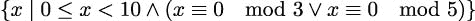

## 第五章：5

高阶函数

函数式编程范式的一个非常重要的特性是高阶函数。我们将探讨这三种高阶函数的类型：

+   接受函数作为其一个（或多个）参数的函数

+   返回函数的函数

+   接受一个函数并返回一个函数的函数，这是前两个特征的组合

我们将在本章中探讨内置的高阶函数。除了这些函数之外，我们将在介绍这些概念之后，在后续章节中探讨几个提供高阶函数的库模块。

接受函数并创建函数的函数包括复杂的可调用类以及函数装饰器。我们将推迟到第十二章《装饰器设计技术》讨论装饰器。

在本章中，我们将探讨以下函数：

+   `max()`和`min()`

+   `map()`

+   `filter()`

+   `iter()`

+   `sorted()`

此外，我们还将探讨`operator`模块中的`itemgetter()`函数。这个函数对于从序列中提取一个元素非常有用。

我们还将探讨我们可以用来简化使用高阶函数的 lambda 表达式。

`max()`和`min()`函数是归约函数；它们从集合中创建一个单一值。其他函数是映射函数。它们不会将输入归约为一个单一值。

`max()`、`min()`和`sorted()`函数既有默认行为，也有高阶函数行为。如果需要，可以通过`key=`参数提供一个函数。这些函数有有意义的默认行为。

`map()`和`filter()`函数将函数作为第一个位置参数。在这里，由于没有默认行为，所以需要函数。

`itertools`模块中有许多高阶函数。我们将在第八章《itertools 模块》、第九章《组合学中的 itertools – 排列和组合》中探讨这个模块。

此外，`functools`模块提供了一个通用的`reduce()`函数。我们将在第十章《functools 模块》中探讨这个函数，因为它需要更多的注意来使用。我们需要避免将一个低效的算法转变为过度处理的噩梦。

### 5.1 使用 max()和 min()查找极值

`max()`和`min()`函数各有两种生活。它们是应用于集合的简单函数，也是高阶函数。我们可以如下看到它们的默认行为：

```py
>>> max(1, 2, 3) 
3 
>>> max((1,2,3,4)) 
4
```

两个函数都将接受一个不确定数量的参数。这些函数设计为也可以接受一个序列或可迭代对象作为唯一参数，并找到该可迭代对象的极大值（或极小值）。当应用于映射集合时，它们将找到最大（或最小）键值。

它们还做了更复杂的事情。假设我们有从第四章，处理集合中的示例中得到的行程数据。我们有一个函数可以生成一系列看起来如下所示的元组序列：

```py
[ 
 ((37.54901619777347, -76.33029518659048), (37.840832, -76.273834), 17.7246), 
 ((37.840832, -76.273834), (38.331501, -76.459503), 30.7382), 
 ((38.331501, -76.459503), (38.845501, -76.537331), 31.0756), 
 ((36.843334, -76.298668), (37.549, -76.331169), 42.3962), 
 ((37.549, -76.331169), (38.330166, -76.458504), 47.2866), 
 ((38.330166, -76.458504), (38.976334, -76.473503), 38.8019) 
]
```

这个集合中的每个元组包含三个值：一个起始位置，一个结束位置，以及一个距离。位置以纬度和经度对给出。东经纬度是正数；这些是沿着美国东海岸的点，大约在 76°西。点之间的距离以海里为单位。

我们有三种方法从这些值序列中获取最大和最小距离。具体如下：

+   使用生成器函数提取距离。这将只给我们距离，因为我们已经丢弃了每个部分的另外两个属性。如果我们有任何基于纬度或经度的额外处理需求，这不会很好。

+   使用 `unwrap(process(wrap()))` 模式。这将给我们最长和最短距离的路段。从这些路段中，我们可以根据需要提取距离或点。

+   使用 `max()` 和 `min()` 函数作为高阶函数，插入一个用于提取重要距离值的函数。这将保留所有原始对象及其属性。

为了提供上下文，以下脚本构建了整个行程：

```py
>>> from Chapter04.ch04_ex1 import ( 
...    floats_from_pair, float_lat_lon, row_iter_kml, haversine, legs 
... ) 
>>> import urllib.request 
>>> data = "file:./Winter%202012-2013.kml" 

>>> with urllib.request.urlopen(data) as source: 
...     path = floats_from_pair(float_lat_lon(row_iter_kml(source))) 
...     trip = list( 
...         (start, end, round(haversine(start, end), 4)) 
...         for start, end in legs(path) 
...     )
```

结果的 `trip` 对象是一个列表对象，包含单个路段。每个路段是一个包含起点、终点和距离的三元组，使用 `haversine()` 函数计算得出。`leg()` 函数从原始 KML 文件中点的整体路径创建起点-终点对。`list()` 函数从惰性生成器中消耗值，以具体化路段列表。

一旦我们有了 `trip` 对象，我们可以提取距离并计算这些距离的最大值和最小值。使用生成器函数执行此操作的代码如下：

```py
>>> longest = max(dist for start, end, dist in trip) 
>>> shortest = min(dist for start, end, dist in trip)
```

我们使用生成器函数从行程元组的每个部分中提取相关项目。我们必须重复生成器表达式，因为表达式 `dist` for `start`, `end`, `dist` in `trip` 只能被消耗一次。

下面是基于比之前展示的数据集更大的数据集的结果：

```py
>>> longest 
129.7748 
>>> shortest 
0.1731
```

可以参考第二章，介绍基本功能概念，了解 wrap-process-unwrap 设计模式的示例。

下面是将 `unwrap(process(wrap()))` 模式应用于这些数据的一个版本：

```py
from collections.abc import Iterator, Iterable 
from typing import Any 

def wrap(leg_iter: Iterable[Any]) -> Iterable[tuple[Any, Any]]: 
    return ((leg[2], leg) for leg in leg_iter) 

def unwrap(dist_leg: tuple[Any, Any]) -> Any: 
    distance, leg = dist_leg 
    return leg
```

我们可以使用这些函数如下：

```py
>>> longest = unwrap(max(wrap(trip))) 
>>> longest 
((27.154167, -80.195663), (29.195168, -81.002998), 129.7748) 

>>> short = unwrap(min(wrap(trip))) 
>>> short 
((35.505665, -76.653664), (35.508335, -76.654999), 0.1731)
```

最后且最重要的形式使用了 `max()` 和 `min()` 函数的高阶函数特性。我们首先定义一个辅助函数，然后使用它通过执行以下代码片段来将腿的集合缩减到所需的摘要：

```py
def by_dist(leg: tuple[Any, Any, Any]) -> Any: 
    lat, lon, dist = leg 
    return dist
```

我们可以将此函数用作内置 `max()` 函数的 `key=` 参数值。它看起来像这样：

```py
>>> longest = max(trip, key=by_dist) 
>>> longest 
((27.154167, -80.195663), (29.195168, -81.002998), 129.7748) 

>>> short = min(trip, key=by_dist) 
>>> short 
((35.505665, -76.653664), (35.508335, -76.654999), 0.1731)
```

`by_dist()` 函数将每个腿元组中的三个项目分开，并返回距离项。我们将使用它与 `max()` 和 `min()` 函数一起使用。

`max()` 和 `min()` 函数都接受一个可迭代的和一个函数作为参数。关键字参数 `key=` 被许多 Python 的高阶函数用来提供一个函数，该函数将被用来提取必要的键值。

#### 5.1.1 使用 Python lambda 形式

在许多情况下，辅助函数的定义似乎需要太多的代码。通常，我们可以将 `key=` 函数简化为一个单一的表达式。写两个 `def` 和 `return` 语句来包装一个单一表达式可能看起来有些浪费。

Python 提供了 lambda 形式作为一种简化使用高阶函数的方法。lambda 形式允许我们定义一个小的、匿名函数。函数体仅限于一个表达式。

以下是一个使用简单的 lambda 表达式作为 `key=` 函数的示例：

```py
>>> longest = max(trip, key=lambda leg: leg[2]) 
>>> shortest = min(trip, key=lambda leg: leg[2])
```

我们使用的 lambda 将会接收到序列中的一个项目；在这种情况下，每个三元组腿将传递给 lambda。lambda 参数变量 `leg` 被分配，表达式 `leg[2]` 被评估，从三元组中提取距离。

在 lambda 正好使用一次的情况下，这种形式是理想的。当重用 lambda 时，避免复制和粘贴很重要。在上面的例子中，lambda 被重复，这可能导致潜在的软件维护噩梦。那么替代方案是什么？

我们可以通过这样做将 lambda 分配给变量：`by_dist()` 函数将每个腿元组中的三个项目分开，并返回距离项。我们将使用它与 `max()` 和 `min()` 函数一起使用。

```py
start = lambda x: x[0] 
end = lambda x: x[1] 
dist = lambda x: x[2]
```

每个这些 lambda 形式都是一个可调用的对象，类似于定义的函数。它们可以像函数一样使用。

以下是在交互提示符中的示例：

```py
>>> longest = ((27.154167, -80.195663), (29.195168, -81.002998), 129.7748) 
>>> dist(longest) 
129.7748
```

避免这种技术的两个原因如下：

+   PEP 8，Python 代码的风格指南，建议不要将 lambda 对象分配给变量。有关更多信息，请参阅 [`peps.python.org/pep-0008/`](https://peps.python.org/pep-0008/)。

+   `operator` 模块提供了一个通用的项获取器，`itemgetter()`。这是一个高阶函数，它返回一个我们可以用来替代 lambda 对象的函数。

为了扩展这个例子，我们将看看如何获取起点或终点的纬度或经度值。

以下是一个交互会话的延续：

```py
>>> from operator import itemgetter 
>>> start = itemgetter(0) 
>>> start(longest) 
(27.154167, -80.195663) 

>>> lat = itemgetter(0) 
>>> lon = itemgetter(1) 
>>> lat(start(longest)) 
27.154167
```

我们已从 `operator` 模块中导入了 `itemgetter()` 函数。该函数返回的值是一个函数，它将从序列中抓取所需的项目。在示例的第一部分，`start()` 函数将从序列中提取项目 `0`。

类似地，`lat()` 和 `lon()` 函数是由 `itemgetter()` 函数创建的。请注意，数据结构中嵌套元组的复杂性必须与 `itemgetter()` 函数仔细对应。

使用 lambda 对象或 `itemgetter()` 函数作为提取字段的方法，与定义 `typing.NamedTuple` 类或数据类相比，没有明显的优势。使用 lambda（或者更好的是 `itemgetter()` 函数）确实允许代码依赖于前缀函数符号，这在函数式编程环境中可能更容易阅读。我们可以通过使用 `operator.attrgetter` 函数从 `typing.NamedTuple` 类或数据类中提取特定属性来获得类似的优势。使用 `attrgetter` 会复制一个名称。例如，具有 `lat` 属性的 `typing.NamedTuple` 类也可以使用 `attrgetter('lat')`；这可能会在重构时稍微难以找到所有对属性的引用。

#### 5.1.2 Lambda 表达式和 lambda 演算

如果 Python 是一种纯粹的函数式编程语言，那么就有必要解释 Church 的 lambda 演算，以及 Haskell Curry 发明的我们称之为柯里化的技术。然而，Python 并没有严格遵循 lambda 演算。函数不会被柯里化以简化为单参数 lambda 形式。

Python 的 lambda 表达式不仅限于单参数函数。它们可以有任意数量的参数。然而，它们被限制为单个表达式。

我们可以使用 `functools.partial` 函数来实现柯里化。我们将这个内容留到第十章《Functools 模块》中讲解。

### 5.2 使用 map() 函数将函数应用于集合

标量函数将域中的值映射到值域中。以 `math.sqrt()` 函数为例，我们正在查看一个从浮点值 `x` 映射到另一个浮点值 `y = sqrt(x)` 的映射，使得 y² = x。域被限制为 `math` 模块中的非负值。当使用 `cmath` 模块时，任何数字都可以使用，结果可以是复数。

`map()` 函数表达了一个类似的概念；它将一个集合中的值映射到另一个集合中。它确保给定的函数被用来将域集合中的每个单独的项目映射到值集合中——这是将内置函数应用于数据集合的理想方式。

我们的第一个例子涉及解析一段文本以获取一系列数字。假设我们有以下文本块：

```py
>>> text= """\ 
... 2 3 5 7 11 13 17 19 23 29 
... 31 37 41 43 47 53 59 61 67 71 
... 73 79 83 89 97 101 103 107 109 113 
... 127 131 137 139 149 151 157 163 167 173 
... 179 181 191 193 197 199 211 223 227 229 
... """
```

我们可以使用以下生成器函数重新结构化这段文本：

```py
>>> data = list( 
...     v 
...     for line in text.splitlines() 
...         for v in line.split() 
... )
```

这将把文本拆分成行。对于每一行，它将行拆分为空格分隔的单词，并遍历每个生成的字符串。结果如下所示：

```py
[’2’, ’3’, ’5’, ’7’, ’11’, ’13’, ’17’, ’19’, ’23’, ’29’, 
’31’, ’37’, ’41’, ’43’, ’47’, ’53’, ’59’, ’61’, ’67’, ’71’, 
’73’, ’79’, ’83’, ’89’, ’97’, ’101’, ’103’, ’107’, ’109’, ’113’, 
’127’, ’131’, ’137’, ’139’, ’149’, ’151’, ’157’, ’163’, ’167’, 
’173’, ’179’, ’181’, ’191’, ’193’, ’197’, ’199’, ’211’, ’223’, 
’227’, ’229’]
```

我们仍然需要将 `int()` 函数应用于每个字符串值。这正是 `map()` 函数大显身手的地方。看看下面的代码片段：

```py
>>> list(map(int, data)) 
[2, 3, 5, 7, 11, 13, 17, 19, ..., 229]
```

`map()`函数将`int()`函数应用于集合中的每个值。结果是数字序列而不是字符串序列。

`map()`函数的结果是可迭代的。`map()`函数可以处理任何类型的可迭代对象。

这里提出的想法是，任何 Python 函数都可以通过`map()`函数应用于集合中的项。在这个 map 处理上下文中，有很多内置函数可以使用。

#### 5.2.1 使用 lambda 形式和 map()

假设我们想要将旅行的距离从海里转换为英里。我们想要将每段的距离乘以`6076.12/5280`，即`1.150780`。

我们将依赖多个`itemgetter`函数从数据结构中提取数据。我们可以将提取与计算新值相结合。我们可以使用以下方式通过`map()`函数进行此计算：

```py
>>> from operator import itemgetter 
>>> start = itemgetter(0) 
>>> end = itemgetter(1) 
>>> dist = itemgetter(2) 
>>> sm_trip = map( 
...     lambda x: (start(x), end(x), dist(x) * 6076.12 / 5280), 
...     trip 
... )
```

我们定义了一个 lambda 表达式，该表达式将由`map()`函数应用于旅行的每一段。这个 lambda 表达式将使用`itemgetter`函数从每一段的元组中分离出起点、终点和距离值。它将计算一个修订后的距离，并从起点、终点和英里距离中组装一个新的段元组。

这正好像以下生成器表达式：

```py
>>> sm_trip = ( 
...     (start(x), end(x), dist(x) * 6076.12 / 5280) 
...     for x in trip 
... )
```

我们对生成器表达式中的每个项目都进行了相同的处理。

使用内置的`map()`函数或生成器表达式将产生相同的结果，并且几乎具有相同的性能。使用 lambda、命名元组、定义的函数、`operator.itemgetter()`函数或生成器表达式的选择完全是关于如何使结果应用程序简洁且易于理解。

#### 5.2.2 使用 map()与多个序列

有时，我们会有两个需要相互并行对齐的数据集合。在第四章，处理集合中，我们看到了`zip()`函数如何将两个序列交织在一起以创建一对序列。在许多情况下，我们实际上试图做的是以下这样：

```py
map(function, zip(one_iterable, another_iterable))
```

我们正在从两个（或更多）并行可迭代对象中创建参数元组，并将函数应用于参数元组。这可能有些尴尬，因为给定函数`function()`的参数将是一个单一的二元组；参数值将不会应用于每个参数。

因此，我们可以考虑使用以下技术将元组分解为两个单独的参数：

```py
( 
    function(x, y) 
    for x, y in zip(one_iterable, another_iterable) 
)
```

在这里，我们用等价的生成器表达式替换了`map()`函数。`for x, y`将二元组分解，以便我们可以将它们应用于函数的每个参数。

有一种更好的方法已经可供我们使用。让我们看看这种替代方法的具体例子。

在第四章，处理集合中，我们查看从 XML 文件中提取的航迹数据，作为一系列航点。我们需要从这个航点列表中创建表示每段起止点的航段。

下面的简化版本使用了应用于序列两个切片的`zip()`函数：

```py
 >>> waypoints = range(4)
>>> zip(waypoints, waypoints[1:])
<zip object at ...>

>>> list(zip(waypoints, waypoints[1:]))
[(0, 1), (1, 2), (2, 3)] 
```

我们创建了一个从单个扁平列表中抽取的成对序列。每一对将包含两个相邻的值。`zip()`函数在较短的列表耗尽时停止。这种`zip(x, x[1:])`模式仅适用于已物化的序列和由`range()`函数创建的可迭代对象。它不适用于可迭代对象，因为切片操作未实现。

我们创建了成对，以便我们可以将`haversine()`函数应用于每一对，以计算路径上两点之间的距离。以下是如何在一系列步骤中看起来：

```py
>>> from Chapter04.ch04_ex1 import ( 
...    floats_from_pair, float_lat_lon, row_iter_kml, haversine 
... ) 
>>> import urllib.request 

>>> data = "file:./Winter%202012-2013.kml" 
>>> with urllib.request.urlopen(data) as source: 
...     path_gen = floats_from_pair( 
...         float_lat_lon(row_iter_kml(source))) 
...     path = list(path_gen) 

>>> distances_1 = map( 
...     lambda s_e: (s_e[0], s_e[1], haversine(*s_e)), 
...     zip(path, path[1:]) 
... )
```

我们已经构建了一个航点列表，并用`path`变量标记。这是一个有序的纬度-经度对序列。由于我们将使用`zip(path, path[1:])`设计模式，我们必须有一个已物化的序列，而不是一个可迭代对象。

`zip()`函数的结果将是具有起始和结束位置的成对元素。我们希望我们的输出是一个包含起始、结束和距离的三元组。我们使用的 lambda 表达式将分解原始的起始-结束二元组，并从起始、结束和距离创建一个新的三元组。

我们可以通过使用`map()`函数的巧妙特性来简化这一点，如下所示：

```py
>>> distances_2 = map( 
...     lambda s, e: (s, e, haversine(s, e)), 
...     path, path[1:] 
... )
```

注意，我们已经向`map()`函数提供了一个 lambda 对象和两个可迭代对象。`map()`函数将从每个可迭代对象中获取下一个项目，并将这两个值作为给定函数的参数。在这种情况下，给定函数是一个 lambda，它从起始、结束和距离创建所需的三个元素的三元组。

`map()`函数的正式定义表明它将对不定数量的可迭代对象进行星图处理。它将从每个可迭代对象中获取项目，为给定函数创建一个参数值的元组。这使我们免去了添加`zip`函数来组合序列的需要。

### 5.3 使用 filter()函数传递或拒绝数据

`filter()`函数的职责是使用并应用一个称为谓词的决策函数到集合中的每个值。当谓词函数的结果为真时，值被传递；否则，值被拒绝。`itertools`模块包括`filterfalse()`作为这一主题的变体。请参阅第八章，itertools 模块，以了解`itertools`模块的`filterfalse()`函数的使用。

我们可能将此应用于我们的航迹数据，以创建超过 50 海里长的航段子集，如下所示：

```py
>>> long_legs = list( 
...     filter(lambda leg: dist(leg) >= 50, trip) 
... )
```

对于长腿，谓词 lambda 将是`True`，将被通过。短腿将被拒绝。输出包含通过这个距离测试的 14 条腿。

这种处理明显将 filter 规则`(lambda leg: dist(leg) >= 50)`与其他任何创建 trip 对象或分析长腿的处理分离。

对于另一个简单的例子，看看以下代码片段：

```py
>>> filter(lambda x: x % 3 == 0 or x % 5 == 0, range(10)) 
<filter object at ...> 
>>> sum(_) 
23
```

我们定义了一个小的 lambda 函数来检查一个数是否是 3 的倍数或 5 的倍数。我们将该函数应用于可迭代对象`range(10)`。结果是满足决策规则的数字的可迭代序列。

对于 lambda 为`True`的数字，它们是`[0, 3, 5, 6, 9]`，因此这些值被通过。由于 lambda 对于所有其他数字都是`False`，它们被拒绝。

`_`变量是 Python 的 REPL 的一个特殊功能。它隐式地设置为表达式的结果。在上一个例子中，`filter(...)`的结果被分配给`_`。在下一行，`sum(_)`消耗了`filter(...)`的结果。

这仅在 REPL 中可用，并且存在是为了在我们交互式探索复杂函数时节省我们一些输入。

这也可以通过执行以下代码使用生成器表达式来完成：

```py
>>> list(x for x in range(10) if x % 3 == 0 or x % 5 == 0) 
[0, 3, 5, 6, 9]
```

我们可以使用以下集合推导表示法来形式化这一点：



这意味着我们正在构建一个包含 x 值的集合，其中 x 在`range(10)`中，且`x % 3 == 0`或`x % 5 == 0`。`filter()`函数和形式化的数学集合推导之间有一个非常优雅的对称性。

我们经常希望使用定义好的函数而不是 lambda 形式来使用`filter()`函数。以下是一个重用之前定义的谓词的例子：

```py
>>> from Chapter02.ch02_ex1 import isprimeg 

>>> list(filter(isprimeg, range(100))) 
[2, 3, 5, 7, 11, 13, 17, 19, 23, 29, 31, 37, 41, 43, 47, 53, 59, 61, 67, 71, 73, 79, 83, 89, 97]
```

在这个例子中，我们从一个名为`isprimeg()`的其他模块中导入了一个函数。然后我们将此函数应用于一组值，以通过素数并从集合中拒绝任何非素数。

这可能是一种生成素数表的非常低效的方法。这种表面的简单性是律师所说的吸引人的诱惑。它看起来可能很有趣，但根本无法扩展。`isprimeg()`函数为每个新值重复所有的测试工作。某种缓存对于提供素性测试的重做是必不可少的。一个更好的算法是埃拉托斯特尼筛法；这个算法保留之前找到的素数，并使用它们来防止重新计算。

关于素性检验的更多信息，以及寻找小素数的此算法，请参阅 [`primes.utm.edu/prove/prove2_1.html`](https://primes.utm.edu/prove/prove2_1.html)。

#### 5.3.1 使用 filter()识别异常值

在上一章中，我们定义了一些有用的统计函数来计算平均值和标准差以及归一化一个值。我们可以使用这些函数来定位旅行数据中的异常值。我们可以做的是将`mean()`和`stdev()`函数应用于旅行每一段的距离值，以得到种群的平均值和标准差。

然后，我们可以使用`z()`函数计算每个部分的归一化值。如果归一化值大于 3，数据可能远离平均值。如果我们拒绝这些异常值，我们将得到一个更均匀的数据集，这种数据集不太可能包含报告或测量错误。

以下是我们如何处理这种情况的方法：

```py
>>> from Chapter04.ch04_ex3 import mean, stdev, z 

>>> dist_data = list(map(dist, trip)) 
>>> μ_d = mean(dist_data) 
>>> σ_d = stdev(dist_data) 

>>> outlier = lambda leg: abs(z(dist(leg), μ_d, σ_d)) > 3 

>>> list(filter(outlier, trip))
```

我们已经将距离函数映射到`trip`集合中的每个部分。`dist()`函数是由`itemgetter(2)`创建的函数。由于我们将对结果进行多项操作，我们必须创建一个`list`对象。我们不能依赖于迭代器，因为在这个步骤序列中的第一个函数将消耗迭代器的所有值。然后我们可以使用这个提取来计算种群统计量μ`_d`和σ`_d`，即平均值和标准差。

给定平均值和标准差值，我们使用了`outlier` lambda 来过滤我们的数据。如果归一化值过大，数据就是一个异常值。“远离平均值”的阈值可以根据分布类型而变化。对于正态分布，一个值在平均值三个标准差范围内的概率是 0.997。

`list(filter(outlier, trip))`的结果是一个列表，其中两条腿的长度与种群中其他腿相比非常长。平均距离约为 34 nm，标准差为 24 nm。

我们能够将一个相当复杂的问题分解成若干个独立的函数，每个函数都可以单独轻松测试。我们的处理过程是简单函数的组合。这可以导致简洁、表达力强的函数式编程。

### 5.4 带有哨兵值的 iter()函数

内置的`iter()`函数创建了一个集合类对象的迭代器。`list`、`dict`和`set`类都使用`iter()`函数为底层集合中的项提供一个迭代器对象。在大多数情况下，我们将允许`for`语句隐式地完成这项工作。然而，在少数情况下，我们需要显式地创建一个迭代器。一个例子是将集合的头和尾分开。

`iter()` 函数的其他用途包括构建迭代器以消耗由可调用对象（例如，函数）创建的值，直到找到哨兵值。这个特性有时与文件的 `read()` 方法一起使用，以消耗项目，直到找到某些行尾或文件结束哨兵值。表达式 `iter(file.read, '\n')` 将评估给定的函数，直到找到哨兵值 `'\n'`。这必须谨慎使用：如果未找到哨兵值，它可能会无限期地读取空字符串。

向 `iter()` 提供一个可调用的函数可能有点挑战性，因为我们提供的函数必须内部维护一些状态。这在函数式程序中通常被视为不希望的。

然而，隐藏状态是打开文件的一个特性：每个 `read()` 或 `readline()` 方法都会将文件的内部状态推进到下一个字符或下一行。

显式迭代的另一个例子是可变集合对象的 `pop()` 方法如何对集合对象进行状态性的更改。以下是一个使用 `pop()` 方法的示例：

```py
>>> source = [1, 2, 3, None, 4, 5, 6] 
>>> tail = iter(source.pop, None) 
>>> list(tail) 
[6, 5, 4]
```

`tail` 变量被设置为对列表 `[1, 2, 3, None, 4, 5, 6]` 的迭代器进行迭代，该迭代器将由 `pop()` 函数遍历。`pop()` 的默认行为是 `pop(-1)`；也就是说，元素以相反的顺序弹出。这会对列表对象进行状态性更改：每次调用 `pop()` 时，都会移除项目，并修改列表。当找到哨兵值时，迭代器停止返回值。如果未找到哨兵值，这将引发 `IndexError` 异常。

这种内部状态管理是我们希望避免的。因此，我们不会试图为这个特性编造用途。

### 5.5 使用 sorted() 对数据进行排序

当我们需要以定义的顺序产生结果时，Python 给我们提供了两个选择。我们可以创建一个列表对象，并使用 `list.sort()` 方法对项目进行排序。另一种选择是使用 `sorted()` 函数。这个函数可以与任何可迭代对象一起使用，但在排序操作中它创建了一个最终的 `list` 对象。

`sorted()` 函数可以以两种方式使用。它可以简单地应用于集合。它也可以用作高阶函数，使用 `key=` 参数。

假设我们有了来自第四章，处理集合的示例中的旅行数据。我们有一个函数，它将生成一系列包含旅行每一段的起始位置、结束位置和距离的元组。数据如下所示：

```py
[ 
 ((37.54901619777347, -76.33029518659048), (37.840832, -76.273834), 17.7246), 
 ((37.840832, -76.273834), (38.331501, -76.459503), 30.7382), 
 ((38.331501, -76.459503), (38.845501, -76.537331), 31.0756), 
 ((36.843334, -76.298668), (37.549, -76.331169), 42.3962), 
 ((37.549, -76.331169), (38.330166, -76.458504), 47.2866), 
 ((38.330166, -76.458504), (38.976334, -76.473503), 38.8019) 
]
```

我们可以通过以下交互查看 `sorted()` 函数的默认行为：

```py
>>> sorted(dist(x) for x in trip) 
[0.1731, 0.1898, 1.4235, 4.3155, ... 86.2095, 115.1751, 129.7748]
```

我们使用生成器表达式 `(dist(x) for x in trip)` 从旅行数据中提取距离。`dist()` 函数是由 `itemgetter(2)` 创建的函数。然后我们对这个可迭代数字集合进行排序，以获取从 0.17 nm 到 129.77 nm 的距离。

如果我们想在原始的三元组中保留腿和距离，我们可以让`sorted()`函数应用一个`key=`函数来确定如何对元组进行排序，如下面的代码片段所示：

```py
>>> sorted(trip, key=dist) 
[((35.505665, -76.653664), (35.508335, -76.654999), 0.1731), ...
```

我们已经对旅行数据进行了排序，使用`dist()`函数从每个元组中提取距离。前面展示的`dist()`函数是由`itemgetter()`函数创建的，如下所示：

```py
>>> from operator import itemgetter 
>>> dist = itemgetter(2)
```

作为替代，我们也可以使用`lambda leg: leg[2]`从元组中选择特定的值。提供一个名称`dist`可以使它更清楚地表明正在从元组中选择哪个项。

### 5.6 高阶函数编写概述

我们将探讨设计我们自己的高阶函数。在深入研究一些更复杂的设计模式之前，我们将总结一些过程。我们将从查看常见的数据转换开始，如下所示：

+   将对象包装以创建更复杂的对象

+   将复杂对象解包为其组件

+   展平一个结构

+   结构化扁平序列

这些模式有助于可视化 Python 中高阶函数的设计方式。

这也有助于回忆起一个`Callable`类定义是一个返回可调用对象的函数。我们将把它视为一种将配置参数注入灵活函数的方法。

我们将推迟对装饰器的深入考虑，直到第十二章，装饰器设计技术。装饰器也是一个高阶函数，但它消耗一个函数并返回另一个，这使得它比本章中的示例更复杂。我们将从开发高度定制的`map()`和`filter()`版本开始。

### 5.7 编写高阶映射和过滤器

Python 的两个内置高阶函数`map()`和`filter()`通常可以处理我们可能想要投掷给它们的几乎所有内容。在一般情况下很难优化它们以实现更高的性能。我们将在第十四章，多进程、多线程和 concurrent.futures 模块中查看类似函数，如`imap()`。

我们有三种主要等效的方式来表达映射。假设我们有一个函数`f(x)`和一个对象集合`C`。我们可以计算从集合 C 中的域值到范围值的映射的方法如下：

+   `map()`函数：

    ```py
    map(f, C)
    ```

+   生成器表达式：

    ```py
    (f(x) for x in C)
    ```

+   带有`yield`语句的生成器函数：

    ```py
    from collections.abc import Callable, Iterable, Iterator 
    from typing import Any 

    def mymap(f: Callable[[Any], Any], C: Iterable[Any]) -> Iterator[Any]: 
        for x in C: 
            yield f(x)
    ```

    这个`mymap()`函数可以用作一个表达式，其中包含要应用的功能和可迭代的数据源：

    ```py
    mymap(f, C)
    ```

同样，我们有三种方法可以将过滤器函数应用于集合，它们都是等效的：

+   `filter()`函数：

    ```py
    filter(f, C)
    ```

+   生成器表达式：

    ```py
    (x for x in C if f(x))
    ```

+   带有`yield`语句的生成器函数：

    ```py
    from collections.abc import Callable, Iterable, Iterator 
    from typing import Any 

    def myfilter(f: Callable[[Any], bool], C: Iterable[Any]) -> Iterator[Any]: 
        for x in C: 
            if f(x): 
                yield x
    ```

    这个`myfilter()`函数可以用作一个表达式，其中包含要应用的功能和可迭代的数据源：

    ```py
    myfilter(f, C)
    ```

存在一些微小的性能差异；通常`map()`和`filter()`函数是最快的。更重要的是，有不同类型的扩展适合这些映射和过滤设计，如下所示：

+   如果我们需要修改处理过程，我们可以创建一个更复杂的函数`g(x)`，该函数应用于每个元素。这是最通用的方法，适用于所有三种设计。这是我们功能设计投入的大部分精力所在。我们可以在现有的`f(x)`周围定义我们的新函数，或者我们发现我们需要重构原始函数。在所有情况下，这种设计努力似乎能带来最大的好处。

+   我们可以调整生成器表达式或生成器函数内部的`for`循环。一个明显的调整是将映射和过滤合并为一个操作，通过在生成器表达式中扩展一个`if`子句来实现。我们还可以合并`mymap()`和`myfilter()`函数以合并映射和过滤。这需要小心，以确保生成的函数不是功能杂糅。

随着软件的演变和成熟，经常发生改变处理循环中数据结构的深刻变化。我们有许多设计模式，包括包装、解包（或提取）、展平和结构化。我们在前面的章节中查看了一些这些技术。

在接下来的章节中，我们将探讨设计我们自己的高阶函数的方法。我们将从在应用映射函数的同时解包复杂数据开始。对于每个示例，重要的是要看看复杂性从何而来，并决定生成的代码是否真的简洁且具有表现力。

#### 5.7.1 在映射时解包数据

当我们使用像`(f(x) for x, y in C)`这样的结构时，我们使用`for`语句的多个赋值特性来解包一个多值元组，然后应用一个函数。整个表达式是一个映射。这是 Python 中常见的优化，用于改变结构并应用函数。

我们将使用来自第四章，处理集合的行程数据。以下是一个在映射时解包的具体示例：

```py
from collections.abc import Callable, Iterable, Iterator 
from typing import Any, TypeAlias 

Conv_F: TypeAlias = Callable[[float], float] 
Leg: TypeAlias = tuple[Any, Any, float] 

def convert( 
        conversion: Conv_F, 
        trip: Iterable[Leg]) -> Iterator[float]: 
    return ( 
        conversion(distance) 
        for start, end, distance in trip 
    )
```

这个高阶函数将由我们可以应用于原始数据的转换函数支持，如下所示：

```py
from collections.abc import Callable 
from typing import TypeAlias 

Conversion: TypeAlias = Callable[[float], float] 

to_miles: Conversion = lambda nm: nm * 6076.12 / 5280 

to_km: Conversion = lambda nm: nm * 1.852 

to_nm: Conversion = lambda nm: nm
```

这些已经被定义为 lambda 表达式并分配给变量。一些静态分析工具可能会对此提出异议，因为 PEP-8 不赞成这样做。

以下展示了我们如何提取距离并应用一个转换函数：

```py
>>> convert(to_miles, trip) 
<generator object ...> 
>>> miles = list(convert(to_miles, trip)) 
>>> trip[0] 
((37.54901619777347, -76.33029518659048), (37.840832, -76.273834), 17.7246) 
>>> miles[0] 
20.397120559090908 
>>> trip[-1] 
((38.330166, -76.458504), (38.976334, -76.473503), 38.8019) 
>>> miles[-1] 
44.652462240151515
```

在我们解包的过程中，结果将是一系列浮点值。结果如下：

```py
[20.397120559090908, 35.37291511060606, ..., 44.652462240151515]
```

这个`convert()`函数非常特定于我们的起点-终点-距离行程数据结构，因为`for`语句分解了一个特定的三元组。

我们可以为这种解包-映射设计模式构建一个更通用的解决方案。它稍微复杂一些。首先，我们需要通用分解函数，如下面的代码片段所示：

```py
from collections.abc import Callable 
from operator import itemgetter 
from typing import TypeAlias 

Selector: TypeAlias = Callable[[tuple[Any, ...]], Any] 

fst: Selector = itemgetter(0) 

snd: Selector = itemgetter(1) 

sel2: Selector = itemgetter(2)
```

我们希望能够表达`f(sel2(s_e_d))`对于`s_e_d`在`trip`中的情况。这涉及到函数组合；我们正在组合一个函数，例如`to_miles()`，和一个选择器，例如`sel2()`。

更具描述性的名称通常比通用名称更有用。我们将把重命名留给读者作为练习。我们可以使用另一个 lambda 在 Python 中表达函数组合，如下所示：

```py
from collections.abc import Callable 

to_miles_sel2: Callable[[tuple[Any, Any, float]], float] = ( 
    lambda s_e_d: to_miles(sel2(s_e_d)) 
)
```

这给我们提供了一个更长但更专业的解包和映射版本，如下所示：

```py
>>> miles2 = list( 
...     to_miles_sel2(s_e_d) for s_e_d in trip 
... )
```

我们可以将高阶`convert()`函数与这个生成器表达式进行比较。两者都应用了一系列转换。`convert()`函数“隐藏”了一个处理细节——将元组作为起始点、结束点和距离的组合——通过一个分解元组的`for`语句。这个表达式通过将`sel2()`函数包含在复合函数定义中，暴露了这种分解。

两者在任何一个衡量标准上都不是“更好”。它们代表了两种展示或隐藏细节的方法。在特定的应用开发环境中，展示（或隐藏）可能更受欢迎。

同样的设计原则也适用于创建混合过滤器以及映射。我们将在返回的生成器表达式的`if`子句中应用过滤器。

我们可以将映射和过滤结合起来创建更复杂的函数。虽然创建更复杂的函数很有吸引力，但并不总是有价值的。一个复杂的函数可能无法超越嵌套使用`map()`和`filter()`函数的性能。通常，我们只想创建更复杂的函数，如果它能封装一个概念并使软件更容易理解。

#### 5.7.2 在映射时包装额外数据

当我们使用`((f(x), x) for x in C)`这样的结构时，我们已经使用了包装来创建一个多值元组，同时应用了转换映射。这是一种常见的技巧，通过创建更大的结构来保存派生结果。这有避免重新计算的好处，同时避免了具有内部状态变化的复杂对象的责任。在这种情况下，状态变化是结构性的，并且非常明显。

这部分内容是第四章，使用集合中展示的示例的一部分，用于从点的路径创建行程数据。代码看起来是这样的：

```py
>>> from Chapter04.ch04_ex1 import ( 
...    floats_from_pair, float_lat_lon, row_iter_kml, haversine, legs 
... ) 
>>> import urllib.request 
>>> data = "file:./Winter%202012-2013.kml" 

>>> with urllib.request.urlopen(data) as source: 
...     path = floats_from_pair(float_lat_lon(row_iter_kml(source))) 
...     trip = tuple( 
...         (start, end, round(haversine(start, end), 4)) 
...         for start, end in legs(path) 
...     )
```

我们可以稍作修改，创建一个将包装与其他函数分离的高阶函数。我们可以重构这个设计，创建一个构造包含原始元组和距离的新元组的函数。这个函数可以定义如下：

```py
from collections.abc import Callable, Iterable, Iterator 
from typing import TypeAlias 

Point: TypeAlias = tuple[float, float] 
Leg_Raw: TypeAlias = tuple[Point, Point] 
Point_Func: TypeAlias = Callable[[Point, Point], float] 
Leg_D: TypeAlias = tuple[Point, Point, float] 

def cons_distance( 
        distance: Point_Func, 
        legs_iter: Iterable[Leg_Raw]) -> Iterator[Leg_D]: 
    return ( 
        (start, end, round(distance(start,end), 4)) 
        for start, end in legs_iter 
    )
```

这个函数将每条腿分解成两个变量，`start` 和 `end`。这些变量将是 `Point` 实例，定义为两个浮点值的元组。这些将用于给定的 `distance()` 函数来计算两点之间的距离。该函数是一个可调用的对象，接受两个 `Point` 对象并返回一个浮点结果。结果将构建一个包含原始两个 `Point` 对象以及计算出的浮点结果的三个元组。

然后，我们可以重新编写我们的行程分配，应用 `haversine()` 函数来计算距离，如下所示：

```py
>>> source_url = "file:./Winter%202012-2013.kml" 
>>> with urllib.request.urlopen(source_url) as source: 
...    path = floats_from_pair( 
...        float_lat_lon(row_iter_kml(source)) 
...    ) 
...    trip2 = tuple( 
...        cons_distance(haversine, legs(iter(path))) 
...    )
```

我们用一个高阶函数 `cons_distance()` 替换了生成器表达式。该函数不仅接受一个函数作为参数，还返回一个生成器表达式。在某些应用中，这个更大、更复杂的处理步骤是一种省略不必要细节的有帮助的方法。

在 第十章，Functools 模块 中，我们将展示如何使用 `partial()` 函数为 `haversine()` 函数的 `R` 参数设置一个值，这改变了距离计算的计量单位。

#### 5.7.3 在映射时扁平化数据

在 第四章，处理集合 中，我们研究了将嵌套元组结构扁平化为单个可迭代对象的算法。当时我们的目标仅仅是重新结构化一些数据而不进行任何实际的处理。我们可以创建混合解决方案，将函数与扁平化操作相结合。

假设我们有一段文本，我们想将其转换为扁平的数字序列。文本如下所示：

```py
>>> text = """2 3 5 7 11 13 17 19 23 29 
... 31 37 41 43 47 53 59 61 67 71 
... 73 79 83 89 97 101 103 107 109 113 
... 127 131 137 139 149 151 157 163 167 173 
... 179 181 191 193 197 199 211 223 227 229 
... """
```

每一行是 10 个数字的一块。我们需要解开行，以创建一个扁平的数字序列。

这是通过一个两部分的生成器函数完成的，如下所示：

```py
>>> data = list( 
...     v 
...     for line in text.splitlines() 
...         for v in line.split() 
... )
```

这将把文本分割成行，并遍历每一行。它将每一行分割成单词，并遍历每个单词。这个输出的结果是字符串列表，如下所示：

```py
[’2’, ’3’, ’5’, ’7’, ’11’, ’13’, ’17’, ’19’, ’23’, ’29’, ’31’, ’37’, 
’41’, ’43’, ’47’, ’53’, ’59’, ’61’, ’67’, ’71’, ’73’, ’79’, ’83’, 
’89’, ’97’, ’101’, ’103’, ’107’, ’109’, ’113’, ’127’, ’131’, ’137’, 
’139’, ’149’, ’151’, ’157’, ’163’, ’167’, ’173’, ’179’, ’181’, ’191’, 
’193’, ’197’, ’199’, ’211’, ’223’, ’227’, ’229’]
```

对于这个特定的文本，有一个优化，我们将把它留给读者作为练习。

为了将字符串转换为数字，我们必须应用一个转换函数，并使用以下代码片段解开从原始格式中阻塞的结构：

```py
from collections.abc import Callable, Iterator 
from typing import TypeAlias 

Num_Conv: TypeAlias = Callable[[str], float] 

def numbers_from_rows( 
        conversion: Num_Conv, 
        text: str) -> Iterator[float]: 
    return ( 
        conversion(value) 
        for line in text.splitlines() 
        for value in line.split() 
    )
```

这个函数有一个 `conversion` 参数，它是一个应用于将要发出的每个值的函数。这些值是通过使用之前显示的算法进行扁平化创建的。

我们可以在以下类型的表达式中使用这个 `numbers_from_rows()` 函数：

```py
>>> list(numbers_from_rows(float, text))
```

在这里，我们使用了内置的 `float()` 函数从文本块中创建一个浮点数值列表。

我们有许多使用高阶函数和生成器表达式的混合替代方案。例如，我们可能这样表达：

```py
>>> text = (value 
...     for line in text.splitlines() 
...        for value in line.split() 
... ) 
>>> numbers = map(float, text) 
>>> list(numbers)
```

这可能有助于我们理解算法的整体结构。这个原则被称为分块：我们用一个有意义的名字总结函数的细节。有了这个总结，细节被抽象化，我们可以在更大的上下文中将函数作为一个小的概念来工作。虽然我们经常使用高阶函数，但有时生成器表达式可能更清晰。

#### 5.7.4 在过滤时结构化数据

前三个示例将额外的处理与映射相结合。将处理与过滤相结合似乎不如与映射相结合那样具有表现力。我们将详细查看一个示例以表明，尽管它很有用，但它似乎没有与映射和处理相结合那样有说服力的用例。

在 第四章，处理集合 中，我们探讨了结构化算法。我们可以轻松地将过滤与结构化算法组合成一个单一、复杂的函数。以下是我们首选的将可迭代对象的输出分组的功能版本：

```py
from collections.abc import Iterator 
from typing import TypeVar 

ItemT = TypeVar("ItemT") 

def group_by_iter( 
        n: int, 
        iterable: Iterator[ItemT] 
) -> Iterator[tuple[ItemT, ...]]: 
    def group(n: int, iterable: Iterator[ItemT]) -> Iterator[ItemT]: 
        for i in range(n): 
            try: 
                yield next(iterable) 
            except StopIteration: 
                return 

    while row := tuple(group(n, iterable)): 
        yield row
```

这将尝试从可迭代对象中组装一个包含 `n` 个项目的元组。如果元组中有任何项目，它们将作为结果可迭代对象的一部分产生。原则上，函数随后递归地对原始可迭代对象中的剩余项目进行操作。由于 Python 中的递归有限制，我们将尾调用结构优化为显式的 `while` 语句。

`group_by_iter()` 函数的结果是一个 n-元组的序列。在以下示例中，我们将使用过滤函数创建一个数字序列，然后将它们分组为 7-元组：

```py
>>> from pprint import pprint 
>>> data = list( 
...     filter(lambda x: x % 3 == 0 or x % 5 == 0, range(1, 50)) 
... ) 
>>> data 
[3, 5, 6, 9, 10, ..., 48] 
>>> grouped = list(group_by_iter(7, iter(data))) 
>>> pprint(grouped) 
[(3, 5, 6, 9, 10, 12, 15), 
 (18, 20, 21, 24, 25, 27, 30), 
 (33, 35, 36, 39, 40, 42, 45), 
 (48,)]
```

我们可以将分组和过滤合并成一个函数，该函数在单个函数体中执行这两个操作。`group_by_iter()` 的修改如下：

```py
from collections.abc import Callable, Iterator, Iterable 
from typing import Any, TypeAlias 

ItemFilterPredicate: TypeAlias = Callable[[Any], bool] 

def group_filter_iter( 
        n: int, 
        predicate: ItemFilterPredicate, 
        items: Iterator[ItemT] 
) -> Iterator[tuple[ItemT, ...]]: 
    def group(n: int, iterable: Iterator[ItemT]) -> Iterator[ItemT]: 
        for i in range(n): 
            try: 
                yield next(iterable) 
            except StopIteration: 
                return 

    subset = filter(predicate, items) 
    # ^-- Added this to apply the filter 
    while row := tuple(group(n, subset)): 
                              # ^-- Changed to use the filter 
        yield row
```

我们在 `group_by_iter()` 函数中添加了一行。这个 `filter()` 函数的应用创建了一个子集。我们将 `while row := tuple(group(n, subset)):` 行改为使用子集而不是原始的项目集合。

这个 `group_filter_iter()` 函数将过滤谓词函数应用于作为 `items` 参数提供的源可迭代对象。由于过滤输出本身也是一个非严格可迭代对象，子集值不是预先计算的；值是在需要时创建的。这个函数的大部分内容与之前展示的版本相同。

我们可以稍微简化我们使用此函数的上下文。我们可以比较显式使用 `filter()` 和隐式 `filter()` 的组合函数。比较如下示例：

```py
>>> rule: ItemFilterPredicate = lambda x: x % 3 == 0 or x % 5 == 0 
>>> groups_explicit = list( 
...    group_by_iter(7, filter(rule, range(1, 50))) 
... ) 
>>> groups = list( 
...     group_filter_iter(7, rule, iter(range(1, 50))) 
... )
```

在这里，我们应用了过滤谓词并在单个函数调用中将结果分组。对于 `filter()` 函数来说，与其他处理相结合应用过滤通常没有明显的优势。似乎一个单独的、可见的 `filter()` 函数比一个组合函数更有帮助。

### 5.8 使用可调用对象构建高阶函数

我们可以将高阶函数定义为可调用类。这建立在编写生成器函数的想法之上；我们将编写可调用对象，因为我们需要 Python 的状态特性，如实例变量。除了使用语句外，我们还可以在创建高阶函数时应用静态配置。特别是策略设计模式非常适合改变可调用对象的功能。

可调用类定义的重要之处在于，由 `class` 语句创建的类对象定义了一个发出函数的函数。通常，我们会使用可调用对象来创建一个复合函数，将函数组合成相对复杂的东西。

为了强调这一点，考虑以下类：

```py
from collections.abc import Callable 
from typing import Any 

class NullAware: 
    def __init__(self, some_func: Callable[[Any], Any]) -> None: 
        self.some_func = some_func 

    def __call__(self, arg: Any) -> Any: 
        return None if arg is None else self.some_func(arg)
```

这个类用于创建一个能够处理空值的新的函数。当创建这个类的实例时，提供了一个函数 `some_func`。唯一指定的限制是 `some_func` 必须是 `Callable[[Any], Any]`。这意味着参数接受一个参数并产生一个结果。结果对象是可调用的。期望一个单一的、可选的参数。`__call__()` 方法的实现处理了将 `None` 对象作为参数的使用。这个方法的效果是使结果对象成为 `Callable[[Optional[Any]], Any]]`。

例如，评估 `NullAware(math.log)` 表达式将创建一个新的函数，该函数可以应用于参数值。`__init__()` 方法将保存给定的函数到结果对象中。这个对象是一个可以用来处理数据的函数。

常见的做法是创建一个新的函数，并通过给它命名来保存它以供将来使用，如下所示：

```py
import math 

null_log_scale = NullAware(math.log) 

null_round_4 = NullAware(lambda x: round(x, 4))
```

第一个示例创建了一个新的函数，并将其命名为 `null_log_scale()`。第二个示例创建了一个空值感知函数 `null_round_4`，该函数使用 lambda 对象作为函数的内部值，如果参数不是 `None`，则应用该函数。然后我们可以在另一个上下文中使用这个函数。请看以下示例：

```py
>>> some_data = [10, 100, None, 50, 60] 
>>> scaled = map(null_log_scale, some_data) 
>>> [null_round_4(v) for v in scaled] 
[2.3026, 4.6052, None, 3.912, 4.0943]
```

这个示例的 `__call__()` 方法完全依赖于表达式评估。这是一种优雅且整洁的方式来定义由底层组件函数构建的复合函数。

#### 5.8.1 确保良好的函数式设计

无状态函数式编程的想法在使用 Python 对象时需要小心。对象通常是具有状态的。确实，有人可以争论，面向对象编程的整个目的就是将状态变化封装到类定义中。正因为如此，当我们使用 Python 类定义来处理集合时，我们发现自己处于函数式编程和命令式编程之间的对立方向。

使用可调用对象创建组合函数的好处是，当使用结果组合函数时，我们可以获得稍微简单的语法。当我们开始处理可迭代映射或归约时，我们必须意识到我们如何以及为什么引入有状态的对象。

我们将转向一个相当复杂的函数，它具有以下特性：

+   它对一个项目源应用过滤器。

+   它将对通过过滤器的项目应用映射。

+   它计算映射值的总和。

我们可以尝试将其定义为一个简单的更高阶函数，但如果有三个独立的参数值，使用起来会显得繁琐。相反，我们将创建一个可调用的对象，该对象由过滤器和映射函数配置。

使用对象来配置对象是面向对象编程中使用的策略设计模式。以下是一个需要过滤器和映射函数才能创建可调用对象的类定义：

```py
from collections.abc import Callable, Iterable 

class Sum_Filter: 
    __slots__ = ["filter", "function"] 

    def __init__(self, 
            filter: Callable[[float], bool], 
            func: Callable[[float], float]) -> None: 
        self.filter = filter 
        self.function = func 

    def __call__(self, iterable: Iterable[float]) -> float: 
        return sum( 
            self.function(x) 
            for x in iterable 
            if self.filter(x) 
        )
```

这个类在每个对象中有两个槽位；这在我们将函数用作有状态对象的能力上施加了一些限制。它不会阻止对结果对象的全部修改，但它限制我们只能有两个属性。尝试添加属性将导致异常。

初始化方法 `__init__()` 将两个函数对象 `filter` 和 `func` 存储在对象的实例变量中。`__call__()` 方法返回一个基于生成器表达式的值，该表达式使用两个内部函数定义。`self.filter()` 函数用于通过或拒绝项目。`self.function()` 函数用于转换通过 `filter()` 函数传递的对象。

这个类的实例是一个包含两个策略函数的函数。我们创建实例的方式如下：

```py
count_not_none = Sum_Filter( 
    lambda x: x is not None, 
    lambda x: 1 
)
```

我们构建了一个名为 `count_not_none()` 的函数，该函数计算序列中的非 `None` 值。它是通过使用 lambda 传递非 `None` 值和一个使用常数 1 而不是实际值的函数来完成的。

通常，这个 `count_not_none()` 对象将表现得像任何其他 Python 函数一样。我们可以如下使用 `count_not_None()` 函数：

```py
>>> some_data = [10, 100, None, 50, 60] 
>>> count_not_none(some_data) 
4
```

这展示了使用 Python 的一些面向对象编程特性来创建可调用对象的技术，这些对象用于以函数式方法设计和构建软件。我们可以将一些复杂性委托给创建复杂函数。拥有一个具有多个功能的单一函数可以简化对函数使用上下文的理解。

### 5.9 一些设计模式的回顾

`max()`、`min()` 和 `sorted()` 函数在没有 `key=` 函数的情况下具有默认行为。可以通过提供一个定义如何从可用数据计算键的函数来自定义它们。在我们的许多示例中，`key=` 函数已经是一个简单的可用数据的提取。这不是必需的；`key=` 函数可以执行任何操作。

想象以下方法：`max(trip, key=random.randint())`。通常，我们尽量避免有像这样做一些神秘操作的`key=`函数。

使用`key=`函数是一种常见的模式。我们设计的函数可以轻松遵循这个模式。

我们还研究了 lambda 形式如何简化更高阶函数的应用。使用 lambda 形式的一个显著优势是它非常接近函数式范式。当我们编写更传统的函数时，我们可以创建可能会使简洁且富有表现力的函数式设计变得杂乱的命令式程序。

我们已经研究了几种与值集合一起工作的更高阶函数。在之前的章节中，我们提到了几种适用于集合对象和标量对象的更高阶函数的设计模式。以下是一种广泛的分类：

+   返回生成器：一个更高阶函数可以返回一个生成器表达式。我们认为这个函数是更高阶的，因为它没有返回标量值或值的集合。其中一些更高阶函数也接受函数作为参数。

+   作为生成器：一些函数示例使用`yield`语句使它们成为一等生成器函数。生成器函数的值是一个可迭代的值集合，这些值是按需评估的。我们建议生成器函数本质上与返回生成器表达式的函数不可区分。两者都是非严格的。两者都可以产生一系列值。因此，我们将生成器函数也视为更高阶。内置函数，如`map()`和`filter()`，属于这一类别。

+   实现集合：一些函数必须返回一个具体化的集合对象：列表、元组、集合或映射。如果这些函数的参数中包含一个函数，它们可以成为更高阶的函数。否则，它们是普通的函数，碰巧与集合一起工作。

+   减少集合：一些函数与可迭代对象一起工作以创建标量结果。`len()`和`sum()`函数就是这样的例子。当我们接受一个函数作为参数时，我们可以创建更高阶的减少。我们将在下一章回到这个问题。

+   标量：一些函数作用于单个数据项。如果它们接受另一个函数作为参数，它们可以是更高阶函数。

在我们设计自己的软件时，我们可以从这些既定的设计模式中选择和挑选。

### 5.10 概述

在本章中，我们看到了两个更高阶函数的减少：`max()`和`min()`。我们研究了两个核心更高阶函数`map()`和`filter()`。我们还研究了`sorted()`。

此外，我们还研究了如何使用更高阶函数来转换数据结构。我们可以执行几种常见的转换，包括包装、解包、展平和结构化不同类型的序列。

我们探讨了两种定义我们自己的高阶函数的方法，具体如下：

+   `def` 语句。类似于我们分配给变量的 lambda 形式。

+   将可调用的类定义为一种发出复合函数的函数类型。

我们还可以使用装饰器来发出复合函数。我们将在第十二章装饰器设计技术中回到这一点。

在下一章中，我们将探讨通过递归实现纯函数迭代的概念。我们将使用 Pythonic 结构在纯函数技术上进行一些常见的改进。我们还将探讨从集合到单个值执行归约的相关问题。

### 5.11 练习

本章的练习基于 Packt Publishing 在 GitHub 上提供的代码。请参阅[`github.com/PacktPublishing/Functional-Python-Programming-3rd-Edition`](https://github.com/PacktPublishing/Functional-Python-Programming-3rd-Edition)。

在某些情况下，读者可能会注意到 GitHub 上提供的代码包含了一些练习的部分解决方案。这些作为提示，允许读者探索替代解决方案。

在许多情况下，练习将需要单元测试用例来确认它们确实解决了问题。这些通常与 GitHub 仓库中提供的单元测试用例相同。读者应将书籍中的示例函数名称替换为自己的解决方案以确认其工作。

#### 5.11.1 状态分类

一个 Web 应用可能拥有多种类型的多个服务器、数据库和已安装的软件组件。负责网站可靠性的某人将想知道事情是否运行得相当顺利。当事情出错时，他们需要详细信息。

作为监控的一部分，健康应用程序可以从各种组件收集状态，并将状态汇总为整体的“健康”值。这个想法是对状态信息执行一种“reduce”操作。

每个单独的服务都有一个可以用于获取状态信息的状态 URL。结果可以是以下四种值之一：

+   完全没有响应。服务未工作。这是不好的。

+   超出健康时间窗口的响应。即使响应是 `"working"`，服务也会降级。

+   `"not working"` 的响应。 `"not working"` 的响应几乎与没有响应一样糟糕。它表明存在严重问题，但也意味着监控软件正在工作。

+   `"working"` 的响应。这是理想的响应。

状态形式为包含 3 个元组的集合：`("服务", "状态", "响应时间)`。服务是一个名称，例如 `"primary database"` 或 `"router"` 或任何可以作为分布式 Web 应用一部分的众多其他服务。状态值是一个字符串值，可以是 `"working"` 或 `"not working"`。响应时间是响应所需的时间（以毫秒计）。典型数字为 10-50。

摘要可以是以下值之一：

+   `Stopped`：有一个服务没有响应。

+   `Degraded`：有一个服务响应时间超出了 50 毫秒或更少的健康时间窗口。或者，有一个服务响应了`"not working"`。

+   `Running`：所有服务都在 50 毫秒窗口内正常工作并响应。

以下是有两种可能的实现：

+   编写四个过滤器函数。将过滤器应用于状态值序列，并计算每个过滤器匹配的数量。根据匹配的数量，决定为系统的整体健康提供哪三个响应。

+   编写一个映射来应用严重性数字：2 表示`Stopped`的指示，1 表示`Degraded`的任一指示，或 0 表示所有其他服务状态消息。这个向量的最大值是系统的整体健康。

实现所有变体。比较生成的代码的清晰度和表达性。

#### 5.11.2 状态分类，第二部分

在上一个练习中，服务被描述为报告一个状态值，该值是字符串值`"working"`或`"not working"`。

在继续之前，要么完成上一个练习，要么开发一个可行的设计方案来解决上一个练习。

由于技术升级，某些服务的状态值包括第三个值：`"degraded"`。这具有与服务缓慢响应相同的含义。这可能会改变设计。它肯定会改变实现。

提供一个实现，优雅地处理额外的或不同的状态消息的概念。想法是将状态消息检查隔离到一个可以轻松替换的函数中。例如，我们可能从三个评估状态值的函数开始：`is_stopped()`、`is_degraded()`和`is_working()`。当需要更改时，我们可以编写一个新的版本，`is_degraded_2()`，它可以替代旧的`is_degraded()`函数。

目标是创建一个不需要更改任何特定函数实现的程序。相反，添加新函数；这些新函数将重用现有函数以及新函数来完成扩展的目标。

#### 5.11.3 优化文件解析器

在映射时展平数据中，我们使用了以下表达式从带有空格分隔符的文本中提取一个数字序列：

```py
( 
    v 
    for line in text.splitlines() 
        for v in line.split() 
)
```

`split()`方法的定义包括`\n`字符，这个字符也被`splitlines()`方法使用。看起来这可以通过仅使用`split()`方法来优化。

在使这个工作后，将示例中的源文本更改为：

```py
>>> text = """2,3,5,7,11,13,17,19,23,29 
... 31,37,41,43,47,53,59,61,67,71 
... 73,79,83,89,97,101,103,107,109,113 
... 127,131,137,139,149,151,157,163,167,173 
... 179,181,191,193,197,199,211,223,227,229 
... """
```

我们可以使用一次`split()`方法来解析这个。这需要将一个单一的长序列值重新组织成多行和多列。

这是否比使用`splitlines()`和`split()`方法更快？

### 加入我们的社区 Discord 空间

加入我们的 Python Discord 工作空间，讨论并了解更多关于这本书的信息：[`packt.link/dHrHU`](https://packt.link/dHrHU)


