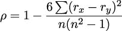

## 第七章：7

复杂的无状态对象

我们所查看的许多示例要么是使用原子（或标量）对象的函数，要么是由小元组构建的相对简单的结构。我们经常可以利用 Python 的不可变 `typing.NamedTuple` 来构建复杂的数据结构。类样式的语法似乎比旧的 `collections.namedtuple` 语法更容易阅读。

面向对象编程的一个有益特性是能够增量地创建复杂的数据结构。在某种程度上，一个对象可以被视为函数结果的缓存；这通常与函数式设计模式很好地结合。在其他情况下，对象范式提供了包含从对象属性派生数据的复杂计算的属性方法。使用其他方面不可变的类的属性也适合于函数式设计思想。

在本章中，我们将探讨以下内容：

+   我们如何创建和使用 `NamedTuple` 和冻结的 `@dataclass` 定义。

+   使用不可变的 `NamedTuple` 或冻结的 `@dataclass` 对象代替有状态对象类的方法。

+   如何使用流行的第三方 `pyrsistent` 包代替有状态对象类。这不是标准库的一部分，需要单独安装。

+   一些在没有任何多态类定义的情况下编写泛型函数的技术。虽然我们可以依赖可调用类来创建多态类层次结构，但在某些情况下，这可能在功能设计中是一个不必要的开销。这将涉及使用 `match` 语句来识别类型或结构。

虽然冻结的数据类和 `NamedTuple` 子类几乎等价，但冻结的数据类省略了 `NamedTuple` 包含的序列特征。迭代 `NamedTuple` 对象的成员是一个令人困惑的特性；数据类不会受到这种潜在问题的困扰。

我们将通过查看使用 `NamedTuple` 子类来开始我们的旅程。

### 7.1 使用元组收集数据

在 第三章，函数、迭代器和生成器 中，我们展示了两种处理元组的常见技术。我们还暗示了处理复杂结构的第三种方法。我们可以根据具体情况选择以下任何一种技术：

+   使用 lambda（或使用 `def` 语句创建的函数）根据索引选择一个命名项目

+   使用带多个位置参数的 lambda（或 `def` 函数）与 `*args` 相结合，将项目元组分配给参数名称

+   使用 `NamedTuple` 类通过属性名或索引选择一个项目

我们在 第四章，处理集合 中引入的行程数据具有相当复杂的结构。数据最初是一组位置报告的普通时间序列。为了计算覆盖的距离，我们将数据转置成一个包含起始位置、结束位置和距离作为嵌套三元的腿序列。

路段序列中的每个项目看起来如下，作为一个三元组：

```py
>>> some_leg = (
... (37.549016, -76.330295),
... (37.840832, -76.273834),
... 17.7246
... )

```

前两个项目是起始点和结束点。第三个项目是两点之间的距离。这是一次在切萨皮克湾两点之间的短途旅行。

嵌套元组元组可能相当难以阅读；例如，`some_leg[0][0]`这样的表达式并不很有信息量。

让我们看看从元组中选择值的三种方法。第一种技术涉及定义一些简单的选择函数，这些函数可以通过索引位置从元组中挑选项目：

```py
>>> start = lambda leg: leg[0] 
>>> end = lambda leg: leg[1] 
>>> distance = lambda leg: leg[2] 

>>> latitude = lambda pt: pt[0] 
>>> longitude = lambda pt: pt[1]
```

使用这些定义，我们可以使用`latitude(start(some_leg))`来引用特定的数据。代码示例如下：

```py
>>> latitude(start(some_leg))
37.549016

```

为 lambda 表达式提供类型提示有些尴尬。以下显示了这如何变得复杂：

```py
from collections.abc import Callable 
from typing import TypeAlias 

Point: TypeAlias = tuple[float, float] 
Leg: TypeAlias = tuple[Point, Point, float] 

start: Callable[[Leg], Point] = lambda leg: leg[0]
```

类型提示必须作为赋值语句的一部分提供。这告诉 mypy，名为`start`的对象是一个可调用的函数，它接受一个类型为`Leg`的单个参数，并返回一个`Point`类型的结果。使用`def`语句创建的函数通常具有更易于阅读的类型提示。

这种收集复杂数据的第一种技术的变体使用`*parameter`符号来隐藏索引位置的某些细节。以下是一些使用`*`符号评估的选择函数：

```py
>>> start_s = lambda start, end, distance: start 
>>> end_s = lambda start, end, distance: end 
>>> distance_s = lambda start, end, distance: distance 

>>> latitude_s = lambda lat, lon: lat 
>>> longitude_s = lambda lat, lon: lon
```

使用这些定义，我们可以从元组中提取特定数据。我们使用了`_s`后缀来强调在评估这些 lambda 表达式时需要使用星号`*`。代码示例如下：

```py
>>> longitude_s(*start_s(*some_leg)) 
-76.330295
```

这在函数定义中提供了一点点更清晰的优点。位置与名称之间的关系由参数名称列表给出。在选区函数的元组参数前看到`*`运算符可能看起来有点奇怪。这个运算符很有用，因为它将元组中的每个项目映射到函数的参数。

虽然这些功能非常强大，但选择单个属性的语法可能令人困惑。Python 提供了两种面向对象的替代方案，`NamedTuple`和冻结的`@dataclass`。

### 7.2 使用 NamedTuple 收集数据

将数据收集到复杂结构中的第二种技术是`typing.NamedTuple`。其想法是创建一个不可变的元组类，具有命名属性。有两种变体可用：

+   `collections`模块中的`namedtuple`函数。

+   `typing`模块中的`NamedTuple`基类。我们将几乎只使用它，因为它允许显式类型提示。

在以下示例中，我们将使用嵌套的`NamedTuple`类，如下所示：

```py
from typing import NamedTuple 

class PointNT(NamedTuple): 
    latitude: float 
    longitude: float 

class LegNT(NamedTuple): 
    start: PointNT 
    end: PointNT 
    distance: float
```

这将数据结构从简单的匿名元组更改为具有为每个属性提供类型提示的命名元组。以下是一个示例：

```py
>>> first_leg = LegNT( 
...     PointNT(29.050501, -80.651169), 
...     PointNT(27.186001, -80.139503), 
...     115.1751) 
>>> first_leg.start.latitude 
29.050501
```

`first_leg` 对象被构建为 `NamedTuple` 类的 `LegNT` 子类。此对象包含两个其他命名元组对象和一个浮点值。使用 `first_leg.start.latitude` 将从元组结构内部获取特定的数据。从前缀函数名称到后缀属性名称的变化可以被视为一种有用的强调。它也可以被视为语法上的混淆变化。

名称中的 `NT` 后缀不是推荐的做法。

我们在书中加入了后缀，以明确区分定义有用类时类似外观的解决方案。

在实际应用中，我们会选择一个定义，并使用尽可能简单、清晰的名称，避免不必要的后缀，以免像这样的教科书变得杂乱。

用适当的 `LegNT()` 或 `PointNT()` 函数调用替换简单的 `tuple()` 函数很重要。这改变了构建数据结构的过程。它提供了一个具有类型提示的显式命名结构，该结构可以通过 mypy 工具进行检查。

例如，查看以下代码片段以从源数据创建点对：

```py
from collections.abc import Iterable, Iterator 
from Chapter04.ch04_ex1 import pick_lat_lon 

def float_lat_lon_tuple( 
        row_iter: Iterable[list[str]] 
) -> Iterator[tuple[float, float]]: 
    lat_lon_iter = (pick_lat_lon(*row) for row in row_iter) 
    return ( 
        (float(lat), float(lon)) 
        for lat, lon in lat_lon_iter 
    )
```

这需要一个可迭代的对象，其单个项是一个字符串列表。CSV 读取器或 KML 读取器可以做到这一点。`pick_lat_lon()` 函数从行中选取两个值。生成器表达式将 `pick_lat_lon()` 函数应用于数据源。最终的生成器表达式从两个字符串值创建了一个更有用的二元组。

之前的代码将更改为以下代码片段以创建 `Point` 对象：

```py
from Chapter04.ch04_ex1 import pick_lat_lon 
from typing import Iterable, Iterator 

def float_lat_lon( 
    row_iter: Iterable[list[str]] 
) -> Iterator[PointNT]: 
              #------ 
    lat_lon_iter = (pick_lat_lon(*row) for row in row_iter) 
    return ( 
        PointNT(float(lat), float(lon)) 
        #------ 
        for lat, lon in lat_lon_iter 
    )
```

`PointNT()` 构造函数已被注入到代码中。返回的数据类型已修订为 `Iterator[PointNT]`。很明显，这个函数构建的是 `Point` 对象，而不是匿名浮点坐标二元组。

同样，我们可以引入以下内容来构建完整的 `LegNT` 对象序列：

```py
from collections.abc import Iterable, Iterator 
from typing import cast, TextIO 
import urllib.request 
from Chapter04.ch04_ex1 import legs, haversine, row_iter_kml 

source_url = "file:./Winter%202012-2013.kml" 
def get_trip(url: str=source_url) -> list[LegNT]: 
    with urllib.request.urlopen(url) as source: 
        path_iter = float_lat_lon(row_iter_kml(source)) 
        pair_iter = legs(path_iter) 
        trip_iter = ( 
            LegNT(start, end, round(haversine(start, end), 4)) 
            for start, end in pair_iter 
        ) 
        trip = list(trip_iter) 
    return trip
```

处理被定义为一系列生成器表达式，每个表达式都是懒惰的，并且对单个对象进行操作。`path_iter` 对象使用两个生成器函数 `row_iter_kml()` 和 `float_lat_lon()` 来从 KML 文件中读取行，选择字段，并将它们转换为 `Point` 对象。`pair_iter()` 对象使用 `legs()` 生成器函数产生重叠的 `Point` 对象对，显示每条腿的起点和终点。

`trip_iter` 生成器表达式从 `Point` 对象的成对中创建最终的 `LegNT` 对象。这些生成的对象被 `list()` 函数消耗，以创建一个单一的腿列表。来自 第四章，处理集合 的 `haversine()` 函数用于计算距离。

在此函数中应用四舍五入有两个原因。首先，从实际的角度来看，0.0001 海里大约是 20 厘米（7 英寸）。从实用主义的角度来看，将海里四舍五入到 0.001 海里涉及更少的数字，这会给人一种虚假的精确感。其次——更重要的是——如果我们避免查看浮点数的所有数字，这将使单元测试在各个平台上的可靠性更高。

最终的`trip`对象是一系列`LegNT`实例。当我们尝试打印它时，它将如下所示：

```py
>>> source_url = "file:./Winter%202012-2013.kml" 
>>> trip = get_trip(source_url) 

>>> trip[0].start 
PointNT(latitude=37.54901619777347, longitude=-76.33029518659048) 
>>> trip[0].end 
PointNT(latitude=37.840832, longitude=-76.273834) 
>>> trip[0].distance 
17.7246
```

重要的是要注意，`haversine()`函数是为了使用简单的元组而编写的。我们已经使用`NamedTuple`类实例重用了这个函数。由于我们仔细地保留了参数的顺序，从匿名元组到命名元组的这种表示形式的小变化被 Python 优雅地处理了。

由于这是一个类定义，我们可以轻松地添加方法和属性。将功能添加到`NamedTuple`的能力使它们特别适用于计算派生值。例如，我们可以更直接地将距离计算作为`Point`类的一部分来实现，如下面的代码所示：

```py
import math 

class PointE(NamedTuple): 
    latitude: float 
    longitude: float 

    def distance(self, other: "PointE", R: float = 360*60/math.tau) -> float: 
        """Equirectangular, ’flat-earth’ distance.""" 
        Δϕ = ( 
            math.radians(self.latitude) - math.radians(other.latitude) 
        ) 
        Δλ = ( 
            math.radians(self.longitude) - math.radians(other.longitude) 
        ) 
        mid_ϕ = ( 
            (math.radians(self.latitude) - math.radians(other.latitude)) 
            / 2 
        ) 
        x = R * Δλ * math.cos(mid_ϕ) 
        y = R * Δϕ 
        return math.hypot(x, y)
```

给定`PointE`类的这个定义，我们已经封装了处理点和距离的功能。这可能很有帮助，因为它为读者提供了一个查找相关属性和方法的单个位置。

在`PointE`类的主体中，我们无法轻松地引用类。类名不存在于`class`语句的主体中。mypy 工具让我们可以使用字符串而不是类名来解析这些罕见的案例，当类需要引用自身时。

我们可以使用以下示例来使用这个类：

```py
>>> start = PointE(latitude=38.330166, longitude=-76.458504) 
>>> end = PointE(latitude=38.976334, longitude=-76.473503) 

# Apply the distance() method of the start object... 
>>> leg = LegNT(start, end, round(start.distance(end), 4)) 
>>> leg.start == start 
True 
>>> leg.end == end 
True 
>>> leg.distance 
38.7805
```

在大多数情况下，`NamedTuple`类定义增加了清晰度。使用`NamedTuple`将导致从函数式前缀语法变为对象式后缀语法。

### 7.3 使用冻结的数据类收集数据

将数据收集到复杂结构中的第三种技术是冻结的`@dataclass`。其想法是创建一个包含命名属性的不可变集合的类。

沿用上一节的示例，我们可以有如下嵌套数据类：

```py
from dataclasses import dataclass 

@dataclass(frozen=True) 
class PointDC: 
    latitude: float 
    longitude: float 

@dataclass(frozen=True) 
class LegDC: 
    start: PointDC 
    end: PointDC 
    distance: float
```

我们在类定义前使用了装饰器`@dataclass(frozen=True)`来创建一个不可变（称为“冻结”）的数据类。装饰器将为我们添加一些函数，构建一个相当复杂但无需我们提供任何其他内容的类定义。有关装饰器的更多信息，请参阅第十二章，装饰器设计技术。

这也改变了数据结构，从简单的匿名元组变为具有为每个属性提供类型提示的类定义。以下是一个示例：

```py
>>> first_leg = LegDC( 
...     PointDC(29.050501, -80.651169), 
...     PointDC(27.186001, -80.139503), 
...     115.1751) 
>>> first_leg.start.latitude 
29.050501
```

`first_leg`对象被构建为`LegDC`实例。此对象包含两个其他`PointDC`对象和一个浮点值。使用`first_leg.start.latitude`将检索对象的特定属性。

名称中的`DC`后缀不是一个推荐的做法。

我们在书中加入了后缀，以明确区分定义有用类时类似外观的解决方案。

在实际应用中，我们会选择一个定义，并使用尽可能简单、清晰的名字，避免不必要的后缀，以免像这样的教科书变得杂乱无章。

将`()`元组构造替换为适当的`LegDC()`或`PointDC()`构造函数，可以构建比匿名元组更复杂的数据结构。它提供了一个具有类型提示的显式命名结构，这些提示可以通过 mypy 工具进行检查。

比较冻结的数据类与`NamedTuple`实例可能会引发“哪个更好？”的讨论。这里有一些权衡。最值得注意的是，`NamedTuple`对象极其简单：它占用的内存相对较少，提供的方法也较少。另一方面，数据类可以拥有大量的内置功能，并且可以占用更多的内存。我们可以通过使用`@dataclass`装饰器的`slots=True`参数来管理这一点，我们将在本节稍后讨论。

此外，一个`NamedTuple`对象是一系列值的序列。我们可以使用元组属性的迭代器，这似乎只会造成混淆的处理选项。在不使用名字的情况下迭代值，违背了为元组的成员命名的基本设计概念。

评估内存使用的一个简单方法是创建数百万个类的实例，并查看为 Python 运行时分配了多少内存。这是因为 Python 对象的大小涉及到对所有相关对象的递归遍历，每个对象都有自己的复杂大小计算。通常，我们只关心大量对象的总内存使用，因此直接测量更为有效。

下面是一个类定义，用于支持一个旨在评估 100 万个`NamedTuple`对象大小的脚本：

```py
from typing import NamedTuple 

class LargeNT(NamedTuple): 
  a: str 
  b: int 
  c: float 
  d: complex
```

然后，我们可以定义一个函数来创建一百万个对象，将它们分配给变量`big_sequence`。然后该函数可以报告 Python 运行时分配的内存量。这个函数将涉及一些看起来很奇怪的开销。`getallocatedblocks()`函数的文档建议我们使用`sys._clear_type_cache()`函数清除类型缓存，并通过`gc.collect()`函数强制垃圾回收来清理不再被引用的对象。这两个步骤应该将内存压缩到最小尺寸，并提供关于该对象序列存储使用情况的更可重复的报告。

以下函数创建了一个给定类型的百万个实例，并显示了 Python 运行时分配的内存：

```py
from typing import Type, Any 

def sizing(obj_type: Type[Any]) -> None: 
    big_sequence = [ 
        obj_type(f"Hello, {i}", 42*i, 3.1415926*i, i+2j) 
        for i in range(1_000_000) 
    ] 
    sys._clear_type_cache() 
    gc.collect() 
    print(f"{obj_type.__name__} {sys.getallocatedblocks()}") 
    del big_sequence
```

使用不同的类定义评估此函数将揭示该类 100 万个对象占用的存储空间。我们可以使用`sizing(LargeNT)`来查看`NamedTuple`类占用的空间。

当然，我们需要定义替代方案。我们可以定义一个冻结的数据类。此外，我们可以使用`@dataclass(frozen=True, slots=True)`来查看`__slots__`的使用对对象大小的影响。类体必须具有相同的属性，并且顺序相同，以简化` sizing()`函数构建对象。

实际结果高度依赖于具体实现，但作者在 macOS Python 3.10.0 上的结果显示如下：

|

* * *

|

* * *

|

| 类别 | 分配的块 |
| --- | --- |
| LargeNT | 5,035,408 |
| LargeDC | 7,035,404 |
| LargeDC_Slots | 5,035,569 |
| 基准 | 35,425 |

|

* * *

|

* * *

|

|  |  |
| --- | --- |

这表明`@dataclass`将比`NamedTuple`或带有`slots=True`的`@dataclass`使用大约 40%更多的内存。

这还表明，一种根本不同的设计——使用迭代器来避免创建大型内存集合——可以显著减少内存使用。重要的是要有一个正确的解决方案，然后探索替代实现，以查看哪种方法最有效地利用机器资源。

如何实现复杂的初始化是各种类定义方法之间最明显的区别。我们将在下一节中探讨这一点。

### 7.4 复杂对象初始化和属性计算

当处理无用的数据格式时，通常需要从具有不同结构或不同底层对象类型的源数据中构建 Python 对象。处理对象创建有两种总体方法：

+   这是整个应用程序的一部分。数据应由解析器分解，并重新组合成有用的 Python 对象。这是我们之前示例中采用的方法。

+   这是对象类定义的一部分。源数据应尽可能以原始形式提供，类定义将执行必要的转换。

这种区别从不简单，也不清晰。实用主义考虑将确定为从源数据构建 Python 对象的最佳方法。以下两个例子指出了可用的不同选择：

+   `Point` 类：地理点的语法非常多变。一种常见的方法是简单的浮点度数。然而，一些来源提供度数和分钟。其他可能提供单独的度数、分钟和秒。此外，还有开放位置码，它编码纬度和经度。（更多信息请参阅[`maps.google.com/pluscodes/`](https://maps.google.com/pluscodes/)。）所有这些不同的解析器都不应成为类的一部分。

+   `LegNT`（或`LegDC`）类：腿包括两个点和一段距离。距离可以作为一个简单值来设置。它也可以作为一个属性来计算。第三种选择是使用一个复杂的对象构建器。实际上，我们的`get_trip()`函数（在使用 NamedTuple 收集数据中定义）已经隐式地包含了一个`LegNT`对象的构建器。

使用`LegNT(start, end, round(haversine(start, end), 4))`来创建`LegNT`实例并没有错，但它做了一些需要挑战的假设。以下是一些假设：

+   应用程序应该始终使用`haversine()`来计算距离。

+   应用程序应该始终预先计算距离。这通常是一个优化问题。如果每个腿的距离都会被检查，那么计算一次并保存距离是有帮助的。如果距离不是总是需要的，那么仅在需要时计算距离可能更节省成本。

+   我们总是希望创建`LegNT`实例。我们已经看到了可能需要`@dataclass`实现的情况。在下一节中，我们将查看`pyrsistent.PRecord`实现。

封装`LegNT`实例构建的一个通用方法是使用`@classmethod`来处理复杂的初始化。此外，`@dataclass`提供了一些额外的初始化技术。

下面是一个更好的定义`NamedTuple`初始化的例子：

```py
from typing import NamedTuple 

class EagerLeg(NamedTuple): 
    start: Point 
    end: Point 
    distance: float 

    @classmethod 
    def create(cls, start: Point, end: Point) -> "EagerLeg": 
        return cls( 
            start=start, 
            end=end, 
            distance=round(haversine(start, end), 4) 
        )
```

将上述立即计算距离的定义与以下延迟计算距离的定义进行比较：

```py
from typing import NamedTuple 

class LazyLeg(NamedTuple): 
    start: Point 
    end: Point 

    @property 
    def distance(self) -> float: 
        return round(haversine(self.start, self.end), 4) 

    @classmethod 
    def create(cls, start: Point, end: Point) -> "LazyLeg": 
        return cls( 
            start=start, 
            end=end 
        )
```

这两个类定义都有一个相同的`create()`方法。我们可以使用`EagerLeg.create(start, end)`或`LazyLeg.create(start, end)`而不会破坏应用中的其他部分。

最重要的是，决定是否立即计算值或延迟计算值，这个决定可以随时更改。我们可以替换这两个定义，看看哪个更适合我们特定应用的需求。同样，距离计算现在也是这个类的一部分，这使得定义一个子类来更改应用变得更加容易。

数据类提供了一个相对复杂且灵活的对象构建接口：一个`__post_init__()`方法。此方法在对象的字段值分配后执行，允许对派生值进行立即计算。然而，这对于冻结的数据类是不适用的。`__post_init__()`方法只能用于非冻结数据类，以便从提供的初始化值中立即计算额外的值。

对于数据类以及`NamedTuple`类，一个`@classmethod`创建器是一个好的设计模式，用于涉及立即计算属性值的初始化。

最后关于初始化的说明，创建命名元组对象有三种不同的语法形式。以下是三种选择：

+   我们可以按位置提供值。当参数的顺序明显时，这效果很好。看起来是这样的：

    ```py
    LegNT(start, end, round(haversine(start, end), 4))
    ```

+   我们可以使用`*`运算符解包一个序列。这也要求参数的顺序明显。例如：

    ```py
    PointNT(*map(float, pick_lat_lon(*row)))
    ```

+   我们可以使用显式的关键字赋值。这有利于使参数名称清晰，并避免了关于排序的隐藏假设。以下是一个示例：

    ```py
    PointNT(longitude=float(row[0]), latitude=float(row[1]))
    ```

这些示例展示了封装复杂对象初始化的一种方法。重要的是要避免在这些对象中发生状态变化。复杂的初始化只执行一次，提供了一个单一、集中的地方来理解对象状态是如何建立的。因此，初始化必须能够表达对象的目的，同时也要灵活，以便允许变化。

### 7.5 使用 pyrsistent 收集数据

除了 Python 的`NamedTuple`和`@dataclass`定义之外，我们还可以使用`pyrsistent`模块创建更复杂的对象实例。`pyrsistent`模块提供的巨大优势是集合是不可变的。而不是就地更新，集合的更改通过一个通用“进化”对象来完成，该对象创建一个新的具有更改值的不可变对象。实际上，看似状态改变的方法实际上是一个创建新对象的运算符。

以下示例展示了如何导入`pyrsistent`模块并使用名称和值创建映射结构：

```py
>>> import pyrsistent 
>>> v = pyrsistent.pmap({"hello": 42, "world": 3.14159}) 
>>> v  # doctest: +SKIP 
pmap({’hello’: 42, ’world’: 3.14159}) 
>>> v[’hello’] 
42 
>>> v[’world’] 
3.14159
```

我们不能改变这个对象的值，但我们可以将对象`v`进化为新的对象`v2`。这个对象具有相同的起始值，但还包括一个更改的属性值。看起来是这样的：

```py
>>> v2 = v.set("another", 2.71828) 
>>> v2    # doctest: +SKIP 
pmap({’hello’: 42, ’world’: 3.14159, ’another’: 2.71828})
```

原始对象`v`是不可变的，其值没有改变：

```py
>>> v    # doctest: +SKIP 
pmap({’hello’: 42, ’world’: 3.14159})
```

有助于将这个操作想象成有两个部分。首先，原始对象被克隆。在克隆之后，应用更改。在上面的例子中，使用了`set()`方法提供新的键和值。我们可以单独创建进化，并将其应用于对象以创建一个应用了更改的克隆。这似乎非常适合需要更改审计历史记录的应用程序。

注意，我们不得不防止使用两个示例作为单元测试用例。这是因为键的顺序是不固定的。很容易检查键和值是否符合我们的预期，但与字典字面量的简单比较并不总是有效。

`PRecord`类适用于定义复杂对象。这些对象在某些方面类似于`NamedTuple`。我们将使用`PRecord`实例重新审视我们的航点和路段数据模型。定义如下所示：

```py
from pyrsistent import PRecord, field 

class PointPR(PRecord):  # type: ignore [type-arg] 
    latitude = field(type=float) 
    longitude = field(type=float) 

class LegPR(PRecord):  # type: ignore [type-arg] 
    start = field(type=PointPR) 
    end = field(type=PointPR) 
    distance = field(type=float)
```

每个字段定义都使用复杂的 `field()` 函数来构建属性的定义。除了类型序列之外，此函数还可以指定必须对值有效的不可变条件、初始值、字段是否为必需的、构建适当值的工厂函数以及将值序列化为字符串的函数。

名称中的 PR 后缀不是一个推荐的做法。

我们在书中包含了后缀，以明确区分类似的问题定义的有用类的类似解决方案。

在实际应用中，我们会选择一个定义，并使用尽可能简单、清晰的名称，避免不必要的后缀，以免像这样的教科书变得杂乱。

作为这些定义的扩展，我们可以使用序列化函数将点值转换为更有用的格式。这需要一些格式化细节，因为纬度和经度的显示方式略有不同。纬度包括 “N” 或 “S”，经度包括 “E” 或 “W”：

```py
from math import isclose, modf 

def to_dm(format: dict[str, str], point: float) -> str: 
    """Use {"+": "N", "-": "S"} for latitude; {"+": "E", "-": "W"} for longitude.""" 
    sign = "-" if point < 0 else "+" 
    ms, d = modf(abs(point)) 
    ms = 60 * ms 
    # Handle the 59.999 case: 
    if isclose(ms, 60, rel_tol=1e-5): 
        ms = 0.0 
        d += 1 
    return f"{d:3.0f}{ms:.3f}’{format.get(sign, sign)}"
```

此函数可以作为 `PointPR` 类的字段定义的一部分包含；我们必须将函数作为 `field()` 工厂函数的 `serializer=` 参数提供：

```py
from pyrsistent import PRecord, field 

class PointPR_S(PRecord):  # type: ignore[type-arg] 
    latitude = field( 
        type=float, 
        serializer=( 
            lambda format, value: 
                to_dm((format or {}) | {"+": "N", "-": "S"}, value) 
        ) 
    ) 
    longitude = field( 
        type=float, 
        serializer=( 
            lambda format, value: 
                to_dm((format or {}) | {"+": "E", "-": "W"}, value) 
        ) 
    )
```

这让我们能够以优雅的格式打印一个点：

```py
>>> p = PointPR_S(latitude=32.842833333, longitude=-79.929166666) 
>>> p.serialize()  # doctest: +SKIP 
{’latitude’: " 32°50.570’N", ’longitude’: " 79°55.750’W"}
```

这些定义将提供与之前展示的 `NamedTuple` 和 `@dataclass` 示例几乎相同的处理能力。然而，我们可以利用 `pyrsistent` 包的一些附加功能来创建 `PVector` 对象，这些对象将是旅行中航点的不可变序列。这需要对先前应用程序进行一些小的更改。

使用 `pyrsistent` 定义 `get_trip()` 函数可能看起来像这样：

```py
from collections.abc import Iterable, Iterator 
from typing import TextIO 
import urllib.request 
from Chapter04.ch04_ex1 import legs, haversine, row_iter_kml 
from pyrsistent import pvector 
from pyrsistent.typing import PVector 

source_url = "file:./Winter%202012-2013.kml" 
def get_trip_p(url: str=source_url) -> PVector[LegPR]: 
    with urllib.request.urlopen(url) as source: 
        path_iter = float_lat_lon(row_iter_kml(source)) 
        pair_iter = legs(path_iter) 
        trip_iter = ( 
            LegPR( 
                start=PointPR.create(start._asdict()), 
                end=PointPR.create(end._asdict()), 
                distance=round(haversine(start, end), 4)) 
            #-------------------------------------------- 
            for start, end in pair_iter 
        ) 
        trip = pvector(trip_iter) 
               #------ 
    return trip
```

第一个更改相对较大。我们不是将 `float_lat_lon()` 函数重写为返回 `PointPR` 对象，而是保留了此函数。我们使用 `PRecord.create()` 方法将字典转换为 `PointPR` 实例。给定两个 `PointPR` 对象和距离，我们可以创建一个 `LegPR` 对象。

在本章的早期部分，我们展示了 `legs()` 函数的一个版本，该版本返回包含每条腿上每个点的原始数据的 `typing.NamedTuple` 实例。`NamedTuple` 的 `_asdict()` 方法将元组转换为字典。元组的属性名称将是字典中的键。这种转换可以在以下示例中看到：

```py
>>> p = PointNT(2, 3) 
>>> p._asdict() 
{’latitude’: 2, ’longitude’: 3}
```

然后，可以将它提供给 `PointPR.create()` 方法来创建一个合适的 `PointPR` 实例，该实例将在应用程序的其余部分中使用。初始的 `PointNT` 对象可以被丢弃，因为它已经作为输入解析和构建更有用的 Python 对象之间的桥梁。从长远来看，重新审视底层的 `legs()` 函数并将其重写为与 `pyrsistent` 记录定义一起工作是一个好主意。

最后，我们不是从迭代器中组装一个`list`，而是使用`pvector()`函数组装一个`PVector`实例。这具有与内置列表类许多相同的属性，但不可变。任何更改都将创建对象的克隆。

这些高性能、不可变的集合是确保应用程序以函数式方式行为的有帮助的方法。这些便于序列化为 JSON 友好格式的类定义非常适合使用 JSON 的应用程序。特别是，Web 服务器可以从使用这些类定义中受益。

### 7.6 通过使用元组家族避免有状态类

在几个先前的例子中，我们展示了 wrap-unwrap 设计模式的概念，这种模式允许我们处理匿名和命名元组。这种设计的目的在于使用包装其他不可变对象的不可变对象，而不是可变实例变量。

两个数据集之间常见的统计相关度度量是斯皮尔曼秩相关度。这比较了两个变量的排名。我们不是试图比较值，这些值可能具有不同的度量单位，而是比较相对顺序。更多信息，请访问：[`www.itl.nist.gov/div898/software/dataplot/refman2/auxillar/partraco.htm`](https://www.itl.nist.gov/div898/software/dataplot/refman2/auxillar/partraco.htm)。

计算斯皮尔曼秩相关度需要为每个观测值分配一个秩值。看起来我们应该能够使用`enumerate(sorted())`来完成这个任务。给定两组可能相关的数据，我们可以将每组数据转换为一个秩值的序列，并计算相关度度量。

我们将应用 wrap-unwrap 设计模式来完成这个任务。我们将用计算相关系数的目的来包装数据项及其秩。

在第三章，函数、迭代器和生成器中，我们展示了如何解析一个简单的数据集。我们将按照以下方式从该数据集中提取四个样本：

```py
>>> from Chapter03.ch03_ex4 import ( 
... series, head_map_filter, row_iter) 
>>> from pathlib import Path 

>>> source_path = Path("Anscombe.txt") 
>>> with source_path.open() as source: 
...     data = list(head_map_filter(row_iter(source)))
```

结果数据集的每一行都组合了四个不同的数据系列。在第三章，列表、字典和集合的生成器中定义了一个`series()`函数，用于从整体行中提取给定系列的配对。

定义看起来是这样的：

```py
def series( 
      n: int, 
      row_iter: Iterable[list[SrcT]] 
) -> Iterator[tuple[SrcT, SrcT]]:
```

此函数的参数是一个源类型的可迭代对象（通常是一个字符串）。此函数的结果是从源类型生成的两个元组的可迭代序列。当处理 CSV 文件时，期望结果是命名元组。

每对都有一个命名元组：

```py
from typing import NamedTuple 

class Pair(NamedTuple): 
    x: float 
    y: float
```

我们将介绍一种转换，将匿名元组转换为命名元组或数据类：

```py
from collections.abc import Callable, Iterable 
from typing import TypeAlias 

RawPairIter: TypeAlias = Iterable[tuple[float, float]] 

pairs: Callable[[RawPairIter], list[Pair]] \ 
    = lambda source: list(Pair(*row) for row in source)
```

`RawPairIter`类型定义描述了`series()`函数的中间输出。这个函数发出一个包含两个元组的可迭代序列。`pairs`lambda 对象是一个可调用的对象，它期望一个可迭代对象，并将产生一个`Pair`命名元组或数据类实例的列表。

以下展示了如何使用`pairs()`函数和`series()`函数从原始数据创建对：

```py
>>> series_I = pairs(series(0, data)) 
>>> series_II = pairs(series(1, data)) 
>>> series_III = pairs(series(2, data)) 
>>> series_IV = pairs(series(3, data))
```

这些序列中的每一个都是`Pair`对象的列表。每个`Pair`对象都有`x`和`y`属性。数据看起来如下：

```py
>>> from pprint import pprint 

>>> pprint(series_I) 
[Pair(x=10.0, y=8.04), 
 Pair(x=8.0, y=6.95), 
 ... 
 Pair(x=5.0, y=5.68)]
```

我们将排名排序问题分为两部分。首先，我们将查看一个通用的高阶函数，我们可以用它来为任何属性分配排名。例如，它可以按`Pair`对象的`x`或`y`属性值对样本进行排名。然后，我们将定义一个围绕`Pair`对象的包装器，包括各种排名顺序值。

到目前为止，这似乎是一个我们可以包裹每一对，按顺序排序，然后使用像`enumerate()`这样的函数来分配排名的地方。但结果是，这种方法并不是真正的排名排序算法。

虽然排名排序的本质是能够对样本进行排序，但这还有另一个重要部分。当两个观测值具有相同的值时，它们应该获得相同的排名。一般规则是平均相等观测值的位次。序列`[0.8, 1.2, 1.2, 2.3, 18]`应该有排名值 1, 2.5, 2.5, 4, 5。排名为 2 和 3 的两个平局值的中点值为 2.5，作为它们的共同排名。

这导致的结果是我们实际上并不需要对所有数据进行排序。相反，我们可以创建一个包含给定属性值及其共享属性值的所有样本的字典。所有这些项目都有一个共同的排名。给定这个字典，键需要按升序处理。对于某些数据集，键的数量可能比原始样本对象要少得多。

排名排序函数分为两个阶段：

1.  首先，它构建一个字典，列出具有重复值的样本。我们可以称之为`build_duplicates()`阶段。

1.  其次，它按排名顺序发出一系列值，对于具有相同值的项，有一个平均排名顺序。我们可以称之为`rank_output()`阶段。

以下函数通过两个嵌套函数实现了两阶段排序：

```py
from collections import defaultdict 
from collections.abc import Callable, Iterator, Iterable, Hashable 
from typing import NamedTuple, TypeVar, Any, Protocol, cast 

BaseT = TypeVar("BaseT", int, str, float) 
DataT = TypeVar("DataT") 

def rank( 
    data: Iterable[DataT], 
    key: Callable[[DataT], BaseT] 
) -> Iterator[tuple[float, DataT]]: 

    def build_duplicates( 
            duplicates: dict[BaseT, list[DataT]], 
            data_iter: Iterator[DataT], 
            key: Callable[[DataT], BaseT] 
    ) -> dict[BaseT, list[DataT]]: 
        for item in data_iter: 
            duplicates[key(item)].append(item) 
        return duplicates 

    def rank_output( 
            duplicates: dict[BaseT, list[DataT]], 
            key_iter: Iterator[BaseT], 
            base: int=0 
    ) -> Iterator[tuple[float, DataT]]: 
        for k in key_iter: 
            dups = len(duplicates[k]) 
            for value in duplicates[k]: 
                yield (base+1+base+dups)/2, value 
            base += dups 

    duplicates = build_duplicates( 
        defaultdict(list), iter(data), key 
    ) 
    return rank_output( 
        duplicates, 
        iter(sorted(duplicates.keys())), 
        0 
    )
```

如我们所见，这个排名排序函数有两个内部函数，用于将样本列表转换为包含分配的排名和原始样本对象的元组列表。

为了保持数据结构类型提示简单，样本元组的基类型定义为`BaseT`，可以是任何字符串、整数或浮点类型。这里的本质成分是一个简单、可哈希且可比较的对象。

同样，`DataT` 类型是原始样本的任何类型；声称它将在整个函数中一致使用，并且有两个内部函数。这是一个故意模糊的声明，因为任何类型的 `NamedTuple`、dataclass 或 `PRecord` 都可以工作。

`build_duplicates()` 函数与一个有状态的对象一起工作，构建将键映射到值的字典。这种实现依赖于递归算法的尾调用优化。`build_duplicates()` 的参数将内部状态作为参数值暴露出来。递归定义的一个基本情况是当 `data_iter` 为空时。

同样，`rank_output()` 函数可以被递归定义，以将原始值集合作为带有分配的排名值的元组输出。下面展示的是一个包含两个嵌套 `for` 语句的优化版本。为了使排名值的计算明确，它包括范围的低端（`base+1`）、高端（`base+dups`），并计算这两个值的中间点。如果只有一个重复值，排名值是 `(2*base+2)/2`，它具有一般解的优势，即使在额外的计算中也会得到 `base+1`。

重复值的字典类型提示为 `dict[BaseT, list[tuple[BaseT, ...]]]`，因为它将样本属性值 `BaseT` 映射到原始数据项类型 `tuple[BaseT, ...]` 的列表。

以下是如何测试以确保它工作的方法。第一个例子对单个值进行排名。第二个例子对一对列表进行排名，使用 lambda 从每个对中选取键值：

```py
>>> from pprint import pprint 

>>> data_1 = [(0.8,), (1.2,), (1.2,), (2.3,), (18.,)] 
>>> ranked_1 = list(rank(data_1, lambda row: row[0])) 
>>> pprint(ranked_1) 
[(1.0, (0.8,)), (2.5, (1.2,)), (2.5, (1.2,)), (4.0, (2.3,)), (5.0, (18.0,))] 

>>> from random import shuffle 
>>> shuffle(data_1) 
>>> ranked_1s = list(rank(data_1, lambda row: row[0])) 
>>> ranked_1s == ranked_1 
True 

>>> data_2 = [(2., 0.8), (3., 1.2), (5., 1.2), (7., 2.3), (11., 18.)] 
>>> ranked_2 = list(rank(data_2, key=lambda x: x[1],)) 
>>> pprint(ranked_2) 
[(1.0, (2.0, 0.8)), 
 (2.5, (3.0, 1.2)), 
 (2.5, (5.0, 1.2)), 
 (4.0, (7.0, 2.3)), 
 (5.0, (11.0, 18.0))]
```

样本数据包含两个相同的值。结果排名将位置 2 和 3 分开，将位置 2.5 分配给两个值。这证实了该函数实现了计算两组值之间斯皮尔曼等级相关系数的常见统计惯例。

`rank()` 函数涉及到重新排列输入数据，作为发现重复值的一部分。如果我们想在每对中的 x 和 y 值上进行排名，我们需要对数据进行两次重新排序。

#### 7.6.1 计算斯皮尔曼等级相关系数

斯皮尔曼等级相关系数是两个变量等级的比较。它巧妙地绕过了值的幅度，并且当关系不是线性的情况下，它通常可以找到相关性。公式如下：



这个公式表明，我们将对所有观察值对中的排名 r[x] 和 r[y] 的差异进行求和。这需要计算 x 和 y 变量的排名。这意味着将两个排名值合并成一个单一的复合对象，其中排名与原始原始样本结合。

目标类可能看起来如下：

```py
class Ranked_XY(NamedTuple): 
    r_x: float 
    r_y: float 
    raw: Pair
```

这可以通过首先对一个变量进行排序，然后计算原始数据的第二个排序来实现。对于具有少量变量的简单数据集，这并不糟糕。对于超过几个变量的情况，这变得没有必要地复杂。特别是对于排序的功能定义，它们几乎都是相同的，这表明需要提取出公共代码。

依赖于使用`pyrsistent`模块来创建和演变字典中的值，效果会好得多，该字典累积排序值。我们可以使用一个包含排名字典和原始数据的`PRecord`对。排名的字典是一个不可变的`PMap`。这意味着任何尝试进行更改都将导致演变一个新的实例。

经过演变后，实例是不可变的。我们可以清楚地将状态的累积与处理没有进一步状态更改的对象分开。

这里是我们的包含排名映射和原始、原始数据的`PRecord`子类：

```py
from pyrsistent import PRecord, field, PMap, pmap 

class Ranked_XY(PRecord):  # type: ignore [type-arg] 
    rank = field(type=PMap) 
    raw = field(type=Pair)
```

在每个`Ranked_XY`中，`PMap`字典提供了从变量名到排名值的映射。原始数据是原始样本。我们希望能够使用`sample.rank[attribute_name]`来提取特定属性的排名。

我们可以重用通用的`rank()`函数来构建包含排名和原始数据的基本信息。然后我们可以将每个新的排名合并到一个`Ranked_XY`实例中。以下函数定义将计算两个属性的排名：

```py
def rank_xy(pairs: Sequence[Pair]) -> Iterator[Ranked_XY]: 
    data = list(Ranked_XY(rank=pmap(), raw=p) for p in pairs) 

    for attribute_name in (’x’, ’y’): 
        ranked = rank( 
            data, 
            lambda rxy: cast(float, getattr(rxy.raw, attribute_name)) 
        ) 
        data = list( 
            original.set( 
                rank=original.rank.set(attribute_name, r)  # type: ignore [arg-type] 
            ) 
            for r, original in ranked 
        ) 

    yield from iter(data)
```

我们已经构建了一个包含空排名字典的`Ranked_XY`对象的初始列表。对于每个感兴趣的属性，我们将使用先前定义的`rank()`函数来创建一系列排名值和原始对象。生成器的`for`子句将排名的双元组分解为`r`（排名）和`original`（原始源数据）。

从底层`rank()`函数的每一对值中，我们对`pyrsistent`模块的数据结构进行了两项更改。我们使用了以下表达式来创建一个包含先前排名和新排名的新字典：

```py
original.rank.set(attribute_name, r)
```

这个结果成为`original.set(rank=...)`表达式的一部分，用于创建一个新的`Rank_XY`对象，使用新演变的排名和`PMap`实例。

`.set()`方法是一个“演变器”：它通过将新状态应用于现有对象来创建一个新的对象。这些通过演变产生的变化很重要，因为它们导致新的、不可变的对象。

需要使用`# type: ignore [arg-type]`注释来抑制 mypy 警告。`pyrsistent`模块内部使用的类型信息对 mypy 不可见。

Python 版本的排名相关函数依赖于`sum()`和`len()`函数，如下所示：

```py
from collections.abc import Sequence 

def rank_corr(pairs: Sequence[Pair]) -> float: 
    ranked = rank_xy(pairs) 
    sum_d_2 = sum( 
        (r.rank[’x’] - r.rank[’y’]) ** 2  # type: ignore[operator, index] 
        for r in ranked 
    ) 
    n = len(pairs) 
    return 1 - 6 * sum_d_2/(n * (n ** 2 - 1))
```

我们为每个`Pair`对象创建了`Rank_XY`对象。鉴于这一点，我们可以从这些对中减去`r_x`和`r_y`值来比较它们的差异。然后我们可以对差异进行平方和求和。

在本章前面，请参阅通过使用元组族避免状态类以了解`Pair`类的定义。

再次强调，我们不得不抑制与`pyrsistent`模块中缺乏详细内部类型提示相关的 mypy 警告。因为这样工作正常，所以我们有信心关闭这些警告。

一篇好的统计文章将提供关于系数含义的详细指导。数值约为 0 表示两个数据点的数据排名之间没有相关性。散点图显示点随机分布。数值约为+1 或-1 表示两个值之间存在强关系。成对的图形将显示一条清晰的直线或简单的曲线。

以下是基于安斯康姆四重奏系列的示例：

```py
>>> data = [Pair(x=10.0, y=8.04), 
... Pair(x=8.0, y=6.95), 
... Pair(x=13.0, y=7.58), Pair(x=9.0, y=8.81), 
... Pair(x=11.0, y=8.33), Pair(x=14.0, y=9.96), 
... Pair(x=6.0, y=7.24), Pair(x=4.0, y=4.26), 
... Pair(x=12.0, y=10.84), Pair(x=7.0, y=4.82), 
... Pair(x=5.0, y=5.68)] 
>>> round(pearson_corr(data), 3) 
0.816
```

对于这个特定数据集，相关性很强。

在第四章中，使用集合，我们展示了如何计算皮尔逊相关系数。我们展示的函数`corr()`与两个单独的值序列一起工作。我们可以用以下方式使用我们的`Pair`对象序列：

```py
from collections.abc import Sequence 
from Chapter04.ch04_ex4 import corr 

def pearson_corr(pairs: Sequence[Pair]) -> float: 
    X = tuple(p.x for p in pairs) 
    Y = tuple(p.y for p in pairs) 
    return corr(X, Y)
```

我们已经解包了`Pair`对象，以获取我们可以与现有的`corr()`函数一起使用的原始值。这提供了不同的相关系数。皮尔逊值基于标准化值在两个序列之间的比较程度。对于许多数据集，皮尔逊和斯皮尔曼相关系数之间的差异相对较小。然而，对于某些数据集，差异可能相当大。

为了看到拥有多个统计工具进行探索性数据分析的重要性，比较安斯康姆四重奏中的四组数据的斯皮尔曼和皮尔逊相关系数。

### 7.7 多态性和类型模式匹配

一些函数式编程语言提供了一些巧妙的方法来解决与静态类型函数定义一起工作的问题。问题是许多我们想写的函数在数据类型上完全是通用的。例如，我们的大多数统计函数对于`int`或`float`数字都是相同的，只要除法返回一个`numbers.Real`子类的值。`Decimal`、`Fraction`和`float`类型都应该几乎以相同的方式工作。在许多函数式语言中，编译器使用复杂的类型或类型模式匹配规则，允许单个通用定义适用于多个数据类型。

与静态类型函数式语言的（可能）复杂特性不同，Python 在方法上进行了戏剧性的改变。Python 使用基于所使用的数据类型的动态选择操作符最终实现。在 Python 中，我们总是编写通用定义。代码不绑定到任何特定的数据类型。Python 运行时会根据实际使用对象的类型定位适当的操作。语言参考手册中的 6.1.算术转换和 3.3.8.模拟数值类型部分以及标准库中的`numbers`模块提供了关于这种从操作到特殊方法名映射的详细信息。

在 Python 中，没有编译器来证明我们的函数期望并产生正确的数据类型。我们通常依赖于单元测试和 mypy 工具来进行这种类型检查。

在罕见的情况下，我们可能需要根据数据元素的类型有不同的行为。我们有两种方法来解决这个问题：

+   我们可以使用`match`语句来区分不同的案例。这取代了比较参数值与类型的`isinstance()`函数序列。

+   我们可以创建提供方法替代实现的类层次结构。

在某些情况下，我们实际上需要同时进行操作，以便包括适当的数据类型转换。每个类都负责将参数值强制转换为它可以使用的类型。另一种选择是返回特殊的`NotImplemented`对象，这会强制 Python 运行时继续搜索实现操作并处理所需数据类型的类。

上一节中的排名示例紧密绑定到将等级排序应用于简单对的概念。它绑定到`Pair`类定义。虽然这是 Spearman 相关性的定义方式，但多元数据集需要对所有变量进行等级排序相关性。

我们首先需要做的是将我们的等级信息概念进行泛化。以下是一个处理等级和原始数据对象的`NamedTuple`值：

```py
from typing import NamedTuple, Any 

class RankData(NamedTuple): 
    rank_seq: tuple[float, ...] 
    raw: Any
```

我们可以提供一系列排名，每个排名都是相对于原始数据中的不同变量计算的。我们可能有一个数据点，对于`’key1’`属性值具有 2 的排名，而对于`’key2’`属性值具有 7 的排名。这种类定义的典型用法在以下示例中显示：

```py
>>> raw_data = {’key1’: 1, ’key2’: 2} 
>>> r = RankData((2, 7), raw_data) 
>>> r.rank_seq[0] 
2 
>>> r.raw 
{’key1’: 1, ’key2’: 2}
```

本例中的原始数据行是一个包含两个键的字典，这两个键对应于两个属性名称。在这个整体列表中，这个特定项目有两个排名。应用程序可以获取排名序列以及原始数据项。

我们将在我们的排名函数中添加一些语法糖。在许多之前的示例中，我们要求提供一个可迭代对象或具体的集合。`for`语句在处理这两个对象时都很优雅。然而，我们并不总是使用`for`语句，对于某些函数，我们不得不显式地使用`iter()`将可迭代集合转换为迭代器。（有时我们也被迫使用`list()`将可迭代对象实体化为具体的集合对象。）

回顾一下在第四章中展示的`legs()`函数，处理集合，我们看到了以下定义：

```py
from collections.abc import Iterator, Iterable 
from typing import Any, TypeVar 

LL_Type = TypeVar(’LL_Type’) 

def legs( 
        lat_lon_iter: Iterator[LL_Type] 
) -> Iterator[tuple[LL_Type, LL_Type]]: 
    begin = next(lat_lon_iter) 
    for end in lat_lon_iter: 
        yield begin, end 
        begin = end
```

这只适用于`Iterator`对象。如果我们想使用序列，我们被迫插入`iter(some_sequence)`来从序列创建迭代器。这是令人烦恼且容易出错的。

处理这种情况的传统方式是使用`isinstance()`检查，如下面的代码片段所示：

```py
from collections.abc import Iterator, Iterable, Sequence 
from typing import Any, TypeVar 

# Defined earlier 
# LL_Type = TypeVar(’LL_Type’) 

def legs_g( 
        lat_lon_src: Iterator[LL_Type] | Sequence[LL_Type] 
) -> Iterator[tuple[LL_Type, LL_Type]]: 
    if isinstance(lat_lon_src, Sequence): 
        return legs_g(iter(lat_lon_src)) 
    elif isinstance(lat_lon_src, Iterator): 
        begin = next(lat_lon_src) 
        for end in lat_lon_src: 
            yield begin, end 
            begin = end 
    else: 
        raise TypeError("not an Iterator or Sequence")
```

此示例包含一个类型检查，用于处理`Sequence`对象和`Iterator`之间的细微差异。具体来说，当参数值是一个序列时，`legs()`函数使用`iter()`将`Sequence`转换为`Iterator`，并递归地使用派生值调用自身。

这可以通过类型匹配以一种更优雅和更通用的方式完成。想法是使用`match`语句处理可变参数类型，并将所需的转换应用于可以处理的统一类型：

```py
from collections.abc import Sequence, Iterator, Iterable 
from typing import Any, TypeVar 

# Defined earlier 
# LL_Type = TypeVar(’LL_Type’) 

def legs_m( 
        lat_lon_src: Iterator[LL_Type] | Sequence[LL_Type] 
) -> Iterator[tuple[LL_Type, LL_Type]]: 

    match lat_lon_src: 
        case Sequence(): 
            lat_lon_iter = iter(lat_lon_src) 
        case Iterator() as lat_lon_iter: 
            pass 
        case _: 
            raise TypeError("not an Iterator or Sequence") 

    begin = next(lat_lon_iter) 
    for end in lat_lon_iter: 
        yield begin, end 
        begin = end
```

此示例展示了我们如何匹配类型，使其能够使用序列或迭代器。以类似的方式可以实现许多其他类型匹配功能。例如，处理字符串或浮点值时，可以将字符串值强制转换为浮点数可能很有帮助。

结果表明，类型检查并不是解决这个特定问题的唯一方法。`iter()`函数可以应用于迭代器和具体集合。当`iter()`函数应用于迭代器时，它不执行任何操作并返回迭代器。当应用于集合时，它从集合中创建一个迭代器。

`match`语句的目标是避免使用内置的`isinstance()`函数。`match`语句提供了更多易于阅读的语法匹配选项。

### 7.8 摘要

在本章中，我们探讨了使用`NamedTuple`子类实现更复杂数据结构的多种方法。`NamedTuple`的基本特征与函数式设计非常契合。它们可以通过创建函数创建，并通过位置和名称访问。

类似地，我们将冻结的数据类视为`NamedTuple`对象的替代品。使用数据类的效果似乎略优于`NamedTuple`子类，因为数据类不会像属性值序列那样表现。

我们探讨了如何使用不可变对象代替有状态对象定义。替换状态变化的核心技术是将对象包装在包含派生值的大对象中。

我们还探讨了在 Python 中处理多种数据类型的方法。对于大多数算术运算，Python 的内部方法调度定位适当的实现。然而，要处理集合，我们可能想要使用 `match` 语句以稍微不同的方式处理迭代器和序列。

在接下来的两章中，我们将探讨 `itertools` 模块。这个标准库模块提供了一些函数，帮助我们以复杂的方式处理迭代器。这些工具中的许多是高阶函数的例子。它们可以帮助函数式设计保持简洁和表达性。

### 7.9 练习

本章的练习基于 Packt Publishing 在 GitHub 上提供的代码。请参阅 [`github.com/PacktPublishing/Functional-Python-Programming-3rd-Edition`](https://github.com/PacktPublishing/Functional-Python-Programming-3rd-Edition)。

在某些情况下，读者会注意到 GitHub 上提供的代码包括一些练习的部分解决方案。这些作为提示，允许读者探索替代解决方案。

在许多情况下，练习需要单元测试用例来确认它们确实解决了问题。这些通常与 GitHub 仓库中已经提供的单元测试用例相同。读者应将书中的示例函数名替换为自己的解决方案，以确认其工作。

#### 7.9.1 冻结字典

带有可选键值的字典可能成为混淆的状态变化管理来源。Python 对象的实现通常依赖于一个名为 `__dict__` 的内部字典，以保持对象的属性值。这在应用程序代码中很容易镜像，并可能引起问题。

虽然字典更新可能会令人困惑，但之前描述的使用案例似乎很少见。字典的一个更常见的用途是从源加载映射，然后在后续处理中使用该映射。一个例子是包含从源编码到更有用的数值的映射的字典。它可能使用这样的映射值：`{"y":1, "Y":1, "n":0, "N":0}`。在这种情况下，字典只创建一次，之后不再改变状态。它实际上是冻结的。

Python 没有内置的冻结字典类。定义此类的一个方法是通过扩展内置的 `dict` 类，添加一个模式切换。这将有两种模式：“加载”和“查询”。在“加载”模式下，字典可以创建键和值。然而，在“查询”模式下，字典不允许更改。这包括拒绝返回到“加载”模式。这是额外一层有状态的行为，允许或拒绝底层映射行为。

字典类包含一系列特殊方法，如`__setitem__()`和`update()`，这些方法会改变内部状态。《Python 语言参考》第 3.3.7 节“模拟容器类型”提供了一个详细的方法列表，这些方法会改变映射的状态。此外，《库参考》中名为“映射类型 – dict”的章节提供了一个内置`dict`类的方法列表。最后，`collections.abc`模块也定义了一些映射必须实现的方法。

使用以下示例代码实现必须实现的方法列表：

```py
    def some_method(self, *args: Any, **kwargs: Any) -> None: 
        if self.frozen: 
            raise RuntimeError("mapping is frozen") 
        else: 
            super.some_method(*args, **kwargs)
```

给定需要这种类型包装器的方法列表，评论拥有一个冻结映射的价值。对比实现这个类所需的工作与状态字典可能引起的混淆。为编写这个类或搁置这个想法并寻找更好的解决方案提供成本效益的理由。回想一下，字典键查找非常快，依赖于哈希计算而不是漫长的搜索。

#### 7.9.2 类似字典的序列

Python 没有内置的冻结字典类。定义这个类的一种方法是通过利用`bisect`模块构建一个列表。列表保持排序状态，`bisect`模块可以对排序列表进行相对快速搜索。

对于一个未排序的列表，在 n 个元素的序列中查找特定项的复杂度是 O(n)。对于已排序的列表，`bisect`模块可以将这个复杂度降低到 O(log [2]n)，这对于大型列表来说是一个显著的时间减少。（当然，字典的哈希查找通常是 O(1)，这更好。）

字典类包含一系列特殊方法，如`__setitem__()`和`update()`，这些方法会改变内部状态。前一个练习提供了一些定位所有与构建字典相关的特殊方法的提示。

一个构建排序列表的函数可以包装`bisect.insort_left()`。一个查询排序列表的函数可以利用`bisect.bisect_left()`定位并返回列表中与键关联的值，或者对于列表中不存在的项抛出`KeyError`异常。

构建一个小型演示应用程序，从源文件创建字典，然后从该字典中进行数千次随机检索。比较使用内置`dict`和基于`bisect`的类似字典列表运行演示所需的时间。

使用内置的`sys.getallocatedblocks()`，比较值列表和值字典使用的内存。为了使这个比较有意义，字典需要几千个键和值。一组随机数和随机生成的字符串可以用于这个比较。

#### 7.9.3 修改 rank_xy()函数以使用原生类型

在计算斯皮尔曼等级相关部分，我们介绍了一个`rank_xy()`函数，该函数创建了一个包含各种排名位置的`pyrsistent.PMap`对象。这包含在一个`PRecord`子类中。

首先，重写函数（以及类型提示）以使用命名元组或数据类而不是`PRecord`子类。这用一个不可变对象替换了另一个。

接下来，考虑用原生 Python 字典替换`PMap`对象。由于字典是可变的，在添加新的排名值之前需要创建字典的副本，需要额外的哪些处理？

在将`PMap`对象修订为字典后，比较`pyrsistent`对象与原生对象的性能。你能得出什么结论？

#### 7.9.4 修订 rank_corr()函数

在多态和类型模式匹配部分，我们介绍了一种创建包含排名和底层`Rank_Data`对象（具有原始样本值）的`RankedSample`对象的方法。

重写`rank_corr()`函数以计算`RankedSample`对象`rank_seq`属性中任何可用值的等级相关性。

#### 7.9.5 修订 legs()函数以使用 pyrsistent

在使用 pyrsistent 收集数据部分，从早期示例中重用了许多函数。特别提到了`legs()`函数。然而，整个解析管道可以被重写以使用`pyrsistent`对基本不可变对象类的变体。

在进行修订后，解释使用一个模块一致地用于数据收集的代码中的任何改进。创建一个应用程序，该应用程序多次加载并计算行程的距离。使用各种表示形式并累积计时数据，以查看哪种（如果有的话）更快。

### 加入我们的社区 Discord 空间

加入我们的 Python Discord 工作空间，讨论并了解更多关于这本书的信息：[`packt.link/dHrHU`](https://packt.link/dHrHU)


