## 第九章：9

组合学中的 `itertools` – 排列和组合

函数式编程强调无状态算法。在 Python 中，这使我们倾向于使用生成器表达式、生成器函数和可迭代对象。在本章中，我们将继续研究 `itertools` 库，其中包含许多函数，帮助我们处理可迭代集合。

在上一章中，我们探讨了三种广泛的迭代器函数分组。它们如下：

+   与无限迭代器一起工作的函数，可以应用于任何可迭代对象或任何集合的迭代器；它们消耗整个源

+   与有限迭代器一起工作的函数，这些函数可以多次累积源数据，或者生成源数据的减少

+   `tee()` 迭代器函数，该函数将迭代器克隆到几个副本中，每个副本都可以独立使用

在本章中，我们将探讨与排列和组合一起工作的 `itertools` 函数。这包括几个组合函数和一些基于这些函数的食谱。函数如下：

+   `product()`: 此函数形成与嵌套 `for` 语句或嵌套生成器表达式等价的笛卡尔积。

+   `permutations()`: 此函数从集合 p 中按所有可能的顺序生成长度为 r 的元组；元素不重复。

+   `combinations()`: 此函数从集合 p 中按顺序生成长度为 r 的元组；元素不重复。

+   `combinations_with_replacement()`: 此函数从 p 中按顺序生成长度为 r 的元组，允许元素重复。

这些函数体现了可以从少量输入数据创建潜在大型结果集的算法。某些类型的问题基于穷举排列宇宙的精确解决方案。作为一个简单的例子，当试图找出一张牌是否包含顺子（所有数字相邻且按升序排列）时，一种解决方案是计算所有排列并查看是否至少有一种牌的排列是升序的。对于五张牌的硬牌，只有 120 种排列。这些函数使得生成所有排列变得简单；在某些情况下，这种简单的枚举可能不是最优的，甚至是不希望的。

### 9.1 枚举笛卡尔积

笛卡尔积这个术语指的是从集合的元素中枚举所有可能元素组合的想法。

从数学上讲，我们可以说两个集合 {1,2,3,…,13}×{♣,♢,♡,♠} 的乘积有 52 对，如下所示：

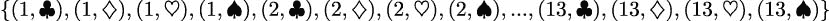

我们可以通过执行以下命令来生成前面的结果：

```py
>>> cards = list(product(range(1, 14), ’♣♢♡♠’)) 
>>> cards[:4] 
[(1, ’♣’), (1, ’♢’), (1, ’♡’), (1, ’♠’)] 
>>> cards[4:8] 
[(2, ’♣’), (2, ’♢’), (2, ’♡’), (2, ’♠’)] 
>>> cards[-4:] 
[(13, ’♣’), (13, ’♢’), (13, ’♡’), (13, ’♠’)]
```

乘积的计算可以扩展到任何数量的可迭代集合。使用大量集合可能导致非常大的结果集。

### 9.2 减少乘积

在关系数据库理论中，表之间的连接可以被视为一个过滤后的乘积。对于了解 SQL 的人来说，没有`WHERE`子句的`SELECT`语句连接表将产生表中行的笛卡尔积。这可以被视为最坏情况的算法——一个没有任何有用过滤来选择所需结果子集的巨大乘积。我们可以使用`itertools.product()`函数来枚举所有可能的组合，并过滤出那些匹配正确的组合。

我们可以定义一个`join()`函数来连接两个可迭代集合或生成器，如下面的命令所示：

```py
from collections.abc import Iterable, Iterator, Callable 
from itertools import product 
from typing import TypeVar 

JTL = TypeVar("JTL") 
JTR = TypeVar("JTR") 

def join( 
    t1: Iterable[JTL], 
    t2: Iterable[JTR], 
    where: Callable[[tuple[JTL, JTR]], bool] 
) -> Iterable[tuple[JTL, JTR]]: 
    return filter(where, product(t1, t2))
```

计算两个可迭代对象`t1`和`t2`的所有组合。`filter()`函数将应用给定的`where()`函数，以通过或拒绝匹配正确的两个元组，提示为`tuple[JTL, JTR]`。`where()`函数的提示为`Callable[[tuple[JTL, JTR]], bool]`，以表明它返回一个布尔结果。这通常是 SQL 数据库查询在没有任何有用的索引或基数统计信息来建议更好的算法的最坏情况下的典型做法。

虽然这个算法总是有效的，但它可能非常低效。我们通常需要仔细观察问题和可用数据，以找到更有效的算法。

首先，我们将问题稍微泛化一下，通过替换简单的布尔匹配函数。而不是二元结果，我们通常寻找项目之间某些距离的最小值或最大值。在这种情况下，比较产生一个浮点值。

假设我们有一个类来定义一个`Color`对象表中的实例，如下所示：

```py
from typing import NamedTuple 
class Color(NamedTuple): 
    rgb: tuple[int, int, int] 
    name: str
```

下面是一个使用此定义创建一些`Color`实例的例子：

```py
>>> palette = [Color(rgb=(239, 222, 205), name=’Almond’), 
...  Color(rgb=(255, 255, 153), name=’Canary’), 
...  Color(rgb=(28, 172, 120), name=’Green’), 
...  Color(rgb=(255, 174, 66), name=’Yellow Orange’) 
... ]
```

更多信息，请参阅第六章，递归和归约，其中我们向您展示了如何解析颜色文件以创建`NamedTuple`对象。在这种情况下，我们将 RGB 颜色保留为`tuple[int, int, int]`，而不是分解每个单独的字段。

一幅图像将包含像素集合，每个像素都是一个 RGB 元组。从概念上讲，图像包含如下数据：

```py
pixels = [(r, g, b), (r, g, b), (r, g, b), ...]
```

实际上，Python Imaging Library (PIL)包以多种形式呈现像素。其中之一是将(x,y)坐标映射到 RGB 三元组。对于 Pillow 项目文档，请访问[`pypi.python.org/pypi/Pillow`](https://pypi.python.org/pypi/Pillow)。

给定一个`PIL.Image`对象，我们可以使用类似以下命令迭代像素集合：

```py
from collections.abc import Iterator 
from typing import TypeAlias 
from PIL import Image  # type: ignore[import] 

Point: TypeAlias = tuple[int, int] 
RGB: TypeAlias = tuple[int, int, int] 
Pixel: TypeAlias = tuple[Point, RGB] 

def pixel_iter(img: Image) -> Iterator[Pixel]: 
    w, h = img.size 
    return ( 
        (c, img.getpixel(c)) 
        for c in product(range(w), range(h)) 
    )
```

此函数根据图像大小`img.size`确定每个坐标的范围。`product(range(w), range(h))`方法创建所有可能的坐标组合。它的结果与单个表达式中的两个嵌套`for`语句的结果相同。

这有一个优点，就是为每个像素及其坐标进行枚举。然后我们可以以任意顺序处理像素，并仍然重建图像。这在使用多进程或多线程将工作负载分散到多个核心或处理器时特别有用。`concurrent.futures`模块提供了一个简单的方法来在核心或处理器之间分配工作。

#### 9.2.1 计算距离

许多决策问题需要我们找到一个足够接近的匹配。我们可能无法使用简单的相等测试。相反，我们必须使用距离度量并定位到目标最近的项目。例如，k-最近邻（k-NN）算法使用数据训练集和距离测量函数。它定位到未知样本的 k 个最近邻，并使用这些邻居中的大多数来分类未知样本。

为了探索枚举所有可能的匹配的概念，我们将使用一个稍微简单一点的例子。然而，尽管表面上更简单，如果我们天真地全面枚举所有潜在的匹配，它可能不会得到好的结果。

在进行颜色匹配时，我们不会有简单的相等测试。在我们的目的中，颜色 C 是一个三元组 ⟨r,g,b⟩。它是在三维空间中的一个点。通常，定义一个最小距离函数来确定两种颜色是否足够接近，而不需要具有相同的三个值 ⟨r[1],g[1],b[1]⟩ = ⟨r[2],g[2],b[2]⟩ 是合理的。我们需要使用颜色空间的红、绿、蓝轴进行多维距离计算。有几种常见的测量距离的方法，包括欧几里得距离、曼哈顿距离以及其他基于视觉偏好的更复杂的加权方法。

这里是欧几里得和曼哈顿距离函数：

```py
import math 
def euclidean(pixel: RGB, color: Color) -> float: 
    return math.sqrt( 
        sum(map( 
            lambda x_1, x_2: (x_1 - x_2) ** 2, 
            pixel, 
            color.rgb)) 
        ) 

def manhattan(pixel: RGB, color: Color) -> float: 
    return sum(map( 
        lambda x_1, x_2: abs(x_1 - x_2), 
        pixel, 
        color.rgb))
```

欧几里得距离衡量了 RGB 空间中三个点之间直角三角形的斜边。以下是三维空间中的正式定义：

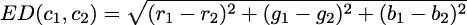

下面是两个点之间欧几里得距离的二维草图：

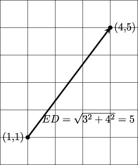

曼哈顿距离将三个点之间直角三角形的每条边的长度相加。它是以纽约市曼哈顿区的网格布局命名的。为了出行，人们被迫只能在街道和大道上行走。以下是三维空间中的正式定义：

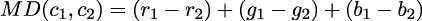

下面是两个点之间曼哈顿距离的二维草图：

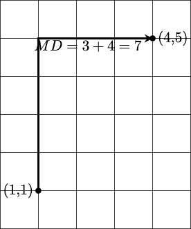

欧几里得距离提供精度，而曼哈顿距离提供计算速度。

展望未来，我们希望的结构看起来像这样。对于每个单独的像素，我们可以计算该像素颜色与有限颜色集中的可用颜色之间的距离。对于图像中的一个单独像素的计算结果可能开始如下示例：

```py
[((0, 0), 
  (92, 139, 195), 
  Color(rgb=(239, 222, 205), name=’Almond’), 
  169.10943202553784), 
 ((0, 0), 
  (92, 139, 195), 
  Color(rgb=(255, 255, 153), name=’Canary’), 
  204.42357985320578), 
 ((0, 0), 
  (92, 139, 195), 
  Color(rgb=(28, 172, 120), name=’Green’), 
  103.97114984456024), 
 ((0, 0), 
  (92, 139, 195), 
  Color(rgb=(48, 186, 143), name=’Mountain Meadow’), 
  82.75868534480233),
```

我们已经展示了一系列元组；每个元组包含四个项目：

+   像素的坐标；例如，(0,0)

+   像素的原始颜色；例如，(92, 139, 195)

+   来自一组七个颜色的 `Color` 对象；例如，`Color`(`rgb=(48, 186, 143)', `name='Mountain Meadow'`)

+   原始颜色与给定的 `Color` 对象之间的欧几里得距离；例如，82.75868534480233

有助于创建一个 `NamedTuple` 来封装每个元组中的四个项目。我们可以称它为 X-Y，像素，颜色，距离元组，类似于“XYPCD”。这将使识别 (x,y) 坐标、原始像素的颜色、匹配的颜色以及原始颜色和所选匹配之间的距离稍微容易一些。

最小的欧几里得距离是最接近匹配的颜色。对于这四种示例颜色，Mountain Meadow 是这个像素的最接近匹配。这种减少是通过 `min()` 函数完成的。如果将 (x,y)，像素，颜色和距离的整体四元组分配给一个变量名，`choices`，像素级别的减少将看起来像这样：

```py
min(choices, key=lambda xypcd: xypcd[3])
```

这个表达式将选择一个元组作为像素和颜色之间的最佳匹配。它使用 lambda 从元组中选择第 3 项，即距离度量。

#### 9.2.2 获取所有像素和所有颜色

我们如何到达包含所有像素和所有颜色的结构？一个看似简单的答案最终证明并不理想。

将像素映射到颜色的一种方法是通过使用 `product()` 函数枚举所有像素和所有颜色：

```py
from collections.abc import Iterable 
from itertools import groupby 

def matching_1( 
        pixels: Iterable[Pixel], 
        colors: Iterable[Color] 
    ) -> Iterator[tuple[Point, RGB, Color, float]]: 

    distances = ( 
        (pixel[0], pixel[1], color, euclidean(pixel[1], color)) 
        for pixel, color in product(pixels, colors) 
    ) 
    for _, choices in groupby(distances, key=lambda xy_p_c_d: xy_p_c_d[0]): 
        yield min(choices, key=lambda xypcd: xypcd[3])
```

这的核心是 `product(pixel_iter(img), colors)` 表达式，它创建了一个所有像素与所有颜色组合的序列。然后，整体表达式应用 `euclidean()` 函数来计算像素和 `Color` 对象之间的距离。结果是包含原始 (x,y) 坐标、原始像素、可用颜色以及原始像素颜色和可用颜色之间距离的四元组对象序列。

最终的颜色选择使用 `groupby()` 函数和 `min(choices, ...)` 表达式来定位最接近的匹配。

将 `product()` 函数应用于像素和颜色创建了一个长而平的迭代器。我们将迭代器分组到更小的集合中，其中坐标匹配。这将把大迭代器分解成仅与单个像素关联的颜色池的小迭代器。然后我们可以为每个像素的每个可用颜色选择最小颜色距离。

在一个 3,648×2,736 像素的图片中，使用了 133 种克雷奥拉颜色，我们有一个包含 3,648 × 2,736 × 133 = 1,327,463,424 个项目的可迭代对象需要评估。这是由这个`distances`表达式创建的十亿种组合。这个数字并不一定不切实际；它完全在 Python 能处理的范围内。然而，它揭示了在简单使用`product()`函数时的一个重要缺陷。

在进行一些分析以查看中间数据有多大之前，我们无法简单地执行这种大规模处理。以下是这两个距离函数的`timeit`数字。这是只进行 1,000,000 次这些计算的总秒数：

+   欧几里得距离：1.761

+   曼哈顿距离：0.857

通过 1,000 倍的比例放大——从 1 百万组合到 10 亿——意味着处理至少需要 1,800 秒；即曼哈顿距离需要大约半小时，欧几里得距离需要 46 分钟来计算。这似乎表明这种简单的批量处理对于大数据集是无效的。

更重要的是，我们做错了。这种宽度 × 高度 × 颜色处理的设计本身就是错误的。在许多情况下，我们可以做得更好。

### 9.3 性能改进

任何大数据算法的一个关键特性是找到一种执行某种分而治之策略的方法。这在函数式编程设计以及命令式设计中都是正确的。

这里有三个选项可以加快这个处理过程：

+   我们可以尝试使用并行性来同时进行更多的计算。在四核处理器上，时间可以减少到大约 25%。这把曼哈顿距离的计算时间减少到了 8 分钟。

+   我们可以看看缓存中间结果是否会减少冗余计算的数量。问题在于有多少颜色是相同的，有多少颜色是唯一的。

+   我们可以寻找算法的彻底改变。

我们将通过计算源颜色和目标颜色之间所有可能的比较来合并最后两个点。在这种情况下，就像在许多其他情况下一样，我们可以轻松地枚举整个像素和颜色的映射。如果颜色重复，我们将避免进行冗余计算以找到最近的颜色。我们还将把算法从一系列比较改为一系列在映射对象中的查找。

在许多问题域中，源数据是一组浮点值。虽然这些`float`值很灵活，并且在某些方面与实数的数学抽象相对应，但它们引入了一些额外的成本。浮点运算可能比整数运算慢。更重要的是，浮点值可以包含许多“噪声”位。例如，常见的 RGB 颜色定义使用 256 个不同的值来表示红色、绿色和蓝色组件。这些值使用 8 位精确表示。使用从 0.0 到 1.0 的值的浮点数变体将每个颜色使用完整的 64 位。任何导致浮点截断的算术都会引入噪声。虽然`float`值看起来很简单，但它们引入了令人烦恼的问题。

以下是一个示例，使用红色`r=15`：

```py
>>> r = 15 
>>> r_f = 15/256 
>>> r_f 
0.05859375 
>>> r_f + 1/100 - 1/100 
0.05859374999999999
```

从代数上讲，r[f] + 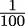 − = r[f]。然而，`float`定义只是对实数抽象概念的近似。的值在基于二进制的浮点数中没有确切的表示。使用这样的值会引入截断误差，这些误差会传播到后续的计算中。我们选择使用基于整数的颜色匹配来展示如何最小化由浮点值引起的额外复杂性。

当考虑从源颜色到目标颜色的所有转换的预计算这一想法时，我们需要一个任意图像的整体统计数据。与本书相关的代码包括`IMG_2705.jpg`。以下是收集指定图像中所有不同颜色元组的简单算法：

```py
from collections import defaultdict, Counter 
def gather_colors() -> defaultdict[RGB, list[Point]]: 
    img = Image.open("IMG_2705.jpg") 

    palette = defaultdict(list) 
    for xy, rgb in pixel_iter(img): 
        palette[rgb].append(xy) 

    w, h = img.size 
    print(f"total pixels {w*h}") 
    print(f"total colors {len(palette)}") 
    return palette
```

我们将给定颜色的所有像素收集到一个按颜色组织的列表中。从这些数据中，我们将学习以下事实：

+   像素总数为 9,980,928。这符合 10 兆像素图像的预期。

+   颜色的总数为 210,303。如果我们尝试计算实际颜色和 133 个目标颜色之间的欧几里得距离，我们将进行 27,970,299 次计算，这可能需要大约 76 秒。

+   如果我们使用更不精确的表示，即位数更少的表示，我们可以加快速度。我们将称之为“掩码”，以去除一些不相关的最低有效位。使用 3 位掩码，`0b11100000`，实际使用的颜色总数减少到 214 种，而可能的颜色域为 2³ × 2³ × 2³ = 512 种。

+   使用 4 位掩码，`0b11110000`，实际上使用了 1,150 种颜色。

+   使用 5 位掩码，`0b11111000`，实际上使用了 5,845 种颜色。

+   使用 6 位掩码，`0b11111100`，实际上使用了 27,726 种颜色。可能的颜色域增加到 2⁶ × 2⁶ × 2⁶ = 262,144。

这使我们了解如何重新排列数据结构，快速计算匹配的颜色，然后在不进行十亿次比较并避免任何额外的浮点近似复杂性的情况下重建图像。需要做出一些改变以避免不必要的（并引入错误的）计算。

掩码背后的核心思想是保留值的最高有效位并消除最低有效位。考虑一个红色值为 200 的颜色。我们可以使用 Python 的`bin()`函数来查看该值的二进制表示：

```py
>>> bin(200) 
’0b11001000’ 
>>> 200 & 0b11100000 
192 
>>> bin(192) 
’0b11000000’
```

计算`200 & 0b11100000`应用了一个掩码来隐藏最低有效 5 位并保留最高有效 3 位。掩码应用后剩下的值作为红色值为 192。

我们可以使用以下命令将掩码值应用于 RGB 三元组：

```py
masked_color = tuple(map(lambda x: x & 0b11100000, c))
```

这将通过使用`&`运算符从整数值中选择特定的位来挑选出颜色元组的红色、绿色和蓝色值的最显著 3 位。如果我们用这个掩码值而不是原始颜色来创建一个`Counter`对象，我们会看到在应用掩码后，图像只使用了 214 个不同的值。这比理论上的颜色数量少了一半。

#### 9.3.1 重新排列问题

使用`product()`函数比较所有像素和所有颜色是天真且不恰当的。有 1000 万个像素，但只有 20 万个独特的颜色。在将源颜色映射到目标颜色时，我们只需要在简单的映射中保存 20 万个值。

我们将按以下方式处理：

1.  计算源到目标颜色映射。在这种情况下，让我们使用 3 位颜色值作为输出。每个 R、G 和 B 值来自`range(0, 256, 32)`表达式中的八个值。我们可以使用这个表达式来枚举所有输出颜色：

    ```py
    product(range(0, 256, 32), range(0, 256, 32), range(0, 256, 32))
    ```

1.  然后，我们可以计算到源调色板中最近颜色的欧几里得距离，只需进行 68,096 次计算。这大约需要 0.14 秒。它只做一次计算，并计算 200,000 个映射。

1.  在一次遍历源图像的过程中，我们使用修订后的颜色表构建一个新的图像。在某些情况下，我们可以利用整数值的截断。我们可以使用如`(0b11100000&r, 0b11100000&g, 0b11100000&b)`这样的表达式来移除图像颜色的最低有效位。我们将在稍后查看这种额外的计算减少。

这将用 1000 万个字典查找替换十亿次的距离计算，将潜在的 30 分钟计算时间缩短到大约 30 秒。

给定大约有 20 万个颜色的源调色板，我们可以应用快速曼哈顿距离来定位目标调色板（如 Crayola 颜色）中的最近颜色。

我们将加入另一个优化——截断。这将给我们一个更快的算法。

#### 9.3.2 结合两个转换

当结合多个转换时，我们可以从源通过中间目标到结果构建一个更复杂的映射。为了说明这一点，我们将截断颜色并应用映射。

在某些问题背景下，截断可能很困难。在其他情况下，它通常相当简单。例如，将美国邮政编码从九位截断到五位是常见的。邮政编码可以进一步截断到三位，以确定代表更大地理区域的区域设施。

对于颜色，我们可以使用之前显示的位掩码来截断从三个 8 位值（24 位，1600 万种颜色）到三个 3 位值（9 位，512 种颜色）的颜色。

这里是一种构建颜色映射的方法，它结合了给定颜色集的距离和源颜色的截断：

```py
from collections.abc import Sequence 
def make_color_map(colors: Sequence[Color]) -> dict[RGB, Color]: 
    bit3 = range(0, 256, 0b0010_0000) 

    best_iter = ( 
        min((euclidean(rgb, c), rgb, c) for c in colors) 
        for rgb in product(bit3, bit3, bit3) 
    ) 
    color_map = dict((b[1], b[2]) for b in best_iter) 
    return color_map
```

我们创建了一个范围对象 `bit3`，它将遍历所有八个 3 位颜色值。使用二进制值 `0b0010_0000` 可以帮助可视化位的使用方式。最低的 5 位将被忽略；只使用最高 3 位。

`range` 对象与普通迭代器不同；它们可以被多次使用。因此，`product(bit3, bit3, bit3)` 表达式将生成我们用作输出颜色的所有 512 种颜色组合。

对于每个截断的 RGB 颜色，我们创建了一个包含（0）所有蜡笔颜色的距离、（1）RGB 颜色和（2）蜡笔 `Color` 对象的三元组。当我们请求这个集合的最小值时，我们将得到与截断 RGB 颜色最接近的蜡笔 `Color` 对象。

我们构建了一个字典，将截断的 RGB 颜色映射到最接近的蜡笔。为了使用这个映射，我们将在查找映射中最接近的蜡笔之前截断源颜色。这种截断与预计算的映射的结合展示了我们可能需要结合映射技术。

以下函数将从一个颜色映射构建新的图像：

```py
def clone_picture( 
    color_map: dict[RGB, Color], 
    filename: str = "IMG_2705.jpg" 
) -> None: 
    mask = 0b1110_0000 
    img = Image.open(filename) 
    clone = img.copy() 
    for xy, rgb in pixel_iter(img): 
        r, g, b = rgb 
        repl = color_map[(mask & r, mask & g, mask & b)] 
        clone.putpixel(xy, repl.rgb) 
    clone.show()
```

这使用 PIL 的 `putpixel()` 函数来替换图片中的所有像素。掩码值保留每个颜色的最高三位，将颜色数量减少到子集。

我们看到的是，一些函数式编程工具的简单使用可能导致表达简洁但效率低下的算法。计算复杂度（有时称为 Big-O 分析）的基本工具对于函数式编程来说，与命令式编程一样重要。

问题不在于 `product()` 函数效率低下。问题在于我们可以使用 `product()` 函数创建一个效率低下的算法。

### 9.4 对值集合进行排列

当我们对值集合进行排列时，我们将生成集合中值的所有可能顺序。n 个项目的排列有 n! 种。我们可以使用排列序列作为解决各种优化问题的暴力解决方案。

典型的组合优化问题包括旅行商问题、最小生成树问题和背包问题。这些问题之所以著名，是因为它们涉及到可能的大量排列。为了避免对所有排列进行穷举，需要近似解。使用`itertools.permutations()`函数仅适用于探索非常小的问题。

9

我们可以创建一个简单的网格，以显示给定代理完成给定任务的能力。对于七个代理和任务的简单问题，将有一个 49 个成本的网格。网格中的每个单元格显示代理 A[0]到 A[6]执行任务 T[0]到 T[6]：

代理

* * *

* * *

* * *

* * *

12

* * *

* * *

25

任务

A[0]

8

A[2]

24

A[4]

A[5]

* * *

A[3]

* * *

* * *

* * *

* * *

* * *

* * *

* * *

T[3]

* * *

* * *

* * *

* * *

* * *

* * *

* * *

T[0]

14

11

A[6]

* * *

12

* * *

4

* * *

* * *

* * *

* * *

* * *

* * *

30

A[1]

T[1]

15

6

34

4

* * *

28

21

* * *

20

* * *

* * *

* * *

* * *

* * *

* * *

T[2]

* * *

T[5]

22

18

31

15

23

* * *

* * *

* * *

* * *

24

* * *

* * *

* * *

5

20

18

9

15

30

* * *

18

* * *

* * *

* * *

* * *

* * *

* * *

31

* * *

T[4]

* * *

这些组合优化问题的一个流行例子是分配问题。我们有 n 个代理和 n 个任务，但每个代理执行特定任务的成本并不相等。想象一下，一些代理在处理某些细节时遇到困难，而其他代理在这些细节上表现出色。如果我们能正确分配任务给代理，我们可以最小化成本。

16

30

* * *

* * *

4

* * *

28

* * *

* * *

* * *

24

* * *

* * *

4

3

23

22

11

5

10

5

* * *

* * *

* * *

* * *

* * *

* * *

* * *

* * *

T[6]

13

7

* * *

* * *

7

7

32

* * *

* * *

* * *

* * *

* * *

* * *

* * *

* * *

给定这个网格，我们可以列出所有代理和任务的排列组合。然而，这种方法扩展性不好。对于这个问题，有 720 种选择。如果我们有更多的代理，例如 10 个，10!的值是 3,628,800。我们可以使用`list(permutations(range(10)))`表达式创建整个 300 万项的序列。

我们预计在几秒钟内就能解决这么小的问题。对于 10!，我们可能需要几秒钟。当我们把问题规模加倍到 20!时，我们遇到了一些可扩展性问题：将有 2.433 × 10¹⁸种排列。在一个生成 10!排列需要大约 0.56 秒的计算机上，生成 20!排列的过程将需要大约 12,000 年。

我们可以将穷举搜索最优解的形式化如下：

```py
from itertools import permutations 

def assignment(cost: list[tuple[int, ...]]) -> list[tuple[int, ...]]: 
    n_tasks = len(cost) 
    perms = permutations(range(n_tasks)) 
    alt = [ 
        ( 
            sum( 
                cost[task][agent] for agent, task in enumerate(perm) 
            ), 
            perm 
        ) 
        for perm in perms 
    ] 
    m = min(alt)[0] 
    return [ans for s, ans in alt if s == m]
```

我们为一系列代理创建所有任务排列，并将其分配给`perms`。从这些排列中，我们创建了两个元组，表示给定排列的成本矩阵中所有成本的总和。为了定位相关成本，我们枚举一个特定的排列以创建显示代理及其任务分配的两个元组。例如，一个排列是任务`(2, 4, 6, 1, 5, 3, 0)`。我们可以使用表达式`list(enumerate((2, 4, 6, 1, 5, 3, 0)))`来分配代理索引值。结果是`[(0, 2), (1, 4), (2, 6), (3, 1), (4, 5), (5, 3), (6, 0)]`，包含所有七个代理索引值及其相关的任务分配。我们可以通过字典查找将索引数字转换为代理名称和任务名称。成本矩阵中值的总和告诉我们这个特定任务分配的成本是多少。

一个最优解可能看起来像上面的分配。它需要将代理名称和任务名称折叠进来，以将任务排列转换为特定的分配列表：

|

* * *

|

* * *

|

| A[0] | T[2] |
| --- | --- |

|

* * *

|

* * *

|

| A[1] | T[4] |
| --- | --- |

|

* * *

|

* * *

|

| A[2] | T[6] |
| --- | --- |

|

* * *

|

* * *

|

| A[3] | T[1] |
| --- | --- |

|

* * *

|

* * *

|

| A[4] | T[5] |
| --- | --- |

|

* * *

|

* * *

|

| A[5] | T[3] |
| --- | --- |

|

* * *

|

* * *

|

| A[6] | T[0] |
| --- | --- |

|

* * *

|

* * *

|

|  |  |
| --- | --- |

在某些情况下，可能会有多个最优解；此算法将找到所有这些解。表达式`min(alt)[0]`选择最小值集中的第一个。

对于小的教科书示例，这似乎是相当快的。有一些线性规划方法可以避免枚举所有排列。Python 线性规划模块 PuLP 可用于解决分配问题。请参阅[`coin-or.github.io/pulp/`](https://coin-or.github.io/pulp/)。

### 9.5 生成所有组合

`itertools`模块也支持计算一组值的所有组合。在考虑组合时，顺序不重要，因此组合的数量远少于排列。组合的数量通常表示为 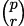 = 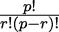。这是从包含 p 个项目的总体中一次取 r 个项目的组合方式的数量。

例如，有 2,598,960 种五张牌的扑克手牌。实际上，我们可以通过执行以下命令来枚举所有 200 万种手牌：

```py
>>> from itertools import combinations, product 

>>> hands = list( 
...     combinations( 
...         tuple( 
...             product(range(13), ’♠♡♢♣’) 
...         ), 5 
...     ) 
... )
```

更实际的做法是，假设我们有一个包含多个变量的数据集。一种常见的探索技术是确定数据集中所有变量对之间的相关性。如果有 v 个变量，那么我们将执行以下命令来枚举必须比较的所有变量：

```py
>>> combinations(range(v), 2)
```

简单统计分析的一个有趣数据来源是 Spurious Correlations 网站。这个网站拥有大量具有惊人统计特性的数据集。让我们从 Spurious Correlations 网站，[`www.tylervigen.com`](http://www.tylervigen.com)，获取一些样本数据，以展示这是如何工作的。我们将选择三个具有相同时间范围的数据集，编号为 7、43 和 3,890。我们将简单地将数据串联成一个网格。因为源数据重复了`year`列，我们将从包含重复`year`列的数据开始。我们最终会移除明显的冗余，但通常最好从所有现有数据开始，以便确认各种数据来源是否正确对齐。

这就是年度数据的第 1 行和剩余行将看起来像这样：

```py
[(’year’, ’Per capita consumption of cheese (US)Pounds (USDA)’, 
’Number of people who died by becoming tangled in their 
bedsheets Deaths (US) (CDC)’, 
’year’, ’Per capita consumption of mozzarella cheese (US)Pounds 
(USDA)’, ’Civil engineering doctorates awarded (US) Degrees awarded 
(National Science Foundation)’, 
’year’, ’US crude oil imports from Venezuela Millions of barrels 
(Dept. of Energy)’, ’Per capita consumption of high fructose corn 
syrup (US) Pounds (USDA)’), 

(2000, 29.8, 327, 2000, 9.3, 480, 2000, 446, 62.6), 
(2001, 30.1, 456, 2001, 9.7, 501, 2001, 471, 62.5), 
(2002, 30.5, 509, 2002, 9.7, 540, 2002, 438, 62.8), 
(2003, 30.6, 497, 2003, 9.7, 552, 2003, 436, 60.9), 
(2004, 31.3, 596, 2004, 9.9, 547, 2004, 473, 59.8), 
(2005, 31.7, 573, 2005, 10.2, 622, 2005, 449, 59.1), 
(2006, 32.6, 661, 2006, 10.5, 655, 2006, 416, 58.2), 
(2007, 33.1, 741, 2007, 11, 701, 2007, 420, 56.1), 
(2008, 32.7, 809, 2008, 10.6, 712, 2008, 381, 53), 
(2009, 32.8, 717, 2009, 10.6, 708, 2009, 352, 50.1)]
```

这就是我们如何使用`combinations()`函数产生这个数据集中九个变量的所有组合，每次取两个：

```py
>>> combinations(range(9), 2)
```

有 36 种可能的组合。我们必须拒绝涉及匹配列`year`和`year`的组合。这些组合将与 1.00 的值简单地相关。

这里是一个从我们的数据集中选择数据列的函数：

```py
from typing import TypeVar 
from collections.abc import Iterator, Iterable 
T = TypeVar("T") 

def column(source: Iterable[list[T]], x: int) -> Iterator[T]: 
    for row in source: 
        yield row[x]
```

这允许我们使用第四章，处理集合中的`corr()`函数来计算两个数据列之间的相关性。

这就是我们如何计算所有相关性的组合：

```py
from collections.abc import Iterator 
from itertools import * 
from Chapter04.ch04_ex4 import corr 

def multi_corr( 
        source: list[list[float]] 
    ) -> Iterator[tuple[float, float, float]]: 
    n = len(source[0]) 
    for p, q in combinations(range(n), 2): 
        header_p, *data_p = list(column(source, p)) 
        header_q, *data_q = list(column(source, q)) 
        if header_p == header_q: 
            continue 
        r_pq = corr(data_p, data_q) 
        yield header_p, header_q, r_pq
```

对于每一组列的组合，我们已经从我们的数据集中提取了两个数据列。`header_p,` `*data_p` `=...`语句使用多个赋值来分离序列中的第一个项目，即标题，与剩余的行数据。如果标题匹配，我们就是在比较一个变量与自身。这对于从冗余的年份列中产生的三个年份与年份的组合将是`True`。

给定一个列的组合，我们将计算相关性函数，然后打印出两列的标题以及它们的相关性。我们有意选择了两个显示与第三个数据集有虚假相关性的数据集，该数据集并不紧密遵循相同的模式。尽管如此，相关性却非常高。

结果看起来像这样：

```py
0.96: year vs Per capita consumption of cheese (US) Pounds (USDA) 

0.95: year vs Number of people who died by becoming tangled in their 
bedsheets Deaths (US) (CDC) 

0.92: year vs Per capita consumption of mozzarella cheese (US) Pounds 
(USDA) 

0.98: year vs Civil engineering doctorates awarded (US) Degrees awarded 
(National Science Foundation) 

-0.80: year vs US crude oil imports from Venezuela Millions of barrels 
(Dept. of Energy) 

-0.95: year vs Per capita consumption of high fructose corn syrup (US) 
Pounds (USDA) 

0.95: Per capita consumption of cheese (US) Pounds (USDA) vs Number of 
people who died by becoming tangled in their bedsheets Deaths (US) (CDC) 

0.96: Per capita consumption of cheese (US)Pounds (USDA) vs year 

0.98: Per capita consumption of cheese (US)Pounds (USDA) vs Per capita 
consumption of mozzarella cheese (US)Pounds (USDA) 

... 

0.88: US crude oil imports from Venezuela Millions of barrels (Dept. of 
Energy) vs Per capita consumption of high fructose corn syrup (US)Pounds 
(USDA)
```

这个模式的意义并不明确。为什么这些值会相关？虚假相关性（无显著性）的存在可能会使统计分析变得复杂。我们已经找到了具有奇怪高相关性但没有明显因果因素的数据。

重要的是，一个简单的表达式`combinations(range(9), 2)`列出了所有可能的数据组合。这种简洁、表达性的技术使得关注数据分析问题而不是组合算法考虑变得更容易。

#### 9.5.1 带替换的组合

`itertools` 库有两个函数用于生成从某些值集中选择的项的组合。`combinations()` 函数反映了从一副牌中发牌时的预期：每张牌最多出现一次。`combinations_with_replacement()` 函数反映了从一副牌中取一张牌，写下它，然后将其洗回牌堆，在再次选择另一张牌之前。这种第二种程序可能产生一个包含五张黑桃 A 的五张牌样本。

我们可以通过以下类型的表达式更清楚地看到这一点：

```py
>>> import itertools 
>>> from pprint import pprint 
>>> pprint( 
... list(itertools.combinations([1,2,3,4,5,6], 2)) 
... ) 
[(1, 2), 
 (1, 3), 
 (1, 4), 
... 
 (4, 6), 
 (5, 6)] 
>>> pprint( 
... list(itertools.combinations_with_replacement([1,2,3,4,5,6], 2)) 
... ) 
[(1, 1), 
 (1, 2), 
 (1, 3), 
... 
 (5, 5), 
 (5, 6), 
 (6, 6)]
```

从六个事物中每次取两个，有 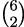 = 15 种组合。当允许替换时，有 6² = 36 种组合，因为任何值都是结果的可能成员。

### 9.6 食谱

Python 库文档中的 `itertools` 章节非常出色。基本定义之后，是一系列非常清晰且有用的食谱。由于没有必要重新生成这些内容，我们在这里引用它们。它们是 Python 函数式编程的必读材料。

Python 标准库中的 `itertools` 食谱部分是一个极好的资源。访问 [`docs.python.org/3/library/itertools.html#itertools-recipes`](https://docs.python.org/3/library/itertools.html#itertools-recipes) 获取更多详情。

这些函数定义不是 `itertools` 模块中的可导入函数。这些是需要阅读和理解，然后可能复制或修改后包含到应用程序中的想法。

以下表格总结了显示由 itertools 基础构建的函数式编程算法的一些食谱：

|  |
| --- |
| 函数名称 | 参数 | 结果 |
|  |
|  |  |  |
|  |  |  |
| `powerset` | `(iterable)` | 生成迭代器的所有子集。每个子集都是一个元组对象，而不是集合实例。 |
| `random_product` | `(*args, repeat=1)` | 从 `product()` 中随机选择。 |
| `random_permutation` | `(iterable, r=None)` | 从 `permutations()` 中随机选择。 |
| `random_combination` | `(iterable, r)` | 从 `combinations()` 中随机选择。 |
|  |
|  |  |  |
|  |  |  |
|  |  |  |
|  |  |  |
|  |  |  |

### 9.7 概述

在本章中，我们探讨了 `itertools` 模块中的多个函数。这个标准库模块提供了一系列函数，帮助我们以复杂的方式处理迭代器。

我们探讨了以下这些组合生成函数：

+   `product()` 函数计算从两个或更多集合中选择的元素的所有可能组合。

+   `permutations()` 函数为我们提供了重新排列给定值集的不同方式。

+   `combinations()` 函数返回原始集合的所有可能子集。

我们还探讨了如何天真地使用`product()`和`permutations()`函数来创建极其大的结果集。这是一个重要的警告。一个简洁且表达力强的算法也可能涉及大量的计算。我们必须进行基本的复杂度分析，以确保代码能在合理的时间内完成。

在下一章中，我们将探讨`functools`模块。此模块包含一些工具，用于将函数作为一等对象处理。这基于第二章，介绍基本函数概念，和第五章，高阶函数中展示的一些材料。

### 9.8 练习

本章的练习基于 Packt Publishing 在 GitHub 上提供的代码。请参阅[`github.com/PacktPublishing/Functional-Python-Programming-3rd-Edition`](https://github.com/PacktPublishing/Functional-Python-Programming-3rd-Edition)。

在某些情况下，读者会注意到 GitHub 上提供的代码包含一些练习的部分解决方案。这些作为提示，允许读者探索替代解决方案。

在许多情况下，练习需要单元测试用例来确认它们确实解决了问题。这些通常与 GitHub 仓库中已提供的单元测试用例相同。读者应将书中的示例函数名称替换为自己的解决方案，以确认其有效性。

#### 9.8.1 替代距离计算方法

参见《距离度量选择对 KNN 分类器性能的影响——综述》。该综述可在[`arxiv.org/pdf/1708.04321`](https://arxiv.org/pdf/1708.04321)找到。在这篇论文中，考察了数十种距离度量在实现 k-最近邻(k-NN)分类器中的实用性。

其中一些也适用于本章中介绍的色彩匹配算法。我们定义了一个颜色，c，一个三元组，(r,g,b)，基于颜色的红、绿、蓝成分。我们可以根据它们的 RGB 成分计算两种颜色之间的距离，D(c[1],c[2])：

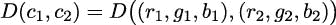

我们展示了两种：欧几里得距离和曼哈顿距离。以下是更正式的定义：

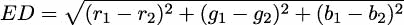

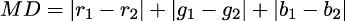

一些额外的例子包括这些：

+   切比雪夫距离(CD)是每个颜色差异绝对值的最大值：

    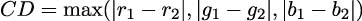

+   索尔森距离(SD)是对曼哈顿距离的一种修改，倾向于标准化距离：

    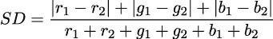

重新定义`make_color_map()`函数，使其成为一个接受距离函数作为参数的高阶函数。所有距离函数都应该有`Callable[[RGB, Color], float]`类型的提示。一旦`make_color_map()`函数被修改，就可以使用不同的距离函数创建替代的颜色图。

此函数创建从“掩码”RGB 值到定义的颜色集的映射。使用 3 位掩码定义从 2³ × 2³ × 2³ = 512 个可能的 RGB 值到 133 个颜色域的映射。

函数的定义应该如下所示：

```py
def make_color_map(colors: Sequence[Color], distance: Callable[[RGB, Color], float]) -> dict[RGB, Color]:
```

距离函数的选择对差异有多大？我们如何描述从大量可能的 RGB 值到有限的颜色子集域的映射？显示有多少不同的 RGB 值映射到子集颜色的直方图是否合理且具有信息性？

#### 9.8.2 像素颜色值的实际域

在创建颜色图时，使用了一个掩码来将可能的颜色域从 2⁸ × 2⁸ × 2⁸ = 16,777,216 减少到更易于管理的 2³ × 2³ × 2³ = 512 个可能值。

使用掩码值扫描原始图像以确定实际可用颜色的域是否有意义？例如，当使用 3 位掩码时，一个给定的图像可能有 210 种不同的颜色。创建此颜色摘要实际上需要多少额外的时间？

颜色摘要能否进一步优化？例如，我们能否排除很少使用的颜色？如果我们排除这些很少使用的颜色，我们如何用更常用的颜色替换像素的颜色？如果我们用大多数相邻像素的颜色替换很少使用的颜色，图像会有什么变化？

考虑一个算法，该算法对图像的像素进行以下两次遍历：

1.  创建一个包含每种颜色频率的`Counter`。

1.  对于少于某个阈值𝜖的颜色，找到相邻像素。在角落处，可能只有三个。在中间，不会超过八个。找到大多数这些像素的颜色并替换异常值。

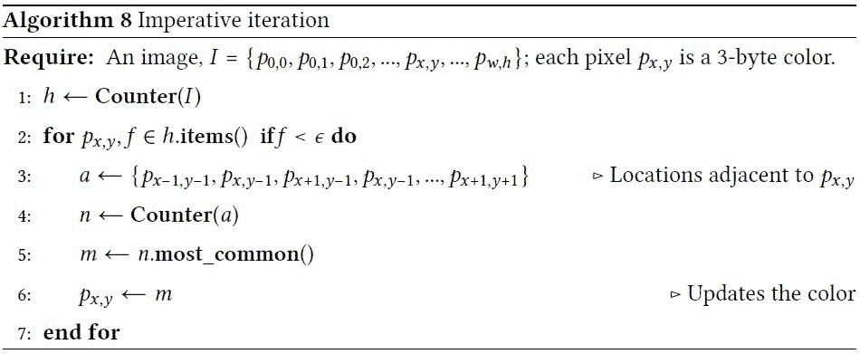

算法 8：命令式迭代

在开始这个算法之前，考虑任何“边缘”情况是很重要的。特别是，当很少使用的颜色相邻时，可能会出现潜在的复杂情况。

考虑以下情况：

|

* * *

|

* * *

|

* * *

|

| p[(0,0)] | p[(1,0)] | p[(2,0)] |
| --- | --- | --- |

|

* * *

|

* * *

|

* * *

|

| p[(0,1)] | p[(1,1)] | p[(2,1)] |
| --- | --- | --- |

|

* * *

|

* * *

|

* * *

|

| p[(0,2)] | p[(1,2)] | p[(2,2)] |
| --- | --- | --- |

|

* * *

|

* * *

|

* * *

|

|  |  |  |
| --- | --- | --- |

如果左上角四个像素 p[(0,0)]、p[(1,0)]、p[(0,1)]和 p[(1,1)]都具有很少使用的颜色，那么很难选择一个多数颜色来替换 p[(0,0)]。

在没有非稀有颜色围绕一个稀有颜色的像素的情况下，算法需要在处理了邻居之后将其排队以供稍后解决。在这个例子中，像素 p[(1,0)]的颜色可以使用不是稀有颜色的邻居来计算。在 p[(0,1)]和 p[(1,1)]也被解决之后，p[(0,0)]可以用三个邻居的大多数颜色来替换。

这个算法的复杂性对于有 1000 万个像素的图片有帮助吗？任意选择一张或几张照片并不算是一个复杂的调查。然而，它可以帮助避免过度思考潜在的问题。

调查一组图片中的颜色。看到单个具有独特颜色的像素有多常见？如果您没有私人图片收藏，请访问[kaggle.com](https://kaggle.com)寻找可以检查的图像数据集。

#### 9.8.3 克里比奇手牌得分

克里比奇牌戏涉及一个阶段，玩家的手牌被评估。玩家将使用分发给他们的四张牌，加上一张称为起始牌的第五张牌。

为了避免过度使用“点”这个词，我们将考虑每张牌都有一个点数。每张面牌计为 10 点；所有其他牌的点数等于它们的等级。A 计为一点。

得分涉及以下牌的组合：

+   任何总点数为 15 的牌的组合为得分增加 2 分。

+   对子—两张相同等级的牌—为得分增加 2 分。

+   任何三张、四张或五张牌的顺子都会为得分增加 3 分、4 分或 5 分。

+   一手牌中的四张同花色的牌为得分增加 4 分。如果起始牌也是同一花色，那么整个同花顺为 5 分。

+   如果一手牌中的杰克与起始牌的花色相同，这将为得分增加 1 分。

如果一手牌包含三张相同等级的牌，这算作三个单独的对子，总共值 6 分。

一个有趣的手牌包含带有对子的顺子。例如，一张手牌 7C、7D、8H 和 9S，以及一个无关的起始牌王后，有两个顺子—7C、8H、9S 和 7D、8H、9S—以及一对 7。这总共是 8 分。此外，还有两种组合加起来是 15 分：7C、8H 和 7D、8H，将手牌的价值提升到 12 分。

注意，4 张牌的顺子不算作两个重叠的 3 张牌的顺子。它只值 4 分。

另一个有趣的例子是持有 4C、5D、5H、6S，起始牌是 3C。有两个不同的 4 张牌顺子：3C、4C、5D、6S 和 3C、4C、5H、6S，以及一对 5，这个模式总共是 10 分。此外，有两种不同的方式计算 15 点：4C、5D、6S 和 4C、5H、6S，为得分增加 4 分。

对于此问题的一个实用算法是列举几张牌的组合和排列，以定位所有得分。以下规则可以应用：

1.  遍历牌的幂集。这是所有子集的集合：所有单张牌、所有对子、所有三张牌等，直到所有五张牌的集合。这些每个都是独特的集合，其中一些的总点数为 15 点。有关生成幂集的更多信息，请参阅 Python 标准库文档中的 Itertools 食谱部分。

1.  列出所有牌对以计算任何牌对的分数。`combinations()`函数对此非常适用。

1.  对于五张牌的集合，如果它们是相邻的、升序的值，则这是一个连牌。如果不是相邻的、升序的值，则列出四张牌连牌的集合，以查看这些连牌中是否有相邻的数字。如果这个测试失败，则列出所有三张牌连牌的集合，以查看这些连牌中是否有相邻的数字。最长的连牌适用于计分，较短的连牌则被忽略。

1.  检查手牌和起始牌是否构成五顺子。如果没有五顺子，则只检查手牌是否构成四顺子。这两种组合中只有一种是计分的。

1.  此外，检查手牌中是否有与起始牌同花色的杰克。

由于只涉及五张牌，排列和组合的数量相对较小。准备好精确总结五张牌手牌所需的组合和排列数量。

### 加入我们的社区 Discord 空间

加入我们的 Python Discord 工作空间，讨论并了解更多关于这本书的信息：[`packt.link/dHrHU`](https://packt.link/dHrHU)


