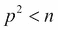
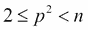
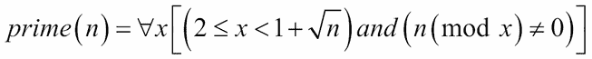
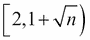
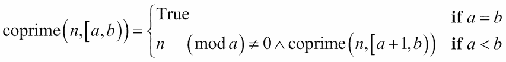
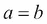
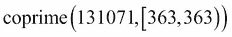
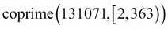
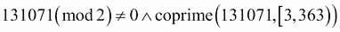
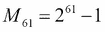

# 第二章：介绍一些函数式特性

函数式编程的大多数特性已经是 Python 的一等部分。我们在编写函数式 Python 时的目标是尽可能地将我们的注意力从命令式（过程式或面向对象）技术转移。

我们将研究以下每个函数式编程主题：

+   一等和高阶函数，也称为纯函数。

+   不可变数据。

+   严格和非严格评估。我们也可以称之为急切 vs. 懒惰评估。

+   递归而不是显式循环状态。

+   函数式类型系统。

这应该重申第一章的一些概念。首先，纯函数式编程避免了通过变量赋值维护显式状态的复杂性。其次，Python 不是一个纯函数式语言。

我们不提供对函数式编程的严格定义。相反，我们将找到一些不容置疑重要的共同特征。我们将避开模糊的边缘。

# 一等函数

函数式编程通常简洁而富有表现力。实现这一点的一种方法是将函数作为其他函数的参数和返回值。我们将看到许多操纵函数的例子。

为了使这个工作，函数必须是运行时环境中的一等对象。在诸如 C 之类的编程语言中，函数不是运行时对象。然而，在 Python 中，函数是由`def`语句创建的对象，可以被其他 Python 函数操纵。我们也可以通过将`lambda`分配给变量来创建一个可调用对象的函数。

函数定义如何创建具有属性的对象：

```py
>>> def example(a, b, **kw):
...    return a*b
...
>>> type(example)
<class 'function'>
>>> example.__code__.co_varnames
('a', 'b', 'kw')
>>> example.__code__.co_argcount
2

```

我们创建了一个名为`example`的对象，它是`function()`类的对象。这个对象有许多属性。与函数对象关联的`__code__`对象有它自己的属性。实现细节并不重要。重要的是函数是一等对象，可以像所有其他对象一样被操纵。我们之前显示了函数对象的许多属性中的两个值。

## 纯函数

为了表达，函数在函数式编程设计中使用将不受副作用创建的混乱的影响。使用纯函数也可以通过改变评估顺序来实现一些优化。然而，最大的优势来自于纯函数在概念上更简单，更容易测试。

要在 Python 中编写纯函数，我们必须编写仅限于本地的代码。这意味着我们必须避免使用`global`语句。我们需要仔细查看任何使用`nonlocal`；虽然它是另一个作用域中的副作用，但它局限于`nested`函数定义。这是一个容易满足的标准。纯函数是 Python 程序的一个常见特性。

没有一种简单的方法来保证 Python 函数没有副作用。很容易粗心地违反纯函数规则。如果我们想担心我们能否遵循这个规则，我们可以编写一个使用`dis`模块扫描给定函数的`__code__.co_code`编译代码的全局引用的函数。它还可以报告内部闭包的使用，以及`__code__.co_freevars` `tuple`方法。这是一个对一个罕见问题的相当复杂的解决方案；我们不会进一步追求它。

Python 的`lambda`是一个纯函数。虽然这不是一个高度推荐的风格，但通过`lambda`值可以创建纯函数。

这是通过将`lambda`分配给变量创建的一个函数：

```py
>>> mersenne = lambda x: 2**x-1
>>> mersenne(17)
131071

```

我们使用`lambda`创建了一个纯函数，并将其分配给变量`mersenne`。这是一个可调用对象，具有一个参数值，返回一个值。因为 lambda 不能有赋值语句，它们总是纯函数，适用于函数式编程。

## 高阶函数

我们可以使用高阶函数实现富有表现力、简洁的程序。这些函数接受一个函数作为参数，或者返回一个函数作为值。我们可以使用高阶函数来从简单的函数中创建复合函数。

考虑 Python 的`max()`函数。我们可以提供一个函数作为参数，并修改`max()`函数的行为。

这是一些我们可能想要处理的数据：

```py
>>> year_cheese = [(2000, 29.87), (2001, 30.12), (2002, 30.6), (2003, 30.66),(2004, 31.33), (2005, 32.62), (2006, 32.73), (2007, 33.5), (2008, 32.84), (2009, 33.02), (2010, 32.92)]

```

我们可以这样应用`max()`函数：

```py
>>> max(year_cheese)
(2010, 32.92)

```

默认行为是简单地比较序列中的每个`tuple`。这将返回在位置 0 上具有最大值的`tuple`。

由于`max()`函数是一个高阶函数，我们可以提供另一个函数作为参数。在这种情况下，我们将使用`lambda`作为函数；这将被`max()`函数使用，如下所示：

```py
>>> max(year_cheese, key=lambda yc: yc[1])
(2007, 33.5)

```

在这个例子中，`max()`函数应用了提供的`lambda`，并返回了位置 1 中最大值的元组。

Python 提供了丰富的高阶函数集合。我们将在后面的章节中看到 Python 的每个高阶函数的示例，主要在第五章中，*高阶函数*。我们还将看到如何轻松地编写我们自己的高阶函数。

# 不可变数据

由于我们不使用变量来跟踪计算的状态，我们的重点需要放在不可变对象上。我们可以广泛使用`tuples`和`namedtuples`来提供更复杂的不可变数据结构。

不可变对象的概念对 Python 并不陌生。使用不可变的`tuples`而不是更复杂的可变对象可能会带来性能优势。在某些情况下，好处来自于重新思考算法，以避免对象变异的成本。

我们将几乎完全避免类定义。在**面向对象**(**OOP**)语言中避免对象似乎是一种厌恶。函数式编程根本不需要有状态的对象。我们将在本书中看到这一点。有理由定义`callable`对象；这是一种为密切相关的函数提供`namespace`的整洁方式，并且支持愉快的可配置性。

我们将看一个与不可变对象很好配合的常见设计模式：`wrapper()`函数。元组列表是一种相当常见的数据结构。我们经常以以下两种方式之一处理这个元组列表：

+   **使用高阶函数**：如前所示，我们将`lambda`作为`max()`函数的参数提供：`max(year_cheese, key=lambda yc: yc[1])`

+   **使用 Wrap-Process-Unwrap 模式**：在一个函数上下文中，我们应该称之为`unwrap(process(wrap(structure)))`模式

例如，看下面的命令片段：

```py
>>> max(map(lambda yc: (yc[1],yc), year_cheese))
(33.5, (2007, 33.5))
>>> _[1]
(2007, 33.5)

```

这符合三部分模式，尽管它可能不明显地符合得很好。

首先，我们使用`map(lambda yc: (yc[1],yc), year_cheese)`进行包装。这将把每个项目转换成一个带有原始项目后面的两个元组。在这个例子中，比较键仅仅是`yc[1]`。

其次，使用`max()`函数进行处理。由于每个数据片段都被简化为一个用于比较的两个元组，我们实际上不需要`max()`函数的高阶函数特性。`max()`函数的默认行为正是我们需要的。

最后，我们使用下标`[1]`进行解包。这将选择`max()`函数选定的两个元组中的第二个元素。

这种`wrap`和`unwrap`是如此常见，以至于一些语言有特殊的函数，名称如`fst()`和`snd()`，我们可以使用作为函数前缀，而不是语法后缀`[0]`或`[1]`。我们可以使用这个想法来修改我们的 wrap-process-unwrap 示例，如下：

```py
snd= lambda x: x[1]
snd( max(map(lambda yc: (yc[1],yc), year_cheese)))

```

我们定义了一个`snd()`函数来选择`元组`中的第二个项目。这为我们提供了一个更易读的版本`unwrap(process(wrap()))`。我们使用`map(lambda... , year_cheese)`来`wrap`我们的原始数据项。我们使用`max()`函数作为处理，最后使用`snd()`函数从元组中提取第二个项目。

在第十三章中，*条件表达式和操作符模块*，我们将看一些替代`lambda`函数的选择，比如`fst()`和`snd()`。

# 严格和非严格评估

函数式编程的效率部分来自于能够推迟计算直到需要。懒惰或非严格评估的想法非常有帮助。它是如此有帮助，以至于 Python 已经提供了这个特性。

在 Python 中，逻辑表达式运算符`and`、`or`和`if-then-else`都是非严格的。我们有时称它们为*短路*运算符，因为它们不需要评估所有参数来确定结果值。

以下命令片段显示了`and`运算符的非严格特性：

```py
>>> 0 and print("right")
0
>>> True and print("right")
right

```

当我们执行上述命令片段时，`and`运算符的左侧等同于`False`；右侧不会被评估。当左侧等同于`True`时，右侧会被评估。

Python 的其他部分是严格的。在逻辑运算符之外，表达式会从左到右急切地进行评估。一系列的语句行也会按顺序严格进行评估。`Literal`列表和`元组`需要急切的评估。

当一个类被创建时，方法函数是按严格顺序定义的。在类定义的情况下，方法函数被收集到一个字典中（默认情况下），并且在创建后不保持顺序。如果我们提供了两个同名的方法，第二个方法会被保留，因为严格的评估顺序。

然而，Python 的生成器表达式和生成器函数是懒惰的。这些表达式不会立即创建所有可能的结果。如果不明确记录计算的细节，很难看到这一点。这是`range()`函数的一个版本的例子，它具有显示它创建的数字的副作用：

```py
>>> def numbers():
...    for i in range(1024):
...        print( "=", i )
...        yield i

```

如果这个函数是急切的，它会创建所有 1024 个数字。由于它是懒惰的，它只在被请求时创建数字。

### 注意

旧的 Python 2 `range()`函数是急切的，并创建了一个包含所有请求的数字的实际列表对象。Python 2 有一个`xrange()`函数，它是懒惰的，并且与 Python 3 的`range()`函数的语义相匹配。

我们可以以一种显示懒惰评估的方式使用这个喧闹的`numbers()`函数。我们将编写一个函数，评估这个迭代器的一些值，但不是全部值：

```py
>>> def sum_to(n):
...    sum= 0
...    for i in numbers():
...        if i == n: break
...        sum += i
...    return sum

```

`sum_to()`函数不会评估`numbers()`函数的整个结果。它只在消耗了`numbers()`函数的一些值后中断。我们可以在以下日志中看到对值的消耗：

```py
>>> sum_to(5)
= 0
= 1
= 2
= 3
= 4
= 5
10

```

正如我们将在后面看到的，Python 生成器函数具有一些特性，使它们在简单的函数式编程中有些尴尬。具体来说，生成器在 Python 中只能使用一次。我们必须小心使用懒惰的 Python 生成器表达式。

# 递归而不是显式循环状态

函数式程序不依赖于`循环`和跟踪循环状态的相关开销。相反，函数式程序试图依赖于递归函数的更简单的方法。在一些语言中，程序被写成递归，但是编译器的**尾递归优化**（**TCO**）将它们改为`循环`。我们将在第六章中介绍一些递归，并对其进行仔细的检查。

我们将看一个简单的迭代来测试一个数是否为质数。质数是一个自然数，只能被 1 和它自己整除。我们可以创建一个天真且性能不佳的算法来确定一个数在 2 和该数之间是否有任何因子。这个算法的优点是简单；它可以用来解决**Project Euler**问题。阅读**Miller**-**Rabin**素性测试，以获得一个更好的算法。

我们将使用术语`互质`来表示两个数只有 1 作为它们的公因数。例如，数字 2 和 3 是`互质`的。然而，数字 6 和 9 不是`互质`的，因为它们有 3 作为公因数。

如果我们想知道一个数*n*是否是质数，我们实际上是在问：数字*n*是否与所有质数*p*`互质`，使得。我们可以简化这个问题，使用所有整数*p*，使得。

有时，将其形式化如下有所帮助：



在 Python 中，表达式可能如下所示：

```py
not any(n%p==0 for p in range(2,int(math.sqrt(n))+1))

```

从数学形式转换为 Python 的更直接的转换将使用`all(n%p != 0... )`，但这需要严格评估所有值*p*。`not any`版本可以在找到`True`值时提前终止。

这个简单的表达式中有一个`for`循环：它不是无状态的函数式编程的纯例子。我们可以将其重新构建为一个处理值集合的函数。我们可以询问数字*n*是否在范围内是`互质`的。这使用符号`)`来显示半开区间：包括较小的值，不包括较大的值。这是 Python `range()`函数的典型行为。我们还将限制自己在自然数的域内。例如，平方根值被隐式地截断为`整数`。

我们可以将质数的定义看作是以下内容：



通过检查以下两种情况，可以相对容易地确认这个版本：

+   如果范围为空，，我们会评估类似于：。范围不包含任何值，因此返回值是一个微不足道的`True`。

+   如果范围不为空，我们会询问类似于。这可以分解为。对于这个例子，我们可以看到第一个子句是`True`，我们将递归地评估第二个子句。

作为读者的练习：可以重新定义这个递归，使其递减而不是递增，在第二种情况下使用`a,b-1)`。

顺便说一句，有些人喜欢将空区间视为*a*≥*b*，而不是*a*=*b*。这是不必要的，因为*a*每次增加 1，我们可以很容易地保证*a*≤*b*，最初。没有办法让*a*通过函数中的某个错误跳过*b*；我们不需要过度指定空区间的规则。

以下是一个实现这个质数定义的 Python 代码片段：

```py
def isprimer(n):
    def isprime(k, coprime):
        """Is k relatively prime to the value coprime?"""
        if k < coprime*coprime: return True
        if k % coprime == 0: return False
        return isprime(k, coprime+2)
    if n < 2: return False
    if n == 2: return True
    if n % 2 == 0: return False
    return isprime(n, 3)
```

这显示了一个`isprime()`函数的递归定义。半开区间被缩减为只有低端参数*a*，在这个函数中被重命名为`coprime`以澄清其目的。基本情况被实现为`n < coprime*coprime`；从`coprime`到`1+math.sqrt(n)`的值范围将为空。

非严格的`and`操作是通过将其拆分成一个单独的`if`语句来实现的，`if n % coprime == 0`。`return`语句是具有不同`coprime`测试值的递归调用。

因为递归是函数的尾部，这是**尾递归**的一个例子。这个函数嵌入在一个函数中，该函数建立了*n*是一个大于 2 的奇数的边界条件。没有必要测试任何偶数是否为质数，因为 2 是唯一的偶数质数。

在这个例子中重要的是，这个递归函数的两种情况设计起来非常简单。将值范围作为内部`isprime()`函数的显式参数允许我们以反映不断缩小的区间的参数值递归调用函数。

虽然这通常非常简洁和富有表现力，但我们在使用 Python 中的递归时必须要小心。出现了两个问题。它们如下所述：

+   Python 对递归函数施加了递归限制，以检测具有不正确定义基本情况的递归函数。

+   Python 确实有一个编译器来进行尾调用优化（TCO）。

默认的递归限制是 1,000，对于许多算法来说是足够的。可以使用`sys.setrecursionlimit()`函数来更改这个限制。提高这个限制并不明智，因为这可能会导致超出操作系统的内存限制，并导致 Python 解释器崩溃。

如果我们尝试在一个超过 1,000,000 的数字上使用递归的`isprimer()`函数，我们将违反递归限制。如果我们使用了一个更聪明的`isprimer()`函数，它只检查质因数而不是所有因数，我们将在第 1,000 个质数 7,919 处停止，将我们的质数测试限制在 62,710,561 以下的数字。

一些函数式编程语言可以优化简单的递归函数，比如我们的`isprimer()`函数。优化编译器可以将`isprimer(n, coprime+1)`方法的递归评估转换为低开销的`循环`。优化往往会使调用堆栈混乱；调试优化程序变得困难。Python 不执行这种优化。性能和内存被牺牲以换取清晰和简单。

在 Python 中，当我们使用生成器表达式而不是递归函数时，我们实质上是手动进行尾调用优化。我们不依赖于某些函数式语言的编译器来进行这种优化。这是作为生成器表达式完成的 TCO：

```py
def isprime(p):
    if p < 2: 
        return False    
    if p == 2: 
        return True    
    if p % 2 == 0: 
        return False    
    return not any(p==0 for p in range(3,int(math.sqrt(n))+1,2))
```

这个函数包含了许多函数式编程原则，但它使用了生成器表达式而不是纯递归。### 提示我们经常会优化一个纯递归函数，使用显式的`for` `loop`来进行生成器表达式。

这个算法对于大质数来说很慢。对于合数，该函数通常会快速返回一个值。如果用于像这样的值，它将花费几分钟来证明这是质数。显然，慢的原因在于检查 1,518,500,249 个候选因子。

# 函数类型系统

一些函数式编程语言，如**Haskell**和**Scala**，是静态编译的，并依赖于声明的函数和它们的参数的类型。为了提供 Python 已经具有的灵活性，这些语言具有复杂的类型匹配规则，以便编写一个通用函数，可以适用于各种相关类型。

在面向对象的 Python 中，我们经常使用类继承层次结构，而不是复杂的函数类型匹配。我们依赖 Python 根据简单的名称匹配规则将运算符分派给适当的方法。

由于 Python 已经具有所需的灵活性，编译函数语言的类型匹配规则并不相关。事实上，我们可以说，复杂的类型匹配是静态编译强加的一种变通方法。Python 不需要这种变通方法，因为它是一种动态语言。

在某些情况下，我们可能不得不诉诸于使用`isinstance(a, tuple)`来检测参数值是`tuple`还是单个值。这在函数式程序中和面向对象程序中一样罕见。

# 熟悉的领域

从前面的主题列表中出现的一个想法是，大多数函数式编程已经存在于 Python 中。事实上，大多数函数式编程已经是面向对象编程的一个非常典型和常见的部分。

作为一个非常具体的例子，一个流利的**应用程序接口**（**API**）是函数式编程的一个非常明显的例子。如果我们花时间创建一个类，在每个方法函数中都有`return self()`，我们可以这样使用它：

```py
some_object.foo().bar().yet_more()

```

我们可以很容易地编写几个密切相关的函数，其工作如下：

```py
yet_more(bar(foo(some_object)))

```

我们已经将语法从传统的面向对象的后缀表示法切换到了更具功能性的前缀表示法。Python 自由地使用这两种表示法，通常使用特殊方法名的前缀版本。例如，`len()`函数通常由类的`__len__()`特殊方法实现。

当然，上面显示的类的实现可能涉及高度状态化的对象。即使如此，观点上的微小变化可能会揭示出一个功能性的方法，可以导致更简洁或更表达的编程。

重点不是命令式编程在某种程度上有问题，或者函数式编程提供了如此大幅度的优越技术。重点是函数式编程导致了一种观点的改变，这在许多情况下可能非常有帮助。

# 保存一些高级概念

我们将把一些更高级的概念放在一边，以便在以后的章节中考虑。这些概念是纯函数语言的实现的一部分。由于 Python 不是纯函数的，我们的混合方法不需要深入考虑这些主题。

我们将提前识别这些内容，以使那些已经了解 Haskell 等函数语言并学习 Python 的人受益。这些基本问题存在于所有编程语言中，但我们将在 Python 中以不同的方式处理它们。在许多情况下，我们可以并且将会转入命令式编程，而不是使用严格的函数式方法。

主题如下：

+   **引用透明度**：当看到惰性评估和编译语言中可能的各种优化时，多条路径指向同一对象的想法是重要的。在 Python 中，这并不重要，因为没有相关的编译时优化。

+   **柯里化**：类型系统将使用柯里化将多参数函数减少为单参数函数。我们将在第十一章*装饰器设计技术*中深入研究柯里化。

+   **单子**：这些是纯函数构造，允许我们以灵活的方式结构化顺序处理管道。在某些情况下，我们将求助于命令式 Python 来实现相同的目标。我们还将利用优雅的`PyMonad`库。我们将把这个推迟到第十四章*PyMonad 库*。

# 总结

在本章中，我们确定了一些特征，这些特征表征了函数式编程范式。我们从头等和高阶函数开始。这个想法是一个函数可以是另一个函数的参数或函数的结果。当函数成为额外编程的对象时，我们可以编写一些非常灵活和通用的算法。

在命令式和面向对象的编程语言（如 Python）中，不可变数据的概念有时会显得奇怪。然而，当我们开始专注于函数式编程时，我们会看到状态变化可能会令人困惑或无益的方式。使用不可变对象可以是一个有益的简化。

Python 专注于严格评估：所有子表达式都通过语句从左到右进行评估。然而，Python 确实执行一些非严格评估。`or`、`and`和`if-else`逻辑运算符是非严格的：并非一定要评估所有子表达式。同样，生成器函数也是非严格的。我们也可以称之为急切与懒惰。Python 通常是急切的，但我们可以利用生成器函数来实现惰性评估。

虽然函数式编程依赖于递归而不是显式的`循环`状态，但 Python 在这方面施加了一些限制。由于堆栈限制和缺乏优化编译器，我们被迫手动优化递归函数。我们将在第六章*递归和归约*中回到这个话题。

尽管许多函数式语言拥有复杂的类型系统，但我们将依赖于 Python 的动态类型解析。在某些情况下，这意味着我们将不得不在类型之间进行手动转换。这也可能意味着我们将不得不创建类定义来处理非常复杂的情况。然而，在大多数情况下，Python 的内置规则将非常优雅地工作。

在下一章中，我们将探讨纯函数的核心概念以及这些概念如何与 Python 的内置数据结构配合。有了这个基础，我们可以看看 Python 中可用的高阶函数以及如何定义我们自己的高阶函数。
